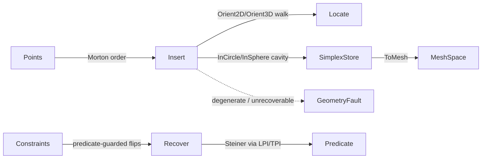

# [RASM_TESSELLATION_DELAUNAY]

The author-kernel constrained Delaunay owner that closes 2D triangulation and 3D tetrahedralization over ONE `Tessellation` `[Union]` (`Triangulation`/`Tetrahedralization`) built by incremental Bowyer-Watson insertion driven by the `numerics/predicates#ROBUST_PREDICATES` exact `InCircle`/`InSphere` predicate, with constraint-edge and facet recovery by predicate-guarded flips. No external geometry library is admitted (Triangle/TetGen are GPL and rejected), so the point-location walk, the cavity re-triangulation, the empty-circumsphere restoration, and the constraint recovery are authored from first principles over a flat `SimplexStore` value layout. The page owns the `TessellationKind` discriminant (binding the sibling-owned `GeometryKeyPolicy` string-key comparer), the `SimplexStore` struct-of-arrays simplex memory, the `Tessellation` `[Union]` with its `Build`/`Insert`/`Recover` rail, the `Constraint` segment/facet inputs the recovery enforces, and the `ToMesh` projection that re-emits the triangulated result as a `Vectors` `MeshSpace` at the in-process seam.

The owner composes `Vectors` `Point3d`/`Vector3d`/`MeshSpace` coordinates as settled vocabulary — read, compose, never re-mint — and rides the `Predicate` exact-sign floor so the in-circle/in-sphere flip decision never flips on a cocircular/cospherical degeneracy; it operates on raw `double` only at the `Predicate` seam (coordinates are the domain's native scalar) and constructed Steiner-point insertion routes the `numerics/predicates` indirect LPI/TPI predicate family for exact-sign stability without a rounded materialized coordinate. Every failure routes the band-2400 `GeometryFault` union; the kernel computes no hash and mints no second identity. The `SimplexStore` is the hash-friendly immutable record the `topology/reconciliation#NAMING_HASH` `Encode` content-addresses through the `MeshSpace` projection; this owner content-addresses nothing itself.

## [1]-[INDEX]

| [INDEX] | [CLUSTER]    | [OWNS]                                                                          |
| :-----: | :----------- | :----------------------------------------------------------------------------- |
|   [1]   | TESSELLATION | `Tessellation` `[Union]` (`Triangulation`/`Tetrahedralization`) over one `SimplexStore`; the Bowyer-Watson `Insert` cavity fold driven by the exact `InCircle`/`InSphere` predicate; constraint segment/facet `Recover` by predicate-guarded flips; `ToMesh` projection |

## [2]-[TESSELLATION]

- Owner: `TessellationKind` `[SmartEnum<string>]` the dimensional discriminant (`triangulation`/`tetrahedralization`) binding the sibling-owned `GeometryKeyPolicy` (`faults/faults#FAULT_BAND`) as its string-key comparer carrying the per-kind simplex-arity column (a triangle is 3 vertices, a tetrahedron 4); `SimplexStore` the struct-of-arrays flat simplex memory every insertion mutates and every walk reads — `Vertices`/`Neighbours` are `arity*capacity` slot arrays (the super-simplex vertices occupy the highest indices, a `-1` neighbour slot marks a hull face), `Dead` plus the free list reuse a carved-cavity simplex slot; `Tessellation` `[Union]` `Triangulation`/`Tetrahedralization` carrying that one store plus the inserted `Point3d[]` vertex payload and the bounding super-simplex; `Constraint` the closed segment/facet recovery input (`Segment` for a 2D constrained edge, `Facet` for a 3D constrained face); `SimplexFlip` the predicate-guarded local flip the recovery and the empty-circum restoration share; `ToMesh` the projection re-emitting the result as a `Vectors` `MeshSpace`.
- Cases: `TessellationKind` rows `triangulation` · `tetrahedralization` (2); `Tessellation` cases `Triangulation` · `Tetrahedralization` (2); `Constraint` cases `Segment` · `Facet` (2).
- Entry: `public static Fin<Tessellation> Build(TessellationKind kind, ReadOnlySpan<Point3d> points, Seq<Constraint> constraints, TessellationPolicy policy)` — the ONE build entrypoint discriminating by `TessellationKind` value, `Fin<T>` routing a band-2400 `GeometryFault.DegenerateInput` when the point set is empty, carries a non-finite coordinate, or is fully degenerate (all collinear in 2D, all coplanar in 3D — no valid simplex exists); `public Fin<Tessellation> Insert(Point3d vertex)` is the incremental Bowyer-Watson insertion (locate the containing simplex, carve the in-circum cavity, re-triangulate the cavity star against the vertex) re-establishing the Delaunay property locally; `public Fin<Tessellation> Recover(Seq<Constraint> constraints)` enforces every constraint segment/facet into the mesh by predicate-guarded flips, `Fin<T>` routing `GeometryFault.UnrepairableMesh` when a constraint cannot be recovered within the flip budget without a Steiner point. No `BuildTriangulation`/`BuildTetrahedralization` sibling entrypoints — one polymorphic `Build` discriminates by kind.
- Auto: `Build` seeds the store with a bounding super-simplex enclosing every input point, then folds `Insert` over the point sequence in a spatially-coherent order (Morton-sorted by the same 30-bit Z-order bit-spread the `spatial/index#SPATIAL_INDEX` octree builder uses, authored locally for insertion order so a near-by walk starts from the last-inserted simplex), and finally folds `Recover` over the constraint sequence and strips the super-simplex-incident simplices. Each `Insert` locates the containing simplex by a straight-walk guided by the exact `Predicate.Orient2D`/`Orient3D` sign (a walk step crosses the face whose orientation sign places the query on the far side, never a float in/out guess), carves the cavity as the connected set of simplices whose circum-disk/sphere contains the new vertex (the exact `Predicate.InCircle`/`InSphere` verdict — `Sign.Positive` is strictly inside, so a cocircular/cospherical point is on the boundary and the flip is decided by the exact sign, never an epsilon ball), re-triangulates the cavity boundary star against the vertex, and patches the neighbour links so the store stays a valid simplicial complex. `Recover` walks each constraint: a `Segment` absent from the current edge set is forced by flipping the diagonal of every quadrilateral the segment crosses, each flip guarded by the exact `InCircle` sign so a flip never produces a non-Delaunay sliver the next insertion must undo; a `Facet` recovery in 3D recovers its boundary segments first, then its interior by the predicate-guarded 2-3/3-2 bistellar flips. A constructed Steiner point (a segment crossing that cannot recover by flips alone) routes its insertion through the `numerics/predicates` indirect LPI/TPI predicate so the constructed point's in-circum sign is exact without a rounded coordinate. The empty-circumcircle/sphere property is restored after every insertion by the same `SimplexFlip` the recovery uses, so one flip algebra serves both the Delaunay restoration and the constraint recovery — never two flip surfaces.
- Receipt: none on the query rail — the `Tessellation` value IS the result the `ToMesh` projection re-emits; the build/insert/recover rail returns the tessellation itself, and the `SimplexStore` IS the hash-friendly immutable record the reconciliation `Encode` content-addresses through the `MeshSpace` projection.
- Packages: `Rasm`/Vectors (`Point3d`/`Vector3d`/`MeshSpace` — composed for vertex geometry and the result projection), `Rasm.Geometry.Numerics` (`Predicate` `InCircle`/`InSphere`/`Orient2D`/`Orient3D` and the planned indirect LPI/TPI predicates — the exact-sign floor, composed never re-minted), `Rasm.Geometry` (`GeometryKeyPolicy` string-key comparer — composed, never re-minted), Thinktecture.Runtime.Extensions, LanguageExt.Core, BCL inbox.
- Growth: a new tessellation modality (a power/weighted Delaunay, an alpha-complex filter) is one `TessellationKind` row plus one `Tessellation` union case writing the shared `SimplexStore` — never a parallel triangulator class with a duplicated insertion surface (a third kind is admitted only by a charter amendment, never widened silently from this leaf page); a new constraint shape is one `Constraint` case plus one `Recover`-fold arm; a new insertion-order or quality knob is one column on `TessellationPolicy`; zero new surface.
- Boundary: the tessellation is the ONE polymorphic `Tessellation` `[Union]` and a `DelaunayTriangulator`/`DelaunayTetrahedralizer` sibling-class family each carrying its own `Insert`/`Flip`/`Locate` surface is the named density defect collapsed here onto one union over one `SimplexStore` — the two kinds differ ONLY in their simplex arity and the predicate dimension (`InCircle` vs `InSphere`, `Orient2D` vs `Orient3D`), never in the Bowyer-Watson cavity algebra, so `Insert`/`Recover`/`ToMesh` live on the union base and read the shared store kind-agnostically; the in-circum cavity test and the locate walk compose the `Predicate` exact-sign floor and a hand-rolled epsilon-tolerant in-circle determinant (instead of `Predicate.InCircle`/`InSphere`) is the named correctness defect — a cocircular point classified by a loosened float test produces a non-Delaunay sliver or a flipped cavity that the exact sign decides deterministically, exactly the non-robustness the predicate floor exists to eliminate; the constructed Steiner point rides the indirect LPI/TPI predicate so its in-circum sign is exact without a rounded coordinate and a rounded materialized intersection point fed back into a direct `InCircle` is the named precision-loss defect; the `SimplexFlip` is the ONE predicate-guarded flip the Delaunay restoration and the constraint recovery share and a separate `RestoreFlip`/`RecoverFlip` pair is the deleted form; `Build`/`Insert`/`Recover` are total over the `Fin` rail and a thrown exception on a degenerate point set or an unrecoverable constraint is forbidden — the defect routes `GeometryFault.DegenerateInput`/`UnrepairableMesh(...).ToError()` over the band-2400 union; the result re-emits the canonical hash-friendly `MeshSpace` the `topology/reconciliation#NAMING_HASH` `Encode` content-addresses and this owner mints NO second hash; the locate walk, the orientation tests, and the in-circum tests operate on raw `double` only at the `Predicate` seam because a coordinate is the domain's native scalar (a coordinate is not a unit-bearing quantity), and a `double` crossing a public tessellation signature outside a `Point3d` coordinate is the seam violation; the tessellation preserves capability — a constraint recovery splits via a Steiner point rather than discarding a constraint, so no recovery drops a constraint segment/facet to satisfy a flip budget.

```csharp signature
// --- [RUNTIME_PRELUDE] --------------------------------------------------------------------
using System;
using System.Collections.Generic;
using System.Linq;
using LanguageExt;
using LanguageExt.Common;
using Rasm.Geometry;
using Rasm.Geometry.Numerics;
using Rasm.Vectors;
using Rhino.Geometry;
using Thinktecture;
using static LanguageExt.Prelude;

namespace Rasm.Geometry.Tessellation;

// --- [TYPES] ------------------------------------------------------------------------------
[SmartEnum<string>]
[KeyMemberEqualityComparer<GeometryKeyPolicy, string>]
[KeyMemberComparer<GeometryKeyPolicy, string>]
public sealed partial class TessellationKind {
    public static readonly TessellationKind Triangulation     = new("triangulation", simplexArity: 3, predicateDimension: 2);
    public static readonly TessellationKind Tetrahedralization = new("tetrahedralization", simplexArity: 4, predicateDimension: 3);

    public int SimplexArity { get; }
    public int PredicateDimension { get; }
}

// --- [CONSTANTS] --------------------------------------------------------------------------
public sealed record TessellationPolicy(int MaxFlipPasses, int MaxRecoverySteiner, double SuperSimplexScale) {
    public static readonly TessellationPolicy Canonical = new(MaxFlipPasses: 64, MaxRecoverySteiner: 1024, SuperSimplexScale: 1000.0);
}

// --- [MODELS] -----------------------------------------------------------------------------
public sealed record SimplexStore(
    int Count,
    int[] Vertices,
    int[] Neighbours,
    bool[] Dead,
    Stack<int> FreeList) {
    public int SimplexCount => Count;

    public ReadOnlySpan<int> SimplexVertices(int simplex, int arity) => Vertices.AsSpan(arity * simplex, arity);

    internal int Spawn(int arity, ReadOnlySpan<int> vertices, ReadOnlySpan<int> neighbours) {
        int simplex = FreeList.Count > 0 ? FreeList.Pop() : Count;
        vertices.CopyTo(Vertices.AsSpan(arity * simplex, arity));
        neighbours.CopyTo(Neighbours.AsSpan(arity * simplex, arity));
        Dead[simplex] = false;
        return simplex;
    }

    internal void Kill(int simplex) { Dead[simplex] = true; FreeList.Push(simplex); }
}

[Union(ConversionFromValue = ConversionOperatorsGeneration.None)]
public abstract partial record Constraint {
    private Constraint() { }

    public sealed record Segment(int A, int B) : Constraint;
    public sealed record Facet(int[] Boundary) : Constraint;
}

// --- [OPERATIONS] -------------------------------------------------------------------------
[Union(ConversionFromValue = ConversionOperatorsGeneration.None)]
public abstract partial record Tessellation {
    private Tessellation() { }

    public sealed record Triangulation(SimplexStore Store, Point3d[] Vertices, int SuperBase) : Tessellation;
    public sealed record Tetrahedralization(SimplexStore Store, Point3d[] Vertices, int SuperBase) : Tessellation;

    public TessellationKind Kind =>
        Switch(
            triangulation:      static _ => TessellationKind.Triangulation,
            tetrahedralization: static _ => TessellationKind.Tetrahedralization);

    SimplexStore Store =>
        Switch(triangulation: static t => t.Store, tetrahedralization: static t => t.Store);

    Point3d[] Vertices =>
        Switch(triangulation: static t => t.Vertices, tetrahedralization: static t => t.Vertices);

    public static Fin<Tessellation> Build(TessellationKind kind, ReadOnlySpan<Point3d> points, Seq<Constraint> constraints, TessellationPolicy policy) {
        if (points.Length == 0)
            return Fin.Fail<Tessellation>(GeometryFault.DegenerateInput("tessellation-build:empty"));
        Point3d[] pts = points.ToArray();
        return toSeq(pts).ForAll(static p => p.IsValid)
            ? Seed(kind, pts, policy)
                .Bind(seed => Delaunay.InsertionOrder(pts).Fold(Fin.Succ(seed), (acc, v) => acc.Bind(t => t.Insert(pts[v]))))
                .Bind(filled => filled.Recover(constraints))
                .Map(recovered => recovered.StripSuper())
            : Fin.Fail<Tessellation>(GeometryFault.DegenerateInput("tessellation-build:non-finite-coordinate"));
    }

    public Fin<Tessellation> Insert(Point3d vertex) {
        int arity = Kind.SimplexArity;
        return Locate(vertex).Bind(simplex => {
            (Seq<int> cavity, Seq<(int Simplex, int Face)> star) = Cavity(simplex, vertex, arity);
            return cavity.IsEmpty
                ? Fin.Fail<Tessellation>(GeometryFault.DegenerateInput($"tessellation-insert:empty-cavity:{vertex}"))
                : Fin.Succ(Retriangulate(cavity, star, vertex, arity));
        });
    }

    public Fin<Tessellation> Recover(Seq<Constraint> constraints) =>
        constraints.Fold(Fin.Succ(this), (acc, c) => acc.Bind(t => t.RecoverOne(c)));

    public Fin<MeshSpace> ToMesh(Context tolerance) {
        Mesh mesh = new();
        foreach (Point3d v in Vertices) mesh.Vertices.Add(v);
        int arity = Kind.SimplexArity;
        for (int s = 0; s < Store.SimplexCount; s++)
            if (!Store.Dead[s] && !TouchesSuper(s, arity))
                AddSimplexFaces(mesh, Store.SimplexVertices(s, arity));
        mesh.RebuildNormals();
        return MeshSpace.Of(mesh, tolerance);
    }

    // --- [LOCATE]
    Fin<int> Locate(Point3d query) {
        int arity = Kind.SimplexArity;
        int current = LastLive(arity);
        for (int step = 0; step < Store.SimplexCount + 1; step++) {
            int exit = ExitFace(current, query, arity);
            if (exit < 0) return Fin.Succ(current);
            int next = Store.Neighbours[arity * current + exit];
            if (next < 0) return Fin.Fail<int>(GeometryFault.DegenerateInput($"tessellation-locate:hull-exit:{query}"));
            current = next;
        }
        return Fin.Fail<int>(GeometryFault.DegenerateInput($"tessellation-locate:walk-overrun:{query}"));
    }

    int ExitFace(int simplex, Point3d query, int arity) {
        ReadOnlySpan<int> vs = Store.SimplexVertices(simplex, arity);
        for (int f = 0; f < arity; f++)
            if (Kind == TessellationKind.Triangulation
                ? Predicate.Orient2D(Vertices[vs[(f + 1) % 3]], Vertices[vs[(f + 2) % 3]], query) == Sign.Negative
                : Predicate.Orient3D(Vertices[vs[(f + 1) % 4]], Vertices[vs[(f + 2) % 4]], Vertices[vs[(f + 3) % 4]], query) == Sign.Negative)
                return f;
        return -1;
    }

    // --- [CAVITY]
    (Seq<int> Cavity, Seq<(int Simplex, int Face)> Star) Cavity(int seed, Point3d vertex, int arity) {
        HashSet<int> cavity = [];
        var star = new List<(int, int)>();
        var stack = new Stack<int>();
        stack.Push(seed);
        while (stack.Count > 0) {
            int s = stack.Pop();
            if (!cavity.Add(s)) continue;
            for (int f = 0; f < arity; f++) {
                int neighbour = Store.Neighbours[arity * s + f];
                if (neighbour >= 0 && !cavity.Contains(neighbour) && InCircum(neighbour, vertex, arity) == Sign.Positive)
                    stack.Push(neighbour);
                else
                    star.Add((s, f));
            }
        }
        return (toSeq(cavity), toSeq(star));
    }

    Sign InCircum(int simplex, Point3d query, int arity) {
        ReadOnlySpan<int> vs = Store.SimplexVertices(simplex, arity);
        return Kind == TessellationKind.Triangulation
            ? Predicate.InCircle(Vertices[vs[0]], Vertices[vs[1]], Vertices[vs[2]], query)
            : Predicate.InSphere(Vertices[vs[0]], Vertices[vs[1]], Vertices[vs[2]], Vertices[vs[3]], query);
    }

    // --- [STORE_OPS]
    static Fin<Tessellation> Seed(TessellationKind kind, Point3d[] points, TessellationPolicy policy);
    Tessellation Retriangulate(Seq<int> cavity, Seq<(int Simplex, int Face)> star, Point3d vertex, int arity);
    Fin<Tessellation> RecoverOne(Constraint constraint);
    Tessellation StripSuper();
    int LastLive(int arity);
    bool TouchesSuper(int simplex, int arity);
    static void AddSimplexFaces(Mesh mesh, ReadOnlySpan<int> vertices);
}

public static class Delaunay {
    public static Seq<int> InsertionOrder(Point3d[] points) {
        BoundingBox box = new(points);
        Vector3d span = box.Max - box.Min;
        uint[] codes = Array.ConvertAll(points, p => Morton(
            Normalize(p.X, box.Min.X, span.X), Normalize(p.Y, box.Min.Y, span.Y), Normalize(p.Z, box.Min.Z, span.Z)));
        return toSeq(Enumerable.Range(0, points.Length).OrderBy(i => codes[i]));
    }

    static uint Morton(uint x, uint y, uint z) => Expand10(x) | (Expand10(y) << 1) | (Expand10(z) << 2);

    static uint Expand10(uint v) {
        v &= 0x3FF;
        v = (v | (v << 16)) & 0x030000FF;
        v = (v | (v << 8)) & 0x0300F00F;
        v = (v | (v << 4)) & 0x030C30C3;
        v = (v | (v << 2)) & 0x09249249;
        return v;
    }

    static uint Normalize(double value, double min, double span) =>
        span <= double.Epsilon ? 0u : (uint)Math.Clamp((int)(1023.0 * (value - min) / span), 0, 1023);
}
```



## [3]-[DENSITY_BAR]

One owner per axis; capability is a case, row, or fold arm, never a sibling surface. The `[RAIL]` cell names the one return rail each owner exposes — `Fin`/`GeometryFault` where a build/insert/recover can fail its post-condition, pure carriers for the projection.

| [INDEX] | [AXIS/CONCERN]   | [OWNER]         | [KIND]                                                                          | [RAIL]                                          | [CASES] |
| :-----: | :--------------- | :-------------- | :----------------------------------------------------------------------------- | :--------------------------------------------- | :-----: |
|   [1]   | Tessellation     | `Tessellation`  | `[Union]` (`Triangulation`/`Tetrahedralization`) over one `SimplexStore` + `Build`/`Insert`/`Recover`/`ToMesh` | `Tessellation.Build → Fin<Tessellation>`       |    2    |
|  [1a]   | Dimensional kind | `TessellationKind` | `[SmartEnum<string>]` triangulation/tetrahedralization + simplex-arity/predicate-dimension columns | discriminant (pure)                            |    2    |
|  [1b]   | Recovery input   | `Constraint`    | `[Union]` (`Segment`/`Facet`) folded by one `Recover`                           | carrier (read in `Recover` rail)               |    2    |

The `Build`/`Insert`/`Recover` rail, the exact-predicate-guarded `Locate`/`ExitFace`/`Cavity`/`InCircum` walk, and the `ToMesh` projection are transcription-complete pure-managed fences over one `SimplexStore` SoA layout composing the `numerics/predicates` exact-sign floor. The `[STORE_OPS]` cluster (`Seed` super-simplex construction, `Retriangulate` cavity-star coning + neighbour patch, `RecoverOne` constraint flip, `StripSuper`, `LastLive`, `TouchesSuper`, `AddSimplexFaces`) is signature-fixed with its body the algorithm the `[BOWYER_WATSON_DELAUNAY]` and `[CONSTRAINT_RECOVERY]` contracts specify — `Seed`/`Retriangulate`/`StripSuper`/`LastLive`/`TouchesSuper`/`AddSimplexFaces` are pure-managed transcription targets over the shared store, and `RecoverOne`'s Steiner-point flip robustness is held on the `INDIRECT_PREDICATES` LPI/TPI predicate family landing in `numerics/predicates.md`. None depends on a live-host member spelling beyond the stable native `Mesh` surface the topology sibling already pins.

## [4]-[RESEARCH]

- [BOWYER_WATSON_DELAUNAY] — the `Insert` body is the incremental Bowyer-Watson cavity insertion: locate the containing simplex by the exact `Predicate.Orient2D`/`Orient3D`-guided straight-walk, flood the in-circum cavity by the exact `Predicate.InCircle`/`InSphere` `Sign.Positive` verdict, cone the cavity-boundary star to the new vertex, and patch the neighbour links. The empty-circumcircle/sphere property is the correctness anchor the tier-2 law-matrix (`DelaunayLaws`, a CsCheck property suite under `testing-cs`) proves against a `System.Numerics.BigInteger` exact Delaunay oracle: after every insertion no other vertex lies strictly inside any simplex's circum-disk/sphere (the exact in-circum sign agrees with the rational oracle on every cocircular/cospherical perturbation), the triangulation is a valid simplicial complex (neighbour links are reciprocal, no overlap), and the result is invariant under a rigid transform of the input. The kernel is total by construction over the `Fin` rail and needs NO live-host probe — `Point3d`, the `Predicate` floor, and the `Morton` order are stable.
- [CONSTRAINT_RECOVERY] — the `Recover` body forces every constraint `Segment`/`Facet` by predicate-guarded flips: a missing segment flips the diagonal of each quadrilateral it crosses (each flip guarded by the exact `InCircle` sign so a flip never produces a sliver the next insertion must undo), a facet recovers its boundary segments then its interior by 2-3/3-2 bistellar flips. A crossing that cannot recover by flips alone routes a Steiner point whose constructed coordinate is evaluated through the `numerics/predicates` indirect LPI/TPI predicate (`INDIRECT_PREDICATES`) so the constructed point's in-circum sign is exact without a rounded materialized coordinate. The law-matrix asserts every constraint is present in the recovered complex (a recovered segment is an edge of the complex, a recovered facet's boundary is a face cycle), the recovery terminates within the flip/Steiner budget on a feasible constraint set, and an infeasible constraint (a segment crossing a fixed prior constraint with no Steiner room) routes `GeometryFault.UnrepairableMesh`. The constrained-Delaunay correctness depends on `INDIRECT_PREDICATES` landing the LPI/TPI implicit-point predicate family — the Steiner-point flip robustness is the one residual held until that predicate family is authored in `numerics/predicates.md`.
- [TESSELLATION_CONSUMERS] — the tessellation substrate ALIGNS to three sibling consumers through their own owners, never by coupling into the triangulator's interior: the `healing/repair#HEALING` `SelfIntersectResolve` retriangulates an offending face as a local fan today and consumes a real Delaunay re-mesh of the offending patch once this owner lands (restoring the empty-circumcircle property across the patch, not a single-vertex fan); the boolean-arrangement tier-3 gate (`healing/repair#BOOLEAN_NATIVE_ASSET`) consumes the constrained tetrahedralization as the arrangement substrate the cell-classification rides; the AEC-domain fabrication/nesting packages consume `ToMesh` through the `Vectors` `MeshSpace` seam. Each consumer reaches the owner through `Build`/`ToMesh`, never by reading the interior `SimplexStore` — the alignment is a future wire on the consuming task, never a coupling edit into this page.
