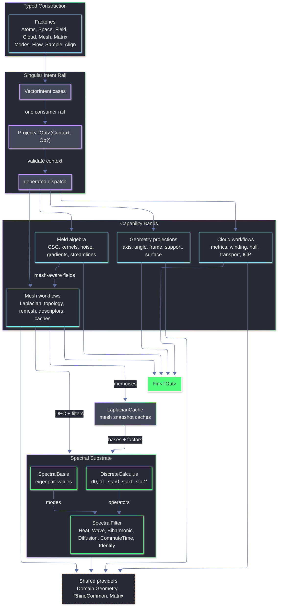

# Rasm.Vectors Architecture

## TODO

### Implementation Order

1. `[implemented][session-sized]` Extraction rail truth landed for the current slice: domain admission is `SupportSpace` / `MeshSpace` / `VectorCloud`, sample policies route through `SampleKind`, native contour receipts preserve raw accepted/rejected counts, mesh scalar isolines use a local PL kernel, and Flow events expose endpoint/bracket status. Static vector tests cover managed rails; Rhino runtime bridge checks remain deferred unless explicitly reopened.
2. `[next][session-sized]` Matrix receipts and solve ownership: fix CSparse symmetric admission, add solve/eigen receipts, and move QR least-squares from `Align.cs` / `Cloud.cs` into `Matrix.cs`.
3. `[next][session-sized]` Cloud, alignment, and transport diagnostics: add `CloudCorrespondenceSet`, deepen computed `SinkhornReceipt`, propagate existing weighted mass, and keep true GICP unsupported.
4. `[next][session-sized]` Mesh and spectral receipts: add topology, feature, flatten, remesh, descriptor receipts, scalar-isoline diagnostics, and truthful raw-vs-normalized descriptor status.
5. `[next][session-sized]` Sampling, domains, and modes: deepen sample receipts, add weighted/scalar-density/adaptive sampling, add native surface/curve frame projections with explicit policy, and keep static tests off native-only Rhino runtime behavior.
6. `[next][session-sized]` Field, kernels, and SDFs: add kernel profiles, anisotropic kernels, non-duplicative SDF primitives, SDF receipts, and defer RBF/MLS until matrix receipts are in place.

### Missing Categories

- `[native-routed][implemented-for-current-slice][partial]` `Extraction.cs`: domain-backed glyph/grid/bundle sampling, mesh scalar isolines, surface `IsoStatus`, point-cloud section curves, and raw native contour receipt counts are implemented. Brep native contours inherit Rhino document/default tolerance because RhinoWIP exposes no context-tolerance overload; optional bridge proof should own runtime behavior if reopened.
- `[partial]` Receipts: `StreamlineTrace` now carries explicit event kind/status metadata, `ExtractionReceipt` reports status plus raw/valid/rejected contour counts, and `SampleReceipt` is still intentionally count-only. `AlignmentReceipt`, `SinkhornReceipt`, and solver receipts remain shallow; add fields only from values kernels already compute.
- `[missing]` Correspondences: add `CloudCorrespondence` / `CloudCorrespondenceSet` once, then feed it from ICP matching and Sinkhorn coupling. Confidence remains optional until a kernel computes it.
- `[partial]` Weighted geometry: `WeightedCluster` exists; weighted centroid/covariance, transport, density, and sampling still need mass propagation. Do not add a second weight owner.
- `[partial]` Extraction domains: public domain ownership collapsed to `SupportSpace`, `MeshSpace`, and `VectorCloud`; `ExtractionDomain.Of` admits raw curve/surface/Brep through `SupportSpace.Of`. Boundary domains and richer domain-owned density/admission policies remain incomplete.

### Intent And Projection Gaps

- `[implemented-for-current-slice][partial]` `Intent.cs`: sample, contour, glyph, grid, and stream-bundle intents route through `ExtractionDomain + SampleKind` under `VectorIntent.Project<TOut>`. Remaining validation work belongs to broader factories not touched by this extraction slice.
- `[implemented-for-current-slice][partial]` Streamline projection: `Curve` output, localized event point, richer trace health, and event kind/status metadata exist. Event-stopped polyline/curve projection replaces the overshoot endpoint with the localized event point; dense output remains missing and localization is bounded bisection/chord evaluation, not RK dense output.
- `[implemented-for-current-slice][partial]` Sample projection: sampling is no longer mesh-only and projects `Seq<Point3d>`, `PointCloud`, `VectorCloud`, and `SampleReceipt` through one `SampleKind` execution. Non-mesh domains support count-backed policies only; Poisson length/area density, spacing stats, density error, and convergence metadata remain future work.
- `[partial]` Feature projection: dihedral/boundary edge pairs exist, but classified `Line` / `Curve` / grouped polyline outputs and `FeatureReceipt` are missing. Boundary classification should be factual before ridge/valley expansion.
- `[partial]` Flatten projection: UV flattening exists through `MeshUnwrapper`; remapped mesh and `FlattenReceipt` are missing. Receipt should report UV count, boundary pins, validity, and distortion only when computed.
- `[partial]` Descriptor projection: raw spectral descriptor values exist; descriptor metadata and comparison-ready normalization are missing. `SpectralFilter.Wave` remains a raw spectral filter until WKS energy/bandwidth normalization lands.
- `[partial]` Topology projection: tuple output exists; `TopologyReceipt` with counts, boundary loops, nonmanifold edges, optional genus, and Euler validation is missing.

### Flow And Numerical Integration

- `[implemented]` `Flow.cs`: preserve current Runge-Kutta tableaus and method-order / embedded-order metadata; `Order` is method order and `StageCount` is separate.
- `[partial]` `ButcherTableau`: structural validation covers row sums, primary/embedded weight sums, and abscissae. Higher-order moment consistency remains future work.
- `[implemented]` Adaptive stepping: store embedded-pair order and exponent per method because Bogacki-Shampine 3(2), Cash-Karp 5(4), and Dormand-Prince 5(4) do not share one truthful metadata model.
- `[implemented-for-current-slice][partial]` Event handling: surface/region localization uses bounded bisection, admits residuals against tolerance, sets localized termination points, and distinguishes initial/previous/current endpoint touches from strict bracketed crossings. Cross-surface now requires signed-distance-capable support and uses model absolute tolerance; RK dense-output coefficients remain future work.
- `[implemented-for-current-slice][partial]` Trace receipts: method order, embedded order, errors, min/max step, termination point, event values, event kind, and event status exist. Product layers still need wording that treats localization as bounded bisection, not exact dense output.

### Fields, Kernels, And SDFs

- `[native-routed][partial][threading-risk]` `Field.cs`: iso-surface routes through intent/extraction, but public `ScalarField.IsoSurface` still owns the Rhino callback. Rhino WIP evaluates the callback in parallel, so receipts must label fixed-tolerance/parallel native behavior until constrained or runtime-proven.
- `[missing]` `KernelKind`: add a radial profile with value, first derivative, and second derivative; keep `Weight` as `Profile.Value`. Current `Weight`-only API remains insufficient for truthful kernel gradients/Laplacians.
- `[missing]` Kernels: add anisotropic kernels through explicit metric/tensor ownership, not a parallel kernel model. This should feed facade grain, stretched influence, and tensor-guided falloff.
- `[missing]` Reconstruction: add RBF/MLS after matrix solve receipts exist. Receipt must state interpolation vs approximation, smoothing, sample count, residual, and nonconvergence.
- `[partial]` SDF primitives: existing primitives cover several massing cases; add only half-space, slab, capped/profile extrusion, and oriented prism if composition cannot express them. Do not duplicate rounded box.
- `[partial]` SDF outputs: `ScalarField.LipschitzBound()` exists and mesh-backed signing routes through generalized winding / boundary-source signed heat. Watertight preflight, lossy fallback, approximate preview status, and explicit SDF receipts remain missing.

### Mesh And Spectral Operators

- `[implemented-for-current-slice][partial]` `Mesh.cs`: per-vertex scalar isolines exist as local PL mesh contours with payload-length admission, finite-level validation, Rhino quad triangulation, edge interpolation, exact-edge dedupe, plateau rejection, branch-safe stitching, and stitched candidate counts. Rich plateau/branch diagnostics and runtime bridge proofs remain future work.
- `[partial]` Mesh features: raw dihedral/boundary edge pairs exist; ridge/valley/crease/boundary/region-boundary geometry outputs and `FeatureReceipt` are missing.
- `[missing]` Mesh segmentation: scalar contour payload now exists, but threshold regions, region growing, watershed-like bands, and descriptor clustering remain unimplemented. Build them only after receipts expose enough factual region diagnostics.
- `[partial]` Mesh diagnostics: `LaplacianCache` exists, but cache hit/factorization/residual/eigenpair/fallback receipts do not. Robust tufted Laplacian, flipped signpost vector heat, closed SignedHeat, runtime scalar-isoline geometry proof, and true tangent log-map remain unsupported.
- `[partial]` Spectral descriptors: raw filters exist; descriptor metadata, normalization, comparison, and ranking are missing. Genus-positive trivial connections remain unsupported until harmonic handling lands.
- `[partial]` Remesh outputs: native remesh returns mesh only; `RemeshReceipt` with target length, reduction ratio, validity, hard-edge preservation, and topology-change summary is missing.

### Clouds, Alignment, And Transport

- `[partial]` `Cloud.cs`: deepen `SinkhornReceipt` with coupling summaries, source/target residual semantics, numeric status, and correspondence summaries without adding fields the current kernel does not compute.
- `[partial]` `Cloud.cs`: propagate existing weighted clusters into neighbourhood graphs, k-nearest/radius graph outputs, and local density estimates because current internals already need those concepts.
- `[missing]` `Cloud.cs`: add 2D hull, concave outline, footprint wrapper, and alpha-style outputs with explicit unsupported/fallback receipts. Current hull support is 3D convex only.
- `[partial][approximate]` `Align.cs`: receipt has transform, count, RMSE, statistical median residual, and final delta; mode-specific diagnostics and quantiles are missing. Current symmetric ICP is a normal-sum linearized approximation, not true GICP; future correspondences should project from the existing matching pass.
- `[missing]` `Align.cs`: expose correspondences and per-point residual vectors from the existing matching pass. Always resolve native IDs through `PointCloud.PointAt(index)`.
- `[partial]` `Transport`: coupling, distance, receipt, and transported cloud exist; correspondences, residuals, and weighted payload transfer remain missing. Product IDs and module attributes stay outside this library.

### Sampling And Domain Coverage

- `[missing]` `Sample.cs`: add weighted and scalar-field-driven sampling so density maps, facade gradients, and programmatic priorities control population.
- `[implemented-for-current-slice][partial]` `Sample.cs`: sampling routes through `ExtractionDomain` for explicit samples, mesh policies, support count-backed sampling, and deterministic cloud-vertex candidates. Explicit receipts can report all-rejected samples without forcing cloud output success; boundary domains, non-mesh Poisson density, and scalar/weighted sampling remain future work.
- `[missing]` `Sample.cs`: add density-function blue-noise and adaptive sampling where local spacing follows scalar-field intensity or curvature.
- `[partial]` `Sample.cs`: `SampleReceipt` only carries attempted/emitted/rejected counts, now from the same sample execution used by glyph/grid/bundle output projection. Add spacing stats, density error, iteration count, convergence stop, and domain status only when kernels compute them.

### Modes, Matrices, And Product Boundary

- `[partial]` `Modes.cs`: curvature projection exists and `SurfaceProjection.Normal` now routes directly through native `Surface.NormalAt`, but metric, Jacobian, area scale, UV frame, and explicit curve normal/binormal policy projections are missing. Continue using native `Surface.Evaluate`, `FrameAt`, `NormalAt`, `CurvatureAt`, and `Curve.PerpendicularFrameAt` directly.
- `[partial]` `Matrix.cs`: sparse solve metadata exists only shallowly, dense inverse now validates finite output, and dense/factorized/spectral/generalized paths still need `SolveReceipt` / `EigenSolveReceipt`. Next collapse should move duplicated QR least-squares from `Align.cs` / `Cloud.cs` into `Matrix.cs` and keep CSparse one-triangle admission covered by real off-diagonal solve tests.
- `[partial]` Receipts and failures: several paths still use raw values or sentinel-style fallback. Model nonconvergence, unsupported topology, invalid factorization, missing native capability, lossy fallback, and approximate output through `Fin<T>` failures or typed statuses.
- `[implemented]` Product boundary: no UI, preview conduits, bake commands, GH2 parameter wrappers, or command receipts belong in `Rasm.Vectors`. Keep returning typed geometry, weights, coupling, correspondences, residuals, and factual diagnostics only.

`Rasm.Vectors` is the typed vector geometry and numerics layer over RhinoCommon geometry, MathNet linear algebra, CSparse.NET sparse Cholesky, LanguageExt result rails, and Thinktecture-generated dispatch. Factories create atoms, spaces, fields, clouds, matrices, meshes, and intent cases; `VectorIntent.Project<TOut>(Context, Op?)` remains the singular consumer rail for executing an intent into a requested output shape. `Spectral.cs` is the shared substrate owning DEC operator assembly, spectral basis values, FEM heat-method scaffolding, the Crouzeix-Raviart connection Laplacian (Stein-Wardetzky-Jacobson-Grinspun 2020), the Crane-Desbrun-Schröder trivial-connection 1-form, and the polymorphic `SpectralFilter` algebra consumed by both mesh descriptors and scalar spectral fields. `Mesh.cs` owns `LaplacianCache`, which memoises spectral bases and factorisations per mesh snapshot.

## Ownership

- `Intent.cs`: `VectorIntent` cases, factories, context validation, dispatch delegation.
- `Atoms.cs`: dimensions, magnitudes, axes, angles, directions, spans, frames, cones, relations, `Direction.ParallelTransport(Seq<Plane>)`.
- `Modes.cs`: curve / surface / cone / pose projection selectors; `SurfaceProjection.ShapeOperator` projects Rhino `SurfaceCurvature` into a `SymmetricMatrix`.
- `Space.cs`: `SupportSpace`, `SurfaceSpace`, `SupportProjection`, signed distance, containment, closest-hit projection.
- `Field.cs`: scalar/vector/tensor field algebra (CSG blending, falloff, kernels, noise, finite difference). Mesh-aware extensions: `ScalarField` adds `Geodesic`, `MeanCurvatureFlow`, `SpectralDistance`, scalar `LogMap` routing to heat-geodesic distance, `Stripe`, and `SignedDistanceFromMesh`; `VectorField` adds `CrossField`, one `Hodge` case carrying `BoundarySense`, `VectorHeat`, and `GeodesicTangent`.
- `Flow.cs`: validated Runge-Kutta tableaus, fixed/adaptive integration, streamline state, termination predicates, and `StreamlineTrace` projection receipts.
- `Cloud.cs`: cloud construction (Ring / Polyline / Cluster / WeightedCluster), `VectorCloudMetric` SmartEnum (PCA, oriented normals, principal curvature, curvedness, shape index), plus separate intent rails for winding, hull, and transport. `CloudKernel.Sinkhorn` uses log-domain scaling; `massRelaxation` changes KL marginal penalties over validated normalized masses.
- `Sample.cs`: canonical `SampleKind` owner for explicit points, mesh-surface policies, support count-backed sampling, deterministic cloud candidates, and `SampleReceipt`.
- `Align.cs`: cloud alignment -- `AlignKind` SmartEnum admits `Point`, `Plane`, `Symmetric` (Rusinkiewicz 2019 with oriented normal sum), `Robust` (MAD-scaled Welsch IRLS), and `NormalWeightedPointToPlane`.
- `Mesh.cs`: mesh snapshots, local PL scalar isolines, `LaplacianCache` (cotangent / IDT / explicitly unsupported robust Laplacian, scalar Cholesky factor, parametric scalar-heat / vector-connection / edge-connection Cholesky caches via `Atom<HashMap>`, spectral basis, mean edge length, mesh-invariant SHM φ via `Lazy<Fin<Arr<double>>>`, and typed per-kernel `Atom<HashMap<TKey, Fin<TValue>>>` caches for geodesic / MCF / cross-field / Hodge / vector-heat with structurally-equal record keys), `MeshLaplacian` SmartEnum (`Cotangent`, `IntrinsicDelaunay`, `Robust`), `MeshDescriptor` Union (single `SpectralCase`), `IntrinsicMesh` (post-IDT-flip frozen edge index + face-edge map + face areas + first-incident-edge per vertex), topology, features, remesh kernels, Hodge, vector heat, geodesic tangent, stripe, cross-field, triangle solid-angle winding SDF, and boundary-source SignedHeat kernels.
- `Matrix.cs`: dense and sparse matrix models, MathNet conversion, dense decompositions, BiCGStab sparse solves with MathNet direct-solve fallback, sparse Hermitian products, local LOBPCG eigensolves, and `CholeskySparse` for CSparse.NET-backed SPD-intended factorisation with typed factorisation failure.
- `Spectral.cs`: `DiscreteCalculus` (DEC operators `d0`, `d1`, `star0` barycentric/lumped mass, `star1`, `star2`), `SpectralBasis` eigenpair values, `SpectralFilter` algebra, FEM heat scaffold, Crouzeix-Raviart connection Laplacian, `ComputeIntrinsicStar1`, and CDS 2010 holonomy distribution over intrinsic incidence operators.

## Invariants

- `VectorIntent.Project<TOut>(Context, Op?)` is the only consumer projection rail.
- `ExtractionDomain + SampleKind` is the only sampling/extraction rail for sample, glyph, grid, stream-bundle, contour, and sample receipt projections; no parallel sample-source union exists.
- `Spectral.cs` owns DEC operators, spectral basis values, `SpectralFilter` dispatch + partial-monoid `Compose`, FEM heat scaffolding, the Crouzeix-Raviart edge connection Laplacian for SHM, and the CDS holonomy 1-form for trivial connections. Mesh-owned `LaplacianCache` memoises `SpectralBasisOf(k)` and downstream factors. Field and Mesh route spectral queries through this single substrate.
- `MeshDescriptor` is a single `SpectralCase` parameterised by `SpectralFilter` and optional source set. HKS and WKS route through `Heat` and `Wave`; `Identity` exposes raw spectral signatures and is not a full ShapeDNA implementation.
- `MeshLaplacian` admits `Cotangent`, `IntrinsicDelaunay`, and `Robust`; `Robust` currently returns typed `Unsupported` until a true Sharp-Crane tufted cover lands.
- `LaplacianCache` exposes lazy `Cotangent`, `IntrinsicDelaunay`, `Robust`, `Cholesky` (mass-pinned SPD-intended regularisation), `IntrinsicMeshSnapshot` (post-flip frozen `IntrinsicMesh` with stable edge index), boundary-source `SignedHeat`, default and parametric spectral bases, connection/scalar/edge Cholesky caches, and typed `Atom<HashMap<TKey, Fin<TValue>>>` memoisers keyed by structurally-equal records.
- Vector heat uses cached CSparse Cholesky solves for the connection, magnitude, and indicator heat systems; recovery remains approximate and rejects flipped intrinsic meshes until signpost transport exists.
- Constrained cross-field is available on unflipped intrinsic meshes only; flipped intrinsic edges return typed `Unsupported` until signpost transport is implemented.
- Trivial connections (CDS 2010, closed genus-0 default) use intrinsic incidence operators and `ValidateGaussBonnet`; bounded meshes return invalid-input faults.
- SignedHeat is boundary-source and unflipped-only. Closed/no-boundary meshes and flipped intrinsic meshes return typed failures; the exact paper-faithful closed-surface variant remains unimplemented.
- `Field.ScalarField` extends a continuous scalar with mesh-aware cases that delegate to `MeshKernel`. `VectorField` extends with mesh-aware Hodge decomposition, vector heat, geodesic tangent, and cross-field with constrained / cone variants.
- `Cloud.CloudKernel.Sinkhorn` accepts `Option<PositiveMagnitude>` for unbalanced transport over normalized cluster masses and measures relaxed convergence by scaling change.
- Greenfield renames (no shims): `IterationCap` -> `MaxIterations`, `EigenpairCount` -> `Pairs`, `TargetEdge` -> `TargetLength`, `Sigma` -> `Spread`, `Unbiased` -> `Debiased`.
- Domain owns shared Rhino geometry normalization and `ClosestHit`.
- Vectors owns vector-specific intent, polymorphic field algebra, cloud metrics, mesh operators, sampling, alignment, and spectral substrate.
- RhinoCommon provides native geometry, closest queries, transforms, convex hulls, mesh reduction, remeshing, mesh unwrap, normals, marching-cubes isosurface, point-in-solid, and surface-curvature principal directions via `SurfaceCurvature`.
- MathNet owns dense decompositions, dense direct solve fallback, sparse products, BiCGStab iteration, and local LOBPCG primitives.
- CSparse.NET 4.3.0 owns cached sparse Cholesky factorisation with AMD ordering and Span-based solve for SPD-intended systems.
- Local kernels exist only where dependencies do not expose the required algorithm.

## Potential Use Cases And Value

`Rasm.Vectors` is a downstream design-geometry kernel for Rhino WIP and GH2. It turns design intent into typed points, vectors, curves, meshes, frames, scalar fields, transforms, descriptors, and diagnostics through `VectorIntent.Project<TOut>(Context, Op?)`.

### Intent And Projection Rails

- Build one GH2 component family around `VectorIntent` instead of one-off commands for each vector operation.
- Expose typed dropdown modes from SmartEnums (`SupportProjection`, `CurveProjection`, `SurfaceProjection`, `MeshLaplacian`, `SampleKind`, `AlignKind`, `RemeshKind`).
- Project the same intent into alternate outputs: `Point3d`, `Vector3d`, `Plane`, `Curve`, `Polyline`, `Mesh`, scalar values, matrices, transforms, and descriptor values.
- Surface predictable `Fin<TOut>` failures in Rhino/GH UI without exceptions or silent fallback geometry.
- Share the same projection vocabulary between command plugins, GH2 components, and future app-layer tools.

### Placement, Snapping, And Support Geometry

- Place panels, fixtures, annotations, profiles, furniture-scale design objects, and facade modules onto Breps, meshes, curves, planes, and point clouds.
- Generate tangent frames, normals, signed distances, containment distances, UV values, support parameters, mesh points, and component metadata at picked locations.
- Create surface-aware handles that move objects along support geometry while preserving local frame orientation.
- Build proximity masks, clearance previews, inside/outside classifiers, and design-envelope checks from signed distance and containment projections.
- Convert selected Rhino geometry into reusable `SupportSpace` and `SurfaceSpace` inputs for downstream fields, sampling, routing, and alignment.

### Frames, Rails, And Curve-Based Design

- Generate stable section frames along rails for ribs, louvers, mullions, fins, stair strings, handrails, pipes, and ceiling baffles.
- Use Frenet, Bishop, tangent, curvature, arc-length, and parallel-transport frames to avoid orientation flips on long curves.
- Orient repeated components along paths with explicit angle pivots, signed axes, spans, cones, and vector relations.
- Build sweep-ready profile frames for facade ribs, contour-following strips, ceiling tracks, and sculptural rails.
- Evaluate curvature-driven local behavior for path smoothing, section rotation, and component spacing.

### Field-Driven Layout And Patterning

- Create attractor, repulsor, vortex, Coulomb, dipole, harmonic, saddle, helical, ring, curl-noise, and cross-product design fields.
- Turn vector fields into streamlines for circulation sketches, facade flow lines, floor inlays, ceiling tracks, and generated path curves.
- Drive aperture density, screen porosity, perforation radius, tile scale, fixture spacing, lighting density, and ornamental intensity from scalar fields.
- Combine gradients, curls, divergences, Laplacians, clamps, scales, blends, and warps into controllable design fields.
- Split fields with Hodge decomposition into gradient-like behavior and circulation-like behavior for simple UI controls.

### Implicit Massing And Soft Boolean Geometry

- Model concept solids from SDF primitives: sphere, box, capsule, cylinder, cone, capped cone, torus, hex prism, octahedron, and ellipsoid.
- Blend, union, subtract, intersect, round, onion, elongate, displace, twist, and bend implicit volumes for early massing studies.
- Generate Rhino meshes from scalar iso-surfaces for blob massing, carved voids, inflated envelopes, clearance solids, and smooth transitions.
- Use mesh signed-distance fields to preview offsets, shrink-wrap behavior, proximity coloring, and inside/outside styling.
- Route watertight mesh signing through generalized winding or signed-heat policy instead of ad-hoc point-in-solid guesses.

### Surface And Mesh Pattern Systems

- Generate facade panel directions, seam candidates, tile rotation, hatch grain, surface stripes, and anisotropic module orientation from cross-fields.
- Interpolate designer strokes over meshes with vector heat for louver direction, panel rotation, surface grain, and facade flow.
- Use tensor fields and principal curvature directions for curvature-responsive ornament, rib direction, panel alignment, and surface grain.
- Build stripe, band, contour, and wave families from scalar fields, geodesic fields, and spectral filters.
- Apply cone and hint constraints to cross-fields for controlled singularities and design-authored orientation anchors.

### Geodesic Routing And Surface Distance

- Compute heat geodesic, spectral distance, scalar log-map distance, and geodesic-tangent behavior over mesh surfaces; true tangent log-map coordinates remain deferred.
- Route seams, cables, wayfinding marks, projected measurements, surface traces, and on-surface paths across curved forms.
- Create distance-to-source scalar previews for zoning, panel influence, local falloff, and surface-aware selection.
- Convert scalar geodesic output into contour-ready bands, isoline sources, or placement weights for downstream tools.
- Cache mesh-local factors so repeated source edits reuse the same `LaplacianCache` substrate.

### Sampling, Population, And Distribution

- Distribute anchors, panels, lights, apertures, seats, paving marks, acoustic nodes, and facade modules across mesh surfaces.
- Select Poisson disk, farthest-point, Lloyd, optimized, or capacity sampling depending on uniformity, coverage, and density goals.
- Use sampled points as seeds for field traces, panel centers, fixture locations, perforation maps, and component placement.
- Preserve deterministic sampling behavior for repeatable GH definitions and command previews.
- Combine sampling with scalar fields to turn design intensity into population density once scalar/weighted sampling lands.

### Mesh Preparation, Flattening, And Descriptors

- Prepare meshes for design workflows with topology summaries, feature edges, remeshing, reduction, unwrap, and flattening.
- Generate fabrication previews, unrolled pattern studies, panel layout sheets, and texture-coordinate working surfaces.
- Use cotangent and intrinsic-Delaunay Laplacians as selectable mesh-operator policies; robust nonmanifold Laplacian is typed unsupported until tufted cover is implemented.
- Compute spectral descriptors for shape matching, option comparison, ornament families, and similarity sliders.
- Reuse intrinsic mesh snapshots for connection Laplacian, cone holonomy, signed heat, cross-field, vector-heat, and Hodge workflows.

### Point Clouds, Alignment, And As-Built Workflows

- Align scans, imported context, reference layouts, module kits, and repeated facade parts with point, plane, symmetric, robust, and normal-weighted point-to-plane ICP.
- Extract best-fit planes, principal axes, principal frames, covariance, spread, curvature, curvedness, shape index, and oriented normals.
- Build quick design diagnostics for sampled geometry: local direction, compactness, anisotropy, footprint shape, and surface-like behavior.
- Generate hulls, rough envelopes, footprint wrappers, containment regions, and selection boundaries from point or ring inputs.
- Use robust alignment and cloud metrics as preflight checks before baking component arrays or matching as-built fragments.

### Transport, Morphing, And Layout Transfer

- Transfer point distributions between facade options, surface versions, module families, and sampled design layouts.
- Use unbalanced Sinkhorn transport to relax normalized weighted marginal constraints between alternatives.
- Morph landmark layouts, aperture maps, panel centers, fixture plans, and ornamental seed sets between design states.
- Compare alternatives by correspondence cost, transport plan structure, and distribution mismatch.
- Use transport output as a bridge from analysis-like point sets back into editable design geometry.

### Rhino/GH Product Surfaces

- `Project Intent`: single component or command for projecting `VectorIntent` into requested Rhino-native output.
- `Support Projection`: closest point, tangent, normal, signed distance, containment, UV, frame, and component projections.
- `Sample Mesh`: Poisson, farthest, optimize, Lloyd, and capacity sampling with preview and bake paths.
- `Trace Streamline`: vector-field seeds to curves or polylines with fixed/adaptive integration and termination modes.
- `Cross Field`: mesh plus hints/cones to directional panel, stripe, or tile orientation fields.
- `SDF IsoSurface`: primitive and mesh-backed scalar fields to Rhino mesh output.
- `Mesh Distance`: heat geodesic, spectral distance, scalar log-map distance, stripe, and signed-distance previews.
- `Align Clouds`: scan or module point sets to transforms with residual/convergence display.
- `Transport Cloud`: remap point distributions between surfaces, options, or facade states.
- `Mesh Prep`: topology, feature edges, remesh, reduce, unwrap, flatten, and spectral descriptor workflows.

### Productization Boundaries

- App UI, preview conduits, bake commands, GH2 parameter wrappers, and user-facing receipts live outside `Rasm.Vectors`.
- Brep-heavy workflows need a canonical meshing or parameterization intake before mesh-only kernels run.
- Advanced solvers benefit from exposed convergence and cache diagnostics for designer-facing feedback.
- Cross-field cone flows need preflight guidance for topology, boundaries, and cone charge validity.
- Contour and isoline extraction from scalar fields now has a local mesh PL rail; richer scalar-field contour receipts and runtime Rhino proofs remain productization work.
