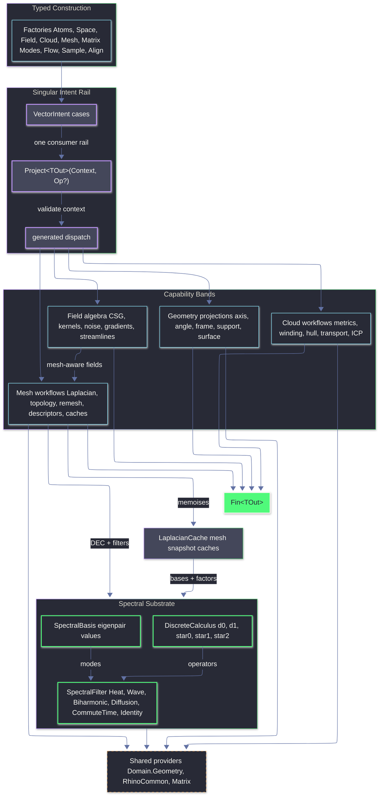

# Rasm.Vectors Architecture

`Rasm.Vectors` is the typed vector geometry and numerics layer over RhinoCommon geometry, MathNet linear algebra, CSparse.NET sparse Cholesky, LanguageExt result rails, and Thinktecture-generated dispatch. Factories create atoms, spaces, fields, clouds, matrices, meshes, and intent cases; `VectorIntent.Project<TOut>(Context, Op?)` remains the singular consumer rail for executing an intent into a requested output shape. `Spectral.cs` is the shared substrate owning DEC operator assembly, spectral basis values, FEM heat-method scaffolding, the Crouzeix-Raviart connection Laplacian (Stein-Wardetzky-Jacobson-Grinspun 2020), the Crane-Desbrun-Schröder trivial-connection 1-form, and the polymorphic `SpectralFilter` algebra consumed by both mesh descriptors and scalar spectral fields. `Mesh.cs` owns `LaplacianCache`, which memoises spectral bases and factorisations per mesh snapshot.

## Ownership

- `Intent.cs`: `VectorIntent` cases, factories, context validation, dispatch delegation.
- `Atoms.cs`: dimensions, magnitudes, axes, angles, directions, spans, frames, cones, relations, shared raw-output projection, and `Direction.ParallelTransport(Seq<Plane>)`.
- `Modes.cs`: curve / surface / cone / pose projection selectors; shared `AtomProjection.Raw` output projection for curve, surface, and cone raw values; `SurfaceProjection.ShapeOperator` projects Rhino `SurfaceCurvature` into a `SymmetricMatrix`.
- `Space.cs`: `SupportSpace`, `SurfaceSpace`, `SupportProjection`, signed distance, containment, closest-hit projection.
- `Field.cs`: scalar/vector/tensor field algebra (CSG blending, falloff, kernels, noise, finite difference). Mesh-aware extensions: `ScalarField` adds `Geodesic`, `MeanCurvatureFlow`, `SpectralDistance`, `Stripe`, and `SignedDistanceFromMesh`; `VectorField` adds `CrossField`, one `Hodge` case carrying `BoundarySense`, `VectorHeat`, `GeodesicTangent`, and vector-heat-backed `TangentLogMap`.
- `Flow.cs`: validated Runge-Kutta tableaus, fixed/adaptive integration, streamline state, termination predicates, and `StreamlineTrace` projection receipts.
- `Cloud.cs`: cloud construction (Ring / Polyline / Cluster / WeightedCluster), `VectorCloudMetric` SmartEnum (PCA, oriented normals, principal curvature, curvedness, shape index), plus separate intent rails for winding, hull, and transport. `CloudKernel.Sinkhorn` uses `CloudTransportPolicy` and log-domain scaling; policy mass relaxation changes KL marginal penalties over validated normalized masses.
- `Sample.cs`: canonical `SampleKind` owner for explicit points, mesh-surface policies, support count-backed sampling, deterministic cloud candidates, weighted/density candidate selection, and `SampleReceipt`.
- `Align.cs`: cloud alignment -- `AlignKind` SmartEnum admits `Point`, `Plane`, `Symmetric` (Rusinkiewicz 2019 with oriented normal sum), `Robust` (MAD-scaled Welsch IRLS), `NormalWeightedPointToPlane`, and `Generalized` (PCA-backed Mahalanobis GICP with nonlinear SE(3) line search).
- `Mesh.cs`: mesh snapshots, local PL scalar isolines, `LaplacianCache` (cotangent / IDT / tufted-intrinsic, scalar Cholesky factor, parametric scalar-heat / vector-connection / edge-connection Cholesky caches via `Atom<HashMap>`, spectral basis with cache-hit facts, mean edge length, mesh-invariant boundary-source SHM phi plus source/heat/Poisson receipts, policy-keyed closed `VolumeGrid` SHM solves, and typed per-kernel `Atom<HashMap<TKey, TValue>>` success-only caches for geodesic / MCF / cross-field / Hodge / vector-heat / signed heat with structurally-equal record keys), `MeshLaplacian` SmartEnum (`Cotangent`, `IntrinsicDelaunay`, `TuftedIntrinsic`), `MeshDescriptor` Union (single `SpectralCase`), `MeshSegmentation` Union, `IntrinsicMesh` (post-IDT-flip frozen edge index + face-edge map + face areas + first-incident-edge per vertex), topology, features, remesh kernels, Hodge, vector heat, geodesic tangent, stripe, cross-field, triangle solid-angle winding SDF, boundary-source SignedHeat kernels, and closed regular-grid SignedHeat kernels.
- `Matrix.cs`: dense and sparse matrix models, MathNet conversion, dense decompositions, dense QR least-squares, BiCGStab sparse solves with MathNet QR fallback receipts, sparse Hermitian products, local LOBPCG eigensolves without hidden dense fallback, solve/eigen receipts, and `CholeskySparse` for CSparse.NET-backed SPD-intended factorisation with typed factorisation failure.
- `Spectral.cs`: `DiscreteCalculus` (DEC operators `d0`, `d1`, `star0` barycentric/lumped mass, `star1`, `star2`), optional signpost-style transport receipt facts, optional harmonic one-form basis receipts, `SpectralBasis` eigenpair values, `SpectralFilter` algebra, FEM heat scaffold, Crouzeix-Raviart connection Laplacian, `ComputeIntrinsicStar1`, and CDS 2010 holonomy distribution over intrinsic incidence operators.

## Invariants

- `VectorIntent.Project<TOut>(Context, Op?)` is the only consumer projection rail.
- `ExtractionDomain + SampleKind` is the only sampling/extraction rail for sample, glyph, grid, stream-bundle, contour, and sample receipt projections; no parallel sample-source union exists.
- `Spectral.cs` owns DEC operators, spectral basis values, `SpectralFilter` dispatch + partial-monoid `Compose`, FEM heat scaffolding, the Crouzeix-Raviart edge connection Laplacian for SHM, and the CDS holonomy 1-form for trivial connections. Mesh-owned `LaplacianCache` memoises `SpectralBasisOf(k)` and downstream factors. Field and Mesh route spectral queries through this single substrate.
- `MeshDescriptor` is a single `SpectralCase` parameterised by `SpectralFilter` and optional source set. HKS-like heat signatures and WKS-style normalized wave kernels route through `Heat` and `Wave`; `Identity` exposes raw spectral signatures and is not a full ShapeDNA implementation.
- `MeshLaplacian` admits `Cotangent`, `IntrinsicDelaunay`, and `TuftedIntrinsic`. The current tufted rail is mollified/IDT/collapsed cotan assembly with logical cover receipt counts; it is not yet the full Sharp-Crane side-glued front/back cover contract.
- `LaplacianCache` exposes caller-keyed success-only `Cotangent`, `IntrinsicDelaunay`, `TuftedIntrinsic`, `Cholesky` (mass-pinned SPD-intended regularisation), intrinsic and tufted intrinsic snapshots (post-flip frozen `IntrinsicMesh` with stable edge index), boundary-source signed heat values plus topology/source/heat/Poisson receipts, closed `VolumeGrid` SignedHeat values plus topology/grid/operator/interpolation/Poisson receipts when that rail succeeds, default and parametric spectral bases with cache-hit and truncated eigenpair facts, connection/scalar/edge Cholesky caches, and success-only typed `Atom<HashMap<TKey, TValue>>` memoisers keyed by structurally-equal records.
- Vector heat uses cached CSparse Cholesky solves for the connection, magnitude, and indicator heat systems; recovery remains approximate. Signpost-style receipts exist, but exact common-subdivision transport consumption over flipped snapshots is still open.
- Constrained cross-field is available on unflipped intrinsic meshes only; flipped intrinsic edges remain unsupported until the signpost transport substrate is consumed by the cross-field rail.
- Trivial connections (CDS 2010, closed genus-0 default) use intrinsic incidence operators and `ValidateGaussBonnet`; Rhino closed-mesh admission treats `GetNakedEdges() == null` as closed, and bounded meshes return invalid-input faults.
- `SdfMeshMethod.BoundarySignedHeat` is boundary-source and unflipped-only. Closed/no-boundary meshes use `SdfMeshMethod.ClosedSurfaceSignedHeat` through `SdfMeshPolicy.ClosedSignedHeat(...)`; the public factory only admits grid, heat, solver, and sign policy because interpolation and boundary condition are fixed to trilinear regular-grid sampling with a pinned Neumann gauge. Default or constructor-bypassed policies fail admission, and open/non-solid/nonwatertight/unoriented meshes reject that rail before grid assembly. The closed rail is approximate regular-grid volumetric SHM over a finite padded domain, requires a strict-inside grid node for sign calibration, and does not claim exact Euclidean distance or tet FEM behavior; successful controlled closed runtime sampling is bridge-backed in `tests/csharp/libs/Rasm/Vectors/Scenarios/Vectors.cs`.
- `Field.ScalarField` extends a continuous scalar with mesh-aware cases that delegate to `MeshKernel`. `VectorField` extends with mesh-aware Hodge decomposition, vector heat, geodesic tangent, tangent log-map approximation, and cross-field with constrained / cone variants.
- `Cloud.CloudKernel.Sinkhorn` accepts `CloudTransportPolicy` for balanced/unbalanced transport over normalized cluster masses and measures relaxed convergence by scaling change.
- Greenfield canonical names have no shims: `MaxIterations`, `MaxIterationsExhausted`, `RegionThresholdCrossing`, `Pairs`, `TargetLength`, `Spread`, and `Debiased`.
- Domain owns shared Rhino geometry normalization and `ClosestHit`.
- Vectors owns vector-specific intent, polymorphic field algebra, cloud metrics, mesh operators, sampling, alignment, and spectral substrate.
- RhinoCommon provides native geometry, closest queries, transforms, convex hulls, mesh reduction, remeshing, mesh unwrap, normals, marching-cubes isosurface, point-in-solid, and surface-curvature principal directions via `SurfaceCurvature`.
- MathNet owns dense decompositions, dense LU/QR solve primitives, sparse products, BiCGStab iteration, MathNet QR fallback solve projection, and local LOBPCG primitives.
- CSparse.NET owns cached sparse Cholesky factorisation with AMD ordering and Span-based solve for SPD-intended systems.
- Local kernels exist only where dependencies do not expose the required algorithm.

## Potential Use Cases And Value

`Rasm.Vectors` is a downstream design-geometry kernel for Rhino WIP and GH2. It turns design intent into typed points, vectors, curves, meshes, frames, scalar fields, transforms, descriptors, and diagnostics through `VectorIntent.Project<TOut>(Context, Op?)`.

### Intent And Projection Rails

- Build one GH2 component family around `VectorIntent` instead of one-off commands for each vector operation.
- Expose typed dropdown modes from SmartEnums (`SupportProjection`, `CurveProjection`, `SurfaceProjection`, `MeshLaplacian`, `SampleKind`, `AlignKind`, `RemeshKind`).
- Project the same intent into alternate outputs: `Point3d`, `Vector3d`, `Plane`, `Curve`, `Polyline`, `Mesh`, scalar values, matrices, transforms, and descriptor values.
- Surface predictable `Fin<TOut>` failures in Rhino/GH UI without exceptions or silent fallback geometry.
- Share the same projection vocabulary between command plugins, GH2 components, and future app-layer tools.

### Placement, Snapping, And Support Geometry

- Place panels, fixtures, annotations, profiles, furniture-scale design objects, and facade modules onto Breps, meshes, curves, planes, and point clouds.
- Generate tangent frames, normals, signed distances, containment distances, UV values, support parameters, mesh points, and component metadata at picked locations.
- Create surface-aware handles that move objects along support geometry while preserving local frame orientation.
- Build proximity masks, clearance previews, inside/outside classifiers, and design-envelope checks from signed distance and containment projections.
- Convert selected Rhino geometry into reusable `SupportSpace` and `SurfaceSpace` inputs for downstream fields, sampling, routing, and alignment.

### Frames, Rails, And Curve-Based Design

- Generate stable section frames along rails for ribs, louvers, mullions, fins, stair strings, handrails, pipes, and ceiling baffles.
- Use Frenet, Bishop, tangent, curvature, arc-length, and parallel-transport frames to avoid orientation flips on long curves.
- Orient repeated components along paths with explicit angle pivots, signed axes, spans, cones, and vector relations.
- Build sweep-ready profile frames for facade ribs, contour-following strips, ceiling tracks, and sculptural rails.
- Evaluate curvature-driven local behavior for path smoothing, section rotation, and component spacing.

### Field-Driven Layout And Patterning

- Create attractor, repulsor, vortex, Coulomb, dipole, harmonic, saddle, helical, ring, curl-noise, and cross-product design fields.
- Turn vector fields into streamlines for circulation sketches, facade flow lines, floor inlays, ceiling tracks, and generated path curves.
- Drive aperture density, screen porosity, perforation radius, tile scale, fixture spacing, lighting density, and ornamental intensity from scalar fields.
- Combine gradients, curls, divergences, Laplacians, clamps, scales, blends, and warps into controllable design fields.
- Split fields with Hodge decomposition into gradient-like behavior and circulation-like behavior for simple UI controls.

### Implicit Massing And Soft Boolean Geometry

- Model concept solids from SDF primitives: sphere, box, capsule, cylinder, cone, capped cone, torus, hex prism, octahedron, and ellipsoid.
- Blend, union, subtract, intersect, round, onion, elongate, displace, twist, and bend implicit volumes for early massing studies.
- Generate Rhino meshes from scalar iso-surfaces for blob massing, carved voids, inflated envelopes, clearance solids, and smooth transitions.
- Use mesh signed-distance fields to preview offsets, shrink-wrap behavior, proximity coloring, and inside/outside styling.
- Route watertight mesh signing through generalized winding or signed-heat policy instead of ad-hoc point-in-solid guesses.

### Surface And Mesh Pattern Systems

- Generate facade panel directions, seam candidates, tile rotation, hatch grain, surface stripes, and anisotropic module orientation from cross-fields.
- Interpolate designer strokes over meshes with vector heat for louver direction, panel rotation, surface grain, and facade flow.
- Use tensor fields and principal curvature directions for curvature-responsive ornament, rib direction, panel alignment, and surface grain.
- Build stripe, band, contour, and wave families from scalar fields, geodesic fields, and spectral filters.
- Apply cone and hint constraints to cross-fields for controlled singularities and design-authored orientation anchors.

### Geodesic Routing And Surface Distance

- Compute heat geodesic, spectral distance, stripe distance, geodesic-tangent behavior, vector-heat-backed tangent log-map approximations, and exact straightest-geodesic exponential/log maps (with receipt-witnessed path residuals) over mesh surfaces.
- Route seams, cables, wayfinding marks, projected measurements, surface traces, and on-surface paths across curved forms.
- Create distance-to-source scalar previews for zoning, panel influence, local falloff, and surface-aware selection.
- Convert scalar geodesic output into contour-ready bands, isoline sources, or placement weights for downstream tools.
- Cache mesh-local factors so repeated source edits reuse the same `LaplacianCache` substrate.

### Sampling, Population, And Distribution

- Distribute anchors, panels, lights, apertures, seats, paving marks, acoustic nodes, and facade modules across mesh surfaces.
- Select Poisson disk, farthest-point, Lloyd, optimized, or capacity sampling depending on uniformity, coverage, and density goals.
- Use sampled points as seeds for field traces, panel centers, fixture locations, perforation maps, and component placement.
- Preserve deterministic sampling behavior for repeatable GH definitions and command previews.
- Combine sampling with scalar fields to turn design intensity into population density through the current discrete candidate-density rails.

### Mesh Preparation, Flattening, And Descriptors

- Prepare meshes for design workflows with topology summaries, feature edges, remeshing, reduction, unwrap, and flattening.
- Generate fabrication previews, unrolled pattern studies, panel layout sheets, and texture-coordinate working surfaces.
- Use cotangent, intrinsic-Delaunay, and tufted-intrinsic receipt-backed Laplacians as selectable mesh-operator policies; full side-glued nonmanifold tufted robustness is future work, not a declared current rail.
- Compute spectral descriptors for shape matching, option comparison, ornament families, and similarity sliders.
- Reuse intrinsic mesh snapshots for connection Laplacian, cone holonomy, signed heat, cross-field, vector-heat, and Hodge workflows.

### Point Clouds, Alignment, And As-Built Workflows

- Align scans, imported context, reference layouts, module kits, and repeated facade parts with point, plane, symmetric, robust, and normal-weighted point-to-plane ICP.
- Extract best-fit planes, principal axes, principal frames, covariance, spread, curvature, curvedness, shape index, and oriented normals.
- Build quick design diagnostics for sampled geometry: local direction, compactness, anisotropy, footprint shape, and surface-like behavior.
- Generate hulls, rough envelopes, footprint wrappers, containment regions, and selection boundaries from point or ring inputs.
- Use robust alignment and cloud metrics as preflight checks before baking component arrays or matching as-built fragments.

### Transport, Morphing, And Layout Transfer

- Transfer point distributions between facade options, surface versions, module families, and sampled design layouts.
- Use unbalanced Sinkhorn transport to relax normalized weighted marginal constraints between alternatives.
- Morph landmark layouts, aperture maps, panel centers, fixture plans, and ornamental seed sets between design states.
- Compare alternatives by correspondence cost, transport plan structure, and distribution mismatch.
- Use transport output as a bridge from analysis-like point sets back into editable design geometry.

### Rhino/GH Product Surfaces

- `Project Intent`: single component or command for projecting `VectorIntent` into requested Rhino-native output.
- `Support Projection`: closest point, tangent, normal, signed distance, containment, UV, frame, and component projections.
- `Sample Mesh`: Poisson, farthest, optimize, Lloyd, and capacity sampling with preview and bake paths.
- `Trace Streamline`: vector-field seeds to curves or polylines with fixed/adaptive integration and termination modes.
- `Cross Field`: mesh plus hints/cones to directional panel, stripe, or tile orientation fields.
- `SDF IsoSurface`: primitive and mesh-backed scalar fields to Rhino mesh output.
- `Mesh Distance`: heat geodesic, spectral distance, stripe, and signed-distance previews.
- `Align Clouds`: scan or module point sets to transforms with residual/convergence display.
- `Transport Cloud`: remap point distributions between surfaces, options, or facade states.
- `Mesh Prep`: topology, feature edges, remesh, reduce, unwrap, flatten, and spectral descriptor workflows.

### Productization Boundaries

- App UI, preview conduits, bake commands, GH2 parameter wrappers, and user-facing receipts live outside `Rasm.Vectors`.
- Brep-heavy workflows need a canonical meshing or parameterization intake before mesh-only kernels run.
- Advanced solvers benefit from exposed convergence and cache diagnostics for designer-facing feedback.
- Cross-field cone flows need preflight guidance for topology, boundaries, and cone charge validity.
- Contour and isoline extraction from scalar fields now has a local mesh PL rail; richer plateau receipts, product contour integration, and runtime Rhino proofs remain productization work.
