# Rasm.Vectors Architecture

```mermaid
---
config:
  layout: elk
  look: neo
  theme: base
  themeVariables:
    background: "#282a36"
    primaryColor: "#44475a"
    primaryTextColor: "#f8f8f2"
    primaryBorderColor: "#bd93f9"
    lineColor: "#6272a4"
    secondaryColor: "#50fa7b"
    tertiaryColor: "#282a36"
    clusterBkg: "#282a36"
    clusterBorder: "#6272a4"
    edgeLabelBackground: "#282a36"
---
flowchart LR
    accTitle: Rasm.Vectors projection rail
    accDescr: Factories build typed vector values and VectorIntent cases. Project validates context, dispatches to owning vector modules, and returns Fin of the requested output.

    subgraph Build["Construction"]
        Values["Value models<br/>Atoms, Space, Field, Cloud, Matrix, Mesh"]
        Policies["Selectors<br/>Modes, Flow, Sample, Align"]
    end

    subgraph Rail["Intent Rail"]
        Intent["VectorIntent cases"] -->|single consumer rail| Project["Project&lt;TOut&gt;(Context, Op?)"]
        Project -->|validate Context + Op| Dispatch["Dispatch&lt;TOut&gt;"]
    end

    subgraph Owners["Owning Modules"]
        Atoms["Atoms<br/>primitive projection"]
        Modes["Modes<br/>curve, surface, cone, pose"]
        Space["Space<br/>support projection"]
        Field["Field<br/>field algebra"]
        Flow["Flow<br/>streamline trace"]
        Cloud["Cloud<br/>metrics, winding, hull, normals, transport"]
        Mesh["Mesh<br/>topology, fields, descriptors, remesh"]
        Sample["Sample<br/>mesh sampling"]
        Align["Align<br/>cloud alignment"]
    end

    subgraph Providers["Shared Providers"]
        Domain["Domain.Geometry<br/>ClosestHit"]
        Matrix["Matrix<br/>MathNet numerics"]
        Native["RhinoCommon<br/>native geometry ops"]
    end

    Values -->|shape inputs| Intent
    Policies -->|select behavior| Intent
    Dispatch -->|axis, angle, frame, vector ops| Atoms
    Dispatch -->|curve, surface, cone, pose modes| Modes
    Dispatch -->|closest, span, normal, distance| Space
    Dispatch -->|scalar, vector, tensor samples| Field
    Dispatch -->|streamline case| Flow
    Dispatch -->|cloud metrics, winding, hull, transport| Cloud
    Dispatch -->|flatten, topology, features, descriptors, remesh| Mesh
    Dispatch -->|sample case| Sample
    Dispatch -->|align case| Align

    Space -->|closest queries| Domain
    Field -->|mesh-backed fields| Mesh
    Sample -->|emits cluster| Cloud
    Align -->|normal estimation| Cloud
    Cloud -->|covariance, coupling projection| Matrix
    Mesh -->|sparse operators, eigensolves| Matrix
    Align -->|SVD and least squares| Matrix
    Cloud -->|hull| Native
    Mesh -->|unwrap, reduce, remesh| Native

    Atoms & Modes & Space & Field & Flow & Cloud & Mesh & Sample & Align -->|typed result| Result["Fin&lt;TOut&gt;"]

    classDef rail fill:#44475a,stroke:#bd93f9,color:#f8f8f2,stroke-width:2px
    classDef owner fill:#282a36,stroke:#8be9fd,color:#f8f8f2
    classDef provider fill:#282a36,stroke:#ffb86c,color:#f8f8f2,stroke-dasharray:5\,5
    classDef result fill:#50fa7b,stroke:#f8f8f2,color:#282a36,stroke-width:2px
    class Intent,Project,Dispatch rail
    class Atoms,Modes,Space,Field,Flow,Cloud,Mesh,Sample,Align owner
    class Domain,Matrix,Native provider
    class Result result
```

`Rasm.Vectors` is the typed vector geometry and numerics layer over RhinoCommon geometry, MathNet linear algebra, LanguageExt result rails, and Thinktecture-generated dispatch. Factories create atoms, spaces, fields, clouds, matrices, meshes, and intent cases; `VectorIntent.Project<TOut>(Context, Op?)` remains the singular consumer rail for executing an intent into a requested output shape.

## Ownership

- `Intent.cs`: `VectorIntent` cases, factories, context validation, and dispatch delegation.
- `Atoms.cs`: dimensions, magnitudes, axes, angles, directions, spans, frames, cones, and relations.
- `Modes.cs`: curve, surface, cone, and pose projection selectors.
- `Space.cs`: `SupportSpace`, `SurfaceSpace`, `SupportProjection`, signed distance, containment distance, and closest-hit projection.
- `Field.cs`: scalar/vector/tensor field algebra, SDFs, CSG blending, falloff, kernels, noise, and differential sampling.
- `Flow.cs`: Runge-Kutta tableaus, fixed/adaptive integration, streamline state, termination predicates, and trace execution.
- `Cloud.cs`: cloud construction, ring/polyline/cluster metrics, PCA, Bishop frames, winding, hull, normals, and Sinkhorn transport.
- `Sample.cs`: mesh-surface sampling: Poisson disk, farthest, optimize, Lloyd, and capacity.
- `Align.cs`: cloud alignment: ICP, Procrustes, point-to-plane, symmetric solve, robust weighting, and correspondence matching.
- `Mesh.cs`: mesh snapshots, laplacian/cache ownership, topology, features, scalar/vector mesh fields, descriptors, flattening, and remesh.
- `Matrix.cs`: dense/sparse matrix models, MathNet conversion, decompositions, iterative solves, sparse Hermitian products, and local eigen kernels.

## Invariants

- `VectorIntent.Project<TOut>(Context, Op?)` is the only consumer projection rail for intent execution.
- `Domain` owns shared Rhino geometry normalization and `ClosestHit`.
- `Vectors` owns vector-specific validity, support projection, field flow, cloud metrics, mesh operators, sampling, and alignment.
- RhinoCommon provides native geometry, closest queries, transforms, convex hulls, mesh reduction, remeshing, and mesh unwrap operations.
- MathNet owns dense and sparse numerical operations.
- Local kernels exist only where dependencies do not expose the required algorithm.
