# Rasm.Vectors Architecture

```mermaid
---
config:
  layout: elk
  look: neo
  theme: base
  themeVariables:
    background: "#282a36"
    primaryColor: "#44475a"
    primaryTextColor: "#f8f8f2"
    primaryBorderColor: "#bd93f9"
    lineColor: "#6272a4"
    secondaryColor: "#50fa7b"
    tertiaryColor: "#282a36"
    clusterBkg: "#282a36"
    clusterBorder: "#6272a4"
    edgeLabelBackground: "#282a36"
---
flowchart LR
    accTitle: Rasm.Vectors projection rail with spectral substrate
    accDescr: Factories build typed vector values and VectorIntent cases. Project validates context, dispatches to owning vector modules, and returns Fin of the requested output. Spectral.cs holds DEC operators, eigenpair cache, and spectral filter algebra shared by Mesh and Field.

    subgraph Build["Construction"]
        Values["Value models<br/>Atoms, Space, Field, Cloud, Matrix, Mesh"]
        Policies["Selectors<br/>Modes, Flow, Sample, Align"]
    end

    subgraph Rail["Intent Rail"]
        Intent["VectorIntent cases"] -->|single consumer rail| Project["Project&lt;TOut&gt;(Context, Op?)"]
        Project -->|validate Context + Op| Dispatch["Dispatch&lt;TOut&gt;"]
    end

    subgraph Owners["Owning Modules"]
        Atoms["Atoms<br/>directions, frames, parallel transport"]
        Modes["Modes<br/>curve / surface / cone / pose / shape operator"]
        Space["Space<br/>support projection, closest, distance"]
        Field["Field<br/>scalar / vector / tensor algebra<br/>Hodge, vector heat, log map, stripe, SDF"]
        Flow["Flow<br/>streamline trace, RK tableaus"]
        Cloud["Cloud<br/>metrics (PCA, principal curvature, curvedness)<br/>transport (unbalanced Sinkhorn), winding, hull"]
        Mesh["Mesh<br/>Laplacian (cotangent / IDT / robust)<br/>spectral basis, connection Laplacian, descriptors"]
        Sample["Sample<br/>Poisson disk, farthest, Lloyd, capacity"]
        Align["Align<br/>ICP (Point, Plane, Symmetric, Robust, GICP)"]
    end

    subgraph Spectral["Spectral Substrate"]
        Dec["DiscreteCalculus<br/>d0, d1, star0, star1, star2"]
        Basis["SpectralBasis<br/>eigenpairs cache"]
        Filter["SpectralFilter Union<br/>Heat | Wave | Biharmonic<br/>Diffusion | CommuteTime | Identity"]
        Dec --> Filter
        Basis --> Filter
    end

    subgraph Providers["Shared Providers"]
        Domain["Domain.Geometry<br/>ClosestHit, context, tolerances"]
        Matrix["Matrix<br/>MathNet + CSparse Cholesky"]
        Native["RhinoCommon<br/>geometry, normals, shape operator"]
    end

    Values -->|shape inputs| Intent
    Policies -->|select behavior| Intent
    Dispatch -->|axis, angle, frame, parallel transport| Atoms
    Dispatch -->|curve, surface, cone, pose, shape operator| Modes
    Dispatch -->|closest, span, normal, distance| Space
    Dispatch -->|scalar / vector / tensor / Hodge / heat / log map / stripe / SDF| Field
    Dispatch -->|streamline| Flow
    Dispatch -->|cloud metrics, curvature, transport, winding, hull| Cloud
    Dispatch -->|Laplacian, topology, features, descriptors, remesh| Mesh
    Dispatch -->|sample| Sample
    Dispatch -->|"align (Point / Plane / Symmetric / Robust / GICP)"| Align

    Space -->|closest queries| Domain
    Field -->|mesh-backed fields, Hodge, heat, log map| Mesh
    Mesh -->|Laplacian, spectral basis, DEC| Spectral
    Field -->|spectral distance, biharmonic, diffusion, HKS, WKS| Spectral
    Cloud -->|curvature via Modes shape operator| Modes
    Cloud -->|"transport (Sinkhorn unbalanced)"| Matrix
    Sample -->|emits cluster| Cloud
    Align -->|normal estimation, correspondence| Cloud
    Cloud -->|covariance, coupling| Matrix
    Mesh -->|sparse operators, eigensolves, Cholesky| Matrix
    Align -->|SVD, least squares, rigid decomposition| Matrix
    Cloud -->|hull| Native
    Mesh -->|unwrap, reduce, remesh, isosurface, unweld| Native
    Modes -->|Rhino normals, curvature| Native

    Atoms & Modes & Space & Field & Flow & Cloud & Mesh & Sample & Align -->|typed result| Result["Fin&lt;TOut&gt;"]

    classDef rail fill:#44475a,stroke:#bd93f9,color:#f8f8f2,stroke-width:2px
    classDef owner fill:#282a36,stroke:#8be9fd,color:#f8f8f2
    classDef spectral fill:#282a36,stroke:#50fa7b,color:#f8f8f2,stroke-width:2px
    classDef provider fill:#282a36,stroke:#ffb86c,color:#f8f8f2,stroke-dasharray:5\,5
    classDef result fill:#50fa7b,stroke:#f8f8f2,color:#282a36,stroke-width:2px
    class Intent,Project,Dispatch rail
    class Atoms,Modes,Space,Field,Flow,Cloud,Mesh,Sample,Align owner
    class Dec,Basis,Filter spectral
    class Domain,Matrix,Native provider
    class Result result
```

`Rasm.Vectors` is the typed vector geometry and numerics layer over RhinoCommon geometry, MathNet linear algebra, CSparse.NET sparse Cholesky, LanguageExt result rails, and Thinktecture-generated dispatch. Factories create atoms, spaces, fields, clouds, matrices, meshes, and intent cases; `VectorIntent.Project<TOut>(Context, Op?)` remains the singular consumer rail for executing an intent into a requested output shape. `Spectral.cs` is the shared substrate owning DEC operator assembly, the eigenpair cache, FEM heat-method scaffolding, the Crouzeix-Raviart connection Laplacian (Stein-Wardetzky-Jacobson-Grinspun 2020), the Crane-Desbrun-Schröder trivial-connection 1-form, and the polymorphic `SpectralFilter` algebra consumed by both mesh descriptors and scalar spectral fields.

## Ownership

- `Intent.cs`: `VectorIntent` cases, factories, context validation, dispatch delegation.
- `Atoms.cs`: dimensions, magnitudes, axes, angles, directions, spans, frames, cones, relations, `Direction.ParallelTransport(Seq<Plane>)`.
- `Modes.cs`: curve / surface / cone / pose projection selectors; `SurfaceProjection.ShapeOperator` projects Rhino `SurfaceCurvature` into `(k1, k2, e1, e2)`.
- `Space.cs`: `SupportSpace`, `SurfaceSpace`, `SupportProjection`, signed distance, containment, closest-hit projection.
- `Field.cs`: scalar/vector/tensor field algebra (CSG blending, falloff, kernels, noise, finite difference). Mesh-aware extensions: `ScalarField` adds `Geodesic`, `MeanCurvatureFlow`, `SpectralDistance`, `LogMap`, `Stripe`, `SignedDistanceFromMesh`; `VectorField` adds `CrossField` (with optional `Constraints` + `Cones`), `HodgeIrrotational`, `HodgeSolenoidal`, `VectorHeat`, `GeodesicTangent`. `SdfMeshMethod` SmartEnum selects between `GeneralizedWindingNumber` and `SignedHeat`.
- `Flow.cs`: Runge-Kutta tableaus, fixed/adaptive integration, streamline state, termination predicates.
- `Cloud.cs`: cloud construction (Ring / Polyline / Cluster), `VectorCloudMetric` SmartEnum (PCA, principal curvature, curvedness, shape index, winding, hull). `CloudKernel.Sinkhorn` supports unbalanced transport via `Option<PositiveMagnitude> massRelaxation`.
- `Sample.cs`: mesh-surface sampling -- Poisson disk, farthest, optimize, Lloyd, capacity.
- `Align.cs`: cloud alignment -- `AlignKind` SmartEnum admits `Point`, `Plane`, `Symmetric` (Rusinkiewicz 2019), `Robust` (Welsch IRLS), `Generalized` (Segal-Haehnel-Thrun GICP 2009).
- `Mesh.cs`: mesh snapshots, `LaplacianCache` (cotangent / IDT / robust Laplacian, scalar Cholesky factor, parametric scalar-heat / vector-connection / edge-connection Cholesky caches via `Atom<HashMap>`, spectral basis, mean edge length, mesh-invariant SHM φ via `Lazy<Fin<Arr<double>>>`, and typed per-kernel `Atom<HashMap<TKey, Fin<TValue>>>` caches for geodesic / MCF / cross-field / Hodge / vector-heat with structurally-equal record keys), `MeshLaplacian` SmartEnum (`Cotangent`, `IntrinsicDelaunay`, `Robust`), `MeshDescriptor` Union (single `SpectralCase`), `IntrinsicMesh` (post-IDT-flip frozen edge index + face-edge map + face areas + first-incident-edge per vertex — drives all intrinsic-edge-indexed kernels: connection Laplacian, cone holonomy α, SHM CR system), topology, features, remesh kernels, Hodge / vector heat (Sharp-Soliman-Crane 2019 real-2V Cholesky) / geodesic tangent / stripe / cross-field (GODF 2013 soft-penalty linear solve with hint encoding, CDS 2010 trivial-connection α applied per intrinsic edge) / SignedHeat (Feng-Crane 2024 via Crouzeix-Raviart edge connection Laplacian on the IDT edge set) kernels.
- `Matrix.cs`: dense and sparse matrix models, MathNet conversion, decompositions, iterative solves, sparse Hermitian products, local LOBPCG eigensolves, `CholeskySparse` (CSparse.NET-backed SPD factor with Span-based solve).
- `Spectral.cs`: `DiscreteCalculus` (DEC operators `d0`, `d1`, `star0`, `star1`, `star2`), `SpectralBasis` (eigenpairs cache), `SpectralFilter` Union (`Heat`, `Wave`, `Biharmonic`, `Diffusion`, `CommuteTime`, `Identity`) with unified `EvaluateFiltered` kernel and partial-monoid `Compose`, FEM heat scaffold (`BuildSourceDelta`, `PoissonTriplets`, `ComputeTriangleGradients`, `ComputeVertexDivergence`, intrinsic `ComputeIntrinsicVertexDivergence`), Crouzeix-Raviart connection Laplacian + face-barycenter sampling on the intrinsic-Delaunay edge set (Stein-Wardetzky-Jacobson-Grinspun 2020), `ComputeIntrinsicStar1` (per-edge cotangent weight shared by CDS holonomy and connection-Laplacian assembly), CDS 2010 holonomy distribution (`ComputeIntrinsicAngleDefects`, `DistributeHolonomy` returning α per intrinsic edge via primal closed 1-form + coexact Hodge solve, with intrinsic incidence operators in place of extrinsic DEC).

## Invariants

- `VectorIntent.Project<TOut>(Context, Op?)` is the only consumer projection rail.
- `Spectral.cs` owns DEC operators, eigenpair cache (`LaplacianCache.SpectralBasisOf`), `SpectralFilter` dispatch + partial-monoid `Compose`, FEM heat scaffolding, the Crouzeix-Raviart edge connection Laplacian for SHM, and the CDS holonomy 1-form for trivial connections. Multiple downstream consumers (Field, Mesh, Cloud) route spectral queries through this single substrate.
- `MeshDescriptor` is a single `SpectralCase` parameterised by `SpectralFilter` and optional source set. HKS / WKS / ShapeDNA = `Heat` / `Wave` / `Identity` filter cases respectively.
- `MeshLaplacian` admits `Cotangent`, `IntrinsicDelaunay`, `Robust` -- all route through `LaplacianCache`. `Robust` follows Sharp-Crane SGP 2020 (tufted cover via `Mesh.UnweldEdge` + intrinsic Delaunay flips on the locally-manifold cover).
- `LaplacianCache` exposes lazy `Cotangent`, `IntrinsicDelaunay`, `Robust`, `Cholesky` (mass-pinned SPD regularisation), `IntrinsicMeshSnapshot` (post-flip frozen `IntrinsicMesh` with stable edge index), `SignedHeat` (mesh-invariant SHM φ via `Lazy<Fin<Arr<double>>>`), `DefaultSpectralBasis` (32 pairs, truncatable), `SpectralBasisOf(k)` (parametric), `ConnectionCholesky(symmetry, time)` (cached real-2V SPD factor of `(M + t·L_conn)`), `ConnectionCholeskyAdjusted(symmetry, time, edgeAdjustment)` (uncached, used by cone-affected paths), `ScalarHeatCholesky(time)` (cached factor of `(M + t·L_cot)`), `EdgeConnectionCholesky(time)` (cached real-2|E| factor of `(M_CR + t·L_CR)` built on the intrinsic edge set for Feng-Crane SHM), and typed `Atom<HashMap<TKey, Fin<TValue>>>`-backed `Geodesic / Mcf / CrossField / Hodge / VectorHeat` memoisers keyed by structurally-equal record (`GeodesicKey`, `McfKey`, `CrossFieldKey`, `HodgeKey`, `VectorHeatKey`).
- Vector heat (Sharp-Soliman-Crane 2019): three solves on the cached factors give the per-vertex `X̄ · (φ/ψ)` recovery (direction × magnitude carrier ratio).
- Constrained cross-field (GODF 2013, λ_T = 0 canonical): per-vertex hint encoded as tangent complex raised to `nSym`, B-norm rescaled, RHS = `B·q̂`, solve via `ConnectionCholesky(symmetry, 1e9)` then per-vertex unit-normalise. Cone-affected variant adds CDS α via `ConnectionCholeskyAdjusted`.
- Trivial connections (CDS 2010, closed genus-0 default): build closed primal 1-form distributing `2π·k_v − K_v` per vertex onto one incident INTRINSIC edge, coexact solve `Lβ = d_intrinsic^T · diag(★₁_intrinsic) · u` via `LaplacianCache.Cholesky`, return α per intrinsic edge index (matching `IntrinsicMeshSnapshot.IndexOfEdge`). Flipped intrinsic edges are addressable; the prior extrinsic `TopologyEdges.GetEdgeIndex` lookup gap is closed. Bounded meshes return `Fault.InvalidInput`; consumers enforce Gauss-Bonnet `|Σ k_v − χ| < 1e-9` upstream.
- SignedHeat (Feng-Crane 2024 SIGGRAPH, Stein-Wardetzky-Jacobson-Grinspun 2020 CR operator): encode boundary as per-INTRINSIC-edge `length·i·sign(orientation)` in `X₀ ∈ ℂ^{|E|}` stacked real-2|E|, solve `(M_CR + t·L_CR) X_t = X_0` via `EdgeConnectionCholesky` (L_CR built on intrinsic edges ⇒ guaranteed Hermitian PSD ⇒ Cholesky always succeeds, no non-Delaunay fallback needed), sample face barycenters via `SpectralCore.SampleCrouzeixRaviartFaceField` over intrinsic faces (canonical edge tangent + 90° in-face normal, normalise per face), vertex divergence via `SpectralCore.ComputeIntrinsicVertexDivergence` (intrinsic cotangents), Poisson `Lφ = ∇·Y` via cached scalar Cholesky, sign-flip and subtract mean φ along boundary. Sign emerges from source orientation; no `IsPointInside` involved. `t = (h̄/2)²` per paper. Cached as a mesh-invariant `Lazy<Fin<Arr<double>>>` (no per-query rebuild; invalidates only when the underlying mesh changes).
- `Field.ScalarField` extends a continuous scalar with mesh-aware cases that delegate to `MeshKernel`. `VectorField` extends with mesh-aware Hodge decomposition, vector heat, geodesic tangent, and cross-field with constrained / cone variants.
- `Cloud.CloudKernel.Sinkhorn` accepts `Option<PositiveMagnitude>` for unbalanced transport (Chizat-Peyre-Schmitzer-Vialard 2018 KL-divergence relaxation).
- Greenfield renames (no shims): `IterationCap` -> `MaxIterations`, `EigenpairCount` -> `Pairs`, `TargetEdge` -> `TargetLength`, `Sigma` -> `Spread`, `Unbiased` -> `Debiased`.
- Domain owns shared Rhino geometry normalization and `ClosestHit`.
- Vectors owns vector-specific intent, polymorphic field algebra, cloud metrics, mesh operators, sampling, alignment, and spectral substrate.
- RhinoCommon provides native geometry, closest queries, transforms, convex hulls, mesh reduction, remeshing, mesh unwrap, normals, marching-cubes isosurface, point-in-solid, edge-unweld for tufted covers, and shape operator (`RhinoMath.EvaluateNormalPartials`).
- MathNet owns dense and sparse numerical operations (decompositions, BiCGStab iterative solve).
- CSparse.NET 4.3.0 provides sparse Cholesky factorisation with AMD ordering, Span-based solve, and rank-1 update / downdate for shift-invert preconditioning.
- Local kernels exist only where dependencies do not expose the required algorithm.
