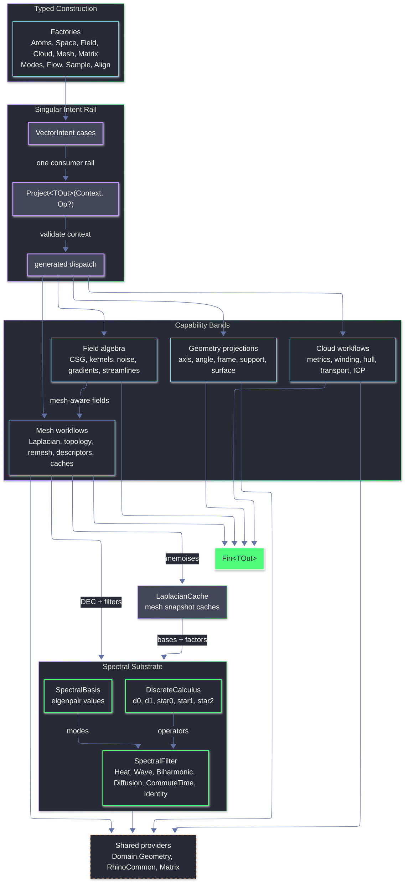

# Rasm.Vectors Architecture

## Current State

### Claim Rules

- `[implemented]` means executable production code, typed receipts, and current proof exist for the named rail.
- `[partial]` means at least one executable rail exists, but a stronger academic, continuous, exact, or runtime-proof contract remains open.
- Receipt names are evidence, not promotion. A current receipt-backed approximation does not satisfy a paper-faithful Tier 5 contract unless this file explicitly says the contract is implemented.

### Tier State

| Tier | State | Cleared Work | Remaining Work |
|------|-------|--------------|----------------|
| Tier 1 | `[implemented]` | `RemeshStatus.NativeRejected` and stale `SdfMeshDomain.VolumeTet` are gone; tet SignedHeat is caller-supplied through `TetMeshDomain`; flatten RMS distortion is finite and scale-normalized when comparable UV edges exist. | None at the current rail level. |
| Tier 2 | `[implemented]` | Shared admission routes through `FieldNabla`; `AtomProjection` remains the local raw projection utility; dense solve guards route through `DenseSolveGated`; hot-path validation has no extra helper file. | Further collapse is opportunistic only and must reduce code or remove duplication. |
| Tier 3 | `[implemented]` | Cloud admission/neighborhood/curvature receipts, spectral wave/WKS normalization receipts, matrix solve/eigen receipts, and owner-local receipt projections are landed. | None at the current receipt-gap level. |
| Tier 4 | `[implemented]` | Current executable rails are complete: mesh-candidate Bridson-style selection, Dwork candidate and continuous mesh active-list rails, scalar-density candidate priority, capacity-limited Lloyd residuals, thresholded mesh-spectrum receipts, mesh feature/segmentation receipts, vector-heat tangent log approximation, generalized winding SDF, boundary-source SignedHeat, closed regular-grid `VolumeGrid` SignedHeat, caller-supplied tet SignedHeat, affine MLS approximation, and RK event tracing with dense-output/bounded-bisection receipts. Bridge proof is landed for mesh Dwork, cloud neighborhood/curvature, mesh features, all six segmentation rails, sampling spectrum, tangent log approximation, scalar isolines, native iso-surface facts, and closed `VolumeGrid` sampling. | Proof hardening only: glyph/bundle runtime geometry and runtime bridge proof for newer Tier 5 rails such as GICP. |
| Tier 5 | `[partial]` | Executable slices exist for continuous mesh Dwork, PCA-backed GICP, caller-supplied tet SignedHeat, tableau-derived RK dense output, reconstruction success/failure admission, tufted-intrinsic receipt assembly, signpost-style transport receipts, and DEC harmonic one-form receipts. | Paper-complete work remains: exact exp/log by window/path tracing, true power CCVT/continuous OT, full side-glued tufted cover plus exact signpost common-subdivision consumption over flipped snapshots, paper-faithful Levin/APSS/Poisson/screened Poisson success rails, GICP runtime proof, and method-specific dense-output coefficients if stronger RK claims are made. |

### Status By Owner

| Owner | Status | Shipped | Residual |
|-------|--------|---------|----------|
| `Matrix.cs` | `[implemented]` | Dense LU/QR/Cholesky, sparse BiCGStab + MathNet fallback, CSparse Cholesky, dense/sparse/generalized eigen, LOBPCG, QR least-squares; `SolveReceipt` / `EigenSolveReceipt` cover all six solve and five eigen paths with finite RHS/output admission, typed iterator convergence, normalized residual convergence for LOBPCG, residual-capped square dense direct solves, explicit least-squares residuals, and distinct fallback stops. | None at the current rail level. |
| `Extraction.cs` | `[implemented]` | Domain-backed glyph/grid/bundle sampling, mesh scalar isolines, surface `IsoStatus`, point-cloud section curves, raw native contour counts; `ExtractionReceipt` embeds scalar-isoline + sample child receipts, derives downstream glyph/grid/streamline projection emitted/rejected counts from the same sample fold used for output projection, and preserves iso-surface facts even when mesh output is invalid. | Glyph/bundle runtime geometry proof remains bridge-owned. |
| `Cloud.cs` + `Align.cs` | `[implemented]` | Rings/polylines/clusters/weighted clusters, split input-duplicate vs merged-coordinate admission evidence with mass-conservation receipts, Rhino `PointCloud` kNN/radius neighborhood receipts, PCA covariance receipts with eigen/rank clamps, oriented normals, curvature receipts with plane/sphere/saddle range facts, convex 3D + 2D footprint hulls with planar UVs mapped back to world points, winding, Sinkhorn with `CloudTransportPolicy` and retained-coupling confidence; ICP (Point/Plane/Symmetric/Robust/NormalWeighted/Generalized) returns `AlignmentReceipt` with admitted policy, correspondences, source/target mass-count admission, target-mass reuse, log-space Welsch weights, GICP Mahalanobis residuals, nonlinear SE(3) line search, and optimizer-stop receipts; `CloudKernel.MassOf` is the mass admission rail. | Concave/alpha hulls explicit unsupported; GICP runtime bridge proof remains open. |
| `Mesh.cs` + `Spectral.cs` | `[partial]` | Topology, signed-dihedral/curvature-proxy ridge/valley/region-boundary feature classification, flatten with scale-normalized edge-length RMS receipt when comparable UV edges exist, remesh, descriptors, 6-algorithm `MeshSegmentation` including deterministic watershed and sparse normalized cut with nonzero-affinity admission, per-vertex scalar isolines, heat/geodesic, Hodge/vector-heat/cross-field/vector-heat-backed tangent-log-map approximation, generalized winding SDF, boundary-source SignedHeat, closed `VolumeGrid` SignedHeat implementation path; `LaplacianCache` caller-keyed success-only caches with canonicalized cross-field keys; CR connection Laplacian + CDS holonomy; tufted-intrinsic snapshots emit mollification/IDT/collapsed cotan `TuftedLaplacianReceipt`; signpost-style transport emits chord-fallback and non-exact common-subdivision receipt facts; harmonic one-form basis assembly emits DEC nullspace/star1 receipts when topology admits genus; `SpectralDescriptorReceipt` validates descriptor integrity; `SpectralFilter.Wave` emits normalized WKS-kernel receipts while descriptor scale normalization remains policy-owned. | Runtime bridge proofs are landed for mesh feature receipts, all six segmentation rails, mesh sampling with spectrum receipt, vector-heat-backed tangent log-map approximation, scalar isolines, and successful closed `VolumeGrid` SignedHeat sampling. Exact exponential/log map, full side-glued tufted cover, exact signpost common-subdivision transport consumption over flipped snapshots, continuous power-diagram CCVT, and harmonic runtime hardening remain future work. |
| `Sample.cs` + `Flow.cs` + `Modes.cs` + `Space.cs` + `Atoms.cs` + `Intent.cs` | `[partial]` | All 11 `SampleKind` variants execute via `SampleReceipt`; Bridson-style active-list selection over mesh candidates, Dwork-style variable-radius candidate selection, continuous mesh Dwork active-list annulus sampling with `rMin`, background grid, local-radius conflicts, deterministic seed and `DworkReceipt`, variable-density scalar-field candidate priority, capacity-limited Lloyd candidate relaxation with residual receipts and reachable `CapacityLimited` stop, Yuksel weighted sample elimination with actual oversample-count facts, and thresholded mesh-spectrum receipts are executable rails; planar candidate measures stay planar; RK tableaus validate structural rows plus primary/embedded moment receipts for admitted method claims, dense-output endpoint/moment receipts, fixed/adaptive integration, dense-output and bounded-bisection event localization, admitted streamline seeds, and early trace stop; `SupportSpace` / `SurfaceSpace` projectors include signed scalar span semantics; `AtomProjection.Raw` utility shared by `Modes`; `VectorIntent.Project<TOut>` is the singular consumer rail with factory-owned admission and owner-local receipt projections. | Non-mesh continuous Poisson surfaces, true discrete transport OT/CCVT assignment, and exact continuous power-diagram CCVT remain unsupported. |
| `Field.cs` | `[partial]` | Scalar/vector/tensor field algebra, kernel profiles + anisotropic falloff, RBF + oriented affine MLS success receipts, typed failure receipts for non-executable Levin/APSS/Poisson/screened Poisson modes, SDF primitives + closed planar profile extrusion, mesh-backed fields including vector-heat-backed tangent log-map, caller-supplied tetrahedral SignedHeat with admitted tets, FEM incidence/volume/mass/stiffness/divergence facts, heat/Poisson `SolveReceipt`s, gauge/interpolation receipts, typed SDF/reconstruction sample projections, tensor blending through `FieldBlend`, iso-surface receipts with `IsoSurfaceGrid` decompile-shaped facts (fixed `0.001` root tolerance, `1e-5` normal sample distance); `FieldNabla` owns shared validation including admitted mesh/surface wrappers; `ScalarField` owns the recursive 30-case scalar-payload fold; native iso-surface, scalar-isoline, and successful closed `VolumeGrid` SignedHeat facts are bridge-backed in `vectors-fields.verify.csx`. | Levin/APSS/Poisson/screened Poisson stronger paper rails remain typed unsupported/failure evidence until their local projection or sparse systems are executable; kernel spatial Hessian explicit non-claim; exact exponential maps remain future work. |

Matrix, extraction admission, cloud/alignment/transport mass diagnostics, and Flow/Space/Modes projection polish are implemented at the rail level. Mesh/Spectral/Sample/Field stay partial where the code now has useful executable receipts but the plan names stronger paper-complete or runtime-hardened contracts.

### Remaining Work

Dependency-ordered implementation contracts. A current rail is done only for the executable behavior named in this file; it does not promote stronger academic variants.

1. **Mesh and spectral exactness:** implement a true tufted cover with explicit front/back sheets, side gluing, cover-local halfedges, cover collapse, and receipts that distinguish logical cover facts from the current doubled-count proxy. Then implement signpost transport over flipped intrinsic snapshots with exact common-subdivision segments, per-halfedge directions, path/trace facts, and consumption by vector/cross-field or CR connection rails. Exact exp/log comes after that substrate and must report path faces/windows, local-vs-global exactness, cut-locus/boundary ambiguity, alternate path deltas, and residuals.
2. **Continuous OT/CCVT:** add restricted mesh power-cell clipping per triangle, target masses, convex dual weight solve, density-weighted centroids, capacity residuals, OT energy deltas, empty-cell failures, and spectrum validation. Keep `Cloud.cs` Sinkhorn as discrete transport evidence only.
3. **Paper reconstruction rails:** keep `ReconstructionMode.Executable` as the admission truth. Levin MLS and APSS need their paper-specific local projection systems before success is allowed. Poisson and screened Poisson need sparse incidence/system assembly, gauge handling, residual receipts, and mesh extraction before success is allowed.
4. **Runtime hardening:** add bridge proof for glyph/bundle runtime geometry and GICP over Rhino point clouds. Add tufted/signpost/harmonic runtime scenarios only after the exact cover/transport consumption work exists.
5. **RK dense-output strengthening:** current dense output is tableau-derived, stage-derivative-backed, and endpoint/moment checked. If a future claim needs paper method-specific continuous-extension coefficients, add those coefficient tables and receipts explicitly instead of reusing the generic interpolant claim.

### Validation Centralization

The Tier 2 hot path is collapsed without adding files:

- `FieldNabla` is the folder validation rail for null references, mesh-native admission, finite points/vectors/scalars, count gates, same-count gates, positive finite weights, and canonical plane admission (`Plane.IsValid`, finite axes, orthonormal, right-handed).
- `Intent.cs` factories use `FieldNabla` for reference/null admission and mesh-native gates; mesh-owned factories no longer check `Optional(space.Native)` locally.
- `AtomProjection` keeps Domain/Rhino primitives on `Op.AcceptValue` and returns Vectors-owned records/receipts by type-first custom projection.
- `CloudHullResult` owns completed/rejected/unsupported construction; `CloudKernel.MassOf` remains the mass owner.
- `Matrix.cs` dense solve paths share `DenseSolveGated`; sparse and Hermitian matvec outputs now have finite-result gates.
- `SampleKind.Admit`, `ContourPolicy.Admit`, `FieldIntegrator.Admit`, and `Termination.Admit` admit direct cases without replaying public factories.
- `Align.cs` solve rows share length/count/finite-weight admission while `WeightedCentroidOf` stays as the two-call numeric kernel.

### Backlog By Owner

- `[implemented]` `Intent.cs`: `VectorIntent.Project<TOut>(Context, Op?)` is the sole consumer rail across 33 Union cases; null/raw admission lives in every factory; capability checks delegate to owner modules.
- `[implemented]` `Extraction.cs`: domain-backed glyph/grid/bundle sampling, mesh scalar isolines, surface `IsoStatus`, point-cloud section curves; `ExtractionReceipt` embeds scalar-isoline and sample child receipts and preserves iso-surface facts even when mesh output is invalid.
- `[implemented]` `Flow.cs`: RK tableaus, embedded-order adaptive stepping, fixed/adaptive integrator construction, Butcher moment receipts for admitted primary/embedded method claims, dense-output receipts/state for admitted tableaus, bounded-bisection and dense-output event localization with positive-iteration admission, and `StreamlineTrace` receipts.
- `[partial]` `Sample.cs`: 11 `SampleKind` variants execute via `SampleReceipt`; weighted mass routes through `CloudKernel.MassOf`; Bridson-style mesh-candidate selection, Dwork-style variable-radius candidate selection, continuous mesh Dwork annulus/grid sampling, scalar-field variable-density candidate priority, capacity-limited Lloyd residuals, thresholded mesh-spectrum receipts, and Yuksel weighted sample elimination all emit algorithm receipts. True transport-backed OT/CCVT and non-mesh continuous Poisson density are still unsupported.
- `[implemented]` `Space.cs`: `SupportSpace` admission/closest/signed-distance/containment/tangent/frame; 14-variant `SupportProjection` collapsed through one `SupportProjectionState` projector; cluster validity routes through `CloudKernel.MassOf`.
- `[implemented]` `Atoms.cs`: dimensions, magnitudes, intervals, axes, angles, directions, spans, frames, cones, relations, transport. `AtomProjection.Raw` is a polymorphic projection *utility* consumed by `Modes.cs` (and transitively by `Intent.cs`); it is not an "owner" of projection logic.
- `[implemented]` `Modes.cs`: 8 curve + 13 surface + 4 cone projection variants; surface derivative modes share `SurfaceDerivatives` + `Derivatives` factory; all raw outputs route through `AtomProjection.Raw`.
- `[implemented]` `Cloud.cs`: rings/polylines/clusters/weighted clusters, duplicate-coordinate admission receipts, Rhino `PointCloud` neighborhood graph receipts, PCA/covariance samples with rank/eigen clamps, oriented normals (MST), curvature receipts with range buckets, convex 3D + 2D footprint hulls, winding, Sinkhorn with retained-coupling confidence; `CloudKernel.MassOf` is the mass admission rail; concave/alpha hulls explicit unsupported.
- `[implemented]` `Align.cs`: Point/Plane/Symmetric/Robust/NormalWeightedPointToPlane/Generalized ICP return `AlignmentReceipt` + correspondences; source/target row weights route through the cloud mass rail; symmetric ICP remains linearized normal-sum while Generalized ICP uses PCA covariances, Mahalanobis residuals, nonlinear SE(3) line search, and optimizer receipts.
- `[partial]` `Mesh.cs`: topology, signed-dihedral/curvature-proxy ridge/valley/region-boundary features, flatten with RMS edge distortion, remesh, descriptors, 6 segmentation algorithms, isolines, heat/geodesic, Hodge/vector-heat/cross-field/tangent-log-map approximation, tufted intrinsic Laplacian receipts, generalized winding SDF, boundary-source SignedHeat, closed `VolumeGrid` SignedHeat implementation path; `LaplacianCache` caller-keyed success-only caches. Mesh feature/segmentation/sampling/log-map and closed `VolumeGrid` bridge proofs are landed; exact exp/log maps, power CCVT, and runtime hardening for tufted/signpost/harmonic rails remain open.
- `[partial]` `Spectral.cs`: DEC, spectral basis, filters, descriptor receipts + normalization/ranking, WKS-normalized Wave receipts, CR connection Laplacian + receipts, FEM heat scaffold, CDS holonomy, signpost transport receipts, and harmonic one-form DEC/nullspace/star1 receipts; `ScaleNormalized` is policy scale-normalization only while `SpectralWaveReceipt.WksNormalized` proves WKS kernel normalization; exact global geodesic log/exp remains unsupported.
- `[partial]` `Field.cs`: scalar/vector/tensor field algebra, kernel profiles + anisotropic falloff, RBF + oriented affine MLS detailed success receipts, typed reconstruction failure receipts for non-executable paper modes, SDF primitives + closed planar profile extrusion, mesh-backed fields including tangent log-map, caller-supplied tet SignedHeat, iso-surface receipts; `FieldNabla` owns shared validation; `ScalarField` owns the recursive 30-case scalar-payload fold. Native iso-surface, scalar-isoline, and successful closed `VolumeGrid` bridge proofs are landed in `vectors-fields.verify.csx`; paper-faithful Levin/APSS/Poisson success rails, kernel spatial Hessian, and exact exponential maps remain future work.

### Intent And Projection Gaps

- `[implemented]` `Intent.cs`: sample, contour, glyph, grid, and stream-bundle intents route through `ExtractionDomain + SampleKind` under `VectorIntent.Project<TOut>`. New projection work extends this rail.
- `[partial]` Streamline projection: `Curve` output, localized event point, trace health, and event kind/status metadata exist. RK dense output is available for admitted tableaus and event localization distinguishes dense roots from bounded bisection.
- `[partial]` Sample projection: `Seq<Point3d>`, `PointCloud`, `VectorCloud`, and `SampleReceipt` project through one `SampleKind` execution with algorithm receipts for Bridson-style mesh-candidate selection, Dwork-style variable-radius candidate and continuous mesh sampling, variable-density candidate priority, capacity-limited residuals, Yuksel elimination, and thresholded mesh-spectrum validation where the domain supports them. True transport-backed sampling remains unsupported.
- `[partial]` Feature projection: `FeatureEdge` / `FeatureReceipt` covers boundary, crease, nonmanifold, unwelded, ngon-interior, ridge, valley, and region-boundary classification through native topology edges, signed dihedral, face-region labels, and curvature-proxy signals. It is not yet bridge-proven as curvature-derivative ridge extraction.
- `[implemented]` Flatten projection: UV flatten through `MeshUnwrapper`; `EdgeLengthDistortionRms` is finite and scale-normalized when comparable UV edges exist.
- `[implemented]` Descriptor projection: `SpectralDescriptorPolicy` owns basis-time zero-mode, scale, energy, and eigenmode-crop normalization; `SpectralRankingPolicy` owns deterministic full-vector ranking; `SpectralFilter.Wave` normalizes the cropped nonzero WKS-style log-Gaussian kernel and emits `SpectralWaveReceipt`. `ScaleNormalized` tracks policy scale normalization; WKS kernel normalization is recorded on `SpectralWaveReceipt`.
- `[implemented]` Topology projection: `TopologyReceipt` reports counts, boundary components, nonmanifold facts, optional genus, and Euler validation; reuse via optional pass-through covers SDF, features, and flatten.

### Flow And Numerical Integration

- `[implemented]` `Flow.cs`: Runge-Kutta tableaus carry stage count, method order, optional embedded order, structural admission, and moment receipts used by fixed/adaptive integrator factories.
- `[implemented]` `ButcherTableau`: structural validation covers row sums, primary/embedded weight sums, abscissae, and admitted primary/embedded order-moment checks (`b*c`, `b*c^2`, `b*c^3`, `b*A*c`) through `ButcherMomentReceipt`.
- `[implemented]` Adaptive stepping: embedded-pair order and exponent are per method because Bogacki-Shampine 3(2), Cash-Karp 5(4), and Dormand-Prince 5(4) do not share one truthful metadata model.
- `[partial]` Event handling: `CrossSurface` requires closest + signed-distance support; `RegionThreshold` admits finite thresholds; both support dense-output root localization when an accepted RK step carries dense state and fall back to bounded bisection/chord localization with positive-iteration admission.
- `[implemented]` Trace receipts: method order, embedded order, errors, min/max step, termination point, event values, event kind, localization kind, dense-output receipt, and event status all derive from one `StreamlineState` accumulation.

### Fields, Kernels, And SDFs

- `[partial]` `Field.cs`: iso-surface routes through intent/extraction; extraction preserves native `IsoSurfaceReceipt` / `IsoSurfaceResult` facts even when evaluator failures make the mesh invalid. `ScalarField.IsoSurfaceDetailed` owns the Rhino callback, prewarms mesh-backed SDF/cache work before native marching, and rejects invalid public mesh results through `Fin`. `Mesh.CreateFromIsosurface` is labeled parallel-callback with fixed `0.001` root tolerance and `1e-5` normal sampling; effective grid dimensions are reported as `IsoSurfaceGrid` facts (decompiled floor-cell formula + corner/center/initial sample counts). Native callback/projection facts are bridge-backed in `vectors-fields.verify.csx`; product-strength meshing quality remains bridge-owned per scenario.
- `[implemented]` `KernelKind`: radial profiles expose value, first derivative, second derivative, and smooth/boundary/nonsmooth/outside-support status; `Weight` is `Profile.Value`; the profile rail is the single derivative owner. No spatial gradient/Hessian claim.
- `[implemented]` Field admission: invariant-bearing field/falloff/integrator cases construct through validated factories; direct external case construction is closed where Thinktecture regular unions still require public case types; `FieldNabla` owns the shared finite/plane/kernel/periodic/reconstruction-sample/iso-surface validators; `ScalarField` owns the recursive 30-case scalar-payload fold.
- `[implemented]` Kernels: anisotropic falloff uses `TensorField` / `SymmetricMatrix` metrics through `sqrt(v^T M v)` and rejects invalid, nonfinite, or nonpositive metric distances. Kernel derivatives remain radial-profile facts only.
- `[partial]` Reconstruction: RBF interpolation/approximation records mode, smoothing, sample count, residual, solve path, and factor facts via matrix solve receipts. Oriented affine MLS admits samples through `Context` tolerance, returns per-query detailed reconstruction receipts (neighborhood count, rejected weights, rank, conditioning, normal agreement, gradient norm, solve facts), and fails unsupported Levin/APSS/Poisson/screened Poisson modes through typed reconstruction failure receipts without constructing invalid matrix dimensions; labeled approximate SDF rather than paper-faithful success.
- `[implemented]` SDF primitives: half-space, slab, capped cone, and closed planar single-region profile extrusion exist; profile extrusion requires a closed planar Rhino `Curve`, explicit plane, positive half-height, self-intersection-free single region, native containment, and closest-point distance, with receipt facts for tolerance source, containment, closest acceptance, and active feature.
- `[partial]` SDF outputs: `ScalarField.LipschitzBound()` exists; mesh-backed signing routes through admitted `SdfMeshPolicy` values for generalized winding, boundary-source SignedHeat, and closed `VolumeGrid` SignedHeat. Mesh SDF receipts carry the shared `TopologyReceipt` + `SdfMeshDomain` (`SurfaceMesh`, `BoundarySource`, `VolumeGrid`); closed SignedHeat requires oriented closed/solid/watertight meshes and at least one strict-inside grid node for sign calibration. `ClosedSurfaceSignedHeat` has an approximate volumetric implementation path using a regular padded Cartesian lattice, triangle-source vector heat from `Mesh.SolidOrientation()`, gauge-pinned finite-difference Poisson solve, residual-tolerance enforcement, finite-domain trilinear interpolation, and explicit `VolumeGridReceipt` facts. Caller-supplied tet SignedHeat is executable through admitted `TetMeshDomain` cells, FEM assembly, heat/Poisson solves, gauge calibration, and interpolation receipts.

### Mesh And Spectral Operators

- `[partial]` `Mesh.cs` per-vertex scalar isolines: local PL contours with payload-length admission, finite-level validation, Rhino quad triangulation, edge interpolation, exact-edge dedupe, plateau rejection, branch-safe stitching, and stitched/branch/incident-degree counts. Runtime bridge proof is landed in `vectors-fields.verify.csx`.
- `[partial]` Mesh features: classified boundary/crease/nonmanifold/unwelded/ngon-skipped/ridge/valley/region-boundary receipt facts via native topology-edge APIs, signed dihedral, face-region labels, and smoothed edge curvature signals. This is a bridge-backed curvature-proxy classifier, not the paper-faithful curvature-derivative ridge/valley rail.
- `[partial]` Mesh segmentation: `MeshSegmentation` executes scalar threshold components, scalar band components, seeded scalar region growing, descriptor-scalar clustering, deterministic watershed, and sparse normalized cut; `MeshSegmentationResult` carries face + vertex assignments; `MeshSegmentationReceipt` reports algorithm/status/region counts/seeds/iteration/tolerance/descriptor/eigen/affinity/cut facts where available. Runtime bridge proof for all six segmentation rails is landed in `vectors-spectral.verify.csx`.
- `[partial]` Mesh diagnostics: `LaplacianCache` exposes spectral cache-hit facts; cotangent/IDT/tufted intrinsic Laplacians count skipped degenerate faces and assembly facts; descriptor receipts carry truncated eigenpair/cache/skip facts; CR edge-connection factors carry kinded assembly receipts into boundary SignedHeat; sparse fallback solve status is distinct from residual convergence; boundary-source signed heat surfaces topology/source/heat/Poisson receipts; closed SignedHeat surfaces `VolumeGrid` counts/source/operator/interpolation/solve facts when the rail succeeds; SDF receipts reuse topology/domain facts; vector-heat-backed tangent log-map reports approximation facts and exposes `TangentLogMapReceipt` through the vector extraction rail. Runtime bridge proofs are landed for scalar-isoline geometry, successful closed `VolumeGrid` sampling, mesh sampling-spectrum receipts, and tangent-log-map approximation. Exact exponential/log maps and continuous power-diagram CCVT remain unsupported.
- `[implemented]` Spectral descriptors: detailed descriptors expose raw/normalized status, pairwise/source metadata, basis-time zero-mode/eigenmode-crop facts, value-only post-hoc energy normalization, WKS-normalized Wave kernel receipts, comparison readiness, deterministic full-vector ranking, skipped-degenerate/factor facts, signpost receipt facts, and harmonic basis receipts when topology admits them. `ScaleNormalized` is scale-policy owned; `SpectralWaveReceipt.WksNormalized` is the WKS receipt proof.
- `[implemented]` Remesh outputs: native remesh returns `RemeshResult` / `RemeshReceipt` with target/count/reduction/validity/hard-edge-request/topology-change facts; invalid native output is disposed and fails as `InvalidResult`.

### Clouds, Alignment, And Transport

- `[implemented]` `Cloud.cs` Sinkhorn: `SinkhornReceipt` reports coupling summaries, source/target residual semantics, numeric status, canonical `CloudTransportPolicy`, convergence tolerance, positive coupling cutoff, debiased self-costs, and retained-correspondence summaries; internals consume normalized mass admitted by `CloudKernel.MassOf`; correspondence confidence is retained-coupling coverage, not geometric probability.
- `[implemented]` `Cloud.cs` weighted clusters: centroid/covariance, principal axes/frame, shape/spread, density, transport mass, alignment row weights, oriented normals, duplicate admission receipts, Rhino neighborhood receipts, PCA covariance/rank/eigen clamp receipts, and local curvature receipts route through `CloudKernel.MassOf` and one neighborhood/PCA policy rail. Curvature proof covers accepted/rejected samples, rank/residual rejection, eigen-gap and fit-residual tolerances, finite principal directions, plane/sphere/saddle range buckets, and scalar derived curvedness/shape-index outputs.
- `[implemented]` `Cloud.cs` hulls: 3D convex and 2D convex/footprint hull results carry tolerance, angle tolerance, native facet count, planarity/coplanar rejection, input/output counts, and containment proof counts; convex 3D uses Rhino native hull facets, footprint hulls use Rhino native 2D hull indices plus local containment proof. Concave outline and alpha-style requests return explicit unsupported receipts.
- `[implemented]` `Align.cs`: receipt includes kind, approximation status, solve receipt, correspondences, residual quantiles/max, robust scale/weight range, final step delta, optimizer receipt, and mass-admitted row weights. Symmetric ICP remains a normal-sum linearized approximation; Generalized ICP is the covariance/Mahalanobis rail.
- `[implemented]` `Align.cs` correspondences: per-point residual vectors project from the matching pass; target IDs resolve through Rhino `RTree.PointCloudKNeighbors` and `PointCloud.PointAt(index)`.
- `[implemented]` Transport: coupling, distance, receipt, transported cloud, retained-mass correspondence summaries, canonical Sinkhorn policy admission, and row-mass payload transfer. Product IDs and module attributes stay outside this library.

### Sampling And Domain Coverage

- `[partial]` `Sample.cs`: weighted and scalar-field-driven sampling route through `SampleKind`; density maps and programmatic priorities control deterministic selection and output mass through `CloudKernel.MassOf`. Mesh-candidate Bridson-style active-list selection, Dwork-style variable-radius candidate selection, continuous mesh Dwork annulus/grid sampling, variable-density scalar-field candidate priority, capacity-limited Lloyd residuals, thresholded mesh-spectrum validation, and Yuksel weighted sample elimination emit explicit algorithm receipts. True transport-backed OT/CCVT and non-mesh continuous Poisson density remain unsupported.
- `[partial]` `Sample.cs` domain coverage: sampling routes through `ExtractionDomain` for explicit samples, mesh policies, support count-backed sampling, deterministic cloud-vertex candidates, weighted input, and scalar/adaptive/Dwork density policies. Boundary domains and non-mesh Poisson density remain unsupported.
- `[implemented]` `Sample.cs` adaptive/Dwork rails: scalar-field intensity varies local spacing with receipt fields for density and local-radius ranges; Dwork-style candidate selection enforces variable-radius annulus/conflict checks over admitted candidates; continuous mesh Dwork uses `rMin / sqrt(3)` background cells, active annulus proposals, local-radius conflict checks, deterministic seed, and `DworkReceipt`.
- `[partial]` Blue-noise sampling: `Sample.cs` owns Bridson-style active-list candidate selection, Dwork-style variable-radius candidate selection, continuous mesh Dwork, variable-density candidate priority, capacity-limited Lloyd residual receipts, and Yuksel admission/execution/receipts; `Mesh.cs` owns mesh candidate/domain geometry and thresholded mesh-spectrum receipts. True transport-backed OT/CCVT, continuous power-diagram CCVT, and non-mesh continuous Poisson remain future work.
- `[implemented]` `SampleReceipt`: attempted/emitted/rejected, candidate count, spacing stats, count-density error, density admission counts, iteration count, stop kind, domain status, and `SampleAlgorithmReceipt` facts derive from one execution.

### Modes, Matrices, And Product Boundary

- `[implemented]` `Modes.cs`: surface point/frame/UV frame/Jacobian/metric/area-scale projections, explicit curve frame/perpendicular-frame normal/binormal policies, cone projections; curve/surface/cone raw outputs share `AtomProjection.Raw`; surface derivative modes share one `SurfaceDerivatives` helper. Native runtime behavior remains bridge-owned.
- `[implemented]` `Matrix.cs`: `SolveReceipt` / `EigenSolveReceipt` cover all six solve paths (`DenseLu`, `DenseQrLeastSquares`, `DenseCholesky`, `SparseBiCgStabDiagonal`, `SparseMathNetDirectFallback`, `SparseCholesky`) and five eigen paths (`DenseSymmetricEvd`, `DenseGeneralEvd`, `SparseLobpcg`, `SparseHermitianLobpcg`, `SparseGeneralizedCholeskyCongruence`). Sparse direct fallback uses a distinct `DirectFallbackSolved` stop; LOBPCG normalizes symmetric storage before solving; max-iteration exhaustion returns finite diagnostic pairs/residuals as `MaxIterationsExhausted` (not usable).
- `[implemented]` Matrix receipts and failures: no sentinel-style fallback returns success when it should fail. Jacobi preconditioner diagonal clamp (`Matrix.cs:648`) and Rayleigh-quotient zero-denominator clamp (`Matrix.cs:660`) are intentional algorithmic guards. Nonconvergence, unsupported topology, invalid factorization, missing native capability, lossy fallback, and approximate output surface through `Fin<T>` or typed statuses; materialized diagnostic statuses are not permission for downstream consumers to use invalid payloads.
- `[implemented]` Product boundary: no UI, preview conduits, bake commands, GH2 parameter wrappers, or command receipts belong in `Rasm.Vectors`. Return typed geometry, weights, coupling, correspondences, residuals, and factual diagnostics only.

`Rasm.Vectors` is the typed vector geometry and numerics layer over RhinoCommon geometry, MathNet linear algebra, CSparse.NET sparse Cholesky, LanguageExt result rails, and Thinktecture-generated dispatch. Factories create atoms, spaces, fields, clouds, matrices, meshes, and intent cases; `VectorIntent.Project<TOut>(Context, Op?)` remains the singular consumer rail for executing an intent into a requested output shape. `Spectral.cs` is the shared substrate owning DEC operator assembly, spectral basis values, FEM heat-method scaffolding, the Crouzeix-Raviart connection Laplacian (Stein-Wardetzky-Jacobson-Grinspun 2020), the Crane-Desbrun-Schröder trivial-connection 1-form, and the polymorphic `SpectralFilter` algebra consumed by both mesh descriptors and scalar spectral fields. `Mesh.cs` owns `LaplacianCache`, which memoises spectral bases and factorisations per mesh snapshot.

## Ownership

- `Intent.cs`: `VectorIntent` cases, factories, context validation, dispatch delegation.
- `Atoms.cs`: dimensions, magnitudes, axes, angles, directions, spans, frames, cones, relations, shared raw-output projection, and `Direction.ParallelTransport(Seq<Plane>)`.
- `Modes.cs`: curve / surface / cone / pose projection selectors; shared `AtomProjection.Raw` output projection for curve, surface, and cone raw values; `SurfaceProjection.ShapeOperator` projects Rhino `SurfaceCurvature` into a `SymmetricMatrix`.
- `Space.cs`: `SupportSpace`, `SurfaceSpace`, `SupportProjection`, signed distance, containment, closest-hit projection.
- `Field.cs`: scalar/vector/tensor field algebra (CSG blending, falloff, kernels, noise, finite difference). Mesh-aware extensions: `ScalarField` adds `Geodesic`, `MeanCurvatureFlow`, `SpectralDistance`, `Stripe`, and `SignedDistanceFromMesh`; `VectorField` adds `CrossField`, one `Hodge` case carrying `BoundarySense`, `VectorHeat`, `GeodesicTangent`, and vector-heat-backed `TangentLogMap`.
- `Flow.cs`: validated Runge-Kutta tableaus, fixed/adaptive integration, streamline state, termination predicates, and `StreamlineTrace` projection receipts.
- `Cloud.cs`: cloud construction (Ring / Polyline / Cluster / WeightedCluster), `VectorCloudMetric` SmartEnum (PCA, oriented normals, principal curvature, curvedness, shape index), plus separate intent rails for winding, hull, and transport. `CloudKernel.Sinkhorn` uses `CloudTransportPolicy` and log-domain scaling; policy mass relaxation changes KL marginal penalties over validated normalized masses.
- `Sample.cs`: canonical `SampleKind` owner for explicit points, mesh-surface policies, support count-backed sampling, deterministic cloud candidates, weighted/density candidate selection, and `SampleReceipt`.
- `Align.cs`: cloud alignment -- `AlignKind` SmartEnum admits `Point`, `Plane`, `Symmetric` (Rusinkiewicz 2019 with oriented normal sum), `Robust` (MAD-scaled Welsch IRLS), `NormalWeightedPointToPlane`, and `Generalized` (PCA-backed Mahalanobis GICP with nonlinear SE(3) line search).
- `Mesh.cs`: mesh snapshots, local PL scalar isolines, `LaplacianCache` (cotangent / IDT / tufted-intrinsic, scalar Cholesky factor, parametric scalar-heat / vector-connection / edge-connection Cholesky caches via `Atom<HashMap>`, spectral basis with cache-hit facts, mean edge length, mesh-invariant boundary-source SHM phi plus source/heat/Poisson receipts, policy-keyed closed `VolumeGrid` SHM solves, and typed per-kernel `Atom<HashMap<TKey, TValue>>` success-only caches for geodesic / MCF / cross-field / Hodge / vector-heat / signed heat with structurally-equal record keys), `MeshLaplacian` SmartEnum (`Cotangent`, `IntrinsicDelaunay`, `TuftedIntrinsic`), `MeshDescriptor` Union (single `SpectralCase`), `MeshSegmentation` Union, `IntrinsicMesh` (post-IDT-flip frozen edge index + face-edge map + face areas + first-incident-edge per vertex), topology, features, remesh kernels, Hodge, vector heat, geodesic tangent, stripe, cross-field, triangle solid-angle winding SDF, boundary-source SignedHeat kernels, and closed regular-grid SignedHeat kernels.
- `Matrix.cs`: dense and sparse matrix models, MathNet conversion, dense decompositions, dense QR least-squares, BiCGStab sparse solves with MathNet QR fallback receipts, sparse Hermitian products, local LOBPCG eigensolves without hidden dense fallback, solve/eigen receipts, and `CholeskySparse` for CSparse.NET-backed SPD-intended factorisation with typed factorisation failure.
- `Spectral.cs`: `DiscreteCalculus` (DEC operators `d0`, `d1`, `star0` barycentric/lumped mass, `star1`, `star2`), optional signpost-style transport receipt facts, optional harmonic one-form basis receipts, `SpectralBasis` eigenpair values, `SpectralFilter` algebra, FEM heat scaffold, Crouzeix-Raviart connection Laplacian, `ComputeIntrinsicStar1`, and CDS 2010 holonomy distribution over intrinsic incidence operators.

## Invariants

- `VectorIntent.Project<TOut>(Context, Op?)` is the only consumer projection rail.
- `ExtractionDomain + SampleKind` is the only sampling/extraction rail for sample, glyph, grid, stream-bundle, contour, and sample receipt projections; no parallel sample-source union exists.
- `Spectral.cs` owns DEC operators, spectral basis values, `SpectralFilter` dispatch + partial-monoid `Compose`, FEM heat scaffolding, the Crouzeix-Raviart edge connection Laplacian for SHM, and the CDS holonomy 1-form for trivial connections. Mesh-owned `LaplacianCache` memoises `SpectralBasisOf(k)` and downstream factors. Field and Mesh route spectral queries through this single substrate.
- `MeshDescriptor` is a single `SpectralCase` parameterised by `SpectralFilter` and optional source set. HKS-like heat signatures and WKS-style normalized wave kernels route through `Heat` and `Wave`; `Identity` exposes raw spectral signatures and is not a full ShapeDNA implementation.
- `MeshLaplacian` admits `Cotangent`, `IntrinsicDelaunay`, and `TuftedIntrinsic`. The current tufted rail is mollified/IDT/collapsed cotan assembly with logical cover receipt counts; it is not yet the full Sharp-Crane side-glued front/back cover contract.
- `LaplacianCache` exposes caller-keyed success-only `Cotangent`, `IntrinsicDelaunay`, `TuftedIntrinsic`, `Cholesky` (mass-pinned SPD-intended regularisation), intrinsic and tufted intrinsic snapshots (post-flip frozen `IntrinsicMesh` with stable edge index), boundary-source signed heat values plus topology/source/heat/Poisson receipts, closed `VolumeGrid` SignedHeat values plus topology/grid/operator/interpolation/Poisson receipts when that rail succeeds, default and parametric spectral bases with cache-hit and truncated eigenpair facts, connection/scalar/edge Cholesky caches, and success-only typed `Atom<HashMap<TKey, TValue>>` memoisers keyed by structurally-equal records.
- Vector heat uses cached CSparse Cholesky solves for the connection, magnitude, and indicator heat systems; recovery remains approximate. Signpost-style receipts exist, but exact common-subdivision transport consumption over flipped snapshots is still open.
- Constrained cross-field is available on unflipped intrinsic meshes only; flipped intrinsic edges remain unsupported until the signpost transport substrate is consumed by the cross-field rail.
- Trivial connections (CDS 2010, closed genus-0 default) use intrinsic incidence operators and `ValidateGaussBonnet`; Rhino closed-mesh admission treats `GetNakedEdges() == null` as closed, and bounded meshes return invalid-input faults.
- `SdfMeshMethod.BoundarySignedHeat` is boundary-source and unflipped-only. Closed/no-boundary meshes use `SdfMeshMethod.ClosedSurfaceSignedHeat` through `SdfMeshPolicy.ClosedSignedHeat(...)`; the public factory only admits grid, heat, solver, and sign policy because interpolation and boundary condition are fixed to trilinear regular-grid sampling with a pinned Neumann gauge. Default or constructor-bypassed policies fail admission, and open/non-solid/nonwatertight/unoriented meshes reject that rail before grid assembly. The closed rail is approximate regular-grid volumetric SHM over a finite padded domain, requires a strict-inside grid node for sign calibration, and does not claim exact Euclidean distance or tet FEM behavior; successful controlled closed runtime sampling is bridge-backed in `vectors-fields.verify.csx`.
- `Field.ScalarField` extends a continuous scalar with mesh-aware cases that delegate to `MeshKernel`. `VectorField` extends with mesh-aware Hodge decomposition, vector heat, geodesic tangent, tangent log-map approximation, and cross-field with constrained / cone variants.
- `Cloud.CloudKernel.Sinkhorn` accepts `CloudTransportPolicy` for balanced/unbalanced transport over normalized cluster masses and measures relaxed convergence by scaling change.
- Greenfield canonical names have no shims: `MaxIterations`, `MaxIterationsExhausted`, `RegionThresholdCrossing`, `Pairs`, `TargetLength`, `Spread`, and `Debiased`.
- Domain owns shared Rhino geometry normalization and `ClosestHit`.
- Vectors owns vector-specific intent, polymorphic field algebra, cloud metrics, mesh operators, sampling, alignment, and spectral substrate.
- RhinoCommon provides native geometry, closest queries, transforms, convex hulls, mesh reduction, remeshing, mesh unwrap, normals, marching-cubes isosurface, point-in-solid, and surface-curvature principal directions via `SurfaceCurvature`.
- MathNet owns dense decompositions, dense LU/QR solve primitives, sparse products, BiCGStab iteration, MathNet QR fallback solve projection, and local LOBPCG primitives.
- CSparse.NET 4.3.0 owns cached sparse Cholesky factorisation with AMD ordering and Span-based solve for SPD-intended systems.
- Local kernels exist only where dependencies do not expose the required algorithm.

## Potential Use Cases And Value

`Rasm.Vectors` is a downstream design-geometry kernel for Rhino WIP and GH2. It turns design intent into typed points, vectors, curves, meshes, frames, scalar fields, transforms, descriptors, and diagnostics through `VectorIntent.Project<TOut>(Context, Op?)`.

### Intent And Projection Rails

- Build one GH2 component family around `VectorIntent` instead of one-off commands for each vector operation.
- Expose typed dropdown modes from SmartEnums (`SupportProjection`, `CurveProjection`, `SurfaceProjection`, `MeshLaplacian`, `SampleKind`, `AlignKind`, `RemeshKind`).
- Project the same intent into alternate outputs: `Point3d`, `Vector3d`, `Plane`, `Curve`, `Polyline`, `Mesh`, scalar values, matrices, transforms, and descriptor values.
- Surface predictable `Fin<TOut>` failures in Rhino/GH UI without exceptions or silent fallback geometry.
- Share the same projection vocabulary between command plugins, GH2 components, and future app-layer tools.

### Placement, Snapping, And Support Geometry

- Place panels, fixtures, annotations, profiles, furniture-scale design objects, and facade modules onto Breps, meshes, curves, planes, and point clouds.
- Generate tangent frames, normals, signed distances, containment distances, UV values, support parameters, mesh points, and component metadata at picked locations.
- Create surface-aware handles that move objects along support geometry while preserving local frame orientation.
- Build proximity masks, clearance previews, inside/outside classifiers, and design-envelope checks from signed distance and containment projections.
- Convert selected Rhino geometry into reusable `SupportSpace` and `SurfaceSpace` inputs for downstream fields, sampling, routing, and alignment.

### Frames, Rails, And Curve-Based Design

- Generate stable section frames along rails for ribs, louvers, mullions, fins, stair strings, handrails, pipes, and ceiling baffles.
- Use Frenet, Bishop, tangent, curvature, arc-length, and parallel-transport frames to avoid orientation flips on long curves.
- Orient repeated components along paths with explicit angle pivots, signed axes, spans, cones, and vector relations.
- Build sweep-ready profile frames for facade ribs, contour-following strips, ceiling tracks, and sculptural rails.
- Evaluate curvature-driven local behavior for path smoothing, section rotation, and component spacing.

### Field-Driven Layout And Patterning

- Create attractor, repulsor, vortex, Coulomb, dipole, harmonic, saddle, helical, ring, curl-noise, and cross-product design fields.
- Turn vector fields into streamlines for circulation sketches, facade flow lines, floor inlays, ceiling tracks, and generated path curves.
- Drive aperture density, screen porosity, perforation radius, tile scale, fixture spacing, lighting density, and ornamental intensity from scalar fields.
- Combine gradients, curls, divergences, Laplacians, clamps, scales, blends, and warps into controllable design fields.
- Split fields with Hodge decomposition into gradient-like behavior and circulation-like behavior for simple UI controls.

### Implicit Massing And Soft Boolean Geometry

- Model concept solids from SDF primitives: sphere, box, capsule, cylinder, cone, capped cone, torus, hex prism, octahedron, and ellipsoid.
- Blend, union, subtract, intersect, round, onion, elongate, displace, twist, and bend implicit volumes for early massing studies.
- Generate Rhino meshes from scalar iso-surfaces for blob massing, carved voids, inflated envelopes, clearance solids, and smooth transitions.
- Use mesh signed-distance fields to preview offsets, shrink-wrap behavior, proximity coloring, and inside/outside styling.
- Route watertight mesh signing through generalized winding or signed-heat policy instead of ad-hoc point-in-solid guesses.

### Surface And Mesh Pattern Systems

- Generate facade panel directions, seam candidates, tile rotation, hatch grain, surface stripes, and anisotropic module orientation from cross-fields.
- Interpolate designer strokes over meshes with vector heat for louver direction, panel rotation, surface grain, and facade flow.
- Use tensor fields and principal curvature directions for curvature-responsive ornament, rib direction, panel alignment, and surface grain.
- Build stripe, band, contour, and wave families from scalar fields, geodesic fields, and spectral filters.
- Apply cone and hint constraints to cross-fields for controlled singularities and design-authored orientation anchors.

### Geodesic Routing And Surface Distance

- Compute heat geodesic, spectral distance, stripe distance, geodesic-tangent behavior, and vector-heat-backed tangent log-map approximations over mesh surfaces; exact exponential/log coordinates remain deferred.
- Route seams, cables, wayfinding marks, projected measurements, surface traces, and on-surface paths across curved forms.
- Create distance-to-source scalar previews for zoning, panel influence, local falloff, and surface-aware selection.
- Convert scalar geodesic output into contour-ready bands, isoline sources, or placement weights for downstream tools.
- Cache mesh-local factors so repeated source edits reuse the same `LaplacianCache` substrate.

### Sampling, Population, And Distribution

- Distribute anchors, panels, lights, apertures, seats, paving marks, acoustic nodes, and facade modules across mesh surfaces.
- Select Poisson disk, farthest-point, Lloyd, optimized, or capacity sampling depending on uniformity, coverage, and density goals.
- Use sampled points as seeds for field traces, panel centers, fixture locations, perforation maps, and component placement.
- Preserve deterministic sampling behavior for repeatable GH definitions and command previews.
- Combine sampling with scalar fields to turn design intensity into population density through the current discrete candidate-density rails.

### Mesh Preparation, Flattening, And Descriptors

- Prepare meshes for design workflows with topology summaries, feature edges, remeshing, reduction, unwrap, and flattening.
- Generate fabrication previews, unrolled pattern studies, panel layout sheets, and texture-coordinate working surfaces.
- Use cotangent, intrinsic-Delaunay, and tufted-intrinsic receipt-backed Laplacians as selectable mesh-operator policies; full side-glued nonmanifold tufted robustness is future work, not a declared current rail.
- Compute spectral descriptors for shape matching, option comparison, ornament families, and similarity sliders.
- Reuse intrinsic mesh snapshots for connection Laplacian, cone holonomy, signed heat, cross-field, vector-heat, and Hodge workflows.

### Point Clouds, Alignment, And As-Built Workflows

- Align scans, imported context, reference layouts, module kits, and repeated facade parts with point, plane, symmetric, robust, and normal-weighted point-to-plane ICP.
- Extract best-fit planes, principal axes, principal frames, covariance, spread, curvature, curvedness, shape index, and oriented normals.
- Build quick design diagnostics for sampled geometry: local direction, compactness, anisotropy, footprint shape, and surface-like behavior.
- Generate hulls, rough envelopes, footprint wrappers, containment regions, and selection boundaries from point or ring inputs.
- Use robust alignment and cloud metrics as preflight checks before baking component arrays or matching as-built fragments.

### Transport, Morphing, And Layout Transfer

- Transfer point distributions between facade options, surface versions, module families, and sampled design layouts.
- Use unbalanced Sinkhorn transport to relax normalized weighted marginal constraints between alternatives.
- Morph landmark layouts, aperture maps, panel centers, fixture plans, and ornamental seed sets between design states.
- Compare alternatives by correspondence cost, transport plan structure, and distribution mismatch.
- Use transport output as a bridge from analysis-like point sets back into editable design geometry.

### Rhino/GH Product Surfaces

- `Project Intent`: single component or command for projecting `VectorIntent` into requested Rhino-native output.
- `Support Projection`: closest point, tangent, normal, signed distance, containment, UV, frame, and component projections.
- `Sample Mesh`: Poisson, farthest, optimize, Lloyd, and capacity sampling with preview and bake paths.
- `Trace Streamline`: vector-field seeds to curves or polylines with fixed/adaptive integration and termination modes.
- `Cross Field`: mesh plus hints/cones to directional panel, stripe, or tile orientation fields.
- `SDF IsoSurface`: primitive and mesh-backed scalar fields to Rhino mesh output.
- `Mesh Distance`: heat geodesic, spectral distance, stripe, and signed-distance previews.
- `Align Clouds`: scan or module point sets to transforms with residual/convergence display.
- `Transport Cloud`: remap point distributions between surfaces, options, or facade states.
- `Mesh Prep`: topology, feature edges, remesh, reduce, unwrap, flatten, and spectral descriptor workflows.

### Productization Boundaries

- App UI, preview conduits, bake commands, GH2 parameter wrappers, and user-facing receipts live outside `Rasm.Vectors`.
- Brep-heavy workflows need a canonical meshing or parameterization intake before mesh-only kernels run.
- Advanced solvers benefit from exposed convergence and cache diagnostics for designer-facing feedback.
- Cross-field cone flows need preflight guidance for topology, boundaries, and cone charge validity.
- Contour and isoline extraction from scalar fields now has a local mesh PL rail; richer plateau receipts, product contour integration, and runtime Rhino proofs remain productization work.
