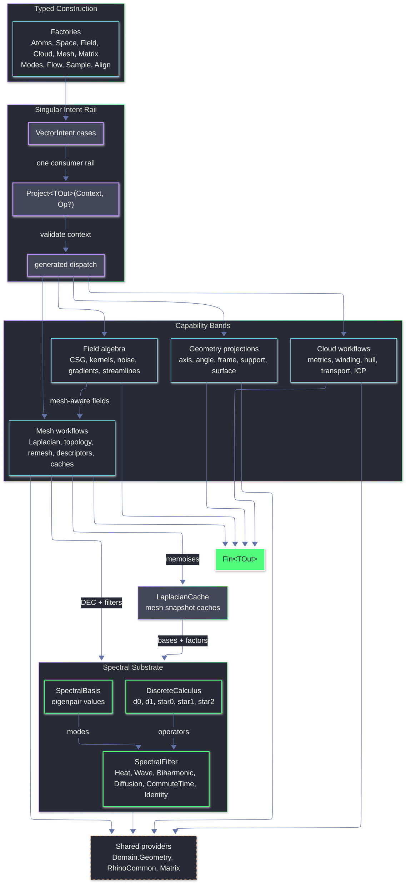

# Rasm.Vectors Architecture

## TODO

### Implementation Order

1. `[implemented]` Matrix solve ownership is in `Matrix.cs`: dense LU/QR/Cholesky, sparse BiCGStab with MathNet fallback, CSparse Cholesky, dense/sparse/generalized eigen paths, and QR least-squares receipts exist. Dense, sparse, and CSparse solve paths share finite RHS/output admission through the existing solve rails; eigen receipts now reject nonfinite known payload shapes and sparse generalized eigen validates both matrix inputs. Remaining matrix work is receipt materialization for eigen nonconvergence/exhaustion and any broader sparse/Hermitian result hardening.
2. `[implemented]` Extraction is wired through `VectorIntent.Project<TOut>` for probes, contours, iso-surfaces, glyphs, grids, stream bundles, sample receipts, and local mesh scalar isolines. `VectorIntent`, `ExtractionDomain`, and extraction policy factories now reject null/raw domain and policy payloads at construction; runtime contour, glyph/bundle geometry, and Rhino-native tolerance proof stay in the bridge lane.
3. `[implemented]` Cloud, alignment, and transport diagnostics are real: `CloudCorrespondenceSet` feeds ICP and Sinkhorn, `SinkhornReceipt` reports computed residual facts, weighted mass reaches metrics/alignment/transport, footprint hull receipts exist, `CloudKernel.MassOf` is the mass admission rail for cloud/sample/alignment/transport consumers, confidence remains empty until a kernel computes it, and true GICP remains explicit unsupported instead of approximated.
4. `[implemented]` Mesh and spectral receipts exist for topology, features, flatten, remesh, descriptors, scalar isolines, SDF, and segmentation. `MeshSegmentation` now executes scalar threshold components, scalar band components, seeded scalar region growing, and descriptor-scalar clusters with face/vertex assignments and typed receipts. `LaplacianCache` exposes caller-keyed success-only cache facts for spectral bases/factors, cotangent/IDT assemblies report skipped degenerate faces, SDF signed-heat receipts reuse topology/source facts and carry heat plus final Poisson solve facts, and robust tufted Laplacian, signpost transport, closed SignedHeat, true watershed/normalized-cut segmentation, and true tangent log-map remain unsupported until they land truthfully.
5. `[implemented]` Sampling, domains, modes, support projection, and flow-event polish use the right owners: `SampleKind`, `ExtractionDomain`, `CurveProjection`, `SurfaceProjection`, `SupportSpace`, and `FieldIntegrator`. Public callers route through factory admission, cloud mass reaches deterministic candidate weighting and cluster support admission through `CloudKernel.MassOf`, curve/surface/cone modes share `AtomProjection.Raw`, support closest-hit payloads share one locally validated value projector, fixed/adaptive integrators admit RK tableaus before construction, and bounded event localization admits positive iteration counts. `SampleKind.SampleElimination` implements Yuksel weighted sample elimination over admitted candidate batches with receipts for parameters, elimination counts, neighbor updates, deterministic candidate source, Euclidean metric, and explicit non-claims for maximal coverage, OT/CCVT, and mesh-spectrum validation. Current `PoissonDisk` remains deterministic candidate-radius filtering, not Bridson active-list Poisson disk; Bridson, variable-density Dwork-style sampling, OT/CCVT, mesh-spectrum validation, higher-order RK moments, and RK dense output are separate unsupported research rails, not blockers for item 5 completion.
6. `[partial]` Field, kernels, and SDFs include derivative-aware kernels, anisotropic tensor metrics, RBF receipts, oriented MLS receipts, half-space/slab/capped-cone primitives, closed planar single-region profile-extrusion SDFs, Lipschitz bounds, mesh-backed SDF receipts, and native iso-surface receipts. `FieldNabla` owns shared kernel/periodic/reconstruction/profile/iso-surface/plane validation, extraction preserves valid mesh output as well as invalid iso-surface receipt/result facts, native iso-surface receipts carry bridge-proven parallel callback and fixed `0.001` tolerance labels, mesh-backed SDF receipts reuse topology facts, and bridge scenarios cover primitive, mesh-backed, boundary SignedHeat, support containment, evaluator failure, and native callback concurrency. Closed SignedHeat and full scalar-payload preflight coverage remain partial until a volume-backed grid/tet domain and a unified field-admission fold exist, and the next focused pass should stay in the existing `Field.cs` / `Mesh.cs` / `Matrix.cs` owners instead of adding new rails.

Matrix, extraction admission, mesh segmentation, mesh/spectral receipt facts, cloud/alignment/transport mass diagnostics, and the Flow/Space/Modes projection polish are close enough to mark implemented. Remaining partial areas stay partial because they still contain missing receipt propagation, unsupported algorithms, or native-runtime behavior that has not been proven in RhinoWIP.

### Backlog By Owner

- `[implemented]` `Intent.cs`: `VectorIntent.Project<TOut>(Context, Op?)` remains the only consumer rail, and sample/contour/glyph/grid/stream-bundle intents route through `ExtractionDomain + SampleKind`. Null/raw admission now lives in existing factories for support, probe, contour, glyph, grid, stream bundle, sample, hull, alignment, mesh, transport, topology, features, descriptor, and cloud cases; capability checks remain in owner modules.
- `[implemented]` `Extraction.cs`: domain-backed glyph/grid/bundle sampling, mesh scalar isolines, surface `IsoStatus`, point-cloud section curves, and raw native contour counts are implemented. `ExtractionReceipt` owns receipt construction, preserves successful and invalid iso-surface receipt/result facts while raw mesh output remains valid-only, PL mesh-isoline plateau/branch facts are preserved, and null/raw domain plus policy payloads fail through factory admission; glyph/bundle runtime geometry proof remains bridge-owned.
- `[implemented]` `Flow.cs`: RK tableaus, method-order metadata, embedded-order adaptive stepping, admitted fixed/adaptive integrator construction, endpoint/bracket event statuses, bounded bisection localization, positive localization iteration admission, exact localized midpoint receipts, and `StreamlineTrace` receipts exist. Higher-order tableau moments and true RK dense output remain future work.
- `[implemented]` `Sample.cs`: explicit, mesh, support, cloud, weighted, scalar-density, adaptive, and sample-elimination policies all execute through `SampleKind` and return `SampleReceipt`. Weighted sample mass routes through `CloudKernel.MassOf`; mesh surface candidates come from the mesh owner; current `PoissonDisk` is deterministic candidate-radius filtering; current `Weighted` is normalized candidate mass propagation; current `Lloyd`/`Capacity` are nearest-candidate relaxation modes; scalar/adaptive density remains deterministic priority selection; and Yuksel weighted sample elimination carries algorithm-specific receipts. Bridson active-list Poisson disk, variable-density Dwork-style sampling, OT/CCVT capacity satisfaction, and mesh-spectrum validation stay unsupported unless deliberately opened as separate algorithm or validation rails.
- `[implemented]` `Space.cs`: `SupportSpace` owns support admission, closest hits, signed distance, containment distance, tangent/frame projection, and `SurfaceSpace` sampling. Hit payload projection is collapsed through one locally validated projector for distance, parameter, UV, component, mesh point, and frame; cluster support validity reuses `CloudKernel.MassOf`; unsupported frame sources fail before payload projection.
- `[implemented]` `Atoms.cs`: core atoms and primitives exist: dimensions, magnitudes, intervals, axes, angles, directions, spans, frames, cones, relations, raw projection, and transport. `AtomProjection.Raw` is the shared output-projection owner for curve, surface, and cone modes.
- `[implemented]` `Modes.cs`: curve tangent/curvature/frame/arclength policies and surface point/frame/UV/Jacobian/metric/area-scale policies exist. Curve/surface/cone raw outputs project through `AtomProjection.Raw`, surface derivative modes share one derivative projector, and native runtime behavior remains bridge-owned.
- `[partial]` `Cloud.cs`: rings, polylines, clusters, weighted clusters, PCA/covariance, oriented normals, local curvature metrics, hulls, winding, Sinkhorn, and correspondence summaries are wired. Mass validation now routes through `CloudKernel.MassOf`; add real proof for hull and curvature metrics before strengthening those metric statuses.
- `[implemented]` `Align.cs`: point, plane, symmetric normal-sum, robust Welsch, and normal-weighted ICP rails return `AlignmentReceipt` and correspondences. Native kNN index checks stay local, source/target row weights route through the cloud mass rail, and symmetric ICP remains labeled linearized instead of true GICP.
- `[implemented]` `Mesh.cs`: topology, feature basics, flattening, remesh, descriptors, segmentation assignments, isolines, heat/geodesic paths, Hodge/vector-heat/cross-field constraints, generalized winding SDF, and boundary-source signed heat are wired. Segmentation execution returns `MeshSegmentationResult` / `MeshSegmentationReceipt`; cache-hit, skipped-degenerate, caller-keyed cache-failure, topology-backed SDF, boundary-source admission, heat solve, and final signed-heat Poisson solve facts now surface from existing cache/solver owners. Feature receipts use native topology-edge unwelded/ngon-interior classification; emit `NativeRejected` where receipts define it and classify ridge/valley facts truthfully before strengthening feature claims.
- `[partial]` `Spectral.cs`: DEC assembly, spectral basis, filters, descriptor receipts, Crouzeix-Raviart connection Laplacian, FEM heat scaffold, and CDS holonomy distribution exist and feed mesh paths. Add comparison normalization/ranking, harmonic/genus handling, public DEC wiring where needed, and broader skipped-element receipts beyond the mesh-owned cotangent/IDT skip counts.
- `[partial]` `Field.cs`: vector/scalar/tensor field algebra, kernel profiles, anisotropic falloff, RBF reconstruction, context-admitted oriented MLS reconstruction receipts, SDF primitives, closed planar single-region profile extrusion, mesh-backed fields, and iso-surface receipts exist. Public constructor bypasses for invariant-bearing field/falloff cases are closed through internal case constructors, shared field admission routes through `FieldNabla`, native iso-surface attempt receipts preserve callback/tolerance/evaluator-failure facts, and public mesh projection remains valid-only. Closed SignedHeat and complete recursive scalar-payload preflight remain incomplete.

### Intent And Projection Gaps

- `[implemented]` `Intent.cs`: sample, contour, glyph, grid, and stream-bundle intents route through `ExtractionDomain + SampleKind` under `VectorIntent.Project<TOut>`. Construction admission is now factory-owned; new projection work should extend the same rail instead of adding siblings.
- `[partial]` Streamline projection: `Curve` output, localized event point, trace health, and event kind/status metadata exist. Dense output remains missing, and localization is bounded bisection/chord evaluation rather than RK dense output.
- `[partial]` Sample projection: `Seq<Point3d>`, `PointCloud`, `VectorCloud`, and `SampleReceipt` project through one `SampleKind` execution. Weighted/scalar-density/adaptive modes are diagnostic and deterministic; complete probability semantics and non-mesh density behavior before strengthening the claim.
- `[partial]` Feature projection: `FeatureEdge` / `FeatureReceipt` covers boundary, crease, nonmanifold, and skipped ngon-interior facts. Ridge/valley and region-boundary classification remain unsupported.
- `[partial]` Flatten projection: UV flattening returns result/receipt facts through `MeshUnwrapper`. Boundary pins and distortion remain limited to locally computed facts.
- `[partial]` Descriptor projection: spectral descriptors return values and receipt/status through the detailed rail. `SpectralFilter.Wave` remains raw log-Gaussian weighting until WKS normalization and comparison ranking land.
- `[partial]` Topology projection: `TopologyReceipt` reports topology counts, boundary components, nonmanifold facts, optional genus, and Euler validation where assumptions hold. Reuse those facts in features/SDF/flattening instead of recounting edge topology locally.

### Flow And Numerical Integration

- `[implemented]` `Flow.cs`: Runge-Kutta tableaus carry stage count, method order, optional embedded order, and structural admission used by fixed/adaptive integrator factories.
- `[partial]` `ButcherTableau`: structural validation covers row sums, primary/embedded weight sums, and abscissae. Higher-order moment consistency remains future work.
- `[implemented]` Adaptive stepping: embedded-pair order and exponent are per method because Bogacki-Shampine 3(2), Cash-Karp 5(4), and Dormand-Prince 5(4) do not share one truthful metadata model.
- `[partial]` Event handling: `CrossSurface` requires closest + signed-distance-capable support; `RegionThreshold` admits finite thresholds; both admit positive localization iteration counts, distinguish initial/previous/current endpoint touches from bracketed crossings, and use bounded bisection/chord localization. RK dense-output coefficients remain future work.
- `[partial]` Trace receipts: method order, embedded order, errors, min/max step, termination point, event values, event kind, and event status exist. Product layers need wording that treats localization as bounded bisection, not exact dense output.

### Fields, Kernels, And SDFs

- `[partial]` `Field.cs`: iso-surface routes through intent/extraction, and extraction can preserve native `IsoSurfaceReceipt` / `IsoSurfaceResult` facts even when evaluator failures make the mesh invalid. `ScalarField.IsoSurfaceDetailed` still owns the Rhino callback, prewarms mesh-backed SDF/cache work before native marching, rejects invalid public mesh results through `Fin`, and keeps native callback concurrency/tolerance behavior bridge-owned. Static RhinoWIP decompile proof labels `Mesh.CreateFromIsosurface` as parallel-callback with fixed `0.001` root tolerance and fixed `1e-5` normal sampling; effective grid dimensions remain an unreported native receipt fact.
- `[partial]` `KernelKind`: radial profiles expose value, first derivative, second derivative, and smooth/boundary/nonsmooth/outside-support status. Keep `Weight` as `Profile.Value` and use the profile rail as the single derivative owner.
- `[implemented]` Field admission: invariant-bearing field/falloff/integrator cases construct through validated factories, direct external case construction is closed where Thinktecture regular unions still require public case types, and `FieldNabla` owns finite scalar/vector, plane, kernel, periodic, reconstruction-sample, and iso-surface input checks.
- `[partial]` Kernels: anisotropic falloff uses `TensorField` / `SymmetricMatrix` metrics through `sqrt(v^T M v)` and rejects invalid, nonfinite, or nonpositive metric distances. Kernel derivatives remain radial-profile facts only; no spatial gradient/Hessian claim exists.
- `[partial]` Reconstruction: RBF interpolation/approximation uses matrix solve receipts and records mode, smoothing, sample count, residual, solve path, and factor facts. Oriented MLS admits samples through `Context` tolerance, returns per-query detailed reconstruction receipts with neighborhood count, rejected weights, rank, conditioning, normal agreement, gradient norm, and solve facts, and fails unsupported neighborhoods without constructing invalid matrix dimensions; it is labeled approximate SDF rather than paper-faithful Levin/APSS/Poisson reconstruction.
- `[implemented]` SDF primitives: half-space, slab, capped cone, and closed planar single-region profile extrusion exist. Profile extrusion requires a closed planar Rhino `Curve`, explicit plane, positive half-height, self-intersection-free single region, native containment, closest-point distance, and receipt facts for context tolerance, tolerance source, containment, closest acceptance, and active feature.
- `[partial]` SDF outputs: `ScalarField.LipschitzBound()` exists, mesh-backed signing routes through generalized winding / boundary-source signed heat, and SDF/iso-surface receipts expose approximate/native facts. Mesh SDF receipts reuse topology facts and no longer advertise an unused unsupported status; boundary-source SignedHeat requires non-null naked-edge polylines while closed/no-boundary meshes reject the rail. Watertight preflight, closed SignedHeat, complete scalar-payload preflight, and product-strength native extraction matrices remain incomplete.

### Mesh And Spectral Operators

- `[partial]` `Mesh.cs`: per-vertex scalar isolines exist as local PL mesh contours with payload-length admission, finite-level validation, Rhino quad triangulation, edge interpolation, exact-edge dedupe, plateau rejection, branch-safe stitching, and stitched candidate counts. Add richer plateau/branch diagnostics and bridge proof before productizing them.
- `[partial]` Mesh features: classified boundary/crease/nonmanifold/unwelded/ngon-skipped receipt facts exist, with unwelded and ngon-interior facts using native topology-edge APIs. Ridge/valley and region-boundary geometry remain unsupported until real classification logic lands.
- `[implemented]` Mesh segmentation: `MeshSegmentation` executes scalar threshold components, scalar band components, seeded scalar region growing, and descriptor-scalar clustering. `MeshSegmentationResult` carries face and vertex assignments; `MeshSegmentationReceipt` reports algorithm, status, requested/actual regions, seeds, assigned/unassigned faces, skipped degenerate/nonfinite facts, iteration/tolerance facts, descriptor receipts, spectral cache hits, and factor facts only where the solving owner exposes them. True watershed and normalized-cut spectral segmentation remain unsupported.
- `[implemented]` Mesh diagnostics: `LaplacianCache` exposes spectral cache-hit facts, cotangent/IDT Laplacians count skipped degenerate faces, descriptor receipts carry truncated eigenpair/cache/skip facts, sparse fallback solve status is distinct from residual convergence, failed memoized solves are re-materialized under the caller key through success-only memoization, and boundary-source signed heat surfaces topology/source counts plus heat and final Poisson solve receipts. Robust tufted Laplacian, flipped signpost vector heat, closed SignedHeat, runtime scalar-isoline geometry proof, and true tangent log-map remain unsupported.
- `[partial]` Spectral descriptors: detailed descriptors expose raw status and pairwise/source metadata. Comparison normalization/ranking and genus-positive harmonic handling remain missing.
- `[partial]` Remesh outputs: native remesh returns `RemeshResult` / `RemeshReceipt` with target, count, reduction, validity, hard-edge request, and topology-change facts. `RemeshStatus.NativeRejected` is declared but not emitted on native failure.

### Clouds, Alignment, And Transport

- `[implemented]` `Cloud.cs`: `SinkhornReceipt` reports coupling summaries, source/target residual semantics, numeric status, and correspondence summaries from computed facts. Transport internals consume normalized mass facts admitted by `CloudKernel.MassOf`.
- `[partial]` `Cloud.cs`: weighted clusters feed centroid/covariance, principal axes/frame, shape/spread, density, transport mass, and alignment row weights through `CloudKernel.MassOf`. kNN/radius graph outputs still need fuller mass/correspondence receipt propagation.
- `[partial]` `Cloud.cs`: 3D convex and 2D convex/footprint hull results exist. Concave outline and alpha-style requests return explicit unsupported receipts until a real kernel lands.
- `[implemented]` `Align.cs`: receipt includes kind, approximation status, solve receipt, correspondences, residual quantiles/max, robust scale/weight range, final step delta, and mass-admitted row weights. Symmetric ICP remains a normal-sum linearized approximation, not true GICP.
- `[implemented]` `Align.cs`: correspondences and per-point residual vectors project from the existing matching pass, and target IDs resolve through `PointCloud.PointAt(index)`.
- `[partial]` `Transport`: coupling, distance, receipt, transported cloud, correspondence summaries, and row-mass payload transfer exist. Product IDs and module attributes stay outside this library.

### Sampling And Domain Coverage

- `[implemented]` `Sample.cs`: weighted and scalar-field-driven sampling route through `SampleKind`; density maps and programmatic priorities control deterministic selection and output mass through `CloudKernel.MassOf`. Yuksel weighted sample elimination is the proven candidate-batch blue-noise rail; density/adaptive priority selection remains diagnostic and deterministic rather than a density blue-noise claim.
- `[partial]` `Sample.cs`: sampling routes through `ExtractionDomain` for explicit samples, mesh policies, support count-backed sampling, deterministic cloud-vertex candidates, weighted input, and scalar/adaptive density policies. Boundary domains and non-mesh Poisson density remain unsupported.
- `[implemented]` `Sample.cs`: adaptive sampling uses scalar-field intensity to vary local spacing and is labeled as deterministic priority/adaptive spacing rather than a proven density blue-noise kernel.
- `[implemented]` Blue-noise sampling: `Sample.cs` owns admission/execution and receipts for Yuksel weighted sample elimination over candidate batches; `Mesh.cs` still owns mesh candidate/domain geometry; `Spectral.cs` remains the only appropriate owner if spectral quality metrics are explicitly reopened. Bridson requires active-list annulus sampling with grid neighbor proof and min-distance receipts; variable-density Dwork-style sampling requires a continuous density field algorithm rather than deterministic priority labels; OT/CCVT requires capacity residual, cell mass/area, iteration, and convergence receipts beyond current nearest-candidate relaxation; mesh-spectrum validated sampling requires Laplacian/spectral-basis reuse plus radial mean, anisotropy, or graph-spectrum evidence against random/farthest/current modes.
- `[implemented]` `Sample.cs`: `SampleReceipt` carries attempted/emitted/rejected, candidate count, spacing stats, count-density error, density admission counts, iteration count, stop kind, domain status, and `SampleAlgorithmReceipt` facts from the same sample execution.

### Modes, Matrices, And Product Boundary

- `[implemented]` `Modes.cs`: surface point/frame/UV frame/Jacobian/metric/area-scale projections, explicit curve frame/perpendicular-frame normal/binormal policies, cone projections, and shared raw-output projection through `AtomProjection.Raw` exist. Native runtime behavior remains bridge-owned.
- `[implemented]` `Matrix.cs`: `SolveReceipt` / `EigenSolveReceipt` cover dense LU/QR/Cholesky, sparse iterative/MathNet fallback, CSparse Cholesky, dense/sparse/generalized eigen paths, and QR least-squares is owned by `Matrix.cs`. Sparse direct fallback uses a distinct solve stop instead of pretending to be residual convergence. Remaining matrix work is not new surface; harden dense/sparse admission, eigen receipts, nonconvergence statuses, and downstream cache/factor receipt propagation.
- `[partial]` Receipts and failures: several paths still use raw values or sentinel-style fallback. Model nonconvergence, unsupported topology, invalid factorization, missing native capability, lossy fallback, and approximate output through `Fin<T>` failures or typed statuses.
- `[implemented]` Product boundary: no UI, preview conduits, bake commands, GH2 parameter wrappers, or command receipts belong in `Rasm.Vectors`. Keep returning typed geometry, weights, coupling, correspondences, residuals, and factual diagnostics only.

`Rasm.Vectors` is the typed vector geometry and numerics layer over RhinoCommon geometry, MathNet linear algebra, CSparse.NET sparse Cholesky, LanguageExt result rails, and Thinktecture-generated dispatch. Factories create atoms, spaces, fields, clouds, matrices, meshes, and intent cases; `VectorIntent.Project<TOut>(Context, Op?)` remains the singular consumer rail for executing an intent into a requested output shape. `Spectral.cs` is the shared substrate owning DEC operator assembly, spectral basis values, FEM heat-method scaffolding, the Crouzeix-Raviart connection Laplacian (Stein-Wardetzky-Jacobson-Grinspun 2020), the Crane-Desbrun-Schröder trivial-connection 1-form, and the polymorphic `SpectralFilter` algebra consumed by both mesh descriptors and scalar spectral fields. `Mesh.cs` owns `LaplacianCache`, which memoises spectral bases and factorisations per mesh snapshot.

## Ownership

- `Intent.cs`: `VectorIntent` cases, factories, context validation, dispatch delegation.
- `Atoms.cs`: dimensions, magnitudes, axes, angles, directions, spans, frames, cones, relations, shared raw-output projection, and `Direction.ParallelTransport(Seq<Plane>)`.
- `Modes.cs`: curve / surface / cone / pose projection selectors; shared `AtomProjection.Raw` output projection for curve, surface, and cone raw values; `SurfaceProjection.ShapeOperator` projects Rhino `SurfaceCurvature` into a `SymmetricMatrix`.
- `Space.cs`: `SupportSpace`, `SurfaceSpace`, `SupportProjection`, signed distance, containment, closest-hit projection.
- `Field.cs`: scalar/vector/tensor field algebra (CSG blending, falloff, kernels, noise, finite difference). Mesh-aware extensions: `ScalarField` adds `Geodesic`, `MeanCurvatureFlow`, `SpectralDistance`, `Stripe`, and `SignedDistanceFromMesh`; `VectorField` adds `CrossField`, one `Hodge` case carrying `BoundarySense`, `VectorHeat`, and `GeodesicTangent`.
- `Flow.cs`: validated Runge-Kutta tableaus, fixed/adaptive integration, streamline state, termination predicates, and `StreamlineTrace` projection receipts.
- `Cloud.cs`: cloud construction (Ring / Polyline / Cluster / WeightedCluster), `VectorCloudMetric` SmartEnum (PCA, oriented normals, principal curvature, curvedness, shape index), plus separate intent rails for winding, hull, and transport. `CloudKernel.Sinkhorn` uses log-domain scaling; `massRelaxation` changes KL marginal penalties over validated normalized masses.
- `Sample.cs`: canonical `SampleKind` owner for explicit points, mesh-surface policies, support count-backed sampling, deterministic cloud candidates, and `SampleReceipt`.
- `Align.cs`: cloud alignment -- `AlignKind` SmartEnum admits `Point`, `Plane`, `Symmetric` (Rusinkiewicz 2019 with oriented normal sum), `Robust` (MAD-scaled Welsch IRLS), and `NormalWeightedPointToPlane`.
- `Mesh.cs`: mesh snapshots, local PL scalar isolines, `LaplacianCache` (cotangent / IDT / explicitly unsupported robust Laplacian, scalar Cholesky factor, parametric scalar-heat / vector-connection / edge-connection Cholesky caches via `Atom<HashMap>`, spectral basis with cache-hit facts, mean edge length, mesh-invariant boundary-source SHM φ plus source/heat/Poisson receipts, and typed per-kernel `Atom<HashMap<TKey, TValue>>` success-only caches for geodesic / MCF / cross-field / Hodge / vector-heat / signed heat with structurally-equal record keys), `MeshLaplacian` SmartEnum (`Cotangent`, `IntrinsicDelaunay`, `Robust`), `MeshDescriptor` Union (single `SpectralCase`), `MeshSegmentation` Union, `IntrinsicMesh` (post-IDT-flip frozen edge index + face-edge map + face areas + first-incident-edge per vertex), topology, features, remesh kernels, Hodge, vector heat, geodesic tangent, stripe, cross-field, triangle solid-angle winding SDF, and boundary-source SignedHeat kernels.
- `Matrix.cs`: dense and sparse matrix models, MathNet conversion, dense decompositions, dense QR least-squares, BiCGStab sparse solves with MathNet QR fallback receipts, sparse Hermitian products, local LOBPCG eigensolves without hidden dense fallback, solve/eigen receipts, and `CholeskySparse` for CSparse.NET-backed SPD-intended factorisation with typed factorisation failure.
- `Spectral.cs`: `DiscreteCalculus` (DEC operators `d0`, `d1`, `star0` barycentric/lumped mass, `star1`, `star2`), `SpectralBasis` eigenpair values, `SpectralFilter` algebra, FEM heat scaffold, Crouzeix-Raviart connection Laplacian, `ComputeIntrinsicStar1`, and CDS 2010 holonomy distribution over intrinsic incidence operators.

## Invariants

- `VectorIntent.Project<TOut>(Context, Op?)` is the only consumer projection rail.
- `ExtractionDomain + SampleKind` is the only sampling/extraction rail for sample, glyph, grid, stream-bundle, contour, and sample receipt projections; no parallel sample-source union exists.
- `Spectral.cs` owns DEC operators, spectral basis values, `SpectralFilter` dispatch + partial-monoid `Compose`, FEM heat scaffolding, the Crouzeix-Raviart edge connection Laplacian for SHM, and the CDS holonomy 1-form for trivial connections. Mesh-owned `LaplacianCache` memoises `SpectralBasisOf(k)` and downstream factors. Field and Mesh route spectral queries through this single substrate.
- `MeshDescriptor` is a single `SpectralCase` parameterised by `SpectralFilter` and optional source set. HKS-like heat signatures and unnormalized WKS-style wave weights route through `Heat` and `Wave`; `Identity` exposes raw spectral signatures and is not a full ShapeDNA implementation.
- `MeshLaplacian` admits `Cotangent`, `IntrinsicDelaunay`, and `Robust`; `Robust` currently returns typed `Unsupported` until a true Sharp-Crane tufted cover lands.
- `LaplacianCache` exposes caller-keyed success-only `Cotangent`, `IntrinsicDelaunay`, `Robust`, `Cholesky` (mass-pinned SPD-intended regularisation), `IntrinsicMeshSnapshot` (post-flip frozen `IntrinsicMesh` with stable edge index), boundary-source signed heat values plus topology/source/heat/Poisson receipts, default and parametric spectral bases with cache-hit and truncated eigenpair facts, connection/scalar/edge Cholesky caches, and success-only typed `Atom<HashMap<TKey, TValue>>` memoisers keyed by structurally-equal records.
- Vector heat uses cached CSparse Cholesky solves for the connection, magnitude, and indicator heat systems; recovery remains approximate and rejects flipped intrinsic meshes until signpost transport exists.
- Constrained cross-field is available on unflipped intrinsic meshes only; flipped intrinsic edges return typed `Unsupported` until signpost transport is implemented.
- Trivial connections (CDS 2010, closed genus-0 default) use intrinsic incidence operators and `ValidateGaussBonnet`; Rhino closed-mesh admission treats `GetNakedEdges() == null` as closed, and bounded meshes return invalid-input faults.
- `SdfMeshMethod.BoundarySignedHeat` is boundary-source and unflipped-only. Closed/no-boundary meshes and flipped intrinsic meshes return typed failures; the exact paper-faithful closed-surface variant remains unimplemented.
- `Field.ScalarField` extends a continuous scalar with mesh-aware cases that delegate to `MeshKernel`. `VectorField` extends with mesh-aware Hodge decomposition, vector heat, geodesic tangent, and cross-field with constrained / cone variants.
- `Cloud.CloudKernel.Sinkhorn` accepts `Option<PositiveMagnitude>` for unbalanced transport over normalized cluster masses and measures relaxed convergence by scaling change.
- Greenfield canonical names have no shims: `MaxIterations`, `MaxIterationsExhausted`, `RegionThresholdCrossing`, `Pairs`, `TargetLength`, `Spread`, and `Debiased`.
- Domain owns shared Rhino geometry normalization and `ClosestHit`.
- Vectors owns vector-specific intent, polymorphic field algebra, cloud metrics, mesh operators, sampling, alignment, and spectral substrate.
- RhinoCommon provides native geometry, closest queries, transforms, convex hulls, mesh reduction, remeshing, mesh unwrap, normals, marching-cubes isosurface, point-in-solid, and surface-curvature principal directions via `SurfaceCurvature`.
- MathNet owns dense decompositions, dense LU/QR solve primitives, sparse products, BiCGStab iteration, MathNet QR fallback solve projection, and local LOBPCG primitives.
- CSparse.NET 4.3.0 owns cached sparse Cholesky factorisation with AMD ordering and Span-based solve for SPD-intended systems.
- Local kernels exist only where dependencies do not expose the required algorithm.

## Potential Use Cases And Value

`Rasm.Vectors` is a downstream design-geometry kernel for Rhino WIP and GH2. It turns design intent into typed points, vectors, curves, meshes, frames, scalar fields, transforms, descriptors, and diagnostics through `VectorIntent.Project<TOut>(Context, Op?)`.

### Intent And Projection Rails

- Build one GH2 component family around `VectorIntent` instead of one-off commands for each vector operation.
- Expose typed dropdown modes from SmartEnums (`SupportProjection`, `CurveProjection`, `SurfaceProjection`, `MeshLaplacian`, `SampleKind`, `AlignKind`, `RemeshKind`).
- Project the same intent into alternate outputs: `Point3d`, `Vector3d`, `Plane`, `Curve`, `Polyline`, `Mesh`, scalar values, matrices, transforms, and descriptor values.
- Surface predictable `Fin<TOut>` failures in Rhino/GH UI without exceptions or silent fallback geometry.
- Share the same projection vocabulary between command plugins, GH2 components, and future app-layer tools.

### Placement, Snapping, And Support Geometry

- Place panels, fixtures, annotations, profiles, furniture-scale design objects, and facade modules onto Breps, meshes, curves, planes, and point clouds.
- Generate tangent frames, normals, signed distances, containment distances, UV values, support parameters, mesh points, and component metadata at picked locations.
- Create surface-aware handles that move objects along support geometry while preserving local frame orientation.
- Build proximity masks, clearance previews, inside/outside classifiers, and design-envelope checks from signed distance and containment projections.
- Convert selected Rhino geometry into reusable `SupportSpace` and `SurfaceSpace` inputs for downstream fields, sampling, routing, and alignment.

### Frames, Rails, And Curve-Based Design

- Generate stable section frames along rails for ribs, louvers, mullions, fins, stair strings, handrails, pipes, and ceiling baffles.
- Use Frenet, Bishop, tangent, curvature, arc-length, and parallel-transport frames to avoid orientation flips on long curves.
- Orient repeated components along paths with explicit angle pivots, signed axes, spans, cones, and vector relations.
- Build sweep-ready profile frames for facade ribs, contour-following strips, ceiling tracks, and sculptural rails.
- Evaluate curvature-driven local behavior for path smoothing, section rotation, and component spacing.

### Field-Driven Layout And Patterning

- Create attractor, repulsor, vortex, Coulomb, dipole, harmonic, saddle, helical, ring, curl-noise, and cross-product design fields.
- Turn vector fields into streamlines for circulation sketches, facade flow lines, floor inlays, ceiling tracks, and generated path curves.
- Drive aperture density, screen porosity, perforation radius, tile scale, fixture spacing, lighting density, and ornamental intensity from scalar fields.
- Combine gradients, curls, divergences, Laplacians, clamps, scales, blends, and warps into controllable design fields.
- Split fields with Hodge decomposition into gradient-like behavior and circulation-like behavior for simple UI controls.

### Implicit Massing And Soft Boolean Geometry

- Model concept solids from SDF primitives: sphere, box, capsule, cylinder, cone, capped cone, torus, hex prism, octahedron, and ellipsoid.
- Blend, union, subtract, intersect, round, onion, elongate, displace, twist, and bend implicit volumes for early massing studies.
- Generate Rhino meshes from scalar iso-surfaces for blob massing, carved voids, inflated envelopes, clearance solids, and smooth transitions.
- Use mesh signed-distance fields to preview offsets, shrink-wrap behavior, proximity coloring, and inside/outside styling.
- Route watertight mesh signing through generalized winding or signed-heat policy instead of ad-hoc point-in-solid guesses.

### Surface And Mesh Pattern Systems

- Generate facade panel directions, seam candidates, tile rotation, hatch grain, surface stripes, and anisotropic module orientation from cross-fields.
- Interpolate designer strokes over meshes with vector heat for louver direction, panel rotation, surface grain, and facade flow.
- Use tensor fields and principal curvature directions for curvature-responsive ornament, rib direction, panel alignment, and surface grain.
- Build stripe, band, contour, and wave families from scalar fields, geodesic fields, and spectral filters.
- Apply cone and hint constraints to cross-fields for controlled singularities and design-authored orientation anchors.

### Geodesic Routing And Surface Distance

- Compute heat geodesic, spectral distance, stripe distance, and geodesic-tangent behavior over mesh surfaces; true tangent log-map coordinates remain deferred.
- Route seams, cables, wayfinding marks, projected measurements, surface traces, and on-surface paths across curved forms.
- Create distance-to-source scalar previews for zoning, panel influence, local falloff, and surface-aware selection.
- Convert scalar geodesic output into contour-ready bands, isoline sources, or placement weights for downstream tools.
- Cache mesh-local factors so repeated source edits reuse the same `LaplacianCache` substrate.

### Sampling, Population, And Distribution

- Distribute anchors, panels, lights, apertures, seats, paving marks, acoustic nodes, and facade modules across mesh surfaces.
- Select Poisson disk, farthest-point, Lloyd, optimized, or capacity sampling depending on uniformity, coverage, and density goals.
- Use sampled points as seeds for field traces, panel centers, fixture locations, perforation maps, and component placement.
- Preserve deterministic sampling behavior for repeatable GH definitions and command previews.
- Combine sampling with scalar fields to turn design intensity into population density once scalar/weighted sampling lands.

### Mesh Preparation, Flattening, And Descriptors

- Prepare meshes for design workflows with topology summaries, feature edges, remeshing, reduction, unwrap, and flattening.
- Generate fabrication previews, unrolled pattern studies, panel layout sheets, and texture-coordinate working surfaces.
- Use cotangent and intrinsic-Delaunay Laplacians as selectable mesh-operator policies; robust nonmanifold Laplacian is typed unsupported until tufted cover is implemented.
- Compute spectral descriptors for shape matching, option comparison, ornament families, and similarity sliders.
- Reuse intrinsic mesh snapshots for connection Laplacian, cone holonomy, signed heat, cross-field, vector-heat, and Hodge workflows.

### Point Clouds, Alignment, And As-Built Workflows

- Align scans, imported context, reference layouts, module kits, and repeated facade parts with point, plane, symmetric, robust, and normal-weighted point-to-plane ICP.
- Extract best-fit planes, principal axes, principal frames, covariance, spread, curvature, curvedness, shape index, and oriented normals.
- Build quick design diagnostics for sampled geometry: local direction, compactness, anisotropy, footprint shape, and surface-like behavior.
- Generate hulls, rough envelopes, footprint wrappers, containment regions, and selection boundaries from point or ring inputs.
- Use robust alignment and cloud metrics as preflight checks before baking component arrays or matching as-built fragments.

### Transport, Morphing, And Layout Transfer

- Transfer point distributions between facade options, surface versions, module families, and sampled design layouts.
- Use unbalanced Sinkhorn transport to relax normalized weighted marginal constraints between alternatives.
- Morph landmark layouts, aperture maps, panel centers, fixture plans, and ornamental seed sets between design states.
- Compare alternatives by correspondence cost, transport plan structure, and distribution mismatch.
- Use transport output as a bridge from analysis-like point sets back into editable design geometry.

### Rhino/GH Product Surfaces

- `Project Intent`: single component or command for projecting `VectorIntent` into requested Rhino-native output.
- `Support Projection`: closest point, tangent, normal, signed distance, containment, UV, frame, and component projections.
- `Sample Mesh`: Poisson, farthest, optimize, Lloyd, and capacity sampling with preview and bake paths.
- `Trace Streamline`: vector-field seeds to curves or polylines with fixed/adaptive integration and termination modes.
- `Cross Field`: mesh plus hints/cones to directional panel, stripe, or tile orientation fields.
- `SDF IsoSurface`: primitive and mesh-backed scalar fields to Rhino mesh output.
- `Mesh Distance`: heat geodesic, spectral distance, stripe, and signed-distance previews.
- `Align Clouds`: scan or module point sets to transforms with residual/convergence display.
- `Transport Cloud`: remap point distributions between surfaces, options, or facade states.
- `Mesh Prep`: topology, feature edges, remesh, reduce, unwrap, flatten, and spectral descriptor workflows.

### Productization Boundaries

- App UI, preview conduits, bake commands, GH2 parameter wrappers, and user-facing receipts live outside `Rasm.Vectors`.
- Brep-heavy workflows need a canonical meshing or parameterization intake before mesh-only kernels run.
- Advanced solvers benefit from exposed convergence and cache diagnostics for designer-facing feedback.
- Cross-field cone flows need preflight guidance for topology, boundaries, and cone charge validity.
- Contour and isoline extraction from scalar fields now has a local mesh PL rail; richer scalar-field contour receipts and runtime Rhino proofs remain productization work.
