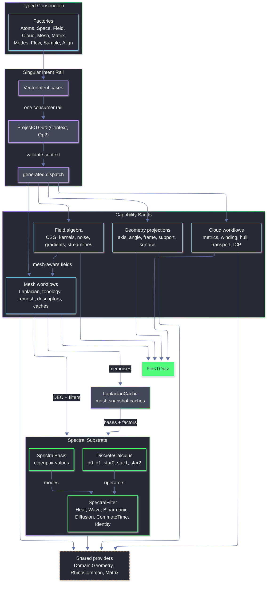

# Rasm.Vectors Architecture

## TODO

### Missing Categories

- `Extraction.cs`: add one category-level owner for continuous-field-to-discrete-design output, including scalar contours, on-mesh isolines, vector glyphs, sampled grids, multi-seed stream bundles, and iso-surface intent routing.
- Receipts: add typed app-facing result records for long-running or iterative computations instead of hiding convergence, residuals, cache state, and fallback status inside private locals.
- Correspondences: add a first-class cloud or transport correspondence surface for matched point pairs, weights, assignment confidence, and remapped design payloads.
- Weighted geometry: add weighted cloud/sample support where transport, density fields, panel layouts, and facade distributions need per-point mass rather than uniform assumptions.
- Extraction domains: add canonical curve, boundary, Brep/surface, mesh, and cloud extraction domains so field outputs do not hard-code mesh-only workflows.

### Intent And Projection Gaps

- `Intent.cs`: add first-class `IsoSurface`, `Contour`, `Probe`, `Glyph`, and `StreamBundle` cases so `VectorIntent.Project<TOut>(Context, Op?)` remains the only public projection rail.
- Streamline projection: return `Curve`, `Polyline`, `Seq<Point3d>`, and a trace receipt with termination reason, rejected steps, arc length, and final step health.
- Sample projection: return `VectorCloud`, `Seq<Point3d>`, `PointCloud`, and a sample receipt with spacing, density error, rejection count, and convergence state.
- Feature projection: return topology edge pairs, `Line` or `Curve` geometry, grouped feature polylines, and a feature receipt carrying threshold and boundary classification.
- Flatten projection: return UV coordinates, a remapped mesh, and a flatten receipt carrying distortion, boundary pins, and mapping validity.
- Descriptor projection: return descriptor values plus descriptor metadata, source set, eigenpair count, filter identity, and comparison-ready normalisation data.
- Topology projection: return the current tuple plus a richer topology receipt with vertex/edge/face counts, boundary loops, nonmanifold edges, genus, and Euler validation.

### Flow And Numerical Integration

- `Flow.cs`: preserve current Runge-Kutta tableaus, but add mathematical order metadata because `Order` currently reads as stage count rather than method order.
- `ButcherTableau`: add validation for row lengths, row sums, weight sums, embedded pair shape, and optional abscissae so malformed tableaus fail before integration.
- Adaptive stepping: store embedded-pair order and exponent per method because Bogacki-Shampine 3(2), Cash-Karp 5(4), and Dormand-Prince 5(4) do not share one truthful metadata model.
- Event handling: add dense output or event localisation for crossing surfaces and regions so termination can report the actual crossing location instead of the last accepted point.
- Trace receipts: report accepted steps, rejected steps, final step size, termination cause, convergence health, and max-iteration exhaustion as typed output.

### Fields, Kernels, And SDFs

- `Field.cs`: expose scalar contours, vector glyphs, sampled grids, and iso-surfaces through intent-backed extraction outputs instead of keeping `IsoSurface` as a direct method only.
- `KernelKind`: add derivative, gradient, and Laplacian support for kernels so density, smoothing, and reconstruction fields can produce normals and differential quantities.
- Kernels: add anisotropic kernels for directional facade grain, stretched influence fields, tensor-guided falloff, and local panel orientation bias.
- Reconstruction: add RBF or moving-least-squares field reconstruction from weighted samples so clouds and sampled design data can become smooth scalar/vector fields.
- SDF primitives: add architectural primitives such as half-space, slab, rounded box, extrusion/profile, capped extrusion, and oriented prism fields where they collapse common massing workflows.
- SDF outputs: route mesh-backed signing, Lipschitz metadata, and lossy fallback behaviour into explicit receipt or failure channels so product tools know when a preview is approximate.

### Mesh And Spectral Operators

- `Mesh.cs`: expose contour and isoline extraction over per-vertex scalar fields produced by geodesic, spectral, stripe, signed-distance, and custom scalar-field samples.
- Mesh features: add ridge, valley, crease, boundary-loop, and region-boundary curve outputs beyond dihedral feature edge pairs.
- Mesh segmentation: add scalar-field threshold regions, region growing, watershed-like bands, or descriptor clustering as mesh-local design selection rails.
- Mesh diagnostics: expose cache hits, factorisation status, solver residuals, eigenpair count, intrinsic-Delaunay status, and fallback paths through typed receipts.
- Spectral descriptors: add comparison and normalisation rails for descriptor distance, option ranking, and shape-family matching rather than returning only raw `Arr<double>`.
- Remesh outputs: return remesh receipts with target edge length, reduction ratio, validity, hard-edge preservation, and topology change summary.

### Clouds, Alignment, And Transport

- `Cloud.cs`: promote transport internals into a public receipt carrying distance, coupling, source/target residuals, iteration count, numeric status, and correspondence summaries.
- `Cloud.cs`: add weighted clusters, neighbourhood graphs, k-nearest/radius graph outputs, and local density estimates because current internals already need those concepts.
- `Cloud.cs`: add 2D hull, concave outline, footprint wrapper, and planar alpha-shape style outputs for architectural footprint and facade-region workflows.
- `Align.cs`: add an alignment receipt carrying transform, residual statistics, convergence flag, iteration count, correspondence count, and mode-specific diagnostics.
- `Align.cs`: expose correspondences and per-point residual vectors so scan-to-model, module-fit, and as-built workflows can display why an alignment succeeded or failed.
- `Transport`: add layout-transfer projections that apply a coupling to point payloads, panel IDs, seed weights, or module attributes instead of only moving points.

### Sampling And Domain Coverage

- `Sample.cs`: add weighted and scalar-field-driven sampling so density maps, facade gradients, and programmatic priorities control population.
- `Sample.cs`: add curve, boundary, Brep/surface, and point-cloud sampling so the sampling rail is not limited to mesh domains.
- `Sample.cs`: add density-function blue-noise and adaptive sampling where local spacing follows scalar-field intensity or curvature.
- `Sample.cs`: expose sample receipts with candidate count, accepted count, rejected count, final spacing statistics, density error, and iteration convergence.

### Modes, Matrices, And Product Boundary

- `Modes.cs`: add surface metric, Jacobian, area scale, UV frame, principal-curvature frame, and explicit curve normal/binormal policy projections.
- `Matrix.cs`: expose solver result metadata consistently across dense, sparse, spectral, and factorised paths so downstream operators can report residuals, stop reasons, conditioning, and factorisation status.
- Receipts and failures: model non-convergence, unsupported topology, invalid factorisation, missing native capability, lossy fallback, and approximate output as explicit `Fin<T>` failures or receipt statuses.
- Product boundary: keep UI, preview conduits, bake commands, GH2 parameter wrappers, and command receipts outside `Rasm.Vectors`, but ensure this folder returns enough typed geometry and diagnostics for those layers to stay thin.

`Rasm.Vectors` is the typed vector geometry and numerics layer over RhinoCommon geometry, MathNet linear algebra, CSparse.NET sparse Cholesky, LanguageExt result rails, and Thinktecture-generated dispatch. Factories create atoms, spaces, fields, clouds, matrices, meshes, and intent cases; `VectorIntent.Project<TOut>(Context, Op?)` remains the singular consumer rail for executing an intent into a requested output shape. `Spectral.cs` is the shared substrate owning DEC operator assembly, spectral basis values, FEM heat-method scaffolding, the Crouzeix-Raviart connection Laplacian (Stein-Wardetzky-Jacobson-Grinspun 2020), the Crane-Desbrun-Schröder trivial-connection 1-form, and the polymorphic `SpectralFilter` algebra consumed by both mesh descriptors and scalar spectral fields. `Mesh.cs` owns `LaplacianCache`, which memoises spectral bases and factorisations per mesh snapshot.

## Ownership

- `Intent.cs`: `VectorIntent` cases, factories, context validation, dispatch delegation.
- `Atoms.cs`: dimensions, magnitudes, axes, angles, directions, spans, frames, cones, relations, `Direction.ParallelTransport(Seq<Plane>)`.
- `Modes.cs`: curve / surface / cone / pose projection selectors; `SurfaceProjection.ShapeOperator` projects Rhino `SurfaceCurvature` into `(k1, k2, e1, e2)`.
- `Space.cs`: `SupportSpace`, `SurfaceSpace`, `SupportProjection`, signed distance, containment, closest-hit projection.
- `Field.cs`: scalar/vector/tensor field algebra (CSG blending, falloff, kernels, noise, finite difference). Mesh-aware extensions: `ScalarField` adds `Geodesic`, `MeanCurvatureFlow`, `SpectralDistance`, `LogMap`, `Stripe`, `SignedDistanceFromMesh`; `VectorField` adds `CrossField` (with optional `Constraints` + `Cones`), `HodgeIrrotational`, `HodgeSolenoidal`, `VectorHeat`, `GeodesicTangent`. `SdfMeshMethod` SmartEnum selects between `GeneralizedWindingNumber` and `SignedHeat`.
- `Flow.cs`: Runge-Kutta tableaus, fixed/adaptive integration, streamline state, termination predicates.
- `Cloud.cs`: cloud construction (Ring / Polyline / Cluster), `VectorCloudMetric` SmartEnum (PCA, principal curvature, curvedness, shape index), plus separate intent rails for winding, hull, and transport. `CloudKernel.Sinkhorn` supports unbalanced transport via `Option<PositiveMagnitude> massRelaxation`.
- `Sample.cs`: mesh-surface sampling -- Poisson disk, farthest, optimize, Lloyd, capacity.
- `Align.cs`: cloud alignment -- `AlignKind` SmartEnum admits `Point`, `Plane`, `Symmetric` (Rusinkiewicz 2019), `Robust` (Welsch IRLS), and `Generalized`, a GICP-inspired normal-weighted point-to-plane solve.
- `Mesh.cs`: mesh snapshots, `LaplacianCache` (cotangent / IDT / robust Laplacian, scalar Cholesky factor, parametric scalar-heat / vector-connection / edge-connection Cholesky caches via `Atom<HashMap>`, spectral basis, mean edge length, mesh-invariant SHM φ via `Lazy<Fin<Arr<double>>>`, and typed per-kernel `Atom<HashMap<TKey, Fin<TValue>>>` caches for geodesic / MCF / cross-field / Hodge / vector-heat with structurally-equal record keys), `MeshLaplacian` SmartEnum (`Cotangent`, `IntrinsicDelaunay`, `Robust`), `MeshDescriptor` Union (single `SpectralCase`), `IntrinsicMesh` (post-IDT-flip frozen edge index + face-edge map + face areas + first-incident-edge per vertex — drives all intrinsic-edge-indexed kernels: connection Laplacian, cone holonomy α, SHM CR system), topology, features, remesh kernels, Hodge / vector heat (Sharp-Soliman-Crane 2019 real-2V Cholesky) / geodesic tangent / stripe / cross-field (GODF 2013 soft-penalty linear solve with hint encoding, CDS 2010 trivial-connection α applied per intrinsic edge) / SignedHeat (Feng-Crane 2024 via Crouzeix-Raviart edge connection Laplacian on the IDT edge set) kernels.
- `Matrix.cs`: dense and sparse matrix models, MathNet conversion, decompositions, iterative solves, sparse Hermitian products, local LOBPCG eigensolves, `CholeskySparse` (CSparse.NET-backed SPD factor with Span-based solve).
- `Spectral.cs`: `DiscreteCalculus` (DEC operators `d0`, `d1`, `star0`, `star1`, `star2`), `SpectralBasis` (eigenpair values), `SpectralFilter` Union (`Heat`, `Wave`, `Biharmonic`, `Diffusion`, `CommuteTime`, `Identity`) with unified `EvaluateFiltered` kernel and partial-monoid `Compose`, FEM heat scaffold (`BuildSourceDelta`, `PoissonTriplets`, `ComputeTriangleGradients`, `ComputeVertexDivergence`, intrinsic `ComputeIntrinsicVertexDivergence`), Crouzeix-Raviart connection Laplacian + face-barycenter sampling on the intrinsic-Delaunay edge set (Stein-Wardetzky-Jacobson-Grinspun 2020), `ComputeIntrinsicStar1` (per-edge cotangent weight shared by CDS holonomy and connection-Laplacian assembly), CDS 2010 holonomy distribution (`ComputeIntrinsicAngleDefects`, `DistributeHolonomy` returning α per intrinsic edge via primal closed 1-form + coexact Hodge solve, with intrinsic incidence operators in place of extrinsic DEC).

## Invariants

- `VectorIntent.Project<TOut>(Context, Op?)` is the only consumer projection rail.
- `Spectral.cs` owns DEC operators, spectral basis values, `SpectralFilter` dispatch + partial-monoid `Compose`, FEM heat scaffolding, the Crouzeix-Raviart edge connection Laplacian for SHM, and the CDS holonomy 1-form for trivial connections. Mesh-owned `LaplacianCache` memoises `SpectralBasisOf(k)` and downstream factors. Field and Mesh route spectral queries through this single substrate.
- `MeshDescriptor` is a single `SpectralCase` parameterised by `SpectralFilter` and optional source set. HKS / WKS / ShapeDNA = `Heat` / `Wave` / `Identity` filter cases respectively.
- `MeshLaplacian` admits `Cotangent`, `IntrinsicDelaunay`, `Robust` -- all route through `LaplacianCache`. `Robust` follows Sharp-Crane SGP 2020 (tufted cover via `Mesh.UnweldEdge` + intrinsic Delaunay flips on the locally-manifold cover).
- `LaplacianCache` exposes lazy `Cotangent`, `IntrinsicDelaunay`, `Robust`, `Cholesky` (mass-pinned SPD regularisation), `IntrinsicMeshSnapshot` (post-flip frozen `IntrinsicMesh` with stable edge index), `SignedHeat` (mesh-invariant SHM φ via `Lazy<Fin<Arr<double>>>`), `DefaultSpectralBasis` (32 pairs, truncatable), `SpectralBasisOf(k)` (parametric), `ConnectionCholesky(symmetry, time)` (cached real-2V SPD factor of `(M + t·L_conn)`), `ConnectionCholeskyAdjusted(symmetry, time, edgeAdjustment)` (uncached, used by cone-affected paths), `ScalarHeatCholesky(time)` (cached factor of `(M + t·L_cot)`), `EdgeConnectionCholesky(time)` (cached real-2|E| factor of `(M_CR + t·L_CR)` built on the intrinsic edge set for Feng-Crane SHM), and typed `Atom<HashMap<TKey, Fin<TValue>>>`-backed `Geodesic / Mcf / CrossField / Hodge / VectorHeat` memoisers keyed by structurally-equal record (`GeodesicKey`, `McfKey`, `CrossFieldKey`, `HodgeKey`, `VectorHeatKey`).
- Vector heat (Sharp-Soliman-Crane 2019): three solves on the cached factors give the per-vertex `X̄ · (φ/ψ)` recovery (direction × magnitude carrier ratio).
- Constrained cross-field (GODF 2013, λ_T = 0 canonical): per-vertex hint encoded as tangent complex raised to `nSym`, B-norm rescaled, RHS = `B·q̂`, solve via `ConnectionCholesky(symmetry, 1e9)` then per-vertex unit-normalise. Cone-affected variant adds CDS α via `ConnectionCholeskyAdjusted`.
- Trivial connections (CDS 2010, closed genus-0 default): build closed primal 1-form distributing `2π·k_v − K_v` per vertex onto one incident INTRINSIC edge, coexact solve `Lβ = d_intrinsic^T · diag(★₁_intrinsic) · u` via `LaplacianCache.Cholesky`, return α per intrinsic edge index (matching `IntrinsicMeshSnapshot.IndexOfEdge`). Flipped intrinsic edges are addressable; the prior extrinsic `TopologyEdges.GetEdgeIndex` lookup gap is closed. Bounded meshes return invalid-input faults; `SpectralCore.ValidateGaussBonnet` enforces `|Σ k_v − χ| < 1e-6` before solving.
- SignedHeat (Feng-Crane 2024 SIGGRAPH, Stein-Wardetzky-Jacobson-Grinspun 2020 CR operator): encode boundary as per-INTRINSIC-edge `length·i·sign(orientation)` in `X₀ ∈ ℂ^{|E|}` stacked real-2|E|, solve `(M_CR + t·L_CR) X_t = X_0` via `EdgeConnectionCholesky` (L_CR built on intrinsic edges and routed through `Fin`, so factorisation failures stay explicit), sample face barycenters via `SpectralCore.SampleCrouzeixRaviartFaceField` over intrinsic faces (canonical edge tangent + 90° in-face normal, normalise per face), vertex divergence via `SpectralCore.ComputeIntrinsicVertexDivergence` (intrinsic cotangents), Poisson `Lφ = ∇·Y` via cached scalar Cholesky, sign-flip and subtract mean φ along boundary. Sign emerges from source orientation; no `IsPointInside` involved. `t = (h̄/2)²` per paper. Cached as a mesh-invariant `Lazy<Fin<Arr<double>>>` (no per-query rebuild; invalidates only when the underlying mesh changes).
- `Field.ScalarField` extends a continuous scalar with mesh-aware cases that delegate to `MeshKernel`. `VectorField` extends with mesh-aware Hodge decomposition, vector heat, geodesic tangent, and cross-field with constrained / cone variants.
- `Cloud.CloudKernel.Sinkhorn` accepts `Option<PositiveMagnitude>` for unbalanced transport (Chizat-Peyre-Schmitzer-Vialard 2018 KL-divergence relaxation).
- Greenfield renames (no shims): `IterationCap` -> `MaxIterations`, `EigenpairCount` -> `Pairs`, `TargetEdge` -> `TargetLength`, `Sigma` -> `Spread`, `Unbiased` -> `Debiased`.
- Domain owns shared Rhino geometry normalization and `ClosestHit`.
- Vectors owns vector-specific intent, polymorphic field algebra, cloud metrics, mesh operators, sampling, alignment, and spectral substrate.
- RhinoCommon provides native geometry, closest queries, transforms, convex hulls, mesh reduction, remeshing, mesh unwrap, normals, marching-cubes isosurface, point-in-solid, edge-unweld for tufted covers, and surface-curvature principal directions via `SurfaceCurvature`.
- MathNet owns dense and sparse numerical operations (decompositions, BiCGStab iterative solve).
- CSparse.NET 4.3.0 provides sparse Cholesky factorisation with AMD ordering and Span-based solve for cached SPD systems.
- Local kernels exist only where dependencies do not expose the required algorithm.

## Potential Use Cases And Value

`Rasm.Vectors` is a downstream design-geometry kernel for Rhino WIP and GH2. It turns design intent into typed points, vectors, curves, meshes, frames, scalar fields, transforms, descriptors, and diagnostics through `VectorIntent.Project<TOut>(Context, Op?)`.

### Intent And Projection Rails

- Build one GH2 component family around `VectorIntent` instead of one-off commands for each vector operation.
- Expose typed dropdown modes from SmartEnums (`SupportProjection`, `CurveProjection`, `SurfaceProjection`, `MeshLaplacian`, `SampleKind`, `AlignKind`, `RemeshKind`).
- Project the same intent into alternate outputs: `Point3d`, `Vector3d`, `Plane`, `Curve`, `Polyline`, `Mesh`, scalar values, matrices, transforms, and descriptor values.
- Surface predictable `Fin<TOut>` failures in Rhino/GH UI without exceptions or silent fallback geometry.
- Share the same projection vocabulary between command plugins, GH2 components, and future app-layer tools.

### Placement, Snapping, And Support Geometry

- Place panels, fixtures, annotations, profiles, furniture-scale design objects, and facade modules onto Breps, meshes, curves, planes, and point clouds.
- Generate tangent frames, normals, signed distances, containment distances, UV values, support parameters, mesh points, and component metadata at picked locations.
- Create surface-aware handles that move objects along support geometry while preserving local frame orientation.
- Build proximity masks, clearance previews, inside/outside classifiers, and design-envelope checks from signed distance and containment projections.
- Convert selected Rhino geometry into reusable `SupportSpace` and `SurfaceSpace` inputs for downstream fields, sampling, routing, and alignment.

### Frames, Rails, And Curve-Based Design

- Generate stable section frames along rails for ribs, louvers, mullions, fins, stair strings, handrails, pipes, and ceiling baffles.
- Use Frenet, Bishop, tangent, curvature, arc-length, and parallel-transport frames to avoid orientation flips on long curves.
- Orient repeated components along paths with explicit angle pivots, signed axes, spans, cones, and vector relations.
- Build sweep-ready profile frames for facade ribs, contour-following strips, ceiling tracks, and sculptural rails.
- Evaluate curvature-driven local behavior for path smoothing, section rotation, and component spacing.

### Field-Driven Layout And Patterning

- Create attractor, repulsor, vortex, Coulomb, dipole, harmonic, saddle, helical, ring, curl-noise, and cross-product design fields.
- Turn vector fields into streamlines for circulation sketches, facade flow lines, floor inlays, ceiling tracks, and generated path curves.
- Drive aperture density, screen porosity, perforation radius, tile scale, fixture spacing, lighting density, and ornamental intensity from scalar fields.
- Combine gradients, curls, divergences, Laplacians, clamps, scales, blends, and warps into controllable design fields.
- Split fields with Hodge decomposition into gradient-like behavior and circulation-like behavior for simple UI controls.

### Implicit Massing And Soft Boolean Geometry

- Model concept solids from SDF primitives: sphere, box, capsule, cylinder, cone, capped cone, torus, hex prism, octahedron, and ellipsoid.
- Blend, union, subtract, intersect, round, onion, elongate, displace, twist, and bend implicit volumes for early massing studies.
- Generate Rhino meshes from scalar iso-surfaces for blob massing, carved voids, inflated envelopes, clearance solids, and smooth transitions.
- Use mesh signed-distance fields to preview offsets, shrink-wrap behavior, proximity coloring, and inside/outside styling.
- Route watertight mesh signing through generalized winding or signed-heat policy instead of ad-hoc point-in-solid guesses.

### Surface And Mesh Pattern Systems

- Generate facade panel directions, seam candidates, tile rotation, hatch grain, surface stripes, and anisotropic module orientation from cross-fields.
- Interpolate designer strokes over meshes with vector heat for louver direction, panel rotation, surface grain, and facade flow.
- Use tensor fields and principal curvature directions for curvature-responsive ornament, rib direction, panel alignment, and surface grain.
- Build stripe, band, contour, and wave families from scalar fields, geodesic fields, and spectral filters.
- Apply cone and hint constraints to cross-fields for controlled singularities and design-authored orientation anchors.

### Geodesic Routing And Surface Distance

- Compute heat geodesic, spectral distance, log-map, and geodesic-tangent behavior over mesh surfaces.
- Route seams, cables, wayfinding marks, projected measurements, surface traces, and on-surface paths across curved forms.
- Create distance-to-source scalar previews for zoning, panel influence, local falloff, and surface-aware selection.
- Convert scalar geodesic output into contour-ready bands, isoline sources, or placement weights for downstream tools.
- Cache mesh-local factors so repeated source edits reuse the same `LaplacianCache` substrate.

### Sampling, Population, And Distribution

- Distribute anchors, panels, lights, apertures, seats, paving marks, acoustic nodes, and facade modules across mesh surfaces.
- Select Poisson disk, farthest-point, Lloyd, optimized, or capacity sampling depending on uniformity, coverage, and density goals.
- Use sampled points as seeds for field traces, panel centers, fixture locations, perforation maps, and component placement.
- Preserve deterministic sampling behavior for repeatable GH definitions and command previews.
- Combine sampling with scalar fields to turn design intensity into population density.

### Mesh Preparation, Flattening, And Descriptors

- Prepare meshes for design workflows with topology summaries, feature edges, remeshing, reduction, unwrap, and flattening.
- Generate fabrication previews, unrolled pattern studies, panel layout sheets, and texture-coordinate working surfaces.
- Use cotangent, intrinsic-Delaunay, and robust Laplacians as selectable mesh-operator policies.
- Compute spectral descriptors for shape matching, option comparison, ornament families, and similarity sliders.
- Reuse intrinsic mesh snapshots for connection Laplacian, cone holonomy, signed heat, cross-field, vector-heat, and Hodge workflows.

### Point Clouds, Alignment, And As-Built Workflows

- Align scans, imported context, reference layouts, module kits, and repeated facade parts with point, plane, symmetric, robust, and GICP-inspired ICP.
- Extract best-fit planes, principal axes, principal frames, covariance, spread, curvature, curvedness, shape index, and oriented normals.
- Build quick design diagnostics for sampled geometry: local direction, compactness, anisotropy, footprint shape, and surface-like behavior.
- Generate hulls, rough envelopes, footprint wrappers, containment regions, and selection boundaries from point or ring inputs.
- Use robust alignment and cloud metrics as preflight checks before baking component arrays or matching as-built fragments.

### Transport, Morphing, And Layout Transfer

- Transfer point distributions between facade options, surface versions, module families, and sampled design layouts.
- Use unbalanced Sinkhorn transport to tolerate differing point counts or changing density between alternatives.
- Morph landmark layouts, aperture maps, panel centers, fixture plans, and ornamental seed sets between design states.
- Compare alternatives by correspondence cost, transport plan structure, and distribution mismatch.
- Use transport output as a bridge from analysis-like point sets back into editable design geometry.

### Rhino/GH Product Surfaces

- `Project Intent`: single component or command for projecting `VectorIntent` into requested Rhino-native output.
- `Support Projection`: closest point, tangent, normal, signed distance, containment, UV, frame, and component projections.
- `Sample Mesh`: Poisson, farthest, optimize, Lloyd, and capacity sampling with preview and bake paths.
- `Trace Streamline`: vector-field seeds to curves or polylines with fixed/adaptive integration and termination modes.
- `Cross Field`: mesh plus hints/cones to directional panel, stripe, or tile orientation fields.
- `SDF IsoSurface`: primitive and mesh-backed scalar fields to Rhino mesh output.
- `Mesh Distance`: heat geodesic, spectral distance, log map, stripe, and signed-distance previews.
- `Align Clouds`: scan or module point sets to transforms with residual/convergence display.
- `Transport Cloud`: remap point distributions between surfaces, options, or facade states.
- `Mesh Prep`: topology, feature edges, remesh, reduce, unwrap, flatten, and spectral descriptor workflows.

### Productization Boundaries

- App UI, preview conduits, bake commands, GH2 parameter wrappers, and user-facing receipts live outside `Rasm.Vectors`.
- Brep-heavy workflows need a canonical meshing or parameterization intake before mesh-only kernels run.
- Advanced solvers benefit from exposed convergence and cache diagnostics for designer-facing feedback.
- Cross-field cone flows need preflight guidance for topology, boundaries, and cone charge validity.
- Contour and isoline extraction from scalar fields is a likely downstream rail; current folder provides scalar sources and mesh substrates.
