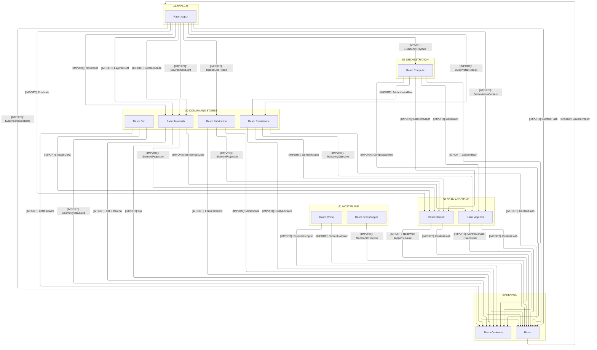
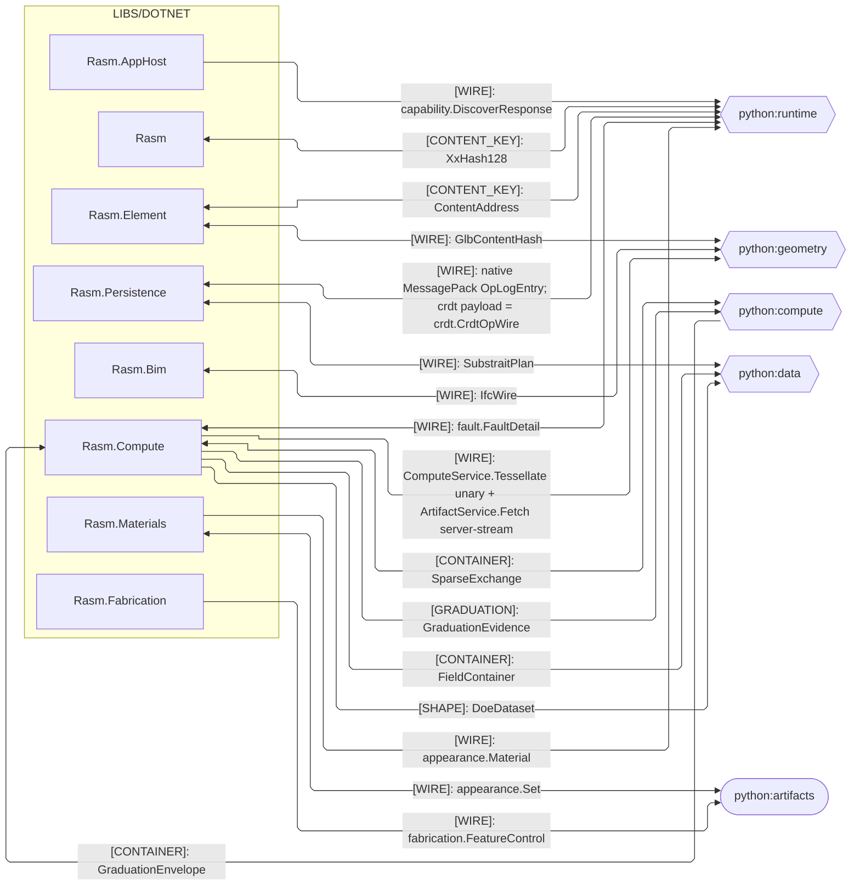
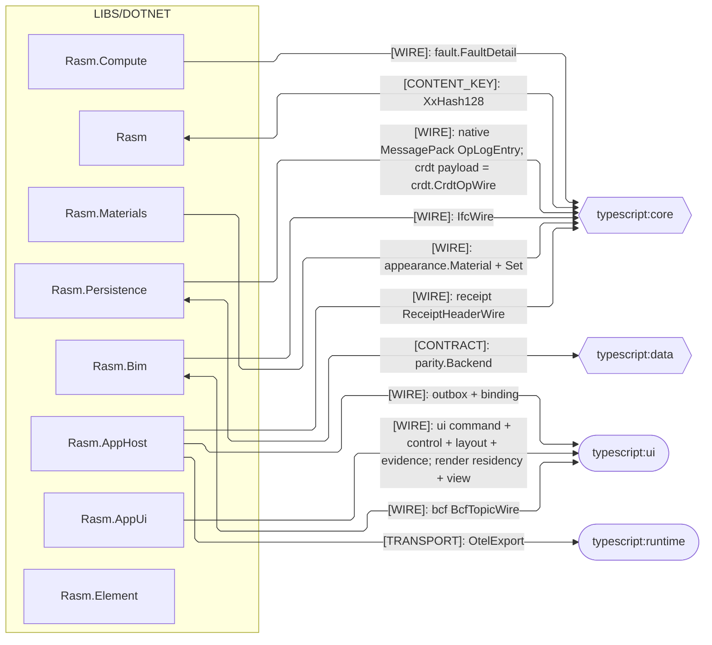
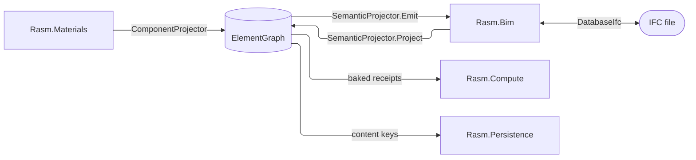
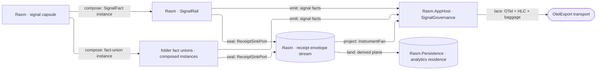

# [DOTNET_BRANCH_ARCHITECTURE]

`libs/dotnet` orders the .NET packages across the strata under one acyclic, upward-only reference graph: the `Rasm` kernel at the base, the seam and runtime spine above it, the AEC domain and stores over those, and orchestration under the app-platform leaf, with the host boundary a plane-distinct pair beside the spine. Each package's interior is its own architecture's charter; the branch roster, the cross-runtime seams, the cross-package flow spines, and the stratum-permission law are the branch grain.

## [01]-[DOMAIN_MAP]

```text codemap
libs/dotnet/
├── Rasm/              # [KERNEL]         RhinoCommon-aware geometry and numeric kernel
├── Rasm.Contracts/    # [WIRE]           Generated assembly and NuGet distribution; protoc + grpc_csharp_plugin own emitted code
├── Rasm.Element/      # [AEC_DOMAIN]     Lowest AEC element seam onto the one ElementGraph
├── Rasm.Materials/    # [AEC_DOMAIN]     Host-neutral profiles, appearance, and construction
├── Rasm.Bim/          # [AEC_DOMAIN]     Host-neutral BIM object model and IFC/glTF/STEP exchange
├── Rasm.Fabrication/  # [AEC_DOMAIN]     Host-neutral fabrication and detailing
├── Rasm.AppHost/      # [APP_PLATFORM]   Runtime spine and app-platform composition root
├── Rasm.Compute/      # [APP_PLATFORM]   Measured tensor, model, and solver execution
├── Rasm.Persistence/  # [APP_PLATFORM]   Durable element, query, and version stores
├── Rasm.AppUi/        # [APP_PLATFORM]   Avalonia product UI shell
├── Rasm.Rhino/        # [HOST_BOUNDARY]  RhinoCommon host APIs; references only Rasm
└── Rasm.Grasshopper/  # [HOST_BOUNDARY]  GH2 host APIs; references only Rasm
```

Planning-scoped packages carry a `.planning/` scaffold of index docs and design pages; `Rasm.Contracts` carries index docs and configuration outside its generator-owned `Generated/` tree and no `.planning/`; the two host-boundary packages add a folder `.api/` tier over their host assemblies.

## [02]-[STRATA]

Rank is reference depth, never domain family: two packages share a rank only when neither reaches the other, so `[01]-[DOMAIN_MAP]` names the family a package serves while the rows below name what it may reference, which is why the app platform spreads across four ranks rather than wearing one label.

- S0 kernel — `Rasm` references no sibling and carries every rank above it.
- S0 wire — `Rasm.Contracts` distributes generated bindings and holds no rank: no sibling reference, generation its only author, one NuGet identity.
- S0 wire law — `Rasm.Contracts` imports its generated runtime closure alone, and the host plane's `only Rasm` law admits it beside the kernel.
- S1 seam — `Rasm.Element` references only `Rasm` and mints the one `ElementGraph` seam.
- S1 spine — `Rasm.AppHost` references only `Rasm` and PORT-decodes store shapes without a downward reference.
- S1 law — the seam and the spine never reference each other, so a package composes either alone.
- S1 host plane — `Rasm.Rhino` and `Rasm.Grasshopper` reference only `Rasm`, sit outside the host-neutral graph, and enter at the host app root.
- S1 host law — bake stays at the host boundary, no host-neutral package references it, and the two boundaries never reference each other.
- S2 domain — `Rasm.Bim`, `Rasm.Fabrication`, and `Rasm.Materials` reference `{Rasm, Rasm.Element}`.
- S2 spine — `Rasm.Materials` adds `Rasm.AppHost` for its stamped benchmark receipt and neutral generated-message admission.
- S2 stores — `Rasm.Persistence` references `{Rasm, Rasm.Element}` and persists the `ElementGraph` as system of record.
- S2 recovery — `Rasm.Persistence` adds `Rasm.AppHost` for the settled `RecoveryObjective` alone.
- S2 wire — `Rasm.Materials`, `Rasm.Bim`, `Rasm.Fabrication`, and `Rasm.Persistence` add `Rasm.Contracts` for the families their pages bind.
- S2 wire law — binary and ProtoJSON codecs compose the spine's neutral `WireAdmission`; S2 members hold generated messages, never a validator.
- S2 law — S2 members never reference each other; alignment travels seam contracts and the content-keyed wire.
- S3 reads — `Rasm.Compute` references `{Rasm, Rasm.Element, Rasm.AppHost, Rasm.Persistence}` and reads the system of record one-way.
- S4 leaf — `Rasm.AppUi` references every host-neutral package below it, `Rasm.Contracts` included, and nothing references it.
- S5 app shell — `apps/<plugin>/` shells, each its own app, seat outside `libs/dotnet` and compose the app platform with the host boundary.
- S5 shell law — composition-root surfaces home at the app shell; a package blocked on the shell waits rather than pulling composition down.



## [03]-[SEAMS]

Every cross-runtime seam is data-bearing: the peer decodes the contract-conforming wire or publisher container without re-minting. Each edge freezes the single load-bearing contract at its partner grain, spelled verbatim from the owning package page; per-shape byte detail folds to the package pages. Two fences partition by peer runtime. Graduation's descriptor exchange uses python's `HandoffAxis` and C#'s `GraduationEvidence`; its serving-population reference is the separate native `GraduationEnvelope` container.





## [04]-[INTERNAL]

`Rasm.Element`, `Rasm.Materials`, and `Rasm.Bim` meet at one seam, the `ElementGraph`: Element owns what a thing IS, Materials what a thing is MADE OF, Bim what a thing MEANS in IFC. Materials seeds and projects components onto the graph, Bim lowers foreign IFC onto it and re-authors IFC off it, and every cross-package fact travels as graph content, so neither projector reaches into the other.



Two projection surfaces, both declared in `Rasm.Element`, are the only cross-package contracts: `IElementProjection` for the two projectors and `IGraphConstraint` for composition-time delta legality. Element's `TypeCandidate` record carries the type-reconciliation loop beside them as contract-aligned data under the Bim-declared `IIfcTypeReconciler` port, both ends composing one declaration, never a package edge. Owners mint their own identity at their own seam and nothing re-mints a peer's: Materials the deterministic Type node, Bim the per-ingest rooted id.

Materials carries IFC names only as neutral `IfcBinding` row data; Bim never re-derives section geometry or material data; Element never carries a fact only one projector understands. Consumers needing the thing read the graph; consumers needing the IFC meaning read Bim's projection; nothing reads across. Canonical seam surfaces change only through an explicit brief entry naming the owner and the move.

Signal crosses the strata on one plane: a signal concept two strata both spell homes at the OTel-free kernel capsule, every stratum composes it as instances with per-folder fact unions as the one per-folder signal type, and telemetry leaves the branch opaque on the `[TRANSPORT]` seam.

Receipts outlive the series they project: every stratum seals its evidence through the kernel receipt port, and the analytics residence is derived, rebuilding from the receipt stream, so it answers history while the metered series answers health.



Exact per-stage wiring lives on the owning implementation pages.

## [05]-[ROUTING]

Every extension lands on a canonical owner: a row where possible, a compiler-forced arm on the one dispatch site otherwise. Each owner's page carries the full growth law; this table routes and never restates it.

| [INDEX] | [CHANGE]                    | [OWNER_SURFACE]                          | [SHAPE_OF_THE_EDIT]                           |
| :-----: | :-------------------------- | :--------------------------------------- | :-------------------------------------------- |
|  [01]   | new component family        | `ComponentFamily` + one seed page        | one policy row + seed row table               |
|  [02]   | new section shape           | `SectionProfile` + `SectionSolver.Solve` | one union arm + one dispatch arm              |
|  [03]   | new IFC entity or category  | emitter + `ClassIntroductions`           | regenerate + one overlay row                  |
|  [04]   | new property or detail      | `DetailSchema`                           | one schema row                                |
|  [05]   | new relation semantics      | sub-kind rows or `Generic` attributes    | one row or attribute convention               |
|  [06]   | new quantity or dimension   | `QuantityRow`, `Dimension`               | one mint row or member                        |
|  [07]   | new fault case              | owning `*Fault` union                    | one `[FaultCase]` leaf                        |
|  [08]   | new seam participant        | `IElementProjection`                     | one projector; any new fault family uses [16] |
|  [09]   | new folder signal surface   | the folder's composed capsule instance   | one fact case, point row, or instrument row   |
|  [10]   | new capsule mechanism       | kernel signal capsule (`Rasm`)           | one member on the one mechanism               |
|  [11]   | new reliability indicator   | kernel signal capsule (`Rasm`)           | one indicator, burn, severity, or panel row   |
|  [12]   | new OTel wiring or exporter | `Rasm.AppHost` `SignalGovernance`        | one governance row; the vocabulary stays S0   |
|  [13]   | analytics residence or slot | `Rasm.Persistence` `Query/residence`     | one row answering the estate residence floor  |
|  [14]   | new columnar query end      | `Rasm.Persistence` `Query/serving`       | one `ResidenceReach` arm on the one read plan |
|  [15]   | new tolerance lane          | `Rasm` `ToleranceLane`                   | one lane row carrying its band and dimension  |
|  [16]   | new fault family            | `Rasm` `FaultBand` + package `*Fault`    | one band row + one direct `[Union]` root      |
|  [17]   | new retriability class      | `Rasm` `Retriability`                    | one case plus one `Redrive` arm               |
|  [18]   | new hook mechanism          | `Rasm` `HookRail`                        | one member on the one mechanism               |
|  [19]   | new mesh source             | `Rasm` `MeshSource`                      | one case plus one admission arm               |
|  [20]   | new statistic               | `Rasm` `Stat<TCarrier>`                  | one slot plus one validity conjunct           |
|  [21]   | new UI modality or control  | the owning `Rasm/Interaction` owner      | one case or one row                           |
|  [22]   | new sheet size / standard   | `Rasm` `SheetSeries` / `Drawing/sheet`   | one series root or one declared table row     |

## [06]-[ADMISSION_POLICY]

Root `Directory.Packages.props` owns NuGet admission as one `PackageVersion` row per package; each `.csproj` carries the bare `PackageReference`, label-grouped by owner and versionless. Every admission resolves its whole touch-point set live at `docs/laws/topology.md` `[MANIFEST_ADMISSION]`.

Root `Directory.Build.props` owns every host-assembly `Reference` and its `HintPath`, resolved from one overridable host-bundle path property and gated by the RhinoCommon-, Grasshopper-, and host-UI-aware flags project classification sets. Each `.csproj` names host NAMESPACES as `Using` rows and never the assembly, so classification drives the reference and a host package carries no manifest row; `System.Drawing.Common` alone holds both a central row and a gated host reference.

`Rasm` is RhinoCommon- and Eto-aware by charter, seating the interaction machinery both boundaries compose, while the host boundaries add the native platform handlers and the Grasshopper boundary alone adds Grasshopper2; folder `.api/` tiers catalog those surfaces rather than admitting them, and no package outside the gated set carries a host-aware flag.
