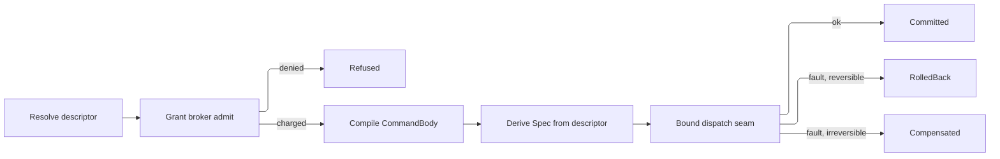

# [APPHOST_CAPABILITY_REGISTRY]

Rasm.AppHost mints one self-describing operation catalog for the suite: every canonical op surface contributes a typed `CapabilityDescriptor` carrying effect class, idempotency, cost model, and permission shape, the registry folds those rows into a shape-discriminated discovery surface, a command algebra wraps any invocation in commit-or-rollback over one composition-bound dispatch seam, a scoped grant broker meters admission against an object-set x op-class x classification x ceiling x window algebra, and one codegen surface emits identical command shapes for C#, TypeScript, and Python.

This page DECLARES the dispatch vocabulary the executing strata compose: `SubscriptionPolicy` the observer cadence a reporting op admits, `Spec` the whole dispatch posture, `CommandBody` the compiled op request, and `DispatchReceipt` the decoded execution evidence. The spine holds no downward reference — Compute admission adopts this `Spec` whole onto its `ComputeIntent` and resolves the three posture KEYS the record carries through its own generated `Validate`/`TryGet` onto its `Fin` rail, and the intent record itself never crosses up. `WorkLane`, the `CostModel` cousins, `TenantContext`, `DegradationLevel`, `ReceiptSinkPort`, `InstrumentSet`, and `DataClassification` arrive settled, and no eighth port is minted.

## [01]-[INDEX]

- [02]-[DESCRIPTOR_AXIS]: Self-describing op rows encoding effect class, idempotency, cost, and permission shape.
- [03]-[DISCOVERY_FOLD]: Frozen registry with shape-discriminated discovery queries over descriptor rows.
- [04]-[COMMAND_ALGEBRA]: Commit-or-rollback intent transaction over the one composition-bound dispatch seam.
- [05]-[GRANT_BROKER]: Scoped grant algebra covering consent, elevation, cost metering, and dry-run policy simulation.
- [06]-[SDK_CODEGEN]: C#/TS/Python command-shape emission off one descriptor source.
- [07]-[PEER_DISCOVERY]: Generated capability-catalog projection consumed by Python; the descriptor pin remains TypeScript's distinct face.

## [02]-[DESCRIPTOR_AXIS]

- Owner: `EffectClass` `[SmartEnum<string>]` five-row effect taxonomy under the `ComparerAccessors.StringOrdinal` accessor; `Idempotency` `[SmartEnum<string>]` four-row repeat-safety vocabulary carrying its dedup-key regime as a column; `KeyRegime` `[SmartEnum<string>]` the four-row dedup-key vocabulary that column reads; `CostUnit` `[SmartEnum<string>]` the metered-resource axis; `MeterVector` the per-unit metering algebra every cost, ceiling, and balance rides; `SubscriptionPolicy` the observer-cadence record the progress column carries; `CostModel` per-descriptor cost record; `PermissionShape` the object-set × op-class scope record; `ArgumentContract` the native-metadata or published-schema union; `CapabilityDescriptor` the self-describing op row; `DescriptorReceipt` the per-registration projection.
- Cases: 5 effect rows — pure, read, write, external, irreversible — in escalating side-effect severity; 4 idempotency rows — idempotent, keyed, single-shot, non-idempotent — each naming its `KeyRegime`; 4 key regimes — intrinsic (repeat-safe with no key), supplied (the caller's dedup key), minted (a host-minted once key), absent (no dedup key exists); each cost-unit row carries its metering key and UCUM code; 3 named cadence rows — immediate, interactive, wire — over the same three-threshold carrier a caller composes freely.
- Entry: `CapabilityDescriptor.Of(string surface, string op, ArgumentContract arguments, EffectClass effect, Idempotency idempotency, CostModel cost, PermissionShape permission, Option<SubscriptionPolicy> progress, Func<CommandArguments, Fin<CommandBody>> compile)` materializes one row whose id is the `{surface}.{op}` join, binding the descriptor's argument contract and the `CommandBody` it compiles to; `Describe(IServiceCollection services, Seq<string> surfaces, params ReadOnlySpan<CapabilityDescriptor> rows)` admits one complete descriptor snapshot across every surface it names through the `Contributors` fan-in registration, so a peer spanning four surface keys replaces all four in one call and a surface named with no row retires whole.
- Auto: each canonical op surface — `TensorOpFamily`, `ModelIdentity`, `ComputeEndpoint`, `QuantityFamily`, `SolverPluginContract` — projects its rows into descriptors at composition through one `Project` fold per surface so the catalog is generated from the op surfaces, never hand-listed, and a hand-authored op divorced from a descriptor (a free command method, a per-op MCP tool definition, a hand-written SDK client method) is the deleted form — the worked `TensorProjection.Project` fence is the one shape every surface follows, the worked `ModelProjection.Project` fence the model-draw instance whose `CostModel.Variable` closes over the composition-built `TiktokenTokenizer` and prices the prompt in `CostUnit.ModelTokens` through `CountTokens(prompt)` so a model draw is grant-priced and ceiling-gated before the provider sees a token (the per-call post-hoc `ChatResponse.Usage` charge at `#REASONING_LOOP` reconciles against this same `ModelTokens` axis the descriptor pre-prices), the sandbox `SolverPluginContract.Descriptors` projection the plugin-contract instance; every native row carries its source-generated `JsonTypeInfo` and every externally published row carries the SDK's exact `JsonSchema`, with `ArgumentContract.Schema` as the one projection MCP reads; the `Permission.Classification` field rides the `DataClassification` taxonomy so an op touching classified state declares it on the descriptor and the broker reads it before admission; the `Progress` field is the op's progress-report admission and `COMMAND_ALGEBRA` seats it verbatim on the `Spec` progress column, where the executing stratum's `ProgressCell.Mint` reads it as the only leaf-mint gate — a `None` row structurally has no cell for its producer to advance, so an op that reports declares its cadence once at its projection instead of at each dispatch; `Cost.Estimate` projects a static pre-flight cost from the argument shape so a dry run prices the command before any byte moves — a `CpuMillis` tensor draw prices off the payload element count, a `ModelTokens` model draw off the air-gapped embedded-vocab token count, never a `chars/4` heuristic; observability spend rows derive their instrument units from `CostUnit.Ucum`; the `rasm.apphost.capability.roster` census projects off the frozen catalog's own surface index at `#DISCOVERY_FOLD` `CapabilityRegistry.Mount`, so `Describe` stays a registration fold carrying no measurement rail outward and a mid-composition snapshot never publishes a partial count.
- Receipt: `DescriptorReceipt` — descriptor id, effect key, idempotency key, estimated cost vector, permission scope hash, `Instant`.
- Packages: Rasm (kernel `ContentHash.Of`/`Hex`, `CanonicalWriter`), Microsoft.Extensions.AI.Abstractions, Thinktecture.Runtime.Extensions, LanguageExt.Core, NodaTime, Microsoft.ML.Tokenizers, BCL inbox
- Growth: one descriptor row absorbs a new op — the effect, idempotency, cost, permission, and progress admission are column values on the row, never a parallel op-metadata table; a new effect class is one `EffectClass` row, a new metered resource one `CostUnit` row carrying its UCUM code, a new cost shape one `CostModel` field, a new metering operation one `MeterVector` member, a new dedup posture one `KeyRegime` row the `Idempotency` column reads; zero new surface.
- Boundary: `MeterVector` is the one metering algebra — a cost, a scope ceiling, a remaining balance, and a charged receipt vector are four readings of the same per-unit shape, so its subtraction floors each unit at zero and its sufficiency probe answers the offending unit, and a hand-folded per-unit arithmetic at any call site is the deleted form that let one vector read as spend at one end of a seam and as balance at the other; the descriptor is the suite's only op-metadata owner — argument schema included — so a per-op attribute scatter, a hand-kept command list, a schema resolver, and a second cost table are the deleted forms; the descriptor never carries the op's body, only its self-description and the `compile` projection to a `CommandBody`, so the registry stays metadata and the execution stays on the one composition-bound dispatch seam; `EffectClass.Irreversible` forces the command algebra onto the saga-compensation path because no rollback restores the prior state, and `EffectClass.Pure`/`Read` admit without a grant when the broker's read-floor policy permits; `Idempotency` and the transport edge's `HopIdempotency` stay two typed owners and their row sets are NOT disjoint — `Idempotent`, `Keyed`, and `SingleShot` are spelled on both, so a name comparison discriminates nothing; the discriminant is twofold and both halves are readable from the value: this roster carries a `KeyRegime` column and the hop roster carries none, because a dedup key is an op-level fact three protocol surfaces read off the key (`CapabilityMatch`, `DescriptorPin`, the SDK client) while hop dedup is process-local and leaves through no wire, and the two exclusive rows fall out of that same regime — `NonIdempotent` is op-only because `KeyRegime.Absent` has no hop meaning, `MethodDerived` hop-only because HTTP-method safety names no key at all; `SubscriptionPolicy` declares here because the descriptor's progress column is the one seat a surface answers its reporting posture at, while the `Due` delivery predicate over a mark pair belongs to the stratum that owns the mark and lands there as an extension member — the cadence is the declaration and the delivery decision is the consumer's, so neither side re-derives the other; the estimated cost vector traces to `CostUnit` rows and the descriptor's `CostModel`, never an inline literal; descriptor ids are `nameof`-derived op symbols joined with the owning surface key, never free literals; the progress column carries no default so every projection answers it and each `None` states its ground at the row, because a defaulted column declares a reporting posture no surface chose and a cadence re-derived at dispatch fabricates the policy the owning surface withheld.

```csharp
// --- [TYPES] ---------------------------------------------------------------------------
[SmartEnum<string>]
[KeyMemberEqualityComparer<ComparerAccessors.StringOrdinal, string>]
[KeyMemberComparer<ComparerAccessors.StringOrdinal, string>]
public sealed partial class EffectClass {
    public static readonly EffectClass Pure = new("pure", rank: 0, reversible: true);
    public static readonly EffectClass Read = new("read", rank: 1, reversible: true);
    public static readonly EffectClass Write = new("write", rank: 2, reversible: true);
    public static readonly EffectClass External = new("external", rank: 3, reversible: false);
    public static readonly EffectClass Irreversible = new("irreversible", rank: 4, reversible: false);

    public int Rank { get; }
    public bool Reversible { get; }
}

[SmartEnum<string>]
[KeyMemberEqualityComparer<ComparerAccessors.StringOrdinal, string>]
[KeyMemberComparer<ComparerAccessors.StringOrdinal, string>]
public sealed partial class KeyRegime {
    public static readonly KeyRegime Intrinsic = new("intrinsic");
    public static readonly KeyRegime Supplied = new("supplied");
    public static readonly KeyRegime Minted = new("minted");
    public static readonly KeyRegime Absent = new("absent");
}

[SmartEnum<string>]
[KeyMemberEqualityComparer<ComparerAccessors.StringOrdinal, string>]
[KeyMemberComparer<ComparerAccessors.StringOrdinal, string>]
public sealed partial class Idempotency {
    public static readonly Idempotency Idempotent = new("idempotent", KeyRegime.Intrinsic);
    public static readonly Idempotency Keyed = new("keyed", KeyRegime.Supplied);
    public static readonly Idempotency SingleShot = new("single-shot", KeyRegime.Minted);
    public static readonly Idempotency NonIdempotent = new("non-idempotent", KeyRegime.Absent);

    public KeyRegime Regime { get; }
}

[SmartEnum<string>]
[KeyMemberEqualityComparer<ComparerAccessors.StringOrdinal, string>]
[KeyMemberComparer<ComparerAccessors.StringOrdinal, string>]
public sealed partial class CostUnit {
    public static readonly CostUnit CpuMillis = new("cpu-millis", "ms");
    public static readonly CostUnit WallMillis = new("wall-millis", "ms");
    public static readonly CostUnit BytesEgress = new("bytes-egress", "By");
    public static readonly CostUnit ModelTokens = new("model-tokens", "{token}");
    public static readonly CostUnit Calls = new("calls", "{call}");

    public string Ucum { get; }
}

// --- [MODELS] --------------------------------------------------------------------------
public sealed record SubscriptionPolicy(Duration MinInterval, double MinFraction, long MinSegments) {
    public static readonly SubscriptionPolicy Immediate = new(Duration.Zero, 0d, 0L);
    public static readonly SubscriptionPolicy Interactive = new(Duration.FromMilliseconds(100), 0.01d, 64L);
    public static readonly SubscriptionPolicy Wire = new(Duration.FromMilliseconds(250), 0.05d, 256L);
}

public readonly record struct MeterVector(HashMap<CostUnit, long> Units) {
    public static readonly MeterVector Zero = new(HashMap<CostUnit, long>.Empty);

    public MeterVector Add(MeterVector other) =>
        new(other.Units.Fold(Units, static (acc, kv) => acc.AddOrUpdate(kv.Key, existing => existing + kv.Value, kv.Value)));

    public MeterVector Subtract(MeterVector other) =>
        new(other.Units.Fold(Units, static (acc, kv) => acc.AddOrUpdate(kv.Key, existing => long.Max(existing - kv.Value, 0L), 0L)));

    public long Of(CostUnit unit) => Units.Find(unit).IfNone(0L);

    public Option<(string Unit, long Over)> Shortfall(MeterVector draw) =>
        toSeq(draw.Units.AsIterable().OrderBy(static row => row.Key.Key, StringComparer.Ordinal))
            .Filter(row => row.Value > Of(row.Key))
            .Head
            .Map(row => (row.Key.Key, row.Value - Of(row.Key)));
}

public sealed record CostModel(MeterVector Fixed, Seq<CostModel.VariableCost> Variable) {
    public sealed record VariableCost(CostUnit Unit, Func<CommandArguments, long> Estimate);

    public static readonly CostModel Free = Constant(MeterVector.Zero);

    public static CostModel Constant(MeterVector fixedCost) =>
        new(fixedCost, Seq<VariableCost>());

    public static CostModel Of(MeterVector fixedCost, params ReadOnlySpan<VariableCost> variable) =>
        new(fixedCost, Iterable<VariableCost>.FromSpan(variable).ToSeq());

    public static VariableCost Per(CostUnit unit, Func<CommandArguments, long> estimate) =>
        new(unit, estimate);

    public FrozenSet<CostUnit> Units =>
        (toSeq(Fixed.Units.Keys) + Variable.Map(static row => row.Unit)).ToFrozenSet();

    public MeterVector Estimate(CommandArguments arguments) =>
        Variable.Fold(Fixed, (total, row) =>
            total.Add(new MeterVector(HashMap((row.Unit, row.Estimate(arguments))))));
}

public sealed record PermissionShape(
    FrozenSet<string> ObjectSet,
    EffectClass OpClass,
    DataClassification Classification) {
    public static readonly PermissionShape Open = new(FrozenSet<string>.Empty, EffectClass.Read, DataClassification.Operational);

    public string ScopeHash => ContentHash.Hex(ContentHash.Of(this, static (shape, writer) => writer
        .String(shape.OpClass.Key)
        .String(shape.Classification.Key)
        .Sorted(toSeq(shape.ObjectSet), static entry => entry, StringComparer.Ordinal,
            static (entry, member) => member.String(entry))));
}

[Union]
public abstract partial record ArgumentContract {
    public sealed record Native(JsonTypeInfo Metadata) : ArgumentContract;
    public sealed record Published(JsonElement Document) : ArgumentContract;

    public JsonElement Schema => Switch(
        native: static source => AIJsonUtilities.CreateJsonSchema(
            source.Metadata.Type,
            serializerOptions: source.Metadata.Options),
        published: static source => source.Document.Clone());
}

public sealed record CommandArguments(JsonElement Payload, TenantContext Tenant, CorrelationId Correlation, Option<string> Round = default);

public sealed record CapabilityDescriptor(
    string Id,
    string Surface,
    ArgumentContract Arguments,
    EffectClass Effect,
    Idempotency Idempotency,
    CostModel Cost,
    PermissionShape Permission,
    Option<SubscriptionPolicy> Progress,
    Func<CommandArguments, Fin<CommandBody>> Compile) {
    public static CapabilityDescriptor Of(string surface, string op, ArgumentContract arguments, EffectClass effect, Idempotency idempotency, CostModel cost, PermissionShape permission, Option<SubscriptionPolicy> progress, Func<CommandArguments, Fin<CommandBody>> compile) =>
        new($"{surface}.{op}", surface, arguments, effect, idempotency, cost, permission, progress, compile);

    public DescriptorReceipt Receipt(CommandArguments arguments, Instant at) =>
        new(Id, Effect.Key, Idempotency.Key, Cost.Estimate(arguments), Permission.ScopeHash, at);
}

public readonly record struct DescriptorReceipt(
    string Descriptor,
    string Effect,
    string Idempotency,
    MeterVector Estimated,
    string ScopeHash,
    Instant At);

// --- [OPERATIONS] ----------------------------------------------------------------------
public static class DescriptorSurface {
    public static IServiceCollection Describe(IServiceCollection services, Seq<string> surfaces, params ReadOnlySpan<CapabilityDescriptor> rows) {
        var replaced = surfaces.ToFrozenSet(StringComparer.Ordinal);
        var swept = toSeq(services.Where(prior => prior.ImplementationInstance is CapabilityDescriptor stale && replaced.Contains(stale.Surface)).ToArray())
            .Fold(services, static (current, dead) => { current.Remove(dead); return current; });
        return Iterable<CapabilityDescriptor>.FromSpan(rows).ToSeq()
            .Fold(swept, static (current, row) => current.AddSingleton(typeof(CapabilityDescriptor), row));
    }
}

// --- [COMPOSITION] ---------------------------------------------------------------------
public static class TensorProjection {
    public static IServiceCollection Project(IServiceCollection services, Func<TensorOpFamily, JsonTypeInfo> argumentsOf, Func<TensorOpFamily, JsonElement, Fin<CommandBody>> compileOf) =>
        DescriptorSurface.Describe(services, Seq(nameof(TensorOpFamily)), [.. TensorOpFamily.Items.AsIterable().Map(family => Row(family, argumentsOf, compileOf))]);

    static CapabilityDescriptor Row(TensorOpFamily family, Func<TensorOpFamily, JsonTypeInfo> argumentsOf, Func<TensorOpFamily, JsonElement, Fin<CommandBody>> compileOf) =>
        CapabilityDescriptor.Of(
            surface: nameof(TensorOpFamily),
            op: family.Key,
            arguments: new ArgumentContract.Native(argumentsOf(family)),
            effect: EffectClass.Pure,
            idempotency: Idempotency.Idempotent,
            cost: CostModel.Of(
                new MeterVector(HashMap((CostUnit.Calls, 1L))),
                CostModel.Per(CostUnit.CpuMillis, static args => args.Payload.GetProperty("elements").GetInt64())),
            permission: new PermissionShape(FrozenSet<string>.Empty, EffectClass.Pure, DataClassification.Operational),
            progress: None,
            compile: args => compileOf(family, args.Payload));
}

public static class ModelProjection {
    public static IServiceCollection Project(IServiceCollection services, Seq<string> models, TiktokenTokenizer tokenizer, Func<string, JsonTypeInfo> argumentsOf, Func<string, JsonElement, Fin<CommandBody>> compileOf) =>
        DescriptorSurface.Describe(services, Seq(nameof(ModelIdentity)), [.. models.Map(model => Row(model, tokenizer, argumentsOf, compileOf))]);

    static CapabilityDescriptor Row(string model, TiktokenTokenizer tokenizer, Func<string, JsonTypeInfo> argumentsOf, Func<string, JsonElement, Fin<CommandBody>> compileOf) =>
        CapabilityDescriptor.Of(
            surface: nameof(ModelIdentity),
            op: model,
            arguments: new ArgumentContract.Native(argumentsOf(model)),
            effect: EffectClass.External,
            idempotency: Idempotency.NonIdempotent,
            cost: CostModel.Of(
                new MeterVector(HashMap((CostUnit.Calls, 1L))),
                CostModel.Per(CostUnit.ModelTokens,
                    args => (long)tokenizer.CountTokens(args.Payload.GetProperty("prompt").GetString() ?? string.Empty))),
            permission: new PermissionShape(FrozenSet.Create(model), EffectClass.External, DataClassification.Operational),
            progress: Some(SubscriptionPolicy.Wire),
            compile: args => compileOf(model, args.Payload));

    public static TiktokenTokenizer ForModel(string modelName) => TiktokenTokenizer.CreateForModel(modelName);
    public static TiktokenTokenizer ForEncoding(string encodingName) => TiktokenTokenizer.CreateForEncoding(encodingName);
}
```

## [03]-[DISCOVERY_FOLD]

- Owner: `CapabilityRegistry` the frozen descriptor catalog with the alternate-lookup probe and the roster-census mount; `DiscoveryQuery` `[Union]` the shape-discriminated query family; `CapabilityMatch` the interior matched-descriptor projection.
- Cases: `ById(string Id)`, `BySurface(string Surface)`, `ByEffect(EffectClass Effect)`, `Permitting(DegradationLevel Level)`, `ByIntent(string Intent)`, `All` — one polymorphic discovery entrypoint discriminates on the query value, never a `GetById`/`GetBySurface`/`List` proliferation; `ByIntent` is the semantic arm — the embedding-rank delegate `Agent/reasoning#SEMANTIC_DISCOVERY` binds at composition ranks descriptors by intent similarity, and an unbound index answers empty rather than faulting.
- Entry: `Discover(DiscoveryQuery query)` returns `Seq<CapabilityMatch>` — the single discovery operation folds the query case over the frozen catalog; `Resolve(string id)` returns `Option<CapabilityDescriptor>` through the ordinal alternate-lookup; `Mount(InstrumentSet set)` returns `Fin<Unit>` — the composition's roster proof, folding the frozen surface index onto the keyed `rasm.apphost.capability.roster` family after `InstrumentFan.Mount` has already proved every contributed board pack against that same set, so this leg carries the one descriptor claim a port cannot: a registry fan-in the mount fold never sees.
- Auto: the registry freezes the descriptor fan-in into one `FrozenDictionary<string, CapabilityDescriptor>` at composition and a `Lookup<string, CapabilityDescriptor>` index by surface so a surface query reads one bucket; `Permitting` folds the level's retained capability set against each descriptor's `EffectClass` so a degraded host advertises only the ops it can still serve, deleting a parallel per-level command list, and an `Irreversible` row carries the extra floor its class earns — no rollback restores the prior state, so a host that has shed anything in the write path stops advertising it while ordinary writes still serve; the roster census IS that surface index counted, so `Mount` writes each surface's count in one traversal and the pulled-gate refusal — an unmounted or scalar-mounted family — aborts on the first offending surface while the descriptor set is still editable, one mis-mounted family being the whole defect and a per-surface repetition of it burying the fact under itself; every entry keys on its surface because the column is required and the descriptor id interpolates it, so this family declares a key it always carries and the kernel's untagged arm stays unreachable here by construction.
- Receipt: `CapabilityMatch` — descriptor id, surface, argument contract, typed effect/idempotency, empty-argument estimate, full cost-unit roster, and scope hash; it is an in-process registry view, never the generated peer-discovery contract.
- Packages: Rasm (kernel `InstrumentSet`), Thinktecture.Runtime.Extensions, LanguageExt.Core, BCL inbox
- Growth: one query case absorbs a new discovery axis; a new index is one frozen projection over the catalog, never a second registry; a new roster dimension is one column on the census projection the one `Mount` write carries; zero new surface.
- Boundary: the registry is read-only after the composition freeze — a runtime descriptor mutation is the deleted form, mirroring the composition-root `MakeReadOnly` law; the census homes here rather than at the admission fold because the count is a projection of the frozen catalog and never an accumulated cell — a per-`Describe` push publishes a mid-composition partial, forks the truth across the native and federated snapshot sites, and manufactures a measurement rail a registration fold structurally cannot carry outward; `Permitting` reads `DegradationLevel.Retains` as settled vocabulary and maps each `EffectClass` to its gating `Faculty` (write maps to `StoreWrite`, external to `RemoteCompute`, read to `StoreRead`) so discovery and the runtime degradation rail share one capability semantic; the discovery surface is the projection the MCP `tools/list`, the SDK codegen, and the dashboard command palette all read, so a new consumer reads the same fold and never re-enumerates the descriptor fan-in.

```csharp
// --- [TYPES] ---------------------------------------------------------------------------
[Union(ConversionFromValue = ConversionOperatorsGeneration.None)]
public abstract partial record DiscoveryQuery {
    private DiscoveryQuery() { }
    public sealed record ById(string Id) : DiscoveryQuery;
    public sealed record BySurface(string Surface) : DiscoveryQuery;
    public sealed record ByEffect(EffectClass Effect) : DiscoveryQuery;
    public sealed record Permitting(DegradationLevel Level) : DiscoveryQuery;
    public sealed record ByIntent(string Intent) : DiscoveryQuery;
    public sealed record All : DiscoveryQuery;
}

// --- [MODELS] --------------------------------------------------------------------------
public readonly record struct CapabilityMatch(
    string Descriptor,
    string Surface,
    ArgumentContract Arguments,
    EffectClass Effect,
    Idempotency Idempotency,
    MeterVector Estimated,
    Seq<CostUnit> Units,
    string ScopeHash);

// --- [SERVICES] ------------------------------------------------------------------------
public sealed class CapabilityRegistry {
    readonly FrozenDictionary<string, CapabilityDescriptor> byId;
    readonly ILookup<string, CapabilityDescriptor> bySurface;
    readonly FrozenDictionary<string, CapabilityDescriptor>.AlternateLookup<ReadOnlySpan<char>> probe;

    readonly Option<Func<string, Seq<string>>> byIntent;

    public CapabilityRegistry(IEnumerable<CapabilityDescriptor> rows, Option<Func<string, Seq<string>>> intentRank = default) {
        var rowSet = rows.ToArray();
        byId = rowSet.ToFrozenDictionary(static row => row.Id, StringComparer.Ordinal);
        bySurface = rowSet.ToLookup(static row => row.Surface, StringComparer.Ordinal);
        probe = byId.GetAlternateLookup<ReadOnlySpan<char>>();
        byIntent = intentRank;
    }

    public Option<CapabilityDescriptor> Resolve(string id) =>
        probe.TryGetValue(id, out var row) ? Optional(row) : None;

    public Fin<Unit> Mount(InstrumentSet set) =>
        toSeq(bySurface)
            .TraverseM(group => set.Level(AppHostMeasure.CapabilityRoster.Row, group.Count(), Some(group.Key)))
            .As()
            .Map(static _ => unit);

    public Seq<CapabilityMatch> Discover(DiscoveryQuery query) =>
        Project(query.Switch(
            byId: q => Resolve(q.Id).ToSeq(),
            bySurface: q => bySurface[q.Surface].ToSeq(),
            byEffect: q => byId.Values.Where(row => row.Effect == q.Effect).ToSeq(),
            permitting: q => byId.Values.Where(row => Admits(q.Level, row.Effect)).ToSeq(),
            byIntent: q => byIntent.Match(
                Some: rank => rank(q.Intent).Map(Resolve).Somes().ToSeq(),
                None: () => Seq<CapabilityDescriptor>()),
            all: _ => byId.Values.ToSeq()));

    static bool Admits(DegradationLevel level, EffectClass effect) =>
        level.Retains.Admits(Gate(effect))
        && (effect != EffectClass.Irreversible
            || (level.Retains.Admits(Faculty.StoreWrite) && level.Retains.Admits(Faculty.RemoteCompute)));

    static Faculty Gate(EffectClass effect) => effect.Switch(
        pure: static () => Faculty.LocalCompute,
        read: static () => Faculty.StoreRead,
        write: static () => Faculty.StoreWrite,
        external: static () => Faculty.RemoteCompute,
        irreversible: static () => Faculty.StoreWrite);

    static Seq<CapabilityMatch> Project(Seq<CapabilityDescriptor> rows) =>
        rows.Map(static row => new CapabilityMatch(
            row.Id, row.Surface, row.Arguments, row.Effect, row.Idempotency,
            row.Cost.Fixed,
            toSeq(row.Cost.Units.OrderBy(static unit => unit.Key, StringComparer.Ordinal)),
            row.Permission.ScopeHash));
}
```

## [04]-[COMMAND_ALGEBRA]

- Owner: `CommandBody` the compiled op request; `Spec` the whole dispatch posture, carrying the executing stratum's allocation, cache, and substrate vocabularies as their smart-enum KEYS; `DispatchReceipt` the decoded execution evidence; `CommandTxn` `[Union]` the transaction disposition; `CommandFault` `[Union]` fault family riding the kernel `[FaultCase]`/`Fault` floor (`[FaultCase]` realizes the registry over `FaultBand.HostCommand`); `CommandReceipt` the per-command evidence record; `CommandAlgebra` the static commit-or-rollback surface threading a descriptor invocation through the grant broker, the in-process lane governor, and onto the one bound dispatch seam.
- Cases: transaction dispositions Committed | RolledBack | Compensated | Refused; `CommandFault` = NotFound | GrantDenied | CompileRejected | ExecutionFaulted | CompensationFailed | MacroIncomplete | Vetoed | LaneRefused — `LaneRefused` the in-process governor's own refusal carried whole, `MacroIncomplete` the transcript-to-macro completeness refusal `Agent/reasoning#REPLAYABLE_TRANSCRIPT` mints when a tool call's exact receipt never joined, `Vetoed` the admission refusal `Agent/runtime#DISPATCH_FRONT_DOOR` mints through `Refuse` for a command the hook rail declined ahead of the transaction.
- Entry: `Run(CommandRuntime runtime, string descriptorId, CommandArguments arguments)` returns `IO<CommandReceipt>` — the algebra resolves the descriptor, brokers the grant, compiles the `CommandBody`, derives the `Spec` from the resolved row, hands the pair to the bound dispatch, and commits or rolls back; `Refuse(CommandRuntime runtime, string descriptorId, CommandFault fault, CommandArguments arguments)` returns `IO<CommandReceipt>` — the one mint for a disposition decided ahead of the transaction, so an admission gate's refusal rides the same message envelope and the same fan a dispatched command's does; `Batch(CommandRuntime runtime, Seq<(string Id, CommandArguments Args)> commands)` runs an all-or-nothing intent group folding each command's compensation in reverse on the first failure, each unwind re-priced off the original argument payload.
- Auto: a reversible-effect command captures no compensation and the rollback is the absence of commit; an `EffectClass.Irreversible` command requires a compensation descriptor declared on the runtime and rolls forward through it, never a phantom undo; the dispatch lands through the ONE `CommandRuntime.Dispatch` seam the composition root binds — the root holds each executing stratum's reference and this algebra holds none, so the transaction boundary is this owner's while substrate selection and execution stay the stratum's, and a second dispatcher, a stratum type on this page's rail, or a federated arm beside the seam are three spellings of one deleted form; the `Spec` this algebra builds is DERIVED from the resolved row and carries no literal: its progress admission crosses verbatim, so the forward command and its compensation both dispatch under the reporting posture their descriptors declared and `ProgressCell.Mint` refuses a cell to every op that declared none, and that same admission selects the `WorkLane` — a declared posture is the long-running witness, so a streaming op takes the throughput lane and a silent one the interactive lane — with the `DeadlineClass` following from the lane through the `Runtime/laneguard#LANE_GUARD` `LaneClass` rank binding, so no op names a lane, no seat names a deadline, and a whole-model fold can no longer ride an interactive lane on a transport hop's budget; `Run` captures one `MonotonicStamp` off `ClockPolicy.Line` before descriptor resolution and every refusal, commit, rollback, and compensation receipt derives its span from that stamp through the timeline rather than a wall subtraction; every dispatch crosses `Runtime/laneguard#LANE_GUARD` `LaneGuard.Run` on the lane the posture already resolved, so admission, bulkhead, breaker, allotment, and re-drive bracket the work and the governor's `LaneFault` family answers as a structured `CommandTxn.Refused` observation — a resource refusal the transaction records without compensating work that never started; every disposition lowers its terminal error through `FaultWire.Observe` and mints one wire-safe `CommandReceipt` fanned through `ReceiptSinkPort.Send` under `TelemetrySource.AppHost` and `ReceiptKind.Command`, so admission counts and per-unit grant spend project off one message envelope with no live `Error` or message surrogate inside it; a charge is a draw against DELIVERED work — every non-committed settlement (compile refusal, lane refusal, rollback, compensation) returns its drawn vector through `GrantBroker.Refund` before the mint, so `Charged` reads the settled draw and the spend gauge never counts work the tenant never received, while the `Batch` unwind's `Refund` stays the return for committed-then-unwound steps.
- Receipt: `CommandReceipt` — descriptor id, transaction disposition, settled charge vector (zero on every refunded non-committed arm), `DispatchReceipt` of the dispatched body, elapsed `Duration`, correlation id, tenant.
- Packages: Rasm (kernel `MonotonicTimeline`, `ReceiptSinkPort`), LanguageExt.Core, NodaTime, Thinktecture.Runtime.Extensions, BCL inbox
- Growth: one transaction disposition is one `CommandTxn` case breaking every consumer arm; one fault is one `CommandFault` case; a new compensation strategy is one column on the descriptor runtime, never a second algebra; zero new surface.
- Boundary: the command algebra is the only commit-or-rollback owner for op invocation — a per-op transaction helper and a hand-rolled saga loop are the deleted forms; the `Batch` group is an intent transaction, not a database transaction — durable atomicity stays the Persistence execution strategy and the algebra composes the command group, so the two transaction concerns never merge; the dispatch seam is a BOUND DELEGATE, not an imported entrypoint — the executing stratum's intent record, its admission gate, and its selection receipt all stay behind it while this spine declares the request and PORT-decodes the `DispatchReceipt`, so the spine holds no downward CLR reference and one `Spec` re-spelled at a consumer is the second deleted form; the allocation, cache, and substrate columns cross as their smart-enum KEYS because those three vocabularies belong to the stratum that executes — a typed column inverts the strata direction for a roster the consumer already holds, so the consumer admits each key through its own generated `Validate`/`TryGet` onto its `Fin` rail and carries the resolved rows on its admitted intent, an unknown key refusing at the one gate that can name it; the default posture keys spell once as constants on this record and a key literal repeated at a `Posture` arm is the deleted form, because the executing roster can retire a row without breaking a literal spelled anywhere else; the grant brokerage at `GRANT_BROKER` runs before compile so a denied command never compiles a `CommandBody` and never charges cost; the compensation runs under the same `CancelScope` the forward command derived, so a drain-interrupted rollback escalates through the conductor rather than orphaning; `CommandTxn.Compensated` carries the compensation's own receipt so the evidence stream records the roll-forward, never a silent swallow.

```csharp
// --- [TYPES] ---------------------------------------------------------------------------
public sealed record CommandBody(string Surface, string Op, JsonElement Payload);

public sealed record Spec(
    DeadlineClass Deadline,
    WorkLane Lane,
    string Allocation,
    string Cache,
    Option<(Duration Allotted, string Provenance)> Budget = default,
    Option<long> ByteCap = default,
    Option<long> ElementCap = default,
    Option<string> Forced = default,
    Option<SubscriptionPolicy> Progress = default) {
    public const string PooledAllocation = "pooled-memory";
    public const string BypassCache = "bypass";
}

[Union(ConversionFromValue = ConversionOperatorsGeneration.None)]
public abstract partial record CommandTxn {
    private CommandTxn() { }
    public sealed record Committed(DispatchReceipt Dispatch) : CommandTxn;
    public sealed record RolledBack(Rasm.Contracts.Fault.FaultObservation Reason) : CommandTxn;
    public sealed record Compensated(
        Rasm.Contracts.Fault.FaultObservation Reason,
        DispatchReceipt Compensation) : CommandTxn;
    public sealed record Refused(Rasm.Contracts.Fault.FaultObservation Fault) : CommandTxn;

    public static CommandTxn Reverted(Error reason) => new RolledBack(FaultWire.Observe(reason));
    public static CommandTxn Recovered(Error reason, DispatchReceipt compensation) =>
        new Compensated(FaultWire.Observe(reason), compensation);
    public static CommandTxn Rejected(Error fault) => new Refused(FaultWire.Observe(fault));
}

[Union(ConversionFromValue = ConversionOperatorsGeneration.None)]
public abstract partial record CommandFault : Fault {
    private static readonly FaultBand FamilyBand = FaultBand.HostCommand;
    private CommandFault(string detail) => Detail = detail;
    public string Detail { get; }
    public sealed override string Message => Detail;

    [FaultCase(0)]
    public sealed partial record NotFound : CommandFault { public NotFound(string detail) : base(detail) { } }
    [FaultCase(1)]
    public sealed partial record GrantDenied : CommandFault, ICausedFault {
        public GrantDenied(string detail, Error cause) : base(detail) => Cause = cause;
        public Error Cause { get; }
    }
    [FaultCase(2)]
    public sealed partial record CompileRejected : CommandFault, ICausedFault {
        public CompileRejected(string detail, Error cause) : base(detail) => Cause = cause;
        public Error Cause { get; }
    }
    [FaultCase(3)]
    public sealed partial record ExecutionFaulted : CommandFault { public ExecutionFaulted(string detail) : base(detail) { } }
    [FaultCase(4)]
    public sealed partial record CompensationFailed : CommandFault, ICausedFault {
        public CompensationFailed(string detail, Error cause) : base(detail) => Cause = cause;
        public Error Cause { get; }
    }
    [FaultCase(5)]
    public sealed partial record MacroIncomplete : CommandFault { public MacroIncomplete(string detail) : base(detail) { } }
    [FaultCase(6)]
    public sealed partial record Vetoed : CommandFault, ICausedFault {
        public Vetoed(string detail, Error cause) : base(detail) => Cause = cause;
        public Error Cause { get; }
    }
    [FaultCase(7)]
    public sealed partial record LaneRefused : CommandFault, ICausedFault {
        public LaneRefused(LaneFault refusal) : base(refusal.Message) => Refusal = refusal;
        public LaneFault Refusal { get; }
        public Error Cause => Refusal;
    }
}

// --- [MODELS] --------------------------------------------------------------------------
public readonly record struct DispatchReceipt(string Executor, string Selection, Duration Elapsed);

public sealed record CommandReceipt(
    string Descriptor,
    CommandTxn Txn,
    MeterVector Charged,
    Duration Elapsed,
    CorrelationId Correlation,
    TenantContext Tenant,
    Instant At,
    Option<DispatchReceipt> Dispatch = default);

// --- [SERVICES] ------------------------------------------------------------------------
public sealed record CommandRuntime(
    CapabilityRegistry Registry,
    GrantBroker Broker,
    LaneGuard.Runtime Lanes,
    Func<CommandBody, Spec, CommandArguments, IO<Fin<DispatchReceipt>>> Dispatch,
    Func<string, Option<string>> CompensationOf,
    ClockPolicy Clocks,
    ReceiptSinkPort Sink,
    JsonSerializerOptions Wire,
    CancelScope Spine);

public static class CommandAlgebra {
    public static IO<CommandReceipt> Refuse(CommandRuntime runtime, string descriptorId, CommandFault fault, CommandArguments arguments) =>
        from mark in Marked(runtime)
        from receipt in Mint(runtime, descriptorId, CommandTxn.Rejected(fault), MeterVector.Zero, None, arguments, mark)
        select receipt;

    public static IO<CommandReceipt> Run(CommandRuntime runtime, string descriptorId, CommandArguments arguments) =>
        from mark in Marked(runtime)
        from receipt in runtime.Registry.Resolve(descriptorId).Match(
            Some: descriptor => Brokered(runtime, descriptor, arguments, mark),
            None: () => Mint(runtime, descriptorId, CommandTxn.Rejected(new CommandFault.NotFound(descriptorId)), MeterVector.Zero, None, arguments, mark))
        select receipt;

    static IO<MonotonicStamp> Marked(CommandRuntime runtime) =>
        runtime.Clocks.Line.Capture().Match(Succ: IO.pure, Fail: IO.fail<MonotonicStamp>);

    static IO<CommandReceipt> Brokered(CommandRuntime runtime, CapabilityDescriptor descriptor, CommandArguments arguments, MonotonicStamp mark) =>
        runtime.Broker.Admit(descriptor, arguments, DrawMode.Live).Match(
            Succ: charged => Dispatch(runtime, descriptor, arguments, charged, mark),
            Fail: fault => Mint(runtime, descriptor.Id,
                CommandTxn.Rejected(new CommandFault.GrantDenied(fault.Message, fault)),
                MeterVector.Zero, None, arguments, mark));

    static IO<CommandReceipt> Dispatch(CommandRuntime runtime, CapabilityDescriptor descriptor, CommandArguments arguments, MeterVector charged, MonotonicStamp mark) =>
        descriptor.Compile(arguments).Match(
            Succ: body => Posture(descriptor) switch {
                var spec =>
                    from dispatched in Governed(runtime, spec, body, arguments)
                    from txn in dispatched.Match(
                        Succ: receipt => IO.pure<CommandTxn>(new CommandTxn.Committed(receipt)),
                        Fail: error => error is LaneFault refusal
                            ? IO.pure(CommandTxn.Rejected(new CommandFault.LaneRefused(refusal)))
                            : Compensate(runtime, descriptor, arguments, error))
                    from settled in txn is CommandTxn.Committed
                        ? IO.pure(charged)
                        : IO.lift(() => runtime.Broker.Refund(arguments.Tenant, charged)).Map(static _ => MeterVector.Zero)
                    from minted in Mint(runtime, descriptor.Id, txn, settled, Dispatched(txn), arguments, mark)
                    select minted,
            },
            Fail: error =>
                from _returned in IO.lift(() => runtime.Broker.Refund(arguments.Tenant, charged))
                from minted in Mint(runtime, descriptor.Id,
                    CommandTxn.Rejected(new CommandFault.CompileRejected(error.Message, error)),
                    MeterVector.Zero, None, arguments, mark)
                select minted);

    static IO<Fin<DispatchReceipt>> Governed(CommandRuntime runtime, Spec spec, CommandBody body, CommandArguments arguments) =>
        LaneGuard.Run(runtime.Lanes, spec.Lane, _ => runtime.Dispatch(body, spec, arguments))
            .Catch(static (Error error) => error is LaneFault,
                   static (Error error) => IO.pure(Fin.Fail<DispatchReceipt>(error)));

    static IO<CommandTxn> Compensate(CommandRuntime runtime, CapabilityDescriptor descriptor, CommandArguments arguments, Error forward) =>
        descriptor.Effect.Reversible
            ? IO.pure(CommandTxn.Reverted(forward))
            : runtime.CompensationOf(descriptor.Id).Match(
                Some: compId => runtime.Registry.Resolve(compId).Match(
                    Some: comp => comp.Compile(arguments).Match(
                        Succ: body => runtime.Dispatch(body, Posture(comp), arguments).Map(done => done.Match(
                            Succ: receipt => CommandTxn.Recovered(forward, receipt),
                            Fail: error => CommandTxn.Rejected(new CommandFault.CompensationFailed(error.Message, error)))),
                        Fail: error => IO.pure(CommandTxn.Rejected(new CommandFault.CompensationFailed(error.Message, error)))),
                    None: () => IO.pure(CommandTxn.Rejected(new CommandFault.NotFound(compId)))),
                None: () => IO.pure(CommandTxn.Rejected(new CommandFault.NotFound(descriptor.Id))));

    public static IO<Seq<CommandReceipt>> Batch(CommandRuntime runtime, Seq<(string Id, CommandArguments Args)> commands) =>
        commands.FoldM(Seq<(CommandReceipt Receipt, CommandArguments Args)>(), (acc, command) =>
            Run(runtime, command.Id, command.Args).Bind(receipt =>
                receipt.Txn is CommandTxn.Committed
                    ? IO.pure(acc.Add((receipt, command.Args)))
                    : Unwind(runtime, acc).Map(unwound => unwound.Add((receipt, command.Args)))))
            .Map(static rows => rows.Map(static row => row.Receipt)).As();

    static IO<Seq<(CommandReceipt Receipt, CommandArguments Args)>> Unwind(CommandRuntime runtime, Seq<(CommandReceipt Receipt, CommandArguments Args)> committed) =>
        committed.Rev().TraverseM(step =>
            runtime.CompensationOf(step.Receipt.Descriptor).Match(
                Some: compId => Run(runtime, compId, step.Args).Map(done => (done, step.Args)),
                None: () => IO.pure((step.Receipt, step.Args)))).As();

    static Spec Posture(CapabilityDescriptor descriptor) =>
        (descriptor.Progress.IsSome ? WorkLane.Background : WorkLane.Interactive) switch {
            var lane => new(lane.Attempt, lane, Spec.PooledAllocation, Spec.BypassCache, Progress: descriptor.Progress),
        };

    static Option<DispatchReceipt> Dispatched(CommandTxn txn) => txn switch {
        CommandTxn.Committed c => Some(c.Dispatch),
        CommandTxn.Compensated c => Some(c.Compensation),
        _ => None,
    };

    static IO<CommandReceipt> Mint(CommandRuntime runtime, string descriptor, CommandTxn txn, MeterVector charged, Option<DispatchReceipt> dispatch, CommandArguments arguments, MonotonicStamp mark) =>
        from settled in Marked(runtime)
        from span in runtime.Clocks.Line.Elapsed(mark, settled).Match(Succ: IO.pure, Fail: IO.fail<TimeSpan>)
        let at = runtime.Clocks.Now
        let receipt = new CommandReceipt(descriptor, txn, charged, Duration.FromTimeSpan(span), arguments.Correlation, arguments.Tenant, at, dispatch)
        from _ in runtime.Sink.Send(arguments.Correlation, arguments.Tenant, TelemetrySource.AppHost, ReceiptKind.Command.Key, JsonSerializer.SerializeToElement(receipt, runtime.Wire))
        select receipt;
}
```



## [05]-[GRANT_BROKER]

- Owner: `GrantScope` the object-set × op-class × classification × cost-ceiling × time-window scope record; `Consent` `[Union]` the holder's standing disposition, which IS the scope resolution; `DrawMode` `[SmartEnum<string>]` the two-row draw posture replacing a `dryRun` thread; `Flow` `[SmartEnum<string>]` the metering sign, carrying its balance fold, sufficiency gate, store arrow, and unmetered seed as delegate columns; `Budget` the per-tenant scope-and-balance cell; `DistributedBudget` the cross-process fenced-store seam the broker opens, debits, and credits a durable per-tenant balance through; `GrantFault` `[Union]` fault family riding the kernel `[FaultCase]`/`Fault` floor (`[FaultCase]` realizes the registry over `FaultBand.Grant`); `GrantBroker` the admission-and-metering surface over one `Move` fold.
- Cases: consent dispositions Granted | Elevated | Denied | Expired; draw postures Live | Priced; metering signs Debit | Credit; `GrantFault` = OutOfScope | CeilingExceeded | WindowClosed | ConsentRequired | Fenced | Contended.
- Law: the metered vector is REMAINING BALANCE per unit on both rails and never cumulative spend — sufficiency is `remaining >= cost`, decided inside the store's atomic vector compare-and-decrement on the fenced rail and against the cell's own vector on the local one, so no ceiling crosses a debit and `CeilingExceeded` names the unit the draw overdraws; spend is the DERIVED reading `Ceiling - Remaining` and is stored nowhere, while `rasm.apphost.grant.spend.<unit>` keeps its producer per command off `CommandReceipt.Charged`; the ceiling's one write-side role is GRANTING a scope's opening balance at `Open`, which makes a scope's ceiling the complete roster of units its commands may meter — a unit the ceiling omits carries a zero balance and refuses on first draw, at the store exactly as here.
- Entry: `Open(GrantScope scope)` returns `Fin<MeterVector>` — the ONE seeding entry, taken by the surface that mints a `Granted` or `Elevated` disposition and by every window renewal: it credits the scope's ceiling onto the ledger through the one `Move` fold under `Flow.Credit`, whose `ON CONFLICT` establishes an absent unit row on the fenced rail and whose zero seed makes a fresh tenant's grant exactly one allowance; `Admit(CapabilityDescriptor descriptor, CommandArguments arguments, DrawMode mode)` returns `Fin<MeterVector>` — the broker folds the holder's `Consent` to a `GrantScope` (a granted or elevated disposition yields its scope, a denied one the `ConsentRequired` refusal, an expired one the `WindowClosed` refusal, so the disposition family is the resolution rather than a vocabulary nothing reads), evaluates the descriptor's `PermissionShape` against it through the typed `GrantScope.Covers` value-object predicate, prices the command through `CostModel.Estimate`, and moves the price under `Flow.Debit` at the caller's posture; `Simulate(CapabilityRegistry registry, Seq<(string Id, CommandArguments Args)> plan)` returns `Seq<(string Id, Fin<MeterVector>)>` — the pre-flight resolves EACH step's own descriptor and runs the identical decision-and-pricing fold at `DrawMode.Priced` against the live balance without drawing on it, so a mixed plan prices every row against the row's own cost model; `Refund(TenantContext tenant, MeterVector charged)` returns `Fin<MeterVector>` — the compensating return, `Flow.Credit` over the same `Move` fold, resolving no consent and evaluating no ceiling because a scope that closed between the charge and the unwind must never strand the tenant's balance; `ConsentOf` is a composition-bound resolver, not a free column — the root binds it from `Agent/identity#POLICY_GATE` `Consent.Of(principal, roster)` so the one validated `Principal` this suite mints is what resolves a disposition, and a broker constructed without it is unspellable.
- Auto: the permission decision is the deterministic `GrantScope.Covers` fold — the object-set × op-class × classification predicate is a typed value-object method, never an ambient role flag or a scattered per-op check; `DrawMode.Priced` decides and prices but never moves the balance, so the pre-flight and the live charge share ONE body and differ by exactly one generated arm; sufficiency is ONE predicate over ONE vector, `MeterVector.Shortfall` reading the draw against the remaining balance and naming the first offending unit ordinally, so a command inside its call balance but over its bytes-egress balance is denied on bytes-egress; the SIGN is a `Flow` row rather than a member pair — balance fold, sufficiency gate, store arrow, and unmetered seed are four columns, so a charge, an opening grant, and a saga return are three callers of one `Move` and a third sign lands as one row; the time window is two NodaTime `Instant` bounds the `Interval` carries so a grant outside its window resolves `Expired` and re-admits only on renewal, never a silent extension; when a `DistributedBudget` seam is bound a live move rides `Flow.Arrow` under the coordination `BudgetDebit`/`BudgetCredit` one-field vector fenced compare-and-decrement (`WHERE token >= held AND balance_i >= debit_i ∀i`), so every unit's sufficiency executes INSIDE the one atomic store write and a tenant's allowance holds fleet-wide per unit because two nodes presenting fresh tokens cannot both overshoot any unit; the generation each fenced write presents is the `BudgetToken` tenant-scoped read, the one generation source the `Wire/outbox#DISPATCH_SWEEP` watermark advance also composes rather than minting a second; this host gates sufficiency outside the fenced write ONLY at `DrawMode.Priced`, which prices off the vector the last fenced write itself ANSWERED and falls back to the `BudgetLoad` read only for a tenant this process has not yet written, because a fresh read beside a write that already reported its balance separates neither staleness from concurrency — so the live gate is always the atomic store-side check and a stale-token debit fails `Fenced`; the ledger seat is one bounded `Cell.Commit` whose `Contended` verdict REFUSES rather than reporting a balance no write recorded; with no seam bound the process ledger IS the whole meter, its miss seeding from `Flow.Seed` — the resolved ceiling for a draw, zero for a credit — so the durable quota is an opt-in backing the one broker entry consumes, never a parallel meter.
- Receipt: the broker's charge is the `CommandReceipt.Charged` vector the command algebra carries; the decision rides the consent transition's one `SpineLog` event inside the `FaultBand.SpineEvents` stride — no parallel grant receipt.
- Packages: Rasm (kernel `Cell.Commit`/`Transition`, `Dimension`), LanguageExt.Core, NodaTime, Thinktecture.Runtime.Extensions, BCL inbox
- Growth: one consent disposition is one `Consent` case; one scope dimension is one `GrantScope` column beside one `PermissionShape` field the `Covers` fold reads; a new metered resource rides the `CostUnit` axis already and a new balance operation lands on `MeterVector` at `DESCRIPTOR_AXIS`; a new draw posture is one `DrawMode` row and a new metering sign one `Flow` row with its four columns, neither adding a member; cross-process metering is the one `DistributedBudget` seam whose `Credit` arrow carries the opening grant and the compensating return alike, never a second meter; zero new surface.
- Boundary: the broker is the suite's only permission-and-cost owner — a per-op permission check, an ambient role flag, a second cost meter, and a quota service beside `GrantBroker` are the deleted forms; the broker owns permission, cost, consent, balance, and window as one fold, reading the descriptor's declared `PermissionShape` and never re-deriving the op's effect; the `GrantScope` keys by `TenantContext.TenantId` so a multi-tenant host meters each tenant's balance independently against one broker, never a per-tenant broker instance; the cross-process quota is a Persistence ripple, not an AppHost owner — the `DistributedBudget` seam opens, debits, and credits under the STORE-validated fence — the `BudgetToken` read presents the store-issued generation and the store's row-CAS predicate is the authoritative reject-lower — so two nodes racing a debit cannot double-spend, and the durable per-tenant `Budget` cell and the fenced ledger land under the `TenantId` RLS predicate as the branch `ONE_FENCED_LEASE_STORE` Persistence leg, consumed at the seam and landing in parallel; a refund CAN land a balance above the resolved scope's ceiling and that reading is legal, because the ceiling bounds what an `Open` grants and never what a balance may hold — the one case that produces it is a refund whose scope narrowed after the charge, and returning it whole is what keeps the meter from swallowing budget the tenant spent, while the narrowed scope still refuses every draw its `Covers` fold excludes and its next `Open` grants only the smaller allowance; the model-governance `Charge`, the plugin `GrantHandle` charge, and the operator call all debit against this one durable balance so a multi-node identity plane cannot let a tenant exceed its allowance N-fold, and the `Runtime/orchestration#STEP_EXECUTOR` saga unwind is `Refund`'s caller so every compensated step returns its own charged vector to the same ledger; `Consent.Elevated` is the consent-elevation path — a command the standing scope denies raises an elevation request the operator approves, landing a wider transient `GrantScope` with its own window and its own `Open`, never a standing privilege grant; the cost model integrates the live-metering identity-versus-quota seam at health-and-degradation, so an exhausted tenant degrades to `ReadOnly` through the same degradation rail rather than a parallel throttle.

```csharp
// --- [TYPES] ---------------------------------------------------------------------------
public sealed record GrantScope(
    TenantId Tenant,
    FrozenSet<string> ObjectSet,
    FrozenSet<EffectClass> OpClasses,
    FrozenSet<DataClassification> Classifications,
    MeterVector Ceiling,
    Interval Window) {
    public bool Covers(PermissionShape shape, Instant now) =>
        Window.Contains(now)
        && OpClasses.Contains(shape.OpClass)
        && (Classifications.Count == 0 || Classifications.Contains(shape.Classification))
        && (ObjectSet.Count == 0 || shape.ObjectSet.IsSubsetOf(ObjectSet));
}

[Union(ConversionFromValue = ConversionOperatorsGeneration.None)]
public abstract partial record Consent {
    private Consent() { }
    public sealed record Granted(GrantScope Scope) : Consent;
    public sealed record Elevated(GrantScope Scope, string Approver, Instant At) : Consent;
    public sealed record Denied(string Reason) : Consent;
    public sealed record Expired(Instant ClosedAt) : Consent;
}

[Union(ConversionFromValue = ConversionOperatorsGeneration.None)]
public abstract partial record GrantFault : Fault {
    private static readonly FaultBand FamilyBand = FaultBand.Grant;
    private GrantFault(string detail) => Detail = detail;
    public string Detail { get; }
    public sealed override string Message => Detail;

    [FaultCase(0)]
    public sealed partial record OutOfScope : GrantFault { public OutOfScope(string detail) : base(detail) { } }
    [FaultCase(1)]
    public sealed partial record CeilingExceeded : GrantFault { public CeilingExceeded(string unit, long over) : base($"{unit}:+{over}") => Unit = unit; public string Unit { get; } }
    [FaultCase(2)]
    public sealed partial record WindowClosed : GrantFault { public WindowClosed(string detail) : base(detail) { } }
    [FaultCase(3)]
    public sealed partial record ConsentRequired : GrantFault { public ConsentRequired(string detail) : base(detail) { } }
    [FaultCase(4)]
    public sealed partial record Fenced : GrantFault { public Fenced(string detail) : base(detail) { } }
    [FaultCase(5)]
    public sealed partial record Contended : GrantFault {
        public Contended(Dimension attempts) : base($"ledger:{attempts.Value}") => Attempts = attempts;
        public Dimension Attempts { get; }
    }
}

[SmartEnum<string>]
[KeyMemberEqualityComparer<ComparerAccessors.StringOrdinal, string>]
[KeyMemberComparer<ComparerAccessors.StringOrdinal, string>]
public sealed partial class DrawMode {
    public static readonly DrawMode Live = new("live");
    public static readonly DrawMode Priced = new("priced");
}

[SmartEnum<string>]
[KeyMemberEqualityComparer<ComparerAccessors.StringOrdinal, string>]
[KeyMemberComparer<ComparerAccessors.StringOrdinal, string>]
public sealed partial class Flow {
    public static readonly Flow Debit = new(
        "debit",
        apply: static (balance, amount) => balance.Subtract(amount),
        gate: static (balance, amount) => balance.Shortfall(amount),
        arrow: static store => store.Debit,
        seed: static scope => scope.Ceiling);

    public static readonly Flow Credit = new(
        "credit",
        apply: static (balance, amount) => balance.Add(amount),
        gate: static (_, _) => None,
        arrow: static store => store.Credit,
        seed: static _ => MeterVector.Zero);

    [UseDelegateFromConstructor] public partial MeterVector Apply(MeterVector balance, MeterVector amount);
    [UseDelegateFromConstructor] public partial Option<(string Unit, long Over)> Gate(MeterVector balance, MeterVector amount);
    [UseDelegateFromConstructor] public partial Func<TenantId, ulong, HashMap<string, long>, Fin<(ulong Generation, HashMap<string, long> Balances)>> Arrow(DistributedBudget store);
    [UseDelegateFromConstructor] public partial MeterVector Seed(GrantScope scope);
}

// --- [BOUNDARIES] ----------------------------------------------------------------------
public sealed record DistributedBudget(
    Func<TenantId, Fin<HashMap<string, long>>> Remaining,
    Func<TenantId, ulong, HashMap<string, long>, Fin<(ulong Generation, HashMap<string, long> Balances)>> Debit,
    Func<TenantId, ulong, HashMap<string, long>, Fin<(ulong Generation, HashMap<string, long> Balances)>> Credit,
    Func<TenantId, Fin<ulong>> Token);

// --- [MODELS] --------------------------------------------------------------------------
public sealed record Budget(GrantScope Scope, MeterVector Remaining) {
    public MeterVector Spent => Scope.Ceiling.Subtract(Remaining);
}

// --- [SERVICES] ------------------------------------------------------------------------
public sealed record GrantBroker(
    Atom<HashMap<TenantId, Budget>> Ledger,
    Func<TenantContext, Consent> ConsentOf,
    ClockPolicy Clocks,
    Option<DistributedBudget> Distributed = default) {
    public Fin<MeterVector> Open(GrantScope scope) =>
        Move(Flow.Credit, scope.Tenant, Some(scope), scope.Ceiling, DrawMode.Live).Map(_ => scope.Ceiling);

    public Fin<MeterVector> Admit(CapabilityDescriptor descriptor, CommandArguments arguments, DrawMode mode) {
        var now = Clocks.Now;
        var cost = descriptor.Cost.Estimate(arguments);
        return ConsentOf(arguments.Tenant).Switch(
                granted: static g => Fin.Succ(g.Scope),
                elevated: static e => Fin.Succ(e.Scope),
                denied: d => Fin.Fail<GrantScope>(new GrantFault.ConsentRequired(d.Reason)),
                expired: x => Fin.Fail<GrantScope>(new GrantFault.WindowClosed(x.ClosedAt.ToString())))
            .Bind(scope => scope.Window.Contains(now) ? Fin.Succ(scope) : Fin.Fail<GrantScope>(new GrantFault.WindowClosed(descriptor.Id)))
            .Bind(scope => scope.Covers(descriptor.Permission, now) ? Fin.Succ(scope) : Fin.Fail<GrantScope>(new GrantFault.OutOfScope(descriptor.Permission.ScopeHash)))
            .Bind(scope => Move(Flow.Debit, arguments.Tenant.TenantId, Some(scope), cost, mode));
    }

    public Seq<(string Id, Fin<MeterVector>)> Simulate(CapabilityRegistry registry, Seq<(string Id, CommandArguments Args)> plan) =>
        plan.Map(step => (step.Id, registry.Resolve(step.Id).Match(
            Some: descriptor => Admit(descriptor, step.Args, DrawMode.Priced),
            None: () => Fin.Fail<MeterVector>(new GrantFault.OutOfScope(step.Id)))));

    public Fin<MeterVector> Refund(TenantContext tenant, MeterVector charged) =>
        Move(Flow.Credit, tenant.TenantId, None, charged, DrawMode.Live);

    Fin<MeterVector> Move(Flow flow, TenantId tenant, Option<GrantScope> scope, MeterVector amount, DrawMode mode) =>
        Distributed.Match(
            Some: store => mode.Switch(
                priced: () => Mirrored(store, tenant).Bind(balance => Gated(flow, balance, amount)),
                live: () => store.Token(tenant)
                    .Bind(held => flow.Arrow(store)(tenant, held, Wire(amount)))
                    .Bind(written => Mirror(tenant, scope, Decode(written.Balances), amount))),
            None: () => Held(flow, tenant, scope).Match(
                Some: balance => Gated(flow, balance, amount).Bind(settled => mode.Switch(
                    priced: () => Fin.Succ(settled),
                    live: () => Mirror(tenant, scope, flow.Apply(balance, amount), settled))),
                None: () => Fin.Fail<MeterVector>(new GrantFault.OutOfScope(tenant.ToString()))));

    static Fin<MeterVector> Gated(Flow flow, MeterVector balance, MeterVector amount) =>
        flow.Gate(balance, amount).Match(
            Some: gap => Fin.Fail<MeterVector>(new GrantFault.CeilingExceeded(gap.Unit, gap.Over)),
            None: () => Fin.Succ(amount));

    Option<MeterVector> Held(Flow flow, TenantId tenant, Option<GrantScope> scope) =>
        Ledger.Value.Find(tenant).Map(static row => row.Remaining) || scope.Map(flow.Seed);

    Fin<MeterVector> Mirror(TenantId tenant, Option<GrantScope> scope, MeterVector next, MeterVector answer) =>
        Cell.Commit(Ledger,
            held => held.Find(tenant).Match(
                Some: row => held.AddOrUpdate(tenant, _ => row with { Remaining = next }, row),
                None: () => scope.Match(
                    Some: resolved => held.Add(tenant, new Budget(resolved, next)),
                    None: () => held)),
            Cell.SwapBudget) is Transition<HashMap<TenantId, Budget>>.Contended spent
            ? Fin.Fail<MeterVector>(new GrantFault.Contended(spent.Attempts))
            : Fin.Succ(answer);

    Fin<MeterVector> Mirrored(DistributedBudget store, TenantId tenant) =>
        Ledger.Value.Find(tenant).Match(
            Some: row => Fin.Succ(row.Remaining),
            None: () => store.Remaining(tenant).Map(Decode));

    static HashMap<string, long> Wire(MeterVector vector) =>
        vector.Units.AsIterable().Fold(HashMap<string, long>(), static (map, row) => map.Add(row.Key.Key, row.Value));

    static MeterVector Decode(HashMap<string, long> wire) =>
        new(wire.AsIterable().Fold(HashMap<CostUnit, long>(), static (map, row) =>
            CostUnit.TryGet(row.Key, out var unit) ? map.Add(unit, row.Value) : map));
}
```

## [06]-[SDK_CODEGEN]

- Owner: `SdkTarget` `[SmartEnum<string>]` the three language emission targets; `DescriptorPin` the canonical descriptor-set document and its content address — the frozen preimage the `capability-descriptor` seam registers at `libs/contracts/manifest.json` `CAPABILITY_DESCRIPTOR`, this section being that seam's named producer; `SdkArtifact` the emitted-source projection; `SdkCodegen` the static emission fold over the registry.
- Cases: 3 targets — csharp, typescript, python — each carrying its command-shape renderer and idiomatic call form.
- Entry: `DescriptorPin.Of(registry)` mints the fixed-field catalog document and its content address.
- Entry: `SdkCodegen.Emit(registry, pin, target)` renders one target from the same ordinal catalog and stamped pin digest.
- Auto: the pin addresses descriptor coordinates, policy, and cost-unit identity; runtime tool schemas never become a compatibility hash.
- Auto: descriptor rows, cost-unit keys, and fields use ordinal or fixed order before the document is addressed.
- Auto: `units` is the complete `CostModel.Units` roster, never the keys present in one estimate.
- Receipt: `DescriptorPin` — the canonical document, its content address, and the pinned row count; `SdkArtifact` — target key, emitted source text, descriptor count, and the PIN's digest, because a digest computed over emitted source addresses the renderer rather than the contract and three targets then disagree on one catalog by construction.
- Packages: Thinktecture.Runtime.Extensions, LanguageExt.Core, BCL inbox
- Growth: one target row absorbs a new language; a new call form is one renderer column on the row; a new pinned coordinate is one field on the canonical row the pin writes; zero new surface.
- Boundary: generated contract packages own request and receipt wire shape; this renderer binds descriptor ids onto those generated types.
- Boundary: peers grade the pin directly; generated source is a build artifact and never a descriptor owner.
- Boundary: the `DescriptorPin` content address is compatibility evidence for the catalog alone — JSON Schema is MCP runtime metadata, never a hashed substitute for generated contract compatibility.

```csharp
// --- [TYPES] ---------------------------------------------------------------------------
[SmartEnum<string>]
[KeyMemberEqualityComparer<ComparerAccessors.StringOrdinal, string>]
[KeyMemberComparer<ComparerAccessors.StringOrdinal, string>]
public sealed partial class SdkTarget {
    public static readonly SdkTarget CSharp = new("csharp", extension: ".cs", Csharp);
    public static readonly SdkTarget TypeScript = new("typescript", extension: ".ts", Typescript);
    public static readonly SdkTarget Python = new("python", extension: ".py", Python);

    public string Extension { get; }

    [UseDelegateFromConstructor]
    public partial string Render(CapabilityMatch descriptor);

    static string Csharp(CapabilityMatch d) =>
        $"public IO<CommandReceipt> {Method(d)}(CommandArguments arguments) => CommandAlgebra.Run(runtime, \"{d.Descriptor}\", arguments);";

    static string Typescript(CapabilityMatch d) =>
        $"{Method(d)}(args: CommandArguments): Promise<CommandReceipt> {{ return this.run(\"{d.Descriptor}\", args); }}";

    static string Python(CapabilityMatch d) =>
        $"def {Method(d)}(self, args: CommandArguments) -> CommandReceipt: return self._run(\"{d.Descriptor}\", args)";

    static string Method(CapabilityMatch d) => d.Descriptor.Replace('.', '_');
}

// --- [MODELS] --------------------------------------------------------------------------
public sealed record SdkArtifact(SdkTarget Target, string Source, int Descriptors, string PinDigest);

public sealed record DescriptorPin(string Document, string Digest, int Descriptors) {
    public static DescriptorPin Of(CapabilityRegistry registry) {
        var rows = toSeq(registry.Discover(new DiscoveryQuery.All()).OrderBy(static row => row.Descriptor, StringComparer.Ordinal));
        using var bytes = new MemoryStream();
        using (var json = new Utf8JsonWriter(bytes)) {
            json.WriteStartArray();
            rows.Iter(row => {
                json.WriteStartObject();
                json.WriteString("descriptor", row.Descriptor);
                json.WriteString("surface", row.Surface);
                json.WriteString("effect", row.Effect.Key);
                json.WriteString("idempotency", row.Idempotency.Key);
                json.WriteString("scope", row.ScopeHash);
                json.WritePropertyName("units");
                json.WriteStartArray();
                row.Units.Iter(unit => json.WriteStringValue(unit.Key));
                json.WriteEndArray();
                json.WriteEndObject();
            });
            json.WriteEndArray();
        }
        var document = bytes.ToArray();
        return new(Encoding.UTF8.GetString(document), ContentHash.Hex(ContentHash.Of(document)), rows.Count);
}

// --- [OPERATIONS] ----------------------------------------------------------------------
public static class SdkCodegen {
    public static SdkArtifact Emit(CapabilityRegistry registry, DescriptorPin pin, SdkTarget target) =>
        toSeq(registry.Discover(new DiscoveryQuery.All()).OrderBy(static row => row.Descriptor, StringComparer.Ordinal)) is var rows
            ? new SdkArtifact(target, string.Join('\n', rows.Map(target.Render)), pin.Descriptors, pin.Digest)
            : new SdkArtifact(target, string.Empty, 0, pin.Digest);
}
```

## [07]-[PEER_DISCOVERY]

- Owner: the host-free generated `capability.DiscoverResponse` is the only live peer-discovery shape; `CapabilityDiscovery.Project` is its C# projection.
- Entry: `Project(CapabilityRegistry registry, DegradationLevel level, DescriptorPin pin)` returns the level-permitted catalog bound to the full SDK pin.
- Packages: Rasm.Contracts, Google.Protobuf, LanguageExt.Core, BCL inbox
- Growth: one proto field or enum row regenerates every real consumer; a new consumer earns one codegen target, never a mirror.
- Boundary: the catalog reaches Python alone at `python:runtime/transport/serve#CAPABILITY_INVOKE`; TypeScript consumes only `capability.DescriptorPinWire`.
- Boundary: `DescriptorPinWire.document` is the sole static authority for surface, effect, idempotency, scope, and cost-unit semantics. An `AvailableCapability` carries only the descriptor whose presence states current availability and the fixed empty-argument estimates that exist now; a static unit with no amount emits no row.
- Boundary: protobuf carries only dynamic estimate unit identity and amount beside descriptor availability; the full static document and its 128-bit digest cross once on the pin.
- Auto: permitted descriptors and their present estimate rows emit ordinally, so live discovery is stable across registration order without becoming a second content identity.

```csharp
using CapabilityContract = Rasm.Contracts.Capability;

public static class CapabilityDiscovery {
    public static CapabilityContract.DiscoverResponse Project(
        CapabilityRegistry registry,
        DegradationLevel level,
        DescriptorPin pin) {
        CapabilityContract.DiscoverResponse catalog = new() {
            Pin = new CapabilityContract.DescriptorPinWire {
                Document = pin.Document,
                Digest = ByteString.CopyFrom(Convert.FromHexString(pin.Digest)),
                Descriptors = checked((uint)pin.Descriptors),
            },
        };
        catalog.Capabilities.Add(
            toSeq(registry.Discover(new DiscoveryQuery.Permitting(level))
                .OrderBy(static row => row.Descriptor, StringComparer.Ordinal)).Map(Project));
        return catalog;
    }

    static CapabilityContract.AvailableCapability Project(CapabilityMatch row) {
        CapabilityContract.AvailableCapability projected = new() { Descriptor_ = row.Descriptor };
        projected.Estimates.Add(
            toSeq(row.Estimated.Units.AsIterable().OrderBy(static pair => pair.Key.Key, StringComparer.Ordinal))
                .Map(static pair => new CapabilityContract.CapabilityEstimate {
                    Unit = Cost(pair.Key),
                    Amount = pair.Value,
                }));
        return projected;
    }

    static CapabilityContract.CostUnit Cost(CostUnit unit) => unit.Switch(
        cpuMillis: static () => CapabilityContract.CostUnit.CpuMillis,
        wallMillis: static () => CapabilityContract.CostUnit.WallMillis,
        bytesEgress: static () => CapabilityContract.CostUnit.BytesEgress,
        modelTokens: static () => CapabilityContract.CostUnit.ModelTokens,
        calls: static () => CapabilityContract.CostUnit.Calls);
}
```

## [08]-[RESEARCH]

<!-- source-only: research row template:
[TOKEN]-[OPEN|BLOCKED]: <exact question>; <verification route>.
[SPLIT_MEMBER]-[OPEN]: does `shape-core` expose `split_all`; verify against the member rail.
-->

(none)
