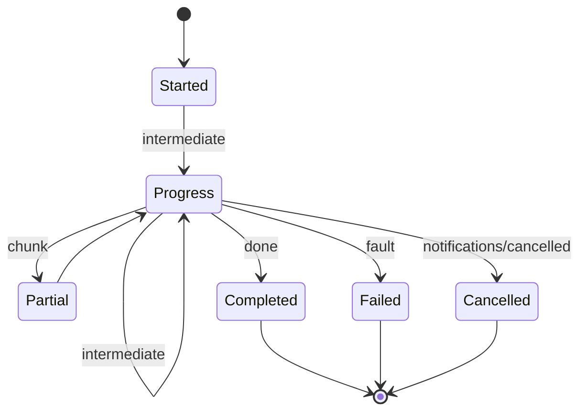

# [APPHOST_MCP_PROJECTION]

Model Context Protocol serving for the runtime spine rides the official `ModelContextProtocol` SDK, which owns JSON-RPC framing, transport, initialization, and error mapping, serving the stateless revision the folder's revision-election ruling settles. This page projects the capability registry onto its tool/resource/prompt surface. Each `CapabilityDescriptor` projects once to a brokered `Microsoft.Extensions.AI` `AIFunction` and its adopted `McpServerTool`; `McpAdoptedTool` exposes that exact pair to MCP registration and in-process reasoning.

Brokered dry-runs price tool calls before invocation, dispatch routes through the command algebra and yields the `CommandReceipt` the transport edge projects, a mid-call ask suspends onto the SDK's input-required rail and the client's retry answers it under one echoed round identity, and the protocol's own poll leg carries long-running calls over the cancel spine. This page owns the method axis, descriptor-to-`AIFunction` projection, the round-idempotent brokered dispatch, the input-required overage ask, and the agent-session roster.

## [01]-[INDEX]

- [02]-[METHOD_AXIS]: MCP method vocabulary with tool, resource, and prompt projection from the registry.
- [03]-[TOOL_DISPATCH]: Dry-run cost preview, brokered dispatch idempotent across MRTR rounds, the input-required overage ask, and the transport-edge result projection.
- [04]-[STREAM_PROGRESS]: Server-stream progress fan with cancellation, backpressure, and the request-polling leg a disconnected agent re-reads.
- [05]-[PROTOCOL_FACES]: Three shapes the SDK emits on the wire — tool catalog, progress notification, structured result.
- [06]-[APP_ROOT]: Service-host-root builder fold mounting the adopted primitives and the one ingress filter.

## [02]-[METHOD_AXIS]

- Owner: `McpMethod` `[SmartEnum<string>]` the MCP method vocabulary under the `ComparerAccessors.StringOrdinal` accessor; `ToolProjection` the descriptor-to-tool fold; `McpTool` the projected tool descriptor; `McpAnnotations` the one boundary projection of the SDK's tool hints off the effect class and the key regime; `McpAdoptedTool` the brokered function/server pair; `McpAdoption` the whole registration product carrying the tool, prompt, and resource primitives the server mounts; `McpResource` the projected resource handle; `McpPrompt` the projected prompt template.
- Cases: 11 method rows — initialize, server-discover, tools-list, tools-call, resources-list, resources-templates-list, resources-read, prompts-list, prompts-get, subscriptions-listen, ping — the SDK's non-deprecated served request surface, each carrying the `Cacheable` column the SDK's own `ICacheableResult` roster fixes; `CatalogFreshness` and `McpCatalogChange` carry the freshness contract; tool/resource/prompt projections fold the registry's `CapabilityMatch` rows. Roster loss stated: `completion/complete` stays off the axis because argument autocompletion needs a completion source this projection does not own, and the roots, logging, and sampling methods are `[Obsolete]` on the SDK at this revision.
- Entry: `Project(McpRuntime runtime)` returns `McpCatalog` — one fold projects the level-gated capability match into the MCP tool catalog (each tool carrying its descriptor-owned input schema and the one source-generated `CommandReceipt` output schema), so an agent sees exactly the tools the host can serve at its current degradation; `Tool(CapabilityMatch descriptor, JsonElement outputSchema)` is the single descriptor-to-tool projection; `Refresh(McpRuntime runtime, McpCatalog held)` returns `IO<McpCatalog>` — the one re-projection seat a degradation move drives, announcing the moved families before yielding the catalog that replaces the held one; `Adopt(McpRuntime runtime, McpCatalog catalog)` returns `McpAdoption` — one fold constructs each caller-neutral brokered function beside its SDK serving type AND mints the prompt and resource primitives off the same effect-filtered rows, safe to reuse across every agent because no caller identity is baked at adoption.
- Auto: each `CapabilityMatch` projects to one `Microsoft.Extensions.AI.AIFunction` (the `AIFunction : AIFunctionDeclaration : AITool` chain, where `JsonSchema` is a `JsonElement` on `AIFunctionDeclaration` and `Name`/`Description` are virtuals on `AITool`) whose overridden `JsonSchema` is the descriptor's `ArgumentContract.Schema`, so the SDK manifest consumes the descriptor row with no exporter, resolver, or hand-authored schema; the projection adopts a `CommandAIFunction : AIFunction` subclass whose `InvokeCoreAsync` resolves the ambient `TenantContext.Current` and mints a fresh `CorrelationId` per invocation on the caller's async flow — tenant identity and correlation are per-call facts, never adoption-time captures a boot-adopted tool would replay for every later caller — keeping `payload` the sole agent-facing input, and overrides `JsonSchema` to the descriptor schema, and `McpServerTool.Create(AIFunction, McpServerToolCreateOptions)` adopts it, with the projection setting the `McpServerToolCreateOptions` annotations from the descriptor's `EffectClass` (`pure`/`read` set `ReadOnly`, `write`/`external`/`irreversible` set `Destructive`) and `Idempotency` so an agent reads the side-effect class from the SDK's tool metadata; an `irreversible`-effect descriptor wraps its `CommandAIFunction` in the catalogued `ApprovalRequiredAIFunction` before `McpServerTool.Create` adopts it, so the destructive-side-effect class is a real human-in-the-loop approval gate the SDK enforces before invoke rather than only the advisory `Destructive` bool hint — the descriptor effect class drives both the metadata annotation and the enforcing wrapper from one source, never a parallel approval flag; the `Destructive` knob is `bool?` and the SDK treats unset/`true` as destructive, meaningful only when `ReadOnly=false`, so the projection always sets both explicitly with `ReadOnly` forcing `Destructive=false`, never inheriting the destructive default on an unset path; `Permitting` gating means a degraded host registers only the still-servable tools with zero parallel catalog.
- Auto: a call needing more than one round trip rides the SDK's own multi-round-trip input rail, never a host-held task cell — a tool body throws `InputRequiredException` carrying its `InputRequest` asks and an opaque `RequestState`, the client resolves each locally and RETRIES the same `tools/call` with the answers plus the echoed state, and `McpServer.IsMrtrSupported` is the guard a body checks before choosing that route. The retry is what makes the rail durable without host state: a suspended call holds nothing on this side of the wire, so a host restart between rounds costs the client one re-send rather than a lost in-flight task. The consequence the brokered dispatch owns is IDEMPOTENCE — a body reached again for the same `RequestState` must not re-charge its grant or re-mint its receipt, so the pre-flight ask keys off that state and `CommandAlgebra.Run` stays the single commit the last round reaches.
- Law: the served catalog is LEVEL-DEPENDENT, so freshness and change notification ship as one contract or neither ships. `Permitting` gating makes `Project` a function of `runtime.Level()`, so a degradation move re-authors a catalog a peer already holds; the SDK states that a relevant `list_changed` notification invalidates a cached response regardless of remaining TTL, which is exactly what makes a `TimeToLive` lawful here. Publishing a window without `Announce` serves a peer a catalog that silently outlives its own truth; publishing neither leaves `TimeToLive` absent, which the SDK reads as immediately stale and which charges every consumer a re-list every turn — the boilerplate this projection exists to delete.
- Law: cacheability TRANSCRIBES the SDK and is never decided here. `ICacheableResult` is implemented by exactly `server/discover`, `tools/list`, `prompts/list`, `resources/list`, `resources/templates/list`, and `resources/read`, so that roster is the `Cacheable` column's authority and a handler choosing its own freshness forks a contract the protocol already fixes. NAMED LOSS: a per-method window is no longer spellable. Witness: every cacheable row here derives from ONE registry read at ONE level, so per-row windows let two peers disagree about a single catalog.
- Law: a peer's change feed is what the server ADMITS, never what the client asked for. `subscriptions/listen` carries the per-kind opt-in and the server answers `notifications/subscriptions/acknowledged` with the subset it honours, so `Announce` fans the honoured set alone and a peer asking for a family the host declines learns that at subscribe time rather than by silence.
- Receipt: the projection is a pure fold producing the brokered `AIFunction`/registered `McpServerTool` pairs; every dispatched call's `CommandReceipt` crosses `AppHostPoint.Receipt` through the `AppHostHooks.Tap` sink decoration and its intent crosses `AppHostPoint.Command` at the `Agent/runtime#DISPATCH_FRONT_DOOR` veto seat, so this page spells no fire of its own; the served-method transition logs through one `SpineLog` event inside the `FaultBand.SpineEvents` stride — no parallel projection receipt.
- Packages: ModelContextProtocol, ModelContextProtocol.Core (`RequestMethods.ServerDiscover`/`.ResourcesTemplatesList`/`.SubscriptionsListen`, `ICacheableResult.TimeToLive`/`.CacheScope`, `CacheScope`, `DiscoverResult`, `SubscriptionsListenNotifications`, `SubscriptionsAcknowledgedNotificationParams`, `NotificationMethods.ToolListChangedNotification`/`.PromptListChangedNotification`/`.ResourceListChangedNotification`), Microsoft.Extensions.AI.Abstractions, Thinktecture.Runtime.Extensions, LanguageExt.Core, NodaTime (`Duration` the freshness window), BCL inbox
- Growth: a new method row tracks a new MCP request kind the SDK already serves, carrying its `Cacheable` cell off the SDK's `ICacheableResult` roster; a new change family is one `McpCatalogChange` case every `Announce` binding breaks loudly on; a new projection target is one fold arm on `Adopt` plus its `With*` registration leg; a new ingress concern is one `AddIncomingFilter` row; zero new surface — the agent transport is the registry projected onto the SDK, never a parallel command catalog.
- Boundary: the MCP projection is a read-only view of the capability registry. Every advertised tool is a real registry descriptor adopted as an `AIFunction`, and every tool call routes directly through the command algebra. JSON-RPC framing, initialization, and method dispatch belong to the SDK; no ControlService dispatch RPC shadows that path.

```csharp signature
// --- [TYPES] ---------------------------------------------------------------------------
[SmartEnum<string>]
[KeyMemberEqualityComparer<ComparerAccessors.StringOrdinal, string>]
[KeyMemberComparer<ComparerAccessors.StringOrdinal, string>]
public sealed partial class McpMethod {
    public static readonly McpMethod Initialize = new("initialize", cacheable: false);
    public static readonly McpMethod ServerDiscover = new("server/discover", cacheable: true);
    public static readonly McpMethod ToolsList = new("tools/list", cacheable: true);
    public static readonly McpMethod ToolsCall = new("tools/call", cacheable: false);
    public static readonly McpMethod ResourcesList = new("resources/list", cacheable: true);
    public static readonly McpMethod ResourcesTemplatesList = new("resources/templates/list", cacheable: true);
    public static readonly McpMethod ResourcesRead = new("resources/read", cacheable: true);
    public static readonly McpMethod PromptsList = new("prompts/list", cacheable: true);
    public static readonly McpMethod PromptsGet = new("prompts/get", cacheable: false);
    public static readonly McpMethod SubscriptionsListen = new("subscriptions/listen", cacheable: false);
    public static readonly McpMethod Ping = new("ping", cacheable: false);

    public bool Cacheable { get; }
}

// --- [MODELS] --------------------------------------------------------------------------
public sealed record McpTool(
    string Name,
    string Title,
    JsonElement InputSchema,
    JsonElement OutputSchema,
    EffectClass Effect,
    Idempotency Repeat,
    MeterVector EstimatedCost) {
    public McpAnnotations Hints => McpAnnotations.Of(Effect, Repeat);
}

public readonly record struct McpAnnotations(bool ReadOnly, bool Idempotent, bool Approval) {
    public bool Destructive => !ReadOnly;

    public static McpAnnotations Of(EffectClass effect, Idempotency repeat) =>
        new(ReadOnly: effect.Rank <= EffectClass.Read.Rank,
            Idempotent: Repeatable(repeat.Regime),
            Approval: effect == EffectClass.Irreversible);

    static bool Repeatable(KeyRegime regime) => regime.Switch(
        intrinsic: static () => true,
        supplied: static () => true,
        minted: static () => false,
        absent: static () => false);
}

public readonly record struct CatalogFreshness(Option<Duration> Window, CacheScope Scope) {
    public static readonly CatalogFreshness Stale = new(None, CacheScope.Public);

    public Option<TimeSpan> Hint => Window.Map(static held => held.ToTimeSpan());
}

[Union(ConversionFromValue = ConversionOperatorsGeneration.None)]
public abstract partial record McpCatalogChange {
    private McpCatalogChange() { }

    public sealed record Tools : McpCatalogChange;
    public sealed record Prompts : McpCatalogChange;
    public sealed record Resources : McpCatalogChange;
}

public sealed record McpResource(string Uri, string Name, string Surface);

public sealed record McpPrompt(string Name, JsonElement ArgumentsSchema);

public sealed record McpCatalog(
    Seq<McpTool> Tools,
    Seq<McpResource> Resources,
    Seq<McpPrompt> Prompts,
    DegradationLevel Level,
    CatalogFreshness Freshness) {
    public static readonly McpCatalog Empty = new([], [], [], DegradationLevel.Normal, CatalogFreshness.Stale);

    public Option<TimeSpan> Hint(McpMethod method) => method.Cacheable ? Freshness.Hint : None;

    public CacheScope Scope => Freshness.Scope;

    public Seq<McpCatalogChange> Since(McpCatalog held) =>
        Moved(Tools, held.Tools, static () => new McpCatalogChange.Tools())
            .Append(Moved(Prompts, held.Prompts, static () => new McpCatalogChange.Prompts()))
            .Append(Moved(Resources, held.Resources, static () => new McpCatalogChange.Resources()));

    static Seq<McpCatalogChange> Moved<T>(Seq<T> now, Seq<T> held, Func<McpCatalogChange> change) =>
        now == held ? [] : [change()];
}

public sealed record McpAdoptedTool(
    McpTool Descriptor,
    CommandAIFunction Command,
    AIFunction Function,
    McpServerTool ServerTool);

public sealed record McpAdoption(
    Seq<McpAdoptedTool> Tools,
    Seq<McpServerPrompt> Prompts,
    Seq<McpServerResource> Resources) {
    public IEnumerable<McpServerTool> ServerTools => Tools.Map(static adopted => adopted.ServerTool);
}

// --- [OPERATIONS] ----------------------------------------------------------------------
public static class ToolProjection {
    public static McpTool Tool(CapabilityMatch descriptor, JsonElement outputSchema) =>
        new(
            Name: descriptor.Descriptor,
            Title: descriptor.Surface,
            InputSchema: descriptor.Arguments.Schema,
            OutputSchema: outputSchema,
            Effect: descriptor.Effect,
            Repeat: descriptor.Idempotency,
            EstimatedCost: descriptor.Estimated);

    public static McpCatalog Project(McpRuntime runtime) =>
        runtime.Level() is var level
        && runtime.Registry.Discover(new DiscoveryQuery.Permitting(level)) is var rows
        && AIJsonUtilities.CreateJsonSchema(typeof(CommandReceipt), serializerOptions: runtime.Wire) is var receiptSchema
            ? new McpCatalog(
                Level: level,
                Freshness: runtime.Freshness,
                Tools: rows.Map(row => Tool(row, receiptSchema)),
                Resources: rows.Filter(static row => row.Effect == EffectClass.Pure || row.Effect == EffectClass.Read)
                    .Map(static row => new McpResource($"rasm://{row.Surface}/{row.Descriptor}", row.Descriptor, row.Surface)),
                Prompts: rows.Filter(static row => row.Effect == EffectClass.Pure)
                    .Map(row => new McpPrompt(row.Descriptor, row.Arguments.Schema)))
            : McpCatalog.Empty;

    public static IO<McpCatalog> Refresh(McpRuntime runtime, McpCatalog held) =>
        from projected in IO.pure(Project(runtime))
        from _ in projected.Since(held).Traverse(runtime.Announce).As()
        select projected;

    public static McpAdoption Adopt(McpRuntime runtime, McpCatalog catalog) {
        var tools = catalog.Tools.Map(tool => Adopted(runtime, tool));
        var brokered = tools.ToFrozenDictionary(static row => row.Descriptor.Name, static row => row.Command, StringComparer.Ordinal);
        return new(
            Tools: tools,
            Prompts: catalog.Prompts.Choose(prompt => brokered.TryGetValue(prompt.Name, out var command)
                ? Some(runtime.MintPrompt(prompt, command))
                : Option<McpServerPrompt>.None),
            Resources: catalog.Resources.Choose(resource => brokered.TryGetValue(resource.Name, out var command)
                ? Some(runtime.MintResource(resource, command))
                : Option<McpServerResource>.None));
    }

    static McpAdoptedTool Adopted(McpRuntime runtime, McpTool tool) {
        var command = new CommandAIFunction(runtime, tool);
        McpAnnotations hints = tool.Hints;
        AIFunction served = hints.Approval ? new ApprovalRequiredAIFunction(command) : command;
        return new McpAdoptedTool(
                tool,
                command,
                served,
                McpServerTool.Create(
                    served,
                    new McpServerToolCreateOptions {
                        Name = tool.Name,
                        Title = tool.Title,
                        ReadOnly = hints.ReadOnly,
                        Destructive = hints.Destructive,
                        Idempotent = hints.Idempotent,
                        UseStructuredContent = true,
                        OutputSchema = tool.OutputSchema,
                        SerializerOptions = runtime.Wire,
                    }));
    }
}

// --- [COMPOSITION] ---------------------------------------------------------------------
public sealed class CommandAIFunction(McpRuntime runtime, McpTool tool) : AIFunction {
    public override string Name => tool.Name;
    public override string Description => tool.Title;

    public EffectClass Effect => tool.Effect;
    public override JsonElement JsonSchema { get; } = tool.InputSchema;

    protected override async ValueTask<object?> InvokeCoreAsync(AIFunctionArguments arguments, CancellationToken cancellationToken) {
        try {
            return await McpDispatch.Call(runtime, tool.Name, ServerInitiated.Round.Match(
                    Some: round => new CommandArguments((JsonElement)arguments["payload"]!, TenantContext.Current, round.Correlation, Some(round.State)),
                    None: () => new CommandArguments((JsonElement)arguments["payload"]!, TenantContext.Current, Correlation.Mint())))
                .RunAsync(EnvIO.New(token: cancellationToken));
        }
        catch (ErrorException raised) when (raised.ToError().Exception.Case is InputRequiredException suspension) {
            throw suspension;
        }
    }
}
```

## [03]-[TOOL_DISPATCH]

- Owner: `McpFault` `[Union]` fault family riding the kernel `[FaultCase]`/`Fault` floor — `[FaultCase]` realizes the registry over `FaultBand.Mcp`, the band the MCP transport maps onto its JSON-RPC error frame (the JSON-RPC intent keeps 4640, the registry enforcing disjointness); `CostPreview` the dry-run pricing record; `CostApproval` the elicited overage answer; `McpRound` the one-logical-call identity a retry echoes across MRTR rounds; `ToolResult` the transport-edge structured result; `ServerInitiated` the static round plane owning the ambient session handle, the ambient retry round, and the input-required overage ask; `McpDispatch` the static brokered-dispatch surface.
- Cases: `McpFault` = UnknownTool | InvalidArguments | CostRejected | Cancelled | ExecutionFailed | Uncompensated | Incomplete | Vetoed | Shed — each mapping to a JSON-RPC error code at the transport edge, so a client can distinguish a retriable execution fault from an unwind that left state uncertain.
- Entry: `Preview(McpRuntime runtime, string tool, CommandArguments arguments)` returns `IO<CostPreview>` — the dry-run cost preview prices the tool call through `GrantBroker.Admit(…, DrawMode.Priced)` and returns the estimated cost and whether the standing grant covers it, before any execution; `Call(McpRuntime runtime, string tool, CommandArguments arguments)` returns `IO<CommandReceipt>` — the brokered dispatch prices the call, surfaces an uncovered price through elicitation, and routes through `CommandAlgebra.Run`, yielding the receipt itself; `Project(string tool, CommandReceipt receipt)` returns `ToolResult` — THE one transport-edge projection of a receipt onto the structured result and its fault mapping; `ServerInitiated.Live` and `ServerInitiated.Retry` are the two one-level `AmbientSlot` values whose `Enter` the ingress filter and the call-tool request filter open; `ServerInitiated.Confirm(McpRuntime runtime, CostPreview preview, CommandArguments arguments)` returns `IO<Fin<CostApproval>>` — the input-required overage ask carrying the exact shortfall unit and price, suspending a first round on the MRTR rail and refusing on the typed rail where the client lacks it.
- Auto: the preview reuses the broker's admission fold, a retry round never re-asks, and `CommandAlgebra.Run` remains the single commit. `Call` yields the `CommandReceipt`; `Project` alone shapes it into `CallToolResult`.
- Receipt: `ToolResult` carries the structured content blocks and the `isError` flag the SDK emits as `CallToolResult`, plus the `CommandReceipt` correlation id so the agent result correlates with the host evidence stream.
- Packages: ModelContextProtocol.Core, Microsoft.Extensions.AI.Abstractions, LanguageExt.Core, NodaTime, Thinktecture.Runtime.Extensions, BCL inbox
- Law: every dispatch over an OWNED union runs the generated total `Switch` — `CommandTxn` at `Project` and `ProgressFrame` at `Stream` — so a new case breaks each arm at compile time. The retired catch-alls each answered a fabricated empty value for a case the fold could not produce.
- Growth: one fault case is one `McpFault` row the SDK maps to a JSON-RPC code; a new content-block kind is one column on `ToolResult`; a new mid-call ask is one `InputRequest` key beside `CostAsk` with its decode row on `McpRound.Of`; zero new surface.
- Boundary: the tool dispatch is the only MCP execution owner — it never executes an op itself, it routes through the command algebra, so the transaction, grant, and cost semantics are the command algebra's and the MCP layer is the protocol projection over the SDK; a `CommandReceipt` crosses the MCP SERVER boundary only as JSON on `CallToolResult.StructuredContent` under the tool's declared `OutputSchema`, reconstructed by the remote caller — the SDK's tool adapter converts any non-`AIContent` return by serializing it, so the CLR instance is gone at the protocol edge by construction and a receipt is a live value only on the in-process side of the seam, which is exactly why `Call` yields it and `Project` alone shapes what crosses; the dry-run preview is backed by the broker's simulate fold and projected through the input-required ask, so the preview and the charge share one pricing source and the ask never becomes a second admission decision; `McpServer.IsMrtrSupported` is the ONE availability read and it gates the suspension alone — a supported client suspends, an unsupported one falls to the broker refusal, and no arm blocks on a round trip the stateless transport cannot open; the suspension crosses the IO rail as the SDK's own `InputRequiredException` identity, unwrapped and rethrown raw at the one transport edge, because the SDK's input_required framing keys on the exception type and a wrapped error would serialize as a tool fault; the retry decodes off the SDK params exactly once, at the call-tool request filter — an interior member never touches an SDK params shape, and an unparseable `RequestState` runs as a first round rather than faulting the retry; cancellation maps the SDK's `notifications/cancelled` onto the `CancelScope` the call derived, so an agent cancel propagates through the same cancel spine a drain or deadline propagates through, never a parallel cancellation flag; the `isError` result and the JSON-RPC error are distinct — a tool that runs and reports a domain failure returns `isError: true` content while a tool that cannot run returns a JSON-RPC `McpFault`, so the agent distinguishes a failed execution from a refused dispatch; the `McpRuntime.Wire` `JsonSerializerOptions` is the single converter-owner handle threaded from the composition edge into the runtime record — the `PROTOCOL_EDGE`/`CONVERTER_OWNER` law admits it only as that one handle the dispatch reads when it projects a `CommandReceipt` onto a structured result, never a codec surface the interior transforms re-derive or a second serializer beside the generated Thinktecture and NodaTime converters.

```csharp signature
// --- [ERRORS] --------------------------------------------------------------------------
[Union(ConversionFromValue = ConversionOperatorsGeneration.None)]
public abstract partial record McpFault : Fault {
    private static readonly FaultBand FamilyBand = FaultBand.Mcp;
    private McpFault(string detail) => Detail = detail;
    public string Detail { get; }
    public sealed override string Message => Detail;

    [FaultCase(0)]
    public sealed partial record UnknownTool : McpFault { public UnknownTool(string detail) : base(detail) { } }
    [FaultCase(1)]
    public sealed partial record InvalidArguments : McpFault { public InvalidArguments(string detail) : base(detail) { } }
    [FaultCase(2)]
    public sealed partial record CostRejected : McpFault { public CostRejected(string detail) : base(detail) { } }
    [FaultCase(3)]
    public sealed partial record Cancelled : McpFault { public Cancelled(string detail) : base(detail) { } }
    [FaultCase(4)]
    public sealed partial record ExecutionFailed : McpFault, ICausedFault {
        public ExecutionFailed(string detail, Error cause) : base(detail) => Cause = cause;
        public Error Cause { get; }
    }
    [FaultCase(5)]
    public sealed partial record Uncompensated : McpFault { public Uncompensated(string detail) : base(detail) { } }
    [FaultCase(6)]
    public sealed partial record Incomplete : McpFault { public Incomplete(string detail) : base(detail) { } }
    [FaultCase(7)]
    public sealed partial record Vetoed : McpFault { public Vetoed(string detail) : base(detail) { } }
    [FaultCase(8)]
    public sealed partial record Shed : McpFault { public Shed(string detail) : base(detail) { } }
}

// --- [MODELS] --------------------------------------------------------------------------
public sealed record CostPreview(
    string Tool,
    MeterVector Estimated,
    bool Covered,
    Option<string> ShortfallUnit);

public sealed record CostApproval(bool Approved, string Approver);

public sealed record ToolResult(
    string Tool,
    Seq<JsonNode> Content,
    bool IsError,
    CorrelationId Correlation);

// --- [SERVICES] ------------------------------------------------------------------------
public sealed record McpRuntime(
    CapabilityRegistry Registry,
    CommandRuntime Command,
    GrantBroker Broker,
    Func<DegradationLevel> Level,
    Func<McpPrompt, CommandAIFunction, McpServerPrompt> MintPrompt,
    Func<McpResource, CommandAIFunction, McpServerResource> MintResource,
    Func<ClaimsPrincipal?, TenantContext> Adopt,
    Func<McpRound, CostApproval, IDisposable> Elevate,
    CatalogFreshness Freshness,
    Func<McpCatalogChange, IO<Unit>> Announce,
    ClockPolicy Clocks,
    ReceiptSinkPort Sink,
    JsonSerializerOptions Wire);

public sealed record McpRound(string State, CorrelationId Correlation, Option<CostApproval> Approval) {
    public static string Mint(CorrelationId correlation, JsonSerializerOptions wire) =>
        Base64Url.EncodeToString(JsonSerializer.SerializeToUtf8Bytes(correlation, wire));

    public static Option<McpRound> Of(string? state, IDictionary<string, InputResponse>? answers, JsonSerializerOptions wire) =>
        Optional(state)
            .Bind(token => Base64Url.IsValid(token)
                ? Op.Of().Catch(() => Fin.Succ(JsonSerializer.Deserialize<CorrelationId>(Base64Url.DecodeFromChars(token), wire))).ToOption()
                : None)
            .Map(correlation => new McpRound(
                state!,
                correlation,
                Optional(answers).Bind(set => set.TryGetValue(ServerInitiated.CostAsk, out InputResponse? answer)
                    ? Op.Of().Catch(() => Fin.Succ(answer.Deserialize(
                            (JsonTypeInfo<CostApproval>)wire.GetTypeInfo(typeof(CostApproval)))))
                        .ToOption().Bind(Optional)
                    : None)));
}

// --- [BOUNDARIES] ----------------------------------------------------------------------
public static class ServerInitiated {
    public const string CostAsk = "cost-approval";

    public static readonly AmbientSlot<McpServer> Live = AmbientSlot<McpServer>.One("mcp-session");
    public static readonly AmbientSlot<McpRound> Retry = AmbientSlot<McpRound>.One("mcp-round");

    public static Option<McpServer> Current => Live.Current;
    public static Option<McpRound> Round => Retry.Current;

    public static IO<Fin<CostApproval>> Confirm(McpRuntime runtime, CostPreview preview, CommandArguments arguments) =>
        Current.Filter(static server => server.IsMrtrSupported).Match(
            Some: _ => IO.fail<Fin<CostApproval>>(Capture(new InputRequiredException(
                new Dictionary<string, InputRequest> {
                    [CostAsk] = InputRequest.ForElicitation(new ElicitRequestParams {
                        Message = $"{preview.Tool} exceeds the standing grant on {preview.ShortfallUnit.IfNone("cost")}",
                        RequestedSchema = new ElicitRequestParams.RequestSchema {
                            Properties = new Dictionary<string, ElicitRequestParams.PrimitiveSchemaDefinition> {
                                [nameof(CostApproval.Approved)] = new ElicitRequestParams.BooleanSchema(),
                                [nameof(CostApproval.Approver)] = new ElicitRequestParams.StringSchema(),
                            },
                            Required = [nameof(CostApproval.Approved), nameof(CostApproval.Approver)],
                        },
                    }),
                },
                McpRound.Mint(arguments.Correlation, runtime.Wire)))),
            None: () => IO.pure(Fin.Fail<CostApproval>(new McpFault.CostRejected(preview.Tool))));

    static Error Capture(Exception raised) => Error.New(raised.Message, raised);
}

// --- [OPERATIONS] ----------------------------------------------------------------------
public static class McpDispatch {
    public static IO<CostPreview> Preview(McpRuntime runtime, string tool, CommandArguments arguments) =>
        runtime.Registry.Resolve(tool).Match(
            Some: descriptor => IO.pure(runtime.Broker.Admit(descriptor, arguments, DrawMode.Priced).Match(
                Succ: cost => new CostPreview(tool, cost, Covered: true, None),
                Fail: fault => new CostPreview(tool, descriptor.Cost.Estimate(arguments), Covered: false, Shortfall(fault)))),
            None: () => IO.pure(new CostPreview(tool, MeterVector.Zero, Covered: false, Some(nameof(McpFault.UnknownTool)))));

    public static IO<CommandReceipt> Call(McpRuntime runtime, string tool, CommandArguments arguments) =>
        arguments.Round.IsSome
            ? CommandAlgebra.Run(runtime.Command, tool, arguments)
            : from preview in Preview(runtime, tool, arguments)
              from _asked in preview.Covered ? IO.pure(unit) : ServerInitiated.Confirm(runtime, preview, arguments).Map(static _ => unit)
              from receipt in CommandAlgebra.Run(runtime.Command, tool, arguments)
              select receipt;

    public static ToolResult Project(string tool, CommandReceipt receipt) =>
        receipt.Txn.Switch(
            committed: c => new ToolResult(tool,
                [JsonSerializer.SerializeToNode(c.Dispatch, SuiteContracts.Host)!], IsError: false, receipt.Correlation),
            rolledBack: r => Failed(tool, r.Reason, receipt.Correlation),
            compensated: c => new ToolResult(tool,
                [JsonSerializer.SerializeToNode(c.Compensation, SuiteContracts.Host)!, Fault(c.Reason)],
                IsError: true, receipt.Correlation),
            refused: f => Failed(tool, f.Fault, receipt.Correlation));

    public static ToolResult Failed(string tool, Error error, CorrelationId correlation) =>
        Failed(tool, FaultWire.Observe(error), correlation);

    public static ToolResult Failed(
        string tool,
        Rasm.Contracts.Fault.FaultObservation fault,
        CorrelationId correlation) =>
        new(tool, [Fault(fault)], IsError: true, correlation);

    static JsonNode Fault(Error error) => Fault(FaultWire.Observe(error));
    static JsonNode Fault(Rasm.Contracts.Fault.FaultObservation fault) =>
        JsonSerializer.SerializeToNode(fault, SuiteContracts.Host)!;

    static Option<string> Shortfall(GrantFault fault) => fault.Switch(
        outOfScope: static _ => Option<string>.None,
        ceilingExceeded: static f => Some(f.Unit),
        windowClosed: static _ => Option<string>.None,
        consentRequired: static _ => Option<string>.None,
        fenced: static _ => Option<string>.None,
        contended: static _ => Option<string>.None);
}
```

## [04]-[STREAM_PROGRESS]

- Owner: `ProgressFrame` `[Union]` the progress-notification vocabulary; `AgentSession` the per-agent credential-and-cancel cell; `StreamProgress` the static progress-fan surface over the SDK's progress-notification transport and its request-polling leg.
- Cases: `ProgressFrame` = Started | Progress | Partial | Completed | Failed | Cancelled — the frame sequence a long tool call emits as SDK progress notifications.
- Entry: `Stream(McpRuntime runtime, AgentSession session, string tool, CommandArguments arguments, IProgress<ProgressNotificationValue> reporter)` returns `IO<ToolResult>` — the call runs under a scope derived from the session spine while each frame projects to a `ProgressNotificationValue` the SDK fans over the SSE transport, terminating with a completed, failed, or cancelled frame and yielding the projected result; `Report(IProgress<ProgressNotificationValue> reporter, ProgressFrame frame)` returns `IO<Unit>` — THE producer seat every frame crosses, the terminal ones this fold mints and the intermediate ones an executing fold publishes.
- Auto: progress fan rides the SDK's `IProgress<ProgressNotificationValue>` reporter over the request's own response stream, never a new transport; the SDK auto-binds the reporter from the request's `_meta.progressToken` (the host never news up the internal `TokenProgress` implementation), so a tool method declaring an `IProgress<ProgressNotificationValue>` parameter receives the live reporter; each interior `ProgressFrame` projects to one `ProgressNotificationValue` (`Progress` fraction, optional `Total`, optional `Message`) at the single `ToNotification` seam, so the frame union is the host vocabulary and the notification value is the wire shape; a dropped connection recovers through the protocol's own two legs — a long call opts its request into polling through `RequestContext<T>.EnablePollingAsync(interval, ct)` so a disconnected agent re-reads progress off the poll leg with no host-held stream, and the terminal answer recovers by the client RETRYING the same call under the echoed round, which `[03]`'s idempotence law makes a read of the one commit rather than a second execution; backpressure rides the keyed token-bucket admission so a slow agent consumer applies pressure to the producer through the existing rate-limiter; cancellation runs the dispatch under a `CancelScope` derived from the session spine, so the SDK's `notifications/cancelled` cancels that call alone and the fold emits a `Cancelled` frame.
- Receipt: each completed stream mints one `CommandReceipt` through the command algebra; the per-frame fan is the progress notification itself, not a separate receipt; the session roster transition logs through one `SpineLog` event.
- Packages: ModelContextProtocol.Core, LanguageExt.Core, NodaTime, Thinktecture.Runtime.Extensions, BCL inbox
- Growth: one frame case is one `ProgressFrame` row breaking every consumer arm, reported through the SAME `Report` seat that takes the frame whole; a new session-policy column is one field on `AgentSession`; zero new surface.
- Boundary: a progress frame is EPHEMERAL narration and the receipt is the durable truth — the terminal `CommandReceipt` commits in the `Wire/outbox#OUTBOX_FABRIC` transactional store as every receipt does, while no frame store, replay cursor, or resume token exists on either side of the wire, because the SDK's whole SSE event-store family is the obsolete back-compat rail the served-revision election deleted and a reconnecting agent recovers through the poll leg and the idempotent retry instead; `ProgressFrame` therefore carries no sequence column of its own, and the host conflates nothing with the per-request `progressToken` (typed `object`, string-or-long) the SDK correlates live notifications by; intermediate `Progress` and `Partial` frames belong to the EXECUTING producer — the host owns the frame vocabulary and the one fan, while the fraction and the chunk come from the fold that measured them, so a host-side fraction interpolated between the terminal frames is the fabricated measurement this split deletes and a fold reporting its own stage fractions crosses as raw `double` onto `ProgressFrame.Progress` at the `Report` seat; whether a producer may report at all is its own contract's admission column, read where the plugin emits and never re-derived at this dispatch; the streaming substrate is the SDK's progress-notification transport and its request-polling leg — a bespoke WebSocket, a gRPC server-stream, and a host-held frame buffer are the deleted forms; the session roster keys by the agent's `PeerCredential` from the accept seam, mirroring the `PeerRoster` lease-epoch law, so a vanished agent's session sweeps on the same crash-staleness window; cancellation and deadline never race silently — a deadline-expired stream emits a `Failed` frame carrying the `DeadlineReceipt` while a cancelled stream emits `Cancelled`, so the agent distinguishes timeout from cancel.

```csharp signature
// --- [TYPES] ---------------------------------------------------------------------------
[Union(ConversionFromValue = ConversionOperatorsGeneration.None)]
public abstract partial record ProgressFrame {
    private ProgressFrame() { }
    public sealed record Started(string Tool) : ProgressFrame;
    public sealed record Progress(double Fraction, string Stage) : ProgressFrame;
    public sealed record Partial(JsonNode Chunk) : ProgressFrame;
    public sealed record Completed(ToolResult Result) : ProgressFrame;
    public sealed record Failed(McpFault Fault) : ProgressFrame;
    public sealed record Cancelled(string Reason) : ProgressFrame;
}

// --- [SERVICES] ------------------------------------------------------------------------
public sealed record AgentSession(PeerCredential Agent, CancelScope Spine, Instant LeaseUntil) {
    public static AgentSession Open(PeerCredential agent, CancelScope parent, ClockPolicy clocks) =>
        new(agent, parent.Derive($"agent-{agent.Pid}", clocks.Time), clocks.Now + LeasePolicy.Maintenance.CrashStaleness);

    public string Key => Agent.Pid.ToString(CultureInfo.InvariantCulture);
}

// --- [OPERATIONS] ----------------------------------------------------------------------
public static class StreamProgress {
    public static IO<ToolResult> Stream(McpRuntime runtime, AgentSession session, string tool, CommandArguments arguments, IProgress<ProgressNotificationValue> reporter) =>
        from _start in Report(reporter, new ProgressFrame.Started(tool))
        from frame in Dispatched(runtime, session, tool, arguments)
        from _end in Report(reporter, frame)
        from result in frame.Switch(
            started: Nonterminal<ToolResult>,
            progress: Nonterminal<ToolResult>,
            partial: Nonterminal<ToolResult>,
            completed: static c => IO.pure(c.Result),
            failed: f => IO.pure(McpDispatch.Failed(tool, f.Fault, arguments.Correlation)),
            cancelled: x => IO.pure(new ToolResult(tool, [JsonValue.Create(x.Reason)!], IsError: true, arguments.Correlation)))
        select result;

    static IO<T> Nonterminal<T>(ProgressFrame frame) =>
        IO.fail<T>(new KernelFault.InvalidResult(Op.Of(), Some($"<non-terminal-frame:{frame.GetType().Name}>")));

    public static IO<Unit> Report(IProgress<ProgressNotificationValue> reporter, ProgressFrame frame) =>
        IO.lift(() => { reporter.Report(ToNotification(frame)); return unit; });

    static IO<ProgressFrame> Dispatched(McpRuntime runtime, AgentSession session, string tool, CommandArguments arguments) =>
        IO.liftAsync(async () => {
            using var call = session.Spine.Derive(tool, runtime.Clocks.Time);
            return await McpDispatch.Call(runtime, tool, arguments).RunAsync(EnvIO.New(token: call.Token));
        })
        .Map(receipt => new ProgressFrame.Completed(McpDispatch.Project(tool, receipt)) as ProgressFrame)
        | @catch<IO, ProgressFrame>(static error => error.Is(Errors.Cancelled), static _ => IO.pure(new ProgressFrame.Cancelled("agent-cancel") as ProgressFrame))
        | @catch<IO, ProgressFrame>(static _ => true, static error => IO.pure(
            new ProgressFrame.Failed(new McpFault.ExecutionFailed(error.Message, error)) as ProgressFrame));

    static ProgressNotificationValue ToNotification(ProgressFrame frame) => frame.Switch(
        started: static f => new ProgressNotificationValue { Progress = 0f, Message = $"started:{f.Tool}" },
        progress: static f => new ProgressNotificationValue { Progress = (float)f.Fraction, Total = 1f, Message = f.Stage },
        partial: static f => new ProgressNotificationValue { Progress = 0f, Message = "partial" },
        completed: static f => new ProgressNotificationValue { Progress = 1f, Total = 1f, Message = "completed" },
        failed: static f => new ProgressNotificationValue { Progress = 1f, Total = 1f, Message = $"failed:{f.Fault.Message}" },
        cancelled: static f => new ProgressNotificationValue { Progress = 1f, Total = 1f, Message = $"cancelled:{f.Reason}" });
}
```



## [05]-[PROTOCOL_FACES]

- Owner: `McpToolWire`, `ProgressNotificationWire`, and `ToolResultWire` — the three shapes the SDK actually puts on the wire, whose decoder is any conforming MCP client rather than a Rasm branch. `ToolResultWire` is the `ToolResult` record (`Tool`/`Content`/`IsError`/`Correlation`) minted as ONE arm of the AppHost receipt family the corpus owes, carried beside the `ReceiptHeaderWire` rather than packed into it — the header holds no payload slot, so the arm is what makes the tool result exhaustive at the composition site.
- Entry: the tool catalog crosses as the standard MCP `tools/list` JSON, the progress values as `notifications/progress`, and the structured result as `CallToolResult.StructuredContent` under the declared output schema.
- Packages: BCL inbox
- Growth: one wire-member row per new tool annotation or notification field; zero new surface.
- Boundary: the tool input schema crosses as the standard JSON Schema the descriptor resolves, so an MCP client's schema validation reads the same schema the host binder reads; effect annotations cross as the MCP `readOnlyHint`/`destructiveHint` booleans the projection sets from `EffectClass`; WITHDRAWN this pass: `ProgressFrameWire` (the interior `ProgressFrame` union never crosses — `ToNotification` projects it INTO `notifications/progress`, and this page's own boundary already stated that no peer reconstructs it) and `CostPreviewWire` (no MCP method carries a preview and no branch decodes one — the preview feeds `Confirm`'s elicitation schema in-process and stops there). Neither had a producer on the wire or a decoder anywhere; no resume cursor crosses at all, because a disconnected agent re-reads progress off the request-polling leg and recovers the terminal result by retrying the same call under the echoed `requestState`, so a host token on the wire would be a cursor no reader consults; the structured tool result is `ToolResultWire` (the `ToolResult` `Tool`/`Content`/`IsError`/`Correlation` projection) minted as ONE arm of the AppHost receipt family beside the `Runtime/ports#TS_PROJECTION` `ReceiptHeaderWire`, single-minted here so the agent transport switches on a generated arm rather than re-authoring the payload shape — a branch-side `ToolResultWire` mint is the named drift defect this projection deletes.

```ts signature
interface McpToolWire {
  readonly name: string;
  readonly title: string;
  readonly inputSchema: unknown;
  readonly annotations: {
    readonly readOnlyHint: boolean;
    readonly destructiveHint: boolean;
    readonly idempotentHint: boolean;
    readonly approvalRequired: boolean;
  };
  readonly estimatedCost: Readonly<Record<string, number>>;
}

interface ProgressNotificationWire {
  readonly progress: number;
  readonly total?: number;
  readonly message?: string;
}

interface ToolResultWire {
  readonly tool: string;
  readonly content: ReadonlyArray<unknown>;
  readonly isError: boolean;
  readonly correlation: string;
}
```

## [06]-[APP_ROOT]

- Owner: the service-host root composes the SDK server; this page's interior carries no `AddMcpServer` or transport call, so the MCP HTTP transport is the app-root pin `ARCHITECTURE.md` names and never an interior dependency of this package.
- Entry: `ToolProjection.Project` gates the catalog to the live degradation level, `ToolProjection.Adopt` mints the brokered function/server pairs and the prompt and resource primitives once, then MCP registration maps `ServerTools`/`Prompts`/`Resources` while reasoning maps `Function`.
- Auto: the builder fold is `services.AddMcpServer()` for the `IMcpServerBuilder`, one transport extension, and the enumerable `WithTools`/`WithPrompts`/`WithResources` registrations over the adopted primitives — the enumerable overloads, never the generic `WithTools<T>()` or `WithToolsFromAssembly()` and never the reflection `Create(MethodInfo, …)`/`Create(Delegate, …)` mints, because `Adopt` constructs its primitives programmatically and leaves no `[McpServerToolType]`/`[McpServerTool]` attribute surface for a discovery scan to find; the stdio builder extension `WithStdioServerTransport()` lives in the host `ModelContextProtocol` package while the `StdioServerTransport` type it mounts is `.Core`'s, and stdio hosting routes logging to stderr because stdout is the JSON-RPC channel; HTTP hosting serves the transport's own stateless default — the folder's revision-election ruling — so no `Stateless` pin and no `EventStreamStore` assignment exist to drift: a `2026-07-28` agent rides per-request metadata, a down-level client still lands the initialize handshake the SDK answers at the last session revision, and every mid-call ask on either rides the MRTR guard, whose unsupported arm is the broker refusal rather than a blocked round trip; the call-tool request filter is the round seat — it decodes `RequestState` and the `CostAsk` answer once at the edge through `McpRound.Of`, stamps the round scope, and hands an approved answer to `McpRuntime.Elevate` for exactly the round's lifetime.
- Boundary: `WithMessageFilters(Action<IMcpMessageFilterBuilder>)` opens the `AddIncomingFilter`/`AddOutgoingFilter` extend and `WithRequestFilters` its per-request `IMcpRequestFilterBuilder` sibling; `McpMessageFilter` is handler-wrapping rather than call-shaped — `delegate McpMessageHandler McpMessageFilter(McpMessageHandler next)` over `delegate Task McpMessageHandler(MessageContext context, CancellationToken cancellationToken)` — so a filter returns a handler closing over `next` and registration order is outermost-first; a `(context, next, ct)` call-shaped lambda is the rejected form the builder cannot bind. Ingress tenancy reads `MessageContext.User`, resolves it through `McpRuntime.Adopt`, and scopes the resolved `TenantContext` across every ambient store for the duration of the awaited `next`.

```csharp signature
McpCatalog catalog = ToolProjection.Project(mcpRuntime);
McpAdoption adopted = ToolProjection.Adopt(mcpRuntime, catalog);

var builder = Host.CreateApplicationBuilder(args);
builder.Logging.AddConsole(o => o.LogToStandardErrorThreshold = LogLevel.Trace);
builder.Services.AddSingleton(mcpRuntime);
builder.Services.AddMcpServer()
    .WithStdioServerTransport()
    .WithTools(adopted.ServerTools)
    .WithPrompts(adopted.Prompts)
    .WithResources(adopted.Resources);
await builder.Build().RunAsync();

var web = WebApplication.CreateBuilder(args);
web.Services.AddSingleton(mcpRuntime);
web.Services.AddMcpServer()
    .WithHttpTransport()
    .WithTools(adopted.ServerTools)
    .WithPrompts(adopted.Prompts)
    .WithResources(adopted.Resources)
    .WithMessageFilters(filters => filters.AddIncomingFilter(next => async (context, ct) => {
        using var tenancy = Correlation.Stamp(mcpRuntime.Adopt(context.User));
        using IDisposable session = ServerInitiated.Live.Enter(context.Server).ThrowIfFail();
        await next(context, ct).ConfigureAwait(false);
    }))
    .WithRequestFilters(filters => filters.AddCallToolFilter(next => async (request, ct) => {
        Option<McpRound> round = McpRound.Of(request.Params?.RequestState, request.Params?.InputResponses, mcpRuntime.Wire);
        using IDisposable? scope = round.Map(row => ServerInitiated.Retry.Enter(row).ThrowIfFail()).ValueUnsafe();
        using IDisposable? consent = round
            .Bind(row => row.Approval.Filter(static answer => answer.Approved).Map(answer => mcpRuntime.Elevate(row, answer)))
            .ValueUnsafe();
        return await next(request, ct).ConfigureAwait(false);
    }));
var app = web.Build();
app.MapMcp();
await app.RunAsync();
```

## [07]-[RESEARCH]

<!-- source-only: research row template:
[TOKEN]-[OPEN|BLOCKED]: <exact question>; <verification route>.
[SPLIT_MEMBER]-[OPEN]: does `shape-core` expose `split_all`; verify against the member rail.
-->

(none)
