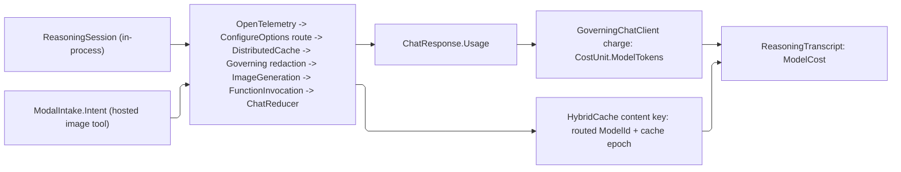

# [APPHOST_REASONING_RUNTIME]

Rasm.AppHost owns the in-process reasoning front door beside MCP server projection and client federation. `ReasoningSession` drives `IChatClient.GetStreamingResponseAsync` with the brokered `CommandAIFunction` instances the MCP projection mints. `SemanticDiscovery` ranks descriptor embeddings through `DiscoveryQuery.ByIntent`. Function transcripts retain an exact `CommandResult` only when `FunctionResultContent.Result` carries it. `ModelGovernance` composes routing, caching, tracing, redaction, modal admission, tool invocation, and token-bounded history over chat and embedding carriers.

## [01]-[INDEX]

- [02]-[REASONING_LOOP]: `ReasoningSession` over `IChatClient` streaming; `ChatOptions.Tools` is the brokered `CommandAIFunction`.
- [03]-[SEMANTIC_DISCOVERY]: `IEmbeddingGenerator` cosine fold; the `DiscoveryQuery.ByIntent` case over the registry.
- [04]-[REPLAYABLE_TRANSCRIPT]: Exact command results chain into `EventLog`; absent joins remain explicit.
- [05]-[MODEL_GOVERNANCE]: One middleware fold over both carriers: routing above the cache, content filter below it, window-bounded history, gated image modality, result-carrying tool invocation, token-to-cost-to-ledger.
- [06]-[MODAL_INPUT]: `ModalKind` gates one pipeline arm and one intake entry over the same descriptor catalog.

## [02]-[REASONING_LOOP]

- Owner: `ReasoningPolicy` the ONE loop-bound and tool-mode authority — `MODEL_GOVERNANCE` reads its columns rather than restating them; `ReasoningTurn` `[Union]` the streamed-turn disposition; `ReasoningSession` the static in-process agent-loop surface over `IChatClient.GetStreamingResponseAsync`.
- Cases: `ReasoningTurn` = Thinking | ToolCalled | Message | Completed | Faulted — the disposition a streamed reasoning turn folds to as the chat client surfaces text, reasoning content, function calls, and the finish reason; `ToolCalled` carries the call id, descriptor, canonical argument element, and exact optional command result as one identity row; `Faulted` carries the app's bounded structured fault observation, never a code beside reminted message text.
- Entry: `Reason(ReasoningRuntime runtime, ReasoningPolicy policy, Seq<ChatMessage> conversation)` returns `IO<ReasoningTranscript>` — the loop streams `IChatClient.GetStreamingResponseAsync` with `ChatOptions.Tools` set to the brokered `CommandAIFunction` set, accumulates the `ChatResponseUpdate` stream into one `ChatResponse`, records each `FunctionCallContent`/`FunctionResultContent` pair as a transcript row, and terminates on the `ChatFinishReason` with the projected `ReasoningTranscript`.
- Auto: the `ChatOptions.Tools` list is the exact brokered `CommandAIFunction` set the `Agent/mcp#METHOD_AXIS` `ToolProjection.Adopt` minted, READ off the one `McpAdoption` product the `Agent/runtime#ADOPTION_BOUNDARY` composition hands every front door — the loop holds the product rather than the registry and the degradation level, so it structurally cannot news up a second projection and a model tool call and an MCP tool call route through the identical brokered invoker over `CommandAlgebra.Run`; the function-invocation iteration is the `MODEL_GOVERNANCE` `FunctionInvokingChatClient` decorator, not a hand-rolled call-and-feed loop — `ReasoningSession` supplies the tool set and the conversation, the decorator runs the tool-call cycle, and the session folds the `ChatResponseUpdate` sequence into the returned `ChatResponse`; `ChatOptions.ToolMode` is the policy's `AutoChatToolMode`/`RequiredChatToolMode`/`NoneChatToolMode` row so a session forces, permits, or forbids tool use without a parallel flag; `ChatOptions.Seed` binds to the `DeterminismContext` RNG seed so a recorded reasoning turn replays under the same sampling seed, and `MaximumIterationsPerRequest`/`MaximumConsecutiveErrorsPerRequest` trace to the policy's `DeadlineClass`-derived loop bound, never a literal; the conversation those iterations grow is bounded by the `MODEL_GOVERNANCE` reducer against the resolved route's window at the policy's `WindowShare`, so the iteration bound and the context bound are two columns on one policy rather than one bound and one hope.
- Output: each run returns one `ReasoningTranscript`; the terminal turn carries the bounded fault observation while `FaultCell` retains the exact error; a tool-call row carries `Some(CommandResult)` only when the function result exposes the exact value.
- Packages: Rasm (kernel `FaultCell`, `HookId`), Microsoft.Extensions.AI.Abstractions, LanguageExt.Core, NodaTime, Thinktecture.Runtime.Extensions, BCL inbox
- Growth: one turn disposition is one `ReasoningTurn` case breaking every fold arm; a new loop bound is one field on `ReasoningPolicy` and every governance seat reads it with no second edit; a new tool front door is the SAME `CommandAIFunction` set adopted by a new caller, never a new projection; zero new surface.
- Boundary: the reasoning loop is the in-process model-driven command owner — it never executes an op itself, it routes every tool call through the brokered `CommandAIFunction` onto the command algebra, so the transaction, grant, and cost semantics are the command algebra's and the loop is the model-driven dispatch over them; a tool set divorced from the `Agent/mcp#METHOD_AXIS` adoption boundary is the deleted form, so the in-process loop and the MCP server share one tool catalog; the `IChatClient` the loop drives is the `MODEL_GOVERNANCE`-wrapped client, never a raw provider client, so an unmetered un-ledgered model draw cannot reach the loop; the loop owns the turn vocabulary and the session-scoped conversation buffer, while `MODEL_GOVERNANCE` owns the metering, caching, tracing, and content-addressing — the two never merge, so the loop stays the orchestration and the middleware stays the policy; a model call that bypasses the function-invocation decorator to invoke a tool directly is the deleted form, because the decorator is the one integration point where `ChatOptions.Tools` becomes executed calls.

```csharp
// --- [MODELS] --------------------------------------------------------------------------
public sealed record ReasoningPolicy(
    ChatToolMode ToolMode,
    int MaxIterations,
    int MaxConsecutiveErrors,
    double WindowShare,
    DeadlineClass Deadline,
    Option<float> Temperature,
    Option<long> Seed) {
    public static ReasoningPolicy Auto(DeterminismContext context, DeadlineClass deadline) =>
        new(ChatToolMode.Auto, MaxIterations: 16, MaxConsecutiveErrors: 3, WindowShare: 0.75d, deadline, None, Some(context.Seed));

    public ChatOptions Options(Seq<AITool> tools) =>
        new() {
            Tools = tools.ToList(),
            ToolMode = ToolMode,
            Temperature = Temperature.Match(Some: static t => (float?)t, None: static () => (float?)null),
            Seed = Seed.Match(Some: static s => (long?)s, None: static () => (long?)null),
            AllowMultipleToolCalls = true,
        };
}

[Union(ConversionFromValue = ConversionOperatorsGeneration.None)]
public abstract partial record ReasoningTurn {
    private ReasoningTurn() { }
    public sealed record Thinking(string Reasoning) : ReasoningTurn;
    public sealed record ToolCalled(string CallId, string Descriptor, JsonElement Arguments, Option<CommandResult> Result) : ReasoningTurn;
    public sealed record Message(string Text) : ReasoningTurn;
    public sealed record Completed(Option<ChatFinishReason> Reason, Option<UsageDetails> Usage) : ReasoningTurn;
    public sealed record Faulted(Rasm.Contracts.Fault.FaultObservation Fault) : ReasoningTurn;
}

// --- [SERVICES] ------------------------------------------------------------------------
public sealed record ReasoningRuntime(
    IChatClient Chat,
    McpAdoption Adopted,
    GovernanceLedger Ledger,
    ClockPolicy Clocks,
    FaultCell Faults,
    JsonSerializerOptions Wire);

// --- [OPERATIONS] ----------------------------------------------------------------------
public static class ReasoningSession {
    private static readonly HookId FaultPoint = HookId.Create("rasm.apphost.agent.reasoning-draw");

    public static IO<ReasoningTranscript> Reason(ReasoningRuntime runtime, ReasoningPolicy policy, Seq<ChatMessage> conversation) =>
        from tools in IO.lift(() => AdoptedTools(runtime))
        from started in IO.lift(() => runtime.Clocks.Now)
        from drawn in IO.liftAsync(envIO => runtime.Chat
                .GetStreamingResponseAsync(conversation, policy.Options(tools), envIO.Token)
                .ToChatResponseAsync())
                .Map(static response => (Response: response, Fault: Option<Error>.None))
            | @catch<IO, (ChatResponse Response, Option<Error> Fault)>(static _ => true,
                error => IO.pure((new ChatResponse(), Some(error))))
        from _fault in IO.lift(() => drawn.Fault.Match(
            Some: error => error is Fault
                ? unit
                : ignore(runtime.Faults.Park(point: FaultPoint, cause: error)),
            None: static () => unit))
        from elapsed in IO.lift(() => runtime.Clocks.Now - started)
        let rows = TranscriptRows(drawn.Response, drawn.Fault, runtime.Wire)
        select ReasoningTranscript.Of(drawn.Response, rows, started, elapsed, runtime.Wire);

    static Seq<AITool> AdoptedTools(ReasoningRuntime runtime) =>
        runtime.Adopted.Tools.Map(static adopted => (AITool)adopted.Function);

    static Seq<ReasoningTurn> TranscriptRows(ChatResponse response, Option<Error> fault, JsonSerializerOptions wire) {
        var contents = response.Messages.AsIterable().Bind(static message => message.Contents.AsIterable()).ToSeq();
        var results = contents.OfType<FunctionResultContent>()
            .ToFrozenDictionary(static result => result.CallId, StringComparer.Ordinal);
        return contents.Choose(content => Row(content, results, wire))
            .Add(fault.Match(
                Some: static error => new ReasoningTurn.Faulted(FaultWire.Observe(error)) as ReasoningTurn,
                None: () => new ReasoningTurn.Completed(Optional(response.FinishReason), Optional(response.Usage))));
    }

    static Option<ReasoningTurn> Row(
        AIContent content,
        FrozenDictionary<string, FunctionResultContent> results,
        JsonSerializerOptions wire) => content switch {
        TextReasoningContent reasoning => Some<ReasoningTurn>(new ReasoningTurn.Thinking(reasoning.Text)),
        TextContent text => Some<ReasoningTurn>(new ReasoningTurn.Message(text.Text)),
        FunctionCallContent call => Some<ReasoningTurn>(new ReasoningTurn.ToolCalled(
            call.CallId,
            call.Name,
            JsonSerializer.SerializeToElement(call.Arguments, wire),
            results.TryGetValue(call.CallId, out var result) ? ResultOf(result) : None)),
        FunctionResultContent => None,
        _ => None,
    };

    static Option<CommandResult> ResultOf(FunctionResultContent result) =>
        result.Result is CommandResult result ? Some(result) : None;
}
```

## [03]-[SEMANTIC_DISCOVERY]

- Owner: `IntentMatch` the ranked descriptor-to-intent projection; `EmbeddingIndex` the frozen descriptor-embedding cell; `SemanticDiscovery` the static embedding-rank fold; the new `DiscoveryQuery.ByIntent(string)` case extending `Agent/capability#DISCOVERY_FOLD`.
- Cases: `DiscoveryQuery` gains one case — `ByIntent(string Intent)` — alongside the settled `ById`/`BySurface`/`ByEffect`/`Permitting`/`All`, so the `Discover` switch is a total dispatch the new case breaks at compile time on every consumer arm; the registry's `Discover` fold gains the `byIntent` arm reading the embedding index.
- Entry: `Index(CapabilityRegistry registry, IEmbeddingGenerator<string, Embedding<float>> embedder)` returns `IO<EmbeddingIndex>` — embeds each descriptor's op-surface text into one frozen `Embedding<float>` per descriptor id at composition; `Rank(EmbeddingIndex index, IEmbeddingGenerator<string, Embedding<float>> embedder, string intent, int top)` returns `IO<Seq<IntentMatch>>` — embeds the intent string and ranks descriptors by cosine similarity over the frozen index, returning the top matches.
- Auto: the embedding index is a FROZEN projection over the registry built once at composition — `Index` folds `DiscoveryQuery.All` into the descriptor rows, embeds each row's `{surface}.{op}` text and its effect/idempotency keys through one batched `IEmbeddingGenerator.GenerateAsync`, and freezes the result into a `FrozenDictionary<string, ReadOnlyMemory<float>>`, so discovery is a read-only vector lookup, never a runtime mutation, mirroring the `CapabilityRegistry` composition-freeze law; the rank rides the BCL numerics primitives end to end and never a hand-rolled loop — `TensorPrimitives.Norm` and `Divide` unit-normalize each row ONCE at composition, so `TensorPrimitives.Dot` over two unit spans IS the cosine and the per-candidate norm a similarity call recomputes on every query is hoisted out of the whole catalog scan; `ByIntent` folds `Rank` to its top descriptors and projects them through the same `CapabilityMatch` projection the other query cases produce so an intent query and an id query return the identical result shape; the embedder is the `MODEL_GOVERNANCE`-composed `IEmbeddingGenerator` — the `Compose(GovernanceRuntime, IEmbeddingGenerator<string, Embedding<float>>)` overload folding `UseOpenTelemetry`/`UseDistributedCache` on the embedding builder and handing the built pipeline back as the one generator a composition root binds — so an intent embedding is content-cached and traced on the same source and store a chat draw rides, and an identical intent re-resolves from the cache without a fresh embedding draw.
- Output: `IntentMatch` carries the descriptor id, the cosine score, and the projected `CapabilityMatch`; the index build logs one `SpineLog` event; no parallel discovery result.
- Packages: Microsoft.Extensions.AI.Abstractions, LanguageExt.Core, Thinktecture.Runtime.Extensions, System.Numerics.Tensors, BCL inbox
- Growth: the `ByIntent` case is one `DiscoveryQuery` row breaking every consumer; a new ranking signal is one column on `IntentMatch`; a new embedding model is one `IEmbeddingGenerator` injection, never a second index; zero new surface.
- Boundary: `Index` and `Rank` take the governed generator alone — a raw provider generator reaching either is the deleted form, because an untraced uncached embedding draw leaves this card's own re-resolution claim with no mechanism; the semantic discovery is the only intent-resolution owner — a keyword-match heuristic, a hand-tuned synonym table, and a per-op intent annotation are the deleted forms, so an agent resolving "diffuse heat across this mesh" to `TensorOpFamily.HeatFlow` reads the one embedding rank; the `ByIntent` case extends the `Agent/capability#DISCOVERY_FOLD` `[Union]` rather than adding a parallel discovery surface, so the registry's `Discover` stays the single discovery entrypoint and the intent path is one fold arm; the embedding index is frozen at composition so a descriptor added after freeze is invisible to intent resolution until re-index, the same read-only-after-freeze contract the registry carries — a runtime descriptor-embedding mutation is the deleted form; the cosine rank is a similarity heuristic, not a guarantee, so an intent below the policy floor returns no match and the agent falls back to the exact-id path rather than dispatching a wrong tool; the embedded text is the op surface's self-description (`{surface}.{op}` and effect/classification), never the op's body or arguments, so the index is metadata-only and an op's payload never leaks into an embedding.

```csharp
// --- [MODELS] --------------------------------------------------------------------------
public sealed record IntentMatch(string Descriptor, float Score, CapabilityMatch Result);

public sealed record EmbeddingIndex(
    FrozenDictionary<string, ReadOnlyMemory<float>> Vectors,
    CapabilityRegistry Registry,
    float Floor) {
    public static readonly float DefaultFloor = 0.25f;
}

// --- [OPERATIONS] ----------------------------------------------------------------------
public static class SemanticDiscovery {
    public static IO<EmbeddingIndex> Index(CapabilityRegistry registry, IEmbeddingGenerator<string, Embedding<float>> embedder) =>
        registry.Discover(new DiscoveryQuery.All()) is var rows && rows.IsEmpty
            ? IO.pure(new EmbeddingIndex(FrozenDictionary<string, ReadOnlyMemory<float>>.Empty, registry, EmbeddingIndex.DefaultFloor))
            : from embeddings in IO.liftAsync(async envIO => await embedder.GenerateAsync(
                  rows.Map(Surface).ToList(), options: null, cancellationToken: envIO.Token))
              let vectors = rows.Zip(embeddings.AsIterable().ToSeq())
                  .Map(static pair => KeyValuePair.Create(pair.First.Descriptor, Normalized(pair.Second.Vector)))
                  .ToFrozenDictionary(StringComparer.Ordinal)
              select new EmbeddingIndex(vectors, registry, EmbeddingIndex.DefaultFloor);

    static ReadOnlyMemory<float> Normalized(ReadOnlyMemory<float> vector) {
        var unit = new float[vector.Length];
        var norm = TensorPrimitives.Norm(vector.Span);
        if (norm > 0f) TensorPrimitives.Divide(vector.Span, norm, unit);
        return unit;
    }

    public static IO<Seq<IntentMatch>> Rank(EmbeddingIndex index, IEmbeddingGenerator<string, Embedding<float>> embedder, string intent, int top) =>
        from drawn in IO.liftAsync(async envIO => await embedder.GenerateAsync(
            intent, options: null, cancellationToken: envIO.Token))
        let query = Normalized(drawn.Vector)
        let scored = toSeq(index.Registry.Discover(new DiscoveryQuery.All())
            .Choose(row => index.Vectors.TryGetValue(row.Descriptor, out var vector)
                ? Some(new IntentMatch(row.Descriptor, TensorPrimitives.Dot(query.Span, vector.Span), row))
                : Option<IntentMatch>.None)
            .Filter(match => match.Score >= index.Floor)
            .OrderByDescending(static match => match.Score)
            .Take(top))
        select scored;

    static string Surface(CapabilityMatch row) =>
        $"{row.Surface}.{row.Descriptor} effect={row.Effect.Key} idempotency={row.Idempotency.Key}";
}

// --- [COMPOSITION] ---------------------------------------------------------------------
```

## [04]-[REPLAYABLE_TRANSCRIPT]

- Owner: `ReasoningTranscript` the function-invocation transcript record; `TranscriptDigest` the content-address of the whole reasoning turn; `TranscriptProjection` the exact-result-to-`LogEntry` fold over `Runtime/determinism#EVENT_LOG` and `#MACRO_ENGINE`.
- Entry: `Chain(ReasoningRuntime runtime, EventLog.Chain chain, ReasoningTranscript transcript, DeterminismContext context)` returns `IO<(EventLog.Chain Chain, Seq<LogEntry> Entries, Seq<string> Missing)>` — folds each exact tool-call `CommandResult` into the event-log chain through the owner's publish-free `EventLog.Project` — the dispatch append already fed the durable changefeed, so the projection re-chains without a second write — and carries the resultless call ids beside the projected entries, so the chained slice and its completeness gap travel as one product; `AsMacro(string macroId, ReasoningTranscript transcript, Seq<LogEntry> entries, Seq<MacroParameter> parameters)` returns `Fin<Macro>` — records the chained slice through `Macro.Record` only when `transcript.MissingResults` is empty, refusing an incomplete transcript with the typed `CommandFault.MacroIncomplete` naming every resultless call.
- Auto: each `ReasoningTurn.ToolCalled` carries `Some(CommandResult)` only when `FunctionResultContent.Result` exposes the exact value, and the carriage is a PROVEN path rather than a hoped one — `FunctionInvoker` is the seat whose return the invocation loop hands to `CreateResponseMessages`, whose `CreateFunctionResultContent` lifts that object verbatim onto `FunctionResultContent.Result` with no serialization and no wrapping, so a brokered function returning its result lands the exact instance; a foreign tool's result, a null, and every value crossing an MCP wire carry `None`, so projection never invents transaction, cost, dispatch, elapsed, tenant, or instant fields; `Chain` folds only exact results through the publish-free `EventLog.Project` while `Missing` names each call whose result never joined; the transcript digest composes kernel `ContentHash.Of` over ordered call identities and the model response digest; `AsMacro` gates on `ReasoningTranscript.MissingResults` before `Macro.Record` runs, so completeness is a structural refusal; `Reason` returns the `ReasoningTranscript` directly.
- Output: each exact tool-call result becomes one `LogEntry`; the whole turn remains one `ReasoningTranscript` carrying its `TranscriptDigest`; absent result joins produce no fabricated log entry.
- Packages: System.IO.Hashing, LanguageExt.Core, NodaTime, Thinktecture.Runtime.Extensions, BCL inbox
- Growth: one transcript column is one field on `ReasoningTranscript`; a new macro substitution point is one `MacroParameter` row on the recorded slice; a new digest input is one component on the kernel `ContentHash.Of` canonical bytes; zero new surface.
- Boundary: transcript projection never creates evidence absent from the function result; exact command results ride the existing event-log chain, while missing joins remain explicit and block macro completeness; `Macro.Record`/`MacroEngine.Play` reuse the command algebra for every captured result; `TranscriptDigest` addresses the observed response and call identities but makes no bit-identical model-replay claim beyond the cache owner's guarantee.

```csharp
// --- [MODELS] --------------------------------------------------------------------------
public sealed record ReasoningTranscript(
    string TranscriptId,
    TranscriptDigest Digest,
    Seq<ReasoningTurn> Turns,
    string ResponseDigest,
    MeterVector ModelCost,
    long InputTokens,
    long OutputTokens,
    Instant Started,
    Duration Elapsed) {
    public static ReasoningTranscript Of(
        ChatResponse response,
        Seq<ReasoningTurn> turns,
        Instant started,
        Duration elapsed,
        JsonSerializerOptions wire) {
        var responseDigest = ContentHash.Hex(ContentHash.Of(response,
            static (drawn, writer) => writer.Rows(
                drawn.Messages.AsIterable().ToSeq(), static (message, member) => member.String(message.Text))));
        var digest = TranscriptDigest.Of(turns, responseDigest, wire);
        return new(
            TranscriptId: digest.Value,
            Digest: digest,
            Turns: turns,
            ResponseDigest: responseDigest,
            ModelCost: ModelGovernance.Tokens(response.Usage),
            InputTokens: response.Usage?.InputTokenCount ?? 0L,
            OutputTokens: response.Usage?.OutputTokenCount ?? 0L,
            Started: started,
            Elapsed: elapsed);
    }

    public Seq<CommandResult> Results =>
        Turns.Choose(static turn => turn is ReasoningTurn.ToolCalled called ? called.Result : Option<CommandResult>.None);

    public Seq<string> MissingResults =>
        Turns.Choose(static turn => turn is ReasoningTurn.ToolCalled { Result.IsNone: true } called ? Some(called.CallId) : None);

    public bool Complete => MissingResults.IsEmpty;
}

[ValueObject<string>(
    KeyMemberName = "Value",
    ConversionToKeyMemberType = ConversionOperatorsGeneration.Implicit,
    ConversionFromKeyMemberType = ConversionOperatorsGeneration.None)]
public readonly partial struct TranscriptDigest {
    public static TranscriptDigest Of(Seq<ReasoningTurn> turns, string responseDigest, JsonSerializerOptions wire) {
        using var bytes = new MemoryStream();
        using (var json = new Utf8JsonWriter(bytes)) {
            json.WriteStartObject();
            json.WriteString("response", responseDigest);
            json.WritePropertyName("calls");
            json.WriteStartArray();
            turns.Choose(static turn => turn is ReasoningTurn.ToolCalled call ? Some(call) : Option<ReasoningTurn.ToolCalled>.None)
                .Iter(call => {
                    json.WriteStartObject();
                    json.WriteString("callId", call.CallId);
                    json.WriteString("descriptor", call.Descriptor);
                    json.WritePropertyName("arguments");
                    Canonical(json, call.Arguments);
                    json.WritePropertyName("result");
                    if (call.Result is { IsSome: true, Case: CommandResult result })
                        Canonical(json, JsonSerializer.SerializeToElement(result, wire));
                    else
                        json.WriteNullValue();
                    json.WriteEndObject();
                });
            json.WriteEndArray();
            json.WriteEndObject();
        }
        return TranscriptDigest.Create(ContentHash.Hex(ContentHash.Of(bytes.ToArray())));
    }

    static void Canonical(Utf8JsonWriter writer, JsonElement element) {
        switch (element.ValueKind) {
            case JsonValueKind.Object:
                writer.WriteStartObject();
                foreach (var property in element.EnumerateObject().OrderBy(static property => property.Name, StringComparer.Ordinal)) {
                    writer.WritePropertyName(property.Name);
                    Canonical(writer, property.Value);
                }
                writer.WriteEndObject();
                break;
            case JsonValueKind.Array:
                writer.WriteStartArray();
                foreach (var item in element.EnumerateArray()) Canonical(writer, item);
                writer.WriteEndArray();
                break;
            default:
                element.WriteTo(writer);
                break;
        }
    }
}

// --- [OPERATIONS] ----------------------------------------------------------------------
public static class TranscriptProjection {
    public static IO<(EventLog.Chain Chain, Seq<LogEntry> Entries, Seq<string> Missing)> Chain(ReasoningRuntime runtime, EventLog.Chain chain, ReasoningTranscript transcript, DeterminismContext context) =>
        from now in IO.lift(() => runtime.Clocks.Now)
        let calls = transcript.Turns.Bind(static turn =>
            turn is ReasoningTurn.ToolCalled { Result.IsSome: true } called
                ? called.Result.ToSeq().Map(result => (called.Arguments, Result: result))
                : Seq<(JsonElement Arguments, CommandResult Result)>())
        let folded = calls.Fold((Chain: chain, Entries: Seq<LogEntry>(), Logical: 0UL), (acc, call) => {
            var (next, entry) = EventLog.Project(acc.Chain,
                new LogBody.Command(call.Result.Descriptor,
                    new CommandArguments(call.Arguments, call.Result.Tenant, call.Result.Correlation).Digest),
                context, now, acc.Logical);
            return (next, acc.Entries.Add(entry), acc.Logical + 1UL);
        })
        select (folded.Chain, folded.Entries, transcript.MissingResults);

    public static Fin<Macro> AsMacro(string macroId, ReasoningTranscript transcript, Seq<LogEntry> entries, Seq<MacroParameter> parameters) =>
        transcript.Complete
            ? Fin.Succ(Macro.Record(macroId, entries, parameters))
            : Fin.Fail<Macro>(new CommandFault.MacroIncomplete(string.Join(',', transcript.MissingResults)));
}
```

## [05]-[MODEL_GOVERNANCE]

- Owner: `ModelRoute` `[SmartEnum<string>]` the model-selection row family discriminating target model by cost-tier/capability/variant under the `ComparerAccessors.StringOrdinal` accessor, each row carrying its provider model id, `EffectClass` ceiling, and context window; `WindowReducer` the token-measured `IChatReducer` bounding the conversation against that window; `BrokeredInvoker` the `FunctionInvoker` hook carrying the exact `CommandResult` onto the function result; `GovernanceLedger` the per-turn token-and-cost cell; `GovernedClient` the composed delegating-pipeline handle; `ModelGovernance` the static middleware-fold surface composing the `Microsoft.Extensions.AI` `ChatClientBuilder` decorators into the one model-governance owner — route, cache, trace, content filter, history bound, image modality, and tool invocation on one decorator chain over both the chat and embedding carriers.
- Cases: `ModelRoute` rows — `Economy`, `Balanced`, `Frontier`, `LongContext` — each carrying its provider model id, the `EffectClass` ceiling the brokered invoker refuses above, and the `Window` token budget the reducer bounds against, so a model draw routes to a target model by feature verdict rather than a fixed client while both the ceiling and the window are enforced columns rather than naming claims; the routing arm reads the `Runtime/features#VERDICT_PROJECTION` `FlagVerdict` variant and maps it to the row, and an absent or below-floor verdict falls to the policy default route, never a hard-coded model.
- Law: this section owns ONE capsule, the composition-time one. `GovernanceRuntime` decides which arms weave and what each reads; `ReasoningRuntime` at `#REASONING_LOOP` drives the client it built. Every loop bound reads `GovernanceRuntime.Policy` — the one `ReasoningPolicy` value — so no seat holds a second copy of an iteration ceiling, an error ceiling, or a window share; every modal admission reads `Modalities`, so a handle and a row cannot disagree; and the route resolves once per draw on `Turn`, the one bounded ambient slot, so three seats read one row. A `Func<>` column survives here only where the provider is a PER-CALL effect (`Verdict` and `Targeting` are evaluated per draw); a pure projection is a member and a handle is a typed port.
- Entry: `Compose(GovernanceRuntime runtime, IChatClient inner)` returns `GovernedClient` — folds the inner `IChatClient` through the one `ChatClientBuilder` chain, outermost first; `Compose(GovernanceRuntime runtime, IEmbeddingGenerator<string, Embedding<float>> embedder)` returns `IEmbeddingGenerator<string, Embedding<float>>` — the SAME owner's embedding arm folding `AsBuilder().UseOpenTelemetry(...).UseDistributedCache(...).Build(...)`, so chat and embedding draws share one governance owner and one store; `Charge(GovernanceRuntime runtime, UsageDetails? usage)` returns `Fin<MeterVector>` — projects a draw's usage onto a `MeterVector` charging `CostUnit.ModelTokens` through `GrantBroker.Admit` and recording it on the ledger, called by the governing client on both verbs rather than by any caller; `Route(GovernanceRuntime runtime, EvaluationContext targeting)` returns `ModelRoute` — resolves the feature verdict to the target row the routing decorator seats on `ChatOptions.ModelId`. DI registration is composition-root surface, never this owner's: the root registers `services.AddChatClient(sp => ModelGovernance.Compose(runtimeOf(sp), inner))` through the `Func<IServiceProvider, IChatClient>` factory overload (DI invokes `ChatClientBuilder.Build` with the root provider at first resolution), the factory's provider feeding `GovernanceRuntime.Services` — so both pipelines reach DI whole and `GovernanceRuntime` never carries `IServiceCollection`.
- Auto: `Build` composes decorators outermost-last, so the chain order IS the nesting law and each seat is placed by what it must observe — `UseOpenTelemetry` outermost spans the whole draw; `ConfigureOptions` seats the routed `ChatOptions.ModelId` on a per-call CLONE of the caller's options and is the ROUTING owner, sitting ABOVE the cache so `DistributedCachingChatClient.GetCacheKey` hashes options already carrying the routed model id and an `Economy` draw can never replay a `Frontier` answer over identical messages (a routing rewrite below the cache is the collision this order deletes, and it also mis-credits `UsageDetails.CachedInputTokenCount` against the wrong route); `CacheKeyAdditionalValues` carries the discriminants the messages and options cannot express — the governance cache epoch and the redaction key generation — so an HMAC key rotation or a taxonomy edit cannot replay a pre-rotation body; `GoverningChatClient` therefore owns REDACTION ALONE, rewriting only `TextContent.Text` and `TextReasoningContent.Text` through the shared classification owner while preserving every other `AIContent` value unchanged, and it sits BELOW the cache so a cached response is redacted exactly once (an HMAC redactor is not idempotent, so a redaction seat above the cache re-tokenizes every replay); `UseImageGeneration` weaves only where `ModalKind.Image` is enabled, substituting the `HostedImageGenerationTool` an intent carries with function tools the loop below it invokes, so the image draw rides the same span, cache, redaction, and broker charge a chat draw rides; `UseFunctionInvocation` runs the tool-call cycle and its `FunctionInvoker` hook is the integration point where the exact `CommandResult` reaches `FunctionResultContent.Result` and where the route's `EffectClass` ceiling refuses a tool the routed model may not run — the one seat holding both the resolved route and the tool's declared class, so an `Economy` route can no longer carry an irreversible call; `UseChatReducer` sits innermost so every loop iteration re-bounds the conversation the tool cycle just grew. usage projects to `CostUnit.ModelTokens` through `GrantBroker` at the governing client itself, the one decorator that sees a completed draw on both verbs, so an unmetered draw is unreachable rather than merely forbidden and no caller has a charge entry to forget; function-invocation and window bounds come from `ReasoningPolicy` through the runtime record; the same governed client shape serves the reasoning and image front doors, and every model draw is the endpoint's own — the MCP revision election deletes the client-sampling bridge whole. Cache replay is a cache-owner guarantee and does not mint an event-log row.
- Output: `ReasoningTranscript` carries the measured `ModelCost`; the OTel span carries the selected route and filter count; cache hits log through `SpineLog`.
- Packages: Rasm (kernel `AmbientSlot`, `CapabilitySet`, `Cell.Commit`, `FaultCell`, `HookId`), Microsoft.Extensions.AI, Microsoft.Extensions.AI.Abstractions, Microsoft.Extensions.Caching.Hybrid, Microsoft.Extensions.Compliance.Redaction, Microsoft.ML.Tokenizers, OpenFeature, System.IO.Hashing, LanguageExt.Core, NodaTime, Thinktecture.Runtime.Extensions, BCL inbox
- Growth: a new decorator is one `ChatClientBuilder.Use` arm on the fold at its observation seat; a new model route is one `ModelRoute` row carrying its provider model id, effect ceiling, and window; a new content-filter classification is one `DataClassification` row the resolver reads; a new metered model resource rides the existing `CostUnit` axis; a new carrier is one `Compose` overload on this owner, never a second pipeline; zero new surface.
- Boundary: the middleware fold is the suite's only model-governance owner and it spans BOTH model carriers — a raw `IEmbeddingGenerator` reaching `SemanticDiscovery` is the deleted form, because an untraced uncached embedding draw makes the `#SEMANTIC_DISCOVERY` cache claim mechanismless; routing rewrites `ChatOptions.ModelId` through the one options-configuring decorator, redaction reuses `DataClassification`, metering charges `CostUnit.ModelTokens`, cache storage stays on `HybridCache`, and tracing stays on the GenAI source; the history bound is a TOKEN measurement against the route window, so a message-count literal is the deleted form and the shipped `SummarizingChatReducer` is composed for the summarization it owns rather than for a count it does not measure; `TranscriptProjection` chains exact command results only; model response cache identity and event-log identity remain distinct until an admitted response-log owner exists.

```csharp
// --- [TYPES] ---------------------------------------------------------------------------
[SmartEnum<string>]
[KeyMemberEqualityComparer<ComparerAccessors.StringOrdinal, string>]
[KeyMemberComparer<ComparerAccessors.StringOrdinal, string>]
public sealed partial class ModelRoute {
    public static readonly ModelRoute Economy = new("economy", target: "gpt-economy", ceiling: EffectClass.Read, window: 32_768);
    public static readonly ModelRoute Balanced = new("balanced", target: "gpt-balanced", ceiling: EffectClass.External, window: 131_072);
    public static readonly ModelRoute Frontier = new("frontier", target: "gpt-frontier", ceiling: EffectClass.Irreversible, window: 262_144);
    public static readonly ModelRoute LongContext = new("long-context", target: "gpt-long-context", ceiling: EffectClass.External, window: 1_048_576);

    public string Target { get; }
    public EffectClass Ceiling { get; }
    public int Window { get; }

    public static readonly ModelRoute Default = Balanced;

    public static ModelRoute From(FlagVerdict verdict) =>
        TryGet(verdict.Variant, out var row) ? row : Default;

}

// --- [MODELS] --------------------------------------------------------------------------
public sealed record GovernanceLedger(
    Atom<HashMap<TenantId, MeterVector>> Tally) {
    public static GovernanceLedger Empty => new(Atom(HashMap<TenantId, MeterVector>()));

    public Fin<MeterVector> Record(TenantId tenant, MeterVector cost) =>
        Cell.Commit(Tally, held => held.AddOrUpdate(tenant, existing => existing.Add(cost), cost), Cell.SwapBudget) switch {
            Transition<HashMap<TenantId, MeterVector>>.Contended spent => Fin.Fail<MeterVector>(new GrantFault.Contended(spent.Attempts)),
            var landed => Fin.Succ(landed.Current.Find(tenant).IfNone(MeterVector.Zero)),
        };
}

public sealed record GovernedClient(IChatClient Client, GovernanceLedger Ledger);

// --- [SERVICES] ------------------------------------------------------------------------
public sealed record GovernanceRuntime(
    IServiceProvider Services,
    IDistributedCache Cache,
    ILoggerFactory Loggers,
    string TelemetrySource,
    ReasoningPolicy Policy,
    CapabilitySet<ModalKind> Modalities,
    TiktokenTokenizer Tokenizer,
    Option<IImageGenerator> Images,
    Option<ISpeechToTextClient> Speech,
    AmbientSlot<ModelRoute> Turn,
    Seq<object> CacheEpoch,
    GovernanceLedger Ledger,
    Func<EvaluationContext, FlagVerdict> Verdict,
    Func<EvaluationContext> Targeting,
    GrantBroker Broker,
    DataClassificationSet FilterClassification,
    IRedactorProvider Redactors,
    FaultCell Faults);

// --- [COMPOSITION] ---------------------------------------------------------------------
public sealed class TurnScope(IChatClient inner, GovernanceRuntime runtime) : DelegatingChatClient(inner) {
    public override async Task<ChatResponse> GetResponseAsync(
        IEnumerable<ChatMessage> messages, ChatOptions? options = null, CancellationToken token = default) {
        using IDisposable held = Entered();
        return await base.GetResponseAsync(messages, options, token).ConfigureAwait(false);
    }

    public override async IAsyncEnumerable<ChatResponseUpdate> GetStreamingResponseAsync(
        IEnumerable<ChatMessage> messages, ChatOptions? options = null,
        [EnumeratorCancellation] CancellationToken token = default) {
        using IDisposable held = Entered();
        await foreach (ChatResponseUpdate update in base.GetStreamingResponseAsync(messages, options, token).ConfigureAwait(false))
            yield return update;
    }

    IDisposable Entered() =>
        runtime.Turn.Enter(ModelRoute.From(runtime.Verdict(runtime.Targeting()))).ThrowIfFail();
}

// --- [OPERATIONS] ----------------------------------------------------------------------
public sealed class GoverningChatClient(IChatClient inner, GovernanceRuntime runtime) : DelegatingChatClient(inner) {
    Seq<ChatMessage> Guard(Redactor redactor, IEnumerable<ChatMessage> messages) =>
        messages.AsIterable().Map(message => {
            var guarded = message.Clone();
            guarded.Contents = guarded.Contents.ToList();
            Redact(redactor, guarded.Contents);
            return guarded;
        }).ToSeq();

    static AIContent Redacted(Redactor redactor, AIContent content) => content switch {
        TextContent { Text: { Length: > 0 } text } body => new TextContent(redactor.Redact(text)) {
            Annotations = body.Annotations,
            RawRepresentation = body.RawRepresentation,
            AdditionalProperties = body.AdditionalProperties,
        },
        TextReasoningContent { Text: { Length: > 0 } text } reasoning => new TextReasoningContent(redactor.Redact(text)) {
            ProtectedData = reasoning.ProtectedData,
            Annotations = reasoning.Annotations,
            RawRepresentation = reasoning.RawRepresentation,
            AdditionalProperties = reasoning.AdditionalProperties,
        },
        _ => content,
    };

    static void Redact(Redactor redactor, IList<AIContent> contents) {
        for (var index = 0; index < contents.Count; index++)
            contents[index] = Redacted(redactor, contents[index]);
    }

    static ChatResponse Redact(Redactor redactor, ChatResponse response) {
        foreach (var message in response.Messages)
            Redact(redactor, message.Contents);
        return response;
    }

    public override async Task<ChatResponse> GetResponseAsync(IEnumerable<ChatMessage> messages, ChatOptions? options = null, CancellationToken cancellationToken = default) {
        var redactor = runtime.Redactors.GetRedactor(runtime.FilterClassification);
        var response = Redact(redactor, await base.GetResponseAsync(Guard(redactor, messages), options, cancellationToken).ConfigureAwait(false));
        ignore(ModelGovernance.Charge(runtime, response.Usage));
        return response;
    }

    public override async IAsyncEnumerable<ChatResponseUpdate> GetStreamingResponseAsync(IEnumerable<ChatMessage> messages, ChatOptions? options = null, [EnumeratorCancellation] CancellationToken cancellationToken = default) {
        var redactor = runtime.Redactors.GetRedactor(runtime.FilterClassification);
        await foreach (var update in base.GetStreamingResponseAsync(Guard(redactor, messages), options, cancellationToken).ConfigureAwait(false)) {
            Redact(redactor, update.Contents);
            foreach (var usage in update.Contents.OfType<UsageContent>()) ignore(ModelGovernance.Charge(runtime, usage.Details));
            yield return update;
        }
    }
}

public sealed class WindowReducer(GovernanceRuntime runtime, IChatClient summarizer) : IChatReducer {
    public async Task<IEnumerable<ChatMessage>> ReduceAsync(IEnumerable<ChatMessage> messages, CancellationToken cancellationToken) {
        var budget = (int)(ModelGovernance.Route(runtime).Window * runtime.Policy.WindowShare);
        var raw = messages.AsIterable().ToSeq();
        var held = raw.Last.Match(Some: newest => raw.Init.Add(Bounded(newest, budget)), None: () => raw);
        var retained = Retained(held, budget);
        return retained >= held.Count
            ? held
            : await new SummarizingChatReducer(summarizer, targetCount: int.Max(retained, 1), threshold: 0)
                .ReduceAsync(held, cancellationToken).ConfigureAwait(false);
    }

    ChatMessage Bounded(ChatMessage message, int budget) {
        var bounded = message.Clone();
        bounded.Contents = [.. bounded.Contents.AsIterable().ToSeq().Rev()
            .Fold((Spent: 0, Kept: Seq<AIContent>()), (acc, content) => content switch {
                TextContent { Text: { Length: > 0 } text } body => (runtime.Tokenizer.CountTokens(text), budget - acc.Spent) switch {
                    (var cost, var share) when cost <= share => (Spent: acc.Spent + cost, Kept: acc.Kept.Add(body)),
                    (_, 0) => acc,
                    (_, var share) => (Spent: budget, Kept: acc.Kept.Add(Trimmed(body, share))),
                },
                _ => (Spent: acc.Spent, Kept: acc.Kept.Add(content)),
            }).Kept.Rev()];
        return bounded;
    }

    TextContent Trimmed(TextContent body, int share) =>
        new(body.Text[runtime.Tokenizer.GetIndexByTokenCountFromEnd(body.Text, share, out _, out _)..]) {
            Annotations = body.Annotations,
            RawRepresentation = body.RawRepresentation,
            AdditionalProperties = body.AdditionalProperties,
        };

    int Retained(Seq<ChatMessage> held, int budget) =>
        held.Rev().Fold((Spent: 0, Kept: 0), (acc, message) =>
            acc.Spent + runtime.Tokenizer.CountTokens(message.Text) is var next && next <= budget
                ? (next, acc.Kept + 1)
                : acc).Kept;
}

public static class BrokeredInvoker {
    private static readonly HookId FaultPoint = HookId.Create("rasm.apphost.agent.function-invoker");

    public static async ValueTask<object?> Invoke(GovernanceRuntime runtime, FunctionInvocationContext context, CancellationToken cancellationToken) =>
        Brokered(context.Function) is { } command
            ? Admitted(runtime, command) switch {
                { IsFail: true } refusal => Raise(runtime, refusal.FailToError()),
                _ => await context.Function.InvokeAsync(context.Arguments, cancellationToken).ConfigureAwait(false) switch {
                    CommandResult result => result,
                    var drifted => Raise(runtime, new CommandFault.ExecutionFaulted(
                        $"<brokered-result-not-a-result:{command.Name}:{drifted?.GetType().Name ?? "null"}>")),
                },
            }
            : await context.Function.InvokeAsync(context.Arguments, cancellationToken).ConfigureAwait(false);

    static object? Raise(GovernanceRuntime runtime, Error fault) {
        ignore(runtime.Faults.Park(point: FaultPoint, cause: fault));
        throw fault.ToException();
    }

    static CommandAIFunction? Brokered(AIFunction function) => function switch {
        CommandAIFunction command => command,
        ApprovalRequiredAIFunction { InnerFunction: CommandAIFunction command } => command,
        _ => null,
    };

    static Fin<Unit> Admitted(GovernanceRuntime runtime, CommandAIFunction command) =>
        command.Effect.Rank <= ModelGovernance.Route(runtime).Ceiling.Rank
            ? Fin.Succ(unit)
            : Fin.Fail<Unit>(new GrantFault.OutOfScope($"<effect-above-route-ceiling:{command.Name}:{command.Effect.Key}>"));
}

public static class ModelGovernance {
    public static GovernedClient Compose(GovernanceRuntime runtime, IChatClient inner) =>
        new(
            runtime.Images.Match(
                    Some: images => Chained(runtime, inner).UseImageGeneration(images,
                        static image => image.DataContentHandling = ImageGeneratingChatClient.DataContentHandling.GeneratedImages),
                    None: () => Chained(runtime, inner))
                .UseFunctionInvocation(runtime.Loggers, fi => {
                    fi.MaximumIterationsPerRequest = runtime.Policy.MaxIterations;
                    fi.MaximumConsecutiveErrorsPerRequest = runtime.Policy.MaxConsecutiveErrors;
                    fi.TerminateOnUnknownCalls = true;
                    fi.FunctionInvoker = (ctx, ct) => BrokeredInvoker.Invoke(runtime, ctx, ct);
                })
                .UseChatReducer(new WindowReducer(runtime, inner))
                .Build(runtime.Services),
            runtime.Ledger);

    public static IEmbeddingGenerator<string, Embedding<float>> Compose(GovernanceRuntime runtime, IEmbeddingGenerator<string, Embedding<float>> embedder) =>
        embedder.AsBuilder()
            .UseOpenTelemetry(runtime.Loggers, runtime.TelemetrySource)
            .UseDistributedCache(runtime.Cache)
            .Build(runtime.Services);

    static ChatClientBuilder Chained(GovernanceRuntime runtime, IChatClient inner) =>
        inner.AsBuilder()
            .UseOpenTelemetry(runtime.Loggers, runtime.TelemetrySource)
            .Use(client => new TurnScope(client, runtime))
            .ConfigureOptions(options => options.ModelId = Route(runtime).Target)
            .UseDistributedCache(runtime.Cache, cache => cache.CacheKeyAdditionalValues = [.. runtime.CacheEpoch])
            .Use(client => new GoverningChatClient(client, runtime));

    public static ModelRoute Route(GovernanceRuntime runtime) =>
        runtime.Turn.Current.IfNone(ModelRoute.Default);

    public static MeterVector Tokens(UsageDetails? usage) =>
        usage is { TotalTokenCount: { } total }
            ? new MeterVector(HashMap((CostUnit.ModelTokens, total)))
            : MeterVector.Zero;

    public static Fin<MeterVector> Charge(GovernanceRuntime runtime, UsageDetails? usage) =>
        Tokens(usage) is var cost && cost.Of(CostUnit.ModelTokens) == 0L
            ? Fin.Succ(MeterVector.Zero)
            : runtime.Broker.Admit(ModelDescriptor(cost), new CommandArguments(default, TenantContext.Current, Correlation.Mint()), DrawMode.Live)
                .Bind(charged => runtime.Ledger.Record(TenantContext.Current.TenantId, charged));

    static CapabilityDescriptor ModelDescriptor(MeterVector cost) =>
        CapabilityDescriptor.Of(
            surface: "agent",
            op: "reasoning",
            arguments: new ArgumentContract.Native(SuiteContracts.Host.GetTypeInfo(typeof(JsonElement))),
            effect: EffectClass.External,
            idempotency: Idempotency.NonIdempotent,
            cost: CostModel.Constant(cost),
            permission: new PermissionShape(FrozenSet<string>.Empty, EffectClass.External, DataClassification.Operational),
            progress: None,
            compile: static _ => Fin.Fail<CommandBody>(new KernelFault.InvalidResult(
                Op.Of(), Some("<model-draw-is-not-a-dispatched-body>"))));
}
```

`FlagVerdict` read by the `UseModelSelection` arm is the `Runtime/features#VERDICT_PROJECTION` contract shape the admitted `OpenFeature` provider projects — `(string FlagKey, string Variant, bool Enabled, string Reason)` over `FlagEvaluationDetails<Value>`. This page composes against that verdict at the boundary and never owns the `OpenFeature` evaluator; the `Runtime/features.md` owner lands it as the `TARGETED_DELIVERY_EXPERIMENTATION` leg, so a host without the feature-flag provider seats the policy-default `ModelRoute.From` fallback and the routing arm is inert.



## [06]-[MODAL_INPUT]

- Owner: `ModalKind` `[SmartEnum<string>]` realizing kernel `ICapability<ModalKind>` — the modal-capability row that decides which arms compose, admitted as the `CapabilitySet<ModalKind>` column `MODEL_GOVERNANCE` carries; `ModalIntake` the static modal-to-intent surface reading the same descriptor catalog.
- Cases: `ModalKind` rows — speech, image — each a COMPOSITION gate rather than a client carrier: speech transcribes an audio stream into the intent text the SEMANTIC_DISCOVERY fold resolves and needs its own entry because no chat pipeline consumes audio; image is woven INTO the governed pipeline as `UseImageGeneration`, so its row gates one decorator arm and no image entry exists here at all.
- Entry: `Transcribe(GovernanceRuntime runtime, Stream audio)` returns `IO<string>` — transcribes through `ISpeechToTextClient.GetTextAsync` to the intent text `SemanticDiscovery.Rank` resolves; `Intent(GovernanceRuntime runtime, Seq<AITool> tools, ImageGenerationOptions options)` returns `ChatOptions` — seats a `HostedImageGenerationTool` on the tool list so an image request enters the ONE governed client as a tool the pipeline's image arm substitutes and the function loop invokes, the generated `DataContent` arriving on the response contents.
- Auto: the image leg has NO client of its own — `ImageGeneratingChatClient` detects the `HostedImageGenerationTool` in `ChatOptions.Tools` and replaces it with the function tools the chat model invokes, so an image draw is a governed chat draw carrying an image tool and it therefore rides the OTel span, the routed cache key, the `GoverningChatClient` redaction, and the `GrantBroker` charge exactly as text does; the arm weaves only when `ModalKind.Image` is enabled, so a non-modal host resolves no `IImageGenerator` and pays nothing; `DataContentHandling.GeneratedImages` replaces only images this pipeline produced with identifiers on the way back down, so a caller-supplied image in the prompt survives intact; the speech leg stays an entry because audio is not a chat content the pipeline consumes, and it transcribes to intent text the SEMANTIC_DISCOVERY fold ranks so a spoken intent and a typed intent share one resolution path; both clients carry `[Experimental("MEAI001")]` and reach the runtime only through their gate row.
- Output: a modal-resolved command mints its `CommandResult` through the command algebra exactly as a typed command does; the image draw's tokens ride the enclosing `ChatResponse.Usage` the MODEL_GOVERNANCE charge already meters; no parallel modal result and no second metering seat.
- Packages: Microsoft.Extensions.AI, Microsoft.Extensions.AI.Abstractions, LanguageExt.Core, Thinktecture.Runtime.Extensions, BCL inbox
- Growth: a new modality is one `ModalKind` row with either one pipeline decorator arm (when the modality is a chat content the governed client can carry) or one `ModalIntake` entry (when it is not); zero new surface.
- Boundary: the modal surface is the only multi-modal agent-intake owner, and it holds exactly one front door — a direct `IImageGenerator.GenerateAsync` call is the DELETED form, because that draw touches no span, no cache, no redaction, and no broker while the page claims it rides the meter "exactly as a chat draw does"; the collapse makes that claim structural, since the image tool cannot execute except inside the pipeline that carries all four; a `[Union]` over two client handles is likewise deleted — one modality is now a decorator arm and the other an entry, so a two-case carrier models a symmetry that does not exist; the modal output is data the descriptor catalog gates by effect class, never a privileged side channel.

```csharp
// --- [TYPES] ---------------------------------------------------------------------------
[SmartEnum<string>]
[KeyMemberEqualityComparer<ComparerAccessors.StringOrdinal, string>]
[KeyMemberComparer<ComparerAccessors.StringOrdinal, string>]
public sealed partial class ModalKind : ICapability<ModalKind> {
    public static readonly ModalKind Speech = new("speech");
    public static readonly ModalKind Image = new("image");

    static IReadOnlyList<ModalKind> ICapability<ModalKind>.Items => Items;
}

// --- [OPERATIONS] ----------------------------------------------------------------------
[Experimental("MEAI001")]
public static class ModalIntake {
    public static IO<string> Transcribe(GovernanceRuntime runtime, Stream audio) =>
        runtime.Modalities.Admits(ModalKind.Speech)
            ? runtime.Speech.Match(
                Some: client => IO.liftAsync(async envIO =>
                    (await client.GetTextAsync(audio, options: null, cancellationToken: envIO.Token)).Text ?? string.Empty),
                None: () => IO.fail<string>(new FeatureFault.ProviderNotReady("modal-speech")))
            : IO.fail<string>(new FeatureFault.ProviderNotReady("modal-speech"));

    public static ChatOptions Intent(GovernanceRuntime runtime, Seq<AITool> tools, ImageGenerationOptions options) =>
        runtime.Modalities.Admits(ModalKind.Image)
            ? runtime.Policy.Options(tools.Add(new HostedImageGenerationTool { Options = options }))
            : runtime.Policy.Options(tools);
}
```

## [07]-[RESEARCH]

<!-- source-only: research row template:
[TOKEN]-[OPEN|BLOCKED]: <exact question>; <verification route>.
-->

(none)
