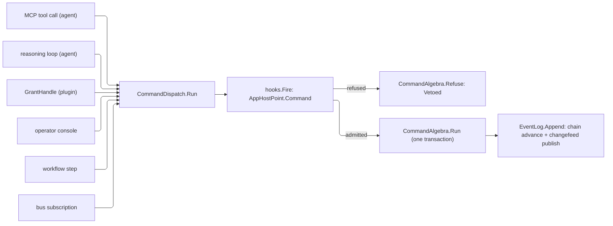

# [APPHOST_COMMAND_DISPATCH]

`CommandIntent` is the suite's one command vocabulary and `Run(CommandIntent) -> CommandResult` its one execution door: the MCP tool call, the reasoning loop, the operator console, the sandboxed-plugin call, the workflow step, the bus subscription, and every UI row a referencing package derives all enter here, pass the dispatcher's `Command` veto, dispatch through `Agent/capability#COMMAND_ALGEBRA` `CommandAlgebra.Run`, and chain their result into the one `Runtime/determinism#EVENT_LOG`.

This page declares the front door, its veto path, and the tool-adoption boundary the agent callers share. `CommandAlgebra` stays the one transaction owner, `EventLog` stays the one chained log on the durable `OpLog`, and no second dispatcher forks off here — it consumes `CommandAlgebra`/`CommandRuntime`/`CommandResult`/`CommandFault`/`CommandBody`, `McpRuntime`/`CommandAIFunction`/`ToolProjection`/`McpAdoption`/`McpDispatch`/`ToolResult`, `CallerModality`, `EventLog`/`ChangefeedPort`/`DeterminismContext`, `HookSet`, `CapabilityRegistry`, `TenantContext`, and `ClockPolicy` as settled vocabulary.

## [01]-[INDEX]

- [02]-[DISPATCH_FRONT_DOOR]: One veto-gated `Run` entry chaining every committed result into the one event log.
- [03]-[ADOPTION_BOUNDARY]: One `ToolProjection.Adopt` product, three agent front doors reading disjoint halves of it.

## [02]-[DISPATCH_FRONT_DOOR]

- Owner: `CommandIntent` the front-door request carrier (descriptor id, arguments, caller modality); `DispatchRuntime` the dependency record threading the `CommandRuntime`, the `EventLog` chain cell, the determinism context, the changefeed port, the mounted instruments, and the `Observability/hooks#HOOK_ROSTER` `HookSet<AppHostPoint, AppHostFact, TelemetrySource>` whose `AppHostPoint.Command` row this entry is the ONE fire site for, and the `Op` key every fire and every refusal threads; `CommandDispatch` the static front-door surface.
- Cases: six callers, one transaction — `CallerModality.Agent` for the MCP tool call and the in-process reasoning loop, `CallerModality.Operator` for the interactive host command, `CallerModality.Plugin` for the sandboxed-plugin route, with the durable workflow step and the event-bus subscription each entering under the modality that scheduled them.
- Entry: `Run(DispatchRuntime runtime, CommandIntent intent)` returns `IO<CommandResult>` — fires the dispatcher's `Command` veto, folds its `Fin`, dispatches the admitted intent through `CommandAlgebra.Run`, chains the result, writes its observations, and returns it; `Project(CommandResult result, Option<string> tool = default)` returns `ToolResult` — THE structured projection every front door reads, delegating to the upstream `Agent/mcp#TOOL_DISPATCH` `McpDispatch.Project` fold with the descriptor as the tool key, so exactly one physical fold exists.
- Auto: the veto fires FIRST through the dispatcher's GUARDED arity — `hooks.Fire(at: AppHostPoint.Command, fact: new AppHostFact.Command(intent), key, body)` hands the body its admitted fact and answers `Fin<CommandIntent>`, so a transforming gate supplies the descriptor and arguments the transaction then uses, a subscriber returning a case the dispatcher never fired refuses at the body's own case check, and a refusing gate lands `CommandFault.Vetoed` through the algebra's own refusal mint before any transaction or charge; the admitted intent enters `CommandAlgebra.Run` directly, so the broker performs one admission and one charge; every committed or compensated dispatch chains its result into the `EventLog` through the publish-free `EventLog.Project` inside a BOUNDED `Cell.Commit`, and the ONE `ChangefeedPort.Publish` runs after the head lands — so a contended head costs re-derivations and nothing durable, a chain that cannot advance inside its budget refuses as typed exhaustion instead of spinning, and no consumer of the feed observes an entry no head points at; re-minting per attempt is the chain's own requirement, because an entry's hash chains to its predecessor and a contended advance must re-derive against the head that won; the chain cell is an `Atom` so a dispatched command and a reasoning-transcript chain advance the same head under concurrent front doors; every stamp on this path reads `runtime.Command.Clocks`, the transaction's own handle, because two clock handles on one dispatch can disagree about when the command they stamp happened.
- Output: `Run` returns the command algebra's `CommandResult`; committed and compensated commands append one `EventLog.LogEntry`; admission and spend observations write directly from the returned result through `InstrumentSet`.
- Packages: Rasm (kernel `HookSet`, `Cell.Commit`/`Transition`, `ContentHash`), LanguageExt.Core, NodaTime, Thinktecture.Runtime.Extensions, BCL inbox
- Growth: a new front door is the SAME `Run` entry a new caller invokes carrying its `CallerModality`; a new orchestration consumer drives the same `Run`; zero new surface.
- Boundary: `CommandIntent` is the SUITE's command identity and no referencing package re-declares it — `Rasm.AppUi/Shell/commands#INTENT_TABLE` `CommandRow` is the UI DERIVATION over this vocabulary, holding the presentation columns (chord, palette text, mount predicate, argument schema) and minting one `CommandIntent` through `CommandRow.ToIntent` at each raise, so a UI verb reaches its work through this `Run` and never beside it; a second type named `CommandIntent` in a package that references this one is a strata twin, not a naming coincidence, because both spellings reach one compile leg and dispatch then resolves against whichever page a call site happened to cite; this front door is the one command-execution entry, and a caller reaching `CommandAlgebra.Run` directly is the deleted form — that bypass strands the veto path with no firing site, removes the caller modality from admission policy, and lands a dispatched command outside the hash chain; `CommandAlgebra` stays the one commit-or-rollback transaction at `Agent/capability#COMMAND_ALGEBRA` and this surface is the gate over it, never a second transaction; `EventLog` stays the one hash-chained content-addressed command log on the durable `OpLog` changefeed (`Runtime/determinism#EVENT_LOG`) and both the mint and the publish are that owner's members, so this page composes `Project` and `Publish` in that order and derives no link of its own; the append takes a BODY — `LogBody.Command(descriptor, arguments.Digest)` — so the digest covers the canonical argument bytes and never the descriptor a second time; the veto path is the app-composed admission policy's seat and this page names no point id and no modality of its own, reading only `Admitted`; the command algebra's broker remains the only permission-and-cost admission.

```csharp
// --- [MODELS] --------------------------------------------------------------------------
public sealed record CommandIntent(
    string Descriptor,
    CommandArguments Arguments,
    CallerModality Caller) {
    public static CommandIntent Of(string descriptor, CommandArguments arguments, CallerModality caller) =>
        new(descriptor, arguments, caller);
}

// --- [SERVICES] ------------------------------------------------------------------------
public sealed record DispatchRuntime(
    CommandRuntime Command,
    Atom<EventLog.Chain> Chain,
    DeterminismContext Context,
    ChangefeedPort Changefeed,
    InstrumentSet Instruments,
    HookSet<AppHostPoint, AppHostFact, TelemetrySource> Hooks,
    Op Key);

// --- [OPERATIONS] ----------------------------------------------------------------------
public static class CommandDispatch {
    public static IO<CommandResult> Run(DispatchRuntime runtime, CommandIntent intent) =>
        from admitted in IO.lift(() => runtime.Hooks.Fire(
            at: AppHostPoint.Command,
            fact: new AppHostFact.Command(Intent: intent),
            key: runtime.Key,
            body: static fact => fact is AppHostFact.Command passed
                ? Fin.Succ(passed.Intent)
                : Fin.Fail<CommandIntent>(new KernelFault.InvalidResult(Op.Of(), Some(nameof(AppHostFact.Command))))))
        from result in admitted.Match(
            Succ: passed => CommandAlgebra.Run(runtime.Command, passed.Descriptor, passed.Arguments),
            Fail: refusal => CommandAlgebra.Refuse(runtime.Command, intent.Descriptor, new CommandFault.Vetoed(refusal.Message, refusal), intent.Arguments))
        from _chained in Chain(runtime, result, intent.Arguments)
        from _admission in runtime.Instruments.Write(
                AppHostMeasure.CommandAdmissions.Row,
                1d,
                InstrumentSet.Tags(result.Tenant, (AppHostSlot.Txn.Key, result.Txn.Map(
                    committed: static _ => nameof(CommandTxn.Committed),
                    rolledBack: static _ => nameof(CommandTxn.RolledBack),
                    compensated: static _ => nameof(CommandTxn.Compensated),
                    refused: static _ => nameof(CommandTxn.Refused)))))
            .Match(Succ: IO.pure, Fail: IO.fail<Unit>)
        from _spend in toSeq(result.Charged.Units.AsIterable())
            .TraverseM(row => runtime.Instruments.Write(
                AppHostMeasure.Spend(row.Key),
                row.Value,
                InstrumentSet.Tags(result.Tenant)))
            .As()
            .Match(Succ: IO.pure, Fail: IO.fail<Unit>)
        select result;

    static IO<Unit> Chain(DispatchRuntime runtime, CommandResult result, CommandArguments arguments) =>
        result.Txn is CommandTxn.Committed or CommandTxn.Compensated
            ? from at in IO.lift(() => runtime.Command.Clocks.Now)
              from entry in Advanced(runtime, result, arguments, at).Match(Succ: IO.pure, Fail: IO.fail<LogEntry>)
              from published in runtime.Changefeed.Publish(entry).Match(Succ: IO.pure, Fail: IO.fail<Unit>)
              select published
            : IO.pure(unit);

    static Fin<LogEntry> Advanced(DispatchRuntime runtime, CommandResult result, CommandArguments arguments, Instant at) {
        LogEntry? minted = null;
        Transition<EventLog.Chain> landed = Cell.Commit(runtime.Chain, held => {
            (EventLog.Chain next, LogEntry entry) = EventLog.Project(
                held, new LogBody.Command(result.Descriptor, arguments.Digest), runtime.Context, at, (ulong)held.Sequence);
            minted = entry;
            return next;
        }, Cell.SwapBudget);
        return landed is Transition<EventLog.Chain>.Contended spent
            ? Fin.Fail<LogEntry>(new CommandFault.ExecutionFaulted($"chain-contended:{spent.Attempts.Value}"))
            : Fin.Succ(minted!);
    }

    public static ToolResult Project(CommandResult result, Option<string> tool = default) =>
        McpDispatch.Project(tool.IfNone(result.Descriptor), result);
}
```



## [03]-[ADOPTION_BOUNDARY]

- Owner: the composition binding that turns ONE `Agent/mcp#METHOD_AXIS` `ToolProjection.Adopt` product into every agent front door's tool surface; `Agent/mcp.md` authors the `CommandAIFunction` subclass and the `McpServerTool.Create` adoption, and this page declares what each front door takes from that one product.
- Cases: three consumers, three disjoint halves of one `McpAdoption` — MCP registration takes `ServerTools` beside the prompt and resource primitives, the in-process reasoning loop takes each row's `Function` as its `AITool` set, and the plugin route takes neither, entering at `Run` with its own modality.
- Entry: the composition projects the catalog once at the live degradation level, adopts once, and hands each front door its half; every model draw is the endpoint's own through the one governed pipeline — the served revision's election deletes the client-sampling bridge whole, so no fourth carrier exists and a federated tool reaches no client model.
- Auto: adoption happens ONCE per composition and every front door reads that one product — a front door re-projecting the catalog for itself mints a second function identity under the same tool name, so a model tool call and an MCP tool call would resolve two brokered instances with two adoption-time captures; the brokered function's tenant and correlation resolve per invocation on the caller's own async flow, which is what makes one caller-neutral product safe to share across every agent; each row's `Command` half is the bare `CommandAIFunction` the result-asserting invoker reaches through the approval wrapper, so the irreversible class stays inside the assertion built for it rather than exempted by its own wrapper; the plugin route carries no tool catalog and enters `Run` with `CallerModality.Plugin`.
- Packages: ModelContextProtocol, ModelContextProtocol.Core, Microsoft.Extensions.AI.Abstractions, LanguageExt.Core, BCL inbox
- Growth: a new tool front door is the SAME `McpAdoption` product read by a new consumer, never a new projection; zero new surface.
- Boundary: `ToolProjection.Adopt` is the one SDK-adoption site and it lives at `Agent/mcp.md` — this page binds its product and never re-authors the subclass or the `McpServerTool.Create` call, so the SDK adoption stays fenced at one site; a tool set divorced from that boundary is the deleted form, so the MCP server, the reasoning loop, and the plugin route share one brokered catalog and one dispatch transaction, never three.

```csharp
// --- [COMPOSITION] ---------------------------------------------------------------------
McpAdoption adopted = ToolProjection.Adopt(
    mcpRuntime,
    ToolProjection.Project(mcpRuntime));

IMcpServerBuilder server = services.AddMcpServer()
    .WithTools(adopted.ServerTools)
    .WithPrompts(adopted.Prompts)
    .WithResources(adopted.Resources);

Seq<AITool> agentTools = adopted.Tools.Map(static row => (AITool)row.Function);

Func<string, CommandArguments, IO<CommandResult>> pluginDispatch =
    (descriptor, arguments) => CommandDispatch.Run(dispatchRuntime, CommandIntent.Of(descriptor, arguments, CallerModality.Plugin));
```

## [04]-[RESEARCH]

<!-- source-only: research row template:
[TOKEN]-[OPEN|BLOCKED]: <exact question>; <verification route>.
-->

(none)
