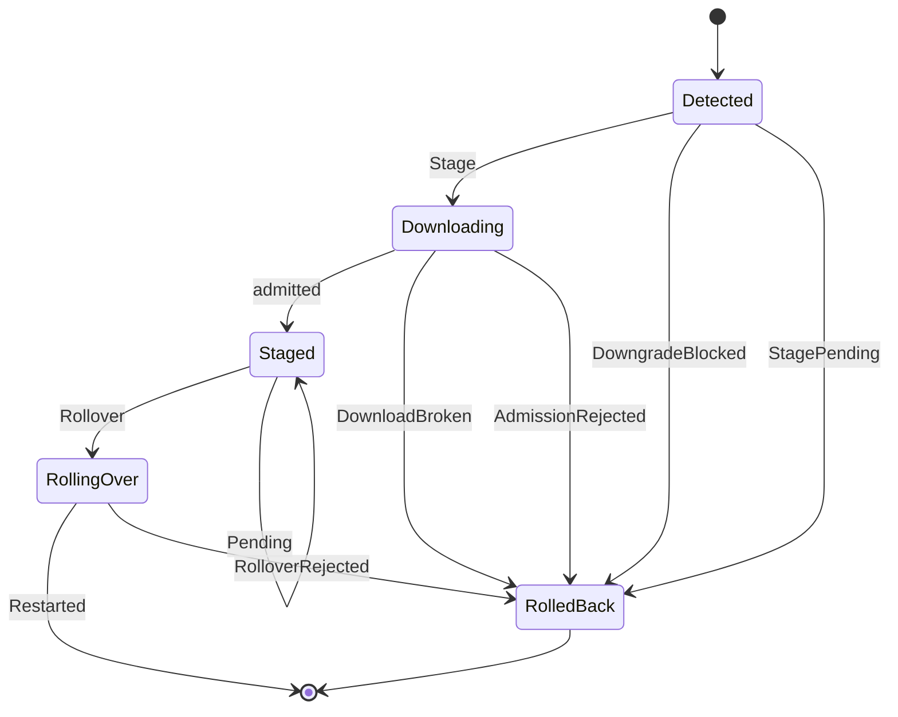
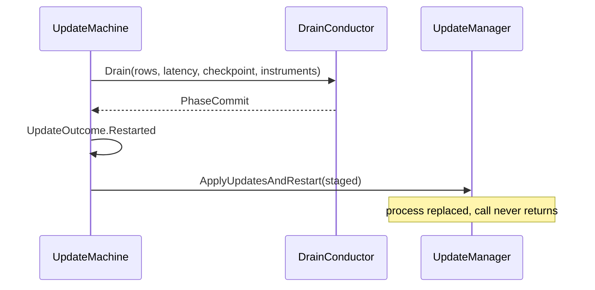

# [APPHOST_PROVISIONING_AND_UPDATE]

Rasm.AppHost owns post-fetch updates through one `UpdateManager` state machine: download, supply-chain admission, staging, drain, and restart. `UpdateChannel` rows carry the release ring and its downgrade policy while the feed binds from configuration at boot. `FleetRoll` walks `MembershipView.Serving` through health-gated canary, blue-green, or linear waves selected by a `FlagVerdict`, under one `DistributedLock` so two nodes never drive overlapping waves. `UpdateCheck(ReleaseIdentity)` remains the outbound detect leg; this page owns every later phase.

Settled composition: `SupplyChainGate`/`AdmissionSubject` from Sandbox/admission#SUPPLY_CHAIN_GATE; `Lifecycle`, `DrainRow`, `DrainBand`, and `DrainConductor.Drain` from Runtime/lifecycle#DRAIN_CONDUCTOR; `DeadlineClass` and `ClockPolicy` from Runtime/time; `RolloutSegment` and `FlagVerdict` from Runtime/features#FLAG_DEFINITION; `MembershipView`/`MemberRecord` and `DistributedLock`/`LeaseKey`/`FencedRuntime`/`CoordinationSink`/`FenceHolding`/`CoordinationFault` from Wire/coordination; `WireHealth.Evaluate` and `HealthReport` from Observability/health#WIRE_HEALTH; `LatencySpine.Seal` and `ILatencyContext`/`CheckpointToken`/`ILatencyDataExporter` from Observability/telemetry#SIGNAL_GOVERNANCE; `InstrumentSet` and `AppHostSlot` from Observability/instruments; `TelemetryDomain` from Observability/telemetry#SIGNAL_GOVERNANCE; `InstrumentSpec`/`InstrumentKind`/`MeasureForm`/`Buckets` from `Rasm/Domain/instrument`, `BoardPack`/`PanelSpec`/`Objective` from `Rasm/Domain/objective`, and `TelemetryContributorPort` from `Rasm/Domain/telemetry#CONTRIBUTE`, so this page declares rows and mints no instrument vocabulary; `TelemetrySource` from Rasm/Domain/frame; `Fault`/`FaultBand`/`Op` from Rasm/Domain/results. Velopack owns the release lifecycle, Thinktecture the vocabularies, LanguageExt the result types.

## [01]-[INDEX]

- [02]-[UPDATE_MACHINE]: Post-fetch state machine over one outcome family, its fault band, and generated instruments.
- [03]-[CHANNEL_AXIS]: Three feed rows binding explicit channel and downgrade policy onto options.
- [04]-[ROLLOVER_DRAIN]: Drain-before-swap handshake and the canary/blue-green/linear-wave `RollStrategy` axis over a lock-held, health-gated fleet wave.

## [02]-[UPDATE_MACHINE]

- Owner: `UpdateOutcome` `[Union]` the terminal disposition; `UpdateFault` `[Union]` the fault family riding the kernel `[FaultCase]`/`Fault` floor (`[FaultCase]` realizes the registry over `FaultBand.Update`; `Code` derive SEALED); `UpdateMetrics` the source-gen instrument partial under the `CounterAttribute`/`HistogramAttribute` generator, carrying the `TelemetryContributorPort` that DECLARES the family it mints; `UpdateMachine` the boundary capsule owning the `UpdateManager` handle and the staged-pending probe.
- Cases: `UpdateOutcome` = `StagedPending(Target)` | `Restarted(Target)` | `RolledBack(Option<string> Prior, generated FaultObservation Fault)` | `Declined(Reason)`; `UpdateFault` = DownloadBroken | StagePending | RolloverRejected | DowngradeBlocked | AdmissionRejected | FeedUnbound.
- Entry: `Stage(UpdateInfo found, IProgress<int> progress, CancellationToken token)` returns `IO<UpdateOutcome>` — carries the download-and-stage effect, forecloses a blocked downgrade and a release already staged for restart before transfer, and lands a broken transfer onto `DownloadBroken`; `Rollover(VelopackAsset asset, DrainThread drain)` returns `IO<UpdateOutcome>` — carries the drain-gated restart effect and lands a refused handoff onto `RolloverRejected`; `Resume(DrainThread drain)` returns `IO<UpdateOutcome>` — re-enters a staged-pending release after a process bounce, declining when nothing is pending; `UpdateMetrics.Port(string version)` is the declaration-only contributor port the composition root hands `InstrumentMount.Mount` at Runtime/modules, carrying this family on the `Published` column so governance, the view predicate, and the board read rows nobody re-binds.
- Law: `IsDowngrade` is the SHIPPED flag and the hand `target.Version < CurrentVersion` comparison it replaced was strictly narrower — Velopack's flag also covers the LATERAL move, a re-published build at the same version, which a strict less-than reads as a forward roll and stages without the policy check; the fact rides `UpdateFault.DowngradeBlocked` on the one arm where it decides anything.
- Law: ONE mint per instrument name. Generated partials bind these three handles on the meter this machine is handed, so the `AppHostMeasure` rows that once re-declared the same three names on the same meter were a forked stream; the family joins governance through `Port`'s `Published` column instead, which is the declaration surface a contributor that mounts nothing was given.
- Law: `Prior` rides `Option<string>` because `manager.CurrentVersion` is a foreign nullable; the probe is taken BEFORE the transfer and threaded into the terminal fold, so all three rollback arms carry the version a rollback returns to.
- Law: three fault cases had no producing arm while the state diagram drew every edge — `DownloadUpdatesAsync` was awaited raw inside `IO.liftAsync` so a broken transfer threw out of the effect unhandled, `Rollover` carried no failure arm at all, and `StagePending` named a conflict nothing tested. Both transfer edges now route through `Op.Catch`, and the third rides the `Foreclosed` fold's second arm, which refuses a transfer over a release already awaiting restart — the one act that overwrites the package `Resume` holds.
- Output: `UpdateOutcome` carries the terminal update state; generated counters and the rollover histogram write at the producing arm.
- Packages: Velopack, Thinktecture.Runtime.Extensions, LanguageExt.Core, NodaTime, Microsoft.Extensions.Telemetry.Abstractions, Rasm (kernel `Op`), BCL inbox
- Growth: one outcome case is one `Phase` arm and one `UpdateFault` case; a new phase key is one row the outcome roster projects onto; one instrument is one strongly-typed metric-attribute factory beside one `Published` row on `Port`, and one board tile is one `PanelSpec` on that port's pack; zero new surface.
- Boundary: `UpdateMachine` is the named boundary capsule for the statement carve-out — the `UpdateManager` ctor, the awaited download, and the terminal `ApplyUpdatesAndRestart` carry language-owned statement forms while every other member stays expression-shaped; the machine composes `UpdateManager` directly with no rename adapter and the `UpdateChannel` axis is the only added vocabulary; `VelopackApp.Build()...Run()` is the process-entry bootstrap owned at the app root, never a machine fence, so `VelopackHook` registration stays there; `ApplyUpdatesAndRestart` takes `found.TargetFullRelease` as its `VelopackAsset`, never the `UpdateInfo`, and on success the call never returns because the host process is replaced; `UpdateManager` publishes no disposal member at the catalogued surface, so the machine holds it for its own lifetime and implements no `IDisposable` it cannot honour; the feed url is the boot-resolved `FeedBinding`, never a row literal, so the machine dials only a proven configuration value; an inline `meter.CreateCounter` call is the deleted form — every spine instrument is a generated factory whose name and tag set are declaration facts; the `Target` fold reads `VelopackAsset.Version` through `ToString`, the single version-stamp boundary; `vpk`-side notarization and SBOM emission are build-time signing concerns and carry no machine fence, but `SupplyChainGate.Admit` verifies a downloaded release before staging as `AdmissionSubject.Release`, never a skipped step or a second gate; the page is host-local and crosses no browser or peer wire.

```csharp
// --- [ERRORS] --------------------------------------------------------------------------
[Union(ConversionFromValue = ConversionOperatorsGeneration.None)]
public abstract partial record UpdateFault : Fault {
    private static readonly FaultBand FamilyBand = FaultBand.Update;
    private UpdateFault(string detail) => Detail = detail;
    public string Detail { get; }
    public sealed override string Message => Detail;

    [FaultCase(0)]
    public sealed partial record DownloadBroken(string Target, Error Cause) : UpdateFault($"{Target}: {Cause.Message}"), ICausedFault;
    [FaultCase(1)]
    public sealed partial record StagePending : UpdateFault { public StagePending(string detail) : base(detail) { } }
    [FaultCase(2)]
    public sealed partial record RolloverRejected(string Target, Error Cause) : UpdateFault($"{Target}: {Cause.Message}"), ICausedFault;
    [FaultCase(3)]
    public sealed partial record DowngradeBlocked : UpdateFault { public DowngradeBlocked(string detail) : base(detail) { } }
    [FaultCase(4)]
    public sealed partial record AdmissionRejected(string Target, Error Cause) : UpdateFault($"{Target}: {Cause.Message}"), ICausedFault;
    [FaultCase(5)]
    public sealed partial record FeedUnbound : UpdateFault { public FeedUnbound(string key) : base($"{key}: unset or not absolute") { } }
}

[Union(ConversionFromValue = ConversionOperatorsGeneration.None)]
public abstract partial record UpdateOutcome {
    private UpdateOutcome() { }
    public sealed record StagedPending(string Target) : UpdateOutcome;
    public sealed record Restarted(string Target) : UpdateOutcome;
    public sealed record RolledBack(
        Option<string> Prior,
        Rasm.Contracts.Fault.FaultObservation Fault) : UpdateOutcome;
    public sealed record Declined(string Reason) : UpdateOutcome;

    public static UpdateOutcome Reverted(Option<string> prior, Error fault) =>
        new RolledBack(prior, FaultWire.Observe(fault));
}

// --- [SERVICES] ------------------------------------------------------------------------
public static partial class UpdateMetrics {
    [Counter("rasm.apphost.channel", Name = "rasm.apphost.update.staged")]
    public static partial StagedMetric Staged(Meter meter);

    [Counter("rasm.apphost.channel", Name = "rasm.apphost.update.rollback")]
    public static partial RollbackMetric Rollback(Meter meter);

    [Histogram("rasm.apphost.channel", Name = "rasm.apphost.update.rollover.duration")]
    public static partial RolloverDurationMetric RolloverDuration(Meter meter);

    public static TelemetryContributorPort Port(string version) =>
        new(Scope: TelemetrySource.AppHost, Version: version, Instruments: Seq<InstrumentSpec>(),
            Published: Seq(StagedRow, RollbackRow, RolloverRow), Board: Some(Tiles));

    private static readonly InstrumentSpec StagedRow = InstrumentSpec.Create(
        TelemetryDomain.AppHost.Measure("update.staged"), InstrumentKind.Count, MeasureForm.Whole, "{release}",
        "releases staged for restart by update channel", Seq(AppHostSlot.Channel.Key), None, None, None);

    private static readonly InstrumentSpec RollbackRow = InstrumentSpec.Create(
        TelemetryDomain.AppHost.Measure("update.rollback"), InstrumentKind.Count, MeasureForm.Whole, "{release}",
        "update transitions rolled back by update channel", Seq(AppHostSlot.Channel.Key), None, None, None);

    private static readonly InstrumentSpec RolloverRow = InstrumentSpec.Create(
        TelemetryDomain.AppHost.Measure("update.rollover.duration"), InstrumentKind.Distribution, MeasureForm.Real,
        Buckets.Seconds, "drain-gated update rollover duration per channel", Seq(AppHostSlot.Channel.Key),
        Some(Buckets.CadenceSeconds), None, None);

    private static readonly BoardPack Tiles = new(
        Wire: TelemetryDomain.AppHost.Measure("update"),
        Panels: Seq(
            new PanelSpec("updates staged", StagedRow.Name, StagedRow.Dimensions, None),
            new PanelSpec("update rollbacks", RollbackRow.Name, RollbackRow.Dimensions, None),
            new PanelSpec("update rollover", RolloverRow.Name, RolloverRow.Dimensions, None)),
        Objectives: Seq<Objective>());
}

// --- [BOUNDARIES] ----------------------------------------------------------------------
public sealed class UpdateMachine {
    readonly UpdateManager manager;
    readonly UpdateChannel channel;
    readonly Lifecycle host;
    readonly SupplyChainGate.Runtime gate;
    readonly StagedMetric staged;
    readonly RollbackMetric rollback;
    readonly RolloverDurationMetric rolloverDuration;

    public UpdateMachine(FeedBinding feed, Lifecycle host, SupplyChainGate.Runtime gate, Meter meter) {
        this.channel = feed.Channel;
        this.host = host;
        this.gate = gate;
        this.manager = new UpdateManager(feed.Feed.AbsoluteUri, new UpdateOptions {
            ExplicitChannel = channel.ExplicitChannel,
            AllowVersionDowngrade = channel.AllowVersionDowngrade,
        });
        this.staged = UpdateMetrics.Staged(meter);
        this.rollback = UpdateMetrics.Rollback(meter);
        this.rolloverDuration = UpdateMetrics.RolloverDuration(meter);
    }

    public Option<VelopackAsset> Pending => Optional(manager.UpdatePendingRestart);

    Option<string> Prior => Optional(manager.CurrentVersion).Map(static version => version.ToString());

    Option<UpdateFault> Foreclosed(UpdateInfo found) =>
        found.IsDowngrade && !channel.AllowVersionDowngrade
            ? Some((UpdateFault)new UpdateFault.DowngradeBlocked(Target(found)))
            : Pending.Map(static asset => (UpdateFault)new UpdateFault.StagePending(Target(asset)));

    public IO<UpdateOutcome> Stage(UpdateInfo found, IProgress<int> progress, CancellationToken token) =>
        Foreclosed(found).Match(
            Some: cause =>
              from _counted in IO.lift(() => rollback.Add(1, channel.Key))
              select UpdateOutcome.Reverted(Prior, cause),
            None: () =>
              from start in IO.lift(() => host.Clocks.Now)
              from prior in IO.lift(() => Prior)
              from transferred in IO.liftAsync(async () =>
                  await Op.Of().Catch(async execution => {
                      await manager.DownloadUpdatesAsync(found, progress.Report, execution).ConfigureAwait(false);
                      return Fin.Succ(unit);
                  }, token))
              from admitted in transferred.Match(
                  Succ: _ => SupplyChainGate.Admit(gate, new AdmissionSubject.Release(found.TargetFullRelease, channel), token),
                  Fail: error => IO.pure<Validation<Error, SupplyChainAdmission>>(Fail<Error, SupplyChainAdmission>(error)))
              from finish in IO.lift(() => host.Clocks.Now)
              let outcome = Settled(transferred, admitted, Target(found), prior)
              from _metered in IO.lift(() => outcome is UpdateOutcome.StagedPending
                  ? staged.Add(1, channel.Key)
                  : rollback.Add(1, channel.Key))
              select outcome);

    public IO<UpdateOutcome> Rollover(VelopackAsset asset, DrainThread drain) =>
        from drained in host.Drain(
            DrainRows(), drain.Latency, drain.Checkpoint, drain.Instruments,
            DeadlineClass.DrainCooperative.Allotted)
        from _sealed in LatencySpine.Seal(drain.Exporter, drain.Latency)
        from _timed in IO.lift(() => rolloverDuration.Record(drained.Held.TotalSeconds, channel.Key))
        let rolling = (UpdateOutcome)new UpdateOutcome.Restarted(Target(asset))
        from handed in IO.lift<Fin<Unit>>(() => Op.Of().Catch(() => {
            manager.ApplyUpdatesAndRestart(asset);
            return Fin.Succ(unit);
        }, token: host.Spine.Token))
        from settled in handed.Match(
            Succ: _ => IO.pure(rolling),
            Fail: error => IO.pure(UpdateOutcome.Reverted(
                Prior, new UpdateFault.RolloverRejected(Target(asset), error))))
        select settled;

    public IO<UpdateOutcome> Resume(DrainThread drain) =>
        Pending.Match(
            Some: asset => Rollover(asset, drain),
            None: () => IO.pure<UpdateOutcome>(new UpdateOutcome.Declined(nameof(Pending))));

    Seq<DrainRow> DrainRows() => [new(nameof(UpdateMachine), DrainBand.Stores, 0, static _ => IO.pure(unit))];

    static UpdateOutcome Settled(
        Fin<Unit> transferred, Validation<Error, SupplyChainAdmission> admitted, string target, Option<string> prior) =>
        transferred.Match(
            Succ: _ => admitted.Match(
                Succ: _ => (UpdateOutcome)new UpdateOutcome.StagedPending(target),
                Fail: faults => UpdateOutcome.Reverted(prior, new UpdateFault.AdmissionRejected(target, faults))),
            Fail: error => UpdateOutcome.Reverted(prior, new UpdateFault.DownloadBroken(target, error)));

    static string Target(UpdateInfo found) => Target(found.TargetFullRelease);

    static string Target(VelopackAsset asset) => asset.Version.ToString();
}
```



## [03]-[CHANNEL_AXIS]

- Owner: `UpdateChannel` `[SmartEnum<string>]` three release-ring rows under the `ComparerAccessors.StringOrdinal` accessor, carrying the explicit-channel string and the downgrade-allow column as INSTANCE columns; `FeedBinding` the config-resolved per-channel feed the machine dials.
- Cases: 3 channel rows — stable, beta, canary.
- Entry: `FeedBinding.Of(UpdateChannel channel, IConfiguration configuration)` returns `Fin<FeedBinding>` — the boot-time resolve of that channel's feed key through the ranked `ConfigSource` chain, refusing an unset or non-absolute value on the typed result under the channel's own name.
- Law: this roster is the FOLDER'S PRECEDENT for a `[SmartEnum]` carrying its policy as instance columns — the row answers `ExplicitChannel` and `AllowVersionDowngrade` itself, so no parallel per-ring policy table and no key-to-policy `Switch` exists to drift from it. `Sandbox/solver#SOLVER_KIND` and `[04]`'s `RollStrategy` read the same shape.
- Law: the resolved row's `ExplicitChannel` seats `UpdateOptions.ExplicitChannel` and its `AllowVersionDowngrade` seats `UpdateOptions.AllowVersionDowngrade`, while the ctor url comes from the `FeedBinding` the composition resolved — those two declared columns and one bound value are the whole update-options surface the machine writes; `MaximumDeltasBeforeFallback` stays unset so the full-package fallback governs; canary alone admits a downgrade so a forward-rolled canary build reverts to its prior pin.
- Output: the channel key tags every generated update instrument; a refused binding rides the boot `Fin` naming the channel and its key.
- Packages: Velopack, Microsoft.Extensions.Configuration, Thinktecture.Runtime.Extensions, LanguageExt.Core
- Growth: one channel row carries one explicit-channel string, one downgrade column, and one config key its binding reads; a ring split lands as one row and one key, never a second axis; zero new surface.
- Boundary: the axis owns the release-RING decision and never the feed VALUE — a feed URI is a deploy fact differing per environment, per tenant, and per air-gapped mirror, so a literal frozen into a settled row is the deleted form twice over: it asserts a value no surface was read for, and it forecloses the offline and mirror cases the supply-chain gate exists to serve; the feed binds from the `Runtime/config#POLICY_VALUES` ranked source chain and validates at boot, so an unset or unreachable feed refuses on the typed result under a named channel instead of surfacing later as a network fault from a dead host; the detect-leg `ReleaseIdentity.Feed` is the outbound poll URI of the `UpdateCheck` hop, a distinct value the axis never reads — and the identity-to-ring resolve that once sat here DELETES, because the ring the machine runs on is the one its `FeedBinding` carries and a second read of the same fact off a detect-leg record is a mirror with no producer; `ExplicitChannel` is the Velopack channel-suffix selector pinning which release set the manager resolves; `AllowVersionDowngrade` is the downgrade-policy column the machine reads before any transfer, never a per-call flag; the `AddView` rows at signal-governance cap update-instrument cardinality on the channel key so three channels cap at three series per instrument.

```csharp
// --- [TYPES] ---------------------------------------------------------------------------
[SmartEnum<string>]
[KeyMemberEqualityComparer<ComparerAccessors.StringOrdinal, string>]
[KeyMemberComparer<ComparerAccessors.StringOrdinal, string>]
public sealed partial class UpdateChannel {
    public static readonly UpdateChannel Stable = new("stable", explicitChannel: "stable", allowVersionDowngrade: false);
    public static readonly UpdateChannel Beta = new("beta", explicitChannel: "beta", allowVersionDowngrade: false);
    public static readonly UpdateChannel Canary = new("canary", explicitChannel: "canary", allowVersionDowngrade: true);

    public string ExplicitChannel { get; }
    public bool AllowVersionDowngrade { get; }
}

// --- [MODELS] --------------------------------------------------------------------------
public sealed record FeedBinding(UpdateChannel Channel, Uri Feed) {
    public const string Section = nameof(FeedBinding);

    public static string KeyOf(UpdateChannel channel) => $"{Section}:{channel.Key}";

    public static Fin<FeedBinding> Of(UpdateChannel channel, IConfiguration configuration) =>
        Uri.TryCreate(configuration[KeyOf(channel)], UriKind.Absolute, out Uri? feed)
            ? Fin.Succ(new FeedBinding(channel, feed))
            : Fin.Fail<FeedBinding>(new UpdateFault.FeedUnbound(KeyOf(channel)));
}
```

## [04]-[ROLLOVER_DRAIN]

- Owner: `DrainThread` the composition-supplied record carrying the conductor's telemetry tail; `RollVerdict` `[SmartEnum<string>]` the three wave verdicts; `RollStrategy` `[SmartEnum<string>]` the progressive-delivery axis with delegate-backed cohort planning over the features owner's `RolloutSegment` band, the `From(FlagVerdict)` verdict seat, and the shared advance fold; `FleetRuntime` the fleet-conductor dependency capsule; `NodeRoll` the per-node wave result; `FleetRoll` the lock-held wave conductor walking `MembershipView.Serving`.
- Cases: three roll strategies — `Canary` rolls the probe cohort its own band answers, then expands over the remainder, `BlueGreen` swaps a parallel half-fleet cohort on a health-pass, `LinearWave` advances fixed-percentage increments with a bake window between waves; `RollVerdict` = advanced | held | rolled-back.
- Entry: `Roll(FleetRuntime fleet, MembershipView membership, RollStrategy strategy, Op key)` returns `IO<Validation<Error, Seq<NodeRoll>>>` — refuses an empty serving set under the caller's `Op` before anything is acquired, takes `LeaseKey.Lock(FleetRoll.Section)` for the rollover section, plans the cohorts from `strategy.Plan(membership.Serving)`, rolls each cohort under the fence, waits on the post-roll `WireHealth.Evaluate` serving probe, and bakes the strategy's inter-wave dwell before the next cohort admits.
- Law: one conductor per fleet is now STRUCTURAL — waves run inside `DistributedLock.Guard` over `LeaseKey.Lock(FleetRoll.Section)`, the fleet-wide `rollover-drain` name held as a page constant, so a second node contending the section reads `CoordinationFault.LockHeld` and rolls nothing, and a conductor whose lease lapses mid-wave surfaces `FenceRejected` instead of driving cohorts against another node's. Keying that lease on the caller's `Op` was the exclusion in name only: two conductors entering under two member names took two disjoint leases over one fleet.
- Law: `FleetRuntime` supplies one clock for every node result in the wave.
- Law: the wave verdict is a ROW rather than a bool beside three string constants. `Advances` answered a bool and the annotation fold re-derived a three-way disposition from it and a rollback scan, spelling three untyped tokens the annotation carried as `const string`; `RollVerdict` is one typed answer both the advance decision and the annotation read.
- Law: `BlueGreen` and `LinearWave` shared one byte-identical plan lambda differing only in their band and bake columns, so the fold lands ONCE as `Banded` and the two rows carry their columns; `Canary`'s lead-then-remainder plan is genuinely different and stays its own, reading the same band column through the same `Cohort` projection so no plan on this axis ignores the exposure it was handed. `RollPlan` deletes with them — it copied `Bake` into `BakeWindow` and existed to carry a value the strategy row already answers.
- Law: the annotation carries its rows TYPED. Its `Channel`, `Strategy`, and `Verdict` columns were hand-projected to strings by a seven-member mint, and the suite wire law already generates that projection for every `[SmartEnum<string>]` — a transcription beside a converter is the twin, whether hand-written or generated.
- Law: cohort planning composes the features owner's `[0,100)` value object, so a wave width and a flag rollout segment are ONE percentage vocabulary the solution validates once; a page-local `Width(count, percent)` helper is the ad-hoc percentage-rollout computation `Runtime/features#FLAG_DEFINITION` names deleted, and it silently admitted out-of-band literals the value object's factory refuses at type init.
- Output: each cohort node returns one `NodeRoll` carrying wave index, strategy, node id, terminal `UpdateOutcome`, post-roll serving status, the unrolled node count, and the producer's instant.
- Packages: Velopack, LanguageExt.Core, NodaTime, Thinktecture.Runtime.Extensions, Generator.Equals, Rasm (kernel `InstrumentSet`/`Op`), BCL inbox
- Growth: one drain participant row per update-sensitive subsystem registered through `DrainParticipantPort` at its declared band; a new progressive strategy is one `RollStrategy` row with its plan delegate and policy columns, never a second roll state machine; a wave-width retune is the row's `RolloutSegment` band; zero new surface.
- Boundary: drain-before-swap is the law — `ApplyUpdatesAndRestart` is never reached until `DrainConductor.Drain` settles, so the replaced process leaves no half-flushed store write or in-flight hop; the cooperative and forced budgets are the conductor's OWN `DeadlineClass` rows and no longer travel on the thread record, because the fold reads them itself and two call sites carrying them disagree; the latency context, checkpoint token, instrument set, and ledger exporter arrive on the `DrainThread` from the composition root, so this page consumes the drain fold and declares none of its telemetry threads; the staged asset is `UpdatePendingRestart` read at composition, so a rollover after a process bounce resumes from the staged phase without re-staging; the rollover is the single restart path and the bare `ApplyUpdatesAndExit` and `WaitExitThenApplyUpdates` forms are deleted because the drain-gated restart owns the handoff; `RollStrategy` is one row on the existing `FleetRoll`, not a parallel conductor — a second roll state machine or a strategy-specific scheduler beside `ScheduleEntry.Spread` is the rejected form, and the `ScheduleEntry.Spread` fleet-spread seed stays the wave-pacing cadence the strategy `Bake` reads; the bake dwell rides the injected clock-driven delegate on the runtime capsule, never an ambient `Task.Delay`, so a `LinearWave` bakes its window and a `Canary` holds its probe deterministically under the same `TimeProvider` the spine injects; `FleetRoll` consumes `MembershipView.Serving` as fleet membership and the `WireHealth` serving projection as the recovery gate; each node rolls through the same `machine.Rollover`, and the first unrecovered node halts the fleet.

```csharp
// --- [MODELS] --------------------------------------------------------------------------
public sealed record DrainThread(
    ILatencyContext Latency,
    CheckpointToken Checkpoint,
    InstrumentSet Instruments,
    ILatencyDataExporter Exporter);

// --- [TYPES] ---------------------------------------------------------------------------
[SmartEnum<string>]
[KeyMemberEqualityComparer<ComparerAccessors.StringOrdinal, string>]
[KeyMemberComparer<ComparerAccessors.StringOrdinal, string>]
public sealed partial class RollVerdict {
    public static readonly RollVerdict Advanced = new("advanced");
    public static readonly RollVerdict Held = new("held");
    public static readonly RollVerdict RolledBack = new("rolled-back");
}

[SmartEnum<string>]
[KeyMemberEqualityComparer<ComparerAccessors.StringOrdinal, string>]
[KeyMemberComparer<ComparerAccessors.StringOrdinal, string>]
public sealed partial class RollStrategy {
    public static readonly RollStrategy Canary = new("canary", wave: RolloutSegment.Create(1), bake: Duration.FromSeconds(120), plan: Led);
    public static readonly RollStrategy BlueGreen = new("blue-green", wave: RolloutSegment.Create(50), bake: Duration.Zero, plan: Banded);
    public static readonly RollStrategy LinearWave = new("linear-wave", wave: RolloutSegment.Create(25), bake: Duration.FromSeconds(300), plan: Banded);

    public static readonly RollStrategy Default = Canary;

    public RolloutSegment Wave { get; }
    public Duration Bake { get; }

    public static RollStrategy From(FlagVerdict verdict) =>
        TryGet((string)verdict.Variant, out RollStrategy? row) ? row : Default;

    [UseDelegateFromConstructor]
    public partial Seq<Seq<MemberRecord>> Plan(Seq<MemberRecord> nodes, RolloutSegment wave);

    public Seq<Seq<MemberRecord>> Plan(Seq<MemberRecord> nodes) => Plan(nodes, Wave);

    public RollVerdict Verdict(Seq<NodeRoll> cohort) =>
        cohort.Exists(static row => row.Outcome is UpdateOutcome.RolledBack) ? RollVerdict.RolledBack
        : cohort.ForAll(static row => row.Outcome is UpdateOutcome.Restarted && row.Serving == ServingStatus.Serving) ? RollVerdict.Advanced
        : RollVerdict.Held;

    static Seq<Seq<MemberRecord>> Led(Seq<MemberRecord> nodes, RolloutSegment wave) =>
        Seq(nodes.Take(wave.Cohort(nodes.Count)), nodes.Skip(wave.Cohort(nodes.Count)))
            .Filter(static cohort => !cohort.IsEmpty);

    static Seq<Seq<MemberRecord>> Banded(Seq<MemberRecord> nodes, RolloutSegment wave) =>
        nodes.IsEmpty ? [] : toSeq(nodes.Chunk(int.Max(1, wave.Cohort(nodes.Count))).Select(static cohort => toSeq(cohort)));
}

// --- [SERVICES] ------------------------------------------------------------------------
public sealed record FleetRuntime(
    FencedRuntime Fence,
    CoordinationSink Coordination,
    Func<MemberRecord, IO<UpdateOutcome>> RollNode,
    Func<MemberRecord, IO<HealthReport>> Probe,
    Func<Duration, IO<Unit>> Bake,
    ClockPolicy Clocks);

// --- [MODELS] --------------------------------------------------------------------------
public readonly record struct NodeRoll(
    int Wave,
    RollStrategy Strategy,
    int NodeId,
    UpdateOutcome Outcome,
    ServingStatus Serving,
    int Remaining,
    Instant At);

// --- [OPERATIONS] ----------------------------------------------------------------------
public static class FleetRoll {
    public const string Section = "rollover-drain";

    public static IO<Validation<Error, Seq<NodeRoll>>> Roll(
        FleetRuntime fleet, MembershipView membership, RollStrategy strategy, Op key) =>
        membership.Serving.IsEmpty
            ? IO.pure(Fail<Error, Seq<NodeRoll>>(
                CoordinationFault.Of(key.InvalidInput(nameof(MembershipView.Serving)))))
            : DistributedLock.Acquire(fleet.Fence, fleet.Coordination, LeaseKey.Lock(Section)).Bind(acquired => acquired.Match(
                Succ: held => DistributedLock
                    .Guard(fleet.Fence, held, Wave(fleet, strategy.Plan(membership.Serving), 0, strategy))
                    .Bind(rolled => DistributedLock.Release(fleet.Fence, fleet.Coordination, held).Map(_ => rolled)),
                Fail: faults => IO.pure(Fail<Error, Seq<NodeRoll>>(faults))));

    static IO<Seq<NodeRoll>> Wave(
        FleetRuntime fleet, Seq<Seq<MemberRecord>> cohorts, int index, RollStrategy strategy) =>
        cohorts.Head.Match(
            Some: cohort => cohort.Map(static (node, slot) => (Node: node, Slot: slot))
                .TraverseM(pair =>
                    from rolled in fleet.RollNode(pair.Node)
                    from report in fleet.Probe(pair.Node)
                    let result = new NodeRoll(index, strategy, pair.Node.NodeId, rolled, Serving(report),
                        cohort.Count - pair.Slot - 1 + cohorts.Tail.Sum(static rest => rest.Count), fleet.Clocks.Now)
                    select result)
                .As()
                .Bind(here =>
                    from rest in strategy.Verdict(here) == RollVerdict.Advanced && !cohorts.Tail.IsEmpty
                        ? (strategy.Bake > Duration.Zero ? fleet.Bake(strategy.Bake) : IO.pure(unit))
                            .Bind(_ => Wave(fleet, cohorts.Tail, index + 1, strategy))
                        : IO.pure(Seq<NodeRoll>())
                    select here + rest),
            None: static () => IO.pure(Seq<NodeRoll>()));

    static ServingStatus Serving(HealthReport report) =>
        report.Status == HealthStatus.Unhealthy ? ServingStatus.NotServing : ServingStatus.Serving;
}
```



## [05]-[RESEARCH]

<!-- source-only: research row template:
[TOKEN]-[OPEN|BLOCKED]: <exact question>; <verification route>.
-->

(none)
