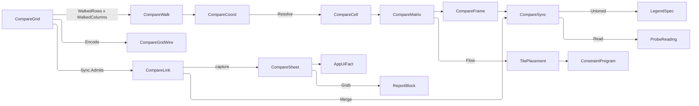

# [APPUI_ANALYSIS_COMPARE]

The compare grid is the analysis plane's side-by-side surface: a matrix of synced scenes, each cell bound to one `(option, analysis, instant)` triple, sharing camera, probe, legend domain, and capture so the only thing that differs between two cells is the coordinate that names them. `CompareAxis` is the closed vocabulary a cell coordinate spans; `CompareGrid` declares which two axes the matrix walks and pins every axis it does not, because a two-dimensional matrix fixes whatever it leaves unwalked and a grid that left them free would describe a volume nobody can read; `CompareLink` is the closed capability vocabulary of what a grid SHARES, each row carrying the fold that merges the cells into one channel rather than each cell owning its own; `CompareBoard` is the placement fold, the track preset, the seated screen, and the contact-sheet bake.

A cell is a `LayerStack` under a coordinate — a compare surface mounts the same layer machinery the single scene does and owns no second layer family. `ResultLayer`, `LayerStack`, `ResultDomain`, `ProbeChannel`, `ProbeReading`, and `BakeContext` arrive settled from `layers`; `OptionKey` and `OptionSet` from `Editing/livedata#OPTION_SETS`; `AnalysisContext` and its instant from `context#TEMPORAL_AXIS`; `PlacementGrid`, `PlacementFlow`, and `SpanPolicy` from `Charts/boards#PLACEMENT_FOLD` and `TilePlacement` from `Charts/tiles#TILE_SPINE`; `LayoutPreset`, `TrackSize`, and `ConstraintProgram` from `Shell/solver#LAYOUT_PRESETS`; `LegendSpec` and `LegendDomain` from `Charts/grammar#LEGEND_VOCABULARY`; `ViewCamera` and `Viewpoint` from `Render/viewpoint#VIEWPOINT_CODEC`; `ReportBlock` and `ReportSetup` from `Document/export#FLOW_REPORT`. Kernel `Stat<Scalar>`, `CapabilitySet`, `Op`, and `Fault` arrive whole from `Rasm.Domain`.

## [01]-[INDEX]

- [02]-[COMPARE_CELL]: The axis coordinate, the pinned-axis law, one cell as a coordinate over an optional stack, the grid's member cap with its honest overflow, and the declaration codec a checkpoint carries.
- [03]-[SHARED_CHANNELS]: The four linked channels, the row-carried merge each performs, and the unioned legend domain that makes cells comparable.
- [04]-[GRID_PROGRAM]: Placement through the board's own fold, the track preset, the surface body with its verbs, the seated screen, and the contact-sheet bake.

## [02]-[COMPARE_CELL]

- Owner: `CompareFault` — the direct generated `[Union]` with one `[FaultCase]` leaf per comparison failure; `GridKey` — the admitted grid identity; `CompareAxis` `[SmartEnum<string>]` — the axes a coordinate spans, each carrying its member projection and its seat; `CompareCoord` — the whole coordinate every cell carries; `CompareCell` — one coordinate over an optional stack; `CompareGrid` — the declaration with its two walked axes, its pinned coordinate, its cap, its link grant set, and its checkpoint codec; `CompareGridWire` with `CompareGridMap` — the durable declaration projection; `CompareWalk` and `CompareMatrix` — the walk product and the resolved matrix; `CompareCells` — the instruments, the resolve, and the one walk.
- Cases: `CompareAxis` = option · analysis · time; `CompareFault` = GridRejected | AxisConflict | MemberAbsent | LinkRejected | BakeRejected.
- Entry: `public static Fin<CompareGrid> Admit(CompareGrid candidate)` — five named gates refused together, the pinned set deriving from the walk; `public Seq<CompareAxis> Held` on `CompareGrid` — the derived pinned roster the header states; `public CompareWalk Coords()` on `CompareGrid` — the capped cartesian walk in declared member order beside the members it refused; `public Fin<string> Encode()` and `public static Fin<CompareGrid> Decode(string blob)` — the checkpoint round trip; `public static CompareCell Resolve(CompareCoord at, Func<CompareCoord, Option<LayerStack>> bound)` — the coordinate-to-cell resolve; `public static Fin<CompareMatrix> Walk(CompareGrid grid, Func<CompareCoord, Option<LayerStack>> bound)` — the whole grid in one fold.
- Auto: the coordinate carries every axis value whether a grid walks it or pins it, so a cell's caption, its capture key, and its report row all read one record; members hold DECLARED order rather than a collation, because an option roster, an analysis roster, and a month sequence each carry meaning in their own order that a sort destroys; the cap TRUNCATES each walked axis and publishes the held-back count on `Overflow`; a member the axis cannot seat rides `CompareWalk.Refused` to the header rather than vanishing.
- Packages: Thinktecture.Runtime.Extensions, LanguageExt.Core, Riok.Mapperly, NodaTime, Rasm (project — `FaultBand`, `Op`, `CapabilitySet`), BCL inbox
- Growth: a new comparison axis is one `CompareAxis` row carrying its member projection and its seat, beside the `CompareCoord` column that row reads and writes and the two `CompareGridWire` columns the checkpoint carries — after which the walk, the pin derivation, the caption, the capture key, and the sheet table absorb it untouched; a new cell fact is one `CompareCell` field; zero new surface.
- Boundary:
  - A grid walks TWO axes and pins every axis it does not. A free third axis describes a volume, not a matrix, so a grid declaring two identical walks refuses at admission rather than rendering an arbitrary projection of one; the pinned coordinate rides the grid itself so a caption states which axes are held and the operator reads the comparison as the comparison it is.
  - A cell is a `LayerStack` — the same owner the single scene mounts — so every layer verb, every probe read, and every bake works identically inside a cell and a compare-only layer family is unspellable. Absence is the stack's own `Option`: an unbound coordinate carries NO stack rather than an empty one, so the empty-stack sentinel and the `Bound` flag that had to travel beside it both leave, and a cell that could not answer the probe is unrepresentable rather than guarded.
  - Cells are BOUND, never re-solved: a coordinate names an option, a study, and an instant, and the sealed result under that triple either exists or the cell renders its absent state. Launching a solve to fill an empty cell is the deleted form — a grid that quietly queued twelve solves is a compute bill an operator never agreed to.
  - The cap TRUNCATES and states its truncation, which is where this surface parts from the facet cap it otherwise mirrors. A facet's residual member unions N partitions' ROWS into one chart, so the residual cell renders something real; a compare cell is a SCENE under one coordinate, and the union of twelve options is not a scene any renderer could draw. So the walk stops at the cap and `Overflow` carries the held-back count for the header.
  - A grant set is what makes a matrix a comparison, so an empty one refuses at admission: a grid sharing no channel is a wall of unrelated pictures, and the prose that said so while the fence admitted it was the contradiction this gate closes.
  - Admission refuses ALL of its defects at once. A first-defect ladder answered "axes, members, or cap" to an operator who had to fix one column, resubmit, and meet the next refusal — the accumulating `Validation` names every column in one pass and each gate carries the fault case its own column earns.
  - `CompareFault` carries each refusal through a direct generated union case.

```csharp
// --- [ERRORS] --------------------------------------------------------------------------


[Union(ConversionFromValue = ConversionOperatorsGeneration.None)]
public abstract partial record CompareFault : Fault {
    private static readonly FaultBand FamilyBand = FaultBand.Compare;
    private CompareFault(string detail) { Detail = detail; }

    public string Detail { get; }

    public override string Message => Detail;

    public static Validation<Error, Unit> Gate(bool holds, CompareFault refusal) =>
        holds ? unit : (Validation<Error, Unit>)(Error)refusal;

    [FaultCase(0)]
    public sealed partial record GridRejected(string Detail) : CompareFault($"compare/grid: {Detail}");
    [FaultCase(1)]
    public sealed partial record AxisConflict(string Rows, string Columns) : CompareFault($"compare/axis: {Rows} and {Columns} are one axis");
    [FaultCase(2)]
    public sealed partial record MemberAbsent(string Axis, string Member) : CompareFault($"compare/member: {Axis} declares no {Member}");
    [FaultCase(3)]
    public sealed partial record LinkRejected(string Detail) : CompareFault($"compare/link: {Detail}");
    [FaultCase(4)]
    public sealed partial record BakeRejected(string Detail) : CompareFault($"compare/bake: {Detail}");
}
```

```csharp
// --- [TYPES] ---------------------------------------------------------------------------

[ValueObject<string>(EmptyStringInFactoryMethodsYieldsNull = false)]
[KeyMemberEqualityComparer<ComparerAccessors.StringOrdinal, string>]
[KeyMemberComparer<ComparerAccessors.StringOrdinal, string>]
public readonly partial struct GridKey {
    static partial void ValidateFactoryArguments(ref ValidationError? error, ref string key) =>
        error = string.IsNullOrWhiteSpace(key) ? new ValidationError("compare grid key is blank") : null;
}

[SmartEnum<string>]
[KeyMemberEqualityComparer<ComparerAccessors.StringOrdinal, string>]
[KeyMemberComparer<ComparerAccessors.StringOrdinal, string>]
public sealed partial class CompareAxis {
    static readonly Op Seat = Op.Of(name: $"{CompareCells.Plane}.seat");

    public static readonly CompareAxis Option = new("option",
        static coord => coord.Option.Value,
        Seated<OptionKey>("option",
            static member => Seat.AcceptValidated<OptionKey>(member).ToOption(),
            static (coord, key) => coord with { Option = key }));
    public static readonly CompareAxis Analysis = new("analysis",
        static coord => coord.Analysis,
        Seated<string>("analysis",
            static member => Optional(member).Filter(static text => !string.IsNullOrWhiteSpace(text)),
            static (coord, key) => coord with { Analysis = key }));
    public static readonly CompareAxis Time = new("time",
        static coord => InstantPattern.ExtendedIso.Format(coord.At),
        Seated<Instant>("time",
            static member => InstantPattern.ExtendedIso.Parse(member) switch {
                { Success: true } parsed => Some(parsed.Value),
                _ => Option<Instant>.None,
            },
            static (coord, key) => coord with { At = key }));

    [UseDelegateFromConstructor]
    public partial string Member(CompareCoord coord);

    [UseDelegateFromConstructor]
    public partial Fin<CompareCoord> Seat(CompareCoord coord, string member);

    static Func<CompareCoord, string, Fin<CompareCoord>> Seated<T>(
        string axis, Func<string, Option<T>> read, Func<CompareCoord, T, CompareCoord> write) =>
        (coord, member) => read(member)
            .ToFin(new CompareFault.MemberAbsent(axis, member))
            .Map(value => write(coord, value));
}
```

```csharp
// --- [MODELS] --------------------------------------------------------------------------

public readonly record struct CompareCoord(OptionKey Option, string Analysis, Instant At) {
    public string Key =>
        $"{Option.Value}|{Analysis}|{InstantPattern.ExtendedIso.Format(At)}";
}

public sealed record CompareCell(CompareCoord At, Option<LayerStack> Stack) {
    public static CompareCell Absent(CompareCoord at) => new(at, None);
}

public readonly record struct CompareWalk(Seq<Error> Refused, Seq<CompareCoord> Walked);

public sealed record CompareGrid(
    GridKey Key,
    CompareAxis Rows,
    CompareAxis Columns,
    Seq<string> RowMembers,
    Seq<string> ColumnMembers,
    CompareCoord Pinned,
    int Cap,
    CapabilitySet<CompareLink> Sync) {
    public const int Ceiling = 1 << 14;

    public static string OverflowStem => LocaleStrings.Key(nameof(CompareGrid), "overflow");

    public static string RefusedStem => LocaleStrings.Key(nameof(CompareGrid), "refused");

    public static Fin<CompareGrid> Admit(CompareGrid candidate) =>
        (CompareFault.Gate(candidate.Rows != candidate.Columns,
             new CompareFault.AxisConflict(candidate.Rows.Key, candidate.Columns.Key)),
         CompareFault.Gate(!candidate.RowMembers.IsEmpty,
             new CompareFault.GridRejected($"{candidate.Key}: the row axis declares no members")),
         CompareFault.Gate(!candidate.ColumnMembers.IsEmpty,
             new CompareFault.GridRejected($"{candidate.Key}: the column axis declares no members")),
         CompareFault.Gate(candidate.Cap > 0,
             new CompareFault.GridRejected($"{candidate.Key}: a cap of {candidate.Cap} renders no cell")),
         CompareFault.Gate(!candidate.Sync.Held.IsEmpty,
             new CompareFault.GridRejected($"{candidate.Key}: a grid sharing no channel is a wall of unrelated pictures")))
            .Apply(static (_, _, _, _, _) => candidate).As().ToFin();

    public Seq<CompareAxis> Held =>
        toSeq(CompareAxis.Items).Filter(axis => axis != Rows && axis != Columns);

    public Seq<string> WalkedRows => RowMembers.Take(Cap);

    public Seq<string> WalkedColumns => ColumnMembers.Take(Cap);

    public (int Rows, int Columns) Overflow =>
        (RowMembers.Count - WalkedRows.Count, ColumnMembers.Count - WalkedColumns.Count);

    public CompareWalk Coords() =>
        WalkedRows.Map(member => Rows.Seat(Pinned, member)).Partition() switch {
            var rows => rows.Succs.Fold(
                new CompareWalk(rows.Fails, Seq<CompareCoord>()),
                (held, seated) => WalkedColumns.Map(member => Columns.Seat(seated, member)).Partition() switch {
                    var cells => new CompareWalk(held.Refused + cells.Fails, held.Walked + cells.Succs),
                }),
        };

    public Fin<string> Encode() =>
        Checkpoint.Catch(() => Fin.Succ(JsonSerializer.Serialize(CompareGridMap.ToWire(this), EvidenceOps.Wire)));

    public static Fin<CompareGrid> Decode(string blob) =>
        blob.Length > Ceiling
            ? Fin.Fail<CompareGrid>(new CompareFault.GridRejected($"checkpoint of {blob.Length} exceeds {Ceiling}"))
            : Checkpoint.Catch(() => Fin.Succ(JsonSerializer.Deserialize<CompareGridWire>(blob, EvidenceOps.Wire)))
                .Bind(static wire => Optional(wire).ToFin(Fail: (Error)new CompareFault.GridRejected("checkpoint: no declaration")))
                .Bind(CompareGridMap.Seated);
}

public sealed record CompareMatrix(CompareGrid Grid, Seq<CompareCell> Cells, Seq<Error> Refused) {
    public Seq<(CompareCell Cell, LayerStack Stack)> Bound =>
        Cells.Choose(static cell => cell.Stack.Map(stack => (Cell: cell, Stack: stack)));
}
```

```csharp
// --- [BOUNDARIES] ----------------------------------------------------------------------

public sealed record CompareGridWire(
    string Key,
    string Rows,
    string Columns,
    Seq<string> RowMembers,
    Seq<string> ColumnMembers,
    string PinnedOption,
    string PinnedAnalysis,
    string PinnedAt,
    int Cap,
    string Sync);

[Mapper(
    RequiredMappingStrategy = RequiredMappingStrategy.Target,
    EnabledConversions = MappingConversionType.All & ~MappingConversionType.ExplicitCast)]
public static partial class CompareGridMap {
    static readonly Op Checkpoint = Op.Of(name: $"{CompareCells.Plane}.checkpoint");

    [MapNestedProperties(nameof(CompareGrid.Pinned))]
    public static partial CompareGridWire ToWire(CompareGrid grid);

    public static Fin<CompareGrid> Seated(CompareGridWire wire) =>
        from key in Checkpoint.AcceptValidated<GridKey>(wire.Key)
        from rows in Checkpoint.Row<string, CompareAxis>(wire.Rows)
        from columns in Checkpoint.Row<string, CompareAxis>(wire.Columns)
        from option in Checkpoint.AcceptValidated<OptionKey>(wire.PinnedOption)
        from at in CompareAxis.Time.Seat(new CompareCoord(option, wire.PinnedAnalysis, default), wire.PinnedAt)
        from sync in Granted(wire.Sync)
        from admitted in CompareGrid.Admit(new CompareGrid(key, rows, columns, wire.RowMembers, wire.ColumnMembers, at, wire.Cap, sync))
        select admitted;

    static Fin<CapabilitySet<CompareLink>> Granted(string wire) =>
        toSeq(wire.Split(',', StringSplitOptions.RemoveEmptyEntries | StringSplitOptions.TrimEntries))
            .Traverse(static key => Checkpoint.Row<string, CompareLink>(key)).As()
            .Map(static rows => CapabilitySet<CompareLink>.Of(rows.ToArray()));

    // --- [CONVERTERS]
    [UserMapping] private static string Text(GridKey key) => key.Value;
    [UserMapping] private static string Text(OptionKey key) => key.Value;
    [UserMapping] private static string Key(CompareAxis row) => row.Key;
    [UserMapping] private static string Stamp(Instant at) => InstantPattern.ExtendedIso.Format(at);
    [UserMapping] private static string Wire(CapabilitySet<CompareLink> held) => held.Wire;
    [UserMapping] private static Seq<string> Members(Seq<string> members) => members;
}
```

```csharp
// --- [OPERATIONS] ----------------------------------------------------------------------

public static class CompareCells {
    public const string Plane = "analysis.compare";

    public static readonly InstrumentSpec Cells = InstrumentSpec.Create(
        "rasm.appui.analysis.compare.cells", InstrumentKind.Level, MeasureForm.Whole, "{cell}",
        "compare cells mounted", Seq<string>(), None, None, None);
    public static readonly InstrumentSpec Bound = InstrumentSpec.Create(
        "rasm.appui.analysis.compare.bound", InstrumentKind.Count, MeasureForm.Whole, "{cell}",
        "compare cells resolving a sealed result", Seq(AppUiTelemetry.SourceSlot), None, None, None);

    public static TelemetryContributorPort TelemetryRow(string version) =>
        AppUiTelemetry.Contribute(version, Cells, Bound);

    public static Fin<Unit> Observe(InstrumentSet set, CompareMatrix matrix) =>
        from _ in set.Level(Cells, matrix.Cells.Count)
        from bound in set.Write(Bound, matrix.Bound.Count, InstrumentSet.Tags((AppUiTelemetry.SourceSlot, matrix.Grid.Key.Value)))
        select unit;

    public static CompareCell Resolve(CompareCoord at, Func<CompareCoord, Option<LayerStack>> bound) =>
        new(at, bound(at));

    public static Fin<CompareMatrix> Walk(CompareGrid grid, Func<CompareCoord, Option<LayerStack>> bound) =>
        CompareGrid.Admit(grid).Map(admitted => admitted.Coords() switch {
            var walk => new CompareMatrix(
                admitted, walk.Walked.Map(at => Resolve(at, bound)), walk.Refused),
        });
}
```

| [INDEX] | [AXIS]   | [READS_AS]                                    |
| :-----: | :------- | :-------------------------------------------- |
|  [01]   | option   | scheme A against scheme B at one hour         |
|  [02]   | analysis | daylight beside radiation on one scheme       |
|  [03]   | time     | one scheme's one study across the design days |

## [03]-[SHARED_CHANNELS]

- Owner: `CompareLink` `[SmartEnum<string>]` realizing kernel `ICapability<CompareLink>` — the four channels a grid may grant, each carrying its own optional merge; `CompareFrame` — the tick every merge reads; `CompareSync` — the applied channel state one frame renders; `CompareChannels` — the three merge folds and the shared-legend union.
- Cases: `CompareLink` = camera · probe · legend · capture.
- Entry: `public Fin<CompareSync> Merge(CompareGrid grid, CompareFrame frame)` on `CompareSync` — the monadic fold over every granted link; `public CompareSync Pointed(Option<Vector3> at)` — the probe coordinate write.
- Auto: the camera link writes ONE `ViewCamera` onto every cell so a pan in any cell moves them all, the probe link broadcasts one world coordinate to every bound cell's stack so one table carries a row per cell per layer, the legend link unions every cell's domain span into one scale, and the capture link gates the contact sheet — four rows, three row-carried folds, and a granted set resolves through one monadic fold with no per-link branch anywhere.
- Packages: Thinktecture.Runtime.Extensions, LanguageExt.Core, NodaTime, Rasm (project — `Stat<Scalar>`, `CapabilitySet`, `Op`)
- Growth: a new shared channel is one `CompareLink` row carrying its merge; a new fact a merge reads is one `CompareFrame` column; zero new surface.
- Boundary:
  - Each link's merge rides its ROW, so the granted set folds through one monadic fold and a fold that read the link keys back through a predicate ladder — one branch per channel, re-read at every call site that composes two of them — is the deleted form. A row that carries NO per-frame fold says so with `None` rather than with an identity delegate: `capture` is the contact sheet's own admission, and paying a `Bind` per frame to answer the held state unchanged was a fold pretending to be one.
  - The LEGEND DOMAIN is the link that makes a grid a comparison rather than a gallery. Each cell's layers carry their own measured extent, so an unlinked grid would paint each cell against its own scale and an option that scored twenty percent lower would look identical to the one beside it. The union is over every bound cell's own span, so the widest reading sets the scale for all of them and a visible difference is a real difference.
  - The union is a kernel `Stat<Scalar>` SUMMARY rather than a sentinel-seeded pair. A two-accumulator fold seeded at the infinities produced an inverted span on an empty roster and then re-validated it afterwards; the summary admits each reading on the result, carries its own ordering and finiteness evidence, and states the extremum pair as one value the re-seat reads.
  - A cell whose layers declare INCOMPATIBLE domain arms cannot share a scale: a continuous field and a coded classification have no common ramp, so the union refuses by name rather than rendering a gradient over class codes. Arm identity is a short-circuiting comparison against the sample the re-seat already elected, never a full distinct-materialize over every layer to answer a same-ness question.
  - The capture link is a CONTACT SHEET rather than N unrelated files: one bake, one sheet, one coordinate table, so a deliverable carries the comparison and not a folder a reader must reassemble — and the sheet REFUSES on a grid that never granted the channel, because pictures of cells that shared no camera, no coordinate, and no scale are a folder wearing a comparison's name.

```csharp
// --- [TYPES] ---------------------------------------------------------------------------

[SmartEnum<string>]
[KeyMemberEqualityComparer<ComparerAccessors.StringOrdinal, string>]
[KeyMemberComparer<ComparerAccessors.StringOrdinal, string>]
public sealed partial class CompareLink : ICapability<CompareLink> {
    public static readonly CompareLink Camera = new("camera", Some<CompareMerge>(CompareChannels.Framed));
    public static readonly CompareLink Probe = new("probe", Some<CompareMerge>(CompareChannels.Probed));
    public static readonly CompareLink Legend = new("legend", Some<CompareMerge>(CompareChannels.Legended));
    public static readonly CompareLink Capture = new("capture", Option<CompareMerge>.None);

    public Option<CompareMerge> Merge { get; }
}

public delegate Fin<CompareSync> CompareMerge(CompareSync held, CompareFrame frame);
```

```csharp
// --- [MODELS] --------------------------------------------------------------------------

public sealed record CompareFrame(
    Seq<CompareCell> Cells,
    ViewCamera Camera,
    double Radius,
    ResolvedLocale Locale,
    IClock Clock);

public sealed record CompareSync(
    ViewCamera Camera,
    Option<Vector3> Probe,
    Option<LegendSpec> Legend,
    Seq<ProbeReading> Readings) {
    public static CompareSync Of(ViewCamera camera) =>
        new(camera, None, None, Seq<ProbeReading>());

    public CompareSync Pointed(Option<Vector3> at) =>
        this with { Probe = at, Readings = at.IsNone ? Seq<ProbeReading>() : Readings };

    public Fin<CompareSync> Merge(CompareGrid grid, CompareFrame frame) =>
        toSeq(CompareLink.Items)
            .Filter(grid.Sync.Admits)
            .Choose(static link => link.Merge)
            .FoldM(this, (held, merge) => merge(held, frame)).As();
}
```

```csharp
// --- [OPERATIONS] ----------------------------------------------------------------------

internal static class CompareChannels {
    static readonly Op Union = Op.Of(name: $"{CompareCells.Plane}.legend");

    public static Fin<CompareSync> Framed(CompareSync held, CompareFrame frame) =>
        Fin.Succ(held with { Camera = frame.Camera });

    public static Fin<CompareSync> Probed(CompareSync held, CompareFrame frame) =>
        Fin.Succ(held with {
            Readings = held.Probe.Match(
                Some: at => frame.Cells.Choose(static cell => cell.Stack)
                    .Map(stack => ProbeChannel.Read(stack, at, frame.Radius, frame.Locale, frame.Clock)),
                None: static () => Seq<ProbeReading>()),
        });

    public static Fin<CompareSync> Legended(CompareSync held, CompareFrame frame) =>
        Unioned(frame.Cells).Map(spec => held with { Legend = Some(spec) });

    public static Fin<LegendSpec> Unioned(Seq<CompareCell> cells) =>
        cells.Choose(static cell => cell.Stack).Bind(static stack => stack.Active) switch {
            var layers =>
                from sample in layers.Head.ToFin(
                    new CompareFault.LinkRejected("legend: no bound cell carries a visible layer"))
                from readings in layers.Bind(static layer => Seq(layer.Domain.Span.Low, layer.Domain.Span.High))
                    .Traverse(static reading => Union.AcceptValidated<Scalar>(reading)).As()
                    .MapFail(static _ => (Error)new CompareFault.LinkRejected("legend: a cell span is not a finite reading"))
                from summary in Stat<Scalar>.Of(values: readings, key: Union)
                    .MapFail(static _ => (Error)new CompareFault.LinkRejected("legend: the cell spans summarize to nothing"))
                from span in Spanned(layers, sample, summary)
                select Widened(sample, span),
        };

    static Fin<(double Low, double High)> Spanned(Seq<ResultLayer> layers, ResultLayer sample, Stat<Scalar> summary) =>
        (CompareFault.Gate(layers.ForAll(layer => layer.Domain.Arm == sample.Domain.Arm),
             new CompareFault.LinkRejected("legend: cells declare incompatible domain arms")),
         CompareFault.Gate(summary.Maximum.To() > summary.Minimum.To(),
             new CompareFault.LinkRejected($"legend: span {summary.Minimum.To()}..{summary.Maximum.To()} has no width to ramp")))
            .Apply((_, _) => (summary.Minimum.To(), summary.Maximum.To())).As().ToFin();

    static LegendSpec Widened(ResultLayer sample, (double Low, double High) span) =>
        sample.Domain.Switch(
            state: (Key: $"{CompareCells.Plane}.legend", Measure: sample.Measure, Span: span),
            continuous: static (s, _) => new ResultDomain.Continuous(s.Span.Low, s.Span.High)
                .Legend(s.Key, s.Measure, ResultLayer.LegendSegments),
            stepped: static (s, d) => new ResultDomain.Stepped(d.List, s.Span.Low, s.Span.High)
                .Legend(s.Key, s.Measure, d.List.Steps.Count + 1),
            coded: static (s, d) => d.Legend(s.Key, s.Measure, d.Dictionary.Count));
}
```

| [INDEX] | [LINK]  | [WHY_SHARED]                                               |
| :-----: | :------ | :--------------------------------------------------------- |
|  [01]   | camera  | an unshared camera renders geometry difference as a pan    |
|  [02]   | probe   | the difference at a point is read rather than computed     |
|  [03]   | legend  | per-cell scales hide the magnitude the grid exists to show |
|  [04]   | capture | a deliverable carries the comparison, not a folder         |

## [04]-[GRID_PROGRAM]

- Owner: `CompareSheet` — the contact-sheet product; `CompareBoard` — the placement fold, the constraint preset, the surface body, the seated screen, and the bake.
- Entry: `public static Seq<TilePlacement> Place(CompareGrid grid, BreakpointRow at, Seq<CompareCoord> coords)` — placement through the board's own fold, one call per matrix row; `public static LayoutPreset Preset(CompareGrid grid)` — the track geometry the panel solves; `public static ControlIntent Body(CompareMatrix matrix, CompareSync sync, VirtualWindowSpec window)` — the surface; `public static ScreenProgram Program(ScreenComposition composition)` — the seated screen; `public static IO<Fin<CompareSheet>> Sheet(CompareMatrix matrix, BakeContext context, ReportSetup setup, HookSet<AppUiPoint, AppUiFact, TelemetrySource> hooks)` — the contact sheet and its settled fact firing.
- Auto: placement is the SAME `PlacementFlow.Flow` fold a board runs, called ONCE PER MATRIX ROW over the tier's own `PlacementGrid`, so a compare matrix reflows inside a narrowing pane exactly as tiles reflow inside a narrowing board and a compare-local column arithmetic is unspellable; the track geometry is one `LayoutPreset.Grid` of equal fractional tracks, so cells stay square-ish at every width without a size literal anywhere; each cell's caption is its coordinate's two walked members alone, because the pinned members are stated once on the grid header and repeating them in every cell wastes the space the scene needs.
- Packages: LanguageExt.Core, NodaTime, Thinktecture.Runtime.Extensions, SkiaSharp
- Growth: a new grid chrome row is one `ControlIntent` child in the body fold; a new sheet block is one `ReportBlock` row; a new header notice is one `Notices` row; zero new surface.
- Boundary:
  - A compare surface mints NO layout engine, no panel, and no grid control — placement is the board's fold, geometry is a `LayoutPreset.Grid` the one `LayoutSolver` panel solves, and the cells are ordinary control intents the one factory materializes. A cell's SCENE is not a control at all: the cell panel names the constraint program that reserves its region and the host mounts a viewport into it, so this page declares where a scene sits and never what draws in it.
  - A compare matrix wraps at the columns it WALKED because each matrix row is its own `Flow` call, not because this page ever states a column count: the placement grid is the tier's, mintable only through its own frozen roster, and `SpanPolicy.Equal` splits that tier's width across the row's own members. Where the tier is too narrow to hold one column per member the fold wraps at a single column, which is the board's own declared degradation and the honest one here — a matrix that insisted on its walked width inside a compact pane would clip the scenes it exists to show.
  - The sheet bake composes each cell's own frame through the settled bake context, so a contact sheet is N settled captures beside one coordinate table rather than a second capture path; a cell that is unbound contributes its coordinate row and no figure, so the sheet states what was not run instead of leaving a gap a reader interprets. Both refusals — an ungranted capture channel and a page with no declared extent — land on the pure result AHEAD of the first capture, because spending N renders and refusing afterwards is a bill nobody agreed to.
  - The figure width DIVIDES the report setup's own text extent, so this page carries no page constant: the extent is the kernel sheet the `ReportSetup` policy names, and a free centimetre pair beside it is the form the export owner already retired for round-tripping to nothing.
  - Grid verbs — swap the walked pair, pin an axis, bake the sheet — are `Shell/commands#INTENT_TABLE` rows raised by key AND affordances the body actually carries, so every one is reachable from the surface, from the palette, and from a remote call.
  - The grid DECLARATION is the screen state worth checkpointing, and it now travels as its own encoded payload rather than as a slot a restore read back untouched: the walked pair, the pinned coordinate, the cap, and the grant set are what an operator arranged, a restore re-admits them through the same five gates a live declaration crosses, and a blob that no longer admits drops rather than seating a matrix the grid owner would have refused. The cells are not state — they resolve from the sealed set through the bound arrow, so a restore re-resolves rather than rehydrating a picture of a run.

```csharp
// --- [MODELS] --------------------------------------------------------------------------

public sealed record CompareSheet(CompareGrid Grid, Seq<ReportBlock> Blocks, Seq<VisualArtifact> Artifacts);
```

```csharp
// --- [COMPOSITION] ---------------------------------------------------------------------

public static class CompareBoard {
    public const string Key = CompareCells.Plane;
    public const string CellsKey = $"{Key}.cells";
    public const string SwapIntent = $"{Key}.swap";
    public const string PinIntent = $"{Key}.pin";
    public const string SheetIntent = $"{Key}.sheet";

    public static readonly SlotKey<CompareGrid> Grid = new($"{Key}.grid");
    public static readonly SlotKey<Seq<string>> Picked = new($"{Key}.picked");

    public static ScreenProgram Program(ScreenComposition composition) =>
        ScreenProgram.Of(Key, screen => composition.Compare(screen.Surface) switch {
            var seated => Body(seated.Matrix, seated.Sync, composition.Window),
        })
        with {
            State = new StateLens(
                static screen => screen.Blank() with {
                    Filter = screen.Read(Grid).Bind(static held => held.Encode().ToOption()),
                    Selection = screen.Read(Picked, Seq<string>()),
                },
                static (screen, merged) => {
                    merged.Filter
                        .Bind(static blob => CompareGrid.Decode(blob).ToOption())
                        .Iter(grid => ignore(screen.Write(Grid, grid)));
                    return screen.Write(Picked, merged.Selection);
                }),
            Alive = screen => key => screen.Composition
                .Compare(screen.Surface).Matrix.Cells
                .Exists(cell => cell.At.Key == key),
        };

    public static Seq<TilePlacement> Place(CompareGrid grid, BreakpointRow at, Seq<CompareCoord> coords) =>
        toSeq(coords.GroupBy(coord => grid.Rows.Member(coord)))
            .Fold((Placed: Seq<TilePlacement>(), Row: 0), (held, matrix) =>
                PlacementFlow.Flow(
                    PlacementGrid.For(at),
                    toSeq(matrix).Map(static coord => coord.Key),
                    new SpanPolicy.Equal(), rowSpan: 1, from: held.Row) switch {
                    var laid => (held.Placed + laid.Placements, laid.Next),
                }).Placed;

    public static LayoutPreset Preset(CompareGrid grid) =>
        new LayoutPreset.Grid(
            Columns: grid.WalkedColumns.Map(static _ => (TrackSize)new TrackSize.Fr(1d)),
            Rows: grid.WalkedRows.Map(static _ => (TrackSize)new TrackSize.Fr(1d)),
            Gap: MetricFamily.Space.At(2));

    public static ControlIntent Body(CompareMatrix matrix, CompareSync sync, VirtualWindowSpec window) =>
        new ControlIntent.Panel(
            Key,
            Seq<ControlIntent>(
                    Verbs(matrix.Grid),
                    new ControlIntent.Label(
                        $"{Key}.held", $"{Key}.held", TypographyRole.Caption,
                        IntentBinding.Of(PaintRole.TextMuted) with { ValueKey = Some($"{Key}.held") }))
                + Notices(matrix)
                + Seq<ControlIntent>(new ControlIntent.Panel(
                    CellsKey,
                    matrix.Cells.Map(cell => Cell(matrix.Grid, cell)),
                    ConstraintProgram: CellsKey,
                    IntentBinding.Of(PaintRole.Surface)))
                + sync.Legend.Map(spec => (ControlIntent)new ControlIntent.Label(
                    $"{Key}.legend", spec.Key, TypographyRole.Caption,
                    IntentBinding.Of(PaintRole.TextMuted))).ToSeq()
                + (matrix.Grid.Sync.Admits(CompareLink.Probe)
                    ? sync.Readings.Map(reading => ProbeChannel.Table(reading, window))
                    : Seq<ControlIntent>()),
            ConstraintProgram: Key,
            IntentBinding.Of(PaintRole.Surface));

    static Seq<ControlIntent> Notices(CompareMatrix matrix) =>
        Seq((Stem: CompareGrid.OverflowStem, Slot: "overflow",
             Count: matrix.Grid.Overflow.Rows + matrix.Grid.Overflow.Columns),
            (Stem: CompareGrid.RefusedStem, Slot: "refused", Count: matrix.Refused.Count))
            .Filter(static row => row.Count > 0)
            .Map(static row => (ControlIntent)new ControlIntent.Label(
                $"{Key}.{row.Slot}", row.Stem, TypographyRole.Caption,
                IntentBinding.Of(PaintRole.Warning) with { ValueKey = Some($"{Key}.{row.Slot}") }));

    static ControlIntent Verbs(CompareGrid grid) =>
        new ControlIntent.Toolbar(
            $"{Key}.verbs",
            Seq(
                new ToolbarRow(
                    new ControlIntent.Button($"{Key}.verb.swap", $"{Key}.verb.swap",
                        IntentBinding.Of(PaintRole.Text, ControlEmphasis.Quiet) with { Command = Some(SwapIntent) }),
                    OverflowMode.AsNeeded),
                new ToolbarRow(
                    new ControlIntent.Button($"{Key}.verb.pin", $"{Key}.verb.pin",
                        IntentBinding.Of(PaintRole.Text, ControlEmphasis.Quiet) with { Command = Some(PinIntent) }),
                    OverflowMode.AsNeeded))
            + (grid.Sync.Admits(CompareLink.Capture)
                ? Seq(new ToolbarRow(
                    new ControlIntent.Button($"{Key}.verb.sheet", $"{Key}.verb.sheet",
                        IntentBinding.Of(PaintRole.Accent) with { Command = Some(SheetIntent) }),
                    OverflowMode.AsNeeded))
                : Seq<ToolbarRow>()),
        Orientation.Horizontal,
        IntentBinding.Of(PaintRole.Panel));

    static ControlIntent Cell(CompareGrid grid, CompareCell cell) =>
        cell.Stack.IsSome
            ? new ControlIntent.Panel(
                $"{CellsKey}.{cell.At.Key}",
                Seq<ControlIntent>(
                    new ControlIntent.Label($"{CellsKey}.{cell.At.Key}.caption", $"{CellsKey}.caption",
                        TypographyRole.Caption,
                        IntentBinding.Of(PaintRole.TextMuted) with {
                            ValueKey = Some(Caption(grid, cell.At)),
                        })),
                ConstraintProgram: $"{CellsKey}.cell",
                IntentBinding.Of(PaintRole.Raised))
            : new ControlIntent.EmptyState(
                $"{CellsKey}.{cell.At.Key}",
                $"{CellsKey}.unbound.headline",
                $"{CellsKey}.unbound.body",
                Action: None,
                IntentBinding.Of(PaintRole.Panel));

    static string Caption(CompareGrid grid, CompareCoord at) =>
        $"{grid.Rows.Member(at)} / {grid.Columns.Member(at)}";

    public static IO<Fin<CompareSheet>> Sheet(
        CompareMatrix matrix,
        BakeContext context,
        ReportSetup setup,
        HookSet<AppUiPoint, AppUiFact, TelemetrySource> hooks) =>
        (from page in FinT.lift<IO, (double Width, Seq<(CompareCell Cell, LayerStack Stack)> Bound)>(Admitted(matrix, setup))
         from shots in page.Bound.TraverseM(row =>
                 FinT.liftIO<IO, (VisualArtifact Artifact, SKImage Tile)>(context.Grab(row.Stack))
                     .Map(shot => (row.Cell, shot.Artifact, shot.Tile)))
             .As()
         let sheet = new CompareSheet(
             matrix.Grid,
             Blocks(matrix, shots.Map(static shot => (shot.Cell, shot.Tile)), page.Width, context.Locale),
             shots.Map(static shot => shot.Artifact))
         from settled in FinT.lift<IO, CompareSheet>(hooks.Fire(
             at: AppUiPoint.Effect,
             fact: new AppUiFact.Effect(
                 CompareCells.Plane,
                 matrix.Grid.Key.Value,
                 $"{matrix.Grid.Rows.Key}x{matrix.Grid.Columns.Key}/{string.Join('+', matrix.Grid.Held.Map(static axis => axis.Key))}",
                 matrix.Grid.Sync.Admits(CompareLink.Legend),
                 checked((uint)sheet.Artifacts.Count),
                 new EffectMeasure.Extent(
                     checked((uint)matrix.Grid.WalkedRows.Count),
                     checked((uint)matrix.Grid.WalkedColumns.Count))),
             key: Op.Of(name: SheetIntent),
             body: _ => Fin.Succ(sheet)))
         select settled).runFin.As();

    static Fin<(double Width, Seq<(CompareCell Cell, LayerStack Stack)> Bound)> Admitted(
        CompareMatrix matrix, ReportSetup setup) =>
        from _ in guard(matrix.Grid.Sync.Admits(CompareLink.Capture),
            (Error)new CompareFault.BakeRejected($"{matrix.Grid.Key}: capture is not a granted channel"))
        from page in setup.Page.ToFin(
            new CompareFault.BakeRejected($"{matrix.Grid.Key}: a contact sheet divides a declared page extent"))
        let extent = setup.Landscape ? page.Height.Centimeters : page.Width.Centimeters
        select ((extent - (2d * setup.MarginCm.IfNone(0d))) / matrix.Grid.WalkedColumns.Count, matrix.Bound);

    static Seq<ReportBlock> Blocks(
        CompareMatrix matrix, Seq<(CompareCell Cell, SKImage Tile)> shots, double width, ResolvedLocale locale) =>
        Seq<ReportBlock>(
            new ReportBlock.Heading(2, matrix.Grid.Key.Value),
            new ReportBlock.Table(
                Seq(Seq(
                        locale.Label($"{Key}.axis.{matrix.Grid.Rows.Key}"),
                        locale.Label($"{Key}.axis.{matrix.Grid.Columns.Key}"),
                        locale.Label($"{Key}.bound")))
                    + matrix.Cells.Map(cell => Seq(
                        matrix.Grid.Rows.Member(cell.At),
                        matrix.Grid.Columns.Member(cell.At),
                        locale.Label($"{Key}.{(cell.Stack.IsSome ? "bound" : "unbound")}"))),
                Header: true))
        + shots.Map(shot => (ReportBlock)new ReportBlock.Figure(
            shot.Tile, width, Caption(matrix.Grid, shot.Cell.At), Some(shot.Cell.At.Key)));
}
```



## [05]-[RESEARCH]

(none)
