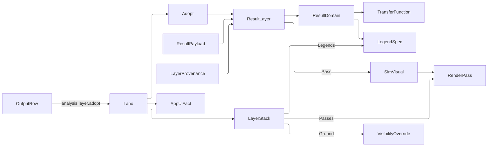

# [APPUI_ANALYSIS_LAYERS]

Result layers are the analysis plane's scene surface: a sealed study output mounts as one `ResultLayer` stacking unbounded over the model, every layer carries the study, the input digest, and the run history that produced it, every layer resolves its own colormap and legend from one `ResultDomain`, and every layer answers one probe coordinate. `LayerStack` is the ordered owner — per-layer visibility and opacity, one projection onto the render passes, one projection onto the visibility channel, one projection onto the scene legend set, and the ONE construction site the run queue's `analysis.layer.adopt` verb reaches. `ProbeChannel` broadcasts a single world point to every mounted layer and answers one reading per layer, pinnable as a labelled marker and exportable as a table. `BakeVerb` is the closed vocabulary of what a layer becomes when it leaves the scene — a viewpoint, a frame, a board tile, a report.

Layers carry settled study values and this plane computes no analysis of its own. `SimField`, `SimVisual`, `RenderPass`, `TransferFunction`, and `FieldSites` arrive settled from `Render/pipeline#SIM_VISUAL` and `#RENDER_GRAPH`; `Viewpoint`, `ViewCamera`, `SectionBox`, `VisibilityOverride`, `VisibilityAction`, and `HighlightChannel` from `Render/viewpoint#VIEWPOINT_CODEC`; `VisualArtifact` from `Render/capture#ENCODE_IDENTITY`; `Colormap`, `PaintRole`, and the ONE `Severity` ladder from `Theme/tokens#TOKEN_CATALOG`; `LegendSpec`, `LegendDomain`, `LegendDock`, and `LegendRender` from `Charts/grammar#LEGEND_VOCABULARY` with the render dispatch at `Charts/grammar#LEGEND_FOLD`; `ThresholdList` from `Charts/ink#THRESHOLD_FAMILY`; `VisualStroke`, `StrokeStyle`, `CustomVisual`, and `CustomVisualStyle` from `Charts/custom#SKIA_KINDS`; `DashboardTile` and `TileSource` from `Charts/tiles#TILE_SPINE`; `OutputRow`, `OutputState`, and `RunQueueSurface.AdoptIntent` from `Shell/queue#QUEUE_MODELS` and `#QUEUE_SURFACE`; `ScreenProgram`, `StateLens`, `SlotKey<T>`, and `ProductScreen` from `Shell/screens#SCREEN_CATALOG`; `AppUiPoint`, `AppUiFact`, and the instrument mechanism from `Diagnostics/evidence#EVIDENCE_UNION` and `#TELEMETRY_SPINE`; `FidelityTier` from `Analysis/context#BUDGET_METER`; `StudySubmission` from `Editing/forms#STUDY_FORM`; `ReportBlock` from `Document/export#FLOW_REPORT`; `MeasureRole` and `ResolvedLocale` from `Theme/locale#MEASUREMENT_FORMAT`. `AnalysisFault` carries each failure through a direct generated union case.

## [01]-[INDEX]

- [02]-[RESULT_LAYER]: The four sealed output kinds; the one payload; provenance and run history; the domain that elects colormap and legend together.
- [03]-[LAYER_STACK]: Unbounded stacking, per-layer toggles, the three viewport projections, the one landing site, and the plane's evidence fact.
- [04]-[PROBE_CHANNEL]: One coordinate broadcast to every layer; barycentric and nearest reads; pinned markers; the table export.
- [05]-[BAKE_VERBS]: The closed vocabulary of what a layer leaves behind, each row folding onto the plane's one seal.

## [02]-[RESULT_LAYER]

- Owner: `AnalysisFault` — the direct generated `[Union]` with one `[FaultCase]` leaf per analysis-layer failure; `ResultTrait` — the payload-demand vocabulary, each row carrying its own proof; `ResultKind` `[SmartEnum<string>]` — the four sealed study output classes, each carrying the demands it makes of a payload and its render fold; `ResultSample` — one located scalar the whole plane reads; `ResultPayload` — the ONE payload every kind carries and the gate its every column crosses; `ResultDomain` `[Union]` — the value axis electing colormap class and legend arm together; `AveragingPosture` `[SmartEnum<string>]` — the display smoothing fold; `LayerProvenance` — one run's own evidence row; `ResultLayer` — the mounted layer; `ResultVisuals` — the two render folds the kind rows bind.
- Cases: `ResultKind` = mesh-scalar · grid · section · dome; `ResultTrait` = topology | structured; `ResultDomain` = Continuous | Stepped | Coded; `AveragingPosture` = per-sample · per-face · smooth; `AnalysisFault` = PayloadRejected | KindMismatch | ProbeOutside | AdoptRejected | BakeRejected | DomainRejected | ProvenanceMissing | StackRejected.
- Entry: `public static Fin<ResultPayload> Of(Seq<ResultSample> samples, Seq<(int A, int B, int C)> faces, SimField field, (double Low, double High) extent)` on `ResultPayload` — the payload gate proving extent, sample finiteness, and face ordinals TOGETHER on one accumulating `Validation`; `internal static Fin<ResultLayer> Of(...)` on `ResultLayer` — the mint `AnalysisLayers.Adopt` is the one public door to; `public Fin<RenderPass> Pass(ResultRuntime runtime)` on `ResultLayer` — the executable render pass the stack collects; `public LegendSpec Legend(string key, Option<MeasureRole> measure, int segments)` on `ResultDomain` — the legend declaration; `public double Position(double value)` on `ResultDomain` — the unit interval a value samples the ramp at; `public string Unit(ResolvedLocale locale)` on `ResultLayer` — the elected unit abbreviation every chip, column header, and caption reads.
- Auto: the domain DERIVES the colormap class and the legend arm from one declaration, so a coded raster never ramps and a continuous field never renders as a swatch list; `TransferFunction.Of` composes the layer's own ramp with its extent and opacity, so the scene ramp and the legend ramp are one generation read twice; `AveragingPosture` folds the sample values a face draws with — per-face takes the face's own mean, smooth takes each vertex's incident-face mean, per-sample takes the vertex value untouched — so a sensor grid and a continuous daylight mesh differ by one row rather than by two draw paths; a coded domain orders and ranks its codes ONCE at construction, so the per-face ramp read is a lookup rather than a scan; provenance is a HISTORY seq newest-first and `AnalysisLayers.Land` is its producer — a second landing of one study key re-runs the mounted layer in place and appends, so the prior reading stays addressable.
- Packages: Thinktecture.Runtime.Extensions, LanguageExt.Core, NodaTime, UnitsNet, Rasm (project — `FaultBand`/`[FaultCase]`/`Fault`, `CapabilitySet`, `ContentHash`, `UnitInterval`, `EpsilonPolicy`), Rasm.Compute (project — the sealed field result), BCL inbox
- Growth: a new sealed output class is one `ResultKind` row naming the traits it demands and its render fold; a new payload demand is one `ResultTrait` row carrying its own proof, which every kind that needs it holds as one set member and `Admit` reads with no edit; a new value axis is one `ResultDomain` arm with its legend projection and its position fold, which the union's own total dispatch breaks every reader on until each states it; a new smoothing is one `AveragingPosture` row; a new fault case is one `[FaultCase]` leaf; zero new surface.
- Boundary:
  - A layer VALUE projects a sealed result and never performs an in-plane computation. This plane runs no solver, no re-sampling of physics, and no unit conversion of its own: `Rasm.Compute` owns the solve, `Rasm` owns the ephemeris, and `Theme/locale` owns the elected unit. The one arithmetic this page performs is the DISPLAY read the probe and the averaging posture need — a barycentric weight inside a face the payload already declares and a mean over faces the payload already connects — and both are reads of the sealed sample set rather than derivations that could disagree with it.
  - ONE payload carries every kind and ONE gate admits it, and the gate ACCUMULATES: a malformed payload names its bad extent, its non-finite sample, and its out-of-range ordinal together, which is what makes the completeness bar structural rather than asserted. Three readers index `Samples` by a face ordinal — the smooth posture, the barycentric probe, and the shaded stroke walk — so the ordinal bound is proved at the mint, ahead of every check this plane declares, and the adjacency fold that depends on it runs only behind that proof.
  - The admission columns are a DEMAND SET, not a bool pair: a kind states which `ResultTrait` rows its payload must satisfy and each row carries its own proof, so a fifth kind demanding both a triangle roster and a grid is one row and `Admit` never grows an arm. The three shaded kinds stay plural because their discriminant is the SEALED ARTIFACT'S OWN KIND KEY — `Shell/queue#QUEUE_MODELS` `OutputRow.Kind` is a wire vocabulary this plane resolves and does not choose, and `Charts/climate.md` reads `dome` as a distinct projection — so the identical display columns are a coincidence of measurement geometry rather than a missing discriminant.
  - `SimVisual` is the ONE field-visualization owner and this plane ENTERS its pass rather than seating a second one: `ResultVisuals.Shaded` supplies the `MeshQuality` row's `Shade` fold, `ResultVisuals.Volumetric` seats the `Volume` row over the ray-march arrow the render graph's own lease supplies, and both enter the owner's own pass with the layer's own field. The march arrow, the world-to-raster projection, and the resolved band width all ride `ResultRuntime`, because a projection authored here would be a second camera absent from the captured viewpoint, a march minted here would be a device call on a page holding no lease, and a width authored here would be a second metric authority the density flip never re-seeds.
  - `TransferFunction` is the one scene ramp and `LegendSpec` the one legend declaration, both derived from the layer's own `ResultDomain` — a layer-local stop table, a layer-local swatch list, and a scene ramp that disagrees with its key are three deleted forms the single derivation forecloses.
  - The extent a layer carries is the sealed payload's own measured range unless the domain PINS one: a pinned extent is what makes two layers of one study comparable, and re-deriving the extent per layer would make an option comparison read as a magnitude difference that is entirely a scaling artefact.
  - Provenance is required at mint, never optional: a layer with no study, no digest, and no correlation is a picture nobody can reproduce, so `ProvenanceMissing` refuses at construction rather than rendering an unattributable field.

```csharp
// --- [ERRORS] --------------------------------------------------------------------------

[Union(ConversionFromValue = ConversionOperatorsGeneration.None)]
public abstract partial record AnalysisFault : Fault {
    private static readonly FaultBand FamilyBand = FaultBand.Layer;
    private AnalysisFault(string detail) { Detail = detail; }

    public string Detail { get; }
    public override string Message => Detail;

    [FaultCase(0)]
    public sealed partial record PayloadRejected(string Detail)  : AnalysisFault(Detail);
    [FaultCase(1)]
    public sealed partial record KindMismatch(string Key, string Kind) : AnalysisFault($"{Key} names no output class: {Kind}");
    [FaultCase(2)]
    public sealed partial record ProbeOutside(string LayerKey, double Radius) : AnalysisFault($"{LayerKey} carries no sample within {Radius}");
    [FaultCase(3)]
    public sealed partial record AdoptRejected(string Detail) : AnalysisFault(Detail);
    [FaultCase(4)]
    public sealed partial record BakeRejected(string Detail) : AnalysisFault(Detail);
    [FaultCase(5)]
    public sealed partial record DomainRejected(string Detail) : AnalysisFault(Detail);
    [FaultCase(6)]
    public sealed partial record ProvenanceMissing(string LayerKey) : AnalysisFault($"{LayerKey} carries no sealed run");
    [FaultCase(7)]
    public sealed partial record StackRejected(string Detail) : AnalysisFault(Detail);
}
```

```csharp
// --- [TYPES] ---------------------------------------------------------------------------

[SmartEnum<string>]
[KeyMemberEqualityComparer<ComparerAccessors.StringOrdinal, string>]
public sealed partial class ResultTrait : ICapability<ResultTrait> {
    public static readonly ResultTrait Topology = new("topology", static (kind, payload) =>
        Col(!payload.Faces.IsEmpty, $"{kind.Key}: needs triangle topology"));

    public static readonly ResultTrait Structured = new("structured", static (kind, payload) =>
        Col(payload.Cells > 1L, $"{kind.Key}: needs a structured grid"));

    [UseDelegateFromConstructor]
    public partial Validation<Error, Unit> Proof(ResultKind kind, ResultPayload payload);

    static Validation<Error, Unit> Col(bool holds, string requirement) =>
        holds ? Validation<Error, Unit>.Success(unit) : Validation<Error, Unit>.Fail((Error)new AnalysisFault.PayloadRejected(requirement));
}

[SmartEnum<string>]
[KeyMemberEqualityComparer<ComparerAccessors.StringOrdinal, string>]
[KeyMemberComparer<ComparerAccessors.StringOrdinal, string>]
public sealed partial class ResultKind {
    public static readonly ResultKind MeshScalar = new(
        "mesh-scalar", CapabilitySet<ResultTrait>.Of(ResultTrait.Topology), ResultVisuals.Shaded);
    public static readonly ResultKind Grid = new(
        "grid", CapabilitySet<ResultTrait>.Of(ResultTrait.Structured), ResultVisuals.Volumetric);
    public static readonly ResultKind Section = new(
        "section", CapabilitySet<ResultTrait>.Of(ResultTrait.Topology), ResultVisuals.Shaded);
    public static readonly ResultKind Dome = new(
        "dome", CapabilitySet<ResultTrait>.Of(ResultTrait.Topology), ResultVisuals.Shaded);

    public CapabilitySet<ResultTrait> Demands { get; }

    [UseDelegateFromConstructor]
    public partial Fin<RenderPass> Pass(ResultLayer layer, ResultRuntime runtime);

    public static Option<ResultKind> Find(string key) =>
        TryGet(key, out ResultKind? row) ? Optional(row) : None;

    public Validation<Error, Unit> Admit(ResultPayload payload) =>
        (Col(!payload.Samples.IsEmpty, $"{Key}: no samples"),
         toSeq(ResultTrait.Items).Filter(Demands.Admits).Traverse(row => row.Proof(this, payload)).As())
        .Apply(static (_, _) => unit)
        .As();

    static Validation<Error, Unit> Col(bool holds, string requirement) =>
        holds ? Validation<Error, Unit>.Success(unit) : Validation<Error, Unit>.Fail((Error)new AnalysisFault.PayloadRejected(requirement));
}

[SmartEnum<string>]
[KeyMemberEqualityComparer<ComparerAccessors.StringOrdinal, string>]
[KeyMemberComparer<ComparerAccessors.StringOrdinal, string>]
public sealed partial class AveragingPosture {
    public static readonly AveragingPosture PerSample = new("per-sample",
        static (payload, face) => payload.Samples[face.A].Value);
    public static readonly AveragingPosture PerFace = new("per-face",
        static (payload, face) => payload.FaceMean(face));
    public static readonly AveragingPosture Smooth = new("smooth",
        static (payload, face) => (payload.Adjacent(face.A) + payload.Adjacent(face.B) + payload.Adjacent(face.C)) / 3d);

    [UseDelegateFromConstructor]
    public partial double Face(ResultPayload payload, (int A, int B, int C) face);
}
```

```csharp
// --- [MODELS] --------------------------------------------------------------------------

public readonly record struct ResultSample(Vector3 At, double Value, Option<int> Code);

public sealed record ResultPayload {
    private ResultPayload(
        Seq<ResultSample> samples,
        Seq<(int A, int B, int C)> faces,
        SimField field,
        (double Low, double High) extent) {
        (Samples, Faces, Field, Extent) = (samples, faces, field, extent);
        Neighbourhood = faces
            .Bind(face => Seq(
                (Vertex: face.A, Face: face), (Vertex: face.B, Face: face), (Vertex: face.C, Face: face)))
            .GroupBy(static row => row.Vertex)
            .ToFrozenDictionary(
                static group => group.Key,
                group => group.Average(row => Mean(samples, row.Face)));
    }

    public Seq<ResultSample> Samples { get; }

    public Seq<(int A, int B, int C)> Faces { get; }

    public SimField Field { get; }

    public (double Low, double High) Extent { get; }

    public FrozenDictionary<int, double> Neighbourhood { get; }

    public long Cells => (long)Field.DimX * Field.DimY * Field.DimZ;

    public static Fin<ResultPayload> Of(
        Seq<ResultSample> samples,
        Seq<(int A, int B, int C)> faces,
        SimField field,
        (double Low, double High) extent) =>
        (Col(double.IsFinite(extent.Low) && double.IsFinite(extent.High) && extent.High > extent.Low,
             $"extent {extent.Low}..{extent.High}"),
         Col(samples.ForAll(static sample => double.IsFinite(sample.Value)), "a sample value is non-finite"),
         Col(faces.ForAll(face => Inside(face.A, samples.Count) && Inside(face.B, samples.Count) && Inside(face.C, samples.Count)),
             $"a face names a vertex outside the {samples.Count} sealed samples"))
        .Apply((_, _, _) => new ResultPayload(samples, faces, field, extent))
        .ToFin();

    public double FaceMean((int A, int B, int C) face) => Mean(Samples, face);

    public double Adjacent(int vertex) =>
        Neighbourhood.TryGetValue(vertex, out double mean) ? mean : Samples[vertex].Value;

    static double Mean(Seq<ResultSample> samples, (int A, int B, int C) face) =>
        (samples[face.A].Value + samples[face.B].Value + samples[face.C].Value) / 3d;

    static bool Inside(int vertex, int count) => vertex >= 0 && vertex < count;

    static Validation<Error, Unit> Col(bool holds, string requirement) =>
        holds ? Validation<Error, Unit>.Success(unit) : Validation<Error, Unit>.Fail((Error)new AnalysisFault.PayloadRejected(requirement));
}

[Union(ConversionFromValue = ConversionOperatorsGeneration.None)]
public abstract partial record ResultDomain {
    private ResultDomain() { }

    public sealed record Continuous(double Low, double High) : ResultDomain;
    public sealed record Stepped(ThresholdList List, double Low, double High) : ResultDomain;

    public sealed record Coded : ResultDomain {
        public Coded(HashMap<int, string> dictionary) {
            Dictionary = dictionary;
            Codes = toSeq(dictionary.Keys).Order().Strict();
            Extent = Codes.IsEmpty ? (0d, 1d) : ((double)Codes[0], (double)Codes[Codes.Count - 1]);
            Positions = Codes
                .Map((code, rank) => (Code: code, At: Codes.Count <= 1 ? 0d : rank / (double)(Codes.Count - 1)))
                .ToFrozenDictionary(static row => row.Code, static row => row.At);
        }

        public HashMap<int, string> Dictionary { get; }
        public Seq<int> Codes { get; }
        public FrozenDictionary<int, double> Positions { get; }
        public (double Low, double High) Extent { get; }
    }

    public int Arm => Map(continuous: 0, stepped: 1, coded: 2);

    public Colormap Palette => Switch(
        continuous: static _ => Colormap.Viridis,
        stepped: static _ => Colormap.Viridis,
        coded: static _ => Colormap.Tableau);

    public LegendSpec Legend(string key, Option<MeasureRole> measure, int segments) => Switch(
        state: (Key: key, Measure: measure, Segments: segments),
        continuous: static (s, d) => new LegendSpec(
            s.Key, new LegendDomain.Continuous(d.Low, d.High), LegendDock.BottomRight,
            Seq<LegendColumn>(), s.Measure, Math.Max(s.Segments, 2), Some(s.Key), None),
        stepped: static (s, d) => new LegendSpec(
            s.Key, new LegendDomain.Stepped(d.List, d.Low, d.High), LegendDock.BottomRight,
            Seq<LegendColumn>(), s.Measure, d.List.Steps.Count + 1, Some(s.Key), None),
        coded: static (s, d) => new LegendSpec(
            s.Key, new LegendDomain.Ordinal(d.Dictionary), LegendDock.BottomRight,
            Seq<LegendColumn>(), s.Measure, d.Codes.Count, Some(s.Key), None));

    public double Position(double value) => Switch(
        state: value,
        continuous: static (v, d) => d.High - d.Low > EpsilonPolicy.ZeroTolerance
            ? Math.Clamp((v - d.Low) / (d.High - d.Low), 0d, 1d)
            : 0.5d,
        stepped: static (v, d) => d.List.At(v, d.Low, d.High).Rank / (double)Math.Max(Severity.Items.Count - 1, 1),
        coded: static (v, d) => d.Positions.TryGetValue((int)v, out double at) ? at : 0d);

    public (double Low, double High) Span => Switch(
        continuous: static d => (d.Low, d.High),
        stepped: static d => (d.Low, d.High),
        coded: static d => d.Extent);
}

public sealed record LayerProvenance(
    StudySubmission Submission,
    ContentHash Digest,
    FidelityTier Tier,
    long Samples,
    Instant SealedAt) {
    public CorrelationId Correlation => Submission.Correlation;

    public Seq<(string HeaderKey, string Value)> Columns(ResolvedLocale locale) => Seq(
        (LocaleStrings.Key(nameof(LayerProvenance), "study"), Submission.StudyKey),
        (LocaleStrings.Key(nameof(LayerProvenance), "revision"), EvidenceOps.Decimal(Submission.Revision)),
        (LocaleStrings.Key(nameof(LayerProvenance), "tier"), locale.Label(Tier.LabelKey)),
        (LocaleStrings.Key(nameof(LayerProvenance), "samples"), EvidenceOps.Decimal(Samples)),
        (LocaleStrings.Key(nameof(LayerProvenance), "digest"), Digest.ToString()),
        (LocaleStrings.Key(nameof(LayerProvenance), "sealed"), locale.Stamp(SealedAt)));
}

public sealed record ResultLayer(
    string Key,
    ResultKind Kind,
    ResultPayload Payload,
    ResultDomain Domain,
    Option<MeasureRole> Measure,
    Colormap Ramp,
    AveragingPosture Averaging,
    UnitInterval Opacity,
    bool Visible,
    Seq<LayerProvenance> History) {
    public const int LegendSegments = 8;

    public Fin<LayerProvenance> Provenance =>
        History.Head.ToFin(new AnalysisFault.ProvenanceMissing(Key));

    public LegendSpec Legend => Domain.Legend($"analysis.{Key}", Measure, LegendSegments);

    public string Unit(ResolvedLocale locale) =>
        Measure.Match(
            Some: role => locale.Measures.Abbreviation(role, locale.Formats),
            None: static () => string.Empty);

    internal static Fin<ResultLayer> Of(
        string key,
        ResultKind kind,
        ResultPayload payload,
        ResultDomain domain,
        Option<MeasureRole> measure,
        AveragingPosture averaging,
        LayerProvenance provenance) =>
        (Col(!string.IsNullOrWhiteSpace(key), "layer carries no key"),
         kind.Admit(payload),
         Spanned(key, domain))
        .Apply((_, _, _) => new ResultLayer(
            key, kind, payload, domain, measure, domain.Palette, averaging,
            UnitInterval.Create(1d), Visible: true, Seq(provenance)))
        .ToFin();

    internal Fin<ResultLayer> Rerun(ResultPayload payload, ResultDomain domain, LayerProvenance provenance) =>
        Kind.Admit(payload).ToFin().Map(_ =>
            this with { Payload = payload, Domain = domain, Ramp = domain.Palette, History = provenance.Cons(History) });

    public Fin<TransferFunction> Transfer() =>
        Domain.Span switch {
            var (low, high) => TransferFunction.Of(Ramp, low, high, OpacityGamma),
        };

    const double OpacityGamma = 2d;

    public Fin<RenderPass> Pass(ResultRuntime runtime) => Kind.Pass(this, runtime);

    static Validation<Error, Unit> Spanned(string key, ResultDomain domain) =>
        domain.Span switch {
            var (low, high) when high > low => Validation<Error, Unit>.Success(unit),
            var (low, high) => Validation<Error, Unit>.Fail((Error)new AnalysisFault.DomainRejected($"{key}: domain span {low}..{high}")),
        };

    static Validation<Error, Unit> Col(bool holds, string requirement) =>
        holds ? Validation<Error, Unit>.Success(unit) : Validation<Error, Unit>.Fail((Error)new AnalysisFault.PayloadRejected(requirement));
}
```

```csharp
// --- [SERVICES] ------------------------------------------------------------------------

public sealed record ResultRuntime(
    Func<Vector3, (float X, float Y)> Project,
    Func<RenderTarget, SimField, TransferFunction, Fin<int>> RayMarch,
    float Stroke);
```

```csharp
// --- [OPERATIONS] ----------------------------------------------------------------------

internal static class ResultVisuals {
    public static Fin<RenderPass> Shaded(ResultLayer layer, ResultRuntime runtime) =>
        new SimVisual.MeshQuality(
                Key: $"{AnalysisLayers.Plane}.{layer.Key}",
                Ramp: layer.Ramp,
                Width: runtime.Stroke,
                Shade: _ => Fin.Succ(Faces(layer, runtime)))
            .Pass(layer.Payload.Field);

    public static Fin<RenderPass> Volumetric(ResultLayer layer, ResultRuntime runtime) =>
        from transfer in layer.Transfer()
        from pass in new SimVisual.Volume(
                Key: $"{AnalysisLayers.Plane}.{layer.Key}",
                Transfer: transfer,
                RayMarch: runtime.RayMarch)
            .Pass(layer.Payload.Field)
        select pass;

    static Seq<VisualStroke> Faces(ResultLayer layer, ResultRuntime runtime) =>
        layer.Payload.Faces.Map(face => VisualStroke.Of(
            path => {
                (float ax, float ay) = runtime.Project(layer.Payload.Samples[face.A].At);
                (float bx, float by) = runtime.Project(layer.Payload.Samples[face.B].At);
                (float cx, float cy) = runtime.Project(layer.Payload.Samples[face.C].At);
                path.MoveTo(ax, ay);
                path.LineTo(bx, by);
                path.LineTo(cx, cy);
                path.Close();
            },
            StrokeStyle.Fill,
            layer.Domain.Position(layer.Averaging.Face(layer.Payload, face)),
            maximum: 1d)).Strict();
}
```

| [INDEX] | [KIND]      | [DEMANDS]  | [RENDER_FOLD] | [SEALED_OUTPUT_CLASS]                      |
| :-----: | :---------- | :--------- | :------------ | :----------------------------------------- |
|  [01]   | mesh-scalar | topology   | shaded        | per-vertex scalars over an analysis mesh   |
|  [02]   | grid        | structured | volumetric    | a structured sensor grid as a field result |
|  [03]   | section     | topology   | shaded        | a planar cut carrying its own sample mesh  |
|  [04]   | dome        | topology   | shaded        | a hemispherical patch field over the sky   |

## [03]-[LAYER_STACK]

- Owner: `LayerStack` — the ordered unbounded stack with its toggle, dim, reorder, and drop verbs and its three viewport projections; `AnalysisLayers` — the plane constants, the instrument rows, the adoption and landing folds, the seated stack screen, and the one observation.
- Entry: `public Fin<LayerStack> Mount(ResultLayer layer)` — the append; `public Fin<LayerStack> Reseat(ResultLayer layer)` — the in-place rewrite a re-run lands through; `public Fin<LayerStack> Toggle(string key)` / `Dim(string key, UnitInterval opacity)` / `Raise(string key, int by)` / `Drop(string key)` — the display verbs; `public (Seq<RenderPass> Drawn, Seq<Error> Refused) Passes(ResultRuntime runtime)` — the ordered render projection; `public Seq<LegendSpec> Legends` — the scene legend projection; `public Seq<VisibilityOverride> Ground(Seq<string> scene)` — the model-dimming projection; `public static Fin<ResultLayer> Adopt(OutputRow output, LayerProvenance provenance, Func<string, Fin<ResultPayload>> read, ResultDomain domain, Option<MeasureRole> measure, AveragingPosture averaging)` — the ONE construction site the `analysis.layer.adopt` verb reaches; `public static Fin<LayerStack> Land(..., HookSet<AppUiPoint, AppUiFact, TelemetrySource> hooks)` — adopt-or-re-run folded with the stack write and its settled fact firing; `public static ScreenProgram Program(ScreenComposition composition)` and `public static ControlIntent Body(LayerStack stack, ProbeReading reading, VirtualWindowSpec window)` — the seated screen and the surface it projects; `public static Fin<Unit> Observe(InstrumentSet set, LayerStack stack, Option<string> study, ProbeReading reading)` — the plane's one observation.
- Auto: order is DECLARATION order and the stack draws bottom-first, so a raise is an index move rather than a z-column every layer would carry and disagree about; a hidden layer contributes no visual and still answers the probe, because an operator who hid a layer to see the one beneath it still reads both in the probe table; the ground projection ghosts the model through `VisibilityAction.Xray` exactly once whenever any layer is visible, so two mounted layers do not double-dim the scene they sit over; `Passes` PARTITIONS rather than short-circuits, so one layer whose pass refused costs that layer and not the frame; the screen body reads the stack through the composition's own surface-scoped arrow, so the panel renders the live ordered stack rather than a copy it would then have to keep in step; `Land` discriminates on whether the output's key is already mounted, so adoption and re-run are one door and the history column has a producer.
- Packages: LanguageExt.Core, NodaTime, Thinktecture.Runtime.Extensions, Rasm (project — the fault floor, `CapabilitySet`), BCL inbox
- Growth: a new display verb is one member on `LayerStack` beside its intent const and its deck row; a new adoption source is one `OutputRow` kind the handler's own kind lookup admits; a new row column is one child in the row template; zero new surface.
- Boundary:
  - `Shell/queue#QUEUE_SURFACE` RAISES `RunQueueSurface.AdoptIntent` and this owner answers it: the queue names what was sealed and `Adopt` decides what it becomes, so a sealed study reaches the scene through exactly ONE construction site — `ResultLayer.Of` and `ResultLayer.Rerun` are INTERNAL, so the one-door law is a compile fact rather than a convention, and the queue's own `OutputState` union is re-read here by its total dispatch so an adoption path that skipped the queue has no unsealed corner to enter through.
  - The payload arrives through an INJECTED read arrow keyed by the output's artifact key, so this plane names no store, no blob lane, and no file: `Rasm.Persistence` serves the sealed artifact exactly as it serves every other content-keyed payload, and a layer that opened an artifact itself would be a second read path the evidence timeline could contradict.
  - A stack is UNBOUNDED by declaration and bounded by evidence: the mounted level is an instrument rather than a cap, because a daylight study comparing twelve orientations is a legitimate twelve-layer stack and a hard limit would refuse the exact use the plane exists for, while an unmeasured stack that grew to hundreds would read as a slow viewport with no cause.
  - The stack ORDERS and never composites: each layer's own pass is entered at `Render/pipeline#SIM_VISUAL` and seated in the render graph's own pass DAG exactly as the section manipulator's overlay rows are, so blending, depth, and resolve stay `Render/pipeline#RENDER_GRAPH`'s and an analysis-local compositor is the deleted form. `Passes`, `Ground`, and `Legends` are the THREE viewport projections and none has an in-page caller by design — the render composition reads all three off one stack value, so a panel that rebuilt any of them would be a second projection over the one ordered stack.
  - Ground dimming is published as a POSTURE on the one override channel, so the viewport folds a live hover over it through `HighlightChannel.Over` and a hovered element still reads at full opacity above a dimmed model — a layer plane that concatenated its own seq with the hover's would publish two rows per element and leave the renderer to pick by arrival order.
  - Every verb the row template raises is a key this owner DECLARES and the boot-frozen deck already holds — toggle, dim, raise, drop, expand, and the four bake rows — so a control resolving a verb it could never be invoked through is unspellable and an unrostered key is a dead SCREEN rather than a dead button. The opacity slider carries its value slot AND its verb, because a dim is both a number the operator drags and a stack rewrite this plane must fold.

```csharp
// --- [SERVICES] ------------------------------------------------------------------------

public sealed record LayerStack(Seq<ResultLayer> Layers) {
    public static readonly LayerStack Empty = new(Seq<ResultLayer>());

    public Seq<ResultLayer> Active => Layers.Filter(static layer => layer.Visible);

    public Option<ResultLayer> Find(string key) => Layers.Find(layer => layer.Key == key);

    public Fin<LayerStack> Mount(ResultLayer layer) =>
        Layers.Exists(held => held.Key == layer.Key)
            ? Fin.Fail<LayerStack>(new AnalysisFault.StackRejected($"{layer.Key} is already mounted"))
            : Fin.Succ(this with { Layers = Layers.Add(layer) });

    public Fin<LayerStack> Reseat(ResultLayer layer) => Rewrite(layer.Key, _ => layer);

    public Fin<LayerStack> Toggle(string key) =>
        Rewrite(key, static layer => layer with { Visible = !layer.Visible });

    public Fin<LayerStack> Dim(string key, UnitInterval opacity) =>
        Rewrite(key, layer => layer with { Opacity = opacity });

    public Fin<LayerStack> Raise(string key, int by) =>
        Layers.Map(static (layer, index) => (Index: index, Layer: layer)).Find(row => row.Layer.Key == key).Match(
            Some: row => Fin.Succ(this with {
                Layers = Reseated(
                    Layers.Filter(held => held.Key != key), row.Layer, Math.Clamp(row.Index + by, 0, Layers.Count - 1)),
            }),
            None: () => Fin.Fail<LayerStack>(new AnalysisFault.StackRejected($"{key} is not mounted")));

    static Seq<ResultLayer> Reseated(Seq<ResultLayer> rest, ResultLayer moved, int target) =>
        rest.Take(target) + Seq(moved) + rest.Skip(target);

    public Fin<LayerStack> Drop(string key) =>
        Find(key).Match(
            Some: layer => Fin.Succ(this with { Layers = Layers.Filter(held => held.Key != layer.Key) }),
            None: () => Fin.Fail<LayerStack>(new AnalysisFault.StackRejected($"{key} is not mounted")));

    public (Seq<RenderPass> Drawn, Seq<Error> Refused) Passes(ResultRuntime runtime) =>
        Active.Map(layer => layer.Pass(runtime)).Partition() switch {
            var (fails, succs) => (succs, fails),
        };

    public Seq<LegendSpec> Legends => Active.Map(static layer => layer.Legend);

    public Seq<VisibilityOverride> Ground(Seq<string> scene) =>
        (Active.IsEmpty ? VisibilityAction.Reset : VisibilityAction.Xray)
            .Fold(scene, LanguageExt.HashSet<string>.Empty);

    Fin<LayerStack> Rewrite(string key, Func<ResultLayer, ResultLayer> edit) =>
        Find(key).Match(
            Some: layer => Fin.Succ(this with { Layers = Layers.Map(held => held.Key == key ? edit(held) : held) }),
            None: () => Fin.Fail<LayerStack>(new AnalysisFault.StackRejected($"{key} is not mounted")));
}
```

```csharp
// --- [COMPOSITION] ---------------------------------------------------------------------

public static class AnalysisLayers {
    public const string Plane = "analysis";
    public const string StackKey = "analysis.layers";
    public const string RowsKey = "analysis.layers.rows";
    public const string ExpandIntent = "analysis.layer.expand";
    public const string ToggleIntent = "analysis.layer.toggle";
    public const string DimIntent = "analysis.layer.dim";
    public const string DropIntent = "analysis.layer.drop";
    public const string RaiseIntent = "analysis.layer.raise";
    public const string BakeIntent = "analysis.layer.bake";

    // --- [INSTRUMENTS]

    public static readonly InstrumentSpec Mounted = InstrumentSpec.Create(
        "rasm.appui.analysis.layers", InstrumentKind.Level, MeasureForm.Whole, "{layer}",
        "result layers mounted on the scene", Seq<string>(), None, None, None);

    public static readonly InstrumentSpec Adopted = InstrumentSpec.Create(
        "rasm.appui.analysis.adopted", InstrumentKind.Count, MeasureForm.Whole, "{layer}",
        "sealed study outputs adopted as layers", Seq(AppUiTelemetry.SourceSlot), None, None, None);

    public static readonly InstrumentSpec Probed = InstrumentSpec.Create(
        "rasm.appui.analysis.probed", InstrumentKind.Count, MeasureForm.Whole, "{reading}",
        "probe readings answered by layer", Seq(AppUiTelemetry.SourceSlot), None, None, None);

    public static readonly SlotKey<Set<string>> Expansion = new("analysis.layers.expansion");
    public static readonly SlotKey<Seq<string>> Selection = new("analysis.layers.selection");

    public static ScreenProgram Program(ScreenComposition composition) =>
        ScreenProgram.Of(StackKey, screen => Body(
                composition.Layers(screen.Surface),
                composition.Probe(screen.Surface),
                composition.Window))
            with {
                State = new StateLens(
                    static screen => screen.Blank() with {
                        Expansion = screen.Read(Expansion, Set<string>()),
                        Selection = screen.Read(Selection, Seq<string>()),
                    },
                    static (screen, merged) => {
                        ignore(screen.Write(Expansion, merged.Expansion));
                        return screen.Write(Selection, merged.Selection);
                    }),
                Alive = screen => key =>
                    screen.Composition.Layers(screen.Surface).Find(key).IsSome,
            };

    public static ControlIntent Body(LayerStack stack, ProbeReading reading, VirtualWindowSpec window) =>
        stack.Layers.IsEmpty
            ? new ControlIntent.EmptyState(StackKey, $"{StackKey}.empty.headline", $"{StackKey}.empty.body",
                Action: None, IntentBinding.Of(PaintRole.Surface))
            : new ControlIntent.Panel(
                StackKey,
                Seq<ControlIntent>(
                    Bakes(),
                    new ControlIntent.Tree(RowsKey, Row(), ExpandIntent, window, IntentBinding.Of(PaintRole.Panel)),
                    ProbeChannel.Table(reading, window)),
                ConstraintProgram: StackKey,
                IntentBinding.Of(PaintRole.Surface));

    static ControlIntent Bakes() =>
        new ControlIntent.Toolbar(
            $"{StackKey}.bakes",
            toSeq(BakeVerb.Items).Map(static verb => new ToolbarRow(
                new ControlIntent.Button($"{StackKey}.bake.{verb.Key}", $"{StackKey}.bake.{verb.Key}",
                    IntentBinding.Of(PaintRole.Accent, ControlEmphasis.Quiet) with { Command = Some(verb.Intent) }),
                OverflowMode.AsNeeded)),
            Orientation.Horizontal,
            IntentBinding.Of(PaintRole.Panel));

    static ControlIntent Row() =>
        new ControlIntent.Panel(
            $"{StackKey}.row",
            Seq<ControlIntent>(
                new ControlIntent.Toggle($"{StackKey}.row.visible", $"{StackKey}.row.visible",
                    IntentBinding.Of(PaintRole.Text) with {
                        Command = Some(ToggleIntent), ValueKey = Some($"{StackKey}.row.visible"),
                    }),
                new ControlIntent.Label($"{StackKey}.row.label", $"{StackKey}.row.label", TypographyRole.Body,
                    IntentBinding.Of(PaintRole.Text) with { ValueKey = Some($"{StackKey}.row.label") }),
                new ControlIntent.Chip($"{StackKey}.row.kind", $"{StackKey}.row.kind", ChipPosture.Static,
                    IntentBinding.Of(PaintRole.TextMuted) with { ValueKey = Some($"{StackKey}.row.kind") }),
                new ControlIntent.Chip($"{StackKey}.row.tier", $"{StackKey}.row.tier", ChipPosture.Static,
                    IntentBinding.Of(PaintRole.TextMuted) with { ValueKey = Some($"{StackKey}.row.tier") }),
                new ControlIntent.Chip($"{StackKey}.row.unit", $"{StackKey}.row.unit", ChipPosture.Static,
                    IntentBinding.Of(PaintRole.TextMuted) with { ValueKey = Some($"{StackKey}.row.unit") }),
                new ControlIntent.Slider($"{StackKey}.row.opacity", 0d, 1d, OpacityStep,
                    IntentBinding.Of(PaintRole.Accent) with {
                        Command = Some(DimIntent), ValueKey = Some($"{StackKey}.row.opacity"),
                    }),
                new ControlIntent.Button($"{StackKey}.row.raise", $"{StackKey}.row.raise",
                    IntentBinding.Of(PaintRole.Text, ControlEmphasis.Quiet) with { Command = Some(RaiseIntent) }),
                new ControlIntent.Button($"{StackKey}.row.drop", $"{StackKey}.row.drop",
                    IntentBinding.Of(PaintRole.Error, ControlEmphasis.Danger) with { Command = Some(DropIntent) })),
            ConstraintProgram: $"{StackKey}.row",
            IntentBinding.Of(PaintRole.Raised));

    const double OpacityStep = 0.01d;

    public static TelemetryContributorPort TelemetryRow(string version) =>
        AppUiTelemetry.Contribute(version, Mounted, Adopted, Probed);

    public static Fin<ResultLayer> Adopt(
        OutputRow output,
        LayerProvenance provenance,
        Func<string, Fin<ResultPayload>> read,
        ResultDomain domain,
        Option<MeasureRole> measure,
        AveragingPosture averaging) =>
        output.State.Switch(
            draftCase: _ => Fin.Fail<ResultLayer>(new AnalysisFault.AdoptRejected($"{output.Key}: unsealed")),
            sealedCase: _ =>
                from kind in ResultKind.Find(output.Kind).ToFin(new AnalysisFault.KindMismatch(output.Key, output.Kind))
                from payload in read(output.Key)
                from layer in ResultLayer.Of(output.Key, kind, payload, domain, measure, averaging, provenance)
                select layer);

    public static Fin<LayerStack> Land(
        LayerStack stack,
        OutputRow output,
        LayerProvenance provenance,
        Func<string, Fin<ResultPayload>> read,
        ResultDomain domain,
        Option<MeasureRole> measure,
        AveragingPosture averaging,
        HookSet<AppUiPoint, AppUiFact, TelemetrySource> hooks) =>
        from fresh in Adopt(output, provenance, read, domain, measure, averaging)
        from seated in stack.Find(fresh.Key).Match(
            Some: held =>
                from rerun in held.Rerun(fresh.Payload, fresh.Domain, provenance)
                from stacked in stack.Reseat(rerun)
                select (Stack: stacked, Layer: rerun),
            None: () => stack.Mount(fresh).Map(stacked => (Stack: stacked, Layer: fresh)))
        from landed in hooks.Fire(
            at: AppUiPoint.Effect,
            fact: new AppUiFact.Effect(
                Plane,
                seated.Layer.Key,
                $"{seated.Layer.Kind.Key}/{provenance.Tier.Key}",
                seated.Layer.Visible,
                checked((uint)seated.Layer.Payload.Samples.Count),
                new EffectMeasure.Digest(provenance.Digest)),
            key: Op.Of(name: RunQueueSurface.AdoptIntent),
            body: _ => Fin.Succ(seated.Stack))
        select landed;

    public static Fin<Unit> Observe(InstrumentSet set, LayerStack stack, Option<string> study, ProbeReading reading) =>
        from _ in set.Level(Mounted, stack.Layers.Count)
        from adopted in study.Match(
            Some: key => set.Write(Adopted, 1L, InstrumentSet.Tags((AppUiTelemetry.SourceSlot, key))),
            None: static () => Fin.Succ(unit))
        from probed in set.Enabled(Seq(Probed))
            ? reading.Hits.TraverseM(hit => set.Write(Probed, 1L,
                InstrumentSet.Tags((AppUiTelemetry.SourceSlot, hit.LayerKey)))).As().Map(static _ => unit)
            : Fin.Succ(unit)
        select unit;
}
```



## [04]-[PROBE_CHANNEL]

- Owner: `ProbeHit` — one layer's answer at one coordinate; `ProbeReading` — the broadcast product with its refusal ledger; `ProbeMarker` — a pinned labelled reading; `ProbeChannel` — the broadcast, the pin cell and its three verbs, the live table, and the export projection.
- Entry: `public static ProbeReading Read(LayerStack stack, Vector3 at, double radius, ResolvedLocale locale, IClock clock)` — the one broadcast; `public static Fin<ProbeHit> Sample(ResultLayer layer, Vector3 at, double radius, ResolvedLocale locale)` — the per-layer read, which spells its own value once; `public static ControlIntent Table(ProbeReading reading, VirtualWindowSpec window)` — the live table; `public static Unit Pin(ProductScreen screen, ProbeMarker marker)` / `Clear(ProductScreen screen)` / `Export(ProductScreen screen, ResolvedLocale locale)` — the three verbs the deck's `analysis.probe.*` rows bind, each a rewrite of the ONE pin cell; `public static Seq<ReportBlock> Blocks(Seq<ProbeMarker> pins, ResolvedLocale locale)` — the export projection.
- Auto: a probe reads EVERY mounted layer including the hidden ones, so an operator who hid a layer to see the one beneath it still reads both values at one point; a layer carrying triangle topology answers the barycentric interpolation inside the containing face and a layer without it answers its nearest sample, so a sensor grid and a continuous mesh give the reading each honestly supports; a coordinate outside every face and beyond the admitted radius answers ABSENT rather than the nearest far sample, and the absence is EVIDENCE — the refusals ride the reading's own `Silent` column so a table can distinguish "no coverage here" from "no layers mounted"; the nearest read is the kernel bounded selection rather than a hand accumulator, so no candidate is re-probed against the incumbent.
- Packages: LanguageExt.Core, NodaTime, UnitsNet, Rasm (project — `Ranked`, `EpsilonPolicy`), BCL inbox
- Growth: a new pinned column is one `ProbeMarker` field; a new export shape is one `ReportBlock` row the projection emits; a new pin verb is one member beside its intent const and its deck row; zero new surface.
- Boundary:
  - ONE coordinate reaches every layer, so a per-layer probe tool is unspellable: the reading a table prints, the reading a marker pins, and the reading a report block carries are one value read three times, and three probe owners would let a table and a marker disagree about what was measured at one point.
  - The admitted RADIUS is what makes absence honest. A nearest-sample read with no bound answers something at every coordinate in the universe, so a probe dropped on an unanalysed façade would print the value of a sensor on the roof; the radius is the layer's own sampling pitch handed down by the caller, so a coarse grid admits a wider read than a dense mesh and neither invents a value.
  - A pinned marker is SURFACE state and not scene geometry: the roster lives in the screen's own `Pins` cell, so it survives a dock move, a re-materialize, and a re-run, and it renders through the overlay pass rather than as elements the model would carry into an export nobody asked for. It does NOT survive a session checkpoint — `Shell/screens#SCREEN_STATE` `ScreenState` carries selection, expansion, scroll, filter, and canvas and no marker column — so a durable pin is a `ScreenState` field its owner has to seat, not a claim this page can make.
  - Every printed value crosses the resolved locale under the layer's own `MeasureRole`, so a probe reading, its legend bound, and the axis tick on a chart of the same field print one elected unit and one decimal separator — a probe-local formatter is the deleted form. A unit the role cannot build a quantity in DEGRADES to the numeric axis format rather than swallowing the refusal silently, and the degradation is the same one arm a role-less layer takes.
  - The barycentric weight is the one arithmetic this plane performs, and it is a READ: the weights sum to one over three sealed sample values, so the interpolated reading lies inside the sealed payload's range and can never be a value the study did not produce.

```csharp
// --- [MODELS] --------------------------------------------------------------------------

public readonly record struct ProbeHit(
    string LayerKey,
    double Value,
    Option<int> Code,
    double Distance,
    string Spelled);

public sealed record ProbeReading(Vector3 At, Seq<ProbeHit> Hits, Seq<Error> Silent, Option<Instant> Taken) {
    public static readonly ProbeReading Empty =
        new(Vector3.Zero, Seq<ProbeHit>(), Seq<Error>(), None);
}

public sealed record ProbeMarker(string Key, string LabelKey, ProbeReading Reading);
```

```csharp
// --- [OPERATIONS] ----------------------------------------------------------------------

public static class ProbeChannel {
    public const string TableKey = "analysis.probe.rows";
    public const string PinIntent = "analysis.probe.pin";
    public const string ClearIntent = "analysis.probe.clear";
    public const string ExportIntent = "analysis.probe.export";

    public static readonly SlotKey<Seq<ProbeMarker>> Pins = new("analysis.probe.pins");

    public static ProbeReading Read(LayerStack stack, Vector3 at, double radius, ResolvedLocale locale, IClock clock) =>
        stack.Layers.Map(layer => Sample(layer, at, radius, locale)).Partition() switch {
            var (silent, hits) => new ProbeReading(at, hits, silent, Some(clock.GetCurrentInstant())),
        };

    public static Fin<ProbeHit> Sample(ResultLayer layer, Vector3 at, double radius, ResolvedLocale locale) =>
        Contained(layer.Payload, at).Match(
            Some: hit => Fin.Succ(new ProbeHit(layer.Key, hit.Value, hit.Code, 0d, Spelled(layer, hit.Value, locale))),
            None: () => Nearest(layer.Payload, at) switch {
                { IsSome: true, Case: (ResultSample sample, double distance) } when distance <= radius =>
                    Fin.Succ(new ProbeHit(layer.Key, sample.Value, sample.Code, distance, Spelled(layer, sample.Value, locale))),
                _ => Fin.Fail<ProbeHit>(new AnalysisFault.ProbeOutside(layer.Key, radius)),
            });

    static Option<(double Value, Option<int> Code)> Contained(ResultPayload payload, Vector3 at) =>
        payload.Faces.FoldWhile(
            Option<(double, Option<int>)>.None,
            (found, face) => Weights(
                payload.Samples[face.A].At, payload.Samples[face.B].At, payload.Samples[face.C].At, at) switch {
                { IsSome: true, Case: (double wa, double wb, double wc) } => Some((
                    (wa * payload.Samples[face.A].Value) + (wb * payload.Samples[face.B].Value) + (wc * payload.Samples[face.C].Value),
                    (wa >= wb && wa >= wc ? payload.Samples[face.A]
                        : wb >= wc ? payload.Samples[face.B]
                        : payload.Samples[face.C]).Code)),
                _ => found,
            },
            static state => state.State.IsNone);

    static Option<(double A, double B, double C)> Weights(Vector3 a, Vector3 b, Vector3 c, Vector3 at) {
        Vector3 ab = b - a, ac = c - a, ap = at - a;
        float d00 = Vector3.Dot(ab, ab), d01 = Vector3.Dot(ab, ac), d11 = Vector3.Dot(ac, ac);
        float d20 = Vector3.Dot(ap, ab), d21 = Vector3.Dot(ap, ac);
        double denominator = ((double)d00 * d11) - ((double)d01 * d01);
        if (Math.Abs(denominator) <= EpsilonPolicy.ZeroTolerance) { return None; }
        double v = (((double)d11 * d20) - ((double)d01 * d21)) / denominator;
        double w = (((double)d00 * d21) - ((double)d01 * d20)) / denominator;
        double u = 1d - v - w;
        return u >= 0d && v >= 0d && w >= 0d ? Some((u, v, w)) : None;
    }

    static Option<(ResultSample Sample, double Distance)> Nearest(ResultPayload payload, Vector3 at) =>
        Ranked.Top(payload.Samples, keep: 1, static (ResultSample sample) => (double)Vector3.Distance(sample.At, at),
                ExtremumDirection.Minimum)
            .Head
            .Map(sample => (sample, (double)Vector3.Distance(sample.At, at)));

    static string Spelled(ResultLayer layer, double value, ResolvedLocale locale) =>
        layer.Measure
            .Bind(role => Quantity.TryFrom(value, role.MetricUnit, out IQuantity? quantity)
                ? Optional(quantity).Bind(held => locale.Quantity(held, role).ToOption())
                : None)
            .IfNone(() => locale.Text(ChartAxisKind.Numeric.Format, value));

    public static ControlIntent Table(ProbeReading reading, VirtualWindowSpec window) =>
        reading.Hits.IsEmpty
            ? new ControlIntent.EmptyState(TableKey, $"{TableKey}.empty.headline", $"{TableKey}.empty.body",
                Action: None, IntentBinding.Of(PaintRole.Surface))
            : new ControlIntent.Grid(
                TableKey,
                Seq(
                    new ColumnRow($"{TableKey}.layer", new ControlIntent.Label($"{TableKey}.layer", $"{TableKey}.layer",
                        TypographyRole.Body, IntentBinding.Of(PaintRole.Text)), None,
                        new DataGridLength(2d, DataGridLengthUnitType.Star), Some("LayerKey"), HorizontalAlignment.Left),
                    new ColumnRow($"{TableKey}.value", new ControlIntent.Label($"{TableKey}.value", $"{TableKey}.value",
                        TypographyRole.Numeric, IntentBinding.Of(PaintRole.Text)), None,
                        new DataGridLength(1d, DataGridLengthUnitType.Star), Some("Value"), HorizontalAlignment.Right),
                    new ColumnRow($"{TableKey}.distance", new ControlIntent.Label($"{TableKey}.distance", $"{TableKey}.distance",
                        TypographyRole.Numeric, IntentBinding.Of(PaintRole.TextMuted)), None,
                        new DataGridLength(1d, DataGridLengthUnitType.Star), Some("Distance"), HorizontalAlignment.Right)),
                window,
                IntentBinding.Of(PaintRole.Surface));

    public static Unit Pin(ProductScreen screen, ProbeMarker marker) =>
        Rewrite(screen, held => held.Filter(row => row.Key != marker.Key).Add(marker));

    public static Unit Clear(ProductScreen screen) => Rewrite(screen, static _ => Seq<ProbeMarker>());

    public static Seq<ReportBlock> Export(ProductScreen screen, ResolvedLocale locale) =>
        Blocks(screen.Read(Pins, Seq<ProbeMarker>()), locale);

    public static Seq<ReportBlock> Blocks(Seq<ProbeMarker> pins, ResolvedLocale locale) =>
        pins.IsEmpty
            ? Seq<ReportBlock>()
            : Seq<ReportBlock>(
                new ReportBlock.Heading(2, locale.Label(LocaleStrings.Key(nameof(ProbeChannel), "pins"))),
                new ReportBlock.Table(
                    Seq(Seq(
                            locale.Label($"{TableKey}.marker"),
                            locale.Label($"{TableKey}.layer"),
                            locale.Label($"{TableKey}.value"),
                            locale.Label($"{TableKey}.distance"),
                            locale.Label($"{TableKey}.taken")))
                        + pins.Bind(pin => pin.Reading.Hits.Map(hit => Seq(
                            locale.Label(pin.LabelKey), hit.LayerKey, hit.Spelled,
                            locale.Text(ChartAxisKind.Numeric.Format, hit.Distance),
                            pin.Reading.Taken.Match(Some: locale.Stamp, None: static () => string.Empty)))),
                    Header: true));

    static Unit Rewrite(ProductScreen screen, Func<Seq<ProbeMarker>, Seq<ProbeMarker>> edit) =>
        screen.Write(Pins, edit(screen.Read(Pins, Seq<ProbeMarker>())));
}
```

## [05]-[BAKE_VERBS]

- Owner: `BakeProduct` `[Union]` — the four sealed artifacts and the one key every reader names them by; `BakeContext` — the bound arrows one bake reads; `BakeVerb` `[SmartEnum<string>]` — the closed vocabulary of what a layer leaves behind, each row carrying its own fold behind ONE sealing door; `BakeFolds` — the four folds.
- Cases: `BakeVerb` = view · frame · tile · report; `BakeProduct` = View | Capture | Tile | Blocks.
- Entry: `public IO<Fin<BakeProduct>> Bake(ResultLayer layer, LayerStack stack, BakeContext context, HookSet<AppUiPoint, AppUiFact, TelemetrySource> hooks)` on `BakeVerb` — the ONE door, returning the deliverable and firing its settled fact; `public IO<Fin<BakeProduct>> Fold(ResultLayer layer, LayerStack stack, BakeContext context)` — the row's own arm, which the door composes.
- Auto: every bake composes a settled owner and mints nothing — the view row folds through `Viewpoint.Capture` so a baked view is the same value a shared BCF link carries, the frame row defers to the capture plane's own colour-managed encode, the tile row seats a `DashboardTile.Custom` over the legend the layer already declares so a baked tile is a board tile rather than a picture of one, and the report row emits `ReportBlock` rows the export plane paginates. `IO` belongs on the door because capture alone is effectful; the three pure folds lift into that one honest signature.
- Packages: LanguageExt.Core, NodaTime, SkiaSharp, Thinktecture.Runtime.Extensions
- Growth: a new deliverable is one `BakeVerb` row carrying its fold and one `BakeProduct` arm naming what it carries; zero new surface.
- Boundary: bake READS the layer and never edits it — nothing here writes the scene, mutates the stack, or re-runs a study, so its artifact cannot diverge from its layer. `Shell/commands#INTENT_TABLE` raises each verb by key under `AnalysisLayers.BakeIntent`, making the panel, palette, and remote call one surface. Missing provenance refuses at the door because an unattributable export survives beyond the process. `BakeContext.Grab` TRANSFERS image custody to the caller: frame releases the tile after retaining the encoded artifact, while compare retains the tile it places; dropping the handle leaks it.

```csharp
// --- [TYPES] ---------------------------------------------------------------------------

[Union(ConversionFromValue = ConversionOperatorsGeneration.None)]
public abstract partial record BakeProduct {
    private BakeProduct() { }
    public sealed record View(Viewpoint State) : BakeProduct;
    public sealed record Capture(VisualArtifact Artifact) : BakeProduct;
    public sealed record Tile(DashboardTile Placed) : BakeProduct;
    public sealed record Blocks(Seq<ReportBlock> Rows) : BakeProduct;

    public string Carries => Switch(
        view: static _ => "view",
        capture: static _ => "capture",
        tile: static _ => "tile",
        blocks: static _ => "blocks");
}

public sealed record BakeContext(
    ViewCamera Camera,
    Option<SectionBox> Section,
    Seq<string> Scene,
    Func<LayerStack, IO<Fin<(VisualArtifact Artifact, SKImage Tile)>>> Grab,
    ChartInk Ink,
    CustomVisualStyle Style,
    ResolvedLocale Locale,
    Func<string, int> Revision,
    IClock Clock);

[SmartEnum<string>]
[KeyMemberEqualityComparer<ComparerAccessors.StringOrdinal, string>]
[KeyMemberComparer<ComparerAccessors.StringOrdinal, string>]
public sealed partial class BakeVerb {
    public static readonly BakeVerb View = new("view", BakeFolds.View);
    public static readonly BakeVerb Frame = new("frame", BakeFolds.Frame);
    public static readonly BakeVerb Tile = new("tile", BakeFolds.Tile);
    public static readonly BakeVerb Report = new("report", BakeFolds.Report);

    [UseDelegateFromConstructor]
    public partial IO<Fin<BakeProduct>> Fold(ResultLayer layer, LayerStack stack, BakeContext context);

    public IO<Fin<BakeProduct>> Bake(
        ResultLayer layer,
        LayerStack stack,
        BakeContext context,
        HookSet<AppUiPoint, AppUiFact, TelemetrySource> hooks) =>
        (from provenance in FinT.lift<IO, LayerProvenance>(layer.Provenance)
         from product in FinT.liftIO(Fold(layer, stack, context))
         from settled in FinT.lift<IO, BakeProduct>(hooks.Fire(
             at: AppUiPoint.Effect,
             fact: new AppUiFact.Effect(
                 AnalysisLayers.Plane,
                 $"{layer.Key}/{Key}",
                 $"{Key}/{product.Carries}",
                 layer.Visible,
                 checked((uint)layer.Payload.Samples.Count),
                 new EffectMeasure.Digest(provenance.Digest)),
             key: Op.Of(name: Intent),
             body: _ => Fin.Succ(product)))
         select settled)
        .runFin.As();

    public string Intent => $"{AnalysisLayers.BakeIntent}.{Key}";
}
```

```csharp
// --- [OPERATIONS] ----------------------------------------------------------------------

public static class BakeFolds {
    public static IO<Fin<BakeProduct>> View(ResultLayer layer, LayerStack stack, BakeContext context) =>
        IO.pure(
            from provenance in layer.Provenance
            let key = $"{AnalysisLayers.Plane}.{layer.Key}@{provenance.Correlation}"
            from view in Viewpoint.Capture(
                key, context.Revision(key),
                context.Camera, context.Section, stack.Ground(context.Scene),
                Seq<string>(), Seq<ViewMeasurement>(), context.Clock.GetCurrentInstant())
            select (BakeProduct)new BakeProduct.View(view));

    public static IO<Fin<BakeProduct>> Frame(ResultLayer layer, LayerStack stack, BakeContext context) =>
        context.Grab(stack).Bracket(
            static read => IO.pure(read.Map(static shot => (BakeProduct)new BakeProduct.Capture(shot.Artifact))),
            static read => IO.lift(() => ignore(read.Map(static shot => { shot.Tile.Dispose(); return unit; }))));

    public static IO<Fin<BakeProduct>> Tile(ResultLayer layer, LayerStack stack, BakeContext context) =>
        IO.pure(
            from entries in LegendFold.Entries(
                layer.Legend, ChartSpec.Of($"{AnalysisLayers.Plane}.{layer.Key}", ChartPolicy.Dashboard),
                context.Ink, Seq<ChartDatum>(), context.Locale)
            from render in LegendFold.Render(layer.Legend, entries, context.Style, context.Ink, context.Locale)
            from placed in render.Switch(
                state: layer,
                package: static (held, _) => Fin.Fail<DashboardTile>(
                    new AnalysisFault.BakeRejected($"{held.Key}: legend renders on the package arm")),
                drawn: static (held, drawn) => Fin.Succ<DashboardTile>(new DashboardTile.Custom(
                    $"{AnalysisLayers.Plane}.{held.Key}", CustomVisual.Legend, new TileSource.Rows(drawn.Data.Key))))
            select (BakeProduct)new BakeProduct.Tile(placed));

    public static IO<Fin<BakeProduct>> Report(ResultLayer layer, LayerStack stack, BakeContext context) =>
        IO.pure(
            from provenance in layer.Provenance
            select (BakeProduct)new BakeProduct.Blocks(Seq<ReportBlock>(
                new ReportBlock.Heading(2, layer.Key),
                new ReportBlock.Table(
                    Seq(Seq(
                            context.Locale.Label(LocaleStrings.Key(nameof(BakeFolds), "field")),
                            context.Locale.Label(LocaleStrings.Key(nameof(BakeFolds), "value"))))
                        + provenance.Columns(context.Locale).Map(row => Seq(context.Locale.Label(row.HeaderKey), row.Value))
                        + Seq(Seq(
                            context.Locale.Label(LocaleStrings.Key(nameof(BakeFolds), "extent")),
                            Extent(layer, context.Locale))),
                    Header: true))));

    static string Extent(ResultLayer layer, ResolvedLocale locale) =>
        layer.Domain.Span switch {
            var (low, high) => $"{locale.Text(ChartAxisKind.Numeric.Format, low)}..{locale.Text(ChartAxisKind.Numeric.Format, high)}",
        };
}
```

| [INDEX] | [VERB] | [PRODUCT] | [COMPOSED_OWNER]                   | [WHAT_IT_CARRIES]                                   |
| :-----: | :----- | :-------- | :--------------------------------- | :-------------------------------------------------- |
|  [01]   | view   | View      | `Render/viewpoint#VIEWPOINT_CODEC` | camera, section, and the stack's ground recession   |
|  [02]   | frame  | Capture   | `Render/capture#DRAW_CAPSULE`      | one colour-managed encode of the mounted stack      |
|  [03]   | tile   | Tile      | `Charts/grammar#LEGEND_FOLD`       | the layer's legend as a board tile, not its field   |
|  [04]   | report | Blocks    | `Document/export#FLOW_REPORT`      | provenance columns and the domain bounds as a table |

## [06]-[RESEARCH]

(none)
