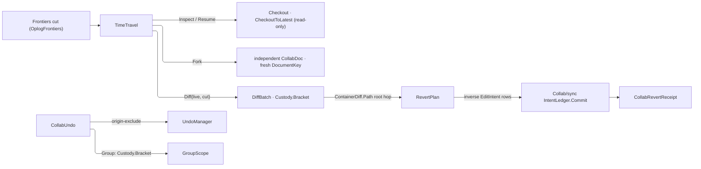
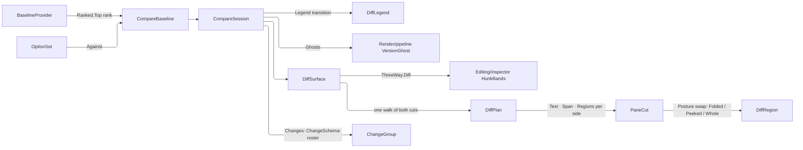

# [APPUI_COLLAB_COMPARE]

Two READ-ONLY rails over historical cuts of one collaborative document, sharing one lifetime and one refusal family. `TimeTravel` checks out, forks, and previews a cut, and commits a revert as INVERSE INTENTS through the one `Collab/sync#DURABLE_INTENT` ledger rail, so cold-load reproduces the reverted state from the ledger alone; `CollabUndo` wraps the engine `UndoManager` with origin exclusion so a user's Ctrl-Z never reverts a peer's concurrent edit. `CompareSession` pairs two named cuts into one legend-filtered ghost, one grouped change list, and one structured diff whose panes are three columns of a single walk. Nothing here commits to a cut it reads — a compare that committed would be a revert, which is the rail beside it. The merge authority, the addressing vocabulary, and the `CollabFault` family are `Collab/sync.md`; the live transport and presence chrome are `Collab/presence.md`.

## [01]-[INDEX]

- [02]-[TIME_TRAVEL]: Undo respecting remote ops; checkout, fork, diff preview; the root-keyed inverse decode and the revert through the one commit rail.
- [03]-[COMPARE_SESSION]: The ranked baseline axis; the legend-filtered ghost projection; the grouped change list over its own roster; the structured diff contract and its pane-addressed cut algebra.

## [02]-[TIME_TRAVEL]

- Owner: `TimeTravel` the checkout-fork-preview-revert owner; `RevertPlan` the root-keyed inverse-decode table; `CollabUndo` the local-only undo respecting remote ops; `CollabRevertReceipt` the committed-revert receipt.
- Entry: `public IO<Fin<CollabRevertReceipt>> Revert(IntentLedger ledger, Frontiers cut)` — the COMMITTED revert: diffs the live cut against the target, inverts each container change through the root-keyed plan, folds each inverse row through the ONE `IntentLedger.Commit` rail (durable-first, live apply through the same `IntentApply` dispatch replay uses), and seals a `CollabRevertReceipt`; `public Fin<DiffBatch> Changes(Frontiers from, Frontiers to)` — the typed change-set between two cuts, the revert-preview and audit-inspection read; `public Fin<CollabDoc> Fork(Frontiers cut)` — branches a new independent document from a historical cut; `public Fin<Unit> Undo()` / `Redo()` — drives the local-only `UndoManager` that skips remote ops; `public Fin<Unit> Group(Func<Fin<Unit>> edits)` — brackets a multi-edit transaction so it undoes as one unit.
- Auto: `UndoManager(doc)` is the local-only undo — `AddExcludeOriginPrefix` excludes the programmatic origins (set via `CommitWith(CommitOptions)`) so a user's Ctrl-Z never reverts a peer's concurrent edit, `SetMaxUndoSteps` bounds the window as a policy value, and the group scope coalesces a multi-edit transaction into one undo unit; the committed revert is INVERSE INTENTS through the one commit rail — `Diff(live, cut)` names exactly what inverts, the root-keyed plan projects those container diffs onto typed `EditIntent` rows (the same closed family every edit rides, aligned with `Editing/history#REVERT_ALGEBRA`'s inverse algebra), and the fold commits each row durable-first so cold-load replay reproduces the reverted state from the ledger alone; `Checkout(Frontiers)` time-travels the read state to a historical cut for inspection and `CheckoutToLatest` returns, while an edit during checkout faults `EditWhenDetached` so a detached edit is structurally rejected; `ForkAt(Frontiers)` branches an independent document so a what-if exploration never touches the shared timeline; the cut is a `Frontiers` DAG cut (a set of op-ids) read from `OplogFrontiers`, so time-travel keys on the op-log identity the live wire already broadcasts.
- Receipt: the `CollabRevertReceipt` carries the target frontier digest and the committed inverse-intent count and projects through the `Diagnostics/evidence#RECEIPT_UNION` `EvidenceMap.ToEvidence(receipt)` seam onto the `EvidenceReceipt.CollabRevert` case; the undo/redo verbs surface as `CommandRow` table rows whose availability gates on `UndoManager.CanUndo`/`CanRedo`.
- Packages: LoroCs, Rasm (project — `Custody`, `Cell`/`Transition`), Rasm.Persistence (project), Thinktecture.Runtime.Extensions, LanguageExt.Core, NodaTime
- Growth: a new time-travel verb is one operation on this owner; one undo verb is one `CommandRow` row; a new invertible root is one `RevertPlan` leg keyed by its `CollabRoot` row; zero new surface.
- Boundary:
  - The local undo is `UndoManager` respecting remote-op origins — a hand-rolled undo stack that ignores remote ops is the deleted form, so `AddExcludeOriginPrefix` excludes programmatic origins and a user's Ctrl-Z reverts only the user's own edits.
  - Raw `RevertTo(Frontiers)` on a shared document is rejected because Loro-only inverse bytes leave durable truth unable to reproduce the reverted state; `Checkout` is read-only, `Fork` creates an independent document, and committed reverts traverse inverse `EditIntent` rows through `IntentLedger.Commit`.
  - The inverse decode is a ROOT-KEYED TABLE, never one opaque delegate over the whole batch: every `ContainerDiff` carries its own `Path`, whose first hop names the `CollabRoot` its level sits under, so the dispatch is DECLARED here and only the per-root inversion — which is each domain plane's own knowledge of what its columns mean — arrives from composition. An unrostered root REFUSES by name; the whole-batch delegate it replaces could answer an empty sequence, and a revert that reverted nothing read as a successful revert. The batch-to-changes projection stays the one composition-bound column on this owner because the engine's own enumeration member is a binding detail this page does not re-spell.
  - Both directions of the undo drive are ONE gated step: the availability probe and the drive differ only in which foreign member each names, so the direction rides two arguments rather than two bodies, and the availability gate composes on the rail through `guard` instead of a conditional expression spelled twice.
  - `GroupStart`/`GroupEnd` is UNCONDITIONAL DISPOSAL and takes the kernel bracket: the close runs on both exits and a failed close APPENDS to the edit's own cause on the `Error` monoid, where the hand-duplicated success-and-failure arm could only discard one of the two faults. The scope is an `IDisposable` so the custody algebra's own LIFO release owns it and no delegate arm opens a second release regime.
  - Every `Frontiers` and `DiffBatch` this rail acquires releases through the kernel custody algebra: the acquire chain rolls back on the arm that fails between two acquisitions and brackets unconditionally once both are held, so a refused decode strands neither handle and a release fault never silently replaces the decode fault that caused it.
  - The fork carries its OWN document identity, because the key prefixes the Persistence content-key namespace where two documents under one key are replicas that must converge — and two what-if branches off the same cut are exactly not that, so each fork admits a fresh key on the same v7 grammar the session epoch takes and a blank or duplicate one refuses at the key owner rather than downstream.
  - Time enters as an `IClock` and nothing wider: this rail reads an `Instant` to stamp a revert receipt and nothing else, so an app-stratum clock policy record whose monotonic and provider legs no member here reads never crosses down.
  - Notebook replay remains a separate bit-identity concern.

```csharp
// --- [MODELS] --------------------------------------------------------------------------
public sealed record CollabRevertReceipt(string Key, string FrontierDigest, int InverseOps, Instant At, CorrelationId Correlation);

public sealed record RevertPlan(Map<CollabRoot, Func<ContainerDiff, Fin<Seq<EditIntent>>>> Legs) {
    public Fin<Seq<EditIntent>> Invert(ContainerDiff change) =>
        Rooted(change).Bind(root => Legs.Find(root)
            .ToFin(new CollabFault.Gated($"revert: no inverse leg for root {root.Key}"))
            .Bind(leg => leg(change)));

    static Fin<CollabRoot> Rooted(ContainerDiff change) =>
        change.Path is [{ Index: LoroIndex.Key head }, ..] && CollabRoot.TryGet(head.Key, out CollabRoot? root)
            ? Fin.Succ(root)
            : Fin.Fail<CollabRoot>(new CollabFault.Gated("revert: container path names no declared root"));
}

// --- [SERVICES] ------------------------------------------------------------------------
public sealed record CollabUndo(UndoManager Manager) : IDisposable {
    public static CollabUndo Of(CollabDoc document, Seq<string> excludeOrigins, Option<uint> maxSteps = default) {
        UndoManager manager = new(document.Doc);
        excludeOrigins.Iter(manager.AddExcludeOriginPrefix);
        maxSteps.Iter(manager.SetMaxUndoSteps);
        return new CollabUndo(manager);
    }

    public const string UndoIntent = "collab.undo";
    public const string RedoIntent = "collab.redo";

    public Fin<Unit> Undo() => Stepped(Manager.CanUndo, Manager.Undo, "nothing-to-undo");
    public Fin<Unit> Redo() => Stepped(Manager.CanRedo, Manager.Redo, "nothing-to-redo");

    static Fin<Unit> Stepped(Func<bool> available, Func<bool> drive, string refusal) =>
        from _ in guard(available(), (Error)new CollabFault.Gated(refusal))
        from done in CollabDoc.Lift(() => ignore(drive()))
        select done;

    public Fin<Unit> Group(Func<Fin<Unit>> edits) =>
        CollabDoc.Lift(() => { Manager.GroupStart(); return unit; })
            .Bind(_ => Custody.Bracket(edits, new GroupScope(Manager)));

    private sealed record GroupScope(UndoManager Manager) : IDisposable {
        public void Dispose() => Manager.GroupEnd();
    }

    public void Dispose() => Manager.Dispose();
}

public sealed record TimeTravel(
    CollabDoc Document,
    RevertPlan Plan,
    Func<DiffBatch, Seq<ContainerDiff>> Changed,
    IClock Clock,
    CorrelationId Correlation,
    Func<CollabRevertReceipt, IO<Unit>> Publish) {

    public const string RevertOrigin = "revert";

    public IO<Fin<CollabRevertReceipt>> Revert(IntentLedger ledger, Frontiers cut) =>
        (from intents in Decoded(cut)
         from applied in intents.TraverseM(intent =>
             new FinT<IO, Unit>(ledger.Commit(Document, intent, RevertOrigin))).As()
         let receipt = new CollabRevertReceipt(Document.Key.Value, $"{cut}", applied.Count, Clock.GetCurrentInstant(), Correlation)
         from published in FinT.liftIO<IO, Unit>(Publish(receipt))
         select receipt).runFin.As();

    private FinT<IO, Seq<EditIntent>> Decoded(Frontiers cut) =>
        FinT.lift<IO, Seq<EditIntent>>(
            (from live in CollabDoc.Lift(Document.Doc.OplogFrontiers)
             from batch in CollabDoc.Lift(() => Document.Doc.Diff(live, cut)).Rollback(live)
             select (Live: live, Batch: batch))
            .Bind(held => Custody.Bracket(
                () => Changed(held.Batch).TraverseM(Plan.Invert).As().Map(static rows => rows.Flatten()),
                held.Batch, held.Live)));

    public Fin<Unit> Inspect(Frontiers cut) => CollabDoc.Lift(() => { Document.Doc.Checkout(cut); return unit; });

    public Fin<Unit> Resume() => CollabDoc.Lift(() => { Document.Doc.CheckoutToLatest(); return unit; });

    public Fin<DiffBatch> Changes(Frontiers from, Frontiers to) => CollabDoc.Lift(() => Document.Doc.Diff(from, to));

    public Fin<CollabDoc> Fork(Frontiers cut) =>
        from key in Branched(Document.Key)
        from forked in CollabDoc.Lift(() => Document.Doc.ForkAt(cut))
        select CollabDoc.Of(forked, key);

    static Fin<DocumentKey> Branched(DocumentKey parent) =>
        DocumentKey.Validate($"{parent.Value}/fork/{Guid.CreateVersion7():N}", null, out DocumentKey? branch) is { } refused
            ? Fin.Fail<DocumentKey>(refused)
            : Fin.Succ(branch.Value);
}
```



## [03]-[COMPARE_SESSION]

- Owner: `BaselineProvider` `[SmartEnum<string>]` the ranked baseline-origin axis; `CompareBaseline` `[Union]` the baseline value beside its provider row; `DiffLegend` the per-class visibility set over the ghost projection; `ChangeRow`, `ChangeGroup`, and `ChangeSchema` the change list beside its own admitted property roster; `DiffLayout` `[SmartEnum<string>]` the one presentation axis; `RegionPosture` the collapse posture a region carries; `PaneCut` and `DiffPlan` the per-side cut algebra ONE walk produces; `DiffSurface` the structured property-and-text diff contract; `CompareSession` the owner pairing two named versions.
- Cases: `BaselineProvider` = saved-version | live-remote | scenario under ascending rank, so an unnamed baseline elects the first provider that resolves; `CompareBaseline` = Version | Remote | Scenario, each carrying exactly the identity its provider resolves against; `DiffLayout` = side-by-side | inline; `RegionPosture` = Folded | Peeked | Whole, the middle case carrying the lines it revealed.
- Entry: `public static Fin<CompareSession> Between(CollabDoc doc, CompareBaseline baseline, Frontiers current, Func<Seq<ChangeRow>> classify, IClock clock)` — the session over two named cuts, its classification arriving as VALUES and its change roster admitted at construction; `public static Fin<CompareSession> FromOption(CollabDoc doc, OptionSet options, OptionKey member, Frontiers current, Func<Seq<ChangeRow>> classify, IClock clock)` — entry from any option, folding `OptionSet.Against` onto the same baseline row; `public Seq<VisibilityOverride> Ghosts()` — the legend-filtered ghost projection; `public Fin<Seq<ChangeGroup>> Changes(Predicate<FilterTerm> filter, ViewState view)` — the grouped change list under the one seam filter algebra and this owner's own roster; `public Transition<DiffLegend> Toggle(DiffClass row)` — the legend swap answering whether it landed; `public static Fin<DiffSurface> Of(string target, string baseline, string current, DiffLayout layout, int context, DiffPolicy policy)` on `DiffSurface`; `public string Text(int pane)`, `public (int First, int Last) Span(int pane, int hunk)`, and `public Seq<DiffRegion> Regions(int pane)` — the three PANE-ADDRESSED reads a seat mounts, measures, and folds against; `public DiffSurface Walk(int delta)`, `public DiffSurface Reveal(int region)`, and `public DiffSurface Peek(int region, int lines)` — the modular hunk cursor and the two in-place region expansions.
- Auto: a compare is a SESSION rather than a mode — it holds two named cuts, a legend, a change roster, and a change cursor for its lifetime, so the ghost render, the change list, and the structured diff all read one baseline and cannot disagree about what "before" means; the baseline is a RANKED PROVIDER ROW, so opening a compare with no named baseline takes the lowest-ranked candidate that resolved through the kernel bounded selection rather than a full sort, and an option comparison enters through `Editing/livedata#OPTION_SETS` `OptionSet.Against`, which answers the settled `Charts/grammar#CHART_GRAMMAR` `CompareOffset.Scenario(VariableKey, member)` — so an option-versus-option compare, a period-versus-period chart ghost, and a version-versus-version model ghost address their baselines through one vocabulary; the ghost rendering is `Render/viewpoint#VIEWPOINT_CODEC` `VersionGhost.Project` over the settled `(ElementId, DiffClass)` pair the classified row carries, filtered by the legend's own visible set, so a class toggled off contributes no override and the viewport renders through the one visibility channel; the change list rides the `Editing/livedata#FILTER_ALGEBRA` schema and the `Shell/virtualization#WINDOW_OWNER` fabric, so filtering, ordering, and grouping all cross `ChangeSchema`'s one roster; the structured diff surface is the `Editing/inspector#CONFLICT_RESOLUTION` three-way machinery run degenerate — the baseline occupies BOTH the base and local legs, so every divergent region is a one-sided change, `Conflicted` is false throughout, and `ConflictSide.Both` is exactly the inline layout's own read; the surface derives its OWN geometry in one walk of the two cuts, so the text a pane mounts, the span each hunk occupies in that pane, and the unchanged runs that pane folds are three columns of one plan rather than three derivations a caller supplies.
- Packages: LoroCs, Rasm (project — `Ranked`, `ExtremumDirection`, `Cell`/`Transition`), Thinktecture.Runtime.Extensions, LanguageExt.Core, NodaTime
- Growth: a new baseline origin is one `BaselineProvider` row carrying its rank plus one `CompareBaseline` case; a new diff classification is one `DiffClass` row at its own owner; a new filterable change axis is one `ChangeSchema` field; a new collapse posture is one `RegionPosture` case whose `Shown` arm every pane already reads; a new presentation is one `DiffLayout` row whose panes read cuts the plan already holds; zero new surface, zero second differ, zero second walk.
- Boundary:
  - The compare session runs NO ledger read — the classified rows arrive as values off the Persistence replay and commit-DAG folds through a composition-bound column, the same law the version ghost already holds, so a compare-local query is the deleted form, and the element's own class rides that column beside its diff class because a list grouped on a value the classifier never answered can only group on the diff class it already renders as a legend.
  - The session mints no differ, no band renderer, no gutter margin, and no filter dialect — `ThreeWay.Diff` produces the hunks, `HunkSegment` and `HunkBands` render them in-editor, `FilterSchema` answers filtering, ordering, and grouping off one roster, and a compare-local text diff, comparer, or grouping fold are the deleted forms.
  - The election is a BOUNDED top-one through the kernel ranked selection, never a full sort taking a head: the preference is data on the axis and the fold takes exactly the one row it keeps, so adding a fourth provider costs the walk nothing and no entry point carries an if-ladder over origins.
  - The presentation axis is ONE row, so side-by-side and inline are two seat geometries over one hunk sequence and a second surface per layout is the rejected form — the side each pane renders is that row's own `Side` column, so a seat asks the layout which side it holds and a seat-local derivation, which is what renders the changed cut in both panes of a two-pane geometry, is the deleted form.
  - Every pane read is addressed by the SAME ordinal the pane roster is, because two cuts diverge in line numbering exactly where the change sits and one span arrow over both measures the second against the first — so a caller-supplied span function is the deleted form and a per-hunk render read beside the whole-cut one is the shape that lets a seat assemble its document from the changed runs alone. A read-only seat over the shared editing chrome therefore binds the band attachment to a NAVIGATION arrow, because taking the caller's would open a mutation channel into a session that commits nothing.
  - The plan is LAYOUT-INDEPENDENT, so re-seating a surface under another geometry re-reads the cuts it already holds and can never publish a pane roster its geometry does not have; the side-to-cut correspondence is stated ONCE as the generated total switch over the closed side family, so a fifth side breaks the plan at compile time rather than falling through to an interleave.
  - Unchanged-region collapse is a POSTURE ROW carrying its own revealed extent, never a boolean and never a filtered hunk list: a collapsed region must expand IN PLACE, so it stays in the roster with its posture swapped, and a partial expansion is the middle case rather than a second flag beside the first. Both expansions ride ONE command key whose payload carries the extent, so the posture axis grows without minting a command row no deck lifts.
  - The two `Frontiers` cuts are Rust-pointer wrappers this owner holds for the session's life and releases through ONE take-and-clear transition, so a second dispose reads the drained post-state and the baseline's own cut releases only on the Version arm — a remote peer and a scenario member are identities this session never allocated and must not free.
  - The legend swap ANSWERS: a toggle that lost its seat to a concurrent one and a toggle that landed are different facts, so the transition leaves and a discarded swap verdict — which reports success to both writers — has no spelling here.
  - The session is READ-ONLY over both cuts — a compare that committed would be a revert, which is `[02]-[TIME_TRAVEL]`'s inverse-intent rail and never this one.

```csharp
// --- [TYPES] ---------------------------------------------------------------------------
[SmartEnum<string>]
[KeyMemberEqualityComparer<ComparerAccessors.StringOrdinal, string>]
[KeyMemberComparer<ComparerAccessors.StringOrdinal, string>]
public sealed partial class BaselineProvider {
    public static readonly BaselineProvider SavedVersion = new("saved-version", rank: 0);
    public static readonly BaselineProvider LiveRemote = new("live-remote", rank: 1);
    public static readonly BaselineProvider Scenario = new("scenario", rank: 2);

    public int Rank { get; }
}

[SmartEnum<string>]
[KeyMemberEqualityComparer<ComparerAccessors.StringOrdinal, string>]
[KeyMemberComparer<ComparerAccessors.StringOrdinal, string>]
public sealed partial class DiffLayout {
    public static readonly DiffLayout SideBySide = new("side-by-side", panes: 2, take: ConflictSide.Remote);
    public static readonly DiffLayout Inline = new("inline", panes: 1, take: ConflictSide.Both);

    public int Panes { get; }

    public ConflictSide Take { get; }

    public ConflictSide Side(int pane) => Panes > 1 && pane == 0 ? ConflictSide.Base : Take;
}

[Union(ConversionFromValue = ConversionOperatorsGeneration.None)]
public abstract partial record RegionPosture {
    private RegionPosture() { }

    public sealed record Folded : RegionPosture;
    public sealed record Peeked(int Lines) : RegionPosture;
    public sealed record Whole : RegionPosture;

    public static readonly RegionPosture Collapsed = new Folded();
    public static readonly RegionPosture Open = new Whole();

    public int Shown(int extent) => Switch(
        state: extent,
        folded: static (_, _) => 0,
        peeked: static (span, row) => int.Min(row.Lines, span),
        whole: static (span, _) => span);
}

// --- [MODELS] --------------------------------------------------------------------------
[Union(ConversionFromValue = ConversionOperatorsGeneration.None)]
public abstract partial record CompareBaseline(BaselineProvider Provider, string Label) {
    public sealed record Version(string Label, Frontiers Cut) : CompareBaseline(BaselineProvider.SavedVersion, Label);
    public sealed record Remote(string Label, ulong Peer) : CompareBaseline(BaselineProvider.LiveRemote, Label);
    public sealed record Scenario(string Label, string VariableKey, string Member) : CompareBaseline(BaselineProvider.Scenario, Label);

    public static Option<CompareBaseline> Elect(Seq<CompareBaseline> candidates) =>
        Ranked.Top(candidates, keep: 1, static row => row.Provider.Rank, ExtremumDirection.Minimum).Head;
}

public readonly record struct DiffLegend(Set<DiffClass> Visible) {
    public static readonly DiffLegend All = new(toSet(DiffClass.Items));

    public DiffLegend Toggle(DiffClass row) =>
        new(Visible.Contains(row) ? Visible.Remove(row) : Visible.Add(row));

    public bool Shows(DiffClass row) => Visible.Contains(row);
}

public readonly record struct ChangeRow(string ElementId, DiffClass Class, string ElementClass);

public readonly record struct ChangeGroup(string ElementClass, Seq<ChangeRow> Rows);

public readonly record struct DiffRegion(int First, int Last, RegionPosture Posture) {
    public int Extent => Last - First + 1;
    public int Shown => Posture.Shown(Extent);
}

public sealed record PaneCut(string Text, Seq<(int First, int Last)> Spans, Seq<DiffRegion> Regions) {
    public PaneCut Posture(int region, RegionPosture posture) =>
        this with { Regions = Regions.Map((row, index) => index == region ? row with { Posture = posture } : row) };
}

public sealed record DiffPlan(PaneCut Baseline, PaneCut Current, PaneCut Inline) {
    public PaneCut For(ConflictSide side) => side.Switch(
        state: this,
        @base: static plan => plan.Baseline,
        local: static plan => plan.Baseline,
        remote: static plan => plan.Current,
        both: static plan => plan.Inline);

    public DiffPlan Each(Func<PaneCut, PaneCut> project) => new(project(Baseline), project(Current), project(Inline));
}

public sealed record DiffSurface(
    DiffLayout Layout,
    Seq<ThreeWayHunk> Hunks,
    DiffPlan Plan,
    int Cursor) {
    public const string SessionKey = "compare.session";

    public const string LayoutIntent = "compare.layout";
    public const string NextIntent = "compare.hunk-next";
    public const string PreviousIntent = "compare.hunk-previous";

    public const string RevealIntent = "compare.reveal";

    public ControlIntent Body(VirtualWindowSpec window) =>
        new ControlIntent.Panel(
            SessionKey,
            Seq(Transport(), Hunks.IsEmpty ? Unchanged() : Seated(window)),
            ConstraintProgram: SessionKey,
            IntentBinding.Of(PaintRole.Surface));

    ControlIntent Seated(VirtualWindowSpec window) =>
        Panes(window) switch {
            [var single] => single,
            [var lead, var trail] => new ControlIntent.Splitter(
                $"{SessionKey}.panes", lead, trail, Orientation.Horizontal, IntentBinding.Of(PaintRole.Surface)),
            var panes => new ControlIntent.Panel(
                $"{SessionKey}.panes", panes, ConstraintProgram: SessionKey, IntentBinding.Of(PaintRole.Surface)),
        };

    Seq<ControlIntent> Panes(VirtualWindowSpec window) =>
        Range(0, Layout.Panes).AsIterable().ToSeq().Map(ordinal => (ControlIntent)new ControlIntent.Tree(
            PaneKey(ordinal),
            new ControlIntent.Label(
                $"{PaneKey(ordinal)}.hunk", $"{SessionKey}.hunk.{Layout.Side(ordinal).Key}", TypographyRole.Code,
                IntentBinding.Of(PaintRole.Text)),
            RevealIntent,
            window,
            IntentBinding.Of(PaintRole.Panel)));

    ControlIntent Transport() =>
        new ControlIntent.Toolbar(
            $"{SessionKey}.transport",
            Seq(PreviousIntent, NextIntent, LayoutIntent).Map(static key => new ToolbarRow(Verb(key), OverflowMode.Never)),
            Orientation.Horizontal,
            IntentBinding.Of(PaintRole.Panel));

    ControlIntent Unchanged() =>
        new ControlIntent.EmptyState(
            $"{SessionKey}.unchanged", $"{SessionKey}.unchanged.headline", $"{SessionKey}.unchanged.body",
            None, IntentBinding.Of(PaintRole.Info));

    static ControlIntent Verb(string key) =>
        new ControlIntent.Button(key, $"{key}.label",
            IntentBinding.Of(PaintRole.Accent, ControlEmphasis.Quiet) with { Command = Some(key) });

    public static ScreenProgram Program(ScreenComposition composition) =>
        ScreenProgram.Of(SessionKey, screen => composition.Diff(screen.Surface).Body(composition.Window));

    public static Fin<DiffSurface> Of(
        string target, string baseline, string current, DiffLayout layout, int context, DiffPolicy policy) =>
        context >= 0
            ? ThreeWay.Diff(target, baseline, baseline, current, policy)
                .Map(hunks => new DiffSurface(layout, hunks, Planned(hunks, baseline, current, context), Cursor: 0))
            : Fin.Fail<DiffSurface>(new CollabFault.Gated($"compare/negative-context:{context}"));

    public string Text(int pane) => Cut(pane).Text;

    public (int First, int Last) Span(int pane, int hunk) => Cut(pane).Spans[hunk];

    public Seq<DiffRegion> Regions(int pane) => Cut(pane).Regions;

    public string PaneKey(int pane) => $"{SessionKey}.pane.{pane.ToString(CultureInfo.InvariantCulture)}";

    public DiffSurface Walk(int delta) =>
        Hunks.IsEmpty ? this : this with { Cursor = ((Cursor + delta) % Hunks.Count + Hunks.Count) % Hunks.Count };

    public DiffSurface Reveal(int region) => Postured(region, RegionPosture.Open);
    public DiffSurface Peek(int region, int lines) => Postured(region, new RegionPosture.Peeked(lines));

    DiffSurface Postured(int region, RegionPosture posture) =>
        this with { Plan = Plan.Each(cut => cut.Posture(region, posture)) };

    PaneCut Cut(int pane) => Plan.For(Layout.Side(pane));

    static DiffPlan Planned(Seq<ThreeWayHunk> hunks, string baseline, string current, int context) =>
        Walked(hunks, Rows(baseline), Rows(current)) switch {
            var walk => new DiffPlan(
                Assembled(walk.Steps, walk.Tail, static step => step.Baseline, context),
                Assembled(walk.Steps, walk.Tail, static step => step.Current, context),
                Assembled(walk.Steps, walk.Tail, static step => step.Baseline + step.Current, context)),
        };

    readonly record struct DiffStep(Seq<string> Stable, Seq<string> Baseline, Seq<string> Current);

    static (Seq<DiffStep> Steps, Seq<string> Tail) Walked(Seq<ThreeWayHunk> hunks, Seq<string> baseline, Seq<string> current) =>
        hunks.Fold((Before: baseline, After: current, Steps: Seq<DiffStep>()), static (state, hunk) =>
            Stepped(state.Before, state.After, hunk) switch {
                var walked => (walked.Before, walked.After, state.Steps.Add(walked.Step)),
            }) switch {
            var done => (done.Steps, done.Before),
        };

    static (DiffStep Step, Seq<string> Before, Seq<string> After) Stepped(Seq<string> before, Seq<string> after, ThreeWayHunk hunk) {
        int stable = Stable(before, after);
        Seq<string> baseRest = before.Skip(stable);
        Seq<string> currentRest = after.Skip(stable);
        int baseRun = hunk.Side(ConflictSide.Base).Count;
        int currentRun = hunk.Side(ConflictSide.Remote).Count;
        return (new DiffStep(before.Take(stable), baseRest.Take(baseRun), currentRest.Take(currentRun)),
                baseRest.Skip(baseRun), currentRest.Skip(currentRun));
    }

    static int Stable(Seq<string> before, Seq<string> after) =>
        before.Zip(after, static (left, right) => string.Equals(left, right, StringComparison.Ordinal))
            .TakeWhile(static same => same)
            .Count;

    static Seq<string> Rows(string text) => text.Length == 0 ? Seq<string>() : toSeq(text.Split('\n'));

    static PaneCut Assembled(Seq<DiffStep> steps, Seq<string> tail, Func<DiffStep, Seq<string>> select, int context) =>
        steps.Fold(
            (Cursor: 1, Lines: Seq<string>(), Spans: Seq<(int First, int Last)>(), Regions: Seq<DiffRegion>()),
            (state, step) => select(step) switch {
                var run => (
                    Cursor: state.Cursor + step.Stable.Count + run.Count,
                    Lines: state.Lines + step.Stable + run,
                    Spans: state.Spans.Add((
                        state.Cursor + step.Stable.Count,
                        state.Cursor + step.Stable.Count + run.Count - 1)),
                    Regions: state.Regions + Folded(state.Cursor, step.Stable.Count, context)),
            }) switch {
            var walked => new PaneCut(
                string.Join('\n', walked.Lines + tail),
                walked.Spans,
                walked.Regions + Folded(walked.Cursor, tail.Count, context)),
        };

    static Seq<DiffRegion> Folded(int first, int length, int context) =>
        length > context * 2
            ? Seq(new DiffRegion(first + context, first + length - context - 1, RegionPosture.Collapsed))
            : Seq<DiffRegion>();
}

// --- [OPERATIONS] ----------------------------------------------------------------------
public static class ChangeSchema {
    public const string ElementProperty = "element";
    public const string ClassProperty = "class";
    public const string ElementClassProperty = "element-class";

    public static Fin<FilterSchema<ChangeRow>> Of() =>
        new FilterSchema<ChangeRow>(Seq(
            Field(ElementProperty, FilterKind.Text, Seq<FilterValue>(),
                static row => Seq<FilterValue>(new FilterValue.Text(row.ElementId))),
            Field(ClassProperty, FilterKind.Member,
                toSeq(DiffClass.Items).Map(static held => (FilterValue)new FilterValue.Member(held.Key)),
                static row => Seq<FilterValue>(new FilterValue.Member(row.Class.Key))),
            Field(ElementClassProperty, FilterKind.Text, Seq<FilterValue>(),
                static row => Seq<FilterValue>(new FilterValue.Text(row.ElementClass))))).Admit();

    public static ViewState Seed(ViewState view) =>
        view.Group.IsEmpty ? view with { Group = Seq(ElementClassProperty) } : view;

    static FilterField<ChangeRow> Field(string key, FilterKind kind, Seq<FilterValue> domain, Func<ChangeRow, Seq<FilterValue>> read) =>
        new(new FilterProperty(key, $"compare.filter.{key}", kind, domain), read);
}

public sealed class CompareSession : IDisposable {
    private readonly Func<Seq<ChangeRow>> classify;
    private readonly Atom<Option<(Option<Frontiers> Owned, Frontiers Current)>> custody;

    private CompareSession(
        CollabDoc document, CompareBaseline baseline, Frontiers current,
        Func<Seq<ChangeRow>> classify, FilterSchema<ChangeRow> schema, Atom<DiffLegend> legend, Instant openedAt) {
        Document = document; Baseline = baseline; Current = current; Schema = schema; Legend = legend; OpenedAt = openedAt;
        this.classify = classify;
        custody = Atom(Some((
            Owned: baseline is CompareBaseline.Version { Cut: var cut } ? Some(cut) : Option<Frontiers>.None,
            Current: current)));
    }

    public const string JumpIntent = "compare.jump";
    public const string LegendIntent = "compare.legend";

    public CollabDoc Document { get; }
    public CompareBaseline Baseline { get; }
    public Frontiers Current { get; }
    public FilterSchema<ChangeRow> Schema { get; }
    public Atom<DiffLegend> Legend { get; }
    public Instant OpenedAt { get; }

    public static Fin<CompareSession> Between(
        CollabDoc doc, CompareBaseline baseline, Frontiers current,
        Func<Seq<ChangeRow>> classify, IClock clock) =>
        ChangeSchema.Of().Map(schema =>
            new CompareSession(doc, baseline, current, classify, schema, Atom(DiffLegend.All), clock.GetCurrentInstant()));

    public static Fin<CompareSession> FromOption(
        CollabDoc doc, OptionSet options, OptionKey member, Frontiers current,
        Func<Seq<ChangeRow>> classify, IClock clock) =>
        options.Against(member).Bind(offset => offset is CompareOffset.Scenario scenario
            ? Between(doc, new CompareBaseline.Scenario(scenario.Member, scenario.VariableKey, scenario.Member), current, classify, clock)
            : Fin.Fail<CompareSession>(new CollabFault.Gated($"compare/non-scenario-offset:{offset}")));

    public Seq<VisibilityOverride> Ghosts() =>
        VersionGhost.Project(Visible().Map(static row => (row.ElementId, row.Class)));

    public Fin<Seq<ChangeGroup>> Changes(Predicate<FilterTerm> filter, ViewState view) =>
        from admitted in ChangeSchema.Seed(view).Admit(Schema)
        from predicate in Schema.Compile(filter)
        from ordered in Schema.Comparer(admitted)
        from grouped in Schema.Grouping(admitted)
            .ToFin(new CollabFault.Gated($"compare/ungrouped-view:{admitted.Saved}"))
        select toSeq(Visible().Filter(predicate).OrderBy(static row => row, ordered))
            .GroupBy(grouped)
            .AsIterable()
            .Map(static group => new ChangeGroup(group.Key, toSeq(group)))
            .ToSeq();

    Seq<ChangeRow> Visible() => classify().Filter(row => Legend.Value.Shows(row.Class));

    public Transition<DiffLegend> Toggle(DiffClass row) =>
        Cell.Commit(Legend, held => held.Toggle(row), Cell.SwapBudget);

    public void Dispose() =>
        ignore(Cell.Take(custody).Current.Map(static held => {
            held.Owned.Iter(static cut => cut.Dispose());
            held.Current.Dispose();
            return unit;
        }));
}
```



## [04]-[RESEARCH]

(none)
