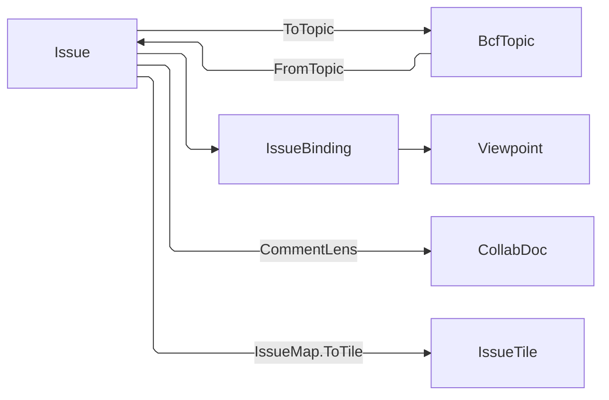

# [APPUI_ISSUE_BOARD]

Coordination rides the openBIM issue board: `Issue` composes the AppUi `Viewpoint` with the `Rasm.Bim` BCF topic, `CommentLens` projects the shared `CollabDoc` comment maps, `IssueRegister` owns the durable triage columns, `IssueTile` projects the filterable row, `TriageBoard` owns the issue-to-viewpoint binding and the markup fold, `BoardSurface` folds one filtered row set into kanban lanes, a virtualized list, and a detail pane, and `RedlineTool` is the typed markup family whose one pressure-captured stroke projects onto both review planes through the exchange leg its own row elects. Comment content, mention routing, resolution, and every triage decision enter through `IntentLedger.Commit`; the durable row lands before the live `IntentApply` dispatch, so a live-apply failure remains visible on the rail and cold-load replay reconstructs the durable state. AppUi owns projection and interaction while `Rasm.Bim` owns BCF semantics, the `SignOff` lifecycle legality, and archive encoding; a second BCF model or direct XML writer is rejected. `IssueFault` carries each failure through a direct generated union case.

## [01]-[INDEX]

- [02]-[ISSUE_MODEL]: Issue composing the `Viewpoint`, the BCF topic, and the snapshot; the status row vocabulary; the fault roster.
- [03]-[COMMENT_LENS]: Comment conversation as a `CollabDoc` map container; the one commit rail; the mention router and its mint.
- [04]-[ISSUE_TILE]: Dashboard-tile projection of the issue list with status brushing and last-editor attribution.
- [05]-[BOARD_PROJECTION]: `TriageBoard` owning the issue-to-viewpoint binding, the merge-authority re-projection, the markup fold, and the BCF round-trip.
- [06]-[ISSUE_REGISTER]: The closed triage verb family; the one durable register; the `SignOff`-graded transition; the per-column fold onto the issue.
- [07]-[BOARD_PRESENTATION]: Kanban lanes, the filtered virtualized list with its chips, and the detail pane with mentions and attachment.
- [08]-[REDLINE_TOOLS]: The trait-typed tool family with pressure capture; the tool-row-elected markup legs; the raster leg's world-plane placement; the one commit entry.

## [02]-[ISSUE_MODEL]

- Owner: `IssueFault` the direct generated `[Union]` with one `[FaultCase]` leaf per issue failure; `IssueStatus` `[SmartEnum<string>]` the coordination lifecycle whose rows carry the cross-filter `Bit`, the `BcfStatus` correspondence, and the `CapabilitySet<SessionCapability>` a transition INTO the row demands; `Issue` the board issue record; `IssueBinding` the topic-to-viewpoint binding; `IssueMap` the generated projection seam over the BCF comment and tile correspondences.
- Cases: `IssueStatus` = open, in-progress, resolved, closed, reopened; `[FaultCase]` = TopicMalformed | ViewpointUnbound | CommentConflict | Degenerate | Unwritten | ToolRefused | RasterFailed.
- Entry: `Issue.FromTopic(BcfTopic topic, Func<string, int> revision, IClock clock)` — ADMITS the `Rasm.Bim` BCF topic at the boundary on a `Validation` applicative, so a blank title, an unknown status, and an unbound comment viewpoint all report in ONE refusal; `Issue.ToTopic()` — `with`-updates the carried source row (board-edited columns only) or mints a core-column topic for a board-authored issue; `IssueMap.ToEntry`/`ToComment`/`ToTile` — the generated member correspondences.
- Auto: each issue carries the BCF topic identity beside its bound `Viewpoint` set, its comment projection, and the consumed source row, so the widened `BcfTopic` columns the board never edits survive the round-trip untouched; the status correspondence is ROW DATA — `FromBcf` is the `Items`-derived frozen index over the `Bcf` column and `ToTopic` reads `Status.Bcf`, so zero hand-enumerated mapping switches exist; each BCF viewpoint binds onto the AppUi `Viewpoint` through `ViewpointCodec.FromBcf`, whose refusal of a camera-less viewpoint accumulates beside the other admission gates, so the issue mints no second camera-snapshot shape, and its per-key revision arrives from the `Render/viewpoint#VIEW_REGISTRY` `ViewRevisions` minter composition binds — BCF carries no count, so a re-imported topic supersedes the binding it replaces instead of tying with it; transition authority is the DESTINATION row's own `Needs` set, read by `Collab/session#ADMISSION_GATE`.
- Packages: Rasm (project — `FaultBand`, `[FaultCase]`, `CapabilitySet`), Rasm.Bim (project), Rasm.Contracts (project — generated `Bcf.BcfStatus`), Riok.Mapperly, Thinktecture.Runtime.Extensions, LanguageExt.Core, NodaTime
- Growth: a new issue field is one `Issue` member and, where it crosses, one `IssueMap` row; a new lifecycle state is one `IssueStatus` row carrying its three columns; a new fault is one `[FaultCase]` leaf; zero new surface.
- Boundary: the issue composes the `Rasm.Bim/Review/issues#BCF_ARCHIVE` `BcfTopic`/`BcfComment`/`BcfViewpoint` contract at the package edge — a second BCF model or a direct `.bcfzip`/BCF-XML writer inside `Collab/` is the rejected form; `ToTopic` stays a HAND `with`-update by construction — the correspondence copies board-edited columns over a CARRIED immutable source row, which a generator constructs and cannot copy-with, so Mapperly's refusal is named here and the constructing correspondences ride `IssueMap` instead; the EXCHANGE line runs where a column means something to a foreign reader — assignment and labels cross because a CDE acts on them, while the attachment key, the comment editor peer, and the tile's last-editor ordinal stop at the board; `FromTopic` accumulates — its identity, status, comment-closure, and viewpoint-decode gates are INDEPENDENT, so a monadic chain reporting the first defect is the deleted form; the admitted identity IS the issue's own column and the exchange text parses ONCE at that gate, so the register level, the intent row, and every board verb take the typed value instead of re-parsing a string at each seam; `CommentEntry.Resolved` stays a bare bool — a measured thread fact with both states legal and no sibling flag sharing its regime.

```csharp
// --- [TYPES] ---------------------------------------------------------------------------
[SmartEnum<string>]
public sealed partial class IssueStatus {
    public static readonly IssueStatus Open = new("open", bit: 0, bcf: Rasm.Contracts.Bcf.BcfStatus.Open, needs: CapabilitySet<SessionCapability>.Of(SessionCapability.Author));
    public static readonly IssueStatus InProgress = new("in-progress", bit: 1, bcf: Rasm.Contracts.Bcf.BcfStatus.InProgress, needs: CapabilitySet<SessionCapability>.Of(SessionCapability.Author));
    public static readonly IssueStatus Resolved = new("resolved", bit: 2, bcf: Rasm.Contracts.Bcf.BcfStatus.Resolved, needs: CapabilitySet<SessionCapability>.Of(SessionCapability.Resolve));
    public static readonly IssueStatus Closed = new("closed", bit: 3, bcf: Rasm.Contracts.Bcf.BcfStatus.Closed, needs: CapabilitySet<SessionCapability>.Of(SessionCapability.Resolve));
    public static readonly IssueStatus Reopened = new("reopened", bit: 4, bcf: Rasm.Contracts.Bcf.BcfStatus.Reopened, needs: CapabilitySet<SessionCapability>.Of(SessionCapability.Author));

    public int Bit { get; }
    public Rasm.Contracts.Bcf.BcfStatus Bcf { get; }
    public CapabilitySet<SessionCapability> Needs { get; }

    private static readonly Lazy<FrozenDictionary<Rasm.Contracts.Bcf.BcfStatus, IssueStatus>> ByBcf =
        new(static () => Items.ToFrozenDictionary(static row => row.Bcf));

    public static Fin<IssueStatus> FromBcf(Rasm.Contracts.Bcf.BcfStatus status) =>
        ByBcf.Value.TryGetValue(status, out IssueStatus? row)
            ? Fin.Succ(row)
            : Fin.Fail<IssueStatus>(new IssueFault.TopicMalformed($"unknown BCF status {status}"));
}

// --- [ERRORS] --------------------------------------------------------------------------
[Union(ConversionFromValue = ConversionOperatorsGeneration.None)]
public abstract partial record IssueFault : Fault {
    private static readonly FaultBand FamilyBand = FaultBand.UiIssue;
    private IssueFault(string detail) { Detail = detail; }

    public string Detail { get; }
    public override string Message => Detail;

    [FaultCase(0)]
    public sealed partial record TopicMalformed(string Detail)   : IssueFault(Detail);
    [FaultCase(1)]
    public sealed partial record ViewpointUnbound(string Detail) : IssueFault(Detail);
    [FaultCase(2)]
    public sealed partial record CommentConflict(string Detail)  : IssueFault(Detail);
    [FaultCase(3)]
    public sealed partial record Degenerate(string Detail)       : IssueFault(Detail);
    [FaultCase(4)]
    public sealed partial record Unwritten(string Detail)        : IssueFault(Detail);
    [FaultCase(5)]
    public sealed partial record ToolRefused(string Detail)      : IssueFault(Detail);
    [FaultCase(6)]
    public sealed partial record RasterFailed(string Detail)     : IssueFault(Detail);
}

// --- [MODELS] --------------------------------------------------------------------------
public sealed record IssueBinding(string ViewpointGuid, Viewpoint View);

public sealed record CommentEntry(
    string CommentId,
    string Author,
    string Text,
    Option<string> ViewpointGuid,
    bool Resolved,
    Instant Date,
    Option<Instant> ModifiedAt = default,
    Option<string> ModifiedBy = default,
    Option<ulong> Editor = default);

public sealed record Issue(
    System.Guid Guid,
    string Title,
    IssueStatus Status,
    string TopicType,
    string Priority,
    string Author,
    Instant CreatedAt,
    Seq<IssueBinding> Bindings,
    Seq<CommentEntry> Comments,
    Option<string> SnapshotKey,
    Option<string> Assignee = default,
    Seq<string> Labels = default,
    Option<string> Attachment = default,
    Option<Rasm.Bim.Coordination.BcfTopic> Source = default) {
    public static Fin<Issue> FromTopic(Rasm.Bim.Coordination.BcfTopic topic, Func<string, int> revision, IClock clock) =>
        Admitted(topic, revision, clock.GetCurrentInstant());

    static Fin<Issue> Admitted(Rasm.Bim.Coordination.BcfTopic topic, Func<string, int> revision, Instant at) =>
        (Identity(topic), IssueStatus.FromBcf(topic.Status).ToValidation(), Bound(topic), Seated(topic, revision, at))
            .Apply((identity, status, _, bindings) => new Issue(
                identity, topic.Title, status, topic.TopicType, topic.Priority,
                topic.Author, topic.CreationDate,
                bindings,
                topic.Comments.Map(IssueMap.ToEntry),
                topic.Viewpoints.Find(static vp => vp.Snapshot.IsSome).Map(static vp => vp.Guid),
                Optional(topic.AssignedTo).Filter(static who => who.Length > 0),
                topic.Labels,
                None,
                Some(topic)))
            .As().ToFin();

    static Validation<Error, System.Guid> Identity(Rasm.Bim.Coordination.BcfTopic topic) =>
        System.Guid.TryParse(topic.Guid, out System.Guid identity) && !string.IsNullOrWhiteSpace(topic.Title)
            ? identity
            : (Error)new IssueFault.TopicMalformed($"topic {topic.Guid}: blank title or non-guid identity");

    static Validation<Error, Unit> Bound(Rasm.Bim.Coordination.BcfTopic topic) =>
        topic.Comments
            .Filter(static c => c.ViewpointGuid.IsSome)
            .Traverse(c => c.ViewpointGuid
                .Filter(guid => topic.Viewpoints.Exists(vp => vp.Guid == guid)).IsSome
                    ? Success<Error, Unit>(unit)
                    : Fail<Error, Unit>(new IssueFault.ViewpointUnbound($"comment {c.Guid}: viewpoint {c.ViewpointGuid} absent from topic")))
            .As().Map(static _ => unit);

    static Validation<Error, Seq<IssueBinding>> Seated(
        Rasm.Bim.Coordination.BcfTopic topic, Func<string, int> revision, Instant at) =>
        topic.Viewpoints
            .Traverse(vp => ViewpointCodec.FromBcf(vp.Guid, revision(vp.Guid), vp, at).ToValidation()
                .Map(view => new IssueBinding(vp.Guid, view)))
            .As();

    public Rasm.Bim.Coordination.BcfTopic ToTopic() {
        Seq<Rasm.Bim.Coordination.BcfViewpoint> viewpoints = Bindings.Map(binding => ViewpointCodec.ToBcf(
            binding.ViewpointGuid, binding.View,
            Source.Bind(topic => topic.Viewpoints.Find(vp => vp.Guid == binding.ViewpointGuid))));
        return Source.Match(
            Some: topic => topic with {
                Title = Title, Status = Status.Bcf, TopicType = TopicType, Priority = Priority,
                Comments = CommentLens.Materialize(Comments), Viewpoints = viewpoints,
                AssignedTo = Assignee.IfNone(string.Empty), Labels = Labels,
                StatusLabel = Status.Bcf == topic.Status ? topic.StatusLabel : "",
            },
            None: () => new Rasm.Bim.Coordination.BcfTopic(
                Guid.ToString("D"), Title, Status.Bcf, TopicType, Priority, Author, CreatedAt,
                CommentLens.Materialize(Comments), viewpoints,
                AssignedTo: Assignee.IfNone(string.Empty), Labels: Labels));
    }
}

// --- [COMPOSITION] ---------------------------------------------------------------------
[Mapper(
    RequiredMappingStrategy = RequiredMappingStrategy.Target,
    EnabledConversions = MappingConversionType.All & ~MappingConversionType.ExplicitCast)]
public static partial class IssueMap {
    [MapProperty(nameof(Rasm.Bim.Coordination.BcfComment.Guid), nameof(CommentEntry.CommentId))]
    [MapProperty(nameof(Rasm.Bim.Coordination.BcfComment.ModifiedDate), nameof(CommentEntry.ModifiedAt))]
    [MapProperty(nameof(Rasm.Bim.Coordination.BcfComment.ModifiedAuthor), nameof(CommentEntry.ModifiedBy))]
    [MapValue(nameof(CommentEntry.Resolved), false)]
    [MapValue(nameof(CommentEntry.Editor), Use = nameof(NoEditor))]
    public static partial CommentEntry ToEntry(Rasm.Bim.Coordination.BcfComment comment);

    [MapProperty(nameof(CommentEntry.CommentId), nameof(Rasm.Bim.Coordination.BcfComment.Guid))]
    [MapProperty(nameof(CommentEntry.ModifiedAt), nameof(Rasm.Bim.Coordination.BcfComment.ModifiedDate))]
    [MapProperty(nameof(CommentEntry.ModifiedBy), nameof(Rasm.Bim.Coordination.BcfComment.ModifiedAuthor))]
    public static partial Rasm.Bim.Coordination.BcfComment ToComment(CommentEntry entry);

    [MapPropertyFromSource(nameof(IssueTile.LastEditor), Use = nameof(LastEditor))]
    public static partial IssueTile ToTile(Issue issue);

    [UserMapping] private static Option<string> Presence(string value) => Optional(value).Filter(static text => text.Length > 0);
    [UserMapping] private static string Absence(Option<string> value) => value.IfNone("");
    private static Option<ulong> NoEditor() => None;

    private static Option<ulong> LastEditor(Issue issue) =>
        Ranked.Top(issue.Comments, keep: 1, key: static entry => entry.Date, ExtremumDirection.Maximum)
            .Head.Bind(static entry => entry.Editor);
}
```



## [03]-[COMMENT_LENS]

- Owner: `CommentLens` — the comment conversation as a scoped `Collab/sync.md` `CollabDoc` map resolve on the `CollabRoot.Comments` topic hop, its rows keyed by comment GUID; `MentionRouter` — the roster-backed mention resolution AND its own mint, so the picker's roster and the router's are one register read; NO page-local CRDT and NO page-local write kernel exist — every live column write rides the `Collab/sync.md` `IntentApply` comment arms through the one `IntentLedger.Commit` rail.
- Entry: `Put` is the one comment write verb: row existence discriminates `EditIntent.CommentAdd` from `CommentEdit`, then the router resolves identity tokens and commits one `CommentRoute` carrying the distinct peer set; `Resolve` admits only an existing row before committing `CommentResolve`; `MentionRouter.Of(CollabDoc doc)` — the mint reading the member register roster; `Inbox` — the peer-keyed notice read.
- Auto: each comment is one GUID-keyed mergeable map carrying author, body, viewpoint, resolution, timestamps, and editor provenance; every read addresses it through the one `Collab/sync#DOCUMENT_OWNER` `CollabPath` owner under the typed `ContainerKey` the intent row itself carries, and folds absence through that owner's `Read` twin, so a root name never appears here and an unwritten hop reads empty rather than faulting; every column crosses `CollabRegister` against the `CollabColumn` row that wrote it; mention routing is another case on the same durable union whose replay arm writes the inbox rows.
- Packages: LoroCs (via `Collab/sync.md` owners), Thinktecture.Runtime.Extensions, LanguageExt.Core, NodaTime, Rasm.Bim (project)
- Growth: a new comment column is one `CollabColumn` row its `IntentApply` arm writes and this projection reads; zero new surface, zero new CRDT, zero new write kernel.
- Boundary: durable truth rides the `CommentAdd`/`CommentEdit`/`CommentResolve`/`CommentRoute` cases on the shared edit-intent union, so a page-local op family or direct live write is rejected; the lens materializes comment content and modification provenance to `BcfComment` through `IssueMap`, while notification routing and the registered `Editor` peer remain collaboration state; an inbox notice is a comment fact addressed to a peer INSIDE one document's own notification level, so `CommentNotice` carries no document column of its own and never collapses into the session-boundary marker seated beside it; the commit rail's retry posture is the LEDGER's own policy column, never a per-call `Schedule` sprayed across consumers.

```csharp
public static class CommentLens {
    static Fin<A> Thread<A>(CollabDoc doc, ContainerKey topic, A absent, Func<LoroMap, Fin<A>> read) =>
        doc.Read(CollabPath.Root(CollabRoot.Comments).Key(topic), absent, read);

    public static IO<Fin<Unit>> Put(
        CollabDoc doc,
        IntentLedger ledger,
        MentionRouter mentions,
        ContainerKey topic,
        CommentEntry entry,
        IClock clock) =>
        (from id in new FinT<IO, Guid>(IO.lift<Fin<Guid>>(() => CommentId(entry.CommentId)))
         from exists in new FinT<IO, bool>(IO.lift<Fin<bool>>(() => Has(doc, topic, id)))
         from written in new FinT<IO, Unit>(ledger.Commit(doc, Authored(doc, topic, entry, id, exists, clock), IssueRegister.BoardOrigin))
         from routed in new FinT<IO, Unit>(mentions.Route(doc, ledger, id, topic, entry.Text, clock.GetCurrentInstant()))
         select routed).runFin.As();

    static EditIntent Authored(CollabDoc doc, ContainerKey topic, CommentEntry entry, Guid id, bool exists, IClock clock) =>
        exists
            ? new EditIntent.CommentEdit(doc.Key, id, topic, entry.Text, entry.Author, clock.GetCurrentInstant())
            : new EditIntent.CommentAdd(doc.Key, id, topic, entry.Text, entry.Author, entry.ViewpointGuid, clock.GetCurrentInstant());

    public static IO<Fin<Unit>> Resolve(CollabDoc doc, IntentLedger ledger, ContainerKey topic, string commentId, IClock clock) =>
        (from id in new FinT<IO, Guid>(IO.lift<Fin<Guid>>(() => CommentId(commentId)))
         from exists in new FinT<IO, bool>(IO.lift<Fin<bool>>(() => Has(doc, topic, id)))
         from held in FinT.lift<IO, Unit>(
             guard(exists, new IssueFault.CommentConflict($"resolve: no comment row {commentId}")).ToFin())
         from done in new FinT<IO, Unit>(
             ledger.Commit(doc, new EditIntent.CommentResolve(doc.Key, id, topic, clock.GetCurrentInstant()), IssueRegister.BoardOrigin))
         select done).runFin.As();

    public static Fin<Seq<CommentEntry>> Project(CollabDoc doc, ContainerKey topic) =>
        Thread(doc, topic, Seq<CommentEntry>(), thread => CollabDoc.Lift(() => ReadEntries(thread)));

    public static Seq<Rasm.Bim.Coordination.BcfComment> Materialize(Seq<CommentEntry> comments) =>
        toSeq(comments.OrderBy(static entry => entry.Date)).Map(IssueMap.ToComment);

    static Fin<bool> Has(CollabDoc doc, ContainerKey topic, Guid commentId) =>
        Thread(doc, topic, false, thread =>
            CollabDoc.Lift(() => thread.Keys().Contains(ContainerKey.Of(commentId).Value)));

    static Fin<Guid> CommentId(string value) =>
        System.Guid.TryParse(value, out Guid id)
            ? Fin.Succ(id)
            : Fin.Fail<Guid>(new IssueFault.CommentConflict($"comment identity {value} is not a GUID"));

    static Seq<CommentEntry> ReadEntries(LoroMap thread) =>
        thread.Keys().AsIterable()
            .Map(key => Read(thread, key))
            .Somes()
            .ToSeq();

    static Option<CommentEntry> Read(LoroMap thread, string key) =>
        thread.Level(key, live => EntryOf(thread, key, live));

    static Option<CommentEntry> EntryOf(LoroMap thread, string key, LoroMap row) =>
        (row.Read(CollabColumn.Author, static leaf => leaf.Text),
         row.Read(CollabColumn.Body, static leaf => leaf.Text),
         row.Read(CollabColumn.At, static leaf => leaf.Stamp)).Apply((author, body, at) =>
            new CommentEntry(
                System.Guid.ParseExact(key, "N").ToString(), author, body,
                row.Read(CollabColumn.Viewpoint, static leaf => leaf.Text),
                row.Read(CollabColumn.Resolved, static leaf => leaf.Flag).IfNone(false), at,
                row.Read(CollabColumn.EditedAt, static leaf => leaf.Stamp),
                row.Read(CollabColumn.EditedBy, static leaf => leaf.Text),
                Optional(thread.GetLastEditor(key))));
}

public readonly record struct CommentNotice(Guid CommentId, string TopicId, Instant At);

public sealed record MentionRouter(Func<string, Fin<Seq<ulong>>> Resolve) {
    public const char Sigil = '@';

    public static Fin<MentionRouter> Of(CollabDoc doc) =>
        MemberRegister.Roster(doc).Map(static roster => new MentionRouter(body => Fin.Succ(
            Tokens(body).Choose(token => roster
                .Find(row => row.State == MembershipState.Joined && row.Handle.Exists(handle => handle == token))
                .Map(static row => row.Peer))
                .Distinct())));

    public IO<Fin<Unit>> Route(CollabDoc doc, IntentLedger ledger, Guid comment, ContainerKey topic, string body, Instant at) =>
        (from peers in new FinT<IO, Seq<ulong>>(IO.lift<Fin<Seq<ulong>>>(() => Resolve(body).Map(static found => found.Distinct())))
         from routed in peers.IsEmpty
             ? FinT.Succ<IO, Unit>(unit)
             : new FinT<IO, Unit>(ledger.Commit(
                   doc, new EditIntent.CommentRoute(doc.Key, comment, topic, peers, at), IssueRegister.BoardOrigin))
         select routed).runFin.As();

    public Fin<Seq<CommentNotice>> Inbox(CollabDoc doc, ulong peer) =>
        doc.Read(
            CollabPath.Root(CollabRoot.Notifications).Key(ContainerKey.Of(peer)),
            Seq<CommentNotice>(),
            inbox => CollabDoc.Lift(() => inbox.Keys().AsIterable().Choose(key => Notice(inbox, key)).ToSeq()));

    static Option<CommentNotice> Notice(LoroMap inbox, string key) =>
        Guid.TryParseExact(key, "N", out Guid comment)
            ? inbox.Read(key, static row => (row.Field(CollabColumn.Topic, static leaf => leaf.Text),
                                             row.Field(CollabColumn.At, static leaf => leaf.Stamp))
                .Apply((topic, at) => new CommentNotice(comment, topic, at)))
            : None;

    static Seq<string> Tokens(string body) =>
        toSeq(body.Split(Sigil, StringSplitOptions.RemoveEmptyEntries).Skip(body.StartsWith(Sigil) ? 0 : 1))
            .Map(static run => new string(run.TakeWhile(static ch => char.IsLetterOrDigit(ch) || ch is '-' or '.' or '_').ToArray()))
            .Filter(static token => token.Length > 0);
}
```

## [04]-[ISSUE_TILE]

- Owner: `IssueTile` the dashboard-tile projection of an issue; `IssueFilter` the cross-filter status bitset.
- Entry: `IssueTiles.Project(TriageBoard board, IssueFilter filter)` — projects the board's issues onto the tile family under the status cross-filter; `IssueFilter.Of(params ReadOnlySpan<IssueStatus> rows)` — the bitset builder folding status rows through their own `Bit` column, arity absorbed by the span.
- Auto: each issue projects onto one typed tile row through `IssueMap.ToTile` — title, status, priority, author, snapshot key, and last-editor attribution off the loro per-key provenance; the lane MOUNTS in a dashboard as one `DashboardTile.Custom` cell, and a board status brush pushes the status keys as brushed tags into the dashboard's one `FilterState`; `IssueFilter` is the surviving sibling beside the dashboards `DimensionIndex` on a named discriminant — a fixed five-row status vocabulary folded by `Bit` columns, not a row-ordinal index over unbounded data.
- Packages: Thinktecture.Runtime.Extensions, Riok.Mapperly, LanguageExt.Core
- Growth: a new tile field is one `IssueTile` member and one `IssueMap` row; a new filter axis is one `IssueFilter` bitset column; zero new surface.
- Boundary: the issue lane enters a dashboard as one `DashboardTile.Custom` cell and brushes through the dashboards `FilterState` tag set — a parallel tile placement engine or a second brush protocol is the deleted form; the `filter` parameter serves the DASHBOARD lane mount, which brushes by bitset; `BoardSurface.Rows` passes `IssueFilter.All` because its status filtering rides the compiled seam `Predicate<FilterTerm>` instead — two admission planes, each owned by its caller; the attribution column carries the merge authority's peer identity and stops at the board, `BcfComment.ModifiedBy` staying the authored provenance.

```csharp
public readonly record struct IssueFilter(uint StatusMask) {
    public static readonly IssueFilter All = new(uint.MaxValue);

    public static IssueFilter Of(params ReadOnlySpan<IssueStatus> rows) =>
        new(LanguageExt.Iterable<IssueStatus>.FromSpan(rows).Fold(0u, static (mask, row) => mask | (1u << row.Bit)));

    public bool Admits(IssueStatus status) => (StatusMask & (1u << status.Bit)) != 0u;
}

public sealed record IssueTile(
    System.Guid Guid, string Title, IssueStatus Status, string Priority, string Author,
    Option<string> Assignee, Seq<string> Labels,
    Option<string> SnapshotKey, Option<ulong> LastEditor);

public static class IssueTiles {
    public static Seq<IssueTile> Project(TriageBoard board, IssueFilter filter) =>
        board.Issues
            .Filter(issue => filter.Admits(issue.Status))
            .Map(IssueMap.ToTile);
}
```

## [05]-[BOARD_PROJECTION]

- Owner: `TriageBoard` the board projection owning the issue set, the issue-to-viewpoint binding, the markup fold, and the BCF round-trip. The name is deliberate: `Rasm.Bim/Review/coordination.md` owns the domain type `IssueBoard`, and this projection composes that domain rather than shadowing its name.
- Entry: `TriageBoard.Load(Seq<BcfTopic> topics, Func<string, int> revision, IClock clock)` — folds a `Rasm.Bim`-read BCF topic set into the board issues, the revision arrow minting each inbound viewpoint's per-key reading; `Synced(CollabDoc doc)` — re-projects every issue's comment set FROM the merge authority, so a refreshed board is a pure read of the shared document; `Save()` — the total projection back onto the BCF topic set for the `Rasm.Bim` archive writer; `Navigate` — the bound-viewpoint resolve; `Markup(issueGuid, viewpointGuid, markup)` — the fold landing captured redlines onto the GUID-bound source viewpoint.
- Receipt: board and comment durability is the one edit-intent stream; a board edit projects one `EditIntent` row.
- Packages: LanguageExt.Core, NodaTime, Rasm.Bim (project), Rasm.Persistence (project)
- Growth: a new board view is one projection over the issue set; zero new surface.
- Boundary: the board is the PROJECTION over the issue set — comment state enters only through `Synced`'s merge-authority read, so every exposed mutation path is either an intent on the one union or a pure re-projection; the round-trip crosses `Rasm.Bim/Review/issues#BCF_ARCHIVE` `BcfArchive.Read`/`Write`, and the save seeds `BcfFile.Blobs` from the `Document/media#MEDIA_SURFACE` rows its bitmap markups carry; `Synced` stays a PURE fold by declaration — the live refresh cadence is the sync feed's subscription seam, so a streaming re-projection here would fork that owner's backpressure law.

```csharp
public sealed record TriageBoard(string Key, Seq<Issue> Issues) {
    public static Fin<TriageBoard> Load(
        Seq<Rasm.Bim.Coordination.BcfTopic> topics, Func<string, int> revision, IClock clock) =>
        topics.Traverse(topic => Issue.FromTopic(topic, revision, clock)).As()
            .Map(issues => new TriageBoard("coordination", issues.ToSeq()));

    public Seq<Rasm.Bim.Coordination.BcfTopic> Save() =>
        Issues.Map(static issue => issue.ToTopic());

    public Fin<Viewpoint> Navigate(System.Guid guid, Option<string> viewpointGuid = default) =>
        Issues.Find(issue => issue.Guid == guid)
            .ToFin(new IssueFault.TopicMalformed($"issue {guid} is absent"))
            .Bind(issue => viewpointGuid.Match(
                Some: key => issue.Bindings.Find(binding => binding.ViewpointGuid == key)
                    .Map(static binding => binding.View)
                    .ToFin(new IssueFault.ViewpointUnbound($"issue {guid}: viewpoint {key} is absent")),
                None: () => issue.Bindings switch {
                    [var only] => Fin.Succ(only.View),
                    var set => Fin.Fail<Viewpoint>(new IssueFault.ViewpointUnbound($"issue {guid}: select one of {set.Count} viewpoints")),
                }));

    public Fin<TriageBoard> Synced(CollabDoc doc) =>
        Issues.Traverse(issue =>
            from comments in CommentLens.Project(doc, ContainerKey.Of(issue.Guid))
            from triage in IssueRegister.Read(doc, issue.Guid)
            select triage.Onto(issue with { Comments = comments })).As()
            .Map(issues => this with { Issues = issues.ToSeq() });

    public Fin<TriageBoard> Markup(System.Guid issueGuid, string viewpointGuid, Seq<ViewpointMarkup> markup) =>
        from issue in Issues.Find(row => row.Guid == issueGuid)
            .ToFin(new IssueFault.TopicMalformed($"issue {issueGuid} is absent"))
        from source in issue.Source.ToFin(new IssueFault.TopicMalformed($"issue {issueGuid} has no BCF source row"))
        from viewpoint in source.Viewpoints.Find(row => row.Guid == viewpointGuid)
            .ToFin(new IssueFault.ViewpointUnbound($"issue {issueGuid}: viewpoint {viewpointGuid} is absent"))
        let updated = markup.Fold(viewpoint, static (current, row) => row.Switch(
            state: current,
            stroke: static (state, value) => state with { Lines = state.Lines + value.Lines },
            bitmap: static (state, value) => state with { Bitmaps = state.Bitmaps.Add(value.Value) }))
        let topic = source with { Viewpoints = source.Viewpoints.Map(row => row.Guid == viewpointGuid ? updated : row) }
        select this with {
            Issues = Issues.Map(row => row.Guid == issueGuid ? row with { Source = Some(topic) } : row),
        };
}
```

## [06]-[ISSUE_REGISTER]

- Owner: `IssueOp` `[Union]` the closed board-triage verb family; `IssueTriage` the decoded live-column row; `IssueRegister` the ONE durable triage writer, its `Read` projection, and the `Govern`-shaped commit ingress.
- Cases: `IssueOp` = Transition | Assign | LabelApply | LabelClear | Rank | Attach — apply and clear are two VERBS, never one verb behind a mode bool, so the write law and the capability fold address each without a flag read.
- Entry: `Commit(doc, ledger, issueGuid, op)` — the ONE write ingress, minting the verb's `EditIntent.IssueCommit` row through `IntentLedger.Commit` under `BoardOrigin`; `Apply(doc, issueGuid, op)` — the DECODE-side write law, reached only from `Collab/sync#DURABLE_INTENT`'s issue arm; `Read(doc, guid)` — the live-column read `TriageBoard.Synced` folds.
- Auto: the write splits into an ingress and a decode arm exactly as every other collaborative surface's does; each issue is one `ContainerKey.Of(identity)`-keyed mergeable map under the `CollabRoot.Issues` root; the label SET is its own keyed mergeable level so adding and removing different labels merges rather than replacing a list; an unassignment ERASES its column rather than writing a blank; `IssueTriage.Onto` folds the live columns over the BCF-derived ones PER COLUMN; the transition arm composes the Bim `SignOff` lifecycle — the destination grades against the register's own prior through `SignOff.Advance`, so a `Closed → InProgress` skip refuses TYPED on the Bim band instead of landing a status the exchange would reject.
- Receipt: a triage change seals no receipt of its own — it is an `EditIntent` on the one durable union, sealed by `IntentLedger.Project` through the `ReceiptSinkPort` message envelope.
- Packages: LoroCs (via `Collab/sync.md` owners), Rasm (project — `Op`), Rasm.Bim (project — `SignOff`), Thinktecture.Runtime.Extensions, LanguageExt.Core, NodaTime
- Growth: a new triage verb is one `IssueOp` case whose generated total `Switch` breaks the write law and the capability fold at compile time; a new triage column is one `CollabColumn` row both ends read; zero new surface, zero new register.
- Boundary: the register is DURABLE truth on the one edit-intent union — a triage row written directly into the live document, a board-local store, or a status held only in the BCF archive are the three deleted forms; `Commit` carries no gate of its own because `IntentLedger.Project` folds the composition-bound `Admit` column ahead of `LedgerAppend`; every write descends through the `Collab/sync#DOCUMENT_OWNER` scoped `Use`; the triage columns are `Option` because they are the evidence a WRITTEN column holds; lifecycle legality is `Rasm.Bim`-owned — `SignOff.Advance` runs at the transition arm's PRIOR, and an issue no peer has yet triaged grades at the exchange edge instead, because its prior lives on the archive row this register never mirrors.

```csharp
// --- [TYPES] ---------------------------------------------------------------------------
[Union(ConversionFromValue = ConversionOperatorsGeneration.None)]
public abstract partial record IssueOp {
    private IssueOp() { }

    public sealed record Transition(IssueStatus To, string By, Instant At) : IssueOp;
    public sealed record Assign(Option<string> To, string By, Instant At) : IssueOp;
    public sealed record LabelApply(string Key, Instant At) : IssueOp;
    public sealed record LabelClear(string Key, Instant At) : IssueOp;
    public sealed record Rank(string Priority, Instant At) : IssueOp;
    public sealed record Attach(string MediaKey, string By, Instant At) : IssueOp;
}

// --- [MODELS] --------------------------------------------------------------------------
public readonly record struct IssueTriage(
    Option<IssueStatus> Status,
    Option<string> Assignee,
    Option<Set<string>> Labels,
    Option<string> Priority,
    Option<string> Attachment,
    Option<Instant> At) {
    public static readonly IssueTriage Untouched = new(None, None, None, None, None, None);

    public Issue Onto(Issue issue) => issue with {
        Status = Status.IfNone(issue.Status),
        Assignee = Assignee | issue.Assignee,
        Labels = Labels.Map(toSeq).IfNone(issue.Labels),
        Priority = Priority.IfNone(issue.Priority),
        Attachment = Attachment | issue.Attachment,
    };
}

// --- [OPERATIONS] ----------------------------------------------------------------------
public static class IssueRegister {
    public const string BoardOrigin = "board";
    static readonly Op TransitionOp = Op.Of(name: "appui.issue.transition");

    public static IO<Fin<Unit>> Commit(CollabDoc doc, IntentLedger ledger, System.Guid issueGuid, IssueOp op) =>
        ledger.Commit(doc, new EditIntent.IssueCommit(doc.Key, issueGuid, op), BoardOrigin);

    public static Fin<Unit> Apply(CollabDoc doc, System.Guid issueGuid, IssueOp op) => op.Switch(
        state: (Doc: doc, Guid: issueGuid),
        transition: static (ctx, t) => Legal(ctx.Doc, ctx.Guid, t.To).Bind(_ =>
            Row(ctx.Doc, ctx.Guid, row => row.Write(
                (CollabColumn.Status, LoroVal.Of(t.To.Key)),
                (CollabColumn.Author, LoroVal.Of(t.By)),
                (CollabColumn.At, LoroVal.Of(t.At))))),
        assign: static (ctx, a) => Row(ctx.Doc, ctx.Guid, row => a.To.Match(
            Some: who => row.Write(
                (CollabColumn.Assignee, LoroVal.Of(who)),
                (CollabColumn.Author, LoroVal.Of(a.By)),
                (CollabColumn.At, LoroVal.Of(a.At))),
            None: () => row.Erase(ContainerKey.Create(CollabColumn.Assignee.Key)))),
        labelApply: static (ctx, l) => Labelled(ctx.Doc, ctx.Guid, labels => labels.Write(ContainerKey.Create(l.Key), LoroVal.Of(true))),
        labelClear: static (ctx, l) => Labelled(ctx.Doc, ctx.Guid, labels => labels.Erase(ContainerKey.Create(l.Key))),
        rank: static (ctx, r) => Row(ctx.Doc, ctx.Guid, row => row.Write(
            (CollabColumn.Priority, LoroVal.Of(r.Priority)),
            (CollabColumn.At, LoroVal.Of(r.At)))),
        attach: static (ctx, a) => Row(ctx.Doc, ctx.Guid, row => row.Write(
            (CollabColumn.Attachment, LoroVal.Of(a.MediaKey)),
            (CollabColumn.Author, LoroVal.Of(a.By)),
            (CollabColumn.At, LoroVal.Of(a.At)))));

    static Fin<Unit> Legal(CollabDoc doc, System.Guid guid, IssueStatus to) =>
        Read(doc, guid).Bind(prior => prior.Status.Match(
            Some: held => Rasm.Bim.Coordination.SignOff.Advance(held.Bcf, to.Bcf, TransitionOp).Map(static _ => unit),
            None: static () => Fin.Succ(unit)));

    static Fin<Unit> Labelled(CollabDoc doc, System.Guid guid, Func<LoroMap, Fin<Unit>> edit) =>
        Row(doc, guid, row => CollabDoc.Nested(() => row.EnsureMergeableMap(CollabColumn.Labels.Key), edit));

    public static Fin<IssueTriage> Read(CollabDoc doc, System.Guid guid) =>
        doc.Read(CollabPath.Root(CollabRoot.Issues).Key(ContainerKey.Of(guid)), IssueTriage.Untouched, row => CollabDoc.Lift(() => Triage(row)));

    static Fin<Unit> Row(CollabDoc doc, System.Guid guid, Func<LoroMap, Fin<Unit>> write) =>
        doc.Use<LoroMap, Unit>(CollabAddress.Of(CollabRoot.Issues), issues =>
            CollabDoc.Nested(() => issues.EnsureMergeableMap(ContainerKey.Of(guid).Value), write));

    static IssueTriage Triage(LoroMap row) => new(
        row.Read(CollabColumn.Status, static leaf => leaf.Text).Bind(static key =>
            IssueStatus.TryGet(key, out IssueStatus? held) ? Some(held) : None),
        row.Read(CollabColumn.Assignee, static leaf => leaf.Text),
        Labels(row),
        row.Read(CollabColumn.Priority, static leaf => leaf.Text),
        row.Read(CollabColumn.Attachment, static leaf => leaf.Text),
        row.Read(CollabColumn.At, static leaf => leaf.Stamp));

    static Option<Set<string>> Labels(LoroMap row) =>
        row.Level(CollabColumn.Labels, static held => Some(toSet(held.Keys())));
}
```

## [07]-[BOARD_PRESENTATION]

- Owner: `BoardView` `[SmartEnum<string>]` the three-projection axis whose rows carry their own grouping seed; `BoardSchema` the `FilterSchema<IssueTile>` roster; `BoardLane` the kanban column; `IssueDetail` the detail-pane projection; `BoardSurface` the one fold producing lanes, rows, chips, and detail from one filtered row set — the surface the board's `ScreenCatalog` row materializes at composition.
- Cases: `BoardView` = kanban | list | detail — three projections of ONE row set; a row whose grouping seed is empty is a projection WITHOUT grouping, both states legal.
- Entry: `BoardSchema.Of(Seq<string> priorities)` — the admitted property roster every board filter, sort, and grouping crosses, its property keys DERIVED from the `IssueTile` member roster and its priority domain arriving as the archive's own `BcfVocabulary.Priorities` order (most-urgent-first, so the member-domain index IS the rank and a lexical priority sort never enters); `Lanes(filter)`; `Rows(filter, view)`; `Chips(filter)`; `Detail(doc, guid)`; `Drop`/`Assign`/`Label`/`Unlabel`/`Attach` — the settled intents.
- Auto: the three views are PROJECTIONS of one filtered row set; grouping is the view row's own seed folded into the settled `ViewState`; a lane is TOTAL over the status vocabulary so an empty status still renders a drop target; drag-to-transition mints the settled `IssueOp.Transition` through the one ledger rail and NOTHING moves locally; the filter chips are the closure's own `Chips()` fold verbatim; the detail pane composes settled owners whole, its mention roster the SAME register `MentionRouter.Of` resolves against.
- Packages: LoroCs (via `Collab/sync.md` owners), Thinktecture.Runtime.Extensions, LanguageExt.Core, NodaTime
- Growth: a new board view is one `BoardView` row carrying its grouping seed; a new filterable axis is one `IssueTile` member and one `Field` row; a new detail facet is one `IssueDetail` member; zero new surface, zero new filter dialect.
- Boundary: the board mints NO filter grammar, NO comparer, and NO grouping fold — `Editing/livedata#FILTER_ALGEBRA` `FilterSchema` answers all three off one roster; the virtualized list hands its ordered rows to the `Shell/virtualization#WINDOW_OWNER` fabric; EVERY mutation is a settled edit intent through `IssueRegister.Commit`; the five intent literals are the command-deck vocabulary this surface RAISES — their provenance is the `Shell/commands#INTENT_TABLE` row set, so they stay declared constants here rather than derivations of the verb family; the property keys DERIVE from `nameof` over the tile roster, so a filterable axis and its key move as one edit; the frame-grab attachment is a `Document/media#MEDIA_SURFACE` KEY and never a blob.

```csharp
// --- [TYPES] ---------------------------------------------------------------------------
[SmartEnum<string>]
[KeyMemberEqualityComparer<ComparerAccessors.StringOrdinal, string>]
[KeyMemberComparer<ComparerAccessors.StringOrdinal, string>]
public sealed partial class BoardView {
    public static readonly BoardView Kanban = new("kanban", static () => Seq(BoardSchema.StatusProperty));
    public static readonly BoardView List = new("list", static () => Seq<string>());
    public static readonly BoardView Detail = new("detail", static () => Seq<string>());

    [UseDelegateFromConstructor]
    public partial Seq<string> Grouping();

    public ViewState Seed(ViewState view) =>
        Grouping() is { IsEmpty: false } group ? view with { Group = group } : view;
}

// --- [MODELS] --------------------------------------------------------------------------
public readonly record struct BoardLane(IssueStatus Status, Seq<IssueTile> Tiles);

public sealed record IssueDetail(
    Issue Issue,
    Option<Viewpoint> Thumbnail,
    Seq<CommentEntry> Thread,
    Seq<MemberRow> Mentionable,
    Seq<ControlIntent> Chips,
    Option<string> Attachment);

// --- [OPERATIONS] ----------------------------------------------------------------------
public static class BoardSchema {
    public static readonly string StatusProperty = Key(nameof(IssueTile.Status));
    public static readonly string PriorityProperty = Key(nameof(IssueTile.Priority));
    public static readonly string AuthorProperty = Key(nameof(IssueTile.Author));
    public static readonly string AssigneeProperty = Key(nameof(IssueTile.Assignee));
    public static readonly string LabelProperty = Key(nameof(IssueTile.Labels));
    public static readonly string TitleProperty = Key(nameof(IssueTile.Title));

    public static Fin<FilterSchema<IssueTile>> Of(Seq<string> priorities) =>
        new FilterSchema<IssueTile>(Seq(
            Field(StatusProperty, FilterKind.Member, Members(toSeq(IssueStatus.Items).Map(static row => row.Key)),
                static tile => Seq<FilterValue>(new FilterValue.Member(tile.Status.Key))),
            Field(PriorityProperty, FilterKind.Member, Members(priorities),
                static tile => Seq<FilterValue>(new FilterValue.Member(tile.Priority))),
            Field(AuthorProperty, FilterKind.Text, Seq<FilterValue>(),
                static tile => Seq<FilterValue>(new FilterValue.Text(tile.Author))),
            Field(AssigneeProperty, FilterKind.Text, Seq<FilterValue>(),
                static tile => tile.Assignee.Map(static who => (FilterValue)new FilterValue.Text(who)).ToSeq()),
            Field(LabelProperty, FilterKind.Text, Seq<FilterValue>(),
                static tile => tile.Labels.Map(static label => (FilterValue)new FilterValue.Text(label))),
            Field(TitleProperty, FilterKind.Text, Seq<FilterValue>(),
                static tile => Seq<FilterValue>(new FilterValue.Text(tile.Title))))).Admit();

    static string Key(string member) => member.ToLowerInvariant();

    static FilterField<IssueTile> Field(string key, FilterKind kind, Seq<FilterValue> domain, Func<IssueTile, Seq<FilterValue>> read) =>
        new(new FilterProperty(key, $"issue.filter.{key}", kind, domain), read);

    static Seq<FilterValue> Members(Seq<string> keys) => keys.Map(static key => (FilterValue)new FilterValue.Member(key));
}

public sealed record BoardSurface(TriageBoard Board, FilterSchema<IssueTile> Schema, BoardView View) {
    public const string DropIntent = "issue.transition";
    public const string AssignIntent = "issue.assign";
    public const string LabelIntent = "issue.label";
    public const string AttachIntent = "issue.attach";
    public const string JumpIntent = "issue.open";

    public Fin<Seq<BoardLane>> Lanes(Predicate<FilterTerm> filter) =>
        Rows(filter, BoardView.Kanban.Seed(ViewState.Plain)).Map(static tiles =>
            toSeq(IssueStatus.Items).Map(status => new BoardLane(status, tiles.Filter(tile => tile.Status == status))));

    public Fin<Seq<IssueTile>> Rows(Predicate<FilterTerm> filter, ViewState view) =>
        from admitted in View.Seed(view).Admit(Schema)
        from predicate in Schema.Compile(filter)
        from ordered in Schema.Comparer(admitted)
        select toSeq(IssueTiles.Project(Board, IssueFilter.All).Filter(predicate).OrderBy(static tile => tile, ordered));

    public static Seq<FilterChip> Chips(Predicate<FilterTerm> filter) => filter.Chips();

    public static IO<Fin<Unit>> Drop(CollabDoc doc, IntentLedger ledger, System.Guid issueGuid, IssueStatus lane, string actor, IClock clock) =>
        IssueRegister.Commit(doc, ledger, issueGuid, new IssueOp.Transition(lane, actor, clock.GetCurrentInstant()));

    public static IO<Fin<Unit>> Assign(CollabDoc doc, IntentLedger ledger, System.Guid issueGuid, Option<string> who, string actor, IClock clock) =>
        IssueRegister.Commit(doc, ledger, issueGuid, new IssueOp.Assign(who, actor, clock.GetCurrentInstant()));

    public static IO<Fin<Unit>> Label(CollabDoc doc, IntentLedger ledger, System.Guid issueGuid, string label, IClock clock) =>
        IssueRegister.Commit(doc, ledger, issueGuid, new IssueOp.LabelApply(label, clock.GetCurrentInstant()));

    public static IO<Fin<Unit>> Unlabel(CollabDoc doc, IntentLedger ledger, System.Guid issueGuid, string label, IClock clock) =>
        IssueRegister.Commit(doc, ledger, issueGuid, new IssueOp.LabelClear(label, clock.GetCurrentInstant()));

    public static IO<Fin<Unit>> Attach(CollabDoc doc, IntentLedger ledger, System.Guid issueGuid, string mediaKey, string actor, IClock clock) =>
        IssueRegister.Commit(doc, ledger, issueGuid, new IssueOp.Attach(mediaKey, actor, clock.GetCurrentInstant()));

    public Fin<IssueDetail> Detail(CollabDoc doc, System.Guid guid) =>
        from issue in Board.Issues.Find(row => row.Guid == guid)
            .ToFin(new IssueFault.TopicMalformed($"issue {guid} is absent"))
        from thread in CommentLens.Project(doc, ContainerKey.Of(guid))
        from roster in MemberRegister.Roster(doc)
        select new IssueDetail(
            issue,
            issue.SnapshotKey.Bind(key => issue.Bindings.Find(binding => binding.ViewpointGuid == key)).Map(static binding => binding.View),
            thread,
            roster.Filter(static row => row.State == MembershipState.Joined),
            Chipped(issue),
            issue.Attachment);

    static Seq<ControlIntent> Chipped(Issue issue) =>
        issue.Assignee.Map(who => (ControlIntent)new ControlIntent.Chip(
                $"{AssignIntent}:{issue.Guid}", who, ChipPosture.Static,
                IntentBinding.Of(PaintRole.Accent) with { Command = Some(AssignIntent) })).ToSeq()
            + issue.Labels.Map(label => (ControlIntent)new ControlIntent.Chip(
                $"{LabelIntent}:{issue.Guid}:{label}", label, ChipPosture.Removable,
                IntentBinding.Of(PaintRole.Highlight) with { Command = Some(LabelIntent) }));
}
```

## [08]-[REDLINE_TOOLS]

- Owner: `ToolTrait` the tool-capability vocabulary with its `CapabilityLaw` legal corners; `RedlineTool` `[SmartEnum<string>]` the closed tool family whose rows carry a trait SET, default weight, paint role, and the markup leg they elect; `MarkupLeg` `[SmartEnum<string>]` the exchange-projection axis whose rows carry their own projection body; `RedlineToolState` the active tool, weight, and pending caption; `RedlineStroke` the captured pressure-weighted path; `RedlinePlacement` the raster leg's whole world-and-raster boundary; `StrokeCapture` the pen fold, the one markup ingress, and the one board commit; `ViewpointMarkup` the closed BCF authoring family.
- Cases: `RedlineTool` = pen | highlighter | shape | text | eraser; `ToolTrait` = Pressured | Erases | Captioned, legal corners `{}`, `{Pressured}`, `{Erases}`, `{Captioned}` — a pressured caption tool is unconstructible, the law refusing it where the row mints; `MarkupLeg` = line | raster.
- Entry: `StrokeCapture.Capture(state, samples, author, IClock clock)` — the pressure-aware fold over the landed pen rows, routing an eraser-channel stroke to removal regardless of the selected tool; `RedlineToolState.Select`/`Weigh`/`Caption` — the tool-state edits, `Weigh` admitting through the kernel `PositiveMagnitude` gate; `StrokeCapture.ToMarkup(stroke, placement)` — the ONE markup ingress dispatching onto the stroke's own tool row's elected leg; `StrokeCapture.Commit(board, issueGuid, viewpointGuid, stroke, placement)` — the one committed entry composing `ToMarkup` with `TriageBoard.Markup`, so a captured stroke that never lands on the board has no second path to try.
- Auto: the tool family is ROW DATA — pressure consumption, erase routing, and caption admission are ONE `CapabilitySet<ToolTrait>` column the capture fold reads through `Admits`, and the erase answer derives from the tool row so no stroke column re-states it; pressure rides the LANDED `Shell/input#POINTER_GESTURES` rows whole; the AUTHORED roster and the EXCHANGE roster close against each other because the leg is a tool-row column; the raster leg rasters through the ONE `Render/capture#DRAW_CAPSULE` owned capsule, shapes captions through the `Theme/typography#SHAPING_RAIL`, encodes through the settled `Render/capture#ENCODE_IDENTITY` row under its own declared `ArtifactKind`, and places the result on the world plane the viewpoint's own camera faces; ONE captured stroke feeds BOTH commit legs — the viewport leg through `Commit` and the basemap leg onto the `Charts/basemap#REDLINE` `RedlineVerb.Commit` payload; history binding is the ONE revert vocabulary on every plane; review-posture attribution reads `PeerTint`, unconditionally — author colour and caret colour are one value.
- Receipt: the raster leg seals the settled `RenderReceipt` its encode already mints, so a placed mark's provenance is the one capture receipt.
- Packages: SkiaSharp, Avalonia, Rasm (project — `CapabilitySet`, `CapabilityLaw`, `Custody`, `Op`, `PositiveMagnitude`), Thinktecture.Runtime.Extensions, LanguageExt.Core, NodaTime, Rasm.Bim (project)
- Growth: a new tool is one `RedlineTool` row carrying its trait set plus one `PaintSpec` row under the same key — an illegal trait corner refuses at the mint; a new exchange shape is one `MarkupLeg` row carrying its projection; a BCF-admitted viewpoint annotation is one `ViewpointMarkup` case; zero parallel viewpoint, archive, capture, raster, encode, or undo owner.
- Boundary: `Rasm.Bim` owns BCF markup semantics and serialization while AppUi owns interactive authoring; the tool surface mints NO pointer subscription — `PointerTrack.Pen` is the one gesture ingress; stroke colour is a `PaintRole` on the tool row and the tool's own KEY is its draw-site catalog role, so a theme flip re-tints every mark; the markup leg is the TOOL ROW's answer and never a branch inside the capture fold; the raster leg mints NO surface, NO encoder, and NO glyph layout — `DrawSource.Owned`, `VisualCodec.Encode`, and `ShapingSurface` are the three owners it composes, and the working colour space rides `Custody.Bracket` so a refused paint can no longer leak it; a placed mark's payload is a `Document/media#MEDIA_SURFACE` ROW the leg mints beside its `BcfBitmap`, so a reference nothing holds is unrepresentable; a caption is REQUIRED where the tool row admits one; the eraser is a ROUTING answer off the pen axis, because a stylus flipped to its eraser end has already stated the intent; the stroke's author ordinal is a peer identity of unbounded magnitude, so it carries the package's decimal-text number posture wherever the stroke is serialized — the board canvas composes this row, and a JSON number would round it past 2^53 into another peer's attribution.

```csharp
// --- [TYPES] ---------------------------------------------------------------------------
[NoReorder]
[SmartEnum<string>]
[KeyMemberEqualityComparer<ComparerAccessors.StringOrdinal, string>]
public sealed partial class ToolTrait : ICapability<ToolTrait> {
    public static readonly ToolTrait Pressured = new("pressured");
    public static readonly ToolTrait Erases = new("erases");
    public static readonly ToolTrait Captioned = new("captioned");
}

[SmartEnum<string>]
[KeyMemberEqualityComparer<ComparerAccessors.StringOrdinal, string>]
[KeyMemberComparer<ComparerAccessors.StringOrdinal, string>]
public sealed partial class RedlineTool {
    static readonly CapabilityLaw<ToolTrait> Law = new(Legal: Seq(
        CapabilitySet<ToolTrait>.None,
        CapabilitySet<ToolTrait>.Of(ToolTrait.Pressured),
        CapabilitySet<ToolTrait>.Of(ToolTrait.Erases),
        CapabilitySet<ToolTrait>.Of(ToolTrait.Captioned)));

    public static readonly RedlineTool Pen =
        new("pen", CapabilitySet<ToolTrait>.Of(ToolTrait.Pressured), weight: 2d, static () => PaintRole.Error, static () => MarkupLeg.Line);
    public static readonly RedlineTool Highlighter =
        new("highlighter", CapabilitySet<ToolTrait>.Of(ToolTrait.Pressured), weight: 12d, static () => PaintRole.Warning, static () => MarkupLeg.Line);
    public static readonly RedlineTool Shape =
        new("shape", CapabilitySet<ToolTrait>.None, weight: 2d, static () => PaintRole.Accent, static () => MarkupLeg.Raster);
    public static readonly RedlineTool Text =
        new("text", CapabilitySet<ToolTrait>.Of(ToolTrait.Captioned), weight: 1d, static () => PaintRole.Text, static () => MarkupLeg.Raster);
    public static readonly RedlineTool Eraser =
        new("eraser", CapabilitySet<ToolTrait>.Of(ToolTrait.Erases), weight: 16d, static () => PaintRole.Separator, static () => MarkupLeg.Line);

    public CapabilitySet<ToolTrait> Traits { get; }

    public double Weight { get; }

    [UseDelegateFromConstructor]
    public partial PaintRole Ink();

    [UseDelegateFromConstructor]
    public partial MarkupLeg Leg();

    static partial void ValidateConstructorArguments(
        ref string key, ref CapabilitySet<ToolTrait> traits, ref double weight,
        ref Func<PaintRole> ink, ref Func<MarkupLeg> leg) =>
        traits = Law.Admit(traits).ThrowIfFail();
}

[SmartEnum<string>]
[KeyMemberEqualityComparer<ComparerAccessors.StringOrdinal, string>]
[KeyMemberComparer<ComparerAccessors.StringOrdinal, string>]
public sealed partial class MarkupLeg {
    public static readonly MarkupLeg Line = new("line", Traced);
    public static readonly MarkupLeg Raster = new("raster", Placed);

    [UseDelegateFromConstructor]
    public partial IO<Fin<Seq<ViewpointMarkup>>> Project(RedlineStroke stroke, RedlinePlacement placement);

    static IO<Fin<Seq<ViewpointMarkup>>> Traced(RedlineStroke stroke, RedlinePlacement placement) =>
        IO.pure(stroke.Points.Choose(placement.Unproject) switch {
            var world => world.Count >= 2
                ? Fin.Succ(Seq<ViewpointMarkup>(new ViewpointMarkup.Stroke(
                    world.Zip(world.Tail).Map(static pair => new Rasm.Bim.Coordination.BcfLine(pair.First, pair.Second)))))
                : Fin.Fail<Seq<ViewpointMarkup>>(new IssueFault.Degenerate($"redline/degenerate-stroke:{world.Count}")),
        });

    static IO<Fin<Seq<ViewpointMarkup>>> Placed(RedlineStroke stroke, RedlinePlacement placement) =>
        (from seat in FinT.lift<IO, RedlineSeat>(placement.Seat(stroke))
         from key in FinT.liftIO<IO, string>(IO.lift(static () => $"{RasterPrefix}{Guid.CreateVersion7():N}"))
         from image in FinT.lift<IO, SKImage>(placement.Raster(stroke, seat))
         from receipt in FinT.liftIO<IO, RenderReceipt>(
             VisualCodec.Encode(placement.Runtime, image, placement.Encode, RasterKind, key))
         from source in FinT.lift<IO, string>(receipt.Destination.ToFin(
             new IssueFault.Unwritten($"redline/unwritten-raster:{key}")))
         select Seq<ViewpointMarkup>(new ViewpointMarkup.Bitmap(
             new Rasm.Bim.Coordination.BcfBitmap(
                 receipt.Format, key, seat.Origin, placement.Facing, placement.Up, seat.Height),
             new MediaSurface.Image(key, source, Stretch.Uniform)))).runFin.As();

    public static readonly ArtifactKind RasterKind = ArtifactKind.Create("redline");

    public const string RasterPrefix = "redline/raster/";
}

// --- [MODELS] --------------------------------------------------------------------------
public readonly record struct StrokePoint(double X, double Y, double Weight);

public sealed record RedlineStroke(
    RedlineTool Tool, PaintRole Ink, Seq<StrokePoint> Points, Option<string> Caption,
    [property: JsonNumberHandling(JsonNumberHandling.WriteAsString | JsonNumberHandling.AllowReadingFromString)]
    ulong Author,
    Instant At) {
    public bool Erases => Tool.Traits.Admits(ToolTrait.Erases);
}

public readonly record struct RedlineSeat(Vector3 Origin, double Height, SKRect Bounds, double Scale) {
    public int Width => (int)Math.Ceiling(Bounds.Width * Scale);

    public int Pixels => (int)Math.Ceiling(Bounds.Height * Scale);

    public SKPoint Local(StrokePoint point) =>
        new((float)((point.X - Bounds.Left) * Scale), (float)((point.Y - Bounds.Top) * Scale));
}

public sealed record RedlinePlacement(
    ViewCamera Camera,
    Func<StrokePoint, Option<Vector3>> Unproject,
    VisualRuntime Runtime,
    VisualCodec.EncodeRow Encode,
    PaintCatalog Paints,
    RunSpec Run,
    FaceCabinet Cabinet,
    ShapedCache Shaped,
    FontChain Chain,
    PalettePosture Palette,
    double Scale) {
    static readonly Op RasterOp = Op.Of(name: "appui.redline.raster");

    public Vector3 Facing =>
        Vector3.Normalize(Camera.Frame.Eye - Camera.Frame.Target);

    public Vector3 Up => Camera.Frame.Up;

    public Fin<RedlineSeat> Seat(RedlineStroke stroke) =>
        Box(stroke) is { Width: > 0f, Height: > 0f } box
            ? (Unproject(new StrokePoint(box.Left, box.Bottom, 0d)),
               Unproject(new StrokePoint(box.Left, box.Top, 0d)))
                .Apply((origin, rise) => new RedlineSeat(origin, Vector3.Distance(rise, origin), box, Scale))
                .ToFin(new IssueFault.Degenerate($"redline/unplaced-raster:{stroke.Points.Count}"))
            : Fin.Fail<RedlineSeat>(new IssueFault.Degenerate("redline/degenerate-placement"));

    public Fin<SKImage> Raster(RedlineStroke stroke, RedlineSeat seat) =>
        Custody.Bracket(
            acquire: () => Encode.Color.Working(),
            project: working => Paints.Paint(stroke.Tool.Key).Bind(paint => new DrawSource.Owned(
                    new SKImageInfo(seat.Width, seat.Pixels, Encode.Color.Surface, SKAlphaType.Premul).WithColorSpace(working))
                .Materialize(canvas => Painted(canvas, stroke, seat, paint))),
            key: RasterOp);

    Fin<Unit> Painted(SKCanvas canvas, RedlineStroke stroke, RedlineSeat seat, SKPaint paint) =>
        RasterOp.Catch(() => {
            using SKPath path = new();
            path.AddPoly([.. stroke.Points.Map(seat.Local)], close: false);
            canvas.DrawPath(path, paint);
            return Fin.Succ(unit);
        })
        .Bind(_ => stroke.Caption.Match(
            Some: text => Lettered(canvas, text, paint),
            None: static () => Fin.Succ(unit)));

    Fin<Unit> Lettered(SKCanvas canvas, string text, SKPaint paint) {
        TextStyleRow style = TextStyleRow.Resolve(TypographyRole.Body, Chain);
        return ShapingSurface
            .Shape(text, style, Run, FaceRequest.Of(style, Chain, Palette, Seq(Run.Language.Name)),
                Cabinet, RenderPosture.Paged, Shaped)
            .Bind(shaped => ShapingSurface.DrawLabel(canvas, shaped, paint, 0f, (float)style.LineBox));
    }

    static SKRect Box(RedlineStroke stroke) {
        (double Left, double Top, double Right, double Bottom) extent = stroke.Points.Fold(
            (Left: double.MaxValue, Top: double.MaxValue, Right: double.MinValue, Bottom: double.MinValue),
            static (held, point) => (
                Math.Min(held.Left, point.X), Math.Min(held.Top, point.Y),
                Math.Max(held.Right, point.X), Math.Max(held.Bottom, point.Y)));
        return new SKRect((float)extent.Left, (float)extent.Top, (float)extent.Right, (float)extent.Bottom);
    }
}

public sealed record RedlineToolState(RedlineTool Tool, double Weight, Option<string> Caption) {
    public static readonly RedlineToolState Ready = new(RedlineTool.Pen, RedlineTool.Pen.Weight, None);

    static readonly Op WeighOp = Op.Of(name: "appui.redline.weight");

    public RedlineToolState Select(RedlineTool tool) =>
        this with { Tool = tool, Weight = tool.Weight, Caption = tool.Traits.Admits(ToolTrait.Captioned) ? Caption : None };

    public Fin<RedlineToolState> Weigh(double weight) =>
        WeighOp.AcceptValidated<PositiveMagnitude>(candidate: weight)
            .MapFail(_ => (Error)new IssueFault.ToolRefused($"redline/weight:{weight}"))
            .Map(admitted => this with { Weight = admitted.Value });

    public Fin<RedlineToolState> Caption(string text) =>
        Tool.Traits.Admits(ToolTrait.Captioned) && !string.IsNullOrWhiteSpace(text)
            ? Fin.Succ(this with { Caption = Some(text) })
            : Fin.Fail<RedlineToolState>(new IssueFault.ToolRefused($"redline/caption:{Tool.Key}"));
}

// --- [OPERATIONS] ----------------------------------------------------------------------
public static class StrokeCapture {
    public static Fin<RedlineStroke> Capture(RedlineToolState state, Seq<PenSample> samples, ulong author, IClock clock) {
        if (samples.IsEmpty) { return Fin.Fail<RedlineStroke>(new IssueFault.Degenerate("redline/empty-stroke")); }
        bool erasing = Erasing(samples);
        RedlineTool tool = erasing ? RedlineTool.Eraser : state.Tool;
        return tool.Traits.Admits(ToolTrait.Captioned) && state.Caption.IsNone
            ? Fin.Fail<RedlineStroke>(new IssueFault.ToolRefused($"redline/uncaptioned-callout:{tool.Key}"))
            : Fin.Succ(new RedlineStroke(
                tool,
                tool.Ink(),
                samples.Map(sample => Point(state, tool, sample)),
                tool.Traits.Admits(ToolTrait.Captioned) ? state.Caption : None,
                author,
                clock.GetCurrentInstant()));
    }

    static StrokePoint Point(RedlineToolState state, RedlineTool tool, PenSample sample) =>
        new(sample.Position.X, sample.Position.Y,
            tool.Traits.Admits(ToolTrait.Pressured)
                ? state.Weight * sample.Level(PenAxis.Pressure).Map(static level => level.Value).IfNone(1d)
                : state.Weight);

    static bool Erasing(Seq<PenSample> samples) =>
        samples.Exists(static sample => sample.Level(PenAxis.Eraser).Exists(static level => level.Value > 0d));

    public static IO<Fin<Seq<ViewpointMarkup>>> ToMarkup(RedlineStroke stroke, RedlinePlacement placement) =>
        stroke.Tool.Leg().Project(stroke, placement);

    public static IO<Fin<TriageBoard>> Commit(
        TriageBoard board, System.Guid issueGuid, string viewpointGuid, RedlineStroke stroke, RedlinePlacement placement) =>
        ToMarkup(stroke, placement).Map(projected =>
            projected.Bind(markup => board.Markup(issueGuid, viewpointGuid, markup)));

    public static Fin<Color> Attribution(RedlineStroke stroke) => PeerTint.Of(stroke.Author);
}

[Union]
public abstract partial record ViewpointMarkup {
    private ViewpointMarkup() { }
    public sealed record Stroke(Seq<Rasm.Bim.Coordination.BcfLine> Lines) : ViewpointMarkup;
    public sealed record Bitmap(Rasm.Bim.Coordination.BcfBitmap Value, MediaSurface Payload) : ViewpointMarkup;
}
```

## [09]-[RESEARCH]

(none)
