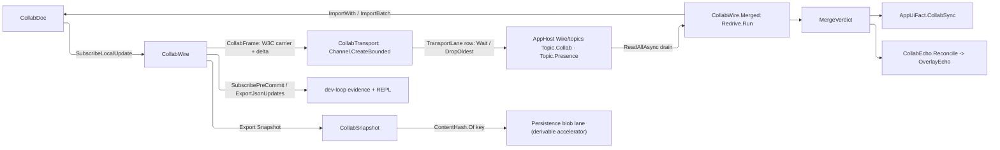
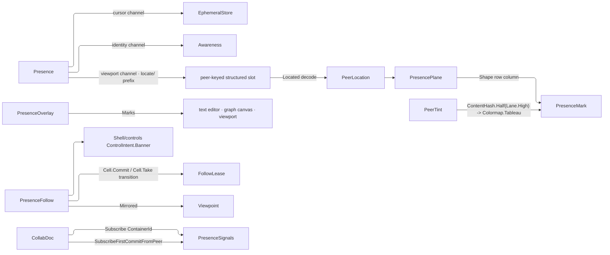

# [APPUI_COLLAB_PRESENCE]

Everything a co-edit session broadcasts and nothing it persists. `CollabWire` frames each local `LoroDoc` delta with its W3C carrier and hands it to a bounded `Channel<CollabFrame>` whose lane row carries its own back-pressure posture, so a durable delta waits for capacity and an awareness frame sheds oldest-first; the inbound leg imports one frame or a reconnect burst, returns the `MergeVerdict`, publishes `AppUiFact.CollabSync`, and re-drives a merge whose dependency span has not arrived. `Presence` owns text carets, awareness identity, and viewport state as three TTL-expiring channels, and `PresenceOverlay` projects the viewport channel onto per-plane marks under an ungated follow lease. Every foreign callback on this page collapses through the ONE `Diagnostics/devloop#HOST_SINK` `HostSink`. The merge authority, the addressing vocabulary, and the `CollabFault` family are `Collab/sync.md`; the historical views are `Collab/compare.md`. Nothing declared here reaches durable truth.

## [01]-[INDEX]

- [02]-[LIVE_WIRE]: Bounded-channel delta transport carrying the W3C wire context and its own carrier bodies; single-or-batch import sealed on the originating correlation; the merge verdict and its re-drive; the pre-commit forensics tap and readable op-window export; the snapshot accelerator.
- [03]-[PRESENCE]: Caret, awareness, and spatial viewport state over three ephemeral channels; encoding-honest anchors; remote application.
- [04]-[PRESENCE_CHROME]: Per-plane overlay marks with replica-stable peer tint; the ungated follow lease; the join signal and container-scoped feeds.

## [02]-[LIVE_WIRE]

- Owner: `CollabWire` the in-session sync path and the pre-commit/JSON forensics owner; `TransportLane` `[SmartEnum<string>]` the two back-pressure postures as channel policy; `CollabTransport` the bounded `Channel<CollabFrame>` per lane; `CollabWireContext` the W3C carrier value, `CollabFrame` the carrier-plus-delta frame, and `CollabCarrier` the frame's own getter/setter bodies over the AppHost propagation spine; `MergeVerdict` the import answer; `CollabEcho<TRow,TKey>` the producer end of the optimistic-overlay acknowledgment vocabulary; `CollabSnapshot` the content-keyed cold-start accelerator; `CollabPoints` the hook-point ids every parked callback fault is attributed under.
- Cases: `TransportLane` = collab | presence — the durable lane waits for capacity because the AppHost outbox redelivers what the fan could not take, the ephemeral lane drops oldest because an awareness frame a slow subscriber missed is lost by design; `MergeVerdict` = Applied | Pending, the pending case carrying the per-peer `CounterSpan` map the import status answered.
- Entry: `public IDisposable Broadcast(CollabTransport transport)` — subscribes each local op-log delta, frames it with the injected W3C carrier, and seats the `CollabFrame` in the lane's channel through a non-blocking `TryWrite`; `public IAsyncEnumerable<CollabFrame> Drain(CancellationToken)` on `CollabTransport` — the consumer-cadence read every transport binding takes; `public IO<MergeVerdict> Merge(params CollabFrame[] frames)` — imports one framed delta through `ImportWith` or a reconnect burst through `ImportBatch`, writes the settled instruments, publishes the AppUi sync fact, and returns the verdict; `public IO<MergeVerdict> Merged(RedrivePolicy redrive, params CollabFrame[] frames)` — the re-driving twin a live subscriber composes; `public IDisposable TapPreCommit(Func<PreCommitFact, IO<Unit>> sink)` — the pre-commit forensics tap producing the dev-loop `PreCommitFact`; `public Fin<string> ExportJson(VersionVector from, VersionVector to)` — the readable op-window export.
- Auto: `SubscribeLocalUpdate` yields each local delta `byte[]` so the only outbound path is the lane channel and the only inbound path is the one `Merge` entrypoint, and the document is the merge authority so the path holds NO custom merge logic; each outbound delta frames through the W3C setter so `traceparent`, `tracestate`, baggage, and promoted `TenantContext.TenantSlot` metadata ride beside the delta, while the inbound transport continues that context before calling merge; a peer joining an ACTIVE session requests `ExportMode.Updates(VersionVector)` against its last-seen frontier FROM A LIVE PEER — session-ephemeral wire, never persisted; the `ImportStatus` carries the success spans and the pending spans so a delta whose dependency is missing surfaces the peers it waits on rather than a bare count; `SubscribePreCommit` surfaces each pending commit as a `PreCommitFact` for the dev-loop event stream and `ExportJsonUpdates` renders any version window as readable JSON, so a merge dispute reads as an inspectable operation log without a second collab surface; the live delta rides the AppHost bus/topics law — the `Rasm.AppHost/Wire/topics#TOPIC_FABRIC` `Topic.Collab` row carries framed deltas as opaque `DomainEvent` payload rows under the `Durable` durability arm, while presence frames ride the `Topic.Presence` row under the `Ephemeral` arm, and the two `TransportLane` rows carry exactly those two postures as channel policy this side of the boundary.
- Packages: LoroCs, Rasm (project — `FaultCell`, `HookId`, `RedrivePolicy`, `Redrive`, `InstrumentSpec`, `ContentHash`), Rasm.AppHost (project, boundary types), BCL inbox (`System.Threading.Channels`), Thinktecture.Runtime.Extensions, LanguageExt.Core, NodaTime
- Growth: one sync instrument is one `InstrumentSpec` row on `CollabWire`; a new wire-context field is one carrier key the spine already writes; a new back-pressure posture is one `TransportLane` row carrying its capacity and full mode; a new transport for these frames is one `Topic` row at its AppHost owner, never a second carrier here; a new forensics verb is one member on this owner; a new optimistically-overlaid plane is one `CollabEcho` decoder binding, never a second acknowledgment shape; zero new surface.
- Boundary:
  - Session deltas are IN-SESSION wire only — `SubscribeLocalUpdate` -> frame -> lane and `Merge` -> import within one epoch; a central merge server is the deleted form; Loro bytes crossing durable truth on either path is the deleted form.
  - The producer/consumer boundary is a BOUNDED CHANNEL, never a callback that runs a subscriber's projection: `SubscribeLocalUpdate` fires on the engine's own Rust callback thread, so a projection invoked there holds the publish frame open for its whole duration and a slow fan back-pressures the document itself. `TryWrite` seats the frame and returns, the consumer drains `ReadAllAsync` at its own cadence, and the lane's `BoundedChannelFullMode` IS the durability posture as a value — a prose note beside a topic name that no code reads is the form this replaces.
  - Shedding is COUNTED, never silent: the ephemeral lane binds the channel's own `itemDropped` observer, so an awareness frame evicted at capacity parks on the fault cell as an attributed number rather than vanishing, and a `TryWrite` refusal on the waiting lane means the channel is COMPLETE — a distinct fact from a full one, which is why the two arms carry different details.
  - Propagation MECHANICS belong to AppHost `TraceContext` and the frame's CARRIER BODIES belong here: the spine's `Inject<TCarrier>`/`Extract<TCarrier>`/`Continue<TCarrier>` take any getter/setter delegate pair, and a domain carrier's concrete pair seats beside its consuming egress leg — the seating the NATS carrier takes at its egress owner, while the CloudEvents pair seats at `Rasm/Domain/event#ENVELOPE_MINT` because one kernel owner holds that whole attribute space — so `CollabCarrier` binds the pair over `CollabWireContext` here, and a collab adapter row inside `telemetry.md` is the rejected form. `CollabCarrier` is taken DIRECTLY: a delegate column whose only binding is a static declared on the same page is a forwarding shell, and the session fallback correlation the closure existed to capture rides the extract call's own argument.
  - The inbound leg is the ADOPTING one: a collab frame is an intra-app carrier whose tenancy this app already admitted, so `Continue` names `TenantAdoption.Adopted` and the extracted entry SEATS into the kernel slot rather than clearing — a refusing row here would tag every remote merge with a tenant the metric fold and every RLS predicate answer root for. Page-local propagators, a `traceparent` parse, or the false claim that `CommitWith(CommitOptions)` carries W3C context is the deleted form.
  - A pending merge is TRANSIENT and RE-DRIVES, never a terminal refusal: the pending spans name the peers whose deltas have not arrived, the same bytes re-import idempotently once one does, and `CollabFault.EpochMismatch` carries the `Retriability.Transient` column the kernel executor reads — so `Merged` is `Redrive.Run` over the declared `RedrivePolicy` and the exhausted bound abandons with the spans still named. Each pass publishes the actual verdict before the redrive decision.
  - The verdict is the ANSWER; `AppUiFact.CollabSync` derives its applied flag and pending count from that same value, so the boolean and count cannot disagree.
  - Pre-commit tapping OBSERVES — the `ChangeModifier` on `PreCommitCallbackPayload` is left untouched, so forensics never rewrites a pending commit's message or timestamp; `ExportJsonUpdates` is a READ producing cross-implementation JSON for debugging, never a durable wire — the durable stream stays the `EditIntent` union.
  - `CollabSnapshot` is the ONLY surviving durable Loro artifact: the `Export(Snapshot)` blob crosses the Persistence blob lane as a content-keyed cold-start ACCELERATOR — its key composes the kernel `ContentHash.Of` one-hasher entry, it is derivable, deletable, and verified reconstructible from the op-log alone, and it is NEVER system-of-record; the cold-load acceptance holds with the blob deleted. `ExportShallowSnapshot(Frontiers)` is the gc-trimmed variant under the same charter.
  - Corrupt imported streams fold to `CollabFault.DecodeCorrupt` and a cross-epoch import folds to `CollabFault.EpochMismatch` through the one `CollabDoc.Lift` fold at the merge boundary.
  - Optimistic acknowledgment has ONE producer and it lives HERE, at the authority that owns both values: an `EventTriggerKind.Import` diff carries converged VALUES and projects onto `OverlayEcho.Converged`, while the returned `MergeVerdict` joins the outstanding `OverlayTicket` onto `Acked` or `Refused` through its total `Switch`; a consumer folding a pending row against a timer, an assumed success, or a `Local`/`Checkout` diff is the deleted form — a local diff is this session's own echo and a checkout diff is a historical read state that owes the live state nothing.
  - Every foreign callback on this page is ONE `HostSink` collapse under its own `CollabPoints` id: the payload projection composes into the fault route before its single `Run`, so a refused handoff parks on the composition-minted kernel `FaultCell` as a counted, point-attributed number. Six hand `Func<Error, IO<Unit>>` columns and six re-spelled `@catch`-then-`Run` bodies delete onto it.

```csharp
// --- [TYPES] ---------------------------------------------------------------------------
[SmartEnum<string>]
[KeyMemberEqualityComparer<ComparerAccessors.StringOrdinal, string>]
public sealed partial class TransportLane {
    public static readonly TransportLane Durable = new("collab", capacity: 1024, BoundedChannelFullMode.Wait);
    public static readonly TransportLane Ephemeral = new("presence", capacity: 64, BoundedChannelFullMode.DropOldest);

    public int Capacity { get; }
    public BoundedChannelFullMode Full { get; }

    public Channel<CollabFrame> Open(Action<CollabFrame> shed) =>
        Channel.CreateBounded(
            new BoundedChannelOptions(Capacity) {
                FullMode = Full,
                SingleWriter = true,
                SingleReader = false,
                AllowSynchronousContinuations = false,
            },
            shed);
}

public static class CollabPoints {
    public static readonly HookId Wire = HookId.Create(value: "rasm.appui.collab.wire");
    public static readonly HookId Presence = HookId.Create(value: "rasm.appui.collab.presence");
    public static readonly HookId Signals = HookId.Create(value: "rasm.appui.collab.signals");
}

[Union(ConversionFromValue = ConversionOperatorsGeneration.None)]
public abstract partial record MergeVerdict {
    private MergeVerdict() { }

    public sealed record Applied : MergeVerdict;
    public sealed record Pending(HashMap<ulong, CounterSpan> Spans) : MergeVerdict;

    public HashMap<ulong, CounterSpan> Spans =>
        Switch(applied: static _ => HashMap<ulong, CounterSpan>(), pending: static row => row.Spans);

    public static MergeVerdict Of(ImportStatus status) =>
        Optional(status.Pending)
            .Map(static pending => toHashMap(toSeq(pending).Map(static entry => (entry.Key, entry.Value))))
            .Filter(static spans => !spans.IsEmpty)
            .Match(Some: static spans => (MergeVerdict)new Pending(spans), None: static () => new Applied());
}

// --- [MODELS] --------------------------------------------------------------------------
public readonly record struct CollabSnapshot(string Key, UInt128 ContentKey, long Bytes, ReadOnlyMemory<byte> Blob) {
    public static CollabSnapshot Of(DocumentKey key, ReadOnlyMemory<byte> blob) =>
        new(key.Value, ContentHash.Of(blob.Span), blob.Length, blob);
}

public sealed record CollabWireContext(Map<string, string> Carrier) {
    public static readonly CollabWireContext Empty = new(Map<string, string>.Empty);

    public Option<string> Get(string key) => Carrier.Find(key);
    public CollabWireContext With(string key, string value) => this with { Carrier = Carrier.AddOrUpdate(key, value) };
}

public readonly record struct CollabFrame(CollabWireContext Context, ReadOnlyMemory<byte> Delta);

// --- [SERVICES] ------------------------------------------------------------------------
public sealed record CollabTransport(TransportLane Lane, Channel<CollabFrame> Frames, HostSink Sink) {
    public static CollabTransport Of(TransportLane lane, HostSink sink) =>
        new(lane, lane.Open(_ => ignore(sink.Faults.Park(sink.Point, new CollabFault.Detached($"{lane.Key}: frame shed at capacity")))), sink);

    public Unit Publish(CollabFrame frame) =>
        Frames.Writer.TryWrite(frame)
            ? unit
            : ignore(Sink.Faults.Park(Sink.Point, new CollabFault.Detached($"{Lane.Key}: transport closed")));

    public IAsyncEnumerable<CollabFrame> Drain(CancellationToken stopping = default) => Frames.Reader.ReadAllAsync(stopping);

    public Unit Close() => ignore(Frames.Writer.TryComplete());
}

public static class CollabCarrier {
    public static CollabWireContext Inject() =>
        new(toMap(toSeq(TraceContext.Inject(
                new Dictionary<string, string>(StringComparer.Ordinal),
                static (cell, key, value) => cell[key] = value))
            .Map(static entry => (entry.Key, entry.Value))));

    public static IDisposable Continue(ActivitySource source, CollabFrame frame, string name) =>
        TraceContext.Continue(source, frame.Context, Read, name, TenantAdoption.Adopted, ActivityKind.Consumer);

    static IEnumerable<string> Read(CollabWireContext carrier, string key) => carrier.Get(key).ToSeq();
}

public sealed record CollabWire(
    CollabDoc Document,
    SessionEpoch Epoch,
    InstrumentSet Signals,
    HookSet<AppUiPoint, AppUiFact, TelemetrySource> Hooks,
    Op Key,
    HostSink Sink) {

    public static readonly InstrumentSpec Applied = InstrumentSpec.Create(
        "rasm.appui.collab.merge.applied", InstrumentKind.Count, MeasureForm.Whole, "{merge}",
        "collab merges applied by document", Seq(AppUiTelemetry.DocSlot), None, None, None);
    public static readonly InstrumentSpec Rejected = InstrumentSpec.Create(
        "rasm.appui.collab.merge.rejected", InstrumentKind.Count, MeasureForm.Whole, "{merge}",
        "collab merges rejected by document", Seq(AppUiTelemetry.DocSlot), None, None, None);
    public static readonly InstrumentSpec Deltas = InstrumentSpec.Create(
        "rasm.appui.collab.sync.deltas", InstrumentKind.Count, MeasureForm.Whole, "{delta}",
        "collab deltas imported by document", Seq(AppUiTelemetry.DocSlot), None, None, None);
    public static readonly InstrumentSpec Size = InstrumentSpec.Create(
        "rasm.appui.collab.sync.size", InstrumentKind.Count, MeasureForm.Whole, "By",
        "collab delta payload size imported by document", Seq(AppUiTelemetry.DocSlot), None, None, None);
    public static readonly InstrumentSpec Pending = InstrumentSpec.Create(
        "rasm.appui.collab.pending", InstrumentKind.Levels, MeasureForm.Whole, "{span}",
        "pending collab spans awaiting merge by document", Seq<string>(), None, Some(AppUiTelemetry.DocSlot), None);

    public static TelemetryContributorPort TelemetryRow(string version) =>
        AppUiTelemetry.Contribute(version, Applied, Rejected, Deltas, Size, Pending);

    public IDisposable Broadcast(CollabTransport transport) =>
        Document.Doc.SubscribeLocalUpdate(new LocalSink(Sink,
            delta => IO.lift(() => transport.Publish(new CollabFrame(CollabCarrier.Inject(), delta)))));

    public IO<MergeVerdict> Merge(params CollabFrame[] frames) {
        byte[][] deltas = [.. frames.AsIterable().Map(static frame => frame.Delta.ToArray())];
        long bytes = deltas.AsIterable().Fold(0L, static (sum, delta) => sum + delta.Length);
        var tags = InstrumentSet.Tags((AppUiTelemetry.DocSlot, Document.Key.Value));
        return (from verdict in FinT.lift<IO, MergeVerdict>(Imported(deltas))
                from merge in FinT.lift<IO, Unit>(Signals.Write(
                    verdict is MergeVerdict.Applied ? Applied : Rejected, 1d, tags))
                from delta in FinT.lift<IO, Unit>(Signals.Write(Deltas, deltas.Length, tags))
                from size in FinT.lift<IO, Unit>(Signals.Write(Size, bytes, tags))
                from pending in FinT.lift<IO, Unit>(Signals.Level(Pending, verdict.Spans.Count, Some(Document.Key.Value)))
                from fired in FinT.lift<IO, AppUiFact>(Hooks.Fire(
                    at: AppUiPoint.CollabSync,
                    fact: new AppUiFact.CollabSync(
                        Document.Key.Value,
                        (uint)deltas.Length,
                        (ulong)bytes,
                        (uint)verdict.Spans.Count,
                        verdict is MergeVerdict.Applied),
                    key: Key))
                select verdict).runFin.As().Bind(static result => result.Match(
                    Succ: IO.pure,
                    Fail: IO.fail<MergeVerdict>));
    }

    public IO<MergeVerdict> Merged(RedrivePolicy redrive, params CollabFrame[] frames) =>
        Redrive.Run(redrive, Merge(frames).Bind(verdict => verdict.Switch(
            applied: _ => IO.pure(verdict),
            pending: row => IO.fail<MergeVerdict>(
                new CollabFault.EpochMismatch(new KernelFault.InvalidValue(
                    "collaboration epoch", $"{Document.Key.Value} has {row.Spans.Count} outstanding span(s)"))))));

    private Fin<MergeVerdict> Imported(byte[][] deltas) => deltas switch {
        [] => Fin.Fail<MergeVerdict>(new CollabFault.Detached("live merge requires at least one framed delta")),
        [var single] => CollabDoc.Lift(() => Document.Doc.ImportWith(single, Epoch.Epoch.ToString("N")))
            .Map(MergeVerdict.Of),
        _ => CollabDoc.Lift(() => Document.Doc.ImportBatch(deltas)).Map(MergeVerdict.Of),
    };

    public IDisposable TapPreCommit(Func<PreCommitFact, IO<Unit>> sink) =>
        Document.Doc.SubscribePreCommit(new PreCommitSink(Document.Key, Sink, sink));

    public Fin<string> ExportJson(VersionVector from, VersionVector to) =>
        CollabDoc.Lift(() => Document.Doc.ExportJsonUpdates(from, to));

    public CollabSnapshot Accelerator(Option<Frontiers> shallowCut = default) =>
        CollabSnapshot.Of(Document.Key, shallowCut.Match(
            Some: cut => Document.Doc.ExportShallowSnapshot(cut),
            None: () => Document.Doc.Export(new ExportMode.Snapshot())));

    public byte[] SessionStateFor(VersionVector peerFrontier) =>
        Document.Doc.Export(new ExportMode.Updates(peerFrontier));

    private sealed record LocalSink(HostSink Sink, Func<ReadOnlyMemory<byte>, IO<Unit>> Body) : LocalUpdateCallback {
        public void OnLocalUpdate(byte[] update) => ignore(Sink.Collapse(Body(update)));
    }

    private sealed record PreCommitSink(DocumentKey Document, HostSink Sink, Func<PreCommitFact, IO<Unit>> Body) : PreCommitCallback {
        public void OnPreCommit(PreCommitCallbackPayload payload) =>
            ignore(Custody.Bracket(() => {
                ChangeMeta meta = payload.ChangeMeta;
                return Fin.Succ(Sink.Collapse(Body(new PreCommitFact(
                    Document.Value, meta.Lamport, Optional(meta.Message), meta.Len, payload.Origin))));
            }, payload));
    }
}

public sealed record CollabEcho<TRow, TKey>(
    CollabDoc Document,
    Func<ContainerDiff, Option<(TKey Key, TRow Value)>> Decode,
    HostSink Sink)
    where TRow : notnull where TKey : notnull {

    public Seq<OverlayEcho<TRow, TKey>> Imported(DiffEvent diff) =>
        diff.TriggeredBy == EventTriggerKind.Import
            ? toSeq(diff.Events).Choose(Decode)
                .Map(static row => (OverlayEcho<TRow, TKey>)new OverlayEcho<TRow, TKey>.Converged(row.Key, row.Value))
            : Seq<OverlayEcho<TRow, TKey>>();

    public OverlayEcho<TRow, TKey> Reconcile(OverlayTicket<TKey> ticket, MergeVerdict verdict) =>
        verdict.Switch(
            applied: _ => (OverlayEcho<TRow, TKey>)new OverlayEcho<TRow, TKey>.Acked(ticket.Key, ticket.Revision),
            pending: row => new OverlayEcho<TRow, TKey>.Refused(ticket.Key, ticket.Revision,
                new CollabFault.EpochMismatch(new KernelFault.InvalidValue(
                    "collaboration epoch", $"{Document.Key.Value} has {row.Spans.Count} pending span(s) at merge"))));

    public Unit Settled(OverlayLedger<TRow, TKey> ledger, OverlayTicket<TKey> ticket, MergeVerdict verdict) =>
        ledger.Reconcile(Reconcile(ticket, verdict));

    public Fin<Subscription> Bind(OverlayLedger<TRow, TKey> ledger) => Document.Changes(new EchoSink(this, ledger, Sink));

    private sealed record EchoSink(CollabEcho<TRow, TKey> Owner, OverlayLedger<TRow, TKey> Ledger, HostSink Sink) : Subscriber {
        public void OnDiff(DiffEvent diff) =>
            ignore(Custody.Bracket(
                () => Fin.Succ(Sink.Collapse(IO.lift(() => Owner.Imported(diff).Iter(echo => ignore(Ledger.Reconcile(echo)))))),
                diff));
    }
}
```



## [03]-[PRESENCE]

- Owner: `Presence` the caret, identity, and spatial-state owner holding three channel handles; `PresenceKind` `[SmartEnum<string>]` the CHANNEL axis every ingress dispatch reads; `CollabCursor` the position that survives concurrent edits; `PresenceDelta` the remote-application result.
- Cases: `PresenceKind` = cursor | awareness | viewport under the locked kind literals — `cursor` is the TTL-expiring caret/selection channel through `EphemeralStore`, `awareness` is the per-peer user/color identity through `Awareness`, and `viewport` carries camera, selection, section, presenter playhead, and review-location state through its own `EphemeralStore`; every mode has an owned transport and lifecycle path on this one owner.
- Entry: `public static Presence Open(CollabDoc document, ulong peer, long timeoutMs)` — mints all three channel handles under one TTL; `public Fin<CollabCursor> Anchor(CollabHandle handle, uint position, PosType source, Side side)` — anchors a stable cursor through the addressed kind's own `Anchored` row column, which converts the editor's declared index space via `ConvertPos(position, source, PosType.Unicode)` BEFORE `GetCursor` so a caret after a supplementary-plane character resolves identically in the editor and in loro; `public Fin<PresenceDelta> ApplyRemote(PresenceKind kind, ReadOnlyMemory<byte> update)` — applies a remote peer's presence bytes onto the kind-selected channel; `public Fin<byte[]> Identity(LoroVal state)` and `PublishViewport` encode the identity and spatial channels for transport.
- Auto: a remote caret/selection publishes through `EphemeralStore` (TTL-expiring) and never enters durable truth, so a stale caret evicts on `RemoveOutdated` rather than persisting; the cursor anchors through `GetCursor(pos, Side)` so it survives concurrent edits, and the rendered caret reads back through `Locate` — `GetCursorPos(cursor)` returning the `PosQueryResult` whose `Current` is the `AbsolutePosition` record carrying the post-merge position, a gc'd anchor (`CannotFindRelativePosition`) folding to `None` rather than a throw; `Awareness` carries the per-peer user/color identity on its own channel and `Roster` sweeps it before reading; the viewport store carries structured spatial values without overloading cursor keys, and the tour presenter-follow arm (`Collab/tour.md`) rides this channel keyed by publishing peer, so the presenter a follower samples is the one the durable register admitted; all three channels encode to `byte[]` on the separate ephemeral topic, so presence and data never mix.
- Packages: LoroCs, Rasm (project — `Custody`), Thinktecture.Runtime.Extensions, LanguageExt.Core
- Growth: a new presence channel is one `PresenceKind` row and its `ApplyRemote` arm; a new presence field is one ephemeral key or one awareness-state column; zero new surface.
- Boundary:
  - Presence rides three ephemeral channels beside the data, never durable truth — a caret or viewport stored durably is the deleted form, so `EphemeralStore`/`Awareness` are the presence owners and the durable stream carries only edit intents; a cursor-only surface presented as full presence is rejected because identity and spatial state have distinct channels.
  - `PresenceKind` closes the CHANNEL axis and `[04]`'s `PresencePlane` closes the SURFACE axis: both spell `viewport`, and they are not the same word — a channel is a transport with its own store and TTL, a plane is what a mark is drawn on. The two rosters meet on ONE `EphemeralStore`, which is why every overlay slot on that store carries `PresenceOverlay.LocatePrefix` and the tour's playhead carries its own: the prefix, not the vocabulary, separates two writers on one channel, and dropping it would let a plane key and a channel key collide on a store neither owns alone.
  - The anchor boundary carries the source index encoding, and a raw UI offset passed to `GetCursor` is rejected; anchoring capability is the container axis's own row column, so a structural type ladder over container handles — whose default arm swallows a newly admitted kind — is the rejected form.
  - Liveness is the channel's own answer through its own sweep, never a stored flag: both store reads and `Awareness.GetAllStates` KEEP a lapsed entry until `RemoveOutdated` evicts it (`.api/api-loro.md` `[EXPIRY]`), so every read here sweeps first. The two sweeps differ in shape — the store's returns void and the awareness one answers the evicted peer ids — which is why the roster read discards a returned array and the apply arms do not.
  - All three channel handles are Rust-pointer wrappers the owner disposes; `PosQueryResult` is itself a disposable pair, scoped inside `Locate` through the kernel bracket so a read fault and a release fault aggregate rather than one hiding the other.

```csharp
// --- [TYPES] ---------------------------------------------------------------------------
[SmartEnum<string>]
[KeyMemberEqualityComparer<ComparerAccessors.StringOrdinal, string>]
[KeyMemberComparer<ComparerAccessors.StringOrdinal, string>]
public sealed partial class PresenceKind {
    public static readonly PresenceKind Cursor = new("cursor");
    public static readonly PresenceKind Awareness = new("awareness");
    public static readonly PresenceKind Viewport = new("viewport");
}

// --- [MODELS] --------------------------------------------------------------------------
public readonly record struct PresenceDelta(PresenceKind Kind, int Peers);

public sealed record CollabCursor(Cursor Anchor, PosType Encoding) : IDisposable {
    public void Dispose() => Anchor.Dispose();
}

// --- [SERVICES] ------------------------------------------------------------------------
public sealed class Presence(CollabDoc document, ulong peer, EphemeralStore cursors, Awareness peers, EphemeralStore viewport) : IDisposable {
    public CollabDoc Document { get; } = document;
    public ulong Peer { get; } = peer;
    public EphemeralStore Cursors { get; } = cursors;
    public Awareness Peers { get; } = peers;
    public EphemeralStore Viewport { get; } = viewport;

    public static Presence Open(CollabDoc document, ulong peer, long timeoutMs) =>
        new(document, peer, new EphemeralStore(timeoutMs), new Awareness(peer, timeoutMs), new EphemeralStore(timeoutMs));

    public Fin<CollabCursor> Anchor(CollabHandle handle, uint position, PosType source, Side side) =>
        handle.Address.Kind.Anchored(handle, position, source, side)
            .Map(static cursor => new CollabCursor(cursor, PosType.Unicode));

    public Option<(uint Pos, Side Side)> Locate(CollabCursor cursor) =>
        CollabDoc.Lift(() => Document.Doc.GetCursorPos(cursor.Anchor))
            .Bind(static at => Custody.Bracket(() => Fin.Succ((at.Current.Pos, at.Current.Side)), at))
            .ToOption();

    public IDisposable Publish(HostSink sink, Func<ReadOnlyMemory<byte>, IO<Unit>> body) =>
        Cursors.SubscribeLocalUpdate(new EphemeralSink(Cursors, sink, body));

    public Fin<byte[]> Identity(LoroVal state) =>
        CollabDoc.Lift(() => { Peers.SetLocalState(state); return Peers.Encode([Peer]); });

    public Fin<PresenceDelta> ApplyRemote(PresenceKind kind, ReadOnlyMemory<byte> update) =>
        kind.Switch(
            state: (Self: this, Update: update),
            cursor: static state => CollabDoc.Lift(() => {
                state.Self.Cursors.Apply(state.Update.ToArray());
                state.Self.Cursors.RemoveOutdated();
                return new PresenceDelta(PresenceKind.Cursor, state.Self.Cursors.Keys().Length);
            }),
            awareness: static state => CollabDoc.Lift(() => {
                AwarenessPeerUpdate changed = state.Self.Peers.Apply(state.Update.ToArray());
                return new PresenceDelta(PresenceKind.Awareness, changed.Updated.Length + changed.Added.Length);
            }),
            viewport: static state => CollabDoc.Lift(() => {
                state.Self.Viewport.Apply(state.Update.ToArray());
                state.Self.Viewport.RemoveOutdated();
                return new PresenceDelta(PresenceKind.Viewport, state.Self.Viewport.Keys().Length);
            }));

    public IDisposable BroadcastViewport(HostSink sink, Func<ReadOnlyMemory<byte>, IO<Unit>> body) =>
        Viewport.SubscribeLocalUpdate(new EphemeralSink(Viewport, sink, body));

    public Fin<byte[]> PublishViewport(string key, LoroVal state) =>
        CollabDoc.Lift(() => { Viewport.Set(key, state); return Viewport.Encode(key); });

    public HashMap<ulong, LoroValue> Roster() {
        ignore(Peers.RemoveOutdated());
        return toHashMap(Peers.GetAllStates().AsIterable().Map(static entry => (entry.Key, entry.Value.State)));
    }

    private sealed record EphemeralSink(EphemeralStore Store, HostSink Sink, Func<ReadOnlyMemory<byte>, IO<Unit>> Body) : LocalEphemeralListener {
        public void OnEphemeralUpdate(byte[] update) {
            Store.RemoveOutdated();
            ignore(Sink.Collapse(Body(update)));
        }
    }

    public void Dispose() { Cursors.Dispose(); Peers.Dispose(); Viewport.Dispose(); }
}
```

## [04]-[PRESENCE_CHROME]

- Owner: `PresencePlane` `[SmartEnum<string>]` the co-edited SURFACE axis whose rows carry their own overlay projection; `PeerTint` the replica-stable per-peer colour; `PeerLocation` the decoded per-peer slot; `PresenceMark` `[Union]` the overlay row family; `PresenceOverlay` the publish-and-project owner over the viewport channel; `PresenceFollow` the ad-hoc follow lease; `PresenceSignals` the join subscription and the container-scoped activity feed.
- Cases: `PresencePlane` = text | graph | viewport under the locked plane literals, each row carrying the mark its plane renders; `PresenceMark` = Caret | Halo | Frustum — the remote text caret at its post-merge position, the remote node-selection halo over element keys, and the remote viewport frustum from the peer's own camera.
- Entry: `public Fin<byte[]> Publish(PresencePlane plane, Option<Viewpoint> view, Option<CollabCursor> caret)` — the local peer's ONE structured slot on its own peer-keyed viewport hop; `public Fin<Seq<PresenceMark>> Marks(PresencePlane plane)` — the post-sweep projection of every live REMOTE peer onto the plane's own mark row, the ONE read a plane surface binds; `public Fin<Subscription> Joined(Func<ulong, IO<Unit>> arrived)` on `PresenceSignals` — the join signal off the document store's own first-commit-from-peer subscription; `public Fin<Subscription> Scoped(CollabAddress address, Func<DiffEvent, IO<Unit>> changed)` — the container-scoped activity feed; `public Transition<Option<FollowLease>> Follow(ulong peer)` / `Release()` and `public Unit Intercept(CommandRow intent)` on `PresenceFollow`.
- Auto: presence becomes VISIBLE without becoming authority — the overlay reads the three landed channels and mints nothing durable, so a caret, a halo, and a frustum all expire with their peer's TTL; the caret transports the loro `Cursor`'s OWN encoded bytes and re-anchors on the receiving replica through `GetCursorPos`, so a remote caret sits at its post-merge position rather than at an index the receiver's document never held, and a garbage-collected anchor renders nothing instead of a caret at the wrong glyph; the halo and the frustum both read the peer's published `Viewpoint`, so one portable view value carries camera, section, and selection and presence mints no second camera or selection shape; the tint is a pure function of the peer identity through the kernel one-hasher onto the qualitative colormap, so every replica paints peer N identically and a join never repaints the board; follow is ad-hoc and UNGATED because presence is display by settled ruling, and the lease breaks on any local viewport intent rather than on a camera-delta threshold; the join signal rides `SubscribeFirstCommitFromPeer`, so a peer becomes visible on its first durable act rather than on a polled roster diff, and a scoped activity feed rides `Subscribe(ContainerId, Subscriber)` against a resolved `CollabAddress`, so a per-issue or per-cell feed is a SUBSCRIPTION over that level and client-side filtering of the root feed is the deleted form.
- Packages: LoroCs, Rasm (project — `ContentHash`, `Lane`, `Cell`/`Transition`, `Custody`), Thinktecture.Runtime.Extensions, LanguageExt.Core, NodaTime
- Growth: a new co-edited plane is one `PresencePlane` row carrying its mark projection; a new overlay shape is one `PresenceMark` case with its row arm; a new published field is one `CollabColumn` row inside the structured slot; zero new surface, zero new channel.
- Boundary:
  - Every mark PROJECTS the landed channels and none is stored — a presence value written durably, a follow state persisted, or a roster flag kept beside the channel are the three deleted forms; the slot is PEER-QUALIFIED under its own key prefix on the viewport channel exactly as the review tour's playhead is, so two publishing peers occupy two slots and last-write-wins across peers is structurally unreachable.
  - The local peer's own slot is excluded from the projection, because rendering a caret at the user's own cursor duplicates the one the editor already draws; liveness is the channel's own answer through its own sweep, so `Marks` sweeps before it reads and a lapsed peer contributes no mark.
  - The mark shape is the PLANE ROW's answer, so a structural ladder over the decoded slot — whose default arm would swallow a newly admitted plane — is the rejected form. `Marks` is the ONE read every plane surface binds: the text editor, the graph canvas, and the viewport each ask this owner for their own plane's marks rather than each decoding the slot themselves.
  - Serialization crosses the package's ONE options owner — `Diagnostics/evidence#EVIDENCE_UNION` `EvidenceOps.Wire`, the composition-seated merged suite — so no member here takes a `JsonSerializerOptions` parameter. A codec knob threaded through four signatures is a value the codec owner already holds, and threading it let one publisher encode under a different resolver than the reader that decodes it.
  - The tint quantizes at the ONE colour edge the package already declares: `Theme/tokens#COLORMAP_CATALOG` `Colormap.Sample` admits through the tokens page's perceptual edge and answers the host carrier, so this owner composes that sampler and performs no colour arithmetic of its own. The unit projection folds the digest by its own width through the kernel `ContentHash.Half` lane row, so the projection carries no modulus and no consumer spells the shift.
  - Follow is display and NEVER authority: it takes no capability read, grants nothing, and a follow arm gated on a role would be asserting that watching a published camera is a privilege the ruling already denies. The lease TRANSITION is the answer — a follow that lost the seat to a concurrent request and a follow that landed are different facts, and a swap whose verdict is discarded reports success to both. The follow banner materializes as one `Shell/controls#CONTROL_INTENT` `ControlIntent.Banner`, so the persistent who-am-I-following condition takes the banner family every persistent condition takes.
  - The break is on the INTENT, never on a camera delta: a followed camera moves the local camera on every frame, so a positional threshold cannot separate the user's own nudge from the target's travel and would either break on the target's motion or never break at all.

```csharp
// --- [TYPES] ---------------------------------------------------------------------------
[SmartEnum<string>]
[KeyMemberEqualityComparer<ComparerAccessors.StringOrdinal, string>]
[KeyMemberComparer<ComparerAccessors.StringOrdinal, string>]
public sealed partial class PresencePlane {
    public static readonly PresencePlane Text = new("text", Carets);
    public static readonly PresencePlane Graph = new("graph", Halos);
    public static readonly PresencePlane Viewport = new("viewport", Frustums);

    [UseDelegateFromConstructor]
    public partial Option<PresenceMark> Shape(Presence presence, PeerLocation at, Color tint);

    private static Option<PresenceMark> Carets(Presence presence, PeerLocation at, Color tint) =>
        at.Anchor
            .Bind(static bytes => CollabDoc.Lift(() => Cursor.Decode(bytes.ToArray())).ToOption())
            .Bind(anchor => Custody.Bracket(
                () => Fin.Succ(presence.Locate(new CollabCursor(anchor, PosType.Unicode))),
                anchor).ToOption().Flatten())
            .Map(seat => (PresenceMark)new PresenceMark.Caret(at.Peer, tint, seat.Pos, seat.Side));

    private static Option<PresenceMark> Halos(Presence presence, PeerLocation at, Color tint) =>
        at.View.Filter(static view => !view.Selection.IsEmpty)
            .Map(view => (PresenceMark)new PresenceMark.Halo(at.Peer, tint, view.Selection));

    private static Option<PresenceMark> Frustums(Presence presence, PeerLocation at, Color tint) =>
        at.View.Map(view => (PresenceMark)new PresenceMark.Frustum(at.Peer, tint, view.Camera));
}

// --- [MODELS] --------------------------------------------------------------------------
public readonly record struct PeerLocation(ulong Peer, PresencePlane Plane, Option<Viewpoint> View, Option<ReadOnlyMemory<byte>> Anchor);

[Union(ConversionFromValue = ConversionOperatorsGeneration.None)]
public abstract partial record PresenceMark(ulong Peer, Color Tint) {
    public sealed record Caret(ulong Peer, Color Tint, uint Position, Side Side) : PresenceMark(Peer, Tint);
    public sealed record Halo(ulong Peer, Color Tint, Seq<string> Elements) : PresenceMark(Peer, Tint);
    public sealed record Frustum(ulong Peer, Color Tint, ViewCamera Camera) : PresenceMark(Peer, Tint);
}

public readonly record struct FollowLease(ulong Target, Instant Since);

// --- [OPERATIONS] ----------------------------------------------------------------------
public static class PeerTint {
    public static Fin<Color> Of(ulong peer) =>
        Colormap.Tableau.Sample(Unit(ContentHash.Of(BitConverter.GetBytes(peer))));

    private static double Unit(UInt128 digest) => (double)ContentHash.Half(digest, Lane.High) / ulong.MaxValue;
}

public sealed record PresenceOverlay(Presence Presence, CollabDoc Document) {
    public const string LocatePrefix = "locate/";

    public static string LocateKey(ulong peer) => $"{LocatePrefix}{peer.ToString(CultureInfo.InvariantCulture)}";

    public Fin<byte[]> Publish(PresencePlane plane, Option<Viewpoint> view, Option<CollabCursor> caret) =>
        Presence.PublishViewport(LocateKey(Presence.Peer), LoroVal.Of([
            (CollabColumn.Identity, LoroVal.Of(Presence.Peer.ToString(CultureInfo.InvariantCulture))),
            (CollabColumn.Plane, LoroVal.Of(plane.Key)),
            .. view.Map(static held => (CollabColumn.Viewpoint, LoroVal.Of(held.Encode()))).ToSeq(),
            .. caret.Map(static held => (CollabColumn.Anchor, LoroVal.Of(held.Anchor.Encode().AsMemory()))).ToSeq()]));

    public Fin<Seq<PresenceMark>> Marks(PresencePlane plane) =>
        CollabDoc.Lift(() => {
            Presence.Viewport.RemoveOutdated();
            return Presence.Viewport.GetAllStates();
        }).Map(states => toSeq(states)
            .Choose(static entry => Located(entry.Key, entry.Value))
            .Filter(at => at.Peer != Presence.Peer && at.Plane == plane)
            .Choose(at => PeerTint.Of(at.Peer).ToOption().Bind(tint => at.Plane.Shape(Presence, at, tint))));

    static Option<PeerLocation> Located(string key, LoroValue state) =>
        key.StartsWith(LocatePrefix, StringComparison.Ordinal)
        && ulong.TryParse(key.AsSpan(LocatePrefix.Length), CultureInfo.InvariantCulture, out ulong peer)
            ? new LoroVal(state) switch {
                var held => held.Field(CollabColumn.Plane, static leaf => leaf.Text)
                    .Bind(static name => PresencePlane.TryGet(name, out PresencePlane? row) ? Some(row) : None)
                    .Map(plane => new PeerLocation(
                        peer, plane,
                        held.Field(CollabColumn.Viewpoint, static leaf => leaf.Text)
                            .Bind(static blob => Viewpoint.Decode(blob).ToOption()),
                        held.Field(CollabColumn.Anchor, static leaf => leaf.Blob))),
            }
            : None;
}

public sealed class PresenceFollow(PresenceOverlay overlay, Atom<Option<FollowLease>> lease, IClock clock) {
    public const string BannerKey = "collab.following";
    public const string ReleaseIntent = "collab.follow.release";
    public const string ViewportPrefix = "viewport.";

    public PresenceOverlay Overlay { get; } = overlay;
    public Atom<Option<FollowLease>> Lease { get; } = lease;

    public Transition<Option<FollowLease>> Follow(ulong peer) =>
        Cell.Commit(Lease, _ => Some(new FollowLease(peer, clock.GetCurrentInstant())), Cell.SwapBudget);

    public Transition<Option<FollowLease>> Release() => Cell.Take(Lease);

    public Unit Intercept(CommandRow intent) =>
        intent.Key.StartsWith(ViewportPrefix, StringComparison.Ordinal) ? ignore(Release()) : unit;

    public Fin<Option<Viewpoint>> Mirrored() =>
        Lease.Value.Match(
            Some: held => CollabDoc.Lift(() => {
                Overlay.Presence.Viewport.RemoveOutdated();
                return Overlay.Presence.Viewport.Get(PresenceOverlay.LocateKey(held.Target));
            }).Map(static slot => Optional(slot).Map(static state => new LoroVal(state))
                .Bind(static leaf => leaf.Field(CollabColumn.Viewpoint, static held => held.Text))
                .Bind(static blob => Viewpoint.Decode(blob).ToOption())),
            None: static () => Fin.Succ(Option<Viewpoint>.None));

    public Option<ControlIntent> Banner() =>
        Lease.Value.Map(static held => (ControlIntent)new ControlIntent.Banner(
            BannerKey, $"{BannerKey}.headline", $"{BannerKey}.body",
            BannerSeverity.Information, BannerPlacement.Section,
            Seq<ControlIntent>(new ControlIntent.Button(
                ReleaseIntent, $"{ReleaseIntent}.label",
                IntentBinding.Of(PaintRole.Accent, ControlEmphasis.Quiet) with { Command = Some(ReleaseIntent) })),
            None,
            IntentBinding.Of(PaintRole.Info)));
}

public sealed record PresenceSignals(CollabDoc Document, HostSink Sink) {
    public Fin<Subscription> Joined(Func<ulong, IO<Unit>> arrived) =>
        CollabDoc.Lift(() => Document.Doc.SubscribeFirstCommitFromPeer(new JoinSink(Sink, arrived)));

    public Fin<Subscription> Scoped(CollabAddress address, Func<DiffEvent, IO<Unit>> changed) =>
        Document.Use<LoroMap, Subscription>(address, level =>
            CollabDoc.Lift(level.Id).Bind(id =>
                Custody.Bracket(() => CollabDoc.Lift(() => Document.Doc.Subscribe(id, new ScopedSink(Sink, changed))), id)));

    private sealed record JoinSink(HostSink Sink, Func<ulong, IO<Unit>> Arrived) : FirstCommitFromPeerCallback {
        public void OnFirstCommitFromPeer(FirstCommitFromPeerPayload payload) => ignore(Sink.Collapse(Arrived(payload.Peer)));
    }

    private sealed record ScopedSink(HostSink Sink, Func<DiffEvent, IO<Unit>> Changed) : Subscriber {
        public void OnDiff(DiffEvent diff) =>
            ignore(Custody.Bracket(() => Fin.Succ(Sink.Collapse(Changed(diff))), diff));
    }
}
```



## [05]-[RESEARCH]

(none)
