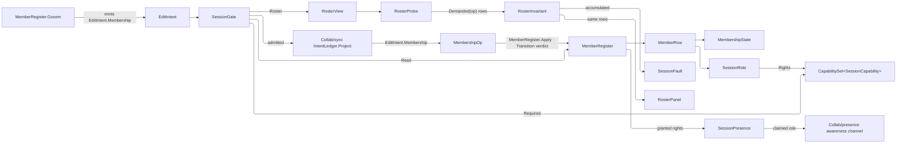

# [APPUI_COLLAB_SESSION]

Session governance is the authority half of collaboration and it is DURABLE: `SessionRole` closes the role axis whose rows carry the `CapabilitySet<SessionCapability>` they grant, `MembershipState` closes the lifecycle axis whose rows answer a prior→next `Transition` verdict and their own authoring refusal, `MembershipOp` closes the invite-join-leave-evict verb family, and `MemberRegister` is the ONE register those verbs write and every read crosses — reached only through `Collab/sync#DURABLE_INTENT`'s `EditIntent.Membership` case on the typed `DocumentKey`, so who may edit is an op-log fact a cold replay reproduces. `SessionGate` folds each intent onto the capability SET it demands and grades it against the actor's register row, binding onto the merge authority's composition-bound `Admit` column so one gate stands ahead of `LedgerAppend` and no page reaches a second authorization surface. `SessionPresence` is a projection over `Collab/presence#PRESENCE`'s landed awareness channel — the role badge is per-peer identity, which is that channel's whole charter — and every decision reads the register while presence carries only the claim a view renders.

Governance also becomes VISIBLE: `SeatCluster` renders the joined register as one avatar cluster the awareness channel decorates, `ActivityNotice` carries its own lifetime and a monotonic mint stamp so a decaying notice needs no timer, `ActivityFeed` seats each notice in a bounded channel a consumer drains at its own cadence, `RosterPanel` reveals each governance verb through the SAME `RosterInvariant` rows the gate grades, and `SyncHealth` folds the staleness projection, the outstanding-intent count, and the render governor's tier into one connection state a footer pane and a banner both read.

Presence is ephemeral and admission is durable: a role never persists in the op-log as presence and a presence value never authorizes. `SessionFault` carries each failure through a direct generated union case, the register columns are `Collab/sync#DOCUMENT_OWNER` `CollabColumn` rows under the `CollabRoot.Members` root keyed by `ContainerKey.Of(peer)`, absence folds through that owner's `Read` twin, and the tenant partition rides the message-envelope `TenantContext` every seal already stamps.

## [01]-[INDEX]

- [02]-[ROLE_VOCABULARY]: The direct generated `SessionFault` union; the `SessionCapability` vocabulary on the kernel capability floor; the `SessionRole` grant rows.
- [03]-[MEMBERSHIP]: `MembershipState` transition verdicts and authoring refusals; the `MembershipOp` verb family; the durable register and its one write law.
- [04]-[ADMISSION_GATE]: The intent-to-capability-set fold; the accumulating register admission; the `RosterInvariant` rows both the gate and the panel grade; the admission instruments.
- [05]-[SESSION_PRESENCE]: The awareness-channel projection; the presenter claim; the granted-versus-claimed seat join.
- [06]-[ENTITY_CHROME]: The TTL-swept avatar cluster; the monotonically decaying activity notice and its deck handoff; the bounded-channel scoped feed.
- [07]-[SESSION_CHROME]: The invariant-revealed roster panel; the unified connection state as pane and banner; the row-declared reconnect law.

## [02]-[ROLE_VOCABULARY]

- Owner: `SessionFault` the direct generated `[Union]` with one `[FaultCase]` leaf per session failure; `SessionCapability` `[SmartEnum<string>]` on the kernel `ICapability` floor — the vocabulary both the grant sets and the intent fold cross; `SessionRole` `[SmartEnum<string>]` the closed role axis whose rows carry their `CapabilitySet<SessionCapability>`.
- Cases: `SessionRole` = observer | presenter | reviewer | owner under the locked key literals; `SessionCapability` = read | comment | author | resolve | present | govern; `[FaultCase]` = Unknown | Unauthorized | Pending | Evicted | RoleUnknown | Conflict | Sole.
- Law: governance RANK and document AUTHORITY are independent axes — rank orders who may govern whom over the roster while the grant set answers what a role may do to the document, so a rank comparison never stands in for a capability read; the grants are deliberately non-monotone in rank, a presenter holding `Present` a higher-ranked reviewer does not.
- Entry: `public CapabilitySet<SessionCapability> Rights { get; }` — the one grant column, whose `Admits`/`AdmitsAll`/`Require`/`Missing` are the kernel reads every gate and every affordance takes; `public static Fin<SessionRole> Of(string key)` — the register-decode ingress a stored key crosses ONCE.
- Auto: capability is ROW DATA, so a role's whole authority is recoverable from its declaration and no consumer re-derives a grant from a name; rank is the kernel floor's declaration-order projection rather than a hand column that drifts the moment a row is inserted; the decode ingress refuses an unspelled key rather than demoting it, so a retired role never silently reads as the least-privileged row.
- Packages: Rasm (project — `FaultBand`, `[FaultCase]`, `Fault`, `ICapability`, `CapabilitySet`), Thinktecture.Runtime.Extensions, LanguageExt.Core
- Growth: a new role is one `SessionRole` row carrying its grant set; a new capability is one `SessionCapability` row plus its appearance in the granting rows and one arm on the intent fold; a new fault is one `[FaultCase]` leaf; zero new surface.
- Boundary: `SessionFault` owns session refusals and `CollabFault` owns merge refusals through separate direct generated unions. The grant column is a `CapabilitySet`, never a `Seq` the caller scans: `Require` carries the MISSING rows into the refusal, so an evidence-free "not authorized" is unspellable. The role axis is closed and generated so a new role breaks the grant declaration at compile time, and a role-shaped string travelling as a bare literal is the rejected form at every level — the register stores the row's `Key` and reads it back through `Of`.

```csharp
// --- [TYPES] ---------------------------------------------------------------------------
[SmartEnum<string>]
[KeyMemberEqualityComparer<ComparerAccessors.StringOrdinal, string>]
[KeyMemberComparer<ComparerAccessors.StringOrdinal, string>]
public sealed partial class SessionCapability : ICapability<SessionCapability> {
    public static readonly SessionCapability Read = new("read");
    public static readonly SessionCapability Comment = new("comment");
    public static readonly SessionCapability Author = new("author");
    public static readonly SessionCapability Resolve = new("resolve");
    public static readonly SessionCapability Present = new("present");
    public static readonly SessionCapability Govern = new("govern");
}

[SmartEnum<string>]
[KeyMemberEqualityComparer<ComparerAccessors.StringOrdinal, string>]
[KeyMemberComparer<ComparerAccessors.StringOrdinal, string>]
public sealed partial class SessionRole : ICapability<SessionRole> {
    public static readonly SessionRole Observer = new("observer",
        CapabilitySet<SessionCapability>.Of(SessionCapability.Read));
    public static readonly SessionRole Presenter = new("presenter",
        CapabilitySet<SessionCapability>.Of(SessionCapability.Read, SessionCapability.Comment, SessionCapability.Present));
    public static readonly SessionRole Reviewer = new("reviewer",
        CapabilitySet<SessionCapability>.Of(
            SessionCapability.Read, SessionCapability.Comment, SessionCapability.Author, SessionCapability.Resolve));
    public static readonly SessionRole Owner = new("owner",
        CapabilitySet<SessionCapability>.Of(
            SessionCapability.Read, SessionCapability.Comment, SessionCapability.Author,
            SessionCapability.Resolve, SessionCapability.Present, SessionCapability.Govern));

    public CapabilitySet<SessionCapability> Rights { get; }

    public static Fin<SessionRole> Of(string key) =>
        TryGet(key, out SessionRole? row) ? Fin.Succ(row) : Fin.Fail<SessionRole>(new SessionFault.RoleUnknown($"session/role:{key}"));
}

// --- [ERRORS] --------------------------------------------------------------------------
[Union(ConversionFromValue = ConversionOperatorsGeneration.None)]
public abstract partial record SessionFault : Fault {
    private static readonly FaultBand FamilyBand = FaultBand.Session;
    private SessionFault(string detail) { Detail = detail; }

    public string Detail { get; }
    public override string Message => Detail;


    [FaultCase(0)]
    public sealed partial record Unknown(string Detail)      : SessionFault(Detail);
    [FaultCase(1)]
    public sealed partial record Unauthorized(string Detail) : SessionFault(Detail);
    [FaultCase(2)]
    public sealed partial record Pending(string Detail)      : SessionFault(Detail);
    [FaultCase(3)]
    public sealed partial record Evicted(string Detail)      : SessionFault(Detail);
    [FaultCase(4)]
    public sealed partial record RoleUnknown(string Detail)  : SessionFault(Detail);
    [FaultCase(5)]
    public sealed partial record Conflict(string Detail)     : SessionFault(Detail);
    [FaultCase(6)]
    public sealed partial record Sole(string Detail)         : SessionFault(Detail);
}
```

## [03]-[MEMBERSHIP]

- Owner: `MembershipState` `[SmartEnum<string>]` the lifecycle axis whose rows answer a kernel `Transition` verdict for a prior AND their own authoring refusal; `MembershipOp` `[Union]` the closed verb family; `MemberRow` the decoded register row; `MemberRegister` the ONE durable register writer and reader.
- Cases: `MembershipState` = absent | invited | joined | left | evicted — `absent` is a ROW, not an `Option`, so the transition fold and the authoring gate are total over one five-row axis and "no register row" states its own refusal instead of a null every caller re-interprets; `MembershipOp` = Invite | Join | Leave | Evict, each carrying exactly its own payload so no arm reads a field a sibling case never populates — `Invite` alone carries the granted role AND the handle, because the inviter is the one who knows who this peer is, and `Evict` alone carries the acting peer.
- Entry: `public static IO<Fin<Unit>> Govern(CollabDoc doc, IntentLedger ledger, MembershipOp op)` — the ONE write INGRESS, the peer of `Collab/issues#ISSUE_REGISTER`'s `Commit`: it mints the verb's `EditIntent.Membership` row on `doc.Key` and commits it through `IntentLedger.Commit` under `GovernOrigin`, durable-first; `public static Fin<Unit> Apply(CollabDoc doc, MembershipOp op)` — the DECODE-side write law, reached only from `Collab/sync#DURABLE_INTENT`'s membership arm; `public static Fin<MemberRow> Read(CollabDoc doc, ulong peer)` — the single-peer authority read; `public static Fin<Seq<MemberRow>> Roster(CollabDoc doc)` — the whole register in one scoped resolve.
- Auto: the write splits into an ingress and a decode arm the way every other collaborative surface's does — `Govern` is the only site that MINTS a membership intent and `Apply` is the only site that WRITES one, so replay drives the identical arm; a re-invite IS the role change, so the `Invited` row accepts every prior state and the family needs no fifth verb whose only difference is the prior; the four write arms share ONE law — the destination state and the stamp are seeded from the arguments the fold already holds and each case contributes only the columns it alone carries, so `Join` and `Leave` differ in nothing but their destination row; each member is one `ContainerKey.Of(peer)`-keyed mergeable map under the `CollabRoot.Members` root, so two governing peers editing different members never collide in one flat key namespace, and the handle column is what makes the roster panel and the mention picker readable; the single-peer read keeps a malformed row as a typed fault because there the row IS the answer, while the roster fold DROPS one, because a governance view failing whole on one bad row hides every sound row beside it.
- Boundary: a membership change is an `EditIntent` on the one durable union; the session plane adds no parallel operation result or event case.
- Packages: LoroCs (via `Collab/sync.md` owners), Rasm (project — `Transition`), Thinktecture.Runtime.Extensions, LanguageExt.Core, NodaTime
- Growth: a new lifecycle state is one `MembershipState` row carrying its reachability predicate and its authoring refusal; a new verb is one `MembershipOp` case whose generated total `Switch` breaks the write law and the capability fold at compile time; a new member column is one `CollabColumn` row both ends read; zero new surface, zero new register.
- Boundary: the register is DURABLE truth on the one edit-intent union — a membership row written directly into the live document, a session store beside the ledger, or a role read off a presence channel are the three deleted forms, because authority a cold replay cannot reproduce vanishes with the session. `Govern` is the register's ONLY write ingress and it carries no gate of its own, because `IntentLedger.Project` folds the composition-bound `Admit` column ahead of `LedgerAppend`; a governance surface calling `Apply` directly is the named deleted form. Every write descends through the `Collab/sync#DOCUMENT_OWNER` scoped `Use` and its mint-then-write nested scope, and every read crosses the same `CollabColumn` rows the write arm crossed. Transition legality lives on the DESTINATION row and ANSWERS a kernel `Transition<MembershipState>` — the refused case carries both the prior state and the cause, so no caller re-derives from a discarded bool; the hand-built `Conflict` beside a `false` is the deleted form. The peer key is the `Collab/sync#DOCUMENT_OWNER` `ContainerKey` mint at every hop, so a page-local `peer.ToString(...)` spelling has no seat. `MemberRow` carries role, actor, and stamp as `Option` because they are the evidence a WRITTEN row holds.

```csharp
// --- [TYPES] ---------------------------------------------------------------------------
[SmartEnum<string>]
[KeyMemberEqualityComparer<ComparerAccessors.StringOrdinal, string>]
[KeyMemberComparer<ComparerAccessors.StringOrdinal, string>]
public sealed partial class MembershipState {
    public static readonly MembershipState Absent = new("absent",
        follows: static _ => false,
        authoring: static detail => Fin<Unit>.Fail(new SessionFault.Unknown(detail)));
    public static readonly MembershipState Invited = new("invited",
        follows: static _ => true,
        authoring: static detail => Fin<Unit>.Fail(new SessionFault.Pending(detail)));
    public static readonly MembershipState Joined = new("joined",
        follows: static prior => prior == Invited,
        authoring: static _ => Fin<Unit>.Succ(unit));
    public static readonly MembershipState Left = new("left",
        follows: static prior => prior == Joined,
        authoring: static detail => Fin<Unit>.Fail(new SessionFault.Unknown(detail)));
    public static readonly MembershipState Evicted = new("evicted",
        follows: static prior => prior == Invited || prior == Joined,
        authoring: static detail => Fin<Unit>.Fail(new SessionFault.Evicted(detail)));

    [UseDelegateFromConstructor]
    public partial bool Follows(MembershipState prior);

    [UseDelegateFromConstructor]
    public partial Fin<Unit> Authoring(string detail);

    public Transition<MembershipState> Enter(MembershipState prior, ContainerKey subject) =>
        Follows(prior)
            ? new Transition<MembershipState>.Committed(this)
            : new Transition<MembershipState>.Refused(prior,
                new SessionFault.Conflict($"session/{subject.Value}: {prior.Key} -> {Key}"));

    public static Fin<MembershipState> Of(string key) =>
        TryGet(key, out MembershipState? row) ? Fin.Succ(row) : Fin.Fail<MembershipState>(new SessionFault.Conflict($"session/state:{key}"));
}

[Union(ConversionFromValue = ConversionOperatorsGeneration.None)]
public abstract partial record MembershipOp {
    private MembershipOp() { }
    public sealed record Invite(ulong Peer, SessionRole Role, string Handle, string By, Instant At) : MembershipOp;
    public sealed record Join(ulong Peer, Instant At) : MembershipOp;
    public sealed record Leave(ulong Peer, Instant At) : MembershipOp;
    public sealed record Evict(ulong Peer, string By, Instant At) : MembershipOp;
}

// --- [MODELS] --------------------------------------------------------------------------
public readonly record struct MemberRow(
    ulong Peer,
    MembershipState State,
    Option<SessionRole> Role,
    Option<string> Handle,
    Option<string> By,
    Option<Instant> At) {
    public static MemberRow Absent(ulong peer) => new(peer, MembershipState.Absent, None, None, None, None);

    public string Label => Handle.IfNone(ContainerKey.Of(Peer).Value);
}

// --- [OPERATIONS] ----------------------------------------------------------------------
public static class MemberRegister {
    public const string GovernOrigin = "session";

    public static IO<Fin<Unit>> Govern(CollabDoc doc, IntentLedger ledger, MembershipOp op) =>
        ledger.Commit(doc, new EditIntent.Membership(doc.Key, op), GovernOrigin);

    public static Fin<Unit> Apply(CollabDoc doc, MembershipOp op) =>
        Read(doc, Subject(op)).Bind(prior => op.Switch(
            state: (Doc: doc, Prior: prior),
            invite: static (ctx, i) => Land(ctx.Doc, ctx.Prior, MembershipState.Invited, i.At, Seq(
                (CollabColumn.Identity, LoroVal.Of(ContainerKey.Of(i.Peer))),
                (CollabColumn.Name, LoroVal.Of(i.Handle)),
                (CollabColumn.Role, LoroVal.Of(i.Role.Key)),
                (CollabColumn.Author, LoroVal.Of(i.By)))),
            join: static (ctx, j) => Land(ctx.Doc, ctx.Prior, MembershipState.Joined, j.At, Seq<(CollabColumn, LoroVal)>()),
            leave: static (ctx, l) => Land(ctx.Doc, ctx.Prior, MembershipState.Left, l.At, Seq<(CollabColumn, LoroVal)>()),
            evict: static (ctx, e) => Land(ctx.Doc, ctx.Prior, MembershipState.Evicted, e.At, Seq(
                (CollabColumn.Author, LoroVal.Of(e.By))))));

    static Fin<Unit> Land(
        CollabDoc doc, MemberRow prior, MembershipState next, Instant at,
        Seq<(CollabColumn Column, LoroVal Value)> carried) =>
        next.Enter(prior.State, ContainerKey.Of(prior.Peer)) switch {
            Transition<MembershipState>.Committed => doc.Use<LoroMap, Unit>(CollabAddress.Of(CollabRoot.Members), members =>
                CollabDoc.Nested(() => members.EnsureMergeableMap(ContainerKey.Of(prior.Peer).Value), row => row.Write([
                    (CollabColumn.State, LoroVal.Of(next.Key)),
                    (CollabColumn.At, LoroVal.Of(at)),
                    .. carried]))),
            Transition<MembershipState> declined => Fin<Unit>.Fail(declined is Transition<MembershipState>.Refused refused
                ? refused.Cause
                : new SessionFault.Conflict($"session/{prior.Peer}: {declined.Current.Key} unsettled")),
        };

    public static Fin<MemberRow> Read(CollabDoc doc, ulong peer) =>
        doc.Read(CollabPath.Root(CollabRoot.Members).Key(ContainerKey.Of(peer)), MemberRow.Absent(peer), row => Admitted(peer, row));

    public static Fin<Seq<MemberRow>> Roster(CollabDoc doc) =>
        doc.Read(CollabPath.Root(CollabRoot.Members), Seq<MemberRow>(), members =>
            CollabDoc.Lift(() => members.Keys().AsIterable().Choose(key => Seated(members, key)).ToSeq()));

    public static ulong Subject(MembershipOp op) => op.Switch(
        invite: static i => i.Peer,
        join: static j => j.Peer,
        leave: static l => l.Peer,
        evict: static e => e.Peer);

    static Fin<MemberRow> Admitted(ulong peer, LoroMap row) =>
        (row.Read(CollabColumn.State, static leaf => leaf.Text),
         row.Read(CollabColumn.Role, static leaf => leaf.Text)).Apply((state, role) =>
            from held in MembershipState.Of(state)
            from granted in SessionRole.Of(role)
            select new MemberRow(peer, held, Some(granted),
                row.Read(CollabColumn.Name, static leaf => leaf.Text),
                row.Read(CollabColumn.Author, static leaf => leaf.Text),
                row.Read(CollabColumn.At, static leaf => leaf.Stamp)))
        .IfNone(Fin.Fail<MemberRow>(new SessionFault.Conflict($"session/{peer}: register row omits state or role")));

    static Option<MemberRow> Seated(LoroMap members, string key) =>
        ulong.TryParse(key, CultureInfo.InvariantCulture, out ulong peer)
            ? members.Level(key, live => Admitted(peer, live).ToOption())
            : None;
}
```

## [04]-[ADMISSION_GATE]

- Owner: `RosterInvariant` `[SmartEnum<string>]` the governance laws a membership verb must satisfy, each row carrying its own verdict; `RosterView` the ONE roster observation both the gate and the affordance grade against; `RosterProbe` the graded question; `SessionGate` the intent-to-capability fold, the register-graded admission, and the admission instruments.
- Cases: `RosterInvariant` = self-service | outranking | granting | retention under the locked keys — the four laws whose demanded SUBSET each verb names.
- Entry: `public static CapabilitySet<SessionCapability> Required(EditIntent intent)` — the total generated `Switch` naming each intent's demanded capability set; `public Fin<EditIntent> Admit(EditIntent intent)` — the graded admission the merge authority's composition-bound `Admit` column binds to; `public static CapabilitySet<RosterInvariant> Demanded(MembershipOp op)` — the verb-to-invariant correspondence the panel reads too; `public static Fin<Unit> Observe(InstrumentSet set, DocumentKey document, Fin<EditIntent> verdict)` and its roster twin — the composition-bound write modality, discriminated on the value in hand.
- Auto: a new `EditIntent` case breaks `Required` at compile time, so an unclassified intent can never fall through a default arm into an implicit grant; two arms RECURSE onto their own verb families because each carries authority the parent case cannot state — the board-triage arm reads the destination `IssueStatus` row's own `Needs` set, so closing takes resolve while reopening takes authoring, and the membership arm recurses because governing the roster is itself a governed act; the roster INVARIANTS are rows rather than a per-arm `Bind` chain, so a verb names the subset it demands and the fold reports EVERY breach at once — an actor who lacks the grant and would strand the roster without a governor learns both on one attempt rather than on two; `Invite` and `Evict` demand outranking so an actor governs only lower ranks, `Invite` alone also demands granting because it is the only verb naming a rank the register does not yet hold, `Join` and `Leave` demand self-service, and `Leave` and `Evict` share retention so a document whose last governing member departs is unreachable by construction.
- Boundary: an admission decision adds no event of its own; the admitted intent continues through `IntentLedger.Project`, while refusal remains a generated `SessionFault` on the typed rail.
- Packages: Rasm (project — `ICapability`, `CapabilitySet`, `InstrumentSpec`, `InstrumentSet`), Thinktecture.Runtime.Extensions, LanguageExt.Core
- Growth: a new intent case is one `Required` arm; a new roster law is one `RosterInvariant` row plus its appearance in the demanding verbs' sets; one admission instrument is one `InstrumentSpec` row on `TelemetryRow` with its writer beside it; zero new surface.
- Boundary: ONE gate at ONE seam — `IntentLedger.Project`, ahead of `LedgerAppend` — so a refused intent reaches neither durable truth nor the live document; a second gate at `CollabWire.Merge` is the rejected form because a remote frame carries opaque Loro delta bytes and no intent to grade, so a peer's edits are graded at that peer's own producer and its right to be on the wire at all is session membership. Replay is likewise ungated, because a row that reached the ledger was admitted when it was written and re-grading it against today's roster would make cold-load a function of current membership rather than of the window. The gate reads the DURABLE register and never a presence channel, because presence is forgeable TTL-expiring state and a grant read off it would let a peer widen its own authority by publishing a claim. Independent refusals ACCUMULATE and dependent ones sequence: the register read, the seated role, and the roster read are a chain because each needs the last, while the grant demand and the roster invariants join applicatively — the monadic ladder that reported one defect per attempt is the deleted form. `Governing` is computed ONCE on `RosterView`, and it is the same value `Collab/session#SESSION_CHROME`'s panel grades, so the decision and the affordance that leads to it cannot drift. The rank check guards the roster alone and never the document, so a govern grant is authority over LOWER ranks and one owner never ejects another. The tenant partition is the message-envelope `TenantContext` the seal already stamps and this gate re-mints none of it.

```csharp
// --- [TYPES] ---------------------------------------------------------------------------
[SmartEnum<string>]
[KeyMemberEqualityComparer<ComparerAccessors.StringOrdinal, string>]
public sealed partial class RosterInvariant : ICapability<RosterInvariant> {
    public static readonly RosterInvariant SelfService = new("self-service", Owned);
    public static readonly RosterInvariant Outranking = new("outranking", Outranks);
    public static readonly RosterInvariant Granting = new("granting", Grants);
    public static readonly RosterInvariant Retention = new("retention", Retained);

    [UseDelegateFromConstructor]
    public partial Validation<Error, Unit> Holds(RosterProbe probe);

    private static Validation<Error, Unit> Owned(RosterProbe probe) =>
        probe.Actor == probe.Subject
            ? Success<Error, Unit>(unit)
            : Fail<Error, Unit>(new SessionFault.Unauthorized($"session/{probe.Actor}: self-service verb names peer {probe.Subject}"));

    private static Validation<Error, Unit> Outranks(RosterProbe probe) =>
        probe.View.Members.Find(probe.Subject).Bind(static row => row.Role)
            .Filter(held => held.Rank >= probe.Role.Rank)
            .Match(
                Some: held => Fail<Error, Unit>(new SessionFault.Unauthorized($"session/{probe.Role.Key} cannot govern {held.Key}")),
                None: static () => Success<Error, Unit>(unit));

    private static Validation<Error, Unit> Grants(RosterProbe probe) =>
        probe.Granted.Filter(granted => granted.Rank > probe.Role.Rank)
            .Match(
                Some: granted => Fail<Error, Unit>(new SessionFault.Unauthorized($"session/{probe.Role.Key} cannot grant {granted.Key}")),
                None: static () => Success<Error, Unit>(unit));

    private static Validation<Error, Unit> Retained(RosterProbe probe) =>
        probe.View.Governing is [{ Peer: var only }] && only == probe.Subject
            ? Fail<Error, Unit>(new SessionFault.Sole($"session/{probe.Subject} is the last governing member"))
            : Success<Error, Unit>(unit);
}

// --- [MODELS] --------------------------------------------------------------------------
public readonly record struct RosterView(HashMap<ulong, MemberRow> Members, Seq<MemberRow> Governing) {
    public static RosterView Of(Seq<MemberRow> roster) =>
        new(toHashMap(roster.Map(static row => (row.Peer, row))),
            roster.Filter(static row => row.State == MembershipState.Joined
                && row.Role.Exists(static held => held.Rights.Admits(SessionCapability.Govern))));
}

public readonly record struct RosterProbe(
    ulong Actor, SessionRole Role, ulong Subject, Option<SessionRole> Granted, RosterView View);

// --- [OPERATIONS] ----------------------------------------------------------------------
public sealed record SessionGate(CollabDoc Document, ulong Actor) {
    public const string AdmittedOutcome = "admitted";
    public const string RefusedOutcome = "refused";

    public static readonly CapabilitySet<SessionCapability> ReadGrant = CapabilitySet<SessionCapability>.Of(SessionCapability.Read);
    public static readonly CapabilitySet<SessionCapability> CommentGrant = CapabilitySet<SessionCapability>.Of(SessionCapability.Comment);
    public static readonly CapabilitySet<SessionCapability> AuthorGrant = CapabilitySet<SessionCapability>.Of(SessionCapability.Author);
    public static readonly CapabilitySet<SessionCapability> GovernGrant = CapabilitySet<SessionCapability>.Of(SessionCapability.Govern);

    public static readonly CapabilitySet<RosterInvariant> Delegation =
        CapabilitySet<RosterInvariant>.Of(RosterInvariant.Outranking, RosterInvariant.Granting);
    public static readonly CapabilitySet<RosterInvariant> SelfOnly =
        CapabilitySet<RosterInvariant>.Of(RosterInvariant.SelfService);
    public static readonly CapabilitySet<RosterInvariant> Departure =
        CapabilitySet<RosterInvariant>.Of(RosterInvariant.SelfService, RosterInvariant.Retention);
    public static readonly CapabilitySet<RosterInvariant> Removal =
        CapabilitySet<RosterInvariant>.Of(RosterInvariant.Outranking, RosterInvariant.Retention);

    public static readonly InstrumentSpec Admission = InstrumentSpec.Create(
        "rasm.appui.collab.session.admission", InstrumentKind.Count, MeasureForm.Whole, "{admission}",
        "session admissions by document and outcome",
        Seq(AppUiTelemetry.DocSlot, AppUiTelemetry.OutcomeSlot, AppUiTelemetry.FaultSlot), None, None, None);

    public static readonly InstrumentSpec Members = InstrumentSpec.Create(
        "rasm.appui.collab.session.members", InstrumentKind.Levels, MeasureForm.Whole, "{peer}",
        "joined session members by document", Seq<string>(), None, Some(AppUiTelemetry.DocSlot), None);

    public static CapabilitySet<SessionCapability> Required(EditIntent intent) => intent.Switch(
        cellInsert: static _ => AuthorGrant,
        cellEdit: static _ => AuthorGrant,
        cellMove: static _ => AuthorGrant,
        cellDelete: static _ => AuthorGrant,
        commentAdd: static _ => CommentGrant,
        commentEdit: static _ => CommentGrant,
        commentResolve: static _ => CapabilitySet<SessionCapability>.Of(SessionCapability.Resolve),
        commentRoute: static _ => CommentGrant,
        tableRowCommit: static _ => AuthorGrant,
        graphStructure: static _ => AuthorGrant,
        annotation: static _ => CommentGrant,
        textRun: static _ => AuthorGrant,
        membership: static m => m.Op.Switch(
            invite: static _ => GovernGrant,
            join: static _ => ReadGrant,
            leave: static _ => ReadGrant,
            evict: static _ => GovernGrant),
        issueCommit: static i => i.Op.Switch(
            transition: static t => t.To.Needs,
            assign: static _ => AuthorGrant,
            labelApply: static _ => AuthorGrant,
            labelClear: static _ => AuthorGrant,
            rank: static _ => AuthorGrant,
            attach: static _ => CommentGrant));

    public Fin<EditIntent> Admit(EditIntent intent) =>
        from row in MemberRegister.Read(Document, Actor)
        let need = Required(intent)
        from role in Seated(row, need)
        from roster in Rostered(intent)
        from _held in Held(intent, role, need, roster)
        select intent;

    Fin<SessionRole> Seated(MemberRow row, CapabilitySet<SessionCapability> need) =>
        (row.State.Authoring($"session/{Actor}:{need.Wire}").ToValidation(),
         row.Role.ToFin(new SessionFault.Conflict($"session/{Actor}: admitted row carries no role")).ToValidation())
        .Apply(static (_, held) => held).As().ToFin();

    Fin<Seq<MemberRow>> Rostered(EditIntent intent) =>
        intent is EditIntent.Membership ? MemberRegister.Roster(Document) : Fin.Succ(Seq<MemberRow>());

    Fin<Unit> Held(EditIntent intent, SessionRole role, CapabilitySet<SessionCapability> need, Seq<MemberRow> roster) =>
        (role.Rights.Require(need, missing => new SessionFault.Unauthorized($"session/{Actor}:{role.Key} lacks {missing.Wire}")).ToValidation(),
         Governed(intent, role, roster))
        .Apply(static (_, _) => unit).As().ToFin();

    Validation<Error, Unit> Governed(EditIntent intent, SessionRole role, Seq<MemberRow> roster) =>
        intent is EditIntent.Membership { Op: var op }
            ? Probed(op, role, RosterView.Of(roster)) switch {
                var probe => toSeq(RosterInvariant.Items)
                    .Filter(Demanded(op).Admits)
                    .Traverse(invariant => invariant.Holds(probe))
                    .As().Map(static _ => unit),
            }
            : Success<Error, Unit>(unit);

    RosterProbe Probed(MembershipOp op, SessionRole role, RosterView view) =>
        new(Actor, role, MemberRegister.Subject(op), Granted(op), view);

    public static CapabilitySet<RosterInvariant> Demanded(MembershipOp op) => op.Switch(
        invite: static _ => Delegation,
        join: static _ => SelfOnly,
        leave: static _ => Departure,
        evict: static _ => Removal);

    static Option<SessionRole> Granted(MembershipOp op) => op.Switch(
        invite: static i => Some(i.Role),
        join: static _ => Option<SessionRole>.None,
        leave: static _ => Option<SessionRole>.None,
        evict: static _ => Option<SessionRole>.None);

    public static TelemetryContributorPort TelemetryRow(string version) =>
        AppUiTelemetry.Contribute(version, Admission, Members);

    public static Fin<Unit> Observe(InstrumentSet set, DocumentKey document, Fin<EditIntent> verdict) =>
        set.Write(Admission, 1d, verdict.Match(
            Succ: _ => InstrumentSet.Tags(
                (AppUiTelemetry.DocSlot, document.Value),
                (AppUiTelemetry.OutcomeSlot, AdmittedOutcome)),
            Fail: error => FaultObservation.Of(error).Code.Match(
                Some: code => InstrumentSet.Tags(
                    (AppUiTelemetry.DocSlot, document.Value),
                    (AppUiTelemetry.OutcomeSlot, RefusedOutcome),
                    (AppUiTelemetry.FaultSlot, code)),
                None: () => InstrumentSet.Tags(
                    (AppUiTelemetry.DocSlot, document.Value),
                    (AppUiTelemetry.OutcomeSlot, RefusedOutcome)))));

    public static Fin<Unit> Observe(InstrumentSet set, DocumentKey document, Seq<MemberRow> roster) =>
        set.Level(Members,
            (long)roster.Filter(static row => row.State == MembershipState.Joined).Count, Some(document.Value));
}
```



## [05]-[SESSION_PRESENCE]

- Owner: `SessionPresence` — the projection over `Collab/presence#PRESENCE`'s awareness channel; `SessionSeat` — the granted-versus-claimed roster row a view renders.
- Entry: `public Fin<byte[]> Claim(SessionRole role)` — the presenter claim, the one presence write a capability gates; `public Fin<Seq<SessionSeat>> Seats()` — the register-and-awareness join; `public Fin<PresenceDelta> ApplyRemote(ReadOnlyMemory<byte> update)` — the remote apply through the one presence entrypoint.
- Auto: the role badge is per-peer identity, which is the awareness channel's whole charter, so the claim rides `Presence.Identity` and the read rides `Presence.Roster` with no channel minted beside them; the channel's roster is peer-keyed, so the join is a keyed read rather than a scan per seat; liveness is the channel's answer through its OWN sweep — `Roster` sweeps before it reads and returns the post-sweep state, never a stored liveness flag; the claim is a structured column-keyed value read back through the same `LoroVal.Field` owner that wrote it, so an opaque formatted badge string is the deleted form; the seat exposes the GRANTED authority as a capability set rather than a second role, so a surface that tried to gate on the claimed column has no set to read.
- Packages: LoroCs (via `Collab/presence.md` owners), Rasm (project — `CapabilitySet`), Thinktecture.Runtime.Extensions, LanguageExt.Core
- Growth: a new seat column is one `SessionSeat` member projected from a row the register or the channel already carries; a new presence field is one `CollabColumn` row inside the structured identity value; zero new surface, zero new channel.
- Boundary: presence is EPHEMERAL and admission is DURABLE, so a role never persists in the op-log as presence and a presence value never authorizes — `Seats` renders both columns and every decision reads `Granted`, because a claim is forgeable TTL-expiring state and a view treating it as authority would show a role no gate honors. The claim is the one write on the AWARENESS channel a capability gates, and the viewport channel carries its own gate at its own producer — `Collab/tour#TOUR_PROJECTION`'s `TourFollow.Publish` reads this register for `SessionCapability.Present` before the playhead is written and keys it by publishing peer, so a claim is never the thing a follower trusts and two channels are never gated at one site. This owner mints no channel, no apply path, and no second roster — the awareness channel, `Presence.ApplyRemote`, and `MemberRegister.Roster` are the three landed owners it composes, and a session-local ephemeral store beside them is the rejected form.

```csharp
// --- [MODELS] --------------------------------------------------------------------------
public readonly record struct SessionSeat(ulong Peer, MemberRow Member, Option<SessionRole> Claimed, bool Live) {
    public CapabilitySet<SessionCapability> Granted =>
        Member.Role.Map(static role => role.Rights).IfNone(CapabilitySet<SessionCapability>.None);
}

// --- [OPERATIONS] ----------------------------------------------------------------------
public sealed record SessionPresence(Presence Presence, CollabDoc Document) {
    public Fin<byte[]> Claim(SessionRole role) =>
        role.Rights.Require(
            CapabilitySet<SessionCapability>.Of(SessionCapability.Present),
            missing => new SessionFault.Unauthorized($"session/{Presence.Peer}:{role.Key} lacks {missing.Wire}"))
        .Bind(_ => Presence.Identity(LoroVal.Of(
            (CollabColumn.Identity, LoroVal.Of(ContainerKey.Of(Presence.Peer))),
            (CollabColumn.Role, LoroVal.Of(role.Key)))));

    public Fin<Seq<SessionSeat>> Seats() =>
        MemberRegister.Roster(Document).Map(roster => Presence.Roster() switch {
            var live => roster.Map(row => new SessionSeat(
                row.Peer,
                row,
                live.Find(row.Peer)
                    .Map(static state => new LoroVal(state))
                    .Bind(static held => held.Field(CollabColumn.Role, static leaf => leaf.Text))
                    .Bind(static key => SessionRole.Of(key).ToOption()),
                live.ContainsKey(row.Peer))),
        });

    public Fin<PresenceDelta> ApplyRemote(ReadOnlyMemory<byte> update) =>
        Presence.ApplyRemote(PresenceKind.Awareness, update);
}
```

## [06]-[ENTITY_CHROME]

- Owner: `NoticeKind` `[SmartEnum<string>]` the activity vocabulary whose rows carry lifetime and their own handoff projection; `CommandHandoff` the deck-raised terminus every notice and every face ends in; `ActivityNotice` the monotonically decaying notice row; `SeatCluster` the TTL-swept avatar projection with its join handoff; `ActivityFeed` the container-scoped bounded-channel producer.
- Cases: `NoticeKind` = joined | edited | commented | resolved | presented under the locked kind literals, each row carrying its own lifetime and the handoff its notice terminates in.
- Entry: `public Fin<ControlIntent> Faces(int visibleLimit)` on `SeatCluster` — the joined roster as ONE avatar cluster with overflow; `public static Fin<ActivityNotice> Of(NoticeKind kind, MemberRow member, string target, MonotonicStamp at)` — the notice mint; `public Fin<Option<UnitInterval>> Remaining(MonotonicTimeline line, MonotonicStamp now)` — the visible decay the motion row binds; `public CommandHandoff Handoff()` — the deck row the notice terminates in; `public IO<Fin<Unit>> Raise(CommandDeck deck, CancellationToken)` on `CommandHandoff`; `public Option<CommandHandoff> Arrival(ulong peer)` on `SeatCluster`; `public Fin<Subscription> Watch(CollabAddress scope)` and `public IAsyncEnumerable<ActivityNotice> Drain(CancellationToken)` on `ActivityFeed`.
- Auto: entity-scoped chrome renders WHO is here and WHAT just happened without either becoming authority — the avatar cluster is the register's joined seats decorated by the awareness channel's liveness, so a peer publishing presence with no member row seats nowhere and a lapsed peer leaves the cluster on the channel's own sweep; the cluster is ONE `ControlIntent.Avatar` case carrying its members and its visible limit, so overflow is the control's own `+N` form rather than a locally clamped roster; a notice carries its MONOTONIC MINT STAMP and its row's lifetime rather than a countdown someone must tick, so the remaining fraction is a pure read at any moment and a suspend, a resume, or a wall-clock step cannot move the decay bar; the decay renders through the `Theme/motion#MOTION_APPLICATION` `MotionPlan.Notice` row — the extent-and-opacity sweep whose dwell is THIS notice's own lifetime column — so a notice-local animation, a hand-tuned duration, and a reduced-motion conditional here are all unspellable; EVERY notice terminates in a handoff its ROW projects, and every handoff RAISES through the deck's own row and payload admission, so a chrome-local navigation call that bypassed the gate every other invocation crosses has no spelling; the feed subscribes at its own container level through `Collab/presence#PRESENCE_CHROME` `PresenceSignals.Scoped` and seats each notice in a bounded channel, so a busy document costs an unrelated scope nothing and a notice burst sheds oldest instead of stalling the engine's callback thread.
- Packages: LoroCs (via `Collab/presence.md` owners), Rasm (project — `MonotonicTimeline`, `UnitInterval`, `Op`), BCL inbox (`System.Threading.Channels`), Thinktecture.Runtime.Extensions, LanguageExt.Core, NodaTime
- Growth: a new activity is one `NoticeKind` row carrying its lifetime and handoff projection; a new cluster facet is one `SeatCluster` projection; zero new surface, zero new channel, zero new timer.
- Boundary: the cluster reads the DURABLE roster and the channel decorates it, never the reverse — a stranger cannot appear by broadcasting, and a seat's granted rights render beside the claimed role. The notice carries no timer, no scheduler, and no tick — its lifetime is a row column and its remaining fraction a pure read off the MONOTONIC line, so a suspended surface resumes honest; a wall-clock delta over `Instant`s was the form that made that claim false. A notice without a handoff is unrepresentable because the row projects the verb AND the payload, so a dead-end toast wearing a notice's shape cannot be constructed, and every key it names is its owning surface's own constant rather than a literal that drifts from it. The producer/consumer seam is a BOUNDED CHANNEL for the reason `Collab/presence#LIVE_WIRE` states: `Subscribe` fires on the engine's Rust callback thread, so a notice list projection invoked there holds the diff frame open for its whole duration; `TryWrite` seats and returns, the consumer drains at its own cadence, and the shed observer parks each dropped notice on the sink rather than losing it silently. The feed NEVER filters the root feed, because a client-side filter pays the whole document's traffic to render one issue's activity.

```csharp
// --- [TYPES] ---------------------------------------------------------------------------
[SmartEnum<string>]
[KeyMemberEqualityComparer<ComparerAccessors.StringOrdinal, string>]
[KeyMemberComparer<ComparerAccessors.StringOrdinal, string>]
public sealed partial class NoticeKind {
    public static readonly NoticeKind Joined = new("joined", Duration.FromSeconds(20d), Seat);
    public static readonly NoticeKind Edited = new("edited", Duration.FromSeconds(12d), Seat);
    public static readonly NoticeKind Commented = new("commented", Duration.FromSeconds(15d), Thread);
    public static readonly NoticeKind Resolved = new("resolved", Duration.FromSeconds(10d), Thread);
    public static readonly NoticeKind Presented = new("presented", Duration.FromSeconds(15d), Presentation);

    public Duration Lifetime { get; }

    [UseDelegateFromConstructor]
    public partial CommandHandoff Handoff(ActivityNotice notice);

    private static CommandHandoff Seat(ActivityNotice notice) =>
        new(SeatCluster.RevealIntent, new CommandPayload.Single(ContainerKey.Of(notice.Peer).Value));

    private static CommandHandoff Thread(ActivityNotice notice) =>
        new(BoardSurface.JumpIntent, new CommandPayload.Single(notice.Target));

    private static CommandHandoff Presentation(ActivityNotice notice) =>
        new(AudienceChrome.FollowIntent, new CommandPayload.Single(ContainerKey.Of(notice.Peer).Value));
}

// --- [MODELS] --------------------------------------------------------------------------
public readonly record struct CommandHandoff(string Intent, CommandPayload Payload) {
    public IO<Fin<Unit>> Raise(CommandDeck deck, CancellationToken stopping = default) =>
        deck.Row(Intent).ToFin(new SessionFault.Unknown($"session/handoff:{Intent}"))
            .Bind(row => row.Admit(Payload).Map(admitted => (Row: row, Payload: admitted)))
            .Match(
                Succ: bound => bound.Row.Execute(bound.Payload, stopping).Map(static _ => Fin.Succ(unit)),
                Fail: static error => IO.pure(Fin.Fail<Unit>(error)));
}

public readonly record struct ActivityNotice(NoticeKind Kind, ulong Peer, string Handle, string Target, MonotonicStamp At) {
    public static Fin<ActivityNotice> Of(NoticeKind kind, MemberRow member, string target, MonotonicStamp at) =>
        member.State == MembershipState.Joined
            ? Fin.Succ(new ActivityNotice(kind, member.Peer, member.Label, target, at))
            : Fin.Fail<ActivityNotice>(new SessionFault.Unknown($"session/{member.Peer}: notice for a peer that has not joined"));

    public Fin<Option<UnitInterval>> Remaining(MonotonicTimeline line, MonotonicStamp now) =>
        line.Elapsed(At, now).Map(elapsed =>
            elapsed >= Kind.Lifetime.ToTimeSpan() || elapsed < TimeSpan.Zero
                ? Option<UnitInterval>.None
                : Some(UnitInterval.Create(1d - elapsed.TotalMilliseconds / Kind.Lifetime.TotalMilliseconds)));

    public CommandHandoff Handoff() => Kind.Handoff(this);
}

// --- [OPERATIONS] ----------------------------------------------------------------------
public sealed record SeatCluster(Seq<SessionSeat> Seats) {
    public const string ClusterKey = "session.faces";
    public const string RevealIntent = "session.reveal";

    public Fin<ControlIntent> Faces(int visibleLimit) =>
        visibleLimit > 0
            ? Fin.Succ<ControlIntent>(new ControlIntent.Avatar(
                ClusterKey,
                Live().Map(static seat => new AvatarRow(seat.Member.Label, None)),
                AvatarLimit.Create((uint)visibleLimit),
                IntentBinding.Of(PaintRole.Accent) with { Command = Some(RevealIntent) }))
            : Fin.Fail<ControlIntent>(new SessionFault.Unknown($"session/cluster-visible:{visibleLimit}"));

    public Seq<SessionSeat> Live() =>
        Seats.Filter(static seat => seat.Live && seat.Member.State == MembershipState.Joined);

    public Option<CommandHandoff> Arrival(ulong peer) =>
        Live().Find(seat => seat.Peer == peer)
            .Map(static seat => new CommandHandoff(
                RevealIntent, new CommandPayload.Single(ContainerKey.Of(seat.Peer).Value)));
}

public sealed record ActivityFeed(
    PresenceSignals Signals,
    CollabDoc Document,
    NoticeKind Kind,
    MonotonicTimeline Line,
    Func<DiffEvent, Option<(ulong Peer, string Target)>> Attribute,
    Channel<ActivityNotice> Notices,
    HostSink Sink) {
    public const int Depth = 32;
    static readonly Op Minted = Op.Of(name: "appui.session.notice");

    public static ActivityFeed Of(
        PresenceSignals signals, CollabDoc document, NoticeKind kind, MonotonicTimeline line,
        Func<DiffEvent, Option<(ulong Peer, string Target)>> attribute, HostSink sink) =>
        new(signals, document, kind, line, attribute,
            Channel.CreateBounded(
                new BoundedChannelOptions(Depth) {
                    FullMode = BoundedChannelFullMode.DropOldest,
                    SingleWriter = true,
                    SingleReader = false,
                    AllowSynchronousContinuations = false,
                },
                shed => ignore(sink.Faults.Park(sink.Point, new SessionFault.Unknown($"session/notice-shed:{shed.Kind.Key}")))),
            sink);

    public Fin<Subscription> Watch(CollabAddress scope) =>
        Signals.Scoped(scope, diff => IO.lift(() => Noticed(diff).Map(Seat).IfNone(unit)));

    public IAsyncEnumerable<ActivityNotice> Drain(CancellationToken stopping = default) => Notices.Reader.ReadAllAsync(stopping);

    Unit Seat(ActivityNotice notice) =>
        Notices.Writer.TryWrite(notice)
            ? unit
            : ignore(Sink.Faults.Park(Sink.Point, new SessionFault.Unknown("session/notice-feed: closed")));

    public Unit Close() => ignore(Notices.Writer.TryComplete());

    Option<ActivityNotice> Noticed(DiffEvent diff) =>
        diff.TriggeredBy == EventTriggerKind.Import
            ? Attribute(diff).Bind(row => MemberRegister.Read(Document, row.Peer).ToOption()
                .Bind(member => Line.Capture(Minted).ToOption()
                    .Bind(at => ActivityNotice.Of(Kind, member, row.Target, at).ToOption())))
            : None;
}
```

## [07]-[SESSION_CHROME]

- Owner: `SyncKeys` the per-state chrome key triple; `SyncHealth` `[SmartEnum<string>]` the connection-state axis whose rows carry their feed correspondence, banner severity, overlay posture, degradation successor, re-drive law, and chrome keys; `ConnectionVerb` `[SmartEnum<string>]` the two banner verbs, each carrying its own offer predicate; `SessionAction` `[SmartEnum<string>]` the governance verbs a roster row offers, each carrying its demanded grant and the `RosterInvariant` set the gate grades; `RosterRow` the seat with its offered actions; `ConnectionState` the unified sync-health value; `RosterPanel` and `ConnectionStrip` the two chrome producers.
- Cases: `SyncHealth` = live | reconnecting | degraded | offline under the locked state literals; `ConnectionVerb` = reconnect | queue-reveal; `SessionAction` = invite | promote | remove.
- Entry: `public Seq<RosterRow> Rows()` on `RosterPanel` — the seats with their invariant-revealed actions; `public static ConnectionState Of(FeedFreshness freshness, int queued, Option<QualityTier> degradation)` — the ONE health fold; `public ChromeContent Pane()` and `public Option<ControlIntent> Banner()` on `ConnectionStrip`; `public OverlayPosture Presents` on `ConnectionState` — how a queued intent renders, read off the health row.
- Auto: governance becomes OPERABLE without becoming guessable — a roster row offers exactly the actions the actor's grants reveal AND whose roster invariants hold, and those are the SAME `RosterInvariant` rows `SessionGate.Governed` accumulates, so an action a user can see is an action the gate will admit and a user never learns the sole-governor law by being refused; the granted rights render beside the claimed role and the live dot beside both, so a view shows presence as a HINT next to durable truth; connection truth is ONE fold over three settled inputs — the `Editing/livedata#DATA_SOURCES` staleness projection answers freshness, the optimistic overlay's pending count answers outstanding local work, and the `Diagnostics/governor#PERF_BUDGET` quality tier answers degradation — so the strip cannot disagree with the watch tiles, the pending gauge, or the render governor; the feed correspondence resolves through an `Items`-derived index rather than a scan, and a governor degradation promotes each row to the successor THAT ROW names, so a degraded banner never speaks over a dead connection and no arm spells a row identity the roster already carries; the banner verbs are rows carrying their own offer predicate, so the retry affordance appears exactly where the health row declares a re-drive law and a third verb is one row rather than a third concatenated singleton.
- Packages: Rasm (project — `RedrivePolicy`, `CapabilitySet`), Thinktecture.Runtime.Extensions, LanguageExt.Core, NodaTime
- Growth: a new connection state is one `SyncHealth` row carrying its six columns; a new banner verb is one `ConnectionVerb` row; a new governance verb is one `SessionAction` row naming its grant and its invariant set; zero new surface, zero second health source.
- Boundary: the roster reads the DURABLE register for every decision and the channel for liveness alone, so an action revealed by a presence claim is the deleted form; action visibility is CAPABILITY-AND-INVARIANT DERIVED rather than role-named, so adding a role never touches the panel and a second retention-bound verb declares its own set. The affordance and the decision cannot drift because both fold `RosterInvariant.Holds` over one `RosterView` — the second hand-written sole-governor predicate that made the "one law" claim false is deleted. The health fold takes the staleness projection as its SOURCE and derives no freshness of its own; a `FeedHealth` row this axis does not yet spell resolves to the most conservative posture rather than to `live`, so an unmapped grade under-promises instead of claiming a sound connection. Editing is never refused locally — a local edit is a typed intent that queues, so the row carries how a queued intent PRESENTS rather than whether it is admitted; the retired `Edits` column answered `true` on every row and the posture reading it was a constant, which is `RULINGS.md` `[02]`'s own named dead-configuration defect. The queued count is the overlay ledger's own pending gauge and the degradation level is the governor's tier; every chrome key is a DECLARED row column rather than a string composed at the materialize site, and the re-drive law is the kernel `RedrivePolicy` the health row declares rather than an attempt ceiling or a backoff arithmetic spelled here.

```csharp
// --- [TYPES] ---------------------------------------------------------------------------
public readonly record struct SyncKeys(string Pane, string Headline, string Body) {
    public static SyncKeys Of(string stem) => new(stem, $"{stem}.headline", $"{stem}.body");
}

[SmartEnum<string>]
[KeyMemberEqualityComparer<ComparerAccessors.StringOrdinal, string>]
[KeyMemberComparer<ComparerAccessors.StringOrdinal, string>]
public sealed partial class SyncHealth {
    public static readonly SyncHealth Live = new("live",
        feed: static () => FeedHealth.Live, severity: static () => BannerSeverity.Information,
        overlay: static () => OverlayPosture.Settled, degraded: static () => Degraded,
        redrive: None, keys: SyncKeys.Of("collab.connection.live"));
    public static readonly SyncHealth Reconnecting = new("reconnecting",
        feed: static () => FeedHealth.Reconnecting, severity: static () => BannerSeverity.Warning,
        overlay: static () => OverlayPosture.Pending, degraded: static () => Reconnecting,
        redrive: Some(RedrivePolicy.Of(law: Schedule.exponential(Duration.FromSeconds(1)) | Schedule.recurs(4), bound: 4)),
        keys: SyncKeys.Of("collab.connection.reconnecting"));
    public static readonly SyncHealth Degraded = new("degraded",
        feed: static () => FeedHealth.Degraded, severity: static () => BannerSeverity.Warning,
        overlay: static () => OverlayPosture.Pending, degraded: static () => Degraded,
        redrive: None, keys: SyncKeys.Of("collab.connection.degraded"));
    public static readonly SyncHealth Offline = new("offline",
        feed: static () => FeedHealth.Stalled, severity: static () => BannerSeverity.Error,
        overlay: static () => OverlayPosture.Pending, degraded: static () => Offline,
        redrive: Some(RedrivePolicy.Of(law: Schedule.exponential(Duration.FromSeconds(5)) | Schedule.recurs(8), bound: 8)),
        keys: SyncKeys.Of("collab.connection.offline"));

    public Option<RedrivePolicy> Redrive { get; }
    public SyncKeys Keys { get; }

    [UseDelegateFromConstructor]
    public partial FeedHealth Feed();

    [UseDelegateFromConstructor]
    public partial BannerSeverity Severity();

    [UseDelegateFromConstructor]
    public partial OverlayPosture Overlay();

    [UseDelegateFromConstructor]
    public partial SyncHealth Degrades();

    private static readonly Lazy<FrozenDictionary<FeedHealth, SyncHealth>> ByFeed =
        new(static () => Items.ToFrozenDictionary(static row => row.Feed()));

    public static SyncHealth Of(FeedFreshness freshness, Option<QualityTier> degradation) =>
        (ByFeed.Value.TryGetValue(freshness.Health, out SyncHealth? row) ? row : Offline) switch {
            var carried => degradation.IsSome ? carried.Degrades() : carried,
        };
}

[SmartEnum<string>]
[KeyMemberEqualityComparer<ComparerAccessors.StringOrdinal, string>]
public sealed partial class ConnectionVerb {
    public static readonly ConnectionVerb Retry = new("collab.reconnect", "collab.reconnect.label",
        ControlEmphasis.Primary, static state => state.Health.Redrive.IsSome);
    public static readonly ConnectionVerb Queue = new("collab.queue.reveal", "collab.queue.reveal.label",
        ControlEmphasis.Quiet, static state => state.Queued > 0);

    public string LabelKey { get; }
    public ControlEmphasis Emphasis { get; }

    [UseDelegateFromConstructor]
    public partial bool Offered(ConnectionState state);
}

[SmartEnum<string>]
[KeyMemberEqualityComparer<ComparerAccessors.StringOrdinal, string>]
[KeyMemberComparer<ComparerAccessors.StringOrdinal, string>]
public sealed partial class SessionAction {
    public static readonly SessionAction Invite = new("session.invite", SessionGate.GovernGrant, SessionGate.Delegation);
    public static readonly SessionAction Promote = new("session.promote", SessionGate.GovernGrant, SessionGate.Delegation);
    public static readonly SessionAction Remove = new("session.remove", SessionGate.GovernGrant, SessionGate.Removal);

    public CapabilitySet<SessionCapability> Demands { get; }
    public CapabilitySet<RosterInvariant> Invariants { get; }
}

// --- [MODELS] --------------------------------------------------------------------------
public readonly record struct RosterRow(SessionSeat Seat, Seq<SessionAction> Actions);

public readonly record struct ConnectionState(SyncHealth Health, int Queued, Option<QualityTier> Degradation, Option<Instant> LastRefresh) {
    public static ConnectionState Of(FeedFreshness freshness, int queued, Option<QualityTier> degradation) =>
        new(SyncHealth.Of(freshness, degradation), queued, degradation, freshness.LastRefresh);

    public bool Quiet => Health == SyncHealth.Live && Queued == 0;

    public OverlayPosture Presents => Health.Overlay();
}

// --- [OPERATIONS] ----------------------------------------------------------------------
public sealed record RosterPanel(Seq<SessionSeat> Seats, ulong Actor, SessionRole Role) {
    public Seq<RosterRow> Rows() =>
        RosterView.Of(Seats.Map(static seat => seat.Member)) switch {
            var view => Seats.Map(seat => new RosterRow(seat, Offered(view, seat))),
        };

    Seq<SessionAction> Offered(RosterView view, SessionSeat seat) =>
        new RosterProbe(Actor, Role, seat.Peer, None, view) switch {
            var probe => toSeq(SessionAction.Items)
                .Filter(action => Role.Rights.AdmitsAll(action.Demands))
                .Filter(action => toSeq(RosterInvariant.Items)
                    .Filter(action.Invariants.Admits)
                    .ForAll(invariant => invariant.Holds(probe).IsSuccess)),
        };
}

public sealed record ConnectionStrip(ConnectionState State) {
    public const string QueuedFactKey = nameof(ConnectionState.Queued);

    public ChromeContent Pane() =>
        new ChromeContent.Pane(PaneKind.Readout, StatusZone.Trail, State.Health.Keys.Pane, Badge(), None);

    Option<BadgeMark> Badge() =>
        State.Queued > 0
            ? Some<BadgeMark>(new BadgeMark.Counted(CornerPosition.TopRight, Overflow: 99, CountKey: QueuedFactKey))
            : None;

    public Option<ControlIntent> Banner() =>
        State.Quiet
            ? None
            : Some<ControlIntent>(new ControlIntent.Banner(
                State.Health.Keys.Pane, State.Health.Keys.Headline, State.Health.Keys.Body,
                State.Health.Severity(), BannerPlacement.Page,
                Actions(), None, IntentBinding.Of(PaintRole.Info)));

    Seq<ControlIntent> Actions() =>
        toSeq(ConnectionVerb.Items)
            .Filter(verb => verb.Offered(State))
            .Map(static verb => (ControlIntent)new ControlIntent.Button(
                verb.Key, verb.LabelKey,
                IntentBinding.Of(PaintRole.Accent, verb.Emphasis) with { Command = Some(verb.Key) }));
}
```

## [08]-[RESEARCH]

(none)
