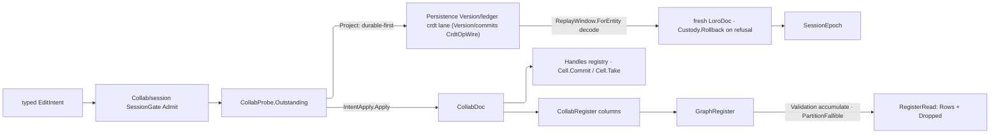

# [APPUI_COLLAB_SYNC]

One CRDT document is the LIVE merge authority for every co-edited AppUi surface, and one typed edit-intent stream is the DURABLE truth: `CollabDoc` wraps one `LoroDoc` whose nested container forest holds the notebook cells, issue threads, tables, graph structure, session membership, and live-data annotations; the durable boundary encodes AppUi intents as `CrdtOpWire` payloads — the wire vocabulary `Version/commits#CRDT_WIRE` owns — carried on the `Version/ledger` `crdt` lane and rehydrated through `ReplayWindow.ForEntity`; every intent crosses the `Collab/session#ADMISSION_GATE` role fold before it appends. Loro bytes never cross durable truth. The in-session transport, the three ephemeral presence channels, and the overlay chrome that projects them are `Collab/presence.md`; the historical views — inverse-intent revert, checkout, fork, and the two-cut compare session — are `Collab/compare.md`. Both compose the owners declared here; `[FaultCase]` and `CollabFault` are seated here as the ONE fault family all three pages raise.

## [01]-[INDEX]

- [02]-[DOCUMENT_OWNER]: One `LoroDoc`-backed live merge authority; the container-attach vocabulary; the typed key axis; the registry-owned handle lifetime; one direct generated fault union.
- [03]-[DURABLE_INTENT]: One typed edit-intent union; the one live+durable commit path; the session admission gate and the convergence-probe capability gate; replay-window cold-load; the session-epoch law; the graph correspondence whole.

## [02]-[DOCUMENT_OWNER]

- Owner: `CollabDoc` the one `LoroDoc`-backed live merge authority and container-handle lifetime owner; `CollabDocPolicy` the open-time policy; `CollabContainer` the container-kind axis whose rows carry presence anchoring; `CollabRoot` the declared-root vocabulary whose rows carry their container kind; `CollabColumn` the register-column vocabulary; `DocumentKey` and `ContainerKey` the two typed identity axes; `CollabPath` the hop sequence and `CollabAddress` the kind-carrying addressing union — together the ONE way a container is named; `CollabRegister` the one column read/write surface; `CollabFault` the direct generated `[Union]` with one `[FaultCase]` leaf per collaboration failure.
- Cases: `CollabContainer` = text | map | list | movable-list | tree | counter; `CollabRoot` = cells | meta | comments | notifications | rows | annotations | graph | edges | members | issues; `CollabColumn` owns the declared register columns; `CollabAddress` = Root | Path | Text | Id; `CollabPath` hops = `Key` | `At` | `Under`; `[FaultCase]` = Detached | TimeTraveled | DecodeCorrupt | ImportIncompatible | EpochMismatch | Gated | KindMismatch | Contended.
- Entry: `public static CollabDoc Open(DocumentKey key, Option<CollabDocPolicy> policy = default)` — a fresh auto-committing document under the resolved policy (`SetRecordTimestamp`, the `SetChangeMergeInterval` batching window, the `SetPeerId` session identity); `public static CollabDoc Of(LoroDoc doc, DocumentKey key)` — the ONE mint every constructed document crosses, so the custody cell and the handle registry are never seeded by a caller; `public Fin<CollabHandle> Attach(CollabAddress address)` — resolves the address to a container of the kind the address itself carries, COMMITS the Rust handle into the document's owned registry through a bounded transition, and lifts the outcome onto `Fin` — the LONG-LIVED holder path; `public Fin<A> Use<TContainer, A>(CollabAddress address, Func<TContainer, Fin<A>> work)` — the SCOPED transient twin: resolve, work, release in one kernel bracket, so per-edit applies and per-read projections never grow the registry (every resolution mints a fresh Rust-pointer wrapper); `public Fin<A> Read<A>(CollabPath path, A absent, Func<LoroMap, Fin<A>> read)` — the absence-folding read twin over a mergeable register level; `CollabAddress.Of` discriminates a declared root row, a kind-plus-`CollabPath`, and a kind-plus-`ContainerId` on input shape while `CollabAddress.Parse` is the text ingress; `public Fin<Subscription> Changes(Subscriber subscriber)` — the document-wide typed-`Diff` feed through `SubscribeRoot`, `EventTriggerKind.Local`/`Import`/`Checkout` routing echo suppression at every UI projection.
- Auto: the document is the live convergence authority — every local edit and every remote replica's session delta flow through the one `LoroDoc`, so a collaborative page holds NO custom last-writer-wins register, fractional-index insertion order, or tombstone set: the notebook cell sequence is a `movable-list` container whose `Mov` reorders by stable id, an issue comment thread is a per-topic `map` hop under the `CollabRoot.Comments` row keyed by comment GUID, a table is a `movable-list` whose `Mov` is the identity-preserving row reorder, the graph canvas is a `tree` container, and a rich-text cell is a per-cell `text` container whose `Mark` carries inline style spans; the document key prefixes the Persistence content-key namespace so two replicas of one document converge under one identity.
- Packages: LoroCs, Rasm (project — `FaultBand`, `[FaultCase]`, `Fault`, `Retriability`, `Custody`, `Cell`/`Transition`), Thinktecture.Runtime.Extensions, LanguageExt.Core, NodaTime
- Growth: a co-edited surface is one `CollabRoot` row and its attach, never a new CRDT; a new register column is one `CollabColumn` row both ends read; a new addressing ingress is one `CollabAddress` case; a new fault is one `[FaultCase]` leaf; a new container kind the binding adds is one `CollabContainer` row answering the anchoring column; a new open-time knob is one `CollabDocPolicy` field; zero new surface.
- Boundary:
  - `CollabDoc` is the one merge authority in the package — a hand-rolled LWW/merge algebra beside it is the deleted form, so the notebook, the issue board, the table, the graph canvas, and the live-data annotation planes compose THIS owner; the bespoke `NotebookCrdt`/`NotebookOp` LWW algebra and the `CommentThread`/`CommentOp` register are DROPPED root-up.
  - Addressing has ONE owner: `CollabAddress` names a container and `CollabPath` carries the hops, so a slash-built name is the deleted form at EVERY level and the fix is always the typed hop with its mergeable child.
  - `"comments/{topic}"` and `"notifications/{peer}"` are FLAT roots wearing a fake hierarchy, minting one root container per topic and per peer, and a `"pin/{ordinal}/{facet}"` key is the same defect one level down, flattening a nested register into its parent's namespace so two peers editing sibling members collide.
  - `DocumentKey` and `ContainerKey` are the two identity axes and neither is a bare `string`: the document key prefixes the Persistence content-key namespace so it admits through `Validate` and a blank one is unspellable, while a container key NAMES a member inside a mergeable map and carries no invariant beyond that role — its four mints (a comment guid, a peer ordinal, a sequence slot, an endpoint pair) are the only shapes this package addresses a member by, so `commentId.ToString("N")`, `peer.ToString(...)`, and a hand-built edge key are one owner instead of four hand mints at four sites.
  - `CollabRoot` is the declared-root vocabulary and every level below it is a typed hop: each row carries the root name AND the container kind that level holds, so an attach composes ONE row instead of pairing a name with a kind that contradicts it, the root set stays bounded, and a nested read resolves in one `GetByPath` instead of a parent re-walk per level.
  - `CollabColumn` is the register-column vocabulary and `CollabRegister` the one surface that crosses it — `Write` folds a row of declared columns through one engine crossing, `Read` projects one leaf, and `Level` descends one nested map, so a column key is declared once for the writing arm and every reading lens, and a page-local column literal, a re-spelled leaf probe, or a hand-spelled child descent is the deleted form.
  - Absence policy belongs to the READ, never to the resolve: `Use` faults `Detached` so a write path learns its level is unwritten, while `Read` folds that ONE fault to the caller's empty value and leaves `KindMismatch` on the result, so every projection whose first read precedes any write crosses one owner instead of re-spelling the fold per lens.
  - `GetByStrPath` is the text ingress alone — a path arriving from a link, route, or persisted anchor parses ONCE at the boundary onto the same result, and page code minting a text expression to hand back to the parser is the deleted form; `GetContainer(ContainerId)` closes the loop from a `LoroValue.Container` leaf or a `Diff` payload back to a live handle, so a subscriber projecting a change never re-derives the path its event already identified.
  - Every `Loro*`/`Cursor`/`Frontiers`/`VersionVector`/`ValueOrContainer` value is an `IDisposable` Rust-pointer wrapper and the boundary owns the foreign lifetime through the KERNEL custody algebra, never a hand latch: `Custody.Bracket` releases every scoped wrapper on success and refusal alike and AGGREGATES the release fault into the primary outcome, so a leaking free reads as a fault rather than as nothing; `Cell.Take` is the one release latch on both the handle and the document, so a take-and-clear transition drains the pending release exactly once and a second `Dispose` reads the empty post-state; `Interlocked.Exchange`, a read-then-clear sweep, and `ignore(Atom.Swap(...))` are the three deleted forms.
  - `CollabRegister` owns the release of every resolved `ValueOrContainer` on BOTH descents — `Read` for a leaf and `Level` for a nested map — because `AsLoroMap` mints its own Rust Arc and leaves the probe that produced it standing: a level spelled `Get()?.AsLoroMap()` keeps that probe for the process lifetime. Both descents answer `Option<A>` because absence policy is the CALLER's, which is why they compose the statement `using` rather than the `Fin`-shaped kernel bracket — a lens's empty answer is not a typed refusal and lifting it onto one would make every unwritten level a fault.
  - Engine unions `LoroValue`, `Diff`, and `ExportMode` pattern-match at their leaf at the boundary and never re-model as a parallel enum: `LoroVal` carries BOTH legs of the leaf correspondence — the `Of` mint and the `Text`/`Whole`/`Real`/`Flag`/`Stamp`/`Container`/`Field` projections — so every shape a register writes reads back through its declared inverse and an unexpected leaf reads absent rather than throwing.
  - `Lift` is the ONE fold from the `LoroException` hierarchy onto the typed family — `ImportUpdatesThatDependsOnOutdatedVersion` and `DecodeVersionVectorException` land `EpochMismatch`, the `Decode*` cases land `DecodeCorrupt`, `IncompatibleFutureEncodingException` lands `ImportIncompatible`, and the two detached-edit cases land `TimeTraveled`; every case carries the exact captured `Error` cause.
  - Retriability is a COLUMN on the fault, never a policy each consumer re-decides: `EpochMismatch` and `Contended` override `Transient` because a delta whose dependency has not arrived and a compare-and-swap that spent its budget both resolve by re-driving, while every other case inherits the kernel `Terminal` virtual — so `Collab/presence.md`'s `RedrivePolicy` classifies nothing of its own and a `bool IsTransient` beside the family is unspellable.
  - Resolution mints the two register faults no exception carries: an unwritten level answers `Detached` and a container of the wrong kind at a written level answers `KindMismatch`, so a lens folding absence to an empty answer still leaves a register defect on the result.
  - Engine hosting is companion-only — `loro.dylib` firebreaks `CollabDoc` out of any in-Rhino plugin ALC; an in-Rhino plugin assembly referencing this owner is the rejected form, and the in-Rhino surface receives materialized document state through the Persistence changefeed rather than the live `LoroDoc`.

```csharp
// --- [TYPES] ---------------------------------------------------------------------------
using LoroIndex = LoroCs.Index;

[SmartEnum<string>]
[KeyMemberEqualityComparer<ComparerAccessors.StringOrdinal, string>]
[KeyMemberComparer<ComparerAccessors.StringOrdinal, string>]
public sealed partial class CollabContainer {
    public static readonly CollabContainer Text = new("text", ContainerType.Text, AnchorText);
    public static readonly CollabContainer Map = new("map", ContainerType.Map, Unanchorable);
    public static readonly CollabContainer List = new("list", ContainerType.List, AnchorList);
    public static readonly CollabContainer MovableList = new("movable-list", ContainerType.MovableList, AnchorMovable);
    public static readonly CollabContainer Tree = new("tree", ContainerType.Tree, Unanchorable);
    public static readonly CollabContainer Counter = new("counter", ContainerType.Counter, Unanchorable);

    public ContainerType Type { get; }

    [UseDelegateFromConstructor]
    public partial Fin<Cursor> Anchored(CollabHandle handle, uint position, PosType source, Side side);

    private static Fin<Cursor> AnchorText(CollabHandle handle, uint position, PosType source, Side side) =>
        handle.Container is LoroText text
            ? Positioned(handle, () => text.ConvertPos(position, source, PosType.Unicode) is { } at
                ? text.GetCursor(at, side)
                : null)
            : Refused(handle);

    private static Fin<Cursor> AnchorList(CollabHandle handle, uint position, PosType source, Side side) =>
        handle.Container is LoroList list ? Positioned(handle, () => list.GetCursor(position, side)) : Refused(handle);

    private static Fin<Cursor> AnchorMovable(CollabHandle handle, uint position, PosType source, Side side) =>
        handle.Container is LoroMovableList list ? Positioned(handle, () => list.GetCursor(position, side)) : Refused(handle);

    private static Fin<Cursor> Unanchorable(CollabHandle handle, uint position, PosType source, Side side) => Refused(handle);

    private static Fin<Cursor> Positioned(CollabHandle handle, Func<Cursor?> anchor) =>
        CollabDoc.Lift(anchor).Bind(cursor => Optional(cursor).ToFin(new CollabFault.Detached($"{handle.Address}")));

    private static Fin<Cursor> Refused(CollabHandle handle) => Fin.Fail<Cursor>(new CollabFault.KindMismatch($"{handle.Address}"));
}

[SmartEnum<string>]
[KeyMemberEqualityComparer<ComparerAccessors.StringOrdinal, string>]
[KeyMemberComparer<ComparerAccessors.StringOrdinal, string>]
public sealed partial class CollabRoot {
    public static readonly CollabRoot Cells = new("cells", static () => CollabContainer.MovableList);
    public static readonly CollabRoot Meta = new("meta", static () => CollabContainer.Map);
    public static readonly CollabRoot Comments = new("comments", static () => CollabContainer.Map);
    public static readonly CollabRoot Notifications = new("notifications", static () => CollabContainer.Map);
    public static readonly CollabRoot Rows = new("rows", static () => CollabContainer.Map);
    public static readonly CollabRoot Annotations = new("annotations", static () => CollabContainer.Map);
    public static readonly CollabRoot Graph = new("graph", static () => CollabContainer.Tree);
    public static readonly CollabRoot Edges = new("edges", static () => CollabContainer.Map);
    public static readonly CollabRoot Members = new("members", static () => CollabContainer.Map);
    public static readonly CollabRoot Issues = new("issues", static () => CollabContainer.Map);

    [UseDelegateFromConstructor]
    public partial CollabContainer Kind();
}

[SmartEnum<string>]
[KeyMemberEqualityComparer<ComparerAccessors.StringOrdinal, string>]
[KeyMemberComparer<ComparerAccessors.StringOrdinal, string>]
public sealed partial class CollabColumn {
    public static readonly CollabColumn Identity = new("key");
    public static readonly CollabColumn Kind = new("kind");
    public static readonly CollabColumn Name = new("name");
    public static readonly CollabColumn Title = new("title");
    public static readonly CollabColumn Author = new("author");
    public static readonly CollabColumn At = new("at");
    public static readonly CollabColumn State = new("state");
    public static readonly CollabColumn Role = new("role");

    public static readonly CollabColumn Patch = new("patch");
    public static readonly CollabColumn Source = new("source");
    public static readonly CollabColumn Body = new("body");
    public static readonly CollabColumn Viewpoint = new("viewpoint");
    public static readonly CollabColumn Resolved = new("resolved");
    public static readonly CollabColumn EditedBy = new("edited-by");
    public static readonly CollabColumn EditedAt = new("edited-at");
    public static readonly CollabColumn Topic = new("topic");

    public static readonly CollabColumn Template = new("template");
    public static readonly CollabColumn Parent = new("parent");
    public static readonly CollabColumn X = new("x");
    public static readonly CollabColumn Y = new("y");
    public static readonly CollabColumn Width = new("width");
    public static readonly CollabColumn Height = new("height");
    public static readonly CollabColumn Rotation = new("rotation");
    public static readonly CollabColumn Locked = new("locked");
    public static readonly CollabColumn Visible = new("visible");
    public static readonly CollabColumn Pins = new("pins");
    public static readonly CollabColumn Alignment = new("alignment");
    public static readonly CollabColumn Direction = new("direction");
    public static readonly CollabColumn Bus = new("bus");

    public static readonly CollabColumn From = new("from");
    public static readonly CollabColumn To = new("to");
    public static readonly CollabColumn Pin = new("pin");
    public static readonly CollabColumn Routing = new("routing");
    public static readonly CollabColumn Style = new("style");
    public static readonly CollabColumn Orientation = new("orientation");
    public static readonly CollabColumn StartArrow = new("start-arrow");
    public static readonly CollabColumn EndArrow = new("end-arrow");
    public static readonly CollabColumn Offset = new("offset");
    public static readonly CollabColumn Label = new("label");
    public static readonly CollabColumn Waypoints = new("waypoints");

    public static readonly CollabColumn Status = new("status");
    public static readonly CollabColumn Priority = new("priority");
    public static readonly CollabColumn Assignee = new("assignee");
    public static readonly CollabColumn Labels = new("labels");
    public static readonly CollabColumn Attachment = new("attachment");

    public static readonly CollabColumn Color = new("color");
    public static readonly CollabColumn Plane = new("plane");
    public static readonly CollabColumn Anchor = new("anchor");
    public static readonly CollabColumn Tour = new("tour");
    public static readonly CollabColumn Frame = new("frame");
}

[ValueObject<string>]
public readonly partial struct DocumentKey {
    static partial void ValidateFactoryArguments(ref ValidationError? validationError, ref string value) {
        value = value.Trim();
        if (value.Length == 0) { validationError = new ValidationError(string.Join(" | ", new object?[] { "document key: blank" })); }
    }
}

[ValueObject<string>]
public readonly partial struct ContainerKey {
    public static ContainerKey Of(Guid member) => Create(member.ToString("N"));
    public static ContainerKey Of(ulong peer) => Create(peer.ToString(CultureInfo.InvariantCulture));
    public static ContainerKey Slot(int ordinal) => Create(ordinal.ToString(CultureInfo.InvariantCulture));

    public static ContainerKey Edge(GraphEndpoint from, GraphEndpoint to) =>
        Create($"{from.NodeKey}|{from.PinKey.IfNone(string.Empty)}=>{to.NodeKey}|{to.PinKey.IfNone(string.Empty)}");
}

public readonly record struct CollabPath(Seq<LoroIndex> Hops) {
    public static CollabPath Root(CollabRoot root) => new(Seq<LoroIndex>(new LoroIndex.Key(root.Key)));

    public CollabPath Key(ContainerKey key) => new(Hops.Add(new LoroIndex.Key(key.Value)));
    public CollabPath At(uint position) => new(Hops.Add(new LoroIndex.Seq(position)));
    public CollabPath Under(TreeId node) => new(Hops.Add(new LoroIndex.Node(node)));

    public LoroIndex[] Chain => [.. Hops];
}

[Union(ConversionFromValue = ConversionOperatorsGeneration.None)]
public abstract partial record CollabAddress {
    private CollabAddress() { }

    public sealed record Root(CollabRoot Declared) : CollabAddress;
    public sealed record Path(CollabContainer Narrow, CollabPath Hops) : CollabAddress;
    public sealed record Text(CollabContainer Narrow, string Expression) : CollabAddress;
    public sealed record Id(CollabContainer Narrow, ContainerId Container) : CollabAddress;

    public static CollabAddress Of(CollabRoot root) => new Root(root);
    public static CollabAddress Of(CollabContainer kind, CollabPath path) => new Path(kind, path);
    public static CollabAddress Of(CollabContainer kind, ContainerId container) => new Id(kind, container);
    public static CollabAddress Parse(CollabContainer kind, string expression) => new Text(kind, expression);

    public CollabContainer Kind => Switch(
        root: static a => a.Declared.Kind(),
        path: static a => a.Narrow,
        text: static a => a.Narrow,
        id: static a => a.Narrow);
}

// --- [ERRORS] --------------------------------------------------------------------------
[Union(ConversionFromValue = ConversionOperatorsGeneration.None)]
public abstract partial record CollabFault : Fault {
    private static readonly FaultBand FamilyBand = FaultBand.Collab;
    private CollabFault(string detail) { Detail = detail; }

    public string Detail { get; }
    public override string Message => Detail;


    [FaultCase(0)]
    public sealed partial record Detached(string Detail) : CollabFault(Detail);
    [FaultCase(1)]
    public sealed partial record TimeTraveled(Error Cause) : CollabFault(Cause.Message), ICausedFault;
    [FaultCase(2)]
    public sealed partial record DecodeCorrupt(Error Cause) : CollabFault(Cause.Message), ICausedFault;
    [FaultCase(3)]
    public sealed partial record ImportIncompatible(Error Cause) : CollabFault(Cause.Message), ICausedFault;
    [FaultCase(4)]
    public sealed partial record EpochMismatch(Error Cause) : CollabFault(Cause.Message), ICausedFault {
        public override Retriability Retriability => Retriability.Transient;
    }
    [FaultCase(5)]
    public sealed partial record Gated(string Detail) : CollabFault(Detail);
    [FaultCase(6)]
    public sealed partial record KindMismatch(string Detail) : CollabFault(Detail);
    [FaultCase(7)]
    public sealed partial record Contended(string Detail) : CollabFault(Detail) {
        public override Retriability Retriability => Retriability.Transient;
    }
}

// --- [MODELS] --------------------------------------------------------------------------
public sealed record CollabDocPolicy(bool RecordTimestamp, Option<long> MergeIntervalMs, Option<ulong> Peer) {
    public static readonly CollabDocPolicy Live = new(RecordTimestamp: true, None, None);
}

public sealed class CollabHandle {
    private readonly Atom<Option<Func<Unit>>> pending;

    public CollabHandle(CollabAddress address, IDisposable container, Func<Unit> release) {
        Address = address; Container = container; pending = Atom(Some(release));
    }

    public CollabAddress Address { get; }
    public IDisposable Container { get; }

    public void Dispose() => ignore(Cell.Take(pending).Current.Map(static release => release()));
}

public sealed class CollabDoc : IDisposable {
    private readonly Atom<Option<LoroDoc>> custody;

    private CollabDoc(LoroDoc doc, DocumentKey key) {
        Doc = doc; Key = key; Handles = Atom(Seq<CollabHandle>()); custody = Atom(Some(doc));
    }

    public LoroDoc Doc { get; }
    public DocumentKey Key { get; }
    public Atom<Seq<CollabHandle>> Handles { get; }

    public static CollabDoc Of(LoroDoc doc, DocumentKey key) => new(doc);

    public static CollabDoc Open(DocumentKey key, Option<CollabDocPolicy> policy = default) {
        LoroDoc doc = new();
        CollabDocPolicy resolved = policy.IfNone(CollabDocPolicy.Live);
        doc.SetRecordTimestamp(resolved.RecordTimestamp);
        resolved.MergeIntervalMs.Iter(doc.SetChangeMergeInterval);
        resolved.Peer.Iter(doc.SetPeerId);
        return Of(doc);
    }

    public Fin<CollabHandle> Attach(CollabAddress address) =>
        Located(address).Bind(container => Registered(address, container));

    public Fin<A> Use<TContainer, A>(CollabAddress address, Func<TContainer, Fin<A>> work) where TContainer : class, IDisposable =>
        Located(address).Bind(container => Custody.Bracket(
            () => container is TContainer typed ? work(typed) : Fin.Fail<A>(new CollabFault.KindMismatch($"{address}")),
            container));

    public Fin<A> Read<A>(CollabPath path, A absent, Func<LoroMap, Fin<A>> read) =>
        Use(CollabAddress.Of(CollabContainer.Map, path), read)
            .BindFail(fault => fault is CollabFault.Detached ? Fin.Succ(absent) : Fin.Fail<A>(fault));

    private Fin<IDisposable> Located(CollabAddress address) =>
        address.Switch<CollabDoc, Fin<IDisposable>>(
            state: this,
            root: static (s, a) => s.Opened(a.Declared),
            path: static (s, a) => Narrowed(Lift(() => s.Doc.GetByPath(a.Hops.Chain)), a),
            text: static (s, a) => Narrowed(Lift(() => s.Doc.GetByStrPath(a.Expression)), a),
            id: static (s, a) => Narrowed(Lift(() => s.Doc.GetContainer(a.Container)), a));

    private Fin<IDisposable> Opened(CollabRoot root) =>
        Lift(() => root.Kind().Switch<(LoroDoc Doc, string Name), IDisposable>(
            state: (Doc, root.Key),
            text: static state => state.Doc.GetText(state.Name),
            map: static state => state.Doc.GetMap(state.Name),
            list: static state => state.Doc.GetList(state.Name),
            movableList: static state => state.Doc.GetMovableList(state.Name),
            tree: static state => state.Doc.GetTree(state.Name),
            counter: static state => state.Doc.GetCounter(state.Name)));

    private static Fin<IDisposable> Narrowed(Fin<ValueOrContainer?> found, CollabAddress address) =>
        found.Bind(value => Optional(value).ToFin(new CollabFault.Detached($"{address}")))
            .Bind(value => Custody.Bracket(
                () => Lift(() => address.Kind.Switch<ValueOrContainer, IDisposable?>(
                        state: value,
                        text: static held => held.AsLoroText(),
                        map: static held => held.AsLoroMap(),
                        list: static held => held.AsLoroList(),
                        movableList: static held => held.AsLoroMovableList(),
                        tree: static held => held.AsLoroTree(),
                        counter: static held => held.AsLoroCounter()))
                    .Bind(narrowed => Optional(narrowed).ToFin(new CollabFault.KindMismatch($"{address}"))),
                value));

    public Fin<Unit> Commit(string origin) =>
        Lift(() => { Doc.CommitWith(new CommitOptions(Origin: origin, ImmediateRenew: true, Timestamp: null, CommitMsg: null)); return unit; });

    public Fin<Subscription> Changes(Subscriber subscriber) => Lift(() => Doc.SubscribeRoot(subscriber));

    public Fin<Option<ulong>> LastEditorAt(CollabHandle handle, uint position) =>
        Lift(() => handle.Container switch {
            LoroMovableList list => Optional(list.GetLastEditorAt(position)),
            _ => Option<ulong>.None,
        });

    internal static Fin<Unit> Nested<TContainer>(Func<TContainer> mint, Func<TContainer, Fin<Unit>> write) where TContainer : class, IDisposable =>
        Lift(mint).Bind(child => Custody.Bracket(() => write(child), child));

    internal static Fin<T> Lift<T>(Func<T> act) =>
        Try.lift(() => Fin.Succ(act())).Run().Bind(static inner => inner);

    private static Option<CollabFault> Classify(Error cause) =>
        cause.Exception is { IsSome: true, Case: Exception raised }
            ? raised switch {
                LoroException.ImportUpdatesThatDependsOnOutdatedVersion => Some<CollabFault>(new CollabFault.EpochMismatch(cause)),
                LoroException.DecodeVersionVectorException => Some<CollabFault>(new CollabFault.EpochMismatch(cause)),
                LoroException.IncompatibleFutureEncodingException => Some<CollabFault>(new CollabFault.ImportIncompatible(cause)),
                LoroException.EditWhenDetached => Some<CollabFault>(new CollabFault.TimeTraveled(cause)),
                LoroException.MisuseDetachedContainer => Some<CollabFault>(new CollabFault.TimeTraveled(cause)),
                LoroException.DecodeException => Some<CollabFault>(new CollabFault.DecodeCorrupt(cause)),
                LoroException => Some<CollabFault>(new CollabFault.DecodeCorrupt(cause)),
                _ => None,
            }
            : None;

    private Fin<CollabHandle> Registered(CollabAddress address, IDisposable container) {
        CollabHandle handle = new(address, container, () => Released(container));
        return Cell.Commit(Handles, held => held.Add(handle), Cell.SwapBudget) switch {
            Transition<Seq<CollabHandle>>.Committed => Fin.Succ(handle),
            Transition<Seq<CollabHandle>> spent => Fin.Fail<CollabHandle>(
                new CollabFault.Contended($"{address}: {spent.Current.Count} seated")).Rollback(container),
        };
    }

    private Unit Released(IDisposable container) {
        ignore(Cell.Step(
            Handles,
            held => held.Exists(seated => ReferenceEquals(seated.Container, container))
                ? Some(held.Filter(seated => !ReferenceEquals(seated.Container, container)))
                : Option<Seq<CollabHandle>>.None,
            new CollabFault.Detached("handle already swept by the document")));
        container.Dispose();
        return unit;
    }

    public void Dispose() =>
        ignore(Cell.Take(custody).Current.Map(doc => {
            Cell.Take(Handles).Current.Iter(static held => held.Dispose());
            doc.Dispose();
            return unit;
        }));
}

public sealed record LoroVal(LoroValue Value) : LoroValueLike {
    public LoroValue AsLoroValue() => Value;

    public static LoroVal Of(string value) => new(new LoroValue.String(value));
    public static LoroVal Of(ContainerKey value) => Of(value.Value);
    public static LoroVal Of(long value) => new(new LoroValue.I64(value));
    public static LoroVal Of(double value) => new(new LoroValue.Double(value));
    public static LoroVal Of(bool value) => new(new LoroValue.Bool(value));
    public static LoroVal Of(Instant value) => Of(value.ToUnixTimeMilliseconds());
    public static LoroVal Of(ReadOnlyMemory<byte> value) => new(new LoroValue.Binary(value.ToArray()));

    public static LoroVal Of<TEnum>(TEnum value) where TEnum : struct, Enum =>
        Of(Convert.ToInt64(value, CultureInfo.InvariantCulture));

    public static LoroVal Of(params ReadOnlySpan<(CollabColumn Column, LoroVal Value)> fields) =>
        new(new LoroValue.Map(fields.ToArray().ToDictionary(static cell => cell.Column.Key, static cell => cell.Value.Value)));

    public Option<string> Text => Value is LoroValue.String s ? Some(s.Value) : None;
    public Option<long> Whole => Value is LoroValue.I64 i ? Some(i.Value) : None;
    public Option<double> Real => Value is LoroValue.Double d ? Some(d.Value) : None;
    public Option<bool> Flag => Value is LoroValue.Bool b ? Some(b.Value) : None;
    public Option<Instant> Stamp => Whole.Map(Instant.FromUnixTimeMilliseconds);
    public Option<ReadOnlyMemory<byte>> Blob => Value is LoroValue.Binary bin ? Some<ReadOnlyMemory<byte>>(bin.Value) : None;

    public Option<TEnum> Case<TEnum>() where TEnum : struct, Enum =>
        Whole.Map(static held => (TEnum)Enum.ToObject(typeof(TEnum), held)).Filter(static value => Enum.IsDefined(value));

    public Option<ContainerId> Container => Value is LoroValue.Container c ? Some(c.Value) : None;

    public Option<A> Field<A>(CollabColumn column, Func<LoroVal, Option<A>> project) =>
        Value is LoroValue.Map { Value: var fields } && fields.TryGetValue(column.Key, out LoroValue? held)
            ? project(new LoroVal(held))
            : None;
}

// --- [OPERATIONS] ----------------------------------------------------------------------
public static class CollabRegister {
    extension(LoroMap row) {
        public Fin<Unit> Write(params ReadOnlySpan<(CollabColumn Column, LoroVal Value)> cells) {
            (CollabColumn Column, LoroVal Value)[] owned = cells.ToArray();
            return CollabDoc.Lift(() => {
                foreach ((CollabColumn column, LoroVal value) in owned) { row.Insert(column.Key, value); }
                return unit;
            });
        }

        public Fin<Unit> Write(ContainerKey key, LoroVal value) =>
            CollabDoc.Lift(() => { row.Insert(key.Value, value); return unit; });

        public Fin<Unit> Erase(ContainerKey key) => CollabDoc.Lift(() => { row.Delete(key.Value); return unit; });

        public Option<A> Read<A>(CollabColumn column, Func<LoroVal, Option<A>> project) => row.Read(column.Key, project);

        public Option<A> Read<A>(string key, Func<LoroVal, Option<A>> project) {
            using ValueOrContainer? held = row.Get();
            return Optional(held?.AsValue()).Map(static leaf => new LoroVal(leaf)).Bind(project);
        }

        public Option<A> Level<A>(CollabColumn column, Func<LoroMap, Option<A>> read) => row.Level(column.Key, read);

        public Option<A> Level<A>(ContainerKey key, Func<LoroMap, Option<A>> read) => row.Level(key.Value, read);

        public Option<A> Level<A>(string key, Func<LoroMap, Option<A>> read) {
            using ValueOrContainer? held = row.Get();
            using LoroMap? level = held?.AsLoroMap();
            return Optional(level).Bind(read);
        }
    }
}
```

## [03]-[DURABLE_INTENT]

- Owner: `EditIntent` — the SINGLE typed edit-intent `[Union]` whose rows the domain planes contribute; `IntentLedger` — the projection onto Persistence-owned rows, the ONE live+durable commit path, and the replay-window cold-load; `SessionEpoch` — the epoch identity that makes cold-load honest; `CollabProbe` — the convergence-probe capability vocabulary whose rows name the intent arm each gates; `IntentApply` — the one decode-side dispatch; `GraphRegister` — the graph correspondence whole, its write arm beside the `ReadNodes`/`ReadEdges` projections `Editing/graph#COEDIT_BRIDGE` binds; `RegisterRead<A>` — the read answer carrying the rehydrated rows beside the levels it dropped; the composition-bound `Admit` column — the `Collab/session#ADMISSION_GATE` role-capability fold every intent crosses first.
- Cases: `EditIntent` = CellInsert | CellEdit | CellMove | CellDelete | CommentAdd | CommentEdit | CommentResolve | CommentRoute | TableRowCommit | GraphStructure | Annotation | TextRun | Membership | IssueCommit — every collaborative surface's committed edit is ONE row here, never a parallel per-page op union; `Membership` carries the `Collab/session#MEMBERSHIP` `MembershipOp` and `IssueCommit` the `Collab/issues#ISSUE_REGISTER` `IssueOp`, so who may edit and what a board triage decided are both durable truth on this same union while role presence and board chrome stay ephemeral; `CommentRoute` projects resolved mention recipients into their mergeable notification inboxes; `history.md`'s `RevertibleOp` stays the LOCAL revert algebra that projects onto this same family; `GraphOp` = NodeAdd | NodeAt | NodeMove | NodeRemove | EdgeAdd | EdgeRemove — each case carrying exactly its own payload, so no arm reads an `Option` a sibling case never populates; `TextRunOp` = Insert | Delete | Mark over unicode-index positions the ledger decode resolves from the Persistence stable-position rows in window order; `CollabProbe` = text-run, one row per intent arm whose producer-side convergence probe must seal before the arm may append.
- Entry: `public IO<Fin<Unit>> Project(EditIntent intent)` — folds the intent through the session `Admit` gate and the ONE probe fold, then encodes the ADMITTED intent as the payload of a `CrdtOpWire` (the `Version/commits#CRDT_WIRE`-owned wire vocabulary) carried on the `Version/ledger` `crdt` lane; `public IO<Fin<Unit>> Commit(CollabDoc doc, EditIntent intent, string origin)` — appends durably before applying through the same `IntentApply.Apply` dispatch replay uses; `ColdLoad` reads `ReplayWindow.ForEntity` and replays into a fresh `LoroDoc` in ledger order, rolling the half-hydrated document back on the first refusal.
- Auto: cold-load is DETERMINISTIC HYDRATION — no Loro byte is read from durable truth; each decoded intent applies through the same container verbs a live edit uses, so the rehydrated state is a pure function of the ledger window; the SESSION-EPOCH law makes it honest: a rehydrated `LoroDoc`'s version vector is unrelated to any live session's, so a live peer's `Export(Updates(vv))` delta CANNOT import over it (`LoroException.ImportUpdatesThatDependsOnOutdatedVersion`/`DecodeVersionVectorException` are the verified failure surface, folding to `CollabFault.EpochMismatch`) — replay-window rehydration is the cold-START path that SEEDS a session epoch, and a peer joining an ACTIVE session syncs Loro-native session state from a live peer over the AppHost transport (`Collab/presence#LIVE_WIRE`), never by replaying the log beside a live epoch.
- Boundary: every projected intent remains the canonical durable ledger row, and replay returns the Persistence-owned window directly.
- Packages: LoroCs, NodeEditorAvalonia (graph row and connector vocabularies), Rasm.Persistence (project), Rasm (project — `Custody`, `CapabilitySet`, `ICapability`), Thinktecture.Runtime.Extensions, LanguageExt.Core, NodaTime
- Growth: a new collaborative surface's committed edit is one `EditIntent` case whose generated total `Switch` breaks BOTH `IntentApply.Apply` and `Collab/session#ADMISSION_GATE`'s `Required` fold at compile time until its replay arm and its capability row land; a new graph verb is one `GraphOp` case; a new co-edited node or wire column is one `CollabColumn` row written by `GraphRegister.Apply` and read by its declared inverse; a new text run kind is one `TextRunOp` case; a new gated arm is one `CollabProbe` row naming the intent it claims; a new membership verb is one `MembershipOp` case; a new board verb is one `IssueOp` case; zero new surface, zero new Persistence row.
- Boundary:
  - Durable collaboration is decode/replay at the boundary — the edit-intent op stream is Persistence-owned rows; a Loro-native byte persisted as system-of-record is the DELETED form (the Persistence roster law records LoroCs rejected for the durable wire, bit-parity, and re-seals it).
  - Intent vocabulary has ONE owner — this union; `history.md`'s `RevertibleOp` projects onto it, `notebook.md` and `issues.md` anchor their durable prose here, and a parallel per-page op union is the deleted form.
  - `IntentApply.Apply` is the generated total `Switch` over the closed family — a language `switch` with a `_` arm is the rejected form because closed-family growth must break every dispatch site at compile time, never fall through a generic case; every ADMITTED case, `TextRun` included, reaches the same replay projection its live edit used.
  - Head insertion is an ABSENT predecessor, never an empty key: `CellInsert.After` and `CellMove.After` carry `Option<ContainerKey>`, so the ordinal fold reads position zero off the absence itself and the sentinel-empty-string arm — which a real but blank id would have silently taken — has no spelling left.
  - A register-owning vocabulary carries BOTH legs of its own correspondence and the dispatch HOPS onto it: `GraphRegister`, `MemberRegister`, and `IssueRegister` each own their write arm beside the projections that read those columns back, so the decode dispatch stays one site while every column is declared, written, and read at the vocabulary that owns it, and `Editing/graph#COEDIT_BRIDGE` binds `GraphRegister.ReadNodes`/`ReadEdges` as its read columns rather than re-deriving them.
  - A dropped register level is EVIDENCE, never silence: a node or edge whose required identity columns are absent still drops — a canvas rebuild failing whole on one malformed level would hide every sound level beside it — but the absent columns ACCUMULATE through the `Validation` applicative and ride out on `RegisterRead.Dropped`, so a level missing both its identity and its template reports both instead of neither and the bridge can state what it could not rehydrate. The first-defect `Option` join that reported neither is the deleted form.
  - A co-edited SEQUENCE is ordinal-keyed mergeable cells and a co-edited SET is a keyed mergeable map, never one replaced leaf: node pins and wire bends take the first shape and issue labels the second, so two peers editing different members of one collection converge instead of one write erasing the other, and every such level reads back in ordinal order rather than the register's lexical key order.
  - A package enum crosses the register as its ORDINAL through the one `LoroVal` enum leg — `PinAlignment`, `PinDirection`, `ConnectorRoutingMode`, `ConnectorStyle`, `ConnectorOrientation`, and `ConnectorArrowStyle` carry no key member, so a name round-trip fails as a silently absent column while an ordinal the vocabulary no longer spells reads absent through the declared-value guard. The guard is ONE generic declaration over `Enum.IsDefined`, so six foreign vocabularies cost six call sites and no per-enum converter.
  - Producer-side gating is a CAPABILITY SET, never a two-row boolean vocabulary: `CollabProbe` rows name the intent arm each claims, the ledger holds the set of probes that have SEALED, and `Project` folds the first row that claims this intent and has not sealed into one refusal — so a second gated arm is one row and one `Admits` read rather than a second flag column and a second branch.
  - Admission is ONE gate at ONE boundary — `Project`, ahead of `LedgerAppend` — so a refused intent reaches neither durable truth nor the live document and its refusal carries the `Collab/session` registry band rather than this one; a second gate at the live merge is the rejected form because a remote frame carries opaque Loro delta bytes and no intent to grade, so a peer's edits are graded at that peer's own producer and its right to be on the wire at all is session membership; replay is likewise ungated, because a row that reached the ledger was admitted when it was written and re-grading it against today's roster would make cold-load a function of current membership rather than of the window.
  - Persistence results are decode-only — op-log rows, replay windows, blob results, and conflict results stay Persistence-owned; no AppUi interface or type crosses down.
  - Time enters as an `IClock` and nothing wider: this owner reads an `Instant` to stamp a session epoch and nothing else, so an app-stratum clock policy record — whose monotonic and provider legs no member here reads — never crosses down.

```csharp
// --- [TYPES] ---------------------------------------------------------------------------
[SmartEnum<string>]
[KeyMemberEqualityComparer<ComparerAccessors.StringOrdinal, string>]
public sealed partial class CollabProbe : ICapability<CollabProbe> {
    public static readonly CollabProbe TextRun = new("text-run", ClaimsTextRun);

    [UseDelegateFromConstructor]
    public partial bool Claims(EditIntent intent);

    private static bool ClaimsTextRun(EditIntent intent) => intent is EditIntent.TextRun;

    public static Option<CollabProbe> Outstanding(CapabilitySet<CollabProbe> settled, EditIntent intent) =>
        toSeq(Items).Find(row => row.Claims(intent) && !settled.Admits(row));
}

[Union(ConversionFromValue = ConversionOperatorsGeneration.None)]
public abstract partial record GraphOp {
    private GraphOp() { }
    public sealed record NodeAdd(GraphNodeRow Row) : GraphOp;
    public sealed record NodeAt(string NodeId, double X, double Y) : GraphOp;
    public sealed record NodeMove(string NodeId, Option<string> Parent, uint Index) : GraphOp;
    public sealed record NodeRemove(string NodeId) : GraphOp;
    public sealed record EdgeAdd(GraphEndpoint From, GraphEndpoint To, GraphWire Wire) : GraphOp;
    public sealed record EdgeRemove(GraphEndpoint From, GraphEndpoint To) : GraphOp;
}

[Union(ConversionFromValue = ConversionOperatorsGeneration.None)]
public abstract partial record TextRunOp {
    private TextRunOp() { }
    public sealed record Insert(uint At, string Text) : TextRunOp;
    public sealed record Delete(uint At, uint Len) : TextRunOp;
    public sealed record Mark(uint From, uint To, string Key, string Value) : TextRunOp;
}

[Union(ConversionFromValue = ConversionOperatorsGeneration.None)]
public abstract partial record EditIntent {
    private EditIntent() { }
    public sealed record CellInsert(DocumentKey DocKey, ContainerKey CellId, Option<ContainerKey> After, string Kind) : EditIntent;
    public sealed record CellEdit(DocumentKey DocKey, ContainerKey CellId, JsonElement Patch) : EditIntent;
    public sealed record CellMove(DocumentKey DocKey, ContainerKey CellId, Option<ContainerKey> After) : EditIntent;
    public sealed record CellDelete(DocumentKey DocKey, ContainerKey CellId) : EditIntent;
    public sealed record CommentAdd(DocumentKey DocKey, Guid CommentId, ContainerKey TopicId, string Body, string Author, Option<string> ViewpointGuid, Instant At) : EditIntent;
    public sealed record CommentEdit(DocumentKey DocKey, Guid CommentId, ContainerKey TopicId, string Body, string Editor, Instant At) : EditIntent;
    public sealed record CommentResolve(DocumentKey DocKey, Guid CommentId, ContainerKey TopicId, Instant At) : EditIntent;
    public sealed record CommentRoute(DocumentKey DocKey, Guid CommentId, ContainerKey TopicId, Seq<ulong> Peers, Instant At) : EditIntent;
    public sealed record TableRowCommit(DocumentKey DocKey, ContainerKey RowId, JsonElement Cells) : EditIntent;
    public sealed record GraphStructure(DocumentKey DocKey, GraphOp Op) : EditIntent;
    public sealed record Annotation(DocumentKey DocKey, ContainerKey TargetId, JsonElement Payload) : EditIntent;
    public sealed record TextRun(DocumentKey DocKey, ContainerKey CellId, TextRunOp Op) : EditIntent;
    public sealed record Membership(DocumentKey DocKey, MembershipOp Op) : EditIntent;
    public sealed record IssueCommit(DocumentKey DocKey, Guid IssueGuid, IssueOp Op) : EditIntent;
}

// --- [MODELS] --------------------------------------------------------------------------
public readonly record struct SessionEpoch(DocumentKey Document, Guid Epoch, Instant SeededAt);

public readonly record struct RegisterRead<A>(Seq<A> Rows, Seq<Error> Dropped);

public sealed record IntentLedger(
    DocumentKey Document,
    Func<EditIntent, IO<Fin<Unit>>> LedgerAppend,
    Func<DocumentKey, IO<Fin<Seq<EditIntent>>>> ReplayWindow,
    Func<EditIntent, Fin<EditIntent>> Admit,
    CapabilitySet<CollabProbe> Settled,
    IClock Clock) {

    public IO<Fin<Unit>> Project(EditIntent intent) =>
        Admit(intent)
            .Bind(admitted => CollabProbe.Outstanding(Settled, admitted).Match(
                Some: probe => Fin.Fail<EditIntent>(new CollabFault.Gated($"{probe.Key}: convergence probe outstanding")),
                None: () => Fin.Succ(admitted)))
            .Match(Succ: LedgerAppend, Fail: static error => IO.pure(Fin.Fail<Unit>(error)));

    public IO<Fin<Unit>> Commit(CollabDoc doc, EditIntent intent, string origin) =>
        (from projected in new FinT<IO, Unit>(Project(intent))
         from applied in FinT.lift<IO, Unit>(IntentApply.Apply(doc, intent))
         from committed in FinT.lift<IO, Unit>(doc.Commit(origin))
         select committed).runFin.As();

    public IO<Fin<(CollabDoc Doc, SessionEpoch Epoch)>> ColdLoad(Option<CollabDocPolicy> policy = default) =>
        (from intents in new FinT<IO, Seq<EditIntent>>(ReplayWindow(Document))
         let doc = CollabDoc.Open(Document, policy)
         from replayed in Hydrated(doc, intents)
         select (doc, new SessionEpoch(Document, Guid.CreateVersion7(), Clock.GetCurrentInstant()))).runFin.As();

    static FinT<IO, Unit> Hydrated(CollabDoc doc, Seq<EditIntent> intents) =>
        FinT.lift<IO, Unit>(intents.TraverseM(intent => IntentApply.Apply(doc, intent)).As()
            .Map(static _ => unit)
            .Rollback(doc));
}

// --- [OPERATIONS] ----------------------------------------------------------------------
public static class IntentApply {
    public static Fin<Unit> Apply(CollabDoc doc, EditIntent intent) =>
        intent.Switch(
            state: doc,
            cellInsert: static (doc, i) => WithCells(doc, cells => After(cells, i.After).Bind(at =>
                    CollabDoc.Lift(() => { cells.Insert(at, LoroVal.Of(i.CellId)); return unit; })))
                .Bind(_ => WithMeta(doc, i.CellId, meta => meta.Write((CollabColumn.Kind, LoroVal.Of(i.Kind))))),
            cellEdit: static (doc, e) => WithMeta(doc, e.CellId, meta =>
                meta.Write((CollabColumn.Patch, LoroVal.Of(e.Patch.GetRawText())))),
            cellMove: static (doc, m) => WithCells(doc, cells => IndexOf(cells, m.CellId).Bind(from =>
                After(cells, m.After).Bind(to => CollabDoc.Lift(() => { cells.Mov(from, to); return unit; })))),
            cellDelete: static (doc, d) => WithCells(doc, cells => IndexOf(cells, d.CellId).Bind(at =>
                CollabDoc.Lift(() => { cells.Delete(at, 1); return unit; }))),
            commentAdd: static (doc, c) => WithComment(doc, c.TopicId, c.CommentId, row => row.Write([
                (CollabColumn.Author, LoroVal.Of(c.Author)),
                (CollabColumn.Body, LoroVal.Of(c.Body)),
                (CollabColumn.Resolved, LoroVal.Of(false)),
                (CollabColumn.At, LoroVal.Of(c.At)),
                .. c.ViewpointGuid.Map(static guid => (CollabColumn.Viewpoint, LoroVal.Of(guid))).ToSeq()])),
            commentEdit: static (doc, c) => WithComment(doc, c.TopicId, c.CommentId, row => row.Write(
                (CollabColumn.Body, LoroVal.Of(c.Body)),
                (CollabColumn.EditedBy, LoroVal.Of(c.Editor)),
                (CollabColumn.EditedAt, LoroVal.Of(c.At)))),
            commentResolve: static (doc, c) => WithComment(doc, c.TopicId, c.CommentId, row =>
                row.Write((CollabColumn.Resolved, LoroVal.Of(true)))),
            commentRoute: static (doc, c) => c.Peers.TraverseM(peer => WithInbox(doc, peer, inbox =>
                inbox.Write(ContainerKey.Of(c.CommentId), LoroVal.Of(
                    (CollabColumn.Topic, LoroVal.Of(c.TopicId)),
                    (CollabColumn.At, LoroVal.Of(c.At)))))).As().Map(static _ => unit),
            tableRowCommit: static (doc, r) => doc.Use<LoroMap, Unit>(CollabAddress.Of(CollabRoot.Rows), rows =>
                rows.Write(r.RowId, LoroVal.Of(r.Cells.GetRawText()))),
            graphStructure: static (doc, g) => GraphRegister.Apply(doc),
            annotation: static (doc, a) => doc.Use<LoroMap, Unit>(CollabAddress.Of(CollabRoot.Annotations), notes =>
                notes.Write(a.TargetId, LoroVal.Of(a.Payload.GetRawText()))),
            textRun: static (doc, t) => WithCellText(doc, t.CellId, text => t.Op.Switch(
                state: text,
                insert: static (text, op) => CollabDoc.Lift(() => { text.Insert(op.At, op.Text); return unit; }),
                delete: static (text, op) => CollabDoc.Lift(() => { text.Delete(op.At, op.Len); return unit; }),
                mark: static (text, op) => CollabDoc.Lift(() => { text.Mark(op.From, op.To, LoroVal.Of(op.Value)); return unit; }))),
            membership: static (doc, m) => MemberRegister.Apply(doc),
            issueCommit: static (doc, i) => IssueRegister.Apply(doc, i.IssueGuid));

    static Fin<Unit> WithCells(CollabDoc doc, Func<LoroMovableList, Fin<Unit>> write) =>
        doc.Use(CollabAddress.Of(CollabRoot.Cells), write);

    static Fin<Unit> WithMeta(CollabDoc doc, ContainerKey cellId, Func<LoroMap, Fin<Unit>> write) =>
        WithChild(doc, CollabRoot.Meta, cellId, write);

    static Fin<Unit> WithInbox(CollabDoc doc, ulong peer, Func<LoroMap, Fin<Unit>> write) =>
        WithChild(doc, CollabRoot.Notifications, ContainerKey.Of(peer), write);

    static Fin<Unit> WithCellText(CollabDoc doc, ContainerKey cellId, Func<LoroText, Fin<Unit>> write) =>
        WithMeta(doc, cellId, meta => CollabDoc.Nested(() => meta.EnsureMergeableText(CollabColumn.Source.Key), write));

    static Fin<Unit> WithComment(CollabDoc doc, ContainerKey topicId, Guid commentId, Func<LoroMap, Fin<Unit>> write) =>
        WithChild(doc, CollabRoot.Comments, topicId, topic =>
            CollabDoc.Nested(() => topic.EnsureMergeableMap(ContainerKey.Of(commentId).Value), write));

    static Fin<Unit> WithChild(CollabDoc doc, CollabRoot root, ContainerKey key, Func<LoroMap, Fin<Unit>> write) =>
        doc.Use<LoroMap, Unit>(CollabAddress.Of(root), map => CollabDoc.Nested(() => map.EnsureMergeableMap(key.Value), write));

    static Fin<uint> IndexOf(LoroMovableList list, ContainerKey id) =>
        toSeq(list.ToVec())
            .Map(static (item, ordinal) => (Ordinal: (uint)ordinal, Value: new LoroVal(item)))
            .Find(row => row.Value.Text.Exists(text => text == id.Value))
            .Map(static row => row.Ordinal)
            .ToFin(new KernelFault.InvalidValue("replay ordinal", $"{id.Value} must name an extant replay cell"));

    static Fin<uint> After(LoroMovableList list, Option<ContainerKey> after) =>
        after.Match(Some: id => IndexOf(list, id).Map(static i => i + 1), None: () => Fin.Succ(0u));
}

public static class GraphRegister {
    public static Fin<Unit> Apply(CollabDoc doc, GraphOp op) => op.Switch(
        state: doc,
        nodeAdd: static (doc, n) => WithNode(doc, tree => CollabDoc.Lift(() => tree.Create(new TreeParentId.Root()))
            .Bind(node => Meta(tree, node, meta => meta.Write([
                    (CollabColumn.Identity, LoroVal.Of(n.Row.Key)),
                    (CollabColumn.Template, LoroVal.Of(n.Row.TemplateKey)),
                    (CollabColumn.Title, LoroVal.Of(n.Row.Title)),
                    (CollabColumn.X, LoroVal.Of(n.Row.X)),
                    (CollabColumn.Y, LoroVal.Of(n.Row.Y)),
                    (CollabColumn.Width, LoroVal.Of(n.Row.Width)),
                    (CollabColumn.Height, LoroVal.Of(n.Row.Height)),
                    (CollabColumn.Rotation, LoroVal.Of(n.Row.Rotation)),
                    (CollabColumn.Locked, LoroVal.Of(n.Row.Locked)),
                    (CollabColumn.Visible, LoroVal.Of(n.Row.Visible)),
                    .. n.Row.Parent.Map(static parent => (CollabColumn.Parent, LoroVal.Of(parent))).ToSeq()])
                .Bind(_ => CollabDoc.Nested(() => meta.EnsureMergeableMap(CollabColumn.Pins.Key), pins =>
                    Slots(pins, n.Row.Pins)))))),
        nodeAt: static (doc, m) => WithNode(doc, tree => NodeOf(tree, m.NodeId).Bind(target =>
            Meta(tree, target, meta => meta.Write(
                (CollabColumn.X, LoroVal.Of(m.X)),
                (CollabColumn.Y, LoroVal.Of(m.Y)))))),
        nodeMove: static (doc, m) => WithNode(doc, tree => NodeOf(tree, m.NodeId).Bind(target => m.Parent.Match(
            Some: parentId => NodeOf(tree, parentId).Bind(parent =>
                CollabDoc.Lift(() => { tree.MovTo(target, new TreeParentId.Node(parent), m.Index); return unit; })
                    .Bind(_ => Meta(tree, target, meta => meta.Write((CollabColumn.Parent, LoroVal.Of(parentId)))))),
            None: () => CollabDoc.Lift(() => { tree.MovTo(target, new TreeParentId.Root(), m.Index); return unit; })
                .Bind(_ => Meta(tree, target, meta => meta.Erase(ContainerKey.Create(CollabColumn.Parent.Key))))))),
        nodeRemove: static (doc, n) => WithNode(doc, tree =>
            NodeOf(tree, n.NodeId).Bind(target => CollabDoc.Lift(() => { tree.Delete(target); return unit; }))),
        edgeAdd: static (doc, e) => WithEdges(doc, edges =>
            CollabDoc.Nested(() => edges.EnsureMergeableMap(ContainerKey.Edge(e.From, e.To).Value), row => row.Write([
                    (CollabColumn.From, Endpoint(e.From)),
                    (CollabColumn.To, Endpoint(e.To)),
                    (CollabColumn.Routing, LoroVal.Of(e.Wire.Routing)),
                    (CollabColumn.Style, LoroVal.Of(e.Wire.Style)),
                    (CollabColumn.Orientation, LoroVal.Of(e.Wire.Orientation)),
                    (CollabColumn.StartArrow, LoroVal.Of(e.Wire.StartArrow)),
                    (CollabColumn.EndArrow, LoroVal.Of(e.Wire.EndArrow)),
                    (CollabColumn.Offset, LoroVal.Of(e.Wire.Offset)),
                    .. e.Wire.Label.Map(static label => (CollabColumn.Label, LoroVal.Of(label))).ToSeq()])
                .Bind(_ => CollabDoc.Nested(() => row.EnsureMergeableMap(CollabColumn.Waypoints.Key), bends =>
                    Bends(bends, e.Wire.Waypoints))))),
        edgeRemove: static (doc, e) => WithEdges(doc, edges => edges.Erase(ContainerKey.Edge(e.From, e.To))));

    public static Fin<RegisterRead<GraphNodeRow>> ReadNodes(LoroTree tree) =>
        CollabDoc.Lift(() => toSeq(tree.Nodes()).Map(node => Node(tree, node).ToFin()))
            .Bind(static reads => reads.PartitionFallible().As())
            .Map(static split => new RegisterRead<GraphNodeRow>(split.Succs, split.Fails));

    public static Fin<RegisterRead<GraphEdge>> ReadEdges(LoroMap edges) =>
        CollabDoc.Lift(() => toSeq(edges.Keys()).Map(key => Edge(edges).ToFin()))
            .Bind(static reads => reads.PartitionFallible().As())
            .Map(static split => new RegisterRead<GraphEdge>(split.Succs, split.Fails));

    static Fin<Unit> WithNode(CollabDoc doc, Func<LoroTree, Fin<Unit>> write) =>
        doc.Use(CollabAddress.Of(CollabRoot.Graph), write);

    static Fin<Unit> WithEdges(CollabDoc doc, Func<LoroMap, Fin<Unit>> write) =>
        doc.Use(CollabAddress.Of(CollabRoot.Edges), write);

    static Fin<Unit> Meta(LoroTree tree, TreeId node, Func<LoroMap, Fin<Unit>> write) =>
        CollabDoc.Nested(() => tree.GetMeta(node), write);

    static Fin<Unit> Slots(LoroMap pins, Seq<GraphPinRow> rows) =>
        rows.Map(static (pin, ordinal) => (Ordinal: ordinal, Pin: pin))
            .TraverseM(slot => CollabDoc.Nested(
                () => pins.EnsureMergeableMap(ContainerKey.Slot(slot.Ordinal).Value),
                cell => cell.Write(
                    (CollabColumn.Identity, LoroVal.Of(slot.Pin.Key)),
                    (CollabColumn.Name, LoroVal.Of(slot.Pin.Name)),
                    (CollabColumn.Alignment, LoroVal.Of(slot.Pin.Alignment)),
                    (CollabColumn.Direction, LoroVal.Of(slot.Pin.Direction)),
                    (CollabColumn.Bus, LoroVal.Of(slot.Pin.BusWidth)))))
            .As()
            .Map(static _ => unit);

    static Fin<Unit> Bends(LoroMap bends, Seq<(double X, double Y)> points) =>
        points.Map(static (point, ordinal) => (Ordinal: ordinal, Point: point))
            .TraverseM(slot => CollabDoc.Nested(
                () => bends.EnsureMergeableMap(ContainerKey.Slot(slot.Ordinal).Value),
                cell => cell.Write(
                    (CollabColumn.X, LoroVal.Of(slot.Point.X)),
                    (CollabColumn.Y, LoroVal.Of(slot.Point.Y)))))
            .As()
            .Map(static _ => unit);

    static LoroVal Endpoint(GraphEndpoint endpoint) =>
        LoroVal.Of([
            (CollabColumn.Identity, LoroVal.Of(endpoint.NodeKey)),
            .. endpoint.PinKey.Map(static pin => (CollabColumn.Pin, LoroVal.Of(pin))).ToSeq()]);

    static Fin<TreeId> NodeOf(LoroTree tree, string nodeId) =>
        tree.Nodes().AsIterable()
            .Find(candidate => Identified(tree, candidate).Exists(key => key == nodeId))
            .ToFin(new KernelFault.InvalidValue("replay graph node", $"{nodeId} must name an extant replay node"));

    static Option<string> Identified(LoroTree tree, TreeId node) {
        using LoroMap meta = tree.GetMeta(node);
        return meta.Read(CollabColumn.Identity, static leaf => leaf.Text);
    }

    static Validation<Error, GraphNodeRow> Node(LoroTree tree, TreeId node) {
        using LoroMap meta = tree.GetMeta(node);
        return (Required(meta, CollabColumn.Identity, static leaf => leaf.Text),
                Required(meta, CollabColumn.Template, static leaf => leaf.Text)).Apply((key, template) =>
            new GraphNodeRow(template,
                meta.Read(CollabColumn.Title, static leaf => leaf.Text).IfNone(),
                meta.Read(CollabColumn.Parent, static leaf => leaf.Text),
                meta.Read(CollabColumn.X, static leaf => leaf.Real).IfNone(0d),
                meta.Read(CollabColumn.Y, static leaf => leaf.Real).IfNone(0d),
                meta.Read(CollabColumn.Width, static leaf => leaf.Real).IfNone(0d),
                meta.Read(CollabColumn.Height, static leaf => leaf.Real).IfNone(0d),
                meta.Read(CollabColumn.Rotation, static leaf => leaf.Real).IfNone(0d),
                meta.Read(CollabColumn.Locked, static leaf => leaf.Flag).IfNone(false),
                meta.Read(CollabColumn.Visible, static leaf => leaf.Flag).IfNone(true),
                Ordered(meta, CollabColumn.Pins, Slot))).As();
    }

    static Validation<Error, GraphEdge> Edge(LoroMap edges, string key) =>
        edges.Level(static live =>
            Some((Required(live, CollabColumn.From, End), Required(live, CollabColumn.To, End)).Apply((from, to) =>
                new GraphEdge(from, to, new GraphWire(
                    live.Read(CollabColumn.Routing, static leaf => leaf.Case<ConnectorRoutingMode>()).IfNone(ConnectorRoutingMode.Auto),
                    live.Read(CollabColumn.Style, static leaf => leaf.Case<ConnectorStyle>()).IfNone(ConnectorStyle.Bezier),
                    live.Read(CollabColumn.Orientation, static leaf => leaf.Case<ConnectorOrientation>()).IfNone(ConnectorOrientation.Auto),
                    live.Read(CollabColumn.StartArrow, static leaf => leaf.Case<ConnectorArrowStyle>()).IfNone(ConnectorArrowStyle.None),
                    live.Read(CollabColumn.EndArrow, static leaf => leaf.Case<ConnectorArrowStyle>()).IfNone(ConnectorArrowStyle.Arrow),
                    live.Read(CollabColumn.Offset, static leaf => leaf.Real).IfNone(0d),
                    live.Read(CollabColumn.Label, static leaf => leaf.Text),
                    Ordered(live, CollabColumn.Waypoints, Bend)))).As()))
            .IfNone(() => Validation<Error, GraphEdge>.Fail(new CollabFault.Detached($"edge level {key}")));

    static Validation<Error, A> Required<A>(LoroMap row, CollabColumn column, Func<LoroVal, Option<A>> project) =>
        row.Read(column, project).ToValidation<Error>(new CollabFault.Detached($"column {column.Key}"));

    static Option<GraphEndpoint> End(LoroVal leaf) =>
        leaf.Field(CollabColumn.Identity, static held => held.Text)
            .Map(node => new GraphEndpoint(node, leaf.Field(CollabColumn.Pin, static held => held.Text)));

    static Option<GraphPinRow> Slot(LoroMap cell) =>
        cell.Read(CollabColumn.Identity, static leaf => leaf.Text).Map(key => new GraphPinRow(cell.Read(CollabColumn.Name, static leaf => leaf.Text).IfNone(),
            cell.Read(CollabColumn.Alignment, static leaf => leaf.Case<PinAlignment>()).IfNone(PinAlignment.None),
            cell.Read(CollabColumn.Direction, static leaf => leaf.Case<PinDirection>()).IfNone(PinDirection.Bidirectional),
            (int)cell.Read(CollabColumn.Bus, static leaf => leaf.Whole).IfNone(1L)));

    static Option<(double X, double Y)> Bend(LoroMap cell) =>
        (cell.Read(CollabColumn.X, static leaf => leaf.Real),
         cell.Read(CollabColumn.Y, static leaf => leaf.Real)).Apply(static (x, y) => (X: x, Y: y));

    static Seq<A> Ordered<A>(LoroMap owner, CollabColumn hop, Func<LoroMap, Option<A>> read) =>
        owner.Level(hop, held => Some(toSeq(toSeq(held.Keys())
                .Choose(static key => uint.TryParse(CultureInfo.InvariantCulture, out uint ordinal)
                    ? Some(ordinal)
                    : None)
                .OrderBy(static slot => slot.Ordinal))
                .Choose(slot => held.Level(slot.Key, read))))
            .IfNone(Seq<A>());
}
```



## [04]-[RESEARCH]

(none)
