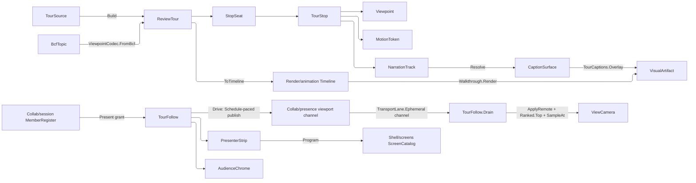

# [APPUI_REVIEW_TOUR]

The presentation surface is the client-facing design-review deliverable, and it is a PROJECTION: `ReviewTour` is a non-empty ordered `TourStop` sequence each binding one saved `Render/viewpoint#VIEWPOINT_CODEC` `Viewpoint`, a per-stop dwell `Duration` and a per-transition `Theme/motion#MOTION_AXIS` token; `TourProjection` lowers the tour onto ONE `Render/animation.md` camera `Track` timeline so playback, scrubbing, pose interpolation, and offline rendering all ride the animation engine — the former tour-local `Bracket`/`Walk` sampler and `WalkthroughTour.Render` clones are DELETED; `NarrationTrack` shapes a stop's caption through the `Theme/typography#ROLE_AXIS` role vocabulary and `CaptionSurface` draws it through the one shaping pipeline; `TourSource` is the one closed family discriminating a `SavedSequence` of viewpoint keys from a `TopicTour` that folds a `Collab/issues.md`-consumed `Rasm.Bim` BCF topic set into stops at the package edge. Presenter-follow is a COMPLETE two-sided arm on `Collab/presence#PRESENCE`'s viewport channel: the presenter's playhead publishes onto its own peer-keyed slot as a structured TTL-expiring ephemeral value once the `Collab/session#MEMBERSHIP` register grants it `SessionCapability.Present`, its cadence a `Schedule` rather than a caller's tick loop, and a follower drains the landed ephemeral lane, applies each remote frame, resolves the admitted presenter through the same register, decodes the playhead, samples the SAME projected timeline, and drives its viewport through the viewpoint-apply boundary — a publisher-only follow surface, an ungated shared playhead slot, and a second follow channel beside the presence owner are the three deleted forms. `PresenterStrip` and `AudienceChrome` are the two faces of that arm and seat as ONE `Shell/screens#SCREEN_CATALOG` `ScreenProgram`, while `StepAnnotations` binds each step to the settled redline tool surface. A tour mints no second camera-snapshot shape, no tour-local stopwatch, no sampler, no renderer, no raster path, no transport channel, no second markup model, and no second BCF schema — every concern is a projection over a settled owner.

## [01]-[INDEX]

- [02]-[TOUR_MODEL]: `ReviewTour` non-empty seat table; `TourStop` viewpoint + dwell + transition; the one index admission.
- [03]-[TOUR_PROJECTION]: The tour-to-timeline lowering; the seat lookup at a playhead; the two-sided presenter-follow arm with its schedule-paced publish and bounded-lane drain.
- [04]-[NARRATION]: Per-stop caption projected onto the typography role vocabulary; the shaping capsule; the walkthrough caption overlay.
- [05]-[TOUR_SOURCE]: `TourSource` closed family; saved-sequence and BCF-topic-set projections.
- [06]-[PRESENTER_CHROME]: The bounded presenter transport and its seated screen; the audience follow chrome over the sync-posture family; per-step annotation binding.

## [02]-[TOUR_MODEL]

- Owner: `TourFault` the direct generated `[Union]` with one `[FaultCase]` leaf per tour failure; `TourOps` the operation keys the admissions demand under; `TourStop` `[ComplexValueObject]` the structural-identity stop binding a saved `Viewpoint` with its dwell `Duration`, transition `MotionToken`, and narration; `TourKey` `[ValueObject<string>]` the admitted tour identity; `StopSeat` the ordinal-and-offset row every reader of the stop sequence takes; `ReviewTour` the non-empty ordered tour and its ONE index admission.
- Cases: a stop binds exactly one `Viewpoint`, one dwell duration, one transition token, and one `Option<NarrationTrack>` (None IS the silent stop) — there is no stop-kind axis because every stop is the same shape; the tour-source variation lives on `TOUR_SOURCE`, never on the stop.
- Entry: `public static Fin<ReviewTour> Of(string key, Seq<TourStop> stops)` — the accumulating admission, a blank key and an empty stop set naming themselves in ONE refusal; `public Fin<StopSeat> Seat(int index)` — the one index admission both the direct jump and the offset read cross; `public int Bounded(int candidate)` — the transport's own hold-at-the-ends projection; `public StopSeat SeatAt(Duration t)` — the seat a playhead position sits in.
- Packages: Rasm (project — `FaultBand`, `[FaultCase]`, `Fault`), Thinktecture.Runtime.Extensions, LanguageExt.Core, NodaTime
- Growth: a new stop concern is one `TourStop` member; a new transition is one `Theme/motion#MOTION_AXIS` token consumed here; a new fault is one `[FaultCase]` ordinal plus its `TourFault` case; zero new surface.
- Boundary:
  - `TourStop` is structural-identity, so two stops with the same viewpoint, dwell, transition, and narration are equal and the identity rides the bound owners rather than a stop-local guid. Dwell and transition trace to the motion vocabulary, so a tour never carries a raw duration or easing-curve literal — exactly as an animation keyframe traces its easing to a `MotionToken` row.
  - The bound `Viewpoint` is the one portable view-state the viewport mints, so a tour stop holds no second camera shape and applying a stop drives the viewport camera and section through the viewpoint codec.
  - Non-emptiness is the SHAPE: `ReviewTour` carries a LEAD stop beside its rest, exactly as `Render/animation#TRACK_MODEL` `Keyframes<T>` does, so the timeline seed reads a total head, `SeatAt` is total, and the empty-tour guard the projection used to re-take at the edge has no spelling left. The `Of` entry's own admission mints that shape and refuses the empty seq by name.
  - ONE index space, TWO named disciplines: `Seat(index)` returns `Fin` because an ABSOLUTE index arrives from a step list, a deep link, or a restored checkpoint and can name a stop the tour no longer carries, while `Bounded(candidate)` answers an `int` because a RELATIVE step's bound is the transport's own hold-at-the-ends law. The clamp is a projection rather than a refusal, so no caller reaches a refusal a clamped input can never produce.
  - The seat table is minted ONCE at construction, so the total duration, the step list, the elapsed indicator, and the narration index are four reads of one fold rather than four prefix re-folds.

```csharp


// --- [CONSTANTS] -----------------------------------------------------------------------
public static class TourOps {
}

// --- [ERRORS] --------------------------------------------------------------------------
[Union(ConversionFromValue = ConversionOperatorsGeneration.None)]
public abstract partial record TourFault : Fault {
    private static readonly FaultBand FamilyBand = FaultBand.Tour;
    private TourFault(string detail) { Detail = detail; }

    public string Detail { get; }

    public override string Message => Detail;

    [FaultCase(0)]
    public sealed partial record Empty(string Key) : TourFault($"presentation/empty-tour: {Key}");
    [FaultCase(1)]
    public sealed partial record StopOutOfRange(string Key, int Index, int Count) : TourFault($"presentation/stop-out-of-range: {Key}[{Index}/{Count}]");
}

// --- [MODELS] --------------------------------------------------------------------------
[ComplexValueObject]
public sealed partial class TourStop {
    public const string UntitledKey = "tour.step.untitled";

    public Viewpoint View { get; }
    public Duration Dwell { get; }
    public MotionToken Transition { get; }
    public Option<NarrationTrack> Narration { get; }

    public Duration Span => Transition.Duration + Dwell;

    public string TitleKey => Narration.Map(static track => track.Title).IfNone(UntitledKey);

    static partial void ValidateFactoryArguments(
        ref ValidationError? validationError, ref Viewpoint view, ref Duration dwell, ref MotionToken transition,
        ref Option<NarrationTrack> narration) =>
        validationError =
            (Col(dwell >= Duration.Zero, $"a non-negative dwell (read {dwell})"),
             Col(dwell + transition.Duration > Duration.Zero, "a stop spanning more than zero"))
            .Apply(static (_, _) => unit)
            .Match(
                Succ: static _ => null,
                Fail: static defects => new ValidationError(defects.Message));

    private static Validation<Error, Unit> Col(bool holds, string requirement) =>
        holds
            ? Validation<Error, Unit>.Success(unit)
            : Validation<Error, Unit>.Fail(new KernelFault.InvalidValue("tour stop", requirement, Some(TourOps.Stop)));

    public static Fin<TourStop> Admit(
        Viewpoint view, Duration dwell, MotionToken transition, Option<NarrationTrack> narration) =>
        FactoryBridge.Accept<TourStop>(
            Validate(view, dwell, transition, narration, obj: out TourStop? stop), stop);
}

[ValueObject<string>]
public readonly partial struct TourKey {
    static partial void ValidateFactoryArguments(ref ValidationError? validationError, ref string value) {
        value = value.Trim();
        if (value.Length == 0) { validationError = new ValidationError(string.Join(" | ", new object?[] { "presentation/blank-key" })); }
    }
}

public readonly record struct StopSeat(int Index, TourStop Stop, Duration Offset) {
    public Duration End => Offset + Stop.Span;
}

public sealed record ReviewTour {
    private ReviewTour(TourKey key, TourStop lead, Seq<TourStop> rest) {
        (Key, Lead, Rest) = (lead, rest);
        (Seats, Opening, Trailing) = Seated(lead, rest);
        Total = Trailing.End;
    }

    public TourKey Key { get; }

    public TourStop Lead { get; }

    public Seq<TourStop> Rest { get; }

    public Seq<StopSeat> Seats { get; }

    public StopSeat Opening { get; }

    public StopSeat Trailing { get; }

    public Duration Total { get; }

    public static Fin<ReviewTour> Of(string key, Seq<TourStop> stops) =>
        (FactoryBridge.Accept<TourKey>(candidate: key).ToValidation(),
         stops.Head.ToValidation<Error, TourStop>(new TourFault.Empty()))
        .Apply(static (admitted, lead) => (Key: admitted, Lead: lead))
        .ToFin()
        .Map(seed => new ReviewTour(seed.Key, seed.Lead, stops.Tail));

    public Fin<StopSeat> Seat(int index) =>
        index >= 0 && index < Seats.Count
            ? Fin.Succ(Seats[index])
            : Fin.Fail<StopSeat>(new TourFault.StopOutOfRange(Key.Value, index, Seats.Count));

    public int Bounded(int candidate) => Math.Clamp(candidate, 0, Seats.Count - 1);

    public StopSeat SeatAt(Duration t) => Seats.Find(seat => t <= seat.End).IfNone(Trailing);

    static (Seq<StopSeat> Seats, StopSeat Opening, StopSeat Trailing) Seated(TourStop lead, Seq<TourStop> rest) =>
        new StopSeat(0, lead, Duration.Zero) switch {
            var head => rest.Fold(
                (Seats: Seq(head), Opening: head, Trailing: head),
                static (state, stop) =>
                    new StopSeat(state.Trailing.Index + 1, stop, state.Trailing.End) switch {
                        var seat => (state.Seats.Add(seat), state.Opening, seat),
                    }),
        };
}
```

## [03]-[TOUR_PROJECTION]

- Owner: `TourProjection` — the ONE lowering from a `ReviewTour` onto a `Render/animation.md` `Timeline`; `FrameIndex` `[ValueObject<long>]` — the playhead ordinal admitted once; `PresenterSeat` — the presenter and their published frame as one answer; `SyncTolerance` and `SyncPosture` — the caught-up window and the signed verdict it elects; `TourFollow` — the two-sided presenter-follow arm over the projected timeline.
- Entry: `public static Fin<Timeline> ToTimeline(ReviewTour tour, double fps, PlaybackMode mode)` — projects the stops onto one camera `Track`; `public static Fin<TourFollow> Of(SessionPresence session, ReviewTour tour, double fps, PlaybackMode mode, SyncTolerance tolerance, HostSink sink)` — binds the follow arm to the SAME projected timeline both presenter and follower sample; `public Fin<Unit> Publish(FrameIndex frame)` — the gated single publish; `public IO<TransportState> Drive(Schedule cadence, Func<TransportState> transport)` — the schedule-paced publish loop over a LIVE transport read; `public IAsyncEnumerable<Fin<Unit>> Drain(CollabTransport transport, Func<ViewCamera, IO<Unit>> applyCamera, CancellationToken stopping)` — the follower's whole receive path; `public Fin<Option<PresenterSeat>> Presenter()` — the register-backed presenter election.
- Auto: each stop contributes a transition-end keyframe (its camera, eased by its transition token) and a dwell-end keyframe (the same camera, hold), so `Timeline.SampleAt` reproduces dwell-hold plus eased fly-through through the ONE bracketing sampler and `TrackInterp.Pose` — a tour-local `Bracket`/`Walk` sampler, a `lerpCam` delegate, or an interpolation-policy PARAMETER is the DELETED form, because a track case names its own blend; the `PlaybackMode` is playhead policy, so a presentation runs `Once` while a kiosk loop runs `Loop` with zero tour-local replay logic; scrub, kinematic playback, and reduced-motion selection all ride the animation owners (`TransportState`, `Scrub.To`, `Scrub.Kinematic`, `ReducedMotion.Select` applied ONCE per stop at projection so a reduced-motion tour snaps stops without the spring); the offline tour render IS `animation.Walkthrough.Render` over the projected timeline with the moved `Document/export.md` `VisualDestination` and the per-frame caption drawn by `NARRATION`'s overlay — the former `WalkthroughTour.Render` clone is deleted, and a flythrough clip rides the walkthrough's own `ClipEncoder.Mux` streamed-frame composition.
- Boundary: offline rendering returns the animation walkthrough artifact; navigation and follower camera application return the viewport's canonical apply result; this page declares no instrument of its own.
- Packages: LoroCs (via `Collab/presence.md` owners), Rasm (project — `FaultCell`, `HostSink`), Thinktecture.Runtime.Extensions, LanguageExt.Core, NodaTime, BCL inbox (`System.Threading.Channels` via `CollabTransport`)
- Growth: a new playback concern is an animation-owner row, never a tour-local engine; a new follow field is one `CollabColumn` row inside the structured playhead value; a new sync verdict is one `SyncPosture` case; zero new surface.
- Boundary:
  - The tour is structurally ONE camera `Track` played through the animation engine, and that identity is literal in the fence. The playhead is MEMOIZED on the arm because it is a pure function of the timeline — rebuilding it per follow tick paid a construction for a value that cannot have changed.
  - Presenter-follow rides `Collab/presence#PRESENCE`'s viewport channel and BOTH halves live here: publisher state and follower interpretation, so the advertised capability has an owned receive path. The value is a structured column-keyed map a follower reads back through the same `LoroVal.Field` owner that wrote it; an opaque formatted playhead string is the deleted form.
  - The slot is PEER-QUALIFIED under its own key prefix, exactly as `Collab/presence#PRESENCE_CHROME`'s overlay slot is — the prefix, not the vocabulary, separates two writers on one channel, and one shared key made the channel last-write-wins across peers.
  - The viewport channel carries its own gate AT THIS PRODUCER: `Collab/session#SESSION_PRESENCE` gates the awareness claim and governs no write here, so `Publish` reads the durable register for `SessionCapability.Present` and a peer without the grant occupies no slot. Presence stays display-only and never authorizes.
  - The publish CADENCE is a `Schedule`, not a caller's tick loop. The capability read is per-frame by law — an evicted or demoted presenter stops driving followers at the next frame rather than at the next bind — so the driver repeats one publish on the declared curve over a LIVE read of the ONE transport the composing surface holds, and a refusal PARKS on the composition-minted fault cell rather than tearing the loop down, so a re-granted role resumes without a re-bind.
  - The follower's arrival transport is the LANDED ephemeral lane, never a second channel: `Collab/presence#LIVE_WIRE` already binds `Channel.CreateBounded` under `TransportLane.Ephemeral`, whose `DropOldest` IS the shed law a stale playhead wants — a camera position the next frame supersedes is precisely the element that should be discarded under pressure. A drain that halted on one malformed peer update would freeze a viewer's viewport mid-review, so every frame's verdict leaves and the next frame still drives.
  - An absent, expired, or foreign-tour playhead drives nothing and is not a fault; the follower's camera lands through the viewpoint-apply boundary the viewport owns, never a tour-local camera write.
  - The presenter a follower obeys is a REGISTER answer, never a channel one, and the ELECTION is bounded top-one by peer through the kernel `Ranked` owner — so two admitted presenters resolve identically at every follower instead of racing on write order. NAMED LOSS: the prior full sort's lazy short-circuit after the first decode is gone; the candidate set is now the granted-and-publishing seats alone, which the roster's own present grants bound.
  - The viewport sweep runs FIRST and on its own account: the seat join sweeps the AWARENESS channel, a different channel, so a presenter who closed their laptop keeps a playhead slot standing until the viewport store evicts it.
  - The reduced-motion law applies once at projection, never a tour-local accessibility conditional; three reads of a process-wide switch inside one fold arm could observe a mid-projection flip and emit a keyframe whose eased duration and eased token disagree.

```csharp
// --- [TYPES] ---------------------------------------------------------------------------
[ValueObject<long>]
public readonly partial struct FrameIndex {
    static partial void ValidateFactoryArguments(ref ValidationError? validationError, ref long value) {
        if (value < 0L) { validationError = new ValidationError(string.Join(" | ", new object?[] { $"presentation/negative-playhead:{value}" })); }
    }
}

[Union(ConversionFromValue = ConversionOperatorsGeneration.None)]
public abstract partial record SyncPosture {
    private SyncPosture() { }

    public sealed record CaughtUp : SyncPosture;
    public sealed record Ahead(long Frames) : SyncPosture;
    public sealed record Behind(long Frames) : SyncPosture;

    public static SyncPosture Of(long local, long presenter, long tolerance) =>
        (presenter - local) switch {
            var delta when Math.Abs(delta) <= tolerance => new CaughtUp(),
            var delta when delta > 0L => new Behind(delta),
            var delta => new Ahead(-delta),
        };
}

// --- [MODELS] --------------------------------------------------------------------------
public readonly record struct SyncTolerance(Duration Slack) {
    public static readonly SyncTolerance Default = new(Duration.FromMilliseconds(80d));

    public long FramesAt(Playhead head) => (long)Math.Round(head.Fps.Value * Slack.TotalSeconds);
}

public readonly record struct PresenterSeat(SessionSeat Seat, FrameIndex Frame);

// --- [OPERATIONS] ----------------------------------------------------------------------
public static class TourProjection {
    public static Fin<Timeline> ToTimeline(ReviewTour tour, double fps, PlaybackMode mode) =>
        Track.OfCamera(
                tour.Key.Value,
                new Keyframe<ViewCamera>(Duration.Zero, tour.Lead.View.Camera, MotionToken.Instant)
                    .Cons(tour.Seats.Bind(Framed)))
            .Bind(track => Timeline.Of(tour.Key.Value, Seq(track), fps, mode));

    static Seq<Keyframe<ViewCamera>> Framed(StopSeat seat) =>
        ReducedMotion.Select(seat.Stop.Transition) switch {
            var eased => (eased.Duration > Duration.Zero
                    ? Seq(new Keyframe<ViewCamera>(seat.Offset + eased.Duration, seat.Stop.View.Camera, eased))
                    : Seq<Keyframe<ViewCamera>>())
                .Add(new Keyframe<ViewCamera>(seat.End, seat.Stop.View.Camera, MotionToken.Instant)),
        };
}

public sealed record TourFollow(
    SessionPresence Session,
    ReviewTour Tour,
    Timeline Line,
    Playhead Head,
    SyncTolerance Tolerance,
    HostSink Sink) {
    public const string PlayheadPrefix = "tour/playhead/";

    public static string PlayheadKey(ulong peer) =>
        $"{PlayheadPrefix}{peer.ToString(CultureInfo.InvariantCulture)}";

    public static Fin<TourFollow> Of(
        SessionPresence session, ReviewTour tour, double fps, PlaybackMode mode, SyncTolerance tolerance,
        HostSink sink) =>
        TourProjection.ToTimeline(tour, fps, mode)
            .Map(line => new TourFollow(session, tour, line, line.Playhead(), tolerance, sink));

    public SyncPosture Posture(FrameIndex local, FrameIndex presenter) =>
        SyncPosture.Of(local.Value, presenter.Value, Tolerance.FramesAt(Head));

    public Fin<Unit> Publish(FrameIndex frame) =>
        from row in MemberRegister.Read(Session.Document, Session.Presence.Peer)
        from role in row.Role.ToFin(new SessionFault.Conflict(
            $"presentation/{Session.Presence.Peer}: admitted row carries no role"))
        from _held in guard(
            role.Holds(SessionCapability.Present),
            (Error)new SessionFault.Unauthorized(
                $"presentation/{Session.Presence.Peer}:{role.Key} lacks {SessionCapability.Present.Key}"))
        from _written in Session.Presence.PublishViewport(PlayheadKey(Session.Presence.Peer), LoroVal.Of(
            (CollabColumn.Tour, LoroVal.Of(Tour.Key.Value)),
            (CollabColumn.Frame, LoroVal.Of(frame.Value))))
        select unit;

    public IO<TransportState> Drive(Schedule cadence, Func<TransportState> transport) =>
        IO.lift(() => Ticked(transport())).RepeatWhile(cadence, static state => state.Playing);

    TransportState Ticked(TransportState state) {
        ignore(FactoryBridge.Accept<FrameIndex, long>(state.Head.Index)
            .Bind(Publish)
            .IfFail(error => Sink.Faults.Park(Sink.Point, error)));
        return state;
    }

    public async IAsyncEnumerable<Fin<Unit>> Drain(
        CollabTransport transport,
        Func<ViewCamera, IO<Unit>> applyCamera,
        [EnumeratorCancellation] CancellationToken stopping = default) {
        await foreach (CollabFrame frame in transport.Drain(stopping).ConfigureAwait(false)) {
            yield return await Follow(frame.Delta, applyCamera).RunAsync().ConfigureAwait(false);
        }
    }

    public IO<Fin<Unit>> Follow(ReadOnlyMemory<byte> update, Func<ViewCamera, IO<Unit>> applyCamera) =>
        (from presenter in new FinT<IO, Option<PresenterSeat>>(
             IO.lift<Fin<Option<PresenterSeat>>>(() =>
                 Session.Presence.ApplyRemote(PresenceKind.Viewport, update).Bind(_ => Presenter())))
         from applied in FinT.liftIO<IO, Unit>(presenter
             .Bind(at => Line.SampleAt(Head.TimeOf(at.Frame.Value)).Camera)
             .Match(Some: applyCamera, None: static () => IO.pure(unit)))
         select applied).runFin.As();

    public Fin<Option<PresenterSeat>> Presenter() =>
        CollabDoc.Lift(() => { Session.Presence.Viewport.RemoveOutdated(); return unit; })
            .Bind(_ => Session.Seats())
            .Map(seats => Ranked.Top(
                    seats.Filter(Presenting).Choose(Seated),
                    keep: 1,
                    static row => row.Seat.Peer,
                    ExtremumDirection.Minimum)
                .Head);

    static bool Presenting(SessionSeat seat) =>
        seat.Member.State == MembershipState.Joined
        && seat.Member.Role.Exists(static role => role.Holds(SessionCapability.Present));

    Option<PresenterSeat> Seated(SessionSeat seat) =>
        Optional(Session.Presence.Viewport.Get(PlayheadKey(seat.Peer)))
            .Map(static leaf => new LoroVal(leaf))
            .Bind(held => held.Field(CollabColumn.Tour, static leaf => leaf.Text)
                .Filter(key => key == Tour.Key.Value)
                .Bind(_ => held.Field(CollabColumn.Frame, static leaf => leaf.Whole)))
            .Bind(static frame => FactoryBridge.Accept<FrameIndex, long>(frame).ToOption())
            .Map(frame => new PresenterSeat(seat, frame));
}
```

## [04]-[NARRATION]

- Owner: `NarrationTrack` the per-stop caption record carrying its title and body keyed to the typography role vocabulary and its own role projection; `NarrationRow` the resolved role/style/text row; `CaptionSurface` the shaping capsule and the one draw; `TourCaptions` the walkthrough overlay arrow.
- Entry: `public Seq<NarrationRow> Resolve(FontChain chain)` on `NarrationTrack` — projects the title and body onto the resolved `TextStyleRow` for the `Title` and `Body` roles through the one `TextStyleRow.Resolve` fold; `public Fin<Unit> Draw(NarrationTrack track, SKCanvas canvas, SKPaint paint, float x, double y)` on `CaptionSurface` — the shaped draw; `public static Func<Duration, SKCanvas, Fin<Unit>> Overlay(ReviewTour tour, CaptionSurface surface, SKPaint paint, float x, double y)` on `TourCaptions` — the per-frame caption the offline walkthrough draws.
- Auto: a narration carries a title and an optional body, each a `TypographyRole` row reference, so a tour caption renders in the same role vocabulary the inspector and the document panel render; the shaped text rides the `Theme/typography#TEXT_SHAPING` `Fin`-typed `ShapingSurface.Shape`-then-`DrawLabel` HarfBuzz pipeline — the itemizer elects a covering face per segment, the role's own feature intents intersect what each face proved, the shaped text is a `BudgetedCache` lease the caller never disposes, and a shaping or draw refusal folds its typed typography fault to the caller — so the caption glyphs shape before they raster exactly as every Skia-rendered glyph shapes; the face request is the generated `TypographyMap.ToRequest` mapper rather than a hand-built key, so a role's own resolved style decides the face and this page names no font capability of its own.
- Packages: SkiaSharp, SkiaSharp.HarfBuzz, Thinktecture.Runtime.Extensions, LanguageExt.Core, NodaTime
- Growth: a new caption channel is one `NarrationTrack` member keyed to its role; a new surface class is one `CaptionSurface` mint naming its `RenderPosture`; zero new surface.
- Boundary:
  - The narration is the typography role projection, so a second text model inside `Collab/` is the deleted form — the title rides `TypographyRole.Title` and the body `TypographyRole.Body`, and a hard-coded font size or weight on a tour caption is the named defect.
  - The whole shaping context is ONE capsule. Nine parameters threaded per call is ceremony pushed onto callers, and every one of them is a value the composing surface already holds for its own text; the capsule also PINS the posture, so the walkthrough's device-linear reading is a mint rather than an argument each caller must remember.
  - The line cursor accumulates in the metric's OWN `double` and narrows to Skia's `float` once at the draw, so a long caption cannot accumulate the rounding a per-line narrowing introduced.
  - Silence is `Option<NarrationTrack>.None` on the stop owner — a sentinel string, an empty-title probe, or a `Silent` instance is the deleted form; the title is required by the one `Fin`-returning admission and the body is `Option<string>` so a caption-only or full-narration stop is one shape.
  - The offline caption is an OVERLAY on the canvas the walkthrough's frame delegate already holds, never an image this page produced: no raster path is this page's declared law, so the caption draws and the walkthrough's own encode leg owns every pixel that leaves.

```csharp
// --- [MODELS] --------------------------------------------------------------------------
public sealed record NarrationTrack {
    private NarrationTrack(string title, Option<string> body) { Title = title; Body = body; }

    public string Title { get; }
    public Option<string> Body { get; }

    public static Fin<NarrationTrack> Of(string title, Option<string> body) =>
        Acceptance.Text(title).Map(admitted => new NarrationTrack(admitted, body));

    public Seq<NarrationRow> Resolve(FontChain chain) =>
        new NarrationRow(TypographyRole.Title, TextStyleRow.Resolve(TypographyRole.Title, chain), Title)
            .Cons(Body
                .Map(body => new NarrationRow(
                    TypographyRole.Body, TextStyleRow.Resolve(TypographyRole.Body, chain), body))
                .ToSeq());
}

public readonly record struct NarrationRow(TypographyRole Role, TextStyleRow Style, string Text);

// --- [SERVICES] ------------------------------------------------------------------------
public sealed record CaptionSurface(
    RunSpec Spec,
    FaceCabinet Cabinet,
    BudgetedCache<ShapeKey, ShapedText> Cache,
    FontChain Chain,
    PalettePosture Palette,
    RenderPosture Posture) {
    public static CaptionSurface Paged(
        RunSpec spec, FaceCabinet cabinet, BudgetedCache<ShapeKey, ShapedText> cache, FontChain chain,
        PalettePosture palette) =>
        new(spec, cabinet, cache, chain, palette, RenderPosture.Paged);

    public Fin<Unit> Draw(NarrationTrack track, SKCanvas canvas, SKPaint paint, float x, double y) =>
        track.Resolve(Chain)
            .Fold(Fin.Succ(y), (cursor, row) => cursor.Bind(at => ShapingSurface
                .Shape(
                    row.Text, row.Style, Spec,
                    TypographyMap.ToRequest(row.Style, Chain, Palette, Seq(Spec.Language.Name)),
                    Cabinet, Posture, Cache)
                .Bind(shaped => ShapingSurface.DrawLabel(canvas, shaped, paint, x, (float)at)
                    .Map(_ => at + row.Style.LineBox))))
            .Map(static _ => unit);
}

// --- [OPERATIONS] ----------------------------------------------------------------------
public static class TourCaptions {
    public static Func<Duration, SKCanvas, Fin<Unit>> Overlay(
        ReviewTour tour, CaptionSurface surface, SKPaint paint, float x, double y) =>
        (at, canvas) => tour.SeatAt(at).Stop.Narration.Match(
            Some: track => surface.Draw(track, canvas, paint, x, y),
            None: static () => Fin.Succ(unit));
}
```

## [05]-[TOUR_SOURCE]

- Owner: `TourSource` `[Union]` the one closed tour-origin family; `SequenceStop` the saved-sequence source row; `SavedSequence` the ordered saved-viewpoint-key projection; `TopicTour` the BCF-topic-set projection folding a `Rasm.Bim` topic set into stops at the package edge.
- Cases: `TourSource` = `SavedSequence` | `TopicTour` — a saved sequence orders stored viewpoint keys with their per-stop dwell and transition, and a topic tour expands every viewpoint of every coordination topic through the viewpoint codec under its own declared dwell and transition; one new tour origin is one `TourSource` case the generated total `Switch` breaks at every site.
- Entry: `public Fin<ReviewTour> Build(Func<string, Fin<Viewpoint>> resolve, Func<string, int> revision, Instant at)` — the generated total switch projects each source onto the one `ReviewTour` keyed by the source's own `Key` field, the revision arrow binding the `Render/viewpoint#VIEW_REGISTRY` `ViewRevisions` minter every inbound BCF viewpoint draws its per-key reading from; the saved-sequence arm resolves each key to its stored viewpoint, the topic-tour arm folds each `BcfTopic` viewpoint to a stop through `ViewpointCodec.FromBcf`, and every stop admits through the `TourStop.Admit` bridge so a bad saved dwell folds typed instead of throwing through the generated factory inside the traversal.
- Packages: Thinktecture.Runtime.Extensions, LanguageExt.Core, NodaTime, Rasm.Bim (project)
- Growth: a new tour origin is one `TourSource` case plus its one `Build` arm; a new BCF mapping rides the existing topic projection; zero new surface.
- Boundary:
  - `TourSource` is the one closed family, so a parallel tour-builder per origin is the deleted form — two origins are two cases of one union with a generated total `Switch`, never two builder classes.
  - `TopicTour` composes the `Rasm.Bim/Review/issues#BCF_ARCHIVE` `BcfTopic`/`BcfViewpoint` contract at the package edge exactly as `Collab/issues#ISSUE_MODEL` does: AppUi owns the `ReviewTour` projection while `Rasm.Bim` owns the openBIM topic exchange, and a second BCF model or a direct `.bcfzip` reader here is the rejected form. Each BCF viewpoint binds onto the AppUi `Viewpoint` through `ViewpointCodec.FromBcf`, so a topic tour's saved view uses the one portable view state.
  - The per-stop dwell and transition are the source ROW's own columns on BOTH arms, defaulting to motion tokens — the prior form claimed a topic row could override them while carrying no column to override with, so a topic tour's whole timing was two unconditional literals wearing a policy's name. Every value still traces to the motion catalog; a raw duration literal is unspellable.
  - Each arm carries EXACTLY its own context: the saved arm takes the viewpoint resolver and the topic arm takes the capture instant beside the revision arrow, so neither state tuple carries a leg the other needs. `ViewpointCodec.FromBcf` reads an `Instant`, not a clock — an APP-stratum clock policy never crosses downward into this package — and it reads a MINTED revision rather than one it invents, because BCF carries no count of its own and a fabricated constant ties every re-import at the depot.
  - A stop REQUIRES a viewpoint by construction, so a viewpoint-less topic contributes no stop, and an all-viewpoint-less topic set fails `ReviewTour.Of` as the empty tour rather than succeeding silently.
  - The saved-sequence arm resolves keys through the caller-supplied `resolve` delegate, so the source mints no viewpoint store and reads the settled viewpoint persistence.

```csharp
// --- [MODELS] --------------------------------------------------------------------------
public readonly record struct SequenceStop(
    string ViewpointKey, Duration Dwell, MotionToken Transition, Option<NarrationTrack> Narration);

[Union(ConversionFromValue = ConversionOperatorsGeneration.None)]
public abstract partial record TourSource {
    private TourSource() { }

    public sealed record SavedSequence(string Key, Seq<SequenceStop> Stops) : TourSource;
    public sealed record TopicTour(
        string Key,
        Seq<Rasm.Bim.Coordination.BcfTopic> Topics,
        Duration Dwell,
        MotionToken Transition) : TourSource {
        public static TopicTour Of(string key, Seq<Rasm.Bim.Coordination.BcfTopic> topics) =>
            new(topics, MotionToken.SpringGentle.Duration, MotionToken.Emphasized);
    }

    public Fin<ReviewTour> Build(Func<string, Fin<Viewpoint>> resolve, Func<string, int> revision, Instant at) =>
        Switch(
            state: (Resolve: resolve, Revision: revision, At: at),
            savedSequence: static (ctx, sequence) =>
                sequence.Stops
                    .TraverseM(stop => ctx.Resolve(stop.ViewpointKey)
                        .Bind(view => TourStop.Admit(view, stop.Dwell, stop.Transition, stop.Narration)))
                    .As()
                    .Bind(stops => ReviewTour.Of(sequence.Key, stops)),
            topicTour: static (ctx, topic) =>
                topic.Topics
                    .Bind(held => held.Viewpoints.Map(viewpoint => (Topic: held, Viewpoint: viewpoint)))
                    .TraverseM(row => NarrationTrack
                        .Of(
                            row.Topic.Title,
                            row.Topic.Comments.Head
                                .Map(static comment => comment.Text)
                                .Filter(static text => !string.IsNullOrEmpty(text)))
                        .Bind(narration => ViewpointCodec
                            .FromBcf(row.Viewpoint.Guid, ctx.Revision(row.Viewpoint.Guid), row.Viewpoint, ctx.At)
                            .Bind(view => TourStop.Admit(view, topic.Dwell, topic.Transition, Some(narration)))))
                    .As()
                    .Bind(stops => ReviewTour.Of(topic.Key, stops)));
}
```



## [06]-[PRESENTER_CHROME]

- Owner: `PresenterStrip` the presenter's transport over the settled projection and its seated screen program; `AudienceState` `[Union]` the follower's three legal readings; `AudienceChrome` the follower-side chrome; `StepAnnotations` the per-step markup binding.
- Cases: `AudienceState` = `Idle` | `Observing(SessionSeat)` | `Watching(SessionSeat, SyncPosture)` — nobody presenting, a presenter this viewer does not follow, and a presenter this viewer follows with the sync verdict between them.
- Entry: `public Fin<PresenterStrip> Step(int delta)` and `public Fin<PresenterStrip> Seek(int index)` — the bounded transport and the direct jump; `public Fin<Unit> Present(FrameIndex frame)` — the publish through the settled gated playhead; `public ControlIntent Body(VirtualWindowSpec window)` and `public static ScreenProgram Program(ScreenComposition composition)` — the seat; `public Fin<AudienceState> State(FrameIndex local)` and `public AudienceChrome Toggle()` on `AudienceChrome`; `public IO<Fin<TriageBoard>> Commit(TriageBoard board, Guid issueGuid, Seq<PenSample> samples, ulong author, IClock clock, RedlinePlacement placement)` on `StepAnnotations` — the capture-through-landing verb.
- Auto: the chrome is PRESENTATION over settled machinery and adds no engine — the timeline, the capability gate, the peer-keyed playhead slot, the publish cadence, and the camera apply are all landed, so this section owns only what a presenter and an audience SEE; the step list IS the tour's own seat table, so the strip renders `Tour.Seats` and mints no peek row of its own; step motion is BOUNDED because a presentation has a first and a last stop and wrapping from the end back to the beginning mid-review reads to an audience as a control error, while a direct jump past the ends is a typed fault on the tour's own out-of-range row; the elapsed indicator is the current seat's own OFFSET into the tour rather than a wall stopwatch, so a presenter who steps back reads their position in the presentation and the strip and the timeline can never disagree; the audience reads the SAME presenter resolution the follow arm obeys; per-step annotations compose the `Collab/issues#REDLINE_TOOLS` surface bound to the stop's own viewpoint, so the mark LANDS in the same verb that captured it.
- Packages: LoroCs (via `Collab/presence.md` owners), Thinktecture.Runtime.Extensions, LanguageExt.Core, NodaTime, Rasm.Bim (project — the markup payloads the annotation binding lands)
- Growth: a new transport verb is one `CommandRow` row this strip raises by key; a new step-list column is one `StopSeat` or `TourStop` member; a new audience reading is one `AudienceState` case breaking the chrome fold at compile time; zero new surface, zero new engine.
- Boundary:
  - Presentation ONLY — the strip mints no timeline, no sampler, no playhead policy, and no stopwatch, so a chrome-local clock, a chrome-local interpolation, and a chrome-local camera write are the three deleted forms. The tour reaches this chrome THROUGH the follow arm that already carries it; a second tour column beside `Follow.Tour` was two authorities for one value.
  - The presenter's playhead is the animation owner's `TransportState` frame admitted as a `FrameIndex`, so the strip PUBLISHES a frame it was handed rather than deriving one from a duration it would have to convert.
  - Publishing crosses the settled gate at its own producer on every frame, so a demoted presenter stops driving followers at the next frame and this chrome adds no second capability read. The audience chrome reads the presenter off the REGISTER-backed election, never a channel scan.
  - Follow and unfollow are audience-side and ungated by the presence ruling, exactly as the ad-hoc follow lease is, so the toggle carries no capability read. The FOLLOWING flag is a measured user fact with both states legal and no sibling flag sharing its regime, and it is the ONE authority — the state union derives which case it mints rather than mirroring the bool into a column that could drift.
  - Every key this chrome raises is a `Shell/commands#INTENT_TABLE` deck row by construction, because the deck's fold aborts on a key it does not carry and an unlifted roster is a dead screen.
  - The annotation binding constructs no markup model — `StrokeCapture` and `ViewpointMarkup` are the landed owners, and the viewpoint the mark lands on is DERIVED from the seat's own stop, so a caller cannot seat a step's redline against a viewpoint the step never bound.

```csharp
// --- [MODELS] --------------------------------------------------------------------------
[Union(ConversionFromValue = ConversionOperatorsGeneration.None)]
public abstract partial record AudienceState {
    private AudienceState() { }

    public sealed record Idle : AudienceState;
    public sealed record Observing(SessionSeat Presenter) : AudienceState;
    public sealed record Watching(SessionSeat Presenter, SyncPosture Posture) : AudienceState;
}

// --- [OPERATIONS] ----------------------------------------------------------------------
public sealed record PresenterStrip(TourFollow Follow, StopSeat Cursor) {
    public const string SessionKey = "tour.session";
    public const string PreviousIntent = "tour.previous";
    public const string NextIntent = "tour.next";
    public const string PeekIntent = "tour.steps";

    public static PresenterStrip Of(TourFollow follow) => new(follow, follow.Tour.Opening);

    public ReviewTour Tour => Follow.Tour;

    public Duration Elapsed => Cursor.Offset;

    public Duration Total => Tour.Total;

    public Fin<PresenterStrip> Step(int delta) => Seek(Tour.Bounded(Cursor.Index + delta));

    public Fin<PresenterStrip> Seek(int index) =>
        Tour.Seat(index).Map(seat => this with { Cursor = seat });

    public Fin<Unit> Present(FrameIndex frame) => Follow.Publish(frame);

    public ControlIntent Body(VirtualWindowSpec window) =>
        new ControlIntent.Panel(
            SessionKey,
            Seq(Transport(), Steps(window)),
            ConstraintProgram: SessionKey,
            IntentBinding.Of(PaintRole.Surface));

    ControlIntent Transport() =>
        new ControlIntent.Toolbar(
            $"{SessionKey}.transport",
            Seq(PreviousIntent, NextIntent, PeekIntent)
                .Map(static key => new ToolbarRow(Verb(), OverflowMode.Never)),
            Orientation.Horizontal,
            IntentBinding.Of(PaintRole.Panel));

    ControlIntent Steps(VirtualWindowSpec window) =>
        new ControlIntent.Tree(
            $"{SessionKey}.steps",
            new ControlIntent.Label(
                $"{SessionKey}.step", Cursor.Stop.TitleKey, TypographyRole.Body,
                IntentBinding.Of(PaintRole.Text)),
            PeekIntent,
            window,
            IntentBinding.Of(PaintRole.Panel));

    static ControlIntent Verb(string key) =>
        new ControlIntent.Button($"{key}.label",
            IntentBinding.Of(PaintRole.Accent, ControlEmphasis.Quiet) with { Command = Some() });

    public static ScreenProgram Program(ScreenComposition composition) =>
        ScreenProgram.Of(SessionKey, screen => composition.Tour(screen.Surface).Body(composition.Window));
}

public sealed record AudienceChrome(TourFollow Follow, bool Following) {
    public const string FollowIntent = "tour.follow";
    public const string UnfollowIntent = "tour.unfollow";

    public Fin<AudienceState> State(FrameIndex local) =>
        Follow.Presenter().Map(found => found.Match(
            Some: row => Following
                ? (AudienceState)new AudienceState.Watching(row.Seat, Follow.Posture(local, row.Frame))
                : new AudienceState.Observing(row.Seat),
            None: static () => new AudienceState.Idle()));

    public AudienceChrome Toggle() => this with { Following = !Following };
}

public sealed record StepAnnotations(StopSeat Seat, RedlineToolState Tools) {
    public IO<Fin<TriageBoard>> Commit(
        TriageBoard board, Guid issueGuid, Seq<PenSample> samples, ulong author, IClock clock,
        RedlinePlacement placement) =>
        (from stroke in FinT.lift<IO, RedlineStroke>(Error.New(Tools.Message, Tools))
         from seated in new FinT<IO, TriageBoard>(
             StrokeCapture.Commit(board, issueGuid, Seat.Stop.View.Key, stroke, placement))
         select seated).runFin.As();
}
```

## [07]-[RESEARCH]

(none)
