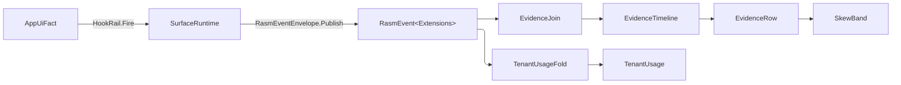

# [APPUI_DIAGNOSTICS_EVIDENCE]

Rasm.AppUi evidence is one rail. Every durable UI fact is one `AppUiFact` case fired at its own `AppUiPoint` seat on the package's one kernel `HookRail`; the composition's one observe tap lowers the case onto the generated `Ui.EvidenceWire`, publishes it as a CloudEvent through the kernel envelope door, and hands the admitted event to the binding leg and the live window. The telemetry spine owns AppUi scope identity, the dimension vocabulary, the meter mount, and the event source every `rasm.appui.*` declaration writes under; one correlation join folds the event stream into uncertainty-grouped timelines the document plane paginates; `[FAULT_FLOOR]` binds every AppUi failure to a direct generated fault union case. Capture, headless derivation, the dev loop, and the governor are sibling owners (`proof.md`, `devloop.md`, `governor.md`).

Kernel vocabulary arrives whole from the signal capsule: the causal frame (`TelemetrySource`, `CorrelationId`, `TenantContext`, `HlcStamp`, `Hlc`, `TraceCarrier`), the message envelope (`EventType`, `EventSource`, `EventId`, `RasmEventMint<T>`, `RasmEvent<T>`, `EventExtensionContract<T>`, `RasmEventEnvelope.Publish`), the instrument mechanism (`InstrumentSpec` over `InstrumentKind` x `MeasureForm`, `Buckets`, `LevelCells`, `InstrumentSet`, `TelemetryContributorPort`, `TelemetryIdentity`), the hook rail (`HookId`, `TraceScope`, `HookModality`, `IHookRoster<TSelf>`, `IHookFact<TPoint>`, `HookRail<TPoint,TFact,TOwner>`, `HookTap`), the fault floor (`FaultBand`, `[FaultCase]`, `Fault`), and the SLO algebra (`Sli`, `Objective`, `BoardPack`, `PanelSpec`). Generated `rasm.contracts.event.Extensions` is the one extension vocabulary the publish door stamps.

## [01]-[INDEX]

- [02]-[EVIDENCE_UNION]: The `AppUiPoint` seat roster, the closed `AppUiFact` union, its generated `EvidenceMap` seam onto `EvidenceWire`, and the one observe tap that publishes every fired fact as a CloudEvent.
- [03]-[TELEMETRY_SPINE]: AppUi scope identity, the event source, the dimension vocabulary, the contribution and meter mount, and the viewport reliability objectives.
- [04]-[CORRELATION_JOIN]: Causal timeline join keyed on the creation trace and ordered on the HLC pair with skew bands; the report-block and tenant-usage projections.
- [05]-[FAULT_FLOOR]: Every AppUi fault family as a direct generated union with semantic case identities.
- [06]-[DURABLE_PARCEL]: Generation-sealed stored envelope, its key mint, and the residue disposition every persisted grain declares.
- [07]-[TS_PROJECTION]: Generated evidence and timeline families the dashboard decodes.

## [02]-[EVIDENCE_UNION]

- Owner: `AppUiPoint` — the `[SmartEnum<string>]` seat roster the kernel rail takes as its `TPoint`, one seat per `EvidenceWire.kind` arm, each row carrying the arm's field name as its key and the past-tense fact its event type spells; `AppUiFact` — the one `[Union]` vocabulary, each case projecting its seat through `At` and its optional content key through `Subject`; `EvidenceMap` — the generated `[Mapper]` seam lowering every case onto ONE arm of the generated `Rasm.Contracts.Ui.EvidenceWire`, admitting the wire back, and decoding an admitted event's `data`; `EvidenceOps` — the descriptor-derived kind roster, the boot bijection proof, and the envelope-payload bridge over the AppHost `WireJson` edge; `AppUiWireContext` — the package DURABLE context over the payloads no corpus family carries.
- Cases: Surface | Focus | Render | Disposal | Edit | Command | NativeAssetIdentity | Theme | Motion | Effect | Asset | LiveData | CollabSync | CollabRevert | Media | Quality | GpuFrame | Layout | DispatcherLag | PreCommit — one domain case and one `AppUiPoint` row per `EvidenceWire.kind` arm, the row key being that arm's own field name (`surface`, `native_asset`, `live_data`, `collab_sync`, `collab_revert`, `gpu_frame`, `dispatcher_lag`, `pre_commit`, …) and `Probe` proving the three rosters bijective at boot.
- Entry: `rail.Fire(at: fact.At, fact: fact, key: key)` — the whole producer spelling on the composition's `HookRail<AppUiPoint, AppUiFact, TelemetrySource>`, so a producer holds the rail and an `Op` and nothing else; `Shell/hosts#HOST_AXIS` `SurfaceRuntime.Open` mounts the observe tap in the existing surface lifetime, publishes each fact through `RasmEventEnvelope.Publish`, admits the sealed envelope back as `RasmEvent<Extensions>`, appends that value to the bounded live window, and hands the same value to the composition-bound send leg; `AppUiFact.Event(source, key)` — the fact's own `RasmEventMint<Extensions>` projection; `EvidenceMap.Lower`/`Admit` — the forward and inverse halves of one correspondence on one owner; `EvidenceMap.Decode(row, key)` — the one event-data decode the join, the usage fold, and every dashboard read ride.
- Auto: each producing page fires its own case where the fact settles — `Shell/hosts.md` fires Surface and one NativeAssetIdentity per present census row inside the mount transaction, `Shell/screens.md` fires Disposal at the closing disposal, `Shell/commands.md` fires Command from `Seal`, `Editing/inspector.md` and `Editing/history.md` fire Edit at the commit and revert seals, `Render/capture.md` fires Render inside `Artifact.Of`, `Theme/emission.md` fires Theme from `Swap`, `Theme/motion.md` fires Motion per conformance row, `Theme/assets.md` fires Asset per preload row, `Editing/livedata.md` fires LiveData from `Audit`, `Collab/presence.md` and `Collab/compare.md` fire CollabSync and CollabRevert from the merge and the revert, `Document/media.md` fires Media from the mount, `Diagnostics/governor.md` fires Quality and GpuFrame from the verdict and the resolved timeline, `Shell/solver.md` fires Layout from `ArrangeOverride`, `Diagnostics/devloop.md` fires DispatcherLag, Focus, and PreCommit from its probes, and the effect planes (`Vfx/shader.md`, `Vfx/compose.md`, `Vfx/material.md`, `Analysis/layers.md`, `Analysis/compare.md`, `Analysis/context.md`) fire Effect under their own plane literal; every fire is an OBSERVE seat, so no subscriber vetoes a UI fact and the rail's `FaultCell` parks a tap refusal without touching the producer's value.
- Law: the message envelope carries correlation, tenant, order, and stamp and NO case repeats them — `traceparent` from the live span, `rasm.tenant` inside `baggage`, `time` and `sequence` from the composition's one `Hlc`, `recordedtime` the wall instant the mint read — so a fact fired outside any span crosses uncorrelated by construction and joins no timeline. Render keeps artifact `FrameHash`, optional `DrawHash`, and optional canonical `Pixels` distinct, every 16-byte key a `UInt128` in process and `ContentHash.Wire` big-endian bytes on the arm.
- Law: `type` is `rasm.appui.<subject>.<fact>` with `<subject>` the seat key under the CloudEvents segment alphabet and `<fact>` the seat's past-tense column; `source` is the one `AppUiTelemetry.Capability` context, so twenty families share one `(source, id)` namespace and `id` mints per publish as a fresh v7 identity; `subject` carries the case's own content key where one exists (the render frame, the asset bytes, the revert frontier, a digest measure) and stays absent elsewhere.
- Law: the domain union SURVIVES beside the generated message on a named discriminant — total in-process dispatch. `Lower` is the union's generated total `Switch`, so a twenty-first domain case breaks the build at the seam; `Admit` is exhaustive over the generated `KindOneofCase`, refusing `None` (an unset arm, the only value a parse of a newer producer's unknown arm can yield) and an undefined ordinal on the rail; `Probe` proves the seat roster, the union, and the descriptor bijective at boot, so a twenty-first WIRE arm the corpus grows fails the composition that forgot its case.
- Law: one arm per assignment. The generated setter of every oneof arm clears its siblings, so each `Lower` arm assigns exactly ONE property of a fresh `EvidenceWire`; a multi-arm initializer would erase every arm but the last and read as a healthy fact.
- Law: a 64-bit magnitude crosses as the proto scalar it is (`uint64 bytes`, `uint64 frame_ordinal`, `uint64 measured_nanoseconds`, `int64 magnitude`, `uint64 lamport`/`ops`); proto3 JSON canon renders it as a decimal string. WITNESS: `TenantUsageFold.Accrue` adds `row.Bytes` as `ulong` with no parse.
- Law: a `Media` case carries its fault as the DISCRIMINANT — `Option<FaultObservation>` present IS the failed outcome, absent IS ready — so the corpus CEL `evidence.media.fault` is unrepresentable-to-violate at construction; `Lower` derives `MediaOutcome` from the carrier and `Admit` refuses an outcome that disagrees with the fault's presence.
- Packages: Rasm.Contracts (project — `Ui.EvidenceWire` and its nested arms, `PixelIdentityWire`, `NativeAssetFactWire`, `Fault.FaultObservation`, `Event.Extensions`), Google.Protobuf (`Descriptor` reflection, `ByteString`, `MessageParser.ParseFrom`, well-known `Timestamp`/`Duration`), NodaTime.Serialization.Protobuf (`ToTimestamp`, `ToProtobufDuration`, `ToNodaDuration`), CloudNative.CloudEvents (`CloudEvent`), Rasm.AppHost (project — `WireJson`, `FaultWire`), Thinktecture.Runtime.Extensions, Riok.Mapperly, LanguageExt.Core, NodaTime, BCL inbox
- Growth: one evidence family is one `kind` arm at the corpus, one `AppUiPoint` row naming its fact, one domain case here, one `At` arm and one `Lower` arm the total `Switch` demands, and one `Admit` arm `Probe` demands; zero new surface.
- Boundary: the generated message is the ONE wire and the descriptor the ONE kind authority — `EvidenceOps.Kinds` publishes the arm names and `Probe` proves the roster against them, so no literal beside the corpus spells a kind. The ONE emitter is the observe subscription `SurfaceRuntime.Open` seats directly in `HookRail.Of`, never a publish inside a domain fold; `SurfaceRuntime.Release` retires its AppUi-owned tap and `Dispose` parks a teardown refusal on the rail's existing fault cell. The bounded live window and the binding leg receive the SAME admitted event independently, so either refusal is observation evidence and neither changes the producer's canonical result. `Render.PixelIdentity` is the sole canonical-raster owner: its digest remains `UInt128`, and the boundary explicitly maps its one canonical version to `PixelLayout` while checked extents and content-key admission close the inverse. Absence rides `Option<T>` and crosses as proto3 `optional` presence. Explicit casts remain disabled, and union-valued columns cross through their generated total switch. Every corpus family leaves through `WireJson.Formatter` and enters through `WireJson.Read`; default protobuf JSON and package serializer contexts are deleted forms. `AppUiWireContext` survives only for durable payloads no peer decodes.

```csharp
// --- [RUNTIME_PRELUDE] -----------------------------------------------------------------
using System.Collections.Frozen;
using System.Globalization;
using System.Text.Json;
using System.Text.Json.Serialization;
using System.Threading;
using CloudNative.CloudEvents;
using Google.Protobuf;
using Google.Protobuf.Reflection;
using LanguageExt;
using LanguageExt.Common;
using NodaTime;
using NodaTime.Serialization.Protobuf;
using Rasm.AppHost.Runtime;
using Rasm.Domain;
using Riok.Mapperly.Abstractions;
using Thinktecture;
using DeckOutcome = Rasm.AppUi.Shell.DeckOutcome;
using Extensions = Rasm.Contracts.Event.Extensions;
using FaultV1 = Rasm.Contracts.Fault;
using NativeAssetFact = Rasm.AppUi.Render.NativeAssetFact;
using PixelIdentity = Rasm.AppUi.Render.PixelIdentity;
using Timestamp = Google.Protobuf.WellKnownTypes.Timestamp;
using Wire = Rasm.Contracts.Ui;
using WkDuration = Google.Protobuf.WellKnownTypes.Duration;
using static LanguageExt.Prelude;

namespace Rasm.AppUi.Diagnostics;

// --- [TYPES] ---------------------------------------------------------------------------
[SmartEnum<string>]
[KeyMemberEqualityComparer<ComparerAccessors.StringOrdinal, string>]
[KeyMemberComparer<ComparerAccessors.StringOrdinal, string>]
public sealed partial class AppUiPoint : IHookRoster<AppUiPoint> {
    public const string Domain = "appui";

    public static readonly TraceScope HookPlane = TraceScope.Create(value: "rasm.appui.hooks");

    public static readonly AppUiPoint Surface = new("surface", "mounted");
    public static readonly AppUiPoint Focus = new("focus", "moved");
    public static readonly AppUiPoint Render = new("render", "encoded");
    public static readonly AppUiPoint Disposal = new("disposal", "disposed");
    public static readonly AppUiPoint Edit = new("edit", "settled");
    public static readonly AppUiPoint Command = new("command", "settled");
    public static readonly AppUiPoint NativeAsset = new("native_asset", "resolved");
    public static readonly AppUiPoint Theme = new("theme", "swapped");
    public static readonly AppUiPoint Motion = new("motion", "conformed");
    public static readonly AppUiPoint Effect = new("effect", "drawn");
    public static readonly AppUiPoint Asset = new("asset", "loaded");
    public static readonly AppUiPoint LiveData = new("live_data", "changed");
    public static readonly AppUiPoint CollabSync = new("collab_sync", "merged");
    public static readonly AppUiPoint CollabRevert = new("collab_revert", "reverted");
    public static readonly AppUiPoint Media = new("media", "mounted");
    public static readonly AppUiPoint Quality = new("quality", "graded");
    public static readonly AppUiPoint GpuFrame = new("gpu_frame", "measured");
    public static readonly AppUiPoint Layout = new("layout", "solved");
    public static readonly AppUiPoint DispatcherLag = new("dispatcher_lag", "probed");
    public static readonly AppUiPoint PreCommit = new("pre_commit", "tapped");

    public string Fact { get; }

    public CapabilitySet<HookModality> Modalities => Observing.Value;

    public Option<TraceScope> Plane => Some(HookPlane);

    public HookId Id => Ids.Value[this];

    public EventType Type => Types.Value[this];

    private static readonly Lazy<CapabilitySet<HookModality>> Observing = new(
        static () => CapabilitySet<HookModality>.Of(HookModality.Observe),
        LazyThreadSafetyMode.ExecutionAndPublication);

    private static readonly Lazy<FrozenDictionary<AppUiPoint, HookId>> Ids = new(
        static () => Items.ToFrozenDictionary(static row => row, static row => HookId.Create(value: $"rasm.{Domain}.{row.Key}.{row.Fact}")),
        LazyThreadSafetyMode.ExecutionAndPublication);

    private static readonly Lazy<FrozenDictionary<AppUiPoint, EventType>> Types = new(
        static () => Items.ToFrozenDictionary(static row => row, static row => EventType.Of(Domain, row.Key.Replace('_', '-'), row.Fact)),
        LazyThreadSafetyMode.ExecutionAndPublication);
}

[Union(ConversionFromValue = ConversionOperatorsGeneration.None)]
public abstract partial record EffectMeasure {
    private EffectMeasure() { }
    public sealed record Whole(long Value) : EffectMeasure;
    public sealed record Digest(UInt128 Value) : EffectMeasure;
    public sealed record Extent(uint Rows, uint Columns) : EffectMeasure;
    public sealed record Moment(Instant Value) : EffectMeasure;
    public sealed record Coordinate(string Value) : EffectMeasure;
}

[Union(ConversionFromValue = ConversionOperatorsGeneration.None)]
public abstract partial record AppUiFact : IHookFact<AppUiPoint> {
    private AppUiFact() { }
    public sealed record Surface(string Host, string Descriptor, double Scale, Option<string> Handle) : AppUiFact;
    public sealed record Focus(string Target, bool Focused) : AppUiFact;
    public sealed record Render(
        string Slot,
        string Format,
        UInt128 FrameHash,
        Option<UInt128> DrawHash,
        Option<PixelIdentity> Pixels,
        ulong Bytes,
        Duration Elapsed,
        string ColorSpace,
        Option<string> Destination) : AppUiFact;
    public sealed record Disposal(string ScreenId, Duration Active, uint Disposables) : AppUiFact;
    public sealed record Edit(string Slot, string Surface, string Target, string Editor, string Outcome) : AppUiFact;
    public sealed record Command(DeckOutcome Outcome) : AppUiFact;
    public sealed record NativeAssetIdentity(NativeAssetFact Fact) : AppUiFact;
    public sealed record Theme(string Variant, string Density, string Trigger, uint ChangedKeys) : AppUiFact;
    public sealed record Motion(string Token, string Resolved, bool Reduced) : AppUiFact;
    public sealed record Effect(string Plane, string Key, string Outcome, bool Flag, uint Count, EffectMeasure Measure) : AppUiFact;
    public sealed record Asset(string Key, string AssetKind, string Origin, double Scale, UInt128 ContentHash) : AppUiFact;
    public sealed record LiveData(string Slot, uint Adds, uint Updates, uint Removes, uint Refreshes) : AppUiFact;
    public sealed record CollabSync(string DocKey, uint Deltas, ulong Bytes, uint Pending, bool Applied) : AppUiFact;
    public sealed record CollabRevert(string DocKey, UInt128 FrontierDigest, uint InverseOps) : AppUiFact;
    public sealed record Media(string Key, string Codec, string Source, Option<FaultV1.FaultObservation> Fault) : AppUiFact;
    public sealed record Quality(string Tier, uint PathTraceSamples, double WatermarkFactor, string Motion, uint FoveationLevel, double RefreshHz) : AppUiFact;
    public sealed record GpuFrame(ulong FrameOrdinal, uint Passes, uint Unmeasured, ulong MeasuredNanoseconds) : AppUiFact;
    public sealed record Layout(string Panel, uint Constraints, Duration Elapsed, Option<FaultV1.FaultObservation> Fault) : AppUiFact;
    public sealed record DispatcherLag(string Boundary, Duration Elapsed) : AppUiFact;
    public sealed record PreCommit(string DocKey, ulong Lamport, ulong Ops, string Origin, Option<string> Message) : AppUiFact;

    public AppUiPoint At => Switch(
        surface: static _ => AppUiPoint.Surface,
        focus: static _ => AppUiPoint.Focus,
        render: static _ => AppUiPoint.Render,
        disposal: static _ => AppUiPoint.Disposal,
        edit: static _ => AppUiPoint.Edit,
        command: static _ => AppUiPoint.Command,
        nativeAssetIdentity: static _ => AppUiPoint.NativeAsset,
        theme: static _ => AppUiPoint.Theme,
        motion: static _ => AppUiPoint.Motion,
        effect: static _ => AppUiPoint.Effect,
        asset: static _ => AppUiPoint.Asset,
        liveData: static _ => AppUiPoint.LiveData,
        collabSync: static _ => AppUiPoint.CollabSync,
        collabRevert: static _ => AppUiPoint.CollabRevert,
        media: static _ => AppUiPoint.Media,
        quality: static _ => AppUiPoint.Quality,
        gpuFrame: static _ => AppUiPoint.GpuFrame,
        layout: static _ => AppUiPoint.Layout,
        dispatcherLag: static _ => AppUiPoint.DispatcherLag,
        preCommit: static _ => AppUiPoint.PreCommit);

    public bool Seats(AppUiPoint at) => at == At;

    public Option<UInt128> Subject => this switch {
        Render row => Some(row.FrameHash),
        Asset row => Some(row.ContentHash),
        CollabRevert row => Some(row.FrontierDigest),
        Effect { Measure: EffectMeasure.Digest digest } => Some(digest.Value),
        _ => None,
    };

    public Fin<RasmEventMint<Extensions>> Event(EventSource source, Op key) =>
        EventId.Of(Guid.CreateVersion7().ToString("N", CultureInfo.InvariantCulture), key).Map(id =>
            new RasmEventMint<Extensions>(
                Type: At.Type, Source: source, Id: id, Subject: Subject, Time: Instant.MinValue,
                DataSchema: None, DataContentType: None, Data: EvidenceMap.Lower(this), Extensions: new Extensions()));
}

// --- [OPERATIONS] ----------------------------------------------------------------------
public static class EvidenceOps {
    static readonly OneofDescriptor KindOneof = Wire.EvidenceWire.Descriptor.Oneofs[0];

    public static readonly Seq<string> Kinds = toSeq(KindOneof.Fields).Map(static field => field.Name).Strict();

    public static Fin<Unit> Probe() {
        int domainCases = typeof(AppUiFact)
            .GetNestedTypes(System.Reflection.BindingFlags.Public)
            .Count(static nested => nested.IsAssignableTo(typeof(AppUiFact)) && !nested.IsAbstract);
        FrozenSet<string> arms = Kinds.ToFrozenSet(StringComparer.Ordinal);
        return arms.Count == Kinds.Count
            && arms.Count == domainCases
            && AppUiPoint.Items.Count == domainCases
            && toSeq(AppUiPoint.Items).ForAll(row => arms.Contains(row.Key))
                ? Fin.Succ(unit)
                : Fin.Fail<Unit>(new KernelFault.InvalidValue(
                    Label: AppUiTelemetry.Source.Key,
                    Requirement: $"one seat and one case per evidence arm: {arms.Count} arms, {domainCases} cases, {AppUiPoint.Items.Count} seats"));
    }

    public static JsonElement Element(IMessage message) => WireJson.Element(message);

    public static Fin<T> Message<T>(JsonElement payload, Op key) where T : IMessage<T>, new() =>
        WireJson.Read<T>(payload, key);

    public static JsonSerializerOptions Wire {
        get => field ?? throw new InvalidOperationException("the app root seats Wire beside the SuiteContracts mint.");
        set;
    }
}

[Mapper(
    RequiredMappingStrategy = RequiredMappingStrategy.Both,
    EnabledConversions = MappingConversionType.All & ~MappingConversionType.ExplicitCast)]
public static partial class EvidenceMap {
    static readonly Op DecodeOp = Op.Of(name: "appui.evidence.decode");

    public static Wire.EvidenceWire Lower(AppUiFact fact) => fact.Switch(
        surface: static c => new Wire.EvidenceWire { Surface = Surface(c) },
        focus: static c => new Wire.EvidenceWire { Focus = Focus(c) },
        render: static c => new Wire.EvidenceWire { Render = Render(c) },
        disposal: static c => new Wire.EvidenceWire { Disposal = Disposal(c) },
        edit: static c => new Wire.EvidenceWire { Edit = Edit(c) },
        command: static c => new Wire.EvidenceWire { Command = DeckWire.Lower(c.Outcome) },
        nativeAssetIdentity: static c => new Wire.EvidenceWire { NativeAsset = NativeAsset(c.Fact) },
        theme: static c => new Wire.EvidenceWire { Theme = Theme(c) },
        motion: static c => new Wire.EvidenceWire { Motion = Motion(c) },
        effect: static c => new Wire.EvidenceWire { Effect = Effect(c) },
        asset: static c => new Wire.EvidenceWire { Asset = Asset(c) },
        liveData: static c => new Wire.EvidenceWire { LiveData = LiveData(c) },
        collabSync: static c => new Wire.EvidenceWire { CollabSync = CollabSync(c) },
        collabRevert: static c => new Wire.EvidenceWire { CollabRevert = CollabRevert(c) },
        media: static c => new Wire.EvidenceWire { Media = Media(c) },
        quality: static c => new Wire.EvidenceWire { Quality = Quality(c) },
        gpuFrame: static c => new Wire.EvidenceWire { GpuFrame = GpuFrame(c) },
        layout: static c => new Wire.EvidenceWire { Layout = Layout(c) },
        dispatcherLag: static c => new Wire.EvidenceWire { DispatcherLag = DispatcherLag(c) },
        preCommit: static c => new Wire.EvidenceWire { PreCommit = PreCommit(c) });

    public static Fin<AppUiFact> Admit(Wire.EvidenceWire wire, Op key) => wire.KindCase switch {
        Wire.EvidenceWire.KindOneofCase.Surface => Fin.Succ<AppUiFact>(Surface(wire.Surface)),
        Wire.EvidenceWire.KindOneofCase.Focus => Fin.Succ<AppUiFact>(Focus(wire.Focus)),
        Wire.EvidenceWire.KindOneofCase.Render => Render(wire.Render, key),
        Wire.EvidenceWire.KindOneofCase.Disposal => Fin.Succ<AppUiFact>(Disposal(wire.Disposal)),
        Wire.EvidenceWire.KindOneofCase.Edit => Fin.Succ<AppUiFact>(Edit(wire.Edit)),
        Wire.EvidenceWire.KindOneofCase.Command => DeckWire.Admit(wire.Command, key).Map(static AppUiFact (outcome) => new AppUiFact.Command(outcome)),
        Wire.EvidenceWire.KindOneofCase.NativeAsset => Fin.Succ<AppUiFact>(new AppUiFact.NativeAssetIdentity(NativeAsset(wire.NativeAsset))),
        Wire.EvidenceWire.KindOneofCase.Theme => Fin.Succ<AppUiFact>(Theme(wire.Theme)),
        Wire.EvidenceWire.KindOneofCase.Motion => Fin.Succ<AppUiFact>(Motion(wire.Motion)),
        Wire.EvidenceWire.KindOneofCase.Effect => Effect(wire.Effect, key),
        Wire.EvidenceWire.KindOneofCase.Asset => Asset(wire.Asset, key),
        Wire.EvidenceWire.KindOneofCase.LiveData => Fin.Succ<AppUiFact>(LiveData(wire.LiveData)),
        Wire.EvidenceWire.KindOneofCase.CollabSync => Fin.Succ<AppUiFact>(CollabSync(wire.CollabSync)),
        Wire.EvidenceWire.KindOneofCase.CollabRevert => CollabRevert(wire.CollabRevert, key),
        Wire.EvidenceWire.KindOneofCase.Media => Media(wire.Media, key),
        Wire.EvidenceWire.KindOneofCase.Quality => Fin.Succ<AppUiFact>(Quality(wire.Quality)),
        Wire.EvidenceWire.KindOneofCase.GpuFrame => Fin.Succ<AppUiFact>(GpuFrame(wire.GpuFrame)),
        Wire.EvidenceWire.KindOneofCase.Layout => Fin.Succ<AppUiFact>(Layout(wire.Layout)),
        Wire.EvidenceWire.KindOneofCase.DispatcherLag => Fin.Succ<AppUiFact>(DispatcherLag(wire.DispatcherLag)),
        Wire.EvidenceWire.KindOneofCase.PreCommit => Fin.Succ<AppUiFact>(PreCommit(wire.PreCommit)),
        Wire.EvidenceWire.KindOneofCase.None or _ => Fin.Fail<AppUiFact>(key.InvalidInput()),
    };

    public static Fin<AppUiFact> Decode(RasmEvent<Extensions> row, Op key) =>
        (row.Source.Domain == AppUiPoint.Domain
            ? row.Data switch {
                Wire.EvidenceWire held => Fin.Succ(held),
                ReadOnlyMemory<byte> bytes => key.Catch(() => Fin.Succ(Wire.EvidenceWire.Parser.ParseFrom(bytes.Span))),
                byte[] bytes => key.Catch(() => Fin.Succ(Wire.EvidenceWire.Parser.ParseFrom(bytes))),
                _ => Fin.Fail<Wire.EvidenceWire>(new KernelFault.InvalidValue(Label: row.Type.ToString(), Requirement: "EvidenceWire event data", Key: Some(key))),
            }
            : Fin.Fail<Wire.EvidenceWire>(new KernelFault.InvalidValue(Label: row.Source.ToString(), Requirement: $"the {AppUiPoint.Domain} domain", Key: Some(key))))
        .Bind(wire => Admit(wire, key));

    public static Fin<AppUiFact> Decode(RasmEvent<Extensions> row) => Decode(row, DecodeOp);

    // --- [LOWER]
    [MapProperty(nameof(AppUiFact.Surface.Descriptor), nameof(Wire.EvidenceWire.Types.Surface.Descriptor_))]
    [MapperIgnoreSource(nameof(AppUiFact.Surface.Handle))]
    [MapperIgnoreTarget(nameof(Wire.EvidenceWire.Types.Surface.Handle))]
    private static partial Wire.EvidenceWire.Types.Surface Surfaced(AppUiFact.Surface c);
    private static Wire.EvidenceWire.Types.Surface Surface(AppUiFact.Surface c) {
        Wire.EvidenceWire.Types.Surface wire = Surfaced(c);
        c.Handle.Iter(handle => wire.Handle = handle);
        return wire;
    }

    private static partial Wire.EvidenceWire.Types.Focus Focus(AppUiFact.Focus c);

    [MapperIgnoreSource(nameof(AppUiFact.Render.DrawHash))]
    [MapperIgnoreSource(nameof(AppUiFact.Render.Destination))]
    [MapperIgnoreTarget(nameof(Wire.EvidenceWire.Types.Render.DrawHash))]
    [MapperIgnoreTarget(nameof(Wire.EvidenceWire.Types.Render.Destination))]
    private static partial Wire.EvidenceWire.Types.Render Rendered(AppUiFact.Render c);
    private static Wire.EvidenceWire.Types.Render Render(AppUiFact.Render c) {
        Wire.EvidenceWire.Types.Render wire = Rendered(c);
        c.DrawHash.Iter(hash => wire.DrawHash = ContentHash.Wire(hash));
        c.Destination.Iter(destination => wire.Destination = destination);
        return wire;
    }

    private static partial Wire.EvidenceWire.Types.Disposal Disposal(AppUiFact.Disposal c);
    private static partial Wire.EvidenceWire.Types.Edit Edit(AppUiFact.Edit c);
    [MapperIgnoreSource(nameof(NativeAssetFact.Version))]
    [MapperIgnoreTarget(nameof(Wire.NativeAssetFactWire.Version))]
    private static partial Wire.NativeAssetFactWire NativeAssetHeld(NativeAssetFact fact);
    private static Wire.NativeAssetFactWire NativeAsset(NativeAssetFact fact) {
        Wire.NativeAssetFactWire wire = NativeAssetHeld(fact);
        fact.Version.Iter(version => wire.Version = version);
        return wire;
    }
    private static partial Wire.EvidenceWire.Types.Theme Theme(AppUiFact.Theme c);
    private static partial Wire.EvidenceWire.Types.Motion Motion(AppUiFact.Motion c);
    private static Wire.EvidenceWire.Types.Effect Effect(AppUiFact.Effect c) {
        Wire.EvidenceWire.Types.Effect wire = new() {
            Plane = c.Plane,
            Key = c.Key,
            Outcome = c.Outcome,
            Flag = c.Flag,
            Count = c.Count,
        };
        ignore(c.Measure.Switch(
            state: wire,
            whole: static (target, row) => { target.Whole = row.Value; return unit; },
            digest: static (target, row) => { target.Digest = ContentHash.Wire(row.Value); return unit; },
            extent: static (target, row) => {
                target.Extent = new Wire.EvidenceWire.Types.Effect.Types.Extent {
                    Rows = row.Rows,
                    Columns = row.Columns,
                };
                return unit;
            },
            moment: static (target, row) => { target.Moment = row.Value.ToTimestamp(); return unit; },
            coordinate: static (target, row) => { target.Coordinate = row.Value; return unit; }));
        return wire;
    }
    private static partial Wire.EvidenceWire.Types.Asset Asset(AppUiFact.Asset c);
    private static partial Wire.EvidenceWire.Types.LiveData LiveData(AppUiFact.LiveData c);
    private static partial Wire.EvidenceWire.Types.CollabSync CollabSync(AppUiFact.CollabSync c);
    private static partial Wire.EvidenceWire.Types.CollabRevert CollabRevert(AppUiFact.CollabRevert c);

    [MapProperty(nameof(AppUiFact.Media.Fault), nameof(Wire.EvidenceWire.Types.Media.Outcome), Use = nameof(Outcome))]
    [MapProperty(nameof(AppUiFact.Media.Fault), nameof(Wire.EvidenceWire.Types.Media.Fault), Use = nameof(Held))]
    private static partial Wire.EvidenceWire.Types.Media Media(AppUiFact.Media c);

    private static partial Wire.EvidenceWire.Types.Quality Quality(AppUiFact.Quality c);
    private static partial Wire.EvidenceWire.Types.GpuFrame GpuFrame(AppUiFact.GpuFrame c);
    private static partial Wire.EvidenceWire.Types.Layout Layout(AppUiFact.Layout c);
    private static partial Wire.EvidenceWire.Types.DispatcherLag DispatcherLag(AppUiFact.DispatcherLag c);

    [MapperIgnoreSource(nameof(AppUiFact.PreCommit.Message))]
    [MapperIgnoreTarget(nameof(Wire.EvidenceWire.Types.PreCommit.Message))]
    private static partial Wire.EvidenceWire.Types.PreCommit PreCommitted(AppUiFact.PreCommit c);
    private static Wire.EvidenceWire.Types.PreCommit PreCommit(AppUiFact.PreCommit c) {
        Wire.EvidenceWire.Types.PreCommit wire = PreCommitted(c);
        c.Message.Iter(message => wire.Message = message);
        return wire;
    }

    private static Wire.PixelIdentityWire Pixels(PixelIdentity identity) =>
        new() {
            Layout = Wire.PixelLayout.Rgba8SrgbStraightTopLeftV2,
            Width = checked((uint)identity.Width),
            Height = checked((uint)identity.Height),
            Hash = ContentHash.Wire(identity.Hash),
        };

    // --- [ADMIT]
    private static AppUiFact Surface(Wire.EvidenceWire.Types.Surface wire) =>
        new AppUiFact.Surface(wire.Host, wire.Descriptor_, wire.Scale, Presence(wire.HasHandle, wire.Handle));

    private static partial AppUiFact.Focus Focus(Wire.EvidenceWire.Types.Focus wire);

    private static Fin<AppUiFact> Render(Wire.EvidenceWire.Types.Render wire, Op key) =>
        (ContentHash.Admit(wire.FrameHash.Span, key).ToValidation(),
         Presence(wire.HasDrawHash, wire.DrawHash).Traverse(hash => ContentHash.Admit(hash.Span, key).ToValidation()).As(),
         Optional(wire.Pixels).Traverse(pixels => Pixels(pixels, key).ToValidation()).As())
            .Apply((frame, draw, pixels) => (AppUiFact)new AppUiFact.Render(
                wire.Slot, wire.Format, frame, draw, pixels, wire.Bytes, wire.Elapsed.ToNodaDuration(), wire.ColorSpace,
                Presence(wire.HasDestination, wire.Destination)))
            .As().ToFin();

    private static partial AppUiFact.Disposal Disposal(Wire.EvidenceWire.Types.Disposal wire);
    private static partial AppUiFact.Edit Edit(Wire.EvidenceWire.Types.Edit wire);
    private static NativeAssetFact NativeAsset(Wire.NativeAssetFactWire wire) =>
        new(wire.Library, Presence(wire.HasVersion, wire.Version), wire.Path, wire.Rid);
    private static partial AppUiFact.Theme Theme(Wire.EvidenceWire.Types.Theme wire);
    private static partial AppUiFact.Motion Motion(Wire.EvidenceWire.Types.Motion wire);
    private static Fin<AppUiFact> Effect(Wire.EvidenceWire.Types.Effect wire, Op key) =>
        Measure(wire, key).Map(measure => (AppUiFact)new AppUiFact.Effect(
            wire.Plane, wire.Key, wire.Outcome, wire.Flag, wire.Count, measure));

    private static Fin<EffectMeasure> Measure(Wire.EvidenceWire.Types.Effect wire, Op key) =>
        wire.MeasureCase switch {
            Wire.EvidenceWire.Types.Effect.MeasureOneofCase.Whole =>
                Fin.Succ<EffectMeasure>(new EffectMeasure.Whole(wire.Whole)),
            Wire.EvidenceWire.Types.Effect.MeasureOneofCase.Digest =>
                ContentHash.Admit(wire.Digest.Span, key)
                    .Map(static EffectMeasure (digest) => new EffectMeasure.Digest(digest)),
            Wire.EvidenceWire.Types.Effect.MeasureOneofCase.Extent =>
                Fin.Succ<EffectMeasure>(new EffectMeasure.Extent(wire.Extent.Rows, wire.Extent.Columns)),
            Wire.EvidenceWire.Types.Effect.MeasureOneofCase.Moment =>
                Fin.Succ<EffectMeasure>(new EffectMeasure.Moment(wire.Moment.ToInstant())),
            Wire.EvidenceWire.Types.Effect.MeasureOneofCase.Coordinate =>
                Fin.Succ<EffectMeasure>(new EffectMeasure.Coordinate(wire.Coordinate)),
            Wire.EvidenceWire.Types.Effect.MeasureOneofCase.None or _ =>
                Fin.Fail<EffectMeasure>(key.InvalidInput("effect measure")),
        };

    private static Fin<AppUiFact> Asset(Wire.EvidenceWire.Types.Asset wire, Op key) =>
        ContentHash.Admit(wire.ContentHash.Span, key)
            .Map(static AppUiFact (hash) => new AppUiFact.Asset(wire.Key, wire.AssetKind, wire.Origin, wire.Scale, hash));

    private static partial AppUiFact.LiveData LiveData(Wire.EvidenceWire.Types.LiveData wire);
    private static partial AppUiFact.CollabSync CollabSync(Wire.EvidenceWire.Types.CollabSync wire);

    private static Fin<AppUiFact> CollabRevert(Wire.EvidenceWire.Types.CollabRevert wire, Op key) =>
        ContentHash.Admit(wire.FrontierDigest.Span, key)
            .Map(static AppUiFact (digest) => new AppUiFact.CollabRevert(wire.DocKey, digest, wire.InverseOps));

    private static Fin<AppUiFact> Media(Wire.EvidenceWire.Types.Media wire, Op key) =>
        (wire.Outcome, Optional(wire.Fault)) switch {
            (Wire.MediaOutcome.Ready, { IsNone: true }) => Fin.Succ<AppUiFact>(new AppUiFact.Media(wire.Key, wire.Codec, wire.Source, None)),
            (Wire.MediaOutcome.Failed, { IsSome: true } fault) => Fin.Succ<AppUiFact>(new AppUiFact.Media(wire.Key, wire.Codec, wire.Source, fault)),
            _ => Fin.Fail<AppUiFact>(key.InvalidInput()),
        };

    private static partial AppUiFact.Quality Quality(Wire.EvidenceWire.Types.Quality wire);
    private static partial AppUiFact.GpuFrame GpuFrame(Wire.EvidenceWire.Types.GpuFrame wire);
    private static partial AppUiFact.Layout Layout(Wire.EvidenceWire.Types.Layout wire);
    private static partial AppUiFact.DispatcherLag DispatcherLag(Wire.EvidenceWire.Types.DispatcherLag wire);

    private static AppUiFact.PreCommit PreCommit(Wire.EvidenceWire.Types.PreCommit wire) =>
        new(wire.DocKey, wire.Lamport, wire.Ops, wire.Origin, Presence(wire.HasMessage, wire.Message));

    private static Fin<PixelIdentity> Pixels(Wire.PixelIdentityWire wire, Op key) =>
        wire.Layout != Wire.PixelLayout.Rgba8SrgbStraightTopLeftV2
            ? Fin.Fail<PixelIdentity>(key.InvalidInput($"pixel layout {wire.Layout}"))
            : wire.Width > int.MaxValue || wire.Height > int.MaxValue
                ? Fin.Fail<PixelIdentity>(key.InvalidInput($"canonical pixel extent {wire.Width}x{wire.Height}"))
                : ContentHash.Admit(wire.Hash.Span, key)
                    .Bind(hash => PixelIdentity.Admit((int)wire.Width, (int)wire.Height, hash, key));

    // --- [CONVERTERS]
    [UserMapping] private static WkDuration Lapse(Duration span) => span.ToProtobufDuration();
    [UserMapping] private static Duration Lapse(WkDuration span) => span.ToNodaDuration();
    [UserMapping] private static ByteString Key(UInt128 digest) => ContentHash.Wire(digest);
    [UserMapping] private static Wire.PixelIdentityWire? Pixels(Option<PixelIdentity> pixels) => pixels.Match(Some: Pixels, None: static () => (Wire.PixelIdentityWire?)null);
    [UserMapping] private static FaultV1.FaultObservation? Held(Option<FaultV1.FaultObservation> fault) => fault.Match(Some: static held => held, None: static () => (FaultV1.FaultObservation?)null);
    [UserMapping] private static Option<FaultV1.FaultObservation> Held(FaultV1.FaultObservation? fault) => Optional(fault);
    [UserMapping] private static Wire.MediaOutcome Outcome(Option<FaultV1.FaultObservation> fault) => fault.IsSome ? Wire.MediaOutcome.Failed : Wire.MediaOutcome.Ready;

    private static Option<T> Presence<T>(bool present, T value) => present ? Some(value) : None;
}
```

```csharp
[JsonSourceGenerationOptions(
    PropertyNamingPolicy = JsonKnownNamingPolicy.CamelCase,
    UnmappedMemberHandling = JsonUnmappedMemberHandling.Disallow,
    RespectNullableAnnotations = true,
    RespectRequiredConstructorParameters = true)]
[JsonSerializable(typeof(TenantUsage))]
[JsonSerializable(typeof(Board))]
[JsonSerializable(typeof(BoardTemplate))]
[JsonSerializable(typeof(RevertPayload))]
[JsonSerializable(typeof(RevertDelta))]
[JsonSerializable(typeof(RedlineDelta))]
[JsonSerializable(typeof(RedlineMark))]
[JsonSerializable(typeof(TableViewState))]
[JsonSerializable(typeof(TableColumnState))]
[JsonSerializable(typeof(ProjectionWindow))]
[JsonSerializable(typeof(StateParcel<LayoutCheckpoint>))]
[JsonSerializable(typeof(StateParcel<BoardState>))]
[JsonSerializable(typeof(StateParcel<ConstraintProfile>))]
[JsonSerializable(typeof(StateParcel<ScreenState>))]
[JsonSerializable(typeof(StateParcel<DragPayload.TableRows>))]
public partial class AppUiWireContext : JsonSerializerContext;
```

## [03]-[TELEMETRY_SPINE]

- Owner: `AppUiTelemetry` — the AppUi scope identity, the event source every published fact names, the dimension-slot vocabulary every declaration and write keys on, and the contribution and mount surface; `ViewportObjectives` — the viewport reliability rows over the mounted set, which the telemetry board's burn-rate tiles consume. Declaration rows, measurement forms, advice bounds, and level cells are the kernel `InstrumentSpec` mechanism composed whole.
- Cases: two write modalities — a composition-bound `Observe` projection where the owner holds the typed value in hand, and a level write where the fact is a current level; both land on the kernel `Fin<Unit>` rail, so the modality decides where the fact enters and never whether a refusal survives. The level modality is ONE entry over the whole pulled space — `InstrumentSet.Level(row, value, key)` — where the trailing optional key names a scalar cell, a family's partitioned entry, or that family's unpartitioned one, and the mounted row decides which of the three the name admits.
- Entry: `AppUiTelemetry.Contribute(string version, params ReadOnlySpan<InstrumentSpec> rows)` — the one page-side declaration surface every `TelemetryRow` composes, its pack-bearing twin discriminated by the `BoardPack` argument, both declaring the AppUi hook plane on the port's `Planes` column so the composing band admits it; `AppUiTelemetry.Mount(IMeterFactory factory, string version, CorrelationId root, LevelCells cells, Seq<TelemetryContributorPort> contributions)` — mints the AppUi meter through the kernel identity entry, folds each port's `Admit` ahead of that mint so any board pack a page carries proves against its declaring port, and materializes every contributed row into one `InstrumentSet`; `ViewportObjectives.Pack(FrameBudget)` — the one viewport `BoardPack` binding its panels beside its objective rows against a composed frame budget.
- Law: `Render/pipeline#RENDER_GRAPH` `RenderGraph.TelemetryRow` carries this pack on the port declaring its series.
- Auto: a declaring page spells one `InstrumentSpec` row per instrument and writes the ROW at the producing site, never a name — the kernel `Write`/`Level`/`Enabled` entries take the declaration, so a write against an undeclared name has no spelling; every producer's `Observe` runs where the typed value is in hand, so wire names meet instrument writes nowhere in this package; a keyed family reads through the kernel `LevelCells.Reader`, projecting each map entry through that entry's OWN key half, so per-key cardinality and a whole-shell composition report the identical series on ONE instrument; a level write carries an `Option<string>` key rather than a fabricated blank, so an absent partition value is the untagged entry and never a cohort a board would render; the highest-cadence writers read `InstrumentSet.Enabled` ahead of their fold, so a shell exporting nothing pays for neither.
- Packages: Thinktecture.Runtime.Extensions, LanguageExt.Core, NodaTime, BCL inbox
- Growth: one instrument is one `InstrumentSpec` row on its owning page and one `TelemetryRow` argument; one dimension is one slot const read at both ends; a new keyed level family is one `set.Level` write site and one `InstrumentKind.Levels` row on its declaring page; a new viewport objective is one `ViewportObjectives` row naming its instrument, panel title, stage share, and target, and a row needing its own compliance window gains a window column there rather than a parameter every entry threads.
- Boundary: instrument names are dotted `rasm.appui.<domain>.<measure>` with UCUM units (`s`, `By`, `1`, `{thing}`), never pre-baked `_total` or unit suffixes; the semconv coordinate is the kernel pin every contributor port defaults and `Mount` reads at the one mint; scope identity is the `TelemetrySource.AppUi` row and event identity the `Capability` source, so a package-name literal beside either forks the spelling the join compares against; dimension keys are the slot consts declared here, so the `Dimensions` a row carries and the tag keys its writer spells are one vocabulary and a bare noun at a write site is a tag the governance view drops; `Mount` is the single materialization surface — the kernel mount refuses a duplicate declaration before any handle is created, and its rail carries both that refusal and any carried pack's; a refused measurement reaches no discard site — a producer hands its returned rail to the capsule's rail-shaped `Observe` parking site; exemplar filtering and export governance ride the AppHost signal-governance rows; the metric plane carries NO tenant dimension and that is the UNTAGGED ARM of one shape rather than a fork of it — a shell process renders one operator's session, the kernel settles the absence as a value of the dimension axis, and the package's per-tenant truth stays `[04]`'s `TenantUsage` fold over the tenant every published event's baggage already carries; a row earning the dimension declares it beside its own instrument and folds `InstrumentSet.Tags(TenantContext.Current, …)` at its site with no roster edit here; keyed families keep declaration beside their producer — per-doc collab pending at `Collab/presence.md`, per-screen disposables at `Shell/screens.md`, per-pool resident bytes at `Render/meshlets.md`; board and reliability policy travel DOWN as one `BoardPack` on the contributor port and never as a package-specific field a root reaches by name; the pack's `Wire` column spells `appui.viewport` and the deploy plane's provenance tuple seats no key for it because it stays inside the process; objectives are process-local policy rows whose instruments are the declaring pages' rows and whose window, factor, severity, and budget share derive from the kernel burn table, so `Charts/telemetry.md` consumes them in-process and the estate crossing stays the generated `EvidenceTimelineWire`.

```csharp
// --- [CONSTANTS] -----------------------------------------------------------------------
public static class AppUiTelemetry {
    public const string HostSlot = "rasm.appui.host";
    public const string SlotSlot = "rasm.appui.slot";
    public const string SurfaceSlot = "rasm.appui.surface";
    public const string OutcomeSlot = "rasm.appui.outcome";
    public const string FaultSlot = "rasm.appui.fault";
    public const string VerbSlot = "rasm.appui.verb";
    public const string TierSlot = "rasm.appui.tier";
    public const string CauseSlot = "rasm.appui.cause";
    public const string SeveritySlot = "rasm.appui.severity";
    public const string CommandSlot = "rasm.appui.command";
    public const string IntentSlot = "rasm.appui.intent";
    public const string PanelSlot = "rasm.appui.panel";
    public const string SourceSlot = "rasm.appui.source";
    public const string ChangeSlot = "rasm.appui.change";
    public const string DocSlot = "rasm.appui.doc";
    public const string CodecSlot = "rasm.appui.codec";
    public const string LibrarySlot = "rasm.appui.library";
    public const string RidSlot = "rasm.appui.rid";
    public const string ScreenSlot = "rasm.appui.screen";
    public const string PoolSlot = "rasm.appui.pool";
    public const string BackendSlot = "rasm.appui.backend";
    public const string PassSlot = "rasm.appui.pass";
    public const string UnmeasuredSlot = "rasm.appui.pass.unmeasured";
    public const string PlaneSlot = "rasm.appui.plane";

    public static readonly TelemetrySource Source = TelemetrySource.AppUi;

    public static readonly EventSource Capability = EventSource.Of(AppUiPoint.Domain, "shell");

    public static TelemetryContributorPort Contribute(string version, params ReadOnlySpan<InstrumentSpec> rows) =>
        new(Scope: Source, Version: version, Instruments: toSeq(rows.ToArray()), Planes: Seq(AppUiPoint.HookPlane));

    public static TelemetryContributorPort Contribute(string version, BoardPack board, params ReadOnlySpan<InstrumentSpec> rows) =>
        new(Scope: Source, Version: version, Instruments: toSeq(rows.ToArray()), Planes: Seq(AppUiPoint.HookPlane), Board: Some(board));

    public static Fin<InstrumentSet> Mount(
        IMeterFactory factory, string version, CorrelationId root, LevelCells cells, Seq<TelemetryContributorPort> contributions) =>
        from _ in contributions.TraverseM(static port => port.Admit()).As()
        from set in InstrumentSet.Of(cells, (
            TelemetryIdentity.Metered(factory, Source, version, new KeyValuePair<string, object?>(CorrelationId.Slot, root.ToString())),
            contributions.Bind(static port => port.Instruments)))
        select set;
}

// --- [TABLES] --------------------------------------------------------------------------
public static class ViewportObjectives {
    public const double DisplayQuantile = 0.99d;

    static readonly Seq<(string Name, string Title, InstrumentSpec Row, double Share, double Target)> Rows = Seq(
        ("appui.viewport.frame", "Frame latency", RenderGraph.Frame, 1.0d, 0.99d),
        ("appui.viewport.gpu", "GPU frame time", RenderGraph.Gpu, 0.7d, 0.995d));

    public static BoardPack Pack(FrameBudget budget) =>
        new(Wire: "appui.viewport",
            Panels: Rows.Map(static row => PanelSpec.Of(row.Title, row.Row.Name)).Strict(),
            Objectives: Rows.Map(row => Objective.Create(
                name: row.Name,
                sli: new Sli.Latency(Metric: row.Row.Name, Ceiling: budget.Frame * row.Share, Quantile: DisplayQuantile),
                target: row.Target,
                window: default)).Strict());
}
```

## [04]-[CORRELATION_JOIN]

- Owner: `SkewBand` — the interval between an event's stamped occurrence and the wall instant its producer read; `EvidenceRow` — the ordered row carrying its stamp, band, overlap-component identity, and decoded fact; `EvidenceTimeline` — the deterministic uncertainty projection under one creation trace; `EvidenceScope` with `EvidenceSource` — the read scope and the two-armed event stream every fold takes; `EvidenceJoin` — the cross-page fold; `EvidenceReport` — the timeline-to-report-block projection the document plane paginates; `TenantUsage` with `TenantUsageFold` — the per-tenant-window cost-attribution projection over the same event stream.
- Cases: `EvidenceSource` is `Live(Seq<RasmEvent<Extensions>>)` over the in-process window the observe tap fills and `Resident(Func<EvidenceScope, IO<Fin<Seq<RasmEvent<Extensions>>>>>, EvidenceScope)` over the durable event log, both yielding the identical admitted event values.
- Entry: `Correlate(Seq<RasmEvent<Extensions>> events)` — the pure fold over AppUi-domain events; `Correlated(EvidenceSource source)` and `Resident(EvidenceSource source, Duration window)` — the source-taking twins whose effect is the READ alone, so a live board and a post-mortem reconstruction share one implementation; `Run(EvidenceSource source, ActivityTraceId trace)` — the run-queue join point, narrowing the source to the run's creation trace and answering that one timeline; `Blocks(EvidenceTimeline timeline)` — projects a timeline into the export plane's `ReportBlock` rows, so the diagnostics report-PDF is `FlowReport.Render` over this projection; `Fold(Seq<RasmEvent<Extensions>> events, Duration window)` — the tenant-partitioned usage fold, deriving cost truth from published facts and never re-measuring; a non-positive window refuses at admission and an event whose data the seam cannot decode fails the rail rather than dropping a billed fact.
- Auto: a timeline is keyed on the creation trace the envelope's `traceparent` carries, so an event fired outside any span belongs to no timeline and the fold skips it; rows order by the HLC pair — `time` then `sequence` — with the seat key as the deterministic tiebreaker; every row derives its band from `time` and `recordedtime`, the two instants one producer stamped, and the fold assigns transitively overlapping bands to one `UncertaintyGroup`, so presentation never invents a causal order inside an overlap component and a same-process stream with no peer skew degenerates to zero-width bands and a total order; the report projection includes that group identity beside the ordinal, kind, stamp, and band.
- Law: the run queue supplies the creation trace to `Run`; this owner composes its evidence.
- Packages: LanguageExt.Core, NodaTime, Rasm.Contracts (project — `Event.Extensions`, `Ui.EvidenceTimelineWire`, `Clock.Hlc`), BCL inbox (`System.Diagnostics`)
- Growth: one report column is one projection row; one usage axis is one `TenantUsage` field and one accrual arm; zero new surface.
- Boundary: the durable counterpart is a SOURCE, never a second fold — a resident scan hands back the same admitted events the live window holds, so the correlation join and the billing accrual each stay one implementation; the resident arm carries an injected arrow alone, so this page names no store type, no residence, and no table; the join consumes AppUi-domain events alone and decodes each through `EvidenceMap.Decode`, so a Compute or Persistence event never enters the fold and a peer's timeline is that peer's own projection; `Overlaps` is the band algebra — a causal-order claim between rows whose bands overlap is structurally unrepresentable; the usage fold partitions on the `rasm.tenant` baggage member the envelope carries, reading the untagged whole where no member rides, and runs on the typed union under a total `Switch` — a new case decides its billing axes at compile time, a wire-name read never enters the fold, and a second measurement path is the deleted form; the estate cost-attribution join over that dimension is the cross-libs consumer's.

```csharp
using System.Diagnostics;
using ClockWire = Rasm.Contracts.Clock;

// --- [MODELS] --------------------------------------------------------------------------
public readonly record struct SkewBand(Instant Earliest, Instant Latest) {
    public static SkewBand Of(RasmEvent<Extensions> row) =>
        Optional(row.Extensions.Recordedtime).Map(static stamp => stamp.ToInstant()).Match(
            Some: recorded => new SkewBand(recorded < row.Time ? recorded : row.Time, recorded > row.Time ? recorded : row.Time),
            None: () => new SkewBand(row.Time, row.Time));

    public bool Overlaps(SkewBand other) => Earliest <= other.Latest && other.Earliest <= Latest;

    public SkewBand Union(SkewBand other) =>
        new(Earliest <= other.Earliest ? Earliest : other.Earliest, Latest >= other.Latest ? Latest : other.Latest);
}

public sealed record EvidenceRow(uint Ordinal, uint UncertaintyGroup, HlcStamp Stamp, SkewBand Band, AppUiFact Fact);

public sealed record EvidenceTimeline(ActivityTraceId Correlation, Seq<EvidenceRow> Rows);

[Mapper(
    RequiredMappingStrategy = RequiredMappingStrategy.Both,
    EnabledConversions = MappingConversionType.All & ~MappingConversionType.ExplicitCast)]
public static partial class TimelineWire {
    public static partial Wire.EvidenceTimelineWire Lower(EvidenceTimeline timeline);
    private static partial Wire.EvidenceRowWire Row(EvidenceRow row);
    private static partial Wire.SkewBandWire Band(SkewBand band);

    [UserMapping] private static ByteString Key(ActivityTraceId trace) => ByteString.CopyFrom(Convert.FromHexString(trace.ToHexString()));
    [UserMapping] private static Timestamp Stamp(Instant at) => at.ToTimestamp();
    [UserMapping] private static ClockWire.Hlc Clock(HlcStamp stamp) => new() { Physical = stamp.Physical.ToUnixTimeTicks(), Logical = stamp.Logical };
    [UserMapping] private static Wire.EvidenceWire Fact(AppUiFact fact) => EvidenceMap.Lower(fact);
}

public readonly record struct EvidenceScope(Instant From, Instant Until, Option<ActivityTraceId> Correlation);

[Union(ConversionFromValue = ConversionOperatorsGeneration.None)]
public abstract partial record EvidenceSource {
    private EvidenceSource() { }
    public sealed record Live(Seq<RasmEvent<Extensions>> Events) : EvidenceSource;
    public sealed record Resident(Func<EvidenceScope, IO<Fin<Seq<RasmEvent<Extensions>>>>> Read, EvidenceScope Scope) : EvidenceSource;

    public IO<Fin<Seq<RasmEvent<Extensions>>>> Stream() => Switch(
        live:     static c => IO.pure(Fin<Seq<RasmEvent<Extensions>>>.Succ(c.Events)),
        resident: static c => c.Read(c.Scope));

    public EvidenceSource Narrowed(ActivityTraceId trace) => Switch(
        state:    trace,
        live:     static (_, held) => (EvidenceSource)held,
        resident: static (key, durable) => new Resident(durable.Read, durable.Scope with { Correlation = Some(key) }));
}

// --- [OPERATIONS] ----------------------------------------------------------------------
public static class EvidenceJoin {
    static readonly Op JoinOp = Op.Of(name: "appui.evidence.join");

    public static IO<Fin<Seq<EvidenceTimeline>>> Correlated(EvidenceSource source) =>
        source.Stream().Map(read => read.Bind(Correlate));

    public static IO<Fin<Option<EvidenceTimeline>>> Run(EvidenceSource source, ActivityTraceId trace) =>
        Correlated(source.Narrowed(trace))
            .Map(read => read.Map(timelines => timelines.Find(row => row.Correlation == trace)));

    public static Fin<Seq<EvidenceTimeline>> Correlate(Seq<RasmEvent<Extensions>> events) =>
        events
            .Filter(static row => row.Source.Domain == AppUiPoint.Domain)
            .Choose(row => Trace(row).Map(trace => (Trace: trace, Row: row)))
            .TraverseM(held => EvidenceMap.Decode(held.Row, JoinOp).Map(fact => (held.Trace, Stamp: Stamp(held.Row), Band: SkewBand.Of(held.Row), Fact: fact)))
            .As()
            .Map(rows => rows
                .GroupBy(static row => row.Trace)
                .AsIterable()
                .Map(group => new EvidenceTimeline(group.Key, Ordered(group)))
                .ToSeq());

    public static Option<ActivityTraceId> Trace(RasmEvent<Extensions> row) =>
        row.Extensions.HasTraceparent
            ? TraceCarrier.Admit(row.Extensions.Traceparent, row.Extensions.HasTracestate ? row.Extensions.Tracestate : null, null).Parent.Map(static context => context.TraceId)
            : None;

    public static HlcStamp Stamp(RasmEvent<Extensions> row) =>
        new(row.Time, row.Extensions.HasSequence && ulong.TryParse(row.Extensions.Sequence, NumberStyles.None, CultureInfo.InvariantCulture, out ulong logical) ? logical : 0UL);

    static Seq<EvidenceRow> Ordered(IEnumerable<(ActivityTraceId Trace, HlcStamp Stamp, SkewBand Band, AppUiFact Fact)> grouped) =>
        toSeq(grouped.OrderBy(static row => (row.Stamp.Packed, row.Fact.At.Key)))
            .Fold((Rows: Seq<EvidenceRow>(), Region: Option<SkewBand>.None, Group: -1), static (state, row) => {
                bool overlaps = state.Region.Exists(region => region.Overlaps(row.Band));
                int group = overlaps ? state.Group : state.Group + 1;
                SkewBand region = overlaps ? state.Region.Map(current => current.Union(row.Band)).IfNone(row.Band) : row.Band;
                return (state.Rows.Add(new EvidenceRow((uint)state.Rows.Count, (uint)group, row.Stamp, row.Band, row.Fact)), Some(region), group);
            }).Rows;
}

public static class EvidenceReport {
    public static Seq<ReportBlock> Blocks(EvidenceTimeline timeline) =>
        new ReportBlock.Heading(2, $"trace {timeline.Correlation.ToHexString()}")
            .Cons(Seq<ReportBlock>(new ReportBlock.Table(
                Seq(Seq("ordinal", "uncertainty-group", "kind", "stamp", "band"))
                    + timeline.Rows.Map(static row => Seq(
                        row.Ordinal.ToString(CultureInfo.InvariantCulture),
                        row.UncertaintyGroup.ToString(CultureInfo.InvariantCulture),
                        row.Fact.At.Key,
                        $"{row.Stamp.Physical}/{row.Stamp.Sequence}", $"{row.Band.Earliest}..{row.Band.Latest}")),
                Header: true)));
}
```

```csharp
[JsonNumberHandling(JsonNumberHandling.WriteAsString | JsonNumberHandling.AllowReadingFromString)]
public sealed record TenantUsage(
    string Tenant,
    Instant WindowStart,
    Instant WindowEnd,
    Duration Gpu,
    long PathTraceSamples,
    long RenderBytes,
    long ExportBytes,
    [property: JsonNumberHandling(JsonNumberHandling.Strict)] int ExportedFrames,
    long CollabDeltas,
    long CollabBytes,
    [property: JsonNumberHandling(JsonNumberHandling.Strict)] int Events) {
    public static TenantUsage Empty(string tenant, Instant bucket, Duration window) =>
        new(tenant, bucket, bucket + window, Duration.Zero, 0L, 0L, 0L, 0, 0L, 0L, 0);
}

public static class TenantUsageFold {
    static readonly Op UsageOp = Op.Of(name: "appui.evidence.usage");

    public static IO<Fin<Seq<TenantUsage>>> Resident(EvidenceSource source, Duration window) =>
        source.Stream().Map(read => read.Bind(events => Fold(events, window)));

    public static Fin<Seq<TenantUsage>> Fold(Seq<RasmEvent<Extensions>> events, Duration window) =>
        window.ToTimeSpan().Ticks <= 0L
            ? Fin.Fail<Seq<TenantUsage>>(new KernelFault.InvalidValue(Label: nameof(window), Requirement: "an accrual window of at least one tick"))
            : events
                .Filter(static row => row.Source.Domain == AppUiPoint.Domain)
                .TraverseM(row => EvidenceMap.Decode(row, UsageOp).Map(fact => (Tenant: Tenant(row), row.Time, Fact: fact)))
                .As()
                .Bind(rows => rows
                    .GroupBy(row => (row.Tenant, Bucket: Floor(row.Time, window)))
                    .AsIterable()
                    .ToSeq()
                    .TraverseM(group => group.Fold(
                        Fin.Succ(TenantUsage.Empty(group.Key.Tenant, group.Key.Bucket, window)),
                        static (usage, row) => usage.Bind(held => Accrue(held, row.Fact))))
                    .As());

    public static string Tenant(RasmEvent<Extensions> row) =>
        TraceCarrier.Admit(null, null, row.Extensions.HasBaggage ? row.Extensions.Baggage : null).Baggage
            .Bind(static baggage => baggage.Entries.Find(static entry => entry.Key == TenantContext.TenantSlot).Bind(static entry => Optional(entry.Value)))
            .IfNone(TenantContext.Root.Entry);

    static Instant Floor(Instant at, Duration window) {
        long span = window.ToTimeSpan().Ticks;
        long ticks = at.ToUnixTimeTicks();
        long offset = ticks % span;
        return Instant.FromUnixTimeTicks(ticks - (offset < 0L ? offset + span : offset));
    }

    static Fin<TenantUsage> Accrue(TenantUsage usage, AppUiFact fact) =>
        fact.Switch(
            state: usage,
            surface: static (held, _) => Fin.Succ(held),
            focus: static (held, _) => Fin.Succ(held),
            render: static (held, row) => Fin.Succ(row.Destination.IsNone
                ? held with { RenderBytes = held.RenderBytes + checked((long)row.Bytes) }
                : held with { ExportBytes = held.ExportBytes + checked((long)row.Bytes), ExportedFrames = held.ExportedFrames + 1 }),
            disposal: static (held, _) => Fin.Succ(held),
            edit: static (held, _) => Fin.Succ(held),
            command: static (held, _) => Fin.Succ(held),
            nativeAssetIdentity: static (held, _) => Fin.Succ(held),
            theme: static (held, _) => Fin.Succ(held),
            motion: static (held, _) => Fin.Succ(held),
            effect: static (held, _) => Fin.Succ(held),
            asset: static (held, _) => Fin.Succ(held),
            liveData: static (held, _) => Fin.Succ(held),
            collabSync: static (held, row) => Fin.Succ(held with {
                CollabDeltas = held.CollabDeltas + row.Deltas,
                CollabBytes = held.CollabBytes + checked((long)row.Bytes),
            }),
            collabRevert: static (held, _) => Fin.Succ(held),
            media: static (held, _) => Fin.Succ(held),
            quality: static (held, row) => Fin.Succ(held with { PathTraceSamples = held.PathTraceSamples + row.PathTraceSamples }),
            gpuFrame: static (held, row) => Fin.Succ(held with { Gpu = held.Gpu + Duration.FromNanoseconds(checked((long)row.MeasuredNanoseconds)) }),
            layout: static (held, _) => Fin.Succ(held),
            dispatcherLag: static (held, _) => Fin.Succ(held),
            preCommit: static (held, _) => Fin.Succ(held))
        .Map(static held => held with { Events = held.Events + 1 });
}
```



## [05]-[FAULT_FLOOR]

- Owner: every AppUi fault family is one direct generated `[Union] : Fault`; each semantic leaf declares `[FaultCase]` and owns its payload.
- Cases: generated case identity carries telemetry and recovery identity.
- Entry: recovery selects the concrete case through `error.IsType<XFault.Y>()`.
- Law: every fault crossing an `AppUiFact` case or the `EvidenceTimeline` carries the generated `Rasm.Contracts.Fault.FaultObservation` the AppHost `FaultWire.Observe` lowers; generated codes remain disjoint telemetry identity while foreign errors remain observable without fabricating one.
- Packages: Thinktecture.Runtime.Extensions, LanguageExt.Core
- Growth: a new case is one `[FaultCase]` leaf; a new family is one direct generated `[Union] : Fault`.
- Boundary: package fault registries, category mirrors, string factories, family-local validation errors, and family semigroups are deleted; accumulation rides `Validation<Error, T>` and `Error.Many`.

## [06]-[DURABLE_PARCEL]

- Owner: `StateKey` — the ONE persisted-grain key mint; `StateResidue` — the disposition a refused parcel takes, carrying what survives as its own delegate; `StateParcel<T>` — the stored envelope holding the generation beside the value; `Restored<T>` — a read's answer, the value or the blob it refused; `StateSeal` — one grain's whole durable regime, both halves of its correspondence on one owner.
- Cases: `StateResidue` = hold | discard.
- Law: stored state is a DECODE ADMISSION at one STABLE key. `Write` wraps the grain's value in a `StateParcel` whose `Generation` rides INSIDE the stored bytes, so `Read` compares it ahead of the inner decode and a payload parsing cleanly under today's shape while carrying yesterday's meaning refuses on CONTENT rather than on the key. Shape moves bump one `Generation` on the grain's own seal and the key holds for the grain's whole life, so no consumer re-addresses storage and no reader resolves a payload by where it sat.
- Law: a refused parcel is no caller's failure — `Read` is TOTAL, so an oversize blob, unreadable bytes, a foreign generation, and a value the grain's own admission refuses reach the surface as ONE state: the grain rebuilds from the seed it declares. Disposition decides only whether the stored bytes survive beside that seed, never whether the grain boots. Admission rides the read as an arrow, so a decode satisfying the shape while breaking its invariants cannot slip past one consumer that forgot to re-admit.
- Law: `hold` keeps the raw blob on `Restored.Residue` — visible, countable, and hand-recoverable — so a grain a person authored loses no evidence to a shape move, while `discard` drops it where a live source re-derives the whole value. NAMED LOSS: attribute-rename carry — a column renamed across a generation reaches no reader under the next one, because the seal PROVES a shape and translates none. WITNESS: `StateSeal.Read` holds one comparison and no step table.
- Entry: `StateKey.Of(domain, grain)` — the one mint; `StateSeal.Of(domain, grain, generation, residue)` — one grain's declaration; `Write<T>(value)` / `Read<T>(blob, admit)` — the forward and inverse halves the same seal answers; `Restored.Or(seed)` — the one unwrap every consumer folds through.
- Auto: each persisted grain declares one static seal row and reads its own seed through `Restored.Or` — `Charts/boards#BOARD_STATE` holds a board a person arranged, `Charts/ink#CONSTRAINT_PROFILE` holds a saved compliance set, `Shell/navigation#DOCK_LAYOUTS` holds a dock arrangement beside its own independent content-key admission, `Shell/screens#SCREEN_STATE` discards because the live screen re-derives every column it keeps, and `Shell/input#DRAG_CLIPBOARD` discards because a clipboard payload no build admits has no second reader; a grain earning the other disposition flips one row column with no consumer edit. Values crossing as a REGISTERED corpus family take no seal — their shape is adjudicated at the wire under the contracts gate, so `Render/viewpoint#VIEWPOINT_CODEC` carves rather than seals.
- Packages: Thinktecture.Runtime.Extensions, LanguageExt.Core, System.Text.Json, BCL inbox
- Growth: a persisted grain is one `StateSeal` row and one closed `StateParcel<T>` roster registration; a shape move is one `Generation` bump; a disposition is one `StateResidue` row carrying its own keep delegate; zero new surface.
- Boundary: the parcel rides `EvidenceOps.Wire`, the ONE composition-seated options every AppUi durable payload crosses, so a grain carrying `Instant`, `Option`, `Seq`, `Set`, or `HashMap` members round-trips on the registrations this owner cannot self-describe and a package-internal options set beside it is the silent default round-trip no decode refuses. Forward ladders, per-generation upcast steps, version ordinals inside keys, and decodes that rewrite the parsed node are the DELETED forms: each translated one authored shape into another and each translation is a second authority on what the grain means, so a build reading a stale payload rendered a shape nobody authored while every gate passed. Gate ORDER makes each cost what it must — the length read precedes any parse, so a corrupt or hostile blob never allocates against the UI thread, and the generation compare precedes the inner decode, so a stale parcel costs one integer read. `StateKey` refuses a dotted segment, since a segment carrying its own dot mints levels no reader parses. This owner decides SHAPE alone: where a blob lives, when it is written, and what prunes it stay each consumer's own port, so no store type, lane, or cadence enters here.

```csharp
// --- [TYPES] ---------------------------------------------------------------------------
[SmartEnum<string>(SwitchMethods = SwitchMapMethodsGeneration.None, MapMethods = SwitchMapMethodsGeneration.None)]
[KeyMemberEqualityComparer<ComparerAccessors.StringOrdinal, string>]
[KeyMemberComparer<ComparerAccessors.StringOrdinal, string>]
public sealed partial class StateResidue {
    public static readonly StateResidue Hold = new("hold", static blob => Some(blob));
    public static readonly StateResidue Discard = new("discard", static _ => Option<string>.None);

    [UseDelegateFromConstructor]
    public partial Option<string> Keep(string blob);
}

// --- [MODELS] --------------------------------------------------------------------------
[ValueObject<string>(SkipKeyMember = false)]
[KeyMemberEqualityComparer<ComparerAccessors.StringOrdinal, string>]
[KeyMemberComparer<ComparerAccessors.StringOrdinal, string>]
public sealed partial class StateKey {
    public static StateKey Of(string domain, string grain) => Create($"rasm.appui.{domain}.{grain}");

    static partial void ValidateFactoryArguments(ref ValidationError? validationError, ref string value) =>
        validationError = value.Split('.') is ["rasm", "appui", { Length: > 0 }, { Length: > 0 }]
            ? null
            : new ValidationError("StateKey requires rasm.appui.<domain>.<grain> over undotted segments.");
}

public sealed record StateParcel<T>(int Generation, T Value);

public sealed record Restored<T>(Option<T> Value, Option<string> Residue) {
    public T Or(T seed) => Value.IfNone(seed);
}

// --- [OPERATIONS] ----------------------------------------------------------------------
public sealed record StateSeal(StateKey Key, int Generation, StateResidue Residue) {
    public const int Ceiling = 1 << 20;

    public static StateSeal Of(string domain, string grain, int generation, StateResidue residue) =>
        new(StateKey.Of(domain, grain), generation, residue);

    public Fin<string> Write<T>(T value) =>
        Op.Of(name: "appui.state.write").Catch(() =>
            Fin.Succ(JsonSerializer.Serialize(new StateParcel<T>(Generation, value), EvidenceOps.Wire)));

    public Restored<T> Read<T>(string blob, Func<T, Fin<T>> admit) =>
        (blob.Length > Ceiling
            ? Option<T>.None
            : Op.Of(name: "appui.state.read")
                .Catch(() => Fin.Succ(JsonSerializer.Deserialize<StateParcel<T>>(blob, EvidenceOps.Wire)))
                .ToOption()
                .Bind(Optional)
                .Filter(parcel => parcel.Generation == Generation)
                .Bind(parcel => admit(parcel.Value).ToOption()))
        .Match(
            Some: static value => new Restored<T>(Some(value), None),
            None: () => new Restored<T>(None, Residue.Keep(blob)));
}
```

## [07]-[TS_PROJECTION]

- Owner: the generated `rasm.contracts.ui` evidence family — `EvidenceWire` with its twenty nested arms, `PixelIdentityWire`, `NativeAssetFactWire`, `SkewBandWire`, `EvidenceRowWire`, `EvidenceTimelineWire` — produced by `EvidenceMap.Lower` and `TimelineWire.Lower`, rendered through the AppHost `WireJson.Formatter`; the command arm composes `DeckOutcomeWire` and the media and layout arms `Fault.FaultObservation`; a single fact crosses the fabric as CloudEvent `data` and a timeline crosses as one document keyed on its trace.
- Packages: Rasm.Contracts (project), Rasm.AppHost (project — `WireJson`)
- Growth: one evidence family is one `kind` arm at the corpus, regenerated into every branch that binds it; zero new surface here.
- Boundary: the TypeScript peer binds the generated schema (`@rasm\/contracts/rasm/contracts/ui/evidence_pb`) and re-authors nothing, so no hand interface mirrors the family on either side; the JSON face is proto3 JSON canon — 64-bit magnitudes as decimal strings, instants as RFC 3339 timestamps, durations as seconds text, 16-byte keys as base64 bytes, absence as omission — under the one suite `TypeRegistry` the AppHost formatter carries; correlation, tenant, and stamp never enter a row — the timeline document carries the trace as its key and each row its HLC pair, while a single fact reads them off its envelope; a usage table crosses no wire, because no corpus family carries it and no peer decodes it; reliability policy stays behind this seam entirely — `[03]`'s objective rows and their derived alert specs are process-local and mint no wire shape; the seam registers at `libs/contracts/manifest.json` cases `evidence` and `evidence-timeline`.

## [08]-[RESEARCH]

(none)
