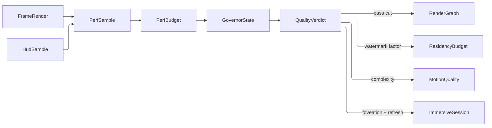

# [APPUI_DIAGNOSTICS_GOVERNOR]

Rasm.AppUi quality governance is one stateful fold over one cell: `PerfBudget` folds each telemetry sample against the held `GovernorState` into one degrade verdict that steps render passes, the residency watermark, the motion tokens, and the XR comfort levers together under an asymmetric hysteresis band, and `GpuTimeline` correlates measured per-pass GPU nanoseconds against the encoder-projected cost so a slow pass attributes on evidence. The page owns the quality tiers, the sample, state, and verdict shapes, the governor cell, and the GPU timing/statistics projection.

## [01]-[INDEX]

- [02]-[PERF_BUDGET]: Declarative quality governor folding telemetry into one degrade verdict, and the operator readout over its transition history.
- [03]-[GPU_TIMELINE]: Timestamp-query per-pass timing; pipeline-statistics attribution; projection divergence.

## [02]-[PERF_BUDGET]

- Owner: `GovernorFault` — the direct generated `[Union]` with one `[FaultCase]` leaf per governor failure; `QualityTier` `[SmartEnum<string>]` the descending quality grades; `PassCut` — the degraded pass disposition as a row a board renders; `BudgetAxis` `[SmartEnum<string>]` the observation-and-ceiling pair per gated axis with its one `Sweep` fold; `PerfSample` the folded telemetry observation; `GovernorState` the active-tier-plus-calm transition state; `QualityVerdict` the derived tier verdict naming the axis that moved it; `TierTransition` the recorded rank step; `GovernorReadout` the operator-facing projection with its chip fact keys; `PerfBudget` the pure transition policy; `Governor` the composition-scoped cell whose transitions answer through the kernel `Cell.Step` verdict.
- Cases: `QualityTier` = ultra, high, balanced, conservative, floor — each row's `Cut` column names its `PassCut` disposition, and `RenderGraph.Frame` folds `Cut.Admits` over the pass DAG. `MotionQuality` controls animation complexity only; the user-owned `ReducedMotion` accessibility preference remains an independent hard constraint composed as the stricter downstream selector at `Theme/motion.md`.
- Entry: `PerfBudget.Of` admits hysteresis, calm-window, history-depth, and divergence-band policy as accumulating slots, so a refusal names every offending column; `Govern` is the pure transition fold over one `BudgetAxis.Sweep`; `Governor.Observe` steps its cell through kernel `Cell.Step` — a sample at or before `GovernorState.LastAt` REFUSES as `GovernorFault.Stale` without mutating the cell, and a rank move records its `TierTransition` in the SAME committed state; `Governor.Readout` projects one cell snapshot into the `GovernorReadout` the diagnostics HUD chips bind.
- Auto: `PerfSample` folds `FrameRender` elapsed time, resolved GPU time, the residency-evict count, the VRAM watermark, and layout time into one observation; every comparison rides the one `BudgetAxis` vocabulary carrying its own observation and its own ceiling — each phase gates on its own share rather than borrowing the whole-frame duration, and eviction gates on a per-frame RATE because a byte-budgeted cache evicts continuously under camera motion; ONE `Sweep` per sample answers breach, recovery, and the tightest share together, so the transition and the readout read one walk of the axis roster; the transition is asymmetric by design — a budget breach steps the tier down one grade immediately and zeroes the calm count, while recovery steps up one rung only after `CalmWindow` consecutive within-hysteresis samples; the verdict carries the breaching axis beside the tier whose columns every degrade lever reads.
- Outcome: `Governor.Observe` returns `QualityVerdict`, writes `PerfBudget.Tier`, and fires `AppUiFact.Quality` at `AppUiPoint.Quality` after the cell transition settles.
- Packages: Thinktecture.Runtime.Extensions, LanguageExt.Core, NodaTime, Rasm (kernel `FaultBand`/`Fault`/`Cell`/`UnitInterval`), BCL inbox
- Growth: a new quality grade is one `QualityTier` row at either rank extreme with its `PassCut` row; a new gated axis is one `BudgetAxis` row plus its `FrameBudget` ceiling column, read by breach, recovery, and headroom alike; a new degrade lever is one `QualityTier` column; a new readout column is one `GovernorReadout` member with its fact key beside it; a new fault case is one `[FaultCase]` leaf.
- Law: the governor is the one adaptive-quality owner — a second meter, a per-pass ad-hoc throttle, or a caller-maintained tier state is the deleted form, and consumers read the levers off `verdict.Tier` (`Rasm.AppUi/Render/meshlets.md`, `Render/pipeline.md`, `Render/immersive.md`, `Analysis/context.md` compose `Tier.WatermarkFactor`, `Tier.Cut`, `Tier.RefreshHz`, `Tier.FoveationLevel`).
- Law: the readout is a PROJECTION of the one cell and never a second observation — tier, breaching axis, tightest-axis headroom, and the recorded steps all answer off the snapshot the transition wrote, and a HUD chip binds a fact key this owner declares rather than sampling an instrument the producer already writes.
- Boundary: `MotionQuality` is the PERFORMANCE motion lever `Theme/motion.md`'s reduced-motion selector composes as the second constraint — the stricter of the user preference and `Tier.Motion` wins, and this page mutates neither.

```csharp
// --- [TYPES] ---------------------------------------------------------------------------
[Union(ConversionFromValue = ConversionOperatorsGeneration.None)]
public abstract partial record GovernorFault : Fault {
    private static readonly FaultBand FamilyBand = FaultBand.Governor;
    private GovernorFault(string detail) { Detail = detail; }
    public string Detail { get; }
    public override string Message => Detail;
    [FaultCase(0)]
    public sealed partial record Policy(string Detail) : GovernorFault(Detail);
    [FaultCase(1)]
    public sealed partial record Stale(Instant SampleAt) : GovernorFault($"<stale-sample:{SampleAt}>");
}

// --- [TABLES] --------------------------------------------------------------------------
[SmartEnum<string>]
public sealed partial class MotionQuality {
    public static readonly MotionQuality Full = new("full");
    public static readonly MotionQuality Simplified = new("simplified");
    public static readonly MotionQuality Static = new("static");
}

[SmartEnum<string>]
public sealed partial class PassCut {
    public static readonly PassCut Full = new("full", static _ => true);
    public static readonly PassCut NoPathTrace = new("no-path-trace", static pass => pass is not RenderPass.PathTrace);
    public static readonly PassCut Floor = new("floor", static pass => pass is RenderPass.Composite or RenderPass.Overlay);

    [UseDelegateFromConstructor] public partial bool Admits(RenderPass pass);
}

[SmartEnum<string>]
public sealed partial class QualityTier {
    public static readonly QualityTier Ultra = new("ultra", rank: 4, pathTraceSamples: 256, simVolume: true, lodPixelScale: 1.0, watermarkFactor: 1.0, motion: MotionQuality.Full, foveationLevel: 0, refreshHz: 90d, cut: PassCut.Full);
    public static readonly QualityTier High = new("high", rank: 3, pathTraceSamples: 128, simVolume: true, lodPixelScale: 1.0, watermarkFactor: 1.0, motion: MotionQuality.Full, foveationLevel: 1, refreshHz: 90d, cut: PassCut.Full);
    public static readonly QualityTier Balanced = new("balanced", rank: 2, pathTraceSamples: 64, simVolume: true, lodPixelScale: 1.5, watermarkFactor: 0.8, motion: MotionQuality.Simplified, foveationLevel: 2, refreshHz: 72d, cut: PassCut.Full);
    public static readonly QualityTier Conservative = new("conservative", rank: 1, pathTraceSamples: 16, simVolume: false, lodPixelScale: 2.5, watermarkFactor: 0.6, motion: MotionQuality.Simplified, foveationLevel: 3, refreshHz: 72d, cut: PassCut.NoPathTrace);
    public static readonly QualityTier Floor = new("floor", rank: 0, pathTraceSamples: 0, simVolume: false, lodPixelScale: 4.0, watermarkFactor: 0.4, motion: MotionQuality.Static, foveationLevel: 3, refreshHz: 60d, cut: PassCut.Floor);

    public int Rank { get; }
    public int PathTraceSamples { get; }
    public bool SimVolume { get; }
    public double LodPixelScale { get; }
    public double WatermarkFactor { get; }
    public MotionQuality Motion { get; }
    public int FoveationLevel { get; }
    public double RefreshHz { get; }
    public PassCut Cut { get; }

    private static readonly Lazy<(FrozenDictionary<int, QualityTier> ByRank, int Floor, int Ceiling)> Ranks =
        new(static () => {
            FrozenDictionary<int, QualityTier> byRank = Items.ToFrozenDictionary(static row => row.Rank);
            int floor = Items.Min(static row => row.Rank);
            int ceiling = Items.Max(static row => row.Rank);
            return ceiling - floor + 1 == Items.Count
                ? (byRank, floor, ceiling)
                : throw new InvalidOperationException($"QualityTier ranks must run contiguously: {floor}..{ceiling} over {Items.Count} rows.");
        });

    public static QualityTier Ranked(int rank) =>
        Ranks.Value.ByRank[Math.Clamp(rank, Ranks.Value.Floor, Ranks.Value.Ceiling)];
}

[SmartEnum<string>]
public sealed partial class BudgetAxis {
    public static readonly BudgetAxis Frame = new("frame", static s => s.FrameElapsed.ToTimeSpan().TotalNanoseconds, static b => b.Frame.ToTimeSpan().TotalNanoseconds);
    public static readonly BudgetAxis Gpu = new("gpu", static s => s.GpuElapsed.ToTimeSpan().TotalNanoseconds, static b => b.Gpu.ToTimeSpan().TotalNanoseconds);
    public static readonly BudgetAxis Layout = new("layout", static s => s.LayoutElapsed.ToTimeSpan().TotalNanoseconds, static b => b.Layout.ToTimeSpan().TotalNanoseconds);
    public static readonly BudgetAxis Vram = new("vram", static s => s.VramBytes, static b => b.VramBytes);
    public static readonly BudgetAxis Evict = new("evict", static s => s.ResidencyEvicts, static b => b.EvictsPerFrame);

    [UseDelegateFromConstructor] public partial double Observed(PerfSample sample);
    [UseDelegateFromConstructor] public partial double Ceiling(FrameBudget budget);

    public static AxisSweep Sweep(FrameBudget budget, double hysteresis, PerfSample sample) =>
        toSeq(Items).Fold(
            new AxisSweep(None, Recovered: true, None),
            (held, axis) => {
                double observed = axis.Observed(sample);
                double ceiling = axis.Ceiling(budget);
                double share = ceiling > 0d ? observed / ceiling : 0d;
                return new AxisSweep(
                    Breach: held.Breach.IsSome || observed <= ceiling ? held.Breach : Some(axis),
                    Recovered: held.Recovered && observed < ceiling * (1.0 - hysteresis),
                    Tightest: ceiling > 0d && held.Tightest.ForAll(row => share > row.Share)
                        ? Some((axis, share))
                        : held.Tightest);
            });
}

// --- [MODELS] --------------------------------------------------------------------------
public readonly record struct AxisSweep(Option<BudgetAxis> Breach, bool Recovered, Option<(BudgetAxis Axis, double Share)> Tightest);

public readonly record struct PerfSample(Duration FrameElapsed, Duration GpuElapsed, long VramBytes, long ResidencyEvicts, Duration LayoutElapsed, Instant At) {
    public static PerfSample Of(HudSample hud, long evicts, Duration layout, Instant at) =>
        new(hud.FrameElapsed, hud.GpuElapsed, hud.VramBytes, evicts, layout, at);
}

public readonly record struct QualityVerdict(QualityTier Tier, Option<BudgetAxis> Breach, Instant At) {
    public static QualityVerdict Of(QualityTier tier, Option<BudgetAxis> breach, Instant at) => new(tier, breach, at);
}

public readonly record struct GovernorState(QualityTier Active, int Calm, Option<Instant> LastAt) {
    public static readonly GovernorState Boot = new(QualityTier.High, Calm: 0, None);
}

public sealed record PerfBudget {
    private PerfBudget(FrameBudget budget, double hysteresisFraction, int calmWindow, int historyDepth, UnitInterval divergenceBand) =>
        (Budget, HysteresisFraction, CalmWindow, HistoryDepth, DivergenceBand) = (budget, hysteresisFraction, calmWindow, historyDepth, divergenceBand);

    public FrameBudget Budget { get; }
    public double HysteresisFraction { get; }
    public int CalmWindow { get; }
    public int HistoryDepth { get; }
    public UnitInterval DivergenceBand { get; }

    public static Fin<PerfBudget> Of(FrameBudget budget, double hysteresisFraction, int calmWindow, int historyDepth, UnitInterval divergenceBand) =>
        (Slot(double.IsFinite(hysteresisFraction) && hysteresisFraction is > 0d and < 1d, $"<hysteresis:{hysteresisFraction}>"),
         Slot(calmWindow > 0, $"<calm-window:{calmWindow}>"),
         Slot(historyDepth > 0, $"<history-depth:{historyDepth}>"))
            .Apply((_, _, _) => new PerfBudget(budget, hysteresisFraction, calmWindow, historyDepth, divergenceBand))
            .ToFin();

    static Validation<Error, Unit> Slot(bool holds, string detail) =>
        holds ? Validation<Error, Unit>.Success(unit) : Validation<Error, Unit>.Fail((Error)new GovernorFault.Policy(detail));

    public static readonly InstrumentSpec Tier = InstrumentSpec.Create(
        "rasm.appui.governor.tier", InstrumentKind.Level, MeasureForm.Whole, "1",
        "active quality tier rank", Seq<string>(), None, None, None);

    public static TelemetryContributorPort TelemetryRow(string version) => AppUiTelemetry.Contribute(version, Tier);

    public (GovernorState Next, QualityVerdict Verdict) Govern(GovernorState state, PerfSample sample) =>
        (BudgetAxis.Sweep(Budget, HysteresisFraction, sample), state.Calm) switch {
            ({ Breach.IsSome: true } sweep, _) => Stepped(state.Active.Rank - 1, sweep.Breach, sample.At),
            ({ Recovered: true }, var calm) when calm + 1 >= CalmWindow => Stepped(state.Active.Rank + 1, None, sample.At),
            ({ Recovered: true }, var calm) => (state with { Calm = calm + 1, LastAt = Some(sample.At) }, QualityVerdict.Of(state.Active, None, sample.At)),
            _ => (state with { Calm = 0, LastAt = Some(sample.At) }, QualityVerdict.Of(state.Active, None, sample.At)),
        };

    private static (GovernorState, QualityVerdict) Stepped(int rank, Option<BudgetAxis> breach, Instant at) =>
        QualityTier.Ranked(rank) switch {
            var tier => (new GovernorState(tier, Calm: 0, Some(at)), QualityVerdict.Of(tier, breach, at)),
        };
}

public readonly record struct TierTransition(QualityTier From, QualityTier To, Option<BudgetAxis> Breach, Instant At) {
    public bool Degraded => To.Rank < From.Rank;
}

public readonly record struct GovernorReadout(
    QualityTier Tier,
    Option<BudgetAxis> Breach,
    Option<BudgetAxis> Tightest,
    Option<double> Headroom,
    Option<Instant> Since,
    Seq<TierTransition> Recent) {
    public const string TierFact = "governor.tier";
    public const string BreachFact = "governor.breach";
    public const string HeadroomFact = "governor.headroom";
    public const string HistoryFact = "governor.transitions";

    public static GovernorReadout Of(PerfBudget policy, GovernorState state, PerfSample sample, Seq<TierTransition> recent) =>
        BudgetAxis.Sweep(policy.Budget, policy.HysteresisFraction, sample) switch {
            var sweep => new GovernorReadout(
                Tier: state.Active,
                Breach: recent.Head.Bind(static step => step.Breach),
                Tightest: sweep.Tightest.Map(static row => row.Axis),
                Headroom: sweep.Tightest.Map(static row => Math.Max(0d, 1d - row.Share)),
                Since: recent.Head.Map(static step => step.At),
                Recent: recent),
        };
}

// --- [COMPOSITION] ---------------------------------------------------------------------
public sealed record GovernorCell(GovernorState State, QualityVerdict Verdict, Seq<TierTransition> Recent) {
    public static readonly GovernorCell Boot =
        new(GovernorState.Boot, QualityVerdict.Of(GovernorState.Boot.Active, None, Instant.MinValue), Seq<TierTransition>());

    public GovernorCell Advanced(PerfBudget policy, PerfSample sample) =>
        policy.Govern(State, sample) switch {
            var stepped => new GovernorCell(
                stepped.Next,
                stepped.Verdict,
                stepped.Next.Active.Rank == State.Active.Rank
                    ? Recent
                    : new TierTransition(State.Active, stepped.Next.Active, stepped.Verdict.Breach, sample.At)
                        .Cons(Recent).Take(policy.HistoryDepth).ToSeq().Strict()),
        };
}

public sealed class Governor {
    private readonly Atom<GovernorCell> cell = Atom(GovernorCell.Boot);

    public QualityTier Active => cell.Value.State.Active;

    public Fin<QualityVerdict> Observe(
        PerfBudget policy,
        PerfSample sample,
        InstrumentSet signals,
        HookRail<AppUiPoint, AppUiFact, TelemetrySource> rail,
        Op key) =>
        (Cell.Step(
            cell,
            held => held.State.LastAt.Exists(accepted => sample.At <= accepted)
                ? Option<GovernorCell>.None
                : Some(held.Advanced(policy, sample)),
            declined: new GovernorFault.Stale(sample.At)) switch {
            Transition<GovernorCell>.Committed committed => Fin.Succ(committed.State.Verdict),
            Transition<GovernorCell> declined => Fin.Fail<QualityVerdict>(
                declined is Transition<GovernorCell>.Refused refused ? refused.Cause : new GovernorFault.Stale(sample.At)),
        }).Bind(verdict => signals.Write(PerfBudget.Tier, (long)verdict.Tier.Rank)
            .Bind(_ => rail.Fire(
                AppUiPoint.Quality,
                new AppUiFact.Quality(
                    verdict.Tier.Key,
                    checked((uint)verdict.Tier.PathTraceSamples),
                    verdict.Tier.WatermarkFactor,
                    verdict.Tier.Motion.Key,
                    checked((uint)verdict.Tier.FoveationLevel),
                    verdict.Tier.RefreshHz),
                key,
                body: _ => Fin.Succ(verdict))));

    public GovernorReadout Readout(PerfBudget policy, PerfSample sample) =>
        cell.Value switch { var held => GovernorReadout.Of(policy, held.State, sample, held.Recent) };
}
```



## [03]-[GPU_TIMELINE]

- Owner: `GpuQuerySeam` the encoder-side write/resolve/retire boundary capsule; `GpuTimingPass` the per-pass timestamp-query planner owning the ONE pair-stride spelling; `PipelineStat` the pipeline-statistics row with the `Columns` roster its stride and order derive from; `PassTiming` the projected-vs-measured pair owning the ONE guarded divergence read; `GpuTimeline` the measured-vs-projected per-pass GPU projection feeding the verdict.
- Entry: `Resolve(Seq<PassTiming> planned, ReadOnlyMemory<ulong> resolvedTicks)` and `ResolveStats(ReadOnlyMemory<ulong> resolvedCounters)` — the two pure read-back folds over one planner; `Attributed(UnitInterval fraction)` — the divergence-to-bottleneck join both folds feed; `GpuQuerySeam.Retired(seam, device, cadence)` — the scheduled non-blocking retire poll over the `nint` handle the boundary law already mandates.
- Auto: `GpuTimingPass` writes a `Silk.NET.WebGPU` `QueryType.Timestamp` query PAIR per render-graph pass through `CommandEncoderWriteTimestamp` at the indices `Pair` mints, resolves the `QuerySet` through `CommandEncoderResolveQuerySet`, and retires the resolve through the non-blocking WGPU-extension `DevicePoll` on a declared `Schedule` cadence — never a blocking fence and never a one-shot poll nothing re-runs; pipeline statistics ride the WGPU vendor extension (core `QueryType` exposes only Timestamp and Occlusion) — one statistics query per pass whose counters `ResolveStats` folds at the stride and ORDER the `PipelineStat.Columns` roster declares, the same roster the query-set mint reads, so the transcription cannot drift from the read-back; `GpuTimeline` correlates the measured GPU seq against the projected CPU seq keyed by the frame ordinal, and a pass with no resolved pair keeps `Measured = None` so a projected estimate never masquerades as a measurement.
- Outcome: the per-pass GPU figure replaces `FrameRender.Gpu` with resolved nanoseconds only when every pass resolved, so a mixed projected/measured sum never enters the measured column; `Deepen` writes divergence and fires `AppUiFact.GpuFrame`, whose measured-versus-unmeasured split keeps a projected estimate distinguishable from a resolved timestamp.
- Packages: Silk.NET.WebGPU, Silk.NET.WebGPU.Extensions.WGPU, LanguageExt.Core, NodaTime, BCL inbox
- Growth: a new profiled pass is one `GpuTimingPass` timestamp-query pair beside its one statistics query; a new pipeline statistic is one `PipelineStat` column with its `Columns` roster seat; zero new surface.
- Law: the timing passes ride `ONE_WGPU_DEVICE` — the shared device seam declared with Compute — and never acquire a second device or queue; `GpuQuerySeam` is the named boundary capsule for the unsafe encoder statement seam, one `WebGPU` core plus one `Wgpu` extension view over the one loaded runtime.
- Law: the `Render/pipeline.md` `WgpuFrameEvidence.Measure` delegate composes at binding acquisition FROM this seam's resolved pairs, so one `QuerySet` serves both the frame lane and the per-pass attribution.
- Boundary: the pipeline-statistics arm is availability-gated on the WGPU extension probe at device acquisition, and the degrade is a `GpuTimeline` whose `Stats` is empty — `ResolveStats` returns that empty `Seq` off an absent counter buffer, so the gate needs no second arm and `Attributed` answers `None` per pass rather than throwing.

```csharp
// --- [BOUNDARIES] ----------------------------------------------------------------------
public sealed unsafe record GpuQuerySeam(WebGPU Api, Wgpu Native) {
    public Unit Stamp(CommandEncoder* encoder, QuerySet* queries, uint index) {
        Api.CommandEncoderWriteTimestamp(encoder, queries, index);
        return unit;
    }

    public Unit Resolve(CommandEncoder* encoder, QuerySet* queries, uint count, Buffer* readback) {
        Api.CommandEncoderResolveQuerySet(encoder, queries, 0, count, readback, 0);
        return unit;
    }

    public bool Retire(Device* device) => Native.DevicePoll(device, false, (WrappedSubmissionIndex*)null);

    public static IO<bool> Retired(GpuQuerySeam seam, nint device, Schedule cadence) =>
        IO.lift(() => seam.Retire((Device*)device)).RepeatUntil(cadence, static done => done);

    public Unit StatsOpen(RenderPassEncoder* pass, QuerySet* stats, uint index) {
        Native.RenderPassEncoderBeginPipelineStatisticsQuery(pass, stats, index);
        return unit;
    }

    public Unit StatsClose(RenderPassEncoder* pass) {
        Native.RenderPassEncoderEndPipelineStatisticsQuery(pass);
        return unit;
    }

    public Unit StatsOpen(ComputePassEncoder* pass, QuerySet* stats, uint index) {
        Native.ComputePassEncoderBeginPipelineStatisticsQuery(pass, stats, index);
        return unit;
    }

    public Unit StatsClose(ComputePassEncoder* pass) {
        Native.ComputePassEncoderEndPipelineStatisticsQuery(pass);
        return unit;
    }

    public Unit Map(Buffer* readback, uint values, PfnBufferMapCallback callback, void* state) {
        Api.BufferMapAsync(readback, MapMode.Read, 0, values * (ulong)sizeof(ulong), callback, state);
        return unit;
    }

    public Seq<ulong> CopyMapped(Buffer* readback, uint values) {
        void* mapped = Api.BufferGetMappedRange(readback, 0, values * (ulong)sizeof(ulong));
        try { return toSeq(new ReadOnlySpan<ulong>(mapped, checked((int)values)).ToArray()); }
        finally { Api.BufferUnmap(readback); }
    }
}

// --- [MODELS] --------------------------------------------------------------------------
public readonly record struct PipelineStat(
    string Pass,
    long VertexShaderInvocations,
    long ClipperInvocations,
    long ClipperPrimitivesOut,
    long FragmentShaderInvocations,
    long ComputeShaderInvocations) {
    public static readonly PipelineStatisticName[] Columns = [
        PipelineStatisticName.VertexShaderInvocations,
        PipelineStatisticName.ClipperInvocations,
        PipelineStatisticName.ClipperPrimitivesOut,
        PipelineStatisticName.FragmentShaderInvocations,
        PipelineStatisticName.ComputeShaderInvocations,
    ];

    public long PrimitivesCulled => Math.Max(0L, ClipperInvocations - ClipperPrimitivesOut);
}

public readonly record struct PassTiming(string Pass, int QueryIndex, Duration Projected, Option<Duration> Measured) {
    public Duration Resolved => Measured.IfNone(Projected);

    public Option<double> Divergence =>
        Measured.Filter(_ => Projected > Duration.Zero)
            .Map(gpu => Math.Abs((gpu - Projected).ToTimeSpan().TotalNanoseconds) / Projected.ToTimeSpan().TotalNanoseconds);

    public bool Diverged(UnitInterval fraction) => Divergence.Exists(ratio => ratio > fraction.Value);
}

public sealed record GpuTimingPass(Seq<string> PassBoundaries, double PeriodNs) {
    public (uint Begin, uint End) Pair(int pass) => ((uint)(pass * 2), (uint)(pass * 2 + 1));
    public uint StatsIndex(int pass) => (uint)pass;

    public Seq<PassTiming> Plan(Seq<(string Pass, Duration Projected)> projected) =>
        PassBoundaries.Map((pass, index) =>
            new PassTiming(pass, (int)Pair(index).Begin, projected.Find(p => p.Pass == pass).Map(static p => p.Projected).IfNone(Duration.Zero), None));

    public Seq<PassTiming> Resolve(Seq<PassTiming> planned, ReadOnlyMemory<ulong> resolvedTicks) =>
        planned.Map((timing, index) => Pair(index) switch {
            var (begin, end) => (int)end < resolvedTicks.Length && resolvedTicks.Span[(int)end] >= resolvedTicks.Span[(int)begin]
                ? timing with { Measured = Some(Duration.FromNanoseconds((resolvedTicks.Span[(int)end] - resolvedTicks.Span[(int)begin]) * PeriodNs)) }
                : timing,
        }).ToSeq();

    public Seq<PipelineStat> ResolveStats(ReadOnlyMemory<ulong> resolvedCounters) =>
        PassBoundaries
            .Map((pass, index) => (Pass: pass, Offset: index * PipelineStat.Columns.Length))
            .Filter(row => row.Offset + PipelineStat.Columns.Length <= resolvedCounters.Length)
            .Map(row => new PipelineStat(
                row.Pass,
                (long)resolvedCounters.Span[row.Offset],
                (long)resolvedCounters.Span[row.Offset + 1],
                (long)resolvedCounters.Span[row.Offset + 2],
                (long)resolvedCounters.Span[row.Offset + 3],
                (long)resolvedCounters.Span[row.Offset + 4]))
            .ToSeq().Strict();
}

// --- [OPERATIONS] ----------------------------------------------------------------------
public sealed record GpuTimeline(long FrameOrdinal, Seq<PassTiming> Passes, Seq<PipelineStat> Stats) {
    public static readonly InstrumentSpec Divergence = InstrumentSpec.Create(
        "rasm.appui.governor.gpu.divergence", InstrumentKind.Distribution, MeasureForm.Real, "1",
        "per-pass projected-to-measured GPU divergence ratio", Seq<string>(), Some(Buckets.DivergenceRatio), None, None);

    public static TelemetryContributorPort TelemetryRow(string version) => AppUiTelemetry.Contribute(version, Divergence);

    public Seq<double> DivergenceRatios() => Passes.Bind(static pass => pass.Divergence.ToSeq());

    public Fin<Unit> Observe(InstrumentSet set) =>
        DivergenceRatios().TraverseM(ratio => set.Write(Divergence, ratio)).As().Map(static _ => unit);

    public bool FullyResolved => Passes.ForAll(static pass => pass.Measured.IsSome);

    public Duration MeasuredGpu =>
        Passes.Bind(static pass => pass.Measured.ToSeq()).Fold(Duration.Zero, static (acc, measured) => acc + measured);

    public Seq<PassTiming> Divergent(UnitInterval fraction) => Passes.Filter(pass => pass.Diverged(fraction));

    public Seq<(PassTiming Timing, Option<PipelineStat> Stat)> Attributed(UnitInterval fraction) =>
        Stats.ToHashMap(static stat => stat.Pass, static stat => stat) switch {
            var byPass => Divergent(fraction).Map(timing => (timing, byPass.Find(timing.Pass))),
        };

    public Fin<FrameRender> Deepen(
        FrameRender frame,
        InstrumentSet signals,
        HookRail<AppUiPoint, AppUiFact, TelemetrySource> rail,
        Op key) =>
        Observe(signals).Bind(_ =>
            (FullyResolved
                ? frame with { Gpu = MeasuredGpu, Passes = Passes.Map(static pass => (pass.Pass, pass.Resolved)) }
                : frame) switch {
                    var deepened => rail.Fire(
                        AppUiPoint.GpuFrame,
                        new AppUiFact.GpuFrame(
                            checked((ulong)FrameOrdinal),
                            checked((uint)Passes.Count),
                            checked((uint)Passes.Filter(static pass => pass.Measured.IsNone).Count),
                            checked((ulong)MeasuredGpu.ToInt64Nanoseconds())),
                        key,
                        body: _ => Fin.Succ(deepened)),
                });
}
```

## [04]-[RESEARCH]

(none)
