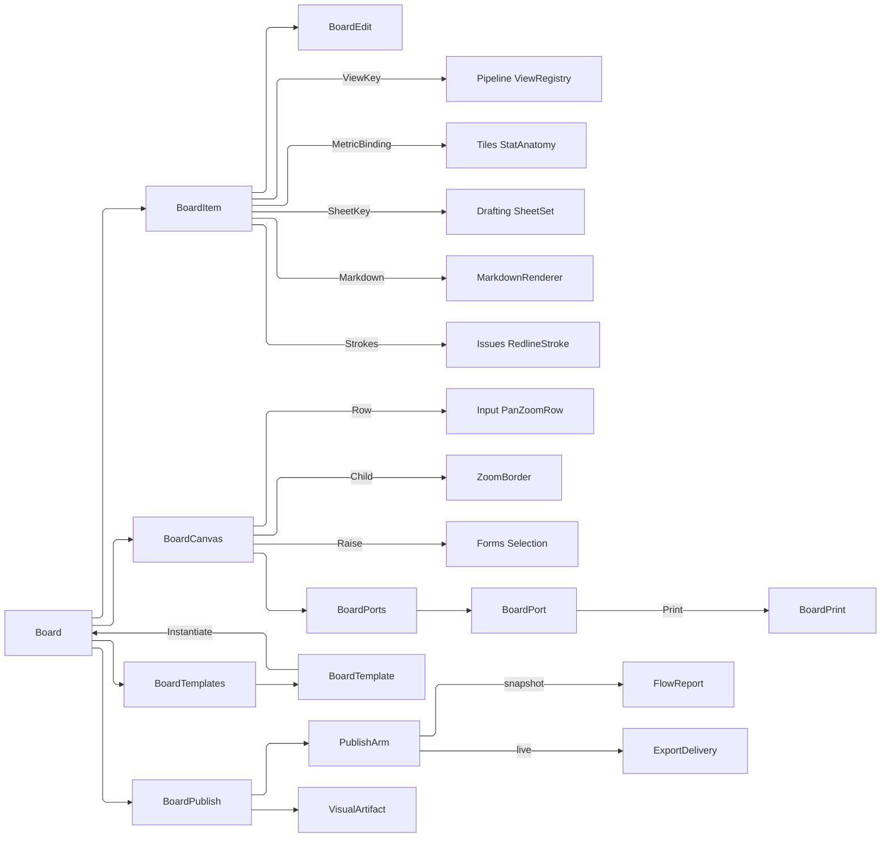

# [APPUI_PRESENTATION_BOARD]

A board is an infinite pannable canvas that composes what the app already owns into one publishable deliverable: `BoardItem` is the closed placement family — live model-view frames whose crop and scale are BOARD-owned, re-bindable metric stat cards, sheet frames, markdown text, and freeform annotation — every case a placement row over a settled owner rather than a second model of it. `BoardCanvas` seats those rows inside the one `PanAndZoom` `ZoomBorder` under the settled `Shell/input#POINTER_GESTURES` `PanZoomRow.Dashboard` posture, so the affine, the gestures, the constraint clamps, the rotation gate, and the view history are the viewport owner's and this page mints no transform; selection is the one `Editing/forms#SELECTION_MODEL` gesture fold every windowed plane already routes through. `BoardTemplate` seals a board's structure as a reusable artifact, and `BoardPublish` renders the board through the `Document/export` plane in two arms — a paginated snapshot and a live-updating shared document whose frames and cards re-read their sources on every open. The page owns the placement vocabulary, the board-owned crop-and-scale law, the canvas seating, the template artifact, and the publish arms; it owns no camera, no chart, no sheet, no pan-zoom engine, no stroke vocabulary, and no selection algebra. The spine is `Render/pipeline` `ViewRegistry`/`NamedView`, `Charts/tiles` `StatAnatomy`, `Render/drafting` `Sheet`/`DraftUnits`, `Document/media` `MarkdownRenderer`, `Document/export` `VisualDestination`/`FlowReport`/`ReportBlock`, `Collab/issues` `RedlineStroke`, `Theme/locale` `ResolvedLocale`, `PanAndZoom` (`.api/api-panandzoom.md`), the kernel `FaultBand`/`MonotonicTimeline`/`Cell`/`Custody`/`Scalar`/`UnitInterval` owners, Thinktecture.Runtime.Extensions, and LanguageExt result types.

## [01]-[INDEX]

- [02]-[BOARD_MODEL]: The placement `[Union]`, the board-owned crop-and-scale law, the edit algebra, and the board's own accumulating admission gate.
- [03]-[BOARD_CANVAS]: The `ZoomBorder` seating over the settled canvas row, the per-placement port roster, picking, banding, and the selection routing.
- [04]-[BOARD_TEMPLATE]: Boards as reusable artifacts — structure without bindings, re-bound at instantiation.
- [05]-[BOARD_PUBLISH]: The two publish arms — a paginated snapshot and a live-updating shared document.

## [02]-[BOARD_MODEL]

- Owner: `BoardFault` the direct generated `[Union]` with one `[FaultCase]` leaf per board failure; `PlacementKind` `[SmartEnum<string>]` the placement vocabulary both the union and the template slot key on; `BoardBox` the board-space rectangle over admitted kernel scalars; `FrameCrop` the board-owned normalized crop; `MetricBinding` the re-bindable stat source with its readout role; `BoardItem` `[Union]` the placement family; `BoardEdit` `[Union]` the per-item rewrite algebra; `Board` the item roster with its verbs.
- Cases: `BoardItem` = ViewFrame | StatCard | SheetFrame | TextNote | Ink; `PlacementKind` = view · stat · sheet · text · ink; `BoardEdit` = Rebox | Recrop | Refit | Rebind; `[FaultCase]` = BoxInvalid | CropInvalid | BindingUnresolved | ItemAbsent | TemplateMismatch | SeatContended.
- Law: a view frame's CROP and SCALE are board state and never model state. A frame names a `NamedView` key and carries its own normalized crop rectangle and pixel scale, so two frames can show the same registry view at two crops, resizing a frame changes nothing about the view, and deleting a frame leaves the registry untouched — a frame that wrote its crop back into the camera would make one board edit reframe every other consumer of that view.
- Law: a placement carries its source KEY and never a resolved value. `StatCard` holds a `MetricBinding` and no `StatAnatomy`, so a re-opened board reads the live metric rather than replaying the reading its author happened to see — folder RULINGS `:195`, on the one page that ruling names.
- Entry: `public static Fin<Board> Of(string key, string title, Seq<BoardItem> items, IClock clock)` — the accumulating admission gate: key, title, and per-item key distinctness all report in one refusal; `public Fin<Board> Place(BoardItem item, IClock clock)` / `public Fin<Board> Edit(string itemKey, BoardEdit edit, IClock clock)` / `public Fin<Board> Restack(string itemKey, int delta, IClock clock)` / `public Fin<Board> Drop(string itemKey, IClock clock)` — the placement verbs, each stamping the board's own edit instant; `public Fin<BoardItem> Located(string itemKey)` — the one item read every verb takes; `public Option<string> Reference` / `public Fin<BoardItem> WithReference(Option<string>)` on `BoardItem` — the forward and inverse halves of ONE reference correspondence.
- Auto: `BoardBox` and `FrameCrop` are products of ADMITTED kernel scalars — a board coordinate is a `Scalar`, an extent a `PositiveMagnitude`, a crop edge a `UnitInterval` — so finiteness, positivity, and the unit-square domain are unrepresentable-invalid rather than re-proved on every verb, and `FrameCrop`'s own factory carries only the two facts a per-column type cannot state; a view frame composes the `Render/viewpoint#VIEW_REGISTRY` row by KEY, so a renamed or re-saved view re-reads live and a board never holds a stale camera; a stat card carries the metric key, the option key it reads under, and the `Theme/locale#MEASUREMENT_FORMAT` `MeasureRole` its magnitudes print in, so re-binding a card to a different option is one column write and a printed figure carries its unit token; a sheet frame names a `Render/drafting#SHEET_SET` `Sheet` key and its page ordinal as a kernel `Dimension`, so a board embeds documentation without a second sheet model and a zeroth page is unspellable; a text note carries markdown source and renders through the `Document/media#MARKDOWN_BLOCKS` materialization, so a board's prose is the app's prose; ink carries the `Collab/issues#REDLINE_TOOLS` `RedlineStroke` rows `StrokeCapture.Capture` already folded off the pen axis, so board annotation and viewport redlining are one stroke value rather than two that render differently.
- Packages: Rasm (project — `FaultBand`, `[FaultCase]`, `Scalar`, `PositiveMagnitude`, `UnitInterval`, `Dimension`), Thinktecture.Runtime.Extensions, LanguageExt.Core, NodaTime, Avalonia
- Growth: a new placeable is one `BoardItem` case, one `PlacementKind` row, and one `BoardPorts` row breaking every fold at compile time; a new per-item rewrite is one `BoardEdit` case; a new binding axis is one `MetricBinding` column; zero new surface.
- Boundary: every case is a PLACEMENT over a settled owner — a board-local camera, a board-local chart series, a board-local sheet composer, a board-local markdown model, and a board-local stroke type are the five deleted forms, because a board that modelled any of them would drift from the owner the moment that owner moved; the retired `InkStroke` record was the fifth AND shadowed the admitted `NodeEditor.InkStroke` (`.api/api-nodeeditor.md` `[04]`) inside one assembly, so `Editing/graph.md`'s package type and a board annotation resolved one plain name to two shapes. Bindings are KEYS, never captured objects, and absence is `Option<string>` rather than the empty spelling, because a template's unbound slot and an authored blank are different facts (folder RULINGS `:88`) and a live board renders the first as its own absence caption. Boxes live in BOARD space and crops in NORMALIZED source space, two coordinate systems that never mix: the box says where on the infinite canvas the frame sits and the crop says which part of the source it shows, and folding them into one rectangle makes a resize silently re-crop. `Refit` is the one arrow that crosses them, resizing a box to its crop's own aspect. Ink is DATA on the board rather than a render-time overlay, so an annotation survives a save and participates in selection like every other item. The reference vocabulary is ONE: `Reference` answers exactly the key `WithReference` writes — the retired `@`-joined metric pair and `#`-joined sheet page were composite spellings no rebind parsed back.

```csharp
// --- [TYPES] ---------------------------------------------------------------------------

[SmartEnum<string>]
[KeyMemberEqualityComparer<ComparerAccessors.StringOrdinal, string>]
[KeyMemberComparer<ComparerAccessors.StringOrdinal, string>]
public sealed partial class PlacementKind {
    public static readonly PlacementKind View = new("view");
    public static readonly PlacementKind Stat = new("stat");
    public static readonly PlacementKind Sheet = new("sheet");
    public static readonly PlacementKind Text = new("text");
    public static readonly PlacementKind Ink = new("ink");
}

// --- [ERRORS] --------------------------------------------------------------------------

[Union(ConversionFromValue = ConversionOperatorsGeneration.None)]
public abstract partial record BoardFault : Fault {
    private static readonly FaultBand FamilyBand = FaultBand.Board;
    private BoardFault(string detail) { Detail = detail; }

    public string Detail { get; }
    public override string Message => Detail;

    [FaultCase(0)]
    public sealed partial record BoxInvalid(string Detail)        : BoardFault(Detail);
    [FaultCase(1)]
    public sealed partial record CropInvalid(string Detail)       : BoardFault(Detail);
    [FaultCase(2)]
    public sealed partial record BindingUnresolved(string Detail) : BoardFault(Detail);
    [FaultCase(3)]
    public sealed partial record ItemAbsent(string Detail)        : BoardFault(Detail);
    [FaultCase(4)]
    public sealed partial record TemplateMismatch(string Detail)  : BoardFault(Detail);
    [FaultCase(5)]
    public sealed partial record SeatContended(string Detail)     : BoardFault(Detail);
}

// --- [MODELS] --------------------------------------------------------------------------

public readonly record struct BoardBox(Scalar X, Scalar Y, PositiveMagnitude Width, PositiveMagnitude Height, int Z) {

    public static Fin<BoardBox> Of(double x, double y, double width, double height, int z) =>
        (Scalar.From(x).ToValidation(), Scalar.From(y).ToValidation(),
         FactoryBridge.Accept<PositiveMagnitude>(candidate: width).ToValidation(),
         FactoryBridge.Accept<PositiveMagnitude>(candidate: height).ToValidation())
            .Apply((left, top, wide, high) => new BoardBox(left, top, wide, high, z))
            .As().ToFin();

    public Rect Rect => new(X.To(), Y.To(), Width.Value, Height.Value);

    public Fin<BoardBox> FittedTo(FrameCrop crop) =>
        FactoryBridge.Accept<PositiveMagnitude>(candidate: Width.Value / crop.Aspect)
            .Map(high => this with { Height = high });
}

[ComplexValueObject]
public sealed partial class FrameCrop {
    public UnitInterval Left { get; }
    public UnitInterval Top { get; }
    public UnitInterval Right { get; }
    public UnitInterval Bottom { get; }
    public PositiveMagnitude Scale { get; }

    public static FrameCrop Whole { get; } = Create(
        UnitInterval.Create(0d), UnitInterval.Create(0d), UnitInterval.Create(1d), UnitInterval.Create(1d),
        PositiveMagnitude.Create(1d));

    public double Aspect => (Right.Value - Left.Value) / (Bottom.Value - Top.Value);

    static partial void ValidateFactoryArguments(
        ref ValidationError? validationError,
        ref UnitInterval left, ref UnitInterval top, ref UnitInterval right, ref UnitInterval bottom,
        ref PositiveMagnitude scale) {
        (UnitInterval l, UnitInterval t, UnitInterval r, UnitInterval b) = (left, top, right, bottom);
        Seq<string> degenerate = Seq(("width", r.Value > l.Value), ("height", b.Value > t.Value))
            .Filter(static axis => !axis.Item2).Map(static axis => axis.Item1);
        validationError = degenerate.IsEmpty
            ? validationError
            : new ValidationError(string.Join(" | ", new object?[] { $"board/crop-degenerate:{string.Join(',', degenerate)}" }));
    }

    public static Fin<FrameCrop> Admit(
        UnitInterval left, UnitInterval top, UnitInterval right, UnitInterval bottom, PositiveMagnitude scale) =>
        FactoryBridge.Accept<FrameCrop>(
            Validate(left, top, right, bottom, scale, out FrameCrop? crop), crop);
}

[ComplexValueObject]
public sealed partial class MetricBinding {
    public string MetricKey { get; }
    public Option<string> OptionKey { get; }
    public Option<MeasureRole> Measure { get; }

    static partial void ValidateFactoryArguments(
        ref ValidationError? validationError, ref string metricKey, ref Option<string> optionKey, ref Option<MeasureRole> measure) =>
        validationError = string.IsNullOrWhiteSpace(metricKey)
            ? new ValidationError(string.Join(" | ", new object?[] { "board/binding: a card names a metric key" }))
            : validationError;
}

[Union(ConversionFromValue = ConversionOperatorsGeneration.None)]
[JsonPolymorphic(TypeDiscriminatorPropertyName = "kind")]
[JsonDerivedType(typeof(BoardItem.ViewFrame), "view")]
[JsonDerivedType(typeof(BoardItem.StatCard), "stat")]
[JsonDerivedType(typeof(BoardItem.SheetFrame), "sheet")]
[JsonDerivedType(typeof(BoardItem.TextNote), "text")]
[JsonDerivedType(typeof(BoardItem.Ink), "ink")]
public abstract partial record BoardItem(string Key, BoardBox Box) {
    public sealed record ViewFrame(string Key, BoardBox Box, Option<string> ViewKey, FrameCrop Crop, bool ShowChrome) : BoardItem(Key, Box);
    public sealed record StatCard(string Key, BoardBox Box, MetricBinding Binding) : BoardItem(Key, Box);
    public sealed record SheetFrame(string Key, BoardBox Box, Option<string> SheetKey, Dimension Page) : BoardItem(Key, Box);
    public sealed record TextNote(string Key, BoardBox Box, string Markdown) : BoardItem(Key, Box);
    public sealed record Ink(string Key, BoardBox Box, Seq<RedlineStroke> Strokes) : BoardItem(Key, Box);

    public PlacementKind Kind => Switch(
        viewFrame: static _ => PlacementKind.View, statCard: static _ => PlacementKind.Stat,
        sheetFrame: static _ => PlacementKind.Sheet, textNote: static _ => PlacementKind.Text,
        ink: static _ => PlacementKind.Ink);

    public Option<string> Reference => Switch(
        viewFrame: static frame => frame.ViewKey,
        statCard: static card => card.Binding.OptionKey,
        sheetFrame: static sheet => sheet.SheetKey,
        textNote: static _ => Option<string>.None,
        ink: static _ => Option<string>.None);

    public Fin<BoardItem> WithReference(Option<string> reference) => Switch(
        state: reference,
        viewFrame: static (key, frame) => Fin.Succ<BoardItem>(frame with { ViewKey = key }),
        statCard: static (key, card) => FactoryBridge.Accept<MetricBinding>(MetricBinding.Validate(
                card.Binding.MetricKey, card.Binding.Measure, out MetricBinding? bound), bound)
            .Map<BoardItem>(binding => card with { Binding = binding }),
        sheetFrame: static (key, sheet) => Fin.Succ<BoardItem>(sheet with { SheetKey = key }),
        textNote: static (key, note) => Unreferenced(note),
        ink: static (key, marks) => Unreferenced(marks));

    public bool Chromed => Switch(
        viewFrame: static frame => frame.ShowChrome,
        statCard: static _ => true, sheetFrame: static _ => true,
        textNote: static _ => true, ink: static _ => true);

    public BoardItem Rebox(BoardBox box) => Switch(
        state: box,
        viewFrame: static (seat, frame) => (BoardItem)(frame with { Box = seat }),
        statCard: static (seat, card) => card with { Box = seat },
        sheetFrame: static (seat, sheet) => sheet with { Box = seat },
        textNote: static (seat, note) => note with { Box = seat },
        ink: static (seat, marks) => marks with { Box = seat });

    static Fin<BoardItem> Unreferenced(Option<string> reference, BoardItem item) =>
        reference.IsNone
            ? Fin.Succ(item)
            : Fin.Fail<BoardItem>(new BoardFault.BindingUnresolved($"{item.Key} is a {item.Kind.Key} placement and carries no reference"));
}

[Union(ConversionFromValue = ConversionOperatorsGeneration.None)]
public abstract partial record BoardEdit {
    private BoardEdit() { }
    public sealed record Rebox(BoardBox Box) : BoardEdit;
    public sealed record Recrop(FrameCrop Crop) : BoardEdit;
    public sealed record Refit : BoardEdit;
    public sealed record Rebind(MetricBinding Binding) : BoardEdit;

    public Fin<BoardItem> Apply(BoardItem item) => Switch(
        state: item,
        rebox: static (held, edit) => Fin.Succ(held.Rebox(edit.Box)),
        recrop: static (held, edit) => Framed(held, frame => Fin.Succ<BoardItem>(frame with { Crop = edit.Crop })),
        refit: static (held, _) => Framed(held, static frame =>
            frame.Box.FittedTo(frame.Crop).Map(box => (BoardItem)(frame with { Box = box }))),
        rebind: static (held, edit) => Carded(held, edit.Binding));

    static Fin<BoardItem> Framed(BoardItem item, Func<BoardItem.ViewFrame, Fin<BoardItem>> rewrite) => item.Switch(
        state: rewrite,
        viewFrame: static (apply, frame) => apply(frame),
        statCard: static (_, card) => Refused(card, "crop"),
        sheetFrame: static (_, sheet) => Refused(sheet, "crop"),
        textNote: static (_, note) => Refused(note, "crop"),
        ink: static (_, marks) => Refused(marks, "crop"));

    static Fin<BoardItem> Carded(BoardItem item, MetricBinding binding) => item.Switch(
        state: binding,
        viewFrame: static (_, frame) => Refused(frame, "binding"),
        statCard: static (bound, card) => Fin.Succ<BoardItem>(card with { Binding = bound }),
        sheetFrame: static (_, sheet) => Refused(sheet, "binding"),
        textNote: static (_, note) => Refused(note, "binding"),
        ink: static (_, marks) => Refused(marks, "binding"));

    static Fin<BoardItem> Refused(BoardItem item, string column) =>
        Fin.Fail<BoardItem>(new BoardFault.BindingUnresolved($"{item.Key} is a {item.Kind.Key} placement and carries no {column}"));
}

public sealed record Board(string Key, string Title, Seq<BoardItem> Items, Instant At) {
    public static Fin<Board> Of(string key, string title, Seq<BoardItem> items, IClock clock) =>
        (Named(key, nameof(key)), Named(title, nameof(title)), Distinct(items))
            .Apply((_, _, roster) => new Board(key, title, roster, clock.GetCurrentInstant()))
            .As().ToFin();

    public Fin<Board> Place(BoardItem item, IClock clock) =>
        Items.Exists(held => held.Key == item.Key)
            ? Fin.Fail<Board>(new BoardFault.BindingUnresolved($"board/duplicate-item: {item.Key}"))
            : Fin.Succ(Stamped(Items.Add(item), clock));

    public Fin<Board> Edit(string itemKey, BoardEdit edit, IClock clock) =>
        Replace(itemKey, edit.Apply).Map(items => Stamped(items, clock));

    public Fin<Board> Drop(string itemKey, IClock clock) =>
        Located(itemKey).Map(_ => Stamped(Items.Filter(held => held.Key != itemKey), clock));

    public Fin<Board> Restack(string itemKey, int delta, IClock clock) =>
        Located(itemKey).Map(_ => Stamped(
            toSeq(Items
                    .Map(held => held.Key == itemKey ? held.Rebox(held.Box with { Z = held.Box.Z + delta }) : held)
                    .OrderBy(static held => held.Box.Z))
                .Map(static (held, rank) => held.Rebox(held.Box with { Z = rank })),
            clock));

    public Fin<BoardItem> Located(string itemKey) =>
        Items.Find(item => item.Key == itemKey).ToFin(new BoardFault.ItemAbsent($"board/item: {itemKey}"));

    public Fin<Seq<BoardItem>> Replace(string itemKey, Func<BoardItem, Fin<BoardItem>> rewrite) =>
        Located(itemKey)
            .Bind(rewrite)
            .Map(written => Items.Map(held => held.Key == itemKey ? written : held));

    Board Stamped(Seq<BoardItem> items, IClock clock) =>
        this with { Items = items, At = clock.GetCurrentInstant() };

    static Validation<Error, Unit> Named(string value, string column) =>
        string.IsNullOrWhiteSpace(value)
            ? (Error)new BoardFault.BindingUnresolved($"board carries a {column}")
            : unit;

    static Validation<Error, Seq<BoardItem>> Distinct(Seq<BoardItem> items) =>
        toSeq(items.Map(static item => item.Key).Distinct()).Count == items.Count
            ? items
            : (Error)new BoardFault.BindingUnresolved("board carries a duplicate item key");
}
```

## [03]-[BOARD_CANVAS]

- Owner: `BoardMount` the control a placement materialized beside whatever that materialization opened; `BoardPort` the TWO readings this page takes of one placement — the live control and the report projection; `BoardPorts` the kind-keyed port roster with its totality proof and its shared absence caption; `BoardSeat` the seated canvas owning the live mount roster; `BoardHit` the content-space pick result; `BoardCanvas` the seating, picking, banding, snapping, and pose fold.
- Entry: `public static Fin<BoardSeat> Seat(Board board, BoardPorts ports, MarkdownStyling styling)` — the canvas with the board's items materialized as its child's children, owning the lifetimes that materialization opened; `public Fin<Seq<IDisposable>> Reseat(Seq<IDisposable> held)` on `BoardSeat` — the drain-release-install transition a re-render takes; `public static Option<BoardHit> Pick(ZoomBorder canvas, Board board, Point pointer)`; `public static Fin<Selection<BoardItem>> Picked(ZoomBorder canvas, Board board, Selection<BoardItem> selection, SelectionBand band)` — the marquee release, mapping the band into content space and handing its hits to the ONE gesture fold; `public static Fin<Selection<BoardItem>> Clicked(ZoomBorder canvas, Board board, Selection<BoardItem> selection, Point pointer, SelectionGesture gesture)` — the click, over the same fold; `public static Fin<BoardBox> Snapped(ZoomBorder canvas, BoardBox box)` — the grid snap through the viewport's own ladder, re-admitted because the control answers raw doubles; `public static ZoomBorderState Pose(ZoomBorder canvas)` and `public static Unit Restore(ZoomBorder canvas, ZoomBorderState pose)`.
- Auto: the canvas IS `ZoomBorder` with a `Canvas` child under the settled `Shell/input#POINTER_GESTURES` `PanZoomRow.Dashboard` row, so the stretch mode, the pan button, the zoom speed, the per-axis clamps, the gesture policy, the animation posture, the rotation gate and its snap step, and the zoom indicator all arrive as ONE declared value and this page sets only the grid, the history depth, and the zoom ladder the row does not carry; the grid and its snap are `ShowGrid`/`EnableSnapToGrid`/`GridSize` with `MajorGridInterval` for the coarse ruling, so a board's alignment aids are the same mechanism the graph canvas uses; the discrete-zoom ladder rides `EnableDiscreteZoomLevels`/`DiscreteZoomLevels` off the declared rungs, so the ladder the summary claims is the ladder the control runs; `ExportState`/`ImportState` round-trip the board's viewport pose through the shared JSON codec, so re-opening a board restores where the user was looking and a NAMED board viewpoint is one keyed entry in that same value. Picking maps the pointer through `ViewportToContent` and tests boxes in paint order from the top, so the topmost item under the pointer wins and hit testing agrees with what the eye sees; the hit carries its content point, which the drag verb reads as the grab offset so a moved frame keeps the corner-to-pointer distance it was grabbed at. Each reference case resolves LIVE at materialization through its own `BoardPorts` row, so a frame re-reads its registry row, a card re-reads its metric, and a sheet re-reads its page every time the board mounts.
- Packages: PanAndZoom, Avalonia, SkiaSharp, Rasm (project — `Cell`, `Transition`, `Custody`), Thinktecture.Runtime.Extensions, LanguageExt.Core
- Growth: a new placement case is one `BoardPorts` row carrying BOTH readings — the control the canvas seats and the report blocks the publish arm emits — so the two-place obligation is one declaration and the mint refuses a kind that declared only one; a new alignment aid is one `ZoomBorder` property value; zero new surface.
- Boundary: the canvas COMPOSES `ZoomBorder` and owns no transform — a board-local `MatrixTransform`, a board-local wheel handler, a board-local fit arithmetic, a board-local grid renderer, and a board-local view history are the five deleted forms (`.api/api-panandzoom.md` reject law), and direct mutation of `ZoomX`/`OffsetX` is rejected exactly as it is on every other viewport; a board-local canvas POSTURE is the sixth, because `PanZoomRow` is the frozen row family every zoomable surface in the package resolves and a hand-set gate roster beside it disabled the constraint clamps this page's own summary claimed and left the rotation gate the row declares unreached. Named board viewpoints ride `ExportState`/`ImportState` under this owner's own keyed roster and NOT the control's `SaveView`/`RestoreView` family: that family captures whatever view is live under a name and publishes no member seating a saved view carrying a matrix, so a roster written through it can never be restored across sessions — the verdict `Editing/graph.md` `[05]-[CANVAS_VERBS]` already settled for the node canvas. Selection routes through the ONE `Editing/forms#SELECTION_MODEL` `Raise` fold and the marquee through that owner's `SelectionBand`, whose `BandMode` rows carry their own hit predicate — so a click, a modifier-click, a shift-click, and a marquee release mean on a board what they mean in a table and a tree, and a board-local band mode, a board-local anchor, and a board-local crossing bool are the three deleted forms. Live resolution is the port's, not the item's: an item holds a key and the port answers it, so a board never caches a resolved view, series, or sheet and a deliverable cannot go stale between opens; a port arm that REFUSES renders its own absence caption AND counts on the seat, so a board of five broken references publishes with a stated refusal count rather than silently. The seating OWNS what it mounted: a text note renders through the markdown owner, which opens one editor session per fence, so the whole mount roster travels out to the seat and the seat's re-seat DRAINS and releases before it installs — a canvas that answered a bare control left one grammar installation per fenced note alive on every re-seat a theme swap caused, and a caller holding the drained roster is the shape that makes "dispose the previous before seating the next" structural rather than remembered. The seating itself is TOTAL: the roster proved every placement kind at its own mint and every refused arm renders its caption, so there is no half-built canvas to compensate and the one result here is the re-seat's own custody transition. A frame renders its source under its own crop and scale, and the crop applies as a CLIP on the frame's own presenter rather than as a camera change, which is the mechanical form of the board-owned-crop law.

```csharp
// --- [MODELS] --------------------------------------------------------------------------

public readonly record struct BoardHit(BoardItem Item, Point Content) {
    public Point Grab => new(Content.X - Item.Box.X.To(), Content.Y - Item.Box.Y.To());
}

public readonly record struct BoardMount(Control Control, Option<IDisposable> Held);

// --- [SERVICES] ------------------------------------------------------------------------

public sealed record BoardPort(
    Func<BoardItem, MarkdownStyling, Fin<BoardMount>> Seat,
    Func<BoardItem, PublishPolicy, Fin<Seq<ReportBlock>>> Print);

public sealed record BoardPorts(HashMap<PlacementKind, BoardPort> Rows, Func<string, Control> Absent) {
    public static Fin<BoardPorts> Of(
        Func<string, Control> absent, params ReadOnlySpan<(PlacementKind Kind, BoardPort Port)> rows) =>
        toSeq(rows.ToArray()) switch {
            var declared when toSeq(PlacementKind.Items).ForAll(kind => declared.Exists(row => row.Kind == kind))
                && declared.Count == PlacementKind.Items.Count =>
                Fin.Succ(new BoardPorts(declared.ToHashMap(static row => row.Kind, static row => row.Port), absent)),
            var declared => Fin.Fail<BoardPorts>(new BoardFault.BindingUnresolved(
                $"board/ports: {declared.Count} rows against {PlacementKind.Items.Count} placement kinds")),
        };

    public Fin<BoardPort> For(BoardItem item) =>
        Rows.Find(item.Kind).ToFin(new BoardFault.BindingUnresolved($"board/port: {item.Kind.Key}"));

    public (BoardMount Mount, int Refused) Seated(BoardItem item, MarkdownStyling styling) =>
        For(item).Bind(port => port.Seat(item, styling)).Match(
            Succ: mount => (mount, 0),
            Fail: error => (new BoardMount(Absent(error.Message), None), 1));
}

// --- [OPERATIONS] ----------------------------------------------------------------------

public sealed class BoardSeat(ZoomBorder canvas, int refusals) {
    readonly Atom<Option<Seq<IDisposable>>> mounts = Atom(Option<Seq<IDisposable>>.None);

    public ZoomBorder Canvas { get; } = canvas;

    public int Refusals { get; } = refusals;

    public Option<Seq<IDisposable>> Mounts => mounts.Value;

    public Fin<Seq<IDisposable>> Reseat(Seq<IDisposable> held) =>
        Cell.Take(mounts).Current.IfNone(Seq<IDisposable>()) switch {
            var retired => Custody.Bracket(
                () => Cell.Seat(mounts, () => held) switch {
                    Transition<Option<Seq<IDisposable>>>.Committed => Fin.Succ(retired),
                    var contended => Fin.Fail<Seq<IDisposable>>(new BoardFault.SeatContended(
                        $"board/reseat: {contended.Current.Map(static roster => roster.Count).IfNone(0)} mounts already seated")),
                },
                [.. retired]),
        };

    public Fin<Unit> Release() =>
        Custody.Bracket(static () => Fin.Succ(unit), [.. Cell.Take(mounts).Current.IfNone(Seq<IDisposable>())]);
}

public static class BoardCanvas {
    const double GridUnit = 8d;
    const int MajorEvery = 8;
    const int HistoryDepth = 32;

    static readonly Seq<double> ZoomRungs = Seq(0.1d, 0.25d, 0.5d, 0.75d, 1d, 1.5d, 2d, 4d, 8d);

    public static Fin<BoardSeat> Seat(Board board, BoardPorts ports, MarkdownStyling styling) =>
        Surface(board, ports, styling) switch {
            var seated => new BoardSeat(Framed(seated.Surface), seated.Refusals) switch {
                var seat => seat.Reseat(seated.Mounts).Map(_ => seat),
            },
        };

    static ZoomBorder Framed(Control surface) =>
        new ZoomBorder {
            Child = surface,
            Stretch = PanZoomRow.Dashboard.Stretch,
            PanButton = PanZoomRow.Dashboard.PanButton,
            ZoomSpeed = PanZoomRow.Dashboard.ZoomSpeed,
            EnablePan = true,
            EnableZoom = true,
            EnableConstrains = PanZoomRow.Dashboard.EnableConstrains,
            MinZoomX = PanZoomRow.Dashboard.MinZoom,
            MinZoomY = PanZoomRow.Dashboard.MinZoom,
            MaxZoomX = PanZoomRow.Dashboard.MaxZoom,
            MaxZoomY = PanZoomRow.Dashboard.MaxZoom,
            EnableGestures = PanZoomRow.Dashboard.EnableGestures,
            EnableGestureZoom = PanZoomRow.Dashboard.EnableGestures,
            EnableGestureTranslation = PanZoomRow.Dashboard.EnableGestures,
            EnableGestureRotation = PanZoomRow.Dashboard.EnableRotation,
            EnableRotationSnapping = PanZoomRow.Dashboard.EnableRotation,
            RotationSnapAngle = PanZoomRow.Dashboard.RotationStep,
            EnableAnimations = PanZoomRow.Dashboard.EnableAnimations,
            ShowZoomIndicator = PanZoomRow.Dashboard.ShowZoomIndicator,
            ZoomIndicatorPosition = ZoomIndicatorPosition.BottomRight,
            EnableKeyboardNavigation = true,
            EnableDoubleClickZoom = true,
            DoubleClickZoomMode = DoubleClickZoomMode.ZoomToFit,
            EnableDiscreteZoomLevels = true,
            DiscreteZoomLevels = [.. ZoomRungs],
            ShowGrid = true,
            EnableSnapToGrid = true,
            GridSize = GridUnit,
            MajorGridInterval = MajorEvery,
            EnableViewHistory = true,
            ViewHistorySize = HistoryDepth,
        };

    static (Control Surface, Seq<IDisposable> Mounts, int Refusals) Surface(
        Board board, BoardPorts ports, MarkdownStyling styling) =>
        toSeq(board.Items.OrderBy(static item => item.Box.Z))
            .Fold(
                (Surface: new Canvas(), Mounts: Seq<IDisposable>(), Refusals: 0),
                (held, item) => Placed(held, item, ports.Seated(item, styling)))
            switch {
                var built => ((Control)built.Surface, built.Mounts, built.Refusals),
            };

    static (Canvas Surface, Seq<IDisposable> Mounts, int Refusals) Placed(
        (Canvas Surface, Seq<IDisposable> Mounts, int Refusals) held, BoardItem item, (BoardMount Mount, int Refused) arm) {
        Canvas.SetLeft(arm.Mount.Control, item.Box.X.To());
        Canvas.SetTop(arm.Mount.Control, item.Box.Y.To());
        arm.Mount.Control.Width = item.Box.Width.Value;
        arm.Mount.Control.Height = item.Box.Height.Value;
        held.Surface.Children.Add(arm.Mount.Control);
        return (held.Surface, held.Mounts + arm.Mount.Held.ToSeq(), held.Refusals + arm.Refused);
    }

    public static Option<BoardHit> Pick(ZoomBorder canvas, Board board, Point pointer) =>
        canvas.ViewportToContent(pointer) switch {
            var content => toSeq(board.Items.OrderByDescending(static item => item.Box.Z))
                .Find(item => item.Box.Rect.Contains(content))
                .Map(item => new BoardHit(item, content)),
        };

    public static Fin<Selection<BoardItem>> Picked(
        ZoomBorder canvas, Board board, Selection<BoardItem> selection, SelectionBand band) =>
        (canvas.ViewportToContent(band.Extent), band.Mode) switch {
            var (extent, mode) => selection.Raise(
                band.Gesture, board.Items.Filter(item => mode.Hits(extent, item.Box.Rect))),
        };

    public static Fin<Selection<BoardItem>> Clicked(
        ZoomBorder canvas, Board board, Selection<BoardItem> selection, Point pointer, SelectionGesture gesture) =>
        selection.Raise(gesture, Pick(canvas, board, pointer).Map(static hit => hit.Item).ToSeq());

    public static Fin<BoardBox> Snapped(ZoomBorder canvas, BoardBox box) =>
        canvas.SnapToGrid(box.Rect) switch {
            var snapped => BoardBox.Of(snapped.X, snapped.Y, snapped.Width, snapped.Height, box.Z),
        };

    public static ZoomBorderState Pose(ZoomBorder canvas) => canvas.ExportState();

    public static Unit Restore(ZoomBorder canvas, ZoomBorderState pose) {
        canvas.ImportState(pose, animate: false);
        return unit;
    }
}
```

## [04]-[BOARD_TEMPLATE]

- Owner: `BoardTemplate` the reusable structure artifact; `TemplateSlot` the unbound reference a template declares; `BoardTemplates` the seal-and-instantiate fold.
- Entry: `public static Fin<BoardTemplate> Seal(Board board, string key, string name, IClock clock)` — strips every reference to a declared slot and keeps the geometry; `public static Fin<Board> Instantiate(BoardTemplate template, string boardKey, string title, HashMap<string, string> bindings, IClock clock)` — names the produced board, re-binds every slot, and re-proves the board gate.
- Auto: a template keeps EVERY geometric decision — boxes, crops, z order, text, ink — and drops every reference into a named `TemplateSlot` carrying the `PlacementKind` it expects, so instantiating a template against a second project is supplying a binding per slot rather than rebuilding a layout; the strip and the slot declaration are two readings of `BoardItem.Reference`, so neither fold enumerates the union again. Text and ink carry no reference, so they survive templating verbatim and a template is immediately readable as the deliverable it produces. Instantiation accumulates: a template missing three bindings names all three, because a project set up against the wrong option list would otherwise cost three round trips to discover.
- Packages: Thinktecture.Runtime.Extensions, LanguageExt.Core, NodaTime
- Growth: a new placement case with a reference is one `BoardItem.Reference` arm — the strip, the slot declaration, and the rebind derive; zero new surface.
- Boundary: a template is STRUCTURE, never content: it holds no resolved view, no resolved series, and no resolved sheet, so instantiating one against a project that lacks a slot's target refuses by slot name rather than producing a board of absence captions. Stripping writes `None` rather than the empty spelling, so the skeleton itself states the obligation the slot roster carries and folder RULINGS `:88`'s absence-versus-authored-blank distinction survives inside the artifact rather than only beside it. Instantiation re-proves the board admission gate on its product, so a template sealed before a geometry rule tightened cannot instantiate past it. A template that captured its source board's resolved values would be a snapshot wearing a template's name — the one form this cluster exists to foreclose.

```csharp
// --- [MODELS] --------------------------------------------------------------------------

public readonly record struct TemplateSlot(string SlotKey, PlacementKind Kind, string LabelKey) {
    public const string LabelPrefix = "template.slot.";

    public static TemplateSlot Of(BoardItem item) => new(item.Key, item.Kind, $"{LabelPrefix}{item.Kind.Key}");
}

public sealed record BoardTemplate(string Key, string Name, Seq<BoardItem> Skeleton, Seq<TemplateSlot> Slots, Instant At);

// --- [OPERATIONS] ----------------------------------------------------------------------

public static class BoardTemplates {
    public static Fin<BoardTemplate> Seal(Board board, string key, string name, IClock clock) =>
        (Named(key, nameof(key)), Named(name, nameof(name)),
         board.Items.Traverse(static item => item.WithReference(None).ToValidation()).As())
            .Apply((_, _, skeleton) => new BoardTemplate(name,
                skeleton,
                board.Items.Filter(static item => item.Reference.IsSome).Map(TemplateSlot.Of),
                clock.GetCurrentInstant()))
            .As().ToFin();

    public static Fin<Board> Instantiate(
        BoardTemplate template, string boardKey, string title, HashMap<string, string> bindings, IClock clock) =>
        Resolved(template, bindings)
            .Bind(resolved => template.Skeleton
                .Traverse(item => Bound(item, resolved).ToValidation()).As().ToFin())
            .Bind(items => Board.Of(boardKey, title, items, clock));

    static Fin<HashMap<string, string>> Resolved(BoardTemplate template, HashMap<string, string> bindings) =>
        template.Slots
            .Traverse(slot => bindings.Find(slot.SlotKey)
                .ToFin(new BoardFault.TemplateMismatch($"template/slot-unbound: {slot.SlotKey} ({slot.Kind.Key})"))
                .ToValidation()
                .Map(binding => (slot.SlotKey, binding)))
            .As().ToFin()
            .Map(static bound => toHashMap(bound));

    static Fin<BoardItem> Bound(BoardItem item, HashMap<string, string> bindings) =>
        bindings.Find(item.Key).Match(
            Some: reference => item.WithReference(Some(reference)),
            None: () => Fin.Succ(item));

    static Validation<Error, Unit> Named(string value, string column) =>
        string.IsNullOrWhiteSpace(value)
            ? (Error)new BoardFault.BindingUnresolved($"template carries a {column}")
            : unit;
}
```

## [05]-[BOARD_PUBLISH]

- Owner: `PublishArm` `[SmartEnum<string>]` the two publish modalities, each row carrying its own fold; `PublishPolicy` the print posture — page setup, PDF policy, destination, locale, the board's own `DraftUnits`, its paper-per-board-unit scale, and its raster class; `PublishRun` the whole publish argument set as one value; `BoardPrint` the report vocabulary every port `Print` arm composes; `BoardPublish` the fold onto the export plane; `PublishedBoard` the delivered artifact row.
- Cases: `PublishArm` = snapshot · live — a paginated PDF of the board as it stands, and a shared document whose frames and cards re-resolve on every open.
- Entry: `public static IO<Fin<PublishedBoard>> Publish(PublishRun run)` — the one publish entry, dispatching onto the arm ROW's own fold; `public static Fin<Seq<ReportBlock>> BoardPrint.Figure(SKImage tile, BoardItem item, PublishPolicy policy, string altKey, string caption)` / `BoardPrint.Stat(StatAnatomy anatomy, MetricBinding binding, PublishPolicy policy)` / `BoardPrint.Note(string markdown)` — the three lowerings a port `Print` arm reaches for, so the board's report vocabulary stays this page's while the resolution stays the composition's.
- Auto: the snapshot arm folds the board's items into `Document/export#FLOW_REPORT` `ReportBlock` rows through each placement's own port `Print` arm and renders through `FlowReport.Render`, so a board PDF is the same paginated engine every other report uses and this page mints no second pagination. A card stays TEXT rather than a tile, because rasterizing a stat prints a picture of a number no reader can select or search — and text is read, so its captions are label keys the policy's own `ResolvedLocale` resolves and its magnitudes render through the board's own `DraftUnits.Text` where the binding declares a `MeasureRole` and through the locale's number formats where it declares none. Tile density and printed extent are ONE scale and one resolution class rather than two free doubles: the physical width rides a UnitsNet `Length` per board unit off each item's own box, and the raster density DERIVES as that length in inches times the `Rasm/Drawing/sheet` `PlotResolution` row's own dpi — so a sharper export and a larger one stay separate decisions while the pixels-per-unit knob a caller could set to disagree with the paper is gone. The live arm delivers the board's own `Board` value — items, boxes, and references — through the same `VisualDestination` gate under the composition-seated `EvidenceOps.Wire` options with the placement union's `[JsonDerivedType]` roster carrying the discriminants, so a shared board is a document the product re-opens against live sources and a re-publish is not needed when a source moves.
- Evidence: both arms return a `PublishedBoard` carrying the one `VisualArtifact` that was actually delivered. The snapshot arm reuses `FlowReport`'s document artifact; the live arm publishes its board artifact through `ExportDelivery.Landed`. Neither arm emits a second fact over the same payload.
- Packages: Rasm.AppHost (project), Rasm (project — `MonotonicTimeline`, `PlotResolution`), UnitsNet, LanguageExt.Core, NodaTime, SkiaSharp, Thinktecture.Runtime.Extensions
- Growth: a new publish modality is one `PublishArm` row carrying its own fold — the entry has no switch to grow; a new placement's report projection is one `BoardPorts` row; zero new surface.
- Boundary: publishing rides the ONE export plane — a board-local PDF writer, a board-local pagination fold, and a board-local delivery path are the three deleted forms, so destination admission, atomic write, colour policy, and artifact publication come from the export owner. The live arm publishes REFERENCES and never resolved values, which is the whole reason a living deliverable does not go stale; a live publish that embedded its resolved frames would be a snapshot under a second name. That payload crosses `System.Text.Json` under the ONE composition-seated wire options with the placement union carrying its own `[JsonDerivedType]` roster, because `[Union]` generates no JSON support and a union serialized as its abstract base emits an empty object — the retired bare `SerializeToUtf8Bytes(board)` published a document whose items were `[{},{},{}]` and whose content hash and byte count therefore described an empty roster; `Board` registers on `AppUiWireContext` so the payload also survives trimming. Every placed tile is rasterized by the placement's OWN source through the capture codec axis and arrives through the port, so the board never rasterizes anything itself and the one raster owner stays the capture plane. A visual placeable that lowered to a heading, or ink that lowered to nothing, is the deleted form: a printed board missing its panels and its annotations reads as complete while carrying neither the frames it was composed from nor the marks a reviewer left on it. The markdown-to-report lowering stays a HAND fold and refuses the Mapperly rung by the same reason `Document/media#MARKDOWN_BLOCKS` already states for its own block dispatch — every second arm composes children recursively, so a generated mapper would carry a `Use` converter per member and prove nothing. `ExportDelivery.Landed` measures the live arm on `VisualRuntime.Line`; the board carries no parallel clock or span state.

```csharp
// --- [TYPES] ---------------------------------------------------------------------------

[SmartEnum<string>]
[KeyMemberEqualityComparer<ComparerAccessors.StringOrdinal, string>]
[KeyMemberComparer<ComparerAccessors.StringOrdinal, string>]
public sealed partial class PublishArm {
    public static readonly PublishArm Snapshot = new("snapshot", "pdf", BoardPublish.Reported);
    public static readonly PublishArm Live = new("live", "json", BoardPublish.Delivered);

    public string Format { get; }

    [UseDelegateFromConstructor]
    public partial IO<Fin<PublishedBoard>> Fold(PublishRun run);
}

// --- [MODELS] --------------------------------------------------------------------------

public sealed record PublishPolicy(
    ReportSetup Setup, PdfExport Pdf, VisualDestination Destination, ResolvedLocale Locale,
    DraftUnits Units, Length PaperPerBoardUnit, PlotResolution Raster) {
    public double PixelsPerBoardUnit => PaperPerBoardUnit.As(LengthUnit.Inch) * Raster.Dpi.Value;

    public double PrintedCm(BoardBox box) => (PaperPerBoardUnit * box.Width.Value).As(LengthUnit.Centimeter);
}

public sealed record PublishRun(
    Board Board, PublishArm Arm, BoardPorts Ports, VisualRuntime Runtime, PublishPolicy Policy);

public sealed record PublishedBoard(string BoardKey, PublishArm Arm, VisualArtifact Artifact);

// --- [OPERATIONS] ----------------------------------------------------------------------

public static class BoardPrint {
    public const string InkAlt = "board.ink.alt";
    public const string MetricCaption = "board.stat.metric";
    public const string ValueCaption = "board.stat.value";

    const int DeepHeading = 4;
    const int CardHeading = 3;

    static readonly CompositeFormat TauCaption = CompositeFormat.Parse("p{0:0.##}");
    static readonly CompositeFormat PlainMagnitude = CompositeFormat.Parse("{0:#,##0.###}");

    public static Fin<Seq<ReportBlock>> Figure(
        SKImage tile, BoardItem item, PublishPolicy policy, string altKey, string caption) =>
        Fin.Succ(Seq<ReportBlock>(new ReportBlock.Figure(
            tile, policy.PrintedCm(item.Box), policy.Locale.Label(altKey),
            item.Chromed ? Some(caption) : None)));

    public static Fin<Seq<ReportBlock>> Stat(StatAnatomy anatomy, MetricBinding binding, PublishPolicy policy) =>
        (Magnitude(anatomy.Value, binding, policy),
         anatomy.Percentiles.Traverse(row => Magnitude(row.Value, binding, policy)
             .Map(text => Seq(policy.Locale.Text(TauCaption, row.Tau * 100d), text))).As())
            .Apply((headline, quantiles) => Seq<ReportBlock>(
                new ReportBlock.Heading(CardHeading, anatomy.Label),
                new ReportBlock.Table(TableBody.Headed(
                    Seq(policy.Locale.Label(MetricCaption), policy.Locale.Label(ValueCaption)),
                    Seq(Seq(anatomy.Label, headline))
                        + quantiles.ToSeq()
                    Header: true)))
            .As();

    public static Fin<Seq<ReportBlock>> Note(string markdown) =>
        Fin.Succ(MarkdownProjection.Project(markdown).Body.Map(Lowered));

    static Fin<string> Magnitude(double value, MetricBinding binding, PublishPolicy policy) =>
        binding.Measure.Match(
            Some: role => policy.Units.Text(policy.Locale, Quantity.From(value, role.Unit(policy.Units.Posture)), role),
            None: () => Fin.Succ(policy.Locale.Text(PlainMagnitude, value)));

    static ReportBlock Lowered(MarkdownRow row) => row.Switch(
        heading: static h => (ReportBlock)new ReportBlock.Heading(
            h.Role.Heading.IfNone(DeepHeading), MarkdownRenderer.Flat(h.Runs)),
        paragraph: static p => new ReportBlock.Body(MarkdownRenderer.Flat(p.Runs)),
        quote: static q => new ReportBlock.Callout(DeepHeading, string.Empty, q.Children.Map(Lowered)),
        callout: static c => new ReportBlock.Callout(DeepHeading, c.Kind.Key, c.Children.Map(Lowered)),
        listRows: static l => new ReportBlock.List(
            l.Items.Map(static item => string.Join(' ', item.Map(Lowered).Map(Text).Somes())),
            l.Grammar.IsOrdered ? ListStyle.Ordered : ListStyle.Bulleted),
        definitions: static d => new ReportBlock.List(
            d.Items.Map(static entry => MarkdownRenderer.Flat(entry.Term)), ListStyle.Bulleted),
        grid: static g => new ReportBlock.Table(
            g.Rows.Exists(static gridRow => gridRow.Band == GridBand.Header)
                ? TableBody.Headed(
                    g.Rows.Filter(static gridRow => gridRow.Band == GridBand.Header).Head
                        .Map(static gridRow => gridRow.Cells.Map(static cell => MarkdownRenderer.Flat(cell.Runs)))
                        .IfNone(Seq<string>()),
                    g.Rows.Filter(static gridRow => gridRow.Band != GridBand.Header)
                        .Map(static gridRow => gridRow.Cells.Map(static cell => MarkdownRenderer.Flat(cell.Runs))))
                : TableBody.Of(g.Rows.Map(static gridRow => gridRow.Cells.Map(static cell => MarkdownRenderer.Flat(cell.Runs))))),
        codeFence: static f => new ReportBlock.Code(f.Language, f.Source),
        math: static m => new ReportBlock.Code("latex", m.Source),
        rule: static _ => new ReportBlock.Rule(),
        opaque: static o => new ReportBlock.Body(o.Node));

    static Option<string> Text(ReportBlock block) => block.Switch(
        heading: static h => Some(h.Text), body: static b => Some(b.Text),
        list: static l => Some(string.Join(' ', l.Items)), callout: static c => Optional(c.Title).Filter(static t => t.Length > 0),
        code: static c => Some(c.Source), table: static _ => Option<string>.None,
        placedVisual: static _ => Option<string>.None, figure: static f => Some(f.AltText),
        footnote: static f => Some(f.Text), section: static s => Some(s.Title),
        rule: static _ => Option<string>.None, pageBreak: static _ => Option<string>.None);
}

public static class BoardPublish {
    public const string Kind = "board";

    public static IO<Fin<PublishedBoard>> Publish(PublishRun run) => run.Arm.Fold(run);

    internal static IO<Fin<PublishedBoard>> Reported(PublishRun run) =>
        (from blocks in FinT.lift<IO, Seq<ReportBlock>>(Blocks(run))
         from artifact in FinT.liftIO<IO, VisualArtifact>(FlowReport.Render(run.Runtime, new ReportSpec(
             run.Board.Title, blocks, Some(run.Board.Title),
             Some(run.Policy.Setup), run.Policy.Pdf, run.Policy.Destination,
             CapabilitySet<ReportTrait>.Of(ReportTrait.PageNumbers))))
         select new PublishedBoard(run.Board.Key, run.Arm, artifact)).runFin.As();

    internal static IO<Fin<PublishedBoard>> Delivered(PublishRun run) =>
        (from artifact in FinT.liftIO<IO, VisualArtifact>(ExportDelivery.Landed(
             run.Runtime, ArtifactKind.Create(Kind), run.Arm.Format, VisualCodec.ColorPolicy.Display.Key,
             Some(run.Policy.Destination),
             IO.lift<ReadOnlyMemory<byte>>(() => Structure(run.Board).Map(static payload => (ReadOnlyMemory<byte>)payload))))
         select new PublishedBoard(run.Board.Key, run.Arm, artifact)).runFin.As();

    static Fin<Seq<ReportBlock>> Blocks(PublishRun run) =>
        toSeq(run.Board.Items.OrderBy(static item => item.Box.Z))
            .Traverse(item => run.Ports.For(item)
                .Bind(port => port.Print(item, run.Policy))
                .ToValidation())
            .As().ToFin()
            .Map(static blocks => blocks.Bind(static block => block));

    static Fin<byte[]> Structure(Board board) =>
        Try.lift(() => Fin.Succ(JsonSerializer.SerializeToUtf8Bytes(board, EvidenceOps.Wire))).Run().Bind(static inner => inner);
}
```



## [06]-[RESEARCH]

(none)
