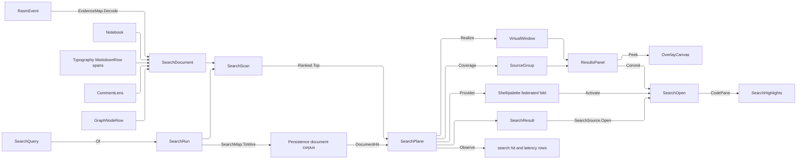

# [APPUI_DOCUMENT_SEARCH]

One typed search plane answers every "where is this" the document module can be asked. `SearchQuery` is the closed request shape carrying its terms, its matching grammar, its source scope, its result ceiling, and its modifier set; `SearchRun` pairs that admitted query with the ONE match engine it mints. `SearchSource` is the closed coverage vocabulary whose rows project the landed owners — notebook cells, markdown prose, issue titles and comments, graph node titles, sealed evidence payloads — into one `SearchDocument` candidate, and whose anchor, icon, and open columns decide how a hit off that source is admitted, badged, and navigated. `SearchResult` is the ranked, source-attributed row; `SearchPlane` folds the local scan and the store's resident index into ONE keyed cache whose realized rows come off the `Shell/virtualization` fabric; `ResultsPanel` is the presentation over that ranked window. The page owns the query shape, the coverage rows, the ranked result, the results presentation, the highlight binding on the code pane, and the consumed store query/result wire. It owns NO index: durability, the corpus table, its analyzer, and the rank engine are the Persistence retrieval lane's, and AppUi consumes that lane as VALUES. It stands NO second federated surface either: `Shell/palette#PALETTE_FEDERATION` is the app's one federated query face and consumes this plane as its document provider, so the ENGINE lives here and the merged rank fold lives there.

Coverage rows are projections, never re-derivations: cells project the `Document/notebook#CELL_MODEL` `NotebookCell` union, prose projects the raw markdown source the `Theme/typography#MARKDOWN_PROJECTION` rows already span, issues project the `Collab/issues#COMMENT_LENS` entries the board holds, nodes project the `Editing/graph#GRAPH_MODEL` `GraphNodeRow` titles the canvas already carries, and evidence decodes the `Diagnostics/evidence#CORRELATION_JOIN` `RasmEvent<Extensions>` stream and formats the generated `EvidenceWire`. One match engine serves both faces — `SearchRun.Of` mints the `ISearchStrategy` the corpus scan runs and the code pane's own `SearchPanel` resolves — so a hit found headlessly and a hit found in the editor are the same span, and a snippet emphasis reuses that engine rather than recompiling a pattern per rendered row. Results stream through `DynamicData` `FilterOnObservable` into `VirtualWindow<SearchResult,string>.Realize` over an `OrderedChangeSet` carrying the ONE comparer that orders it, so rank order is one authority rather than a comparer beside a snapshot that can disagree. `SearchFault` carries each failure through a direct generated union case; highlight spans ride the `SourceSpan` idiom `Document/media` uses for its link hits.

## [01]-[INDEX]

- [02]-[QUERY_SHAPE]: The closed request shape, the grammar vocabulary both faces read, the one engine mint, and the typed fault family.
- [03]-[SOURCE_COVERAGE]: The coverage rows, their anchor and navigation columns, and the one candidate shape each landed owner projects into.
- [04]-[RANKED_WINDOW]: The ranked source-attributed result row and its realization through the virtualization fabric.
- [05]-[HIGHLIGHT_NAV]: The navigation request each result becomes and the code pane's segment-tracked highlight binding.
- [06]-[INDEX_WIRE]: The consumed store query and hit wire; index custody stays with the Persistence retrieval lane.
- [07]-[RESULTS_PANEL]: Source-grouped hits with count badges, per-hit previews, keyboard walking with peek-on-focus, scoped panels, and recent queries.

## [02]-[QUERY_SHAPE]

- Owner: `SearchGrammar` `[SmartEnum<string>]` — the matching-grammar vocabulary carrying the editor mode, the wire predicate token, the durable word-boundary fact, and the panel knob push in one row; `SearchLimit` `[ValueObject<int>]` — the admitted result ceiling; `SearchQuery` `[ComplexValueObject]` — the one closed request; `SearchRun` — the admitted query paired with its single minted engine; `SearchFault` — the direct generated `[Union]` with one `[FaultCase]` leaf per search failure.
- Cases: `SearchGrammar` = literal · phrase · wildcard · pattern; `SearchFault` = PatternInvalid | SourceUnreachable | WireMismatched | AnchorAbsent.
- Entry: `public static Fin<SearchRun> Of(SearchQuery query)` — the ONE match-engine mint the corpus scan, the code pane, and the snippet emphasis all take as a threaded VALUE, folding the query's own columns onto `SearchStrategyFactory.Create(pattern, ignoreCase, matchWholeWords, mode)`.
- Auto: the grammar row carries FOUR projections of one decision — `Editor` is the `SearchMode` the strategy mint consumes, `Predicate` is the frozen wire token the store lowers to its own predicate case, `Bounds` states whether that durable lowering honours the word-boundary modifier, and `Panel` is the knob push the code pane's overlay takes — so literal, phrase, wildcard, and pattern matching are decided once for every face. Case sensitivity and word boundary are one `CapabilitySet<SearchOption>` column of the same build, read by name at each face rather than positioned; the mint takes the negation of the case-sensitive grant because the factory's own parameter is `ignoreCase`. An invalid pattern throws inside the factory rather than at the scan, so the trap sits at the mint and the refusal leaves typed as `SearchFault.PatternInvalid`.
- Packages: Avalonia.AvaloniaEdit, Rasm (kernel `FaultBand`/`[FaultCase]`/`Fault`/`CapabilitySet`), Rasm.Persistence (project), Thinktecture.Runtime.Extensions, LanguageExt.Core
- Growth: a new matching grammar is one `SearchGrammar` row carrying all four projections; a new modifier is one `SearchOption` row at the store's declaration, admitted here by name; a new refusal is one `[FaultCase]` leaf; zero new surface.
- Boundary: scope is a NON-EMPTY row set and "everything" is `SearchSource.Items`, so no empty-means-all sentinel exists and an unscoped query refuses at admission; the ceiling is the STORE's own constant — `dotnet:Rasm.Persistence/Query/retrieval#DOCUMENT_CORPUS` declares `LimitCeiling` and this admission reads that symbol, so neither end accepts what the other refuses and a per-end literal is the deleted form; the modifier set is the store's own `CapabilitySet<SearchOption>` and this shape holds no second copy of it, so a third modifier lands as one row at the producer and reaches both legs by name. Admission ACCUMULATES: a user typing nothing into an unscoped panel under an illegal modifier learns all three defects at once, which a first-defect ladder cannot answer. The one illegal corner is cross-boundary rather than intra-set: the store's `DocumentPredicate` reads the word-boundary grant on its `match` lowering ALONE, while the editor strategy honours it under every mode — so a bounded modifier under a phrase, wildcard, or pattern grammar makes the resident leg and the local scan answer different match sets, and the grammar row's own `Bounds` column is what the admission refuses on; all four corners of the set itself are legal, so no `CapabilityLaw` row stands here. The strategy is minted from the query and never from a second knob set — the panel's own knob set carries no mode column, so the grammar row owns the lowering onto it and a code pane whose panel knobs drifted from the query is unrepresentable; the mint travels as `SearchRun` because a factory call compiles a pattern, and re-minting per rendered snippet recompiled the same regex once per visible row. The pattern grammar is named `Pattern` rather than `Regex` because a member spelled for the BCL type captures that name inside its declaring type and every static access on it would need qualifying.

```csharp
// --- [TYPES] ---------------------------------------------------------------------------

[SmartEnum<string>]
[KeyMemberEqualityComparer<ComparerAccessors.StringOrdinal, string>]
[KeyMemberComparer<ComparerAccessors.StringOrdinal, string>]
public sealed partial class SearchGrammar {
    public static readonly SearchGrammar Literal = new("literal", SearchMode.Normal, predicate: "match", bounds: true,
        panel: static (panel, query) => Knobs(panel, query, query.Terms, SearchMode.Normal));
    public static readonly SearchGrammar Phrase = new("phrase", SearchMode.Normal, predicate: "phrase", bounds: false,
        panel: static (panel, query) => Knobs(panel, query, query.Terms, SearchMode.Normal));
    public static readonly SearchGrammar Wildcard = new("wildcard", SearchMode.Wildcard, predicate: "phrase-prefix", bounds: false,
        panel: static (panel, query) => Knobs(panel, query, Lowered(query.Terms), SearchMode.RegEx));
    public static readonly SearchGrammar Pattern = new("pattern", SearchMode.RegEx, predicate: "regex", bounds: false,
        panel: static (panel, query) => Knobs(panel, query, query.Terms, SearchMode.RegEx));

    public SearchMode Editor { get; }

    public string Predicate { get; }

    public bool Bounds { get; }

    [UseDelegateFromConstructor]
    public partial Unit Panel(SearchPanel panel, SearchQuery query);

    static Unit Knobs(SearchPanel panel, SearchQuery query, string pattern, SearchMode resolved) {
        panel.MatchCase = query.Options.Admits(SearchOption.CaseSensitive);
        panel.WholeWords = query.Options.Admits(SearchOption.WholeWords);
        panel.UseRegex = resolved == SearchMode.RegEx;
        panel.SearchPattern = pattern;
        return unit;
    }

    static string Lowered(string terms) =>
        string.Concat(terms.Select(static character => character switch {
            '?' => ".",
            '*' => ".*",
            var literal => Regex.Escape(literal.ToString()),
        }));
}

[ValueObject<int>]
public readonly partial struct SearchLimit {
    static partial void ValidateFactoryArguments(ref ValidationError? validationError, ref int value) =>
        validationError = value > 0 && value <= DocumentCorpus.LimitCeiling
            ? validationError
            : new ValidationError($"search limit is a positive result ceiling at or below {DocumentCorpus.LimitCeiling}");
}

// --- [ERRORS] --------------------------------------------------------------------------

[Union(ConversionFromValue = ConversionOperatorsGeneration.None)]
public abstract partial record SearchFault : Fault {
    private static readonly FaultBand FamilyBand = FaultBand.Search;
    private SearchFault(string detail) { Detail = detail; }
    public string Detail { get; }
    public override string Message => Detail;

    [FaultCase(0)]
    public sealed partial record PatternInvalid(string Detail) : SearchFault(Detail);
    [FaultCase(1)]
    public sealed partial record SourceUnreachable(Error Cause) : SearchFault("search/resident: source unreachable"), ICausedFault {
        public override Retriability Retriability => Retriability.Transient;
    }
    [FaultCase(2)]
    public sealed partial record WireMismatched(string Detail) : SearchFault(Detail);
    [FaultCase(3)]
    public sealed partial record AnchorAbsent(string Detail)   : SearchFault(Detail);
}

// --- [MODELS] --------------------------------------------------------------------------

[ComplexValueObject]
public sealed partial class SearchQuery {
    public string Terms { get; }

    public SearchGrammar Grammar { get; }

    public FrozenSet<SearchSource> Scope { get; }

    public Option<string> Subject { get; }

    public SearchLimit Limit { get; }

    public CapabilitySet<SearchOption> Options { get; }

    static partial void ValidateFactoryArguments(
        ref ValidationError? validationError,
        ref string terms,
        ref SearchGrammar grammar,
        ref FrozenSet<SearchSource> scope,
        ref Option<string> subject,
        ref SearchLimit limit,
        ref CapabilitySet<SearchOption> options) {
        SearchGrammar row = grammar;
        CapabilitySet<SearchOption> held = options;
        ValidationError? prior = validationError;
        validationError = (
            Gate(!string.IsNullOrWhiteSpace(terms), "search query carries terms"),
            Gate(scope.Count > 0, "search query carries at least one source row"),
            Gate(row.Bounds || !held.Admits(SearchOption.WholeWords),
                $"whole-word matching is a literal-grammar modifier: the store's {row.Predicate} lowering ignores it while the local scan honours it"))
            .Apply(static (_, _, _) => unit).As()
            .Match(
                Succ: _ => prior,
                Fail: errors => new ValidationError(string.Join("; ", errors.Map(static error => error.Message))));
    }

    internal static Validation<Error, Unit> Gate(bool holds, string detail) =>
        holds ? unit : Validation<Error, Unit>.Fail(new KernelFault.InvalidValue(nameof(SearchQuery), detail));
}

public sealed record SearchRun(SearchQuery Query, ISearchStrategy Strategy) {
    public static Fin<SearchRun> Of(SearchQuery query) =>
        Op.Of(name: "appui.search.compile").Catch(() => Fin.Succ(SearchStrategyFactory.Create(
                query.Terms,
                !query.Options.Admits(SearchOption.CaseSensitive),
                query.Options.Admits(SearchOption.WholeWords),
                query.Grammar.Editor)))
            .Map(strategy => new SearchRun(query, strategy));
}
```

## [03]-[SOURCE_COVERAGE]

- Owner: `AnchorArity` `[SmartEnum<string>]` — the three-valued anchor gate every decoded hit runs; `SearchSource` `[SmartEnum<string>]` — the closed coverage vocabulary, each row carrying its projection, its anchor arity and noun, its badge icon, and its navigation lowering; `SearchDocument` — the one candidate shape every row projects into; `SearchCorpus` — the composition-bound live rosters every row projects from; `SearchProjections` — the row column bodies beside the one total corpus mint; `SearchMatch` and `SnippetWindow` — the unshaped match and the local excerpt policy; `SearchScan` — the bounded corpus fold that turns candidates into ranked results.
- Cases: `SearchSource` = cell · prose · issue · node · evidence — each row a projection of a landed owner, never a second model of it; `AnchorArity` = required · optional · absent.
- Entry: `public static Seq<SearchDocument> Of(SearchCorpus corpus)` — the corpus mint as one fold over the coverage roster, so a declared source cannot contribute nothing; `public static Fin<Seq<SearchResult>> Local(SearchRun run, Seq<SearchDocument> corpus)` — the one in-memory fold: every scoped candidate runs the run's own strategy, the query's ceiling applies DURING the fold through the kernel bounded selection, and each surviving match constructs through the SAME `DocumentHit` shape the store answers with and decodes through the same gate.
- Auto: a cell projects the text it AUTHORS — a code cell its source, a markdown cell its prose, a parameter its key, an evidence cell its query — while the pin-bearing chart and render cells and the viewpoint carry structured payloads with no authored text and project nothing, so a hit can never point inside a payload it could not locate a span in. Prose projects the RAW markdown source rather than a second inline-to-text fold, and a hit rebases onto the run spans `Theme/typography` already carries, exactly as `Document/media` resolves its link hits. Issues project the topic title beside every `CommentLens` entry the board already holds. Nodes project the ONE authored string a `GraphNodeRow` carries — its title — because a node's pins, extent, containment, and rotation are structure rather than text, so a titleless node projects nothing. Evidence projects the sealed message envelope's payload text, which stays opaque to the join by design, so attribution is correlation-and-kind rather than a re-validated typed owner. Local rank is the hit density a candidate answers with, normalized against its own text length so a long document cannot outrank a precise short one on volume alone.
- Packages: Avalonia.AvaloniaEdit, Rasm (kernel `Ranked`/`ExtremumDirection`/`AssetKey`), Thinktecture.Runtime.Extensions, LanguageExt.Core
- Growth: a new covered source is ONE `SearchSource` row carrying its projection, its anchor arity and noun, its icon, and its navigation lowering, plus one `SearchCorpus` roster member it reads and one `SearchOpen` case its lowering names — the case addition breaks that dispatch at compile time and no column can be omitted, because the row's constructor demands every one; zero new surface, and no source gains a search entrypoint of its own.
- Boundary: every row PROJECTS its landed owner and models nothing — the cell union, the markdown rows, the comment lens, and the message-envelope stream stay the sole owners of their content, so a search-local copy of any of them is the deleted form; the projection is a COLUMN on the coverage row rather than a sibling static, so the corpus is one fold over `Items` and a row that contributes nothing is unrepresentable — five statics of five different arities made the corpus a call-site assembly whose omissions no type could see, and the rosters they read travel as one `SearchCorpus` value for the same reason. ANCHOR ARITY is a row column for the same reason the projection is: five result cases enumerating the same five sources meant a sixth source needed four edits and could compile carrying an anchor its surface has no parameter for. The NAMED LOSS is per-case compile-time anchor typing — a `Cell` result can no longer be a type that cannot exist without a cell id — and it is bought back at the ONE construction gate, which refuses a required anchor's absence before any row is minted and drops a member an absent-arity source's wire carried. Text is the ONLY searched channel, so a structured payload flattens at the projection and its structure stays behind; scans run the run's own `ISearchStrategy` over `StringTextSource`, the editor package's own plain-text source, so the corpus scan and the code pane share one match engine and a hand-rolled `IndexOf` loop or a second `Regex` beside it are the two rejected forms; the ceiling applies inside the fold rather than after it, because a scan that shaped every hit of every candidate paid one snippet slice per match before a bound of at most `LimitCeiling` rows discarded nearly all of them. Local hits construct through the `[06]` wire shape and decode through its gate, so `SearchResult` has exactly ONE construction site.

```csharp
// --- [TYPES] ---------------------------------------------------------------------------

[SmartEnum<string>]
[KeyMemberEqualityComparer<ComparerAccessors.StringOrdinal, string>]
public sealed partial class AnchorArity {
    public static readonly AnchorArity Required = new("required",
        static (member, source, subject) => member
            .ToFin(new SearchFault.AnchorAbsent($"search/{source.Key}: {subject} carries no {source.Anchor}"))
            .Map(static held => Some(held)));
    public static readonly AnchorArity Optional = new("optional", static (member, _, _) => Fin.Succ(member));
    public static readonly AnchorArity Absent = new("absent", static (_, _, _) => Fin.Succ(Option<string>.None));

    [UseDelegateFromConstructor]
    public partial Fin<Option<string>> Admit(Option<string> member, SearchSource source, string subject);
}

[SmartEnum<string>]
[KeyMemberEqualityComparer<ComparerAccessors.StringOrdinal, string>]
[KeyMemberComparer<ComparerAccessors.StringOrdinal, string>]
public sealed partial class SearchSource {
    public static readonly SearchSource Cell = new("cell",
        SearchProjections.Cells, AnchorArity.Required, anchor: "cell id",
        icon: AssetKey.Create("search.source.cell"),
        open: static hit => new SearchOpen.CodePane(hit.Subject, hit.Anchor, hit.Span));
    public static readonly SearchSource Prose = new("prose",
        SearchProjections.Prose, AnchorArity.Absent, anchor: "",
        icon: AssetKey.Create("search.source.prose"),
        open: static hit => new SearchOpen.ProsePane(hit.Subject, hit.Span));
    public static readonly SearchSource Issue = new("issue",
        SearchProjections.Issues, AnchorArity.Optional, anchor: "comment id",
        icon: AssetKey.Create("search.source.issue"),
        open: static hit => new SearchOpen.IssueBoard(hit.Subject, hit.Member));
    public static readonly SearchSource Node = new("node",
        SearchProjections.Nodes, AnchorArity.Required, anchor: "node key",
        icon: AssetKey.Create("search.source.node"),
        open: static hit => new SearchOpen.GraphCanvas(hit.Subject, hit.Anchor));
    public static readonly SearchSource Evidence = new("evidence",
        SearchProjections.Evidence, AnchorArity.Required, anchor: "fact kind",
        icon: AssetKey.Create("search.source.evidence"),
        open: static hit => new SearchOpen.EvidenceTimeline(hit.Subject, hit.Anchor));

    public AnchorArity Arity { get; }

    public string Anchor { get; }

    public AssetKey Icon { get; }

    [UseDelegateFromConstructor]
    public partial Seq<SearchDocument> Project(SearchCorpus corpus);

    [UseDelegateFromConstructor]
    public partial SearchOpen Open(SearchResult hit);
}

// --- [MODELS] --------------------------------------------------------------------------

public readonly record struct SearchDocument(
    SearchSource Source, string Subject, Option<string> Member, string Title, string Text);

public sealed record SearchCorpus(
    Seq<Notebook> Notebooks,
    Seq<(string DocumentKey, string Title, string Source)> Prose,
    Seq<IssueBoard> Boards,
    Seq<(string CanvasKey, Seq<GraphNodeRow> Nodes)> Canvases,
    Seq<RasmEvent<Extensions>> Events);

public readonly record struct SearchMatch(SearchDocument Candidate, int Start, int Length, double Rank);

public readonly record struct SnippetWindow(int Margin) {
    public static readonly SnippetWindow Local = new(Margin: 48);

    public string Cut(string text, int start, int length) =>
        (int.Max(start - Margin, 0), int.Min(start + length + Margin, text.Length)) switch {
            var (from, to) when to > from => text[from..to],
            _ => string.Empty,
        };
}

// --- [OPERATIONS] ----------------------------------------------------------------------

public static class SearchProjections {
    public static Seq<SearchDocument> Of(SearchCorpus corpus) =>
        toSeq(SearchSource.Items).Bind(row => row.Project(corpus));

    public static Seq<SearchDocument> Cells(SearchCorpus corpus) =>
        corpus.Notebooks.Bind(static notebook => notebook.Cells.Choose(cell => cell.Switch<string, Option<SearchDocument>>(
            state: notebook.Key,
            code:      static (key, c) => Some(Cell(key, c.Id, c.Source)),
            markdown:  static (key, m) => Some(Cell(key, m.Id, m.Source)),
            chart:     static (_, _) => Option<SearchDocument>.None,
            render:    static (_, _) => Option<SearchDocument>.None,
            viewpoint: static (_, _) => Option<SearchDocument>.None,
            parameter: static (key, p) => Some(Cell(key, p.Id, p.Key)),
            evidence:  static (key, e) => Some(Cell(key, e.Id, e.Query)))));

    public static Seq<SearchDocument> Prose(SearchCorpus corpus) =>
        corpus.Prose.Map(static row => new SearchDocument(SearchSource.Prose, row.DocumentKey, None, row.Title, row.Source));

    public static Seq<SearchDocument> Issues(SearchCorpus corpus) =>
        corpus.Boards.Bind(static board => board.Issues.Bind(static issue =>
            Seq(new SearchDocument(SearchSource.Issue, issue.Guid, None, issue.Title, issue.Title))
            + issue.Comments.Map(comment => new SearchDocument(
                SearchSource.Issue, issue.Guid, Some(comment.CommentId), issue.Title, comment.Text))));

    public static Seq<SearchDocument> Nodes(SearchCorpus corpus) =>
        corpus.Canvases.Bind(static canvas => canvas.Nodes
            .Filter(static node => !string.IsNullOrWhiteSpace(node.Title))
            .Map(node => new SearchDocument(SearchSource.Node, canvas.CanvasKey, Some(node.Key), node.Title, node.Title)));

    public static Seq<SearchDocument> Evidence(SearchCorpus corpus) =>
        corpus.Events.Choose(static row => EvidenceMap.Decode(row).ToOption().Map(fact =>
            new SearchDocument(
                SearchSource.Evidence,
                EvidenceJoin.Trace(row).Map(static trace => trace.ToHexString()).IfNone(row.Id.Value),
                Some(fact.At.Key),
                fact.At.Key,
                WireJson.Formatter.Format(EvidenceMap.Lower(fact)))));

    static SearchDocument Cell(string notebookKey, string cellId, string text) =>
        new(SearchSource.Cell, notebookKey, Some(cellId), cellId, text);
}

public static class SearchScan {
    public static Fin<Seq<SearchResult>> Local(SearchRun run, Seq<SearchDocument> corpus) =>
        Ranked.Top(
                source: corpus
                    .Filter(candidate => run.Query.Scope.Contains(candidate.Source)
                        && run.Query.Subject.ForAll(subject => string.Equals(subject, candidate.Subject, StringComparison.Ordinal)))
                    .Bind(Matches(run.Strategy)),
                keep: run.Query.Limit.Value,
                key: static match => match.Rank,
                direction: ExtremumDirection.Maximum)
            .TraverseM(static match => Wire(match).Decode())
            .As();

    static Func<SearchDocument, Seq<SearchMatch>> Matches(ISearchStrategy strategy) =>
        candidate => Shaped(candidate, toSeq(strategy.FindAll(new StringTextSource(candidate.Text), 0, candidate.Text.Length)));

    static Seq<SearchMatch> Shaped(SearchDocument candidate, Seq<ISearchResult> found) =>
        found.Map(hit => new SearchMatch(
            candidate, hit.StartOffset, hit.Length, Density(found.Count, candidate.Text.Length)));

    static DocumentHit Wire(SearchMatch match) =>
        new(match.Candidate.Source.Key, match.Candidate.Subject, match.Candidate.Member, match.Candidate.Title,
            match.Start, match.Length, SnippetWindow.Local.Cut(match.Candidate.Text, match.Start, match.Length), match.Rank);

    static double Density(int hits, int length) => length > 0 ? hits / (double)length : 0d;
}
```

## [04]-[RANKED_WINDOW]

- Owner: `SearchResult` — the ranked, source-attributed row and its one admission gate; `ScopeAdmission` and `SearchScope` — the refinement stream over the result attributes a scoped panel narrows on, carrying its own refusal; `SourceTally` — the per-source count and best rank read off the cache; `SearchPlane` — the keyed hit cache, its virtualization window, its re-drive posture, and the one run that fills both; `DocumentSearch` — the instrument rows and their write site.
- Law: rank descends and the result key breaks the tie, so two hits at one score order deterministically and the ordinal projection the extent ledger rebuilds from cannot disagree between two reads.
- Law: a hit is minted only through `SearchResult.Of`, which runs the source row's anchor gate first, so a constructed row's `Member` already satisfies the arity its navigation lowering reads.
- Entry: `public static Fin<SearchResult> Of(SearchSource source, string subject, Option<string> member, SourceSpan span, double rank, string snippet)` — the ONE mint; `public IO<Fin<Unit>> Run(SearchRun run, Seq<SearchDocument> corpus, Option<Func<DocumentQuery, IO<Fin<Seq<DocumentHit>>>>> resident, InstrumentSet set, MonotonicTimeline line)` — one run per query folding both legs onto one cache, measuring itself on the kernel timeline and writing its own coverage facts; `public IObservable<IChangeSet<RealizedItem<SearchResult>, string>> Realize(IObservable<ViewportRange> viewport)` — the realized window every result surface binds; `public PaletteProvider Provider(Func<PaletteQuery, IO<Fin<Unit>>> run)` and `public Fin<SearchOpen> Activate(string key)` — the `Shell/palette#PALETTE_FEDERATION` entry.
- Auto: the local scan answers from the in-memory corpus and the resident leg answers from the store's index, and BOTH publish into the same cache under the same keys — a hit both legs found collapses to one row because the key is anchor-plus-offset, and the merge keeps the higher score of the pair rather than whichever leg wrote last. The resident leg is a DECLARED arm rather than a required call, so a profile that provisioned no store binds `None` and the run publishes the local scan alone on the same result. Results stream through `DynamicData` `FilterOnObservable`, whose per-item `IObservable<bool>` re-admits each row as its own late fact settles, and the ordered snapshot feeds `VirtualWindow.Realize` so a hundred-thousand-hit result set realizes exactly the viewport.
- Evidence: hits and latency contribute inward through `DocumentSearch.TelemetryRow` and are written by `Run`, the surface holding both the published set and measured span; both rows partition on the source slot alone.
- Packages: DynamicData, System.Reactive, Riok.Mapperly, Rasm (kernel `Ranked`/`MonotonicTimeline`/`RedrivePolicy`/`Redrive`), Markdig, NodaTime, Thinktecture.Runtime.Extensions, LanguageExt.Core
- Growth: a new covered source is one `SearchSource` row and its `SearchOpen` case; a new addressable result attribute is one `SearchScope.Schema` field; a new admission condition is one `FilterOnObservable` predicate on the existing stream; zero new surface.
- Boundary: results ride the ONE `Shell/virtualization#WINDOW_OWNER` fabric — a search-local result list, a second sort beside the extent ledger, and a `Virtualise` call at this site are the three deleted forms, because the ledger owns ordinal projection and the window owns realization; ordering is ONE projection both the truncation and the ordering snapshot take, so a ceiling can never drop an arbitrary member of a score tie; the cache key is anchor plus hit offset, so one subject carrying many hits yields many rows rather than one the window under-counts; a superseding query DIFFS the cache rather than clearing it, because a clear-and-refill retires and re-realizes every row the two answers share and the panel visibly drops its list to do it. Band facts come off the CACHE in one fold: `Coverage` answers count and best rank together, so a badge naming the answer's size and a band ordered by its strongest hit read one authority — a best derived from the realized slice made band ORDER change as the user scrolled while the badge beside it did not. The palette is the app's one FEDERATED query surface and this plane is its document ENGINE — the provider row contributes into that merged fold and a second federated surface beside it is the deleted form; the provider row carries its coverage source as the hit BADGE and the row's own admitted `Icon` as the glyph, because the palette's merged list is the one place a cell hit, a prose hit, an issue hit, and an evidence hit sit beside each other. A store the profile has not provisioned is `None` at the resident parameter and the run degrades to local coverage with no second code path, while a BOUND store's refusal leaves as `SearchFault.SourceUnreachable`, RE-DRIVES on the plane's own curve because that case publishes `Retriability.Transient`, and fails the run on exhaustion rather than publishing a set that silently lost a leg — the refusal is raised onto the `IO` effect inside the leg precisely because the retry predicate reads the error an effect raised and never a failure still folded inside `Fin`. SCOPE is two distinct questions and each keeps its owner: `SearchQuery.Scope` is COVERAGE — which corpora the query asks at all, a wire column the resident leg reads — while `SearchScope` refines the ANSWERED set on result attributes, so narrowing a panel to one notebook costs no re-query while widening coverage does re-run. The refinement composes the plane's own `Admits` delegate rather than adding a stage, and a compile failure holds the last good predicate AS A VALUE beside the refusal that did not take effect, so the panel renders the broken scope off the same stream it filters by — an injected `Action<Error>` made that refusal a side effect no consumer could see.

```csharp
// --- [MODELS] --------------------------------------------------------------------------

public readonly record struct SearchResult(
    SearchSource Source, string Subject, Option<string> Member, SourceSpan Span, double Rank, string Snippet) {
    public static Fin<SearchResult> Of(
        SearchSource source, string subject, Option<string> member, SourceSpan span, double rank, string snippet) =>
        source.Arity.Admit(member, source, subject)
            .Map(admitted => new SearchResult(source, subject, admitted, span, rank, snippet));

    public string Anchor => Member.IfNone(string.Empty);

    public string Key => $"{Source.Key}:{Subject}:{Member.IfNone(string.Empty)}@{Span.Start}";

    public SearchOpen Open() => Source.Open(this);
}

public readonly record struct SourceTally(int Total, double Best);

public readonly record struct ScopeAdmission(Func<SearchResult, bool> Held, Option<Error> Refused) {
    public static readonly ScopeAdmission Open = new(static _ => true, None);

    public ScopeAdmission Next(Fin<Func<SearchResult, bool>> compiled) => compiled.Match(
        Succ: predicate => new ScopeAdmission(predicate, None),
        Fail: error => this with { Refused = Some(error) });
}

// --- [OPERATIONS] ----------------------------------------------------------------------

public static class SearchScope {
    public static readonly FilterSchema<SearchResult> Schema = new(Seq(
        new FilterField<SearchResult>(
            new FilterProperty(PropertyName.Create("source"), "search.property.source", FilterKind.Text,
                toSeq(SearchSource.Items).Map(static row => (PropertyValue)new PropertyValue.Text(row.Key))),
            static hit => Seq<PropertyValue>(new PropertyValue.Text(hit.Source.Key))),
        new FilterField<SearchResult>(
            new FilterProperty(PropertyName.Create("subject"), "search.property.subject", FilterKind.Text, Seq<PropertyValue>()),
            static hit => Seq<PropertyValue>(new PropertyValue.Text(hit.Subject))),
        new FilterField<SearchResult>(
            new FilterProperty(PropertyName.Create("member"), "search.property.member", FilterKind.Text, Seq<PropertyValue>()),
            static hit => hit.Member.Map(static text => (PropertyValue)new PropertyValue.Text(text)).ToSeq()),
        new FilterField<SearchResult>(
            new FilterProperty(PropertyName.Create("rank"), "search.property.rank", FilterKind.Number, Seq<PropertyValue>()),
            static hit => Seq<PropertyValue>(new PropertyValue.Number(hit.Rank)))));

    public static IObservable<ScopeAdmission> Admissions(
        IObservable<Predicate<FilterTerm>> scopes, FilterPace pace, IScheduler scheduler) =>
        pace.Pace(scopes, scheduler)
            .Select(Schema.Compile)
            .Scan(ScopeAdmission.Open, static (held, next) => held.Next(next))
            .Replay(1)
            .RefCount();

    public static Func<SearchResult, IObservable<bool>> Refine(
        Func<SearchResult, IObservable<bool>> admits, IObservable<ScopeAdmission> admissions) =>
        hit => Observable.CombineLatest(admits(hit), admissions, (admitted, scope) => admitted && scope.Held(hit));
}

// --- [COMPOSITION] ---------------------------------------------------------------------

public sealed record SearchPlane(
    SourceCache<SearchResult, string> Hits,
    VirtualWindow<SearchResult, string> Window,
    Func<SearchResult, IObservable<bool>> Admits,
    RedrivePolicy Curve) {
    public static PaletteKind ProviderKind => PaletteKind.Document;

    public IObservable<IChangeSet<RealizedItem<SearchResult>, string>> Realize(IObservable<ViewportRange> viewport) =>
        Window.Realize(
            new OrderedChangeSet<SearchResult, string>(
                Hits.Connect().FilterOnObservable((hit, _) => Admits(hit)),
                Observable.Return(RankOrder)),
            viewport);

    public IO<Fin<Unit>> Run(
        SearchRun run,
        Seq<SearchDocument> corpus,
        Option<Func<DocumentQuery, IO<Fin<Seq<DocumentHit>>>>> resident,
        InstrumentSet set,
        MonotonicTimeline line) =>
        (from started in FinT.lift<IO, MonotonicStamp>(line.Capture())
         from local in FinT.lift<IO, Seq<SearchResult>>(SearchScan.Local(run, corpus))
         from decoded in resident
             .Map(store => Resident(run, store))
             .IfNone(static () => FinT.lift<IO, Seq<SearchResult>>(Fin.Succ(Seq<SearchResult>())))
         from published in FinT.liftIO<IO, Seq<SearchResult>>(IO.lift<Seq<SearchResult>>(() => Publish(local + decoded, run.Query.Limit)))
         from ended in FinT.lift<IO, MonotonicStamp>(line.Capture())
         from elapsed in FinT.lift<IO, TimeSpan>(line.Elapsed(started, ended))
         from observed in FinT.lift<IO, Unit>(DocumentSearch.Observe(set, run.Query, published, elapsed))
         select observed).runFin.As();

    FinT<IO, Seq<SearchResult>> Resident(SearchRun run, Func<DocumentQuery, IO<Fin<Seq<DocumentHit>>>> store) =>
        new(Redrive.Run(Curve, store(SearchMap.ToWire(run.Query))
                .Bind(static answered => IO.lift(() => answered.MapFail(
                    static error => (Error)new SearchFault.SourceUnreachable(error)))))
            .Map(static wired => wired.TraverseM(static hit => hit.Decode()).As())
            .Catch(static (Error error) => IO.pure(Fin.Fail<Seq<SearchResult>>(error))));

    Seq<SearchResult> Publish(Seq<SearchResult> results, SearchLimit limit) {
        Seq<SearchResult> published = Ranked.Top(
            source: results.Fold(
                HashMap<string, SearchResult>(),
                static (best, hit) => best.AddOrUpdate(hit.Key, existing => existing.Rank >= hit.Rank ? existing : hit, hit))
                .Values,
            keep: limit.Value,
            key: static hit => hit.Rank,
            direction: ExtremumDirection.Maximum);
        Hits.EditDiff(published, EqualityComparer<SearchResult>.Default);
        return published;
    }

    public PaletteProvider Provider(Func<PaletteQuery, IO<Fin<Unit>>> run) =>
        new(ProviderKind, query => Observable.CombineLatest(
            Observable.FromAsync(token => run(query).RunAsync(EnvIO.New(token: token)).AsTask())
                .Select(static outcome => outcome.Match(
                    Succ: static _ => (PaletteStatus)new PaletteStatus.Settled(),
                    Fail: static error => new PaletteStatus.Refused(error)))
                .StartWith(new PaletteStatus.Pending()),
            Hits.Connect().ToCollection().StartWith(Array.Empty<SearchResult>()),
            static (status, hits) => new PaletteSlice(ProviderKind, status,
                Ordered(hits).Map(static (hit, ordinal) => SearchMap.ToHit(hit, ordinal)))));

    public HashMap<SearchSource, SourceTally> Coverage() =>
        toSeq(Hits.Items).Fold(
            HashMap<SearchSource, SourceTally>(),
            static (tallies, hit) => tallies.AddOrUpdate(
                hit.Source,
                held => new SourceTally(held.Total + 1, double.Max(held.Best, hit.Rank)),
                new SourceTally(1, hit.Rank)));

    public Fin<SearchOpen> Activate(string key) =>
        toSeq(Hits.Items).Find(hit => hit.Key == key)
            .ToFin(new SearchFault.AnchorAbsent($"search/activate: {key}"))
            .Map(static hit => hit.Open());

    public static IComparer<SearchResult> RankOrder { get; } =
        Comparer<SearchResult>.Create(static (left, right) =>
            right.Rank.CompareTo(left.Rank) switch {
                0 => StringComparer.Ordinal.Compare(left.Key, right.Key),
                var rank => rank,
            });

    static Seq<SearchResult> Ordered(IEnumerable<SearchResult> hits) => toSeq(hits.Order(RankOrder));
}

public static class DocumentSearch {
    public static readonly InstrumentSpec Hit = InstrumentSpec.Create(
        "rasm.appui.search.hits", InstrumentKind.Count, MeasureForm.Whole, "{hit}",
        "search hits by source", Seq(AppUiTelemetry.SourceSlot), None, None, None);

    public static readonly InstrumentSpec Latency = InstrumentSpec.Create(
        "rasm.appui.search.latency", InstrumentKind.Distribution, MeasureForm.Real, "s",
        "search fold duration by source", Seq(AppUiTelemetry.SourceSlot), Some(Buckets.InteractionSeconds), None, None);

    public static TelemetryContributorPort TelemetryRow(string version) =>
        AppUiTelemetry.Contribute(version, Hit, Latency);

    public static Fin<Unit> Observe(InstrumentSet set, SearchQuery query, Seq<SearchResult> results, TimeSpan elapsed) =>
        toSeq(query.Scope).TraverseM(source =>
                set.Write(Hit, (long)results.Filter(hit => hit.Source == source).Count,
                        InstrumentSet.Tags((AppUiTelemetry.SourceSlot, source.Key)))
                    .Bind(_ => set.Write(Latency, elapsed.TotalSeconds,
                        InstrumentSet.Tags((AppUiTelemetry.SourceSlot, source.Key)))))
            .As()
            .Map(static _ => unit);
}
```

## [05]-[HIGHLIGHT_NAV]

- Owner: `SearchOpen` `[Union]` — the navigation request each result becomes; `SearchHighlight` — the edit-tracked segment one hit occupies in a code pane; `SearchHighlights` — the owned pane binding; `CodePaneSearch` — the one binding between the search plane and the `Document/notebook` code pane.
- Cases: `SearchOpen` = CodePane | ProsePane | IssueBoard | GraphCanvas | EvidenceTimeline — one case per surface, each carrying exactly the anchor arity that surface opens on.
- Entry: `public static SearchHighlights Bind(TextEditor editor, SearchRun run, Seq<SearchResult> results)` — installs the pane's own search panel, folds the grammar row's `Panel` projection onto its knobs so both faces resolve one strategy, and registers each result's span in an edit-tracked segment tree; `public static Fin<Unit> Reveal(TextEditor editor, SearchHighlights highlights, SearchOpen.CodePane target)` — moves the caret and selection onto one hit through the segment's live offsets.
- Auto: hit spans ride a `TextSegmentCollection<SearchHighlight>` constructed over the pane's `TextDocument`, so `UpdateOffsets` moves every held span as the user types and a highlight cannot drift onto the wrong characters after one edit; `SearchPanel.Install` mounts the pane's own overlay and the grammar row pushes its knobs, so `FindNext`/`FindPrevious` walk the identical match set the plane ranked; `SearchCommands.FindNext`, `FindPrevious`, and `CloseSearchPanel` carry the default gestures the `Shell/commands` deck binds, so no keystroke policy lives here. Revealing a hit writes `CaretOffset` and one `Select(start, length)`, and the segment tree's own live offsets supply both.
- Packages: Avalonia.AvaloniaEdit, Avalonia, Markdig, LanguageExt.Core
- Growth: a new opened surface is one `SearchOpen` case and the `SearchSource` row column whose lowering names it — the case addition breaks that column's dispatch at compile time; zero new surface.
- Boundary: this union survives the result collapse because its discriminant is the CONSUMER — `Document/media` routes five of its cases, `Editing/graph` and `Document/notebook` two each — while the ranked row's five cases had no consumer that dispatched on them; the case set is SOURCED from `SearchSource.Open`, so a new surface is one row column rather than four edits. Only the `CodePane` case reaches an editor, because it is the only surface backed by a `TextEditor`; the other four reach their surfaces through `SearchPlane.Activate` — the palette's activation fold raises the typed request and `Shell/navigation`'s verb routes it, so prose highlights ride the retained run spans `Document/media` materializes, the issue board scrolls its own comment row, the graph canvas frames and selects its node through the settled canvas verbs, and the evidence timeline anchors on correlation, while a text-editor binding minted for any of the four is the rejected form. Spans convert once at the boundary: `SourceSpan` is inclusive-ended while a segment is offset-plus-length, so the conversion lives in `SearchHighlight` alone and every consumer reads segment offsets thereafter. The segment collection binds to the pane's document and DISCONNECTS at teardown, because a collection left attached keeps updating offsets for a document the pane no longer shows; the panel uninstalls on the same teardown so a re-opened pane mounts exactly one overlay.

```csharp
// --- [TYPES] ---------------------------------------------------------------------------

[Union(ConversionFromValue = ConversionOperatorsGeneration.None)]
public abstract partial record SearchOpen {
    private SearchOpen() { }
    public sealed record CodePane(string NotebookKey, string CellId, SourceSpan Span) : SearchOpen;
    public sealed record ProsePane(string DocumentKey, SourceSpan Span) : SearchOpen;
    public sealed record IssueBoard(string TopicGuid, Option<string> CommentId) : SearchOpen;
    public sealed record GraphCanvas(string CanvasKey, string NodeKey) : SearchOpen;
    public sealed record EvidenceTimeline(string Correlation, string Kind) : SearchOpen;
}

// --- [MODELS] --------------------------------------------------------------------------

public sealed class SearchHighlight : TextSegment {
    public SearchHighlight(SearchResult result) {
        Result = result;
        StartOffset = result.Span.Start;
        Length = result.Span.Length;
    }

    public SearchResult Result { get; }
}

public sealed record SearchHighlights(
    SearchPanel Panel, TextSegmentCollection<SearchHighlight> Segments, TextDocument Document) : IDisposable {
    public void Dispose() {
        Segments.Disconnect(Document);
        Panel.Uninstall();
    }
}

// --- [OPERATIONS] ----------------------------------------------------------------------

public static class CodePaneSearch {
    public static SearchHighlights Bind(TextEditor editor, SearchRun run, Seq<SearchResult> results) {
        SearchPanel panel = SearchPanel.Install(editor);
        ignore(run.Query.Grammar.Panel(panel, run.Query));
        TextSegmentCollection<SearchHighlight> segments = new(editor.Document);
        results.Iter(result => segments.Add(new SearchHighlight(result)));
        return new SearchHighlights(panel, segments, editor.Document);
    }

    public static Fin<Unit> Reveal(TextEditor editor, SearchHighlights highlights, SearchOpen.CodePane target) =>
        toSeq(highlights.Segments.FindSegmentsContaining(target.Span.Start)).Head
            .ToFin(new SearchFault.AnchorAbsent($"search/code-pane: {target.CellId}@{target.Span.Start}"))
            .Map(segment => {
                editor.CaretOffset = segment.StartOffset;
                editor.Select(segment.StartOffset, segment.Length);
                return unit;
            });
}
```

## [06]-[INDEX_WIRE]

- Owner: `SearchMap` — the generated `[Mapper]` projecting the admitted query onto the store-declared `DocumentQuery` and each cached result onto the federation's `PaletteHit`; `SearchWire` — the span reprojection and the ONE hand-gated decode off `DocumentHit`. The store lane declares the query and answer wire once and this page composes those declarations directly through its package reference.
- Entry: `public static partial DocumentQuery ToWire(SearchQuery query)` — the one encode; `public static partial PaletteHit ToHit(SearchResult hit, int rank)` — the one palette projection, its ordinal arriving as the additional mapped parameter; `public static Fin<SearchResult> Decode(this DocumentHit hit)` — the one decode, admitting the source row before the single mint.
- Auto: the query wire carries terms, the grammar's predicate token, the scoped source keys, the optional subject narrowing, the ceiling, and the ONE `CapabilitySet<SearchOption>` modifier column — exactly the admitted query and nothing derived from it. The hit wire carries the source key, the subject-and-member identity pair, the display title, the span as offset and length, the snippet the store extracted, and the score its rank engine produced. Decoding admits the source key FIRST and mints through `SearchResult.Of`, so an unknown key refuses as `SearchFault.WireMismatched` before any row constructs and a source whose anchor arity the wire cannot satisfy refuses as `SearchFault.AnchorAbsent`.
- Packages: Riok.Mapperly, Markdig, Thinktecture.Runtime.Extensions, LanguageExt.Core
- Growth: a new covered source is one `SearchSource` row whose key matches the store's `CorpusKind` row; a new hit column is one member on the store's declaration this decode reads; a new modifier is one `SearchOption` row crossing on the set already declared; zero new surface.
- Boundary: index custody is the store's — the corpus table, its analyzer, its index method, and its rank engine all live at `dotnet:Rasm.Persistence/Query/retrieval#DOCUMENT_CORPUS`, so nothing here names a table, an index, or a rank function and an AppUi-local index is the deleted form. The store's `DocumentQuery`/`DocumentHit` declarations ARE the contract and this plane composes them directly — a member-for-member re-spelled record here is the deleted twin; the grammar crosses as the `SearchGrammar` row's own predicate token rather than a second vocabulary, the source keys cross as `SearchSource` keys, and the modifiers cross as the store's own capability set through its ordinal-key projection rather than as a positional bool pair a decoder must know the order of. The mapper is a PROJECTION under `EnabledConversions = All & ~ExplicitCast`, because LanguageExt's throwing `Option<T>` cast otherwise outranks a registered converter, and every generic hand body is refused outright (RMG001), so each carrier crossing takes a per-TYPE non-generic `[UserMapping]` and the `Seq<string>` target takes its own. Source-side completeness is per-METHOD: the encode keeps `Both`, so an admitted column added to the query and forgotten at the wire fails the build, while the palette projection declares `Target` and NAMES the three columns it drops, because a hit's member, span, and score have no reader on a federated row. The DECODE stays a hand gate on purpose: admission-before-construction is a `Fin` fold no member mapping expresses, and after the result collapse it is one admission and one mint rather than five arms. The span crosses as offset and length because `SourceSpan`'s end is inclusive and a raw end field would let the two ends disagree by one character; the store returns identities and snippets alone, so a payload it already holds never re-crosses.

```csharp
// --- [BOUNDARIES] ----------------------------------------------------------------------

[Mapper(RequiredMappingStrategy = RequiredMappingStrategy.Both,
    EnabledConversions = MappingConversionType.All & ~MappingConversionType.ExplicitCast)]
public static partial class SearchMap {
    [MapProperty([nameof(SearchQuery.Grammar), nameof(SearchGrammar.Predicate)], nameof(DocumentQuery.Predicate))]
    [MapProperty(nameof(SearchQuery.Scope), nameof(DocumentQuery.Sources))]
    public static partial DocumentQuery ToWire(SearchQuery query);

    [MapperRequiredMapping(RequiredMappingStrategy.Target)]
    [MapperIgnoreSource(nameof(SearchResult.Member))]
    [MapperIgnoreSource(nameof(SearchResult.Span))]
    [MapperIgnoreSource(nameof(SearchResult.Rank))]
    [MapValue(nameof(PaletteHit.Kind), Use = nameof(Provider))]
    [MapValue(nameof(PaletteHit.Gestures), Use = nameof(Unbound))]
    [MapProperty(nameof(SearchResult.Subject), nameof(PaletteHit.Label))]
    [MapProperty(nameof(SearchResult.Snippet), nameof(PaletteHit.Secondary))]
    [MapProperty([nameof(SearchResult.Source), nameof(SearchSource.Key)], nameof(PaletteHit.Badge))]
    [MapProperty([nameof(SearchResult.Source), nameof(SearchSource.Icon)], nameof(PaletteHit.Icon))]
    public static partial PaletteHit ToHit(SearchResult hit, int rank);

    private static PaletteKind Provider() => SearchPlane.ProviderKind;

    private static Seq<KeyGesture> Unbound() => Seq<KeyGesture>();

    [UserMapping]
    private static Seq<string> Keys(FrozenSet<SearchSource> scope) => toSeq(scope).Map(static row => row.Key);

    [UserMapping]
    private static int Ceiling(SearchLimit limit) => limit.Value;

    [UserMapping]
    private static Option<string> Held(string text) => Some(text);

    [UserMapping]
    private static Option<AssetKey> Held(AssetKey key) => Some(key);
}

public static class SearchWire {
    public static SourceSpan Span(this DocumentHit hit) => new(hit.SpanStart, hit.SpanStart + hit.SpanLength - 1);

    public static Fin<SearchResult> Decode(this DocumentHit hit) =>
        (SearchSource.TryGet(hit.Source, out SearchSource? row) ? Optional(row) : Option<SearchSource>.None)
            .ToFin(new SearchFault.WireMismatched($"search/source: {hit.Source}"))
            .Bind(source => SearchResult.Of(source, hit.Subject, hit.Member, hit.Span(), hit.Score, hit.Snippet));
}
```

## [07]-[RESULTS_PANEL]

- Owner: `HitPreview` `[Union]` the per-hit preview shape; `SourceGroup` the per-source band with its count and band rank; `ResultsPanel` the panel state and its keyboard walk; `RecentQuery` the recalled query row; `ResultsPresentation` the grouping, preview emphasis, recall fold, and chrome projection.
- Cases: `HitPreview` = Snippet | Thumbnail — a text hit shows its excerpt with the match emphasized, and a hit whose owner sealed a visual shows that visual.
- Entry: `public static Seq<SourceGroup> Group(Seq<RealizedItem<SearchResult>> realized, HashMap<SearchSource, SourceTally> tallies)` — the source bands under the plane's own cache-wide facts; `public static HitPreview Preview(SearchResult hit, SearchRun run, Func<SearchResult, Option<(string Key, string Caption)>> thumbnails)` — the one preview projection; `public ResultsPanel Walk(int delta)` and `public Option<DialogIntent> Peek(Func<SearchResult, Option<(string RouteKey, IReactiveObject Content)>> preview)` — the keyboard walk and its peek-on-focus; `public Fin<SearchOpen> Commit()` — the settled navigation request a focused hit raises; `public static Seq<RecentQuery> Remember(Seq<RecentQuery> held, SearchQuery query, int hits, Instant at)` — the recent-query fold; `public static Seq<ControlIntent> Chrome(ResultsPanel panel, Seq<SourceGroup> bands, ScopeAdmission scope, VirtualWindowSpec window, ResolvedLocale locale)` — the panel as intent rows.
- Auto: grouping partitions the REALIZED window while both band facts — the badge count and the band's rank — come off the plane's cache-wide `Coverage` fold, so a panel showing a hundred-thousand-hit answer bands exactly the rows it renders while neither number moves as the user scrolls. The preview emphasis runs the RUN's own already-compiled strategy over the snippet, so the emphasized characters are the same match the ranking found and no pattern recompiles per rendered row. Peek-on-focus raises a `DialogIntent.Layer` on `OverlayShape.Peek` carrying the focused hit's route anchor, so a walked hit previews on the canvas stack beside the panel without entering the navigation stack — arrowing through results therefore mints no back entries. Committing a focused hit raises the settled `SearchOpen` request, so the panel's activation and the palette's activation reach one navigator. A scoped panel composes the plane's OWN `Admits` delegate through `SearchScope.Refine`, so narrowing to one notebook costs no re-query while widening COVERAGE re-runs. Recent queries are the admitted `SearchQuery` values themselves, so recalling one re-runs a query the shape already validated.
- Packages: DynamicData, System.Reactive, Avalonia, Avalonia.AvaloniaEdit, NodaTime, Thinktecture.Runtime.Extensions, LanguageExt.Core
- Growth: a new preview modality is one `HitPreview` case; a new panel affordance is one `ControlIntent` row on the existing fold; a new recall column is one `RecentQuery` member; zero new surface.
- Boundary: the panel is PRESENTATION over the ranked window and mints no query path — a panel-local scan, a panel-local sort, and a panel-local result list are the three deleted forms, so the rows it renders are the realized items the one fabric produced and their order is the one comparer's. A band count is a NUMBER on the band and never a formatted string on it: display format is `Theme/locale`'s, so the count reaches the chip through the resolved locale's own plural pattern and an invariant `ToString` on a model row is the deleted form. Grouping never re-sorts: bands present in rank order of their best hit and rows within a band keep the window's order, so a grouped view and a flat view show one ranking. The scope refinement is composed at the panel's own call site rather than through a wrapper — a single-caller forwarder over `SearchScope.Refine` resolved one name in two hops and carried five parameters where the plane already holds one. Peek seats on the CANVAS stack and the opened surface enters through the settled navigation verb, so a preview and a commit are two different stacks. Highlight navigation into an opened code pane rides the settled `[05]` `CodePaneSearch.Reveal` mint, so the panel raises a request and never touches an editor. Scope chips render the `Editing/livedata#FILTER_ALGEBRA` vocabulary — a panel-local scope grammar is the deleted form — and a refused expression renders as a banner off the same admission value that holds the last good predicate, so a panel can never widen silently. The recall depth is this surface's own bound and not the store's: `SearchLimit` bounds what one ANSWER may hold, while `RecentDepth` bounds how many past questions a panel lists, and an unbounded roster is a panel that eventually renders history instead of results.

```csharp
// --- [TYPES] ---------------------------------------------------------------------------

[Union(ConversionFromValue = ConversionOperatorsGeneration.None)]
public abstract partial record HitPreview {
    private HitPreview() { }
    public sealed record Snippet(string Text, Seq<(int Start, int Length)> Matches) : HitPreview;
    public sealed record Thumbnail(string ArtifactKey, string Caption) : HitPreview;
}

// --- [MODELS] --------------------------------------------------------------------------

public readonly record struct SourceGroup(SearchSource Source, SourceTally Tally, Seq<RealizedItem<SearchResult>> Realized) {
    public int Total => Tally.Total;

    public double Best => Tally.Best;
}

public readonly record struct RecentQuery(SearchQuery Query, Instant At, int Hits);

public sealed record ResultsPanel(Seq<RealizedItem<SearchResult>> Rows, int Focused, Seq<RecentQuery> Recent) {
    public const int RecentDepth = 12;

    public Option<SearchResult> Current => Rows.Skip(Focused).Head.Map(static row => row.Item);

    public ResultsPanel Walk(int delta) =>
        Rows.IsEmpty ? this : this with { Focused = Math.Clamp(Focused + delta, 0, Rows.Count - 1) };

    public Option<DialogIntent> Peek(Func<SearchResult, Option<(string RouteKey, IReactiveObject Content)>> preview) =>
        Current.Bind(preview).Map(static row => (DialogIntent)new DialogIntent.Layer(
            OverlayShape.Peek, row.RouteKey, row.Content, new LayerAnchor.Route(row.RouteKey)));

    public Fin<SearchOpen> Commit() =>
        Current.ToFin(new SearchFault.AnchorAbsent("search/panel: no focused hit")).Map(static hit => hit.Open());
}

// --- [OPERATIONS] ----------------------------------------------------------------------

public static class ResultsPresentation {
    public const string ExpandIntent = "search.band.expand";

    public const string BandCountKey = "search.band.count";

    public static Seq<SourceGroup> Group(
        Seq<RealizedItem<SearchResult>> realized, HashMap<SearchSource, SourceTally> tallies) =>
        toSeq(toSeq(tallies)
            .Map(row => new SourceGroup(row.Key, row.Value, realized.Filter(hit => hit.Item.Source == row.Key)))
            .OrderByDescending(static band => band.Best));

    public static HitPreview Preview(
        SearchResult hit, SearchRun run, Func<SearchResult, Option<(string Key, string Caption)>> thumbnails) =>
        thumbnails(hit).Match(
            Some: sealed_ => (HitPreview)new HitPreview.Thumbnail(sealed_.Key, sealed_.Caption),
            None: () => new HitPreview.Snippet(hit.Snippet, Emphasis(hit.Snippet, run)));

    public static Seq<(int Start, int Length)> Emphasis(string snippet, SearchRun run) =>
        toSeq(run.Strategy.FindAll(new StringTextSource(snippet), 0, snippet.Length))
            .Map(static found => (found.StartOffset, found.Length));

    public static Seq<RecentQuery> Remember(Seq<RecentQuery> held, SearchQuery query, int hits, Instant at) =>
        (Seq(new RecentQuery(query, at, hits)) + held.Filter(row => row.Query != query))
            .Take(ResultsPanel.RecentDepth);

    public static Seq<ControlIntent> Chrome(
        ResultsPanel panel, Seq<SourceGroup> bands, ScopeAdmission scope, VirtualWindowSpec window, ResolvedLocale locale) =>
        bands.Map(band => (ControlIntent)new ControlIntent.Chip(
            $"search.band.{band.Source.Key}",
            locale.Plural(BandCountKey, band.Total, PluralRoute.Cardinal).IfFail(static _ => BandCountKey),
            ChipPosture.Toggle,
            IntentBinding.Of(PaintRole.Panel)))
        + scope.Refused.Map(static error => (ControlIntent)new ControlIntent.Banner(
            "search.scope.refused", "search.scope.refused.headline", error.Message,
            BannerSeverity.Warning, BannerPlacement.Section,
            Seq<ControlIntent>(), None, IntentBinding.Of(PaintRole.Panel))).ToSeq()
        + Seq<ControlIntent>(
            new ControlIntent.Tree("search.results", new ControlIntent.Chip(
                    "search.hit", string.Empty, ChipPosture.Static, IntentBinding.Of(PaintRole.Surface)),
                ExpansionCommand: ExpandIntent, window, IntentBinding.Of(PaintRole.Panel)),
            new ControlIntent.Select("search.recent", SelectPosture.Editable,
                new OptionSource.Inline(panel.Recent.Map(static row =>
                    new OptionRow(row.Query.Terms, row.Query.Terms, Some(row.Query.Grammar.Key), None))),
                window, IntentBinding.Of(PaintRole.Well)));
}
```



## [08]-[RESEARCH]

(none)
