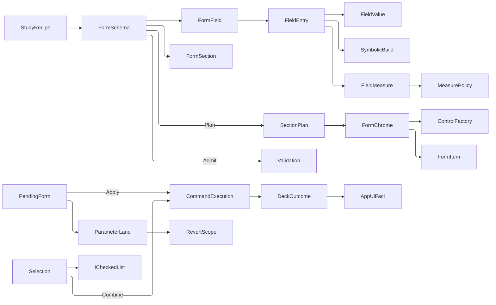

# [APPUI_FORMS_SELECTION]

A declarative forms-and-selection owner family delivers schema-driven forms with sectioned professional layout, dimensioned and expression-bearing entry, pending-commit posture, and multi-selection batch editing over the admitted `PropertyModels` infrastructure with zero new package. `FormSchema` is a sequence of typed field rows partitioned by section rows, materialized through the one `ControlFactory` and seated by `FormChrome` into the admitted `Form`/`FormGroup`/`FormItem` mechanism; validation rides the one LanguageExt `Validation<Error,T>` applicative; conditional visibility is schema data — each field declares its edges as `FieldRule` values, so the schema owns re-evaluation and no attribute machinery is claimed for it. Field identity is the kernel `FieldTag` and every stored value is a kernel `Interaction/control` `FieldValue` case inside a `FieldCell` carrying agreement, arity, authored source, and provenance — erased JSON exists only at the two wire edges, the `FormSchema.With` admission door and the `FieldJson.Lower` payload projection. Dimensioned entry resolves through `Theme/locale#MEASUREMENT_FORMAT` and expression entry rides the `Rasm.Compute` symbolic owner; `PendingForm` batches every marked write into one re-solve under one correlation; `Selection` is a model over the admitted `ICheckedList` whose one `Raise` fold carries the anchor, range, and toggle grammar, whose `SelectionBand` consumes the marquee, whose `SelectionFacet` capability set drives select-similar, and which folds batch-edit intents to one `DeckOutcome` through `CommandExecution.Combine`; `SelectionSet` is the durable named element set persisting through the `Editing/livedata#VIEW_STATE` `SnapshotPort`, and `SelectionChannel` is the one snapshot stream availability, footer, and screen state read. The PropertyModels `[ConditionTarget]`/`[PropertyVisibilityCondition]`/`[DependsOnProperty]` annotations stay the inspector's law and never govern this schema. The spine is `Irihi.Ursa`, `bodong.PropertyModels`, the `ControlIntent`/`ControlFactory` owner, the `CommandRow`/`CommandExecution` deck, UnitsNet, `Rasm.Compute` symbolic admission, QuikGraph, Thinktecture.Runtime.Extensions, and LanguageExt result types.

## [01]-[INDEX]

- [02]-[FORM_SCHEMA]: Typed field rows under section rows; unit, expression, state, and provenance columns; the plan projection.
- [03]-[FORM_CHROME]: The form-mechanism capsule seating every plan row, its section furniture, nav, and operation column.
- [04]-[WIZARD_FLOW]: Multi-step wizard over the one section roster; step gates ride the same validation path.
- [05]-[SELECTION_MODEL]: Checked-list selection over the one admitted collection backing; the gesture, marquee, and similarity producers; durable named selection sets and the one snapshot stream.
- [06]-[BATCH_EDIT]: Pending-commit posture, the parameter revert lane and value sets, and the N-item batch fold to one `DeckOutcome`.
- [07]-[STUDY_FORM]: Revision-bearing study recipes compiled into the one schema grammar and submitted under one correlation.

## [02]-[FORM_SCHEMA]

- Owner: `FormField` the typed field row; `FormSection` the section row partitioning the field set; `FormSchema` the field-and-section owner with its memoized dependency graph; `FieldEntry` the admission-row family; `FieldMeasure` the dimensioned column; `EditState` the ranked ink axis over `FieldFacts`; `ValueOrigin` the provenance axis; `FieldCell` the stored kernel `FieldValue` carrying agreement, arity, authored source, and origin; `FieldRule` the inspectable visibility/requiredness predicate family; `FieldJson` the one erased-boundary projection pair; `FormFilter` the in-panel parameter search; `SectionPlan`/`FieldPlan` the pure projection the chrome capsule seats; `FormFault` the direct generated `[Union]` with one `[FaultCase]` leaf per form failure.
- Cases: `[FaultCase]` = FieldInvalid | StepIncomplete | SubmitRejected | SchemaInvalid | ExpressionRejected | MeasureRejected | CommitRejected | RecipeRejected; `FieldEntry` = words | scalar | formula | choice | set | flag | moment | path | colour; `EditState` = declared | overridden | pending | mixed | invalid; `ValueOrigin` = declared | authored | derived | linked | inherited; `Agreement` = Settled | Overridden | Divergent; `FieldRule` = Always | Never | WhenSet | Custom; `SectionChrome` = grouped | divided | boxed | described; `FilterFacet` = all | modified | invalid | pending | derived.
- Law: the section rosters PARTITION the field set — every field seats in exactly one section — so a field that renders nowhere is a construction-time `Schema` refusal rather than a row silently absent from every panel.
- Law: the field's declared `Entry` row is checked against its `Control` intent at construction, so an admission that could never match its editor refuses before a form exists.
- Law: mixed state reads AGREEMENT, never a sentinel — `Agreement` is a closed union, so a uniformly absent value and a divergent one stay distinguishable and the four unrepresentable `(Mixed, Overridden)` corners the bool product admitted are unspellable.
- Entry: `FormSchema.Create` accumulates schema-identity, dependency, partition, entry-admission, and DAG faults; `FormSchema.Tag` admits an untrusted key through the kernel `FactoryBridge.Accept` bridge onto `FieldTag`; `FormSchema.With` admits one erased `JsonElement` through the addressed field's `FieldEntry` row into a typed `FieldCell` before state mutation; `FormSchema.Admit` accumulates every visible field rule; `FormSchema.Affected` answers the TRANSITIVE dependents of a changed tag in dependency order off the memoized graph; `FormSurface.Plan(FormState state, HashMap<FieldTag, FieldCell> pending, FormFilter filter, ResolvedLocale locale, Option<WizardState> cursor = default)` projects the admitted schema onto section plans — one signature serving the flat form and the wizard; `FormSurface.Panel` folds the same plan into one nested `ControlIntent.Panel` for a head carrying no form mechanism; `FieldJson.Lower` is the ONE typed-to-JSON projection the command payload crossing reads.
- Auto: a `FormField` carries its tag, label key, `ControlIntent`, entry row, declared dependency edges, `FieldRule` visibility and requiredness, typed fallback, help key, optional measure, commit posture, and state-level rule. `FormSchema.Create` rejects duplicate identities, unknown dependency references, a roster that is not a partition, an entry row its control refuses, and cyclic dependency graphs before a form exists — the graph materializes ONCE through `GraphExtensions.ToAdjacencyGraph` and both the acyclicity proof and the propagation index read it. A formula field derives its dependency edges from its expression's free symbols and a `FieldRule.WhenSet`/`Custom` row declares its reads, so the graph oracle sees every real edge — visibility edges included, which the opaque-predicate form hid.
- Packages: Irihi.Ursa, UnitsNet, QuikGraph (shared tier), Thinktecture.Runtime.Extensions, LanguageExt.Core, Rasm (kernel `FieldTag`/`FieldValue`/`PerceptualColor`/fault floor), Rasm.Compute (project)
- Growth: a new field type is one `FormField` row reusing the `ControlIntent` vocabulary; a new admission is one `FieldEntry` row with its predicate and typed constructor; a new fault case is one `[FaultCase]` leaf; a new rule shape is one `FieldRule` case declaring its edges; a new search facet is one `FilterFacet` row; zero new surface.
- Boundary: a form is a validated `FormSchema` whose field controls materialize through `ControlFactory` and whose rows seat into the admitted form mechanism; a settings-dialog framework, form-builder, per-form control class, and second validation scheme are rejected. The interior is TYPED — `FormState` holds kernel `FieldValue` cases inside `FieldCell` rows, and JSON exists only at `With` (inbound, admitted once per entry row) and `FieldJson.Lower` (outbound, the `Shell/commands#INTENT_TABLE` `CommandPayload.Fields` crossing) — so heterogeneous storage never becomes untyped interior reads. Dimensioned admission parses against the FAMILY type `QuantityInfo.ValueType` carries and clamps on the scalar in the elected display unit; `UnitMath.Clamp` constrains to the closed family type an erased field never carries, so the boxed face cannot reach it and the `[BASEUNITS_PARTIALITY]` walk is never entered, the display unit arriving from the `MeasureRole` row rather than a unit system. Expression admission is the `Rasm.Compute` symbolic owner — `SymbolicBuild.Build` over the engine's non-throwing parse, free-symbol binding from sibling field values, `SymbolicExpr.Evaluate` to one real — so a local arithmetic parser, a string `eval`, and a second dimension proof are deleted; a typed spinner carries no expression because its text boundary narrows through the package's own per-closed-generic parse. Form validation accumulates independent failures and submit rides the one `CommandRow` entry.

```csharp
// --- [TYPES] ---------------------------------------------------------------------------

[Union(ConversionFromValue = ConversionOperatorsGeneration.None)]
public abstract partial record FormFault : Fault {
    private static readonly FaultBand FamilyBand = FaultBand.Form;
    private FormFault(string detail) => Detail = detail;

    public string Detail { get; }
    public override string Message => Detail;

    [FaultCase(0)]
    public sealed partial record FieldInvalid(string Target, string Detail)       : FormFault($"{Target}: {Detail}");
    [FaultCase(1)]
    public sealed partial record StepIncomplete(string Detail)                    : FormFault(Detail);
    [FaultCase(2)]
    public sealed partial record SubmitRejected(string Detail)                    : FormFault(Detail);
    [FaultCase(3)]
    public sealed partial record SchemaInvalid(string Detail)                     : FormFault(Detail);
    [FaultCase(4)]
    public sealed partial record ExpressionRejected(string Target, string Detail) : FormFault($"{Target}: {Detail}");
    [FaultCase(5)]
    public sealed partial record MeasureRejected(string Target, string Detail)    : FormFault($"{Target}: {Detail}");
    [FaultCase(6)]
    public sealed partial record CommitRejected(string Detail)                    : FormFault(Detail);
    [FaultCase(7)]
    public sealed partial record RecipeRejected(string Detail)                    : FormFault(Detail);
}

// --- [TYPES] ---------------------------------------------------------------------------

[SmartEnum<string>]
[KeyMemberEqualityComparer<ComparerAccessors.StringOrdinal, string>]
[KeyMemberComparer<ComparerAccessors.StringOrdinal, string>]
public sealed partial class ValueOrigin : ICapability<ValueOrigin> {
    public static readonly ValueOrigin Declared = new("declared", resettable: false);
    public static readonly ValueOrigin Authored = new("authored", resettable: true);
    public static readonly ValueOrigin Derived = new("derived", resettable: true);
    public static readonly ValueOrigin Linked = new("linked", resettable: false);
    public static readonly ValueOrigin Inherited = new("inherited", resettable: true);

    public bool Resettable { get; }

    public string Badge => LocaleStrings.Key(nameof(ValueOrigin), Key);
}

[Union(ConversionFromValue = ConversionOperatorsGeneration.None)]
public abstract partial record Agreement {
    private Agreement() { }
    public sealed record Settled : Agreement;
    public sealed record Overridden : Agreement;
    public sealed record Divergent : Agreement;
}

public readonly record struct FieldFacts(Agreement Agreement, bool Pending, bool Invalid);

[SmartEnum<string>]
[KeyMemberEqualityComparer<ComparerAccessors.StringOrdinal, string>]
[KeyMemberComparer<ComparerAccessors.StringOrdinal, string>]
public sealed partial class EditState {
    public static readonly EditState Declared = new("declared", ":declared", rank: 0, static _ => true);
    public static readonly EditState Overridden = new("overridden", ":overridden", rank: 1, static facts => facts.Agreement is Agreement.Overridden);
    public static readonly EditState Pending = new("pending", ":pending", rank: 2, static facts => facts.Pending);
    public static readonly EditState Mixed = new("mixed", ":mixed", rank: 3, static facts => facts.Agreement is Agreement.Divergent);
    public static readonly EditState Invalid = new("invalid", ":invalid", rank: 4, static facts => facts.Invalid);

    public string Mark { get; }

    public int Rank { get; }

    [UseDelegateFromConstructor]
    public partial bool Holds(FieldFacts facts);

    public string Badge => LocaleStrings.Key(nameof(EditState), Key);

    private static readonly Lazy<Seq<EditState>> ByRank = new(
        static () => toSeq(Items.OrderByDescending(static row => row.Rank)).Strict(),
        LazyThreadSafetyMode.ExecutionAndPublication);

    public static EditState Of(FieldFacts facts) => ByRank.Value.Find(row => row.Holds(facts)).IfNone(Declared);

    public static EditState Read(FormField field, FormState state, Option<FieldCell> pending) {
        Agreement agreement = state.Values.Find(field.Key).Match(
            Some: cell => cell.Divergent
                ? (Agreement)new Agreement.Divergent()
                : cell.Uniform.Exists(value => field.Fallback.ForAll(fallback => fallback != value))
                    ? new Agreement.Overridden()
                    : new Agreement.Settled(),
            None: static () => new Agreement.Settled());
        return Of(new FieldFacts(agreement, pending.IsSome, field.Rule(state).IsFail));
    }

    public Unit Apply(Control row) =>
        fun(() => Items.Iter(state => row.Classes.Set(state.Mark, ReferenceEquals(state, this))))();
}

[SmartEnum<string>]
[KeyMemberEqualityComparer<ComparerAccessors.StringOrdinal, string>]
[KeyMemberComparer<ComparerAccessors.StringOrdinal, string>]
public sealed partial class FilterFacet {
    private static readonly CapabilitySet<ValueOrigin> DerivedKinds = CapabilitySet<ValueOrigin>.Of(ValueOrigin.Derived, ValueOrigin.Linked);

    public static readonly FilterFacet All = new("all", static (_, _) => true);
    public static readonly FilterFacet Modified = new("modified", static (state, _) => state != EditState.Declared);
    public static readonly FilterFacet Invalid = new("invalid", static (state, _) => state == EditState.Invalid);
    public static readonly FilterFacet Pending = new("pending", static (state, _) => state == EditState.Pending);
    public static readonly FilterFacet Derived = new("derived", static (_, origin) => DerivedKinds.Admits(origin));

    [UseDelegateFromConstructor]
    public partial bool Holds(EditState state, ValueOrigin origin);
}

public readonly record struct FormFilter(string Query, FilterFacet Facet) {
    public static readonly FormFilter Open = new(string.Empty, FilterFacet.All);

    public bool Match(FormField field, EditState state, ValueOrigin origin, ResolvedLocale locale) =>
        Facet.Holds(state, origin)
        && (string.IsNullOrWhiteSpace(Query)
            || locale.Formats.CompareInfo.IndexOf(locale.Label(field.LabelKey), Query, CompareOptions.IgnoreCase | CompareOptions.IgnoreNonSpace) >= 0
            || locale.Formats.CompareInfo.IndexOf(field.Key.Value, Query, CompareOptions.IgnoreCase | CompareOptions.IgnoreNonSpace) >= 0);
}
```

```csharp
// --- [MODELS] --------------------------------------------------------------------------

public sealed record FieldCell(Option<FieldValue> Uniform, int Targets, Option<string> Source, ValueOrigin Origin) {
    public static FieldCell Of(FieldValue value, ValueOrigin origin) => new(Some(value), 1, None, origin);

    public static FieldCell Authored(FieldValue value, string source, ValueOrigin origin) => new(Some(value), 1, Some(source), origin);

    public bool Divergent => Targets > 1 && Uniform.IsNone;
}

public sealed record FormState(HashMap<FieldTag, FieldCell> Values) {
    public static readonly FormState Empty = new(HashMap<FieldTag, FieldCell>());

    internal FormState Seat(FieldTag key, FieldCell value) => this with { Values = Values.AddOrUpdate(value) };

    public Fin<HashMap<string, JsonElement>> Payload() =>
        toSeq(Values)
            .Traverse(static pair => pair.Value.Uniform
                .ToFin(new FormFault.FieldInvalid(pair.Key.Value, "value diverges across targets"))
                .Map(value => (Key: pair.Key.Value, Value: FieldJson.Lower(value))))
            .As()
            .Map(toHashMap);
}

public sealed record FieldMeasure(MeasureRole Role, QuantityInfo Family, Option<IQuantity> Floor, Option<IQuantity> Ceiling) {
    public Fin<IQuantity> Admit(string text, ResolvedLocale locale) =>
        Quantity.TryParse(locale.Formats, Family.ValueType, text, out IQuantity? parsed) && parsed is not null
            ? Bound(parsed, locale)
            : Fin.Fail<IQuantity>(new FormFault.MeasureRejected(Role.Key, text));

    public Fin<IQuantity> Admit(double value, ResolvedLocale locale) =>
        Quantity.TryFrom(value, locale.Measures.Unit(Role), out IQuantity? built) && built is not null
            ? Bound(built, locale)
            : Fin.Fail<IQuantity>(new FormFault.MeasureRejected(Role.Key, value.ToString(locale.Formats)));

    public Fin<string> Render(IQuantity value, ResolvedLocale locale) => locale.Quantity(value, Role);

    Fin<IQuantity> Bound(IQuantity value, ResolvedLocale locale) =>
        !StringComparer.Ordinal.Equals(Family.Name, value.QuantityInfo.Name)
            ? Fin.Fail<IQuantity>(new FormFault.MeasureRejected(Role.Key, value.QuantityInfo.Name))
            : locale.Measures.Unit(Role) switch {
                var unit => Try.lift(() => Fin.Succ(Quantity.From(
                        double.Clamp(
                            value.As(unit),
                            Floor.Map(edge => edge.As(unit)).IfNone(double.NegativeInfinity),
                            Ceiling.Map(edge => edge.As(unit)).IfNone(double.PositiveInfinity)),
                        unit))).Run().Bind(static inner => inner),
            };
}

[SmartEnum<string>]
[KeyMemberEqualityComparer<ComparerAccessors.StringOrdinal, string>]
[KeyMemberComparer<ComparerAccessors.StringOrdinal, string>]
public sealed partial class FieldEntry {
    public static readonly FieldEntry Words = new("words",
        static intent => intent is ControlIntent.TextInput,
        static (field, _, value, _) => Shaped(field, value, JsonValueKind.String,
            static (_, value) => Fin.Succ<FieldValue>(new FieldValue.Text(value.GetString() ?? string.Empty))));
    public static readonly FieldEntry Scalar = new("scalar",
        static intent => intent is ControlIntent.NumberInput or ControlIntent.Slider or ControlIntent.Range,
        static (field, _, value, locale) => value.ValueKind is JsonValueKind.Number && value.TryGetDouble(out double real)
            ? field.Measure.Match(
                Some: measure => measure.Admit(real, locale)
                    .Map(quantity => FieldCell.Of(new FieldValue.Number(quantity.As(locale.Measures.Unit(measure.Role))), ValueOrigin.Authored))
                    .ToValidation(),
                None: () => Validation<Error, FieldCell>.Success(FieldCell.Of(new FieldValue.Number(real), ValueOrigin.Authored)))
            : Validation<Error, FieldCell>.Fail(new FormFault.FieldInvalid(field.Key.Value, $"expected a number, saw {value.ValueKind}")));
    public static readonly FieldEntry Formula = new("formula",
        static intent => intent is ControlIntent.TextInput,
        static (field, state, value, locale) => value.ValueKind is JsonValueKind.String
            ? (value.GetString() ?? string.Empty) switch {
                var source => SymbolicBuild.Build(new BuildSpec.Infix(source))
                    .Bind(expression => expression.Evaluate(Bindings(state)))
                    .Bind(real => field.Measure.Match(
                        Some: measure => measure.Admit(real, locale)
                            .Map(quantity => FieldCell.Authored(
                                new FieldValue.Number(quantity.As(locale.Measures.Unit(measure.Role))), source, ValueOrigin.Derived)),
                        None: () => Fin.Succ(FieldCell.Authored(new FieldValue.Number(real), source, ValueOrigin.Derived))))
                    .ToValidation(),
            }
            : Validation<Error, FieldCell>.Fail(new FormFault.FieldInvalid(field.Key.Value, $"expected an expression, saw {value.ValueKind}")));
    public static readonly FieldEntry Choice = new("choice",
        static intent => intent is ControlIntent.Select or ControlIntent.Radio or ControlIntent.Segmented,
        static (field, _, value, _) => Shaped(field, value, JsonValueKind.String, (_, value) => Chosen(field, value)));
    public static readonly FieldEntry Set = new("set",
        static intent => intent is ControlIntent.MultiSelect,
        static (field, _, value, _) => value.ValueKind is JsonValueKind.Array
            ? toSeq(value.EnumerateArray())
                .Traverse(member => member.ValueKind is JsonValueKind.String
                    ? Chosen(field, member).Map(static _ => member.GetString() ?? string.Empty).ToValidation()
                    : Validation<Error, string>.Fail(new FormFault.FieldInvalid(field.Key.Value, $"expected a choice value, saw {member.ValueKind}")))
                .As()
                .Map(keys => FieldCell.Of(new FieldValue.PickSet(keys), ValueOrigin.Authored))
            : Validation<Error, FieldCell>.Fail(new FormFault.FieldInvalid(field.Key.Value, $"expected a value set, saw {value.ValueKind}")));
    public static readonly FieldEntry Flag = new("flag",
        static intent => intent is ControlIntent.Toggle,
        static (field, _, value, _) => value.ValueKind is JsonValueKind.True or JsonValueKind.False
            ? Validation<Error, FieldCell>.Success(FieldCell.Of(new FieldValue.Flag(Some(value.ValueKind is JsonValueKind.True)), ValueOrigin.Authored))
            : Validation<Error, FieldCell>.Fail(new FormFault.FieldInvalid(field.Key.Value, $"expected a flag, saw {value.ValueKind}")));
    public static readonly FieldEntry Moment = new("moment",
        static intent => intent is ControlIntent.DateInput,
        static (field, _, value, _) => Shaped(field, value, JsonValueKind.String,
            static (target, value) => LocalDatePattern.Iso.Parse(value.GetString() ?? string.Empty) switch {
                { Success: true } parsed => Fin.Succ<FieldValue>(new FieldValue.Stamp(Some(parsed.Value.ToDateTimeUnspecified()))),
                _ => Fin.Fail<FieldValue>(new FormFault.FieldInvalid(target, "expected an ISO-8601 date")),
            }));
    public static readonly FieldEntry Path = new("path",
        static intent => intent is ControlIntent.PathInput,
        static (field, _, value, _) => Shaped(field, value, JsonValueKind.String,
            static (target, value) => (value.GetString() ?? string.Empty) switch {
                var text when !string.IsNullOrWhiteSpace(text) => Fin.Succ<FieldValue>(new FieldValue.Path(Some(text))),
                _ => Fin.Fail<FieldValue>(new FormFault.FieldInvalid(target, "expected a path")),
            }));
    public static readonly FieldEntry Colour = new("colour",
        static intent => intent is ControlIntent.ColorInput,
        static (field, _, value, _) => Shaped(field, value, JsonValueKind.String,
            static (target, value) => Color.TryParse(value.GetString(), out Color parsed)
                ? PerceptualColor.OfRgb(parsed.R, parsed.G, parsed.B, parsed.A / 255d).Map(static colour => (FieldValue)new FieldValue.Colour(colour))
                : Fin.Fail<FieldValue>(new FormFault.FieldInvalid(target, "expected a parsable colour"))));

    [UseDelegateFromConstructor]
    public partial bool Admits(ControlIntent intent);

    [UseDelegateFromConstructor]
    public partial Validation<Error, FieldCell> Admit(FormField field, FormState state, JsonElement value, ResolvedLocale locale);

    static Validation<Error, FieldCell> Shaped(FormField field, JsonElement value, JsonValueKind shape, Func<string, JsonElement, Fin<FieldValue>> build) =>
        value.ValueKind == shape
            ? build(field.Key.Value, value).Map(built => FieldCell.Of(built, ValueOrigin.Authored))
                .ToValidation()
            : Validation<Error, FieldCell>.Fail(new FormFault.FieldInvalid(field.Key.Value, $"expected {shape}, saw {value.ValueKind}"));

    static Fin<FieldValue> Chosen(FormField field, JsonElement value) =>
        (value.GetString() ?? string.Empty) switch {
            var text => Options(field.Control).Match(
                Some: rows => System.Array.IndexOf(rows.Map(static row => row.Value).ToArray(), text) switch {
                    >= 0 and var at => Fin.Succ<FieldValue>(new FieldValue.Pick(Some(at), text)),
                    _ => Fin.Fail<FieldValue>(new FormFault.FieldInvalid(field.Key.Value, $"value outside the option roster: {text}")),
                },
                None: () => Fin.Succ<FieldValue>(new FieldValue.Pick(None, text))),
        };

    static Map<string, double> Bindings(FormState state) =>
        toSeq(state.Values).Fold(Map<string, double>(), static (map, pair) =>
            pair.Value.Uniform
                .Bind(static value => value is FieldValue.Number number ? Some(number.Value) : None)
                .Match(Some: real => map.AddOrUpdate(pair.Key.Value, real), None: () => map));

    static Option<Seq<OptionRow>> Options(ControlIntent intent) => intent switch {
        ControlIntent.Select { Options: OptionSource.Inline inline } => Some(inline.Rows),
        ControlIntent.MultiSelect { Options: OptionSource.Inline inline } => Some(inline.Rows),
        ControlIntent.Radio radio => Some(radio.Options),
        ControlIntent.Segmented segmented => Some(segmented.Options),
        _ => None,
    };
}

[Union(ConversionFromValue = ConversionOperatorsGeneration.None)]
public abstract partial record FieldRule {
    private FieldRule() { }

    public sealed record Always : FieldRule;
    public sealed record Never : FieldRule;
    public sealed record WhenSet(FieldTag Key) : FieldRule;
    public sealed record Custom(Seq<FieldTag> Reads, Func<FormState, bool> Predicate) : FieldRule;

    public bool Holds(FormState state) => Switch(
        state: state,
        always: static (_, _) => true,
        never: static (_, _) => false,
        whenSet: static (held, rule) => held.Values.Find(rule.Key).Bind(static cell => cell.Uniform).IsSome,
        custom: static (held, rule) => rule.Predicate(held));

    public Seq<FieldTag> Edges => Switch(
        always: static _ => Seq<FieldTag>(),
        never: static _ => Seq<FieldTag>(),
        whenSet: static rule => Seq(rule.Key),
        custom: static rule => rule.Reads);
}

public sealed record FormField(
    FieldTag Key,
    string LabelKey,
    ControlIntent Control,
    FieldEntry Entry,
    Seq<FieldTag> DependsOn,
    FieldRule Visible,
    FieldRule Required,
    Option<FieldValue> Fallback,
    Option<string> HelpKey,
    Option<FieldMeasure> Measure,
    CommitPosture Posture,
    Func<FormState, Validation<Error, Unit>> Rule) {
    public Seq<FieldTag> Edges => (DependsOn + Visible.Edges + Required.Edges).Distinct();

    public static FormField Of(
        FieldTag key,
        string labelKey,
        ControlIntent control,
        FieldEntry entry,
        Func<FormState, Validation<Error, Unit>> rule,
        Option<FieldValue> fallback = default,
        Option<string> helpKey = default,
        Option<FieldMeasure> measure = default,
        CommitPosture? posture = null) =>
        new(key, labelKey, control, entry, Seq<FieldTag>(), new FieldRule.Always(), new FieldRule.Never(),
            fallback, helpKey, measure, posture ?? CommitPosture.Deferred, rule);

    public static Validation<Error, FormField> Formula(
        FieldTag key,
        string labelKey,
        string source,
        ControlIntent control,
        Func<FormState, Validation<Error, Unit>> rule,
        Option<string> helpKey = default,
        Option<FieldMeasure> measure = default,
        CommitPosture? posture = null) =>
        SymbolicBuild.Build(new BuildSpec.Infix(source))
            .Bind(expression => expression.FreeSymbols.Traverse(FormSchema.Tag).As())
            .ToValidation()
            .Map(edges => new FormField(labelKey, control, FieldEntry.Formula, edges,
                new FieldRule.Always(), new FieldRule.Never(),
                Some((FieldValue)new FieldValue.Text(source)), helpKey, measure,
                posture ?? CommitPosture.Deferred, rule));
}

public sealed record FormSection(string Key, string TitleKey, Seq<FieldTag> FieldKeys, SectionChrome Chrome, Func<FormState, bool> Skip) {
    public static FormSection Of(string key, string titleKey, Seq<FieldTag> fieldKeys, SectionChrome? chrome = null) =>
        new(key, titleKey, fieldKeys, chrome ?? SectionChrome.Grouped, static _ => false);
}

public sealed record FormSchema {
    private readonly Lazy<HashMap<FieldTag, Seq<FormField>>> reach;

    private FormSchema(string key, string submitIntent, string commitIntent, FormGeometry geometry, Seq<FormField> fields, Seq<FormSection> sections) {
        (Key, SubmitIntent, CommitIntent, Geometry, Fields, Sections) = (key, submitIntent, commitIntent, geometry, fields, sections);
        Roster = fields.ToHashMap(static field => field.Key, static field => field);
        reach = new(() => Reach(fields), LazyThreadSafetyMode.ExecutionAndPublication);
    }

    public string Key { get; }
    public string SubmitIntent { get; }
    public string CommitIntent { get; }
    public FormGeometry Geometry { get; }
    public Seq<FormField> Fields { get; }
    public Seq<FormSection> Sections { get; }
    public HashMap<FieldTag, FormField> Roster { get; }


    public static Fin<FieldTag> Tag(string key) =>
        FactoryBridge.Accept<FieldTag>();

    public static Validation<Error, FormSchema> Create(
        string key,
        string submitIntent,
        string commitIntent,
        FormGeometry geometry,
        Seq<FormField> fields,
        Seq<FormSection> sections) {
        Set<FieldTag> fieldKeys = toSet(fields.Map(static field => field.Key));
        Set<string> sectionKeys = toSet(sections.Map(static section => section.Key));
        Seq<FieldTag> seated = sections.Bind(static section => section.FieldKeys);
        return (
            guard(!string.IsNullOrWhiteSpace(key) && !string.IsNullOrWhiteSpace(submitIntent) && !string.IsNullOrWhiteSpace(commitIntent),
                (Error)new FormFault.SchemaInvalid("form key, submit intent, or commit intent is empty")).ToValidation(),
            guard(fieldKeys.Count == fields.Count, (Error)new FormFault.SchemaInvalid($"{key}: duplicate field key")).ToValidation(),
            guard(fields.ForAll(static field => !string.IsNullOrWhiteSpace(field.LabelKey)),
                (Error)new FormFault.SchemaInvalid($"{key}: field label is empty")).ToValidation(),
            guard(fields.ForAll(field => field.Edges.ForAll(fieldKeys.Contains)),
                (Error)new FormFault.SchemaInvalid($"{key}: unknown dependency key")).ToValidation(),
            guard(fields.ForAll(static field => field.Entry.Admits(field.Control)),
                (Error)new FormFault.SchemaInvalid($"{key}: entry row refuses its control")).ToValidation(),
            guard(sectionKeys.Count == sections.Count && sections.ForAll(static section => section.FieldKeys.Distinct().Count == section.FieldKeys.Count),
                (Error)new FormFault.SchemaInvalid($"{key}: duplicate section key or repeated section field")).ToValidation(),
            guard(sections.ForAll(static section => !string.IsNullOrWhiteSpace(section.Key) && !string.IsNullOrWhiteSpace(section.TitleKey)),
                (Error)new FormFault.SchemaInvalid($"{key}: section identity is empty")).ToValidation(),
            guard(seated.Count == fields.Count && toSet(seated) == fieldKeys,
                (Error)new FormFault.SchemaInvalid($"{key}: sections do not partition the field set")).ToValidation(),
            guard(Graph(fields).IsDirectedAcyclicGraph(), (Error)new FormFault.SchemaInvalid($"{key}: dependency cycle")).ToValidation())
            .Apply((_, _, _, _, _, _, _, _, _) => new FormSchema(key, submitIntent, commitIntent, geometry, fields, sections))
            .As();
    }

    public Validation<Error, FormState> Admit(FormState state) =>
        Fields.Filter(field => field.Visible.Holds(state))
            .Traverse(field => Demanded(field, state)).As()
            .Map(_ => state);

    public Validation<Error, (FieldCell Value, FieldTag Changed)> With(FormState state, FieldTag key, JsonElement value, ResolvedLocale locale) =>
        Roster.Find(key)
            .ToValidation((Error)new FormFault.FieldInvalid(key.Value, "unknown field"))
            .Bind(field => field.Entry.Admit(field, state, value, locale).Map(admitted => (admitted, key)));

    public Validation<Error, FormState> Seat(FormState state, FieldTag key, JsonElement value, ResolvedLocale locale) =>
        With(state, key, value, locale).Map(seated => state.Seat(seated.Changed, seated.Value));

    public Seq<FormField> Affected(FieldTag changed) => reach.Value.Find(changed).IfNone(Seq<FormField>());

    public Option<FormField> Field(FieldTag key) => Roster.Find();

    static Validation<Error, Unit> Demanded(FormField field, FormState state) =>
        field.Required.Holds(state) && state.Values.Find(field.Key).Bind(static cell => cell.Uniform).IsNone
            ? Validation<Error, Unit>.Fail(new FormFault.FieldInvalid(field.Key.Value, "required value is absent"))
            : field.Rule(state).Map(static _ => unit);

    static AdjacencyGraph<FieldTag, SEdge<FieldTag>> Graph(Seq<FormField> fields) {
        AdjacencyGraph<FieldTag, SEdge<FieldTag>> graph = fields
            .Bind(field => field.Edges.Map(dependency => new SEdge<FieldTag>(dependency, field.Key)))
            .ToAdjacencyGraph<FieldTag, SEdge<FieldTag>>(allowParallelEdges: false);
        graph.AddVertexRange(fields.Map(static field => field.Key));
        return graph;
    }

    static HashMap<FieldTag, Seq<FormField>> Reach(Seq<FormField> fields) {
        AdjacencyGraph<FieldTag, SEdge<FieldTag>> graph = Graph(fields);
        HashMap<FieldTag, FormField> byKey = fields.ToHashMap(static field => field.Key, static field => field);
        return toSeq(graph.SourceFirstTopologicalSort()).Rev()
            .Fold(HashMap<FieldTag, Seq<FormField>>(), (held, vertex) =>
                toSeq(graph.OutEdges(vertex)).Map(static edge => edge.Target) switch {
                    var direct => held.Add(vertex, direct
                        .Bind(target => byKey.Find(target).ToSeq() + held.Find(target).IfNone(Seq<FormField>()))
                        .Distinct()),
                });
    }
}
```

```csharp
// --- [OPERATIONS] ----------------------------------------------------------------------

public static class FieldJson {
    public static JsonElement Lower(FieldValue value) => value.Switch(
        text: static row => JsonSerializer.SerializeToElement(row.Value),
        markup: static row => JsonSerializer.SerializeToElement(row.Rtf),
        number: static row => JsonSerializer.SerializeToElement(row.Value),
        flag: static row => JsonSerializer.SerializeToElement(row.Value.Match(Some: held => (bool?)held, None: () => null)),
        pick: static row => JsonSerializer.SerializeToElement(row.Text),
        pickSet: static row => JsonSerializer.SerializeToElement(row.Keys.ToArray()),
        colour: static row => row.Value.ToRgb() switch {
            var (red, green, blue, alpha) => JsonSerializer.SerializeToElement(
                string.Create(CultureInfo.InvariantCulture, $"#{alpha:x2}{red:x2}{green:x2}{blue:x2}")),
        },
        stamp: static row => JsonSerializer.SerializeToElement(row.Value.Match(
            Some: static held => LocalDatePattern.Iso.Format(LocalDate.FromDateTime(held)),
            None: static () => (string?)null)),
        span: static row => JsonSerializer.SerializeToElement(new[] {
            LocalDatePattern.Iso.Format(LocalDate.FromDateTime(row.Start)),
            LocalDatePattern.Iso.Format(LocalDate.FromDateTime(row.End)),
        }),
        path: static row => JsonSerializer.SerializeToElement(row.Value.Match(Some: static held => held, None: static () => (string?)null)),
        face: static row => JsonSerializer.SerializeToElement(row.Value.ToString()));

    public static string Rendered(FieldValue value, ResolvedLocale locale) => value.Switch(
        state: locale,
        text: static (_, row) => row.Value,
        markup: static (_, row) => row.Rtf,
        number: static (held, row) => row.Value.ToString(held.Formats),
        flag: static (_, row) => row.Value.Match(Some: static held => held ? bool.TrueString : bool.FalseString, None: static () => string.Empty),
        pick: static (_, row) => row.Text,
        pickSet: static (_, row) => string.Join(", ", row.Keys),
        colour: static (_, row) => row.Value.ToRgb() switch {
            var (red, green, blue, alpha) => string.Create(CultureInfo.InvariantCulture, $"#{alpha:x2}{red:x2}{green:x2}{blue:x2}"),
        },
        stamp: static (_, row) => row.Value.Match(Some: static held => LocalDatePattern.Iso.Format(LocalDate.FromDateTime(held)), None: static () => string.Empty),
        span: static (_, row) => $"{LocalDatePattern.Iso.Format(LocalDate.FromDateTime(row.Start))}..{LocalDatePattern.Iso.Format(LocalDate.FromDateTime(row.End))}",
        path: static (_, row) => row.Value.IfNone(string.Empty),
        face: static (_, row) => row.Value.ToString());
}

public sealed record FieldPlan(FormField Field, EditState State, ValueOrigin Origin, bool Required, Option<string> Display);

public sealed record SectionPlan(FormSection Section, Seq<FieldPlan> Fields);

public static class FormSurface {
    extension(FormSchema schema) {
        public Seq<SectionPlan> Plan(
            FormState state,
            HashMap<FieldTag, FieldCell> pending,
            FormFilter filter,
            ResolvedLocale locale,
            Option<WizardState> cursor = default) =>
            cursor.Match(Some: step => schema.Sections.Skip(step.Index).Head.ToSeq(), None: () => schema.Sections)
                .Filter(section => !section.Skip(state))
                .Map(section => new SectionPlan(section, section.FieldKeys
                    .Choose(schema.Field)
                    .Filter(field => field.Visible.Holds(state))
                    .Map(field => new FieldPlan(
                        field,
                        EditState.Read(field, state, pending.Find(field.Key)),
                        state.Values.Find(field.Key).Map(static cell => cell.Origin).IfNone(ValueOrigin.Declared),
                        field.Required.Holds(state),
                        Display(field, state, locale)))
                    .Filter(plan => filter.Match(plan.Field, plan.State, plan.Origin, locale))))
                .Filter(static plan => !plan.Fields.IsEmpty);

        public ControlIntent Panel(string panelKey, Seq<SectionPlan> plan) =>
            new ControlIntent.Panel(
                panelKey,
                plan.Map(section => (ControlIntent)new ControlIntent.Panel(
                    $"{panelKey}.{section.Section.Key}",
                    section.Fields.Map(static field => field.Field.Control),
                    ConstraintProgram: $"form-section:{section.Section.Chrome.Key}",
                    IntentBinding.Of(PaintRole.Panel))),
                ConstraintProgram: $"form-stack:{schema.Key}",
                IntentBinding.Of(PaintRole.Surface));
    }

    static Option<string> Display(FormField field, FormState state, ResolvedLocale locale) =>
        state.Values.Find(field.Key).Bind(static cell => cell.Uniform).Map(value =>
            (field.Measure, value) switch {
                ({ IsSome: true, Case: FieldMeasure measure }, FieldValue.Number number) =>
                    measure.Admit(number.Value, locale).Bind(quantity => measure.Render(quantity, locale)).IfFail(static error => error.Message),
                _ => FieldJson.Rendered(value, locale),
            });
}
```

## [03]-[FORM_CHROME]

- Owner: `FormGeometry` the label-geometry value the mechanism's own properties take; `SectionChrome` the section-furniture row family carrying its own row and host columns; `FormOperations` the per-form verb arrows; `FormChrome` the materialization capsule seating every plan row.
- Law: label geometry is set ONCE on the `Form` host and every row inherits it, so a per-row geometry write is the deleted form and the label column stays one value.
- Law: label-for association and the required asterisk are the mechanism's own — the row hooks its label part's target to its content and themes its asterisk through its shipped key, so an authored association column and a `:required` selector are both second answers to questions the control already answers.
- Entry: `FormChrome.Mount(FormSchema schema, Seq<SectionPlan> plan, FormOperations operations, MaterializeContext context, ResolvedLocale locale)` — the one capsule, returning the scroll region and its section nav as one control; `FormChrome.Editor` the per-field row seat; `FormChrome.Nav` the anchor scroll-spy; `FormChrome.Foot` the apply-and-cancel pair the pending posture raises.
- Auto: every field control materializes through `ControlFactory.Materialize`, so the one control vocabulary, command bridge, skin resolution, and automation derivation hold inside the form exactly as on a screen body; the capsule stamps the mechanism's attached label, required, and no-label properties, writes the field's ink mark, seats the provenance badge and reset verb in the trailing operation cluster, and attaches the help key as the row hint. Section hosts enter as label-less rows so furniture spans the full row width. The nav marks each section host with its anchor id and re-measures after the plan changes.
- Packages: Irihi.Ursa, Avalonia, Xaml.Behaviors.Avalonia, LanguageExt.Core
- Growth: a new section furniture is one `SectionChrome` row; a new row affordance is one construction inside `Editor`; zero new surface.
- Boundary: `FormChrome` is the page's boundary capsule for form-mechanism construction — the mechanism owns geometry, the capsule owns seating, and every CONTROL comes from `ControlFactory`. The operation cluster's verbs bind through `BehaviorBridge.Intent` over `MaterializeContext.Activate`, and their commands are the form's own arrows rather than deck rows, because the deck freezes at boot and a runtime-compiled schema cannot mint rows in it. The read-only description grid carries resolved TEXT and no editor. The form host is the mechanism's items control and never the constraint-solver panel — the solver carries no label-column algebra.

```csharp
// --- [TYPES] ---------------------------------------------------------------------------

public readonly record struct FormGeometry(Position LabelPosition, GridLength LabelWidth, HorizontalAlignment LabelAlignment) {
    public static readonly FormGeometry Stacked = new(Position.Top, GridLength.Auto, HorizontalAlignment.Left);
    public static readonly FormGeometry Inline = new(Position.Left, new GridLength(168d), HorizontalAlignment.Right);
}

public sealed record FormOperations(
    Func<FieldTag, ICommand> Reset,
    Option<ICommand> Apply,
    Option<ICommand> Cancel);

[SmartEnum<string>]
[KeyMemberEqualityComparer<ComparerAccessors.StringOrdinal, string>]
[KeyMemberComparer<ComparerAccessors.StringOrdinal, string>]
public sealed partial class SectionChrome {
    public static readonly SectionChrome Grouped = new("grouped", FormChrome.Editor, FormChrome.Group);
    public static readonly SectionChrome Divided = new("divided", FormChrome.Editor, FormChrome.Band);
    public static readonly SectionChrome Boxed = new("boxed", FormChrome.Editor, FormChrome.Box);
    public static readonly SectionChrome Described = new("described", FormChrome.Description, FormChrome.Table);

    [UseDelegateFromConstructor]
    public partial Fin<Control> Row(FieldPlan plan, FormOperations operations, MaterializeContext context, ResolvedLocale locale);

    [UseDelegateFromConstructor]
    public partial Control Host(string title, Seq<Control> rows, FormGeometry geometry);
}
```

```csharp
// --- [OPERATIONS] ----------------------------------------------------------------------

public static class FormChrome {
    public static Fin<Control> Mount(
        FormSchema schema,
        Seq<SectionPlan> plan,
        FormOperations operations,
        MaterializeContext context,
        ResolvedLocale locale) =>
        plan.Traverse(section => Section(section, operations, schema.Geometry, context, locale)).As()
            .Map(hosts => {
                Form host = new() {
                    LabelPosition = schema.Geometry.LabelPosition,
                    LabelWidth = schema.Geometry.LabelWidth,
                    LabelAlignment = schema.Geometry.LabelAlignment,
                    ItemsSource = hosts.ToArray(),
                };
                ScrollViewer region = new() { Content = host };
                Control nav = Nav(plan, region, locale);
                DockPanel frame = new();
                Foot(operations, locale).Iter(foot => {
                    DockPanel.SetDock(foot, Avalonia.Controls.Dock.Bottom);
                    frame.Children.Add(foot);
                });
                DockPanel.SetDock(nav, Avalonia.Controls.Dock.Left);
                frame.Children.Add(nav);
                frame.Children.Add(region);
                return (Control)frame;
            });

    static Fin<Control> Section(
        SectionPlan plan,
        FormOperations operations,
        FormGeometry geometry,
        MaterializeContext context,
        ResolvedLocale locale) =>
        plan.Fields.Traverse(field => plan.Section.Chrome.Row(field, operations, context, locale)).As()
            .Map(rows => Anchored(plan.Section, plan.Section.Chrome.Host(locale.Label(plan.Section.TitleKey), rows, geometry)));

    // --- [ROW_SEATS]

    public static Fin<Control> Editor(FieldPlan plan, FormOperations operations, MaterializeContext context, ResolvedLocale locale) =>
        ControlFactory.Materialize(plan.Field.Control, context)
            .Bind(control => Cluster(plan, operations, context, locale).Map(cluster => (Control: control, Cluster: cluster)))
            .Map(parts => {
                DockPanel body = new();
                DockPanel.SetDock(parts.Cluster, Avalonia.Controls.Dock.Right);
                body.Children.Add(parts.Cluster);
                body.Children.Add(parts.Control);
                FormItem row = new() { Content = body };
                FormItem.SetLabel(row, locale.Label(plan.Field.LabelKey));
                FormItem.SetIsRequired(row, plan.Required);
                plan.Field.HelpKey.Iter(key => ToolTip.SetTip(row, locale.Label(key)));
                plan.State.Apply(row);
                return (Control)row;
            });

    public static Fin<Control> Description(FieldPlan plan, FormOperations operations, MaterializeContext context, ResolvedLocale locale) =>
        Fin<Control>.Succ(new DescriptionsItem {
            Label = locale.Label(plan.Field.LabelKey),
            Content = new TextBlock { Text = plan.Display.IfNone(string.Empty), TextWrapping = TextWrapping.Wrap },
        });

    // --- [SECTION_HOSTS]

    public static Control Group(string title, Seq<Control> rows, FormGeometry geometry) =>
        Seated(new FormGroup { Header = title, ItemsSource = rows.ToArray() });

    public static Control Band(string title, Seq<Control> rows, FormGeometry geometry) {
        StackPanel band = new();
        band.Children.Add(new Divider { Content = title });
        rows.Iter(row => band.Children.Add(row));
        return Seated(band);
    }

    public static Control Box(string title, Seq<Control> rows, FormGeometry geometry) =>
        Seated(new UrsaGroupBox {
            Header = title,
            Content = new Form {
                LabelPosition = geometry.LabelPosition,
                LabelWidth = geometry.LabelWidth,
                LabelAlignment = geometry.LabelAlignment,
                ItemsSource = rows.ToArray(),
            },
        });

    public static Control Table(string title, Seq<Control> rows, FormGeometry geometry) {
        StackPanel band = new();
        band.Children.Add(new Divider { Content = title });
        band.Children.Add(new Descriptions {
            LabelPosition = geometry.LabelPosition,
            LabelWidth = geometry.LabelWidth,
            ItemsSource = rows.ToArray(),
        });
        return Seated(band);
    }

    // --- [NAV_AND_FOOT]

    public static Control Nav(Seq<SectionPlan> plan, ScrollViewer region, ResolvedLocale locale) {
        Anchor nav = new() {
            TargetContainer = region,
            ItemsSource = plan
                .Map(section => new AnchorItem { AnchorId = section.Section.Key, Header = locale.Label(section.Section.TitleKey) })
                .ToArray(),
        };
        nav.InvalidatePositions();
        return nav;
    }

    static Fin<Control> Cluster(FieldPlan plan, FormOperations operations, MaterializeContext context, ResolvedLocale locale) =>
        Badges(plan, context).Map(badges => {
            StackPanel cluster = new() { Orientation = Orientation.Horizontal };
            badges.Iter(badge => cluster.Children.Add(badge));
            if (plan.Origin.Resettable && plan.State != EditState.Declared) {
                Button reset = new() { Content = locale.Label(LocaleStrings.Key(nameof(FormOperations), "reset")) };
                context.Activate(ControlTrigger.Activate, reset, operations.Reset(plan.Field.Key))
                    .Iter(lifetime => context.Own(reset, lifetime));
                cluster.Children.Add(reset);
            }
            return (Control)cluster;
        });

    static Fin<Seq<Control>> Badges(FieldPlan plan, MaterializeContext context) =>
        Seq(plan.Origin.Badge, plan.State.Rank > 0 ? plan.State.Badge : string.Empty)
            .Filter(static key => !string.IsNullOrWhiteSpace())
            .Traverse(key => ControlFactory.Materialize(
                new ControlIntent.Chip($"{plan.Field.Key.Value}.{key}", ChipPosture.Static, IntentBinding.Of(PaintRole.TextMuted)),
                context))
            .As();

    static Option<Control> Foot(FormOperations operations, ResolvedLocale locale) =>
        (operations.Apply, operations.Cancel) switch {
            ({ IsSome: true, Case: ICommand apply }, { IsSome: true, Case: ICommand cancel }) => Some(Verbs(apply, cancel, locale)),
            _ => None,
        };

    static Control Verbs(ICommand apply, ICommand cancel, ResolvedLocale locale) {
        StackPanel foot = new() { Orientation = Orientation.Horizontal };
        foot.Children.Add(new Button { Content = locale.Label(LocaleStrings.Key(nameof(FormOperations), "cancel")), Command = cancel });
        foot.Children.Add(new Button { Content = locale.Label(LocaleStrings.Key(nameof(FormOperations), "apply")), Command = apply });
        return foot;
    }

    static Control Seated(Control host) {
        FormItem.SetNoLabel(host, true);
        return host;
    }

    static Control Anchored(FormSection section, Control host) {
        Anchor.SetId(host, section.Key);
        return host;
    }
}
```

## [04]-[WIZARD_FLOW]

- Owner: `WizardState` the step-cursor state; `WizardFold` the step-transition fold over the one section roster.
- Entry: `public Fin<WizardState> Advance(WizardState cursor, FormState state)` — advances only when the current section's field rules validate through `AdmitStep`, sealing the accumulated failures as one `StepIncomplete` fault otherwise; `public WizardState Retreat(WizardState cursor, FormState state)` — steps back to the nearest earlier non-skipped section with no validation gate.
- Auto: a wizard is the schema's own section roster walked one index at a time; `Advance` gates on `AdmitStep` — the form `Validation` narrowed to the current section's visible fields, traversed applicatively so EVERY invalid field reports at once; the visible field set narrows through the cursor `FormSurface.Plan` already takes; cross-section dependencies ride the same edges through `FormSchema.Affected`.
- Packages: Thinktecture.Runtime.Extensions, LanguageExt.Core
- Growth: a new wizard step is one `FormSection` row on the schema; zero new surface.
- Boundary: a wizard is sections over the one `FormSchema` — a parallel wizard framework and a second step roster are rejected; the forward gate IS the `Validation` narrowed to the section's keys, `Skip` marks only the conditional section the flow bypasses, and the step cursor is a typed value the `ControlIntent.Tab`/`Accordion` wizard chrome reads.

```csharp
public sealed record WizardState(int Index, Seq<string> Visited) {
    public static WizardState Start => new(0, Seq<string>());
}

public static class WizardFold {
    extension(FormSchema schema) {
        public Fin<WizardState> Advance(WizardState cursor, FormState state) =>
            schema.Sections.Skip(cursor.Index).Head.Match(
                Some: section => section.Skip(state)
                    ? Fin.Succ(Advanced(schema, cursor, section, state))
                    : schema.AdmitStep(section, state).Match(
                        Succ: _ => Fin.Succ(Advanced(schema, cursor, section, state)),
                        Fail: static error => Fin.Fail<WizardState>(error)),
                None: () => Fin.Succ(cursor));

        public Validation<Error, FormState> AdmitStep(FormSection section, FormState state) =>
            schema.Fields.Filter(field => section.FieldKeys.Contains(field.Key) && field.Visible.Holds(state))
                .Traverse(field => field.Rule(state).Map(static _ => unit)).As()
                .Map(_ => state);

        public WizardState Retreat(WizardState cursor, FormState state) => cursor with {
            Index = toSeq(Enumerable.Range(0, int.Min(cursor.Index, schema.Sections.Count)))
                .Rev()
                .Find(index => !schema.Sections[index].Skip(state))
                .IfNone(cursor.Index),
        };
    }

    static WizardState Advanced(FormSchema schema, WizardState cursor, FormSection section, FormState state) =>
        cursor with {
            Index = toSeq(Enumerable.Range(cursor.Index + 1, int.Max(0, schema.Sections.Count - cursor.Index - 1)))
                .Find(index => !schema.Sections[index].Skip(state))
                .IfNone(schema.Sections.Count),
            Visited = cursor.Visited.Add(section.Key),
        };
}
```

## [05]-[SELECTION_MODEL]

- Owner: `Selection<TItem>` the selection model over the admitted `ICheckedList` — the ONE selection backing; `PickMode` the single/multi axis carrying its own apply behavior; `SelectionGesture` the anchor, range, and toggle grammar every windowed plane resolves; `SelectionBand` the marquee producer with its `BandMode` hit rows; `SelectionFacet` the similarity capability rows; `SelectionSet` the durable named element set with its `SelectionAlgebra` composition rows; `SelectionChannel` the one snapshot producer.
- Cases: `PickMode` = single | multi; `SelectionGesture` = replace | add | remove | toggle | extend under the locked key literals; `BandMode` = window | crossing; `SelectionFacet` = kind | type | layer | material | level | phase; `SelectionAlgebra` = union | intersect | subtract.
- Entry: `public Fin<Selection<TItem>> Raise(SelectionGesture gesture, Seq<TItem> hits)` — the ONE gesture fold: hits admit against `Backing.SourceItems` — the candidate roster, never `Items`, the already-selected projection — then route through the gesture row's fold and anchor custody; `public Fin<Seq<TItem>> Span(Seq<TItem> ordered, TItem target)` — the anchor-to-target slice; `public Validation<Error, Seq<TItem>> Similar(Seq<TItem> seeds, Seq<TItem> plane, CapabilitySet<SelectionFacet> facets)` — the select-similar signature match; `public SelectionSnapshot Snapshot()` — the one producer availability, footer, and screen state read; `Capture` seals the checked projection as a document-scoped named `SelectionSet` and `ApplySet` re-applies a set as the replace gesture.
- Auto: `Selection` wraps the admitted `ICheckedList` so selection state rides the package collection, never a parallel list; the mode row carries the apply delegate and the gesture row the fold, so a click, a modifier-click, a shift-click, and a marquee release are one `Raise` whose difference is a row; the marquee arrives from the settled `Shell/input#POINTER_GESTURES` routing rows; `SelectionChannel.Snapshots` is the one stream and the backing's own `SelectionChanged` its one edge, read by command availability (`Shell/commands#AVAILABILITY_ALGEBRA`), the `Shell/navigation#SHELL_CHROME` footer, and the `Shell/screens#SCREEN_STATE` checkpoint.
- Packages: bodong.PropertyModels, Avalonia, System.Reactive, Thinktecture.Runtime.Extensions, LanguageExt.Core, Rasm (kernel `CapabilitySet`)
- Growth: a new selection mode is one `PickMode` row; a new gesture is one `SelectionGesture` row with its fold and anchor column; a new similarity axis is one `SelectionFacet` row; a new set operation is one `SelectionAlgebra` row; zero new surface.
- Boundary: selection rides the admitted `ICheckedList` — single mode applies `Select` for the exclusive check and `SetChecked(item, false)` for the clear so the range delegate stays TOTAL over its flag, multi mode applies `SetRangeChecked`, and `Count` reads `Items` because membership IS the selection. The modifier fold reads the platform primary from `Shell/input#HOTKEY_DERIVATION` `GesturePolicy.Primary`, so selection and shortcuts agree about the primary modifier on every desktop; the anchor is a COLUMN on the model and the range gesture alone preserves it. Set application, marquee replace, and a bare click are ONE exact projection — clear the roster, check the hits. Marquee DIRECTION is the selector: the `BandMode` row derives from the drag and carries the containment fold, the window-versus-crossing grammar every desktop modeler shares.
- Boundary: SELECT-SIMILAR is a signature match over a `CapabilitySet<SelectionFacet>` — the set deduplicates and orders by ordinal key, so two callers naming one facet set produce one signature where a caller-ordered `Seq` produced two; a facet a seed does not carry refuses the query, because an absent layer treated as a wildcard selects the whole model, and the refusal accumulates per seed. Facet VALUES are Bim-owned element facts read through one composition-bound projection; this page models no element schema.
- Boundary: every `SelectionSet` persists per document through the `Editing/livedata#VIEW_STATE` `SnapshotPort` instantiation bound at composition to the Persistence snapshot vocabulary — no store type enters these fences and a second port shape is the deleted form; composition refuses operands spanning two documents; the recall verbs are command-table intents gated by the availability algebra, so a set list, apply, rename, and drop mint no local command surface; element-set queries stay Bim-owned results and AppUi runs no query engine.

```csharp
[SmartEnum]
public sealed partial class PickMode {
    public static readonly PickMode Single = new(
        static (backing, item) => backing.Select(item),
        static (backing, items, selected) => items.Head.Iter(item => {
            if (selected) { backing.Select(item); } else { backing.SetChecked(item, false); }
        }));
    public static readonly PickMode Multi = new(
        static (backing, item) => backing.SetChecked(item, !backing.IsChecked(item)),
        static (backing, items, selected) => backing.SetRangeChecked(items, selected));

    [UseDelegateFromConstructor]
    public partial void Apply(ICheckedList backing, object item);

    [UseDelegateFromConstructor]
    public partial void ApplyRange(ICheckedList backing, Seq<object> items, bool selected);
}

[SmartEnum<string>]
[KeyMemberEqualityComparer<ComparerAccessors.StringOrdinal, string>]
[KeyMemberComparer<ComparerAccessors.StringOrdinal, string>]
public sealed partial class SelectionGesture {
    public static readonly SelectionGesture Replace = new("replace",
        static (backing, mode, hits) => {
            backing.SetRangeChecked(backing.SourceItems, false);
            mode.ApplyRange(backing, hits, true);
        },
        static (_, hit) => hit);
    public static readonly SelectionGesture Add = new("add",
        static (backing, mode, hits) => mode.ApplyRange(backing, hits, true),
        static (_, hit) => hit);
    public static readonly SelectionGesture Remove = new("remove",
        static (backing, mode, hits) => mode.ApplyRange(backing, hits, false),
        static (current, _) => current);
    public static readonly SelectionGesture Toggle = new("toggle",
        static (backing, mode, hits) => hits.Iter(item => mode.Apply(backing, item)),
        static (_, hit) => hit);
    public static readonly SelectionGesture Extend = new("extend",
        static (backing, mode, hits) => mode.ApplyRange(backing, hits, true),
        static (current, hit) => current.IsSome ? current : hit);

    public static SelectionGesture Of(KeyModifiers modifiers, KeyModifiers primary) =>
        (modifiers & KeyModifiers.Shift) != 0 ? Extend
        : (modifiers & primary) != 0 ? Toggle
        : (modifiers & KeyModifiers.Alt) != 0 ? Add
        : Replace;

    [UseDelegateFromConstructor]
    public partial void Fold(ICheckedList backing, PickMode mode, Seq<object> hits);

    [UseDelegateFromConstructor]
    public partial Option<string> Reanchor(Option<string> current, Option<string> hit);
}

[SmartEnum<string>]
[KeyMemberEqualityComparer<ComparerAccessors.StringOrdinal, string>]
[KeyMemberComparer<ComparerAccessors.StringOrdinal, string>]
public sealed partial class SelectionFacet : ICapability<SelectionFacet> {
    public static readonly SelectionFacet Kind = new("kind", "selection.facet.kind");
    public static readonly SelectionFacet Type = new("type", "selection.facet.type");
    public static readonly SelectionFacet Layer = new("layer", "selection.facet.layer");
    public static readonly SelectionFacet Material = new("material", "selection.facet.material");
    public static readonly SelectionFacet Level = new("level", "selection.facet.level");
    public static readonly SelectionFacet Phase = new("phase", "selection.facet.phase");

    public string LabelKey { get; }
}

[SmartEnum<string>]
[KeyMemberEqualityComparer<ComparerAccessors.StringOrdinal, string>]
[KeyMemberComparer<ComparerAccessors.StringOrdinal, string>]
public sealed partial class BandMode {
    public static readonly BandMode Window = new("window", static (extent, bounds) => extent.Contains(bounds));
    public static readonly BandMode Crossing = new("crossing", static (extent, bounds) => extent.Intersects(bounds));

    [UseDelegateFromConstructor]
    public partial bool Hits(Rect extent, Rect bounds);
}

// --- [MODELS] --------------------------------------------------------------------------

public readonly record struct SelectionBand(Point Anchor, Point Live, SelectionGesture Gesture) {
    public static SelectionBand Begin(Point at, KeyModifiers modifiers, KeyModifiers primary) =>
        new(at, at, SelectionGesture.Of(modifiers, primary));

    public SelectionBand Extend(Point to) => this with { Live = to };

    public Rect Extent => new Rect(Anchor, Live).Normalize();

    public BandMode Mode => Live.X >= Anchor.X ? BandMode.Window : BandMode.Crossing;

    public Seq<TItem> Hit<TItem>(Seq<(TItem Item, Rect Bounds)> plane) =>
        (Extent, Mode) switch {
            var (extent, mode) => plane.Filter(row => mode.Hits(extent, row.Bounds)).Map(static row => row.Item),
        };
}

public sealed record Selection<TItem>(
    ICheckedList Backing,
    PickMode Mode,
    Func<object, Option<TItem>> Admit,
    Func<TItem, string> Identity,
    Func<TItem, string> Kind,
    Func<TItem, SelectionFacet, Option<string>> Facet,
    Option<string> Anchor) where TItem : notnull {
    public Fin<Selection<TItem>> Raise(SelectionGesture gesture, Seq<TItem> hits) {
        if (!hits.ForAll(item => Backing.SourceItems.Contains(item))) {
            return Fin.Fail<Selection<TItem>>(new FormFault.FieldInvalid("selection", "a hit is outside the backing"));
        }
        gesture.Fold(Backing, Mode, toSeq(hits.Cast<object>()));
        return Fin.Succ(this with { Anchor = gesture.Reanchor(Anchor, hits.Rev().Head.Map(Identity)) });
    }

    public Fin<Seq<TItem>> Span(Seq<TItem> ordered, TItem target) =>
        Index(ordered, Identity(target)).Match(
            Some: end => Anchor.Bind(anchor => Index(ordered, anchor)).Match(
                Some: start => Fin.Succ(ordered.Skip(int.Min(start, end)).Take(int.Abs(end - start) + 1)),
                None: () => Fin.Succ(Seq(target))),
            None: () => Fin.Fail<Seq<TItem>>(new FormFault.FieldInvalid("selection", "range target is outside the plane")));

    Option<int> Index(Seq<TItem> ordered, string identity) =>
        ordered
            .Map((item, index) => (Id: Identity(item), Index: index))
            .Find(row => string.Equals(row.Id, identity, StringComparison.Ordinal))
            .Map(static row => row.Index);

    public Validation<Error, Seq<TItem>> Similar(Seq<TItem> seeds, Seq<TItem> plane, CapabilitySet<SelectionFacet> facets) =>
        facets.Held.Count == 0 || seeds.IsEmpty
            ? (Validation<Error, Seq<TItem>>)new FormFault.FieldInvalid("selection-similar", "seeds and facets are required")
            : seeds.Traverse(seed => Signature(seed, facets)).As()
                .Map(signatures => toSet(signatures) switch {
                    var wanted => plane.Filter(candidate => Signature(candidate, facets)
                        .Match(Succ: signature => wanted.Contains(signature), Fail: static _ => false)),
                });

    Validation<Error, string> Signature(TItem item, CapabilitySet<SelectionFacet> facets) =>
        toSeq(toSeq(facets.Held).OrderBy(static row => row.Key, StringComparer.Ordinal))
            .Traverse(facet => Facet(item, facet)
                .ToFin(new FormFault.FieldInvalid("selection-similar", $"{Identity(item)}: {facet.Key} absent"))
                .ToValidation())
            .As()
            .Map(static values => string.Join('', values));

    public Fin<Seq<TItem>> Selected() => toSeq(Backing.Items)
        .Traverse(item => Admit(item).ToFin(new FormFault.FieldInvalid("selection", item.GetType().Name)))
        .As();

    public int Count => Backing.Items.Length;

    public SelectionSnapshot Snapshot() =>
        Selected().Match(
            Succ: items => SelectionSnapshot.Create(items.Count, items.Map(Kind).ToFrozenSet(StringComparer.Ordinal)),
            Fail: static _ => SelectionSnapshot.Create(0, FrozenSet<string>.Empty));

    public Fin<SelectionSet> Capture(string documentKey, string key, string name) =>
        !string.IsNullOrWhiteSpace(documentKey) && !string.IsNullOrWhiteSpace(key) && !string.IsNullOrWhiteSpace(name)
            ? Selected().Map(items => new SelectionSet(documentKey, key, name, toSet(items.Map(Identity))))
            : Fin.Fail<SelectionSet>(new FormFault.FieldInvalid("selection-set", "document, key, and name are required"));

    public Fin<Selection<TItem>> ApplySet(SelectionSet set, Seq<TItem> plane) =>
        Raise(SelectionGesture.Replace, plane.Filter(item => set.Members.Contains(Identity(item))));
}

[SmartEnum<string>(SwitchMethods = SwitchMapMethodsGeneration.None, MapMethods = SwitchMapMethodsGeneration.None)]
[KeyMemberEqualityComparer<ComparerAccessors.StringOrdinal, string>]
[KeyMemberComparer<ComparerAccessors.StringOrdinal, string>]
public sealed partial class SelectionAlgebra {
    public static readonly SelectionAlgebra Union = new("union", static (left, right) => left + right);
    public static readonly SelectionAlgebra Intersect = new("intersect", static (left, right) => left.Intersect(right));
    public static readonly SelectionAlgebra Subtract = new("subtract", static (left, right) => left.Except(right));

    [UseDelegateFromConstructor]
    public partial Set<string> Fold(Set<string> left, Set<string> right);
}

public sealed record SelectionSet(string DocumentKey, string Key, string Name, Set<string> Members) {
    public const string ListIntent = "selection.set.list";
    public const string ApplyIntent = "selection.set.apply";
    public const string RenameIntent = "selection.set.rename";
    public const string DropIntent = "selection.set.drop";
    public const string SimilarIntent = "selection.similar";

    public Fin<SelectionSet> Combine(SelectionAlgebra op, SelectionSet other) =>
        string.Equals(DocumentKey, other.DocumentKey, StringComparison.Ordinal)
            ? Fin.Succ(this with { Members = op.Fold(Members, other.Members) })
            : Fin.Fail<SelectionSet>(new FormFault.FieldInvalid("selection-set", "operands span two documents"));
}

// --- [OPERATIONS] ----------------------------------------------------------------------

public static class SelectionChannel {
    public const string CountFact = "selection.count";

    public static IObservable<SelectionSnapshot> Snapshots<TItem>(Selection<TItem> selection) where TItem : notnull =>
        Observable.FromEventPattern(
                handler => selection.Backing.SelectionChanged += handler,
                handler => selection.Backing.SelectionChanged -= handler)
            .Select(static _ => unit)
            .StartWith(unit)
            .Select(_ => selection.Snapshot())
            .DistinctUntilChanged(static snapshot =>
                (snapshot.Count, string.Join('', snapshot.Kinds.Order(StringComparer.Ordinal))))
            .Replay(1)
            .RefCount();
}
```

## [06]-[BATCH_EDIT]

- Owner: `CommitPosture` the per-field write axis; `PendingForm` the deferred-commit cell with its `OutcomeCount` instrument pair; `ParameterLane` the parameter-scoped revert lane; `ParameterSet` the exportable value set; `BatchEdit<TItem>` the multi-item batch fold; `OutcomeCount` the applied-or-rejected instrument pair both outcome writers share.
- Cases: `CommitPosture` = deferred | immediate, each row carrying the seat fold its half runs.
- Law: an apply is ONE command execution under ONE correlation, and the marked keys cross ordinally sorted, so the payload digest is stable across two runs that marked the same fields in different orders.
- Law: `BatchEdit.Landed` admits on the execution's own `CommandOutcome`, so a rejected, cancelled, rolled-back, or compensated run refuses on the typed result instead of clearing marks, recording a revert step for a write nothing applied, and counting itself as applied.
- Entry: `PendingForm.Mark` admits one write through the schema and seats it by the field's posture; `PendingForm.Cancel` drops every mark; `PendingForm.Apply(CommandDeck deck, ParameterLane lane, CancellationToken cancel = default)` — validates the projected state, runs the commit intent once with the marked key set, records the whole batch as one composite revertible op, and returns the settled form and lane; `ParameterLane.Turn(RevertDirection direction)` walks parameter history; `ParameterSet.Export`/`Import` move a value set between forms; `BatchEdit.Execute(string verbIntent, CommandDeck deck)` is the N-item batch transaction.
- Auto: a deferred field marks and renders under the pending ink row while an immediate field writes through, so the expensive-solve gate is a field column rather than a caller branch; `Projected` shadows committed values with marked ones, so validation, visibility, propagation, and the plan all see what the operator typed; cancel restores by dropping marks alone; the applied batch records as one `RevertDelta.Composite` whose children are per-field `Set` deltas, so one parameter undo restores the whole batch and partial-batch undo is structurally absent. A batch verb over N selected items materializes one child through `CommandExecution.Combine`; the batch availability gates on non-empty selection, and an unknown verb key aborts on `Fin`.
- Result: the commit and batch return the deck's canonical `DeckOutcome`; successful form application returns the settled `PendingForm` and `ParameterLane`; `TelemetryRow` contributes the commit and batch instrument rows inward through the AppHost `TelemetryContributorPort`, each written by the one `OutcomeCount.Observe` projection composition binds at the outcome.
- Packages: bodong.PropertyModels, ReactiveUI, Thinktecture.Runtime.Extensions, LanguageExt.Core, Rasm.Persistence (boundary `Hlc`)
- Growth: a new commit posture is one `CommitPosture` row; a new batch verb is one `CommandRow` row the selection folds over; a new outcome instrument pair is one `OutcomeCount` row; zero new surface.
- Boundary: the pending cell is the one deferred-commit owner — a per-screen dirty-field set, a second apply path, and a keystroke-driven re-solve are rejected. The parameter lane is an INSTANCE of the settled `Editing/history#REVERT_SCOPE` algebra: it carries its own recorder, `ClientLog`, content identity, actor, and cursor, binds that owner's `SessionWindow` so the durable half answers empty by construction, and reads the algebra's OWN head placement — a lane-local head read hands the newest recorded op to undo and redo alike. A value set re-admits every member through the target schema on import and reports each stale member individually. Batch editing folds through the one `CommandExecution.Combine` algebra with one intent key and one `CommandPayload.Many`; a per-macro registry and a batch payload case beside the closed `CommandPayload` union are rejected. Host-mutating batch edits route through the abstract `DocumentTransaction` surface-host port so the undo scope batches the N edits as one host transaction.

```csharp
// --- [TYPES] ---------------------------------------------------------------------------

[SmartEnum<string>]
[KeyMemberEqualityComparer<ComparerAccessors.StringOrdinal, string>]
[KeyMemberComparer<ComparerAccessors.StringOrdinal, string>]
public sealed partial class CommitPosture {
    public static readonly CommitPosture Deferred = new("deferred",
        static (cell, key, value) => cell with { Pending = cell.Pending.AddOrUpdate(value) });
    public static readonly CommitPosture Immediate = new("immediate",
        static (cell, key, value) => cell with { Committed = cell.Committed.Seat(value) });

    [UseDelegateFromConstructor]
    public partial PendingForm Seat(PendingForm cell, FieldTag key, FieldCell value);
}

// --- [MODELS] --------------------------------------------------------------------------

public sealed record OutcomeCount(InstrumentSpec Applied, InstrumentSpec Rejected, string Slot) {
    public Fin<Unit> Observe<T>(InstrumentSet set, string key, Fin<T> outcome) =>
        set.Write(outcome.IsSucc ? Applied : Rejected, 1d, InstrumentSet.Tags((Slot, key)));
}

public sealed record ParameterLane(RevertScope Scope, RevertCursor Cursor, string ContentIdentity, string Actor, Func<Hlc> Stamp) {
    public static ParameterLane Of(
        CancelableCommandRecorder recorder,
        string contentIdentity,
        string actor,
        Func<RevertibleOp, Fin<Unit>> apply,
        Func<Hlc> stamp) =>
        new(new RevertScope(recorder, ClientLog.Of(), RevertScope.SessionWindow, apply),
            RevertCursor.Start,
            contentIdentity,
            actor,
            stamp);

    public ParameterLane Record(RevertibleOp op) {
        Scope.Recorder.PushCommand(op.ToCommand($"{ContentIdentity}:{op.Kind.Key}", Scope.Apply));
        Scope.Log.Push(op, Cursor);
        return this with { Cursor = RevertCursor.Start };
    }

    public IO<Fin<(RevertibleOp Op, ParameterLane Next)>> Turn(RevertDirection direction) =>
        Scope.Revert(direction, Cursor, ContentIdentity)
            .Map(outcome => outcome.Map(step => (this with { Cursor = step.Next })));
}

public sealed record ParameterSet(string Key, string SchemaKey, HashMap<FieldTag, FieldCell> Values) {
    public static ParameterSet Export(string key, FormSchema schema, FormState state) =>
        new(toHashMap(toSeq(state.Values).Filter(pair => schema.Field(pair.Key).IsSome)));

    public Validation<Error, FormState> Import(FormSchema schema, FormState state, ResolvedLocale locale) =>
        !StringComparer.Ordinal.Equals(SchemaKey, schema.Key)
            ? Validation<Error, FormState>.Fail(new FormFault.CommitRejected($"{Key}: set targets {SchemaKey}"))
            : toSeq(Values)
                .Traverse(pair => pair.Value.Uniform
                    .ToValidation((Error)new FormFault.FieldInvalid(pair.Key.Value, "set member carries no agreed value"))
                    .Bind(value => schema.With(state, pair.Key, FieldJson.Lower(value), locale)))
                .As()
                .Map(seated => seated.Fold(state, static (next, member) =>
                    next.Seat(member.Changed, member.Value with { Origin = ValueOrigin.Inherited })));
}

public sealed record PendingForm(FormSchema Schema, FormState Committed, HashMap<FieldTag, FieldCell> Pending) {
    public static readonly InstrumentSpec Committals = InstrumentSpec.Create(
        "rasm.appui.form.committed", InstrumentKind.Count, MeasureForm.Whole, "{commit}",
        "form commits applied by schema", Seq(AppUiTelemetry.SurfaceSlot), None, None, None);
    public static readonly InstrumentSpec Rejections = InstrumentSpec.Create(
        "rasm.appui.form.rejected", InstrumentKind.Count, MeasureForm.Whole, "{commit}",
        "form commits rejected by schema", Seq(AppUiTelemetry.SurfaceSlot), None, None, None);
    public static readonly OutcomeCount Commits = new(Committals, Rejections, AppUiTelemetry.SurfaceSlot);

    public static PendingForm Of(FormSchema schema, FormState committed) => new(schema, committed, HashMap<FieldTag, FieldCell>());

    public FormState Projected => toSeq(Pending).Fold(Committed, static (state, pair) => state.Seat(pair.Key, pair.Value));

    public Validation<Error, PendingForm> Mark(FieldTag key, JsonElement value, ResolvedLocale locale) =>
        Schema.With(Projected, key, value, locale)
            .Bind(seated => Schema.Field(key)
                .ToValidation((Error)new FormFault.FieldInvalid(key.Value, "unknown field"))
                .Map(field => field.Posture.Seat(seated.Value)));

    public PendingForm Cancel() => this with { Pending = HashMap<FieldTag, FieldCell>() };

    public IO<Fin<(PendingForm Form, ParameterLane Lane)>> Apply(
        CommandDeck deck,
        ParameterLane lane,
        CancellationToken cancel = default) =>
        Pending.IsEmpty
            ? IO.pure(Fin.Fail<(PendingForm, ParameterLane)>(new FormFault.CommitRejected($"{Schema.Key}: nothing marked")))
            : Marked switch {
                var marked => Schema.Admit(Projected).ToFin()
                    .Bind(_ => deck.Rows.TryGetValue(Schema.CommitIntent, out CommandRow? row)
                        ? Fin.Succ(row)
                        : Fin.Fail<CommandRow>(new DeckFault.UnknownIntent(Schema.CommitIntent)))
                    .Match(
                        Succ: row => row.Run(
                            new CommandPayload.Many(marked.Map(static key => key.Value)),
                            deck,
                            CallerModality.Operator,
                            cancel)
                            .Map(outcome => BatchEdit.Landed(outcome).Map(_ => {
                                ParameterLane next = lane.Record(Composite(marked, lane.Actor, lane.Stamp()));
                                return (new PendingForm(Schema, Projected, HashMap<FieldTag, FieldCell>()), next);
                            })),
                        Fail: fault => IO.pure(Fin.Fail<(PendingForm, ParameterLane)>(fault))),
            };

    public Seq<FieldTag> Marked => toSeq(Pending.Keys.OrderBy(static key => key.Value, StringComparer.Ordinal));

    public static Fin<Unit> Observe(InstrumentSet set, string schemaKey, Fin<(PendingForm Form, ParameterLane Lane)> outcome) =>
        Commits.Observe(set, schemaKey, outcome);

    public static TelemetryContributorPort TelemetryRow(string version) =>
        AppUiTelemetry.Contribute(version, Committals, Rejections);

    RevertibleOp Composite(Seq<FieldTag> marked, string actor, Hlc at) =>
        new("parameters", actor,
            new RevertDelta.Composite(marked.Choose(key => Pending.Find().Bind(static cell => cell.Uniform).Map(after => new RevertibleOp(
                key.Value, actor,
                new RevertDelta.Set(
                    Committed.Values.Find(key).Bind(static cell => cell.Uniform).Map(FieldJson.Lower),
                    FieldJson.Lower(after)),
                at)))),
            at);
}
```

```csharp
// --- [OPERATIONS] ----------------------------------------------------------------------

public static class BatchEdit {
    public static readonly InstrumentSpec Applied = InstrumentSpec.Create(
        "rasm.appui.batch.applied", InstrumentKind.Count, MeasureForm.Whole, "{batch}",
        "batch edits applied by verb intent", Seq(AppUiTelemetry.IntentSlot), None, None, None);
    public static readonly InstrumentSpec Rejected = InstrumentSpec.Create(
        "rasm.appui.batch.rejected", InstrumentKind.Count, MeasureForm.Whole, "{batch}",
        "batch edits rejected by verb intent", Seq(AppUiTelemetry.IntentSlot), None, None, None);
    public static readonly OutcomeCount Batches = new(Applied, Rejected, AppUiTelemetry.IntentSlot);

    public static TelemetryContributorPort TelemetryRow(string version) =>
        AppUiTelemetry.Contribute(version, Applied, Rejected);

    public static Fin<DeckOutcome> Landed(DeckOutcome outcome) =>
        outcome.Outcome is CommandOutcome.Completed
            ? Fin.Succ(outcome)
            : Fin.Fail<DeckOutcome>(new FormFault.CommitRejected($"{outcome.Key}: {outcome.Outcome}"));

    public static Fin<Unit> Observe(InstrumentSet set, string verbIntent, Fin<DeckOutcome> outcome) =>
        Batches.Observe(set, verbIntent, outcome);

    extension<TItem>(Selection<TItem> selection) where TItem : notnull {
        public Fin<CombinedReactiveCommand<CommandPayload, DeckOutcome>> Combine(string verbIntent, CommandDeck deck) =>
            selection.Count > 0
                ? deck.Combine(verbIntent)
                : Fin.Fail<CombinedReactiveCommand<CommandPayload, DeckOutcome>>(new FormFault.SubmitRejected($"{verbIntent}: empty selection"));

        public Fin<CommandPayload.Many> Payload() => selection.Selected().Bind(items => {
            Seq<string> identities = items.Map(selection.Identity);
            return identities.ForAll(static identity => !string.IsNullOrWhiteSpace(identity))
                && identities.Distinct().Count == identities.Count
                ? Fin.Succ(new CommandPayload.Many(identities))
                : Fin.Fail<CommandPayload.Many>(new FormFault.SubmitRejected("batch identity is empty or duplicated"));
        });

        public IO<Fin<DeckOutcome>> Execute(string verbIntent, CommandDeck deck) =>
            selection.Payload()
                .Bind(payload => selection.Combine(verbIntent, deck).Map(command => (Payload: payload, Command: command)))
                .Match(
                    Succ: staged => IO.liftAsync(async () => {
                        System.Collections.Generic.IList<DeckOutcome> outcomes =
                            await staged.Command.Execute(staged.Payload).ToTask().ConfigureAwait(false);
                        return outcomes.Count == 1
                            ? Landed(outcomes[0])
                            : Fin.Fail<DeckOutcome>(new FormFault.SubmitRejected($"{verbIntent}: combined execution answered {outcomes.Count} outcomes"));
                    }),
                    Fail: fault => IO.pure(Fin.Fail<DeckOutcome>(fault)));
    }
}
```

## [07]-[STUDY_FORM]

- Owner: `RecipeInputKind` the per-input concern row family; `SectionSlot` the required/optional partition axis; `RecipeInput` the recipe's declared input row; `StudyRecipe` the revision-bearing recipe; `RecipePin` the revision-pin axis; `RecipeCatalog` the revision resolve; `StudySchema` the recipe-to-schema compilation; `StudySubmission` the queued-run identity.
- Cases: `RecipePin` = Pinned | Tracking; `RecipeInputKind` = source | number | words | choice; `SectionSlot` = required | optional.
- Law: a recipe row is DATA and a study form is its compilation — a per-analysis screen, a per-recipe control class, and a second input vocabulary are all deleted by one schema compile.
- Entry: `RecipeCatalog.Resolve(Seq<StudyRecipe> revisions, RecipePin pin)` — elects the pinned revision or the highest available one, refusing an absent pin; `StudySchema.Compile(StudyRecipe recipe, string submitIntent, string commitIntent)` — projects identity, required, and optional sections onto one `FormSchema`; `StudySchema.Submit(StudyRecipe recipe, FormSchema schema, PendingForm cell, CommandDeck deck, CorrelationId correlation, ActivityTraceId trace, Func<Fin<Unit>> admit, CancellationToken cancel = default)` — folds the composition-bound pre-solve gate, then validates the projected state whole, then runs the schema's submit intent once.
- Auto: required and optional inputs compile into two sections under the section grammar — the slot is the input's own declared row, so requiredness, the partition, and the rule are ONE declaration rather than a bool re-derived three ways; each kind row carries the control intent and admission row it implies; a live input compiles under its declared `CommitPosture` so a slider re-solves as it moves while the rest batches; study identity is two ordinary fields in their own section.
- Result: submission admits the deck's `DeckOutcome` through the page's one `Landed` gate; `StudySubmission` carries the study key, resolved recipe revision, queue correlation, and the run's actual `ActivityTraceId`.
- Packages: Thinktecture.Runtime.Extensions, LanguageExt.Core
- Growth: a new input concern is one `RecipeInputKind` row; a new study is one `StudyRecipe` value; a new revision is one catalog row; zero new surface.
- Boundary: a study form is a compiled `FormSchema` — no schema type, wizard variant, or submission dialog is minted, and the pending posture is the settled one. Revision election refuses an absent pin because a study silently re-configured against a newer recipe is a result nobody can reproduce. Composition supplies the queue `CorrelationId` and the run owner's actual `ActivityTraceId`; this form performs no conversion between them. The pre-solve gate arrives as an ARROW — `Analysis/context#BUDGET_METER` `BudgetMeter.Of` (mapped to `Fin<Unit>` at composition) binds there, that owner already consumes `StudySubmission`, and a budget TYPE crossing into this fence would make the pair mutually referential; the gate runs FIRST because a request nothing can compute makes every field rule beneath it moot.

```csharp
// --- [TYPES] ---------------------------------------------------------------------------

[Union(ConversionFromValue = ConversionOperatorsGeneration.None)]
public abstract partial record RecipePin {
    private RecipePin() { }

    public sealed record Pinned(int Revision) : RecipePin;
    public sealed record Tracking : RecipePin;
}

[SmartEnum<string>]
[KeyMemberEqualityComparer<ComparerAccessors.StringOrdinal, string>]
public sealed partial class SectionSlot {
    public static readonly SectionSlot Required = new("required");
    public static readonly SectionSlot Optional = new("optional");
}

[SmartEnum<string>]
[KeyMemberEqualityComparer<ComparerAccessors.StringOrdinal, string>]
[KeyMemberComparer<ComparerAccessors.StringOrdinal, string>]
public sealed partial class RecipeInputKind {
    public static readonly RecipeInputKind Source = new("source", FieldEntry.Path,
        static input => (ControlIntent)new ControlIntent.PathInput(
            input.Key.Value, UsePickerTypes.OpenFile, input.Filters, Multiple: false, IntentBinding.Of(PaintRole.Well)));
    public static readonly RecipeInputKind Number = new("number", FieldEntry.Formula,
        static input => (ControlIntent)new ControlIntent.TextInput(
            input.Key.Value, input.Watermark, Multiline: false, IntentBinding.Of(PaintRole.Well)));
    public static readonly RecipeInputKind Words = new("words", FieldEntry.Words,
        static input => (ControlIntent)new ControlIntent.TextInput(
            input.Key.Value, input.Watermark, Multiline: false, IntentBinding.Of(PaintRole.Well)));
    public static readonly RecipeInputKind Choice = new("choice", FieldEntry.Choice,
        static input => (ControlIntent)new ControlIntent.Select(
            input.Key.Value, SelectPosture.Closed, new OptionSource.Inline(input.Options),
            VirtualWindowSpec.FixedRow(DropViewport), IntentBinding.Of(PaintRole.Well)));

    public const double DropViewport = 240d;

    public FieldEntry Entry { get; }

    [UseDelegateFromConstructor]
    public partial ControlIntent Intent(RecipeInput input);
}

// --- [MODELS] --------------------------------------------------------------------------

public sealed record RecipeInput(
    FieldTag Key,
    string LabelKey,
    RecipeInputKind Kind,
    SectionSlot Slot,
    CommitPosture Posture,
    Option<string> HelpKey,
    Option<FieldMeasure> Measure,
    Seq<OptionRow> Options,
    Seq<FileFilterRow> Filters,
    string Watermark);

public sealed record StudyRecipe(string Key, int Revision, string TitleKey, Seq<RecipeInput> Inputs);

public sealed record StudySubmission(
    string StudyKey,
    string RecipeKey,
    int Revision,
    CorrelationId Correlation,
    ActivityTraceId Trace) {
    public const string Kind = "study-submission";
}

// --- [OPERATIONS] ----------------------------------------------------------------------

public static class RecipeCatalog {
    public static Fin<StudyRecipe> Resolve(Seq<StudyRecipe> revisions, RecipePin pin) =>
        revisions.IsEmpty
            ? Fin.Fail<StudyRecipe>(new FormFault.RecipeRejected("recipe carries no revision"))
            : pin.Switch(
                pinned: row => revisions.Find(revision => revision.Revision == row.Revision)
                    .ToFin(new FormFault.RecipeRejected($"revision {row.Revision} is absent")),
                tracking: _ => toSeq(revisions.OrderByDescending(static revision => revision.Revision)).Head
                    .ToFin(new FormFault.RecipeRejected("revision roster is empty")));
}

public static class StudySchema {
    public const string IdentitySection = "identity";

    private static readonly FieldTag NameTag = FieldTag.Create("study.name");
    private static readonly FieldTag NotesTag = FieldTag.Create("study.notes");

    public static Validation<Error, FormSchema> Compile(StudyRecipe recipe, string submitIntent, string commitIntent) =>
        (Identity(recipe), recipe.Inputs.Traverse(Field).As())
            .Apply(static (identity, inputs) => identity + inputs)
            .As()
            .Bind(fields => FormSchema.Create(
                $"study.{recipe.Key}.{recipe.Revision}",
                submitIntent,
                commitIntent,
                FormGeometry.Inline,
                fields,
                Sections(recipe)));

    public static IO<Fin<StudySubmission>> Submit(
        StudyRecipe recipe,
        FormSchema schema,
        PendingForm cell,
        CommandDeck deck,
        CorrelationId correlation,
        ActivityTraceId trace,
        Func<Fin<Unit>> admit,
        CancellationToken cancel = default) =>
        admit()
            .Bind(_ => schema.Admit(cell.Projected).ToFin())
            .Bind(_ => deck.Rows.TryGetValue(schema.SubmitIntent, out CommandRow? row)
                ? Fin.Succ(row)
                : Fin.Fail<CommandRow>(new DeckFault.UnknownIntent(schema.SubmitIntent)))
            .Match(
                Succ: row => row.Run(
                    new CommandPayload.Many(schema.Fields.Map(static field => field.Key.Value)),
                    deck,
                    CallerModality.Operator,
                    cancel)
                    .Map(outcome => BatchEdit.Landed(outcome)
                        .Map(_ => new StudySubmission(schema.Key, recipe.Key, recipe.Revision, correlation, trace))),
                Fail: fault => IO.pure(Fin.Fail<StudySubmission>(fault)));

    static Seq<FormSection> Sections(StudyRecipe recipe) =>
        Seq(
            FormSection.Of(IdentitySection, LocaleStrings.Key(nameof(StudySchema), IdentitySection), Seq(NameTag, NotesTag), SectionChrome.Grouped),
            FormSection.Of(SectionSlot.Required.Key, LocaleStrings.Key(nameof(StudySchema), SectionSlot.Required.Key),
                recipe.Inputs.Filter(static input => input.Slot == SectionSlot.Required).Map(static input => input.Key), SectionChrome.Grouped),
            FormSection.Of(SectionSlot.Optional.Key, LocaleStrings.Key(nameof(StudySchema), SectionSlot.Optional.Key),
                recipe.Inputs.Filter(static input => input.Slot == SectionSlot.Optional).Map(static input => input.Key), SectionChrome.Divided))
            .Filter(static section => !section.FieldKeys.IsEmpty);

    static Validation<Error, Seq<FormField>> Identity(StudyRecipe recipe) =>
        Validation<Error, Seq<FormField>>.Success(Seq(
            FormField.Of(NameTag, LocaleStrings.Key(nameof(StudySchema), "name"),
                new ControlIntent.TextInput(NameTag.Value, recipe.TitleKey, Multiline: false, IntentBinding.Of(PaintRole.Well)),
                FieldEntry.Words,
                static state => state.Values.Find(NameTag).Bind(static cell => cell.Uniform).IsSome
                    ? Validation<Error, Unit>.Success(unit)
                    : Validation<Error, Unit>.Fail(new FormFault.FieldInvalid(NameTag.Value, "a study needs a name"))),
            FormField.Of(NotesTag, LocaleStrings.Key(nameof(StudySchema), "notes"),
                new ControlIntent.TextInput(NotesTag.Value, string.Empty, Multiline: true, IntentBinding.Of(PaintRole.Well)),
                FieldEntry.Words,
                static _ => Validation<Error, Unit>.Success(unit))));

    static Validation<Error, FormField> Field(RecipeInput input) =>
        Validation<Error, FormField>.Success(new FormField(
            input.Key,
            input.LabelKey,
            input.Kind.Intent(input),
            input.Kind.Entry,
            Seq<FieldTag>(),
            new FieldRule.Always(),
            input.Slot == SectionSlot.Required ? new FieldRule.Always() : new FieldRule.Never(),
            None,
            input.HelpKey,
            input.Measure,
            input.Posture,
            static _ => Validation<Error, Unit>.Success(unit)));
}
```


