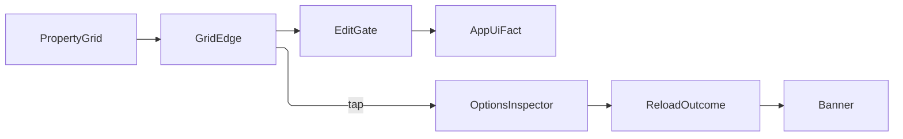

# [APPUI_INSPECTOR_EDITING]

Typed property inspection and value editing for product state: one `InspectorPolicy`-driven PropertyGrid admission capsule whose seven package event edges enter through ONE `GridEdge` admission, fourteen ranked `EditorFactory` rows under descriptor-driven presentation, the `EditFault` family on the kernel fault floor with the preview-versus-commit law and the N-target fan, and the options composite rebuilding an immutable record from its mutable draft. Conflict resolution and code editing are sibling owners (`Editing/conflict.md`, `Editing/codepane.md`).

## [01]-[INDEX]

- [02]-[INSPECTOR_SURFACE]: PropertyGrid admission policy, the one grid-edge admission, chrome hooks, focus facts, the commit veto and settlement pair, the mixed-value and N-target fold.
- [03]-[EDITOR_FACTORIES]: Fourteen ranked editor rows with descriptor-driven presentation and the whole factory contract.
- [04]-[COMMIT_VALIDATION]: Typed admission result on the `Fault` floor and the preview-commit law.
- [05]-[OPTIONS_INSPECTOR]: Options-to-grid binding, user-settings persist, reload banner.

## [02]-[INSPECTOR_SURFACE]

- Owner: `GridEdge` the one foreign-event admission union; `InspectorPolicy` policy record with `CategoryPosture` its category axis and `InspectorChrome` its hook family; `CellState` the four-row cell vocabulary; `MergedCell` the multi-target read; `MergeFacts` the header notice; `PostureSource` the display-posture reader seat; `InspectorSurface` static boundary capsule.
- Cases: `CellState` = settled | edited | invalid | mixed, each carrying the pseudo-class the control theme selects on — `Mixed` produced by the merged read, `Invalid` by the veto arm's refusal, `Edited` by the commit seal, so every row has its producing arm; `CategoryPosture` = Hidden | Collapsed | Expanded — the retired visible/expanded bool pair spelled an expanded-while-hidden corner no grid renders.
- Entry: `Mount(PropertyGrid grid, InspectorPolicy policy, object draft, HookSet<AppUiPoint, AppUiFact, TelemetrySource> hooks, Action<Error> fault, Option<Func<GridEdge, Unit>> tap = default)` — `IDisposable` detacher composed LIFO; `tap` is a second consumer of the SAME admitted edge stream (the options persist arm rides it), so one admission serves every observer and a second subscription re-narrowing the args is unspellable; `GridEdge.Admit(RoutedEventArgs)` the one narrow; `MergedCell.Read(PropertyCellContext)` the one multi-target value read; `InspectorSurface.ApplyAll(PropertyCellContext, object?)` the one N-target commit.
- Law: `RoutedCommandExecutingEventArgs` EXTENDS the executed args, so `Admit` tests the derived shape FIRST — a base-typed probe accepts the veto edge, never reaches `Canceled`, and every refused admission commits anyway.
- Law: the bound instance is a MUTABLE draft, never the immutable record it commits — `PropertyDescriptorBuilder(draft).GetProperties()` synthesizes descriptors over one live instance and every editor write lands `PropertyDescriptor.SetValue(draft, value)` in place, so an `init`-only record carries no write channel and `[05]` rebuilds the record at commit.
- Law: a multi-object selection binds the same builder over an `IEnumerable`, merging only descriptors `AllowMerge` admits into `MultiObjectPropertyDescriptor` rows; the merged `GetValue` returns NULL when descriptors disagree — the same answer a uniformly null value gives — so mixed detection reads `GetValues(targets)` and folds distinctness; `SetValue`/`SetValues` hard-cast the component to `object[]` whose length equals the descriptor count, refused before the call rather than at an index throw inside the package.
- Result: the focus edge fires `AppUiFact.Focus` and the commit pair fires `AppUiFact.Edit`; a merged cell carries the target count in `EditOutcome.Fanned`, distinct from the single cell's `Committed`; when the draft is a multi-target array and the chrome's top slot is unfilled, `Mount` seats `MergeFacts` there so a shorter row list names its dropped remainder.
- Packages: bodong.Avalonia.PropertyGrid, bodong.PropertyModels, System.Reactive, NodaTime, LanguageExt.Core
- Growth: one policy value on `InspectorPolicy`, one hook on `InspectorChrome`, one cell state row WITH its producing arm, one grid edge as one `GridEdge` case the total `Switch` breaks loudly on.
- Boundary: `Mount` is the page's PropertyGrid boundary capsule; every grid event enters as `RoutedEventArgs` and narrows through the ONE `GridEdge.Admit`, so a mismatch mints one `UnmatchedShape` at one site. `CommandExecuting` is the veto edge and `CommandExecuted` the commit seal: `SetPropertyValue` mints one `GenericCancelableCommand` per changed cell and raises executing, executes, then raises executed inside one synchronous frame; the veto arm cancels through `Canceled`, drives `CellState.Invalid` onto the live editor, and seals `Rejected`; the executed arm seals `Committed`/`Fanned`, drives `CellState.Edited`, and a gate refusing there names a command that ran past the veto edge on the fault channel, never a second rejection. `InspectorChrome`'s three hooks exist because a style cannot reach the pixel: the grid pins `Background`/`Margin`/`Padding`/`HeaderTemplate` on its code-built category `Expander` at `BindingPriority.LocalValue`, so the card rides a `ControlTheme` replacing the one unpinned `Template` (header bound through `Header`, own painted surface, presenter named off `PART_ContentPresenter` because the Expander force-writes that part's left margin on every `TemplateApplied`); `CustomNameBlock` is MANDATORY because the shipped row label resolves its foreground once in a static constructor and holds it through every variant change; the operation column takes a whole replacement or the two-stage default-operation edges. The three content slots stay the package's own three `StyledProperty` members — a shell `ChromeSlot` keyed map would map seven shell slots onto three grid properties with four unreachable. Per-row styling rides `[ControlClasses]` unioned onto the materialized editor; `CellState` writes its pseudo-class there, so mixed and invalid presentations are theme rows.

```csharp
// --- [TYPES] ---------------------------------------------------------------------------

[Union(ConversionFromValue = ConversionOperatorsGeneration.None)]
public abstract partial record GridEdge {
    private GridEdge() { }
    public sealed record Admitting(CustomPropertyDescriptorFilterEventArgs Args) : GridEdge;
    public sealed record Focused(PropertyGotFocusEventArgs Args) : GridEdge;
    public sealed record Vetoing(RoutedCommandExecutingEventArgs Args) : GridEdge;
    public sealed record Committed(RoutedCommandExecutedEventArgs Args) : GridEdge;
    public sealed record Relabelling(CustomNameBlockEventArgs Args) : GridEdge;
    public sealed record ColumnMinting(CustomPropertyOperationControlEventArgs Args) : GridEdge;
    public sealed record ColumnStaging(CustomPropertyDefaultOperationEventArgs Args) : GridEdge;

    public static Fin<GridEdge> Admit(RoutedEventArgs args) => args switch {
        CustomPropertyDescriptorFilterEventArgs shape => new Admitting(shape),
        PropertyGotFocusEventArgs shape => new Focused(shape),
        RoutedCommandExecutingEventArgs shape => new Vetoing(shape),
        RoutedCommandExecutedEventArgs shape => new Committed(shape),
        CustomNameBlockEventArgs shape => new Relabelling(shape),
        CustomPropertyOperationControlEventArgs shape => new ColumnMinting(shape),
        CustomPropertyDefaultOperationEventArgs shape => new ColumnStaging(shape),
        _ => Fin.Fail<GridEdge>(new EditFault.UnmatchedShape(args.GetType().Name)),
    };
}

[SmartEnum<string>]
[KeyMemberEqualityComparer<ComparerAccessors.StringOrdinal, string>]
[KeyMemberComparer<ComparerAccessors.StringOrdinal, string>]
public sealed partial class CellState {
    public static readonly CellState Settled = new("settled", pseudo: ":settled");
    public static readonly CellState Edited = new("edited", pseudo: ":edited");
    public static readonly CellState Invalid = new("invalid", pseudo: ":invalid");
    public static readonly CellState Mixed = new("mixed", pseudo: ":mixed");

    public string Pseudo { get; }

    public Unit Apply(Control editor) {
        Items.Iter(row => editor.Classes.Set(row.Pseudo, ReferenceEquals(row, this)));
        return unit;
    }
}

[Union(ConversionFromValue = ConversionOperatorsGeneration.None)]
public abstract partial record CategoryPosture {
    private CategoryPosture() { }
    public sealed record Hidden : CategoryPosture;
    public sealed record Collapsed : CategoryPosture;
    public sealed record Expanded : CategoryPosture;

    public bool Visible => this is not Hidden;
    public bool Opened => this is Expanded;
}

public static class PostureSource {
    public static Seq<(string Key, string LabelKey)> Electable(Seq<MergedCell> cells) =>
        cells.Filter(static cell => cell.Uniform.IsSome || cell.Targets == 1)
            .Map(static cell => (cell.Descriptor.Name, LabelKey: cell.Descriptor.DisplayName));

    public static Fin<Seq<(string ElementId, string Value)>> Read(
        string propertyKey, Seq<(string ElementId, object Target)> scene, ResolvedLocale locale) =>
        scene.Traverse(row => Optional(TypeDescriptor.GetProperties(row.Target)[propertyKey])
                .Map(descriptor => (row.ElementId, Value: Optional(descriptor.GetValue(row.Target))))
                .ToFin(new EditFault.UnmatchedShape($"posture/property:{propertyKey}"))
                .Map(found => (found.ElementId, Text: found.Value.Map(value => Spell(value, locale)))))
            .As()
            .Map(static rows => rows.Choose(static row =>
                row.Text.Map(text => (row.ElementId, Value: text))));

    static string Spell(object value, ResolvedLocale locale) =>
        value is IQuantity quantity
            ? locale.Quantity(quantity, MeasureRole.Extent).IfFail(_ => string.Empty)
            : Convert.ToString(value, locale.Formats) ?? string.Empty;
}

// --- [MODELS] --------------------------------------------------------------------------

public readonly record struct MergedCell(PropertyDescriptor Descriptor, int Targets, Option<object?> Uniform) {
    public CellState State => Targets > 1 && Uniform.IsNone ? CellState.Mixed : CellState.Settled;

    public static Fin<MergedCell> Read(PropertyCellContext context) =>
        (context.Property, context.Target) switch {
            (MultiObjectPropertyDescriptor merged, object[] targets) when targets.Length == merged.Count() =>
                merged.GetValues(targets) switch {
                    var values => Fin.Succ(new MergedCell(merged, targets.Length,
                        values.Distinct().Take(2).Count() is 1 ? Some(values[0]) : Option<object?>.None)),
                },
            (MultiObjectPropertyDescriptor merged, object[] targets) =>
                Fin.Fail<MergedCell>(new EditFault.Invariant(merged.Name,
                    $"{targets.Length} targets against {merged.Count()} merged descriptors")),
            (MultiObjectPropertyDescriptor merged, _) =>
                Fin.Fail<MergedCell>(new EditFault.Invariant(merged.Name, "merged cell target is not an object array")),
            _ => Fin.Succ(new MergedCell(context.Property, 1, Some(context.GetValue()))),
        };
}

public readonly record struct MergeFacts(int Targets, int Shared, int ReadOnly) {
    public static MergeFacts Of(PropertyDescriptorBuilder builder, int targets) =>
        toSeq(builder.GetProperties().Cast<PropertyDescriptor>()) switch {
            var merged => new MergeFacts(targets, merged.Count, merged.Count(static row => row.IsReadOnly)),
        };

    public string Notice => $"{Targets} targets · {Shared} shared · {ReadOnly} read-only";
}

public sealed record InspectorChrome(
    Func<CustomNameBlockEventArgs, Control> Relabel,
    Func<CustomPropertyOperationControlEventArgs, Option<Control>> Operations,
    Action<CustomPropertyDefaultOperationEventArgs> DefaultOperation,
    Option<object> TopHeader,
    Option<object> Middle,
    Option<object> Bottom) {
    public static Func<CustomNameBlockEventArgs, Control> TokenLabel(TextStyleRow label) => args => {
        TextBlock block = new() {
            Text = args.Context.Property.DisplayName,
            VerticalAlignment = VerticalAlignment.Center,
            FontFamily = new FontFamily(label.Family),
            FontSize = label.Size,
            FontWeight = (FontWeight)label.Weight,
            LetterSpacing = label.Tracking * label.Size,
            TextWrapping = label.Wraps ? TextWrapping.Wrap : TextWrapping.NoWrap,
        };
        ignore(ThemeGate.Bind(block, TextBlock.ForegroundProperty, PaintRole.TextMuted.At(0)));
        return block;
    };

    public const string CategoryPresenter = "PART_CategoryBody";

    public static ControlTheme CategoryTheme() => new(typeof(Expander)) {
        Setters = {
            new Setter(TemplatedControl.TemplateProperty, CategoryTemplate()),
        },
    };

    static IControlTemplate CategoryTemplate() => new FuncControlTemplate<Expander>((expander, scope) => {
        ContentPresenter body = new() { Name = CategoryPresenter };
        Border card = new() { Child = new DockPanel { Children = { Header(expander), body } } };
        ignore(ThemeGate.Bind(card, Border.BackgroundProperty, PaintRole.Panel.At(0)));
        ignore(ThemeGate.Bind(card, Border.BorderBrushProperty, PaintRole.Separator.At(0)));
        body.RegisterInNameScope(scope);
        return card;
    });

    static Control Header(Expander expander) {
        ContentControl header = new() { [!ContentControl.ContentProperty] = expander[!HeaderedContentControl.HeaderProperty] };
        DockPanel.SetDock(header, Dock.Top);
        return header;
    }
}

public sealed record InspectorPolicy(
    bool ReadOnly,
    bool QuickFilter,
    CategoryPosture Categories,
    PropertyGridLayoutStyle LayoutStyle,
    CellEditAlignmentType CellEdit,
    PropertyVisibility Operations,
    string Surface,
    InspectorChrome Chrome,
    Action<CustomPropertyDescriptorFilterEventArgs> Admit,
    Func<PropertyDescriptor, string> Target,
    Func<RoutedCommandExecutedEventArgs, Validation<Error, string>> Gate);
```

```csharp
// --- [OPERATIONS] ----------------------------------------------------------------------

public static partial class InspectorSurface {
    public static IDisposable Mount(
        PropertyGrid grid, InspectorPolicy policy, object draft,
        HookSet<AppUiPoint, AppUiFact, TelemetrySource> hooks,
        Action<Error> fault, Option<Func<GridEdge, Unit>> tap = default) {
        grid.DataContext = draft;
        grid.IsReadOnly = policy.ReadOnly;
        grid.LayoutStyle = policy.LayoutStyle;
        grid.CellEditAlignment = policy.CellEdit;
        grid.IsCategoryVisible = policy.Categories.Visible;
        grid.IsQuickFilterVisible = policy.QuickFilter;
        grid.AllCategoriesExpanded = policy.Categories.Opened;
        grid.PropertyOperationVisibility = policy.Operations;
        policy.Chrome.TopHeader.Iter(content => grid.TopHeaderContent = content);
        if (draft is object[] targets && policy.Chrome.TopHeader.IsNone) {
            grid.TopHeaderContent = MergeFacts.Of(new PropertyDescriptorBuilder(targets), targets.Length).Notice;
        }
        policy.Chrome.Middle.Iter(content => grid.MiddleContent = content);
        policy.Chrome.Bottom.Iter(content => grid.BottomContent = content);
        grid.Styles.Add(new Style(static selector => selector.OfType<Expander>()) {
            Setters = { new Setter(StyledElement.ThemeProperty, InspectorChrome.CategoryTheme()) },
        });
        Func<GridEdge, Unit> route = edge => {
            Routed(edge, policy, hooks, fault);
            tap.Iter(observer => observer(edge));
            return unit;
        };
        EventHandler<RoutedEventArgs> handler = (_, args) => ignore(GridEdge.Admit(args).Match(
            Succ: route,
            Fail: error => { fault(error); return unit; }));
        grid.CustomPropertyDescriptorFilter += handler;
        grid.PropertyGotFocus += handler;
        grid.CommandExecuting += handler;
        grid.CommandExecuted += handler;
        grid.CustomNameBlock += handler;
        grid.CustomPropertyOperationControl += handler;
        grid.CustomPropertyOperationMenuOpening += handler;
        return Disposable.Create(() => {
            grid.CustomPropertyDescriptorFilter -= handler;
            grid.PropertyGotFocus -= handler;
            grid.CommandExecuting -= handler;
            grid.CommandExecuted -= handler;
            grid.CustomNameBlock -= handler;
            grid.CustomPropertyOperationControl -= handler;
            grid.CustomPropertyOperationMenuOpening -= handler;
        });
    }

    static Unit Routed(
        GridEdge edge, InspectorPolicy policy,
        HookSet<AppUiPoint, AppUiFact, TelemetrySource> hooks,
        Action<Error> fault) => edge.Switch(
        admitting: shape => { policy.Admit(shape.Args); return unit; },
        focused: shape => {
            ignore(hooks.Fire(
                AppUiPoint.Focus,
                new AppUiFact.Focus(policy.Target(shape.Args.Context.Property), Focused: true),
                Op.Of(name: "appui.inspector.focus")).IfFail(error => fun(() => fault(error))()));
            return unit;
        },
        vetoing: shape => policy.Gate(shape.Args).Match(
            Succ: static _ => unit,
            Fail: refusal => {
                shape.Args.Canceled = true;
                Optional(shape.Args.Context?.CellEdit).Iter(cell => ignore(CellState.Invalid.Apply(cell)));
                ignore(Fire(policy, shape.Args, string.Empty, new EditOutcome.Rejected(refusal), hooks)
                    .IfFail(error => fun(() => fault(error))()));
                return unit;
            }),
        committed: shape => policy.Gate(shape.Args).Match(
            Succ: editor => {
                Optional(shape.Args.Context?.CellEdit).Iter(cell => ignore(CellState.Edited.Apply(cell)));
                ignore(Fire(policy, shape.Args, editor, Outcome(shape.Args, editor), hooks)
                    .IfFail(error => fun(() => fault(error))()));
                return unit;
            },
            Fail: refusal => {
                fault(new EditFault.Invariant(policy.Target(shape.Args.Property), $"committed past the veto edge: {refusal.Message}"));
                return unit;
            }),
        relabelling: shape => { shape.Args.CustomNameBlock = policy.Chrome.Relabel(shape.Args); return unit; },
        columnMinting: shape => {
            policy.Chrome.Operations(shape.Args).Iter(control => shape.Args.CustomControl = control);
            return unit;
        },
        columnStaging: shape => { policy.Chrome.DefaultOperation(shape.Args); return unit; });

    private static Fin<Unit> Fire(
        InspectorPolicy policy, RoutedCommandExecutedEventArgs args, string editor, EditOutcome outcome,
        HookSet<AppUiPoint, AppUiFact, TelemetrySource> hooks) =>
        hooks.Fire(
            AppUiPoint.Edit,
            new AppUiFact.Edit(AppUiPoint.Edit.Key, policy.Surface, policy.Target(args.Property), editor, outcome.GetType().Name),
            Op.Of(name: "appui.inspector.edit"));

    private static EditOutcome Outcome(RoutedCommandExecutedEventArgs args, string editor) =>
        (args.Property, args.Target) switch {
            (MultiObjectPropertyDescriptor merged, object[] targets) when targets.Length > 1 =>
                new EditOutcome.Fanned(editor, targets.Length),
            _ => new EditOutcome.Committed(editor),
        };

    public static Fin<Unit> ApplyAll(PropertyCellContext context, object? value) =>
        context.Factory is ICellEditFactory factory
            ? Op.Of(name: "appui.inspector.apply").Catch(() => { factory.SetPropertyValue(context, value); return Fin.Succ(unit); })
            : Fin.Fail<Unit>(new EditFault.Invariant(context.Property.Name, "cell carries no materialized factory"));

    public static readonly InstrumentSpec Committed = InstrumentSpec.Create(
        "rasm.appui.edit.committed", InstrumentKind.Count, MeasureForm.Whole, "{edit}",
        "edits committed by surface", Seq(AppUiTelemetry.SurfaceSlot), None, None, None);
    public static readonly InstrumentSpec Rejected = InstrumentSpec.Create(
        "rasm.appui.edit.rejected", InstrumentKind.Count, MeasureForm.Whole, "{edit}",
        "edits rejected by surface", Seq(AppUiTelemetry.SurfaceSlot), None, None, None);

    public static TelemetryContributorPort TelemetryRow(string version) =>
        AppUiTelemetry.Contribute(version, Committed, Rejected);
}
```

## [03]-[EDITOR_FACTORIES]

- Owner: `EditorFactory` `[SmartEnum<string>]` fourteen rows with `Presenter` the row's presenting side; `Presentation` the descriptor-attribute fold with `TrackSpec` its drag axis; `PropertyFilter` the visibility argument; `EditorAdapter` the composition port; `TokenPalette` the swatch source the color row's presenter constructs; `EditorRowFactory` — the ONE public `AbstractCellEditFactory` adapter every custom row rides.
- Cases: quantity, value-object, optional, temporal, identifier, color, flags, choice, path, collection, boolean, numeric, text, nested — each row carries explicit match precedence, the match walk takes the first accepting row, and nested is the reference-record fallback.
- Entry: `Match(PropertyDescriptor descriptor, EditorAdapter adapter)` the ranked `Option<EditorFactory>` walk; `Presentation.Read(PropertyDescriptor)` the declaration fold; `EditorRowFactory.Register(EditorAdapter adapter)` installs the one public custom factory and returns its removal scope; `TokenPalette.Product(ResolvedTheme)` the product swatch source the color presenter binds and the theme swap's `Rematerialize.SwatchSource` roster rebuilds.
- Auto: `Accepts(PropertyDescriptor, EditorAdapter)` is the ONE row delegate column carrying the whole predicate, so the adapter-dependent rows are rows like the declaration-only ones; numeric admission is the `INumberBase<>` interface's own roster — every CLR numeric including `Half`, `Int128`, `UInt128`, and `decimal` implements it, `char` and `bool` do not — so a fourteen-literal type mirror deletes and the family WIDENS to any conforming numeric.
- Packages: bodong.Avalonia.PropertyGrid, bodong.PropertyModels, Avalonia.Controls.ColorPicker, UnitsNet, NodaTime, Thinktecture.Runtime.Extensions, LanguageExt.Core, BCL inbox
- Growth: one editor row on `EditorFactory`; one presentation axis is one `Presentation` column; per-shape editor controls and per-`[ValueObject]` editor classes are deleted by the value-object and quantity rows.
- Law: the numeric editor binds the TYPED spinner of the bound CLR type over that type's own range (folder `RULINGS` `[02]`) — `TrackSpec` carries the DECLARED drag range in the package attribute's own `double` domain, a package fact the presenter applies only where the bound type expresses it.
- Boundary: the shipped factories under `Builtins` are public and subclassable, so a narrowed editor derives the nearest built-in and raises `ImportPriority`; the product's own rows ride one `EditorRowFactory` registered through `CellEditFactoryService.Default.AddFactory`. `Accept(object accessToken)` gates CLONING, never cell building — the base grid-token predicate is correct and shape selection lives in `HandleNewProperty`; `Clone` MUST be overridden (the base mints through `Activator.CreateInstance`, which throws for a constructor taking the adapter); `HandleReadOnlyStateChanged` wherever a composite editor needs its write leg disabled rather than its whole body greyed; `HandlePropagateVisibility` because the base defers to a default match that cannot see a mixed cell. `PropertyCellContext` carries the descriptor channel, the value channel (`GetValue()` reads `Property.GetValue(Target)`), and the write instance; `SetPropertyValue` is the ONE write channel — it mints the recorder's cancelable command and raises the gate pair, so a control writing `Property.SetValue` directly bypasses admission and undo at once, which is why `Present` receives the channel BOUND. Presentation is DECLARATION-DRIVEN: the row selects the FAMILY and the presentation the FORM, so a knob never becomes a fifteenth row; enum filtering folds the one `IEnumValueAuthorizeAttribute` contract all four permit/prohibit attributes implement; the flags row binds `CheckedMaskModel(masks, all)` through `CheckedListEdit`, deleting a hand-rolled flags editor and per-flag boolean rows; optional admission covers `Option<T>` and `Nullable<T>`, temporal the NodaTime and BCL families, identifier `Guid` and `Uri`; the color row binds `PreviewableColorPicker` against `TokenPalette`, whose swatches carry the product's own roles — resolved values, so the instance rides the swap's rebuild roster rather than re-resolving. Every materialized editor wears its `CellState` pseudo-class.

```csharp
// --- [MODELS] --------------------------------------------------------------------------

public readonly record struct TrackSpec(double Min, double Max, bool Spinner);

public readonly record struct Presentation(
    Option<TrackSpec> Track,
    Option<double> Increment,
    Option<string> Format,
    Option<(double Min, double Max, bool Text)> Progress,
    Option<string> Watermark,
    bool Multiline,
    Option<string> Unit,
    Option<PathBrowsableAttribute> Browse,
    Option<ImagePreviewModeAttribute> Preview,
    Seq<string> Classes,
    Func<Type, string, object, bool> AdmitsMember) {
    public static Presentation Read(PropertyDescriptor descriptor) {
        Seq<Attribute> declared = toSeq(descriptor.Attributes.Cast<Attribute>());
        Option<TrackableAttribute> track = One<TrackableAttribute>(declared);
        Option<ProgressAttribute> progress = One<ProgressAttribute>(declared);
        Option<FloatPrecisionAttribute> precision = One<FloatPrecisionAttribute>(declared);
        Option<IntegerIncrementAttribute> step = One<IntegerIncrementAttribute>(declared);
        Seq<IEnumValueAuthorizeAttribute> filters = toSeq(declared.OfType<IEnumValueAuthorizeAttribute>());
        return new Presentation(
            Track: track.Map(static row => new TrackSpec(row.Minimum, row.Maximum, row.AllowSpin || row.ShowButtonSpinner)),
            Increment: track.Map(static row => row.Increment)
                | precision.Map(static row => (double)row.Increment)
                | step.Map(static row => (double)row.Increment),
            Format: track.Map(static row => row.FormatString)
                | precision.Map(static row => row.FormatString)
                | progress.Map(static row => row.FormatString),
            Progress: progress.Map(static row => (row.Minimum, row.Maximum, row.ShowProgressText)),
            Watermark: One<WatermarkAttribute>(declared).Map(static row => row.Watermark),
            Multiline: One<MultilineTextAttribute>(declared).Exists(static row => row.IsMultiline),
            Unit: One<UnitAttribute>(declared).Map(static row => row.Unit),
            Browse: One<PathBrowsableAttribute>(declared),
            Preview: One<ImagePreviewModeAttribute>(declared),
            Classes: toSeq(declared.OfType<ControlClassesAttribute>()).Bind(static row => toSeq(row.Classes)).Distinct(),
            AdmitsMember: (owner, member, value) => filters.ForAll(filter => filter.AllowValue(owner, member, value)));
    }

    static Option<TAttribute> One<TAttribute>(Seq<Attribute> declared) where TAttribute : Attribute =>
        toSeq(declared.OfType<TAttribute>()).Head;
}

public readonly record struct PropertyFilter(IPropertyGridFilterContext Context, string Text, bool ParentMatched);

[SmartEnum<string>]
public sealed partial class GeneratedShape {
    public static readonly GeneratedShape Value = new("value-object");
    public static readonly GeneratedShape Roster = new("smart-enum");
}

public sealed record EditorAdapter(
    Func<Type, Option<GeneratedShape>> Shape,
    Func<EditorFactory, PropertyCellContext, Presentation, Action<object?>, Option<Control>> Present,
    Func<EditorFactory, PropertyCellContext, Presentation, bool> Refresh,
    Func<Control, bool, bool> ReadOnly,
    Func<EditorFactory, PropertyCellContext, PropertyFilter, Option<PropertyVisibility>> Visible);

public sealed class TokenPalette(ResolvedTheme resolved, Seq<PaintRole> roles, int rungs) : IColorPalette {
    public static TokenPalette Product(ResolvedTheme resolved) =>
        new(resolved,
            Seq(PaintRole.Accent, PaintRole.Info, PaintRole.Success, PaintRole.Warning, PaintRole.Error, PaintRole.Text, PaintRole.Panel),
            rungs: 4);

    public int ColorCount => roles.Count;

    public int ShadeCount => rungs;

    public Color GetColor(int colorIndex, int shadeIndex) =>
        roles.Skip(colorIndex).Head
            .Bind(role => resolved.Paint(role, shadeIndex))
            .IfNone(() => resolved.Accent);
}
```

```csharp
// --- [TYPES] ---------------------------------------------------------------------------

[SmartEnum<string>]
public sealed partial class Presenter {
    public static readonly Presenter Product = new("product");
    public static readonly Presenter Package = new("package");
}

[SmartEnum<string>]
[KeyMemberEqualityComparer<ComparerAccessors.StringOrdinalIgnoreCase, string>]
[KeyMemberComparer<ComparerAccessors.StringOrdinalIgnoreCase, string>]
public sealed partial class EditorFactory {
    public static readonly EditorFactory Quantity = new("quantity", rank: 10, accepts: AcceptQuantity, Presenter.Product);
    public static readonly EditorFactory Value = new("value-object", rank: 20, accepts: AcceptValueObject, Presenter.Product);
    public static readonly EditorFactory Optional = new("optional", rank: 30, accepts: AcceptOptional, Presenter.Product);
    public static readonly EditorFactory Temporal = new("temporal", rank: 40, accepts: AcceptTemporal, Presenter.Product);
    public static readonly EditorFactory Identifier = new("identifier", rank: 50, accepts: AcceptIdentifier, Presenter.Product);
    public static readonly EditorFactory Color = new("color", rank: 60, accepts: AcceptColor, Presenter.Product);
    public static readonly EditorFactory Flags = new("flags", rank: 65, accepts: AcceptFlags, Presenter.Product);
    public static readonly EditorFactory Choice = new("choice", rank: 70, accepts: AcceptChoice, Presenter.Product);
    public static readonly EditorFactory Path = new("path", rank: 80, accepts: AcceptPath, Presenter.Package);
    public static readonly EditorFactory Collection = new("collection", rank: 90, accepts: AcceptCollection, Presenter.Package);
    public static readonly EditorFactory Boolean = new("boolean", rank: 100, accepts: AcceptBoolean, Presenter.Package);
    public static readonly EditorFactory Numeric = new("numeric", rank: 110, accepts: AcceptNumeric, Presenter.Package);
    public static readonly EditorFactory Text = new("text", rank: 120, accepts: AcceptText, Presenter.Package);
    public static readonly EditorFactory Nested = new("nested", rank: 130, accepts: AcceptNested, Presenter.Package);

    public int Rank { get; }
    public Presenter Presenter { get; }

    [UseDelegateFromConstructor]
    public partial bool Accepts(PropertyDescriptor descriptor, EditorAdapter adapter);

    public static Option<EditorFactory> Match(PropertyDescriptor descriptor, EditorAdapter adapter) =>
        toSeq(Items.OrderBy(static row => row.Rank)).Find(row => row.Accepts(descriptor, adapter));

    private static readonly FrozenSet<Type> TemporalShapes = new[] {
        typeof(Instant), typeof(LocalDate), typeof(LocalDateTime), typeof(LocalTime), typeof(OffsetDateTime),
        typeof(ZonedDateTime), typeof(Duration), typeof(Period), typeof(DateInterval), typeof(DateOnly), typeof(TimeOnly), typeof(DateTimeOffset),
    }.ToFrozenSet();

    private static readonly FrozenSet<Type> IdentifierShapes = new[] { typeof(Guid), typeof(Uri) }.ToFrozenSet();

    private static bool AcceptValueObject(PropertyDescriptor row, EditorAdapter adapter) =>
        adapter.Shape(row.PropertyType).Exists(static shape => shape == GeneratedShape.Value);
    private static bool AcceptChoice(PropertyDescriptor row, EditorAdapter adapter) =>
        row.PropertyType.IsEnum || adapter.Shape(row.PropertyType).Exists(static shape => shape == GeneratedShape.Roster);
    private static bool AcceptQuantity(PropertyDescriptor row, EditorAdapter _) => typeof(IQuantity).IsAssignableFrom(row.PropertyType);
    private static bool AcceptOptional(PropertyDescriptor row, EditorAdapter _) => row.PropertyType is { IsGenericType: true }
        && (row.PropertyType.GetGenericTypeDefinition() == typeof(Option<>) || row.PropertyType.GetGenericTypeDefinition() == typeof(Nullable<>));
    private static bool AcceptTemporal(PropertyDescriptor row, EditorAdapter _) => TemporalShapes.Contains(row.PropertyType);
    private static bool AcceptIdentifier(PropertyDescriptor row, EditorAdapter _) => IdentifierShapes.Contains(row.PropertyType);
    private static bool AcceptColor(PropertyDescriptor row, EditorAdapter _) => row.PropertyType == typeof(Avalonia.Media.Color);
    private static bool AcceptFlags(PropertyDescriptor row, EditorAdapter _) =>
        row.PropertyType.IsEnum && row.PropertyType.IsDefined(typeof(FlagsAttribute), inherit: false);
    private static bool AcceptPath(PropertyDescriptor row, EditorAdapter _) =>
        typeof(FileSystemInfo).IsAssignableFrom(row.PropertyType) || Presentation.Read(row).Browse.IsSome;
    private static bool AcceptCollection(PropertyDescriptor row, EditorAdapter _) =>
        row.PropertyType != typeof(string) && typeof(IEnumerable).IsAssignableFrom(row.PropertyType);
    private static bool AcceptBoolean(PropertyDescriptor row, EditorAdapter _) => row.PropertyType == typeof(bool);
    private static bool AcceptNumeric(PropertyDescriptor row, EditorAdapter _) =>
        row.PropertyType.GetInterfaces().Any(static face =>
            face.IsGenericType && face.GetGenericTypeDefinition() == typeof(System.Numerics.INumberBase<>));
    private static bool AcceptText(PropertyDescriptor row, EditorAdapter _) => row.PropertyType == typeof(string);
    private static bool AcceptNested(PropertyDescriptor row, EditorAdapter _) => row.PropertyType is { IsClass: true, IsAbstract: false };
}

public sealed class EditorRowFactory(EditorAdapter adapter) : AbstractCellEditFactory {
    public override int ImportPriority => 200;

    public static IDisposable Register(EditorAdapter adapter) {
        EditorRowFactory factory = new(adapter);
        CellEditFactoryService.Default.AddFactory(factory);
        return Disposable.Create(() => CellEditFactoryService.Default.RemoveFactory(factory));
    }

    public override ICellEditFactory Clone() => new EditorRowFactory(adapter);

    public override Control? HandleNewProperty(PropertyCellContext context) =>
        EditorFactory.Match(context.Property, adapter)
            .Filter(static row => row.Presenter == Presenter.Product)
            .Bind(row => adapter.Present(row, context, Presentation.Read(context.Property), value => SetPropertyValue(context, value)))
            .Map(control => Stated(context, control))
            .ValueUnsafe();

    public override bool HandlePropertyChanged(PropertyCellContext context) =>
        EditorFactory.Match(context.Property, adapter)
            .Filter(static row => row.Presenter == Presenter.Product)
            .Exists(row => adapter.Refresh(row, context, Presentation.Read(context.Property))
                && Optional(context.CellEdit).Map(control => Stated(context, control)).IsSome);

    public override void HandleReadOnlyStateChanged(Control control, bool readOnly) {
        if (!adapter.ReadOnly(control, readOnly)) { base.HandleReadOnlyStateChanged(control, readOnly); }
    }

    public override PropertyVisibility? HandlePropagateVisibility(
        object? target, PropertyCellContext context, IPropertyGridFilterContext filterContext,
        string? filterText = null, bool filterMatchesParentCategory = false) =>
        EditorFactory.Match(context.Property, adapter)
            .Filter(static row => row.Presenter == Presenter.Product)
            .Bind(row => adapter.Visible(row, context, new PropertyFilter(filterContext, filterText ?? string.Empty, filterMatchesParentCategory)))
            .ValueUnsafe();

    private static Control Stated(PropertyCellContext context, Control control) {
        ignore(MergedCell.Read(context).Map(cell => cell.State.Apply(control)));
        return control;
    }
}
```

## [04]-[COMMIT_VALIDATION]

- Owner: `EditFault` the direct generated `[Union]` with one `[FaultCase]` leaf per inspector failure; `EditOutcome` `[Union]`; `EditGate` static admission surface.
- Cases: `EditFault` = Parse | Invariant | UnmatchedShape | StoreRejected | HostRejected | ResolutionAbsent; `EditOutcome` = Observed | Committed | Fanned | Persisted | Reverted | Redone | Rejected | HostRouted.
- Entry: `EditGate.Gate(descriptor, adapter, admit)` — the applicative `Validation<Error, _>` combine reports independent row and value refusals together; `Admit<TOwner, TRaw, TError>(target, raw)` the generated-factory bridge; `AdmitQuantity(target, shape, text, culture)` the culture-bearing quantity parse; `Resolve(descriptor, adapter)` the row election.
- Result: committed edits fire `AppUiFact.Edit` through the canonical AppUi hook dispatch after the gate settles.
- Packages: Thinktecture.Runtime.Extensions, UnitsNet, NodaTime, LanguageExt.Core
- Growth: one case is one `[FaultCase]` leaf; zero new surface.
- Boundary: preview interactions (`PreviewColorChanged`, `PreviewValueChanged`, transient editor state) mutate nothing durable and emit nothing — `ColorChanged` and `RealValueChanged` are the two pickers' commit edges; `InspectorPolicy.Gate` is the composition-bound closure invoking `EditGate` at the veto edge, because a generic self-constrained factory contract cannot bind at an `EventHandler<RoutedEventArgs>` boundary and the owner type is known only where the section composes. `Admit` is the page's spelling of the kernel lifter law (`Rasm/Domain/validation.md` `[04]-[FACTORY_BRIDGE]`): the kernel's typed receivers span its own raw shapes under `ValidationError`, and the error-typed, descriptor-erased grid interface — `TOwner` closing only at composition, `TRaw` `allows ref struct` — is the caller-spelled-`Validate` case that law reserves, so the bridge composes `IObjectFactory.Validate` once here and per-call-site error translation stays deleted; the kernel fixes `Validate` under invariant culture, so the CULTURE-SENSITIVE parse lives at the editor's presentation and only `AdmitQuantity` carries an explicit culture (`Quantity.TryParse`; unit lists present through `Quantity.Infos`). `ValidateProperty` text renders through the screen validation path's own `FieldErrors` slot stream (`Shell/screens#VALIDATION_UX`) — a second validation path is deleted; a refused admission drives `CellState.Invalid` onto the live editor; host-mutating edits route through the abstract document-transaction port, undo-scoped, `HostRouted` carrying that hop's correlation.

```csharp
// --- [ERRORS] --------------------------------------------------------------------------

[Union(ConversionFromValue = ConversionOperatorsGeneration.None)]
public abstract partial record EditFault : Fault {
    private static readonly FaultBand FamilyBand = FaultBand.Edit;
    private EditFault() { }

    [FaultCase(0)]
    public sealed partial record Parse(string Target, string Detail) : EditFault() {
        public override string Message => $"{Target}: {Detail}";
    }
    [FaultCase(1)]
    public sealed partial record Invariant(string Target, string Detail) : EditFault() {
        public override string Message => $"{Target}: {Detail}";
    }
    [FaultCase(2)]
    public sealed partial record UnmatchedShape(string Shape) : EditFault() {
        public override string Message => $"{Shape}: no editor row";
    }
    [FaultCase(3)]
    public sealed partial record StoreRejected(string Target, string Detail) : EditFault() {
        public override string Message => $"{Target}: {Detail}";
    }
    [FaultCase(4)]
    public sealed partial record HostRejected(string Target, string Detail) : EditFault() {
        public override string Message => $"{Target}: {Detail}";
    }

    [FaultCase(5)]
    public sealed partial record ResolutionAbsent(Seq<int> Hunks) : EditFault() {
        public override string Message => $"unresolved conflict hunks: {string.Join(",", Hunks)}";
    }
}

// --- [TYPES] ---------------------------------------------------------------------------

[Union(ConversionFromValue = ConversionOperatorsGeneration.None)]
public abstract partial record EditOutcome {
    private EditOutcome() { }

    public sealed record Observed : EditOutcome;
    public sealed record Committed(string Editor) : EditOutcome;
    public sealed record Fanned(string Editor, int Targets) : EditOutcome;
    public sealed record Persisted(string Section) : EditOutcome;
    public sealed record Reverted(string Editor) : EditOutcome;
    public sealed record Redone(string Editor) : EditOutcome;
    public sealed record Rejected(Error Fault) : EditOutcome;
    public sealed record HostRouted(CorrelationId Transaction) : EditOutcome;
}

// --- [OPERATIONS] ----------------------------------------------------------------------

public static class EditGate {
    public static Validation<Error, TOwner> Admit<TOwner, TRaw>(string target, TRaw raw)
        where TOwner : IObjectFactory<TOwner, TRaw, ValidationError>
        where TRaw : notnull, allows ref struct {
        ValidationError? fault = TOwner.Validate(raw, provider: null, out TOwner? owner);
        return fault is not null
            ? (Validation<Error, TOwner>)new KernelFault.InvalidValue(target, fault.Message)
            : owner is TOwner admitted
                ? (Validation<Error, TOwner>)admitted
                : new KernelFault.InvalidResult(target);
    }

    public static Validation<Error, IQuantity> AdmitQuantity(string target, Type shape, string text, IFormatProvider culture) {
        bool valid = Quantity.TryParse(culture, shape, text, out IQuantity? parsed);
        return valid && parsed is IQuantity quantity
            ? (Validation<Error, IQuantity>)quantity
            : new EditFault.Parse(target, text);
    }

    public static Validation<Error, EditorFactory> Resolve(PropertyDescriptor descriptor, EditorAdapter adapter) =>
        EditorFactory.Match(descriptor, adapter) is { IsSome: true, Case: EditorFactory row }
            ? (Validation<Error, EditorFactory>)row
            : new EditFault.UnmatchedShape(descriptor.PropertyType.Name);

    public static Validation<Error, (EditorFactory Row, TOwner Owner)> Gate<TOwner>(
        PropertyDescriptor descriptor, EditorAdapter adapter, Validation<Error, TOwner> admit) =>
        (Resolve(descriptor, adapter), admit).Apply(static (row, owner) => (row, owner));
}
```

## [05]-[OPTIONS_INSPECTOR]

- Owner: `OptionsInspector<TDraft, TValue>` binding record; `InspectorSurface` extension `Attach`/`Banner`.
- Cases: banner keys per `ReloadOutcome` case — options-applied, options-unchanged, options-restart-required, options-rejected; restart-required is the frozen-row path rendered as a typed outcome, never a toast.
- Entry: `Attach<TDraft, TValue>(grid, binding, policy, hooks, banner, fault)` — `IDisposable` composing the mount, the persist tap, and the outcome subscription; the persist arm rides `Mount`'s admitted edge stream as its `tap`, so ONE admission serves both consumers and a second event subscription is unspellable.
- Auto: the generated `ReloadOutcome` `Switch` is the whole banner fold.
- Result: each durable write fires `AppUiFact.Edit` with `Persisted` or `Rejected`; the options monitor supplies `ReloadOutcome` directly.
- Packages: bodong.Avalonia.PropertyGrid, bodong.PropertyModels, System.Reactive, NodaTime, LanguageExt.Core
- Growth: one options section row binds with one `OptionsInspector` record; zero new surface — a settings-dialog framework is deleted by this composite.
- Boundary: the draft-versus-record split is structural — `TDraft` is the mutable notifying partial the grid mutates in place, `Commit` rebuilds the immutable `TValue`, and `Persist` writes that rebuilt record, so persisting the draft reference hands the store an instance the next keystroke rewrites (folder `RULINGS` `[02]`). Options monitoring re-validates and publishes `ReloadOutcome`; subscription failure enters the same `EditFault` family; cross-process propagation remains the op-log cursor consequence, and the grid never touches configuration directly.

```csharp
public sealed record OptionsInspector<TDraft, TValue>(
    string Section,
    ReloadClass Reload,
    TDraft Draft,
    Func<TDraft, TValue> Commit,
    Func<TValue, Fin<Unit>> Persist,
    IObservable<ReloadOutcome> Outcomes)
    where TDraft : PropertyModels.ComponentModel.MiniReactiveObject
    where TValue : class;

public static partial class InspectorSurface {
    public const string AppliedBanner = "options-applied";
    public const string UnchangedBanner = "options-unchanged";
    public const string RestartBanner = "options-restart-required";
    public const string RejectedBanner = "options-rejected";

    public static string Banner(ReloadOutcome outcome) => outcome.Switch(
        applied: static row => AppliedBanner,
        unchanged: static row => UnchangedBanner,
        restartRequired: static row => RestartBanner,
        rejected: static row => RejectedBanner);

    public static IDisposable Attach<TDraft, TValue>(
        PropertyGrid grid, OptionsInspector<TDraft, TValue> binding, InspectorPolicy policy,
        HookSet<AppUiPoint, AppUiFact, TelemetrySource> hooks,
        Action<string> banner, Action<Error> fault)
        where TDraft : PropertyModels.ComponentModel.MiniReactiveObject where TValue : class {
        Func<GridEdge, Unit> persist = edge => {
            if (edge is GridEdge.Committed) {
                binding.Persist(binding.Commit(binding.Draft)).Match(
                    Succ: _ => ignore(hooks.Fire(
                        AppUiPoint.Edit,
                        new AppUiFact.Edit("options", policy.Surface, binding.Section, binding.Reload.Key, nameof(EditOutcome.Persisted)),
                        Op.Of(name: "appui.inspector.options")).IfFail(error => fun(() => fault(error))())),
                    Fail: error => ignore(hooks.Fire(
                        AppUiPoint.Edit,
                        new AppUiFact.Edit("options", policy.Surface, binding.Section, binding.Reload.Key, nameof(EditOutcome.Rejected)),
                        Op.Of(name: "appui.inspector.options")).IfFail(cause => fun(() => fault(cause))())));
            }
            return unit;
        };
        IDisposable mount = Mount(grid, policy, binding.Draft, hooks, fault, Some(persist));
        IDisposable reload = binding.Outcomes.Subscribe(
            outcome => banner(Banner(outcome)),
            raw => fault(Error.New(raw.Message, raw)));
        return new CompositeDisposable(mount, reload);
    }
}
```


