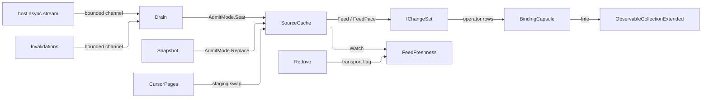
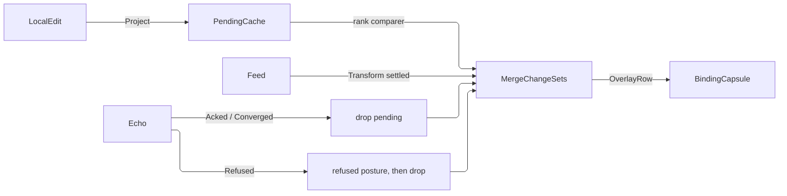

# [APPUI_LIVE_DATA]

Rasm.AppUi live data owns every change-set pipeline between data sources and screens: the six-case `DataSource` axis with its ingress channel, redrive policy, and pacing row; the one predicate instantiation and view-state pair every list, board, table, and search surface reads; the operator-row vocabulary; the optimistic overlay that renders a pending mutation before its echo; the one UI-thread `BindingCapsule`; the aggregation edge feeding scalar tiles and evidence; and the design-option row family whose keys join the comparison vocabularies. The engine is DynamicData over System.Reactive — every source folds into one keyed `SourceCache`, key selectors transcribe the Persistence IdentityPolicy vocabulary, the Ui scheduler arrives from the surface scheduler boundary fed by `UiSchedulerPort`, and measured changes fire through the AppUi hook dispatch. The live-data spine — host fact to projection write to tag transition to delta fetch to `IChangeSet` — is the page's composite automation, and screens consume pipelines as expression folds beside their catalog rows.

The predicate algebra is NOT this page's: `Rasm.Element` `Query/predicate#PREDICATE_ALGEBRA` owns the closure, the typed restriction, the verdict, and the byte projection, and this page instantiates `Predicate<FilterTerm>` over its own leaf row exactly as Bim and Persistence instantiate theirs — so a filter authored on a board, lowered to a store, and keyed into a memo is one value family across three folders instead of four parallel algebras. What survives here is what no boundary owns: the per-row-model property roster and its compiler, the operand PARSE correspondence a URL fragment needs, the ordering fold a sort column needs, the sense vocabulary a picker renders, and the deep-link codec. `ViewState` holds group, order, visibility, and saved identity APART from that filter so a filter edit never dirties the view axis. `FeedFreshness` carries `FeedHealth` outward to the `Charts/tiles#WATCH_RULES` watch rows, whose severity ladder owns that posture vocabulary. `StatFold`, `StatSample`, and `DeltaPolarity` arrive settled from `Charts/tiles#SOURCE_AXIS` and `CompareOffset` from `Charts/grammar#LAYER_AND_SPEC`; `ControlIntent.Chip` with `ChipPosture` is the `Shell/controls#CONTROL_INTENT` chip materialization this page feeds and never constructs; `ScreenState.Filter` is the persisted encoded expression, so the deep link and the checkpoint are one codec. `AppUiFact.LiveData` is the change-audit fact, `LiveDataFault` carries failures through its direct generated union cases, and merge outcomes stay with their owning collaboration plane.

## [01]-[INDEX]

- [02]-[DATA_SOURCES]: Six sourcing cases; the bounded ingress channel and its redrive; one cache feed dispatch; the pacing policy and the freshness ladder.
- [03]-[FILTER_ALGEBRA]: The boundary predicate instantiation, its property roster and compiler, the ordering fold, and the fingerprinted deep-link codec.
- [04]-[VIEW_STATE]: Group, order, visibility, and saved-view identity held apart from filter state, over the one durable snapshot port.
- [05]-[CHANGE_PIPELINES]: Operator rows; the one shaping fold over dynamic predicate and comparer streams.
- [06]-[OVERLAY_SPINE]: The optimistic overlay merge, its acknowledgment ledger, and visible rollback.
- [07]-[BINDING_CAPSULE]: One UI-thread binding edge; single `ObserveOn`; one direct generated fault union.
- [08]-[AGGREGATION_SPINE]: Scalar binds, change-audit evidence, the instrument rows, suspend-resume law.
- [09]-[OPTION_SETS]: Named design options, per-option KPI columns, and the comparison-key join.

## [02]-[DATA_SOURCES]

- Owner: `HostDocumentFact`, `AdmitMode`, `FeedPace`, `SourcePolicy`, `DataSource<TRow, TKey>` — the closed sourcing axis; one generated dispatch feeds one keyed cache per projection, and every `SourcePolicy` axis lands on a composed operator inside `Open` — an inert policy field is the `POLICY_VALUES` rejected form. `FreshnessFacts`, `FreshnessBounds`, and `SourceFolds` own the staleness projection.
- Cases: HostDocumentEvents, PersistenceQuery, CursorQuery, InMemorySeq, FakeDeterministic, OrderedList — the cursor row is the paged remote source: a large persisted set loads page-by-page through its opaque continuation cursor until `None`, so an unbounded snapshot fetch never rides the query row. `AdmitMode` = Merge | Replace. `FeedPace` = Coalesced | Gated.
- Entry: `public Fin<DataSource<TRow,TKey>.Opened> Open(Func<TRow,TKey> key, SourcePolicy policy, Action<Error> fault)` — policy admission ACCUMULATES every out-of-range bound, then every optional axis declares the cases that consume it so an axis a case cannot read is inadmissible rather than silently inert; the carrier exposes the one keyed replay cache, the ordered source when order is a domain fact, the transport-health flag the redrive publishes, and the activation-scope disposable. `public IObservable<IChangeSet<TRow,TKey>> Feed()` on `Opened` — the ONE consumer connect, paced by the policy row. `public IObservable<FeedFreshness> Watch(SlotKey streamKey, FreshnessBounds bounds, IScheduler scheduler)` on `Opened` — the staleness projection over the ledger's own transport flag.
- Auto: the live-data spine — a host watch fact drives the Persistence projection write, the tag transition fires `Invalidations`, `Delta` fetches the changed rows, and the cache emits `IChangeSet`; one named pipeline, zero bespoke glue; the emitted `IChangeSet` is the single delta spine — one `Feed` chain fans into chart `SeriesSource`, table projection, and aggregation tiles through `Transform`/`MergeMany` with zero materialized intermediate, so a new consumer subscribes to the existing delta and the source never forks into a second collection-mutation path.
- Packages: DynamicData, System.Reactive, System.Threading.Channels, LanguageExt.Core, Thinktecture.Runtime.Extensions, NodaTime, Rasm (kernel `RedrivePolicy`, `Custody`)
- Growth: a new feed is one case on the closed family; a new bound is one policy value on `SourcePolicy` with its `AxisRow`; a new pacing posture is one `FeedPace` arm; a new health rung is one `Ladder` row; zero new surface.
- Boundary: `Open` and `Admit` form the Rx-to-result boundary capsule. Hosts enter only as async-stream and message-envelope delegates, key selectors transcribe Persistence identity policy, and late subscribers replay from cache state. `SourcePolicy` consumes scheduling, ingress, expiry, size, query-refresh, page-ceiling, redrive, and pacing axes.
- Boundary: INGRESS is a producer/consumer boundary and it is the ONE place a bounded `Channel<T>` lives on this page — a foreign producer pushes at its own rate and the drain loop is the only writer into `cache.Edit`. Rx is the DECLARED spine everywhere downstream of that cache: `Batch`, `Filter`, `Sort`, `MergeChangeSets`, and `Bind` are incremental change-set operators over `IObservable<IChangeSet<,>>`, and a queue between two of them would break the delta contract those operators derive from, so pacing is a change-set fold and never a channel bound. The prior shape paced only the CONSUMER connect, which left nothing at all between a fast host callback and the cache.
- Boundary: RETRIABILITY is produced here, never merely consumed — `SourcePolicy.Redrive` is the kernel `RedrivePolicy` over a LanguageExt `Schedule`, the drain loop re-enters its stream on that curve, and the attempt state publishes the transport flag `Watch` reads, so the retry law and the reconnection signal have one owner; the prior form took a `reconnecting` flag as a parameter no owner produced and let a refresh lane die permanently on its first `onError`.
- Boundary: `OrderedList` keeps its `SourceList` as the authoritative ordered projection while folding each list reason incrementally into the keyed delta spine; `Opened.Ordered` exposes that same source without rebuilding order from a cache that cannot encode position. `CursorQuery` walks its continuation as an ASYNC STREAM with the visited set catching a repeating cursor and the admitted `PageCeiling` catching a fresh non-repeating one, stages each page into a temporary keyed cache, swaps the completed snapshot once, and disposes staging — the prior recursive-descent chase threaded page, cursor, and visited through a self-call with no tail-call guarantee, so a ceiling of a few thousand overflowed the stack before either bound fired.
- Boundary: BACKPRESSURE at the CONSUMER coalesces rather than drops: `Batch` buffers the interval's change-sets and flattens them into one, so a high-rate feed costs one bind pass per window with every delta preserved, while a `Throttle` or `Sample` on a change-set stream discards the deltas it skips and leaves the bound collection describing a state no producer ever held — the named deleted form on every delta stream in this package. `Gated` is that same coalescing under an external hold, so a suspended surface accumulates and releases as one batch through `BatchIf` rather than tearing its subscription down and replaying from cache.
- Boundary: FRESHNESS is projected here and consumed at the board. The sample stream is probed on the bounds' own cadence so age advances WITHOUT the feed — a feed that stops emitting produces no delta and therefore no age signal, the same silent-stall hole the `Charts/tiles#WATCH_RULES` stale comparator closes on the watch side. `FeedHealth` is the board's vocabulary because its severity ladder is the board's, so this page produces values on it and derives none of the ladder: the grade is a RANKED ROW TABLE whose rows ARE `FeedHealth` values under first-match resolution, never a nested ternary that hides its precedence in parenthesization. Every subscription failure lands in the one `Action<Error>` sink — a sink that reaches the screen fault state and the fault instrument, which the kernel `FaultCell` isolation ring deliberately is not: that cell parks a foreign callback's fault under a `HookId` for later inspection, and a live surface needs the refusal now.

```csharp
// --- [TYPES] ---------------------------------------------------------------------------

[SmartEnum<string>(SwitchMethods = SwitchMapMethodsGeneration.None, MapMethods = SwitchMapMethodsGeneration.None)]
[KeyMemberEqualityComparer<ComparerAccessors.StringOrdinal, string>]
public sealed partial class AdmitMode {
    public static readonly AdmitMode Merge = new("merge", clears: false);
    public static readonly AdmitMode Replace = new("replace", clears: true);

    public bool Clears { get; }

    public Unit Seat<TRow, TKey>(ISourceUpdater<TRow, TKey> updater, Seq<TRow> rows)
        where TRow : notnull where TKey : notnull {
        if (Clears) { updater.Clear(); }
        rows.Iter(row => updater.AddOrUpdate(row));
        return unit;
    }
}

[Union(ConversionFromValue = ConversionOperatorsGeneration.None)]
public abstract partial record FeedPace {
    private FeedPace() { }

    public sealed record Coalesced(Duration Window) : FeedPace;

    public sealed record Gated(IObservable<bool> Hold, Duration Ceiling) : FeedPace;

    public Validation<Error, FeedPace> Admit() =>
        Switch(
            coalesced: static row => row.Window > Duration.Zero,
            gated: static row => row.Ceiling > Duration.Zero)
            ? Success<Error, FeedPace>(this)
            : (Error)new LiveDataFault.Source("pacing window and gate ceiling must be positive");

    public IObservable<IChangeSet<TRow, TKey>> Apply<TRow, TKey>(IObservable<IChangeSet<TRow, TKey>> source, IScheduler scheduler)
        where TRow : notnull where TKey : notnull =>
        Switch(
            state: (Source: source, Scheduler: scheduler),
            coalesced: static (s, row) => s.Source.Batch(row.Window.ToTimeSpan(), s.Scheduler),
            gated: static (s, row) => s.Source.BatchIf(row.Hold, timeOut: row.Ceiling.ToTimeSpan(), scheduler: s.Scheduler));
}

// --- [MODELS] --------------------------------------------------------------------------

public readonly record struct HostDocumentFact(int PhaseKey, uint DocumentSerial, Seq<Guid> ObjectIds, uint ChangeCounter);

public sealed record SourcePolicy(
    IScheduler Source,
    Option<Duration> Expiry = default,
    Option<int> SizeBound = default,
    Option<Duration> Refresh = default,
    Option<int> PageCeiling = default,
    Option<RedrivePolicy> Redrive = default,
    Option<FeedPace> Pace = default) {
    public Validation<Error, SourcePolicy> Admit() =>
        (Gate(Expiry.ForAll(static value => value > Duration.Zero), "cache expiry must be positive"),
         Gate(SizeBound.ForAll(static value => value > 0), "size bound must be positive"),
         Gate(Refresh.ForAll(static value => value > Duration.Zero), "refresh cadence must be positive"),
         Gate(PageCeiling.ForAll(static value => value > 0), "page ceiling must be positive"),
         Gate(Redrive.ForAll(static policy => policy.Bound > 0), "a declared redrive admits at least one attempt"),
         Pace.Match(Some: static pace => pace.Admit().Map(static _ => unit), None: static () => Success<Error, Unit>(unit)))
            .Apply((_, _, _, _, _, _) => this).As();

    internal static Validation<Error, Unit> Gate(bool holds, string detail) =>
        holds ? unit : (Validation<Error, Unit>)(Error)new LiveDataFault.Source(detail);
}

public readonly record struct FreshnessFacts(Option<Instant> Last, Duration Age, bool Retrying);

public readonly record struct FreshnessBounds(Duration Fresh, Duration Stale, Duration Probe) {
    private sealed record GradeRow(FeedHealth Health, Func<FreshnessBounds, FreshnessFacts, bool> Holds);

    private static readonly Seq<GradeRow> Ladder = Seq(
        new GradeRow(FeedHealth.Reconnecting, static (_, facts) => facts.Retrying),
        new GradeRow(FeedHealth.Stalled, static (_, facts) => facts.Last.IsNone),
        new GradeRow(FeedHealth.Live, static (bounds, facts) => facts.Age <= bounds.Fresh),
        new GradeRow(FeedHealth.Degraded, static (bounds, facts) => facts.Age <= bounds.Stale));

    public Validation<Error, FreshnessBounds> Admit() =>
        (SourcePolicy.Gate(Fresh > Duration.Zero, "the fresh span must be positive"),
         SourcePolicy.Gate(Stale > Fresh, "the stale span must exceed the fresh span"),
         SourcePolicy.Gate(Probe > Duration.Zero, "the probe cadence must be positive"))
            .Apply((_, _, _) => this).As();

    public FeedFreshness Grade(SlotKey streamKey, FreshnessFacts facts) =>
        new(streamKey.Value,
            Ladder.Find(row => row.Holds(this, facts)).Match(Some: static row => row.Health, None: static () => FeedHealth.Stalled),
            facts.Last,
            facts.Age);
}

[Union(ConversionFromValue = ConversionOperatorsGeneration.None)]
public abstract partial record DataSource<TRow, TKey> where TRow : notnull where TKey : notnull {
    private DataSource() { }

    public sealed record Opened(
        IObservableCache<TRow, TKey> Cache,
        Option<IObservableList<TRow>> Ordered,
        IObservable<bool> Transport,
        SourcePolicy Policy,
        IDisposable Scope);

    public sealed record HostDocumentEvents(
        Func<CancellationToken, IAsyncEnumerable<HostDocumentFact>> Facts,
        Func<HostDocumentFact, Seq<TRow>> Project) : DataSource<TRow, TKey>;

    public sealed record PersistenceQuery(
        Func<Fin<Seq<TRow>>> Snapshot,
        Func<CancellationToken, IAsyncEnumerable<string>> Invalidations,
        Func<string, Fin<Seq<TRow>>> Delta) : DataSource<TRow, TKey>;

    public sealed record CursorQuery(
        Func<Option<string>, Fin<(Seq<TRow> Rows, Option<string> Next)>> Fetch) : DataSource<TRow, TKey>;

    public sealed record InMemorySeq(Seq<TRow> Rows) : DataSource<TRow, TKey>;

    public sealed record FakeDeterministic(Seq<(Duration At, Seq<TRow> Rows)> Script) : DataSource<TRow, TKey>;

    public sealed record OrderedList(Func<ISourceList<TRow>, IDisposable> Bind) : DataSource<TRow, TKey>;

    private sealed record AxisRow(string Axis, string Cases, Func<SourcePolicy, bool> Carried, Func<DataSource<TRow, TKey>, bool> Reaches);

    private static readonly Seq<AxisRow> Axes = Seq(
        new AxisRow("refresh cadence", "the query rows", static policy => policy.Refresh.IsSome, static source => source is PersistenceQuery or CursorQuery),
        new AxisRow("page ceiling", "the cursor row", static policy => policy.PageCeiling.IsSome, static source => source is CursorQuery),
        new AxisRow("cache expiry", "the live sources", static policy => policy.Expiry.IsSome, static source => source is not (InMemorySeq or FakeDeterministic)),
        new AxisRow("size bound", "the live sources", static policy => policy.SizeBound.IsSome, static source => source is not (InMemorySeq or FakeDeterministic)),
        new AxisRow("redrive policy", "the pulled and pushed rows", static policy => policy.Redrive.IsSome,
            static source => source is HostDocumentEvents or PersistenceQuery or CursorQuery));

    public Fin<Opened> Open(Func<TRow, TKey> key, SourcePolicy policy, Action<Error> fault) =>
        policy.Admit().ToFin()
            .Bind(admitted => Axes.Find(row => row.Carried(admitted) && !row.Reaches(this)).Match(
                Some: row => Fin.Fail<SourcePolicy>(new LiveDataFault.Source($"{row.Axis} admits only {row.Cases}")),
                None: () => Fin.Succ(admitted)))
            .Map(admitted => OpenAdmitted(key, admitted, fault));

    private Opened OpenAdmitted(Func<TRow, TKey> key, SourcePolicy policy, Action<Error> fault) {
        SourceCache<TRow, TKey> cache = new(key);
        DataFeed source = Feed(cache, key, policy, fault);
        return new Opened(
            cache, source.Ordered, source.Transport, policy,
            new CompositeDisposable(cache, source.Subscription, Bounds(cache, policy, fault)));
    }

    private static IDisposable Bounds(ISourceCache<TRow, TKey> cache, SourcePolicy policy, Action<Error> fault) =>
        new CompositeDisposable(
            policy.Expiry.Match(
                Some: ttl => (IDisposable)cache.ExpireAfter(_ => ttl.ToTimeSpan(), policy.Source)
                    .Subscribe(static _ => { }, raw => fault(Error.New(raw.Message, raw))),
                None: static () => Disposable.Empty),
            policy.SizeBound.Match(
                Some: bound => (IDisposable)cache.LimitSizeTo(bound, policy.Source)
                    .Subscribe(static _ => { }, raw => fault(Error.New(raw.Message, raw))),
                None: static () => Disposable.Empty));

    private DataFeed Feed(ISourceCache<TRow, TKey> cache, Func<TRow, TKey> key, SourcePolicy policy, Action<Error> fault) =>
        Switch(
            state: (cache, key, policy, fault),
            hostDocumentEvents: static (s, c) => Pump(
                c.Facts, s.policy, "host-facts", s.fault,
                fact => s.cache.Edit(updater => AdmitMode.Merge.Seat(updater, c.Project(fact)))),
            persistenceQuery: static (s, c) => Seed(s.cache, c.Snapshot(), AdmitMode.Replace, s.fault) switch {
                var pump => Pump(
                    c.Invalidations, s.policy, "invalidations", s.fault,
                    tag => Seed(s.cache, c.Delta(tag), AdmitMode.Merge, s.fault))
                    .With(Refreshed(s.policy, "query-refresh", s.fault,
                        () => Seed(s.cache, c.Snapshot(), AdmitMode.Replace, s.fault))),
            },
            cursorQuery: static (s, c) => new SerialDisposable { Disposable = CursorSnapshot(s.cache, s.key, c.Fetch, s.policy, s.fault) } switch {
                var chase => DataFeed.Quiet(new CompositeDisposable(
                    chase,
                    Refreshed(s.policy, "cursor-refresh", s.fault,
                        () => chase.Disposable = CursorSnapshot(s.cache, s.key, c.Fetch, s.policy, s.fault)))),
            },
            inMemorySeq: static (s, c) => Seed(s.cache, Fin.Succ(c.Rows), AdmitMode.Replace, s.fault) switch {
                _ => DataFeed.Quiet(Disposable.Empty),
            },
            fakeDeterministic: static (s, c) => DataFeed.Quiet(new CompositeDisposable(
                c.Script.Map(step => Observable.Timer(step.At.ToTimeSpan(), s.policy.Source)
                    .Subscribe(_ => Seed(s.cache, Fin.Succ(step.Rows), AdmitMode.Merge, s.fault), raw => s.fault(Error.New(raw.Message, raw)))))),
            orderedList: static (s, c) => Ordered(s.cache, s.key, c.Bind, s.fault));

    private static Unit Seed(ISourceCache<TRow, TKey> cache, Fin<Seq<TRow>> rows, AdmitMode mode, Action<Error> fault) =>
        rows.Match(
            Succ: admitted => fun(() => cache.Edit(updater => mode.Seat(updater, admitted)))(),
            Fail: error => fun(() => fault(error))());

    private static IDisposable Refreshed(SourcePolicy policy, string edge, Action<Error> fault, Action tick) =>
        policy.Refresh.Match(
            Some: every => (IDisposable)Observable.Interval(every.ToTimeSpan(), policy.Source)
                .Subscribe(_ => tick(), raw => fault(Error.New(raw.Message, raw))),
            None: static () => Disposable.Empty);

    private static DataFeed Pump<T>(
        Func<CancellationToken, IAsyncEnumerable<T>> stream, SourcePolicy policy, string edge, Action<Error> fault, Action<T> admit) {
        CancellationTokenSource life = new();
        BehaviorSubject<bool> retrying = new(false);
        Channel<T> gate = Channel.CreateBounded<T>(new BoundedChannelOptions(1024) {
            FullMode = BoundedChannelFullMode.Wait,
            SingleWriter = true,
            SingleReader = true,
            AllowSynchronousContinuations = false,
        });
        _ = Task.Run(() => Redrive(stream, policy.Redrive, gate.Writer, retrying, edge, fault, life.Token), life.Token);
        _ = Task.Run(() => Drain(gate.Reader, admit, life.Token), life.Token);
        return new DataFeed(
            Disposable.Create(() => { life.Cancel(); gate.Writer.TryComplete(); life.Dispose(); }),
            None,
            retrying.DistinctUntilChanged());
    }

    private static async Task Redrive<T>(
        Func<CancellationToken, IAsyncEnumerable<T>> stream, Option<RedrivePolicy> redrive,
        ChannelWriter<T> writer, IObserver<bool> transport, string edge, Action<Error> fault, CancellationToken life) {
        for (int attempt = 0; !life.IsCancellationRequested;) {
            Fin<Unit> pass = await HostEdge.Captured(async token => {
                transport.OnNext(false);
                await foreach (T item in stream(token).WithCancellation(token).ConfigureAwait(false)) {
                    await writer.WriteAsync(item, token).ConfigureAwait(false);
                    attempt = 0;
                }
                return Fin.Succ(unit);
            }).ConfigureAwait(false);
            if (pass.Case is not Error error) { break; }
            if (error is KernelFault.Cancelled) { fault(error); break; }
            transport.OnNext(true);
            Option<Duration> after = redrive.Bind(policy => policy.Next(attempt));
            if (after.IsNone) { fault(error); break; }
            attempt++;
            await Task.Delay(after.Map(static wait => wait.ToTimeSpan()).IfNone(TimeSpan.Zero), life).ConfigureAwait(false);
        }
        writer.TryComplete();
        transport.OnCompleted();
    }

    private static async Task Drain<T>(ChannelReader<T> reader, Action<T> admit, CancellationToken life) {
        await foreach (T item in reader.ReadAllAsync(life).ConfigureAwait(false)) { admit(item); }
    }

    private static IDisposable CursorSnapshot(
        ISourceCache<TRow, TKey> cache,
        Func<TRow, TKey> key,
        Func<Option<string>, Fin<(Seq<TRow> Rows, Option<string> Next)>> fetch,
        SourcePolicy policy,
        Action<Error> fault) {
        SourceCache<TRow, TKey> staging = new(key);
        CancellationTokenSource life = new();
        SerialDisposable swap = new();
        IDisposable walk = policy.Source.Schedule(() => _ = Task.Run(async () => {
            bool whole = true;
            await foreach (Fin<Seq<TRow>> page in Pages(fetch, policy.PageCeiling, life.Token).ConfigureAwait(false)) {
                if (page.IsFail) { ignore(page.IfFail(error => fun(() => { whole = false; fault(error); })())); break; }
                staging.Edit(updater => AdmitMode.Merge.Seat(updater, page.IfFail(Seq<TRow>())));
            }
            if (whole && !life.IsCancellationRequested) {
                swap.Disposable = staging.Connect().ToCollection().Take(1).Subscribe(
                    rows => cache.Edit(updater => AdmitMode.Replace.Seat(updater, toSeq(rows))),
                    raw => fault(Error.New(raw.Message, raw)));
            }
        }, life.Token));
        return new CompositeDisposable(Disposable.Create(() => { life.Cancel(); life.Dispose(); }), walk, swap, staging);
    }

    private static async IAsyncEnumerable<Fin<Seq<TRow>>> Pages(
        Func<Option<string>, Fin<(Seq<TRow> Rows, Option<string> Next)>> fetch,
        Option<int> ceiling,
        [EnumeratorCancellation] CancellationToken life) {
        Option<string> cursor = None;
        Set<string> visited = Set<string>();
        for (int page = 0; !life.IsCancellationRequested; page++) {
            if (ceiling.Exists(bound => page >= bound)) {
                yield return Fin.Fail<Seq<TRow>>(new LiveDataFault.Source($"cursor chase exceeded {ceiling.IfNone(page)} pages"));
                yield break;
            }
            if (cursor.Exists(visited.Contains)) {
                yield return Fin.Fail<Seq<TRow>>(new LiveDataFault.Source($"cursor cycle at {cursor.IfNone(string.Empty)}"));
                yield break;
            }
            Fin<(Seq<TRow> Rows, Option<string> Next)> fetched = await Task.Run(() => fetch(cursor), life).ConfigureAwait(false);
            yield return fetched.Map(static fold => fold.Rows);
            if (fetched.IsFail) { yield break; }
            visited = cursor.Match(Some: visited.Add, None: () => visited);
            Option<string> next = fetched.Map(static fold => fold.Next).IfFail(None);
            if (next.IsNone) { yield break; }
            cursor = next;
        }
    }

    private static DataFeed Ordered(ISourceCache<TRow, TKey> cache, Func<TRow, TKey> key, Func<ISourceList<TRow>, IDisposable> bind, Action<Error> fault) {
        SourceList<TRow> list = new();
        return new DataFeed(
            new CompositeDisposable(
                list,
                bind(list),
                list.Connect().Subscribe(
                    changes => cache.Edit(updater => changes.Iter(change => Fold(updater, key, change, fault))),
                    raw => fault(Error.New(raw.Message, raw)))),
            Some<IObservableList<TRow>>(list),
            Observable.Return(false));
    }

    private sealed record DataFeed(IDisposable Subscription, Option<IObservableList<TRow>> Ordered, IObservable<bool> Transport) {
        public static DataFeed Quiet(IDisposable subscription) => new(subscription, None, Observable.Return(false));

        public DataFeed With(IDisposable more) => this with { Subscription = new CompositeDisposable(Subscription, more) };
    }

    private static Unit Fold(ISourceUpdater<TRow, TKey> updater, Func<TRow, TKey> key, Change<TRow> change, Action<Error> fault) =>
        change.Reason switch {
            ListChangeReason.Add or ListChangeReason.Replace or ListChangeReason.Refresh or ListChangeReason.Moved =>
                ignore(fun(() => updater.AddOrUpdate(change.Item.Current))()),
            ListChangeReason.AddRange => ignore(fun(() => change.Range.Iter(row => updater.AddOrUpdate(row)))()),
            ListChangeReason.Remove => ignore(fun(() => updater.RemoveKey(key(change.Item.Current)))()),
            ListChangeReason.RemoveRange => ignore(fun(() => change.Range.Iter(row => updater.RemoveKey(key(row))))()),
            ListChangeReason.Clear => ignore(fun(updater.Clear)()),
            _ => fun(() => fault(new LiveDataFault.Source($"unsupported list change {change.Reason}")))(),
        };
}

// --- [OPERATIONS] ----------------------------------------------------------------------

public static class SourceFolds {
    extension<TRow, TKey>(DataSource<TRow, TKey>.Opened opened) where TRow : notnull where TKey : notnull {
        public IObservable<IChangeSet<TRow, TKey>> Feed() =>
            opened.Policy.Pace.Match(
                Some: pace => pace.Apply(opened.Cache.Connect(), opened.Policy.Source),
                None: opened.Cache.Connect);

        public IObservable<FeedFreshness> Watch(SlotKey streamKey, FreshnessBounds bounds, IScheduler scheduler) =>
            Observable.CombineLatest(
                opened.Feed().Select(_ => Optional(Instant.FromDateTimeOffset(scheduler.Now))).StartWith(Option<Instant>.None),
                Observable.Interval(bounds.Probe.ToTimeSpan(), scheduler).Select(static _ => unit).StartWith(unit),
                opened.Transport.StartWith(false),
                (last, _, retrying) => bounds.Grade(streamKey, new FreshnessFacts(
                    last,
                    last.Map(at => Instant.FromDateTimeOffset(scheduler.Now) - at).IfNone(Duration.Zero),
                    retrying)))
                .DistinctUntilChanged();
    }
}
```



## [03]-[FILTER_ALGEBRA]

- Owner: `SlotKey` — the stream and audit identity; `FilterKind` — the value-domain vocabulary carrying the operand parse, its picker probe, and its ordering right; `FilterArity` — the operand-count band; `FilterSense` — the user-facing sense vocabulary carrying its band, polarity, and gate build; `ValueGate` — what a sense builds, a boundary restriction set or an ordering bound; `ValueOrder` — the ONE ordering fold over the boundary `PropertyValue`; `FilterProperty` — one filterable field declaration with its optional bounded domain; `FilterTerm` — the leaf row this page instantiates the boundary closure over; `FilterChip` — the chip projection; `FilterField<TRow>`/`FilterSchema<TRow>` — the per-row-model property roster and the ONE compiler; `FilterPace` — the filter-edit cadence; `FilterPolicy` — the decode and suggestion bounds; `LinkFingerprint` and `FilterLink` — the schema identity and the deep-link codec; `FilterFolds` — the chip, term-count, and content-key folds over the instantiated closure.
- Cases: `FilterKind` = text | number | moment | flag; `FilterArity` = none | one | pair | many; `FilterSense` = equality | inequality | containment | prefix | minimum | maximum | range | blank | present; `ValueGate` = Restricted | Bounded. The expression cases are the BOUNDARY's — `Predicate<FilterTerm>` = Leaf | All | Any | Not | Closure.
- Law: the expression is `Rasm.Element` `Query/predicate#PREDICATE_ALGEBRA` `Predicate<FilterTerm>` and this page declares no closure of its own — `Open`, `And`, `Or`, `AndNot`, `Holds`, and the n-ary coalescing arms arrive settled, and `PredicateKey.Key` keys any authored filter into the boundary `ContentAddress` a memo, a replayable selection, and the `Charts/boards#CROSS_FILTER` lens all share. A filter is therefore a VALUE with canonical bytes rather than a stored `Func<TRow,bool>`, which is the form the boundary bans everywhere it reaches.
- Law: the `Closure` arm is REFUSED, not ignored — a live-data row model is a flat keyed cache with no edge vocabulary, so a transitive walk has no answering fold here and `Compile` and `Encode` both fault on it. A pass-through that answered the seed's verdict would certify a walk nobody ran, which the boundary's own evaluator law forbids.
- Law: a sense ROW is arity-agnostic and its cardinality morph is presentation plus admitted band, never a second row — equality folds identically over one operand and over twenty, so `LabelKey` reads singular at one and plural above while `Arity` states the band the term must land in; a separate `is-any-of` row beside `is` is the deleted form.
- Law: a NEGATION pair is one build under a polarity column, not two bodies — `present`/`blank` and `equality`/`inequality` each build one gate and differ in `Affirms`, so the mirror bodies whose second was a one-token variant of the first have no spelling left.
- Law: `Predicate<FilterTerm>.Open` is `All` with no operands — vacuous truth, the canonical everything-passes value — so absence of a filter never spells `Option<>` and every consumer evaluates one shape. `Any` with no operands admits nothing, the honest reading of a disjunction over zero alternatives.
- Entry: `public Validation<Error,FilterSchema<TRow>> Admit()`, `public Option<FilterField<TRow>> Field(PropertyName key)`, `public Seq<FilterProperty> Suggest(string prefix, FilterPolicy policy)`, `public Fin<Func<TRow,bool>> Compile(Predicate<FilterTerm> expr)`, `public Fin<IComparer<TRow>> Comparer(ViewState view)`, `public Option<Func<TRow,string>> Grouping(ViewState view)`, and `public LinkFingerprint Fingerprint()` on `FilterSchema<TRow>` — one roster answers filtering, ordering, grouping, and link identity; `public Validation<Error,FilterTerm> Admit(FilterProperty property)` and `public Fin<ValueGate> Gate()` on `FilterTerm`; `public Seq<FilterChip> Chips()`, `public int Terms()`, and `public ContentAddress Key()` on `Predicate<FilterTerm>`; `public static Fin<string> Encode(LinkFingerprint print, Predicate<FilterTerm> expr, FilterPolicy policy)` and `public static Fin<Predicate<FilterTerm>> Decode<TRow>(string query, FilterSchema<TRow> schema, FilterPolicy policy)` on `FilterLink`.
- Packages: `Rasm.Element` (`Predicate<TLeaf>`, `ValueMatch`, `MatchVerdict`, `PropertyValue`, `PropertyName`, `PredicateKey`), `Rasm` (`ContentHash`, `Ranked`), LanguageExt.Core, Thinktecture.Runtime.Extensions, NodaTime, BCL inbox
- Growth: a new value domain is one `FilterKind` row carrying its parse and probe; a new sense is one `FilterSense` row carrying its band, polarity, and gate build; a new filterable field is one `FilterProperty` row on a schema; a new restriction facet is a `ValueMatch` arm at the BOUNDARY, reached here with zero edits; zero new surface.
- Boundary: this is the ONE filter surface in the package and every screen consumes it — `Editing/tables#VIEW_STATE` compiles its grid predicate here, `Charts/boards#CROSS_FILTER` stores the compiled predicate VALUE under its `PredicateKey.Key`, `Document/search#RANKED_WINDOW` refines its ranked window with it, and the issue board and run queue bind it unchanged, so a per-screen filter UI has no type to be written in.
- Boundary: what this page decides versus what the boundary decides is ONE line and it is the DIMENSION. Every existence, equality, text, and enumeration facet is `ValueMatch`, whose spread law, anchored non-backtracking pattern compile, IDS relative tolerance, and case posture arrive proven; ORDERING is this page's, because the boundary's `Range` facet bounds a dimensioned `MeasureValue` while a live-data column orders `Number`, `Integer`, `Temporal`, `Boolean`, and `Text` cases that arm does not reach — so `ValueOrder` is the one comparison fold and it serves the ordering senses and the sort comparer together. Cross-case comparison answers `None` and every ordering sense therefore refuses rather than ranking a moment against a number.
- Boundary: a property carrying a DOMAIN is simultaneously its admission rule and its value picker, the `Charts/boards#BOARD_CONTEXT` `BoardVariable` law — an operand outside a declared domain refuses the whole term rather than silently matching nothing, and a deep link cannot smuggle one in. The prior `member` KIND is gone: it was `text` plus a non-empty domain, reconstructible from the domain it already carried, and its only real divergence — an ordinal rather than case-folded compare — is exactly what a bounded vocabulary means.
- Boundary: VALUE parsing is the property's, never the link's — the codec carries no kind tag because the schema already declares each property's kind, so a value that does not parse under its declared kind refuses the link rather than decoding into a term whose operand type no restriction can test. The link DOES carry a schema fingerprint: a link authored against one surface decoded cleanly against another whose property keys happened to overlap, because the encoded string named a shape it could not prove, so `Encode` prefixes `LinkFingerprint` over the roster's keys and kinds and `Decode` refuses a mismatch before parsing a character.
- Boundary: DEPTH and BREADTH are both admitted, on BOTH sides. `Decode` bounds nesting at `FilterPolicy.GroupCeiling` and counts terms across the WHOLE TREE against `TermCeiling` — the prior per-group count admitted eight groups of sixty-four and passed five hundred terms against a stated ceiling of sixty-four — and `Encode` returns `Fin<string>` under the identical bounds, because an in-memory tree built past the ceiling encoded fine and then failed its own decode, so a saved view could be written and never recalled. Structural characters (`(`, `)`, `,`, `:`, `|`) are safe delimiters because `Uri.EscapeDataString` escapes every character outside the RFC 3986 unreserved set.
- Boundary: CHIP presentation stops at the label projection — this owner answers each term's key, label key, and rendered arguments, and `Shell/controls#CONTROL_INTENT` materializes them as `ControlIntent.Chip` rows under `ChipPosture.Removable` with its own intent binding. Filter EDIT cadence rides `FilterPace`: one shared edit stream throttled on the quiet span and merged with a sampled emission on the ceiling span, so a held key never starves a surface of a refresh and a burst of keystrokes costs one compile rather than one per character.

```csharp
// --- [TYPES] ---------------------------------------------------------------------------

[ValueObject<string>]
[KeyMemberEqualityComparer<ComparerAccessors.StringOrdinal, string>]
[KeyMemberComparer<ComparerAccessors.StringOrdinal, string>]
public readonly partial struct SlotKey {
    static partial void ValidateFactoryArguments(ref ValidationError? validationError, ref string value) {
        value = value.Trim();
        validationError = value.Length == 0 ? new ValidationError(string.Join(" | ", new object?[] { "<slot-key-blank>" })) : validationError;
    }
}

[SmartEnum<string>(SwitchMethods = SwitchMapMethodsGeneration.None, MapMethods = SwitchMapMethodsGeneration.None)]
[KeyMemberEqualityComparer<ComparerAccessors.StringOrdinal, string>]
[KeyMemberComparer<ComparerAccessors.StringOrdinal, string>]
public sealed partial class FilterKind {
    public static readonly FilterKind Text = new("text", ParseText, new PropertyValue.Text(string.Empty));
    public static readonly FilterKind Number = new("number", ParseNumber, new PropertyValue.Number(0d));
    public static readonly FilterKind Moment = new("moment", ParseMoment, new PropertyValue.Temporal(new TemporalValue.Stamp(Instant.MinValue)));
    public static readonly FilterKind Flag = new("flag", ParseFlag, new PropertyValue.Boolean(false));

    public PropertyValue Probe { get; }

    [UseDelegateFromConstructor]
    public partial Option<PropertyValue> Parse(string text);

    public bool Carries(PropertyValue value) => value.GetType() == Probe.GetType();

    private static Option<PropertyValue> ParseText(string text) =>
        string.IsNullOrEmpty(text) ? None : Some<PropertyValue>(new PropertyValue.Text(text));

    private static Option<PropertyValue> ParseNumber(string text) =>
        double.TryParse(text, NumberStyles.Float, CultureInfo.InvariantCulture, out double value) && double.IsFinite(value)
            ? Some<PropertyValue>(new PropertyValue.Number(value))
            : None;

    private static Option<PropertyValue> ParseMoment(string text) =>
        InstantPattern.ExtendedIso.Parse(text) switch {
            var parsed => parsed.Success
                ? Some<PropertyValue>(new PropertyValue.Temporal(new TemporalValue.Stamp(parsed.Value)))
                : None,
        };

    private static Option<PropertyValue> ParseFlag(string text) =>
        bool.TryParse(text, out bool value) ? Some<PropertyValue>(new PropertyValue.Boolean(value)) : None;
}

[SmartEnum<string>(SwitchMethods = SwitchMapMethodsGeneration.None, MapMethods = SwitchMapMethodsGeneration.None)]
[KeyMemberEqualityComparer<ComparerAccessors.StringOrdinal, string>]
[KeyMemberComparer<ComparerAccessors.StringOrdinal, string>]
public sealed partial class FilterArity {
    public static readonly FilterArity None = new("none", least: 0, most: 0);
    public static readonly FilterArity One = new("one", least: 1, most: 1);
    public static readonly FilterArity Pair = new("pair", least: 2, most: 2);
    public static readonly FilterArity Many = new("many", least: 1, most: int.MaxValue);

    public int Least { get; }
    public int Most { get; }

    public bool Admits(int operands) => operands >= Least && operands <= Most;

    public Seq<PropertyValue> Probes(FilterKind kind) => LanguageExt.Seq.repeat(kind.Probe, int.Min(Least, 2)).Strict();
}

// --- [MODELS] --------------------------------------------------------------------------

[Union(ConversionFromValue = ConversionOperatorsGeneration.None)]
public abstract partial record ValueGate {
    private ValueGate() { }

    public sealed record Restricted(Seq<ValueMatch> Rows) : ValueGate;
    public sealed record Bounded(Option<PropertyValue> Lower, Option<PropertyValue> Upper) : ValueGate;

    public bool Holds(Seq<PropertyValue> cell) => Switch(
        state: cell,
        restricted: static (values, gate) => gate.Rows.Exists(row => values.Exists(row.Matches)),
        bounded: static (values, gate) => values.Exists(value =>
            gate.Lower.ForAll(edge => ValueOrder.Compare(value, edge).Exists(static order => order >= 0))
            && gate.Upper.ForAll(edge => ValueOrder.Compare(value, edge).Exists(static order => order <= 0))));

    public bool Reaches(PropertyValue probe) => Switch(
        state: probe,
        restricted: static (value, gate) => gate.Rows.ForAll(row => row.Reaches(value)),
        bounded: static (value, _) => ValueOrder.Compare(value, value).IsSome);
}

[SmartEnum<string>(SwitchMethods = SwitchMapMethodsGeneration.None, MapMethods = SwitchMapMethodsGeneration.None)]
[KeyMemberEqualityComparer<ComparerAccessors.StringOrdinal, string>]
[KeyMemberComparer<ComparerAccessors.StringOrdinal, string>]
public sealed partial class FilterSense {
    public static readonly FilterSense Equality = new("equality", FilterArity.Many, affirms: true, Exacts);
    public static readonly FilterSense Inequality = new("inequality", FilterArity.Many, affirms: false, Exacts);
    public static readonly FilterSense Containment = new("containment", FilterArity.Many, affirms: true, Infixes);
    public static readonly FilterSense Prefix = new("prefix", FilterArity.One, affirms: true, Prefixes);
    public static readonly FilterSense Minimum = new("minimum", FilterArity.One, affirms: true, LowerBound);
    public static readonly FilterSense Maximum = new("maximum", FilterArity.One, affirms: true, UpperBound);
    public static readonly FilterSense Range = new("range", FilterArity.Pair, affirms: true, Brackets);
    public static readonly FilterSense Blank = new("blank", FilterArity.None, affirms: false, Substance);
    public static readonly FilterSense Present = new("present", FilterArity.None, affirms: true, Substance);

    private const string Singular = "one";
    private const string Plural = "many";
    private const string Substantial = @"(?s)\s*\S[\s\S]*";

    public FilterArity Arity { get; }
    public bool Affirms { get; }

    [UseDelegateFromConstructor]
    public partial Fin<ValueGate> Build(Seq<PropertyValue> operands);

    public string LabelKey(int operands) => $"filter.sense.{Key}.{(operands > 1 ? Plural : Singular)}";

    public bool Reaches(FilterKind kind) =>
        Build(Arity.Probes(kind)).Map(gate => gate.Reaches(kind.Probe)).IfFail(false);

    private static Fin<ValueGate> Exacts(Seq<PropertyValue> operands) =>
        Fin.Succ<ValueGate>(new ValueGate.Restricted(operands.Map(static value => (ValueMatch)new ValueMatch.Exact(value))));

    private static Fin<ValueGate> Infixes(Seq<PropertyValue> operands) =>
        operands.TraverseM(static value =>
                ValueMatch.Pattern.Of($"(?i).*{Regex.Escape(value.Render())}.*"))
            .As()
            .Map(static rows => (ValueGate)new ValueGate.Restricted(rows));

    private static Fin<ValueGate> Prefixes(Seq<PropertyValue> operands) =>
        Fin.Succ<ValueGate>(new ValueGate.Restricted(operands.Map(static value => (ValueMatch)new ValueMatch.Prefix(value.Render()))));

    private static Fin<ValueGate> Substance(Seq<PropertyValue> operands) =>
        ValueMatch.Pattern.Of(Substantial)
            .Map(static row => (ValueGate)new ValueGate.Restricted(Seq(row)));

    private static Fin<ValueGate> LowerBound(Seq<PropertyValue> operands) =>
        Fin.Succ<ValueGate>(new ValueGate.Bounded(operands.Head, None));

    private static Fin<ValueGate> UpperBound(Seq<PropertyValue> operands) =>
        Fin.Succ<ValueGate>(new ValueGate.Bounded(None, operands.Head));

    private static Fin<ValueGate> Brackets(Seq<PropertyValue> operands) =>
        operands.Count == 2 && ValueOrder.Compare(operands[0], operands[1]) is { IsSome: true, Case: int order }
            ? Fin.Succ<ValueGate>(order <= 0
                ? new ValueGate.Bounded(Some(operands[0]), Some(operands[1]))
                : new ValueGate.Bounded(Some(operands[1]), Some(operands[0])))
            : Fin.Fail<ValueGate>(new LiveDataFault.Filter("a range brackets two comparable operands"));
}

public sealed record FilterProperty(PropertyName Key, string LabelKey, FilterKind Kind, Seq<PropertyValue> Domain) {
    public static Validation<Error, FilterProperty> Admit(FilterProperty candidate) =>
        (Gate(!string.IsNullOrWhiteSpace(candidate.LabelKey), $"property/{candidate.Key}: blank label key"),
         Gate(candidate.Domain.ForAll(candidate.Kind.Carries), $"property/{candidate.Key}: domain value outside the declared kind"),
         Gate(candidate.Domain.Distinct().Count == candidate.Domain.Count, $"property/{candidate.Key}: domain repeats a member"))
            .Apply((_, _, _) => candidate).As();

    internal static Validation<Error, Unit> Gate(bool holds, string detail) =>
        holds ? unit : (Validation<Error, Unit>)(Error)new LiveDataFault.Filter(detail);
}

public readonly record struct FilterTerm(PropertyName Key, FilterSense Sense, Seq<PropertyValue> Operands) {
    public Validation<Error, FilterTerm> Admit(FilterProperty property) =>
        (FilterProperty.Gate(Sense.Arity.Admits(Operands.Count), $"term/{Key}:{Sense.Key}: operand count outside the {Sense.Arity.Key} band"),
         FilterProperty.Gate(Sense.Reaches(property.Kind), $"term/{Key}:{Sense.Key}: the sense cannot test a {property.Kind.Key} value"),
         FilterProperty.Gate(Operands.ForAll(property.Kind.Carries), $"term/{Key}:{Sense.Key}: operand outside the declared kind"),
         FilterProperty.Gate(property.Domain.IsEmpty || Operands.ForAll(property.Domain.Contains), $"term/{Key}:{Sense.Key}: operand outside the declared domain"),
         Gate().ToValidation())
            .Apply((_, _, _, _, _) => this).As();

    public Fin<ValueGate> Gate() => Sense.Build(Operands);

    public Validation<Error, FilterTerm> With(Seq<PropertyValue> operands, FilterProperty property) =>
        (this with { Operands = operands }).Admit(property);

    public FilterChip Chip() =>
        new($"{Key.Value}:{Sense.Key}", Key, Sense.LabelKey(Operands.Count), Operands.Map(static value => value.Render()));

    public void CanonicalBytes(CanonicalWriter w) =>
        w.String(Key.Value).String(Sense.Key).Rows(Operands, static (value, x) => value.CanonicalBytes(x));
}

public readonly record struct FilterChip(string Key, PropertyName PropertyKey, string SenseLabelKey, Seq<string> Arguments);

public readonly record struct FilterPace(Duration Quiet, Duration Ceiling) {
    public static readonly FilterPace Typing = new(Duration.FromMilliseconds(180d), Duration.FromMilliseconds(600d));

    public Validation<Error, FilterPace> Admit() =>
        (FilterProperty.Gate(Quiet > Duration.Zero, "the quiet span must be positive"),
         FilterProperty.Gate(Ceiling >= Quiet, "the ceiling span must not fall under the quiet span"))
            .Apply((_, _) => this).As();

    public IObservable<T> Pace<T>(IObservable<T> edits, IScheduler scheduler) =>
        edits.Publish(shared => shared.Throttle(Quiet.ToTimeSpan(), scheduler).Merge(shared.Sample(Ceiling.ToTimeSpan(), scheduler)))
            .DistinctUntilChanged();
}

public readonly record struct FilterPolicy(int GroupCeiling, int TermCeiling, int SuggestCeiling) {
    public static readonly FilterPolicy Standard = new(GroupCeiling: 8, TermCeiling: 64, SuggestCeiling: 12);
}

[ValueObject<string>]
[KeyMemberEqualityComparer<ComparerAccessors.StringOrdinal, string>]
public readonly partial struct LinkFingerprint {
    public static LinkFingerprint Of(Seq<FilterProperty> properties) =>
        Create(ContentHash.Of(properties, static (rows, w) =>
                w.Rows(rows, static (property, x) => x.String(property.Key.Value).String(property.Kind.Key)))
            .ToString());
}

public sealed record FilterField<TRow>(FilterProperty Property, Func<TRow, Seq<PropertyValue>> Read) where TRow : notnull;

// --- [OPERATIONS] ----------------------------------------------------------------------

public static class ValueOrder {
    public static Option<int> Compare(PropertyValue left, PropertyValue right) => (left, right) switch {
        (PropertyValue.Number a, PropertyValue.Number b) => Some(a.Value.CompareTo(b.Value)),
        (PropertyValue.Integer a, PropertyValue.Integer b) => Some(a.Value.CompareTo(b.Value)),
        (PropertyValue.Measure a, PropertyValue.Measure b) =>
            a.Value.Dimension == b.Value.Dimension ? Some(a.Value.Si.CompareTo(b.Value.Si)) : None,
        (PropertyValue.Temporal { Value: TemporalValue.Stamp a }, PropertyValue.Temporal { Value: TemporalValue.Stamp b }) =>
            Some(a.Value.CompareTo(b.Value)),
        (PropertyValue.Boolean a, PropertyValue.Boolean b) => Some(a.Value.CompareTo(b.Value)),
        (PropertyValue.Text a, PropertyValue.Text b) => Some(string.Compare(a.Value, b.Value, StringComparison.OrdinalIgnoreCase)),
        _ => None,
    };
}

public sealed record FilterSchema<TRow>(Seq<FilterField<TRow>> Fields) where TRow : notnull {
    private static readonly Func<Predicate<FilterTerm>.Closure, MatchVerdict> Unwalkable =
        static _ => MatchVerdict.Fault(new LiveDataFault.Filter("a live-data row model carries no transitive closure"));

    public Validation<Error, FilterSchema<TRow>> Admit() =>
        (FilterProperty.Gate(
             Fields.Map(static field => field.Property.Key).Distinct().Count == Fields.Count,
             "schema property keys repeat"),
         Fields.Traverse(static field => FilterProperty.Admit(field.Property)).As().Map(static _ => unit))
            .Apply((_, _) => this).As();

    public Option<FilterField<TRow>> Field(PropertyName key) => Fields.Find(field => field.Property.Key == key);

    public LinkFingerprint Fingerprint() => LinkFingerprint.Of(Fields.Map(static field => field.Property));

    public Seq<FilterProperty> Suggest(string prefix, FilterPolicy policy) =>
        Ranked.Top(
            Fields.Map(static field => field.Property).Filter(property =>
                property.Key.Value.Contains(prefix, StringComparison.OrdinalIgnoreCase)
                || property.LabelKey.Contains(prefix, StringComparison.OrdinalIgnoreCase)),
            policy.SuggestCeiling,
            property => (property.Key.Value.StartsWith(prefix, StringComparison.OrdinalIgnoreCase) ? 0 : 1, property.Key.Value),
            ExtremumDirection.Minimum);

    public Fin<Func<TRow, bool>> Compile(Predicate<FilterTerm> expr) =>
        Prove(expr).Map(_ => fun((TRow item) => expr.Holds(term => Verdict(term, item), Unwalkable).Holds));

    public Fin<IComparer<TRow>> Comparer(ViewState view) =>
        view.Order.TraverseM(row => Field(row.Key)
                .Match(
                    Some: field => Fin.Succ((Field: field, row.Direction)),
                    None: () => Fin.Fail<(FilterField<TRow> Field, SortDirection Direction)>(
                        new LiveDataFault.View($"order names unknown property {row.Key}"))))
            .As()
            .Map(static keys => (IComparer<TRow>)Comparer<TRow>.Create((left, right) =>
                keys.Fold(0, (held, key) => held != 0 ? held : Rank(key.Field, left, right) * key.Direction.Sign)));

    public Option<Func<TRow, string>> Grouping(ViewState view) =>
        view.Group.IsEmpty
            ? None
            : Some(fun((TRow item) => string.Join(
                FilterLink.Operand,
                view.Group.Choose(Field).Map(field => Rendered(field, item)))));

    private Fin<Unit> Prove(Predicate<FilterTerm> expr) => expr.Switch(
        state: this,
        leaf: static (schema, node) => schema.Field(node.Value.Key)
            .ToFin(Fail: new LiveDataFault.Filter($"unknown property {node.Value.Key}"))
            .Bind(field => node.Value.Admit(field.Property).ToFin())
            .Map(static _ => unit),
        all: static (schema, node) => node.Operands.TraverseM(schema.Prove).As().Map(static _ => unit),
        any: static (schema, node) => node.Operands.TraverseM(schema.Prove).As().Map(static _ => unit),
        not: static (schema, node) => schema.Prove(node.Operand),
        closure: static (_, _) => Fin.Fail<Unit>(new LiveDataFault.Filter("a live-data row model carries no transitive closure")));

    private MatchVerdict Verdict(FilterTerm term, TRow item) =>
        Field(term.Key).Match(
            Some: field => term.Gate().Match(
                Succ: gate => MatchVerdict.Of(term.Sense.Affirms == gate.Holds(field.Read(item))),
                Fail: MatchVerdict.Fault),
            None: () => MatchVerdict.Fault(new LiveDataFault.Filter($"unknown property {term.Key}")));

    private static string Rendered(FilterField<TRow> field, TRow item) =>
        field.Read(item).Map(static value => value.Render()).Head.IfNone(string.Empty);

    private static int Rank(FilterField<TRow> field, TRow left, TRow right) =>
        (field.Read(left).Head, field.Read(right).Head) switch {
            ({ IsSome: true } lead, { IsSome: true } trail) =>
                lead.Bind(a => trail.Bind(b => ValueOrder.Compare(a, b))).IfNone(0),
            ({ IsSome: true }, _) => -1,
            (_, { IsSome: true }) => 1,
            _ => 0,
        };
}

public static class FilterFolds {
    extension(Predicate<FilterTerm> expr) {
        public Seq<FilterChip> Chips() => expr.Switch(
            leaf: static node => Seq(node.Value.Chip()),
            all: static node => node.Operands.Bind(static part => part.Chips()),
            any: static node => node.Operands.Bind(static part => part.Chips()),
            not: static node => node.Operand.Chips(),
            closure: static node => node.Seed.Chips());

        public int Terms() => expr.Switch(
            leaf: static _ => 1,
            all: static node => node.Operands.Sum(static part => part.Terms()),
            any: static node => node.Operands.Sum(static part => part.Terms()),
            not: static node => node.Operand.Terms(),
            closure: static node => node.Seed.Terms());

        public int Depth() => expr.Switch(
            leaf: static _ => 0,
            all: static node => 1 + node.Operands.Fold(0, static part => int.Max(part.Depth())),
            any: static node => 1 + node.Operands.Fold(0, static part => int.Max(part.Depth())),
            not: static node => 1 + node.Operand.Depth(),
            closure: static node => 1 + node.Seed.Depth());

        public ContentAddress Key() => PredicateKey.Key(expr, static (term, w) => term.CanonicalBytes(w));
    }
}

public static class FilterLink {
    public const char Open = '(';
    public const char Close = ')';
    public const char Sibling = ',';
    public const char Field = ':';
    public const char Operand = '|';
    public const char Print = '~';
    public const char AllHead = 'a';
    public const char AnyHead = 'o';
    public const char NotHead = 'n';

    public static Fin<string> Encode(LinkFingerprint print, Predicate<FilterTerm> expr, FilterPolicy policy) =>
        expr.Depth() > policy.GroupCeiling
            ? Fin.Fail<string>(new LiveDataFault.Filter($"filter nesting exceeds {policy.GroupCeiling} groups"))
            : expr.Terms() > policy.TermCeiling
            ? Fin.Fail<string>(new LiveDataFault.Filter($"filter exceeds {policy.TermCeiling} terms"))
            : Body(expr).Map(body => $"{Uri.EscapeDataString(print.Value)}{Print}{body}");

    public static Fin<Predicate<FilterTerm>> Decode<TRow>(string query, FilterSchema<TRow> schema, FilterPolicy policy)
        where TRow : notnull =>
        string.IsNullOrEmpty(query)
            ? Fin.Succ(Predicate<FilterTerm>.Open)
            : query.IndexOf(Print) switch {
                < 0 => Fin.Fail<Predicate<FilterTerm>>(new LiveDataFault.Filter("filter link carries no schema fingerprint")),
                var mark => Uri.UnescapeDataString(query[..mark]) == schema.Fingerprint().Value
                    ? Node(query, mark + 1, schema, policy, depth: 0, terms: 0).Bind(parsed => parsed.Next == query.Length
                        ? Fin.Succ(parsed.Node)
                        : Fin.Fail<Predicate<FilterTerm>>(new LiveDataFault.Filter("trailing text after the filter expression")))
                    : Fin.Fail<Predicate<FilterTerm>>(new LiveDataFault.Filter("filter link was authored against another schema")),
            };

    private readonly record struct Parsed(Predicate<FilterTerm> Node, int Next, int Terms);

    private sealed record HeadRow(char Token, Func<Seq<Predicate<FilterTerm>>, Fin<Predicate<FilterTerm>>> Build);

    private static readonly Seq<HeadRow> Heads = Seq(
        new HeadRow(AllHead, static parts => Fin.Succ<Predicate<FilterTerm>>(new Predicate<FilterTerm>.All(parts))),
        new HeadRow(AnyHead, static parts => Fin.Succ<Predicate<FilterTerm>>(new Predicate<FilterTerm>.Any(parts))),
        new HeadRow(NotHead, static parts => parts.Count == 1
            ? Fin.Succ<Predicate<FilterTerm>>(new Predicate<FilterTerm>.Not(parts.Head))
            : Fin.Fail<Predicate<FilterTerm>>(new LiveDataFault.Filter("negation takes exactly one part"))));

    private static Fin<string> Body(Predicate<FilterTerm> expr) => expr.Switch(
        leaf: static node =>
            Fin.Succ($"{Uri.EscapeDataString(node.Value.Key.Value)}{Field}{Uri.EscapeDataString(node.Value.Sense.Key)}"
                + string.Concat(node.Value.Operands.Map(static value => $"{Operand}{Uri.EscapeDataString(value.Render())}"))),
        all: static node => Grouped(AllHead, node.Operands),
        any: static node => Grouped(AnyHead, node.Operands),
        not: static node => Body(node.Operand).Map(static inner => $"{NotHead}{Open}{inner}{Close}"),
        closure: static _ => Fin.Fail<string>(new LiveDataFault.Filter("a live-data filter carries no transitive closure")));

    private static Fin<string> Grouped(char head, Seq<Predicate<FilterTerm>> parts) =>
        parts.TraverseM(Body).As().Map(bodies => $"{head}{Open}{string.Join(Sibling, bodies)}{Close}");

    private static Fin<Parsed> Node<TRow>(string query, int from, FilterSchema<TRow> schema, FilterPolicy policy, int depth, int terms)
        where TRow : notnull =>
        depth > policy.GroupCeiling
            ? Fin.Fail<Parsed>(new LiveDataFault.Filter($"filter nesting exceeds {policy.GroupCeiling} groups"))
            : from + 1 < query.Length && query[from + 1] == Open
                && Heads.Find(head => head.Token == query[from]) is { IsSome: true, Case: HeadRow row }
            ? Parts(query, from + 2, schema, policy, depth + 1, terms, Seq<Predicate<FilterTerm>>())
                .Bind(group => row.Build(group.Parts).Map(node => new Parsed(node, group.Next, group.Terms)))
            : Term(query, from, schema, terms + 1, policy);

    private static Fin<(Seq<Predicate<FilterTerm>> Parts, int Next, int Terms)> Parts<TRow>(
        string query, int from, FilterSchema<TRow> schema, FilterPolicy policy, int depth, int terms, Seq<Predicate<FilterTerm>> held)
        where TRow : notnull =>
        terms > policy.TermCeiling
            ? Fin.Fail<(Seq<Predicate<FilterTerm>>, int, int)>(new LiveDataFault.Filter($"filter exceeds {policy.TermCeiling} terms"))
            : from >= query.Length
            ? Fin.Fail<(Seq<Predicate<FilterTerm>>, int, int)>(new LiveDataFault.Filter("filter group is unterminated"))
            : query[from] == Close
            ? Fin.Succ((held, from + 1, terms))
            : Node(query, from, schema, policy, depth, terms).Bind(parsed =>
                Parts(query,
                    parsed.Next < query.Length && query[parsed.Next] == Sibling ? parsed.Next + 1 : parsed.Next,
                    schema, policy, depth, parsed.Terms, held.Add(parsed.Node)));

    private static Fin<Parsed> Term<TRow>(string query, int from, FilterSchema<TRow> schema, int terms, FilterPolicy policy)
        where TRow : notnull =>
        terms > policy.TermCeiling
            ? Fin.Fail<Parsed>(new LiveDataFault.Filter($"filter exceeds {policy.TermCeiling} terms"))
            : Extent(query, from) switch {
                var next => query[from..next].Split(Field) switch {
                    [var property, var rest] => rest.Split(Operand) switch {
                        [var sense, .. var operands] => Row(Uri.UnescapeDataString(property), Uri.UnescapeDataString(sense), operands, schema)
                            .Map(row => new Parsed(new Predicate<FilterTerm>.Leaf(row), next, terms)),
                        _ => Fin.Fail<Parsed>(new LiveDataFault.Filter("filter term names no sense")),
                    },
                    _ => Fin.Fail<Parsed>(new LiveDataFault.Filter("filter term is not property:sense")),
                },
            };

    private static int Extent(string query, int from) =>
        query.AsSpan(from).IndexOfAny(Sibling, Close) switch {
            < 0 => query.Length,
            var offset => from + offset,
        };

    private static Fin<FilterTerm> Row<TRow>(string property, string sense, string[] operands, FilterSchema<TRow> schema)
        where TRow : notnull =>
        FactoryBridge.Accept<PropertyName>(property)
            .Bind(key => schema.Field().ToFin(Fail: new LiveDataFault.Filter($"unknown property {property}")))
            .Bind(field => FilterSense.TryGet(sense, out FilterSense? row) && row is not null
                ? toSeq(operands).Map(text => field.Property.Kind.Parse(Uri.UnescapeDataString(text))) switch {
                    var parsed => parsed.ForAll(static value => value.IsSome)
                        ? new FilterTerm(field.Property.Key, row, parsed.Choose(static value => value)).Admit(field.Property).ToFin()
                        : Fin.Fail<FilterTerm>(new LiveDataFault.Filter($"operand does not parse as {field.Property.Kind.Key}")),
                }
                : Fin.Fail<FilterTerm>(new LiveDataFault.Filter($"unknown sense {sense}")));
}
```

## [04]-[VIEW_STATE]

- Owner: `SortDirection` — the ordering axis carrying its multiplier; `SortKey` — one ordered property; `ViewState` — the domain view axis: group, order, visible properties, and saved identity; `SavedView` — the durable named pairing of one filter with one view; `SnapshotPort<TScope,TKey,TValue>` — the ONE durable named-artifact port in this package; `ViewBinding<TRow>` — the producer of the shaping streams the pipeline consumes.
- Law: view state and filter state are SEPARATE values on one binding, never one record — a filter edit is the high-frequency act and a view edit is the rare one, so folding them together makes every keystroke re-derive the column order and makes "same view, different filter" unspellable; a `SavedView` is the pairing, which is exactly why the live values stay apart.
- Law: `SnapshotPort` is the composition-bound durable port for every named artifact this package persists — saved views here and `Editing/forms#SELECTION_MODEL` `SelectionSet` there — and it is ONE type because both are the same regime: a key-scoped roster, an `IO`-returning load and persist, a drop, and a re-admission against the LIVE shape at recall. Two ports that each held half of that shape were two implementations of one contract, and the half each lacked was the half the other proved necessary.
- Entry: `public Validation<Error,ViewState> Admit<TRow>(FilterSchema<TRow> schema)` on `ViewState` — group, order, and visibility proved against the property roster, all defects at once; `public IO<Fin<TValue>> Recall(TScope scope, TKey key, Error absent)` on `SnapshotPort` — load, then re-admit; `public Fin<PipelineInputs<TRow,TKey>> Inputs<TKey>(IObservable<Predicate<FilterTerm>> filters, IObservable<ViewState> views, IScheduler scheduler, Action<Error> fault, Option<Func<IObservable<IChangeSet<TRow,TKey>>, IObservable<IChangeSet<TRow,TKey>>>> refresh)` on `ViewBinding<TRow>` — the one producer of the shaping streams; `public IO<Fin<SavedView>> Save(SnapshotPort<SlotKey,SavedViewId,SavedView> store, SlotKey scope, string name, Predicate<FilterTerm> filter, ViewState view)` and `public IO<Fin<(Predicate<FilterTerm> Filter, ViewState View)>> Recall(SnapshotPort<SlotKey,SavedViewId,SavedView> store, SlotKey scope, SavedViewId id)` on `ViewBinding<TRow>` — the binding already holds the live schema every recall re-admits against.
- Packages: DynamicData, System.Reactive, LanguageExt.Core, NodaTime, BCL inbox
- Growth: a new view axis is one `ViewState` field with its admission clause; a new durable artifact is one `SnapshotPort` instantiation at its owning page; zero new surface.
- Boundary: a saved view persists as its ENCODED filter plus its view axes, so the artifact a user shares and the checkpoint a session restores are the same bytes and the port never holds an expression tree; a store type never enters these fences — persistence crosses through the port's delegates bound at composition to the Persistence snapshot vocabulary, the `Shell/screens#SCREEN_STATE` law.
- Boundary: TIME is a column, never an ambient read — the binding takes the `Func<Instant> Clock` its own `[09]` peer already carries, so `Save` is deterministic under a test clock and two owners on one page cannot hold two clock postures four hundred lines apart. The prior inline `SystemClock.Instance.GetCurrentInstant()` made the one durable write on the page untestable.
- Boundary: SHARING is not a column. The prior `SavedView.Shared` bool was written once with a constant and read nowhere — a knob whose value the artifact already reconstructs — so it is gone; a sharing verb, when one exists, is a port operation, not a flag on the row.
- Boundary: a COMPILE failure mid-stream is a fault on the result with the last good predicate HELD, never a silent fall-back to the open filter: a view that quietly showed every row after a bad edit reports success for a question nobody asked, while a held predicate plus a raised fault leaves the surface honest and the banner accurate. Visibility is the DOMAIN axis and lives here — `Editing/tables#VIEW_STATE` keeps only the grid-mechanism cells its control owns (display index and resolved pixel width), so a column hidden on a board and hidden on a grid is one fact.

```csharp
// --- [TYPES] ---------------------------------------------------------------------------

[SmartEnum<string>(SwitchMethods = SwitchMapMethodsGeneration.None, MapMethods = SwitchMapMethodsGeneration.None)]
[KeyMemberEqualityComparer<ComparerAccessors.StringOrdinal, string>]
[KeyMemberComparer<ComparerAccessors.StringOrdinal, string>]
public sealed partial class SortDirection {
    public static readonly SortDirection Ascending = new("ascending", sign: 1);
    public static readonly SortDirection Descending = new("descending", sign: -1);

    public int Sign { get; }
}

[ValueObject<Guid>]
public readonly partial struct SavedViewId;

// --- [MODELS] --------------------------------------------------------------------------

public readonly record struct SortKey(PropertyName Key, SortDirection Direction);

public sealed record ViewState(
    Seq<PropertyName> Group,
    Seq<SortKey> Order,
    Seq<PropertyName> Visible,
    Option<SavedViewId> Saved) {
    public static readonly ViewState Plain = new(Seq<PropertyName>(), Seq<SortKey>(), Seq<PropertyName>(), None);

    public Validation<Error, ViewState> Admit<TRow>(FilterSchema<TRow> schema) where TRow : notnull =>
        (Gate(Group.Distinct().Count == Group.Count, "grouping repeats a property"),
         Gate(Group.ForAll(key => schema.Field().IsSome), "grouping names a property the schema does not carry"),
         Gate(Order.Map(static row => row.Key).Distinct().Count == Order.Count, "ordering repeats a property"),
         Gate(Order.ForAll(row => schema.Field(row.Key).IsSome), "ordering names a property the schema does not carry"),
         Gate(Visible.Distinct().Count == Visible.Count, "visibility repeats a property"),
         Gate(Visible.ForAll(key => schema.Field().IsSome), "visibility names a property the schema does not carry"))
            .Apply((_, _, _, _, _, _) => this).As();

    public bool Shows(PropertyName propertyKey) => Visible.IsEmpty || Visible.Contains(propertyKey);

    private static Validation<Error, Unit> Gate(bool holds, string detail) =>
        holds ? unit : (Validation<Error, Unit>)(Error)new LiveDataFault.View(detail);
}

public sealed record SavedView(SavedViewId Id, string Name, string Filter, ViewState View, Instant At);

// --- [BOUNDARIES] ----------------------------------------------------------------------

public sealed record SnapshotPort<TScope, TKey, TValue>(
    Func<TScope, IO<Seq<TValue>>> Roster,
    Func<TScope, TKey, IO<Option<TValue>>> Load,
    Func<TScope, TValue, Fin<TValue>> Admit,
    Func<TScope, TValue, IO<Unit>> Persist,
    Func<TScope, TKey, IO<Unit>> Drop)
    where TScope : notnull where TKey : notnull where TValue : notnull {
    public IO<Fin<TValue>> Recall(TScope scope, TKey key, Error absent) =>
        Load(scope, key).Map(found => found.Match(
            Some: row => Admit(scope, row),
            None: () => Fin.Fail<TValue>(absent)));

    public IO<Fin<TValue>> Seat(TScope scope, TValue value) =>
        Admit(scope, value).Match(
            Succ: admitted => Persist(scope, admitted).Map(_ => Fin.Succ(admitted)),
            Fail: error => IO.pure(Fin.Fail<TValue>(error)));
}

// --- [OPERATIONS] ----------------------------------------------------------------------

public sealed record ViewBinding<TRow>(FilterSchema<TRow> Schema, FilterPace Pace, FilterPolicy Policy, Func<Instant> Clock)
    where TRow : notnull {
    public Fin<PipelineInputs<TRow, TKey>> Inputs<TKey>(
        IObservable<Predicate<FilterTerm>> filters,
        IObservable<ViewState> views,
        IScheduler scheduler,
        Action<Error> fault,
        Option<Func<IObservable<IChangeSet<TRow, TKey>>, IObservable<IChangeSet<TRow, TKey>>>> refresh)
        where TKey : notnull =>
        Pace.Admit().ToFin().Map(pace => new PipelineInputs<TRow, TKey>(
            pace.Pace(filters, scheduler)
                .Select(Schema.Compile)
                .Scan(fun((TRow _) => true), (held, next) => next.Match(
                    Succ: predicate => predicate,
                    Fail: error => fun(() => { fault(error); return held; })())),
            views.Select(view => view.Admit(Schema).ToFin().Bind(admitted => Schema.Comparer(admitted)))
                .Scan((IComparer<TRow>)Comparer<TRow>.Default, (held, next) => next.Match(
                    Succ: comparer => comparer,
                    Fail: error => fun(() => { fault(error); return held; })())),
            refresh));

    public IO<Fin<SavedView>> Save(
        SnapshotPort<SlotKey, SavedViewId, SavedView> store, SlotKey scope, string name,
        Predicate<FilterTerm> filter, ViewState view) =>
        view.Admit(Schema).ToFin()
            .Bind(admitted => FilterLink.Encode(Schema.Fingerprint(), filter, Policy)
                .Map(encoded => new SavedView(SavedViewId.Create(Guid.CreateVersion7()), name, encoded, admitted, Clock())))
            .Match(
                Succ: row => store.Seat(scope, row),
                Fail: error => IO.pure(Fin.Fail<SavedView>(error)));

    public IO<Fin<(Predicate<FilterTerm> Filter, ViewState View)>> Recall(
        SnapshotPort<SlotKey, SavedViewId, SavedView> store, SlotKey scope, SavedViewId id) =>
        store.Recall(scope, id, new LiveDataFault.View($"saved view {id} is absent"))
            .Map(found => found.Bind(row =>
                from filter in FilterLink.Decode(row.Filter, Schema, Policy)
                from view in row.View.Admit(Schema).ToFin()
                select (Filter: filter, View: view)));

    public Func<SlotKey, SavedView, Fin<SavedView>> Gate =>
        (_, row) => row.View.Admit(Schema).ToFin().Map(admitted => row with { View = admitted });
}
```

## [05]-[CHANGE_PIPELINES]

- Owner: `PipelineInputs<TRow,TKey>` — the SHAPING inputs of one delta chain: dynamic predicates and comparers are observable values and `Refresh` is the optional composition-supplied property-refresh fold.
- Entry: `public IObservable<IChangeSet<TRow,TKey>> Shape(IObservable<IChangeSet<TRow,TKey>> source)` — the one shaping fold, filter then sort then the optional refresh, over a source `Feed`.
- Packages: DynamicData
- Growth: a new operator concern is one row on the delivery table; a new bound is one policy value; zero new surface.
- Boundary: predicates and comparers arrive as streams from `[04]` `ViewBinding.Inputs` and `Refresh` composes the catalogued `AutoRefresh` shape only when the row model admits it. Re-filtering pushes a predicate and grouping remains one projection-policy choice; repository layers, per-screen pipeline classes, and a second cache are rejected. SNAPSHOT sources lower through `EditDiff(keySelector)`, which diffs each emission against the held set and emits the removals that reconcile them, while `ToObservableChangeSet` upserts and removes NOTHING — a query-superseding source lowered through it keeps every row of every earlier answer alive, so it is the deleted form on every successive-snapshot fold in this package and survives only where the source is genuinely append-shaped. DELIVERY is not shaped here — the `Page` and `Virtualise` rows below are composed by the surface that owns the window, `Editing/tables#TREE_FLATTEN` `TableProjection` for the grid and `Shell/virtualization#WINDOW_OWNER` `VirtualWindow` for the extent-ledger fabric, so a live-data delivery union beside them is a second windowing owner the per-surface-virtualizer law rejects.

```csharp
public sealed record PipelineInputs<TRow, TKey>(
    IObservable<Func<TRow, bool>> Predicates,
    IObservable<IComparer<TRow>> Comparers,
    Option<Func<IObservable<IChangeSet<TRow, TKey>>, IObservable<IChangeSet<TRow, TKey>>>> Refresh);

public static class PipelineFolds {
    extension<TRow, TKey>(PipelineInputs<TRow, TKey> inputs) where TRow : notnull where TKey : notnull {
        public IObservable<IChangeSet<TRow, TKey>> Shape(IObservable<IChangeSet<TRow, TKey>> source) {
            IObservable<IChangeSet<TRow, TKey>> shaped = source.Filter(inputs.Predicates).Sort(inputs.Comparers);
            return inputs.Refresh.Match(Some: apply => apply(shaped), None: () => shaped);
        }
    }
}
```

The delivery table routes each change-set operator to the ONE owner that composes it and the policy value that governs it. It is not a mirror of a fence roster: no operator below is declared on this page and no other page states where these compose, so the table IS the folder's delivery law.

| [INDEX] | [ROW]                 | [OPERATORS]             | [OWNER_AND_POLICY]                                                         |
| :-----: | :-------------------- | :---------------------- | :------------------------------------------------------------------------- |
|  [01]   | dynamic-filter        | Filter                  | `PipelineFolds.Shape`; predicate stream, pushed value, no resubscribe      |
|  [02]   | comparative-sort      | Sort                    | `PipelineFolds.Shape`; comparer stream for mid-pipeline order              |
|  [03]   | projection            | Transform               | consuming surface; row models projected from domain sources                |
|  [04]   | flat-map              | TransformMany           | consuming surface; one host fact expands to N child rows                   |
|  [05]   | live-grouping         | Group                   | `OptionSet.Readings`; per-option KPI slices off one subscription           |
|  [06]   | stable-grouping       | GroupWithImmutableState | `Shell/virtualization#HIERARCHY_FLATTEN`; paged and windowed bands         |
|  [07]   | property-refresh      | AutoRefresh             | composition-supplied `PipelineInputs.Refresh` over the shaped set          |
|  [08]   | child-merge           | MergeMany               | consuming surface; child observable composition                            |
|  [09]   | timed-expiry          | ExpireAfter             | `DataSource.Bounds` from `SourcePolicy.Expiry`                             |
|  [10]   | size-bound            | LimitSizeTo             | `DataSource.Bounds` from `SourcePolicy.SizeBound`                          |
|  [11]   | coalescing-pace       | Batch, BatchIf          | `SourceFolds.Feed` from `SourcePolicy.Pace`; buffers, never drops          |
|  [12]   | paging                | Page                    | `Editing/tables#TREE_FLATTEN` `TableProjection.Paged`                      |
|  [13]   | windowing             | Virtualise              | `Shell/virtualization#WINDOW_OWNER` `VirtualWindow.Realize`                |
|  [14]   | set-algebra           | And, Or, Except, Xor    | consuming surface; keyed composition across `DataSource` outputs           |
|  [15]   | classified-exclusion  | Except                  | consuming surface; subtracts the `DataClassification` deny projection      |
|  [16]   | overlay-merge         | MergeChangeSets         | `OverlayLedger.Merged`; rank comparer over the authoritative feed          |
|  [17]   | snapshot-diff         | EditDiff                | consuming surface; successive-snapshot sources, removals included          |
|  [18]   | item-state-filter     | FilterOnObservable      | consuming surface; per-row admission, item-state change re-files           |
|  [19]   | item-async-projection | TransformOnObservable   | `OptionSet.Readings`; async results land on the one result                 |
|  [20]   | aggregate-delta       | ForAggregation          | `Charts/tiles#SOURCE_AXIS` `StatFold.Weighted`; one scan, two accumulators |

## [06]-[OVERLAY_SPINE]

- Owner: `OverlayPosture` — the three-row visibility ladder a merged key is ranked on; `OverlayRow<TRow>` — the authoritative or pending value under its posture and revision; `OverlayRank<TRow>` — the merge comparer; `OverlayEcho<TRow,TKey>` — the acknowledgment vocabulary; `OverlayPolicy` — the refusal-linger and scheduler; `OverlayLedger<TRow,TKey>` — the pending cache, the projection entry, and the one merged stream.
- Cases: `OverlayPosture` = pending | refused | settled under ascending rank; `OverlayEcho` = Acked | Converged | Refused.
- Law: the overlay is a MERGE, not a write-back — `MergeChangeSets` with a rank comparer publishes the pending row while it exists, and its removal makes the tracker re-look-up the best remaining value across every source and republish the authoritative row, so reconciliation and rollback are the package's own fallback rather than a hand-written restore that has to remember what the value was.
- Entry: `public OverlayTicket<TKey> Project(TRow value)` — stamps the next revision and publishes the pending row, deriving its key through the ledger's own row selector so the ticket and the cell address one key; `public Unit Reconcile(OverlayEcho<TRow,TKey> echo)` — the one acknowledgment fold; `public IObservable<IChangeSet<OverlayRow<TRow>,TKey>> Merged(IObservable<IChangeSet<TRow,TKey>> authoritative)` — the merged stream every bound view reads; `public IObservable<int> Pending` — the outstanding-mutation count the connection strip and the pending gauge read.
- Result: a refused projection raises its `Error` on the capsule's one `Action<Error>` sink while the refused row renders, so the refusal is simultaneously visible on the surface and countable at the fault instrument, and no second refusal channel exists.
- Packages: DynamicData, System.Reactive, LanguageExt.Core, NodaTime, Thinktecture.Runtime.Extensions, Rasm (kernel `Custody`)
- Growth: a new posture is one `OverlayPosture` row with its rank; a new acknowledgment shape is one `OverlayEcho` case with its ledger arm; zero new surface.
- Boundary: SUPPRESSION of a late authoritative echo is structural rather than a filter — a pending row outranks the settled row for its key, so an echo carrying a pre-mutation value is published into the merge and immediately loses, and no ordering guarantee on the transport is required for the view to stay stable.
- Boundary: ACKNOWLEDGMENT is three-armed because the merge authority answers in three shapes. `Acked` carries the ticket's own revision and drops the pending row when the echo is at or past it, so an echo older than the outstanding mutation acknowledges NOTHING and the pending row stands; `Converged` carries the authoritative value and drops the pending row when that value already equals it, the arm a CRDT merge takes because `Collab/presence#LIVE_WIRE` routes remote applies as `EventTriggerKind.Import` diffs carrying values rather than local revisions; `Refused` flips the row to the refused posture, which still outranks settled so the rejected value stays on screen under its refusal chrome, then drops after `OverlayPolicy.Linger` and lets the merge fall back — a rollback that removed the row immediately would make a refusal indistinguishable from a network hiccup.
- Boundary: REVISIONS are ledger-local and monotone, never a clock — two mutations on one key from one session must order and a wall clock at millisecond resolution does not guarantee that — and the stamp rides a kernel-composed `Atom<long>` rather than a raw field under `Interlocked`, so the cell's own swap law carries the concurrency claim the hand comment used to assert.
- Boundary: the merged element type is `OverlayRow<TRow>` rather than `TRow` because the posture IS presentation — a pending row renders provisionally and a refused row renders as refused. The convergence arm compares VALUES, so `TRow : IEquatable<TRow>` is a CONSTRAINT here rather than a comment: the prior `where TRow : notnull` let a reference-equality row model silently never converge, and the law that said "TRow carries value equality" had nothing enforcing it.
- Boundary: BACKPRESSURE never reaches this cache: the pending set is bounded by outstanding local mutations, and the authoritative leg arrives already paced by `SourcePolicy.Pace`. KEY authority is the ledger's own row selector — the same shape `[02]` `Open` takes — so a projection's ticket and the cell its cache seats cannot address different keys. LINGER custody is per key: one serial slot across the ledger let the second refusal cancel the first one's scheduled fallback, leaving that row refused forever above the settled truth, so each key arms and retires its own slot and the drop retires the slot with the row. TEARDOWN rides kernel `Custody.Bracket`, which is reverse-order and ALL-ATTEMPTED with an accumulating ledger — the hand sweep that iterated, cleared, and then disposed lost the pending cache entirely if any slot threw.

```csharp
// --- [TYPES] ---------------------------------------------------------------------------

[SmartEnum<string>(SwitchMethods = SwitchMapMethodsGeneration.None, MapMethods = SwitchMapMethodsGeneration.None)]
[KeyMemberEqualityComparer<ComparerAccessors.StringOrdinal, string>]
[KeyMemberComparer<ComparerAccessors.StringOrdinal, string>]
public sealed partial class OverlayPosture {
    public static readonly OverlayPosture Pending = new("pending", rank: 0);
    public static readonly OverlayPosture Refused = new("refused", rank: 1);
    public static readonly OverlayPosture Settled = new("settled", rank: 2);

    public int Rank { get; }
}

// --- [MODELS] --------------------------------------------------------------------------

public readonly record struct OverlayRow<TRow>(TRow Value, OverlayPosture Posture, long Revision, Option<Error> Refusal)
    where TRow : notnull, IEquatable<TRow> {
    public static OverlayRow<TRow> Settled(TRow value) => new(value, OverlayPosture.Settled, 0L, None);
}

public readonly record struct OverlayTicket<TKey>(TKey Key, long Revision) where TKey : notnull;

public sealed class OverlayRank<TRow> : IComparer<OverlayRow<TRow>> where TRow : notnull, IEquatable<TRow> {
    public static readonly OverlayRank<TRow> Instance = new();

    public int Compare(OverlayRow<TRow> left, OverlayRow<TRow> right) =>
        left.Posture.Rank != right.Posture.Rank
            ? left.Posture.Rank.CompareTo(right.Posture.Rank)
            : right.Revision.CompareTo(left.Revision);
}

[Union(ConversionFromValue = ConversionOperatorsGeneration.None)]
public abstract partial record OverlayEcho<TRow, TKey>
    where TRow : notnull, IEquatable<TRow> where TKey : notnull {
    private OverlayEcho() { }

    public sealed record Acked(TKey Key, long Revision) : OverlayEcho<TRow, TKey>;

    public sealed record Converged(TKey Key, TRow Value) : OverlayEcho<TRow, TKey>;

    public sealed record Refused(TKey Key, long Revision, Error Reason) : OverlayEcho<TRow, TKey>;
}

public readonly record struct OverlayPolicy(Duration Linger, IScheduler Scheduler) {
    public Validation<Error, OverlayPolicy> Admit() =>
        Linger > Duration.Zero
            ? Success<Error, OverlayPolicy>(this)
            : (Error)new LiveDataFault.Overlay("refusal linger must be positive");
}

// --- [OPERATIONS] ----------------------------------------------------------------------

public sealed class OverlayLedger<TRow, TKey> : IDisposable
    where TRow : notnull, IEquatable<TRow> where TKey : notnull {
    private readonly SourceCache<OverlayRow<TRow>, TKey> pending;
    private readonly ConcurrentDictionary<TKey, SerialDisposable> sweeps = new();
    private readonly Atom<long> revision = Atom(0L);
    private readonly Func<TRow, TKey> key;
    private readonly OverlayPolicy policy;
    private readonly Action<Error> fault;

    public OverlayLedger(Func<TRow, TKey> key, OverlayPolicy policy, Action<Error> fault) {
        this.key = key;
        this.pending = new SourceCache<OverlayRow<TRow>, TKey>(row => key(row.Value));
        this.policy = policy;
        this.fault = fault;
    }

    public OverlayTicket<TKey> Project(TRow value) =>
        revision.Swap(static held => held + 1L) switch {
            var stamped => new OverlayTicket<TKey>(key(value), stamped) switch {
                var ticket => fun(() => {
                    pending.AddOrUpdate(new OverlayRow<TRow>(value, OverlayPosture.Pending, stamped, None));
                    return ticket;
                })(),
            },
        };

    public Unit Reconcile(OverlayEcho<TRow, TKey> echo) => echo.Switch(
        state: this,
        acked: static (ledger, row) => ledger.Held(row.Key)
            .Filter(held => row.Revision >= held.Revision)
            .Match(Some: _ => ledger.Drop(row.Key), None: static () => unit),
        converged: static (ledger, row) => ledger.Held(row.Key)
            .Filter(held => held.Value.Equals(row.Value))
            .Match(Some: _ => ledger.Drop(row.Key), None: static () => unit),
        refused: static (ledger, row) => ledger.Refuse(row));

    public IObservable<IChangeSet<OverlayRow<TRow>, TKey>> Merged(IObservable<IChangeSet<TRow, TKey>> authoritative) =>
        authoritative.Transform(static value => OverlayRow<TRow>.Settled(value))
            .MergeChangeSets(pending.Connect(), OverlayRank<TRow>.Instance);

    public IObservable<int> Pending => pending.CountChanged;

    public void Dispose() =>
        ignore(Custody.Bracket(
            () => fun(() => { sweeps.Clear(); return Fin.Succ(unit); })(),
            toSeq(sweeps.Values).Cast<IDisposable?>().Add(pending).ToArray()));

    private Option<OverlayRow<TRow>> Held(TKey held) =>
        pending.Lookup(held) is { HasValue: true } found ? Some(found.Value) : None;

    private Unit Drop(TKey held) =>
        fun(() => {
            if (sweeps.TryRemove(held, out SerialDisposable? sweep)) { sweep.Dispose(); }
            pending.RemoveKey(held);
        })();

    private Unit Refuse(OverlayEcho<TRow, TKey>.Refused row) =>
        Held(row.Key)
            .Filter(held => row.Revision >= held.Revision)
            .Match(
                Some: held => fun(() => {
                    pending.AddOrUpdate(held with { Posture = OverlayPosture.Refused, Refusal = Some(row.Reason) });
                    fault(row.Reason);
                    sweeps.GetOrAdd(row.Key, static _ => new SerialDisposable()).Disposable =
                        policy.Scheduler.Schedule(policy.Linger.ToTimeSpan(), () => Drop(row.Key));
                    return unit;
                })(),
                None: static () => unit);
}
```



## [07]-[BINDING_CAPSULE]

- Owner: `BindingCapsule` — the single UI-thread binding edge; `LiveDataFault` — the direct generated `[Union]` with one `[FaultCase]` leaf per live-data failure and the ONE conversion every Rx failure crosses before reaching the fault sink.
- Cases: `[FaultCase]` = Pipeline | Source | Filter | View | Overlay | Options.
- Entry: `public IDisposable Into<TRow, TKey>(IObservable<IChangeSet<TRow, TKey>> pipeline, ObservableCollectionExtended<TRow> target, Option<IObservable<IComparer<TRow>>> order = default)` — sorted binding rides the comparer stream, absent order is the bare bind, and both read the capsule's one `Bind` posture; `IntoList` binds the insertion-ordered consumer through `BindToObservableList`; `Drained` binds async disposal for `IAsyncDisposable` rows — the accessor receives the disposals-completed stream the activation scope awaits at teardown.
- Packages: DynamicData, System.Reactive, LanguageExt.Core, Thinktecture.Runtime.Extensions, Rasm (kernel `FaultBand`, `Fault`)
- Growth: a new fault case is one `[FaultCase]` leaf; a new binding posture is one `SortAndBindOptions` value on the capsule's `Bind` column; zero new surface.
- Boundary: the capsule is the UI-thread boundary capsule and this fence carries the subscription edge under that carve-out; `ObserveOn` applies exactly once here; semantic pipeline refusals use `LiveDataFault`, while Rx exceptions retain their exact exceptional `Error` at the screen fault state; bulk admissions batch through `SuspendNotifications` on `ObservableCollectionExtended` at load edges.
- Boundary: recovery selects a concrete `LiveDataFault` case through `error.IsType<LiveDataFault.Filter>()`.

```csharp
// --- [ERRORS] --------------------------------------------------------------------------

[Union(ConversionFromValue = ConversionOperatorsGeneration.None)]
public abstract partial record LiveDataFault : Fault {
    private static readonly FaultBand FamilyBand = FaultBand.LiveData;
    private LiveDataFault(string detail) { Detail = detail; }
    public string Detail { get; }
    public override string Message => Detail;
    [FaultCase(0)]
    public sealed partial record Pipeline(string Detail) : LiveDataFault(Detail);
    [FaultCase(1)]
    public sealed partial record Source(string Detail)   : LiveDataFault(Detail);
    [FaultCase(2)]
    public sealed partial record Filter(string Detail)   : LiveDataFault(Detail);
    [FaultCase(3)]
    public sealed partial record View(string Detail)     : LiveDataFault(Detail);
    [FaultCase(4)]
    public sealed partial record Overlay(string Detail)  : LiveDataFault(Detail);
    [FaultCase(5)]
    public sealed partial record Options(string Detail)  : LiveDataFault(Detail);

}

// --- [COMPOSITION] ---------------------------------------------------------------------

public sealed record BindingCapsule(IScheduler Ui, Action<Error> Fault, SortAndBindOptions Bind) {
    public static readonly SortAndBindOptions Batched = new() { UseBinarySearch = true };
    public static readonly SortAndBindOptions Incremental = Batched with { ResetThreshold = int.MaxValue, ResetOnFirstTimeLoad = false };

    public IDisposable Into<TRow, TKey>(
        IObservable<IChangeSet<TRow, TKey>> pipeline,
        ObservableCollectionExtended<TRow> target,
        Option<IObservable<IComparer<TRow>>> order = default)
        where TRow : notnull where TKey : notnull =>
        (order.Case switch {
            IObservable<IComparer<TRow>> comparers => pipeline.ObserveOn(Ui).SortAndBind(target, comparers, Bind),
            _ => pipeline.ObserveOn(Ui).Bind(target, new BindingOptions(Bind.ResetThreshold, Bind.UseReplaceForUpdates, Bind.ResetOnFirstTimeLoad)),
        }).Subscribe(static _ => { }, raw => Fault(Error.New(raw.Message, raw)));

    public IDisposable IntoList<TRow, TKey>(
        IObservable<IChangeSet<TRow, TKey>> pipeline,
        IObservableList<TRow> target)
        where TRow : notnull where TKey : notnull =>
        pipeline.ObserveOn(Ui)
            .BindToObservableList(target)
            .Subscribe(static _ => { }, raw => Fault(Error.New(raw.Message, raw)));

    public IDisposable Drained<TRow, TKey>(
        IObservable<IChangeSet<TRow, TKey>> pipeline,
        Action<IObservable<Unit>> drainHook)
        where TRow : notnull, IAsyncDisposable where TKey : notnull =>
        pipeline.AsyncDisposeMany(drainHook)
            .Subscribe(static _ => { }, raw => Fault(Error.New(raw.Message, raw)));
}
```

## [08]-[AGGREGATION_SPINE]

- Owner: `LiveDataOps` — the four instrument rows, their three named projections, and the scalar-fold and change-audit binds attached to the capsule as one extension block.
- Entry: `public IDisposable Scalar(IObservable<IChangeSet<StatSample, string>> pipeline, StatFold fold, Func<StatSample, double> value, Action<double> render)` — the fold ROW is the parameter, so a bound statistic is recoverable from its declaration and no aggregate lambda crosses the bind edge; `public IDisposable Audit<TRow, TKey>(IObservable<IChangeSet<TRow, TKey>> pipeline, SlotKey slot, HookSet<AppUiPoint, AppUiFact, TelemetrySource> hooks)` — the change-audit fold, one `AppUiFact.LiveData` per measured delta; `public static Fin<Unit> Faulted(InstrumentSet set, SlotKey slot, Error fault)`, `public static Fin<Unit> Aged(InstrumentSet set, FeedFreshness freshness)`, and `public static Fin<Unit> Awaiting(InstrumentSet set, SlotKey slot, int pending)` — the three composition-bound projections, each named for the fact it writes.
- Result: `Audit` folds each delta's `ChangeSummary.Latest` scalars into one `AppUiFact.LiveData` fired through the canonical hook dispatch; `TelemetryRow` contributes the change-throughput, live-fault, feed-age, and pending-overlay rows inward through the AppHost `TelemetryContributorPort`.
- Packages: DynamicData, System.Reactive, LanguageExt.Core, Rasm (kernel `InstrumentSpec`, `InstrumentSet`)
- Growth: a new statistic is one `Charts/tiles#SOURCE_AXIS` `StatFold` row; one live instrument is one `InstrumentSpec` row on `LiveDataOps` with its owning projection beside it and one `TelemetryRow` argument; a new audited change axis is one field on the evidence case its seal already fills; zero new surface.
- Boundary: an instrument is a declared ROW and every write passes it — `InstrumentSet.Write`, `Level`, and `Enabled` take the declaration, so a write against an undeclared name has no spelling and the `Diagnostics/evidence#TELEMETRY_SPINE` fan reads `LiveDataOps.Changes` as the row this page owns. The three projections carry DISTINCT names rather than one overloaded `Observe`: three same-named entrypoints differing only in argument shape made the fact each one wrote unrecoverable from its call site, which is the entrypoint-sibling form.
- Boundary: `Audit` is the ONE producer of the live-data fact and therefore of the change-throughput instrument — `CollectUpdateStats` scans the delta stream into a `ChangeSummary` whose `Latest` carries this change-set's own counts and whose `Overall` carries the cumulative run; the projection reads `Latest` because `Overall` republishes every prior delta on every emission and the fan's four-row fold would then count one change once per later change-set.
- Boundary: the audit sits AHEAD of the binding edge and takes no `ObserveOn`, since evidence never owes the UI thread and a second hop is the capsule's named defect; the keyed audit reads four measured axes because a keyed change-set carries no move reason, and a zero-total emission seals nothing rather than publishing a delta no producer measured; the boundary collapse at that subscription is the result's own `Try`, so the typed failure lands on the capsule's fault sink before the void returns rather than being discarded three calls deep in a hand-nested lift.
- Boundary: the live-fault instrument comes from `Faulted` bound at the one `Action<Error>` sink, the feed-age gauge from the `[02]` freshness projection, and the pending gauge from the `[06]` ledger count; age and pending ride READING rows because both are standing facts whose last value is the answer, and a counter over either would report a rate for a state — pushed gauges rather than pulled level families, because each value arrives on an emission the projection writes at and each carries dimensions a family keyed on one tag cannot hold.
- Boundary: suspend and resume ride the activation scope — surface visibility drives activation at the screens owner, a hidden surface holds zero live subscriptions, and cache state delivers instant replay on resume, while a surface that must keep its subscription across a hold declares `FeedPace.Gated` instead, so pausing without unsubscribing is a policy row rather than a second lifetime. Gauge and scalar tiles bind their `StatFold` row through `Scalar`, whose `StatSample` feed carries the population weight the weighted mean reduces on; the TILE naming stays at the board, which owns the tile concept. An OAPH mirror of change-set state, a stats service, and a notification-center history store are the rejected forms.

```csharp
public static class LiveDataOps {
    public const string AuditEdge = "change-audit";

    public static readonly InstrumentSpec Changes = InstrumentSpec.Create(
        "rasm.appui.live.changes", InstrumentKind.Count, MeasureForm.Whole, "{change}",
        "live change-set operations by slot and change kind",
        Seq(AppUiTelemetry.SlotSlot, AppUiTelemetry.ChangeSlot), None, None, None);
    public static readonly InstrumentSpec Faults = InstrumentSpec.Create(
        "rasm.appui.live.faults", InstrumentKind.Count, MeasureForm.Whole, "{fault}",
        "live-data faults by slot and fault code",
        Seq(AppUiTelemetry.SlotSlot, AppUiTelemetry.FaultSlot), None, None, None);
    public static readonly InstrumentSpec Age = InstrumentSpec.Create(
        "rasm.appui.live.age", InstrumentKind.Reading, MeasureForm.Real, "s",
        "live feed age since last delivery by slot and health",
        Seq(AppUiTelemetry.SlotSlot, AppUiTelemetry.SeveritySlot), None, None, None);
    public static readonly InstrumentSpec Pending = InstrumentSpec.Create(
        "rasm.appui.live.pending", InstrumentKind.Reading, MeasureForm.Whole, "{mutation}",
        "optimistic mutations awaiting acknowledgment by slot",
        Seq(AppUiTelemetry.SlotSlot), None, None, None);

    public static TelemetryContributorPort TelemetryRow(string version) =>
        AppUiTelemetry.Contribute(version, Changes, Faults, Age, Pending);

    public static Fin<Unit> Faulted(InstrumentSet set, SlotKey slot, Error fault) =>
        FaultObservation.Of(fault).Code.Match(
            Some: code => set.Write(Faults, 1d, InstrumentSet.Tags(
                (AppUiTelemetry.SlotSlot, slot.Value), (AppUiTelemetry.FaultSlot, code))),
            None: () => set.Write(Faults, 1d, InstrumentSet.Tags((AppUiTelemetry.SlotSlot, slot.Value))));

    public static Fin<Unit> Aged(InstrumentSet set, FeedFreshness freshness) =>
        set.Write(Age, freshness.Age.TotalSeconds, InstrumentSet.Tags(
            (AppUiTelemetry.SlotSlot, freshness.StreamKey), (AppUiTelemetry.SeveritySlot, freshness.Health.Key)));

    public static Fin<Unit> Awaiting(InstrumentSet set, SlotKey slot, int pending) =>
        set.Write(Pending, (double)pending, InstrumentSet.Tags((AppUiTelemetry.SlotSlot, slot.Value)));

    extension(BindingCapsule capsule) {
        public IDisposable Scalar(
            IObservable<IChangeSet<StatSample, string>> pipeline,
            StatFold fold,
            Func<StatSample, double> value,
            Action<double> render) =>
            fold.Fold(pipeline, value).ObserveOn(capsule.Ui).Subscribe(render, raw => capsule.Fault(Error.New(raw.Message, raw)));

        public IDisposable Audit<TRow, TKey>(
            IObservable<IChangeSet<TRow, TKey>> pipeline,
            SlotKey slot,
            HookSet<AppUiPoint, AppUiFact, TelemetrySource> hooks)
            where TRow : notnull where TKey : notnull =>
            pipeline.CollectUpdateStats()
                .Select(static summary => summary.Latest)
                .Where(static latest => latest.Adds + latest.Updates + latest.Removes + latest.Refreshes > 0)
                .Select(latest => hooks.Fire(
                    AppUiPoint.LiveData,
                    new AppUiFact.LiveData(slot.Value, latest.Adds, latest.Updates, latest.Removes, latest.Refreshes)))
                .Subscribe(
                    outcome => ignore(outcome.IfFail(error => fun(() => capsule.Fault(error))())),
                    raw => capsule.Fault(Error.New(raw.Message, raw)));
    }
}
```

## [09]-[OPTION_SETS]

- Owner: `OptionKey` — the design-option identity; `DesignOption` — one named option with its lineage; `OptionRequest` — the declared generator request; `OptionVerb` — the closed mutation vocabulary; `OptionSet` — the roster under one preference; `OptionKpi` — one measured column over the aggregation spine; `CandidateRow` — one generated candidate under its option; `OptionReading` — one per-option KPI value.
- Cases: `OptionVerb` = Create | Rename | Duplicate | Regenerate | Prefer.
- Law: option-scoped filtering and KPI-sorted candidate lists are the `[03]` filter surface, never a bound vocabulary of their own — `OptionSet.Schema` projects the option key as a bounded `text` property over the live roster and each KPI as a `number` property, so `minimum`, `maximum`, and `range` over a KPI are the senses that already exist and `ViewState.Order` over a KPI key is the sort; a `CandidateBound` record beside them is the deleted form.
- Law: this owner declares regeneration and consumes its product; it never generates. `OptionVerb.Regenerate` mints an `OptionRequest` whose seed is the source option's own knobs under a spread, the compute owner runs it, and candidates arrive as feed rows — an in-plane generator here would put a solve inside the data spine.
- Law: the ordered `Map` and the hashed `HashMap` split on ACCESS, not on habit — a value read only by `Find` or `ContainsKey` carries `HashMap`, and `OptionRequest.Knobs` keeps `Map` because a generator request is a durable artifact whose key order is part of what a replay reproduces.
- Entry: `public Fin<OptionSet> Apply(OptionVerb verb)` on `OptionSet` — the one mutation fold; `public Fin<FilterSchema<CandidateRow>> Schema(Seq<OptionKpi> kpis)`; `public IObservable<IChangeSet<OptionReading, OptionKey>> Readings(IObservable<IChangeSet<CandidateRow, string>> candidates, OptionKpi kpi)` — the per-option KPI stream; `public Fin<BoardVariable> Variable()` and `public Fin<CompareOffset> Against(OptionKey member)` — the comparison join.
- Packages: DynamicData, System.Reactive, LanguageExt.Core, NodaTime, Thinktecture.Runtime.Extensions, `Rasm.Element` (`PropertyName`, `PropertyValue`)
- Growth: a new option mutation is one `OptionVerb` case with its fold arm; a new measured column is one `OptionKpi` row over an existing `StatFold`; zero new surface.
- Boundary: the option key JOINS the comparison vocabularies rather than minting a second one — `OptionSet.Variable` answers the `Charts/boards#BOARD_CONTEXT` `BoardVariable` whose domain IS the live option roster and whose arity is the `VariableArity.Multi` ROW the board declares, not a positional bool crossing the boundary, and it crosses that owner's own accumulating admission so a degenerate roster refuses at the boundary rather than rendering an empty dropdown; `Against` answers `CompareOffset.Scenario(VariableKey, member)`, so an option-versus-option read on a board is the same ghost machinery a period-versus-period read takes.
- Boundary: identity is ADMITTED through the kernel bridge — `OptionKey` uses the generated default `ValidationError` contract and untrusted text crosses `FactoryBridge.Accept`, so a blank key refuses as a typed `LiveDataFault.Options` on the family's own band rather than as bare validation evidence no probe, band lookup, or fault dimension can classify.
- Boundary: PER-OPTION KPI columns fold through the live `Group` form, whose `IGroup` carries its own `Cache`, so editing one option's candidates re-emits that option's readings alone and every other column stands — `GroupWithImmutableState` would re-snapshot every group per delta and a per-option subscription roster would re-subscribe on every roster change. A candidate MISSING a KPI's metric contributes nothing rather than a zero, the same law the scorecard holds. A DUPLICATE and a REGENERATE both record their source on `DesignOption.Parent`, so lineage is one field; the preferred option is one key on the set, so preference is a total fact and two preferred options are unrepresentable.

```csharp
// --- [TYPES] ---------------------------------------------------------------------------

[ValueObject<string>(EmptyStringInFactoryMethodsYieldsNull = false)]
[KeyMemberEqualityComparer<ComparerAccessors.StringOrdinal, string>]
[KeyMemberComparer<ComparerAccessors.StringOrdinal, string>]
public readonly partial struct OptionKey {
    static partial void ValidateFactoryArguments(ref ValidationError? validationError, ref string key) {
        key = key.Trim();
        validationError = key.Length == 0 ? new ValidationError(string.Join(" | ", new object?[] { "<option-key-blank>" })) : validationError;
    }
}

// --- [MODELS] --------------------------------------------------------------------------

public sealed record DesignOption(OptionKey Key, string Name, Option<OptionKey> Parent, Instant At);

public sealed record OptionRequest(OptionKey Source, OptionKey Minted, string GeneratorKey, Map<string, double> Knobs, double Spread);

[Union(ConversionFromValue = ConversionOperatorsGeneration.None)]
public abstract partial record OptionVerb {
    private OptionVerb() { }

    public sealed record Create(OptionKey Key, string Name) : OptionVerb;
    public sealed record Rename(OptionKey Key, string Name) : OptionVerb;
    public sealed record Duplicate(OptionKey Source, OptionKey Minted, string Name) : OptionVerb;
    public sealed record Regenerate(OptionKey Source, OptionKey Minted, string Name, string GeneratorKey, Map<string, double> Knobs, double Spread) : OptionVerb;
    public sealed record Prefer(OptionKey Key) : OptionVerb;
}

public sealed record CandidateRow(string Key, OptionKey Option, HashMap<PropertyName, double> Metrics, double Weight);

public sealed record OptionKpi(PropertyName Key, string LabelKey, StatFold Fold, DeltaPolarity Polarity) {
    public StatSample Sample(CandidateRow candidate) =>
        new(candidate.Metrics.Find(Key).IfNone(0d), candidate.Weight);
}

public readonly record struct OptionReading(OptionKey Option, PropertyName KpiKey, double Value, DeltaPolarity Polarity);

// --- [OPERATIONS] ----------------------------------------------------------------------

public sealed record OptionSet(
    PropertyName VariableKey,
    string LabelKey,
    HashMap<OptionKey, DesignOption> Options,
    Option<OptionKey> Preferred,
    Seq<OptionRequest> Requests,
    Func<Instant> Clock) {
    public Fin<OptionSet> Apply(OptionVerb verb) => verb.Switch(
        state: this,
        create: static (set, row) => set.Absent(row.Key).Map(_ => set.Seated(row.Key, row.Name, None)),
        rename: static (set, row) => set.Present(row.Key).Map(held => set with {
            Options = set.Options.AddOrUpdate(row.Key, held with { Name = row.Name }),
        }),
        duplicate: static (set, row) => from source in set.Present(row.Source)
                                        from _ in set.Absent(row.Minted)
                                        select set.Seated(row.Minted, row.Name, Some(source.Key)),
        regenerate: static (set, row) => from source in set.Present(row.Source)
                                         from _ in set.Absent(row.Minted)
                                         from spread in set.Spread(row.Spread)
                                         select set.Seated(row.Minted, row.Name, Some(source.Key)) switch {
                                             var seated => seated with {
                                                 Requests = seated.Requests.Add(new OptionRequest(
                                                     row.Source, row.Minted, row.GeneratorKey, row.Knobs, spread)),
                                             },
                                         },
        prefer: static (set, row) => set.Present(row.Key).Map(_ => set with { Preferred = Some(row.Key) }));

    public Fin<BoardVariable> Variable() =>
        BoardVariable.Admit(new BoardVariable(
            VariableKey.Value, LabelKey,
            Options.Values.Map(static option => option.Key.Value).ToSeq(),
            Preferred.Match(Some: static key => Set(key.Value), None: Set<string>),
            VariableArity.Multi));

    public Fin<CompareOffset> Against(OptionKey member) =>
        Present(member).Map(_ => (CompareOffset)new CompareOffset.Scenario(VariableKey.Value, member.Value));

    public Fin<FilterSchema<CandidateRow>> Schema(Seq<OptionKpi> kpis) =>
        new FilterSchema<CandidateRow>(
            Seq(new FilterField<CandidateRow>(
                    new FilterProperty(VariableKey, LabelKey, FilterKind.Text,
                        Options.Values.Map(static option => (PropertyValue)new PropertyValue.Text(option.Key.Value)).ToSeq()),
                    static candidate => Seq<PropertyValue>(new PropertyValue.Text(candidate.Option.Value))))
                + kpis.Map(static kpi => new FilterField<CandidateRow>(
                    new FilterProperty(kpi.Key, kpi.LabelKey, FilterKind.Number, Seq<PropertyValue>()),
                    candidate => candidate.Metrics.Find(kpi.Key)
                        .Map(static measured => (PropertyValue)new PropertyValue.Number(measured))
                        .ToSeq())))
            .Admit().ToFin();

    public IObservable<IChangeSet<OptionReading, OptionKey>> Readings(
        IObservable<IChangeSet<CandidateRow, string>> candidates, OptionKpi kpi) =>
        candidates.Group(static candidate => candidate.Option)
            .TransformOnObservable(group => kpi.Fold
                .Fold(group.Cache.Connect()
                        .Filter(candidate => candidate.Metrics.ContainsKey(kpi.Key))
                        .Transform(candidate => kpi.Sample(candidate)),
                    static sample => sample.Value)
                .Select(value => new OptionReading(group.Key, kpi.Key, value, kpi.Polarity)));

    private OptionSet Seated(OptionKey key, string name, Option<OptionKey> parent) => this with {
        Options = Options.AddOrUpdate(key, new DesignOption(key, name, parent, Clock())),
    };

    private Fin<DesignOption> Present(OptionKey key) =>
        Options.Find(key).Match(
            Some: Fin.Succ,
            None: () => Fin.Fail<DesignOption>(new LiveDataFault.Options($"option {key} is absent")));

    private Fin<Unit> Absent(OptionKey key) =>
        Options.ContainsKey(key)
            ? Fin.Fail<Unit>(new LiveDataFault.Options($"option {key} already exists"))
            : Fin.Succ(unit);

    private Fin<double> Spread(double candidate) =>
        double.IsFinite(candidate) && candidate >= 0d
            ? Fin.Succ(candidate)
            : Fin.Fail<double>(new LiveDataFault.Options("regeneration spread must be a finite non-negative fraction"));
}
```
