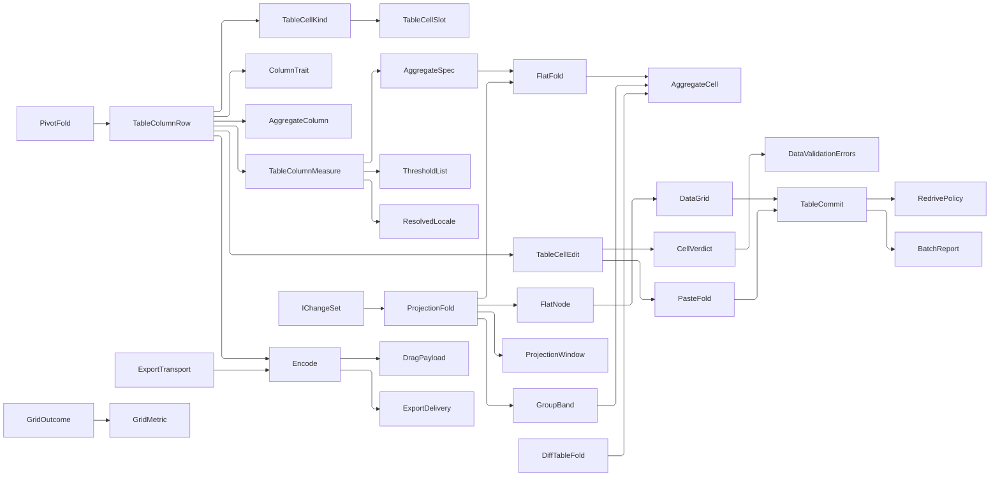

# [APPUI_TABLES_HIERARCHY]

Tabular and hierarchical projection for the Rasm.AppUi grid surface: one `TableColumnRow` metadata family drives column generation, sort comparers, filter admission, group descriptors, edit admission, cell validation, clipboard projection, aggregate contribution, and export; the `TableProjection` union folds flat, tree, grouped, paged, and windowed shapes into one virtualized `FlatNode` stream on the free `DataGrid` with a `PivotSpec` cross-tab snapshot projection beside it; the `TableViewState` snapshot keeps collection-view state and the grid-mechanism column axis explicit over the `Editing/livedata#FILTER_ALGEBRA` filter expression and `Editing/livedata#VIEW_STATE` view axis it consumes; and the `TableCommit` row bridges grid edits, clipboard paste, and fill-down onto the CommandRow deck, `StoreOp.Upsert` persistence, and `DocumentTransaction` host routing. Export delivery is the `Document/export.md` `VisualDestination` union through `ExportDelivery.Deliver` — the tables fold shapes bytes under a stated ceiling, never mints a second delivery vocabulary. The windowing fabric and its `FlatFold` flatten bridges, the `AggregateColumn`/`AggregateSpec`/`AggregateCell` vocabulary both altitudes address, the kernel `ColumnTrait` capability roster, the clipboard payload rows, the threshold family, the measurement policy, live-data change-set streams, screen-state snapshot rows, density and typography tokens, the AppHost `DataClassification` taxonomy, and the Persistence Sep lane arrive as settled vocabulary.

## [01]-[INDEX]

- [02]-[GRID_SUBSTRATE]: One column metadata family drives columns, filter, aggregates, validation, masking, export.
- [03]-[VIEW_STATE]: Serializable collection-view and column-axis snapshot applied in one `DeferRefresh`.
- [04]-[TREE_FLATTEN]: Five projection cases fold to one flat virtualized `FlatNode` stream.
- [05]-[GRID_COMMIT]: Edit, paste, and fill-down ride `CommandRow` commands; exports stream under one ceiling.

## [02]-[GRID_SUBSTRATE]

- Owner: `TableColumnRow<TRow>` — the one row-model metadata record keyed by the shared `AggregateColumn` mint and postured by the kernel `CapabilitySet<ColumnTrait>`; `TableColumnAccess<TRow>` closes the plain-versus-classified materialization boundary; `TableCellEdit<TRow>` is the ONE edit authority — its presence IS the `Editable` trait and its `Set` fold is the editor admission, the paste admission, and the cell-validation producer; `TableColumnMeasure<TRow>` is the numeric axis carrying the cell's own text, its aggregate contribution, and its value-driven format; `TableCellSlot` is the four-case prepared material a column materializes from; `BoundKind` is the two-row bound-control family; `TableCellKind` closes the cell vocabulary as its bound family beside the traits it admits; `TableChrome` is the materialization context; `TableSurface` attaches the column, filter, and footer folds as one extension block.
- Cases: `TableCellKind` = Text | CheckBox | Numeric | Temporal | Progress | Template | Spark; `TableCellSlot` = Bound | Editable | Painted | Authored; `BoundKind` = text | check; `TableMeasure<TRow>` = Quantity | Scalar; `TableColumnAccess<TRow>` = Plain | Classified.
- Law: the free `DataGrid` virtualizes rows over the one flat bound collection; a fixed density-token row height keeps the scroll math exact, and a density change re-realizes the whole window because the ledger's fixed-mode offsets are index times that extent.
- Law: `LoadingRow` stamps row state from theme tokens onto the `DataGridRow` pseudo-classes `:selected`, `:current`, `:editing`, `:edited`, `:invalid`, `:pressed`, `:focus`, `:expanded`, `:sortascending`, `:sortdescending`, `:empty-rows`, `:empty-columns`; `LoadingRowDetails` materializes the single per-screen details template on demand; `LoadingRowGroup` stamps a materialized group header's `DataContext` from the projection's own band roster.
- Law: column posture is the kernel `ColumnTrait` vocabulary read as a set — `Sortable`, `Resizable`, `AutoSized`, `Expand`, `Hidden`, and `Editable` — so the width election has three postures the retired `bool Sortable`/`bool Visible` pair could not spell, `Hidden` carries the roster's own absent-is-visible polarity, and the kind's admitted set refuses a claimed trait through the kernel refusal door with the missing rows as its evidence.
- Law: the column key is the `Shell/virtualization#HIERARCHY_FLATTEN` `AggregateColumn` mint, so the roster key, the band's subtotal column, and the footer's grand-total column are ONE identity carrying ONE ordinal comparer — the four per-site `StringComparer.Ordinal` spellings and every empty-key guard are the deleted form.
- Law: `CustomSortComparer` carries the row's `Sort` comparer so a value-object or unit-bearing cell orders by domain law, `SortMemberPath` stays the display fallback, and the `Sorting` event never substitutes a comparer the row already declares — `Comparer<TRow>` instances satisfy the column's non-generic `IComparer` slot.
- Law: the grid `Ctrl+C` copy rides `ClipboardCopyMode` with `ClipboardContentBinding` mirroring each row's `Cell` binding; classified columns render redacted, so the copy path leaks nothing the cell does not already show.
- Law: a measure-bearing column renders and EXPORTS one text — `TableColumnMeasure.Text` folds a quantity through `ResolvedLocale.Quantity` under its `MeasureRole` and a scalar through the resolved `Formats`, so a delimited field can never disagree with the cell a reader saw and a default `ToString` is unspellable.
- Law: aggregate contribution is a column column — `TableColumnMeasure.Specs` mints `AggregateSpec.Selective` rows the grouping fold feeds into band subtotals and the footer folds into grand totals through the SAME `FlatFold.Cells` one-scan body, so a subtotal and a total reduce at one revision and the grid renders totals it never computes.
- Law: user reorder, resize, and sort-toggle flags are per-screen policy values on `CanUserReorderColumns`, `CanUserResizeColumns`, and `CanUserSortColumns`, with `FrozenColumnCount`, `RowHeight`, and `RowDetailsTemplate` as the remaining posture members.
- Law: `Binding` is the producing half of the `Charts/tiles#TILE_MOUNT` `TableSourcePort` boundary — a roster plus its keyed change-set erase to one `TableSourceBinding` a `TileSource.Rows` key resolves to, so a table tile names a real producer at both ends and the erasure lands where the typed roster is still in hand.
- Entry: `Validation<Error, TableColumnRow<TRow>> Admit()` — every independent clause reported at once; `Fin<Option<DataGridColumn>> Column(TableChrome chrome)` — hidden rows materialize no column; `Option<string> Project(TRow item, ResolvedLocale locale)`; `Fin<FilterSchema<FlatNode<TRow>>> Schema(ResolvedLocale locale)`, `IObservable<Seq<AggregateCell>> Totals<TKey>(IObservable<IChangeSet<TRow, TKey>> rows, ResolvedLocale locale)`, `Fin<GroupPlan<TRow, TKey, string>> Grouping<TKey>(AggregateColumn groupColumn, Func<GroupBand, TKey> key, ResolvedLocale locale)`, and `TableSourceBinding Binding<TKey>(string sourceKey, IObservable<IChangeSet<TRow, TKey>> changes)` on the roster.
- Auto: one row family derives columns, sort comparers, group descriptors, per-column filter admission, edit admission, cell validation, clipboard projection, aggregate specs, and export admission — nine concerns, one owner; `AutoGenerateColumns` stays false and `Columns` is populated by the `Column()` fold, which stamps every materialized column's roster key onto `SortMemberPath` so the column-axis snapshot, the cell-validation lookup, and the sort capture all address a column by key rather than by a position a reorder shifts; the `Sort` comparer column lands as `CustomSortComparer` beside `SortMemberPath` so value-object cells order by domain comparer rather than display text, and the `Cell` binding doubles as `ClipboardContentBinding` on bound columns so the grid's own `Ctrl+C` copy under `DataGridClipboardCopyMode.IncludeHeader` and the export fold project one column vocabulary.
- Packages: Avalonia.Controls.DataGrid; Avalonia; DynamicData; UnitsNet; SkiaSharp; Thinktecture.Runtime.Extensions; LanguageExt.Core; Rasm (kernel `CapabilitySet`, `ColumnTrait`, `Custody`); Rasm.AppUi/Shell/virtualization; Rasm.AppUi/Charts/tiles; Rasm.AppUi/Theme/locale.
- Growth: one column row per field; a new cell kind is one `TableCellKind` row naming its bound family and its admitted traits; a new bound control family is one `BoundKind` row; a new filter sense is one `FilterOperator` row at its live-data owner; a new measure is one `TableMeasure` case; a sizing, visibility, or classification change is one trait or policy value; zero new surface.
- Boundary: classification governs EVERY materialization channel — a classified column materializes ONLY the redacted presentation template (theme-token-resolved through the chrome's `Redacted` fold), read-only, unsortable, with no `Binding` and no `ClipboardContentBinding`, so display and the grid's own `Ctrl+C` copy structurally cannot carry the source cell value, and the column never enters filter, aggregate, paste, or export admission; row height and cell spacing arrive as density-token values; per-column control subclasses are the deleted form. `TableCellEdit` is the ONE edit authority and the `TableCellSlot` cases make its correspondence structural rather than guarded: a bound cell always carries its binding, a painted cell its display, an authored cell BOTH its display and its editor, and read-only versus editable is the CASE rather than a flag beside an absence — the retired slot record carried three optional columns an `Admit` proved and seven kind delegates then unwrapped, which is thirteen unsafe reads standing downstream of the one fold that existed to make them safe. CELL-LEVEL validation reaches the `:invalid` pseudo-class on BOUND columns alone and its producer is exact — `DataGridCell.IsValid` and `DataGridRow.IsValid` carry internal setters, so the only reachable writer is the grid's own `EndCellEdit` commit gate, which reads `DataValidationErrors.GetHasErrors` on the editing element and refuses the commit when the column carries a `CellEditBinding`; the attach fold therefore writes `DataValidationErrors.SetErrors` from `TableCellEdit.Set` inside `CellEditEnding`, which raises BEFORE that gate reads, so a refused candidate lands `:invalid` on the cell and its row and never leaves edit mode. A template-backed column generates no `CellEditBinding`, so its rule cannot reach the cell gate and validates at the row gate instead — that is the stated ceiling, not a gap. The value-driven format column is template-backed BY CONSTRUCTION because `DataGridColumn.CellStyleClasses` applies one class list to every cell of a column and cannot vary by value; the page mints that display template itself from the measure and the `ThresholdList`, so the cell background is the threshold family's own `Cell` colour crossing one boundary conversion from the resolved chart ink, this owner authors no brush, and the absent shade rides the kernel `HostEdge.Slot` host-slot write rather than an unsafe unwrap that painted a null background on every unformatted cell. `TableCellKind.Spark` mounts the `Charts/tiles` `Sparkline.Render` offscreen chart rastered at the cell edge with its image and encoded data released through kernel `Custody.Bracket`, and it materializes for REALIZED rows alone because the grid recycles row containers through `LoadingRow`/`UnloadingRow` — a spark cell per source row is the rejected form. Column configuration is a boundary capsule (statement carve-out): `DataGridColumn` is package-owned mutable state whose posture members are settable properties rather than constructor slots, so the trait reads write in one place instead of once per kind delegate.

```csharp
// --- [IMPORTS] -------------------------------------------------------------------------
using System.Buffers;
using System.Collections;
using System.ComponentModel;
using System.Globalization;
using System.IO;
using System.Reactive.Disposables;
using System.Reactive.Linq;
using System.Text;
using System.Text.Json.Serialization;
using Avalonia.Controls;
using Avalonia.Controls.Templates;
using Avalonia.Data;
using Avalonia.Media;
using Avalonia.Media.Imaging;
using DynamicData;
using LanguageExt;
using LanguageExt.Common;
using Rasm.AppUi.Charts;
using Rasm.AppUi.Collab;
using Rasm.AppUi.Diagnostics;
using Rasm.AppUi.Document;
using Rasm.AppUi.Shell;
using Rasm.AppUi.Theme;
using Rasm.Domain;
using Riok.Mapperly.Abstractions;
using SkiaSharp;
using Thinktecture;
using UnitsNet;
using static LanguageExt.Prelude;

namespace Rasm.AppUi.Editing;

// --- [TYPES] ---------------------------------------------------------------------------

[SmartEnum<string>]
[KeyMemberEqualityComparer<ComparerAccessors.StringOrdinal, string>]
[KeyMemberComparer<ComparerAccessors.StringOrdinal, string>]
public sealed partial class BoundKind {
    public static readonly BoundKind Text = new("text",
        static cell => new DataGridTextColumn { Binding = cell, ClipboardContentBinding = cell });

    public static readonly BoundKind Check = new("check",
        static cell => new DataGridCheckBoxColumn { Binding = cell, ClipboardContentBinding = cell });

    [UseDelegateFromConstructor]
    public partial DataGridBoundColumn Mint(BindingBase cell);
}

[Union(ConversionFromValue = ConversionOperatorsGeneration.None)]
public abstract partial record TableCellSlot(string Header) {
    public sealed record Bound(string Header, BoundKind Kind, BindingBase Cell) : TableCellSlot(Header);
    public sealed record Editable(string Header, BoundKind Kind, BindingBase Cell) : TableCellSlot(Header);
    public sealed record Painted(string Header, IDataTemplate Display) : TableCellSlot(Header);
    public sealed record Authored(string Header, IDataTemplate Display, IDataTemplate Editor) : TableCellSlot(Header);

    public DataGridColumn Build() => Chromed(Switch(
        bound: static slot => Frozen(slot.Kind.Mint(slot.Cell)),
        editable: static slot => (DataGridColumn)slot.Kind.Mint(slot.Cell),
        painted: static slot => Frozen(new DataGridTemplateColumn { CellTemplate = slot.Display }),
        authored: static slot => new DataGridTemplateColumn {
            CellTemplate = slot.Display,
            CellEditingTemplate = slot.Editor,
        }));

    private static DataGridColumn Frozen(DataGridColumn column) => (column.IsReadOnly = true, Column: column).Column;

    private DataGridColumn Chromed(DataGridColumn column) => (column.Header = Header, Column: column).Column;
}

[SmartEnum<string>]
[KeyMemberEqualityComparer<ComparerAccessors.StringOrdinal, string>]
[KeyMemberComparer<ComparerAccessors.StringOrdinal, string>]
public sealed partial class TableCellKind {
    private static readonly CapabilitySet<ColumnTrait> Presented =
        CapabilitySet<ColumnTrait>.All.Without(ColumnTrait.Editable);

    public static readonly TableCellKind Text = new("text", Some(BoundKind.Text), CapabilitySet<ColumnTrait>.All);
    public static readonly TableCellKind CheckBox = new("check-box", Some(BoundKind.Check), CapabilitySet<ColumnTrait>.All);
    public static readonly TableCellKind Numeric = new("numeric", Some(BoundKind.Text), CapabilitySet<ColumnTrait>.All);
    public static readonly TableCellKind Temporal = new("temporal", Some(BoundKind.Text), Presented);
    public static readonly TableCellKind Progress = new("progress", Option<BoundKind>.None, Presented);
    public static readonly TableCellKind Template = new("template", Option<BoundKind>.None, CapabilitySet<ColumnTrait>.All);
    public static readonly TableCellKind Spark = new("spark", Option<BoundKind>.None, Presented);

    public Option<BoundKind> Bound { get; }

    public CapabilitySet<ColumnTrait> Admits { get; }
}

// --- [CONSTANTS] -----------------------------------------------------------------------

public static class TableOps {
}

// --- [POLICIES] ------------------------------------------------------------------------

public static class TableClause {
    public static Validation<Error, Unit> Of(bool held, string detail) =>
        held
            ? Validation<Error, Unit>.Success(unit)
            : Validation<Error, Unit>.Fail(new EditFault.Invariant(target, detail));

    public static Validation<Error, Unit> Of(Option<Error> refusal) =>
        refusal.Match(
            Some: Validation<Error, Unit>.Fail,
            None: static () => Validation<Error, Unit>.Success(unit));
}

// --- [MODELS] --------------------------------------------------------------------------

public sealed record TableCellEdit<TRow>(Func<TRow, string, Fin<TRow>> Set, Option<IDataTemplate> Editor = default);

[Union(ConversionFromValue = ConversionOperatorsGeneration.None)]
public abstract partial record TableMeasure<TRow> where TRow : notnull {
    private TableMeasure() { }

    public sealed record Quantity(Func<TRow, IQuantity> Value, MeasureRole Role) : TableMeasure<TRow>;

    public sealed record Scalar(Func<TRow, double> Value, int Decimals) : TableMeasure<TRow>;
}

public readonly record struct TableCellFormat(ThresholdList Steps, double Floor, double Ceiling);

public sealed record TableColumnMeasure<TRow>(
    TableMeasure<TRow> Measure,
    Seq<AggregateMeasure> Aggregates,
    Option<TableCellFormat> Format = default) where TRow : notnull {
    public Fin<string> Text(TRow row, ResolvedLocale locale) => Measure.Switch(
        state: (Row: row, Locale: locale),
        quantity: static (s, q) => s.Locale.Quantity(q.Value(s.Row), q.Role),
        scalar: static (s, n) => Fin.Succ(n.Value(s.Row).ToString($"N{n.Decimals}", s.Locale.Formats)));

    public double Select(TRow row, ResolvedLocale locale) => Measure.Switch(
        state: (Row: row, Locale: locale),
        quantity: static (s, q) => Try.lift(() => Fin.Succ(q.Value(s.Row).ToUnit(s.Locale.Measures.Unit(q.Role)).Value)).Run().Bind(static inner => inner)
            .Match(Succ: static value => value, Fail: static _ => double.NaN),
        scalar: static (s, n) => n.Value(s.Row));

    public Seq<AggregateSpec<TRow>> Specs(AggregateColumn column, ResolvedLocale locale) =>
        Aggregates.Map(measure => (AggregateSpec<TRow>)new AggregateSpec<TRow>.Selective(
            column, measure, row => Select(row, locale)));

    public Option<IBrush> Shade(TRow row, ChartInk ink, ResolvedLocale locale) =>
        Format.Bind(format => format.Steps.Cell(ink, Select(row, locale), format.Floor, format.Ceiling)
            .Match(
                Succ: shade => Some<IBrush>(new SolidColorBrush(Color.FromArgb(shade.Alpha, shade.Red, shade.Green, shade.Blue))),
                Fail: static _ => Option<IBrush>.None));
}

public sealed record TableSpark<TRow>(Func<TRow, Seq<double>> Series, ChartChrome Stroke, SKImageInfo Info);

[Union(ConversionFromValue = ConversionOperatorsGeneration.None)]
public abstract partial record TableColumnAccess<TRow> where TRow : notnull {
    private TableColumnAccess() { }

    public sealed record Plain(
        Option<BindingBase> Cell,
        Func<TRow, string> Export,
        Option<TableCellEdit<TRow>> Edit = default,
        Option<IDataTemplate> Display = default,
        Option<TableSpark<TRow>> Spark = default) : TableColumnAccess<TRow>;

    public sealed record Classified(DataClassification Classification) : TableColumnAccess<TRow>;
}

public sealed record TableColumnRow<TRow>(
    AggregateColumn Key,
    string Header,
    TableCellKind Kind,
    TableColumnAccess<TRow> Access,
    DataGridLength Width,
    CapabilitySet<ColumnTrait> Traits,
    Option<IComparer> Sort = default,
    Option<TableColumnMeasure<TRow>> Measure = default) where TRow : notnull {
    public bool Visible => !Traits.Admits(ColumnTrait.Hidden);

    public bool Paints =>
        Measure.Exists(static measure => measure.Format.IsSome)
        || Access is TableColumnAccess<TRow>.Plain { Spark.IsSome: true };

    public Validation<Error, TableColumnRow<TRow>> Admit() => Clauses().Traverse(identity).As().Map(_ => this);

    private Seq<Validation<Error, Unit>> Clauses() => Access.Switch(
        state: this,
        plain: static (row, plain) => Seq(
            TableClause.Of(row.Kind.Admits.AdmitsAll(row.Traits)
                ? Option<Error>.None
                : Some<Error>(new EditFault.Invariant(row.Key, $"kind '{row.Kind.Key}' admits no <{row.Kind.Admits.Missing(row.Traits).Wire}>"))),
            TableClause.Of(row.Kind.Bound.IsNone || plain.Cell.IsSome
                ? None : Refused(row.Key, "a bound kind carries no cell binding")),
            TableClause.Of(row.Kind.Bound.IsSome || plain.Display.IsSome || row.Paints
                ? None : Refused(row.Key, "a template-backed kind carries no display template")),
            TableClause.Of(row.Traits.Admits(ColumnTrait.Editable) == plain.Edit.IsSome
                ? None : Refused(row.Key, "the editable trait and the edit fold disagree")),
            TableClause.Of(row.Kind.Bound.IsSome || plain.Edit.ForAll(static edit => edit.Editor.IsSome)
                ? None : Refused(row.Key, "an editable template column carries no editing template")),
            TableClause.Of(row.Kind.Bound.IsNone || row.Measure.ForAll(static measure => measure.Format.IsNone)
                ? None : Refused(row.Key, "a value-driven format needs a template-backed kind"))),
        classified: static (row, _) => Seq(
            TableClause.Of(row.Sort.IsNone && row.Measure.IsNone && !row.Traits.Admits(ColumnTrait.Editable)
                ? None : Refused(row.Key, "a classified column carries no sort, measure, or edit"))));

    private static Option<Error> Refused(AggregateColumn key, string detail) =>
        Some((Error)new EditFault.Invariant(detail));
}

public sealed record TableChrome(
    Func<DataClassification, IDataTemplate> Redacted,
    ChartInk Ink,
    ResolvedLocale Locale);

// --- [OPERATIONS] ----------------------------------------------------------------------

public static class TableSurface {
    extension<TRow>(TableColumnRow<TRow> row) where TRow : notnull {
        public Fin<Option<DataGridColumn>> Column(TableChrome chrome) =>
            row.Admit().ToFin().Map(admitted => admitted.Visible
                ? Some(Configured(Slot(admitted, chrome).Build(), admitted))
                : Option<DataGridColumn>.None);

        public Option<string> Project(TRow item, ResolvedLocale locale) => row.Access.Switch(
            state: (Item: item, Row: row, Locale: locale),
            plain: static (s, access) => s.Row.Measure.Match(
                Some: measure => Some(measure.Text(s.Item, s.Locale).IfNone(string.Empty)),
                None: () => Some(access.Export(s.Item))),
            classified: static (_, _) => Option<string>.None);

        public Option<double> Measured(TRow item, ResolvedLocale locale) =>
            row.Measure.Map(measure => measure.Select(item, locale));

        public Option<TableCellEdit<TRow>> Edit =>
            row.Access is TableColumnAccess<TRow>.Plain plain ? plain.Edit : None;
    }

    private static TableCellSlot Slot<TRow>(TableColumnRow<TRow> row, TableChrome chrome) where TRow : notnull =>
        row.Access.Switch(
            state: (Row: row, Chrome: chrome),
            plain: static (s, access) => s.Row.Kind.Bound.Match(
                Some: bound => access.Cell.Match(
                    Some: cell => access.Edit.IsSome
                        ? (TableCellSlot)new TableCellSlot.Editable(s.Row.Header, bound, cell)
                        : new TableCellSlot.Bound(s.Row.Header, bound, cell),
                    None: () => new TableCellSlot.Painted(s.Row.Header, Displayed(s.Row, access, s.Chrome))),
                None: () => Displayed(s.Row, access, s.Chrome) switch {
                    var display => access.Edit.Bind(static edit => edit.Editor).Match(
                        Some: editor => (TableCellSlot)new TableCellSlot.Authored(s.Row.Header, display, editor),
                        None: () => new TableCellSlot.Painted(s.Row.Header, display)),
                }),
            classified: static (s, access) =>
                new TableCellSlot.Painted(s.Row.Header, s.Chrome.Redacted(access.Classification)));

    private static IDataTemplate Displayed<TRow>(
        TableColumnRow<TRow> row, TableColumnAccess<TRow>.Plain access, TableChrome chrome) where TRow : notnull =>
        row.Measure.Bind(measure => measure.Format.Map(_ => Formatted(measure, chrome)))
            | access.Spark.Map(spark => Sparked(spark, chrome))
            | access.Display
            | Some<IDataTemplate>(new FuncDataTemplate<FlatNode<TRow>>(static _ => true, static (_, _) => new TextBlock()));

    private static DataGridColumn Configured<TRow>(DataGridColumn column, TableColumnRow<TRow> row) where TRow : notnull {
        column.CanUserSort = row.Traits.Admits(ColumnTrait.Sortable);
        column.CanUserResize = row.Traits.Admits(ColumnTrait.Resizable);
        column.Width = row.Traits.Admits(ColumnTrait.Expand)
            ? new DataGridLength(1d, DataGridLengthUnitType.Star)
            : row.Traits.Admits(ColumnTrait.AutoSized) ? DataGridLength.Auto : row.Width;
        column.SortMemberPath = row.Key;
        row.Sort.Iter(comparer => column.CustomSortComparer = comparer);
        return column;
    }

    private static IDataTemplate RowTemplate<TRow>(Func<TRow, Control> render) where TRow : notnull =>
        new FuncDataTemplate<FlatNode<TRow>>(
            static node => node is FlatNode<TRow>.Row,
            (node, _) => node is FlatNode<TRow>.Row item ? render(item.Item) : new TextBlock(),
            supportsRecycling: true);

    private static IDataTemplate Formatted<TRow>(TableColumnMeasure<TRow> measure, TableChrome chrome) where TRow : notnull =>
        RowTemplate<TRow>(item => new Border {
            Background = HostEdge.Slot(measure.Shade(item, chrome.Ink, chrome.Locale)),
            Child = new TextBlock { Text = measure.Text(item, chrome.Locale).IfNone(string.Empty) },
        });

    private static IDataTemplate Sparked<TRow>(TableSpark<TRow> spark, TableChrome chrome) where TRow : notnull =>
        RowTemplate<TRow>(item => Raster(spark.Series(item), spark, chrome).Match(
            Succ: static bitmap => (Control)new Image { Source = bitmap },
            Fail: static _ => new TextBlock()));

    private static Fin<Bitmap> Raster<TRow>(Seq<double> values, TableSpark<TRow> spark, TableChrome chrome) where TRow : notnull =>
        Sparkline.Render(values, chrome.Ink, spark.Stroke, spark.Info).Bind(image =>
            Custody.Bracket(() => image, owned =>
                Custody.Bracket(() => owned.Encode(SKEncodedImageFormat.Png, 100), encoded =>
                    Custody.Bracket(() => new MemoryStream(encoded.ToArray(), writable: false),
                        stream => Fin.Succ(new Bitmap(stream)), TableOps.Column),
                    TableOps.Column),
                TableOps.Column));

    extension<TRow>(Seq<TableColumnRow<TRow>> rows) where TRow : notnull {
        public TableSourceBinding Binding<TKey>(string sourceKey, IObservable<IChangeSet<TRow, TKey>> changes)
            where TKey : notnull =>
            new(sourceKey,
                changes.Transform(static row => (object)row)
                    .ChangeKey(static (key, _) => Optional(key.ToString()).IfNone(string.Empty)),
                rows.Filter(static row => row.Visible).Map(static row => (string)row.Key));

        public Fin<FilterSchema<FlatNode<TRow>>> Schema(ResolvedLocale locale) =>
            new FilterSchema<FlatNode<TRow>>(rows
                .Filter(static row => row.Visible && row.Access is TableColumnAccess<TRow>.Plain)
                .Map(row => new FilterField<FlatNode<TRow>>(
                    new FilterProperty(row.Key, row.Header,
                        row.Measure.IsSome ? FilterKind.Number : FilterKind.Text, Seq<FilterValue>()),
                    node => Cell(row, node, locale)))).Admit();

        private static Seq<FilterValue> Cell(TableColumnRow<TRow> row, FlatNode<TRow> node, ResolvedLocale locale) =>
            node is FlatNode<TRow>.Row item
                ? row.Measured(item.Item, locale).Match(
                    Some: value => double.IsFinite(value)
                        ? Seq<FilterValue>(new FilterValue.Number(value))
                        : Seq<FilterValue>(),
                    None: () => row.Project(item.Item, locale)
                        .Map(static text => (FilterValue)new FilterValue.Text(text)).ToSeq())
                : Seq<FilterValue>();

        public Seq<AggregateSpec<TRow>> Specs(ResolvedLocale locale) =>
            rows.Filter(static row => row.Visible).Bind(row => row.Measure
                .Map(measure => measure.Specs(row.Key, locale))
                .IfNone(Seq<AggregateSpec<TRow>>()));

        public IObservable<Seq<AggregateCell>> Totals<TKey>(
            IObservable<IChangeSet<TRow, TKey>> changes, ResolvedLocale locale) where TKey : notnull =>
            rows.Specs(locale) switch {
                { IsEmpty: true } => Observable.Return(Seq<AggregateCell>()),
                var specs => FlatFold.Cells(changes, specs)
                    .Select(static cells => cells.Filter(static cell => double.IsFinite(cell.Value))),
            };

        public Fin<GroupPlan<TRow, TKey, string>> Grouping<TKey>(
            AggregateColumn groupColumn, Func<GroupBand, TKey> key, ResolvedLocale locale) where TKey : notnull =>
            rows.Find(row => row.Key == groupColumn && row.Visible && row.Access is TableColumnAccess<TRow>.Plain)
                .ToFin(new EditFault.Invariant(groupColumn, "group column is absent, hidden, or classified"))
                .Map(column => new GroupPlan<TRow, TKey, string>(
                    Of: item => column.Project(item, locale).IfNone(string.Empty),
                    Label: static group => group,
                    Aggregates: rows.Specs(locale),
                    Order: Some<IComparer<string>>(StringComparer.Ordinal)));
    }
}
```

## [03]-[VIEW_STATE]

- Owner: `TableViewState` — the serializable collection-view AND grid-mechanism column snapshot over the consumed `Editing/livedata#VIEW_STATE` domain axis; `TableColumnState` — the per-column display-index and resolved-width cell; `ProjectionWindow` — the two-case window bound the projection fold produces and the snapshot restores; `TableColumnMap` — the generated `[Mapper]` projecting a materialized `DataGridColumn` back onto its state cell; `ViewStateSurface` applies and captures against one `DataGrid` and its `DataGridCollectionView`, the only collection-view state holder, and mints the live `ViewBinding` the snapshot's pace declares.
- Cases: `ProjectionWindow` = Paged | Virtualized under the locked kind literals paged, virtualized.
- Law: every multi-descriptor write lands inside one `DeferRefresh` scope; per-descriptor refresh churn is the deleted form.
- Law: paging is live only while `PageSize` exceeds zero, so value `0` reads as unpaged; a paged projection writes its window through the snapshot field, never a second paging surface, and restore replays that window's page index so a snapshot re-opens where it closed.
- Law: `AddNew` and `EditItem` fire only as CommandRow executions; page and current transitions surface through `PageChangingEventArgs` and `DataGridCurrentChangingEventArgs` into screen state.
- Law: the column axis splits by ownership — display index and resolved width are grid MECHANISM and stay on `TableColumnState`, while visibility is the DOMAIN fact `ViewState.Visible` owns because every surface reads it; all three write `DataGridColumn.DisplayIndex`, `Width`, and `IsVisible` and capture back off `DisplayIndex`, `ActualWidth`, and `IsVisible`, so a reordered, resized, and re-shown layout survives restore without a second copy of visibility to disagree with the board's.
- Law: `LoadingRowGroup` stamps group-header state from theme tokens onto each materialized group header, the one materialization edge for grouped projections, so a per-group-header style fork is the deleted form; the group key threads from `ViewState.Group` through the collection view's `GroupDescriptions`, so header expansion state survives restore on the same axis every other surface groups by.
- Law: `CurrentKey` resolves against the keyed live-data cache on the screen; `Apply` receives the resolved item as the `current` value.
- Law: the snapshot's `FilterPace` is CONSUMED by `Bound`, which mints the `Editing/livedata#VIEW_STATE` `ViewBinding` from the same roster `Apply` admits against — so a restored cadence reaches the live edit stream instead of standing as a validated column no fold reads.
- Entry: `Fin<Unit> Apply<TRow>(DataGridCollectionView view, TableViewState state, Seq<TableColumnRow<TRow>> columns, ResolvedLocale locale, FilterPolicy policy, Option<object> current = default)` on `DataGrid` — decodes and compiles the filter, admits view, page, column, expansion, and realized-window state against the column vocabulary, then writes one batched mutation; `TableViewState Capture<TRow>(DataGridCollectionView view, Seq<TableColumnRow<TRow>> columns, TableViewState held)` on `DataGrid` — the producer for every axis the user mutates through the control itself; `Fin<ViewBinding<TRow>> Bound<TRow>(Seq<TableColumnRow<TRow>> columns, TableViewState state, ResolvedLocale locale, FilterPolicy policy)` — the snapshot's own schema, pace, and policy as the live shaping binding.
- Auto: `DeferRefresh` collapses every multi-descriptor write into one refresh; apply-on-activate and capture-on-deactivate ride the screen-state snapshot rows; the window field is PRODUCED by `ProjectionFold.Project`, which returns its bounds stream beside its row stream — the paged arm off `IPagedChangeSet.Response.Page`/`PageSize` and the virtualized arm off the `ExtentLedger`'s own live positions — so restore re-requests the same window with zero re-query and no snapshot carries a position no projection measured; the filter predicate reaches the view through the live-data `FilterPace` the snapshot carries, which publishes one shared edit stream, throttles it on the quiet span, and merges a sampled emission on the ceiling span, so a held key never starves the grid of a refresh and a burst of keystrokes costs one compile rather than one per character.
- Packages: Avalonia.Controls.DataGrid; System.Reactive; DynamicData; LanguageExt.Core; Riok.Mapperly; Rasm.AppUi/Theme/locale; BCL inbox.
- Growth: one snapshot field per grid-mechanism axis; a page-size, window, or column change is one policy value; a filter or view axis grows at its live-data owner; a new window modality is one `ProjectionWindow` case with its `[JsonDerivedType]` row and every `Switch` loudly broken; zero new surface.
- Boundary: boundary capsule (statement carve-out) — `DataGridCollectionView` and `DataGridColumn` are package-owned mutable state, so `Apply` carries language-owned statement forms writing filter, sort, group, page, column, and current-row descriptors inside one `DeferRefresh` scope; the snapshot is built from screen control state and never read back from the view except through `Capture`, which is the one read-back entry and whose column half is a GENERATED projection rather than a hand field copy — the `SortMemberPath`-to-key rename is stated once as a `[MapProperty]` row instead of at a construction site a fourth column would silently outgrow. The PREDICATE is the live-data compiler's and this owner adapts it at one cast, because the control's filter is untyped and every other surface takes the typed one — a grid-local operator vocabulary beside `FilterSense` is the deleted form and is what made a grid filter and a board filter two dialects; `Predicate<FilterTerm>.Open` writes a NULL filter rather than a predicate answering true, so an unfiltered view costs the collection view no per-row call at all. SORT identity is the grid's own: a column carrying a domain comparer writes `DataGridSortDescription.FromComparer` and every other column writes `FromPath` with the view's culture, which is exactly what the header gesture constructs — so a restored description and a gesture-produced one are the same value and the header toggles in place instead of appending a second entry. `Capture` maps each description back to its column through `HasPropertyPath` or through `DataGridComparerSortDescription.SourceComparer` reference identity, so a comparer-sorted column — whose description carries no property path at all — still resolves to its key and the sort axis survives restore. Setting BOTH `CustomSortComparer` and a path-bearing description on one column is the rejected form: `DataGridColumn.GetSortDescription` matches a comparer-bearing column by source comparer alone, finds no match against a path description, and the gesture then ADDS a second sort entry for the same column. The MULTI-SORT gesture law is the control's and this owner never re-implements it — a plain header click clears the descriptions and toggles that column alone, `Shift`-click appends or toggles in place so the sort keys read in click order, `Ctrl`/`Cmd`-click clears every description, `Shift`+`Ctrl`/`Cmd` is a no-op, and sorting is refused outright while a row is in edit; `Sorting` with `e.Handled` is the ONE interception, reserved for pushing the order into a backing query, and substituting a comparer there that the column already declares is the deleted form. The `Paged` window rides the live-data `Page` operator at the projection fold and constructs `ProjectionWindow.Paged`, while the virtualized window rides `Virtualise` and constructs `ProjectionWindow.Virtualized` from the `ExtentLedger`, so one modality never carries zero/default fields belonging to the other, and `Admit` rejects a `Paged` window whose size disagrees with the snapshot's `PageSize`; a second collection-view state holder is the deleted form. Structural admission ACCUMULATES over seven independent clauses, because a snapshot whose column permutation is short AND whose expansion set repeats a key holds two defects and the ladder it replaces folded both onto one opaque sentence.

```csharp
// --- [MODELS] --------------------------------------------------------------------------

[Union(ConversionFromValue = ConversionOperatorsGeneration.None)]
[JsonPolymorphic(TypeDiscriminatorPropertyName = "kind")]
[JsonDerivedType(typeof(ProjectionWindow.Paged), "paged")]
[JsonDerivedType(typeof(ProjectionWindow.Virtualized), "virtualized")]
public abstract partial record ProjectionWindow {
    private ProjectionWindow() { }
    public sealed record Paged(int Index, int Size) : ProjectionWindow;
    public sealed record Virtualized(int Start, int Size) : ProjectionWindow;

    public bool Admits(Option<int> pageSize) => Switch(
        state: pageSize,
        paged: static (size, page) => page.Index >= 0 && page.Size > 0 && size.ForAll(held => held == page.Size),
        virtualized: static (_, view) => view.Start >= 0 && view.Size > 0);
}

public readonly record struct TableColumnState(AggregateColumn ColumnKey, int Order, double Width);

public sealed record TableViewState(
    string Filter,
    FilterPace Pace,
    ViewState View,
    Seq<TableColumnState> Columns,
    Option<int> PageSize,
    Option<AggregateColumn> CurrentKey,
    Seq<string> Expanded,
    Option<ProjectionWindow> Window = default) {
    public Fin<TableViewState> Admit<TRow>(
        Seq<TableColumnRow<TRow>> columns, ResolvedLocale locale, FilterPolicy policy) where TRow : notnull =>
        from schema in columns.Schema(locale)
        from _decoded in FilterLink.Decode(Filter, schema, policy)
        from _view in View.Admit(schema)
        from _paced in Pace.Admit()
        from held in Structural(columns).ToFin()
        select held;

    private Validation<Error, TableViewState> Structural<TRow>(Seq<TableColumnRow<TRow>> columns) where TRow : notnull =>
        toSet(columns.Filter(static column => column.Visible).Map(static column => column.Key)) switch {
            var roster => Seq(
                    TableClause.Of(Columns.IsEmpty
                        || (Columns.Count == roster.Count
                            && Columns.Map(static column => column.ColumnKey).Distinct().Count == Columns.Count
                            && Columns.ForAll(column => roster.Contains(column.ColumnKey))),
                        TableOps.View, "the column axis is not a permutation of the materialized roster"),
                    TableClause.Of(Columns.IsEmpty || toSet(Columns.Map(static column => column.Order)) == toSet(Range(0, Columns.Count)),
                        TableOps.View, "the column order is not a contiguous seat range"),
                    TableClause.Of(Columns.ForAll(static column => double.IsFinite(column.Width) && column.Width > 0d),
                        TableOps.View, "a column carries a non-finite or non-positive width"),
                    TableClause.Of(PageSize.ForAll(static size => size > 0), TableOps.View, "the page size is not positive"),
                    TableClause.Of(Expanded.Distinct().Count == Expanded.Count, TableOps.View, "the expansion set repeats a key"),
                    TableClause.Of(Expanded.ForAll(static key => !string.IsNullOrWhiteSpace()),
                        TableOps.View, "the expansion set carries a blank key"),
                    TableClause.Of(Window.ForAll(window => window.Admits(PageSize)),
                        TableOps.View, "the window bound disagrees with the snapshot"))
                .Traverse(identity).As().Map(_ => this),
        };
}

// --- [OPERATIONS] ----------------------------------------------------------------------

public static class ViewStateSurface {
    extension(DataGrid grid) {
        public Fin<Unit> Apply<TRow>(
            DataGridCollectionView view,
            TableViewState state,
            Seq<TableColumnRow<TRow>> columns,
            ResolvedLocale locale,
            FilterPolicy policy,
            Option<object> current = default) where TRow : notnull =>
            from admitted in state.Admit(columns, locale, policy)
            from schema in columns.Schema(locale)
            from expression in FilterLink.Decode(admitted.Filter, schema, policy)
            from compiled in schema.Compile(expression)
            select fun(() => {
                using IDisposable batch = view.DeferRefresh();
                view.Filter = expression == Predicate<FilterTerm>.Open
                    ? null
                    : item => item is FlatNode<TRow> node && compiled(node);
                view.SortDescriptions.Clear();
                admitted.View.Order.Iter(sort => columns
                    .Find(column => (string)column.Key == sort.PropertyKey)
                    .Iter(column => view.SortDescriptions.Add(Described(column, sort.Descending, view.Culture))));
                view.GroupDescriptions.Clear();
                admitted.View.Group.Iter(group => view.GroupDescriptions.Add(new DataGridPathGroupDescription(group)));
                view.PageSize = admitted.PageSize.IfNone(0);
                toSeq(admitted.Columns.OrderBy(static column => column.Order))
                    .Iter(column => Seated(grid, column, admitted.View.Shows(column.ColumnKey)));
                admitted.Window.Iter(window => window.Switch(
                    state: view,
                    paged: static (target, page) => ignore(target.MoveToPage(page.Index)),
                    virtualized: static (_, _) => unit));
                current.Iter(item => view.MoveCurrentTo(item));
                return unit;
            })();

        public TableViewState Capture<TRow>(
            DataGridCollectionView view,
            Seq<TableColumnRow<TRow>> columns,
            TableViewState held) where TRow : notnull =>
            held with {
                View = held.View with {
                    Order = toSeq(view.SortDescriptions)
                        .Choose(description => Keyed(description, columns)
                            .Map(key => (PropertyKey: (string)key, Descending: description.Direction is ListSortDirection.Descending))),
                    Visible = toSeq(grid.Columns).Filter(static column => column.IsVisible)
                        .Map(static column => column.SortMemberPath),
                },
                Columns = toSeq(grid.Columns).Map(TableColumnMap.ToState),
            };

        public Fin<ViewBinding<TRow>> Bound<TRow>(
            Seq<TableColumnRow<TRow>> columns,
            TableViewState state,
            ResolvedLocale locale,
            FilterPolicy policy) where TRow : notnull =>
            from schema in columns.Schema(locale)
            from paced in state.Pace.Admit()
            select new ViewBinding<TRow>(schema, paced, policy);

        private static Unit Seated(DataGrid grid, TableColumnState state, bool visible) =>
            toSeq(grid.Columns)
                .Find(column => string.Equals(column.SortMemberPath, state.ColumnKey, StringComparison.Ordinal))
                .Match(
                    Some: column => {
                        column.IsVisible = visible;
                        column.DisplayIndex = state.Order;
                        column.Width = new DataGridLength(state.Width, DataGridLengthUnitType.Pixel);
                        return unit;
                    },
                    None: static () => unit);

        private static DataGridSortDescription Described<TRow>(
            TableColumnRow<TRow> column, bool descending, CultureInfo culture) where TRow : notnull =>
            (column.Sort, descending ? ListSortDirection.Descending : ListSortDirection.Ascending) switch {
                ({ IsSome: true, Case: IComparer comparer }, var direction) =>
                    DataGridSortDescription.FromComparer(comparer, direction),
                (_, var direction) => DataGridSortDescription.FromPath(column.Key, direction, culture),
            };

        private static Option<AggregateColumn> Keyed<TRow>(
            DataGridSortDescription description, Seq<TableColumnRow<TRow>> columns) where TRow : notnull =>
            description switch {
                { HasPropertyPath: true } path => columns
                    .Find(column => (string)column.Key == path.PropertyPath)
                    .Map(static column => column.Key),
                DataGridComparerSortDescription comparer => columns
                    .Find(column => column.Sort.Exists(sort => ReferenceEquals(sort, comparer.SourceComparer)))
                    .Map(static column => column.Key),
                _ => None,
            };
    }
}

// --- [COMPOSITION] ---------------------------------------------------------------------

[Mapper(
    RequiredMappingStrategy = RequiredMappingStrategy.Target,
    EnabledConversions = MappingConversionType.All & ~MappingConversionType.ExplicitCast)]
public static partial class TableColumnMap {
    [MapProperty(nameof(DataGridColumn.SortMemberPath), nameof(TableColumnState.ColumnKey))]
    [MapProperty(nameof(DataGridColumn.DisplayIndex), nameof(TableColumnState.Order))]
    [MapProperty(nameof(DataGridColumn.ActualWidth), nameof(TableColumnState.Width))]
    public static partial TableColumnState ToState(DataGridColumn column);

    [UserMapping]
    private static AggregateColumn Column(string key) => AggregateColumn.Create();
}
```

## [04]-[TREE_FLATTEN]

- Owner: `TableProjection<TRow, TKey>` `[Union]` with the `Shell/virtualization` `FlatNode<TRow>` as the one flat row vocabulary; `ExpansionState<TKey>` the expansion cell over one kernel `Atom` with `ExpandVerb` its three-row seat vocabulary; `TableProjectionFeed<TRow, TKey>` carries the row stream, the window bounds, and the band roster off one subscription; `ProjectionFold` dispatches the union onto that feed; `GroupHeaderStamp` is the band roster's one materialization edge.
- Cases: `Flat`, `TreeFlattened(Func<TRow, TKey> ParentKey, Option<IComparer<TRow>> Order, Option<Func<TKey, IObservable<IChangeSet<TRow, TKey>>>> LoadChildren)`, `Grouped(AggregateColumn GroupColumn, GroupPlan<TRow, TKey, string> Plan)`, `Paged(IObservable<PageRequest> Pages, IObservable<IComparer<TRow>> Order)`, `Virtualized(VirtualWindow<TRow, TKey> Owner, IObservable<ViewportRange> Viewport, IObservable<IComparer<TRow>> Order)`; `ExpandVerb` = expanded | collapsed | toggled.
- Law: every case lands as `IChangeSet<FlatNode<TRow>, TKey>`; the grid binds one flat collection of that one vocabulary, so the one `VirtualWindow` fabric windows every projection and a tables-local indent row beside `FlatNode` is the deleted form.
- Law: the `TreeFlattened` recursion and the `Grouped` fold are the `Shell/virtualization#HIERARCHY_FLATTEN` `FlatFold` bridges, not tables-local folds — the column-metadata family stays tables-owned, the sibling-order comparer threads as the bridge's optional order argument, the grouping request is the roster-minted `GroupPlan`, and windowing delegates to the one fabric.
- Law: the DISCRETE page rides `DynamicData.Page` at this fold and never the ledger, because a page is a source-side window with no extent to measure — the windowing owner's own Boundary forecloses a paged arm there, so the two modalities meet only in the `ProjectionWindow` union they both construct.
- Law: the expansion cell is a kernel `Atom` and its seat ANSWERS a `Transition` — an idempotent expand DECLINES rather than re-emitting, so a toggle that changed nothing no longer re-walks the whole tree; the Rx subject it replaces answered no verdict at all and published every write.
- Law: the cross-tab is a snapshot projection over the materialized item set — quantity-takeoff and status matrices are `PivotSpec` values whose cells are a closed `PivotCell` family, so a vacant cross is a CASE rather than a fabricated zero, an unmeasured cross names the spec's own delegate as its owner, and the finiteness gate reads measured cells alone; `PivotFold.Roster` projects the cross into the same `TableColumnRow` family the grid materializes, so the matrix exports through the one `Encode` shaping and `ExportDelivery.Deliver` fold rather than a second delimited path.
- Law: view sort descriptors stay empty on a tree projection; sibling order is the case's `Order` comparer threaded into `FlatFold.Flatten`, which applies it at every depth including the roots — sorting flat indent rows is the deleted form.
- Law: the two WINDOWED arms each carry the live comparer STREAM and apply it at their own seat, because `Page` and `Virtualise` both demand a sorted change-set while the receiver every arm shares is the keyed feed, so the arm needing the sorted type is the arm that states it; the stream is the `Editing/livedata#VIEW_STATE` `PipelineInputs.Comparers` value, seeded so a window realizes on the first view rather than waiting for a user's first sort. A frozen comparer made a column-sort flip spellable only as a fresh projection on a re-subscribed pipeline, discarding the source cache, the recycle pool, and every measured extent to re-rank an order the package maintains in place; the three unwindowed arms declare none, because nothing downstream of them reads a sorted type.
- Law: `LoadChildren` materializes a child stream on first expansion through the `FirstExpansion` fold — each key entering the expansion set subscribes its stream exactly once, and loaded children merge into the upstream keyed spine the shared flatten reads, never a side collection.
- Law: `DiffTableFold.Classify` takes the `Collab/compare#COMPARE_SESSION` `ChangeRow` roster whole — the same `(ElementId, DiffClass)` classification `Render/viewpoint#VIEWPOINT_CODEC` `VersionGhost.Project` renders in the viewport — and summarizes it into `AggregateCell` rows keyed by class, so a diff summary, a band subtotal, and a footer total are ONE cell vocabulary and a grid-local diff classification is the deleted form.
- Entry: `TableProjectionFeed<TRow, TKey> Project(TableProjection<TRow, TKey> projection, ExpansionState<TKey> expansion, Func<TRow, TKey> key)` — rows, window bounds, and band roster ride BESIDE each other off one shared subscription, so the `[03]` snapshot field has the producer its `Admit` already validates, an unwindowed case emits an empty window stream rather than a fabricated position, and an ungrouped case emits an empty band roster rather than a header feed nothing stamps; `Transition<Set<TKey>> Seat(TKey key, ExpandVerb verb)` on `ExpansionState`; `Fin<PivotCross> Cross<TRow>(PivotSpec<TRow> spec, Seq<TRow> items)` and `Seq<TableColumnRow<PivotRow>> Roster(PivotCross cross, ResolvedLocale locale)` on `PivotFold`; `Fin<DiffSummary> Classify(Seq<ChangeRow> changed)` on `DiffTableFold`.
- Auto: an expansion seat re-emits the flattened stream through the change-set diff only when the cell actually moved; the `TreeFlattened` arm delegates to `FlatFold.Flatten`, the `Grouped` arm to `FlatFold.Grouped` with the roster-minted plan, and the `Virtualized` arm consumes the caller-owned `VirtualWindow`, current `ViewportRange` stream, and live comparer stream to build `OrderedChangeSet<TRow,TKey>` for `VirtualWindow.Realize`, which owns the sort for that arm; the windowed arms share one published subscription and project rows and `ProjectionWindow` bounds off it, so the snapshot's window and the grid's rows can never disagree about the position they were measured at; expansion keys persist on the `Expanded` snapshot field through the row key's string projection, and restore mints the expansion cell before the first projection subscription.
- Packages: DynamicData; System.Reactive; Thinktecture.Runtime.Extensions; LanguageExt.Core; Rasm (kernel `Atom`/`Cell`/`Transition`/`Dimension`); Rasm.AppUi/Shell/virtualization.
- Growth: one projection case; one `ExpandVerb` row for a new seat sense; an ordering or depth change is one policy value; zero new surface — the closed five-case family is the axis.
- Boundary: `TreeDataGrid` stays rejected — every hierarchy renders as `FlatNode.Row` indent rows on the flat virtualized `DataGrid`, which is the absorbing fold; windowing routes through the one `VirtualWindow` owner, so a tables-local virtualizer is the `[04]-[BOUNDARIES]` per-surface-virtualizer rejected form and `Editing/tables` delegates windowing to the one fabric while conserving its `TableColumnRow` column-metadata family and its sibling-order comparer; the tables-side fold contributes its `parentKey`, sibling-order comparer, expansion cell, and grouping plan to the shared `FlatFold` bridges, which own the `TransformToTree`-plus-recursion and the `Group`-plus-aggregation this page previously held in-folder, so the flatten algebra lives at one owner with zero capability lost — the column metadata, the lazy `LoadChildren`, the paged arm, and the pivot stay tables-owned. GROUP MATERIALIZATION is the collection view's and the AGGREGATE is the flatten's: `FlatFold.Grouped` emits `FlatNode.Band` nodes carrying live `AggregateCell` subtotals, the fold FILTERS those bands out of the bound row stream and publishes them as the band roster `LoadingRowGroup` stamps onto each materialized `DataGridRowGroupHeader` through its `DataContext`, and `GroupDescriptions` renders the header itself — binding a band AS a grid row is the rejected form on this control, because every bound column would render an empty cell against a node carrying no item and a template column carries no `CellEditBinding`, which is the one reachable `:invalid` producer; the band's own `Cardinality` cell is the header's count, so `IsItemCountVisible` stays false and one count source serves the header. `TransformToTree` emits root nodes only (its default predicate is `IsRoot`), so the shared flatten fold owns child materialization and never double-counts; grouped virtualization stability rides the live-data immutable-group projection-policy row; the expansion cell and the header stamp both dispose inside the screen's activation scope, which is why each returns a bare `IDisposable` rather than a bracket that would release at the end of an expression the surface outlives; the virtualized window bound reads `ExtentLedger.Window` and `Live` for the current range rather than folding the realized collection, so restore re-requests the exact viewport with zero re-query, an empty ledger emits no window at all, and start and size arrive as ONE answer rather than two reads that could refuse independently — and a `FlatNode` carries no offset or extent because the fixed density-token row height makes both derivable from the index the window already reports. The PIVOT's column axis is bounded at admission: the control virtualizes ROWS and never columns, so each dynamic column costs one header plus one materialized cell per realized row and an unbounded cross would realize an unbounded control set per row — `PivotSpec.ColumnCeiling` refuses an over-wide cross by name as a kernel `Dimension` rather than a bare literal, and column recycling is unavailable by construction because `Columns` is a model collection the grid re-materializes wholesale rather than a recycled container pool.

```csharp
// --- [TYPES] ---------------------------------------------------------------------------

[SmartEnum<string>]
[KeyMemberEqualityComparer<ComparerAccessors.StringOrdinal, string>]
public sealed partial class ExpandVerb {
    public static readonly ExpandVerb Expand = new("expanded");
    public static readonly ExpandVerb Collapse = new("collapsed");
    public static readonly ExpandVerb Toggle = new("toggled");
}

[Union(ConversionFromValue = ConversionOperatorsGeneration.None)]
public abstract partial record PivotCell {
    private PivotCell() { }
    public sealed record Vacant : PivotCell;
    public sealed record Unmeasured : PivotCell;
    public sealed record Measured(double Value) : PivotCell;

    public static readonly PivotCell Empty = new Vacant();

    public static PivotCell Of(Option<double> reading) =>
        reading.Match(Some: static value => (PivotCell)new Measured(value), None: static () => new Unmeasured());

    public string Text(ResolvedLocale locale) => Switch(
        state: locale,
        vacant: static (_, _) => string.Empty,
        unmeasured: static (_, _) => string.Empty,
        measured: static (held, row) => row.Value.ToString("N2", held.Formats));

    public bool IsFinite => Switch(
        vacant: static _ => true,
        unmeasured: static _ => true,
        measured: static row => double.IsFinite(row.Value));
}

// --- [MODELS] --------------------------------------------------------------------------

public sealed record TableProjectionFeed<TRow, TKey>(
    IObservable<IChangeSet<FlatNode<TRow>, TKey>> Rows,
    IObservable<ProjectionWindow> Window,
    IObservable<HashMap<string, GroupBand>> Bands) where TRow : notnull where TKey : notnull;

[Union(ConversionFromValue = ConversionOperatorsGeneration.None)]
public abstract partial record TableProjection<TRow, TKey> where TRow : notnull where TKey : notnull {
    private TableProjection() { }

    public sealed record Flat : TableProjection<TRow, TKey>;

    public sealed record TreeFlattened(
        Func<TRow, TKey> ParentKey,
        Option<IComparer<TRow>> Order = default,
        Option<Func<TKey, IObservable<IChangeSet<TRow, TKey>>>> LoadChildren = default) : TableProjection<TRow, TKey>;

    public sealed record Grouped(AggregateColumn GroupColumn, GroupPlan<TRow, TKey, string> Plan) : TableProjection<TRow, TKey>;

    public sealed record Paged(
        IObservable<PageRequest> Pages,
        IObservable<IComparer<TRow>> Order) : TableProjection<TRow, TKey>;

    public sealed record Virtualized(
        VirtualWindow<TRow, TKey> Owner,
        IObservable<ViewportRange> Viewport,
        IObservable<IComparer<TRow>> Order) : TableProjection<TRow, TKey>;
}

public sealed record PivotCross(Seq<AggregateColumn> Columns, Seq<PivotRow> Rows);

public sealed record PivotRow(string Label, Seq<PivotCell> Cells) {
    public PivotCell At(int ordinal) => ordinal >= 0 && ordinal < Cells.Count ? Cells[ordinal] : PivotCell.Empty;
}

public sealed record DiffSummary(Seq<AggregateCell> Classes, Seq<ChangeRow> Rows);

public sealed record PivotSpec<TRow>(
    Func<TRow, string> RowAxis,
    Func<TRow, AggregateColumn> ColumnAxis,
    Func<Seq<TRow>, Option<double>> Cell) {
    public static readonly Dimension ColumnCeiling = Dimension.Create(64);
}

// --- [OPERATIONS] ----------------------------------------------------------------------

public sealed class ExpansionState<TKey> where TKey : notnull {
    private readonly Atom<Set<TKey>> cell;

    private ExpansionState(Set<TKey> seed) => cell = Atom(seed);

    public static ExpansionState<TKey> Of(Seq<TKey> expanded) => new(toSet(expanded));

    public bool IsExpanded(TKey key) => cell.Value.Contains();

    public IObservable<Set<TKey>> Keys =>
        Observable
            .FromEvent<AtomChangedEvent<Set<TKey>>, Set<TKey>>(
                handler => cell.Change += handler,
                handler => cell.Change -= handler)
            .StartWith(cell.Value)
            .DistinctUntilChanged();

    public Transition<Set<TKey>> Seat(TKey key, ExpandVerb verb) =>
        Cell.Step(
            cell,
            held => verb.Switch(
                state: held,
                expand: static s => s.Contains(s.Key) ? Option<Set<TKey>>.None : Some(s.Add(s.Key)),
                collapse: static s => s.Contains(s.Key) ? Some(s.Remove(s.Key)) : Option<Set<TKey>>.None,
                toggle: static s => Some(s.Contains(s.Key) ? s.Remove(s.Key) : s.Add(s.Key))),
            new EditFault.Invariant(TableOps.Column, $"expansion already reads '{verb.Key}'"));
}

public static class ProjectionFold {
    extension<TRow, TKey>(IObservable<IChangeSet<TRow, TKey>> source) where TRow : notnull where TKey : notnull {
        public TableProjectionFeed<TRow, TKey> Project(
            TableProjection<TRow, TKey> projection, ExpansionState<TKey> expansion, Func<TRow, TKey> key) =>
            projection.Switch(
                state: (Source: source, Expansion: expansion),
                flat: static (s, _) => new TableProjectionFeed<TRow, TKey>(s.Source.Transform(Leaf), Unwindowed, Ungrouped),
                treeFlattened: static (s, tree) => new TableProjectionFeed<TRow, TKey>(
                    tree.LoadChildren
                        .Map(load => s.Source.Merge(FirstExpansion(s.Expansion.Keys, load)))
                        .IfNone(s.Source)
                        .Flatten(tree.ParentKey, s.Expansion.Keys, s.Key, tree.Order),
                    Unwindowed,
                    Ungrouped),
                grouped: static (s, grouped) => s.Source.Grouped(grouped.Plan, s.Expansion.Keys, s.Key)
                    .Publish().RefCount() switch {
                        var shared => new TableProjectionFeed<TRow, TKey>(
                            shared.Filter(static node => node is FlatNode<TRow>.Row),
                            Unwindowed,
                            shared.ToCollection().Select(static nodes => toHashMap(toSeq(nodes)
                                .Choose(static node => node is FlatNode<TRow>.Band band
                                    ? Some((band.Group.LabelKey, band.Group))
                                    : Option<(string, GroupBand)>.None)))),
                    },
                paged: static (s, paged) => s.Source.Sort(paged.Order).Page(paged.Pages).Publish().RefCount() switch {
                    var shared => new TableProjectionFeed<TRow, TKey>(
                        shared.Transform(Leaf),
                        shared.Select(static changes => (ProjectionWindow)new ProjectionWindow.Paged(
                                changes.Response.Page, changes.Response.PageSize))
                            .DistinctUntilChanged(),
                        Ungrouped),
                },
                virtualized: static (s, virtualized) => virtualized.Owner
                    .Realize(new OrderedChangeSet<TRow, TKey>(s.Source, virtualized.Order), virtualized.Viewport)
                    .Publish().RefCount() switch {
                        var realized => new TableProjectionFeed<TRow, TKey>(
                            realized.Transform(static item => Leaf(item.Item)),
                            realized.ToCollection()
                                .WithLatestFrom(virtualized.Viewport, static (_, range) => range)
                                .SelectMany(range => Bounds(virtualized.Owner.Ledger, range))
                                .DistinctUntilChanged(),
                            Ungrouped),
                    });
    }

    private static FlatNode<TRow> Leaf<TRow>(TRow item) where TRow : notnull =>
        new FlatNode<TRow>.Row(item, Depth: 0, HasChildren: false, Expanded: false);

    private static IObservable<ProjectionWindow> Unwindowed => Observable.Empty<ProjectionWindow>();

    private static IObservable<HashMap<string, GroupBand>> Ungrouped =>
        Observable.Return(HashMap<string, GroupBand>());

    private static Seq<ProjectionWindow> Bounds<TKey>(ExtentLedger<TKey> ledger, ViewportRange range) where TKey : notnull =>
        ledger.Live == 0
            ? Seq<ProjectionWindow>()
            : ledger.Window(range)
                .Map(static window => (ProjectionWindow)new ProjectionWindow.Virtualized(window.Start, window.Size))
                .ToSeq();

    private static IObservable<IChangeSet<TRow, TKey>> FirstExpansion<TRow, TKey>(
        IObservable<Set<TKey>> expansion, Func<TKey, IObservable<IChangeSet<TRow, TKey>>> load)
        where TRow : notnull where TKey : notnull =>
        expansion
            .Scan((Seen: Set<TKey>(), Fresh: Seq<TKey>()), static (state, expanded) => (
                Seen: expanded.Fold(state.Seen, static (seen, key) => seen.TryAdd()),
                Fresh: toSeq(expanded.Filter(key => !state.Seen.Contains()))))
            .SelectMany(static state => state.Fresh)
            .Select(load)
            .Merge();
}

public static class GroupHeaderStamp {
    public static IDisposable Attach(DataGrid grid, IObservable<HashMap<string, GroupBand>> bands) =>
        Observable
            .FromEventPattern<EventHandler<DataGridRowGroupHeaderEventArgs>, DataGridRowGroupHeaderEventArgs>(
                handler => grid.LoadingRowGroup += handler, handler => grid.LoadingRowGroup -= handler)
            .WithLatestFrom(bands, static (pattern, roster) => (Roster: roster, Header: pattern.EventArgs.RowGroupHeader))
            .Subscribe(static stamp => Optional(stamp.Header.DataContext as DataGridCollectionViewGroup)
                .Bind(group => Optional(group.Key).Bind(key => Optional(key.ToString())))
                .Bind(label => stamp.Roster.Find(label))
                .Iter(band => {
                    stamp.Header.IsItemCountVisible = false;
                    stamp.Header.DataContext = band;
                }));
}

public static class PivotFold {
    public static Fin<PivotCross> Cross<TRow>(PivotSpec<TRow> spec, Seq<TRow> items) {
        Seq<AggregateColumn> columns = toSeq(items.Map(spec.ColumnAxis).Distinct().OrderBy(identity)).Strict();
        Seq<PivotRow> rows = toSeq(items.GroupBy(spec.RowAxis, StringComparer.Ordinal).OrderBy(static group => group.Key, StringComparer.Ordinal))
            .Map(group => toSeq(group).Fold(
                    HashMap<AggregateColumn, Seq<TRow>>(),
                    (held, item) => held.AddOrUpdate(spec.ColumnAxis(item), rows => rows.Add(item), Seq(item))) switch {
                var crosses => new PivotRow(
                    group.Key,
                    columns.Map(column => crosses.Find(column).Match(
                        Some: cross => PivotCell.Of(spec.Cell(cross)),
                        None: static () => PivotCell.Empty))),
            })
            .Strict();
        return Seq(
                TableClause.Of(!items.IsEmpty, TableOps.Pivot, "the item set is empty"),
                TableClause.Of(columns.Count <= PivotSpec<TRow>.ColumnCeiling.Value, TableOps.Pivot,
                    $"the column axis exceeds the {PivotSpec<TRow>.ColumnCeiling.Value}-column ceiling"),
                TableClause.Of(rows.ForAll(static row => !string.IsNullOrWhiteSpace(row.Label)),
                    TableOps.Pivot, "a row axis key is blank"),
                TableClause.Of(rows.ForAll(static row => row.Cells.ForAll(static cell => cell.IsFinite)),
                    TableOps.Pivot, "a measured cell is non-finite"),
                TableClause.Of(rows.IsEmpty || rows.Exists(static row => row.Cells.Exists(static cell => cell is PivotCell.Measured)),
                    TableOps.Pivot, "the cell delegate admitted no measure on any populated cross"))
            .Traverse(identity).As().Map(_ => new PivotCross(columns, rows)).ToFin();
    }

    public static Seq<TableColumnRow<PivotRow>> Roster(PivotCross cross, ResolvedLocale locale) =>
        Axis(AggregateColumn.Create("axis"), TableCellKind.Text, static row => row.Label)
            .Cons(cross.Columns.Map((column, ordinal) =>
                Axis(column, TableCellKind.Numeric, row => row.At(ordinal).Text(locale))));

    private static TableColumnRow<PivotRow> Axis(
        AggregateColumn key, TableCellKind kind, Func<PivotRow, string> project) =>
        new(kind,
            new TableColumnAccess<PivotRow>.Plain(None, project),
            DataGridLength.Auto,
            CapabilitySet<ColumnTrait>.Of(ColumnTrait.Sortable, ColumnTrait.AutoSized));
}

public static class DiffTableFold {
    public static Fin<DiffSummary> Classify(Seq<ChangeRow> changed) =>
        changed.ForAll(static row => !string.IsNullOrWhiteSpace(row.ElementId))
            ? Fin.Succ(new DiffSummary(
                toSeq(changed.GroupBy(static row => row.Class.Key).OrderBy(static group => group.Key, StringComparer.Ordinal))
                    .Map(static group => new AggregateCell(
                        AggregateColumn.Create(group.Key), AggregateMeasure.Count, group.Count()))
                    .Strict(),
                changed))
            : Fin.Fail<DiffSummary>(new EditFault.Invariant(TableOps.Pivot, "a classified change carries no element identity"));
}
```

## [05]-[GRID_COMMIT]

- Owner: `TableCommit<TRow>` — the one edit-commit row carrying the gate, the host-agnostic persist, and the kernel `RedrivePolicy` its batch re-drives on; `BatchReport` — the batch's total answer; `PasteFold` with `ScanPhase` and `PasteScan` — the clipboard-block-to-column mapping every paste and fill-down rides; `ExportTransport` — the transport roster carrying its own ceiling, delimiter, buffer seed, header posture, and re-drive curve; `TableExportSpec` — the text-shaping policy over that transport; `GridMetric` and `GridOutcome` — the instrument roster and the disposition family one `Observe` writes; `CommitSurface` bridges grid edit events to the intent path, writes the cell-validation errors the `:invalid` producer reads, streams rows to delimited bytes under that ceiling, mints the clipboard payload, and publishes through `ExportDelivery.Landed`.
- Cases: `ScanPhase` = plain | quoted | pending; `ExportTransport` = clipboard | file; `GridMetric` = commits | cells | exports; `GridOutcome` = Commit | Paste | Export; `CellVerdict` = Admitted | Refused.
- Law: `BeginEdit`, `CommitEdit`, and `CancelEdit` drive the programmatic edit lifecycle; only a committing row passes the `EditAction` filter into the gate, and a failing gate vetoes the commit at the cancellable `RowEditEnding` hook via `e.Cancel`.
- Law: `Gate` receives the screen validation boundary's folded `Fin`; a failing gate aborts before `Persist` and surfaces on the screen fault state.
- Law: cell admission is the column's own `TableCellEdit.Set` — the same fold that admits an editor commit admits a pasted cell, so an edit path and a paste path can never disagree about what the column accepts.
- Law: the `Persist` column is the host-agnostic parameter and it is IO-shaped, so cancellation rides the effect's own environment rather than a token every caller threads; store rows, host-object rows, and fake-deterministic rows differ only in the bound delegate. Re-drive runs through the kernel `Redrive.Run` executor alone against the commit row's own `RedrivePolicy`, so a store that declined transiently re-drives on its declared curve, a row the user mistyped never does, and no attempt loop, delay window, or clock arithmetic exists at this consumer.
- Law: a paste executes N commits under ONE intent invocation, so the CommandRow deck returns one `DeckOutcome` for the whole block; the plan is admitted whole before the first persist, so a block naming a hidden, classified, or read-only column rejects by that column's name with nothing written.
- Law: `TableExportSpec.For` takes its ceiling, its buffer seed, its header posture, its default delimiter, and its delivery re-drive off ONE `ExportTransport` row — the clipboard ceiling is small because a transport payload crosses a platform boundary that copies it, the delivered ceiling is large because the delivery fold streams it once into an artifact, and a third transport is one row rather than a fourth factory.
- Law: `Copied` is the clipboard leg the transport declares — the shaped bytes decode once into the input plane's `DragPayload.TableRows` row, so the copy path names a real transfer case and the naked-string sibling that re-materialized the buffer for no caller has no spelling left.
- Law: `Export` folds the streamed bytes through `ExportDelivery.Landed`, so file, blob-lane, and bundle delivery share the export.md exhaustiveness obligation and return `VisualArtifact`.
- Law: `Admitted` traverses a non-empty column sequence in requested order, rejects quote or line-break delimiters and duplicate, unknown, hidden, or classified keys, and the delimited projection is the single text-shaping fold for clipboard and delivered destinations alike.
- Entry: `IDisposable Attach(DataGrid grid, Seq<TableColumnRow<TRow>> columns, Action<string, TRow> invoke, Action<Error> fault)`, `IO<Unit> Execution(TRow row)`, and `IO<BatchReport> Batch(Seq<TRow> rows)` on `TableCommit<TRow>`; `Fin<Seq<TRow>> Paste(DragPayload payload, int anchor, Seq<TRow> targets, TableExportSpec spec)`, `Fin<ReadOnlyMemory<byte>> Encode(TableExportSpec spec, Seq<TRow> items, ResolvedLocale locale)`, `Fin<DragPayload> Copied(TableExportSpec spec, Seq<TRow> items, ResolvedLocale locale)`, and `IO<Fin<VisualArtifact>> Export(VisualRuntime runtime, TableExportSpec spec, Seq<TRow> items, ResolvedLocale locale, VisualDestination destination)` on the roster; `Fin<Seq<TRow>> PasteFold.FillDown(Seq<TableColumnRow<TRow>> columns, int anchor, int width, TRow source, Seq<TRow> targets, ResolvedLocale locale)` — the fill span is the selection's width, admitted exactly as a paste block's is; `Fin<Unit> CommitSurface.Observe(InstrumentSet set, GridOutcome outcome)`.
- Auto: every commit, paste, and export executes as a CommandRow, so availability gating, re-entrancy suppression, and `DeckOutcome` arrive with zero local result code; a delivery-case change breaks the one `VisualDestination` dispatch at compile time, never a table-local sibling family; the cell-validation write rides `CellEditEnding`, which the control raises BEFORE its own commit gate reads `DataValidationErrors`, so a refused candidate reaches `:invalid` on the same keystroke that produced it.
- Result: command execution returns `DeckOutcome`; export returns `VisualArtifact`; `TelemetryRow` contributes the `GridMetric` roster whole through the AppHost `TelemetryContributorPort`, and the one `Observe` writes the ROW a `GridOutcome` case names.
- Packages: Avalonia.Controls.DataGrid; Avalonia; System.Reactive; Thinktecture.Runtime.Extensions; LanguageExt.Core; Rasm (kernel `RedrivePolicy`, `Retriability`, `Expected`); Rasm.AppUi/Shell/input; BCL inbox.
- Growth: one export policy is one `ExportTransport` row carrying its five columns; a new delivery case is one `VisualDestination` case landed at the export.md owner; a new commit target is one `Persist` delegate binding; one grid instrument is one `GridMetric` row and one `GridOutcome` case whose `Switch` breaks the writer at compile time; zero new surface.
- Boundary: store rows bind `Persist` to `StoreOp.Upsert` through the Persistence port; host-object rows bind the same column to the abstract `DocumentTransaction` commit surface-host port the app root binds to the host; delivery is the `Document/export.md` `VisualDestination` union through `ExportDelivery.Landed` — the `FilePath` value arrives from the storage-pick DialogIntent row and the `BlobLane` arm rides the Persistence Sep lane — so a table-local delivery union is the `SHAPE_BUDGET` deleted form; the clipboard is a TRANSPORT owned by `Shell/input`, never a destination and never a boundary this page crosses: the paste fold takes an already-decoded `DragPayload` and refuses every case but `TableRows` by name, the copy fold MINTS that same case, so this owner holds no `IClipboard` call and the format gate stays the input plane's `ClipboardRow.Decode`. EXPORT is streamed under a stated ceiling: the fold writes header and rows into one `ArrayBufferWriter<byte>` and the ceiling guard ANSWERS the result after the header and after each row, so an oversize set refuses by name at the line that crossed it with nothing beyond it materialized, a wide roster over an empty item set cannot slip past a test that never ran, and delivery takes that buffer's own `WrittenMemory` through the `ReadOnlyMemory<byte>` overload so the last step copies nothing. The row projection is POSITIONALLY TOTAL: one field per admitted column, an unprojected cell emitting empty rather than dropping, since a dropped cell shifts every field after the hole one column left against a header this same fold wrote. Batched persistence threads a `BatchReport` on the `IO` effect, reporting offered, landed, and the refusal together, so a caller learns how many rows crossed before the refusal.

```csharp
// --- [TYPES] ---------------------------------------------------------------------------

[Union(ConversionFromValue = ConversionOperatorsGeneration.None)]
public abstract partial record ScanPhase {
    private ScanPhase() { }
    public sealed record Plain : ScanPhase;
    public sealed record Quoted : ScanPhase;
    public sealed record Pending : ScanPhase;

    public static readonly ScanPhase Open = new Plain();
    public static readonly ScanPhase Inside = new Quoted();
    public static readonly ScanPhase Half = new Pending();
}

[SmartEnum<string>]
[KeyMemberEqualityComparer<ComparerAccessors.StringOrdinal, string>]
public sealed partial class ExportTransport {
    public static readonly ExportTransport Clipboard = new("clipboard",
        ceiling: 8_388_608, delimiter: '\t', header: true, redrive: RedrivePolicy.None);

    public static readonly ExportTransport File = new("file",
        ceiling: 268_435_456, delimiter: ',', header: true,
        redrive: RedrivePolicy.Of(Schedule.exponential(TimeSpan.FromMilliseconds(50d)), bound: 3));

    public int Ceiling { get; }

    public char Delimiter { get; }

    public bool Header { get; }

    public RedrivePolicy Redrive { get; }

    public int Seed => Math.Min(Ceiling, 65_536);
}

[SmartEnum<string>]
[KeyMemberEqualityComparer<ComparerAccessors.StringOrdinal, string>]
public sealed partial class GridMetric {
    public static readonly GridMetric Commits = new("commits",
        InstrumentSpec.Create("rasm.appui.table.commit", InstrumentKind.Count, MeasureForm.Whole, "{commit}",
            "grid commits by intent and outcome",
            Seq(AppUiTelemetry.IntentSlot, AppUiTelemetry.OutcomeSlot), None, None, None),
        AppUiTelemetry.IntentSlot);

    public static readonly GridMetric Cells = new("cells",
        InstrumentSpec.Create("rasm.appui.table.paste", InstrumentKind.Count, MeasureForm.Whole, "{cell}",
            "pasted cells by intent and outcome",
            Seq(AppUiTelemetry.IntentSlot, AppUiTelemetry.OutcomeSlot), None, None, None),
        AppUiTelemetry.IntentSlot);

    public static readonly GridMetric Exports = new("exports",
        InstrumentSpec.Create("rasm.appui.table.export", InstrumentKind.Count, MeasureForm.Whole, "{export}",
            "tabular exports by destination and outcome",
            Seq(AppUiTelemetry.SlotSlot, AppUiTelemetry.OutcomeSlot), None, None, None),
        AppUiTelemetry.SlotSlot);

    public InstrumentSpec Row { get; }

    public string Partition { get; }
}

// --- [MODELS] --------------------------------------------------------------------------

public sealed record TableExportSpec(Seq<AggregateColumn> Columns, ExportTransport Transport, char Delimiter) {
    public static TableExportSpec For(
        Seq<AggregateColumn> columns, ExportTransport transport, Option<char> delimiter = default) =>
        new(columns, transport, delimiter.IfNone(transport.Delimiter));
}

public sealed record TableCommit<TRow>(
    string IntentKey,
    Func<TRow, Fin<TRow>> Gate,
    Func<TRow, IO<Unit>> Persist,
    RedrivePolicy Redrive) where TRow : notnull;

public readonly record struct BatchReport(int Offered, int Landed, Option<Error> Refusal);

[Union(ConversionFromValue = ConversionOperatorsGeneration.None)]
public abstract partial record GridOutcome {
    private GridOutcome() { }
    public sealed record Commit(string IntentKey, Fin<Unit> Landed) : GridOutcome;
    public sealed record Paste(string IntentKey, Fin<int> Cells) : GridOutcome;
    public sealed record Export(VisualDestination Destination, Fin<string> Delivered) : GridOutcome;

    public (GridMetric Metric, double Magnitude, string Partition, string Outcome) Fact => Switch(
        commit: static row => (GridMetric.Commits, 1d, row.IntentKey, row.Landed.IsSucc ? "committed" : "rejected"),
        paste: static row => (GridMetric.Cells, row.Cells.Map(static count => (double)count).IfFail(0d),
            row.IntentKey, row.Cells.IsSucc ? "pasted" : "rejected"),
        export: static row => (GridMetric.Exports, 1d, row.Destination.Key,
            row.Delivered.IsSucc ? "delivered" : "rejected"));
}

[Union(ConversionFromValue = ConversionOperatorsGeneration.None)]
public abstract partial record CellVerdict {
    private CellVerdict() { }
    public sealed record Admitted : CellVerdict;
    public sealed record Refused(Error Cause) : CellVerdict;
    public static readonly CellVerdict Clear = new Admitted();
}

public readonly record struct PasteScan(Seq<Seq<string>> Rows, Seq<string> Fields, string Field, ScanPhase Phase) {
    public static readonly PasteScan Empty = new(Seq<Seq<string>>(), Seq<string>(), string.Empty, ScanPhase.Open);

    public PasteScan Take(char glyph) => this with { Field = Field + glyph };

    public PasteScan Break() => this with { Fields = Fields.Add(Field), Field = string.Empty };

    public PasteScan Wrap() => Break() switch {
        var closed => closed with { Rows = closed.Rows.Add(closed.Fields), Fields = Seq<string>() },
    };
}

// --- [OPERATIONS] ----------------------------------------------------------------------

public static class PasteFold {
    public static Seq<Seq<string>> Block(string text, char delimiter) =>
        toSeq(text)
            .Fold(PasteScan.Empty, (scan, glyph) => (glyph, scan.Phase) switch {
                ('"', ScanPhase.Plain) when scan.Field.Length == 0 => scan with { Phase = ScanPhase.Inside },
                ('"', ScanPhase.Quoted) => scan with { Phase = ScanPhase.Half },
                ('"', ScanPhase.Pending) => (scan with { Phase = ScanPhase.Inside }).Take('"'),
                ('\n', ScanPhase.Pending) => (scan with { Phase = ScanPhase.Open }).Wrap(),
                ('\r', ScanPhase.Pending) => scan with { Phase = ScanPhase.Open },
                (_, ScanPhase.Pending) when glyph == delimiter => (scan with { Phase = ScanPhase.Open }).Break(),
                (_, ScanPhase.Pending) => (scan with { Phase = ScanPhase.Open }).Take(glyph),
                (_, ScanPhase.Quoted) => scan.Take(glyph),
                ('\r', ScanPhase.Plain) => scan,
                ('\n', ScanPhase.Plain) => scan.Wrap(),
                _ when glyph == delimiter => scan.Break(),
                _ => scan.Take(glyph),
            })
            .Wrap().Rows.Filter(static row => row.Exists(static field => field.Length > 0));

    public static Fin<Seq<TRow>> Plan<TRow>(
        Seq<TableColumnRow<TRow>> columns,
        int anchor,
        Seq<TRow> targets,
        Seq<Seq<string>> block) where TRow : notnull =>
        block.Count switch {
            var height => Seq(
                    TableClause.Of(!block.IsEmpty, TableOps.Paste, "the block is empty"),
                    TableClause.Of(!targets.IsEmpty, TableOps.Paste, "the target span is empty"),
                    TableClause.Of(block.IsEmpty || height == 1 || height == targets.Count,
                        TableOps.Paste, $"a {height}-row block against a {targets.Count}-row span"))
                .Traverse(identity).As().ToFin()
                .Bind(_ => Seated(columns, anchor, block.Max(static row => row.Count)))
                .Bind(seats => targets
                    .Map(static (row, index) => (Row: row, Index: index))
                    .Traverse(pair => Rebuilt(pair.Row, seats, block[height == 1 ? 0 : pair.Index]))
                    .As()),
        };

    public static Fin<Seq<TRow>> FillDown<TRow>(
        Seq<TableColumnRow<TRow>> columns,
        int anchor,
        int width,
        TRow source,
        Seq<TRow> targets,
        ResolvedLocale locale) where TRow : notnull =>
        Seated(columns, anchor, width)
            .Bind(seats => Plan(
                columns,
                anchor,
                targets,
                Seq<Seq<string>>(seats.Map(seat => seat.Column.Project(source, locale).IfNone(string.Empty)))));

    private static Fin<Seq<(TableColumnRow<TRow> Column, TableCellEdit<TRow> Edit)>> Seated<TRow>(
        Seq<TableColumnRow<TRow>> columns, int anchor, int width) where TRow : notnull =>
        Seq(
                TableClause.Of(anchor >= 0 && anchor < columns.Count,
                    TableOps.Paste, $"anchor {anchor} is outside the column roster"),
                TableClause.Of(anchor + width <= columns.Count,
                    TableOps.Paste, $"a {width}-column block overruns the roster at anchor {anchor}"))
            .Traverse(identity).As().ToFin()
            .Bind(_ => columns.Skip(anchor).Take(width)
                .Traverse(column => column.Visible && column.Access is TableColumnAccess<TRow>.Plain
                    ? column.Edit
                        .Map(edit => (Column: column, Edit: edit))
                        .ToFin(new EditFault.Invariant(column.Key, "column is read-only"))
                    : Fin.Fail<(TableColumnRow<TRow> Column, TableCellEdit<TRow> Edit)>(
                        new EditFault.Invariant(column.Key, "column is hidden or classified")))
                .As());

    private static Fin<TRow> Rebuilt<TRow>(
        TRow row,
        Seq<(TableColumnRow<TRow> Column, TableCellEdit<TRow> Edit)> seats,
        Seq<string> fields) where TRow : notnull =>
        seats.Map(static (seat, index) => (Seat: seat, Index: index))
            .Take(fields.Count)
            .Fold(Fin.Succ(row), (held, seat) => held.Bind(current => seat.Seat.Edit
                .Set(current, fields[seat.Index])));
}

public static class CommitSurface {
    public static TelemetryContributorPort TelemetryRow(string version) =>
        AppUiTelemetry.Contribute(version, [.. toSeq(GridMetric.Items).Map(static row => row.Row)]);

    public static Fin<Unit> Observe(InstrumentSet set, GridOutcome outcome) =>
        outcome.Fact switch {
            var fact => set.Write(fact.Metric.Row, fact.Magnitude, InstrumentSet.Tags(
                (fact.Metric.Partition, fact.Partition),
                (AppUiTelemetry.OutcomeSlot, fact.Outcome))),
        };

    extension<TRow>(TableCommit<TRow> commit) where TRow : notnull {
        public IO<BatchReport> Batch(Seq<TRow> rows) =>
            rows.Fold(
                IO.pure(new BatchReport(rows.Count, 0, None)),
                (held, row) => held.Bind(report => report.Refusal.IsSome
                    ? IO.pure(report)
                    : Landed(commit, row, report)));

        private static IO<BatchReport> Landed(TableCommit<TRow> commit, TRow row, BatchReport report) =>
            (commit.Execution(row).Map(_ => report with { Landed = report.Landed + 1 })
                | @catch(error => IO.pure(report with { Refusal = Some(error) }))).As();

        public IDisposable Attach(
            DataGrid grid,
            Seq<TableColumnRow<TRow>> columns,
            Action<string, TRow> invoke,
            Action<Error> fault) =>
            new CompositeDisposable(
                Observable
                    .FromEventPattern<EventHandler<DataGridCellEditEndingEventArgs>, DataGridCellEditEndingEventArgs>(
                        handler => grid.CellEditEnding += handler, handler => grid.CellEditEnding -= handler)
                    .Where(static pattern => pattern.EventArgs.EditAction is DataGridEditAction.Commit)
                    .Subscribe(pattern => Stamped(pattern.EventArgs, Judged(pattern.EventArgs, columns))),
                Observable
                    .FromEventPattern<EventHandler<DataGridRowEditEndingEventArgs>, DataGridRowEditEndingEventArgs>(
                        handler => grid.RowEditEnding += handler, handler => grid.RowEditEnding -= handler)
                    .Where(static pattern => pattern.EventArgs.EditAction is DataGridEditAction.Commit)
                    .Subscribe(pattern => Optional(pattern.EventArgs.Row.DataContext as FlatNode<TRow>.Row)
                        .Iter(node => commit.Gate(node.Item).Match(
                            Succ: valid => invoke(commit.IntentKey, valid),
                            Fail: error => { pattern.EventArgs.Cancel = true; fault(error); }))));

        public IO<Unit> Execution(TRow row) =>
            commit.Gate(row).Match(
                Succ: valid => Redrive.Run(commit.Redrive, commit.Persist(valid)),
                Fail: IO.fail<Unit>);

        private static CellVerdict Judged(DataGridCellEditEndingEventArgs args, Seq<TableColumnRow<TRow>> columns) =>
            (args.Row.DataContext, Candidate(args.EditingElement)) switch {
                (FlatNode<TRow>.Row node, { IsSome: true, Case: string text }) => columns
                    .Find(column => (string)column.Key == args.Column.SortMemberPath)
                    .Bind(static column => column.Edit)
                    .Match(
                        Some: edit => edit.Set(node.Item, text).Match(
                            Succ: static _ => CellVerdict.Clear,
                            Fail: static error => new CellVerdict.Refused(error)),
                        None: static () => CellVerdict.Clear),
                _ => CellVerdict.Clear,
            };

        private static Unit Stamped(DataGridCellEditEndingEventArgs args, CellVerdict verdict) => verdict.Switch(
            state: args.EditingElement,
            admitted: static (element, _) => { DataValidationErrors.ClearErrors(element); return unit; },
            refused: static (element, row) => {
                DataValidationErrors.SetErrors(element, [row.Cause.Message]);
                return unit;
            });

        private static Option<string> Candidate(Control element) => element switch {
            TextBox box => Some(Optional(box.Text).IfNone(string.Empty)),
            CheckBox check => Some(Optional(check.IsChecked).IfNone(false).ToString(CultureInfo.InvariantCulture)),
            _ => None,
        };
    }

    extension<TRow>(Seq<TableColumnRow<TRow>> rows) where TRow : notnull {
        public Fin<Seq<TableColumnRow<TRow>>> Admitted(TableExportSpec spec) =>
            Seq(
                    TableClause.Of(!spec.Columns.IsEmpty, TableOps.Export, "the column set is empty"),
                    TableClause.Of(spec.Delimiter is not '"' and not '\r' and not '\n',
                        TableOps.Export, $"the delimiter '{spec.Delimiter}' collides with the quoting grammar"),
                    TableClause.Of(spec.Transport.Ceiling > 0, TableOps.Export, "the transport ceiling is not positive"),
                    TableClause.Of(spec.Columns.Distinct().Count == spec.Columns.Count,
                        TableOps.Export, "the column set repeats a key"))
                .Traverse(identity).As().ToFin()
                .Bind(_ => spec.Columns
                    .Traverse(key => rows
                        .Find(row => row.Key == key && row.Visible && row.Access is TableColumnAccess<TRow>.Plain)
                        .ToFin(new EditFault.Invariant("column is absent, hidden, or classified")))
                    .As());

        public Fin<ReadOnlyMemory<byte>> Encode(TableExportSpec spec, Seq<TRow> items, ResolvedLocale locale) =>
            rows.Admitted(spec).Bind(columns => {
                ArrayBufferWriter<byte> buffer = new(spec.Transport.Seed);
                if (spec.Transport.Header) {
                    Line(buffer, columns.Map(column => Quote(column.Header, spec.Delimiter)), spec.Delimiter);
                }
                Fin<Unit> held = Ceiling(buffer, spec);
                foreach (TRow item in items) {
                    if (held.IsFail) { break; }
                    Line(
                        buffer,
                        columns.Map(column => Quote(column.Project(item, locale).IfNone(string.Empty), spec.Delimiter)),
                        spec.Delimiter);
                    held = Ceiling(buffer, spec);
                }
                return held.Map(_ => buffer.WrittenMemory);
            });

        public Fin<DragPayload> Copied(TableExportSpec spec, Seq<TRow> items, ResolvedLocale locale) =>
            from columns in rows.Admitted(spec)
            from payload in rows.Encode(spec, items, locale)
            select (DragPayload)new DragPayload.TableRows(
                columns.Map(static column => (string)column.Key),
                Encoding.UTF8.GetString(payload.Span));

        public IO<Fin<VisualArtifact>> Export(
            VisualRuntime runtime,
            TableExportSpec spec,
            Seq<TRow> items,
            ResolvedLocale locale,
            VisualDestination destination) =>
            rows.Encode(spec, items, locale).Match(
                Succ: payload => Redrive
                    .Run(spec.Transport.Redrive, ExportDelivery.Landed(
                        runtime,
                        ArtifactKind.Document,
                        spec.Delimiter == '\t' ? "tsv" : "csv",
                        VisualCodec.ColorPolicy.Display.Key,
                        Some(destination),
                        IO.pure(payload)))
                    .Map(static artifact => Fin.Succ(artifact)),
                Fail: error => IO.pure(Fin.Fail<VisualArtifact>(error)));

        public Fin<Seq<TRow>> Paste(
            DragPayload payload,
            int anchor,
            Seq<TRow> targets,
            TableExportSpec spec) =>
            payload is DragPayload.TableRows table
                ? PasteFold.Plan(rows, anchor, targets, PasteFold.Block(table.Tsv, spec.Delimiter))
                : Fin.Fail<Seq<TRow>>(new EditFault.Invariant(
                    TableOps.Paste, $"{payload.GetType().Name} carries no table rows"));

        private static Fin<Unit> Ceiling(ArrayBufferWriter<byte> buffer, TableExportSpec spec) =>
            buffer.WrittenCount <= spec.Transport.Ceiling
                ? Fin.Succ(unit)
                : Fin.Fail<Unit>(new EditFault.Invariant(
                    TableOps.Export, $"{buffer.WrittenCount} bytes over the {spec.Transport.Ceiling} ceiling"));

        private static Unit Line(ArrayBufferWriter<byte> buffer, Seq<string> fields, char delimiter) {
            Encoding.UTF8.GetBytes(string.Join(delimiter, fields), buffer);
            Encoding.UTF8.GetBytes("\r\n", buffer);
            return unit;
        }

        private static string Quote(string field, char delimiter) =>
            field.Contains(delimiter) || field.Contains('"') || field.Contains('\r') || field.Contains('\n')
                ? $"\"{field.Replace("\"", "\"\"")}\""
                : field;
    }
}
```


