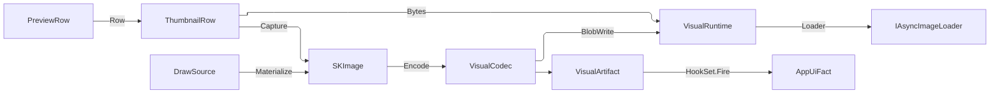

# [APPUI_VISUALS_OFFSCREEN]

Offscreen visuals are the package's raster pipeline: one `DrawSource` capsule projects every Skia canvas — host-leased or owned — through a `Fin`-returning `Use`, thumbnail and preview rows materialize as `SKImage` through host-agnostic capture arrows, one codec surface encodes and decodes with content-keyed `VisualArtifact` evidence, one narrowed `SKDocument` surface carries the pure-visual vector-print arm over the kernel sheet and plot owners, and one FFmpeg muxer drains a frame stream into H.264/MP4. Ownership spans the draw capsule, the capture row families, the encode axis with the ONE `ColorPolicy` gamut/transfer family, the vector-print arm, the video encode rows, and the `VisualArtifact` family the render-hash proof lanes and the AppHost telemetry spine consume. Document/Office/print export is `Document/export.md`'s — this page only rasters, encodes, and prints vectors. SkiaSharp behind Avalonia.Skia leases, AsyncImageLoader display, and PanAndZoom preview navigation form the package spine; HUD and viewport overlay drawing stays host-side.

Kernel vocabulary arrives whole and is composed, never re-spelled: `ContentHash`/`CanonicalWriter` (`Domain/identity`), `MonotonicTimeline` (`Parametric/projections`), `Custody`/`RedrivePolicy`/`Redrive`/`FaultBand`/`[FaultCase]`/`Fault` (`Domain/results`), `PerceptualColor` with `RgbProfile`/`RgbTransfer`/`GamutPolicy` (`Numerics/atoms`), and the sheet module `SheetSize`/`SheetOrientation`/`SheetMargin`/`SheetFrame`/`PlotPolicy`/`PenCode`/`LineWidth`/`LineGroup`/`TextHeight`/`PdfTrait` (`Drawing/sheet`).

## [01]-[INDEX]

- [02]-[DRAW_CAPSULE]: Borrowed and owned Skia canvas projection on one `Fin`; the FX vocabulary, the typed draw-role address, and the one token-resolve paint catalog.
- [03]-[THUMBNAIL_PIPELINE]: Host-agnostic capture rows, result-to-path preview rows, the blob-backed durable cache, async display.
- [04]-[ENCODE_IDENTITY]: Codec axis, the one gamut/transfer family over the kernel colour rows, content-keyed artifacts.
- [05]-[VECTOR_PRINT]: Narrowed pure-visual `SKDocument` vector-print arm over the kernel sheet and plot policy.
- [06]-[VIDEO_ENCODE]: FFmpeg mux/encode rows — an async frame stream to H.264/MP4.

## [02]-[DRAW_CAPSULE]

- Owner: `VisualFault` — the direct generated `[Union]` with one `[FaultCase]` leaf per capture failure; `DrawRole` and `FxKey` — the two typed draw-site address spaces; `CatalogAddress` — the closed miss-address union; `DrawSource` [Union]; `FxRow` [Union] the effect vocabulary; `FxEffect` [Union] the built native; `LayerGround` [Union], `GlyphCoverage`, and `LayerSpec` — the save-layer parameter surface; `EffectTokens`; `PaintSpec`; `PaintCatalog` — the one token-resolve fold; `Offscreen`.
- Cases: `DrawSource` = Borrowed | Owned; `FxRow` = Ground | Checker | Dashes; `FxEffect` = Shading | Imaging | Pathing | Coloring; `LayerGround` = Filtered | Previous; `GlyphCoverage` = Lcd | Grayscale; `CatalogAddress` = Role | Pigment | Effect; `VisualFault` = LeaseBound | IccInvalid | XpsUnavailable | EncodeFailed | SurfaceAllocationFailed | GamutUndeclared | TokenQuantized | CatalogMiss.
- Entry: `public Fin<T> Use<T>(Func<SKCanvas, Fin<T>> draw)` — `Fin` result; `public Fin<T> Layered<T>(PaintCatalog paints, LayerSpec spec, Func<SKCanvas, Fin<T>> draw)` — the same entry bracketed by the ONE save-layer site, its whole parameter surface carried as one admitted spec; `public static Fin<LayerSpec> Of(SKRect bounds, LayerGround ground, Option<DrawRole> composite, GlyphCoverage coverage)` — the mount admission; `public static Fin<PaintCatalog> Of(EffectTokens tokens, Seq<PaintSpec> specs)` — the one resolve.
- Auto: in-tree visuals lease the live canvas through `ISkiaSharpApiLeaseFeature.Lease` at render scope and fold to Borrowed; offscreen pipelines construct Owned with the target `SKImageInfo` and Materialize a snapshot; `Layered` opens `SaveLayer(in SKCanvasSaveLayerRec)` from the spec's own fold — a `Filtered` ground supplying the catalog's frozen filter to the `Backdrop` slot and a `Previous` ground taking `InitializeWithPrevious` instead — and restores on every exit path; `PaintCatalog.Of` folds every distinct `FxRow` a spec names into its native ONCE, mints one role paint per `PaintSpec` under the policy's one working space, and binds each spec's FX seq onto that single paint, the whole mint riding kernel `Custody.Rollback` over the LIVE catalog cell so a refused spec releases every native already minted through the one teardown ordering.
- Law: a pigment is addressed by the `Theme/tokens#TOKEN_CATALOG` `TokenKey` its generation minted, a paint by this catalog's own `DrawRole`, and an effect native by its own `FxKey` — three address spaces, three types, and the one miss case carries which space it names, so a draw site cannot address a paint by a colour name or an effect by a role name and `RULINGS.md:105`'s "under its own type" clause is realized rather than restated.
- Law: LCD glyph coverage is legal only over ground the layer actually composited opaquely, so `GlyphCoverage.Lcd` REFUSES at `LayerSpec.Of` under a `Filtered` ground — a blurred backdrop is never opaque, and fringing every glyph against content the layer never composited is the defect a caller flag could only document. The composite paint's own alpha stays the mount's fact, stated at its declaration.
- Packages: SkiaSharp, Avalonia.Skia, Thinktecture.Runtime.Extensions, LanguageExt.Core, Rasm (project — `FaultBand`/`[FaultCase]`/`Fault`, `Custody.Rollback`)
- Growth: a new effect kind is one `FxRow` case with its one `FxEffect` slot arm; a new frosted-surface treatment is one `FxRow.Ground` value; a new layer posture is one `LayerGround` case; a new painted role is one `PaintSpec` row; a new fault case is one `[FaultCase]` leaf; the in-tree vehicle is one `ICustomDrawOperation` implementation — `Bounds`, `HitTest(Point)`, `Render(ImmediateDrawingContext)` with the canvas leased through `ISkiaSharpApiLeaseFeature.Lease()` folding to Borrowed — zero new surface.
- Boundary: `Offscreen` is the named boundary capsule — the using-scoped `SKSurface` create-and-dispose pair is the only place a Skia surface is owned, and both entries bind ONE lease so the allocation refusal has one spelling; a Borrowed lease draws into the host's in-flight frame and never materializes, so Materialize folds that arm to the LeaseBound row; transforms compose as `SKMatrix` values inside `Save`/`Restore` scopes and no mutated canvas state survives a projection; a ground-sampling effect rides `Layered` and never a paint `ImageFilter` — a paint filter transforms the draw and leaves the ground untouched, so a frosted panel spelled that way silently renders as an unblurred overlay; `PaintCatalog` is the OWNER of the FX law — every effect native and every role paint mints once per theme generation into a value a draw reads, gradient stops enter through `SKColorF` pigments the policy's own gamut row projects, and a per-draw `new SKPaint()`, a per-draw effect construction, or an sRGB-lerped ramp is the deleted form; the catalog holds LIVE native maps, so it is a sealed class whose mint is its only writer and whose `Dispose` is the one teardown the rollback and the generation's end both reach (`RULINGS.md:136`); runtime-SkSL compilation partitions by TYPE DOMAIN and neither half lands here — `Render/shading#SHADER_ASSET` owns the per-`GpuBackend` appearance-shader cache and `Vfx/shader#EFFECT_PROGRAM` the 2D chrome program roster, and the parameters this catalogue freezes for a whole generation are exactly the ones neither cache holds; the custom-visual layout folds compose their projected `SKPath` through `Owned.Materialize` exactly as `PreviewRow.Render` does, so `Offscreen` stays the only Skia-surface owner; the GPU-accelerated offscreen path is the `Render/pipeline#RENDER_GRAPH` `GpuBackend` target-factory column, so an offscreen draw under the `Wgpu` row encodes through the `Silk.NET.WebGPU` surface and one under `Software` stays this `SKSurface.Create` CPU floor, the backend selection riding that one factory column and never a second offscreen-surface owner here.

```csharp
// --- [IMPORTS] -------------------------------------------------------------------------
using System.Collections.Frozen;
using LanguageExt;
using LanguageExt.Common;
using NodaTime;
using Rasm.Domain;
using Rasm.Drawing;
using Rasm.Numerics;
using Rasm.Parametric;
using Thinktecture;
using static LanguageExt.Prelude;

namespace Rasm.AppUi.Render;

// --- [TYPES] ---------------------------------------------------------------------------
[ValueObject<string>(SkipKeyMember = false)]
[KeyMemberEqualityComparer<ComparerAccessors.StringOrdinal, string>]
[KeyMemberComparer<ComparerAccessors.StringOrdinal, string>]
public sealed partial class DrawRole {
    static partial void ValidateFactoryArguments(ref ValidationError? validationError, ref string value) =>
        validationError = string.IsNullOrWhiteSpace(value)
            ? new ValidationError("DrawRole requires a non-empty draw-site role.")
            : null;
}

[ValueObject<string>(SkipKeyMember = false)]
[KeyMemberEqualityComparer<ComparerAccessors.StringOrdinal, string>]
public sealed partial class FxKey {
    static partial void ValidateFactoryArguments(ref ValidationError? validationError, ref string value) =>
        validationError = string.IsNullOrWhiteSpace(value)
            ? new ValidationError("FxKey requires a non-empty effect key.")
            : null;
}

[Union(ConversionFromValue = ConversionOperatorsGeneration.None)]
public abstract partial record CatalogAddress {
    private CatalogAddress() { }
    public sealed record Role(DrawRole Key) : CatalogAddress;
    public sealed record Pigment(TokenKey Key) : CatalogAddress;
    public sealed record Effect(FxKey Key) : CatalogAddress;

    public string Text => Switch(
        role: static r => r.Key.ToString(),
        pigment: static p => p.Key.ToString(),
        effect: static e => e.Key.ToString());
}

[SmartEnum<string>]
[KeyMemberEqualityComparer<ComparerAccessors.StringOrdinal, string>]
public sealed partial class GlyphCoverage {
    public static readonly GlyphCoverage Lcd = new(key: "lcd", flag: SKCanvasSaveLayerRecFlags.PreserveLcdText);
    public static readonly GlyphCoverage Grayscale = new(key: "grayscale", flag: SKCanvasSaveLayerRecFlags.None);
    public SKCanvasSaveLayerRecFlags Flag { get; }
}

// --- [ERRORS] --------------------------------------------------------------------------
[Union(ConversionFromValue = ConversionOperatorsGeneration.None)]
public abstract partial record VisualFault : Fault {
    private static readonly FaultBand FamilyBand = FaultBand.Visual;
    private VisualFault(string detail) { Detail = detail; }
    public string Detail { get; }
    public override string Message => Detail;

    [FaultCase(0)]
    public sealed partial record LeaseBound()
        : VisualFault("visuals/lease-bound: a borrowed host lease draws into the live frame and never materializes");
    [FaultCase(1)]
    public sealed partial record IccInvalid(string Key)
        : VisualFault($"visuals/icc-invalid: profile bytes for {Key} do not parse as an ICC profile");
    [FaultCase(2)]
    public sealed partial record XpsUnavailable()
        : VisualFault("visuals/xps-unavailable: the loaded Skia native carries no XPS backend on this platform");
    [FaultCase(3)]
    public sealed partial record EncodeFailed(string Stage)
        : VisualFault($"visuals/encode-failed: {Stage}");
    [FaultCase(4)]
    public sealed partial record SurfaceAllocationFailed(int Width, int Height)
        : VisualFault($"visuals/surface-allocation: {Width}x{Height}");
    [FaultCase(5)]
    public sealed partial record GamutUndeclared(string Key)
        : VisualFault($"visuals/gamut-undeclared: policy {Key} names no RgbProfile row a float pigment projects through");
    [FaultCase(6)]
    public sealed partial record TokenQuantized(string Key)
        : VisualFault($"visuals/token-quantized: an 8-bit sRGB token colour cannot widen into the {Key} working space");
    [FaultCase(7)]
    public sealed partial record CatalogMiss(CatalogAddress Address)
        : VisualFault($"visuals/catalog-miss: {Address.Text} is absent from the resolved paint catalog");
}

// --- [MODELS] --------------------------------------------------------------------------
[Union(ConversionFromValue = ConversionOperatorsGeneration.None)]
public abstract partial record DrawSource {
    private DrawSource() { }
    public sealed record Borrowed(ISkiaSharpApiLease Lease) : DrawSource;
    public sealed record Owned(SKImageInfo Info) : DrawSource;

    public Fin<T> Use<T>(Func<SKCanvas, Fin<T>> draw) => Switch(
        state: draw,
        borrowed: static (paint, source) => paint(source.Lease.SkCanvas),
        owned: static (paint, source) => Offscreen.Rent(source.Info, paint));

    public Fin<SKImage> Materialize(Func<SKCanvas, Fin<Unit>> draw) => Switch(
        state: draw,
        borrowed: static (_, _) => Fin<SKImage>.Fail(Offscreen.LeaseBound),
        owned: static (paint, source) => Offscreen.Snapshot(source.Info, paint));

    public Fin<T> Layered<T>(PaintCatalog paints, LayerSpec spec, Func<SKCanvas, Fin<T>> draw) =>
        spec.Rec(paints).Bind(rec => Use(canvas => {
            SKCanvasSaveLayerRec opened = rec;
            canvas.SaveLayer(in opened);
            try { return draw(canvas); }
            finally { canvas.Restore(); }
        }));
}

[Union(ConversionFromValue = ConversionOperatorsGeneration.None)]
public abstract partial record LayerGround {
    private LayerGround() { }
    public sealed record Filtered(FxRow.Ground Row) : LayerGround;
    public sealed record Previous() : LayerGround;

    public static readonly LayerGround Frosted = new Filtered(FxRow.Frosted);
    public static readonly LayerGround Acrylic = new Filtered(FxRow.Acrylic);
    public static readonly LayerGround Card = new Filtered(FxRow.Card);
    public static readonly LayerGround Copy = new Previous();
}

public sealed record LayerSpec {
    private LayerSpec(SKRect bounds, LayerGround ground, Option<DrawRole> composite, GlyphCoverage coverage) =>
        (Bounds, Ground, Composite, Coverage) = (bounds, ground, composite, coverage);

    public SKRect Bounds { get; }
    public LayerGround Ground { get; }
    public Option<DrawRole> Composite { get; }
    public GlyphCoverage Coverage { get; }

    public static Fin<LayerSpec> Of(SKRect bounds, LayerGround ground, Option<DrawRole> composite, GlyphCoverage coverage) =>
        ground is LayerGround.Filtered && ReferenceEquals(coverage, GlyphCoverage.Lcd)
            ? Fin.Fail<LayerSpec>(new VisualFault.EncodeFailed("layer/lcd-over-filtered: subpixel coverage demands ground the layer composited opaquely"))
            : Fin.Succ(new LayerSpec(bounds, ground, composite, coverage));

    public Fin<SKCanvasSaveLayerRec> Rec(PaintCatalog paints) =>
        from ground in Ground.Switch(
            state: paints,
            filtered: static (catalog, arm) => catalog.Backdrop(arm.Row).Map(Option<SKImageFilter>.Some),
            previous: static (_, _) => Fin.Succ(Option<SKImageFilter>.None))
        from composite in Composite.Match(
            Some: role => paints.Paint(role).Map(Option<SKPaint>.Some),
            None: () => Fin.Succ(Option<SKPaint>.None))
        select new SKCanvasSaveLayerRec {
            Bounds = Bounds,
            Backdrop = ground.ValueUnsafe(),
            Paint = composite.ValueUnsafe(),
            Flags = (ground.IsNone ? SKCanvasSaveLayerRecFlags.InitializeWithPrevious : SKCanvasSaveLayerRecFlags.None)
                | Coverage.Flag,
        };
}

[Union(ConversionFromValue = ConversionOperatorsGeneration.None)]
public abstract partial record FxRow(FxKey Key) {
    public sealed record Ground(FxKey Key, float Sigma, SKShaderTileMode Tile) : FxRow(Key);
    public sealed record Checker(FxKey Key, TokenKey Light, TokenKey Dark, int CellPx) : FxRow(Key);
    public sealed record Dashes(FxKey Key, ImmutableArray<float> Intervals, float Phase) : FxRow(Key);

    public static readonly Ground Frosted = new(FxKey.Create("frosted"), Sigma: 12f, Tile: SKShaderTileMode.Clamp);
    public static readonly Ground Acrylic = new(FxKey.Create("acrylic"), Sigma: 30f, Tile: SKShaderTileMode.Clamp);
    public static readonly Ground Card = new(FxKey.Create("card"), Sigma: 8f, Tile: SKShaderTileMode.Decal);
    public static readonly FxRow Check = new Checker(FxKey.Create("check"), Light: PaintRole.Surface.At(0), Dark: PaintRole.Surface.At(1), CellPx: 8);
    public static readonly FxRow Dashed = new Dashes(FxKey.Create("dashed"), [3f, 2f], Phase: 0f);

    public Fin<FxEffect> Build(EffectTokens tokens) => Switch(
        state: tokens,
        ground: static (_, g) => Fin.Succ<FxEffect>(
            new FxEffect.Imaging(SKImageFilter.CreateBlur(g.Sigma, g.Sigma, g.Tile))),
        checker: static (t, c) => t.Pigment(c.Light).Bind(light => t.Pigment(c.Dark).Bind(dark => Tiled(t, c, light, dark))),
        dashes: static (_, d) => Fin.Succ<FxEffect>(new FxEffect.Pathing(SKPathEffect.CreateDash([.. d.Intervals], d.Phase))));

    private static Fin<FxEffect> Tiled(EffectTokens tokens, Checker row, SKColorF light, SKColorF dark) =>
        Offscreen.Snapshot(
            new SKImageInfo(row.CellPx * 2, row.CellPx * 2, tokens.Policy.Surface, SKAlphaType.Premul).WithColorSpace(tokens.Working),
            canvas => {
                using SKPaint pale = new();
                using SKPaint deep = new();
                pale.SetColor(light, tokens.Working);
                deep.SetColor(dark, tokens.Working);
                float cell = row.CellPx;
                canvas.DrawRect(new SKRect(0f, 0f, cell, cell), pale);
                canvas.DrawRect(new SKRect(cell, cell, cell * 2f, cell * 2f), pale);
                canvas.DrawRect(new SKRect(cell, 0f, cell * 2f, cell), deep);
                canvas.DrawRect(new SKRect(0f, cell, cell, cell * 2f), deep);
                return Fin.Succ(unit);
            })
        .Map(static image => (FxEffect)new FxEffect.Shading(
            SKShader.CreateImage(image, SKShaderTileMode.Repeat, SKShaderTileMode.Repeat), Some(image)));
}

[Union(ConversionFromValue = ConversionOperatorsGeneration.None)]
public abstract partial record FxEffect {
    private FxEffect() { }
    public sealed record Shading(SKShader Native, Option<SKImage> Source) : FxEffect;
    public sealed record Imaging(SKImageFilter Native) : FxEffect;
    public sealed record Pathing(SKPathEffect Native) : FxEffect;
    public sealed record Coloring(SKColorFilter Native) : FxEffect;

    public SKPaint BindTo(SKPaint paint) => Switch(
        state: paint,
        shading: static (p, s) => { p.Shader = s.Native; return p; },
        imaging: static (p, i) => { p.ImageFilter = i.Native; return p; },
        pathing: static (p, e) => { p.PathEffect = e.Native; return p; },
        coloring: static (p, c) => { p.ColorFilter = c.Native; return p; });

    public Option<SKImageFilter> Ground => Switch(
        shading: static _ => Option<SKImageFilter>.None,
        imaging: static i => Some(i.Native),
        pathing: static _ => Option<SKImageFilter>.None,
        coloring: static _ => Option<SKImageFilter>.None);

    public Unit Release() => Switch(
        shading: static s => { s.Native.Dispose(); s.Source.Iter(static image => image.Dispose()); return unit; },
        imaging: static i => fun(i.Native.Dispose)(),
        pathing: static e => fun(e.Native.Dispose)(),
        coloring: static c => fun(c.Native.Dispose)());
}

public sealed record EffectTokens(int Generation, ResolvedTheme Theme, VisualCodec.ColorPolicy Policy, SKColorSpace Working) {
    public static EffectTokens Of(int generation, ResolvedTheme theme, VisualCodec.ColorPolicy policy) =>
        new(generation, theme, policy, policy.Working.Space());

    public Fin<SKColorF> Pigment(TokenKey key) =>
        (Theme.Paints.TryGetValue(out Color token) ? Some(token) : Option<Color>.None)
            .ToFin(new VisualFault.CatalogMiss(new CatalogAddress.Pigment()))
            .Bind(Policy.Resolve);
}

public sealed record PaintSpec(DrawRole Role, TokenKey Pigment, float StrokeWidth, SKPaintStyle Style, Seq<FxRow> Effects);

// --- [SERVICES] ------------------------------------------------------------------------
public sealed class PaintCatalog : IDisposable {
    private readonly Atom<HashMap<FxKey, FxEffect>> effects = Atom(HashMap<FxKey, FxEffect>());
    private readonly Atom<HashMap<DrawRole, SKPaint>> roles = Atom(HashMap<DrawRole, SKPaint>());

    private PaintCatalog(EffectTokens tokens) => Tokens = tokens;

    public EffectTokens Tokens { get; }

    public int Generation => Tokens.Generation;

    public static Fin<PaintCatalog> Of(EffectTokens tokens, Seq<PaintSpec> specs) {
        PaintCatalog held = new(tokens);
        return (from _built in specs.Bind(static spec => spec.Effects).Distinct()
                    .Traverse(row => row.Build(tokens).Map(effect => held.Bind(row.Key, effect))).As()
                from _minted in specs.Traverse(held.Mint).As()
                select held)
            .Rollback(held);
    }

    public Fin<SKPaint> Paint(DrawRole role) =>
        roles.Value.Find(role).ToFin(new VisualFault.CatalogMiss(new CatalogAddress.Role(role)));

    public Fin<SKImageFilter> Backdrop(FxRow.Ground row) =>
        effects.Value.Find(row.Key).Bind(static effect => effect.Ground)
            .ToFin(new VisualFault.CatalogMiss(new CatalogAddress.Effect(row.Key)));

    public void Dispose() {
        toSeq(roles.Value.Values).Iter(static paint => paint.Dispose());
        toSeq(effects.Value.Values).Iter(static effect => ignore(effect.Release()));
        Tokens.Working.Dispose();
        ignore(roles.Swap(static _ => HashMap<DrawRole, SKPaint>()));
        ignore(effects.Swap(static _ => HashMap<FxKey, FxEffect>()));
    }

    private Unit Bind(FxKey key, FxEffect effect) => ignore(effects.Swap(map => map.AddOrUpdate(effect)));

    private Fin<Unit> Mint(PaintSpec spec) =>
        Tokens.Pigment(spec.Pigment).Bind(pigment => {
            SKPaint paint = new() { Style = spec.Style, StrokeWidth = spec.StrokeWidth, IsAntialias = true };
            paint.SetColor(pigment, Tokens.Working);
            return spec.Effects
                .Traverse(row => effects.Value.Find(row.Key)
                    .ToFin(new VisualFault.CatalogMiss(new CatalogAddress.Effect(row.Key)))
                    .Map(effect => ignore(effect.BindTo(paint)))).As()
                .Map(_ => ignore(roles.Swap(map => map.AddOrUpdate(spec.Role, paint))));
        });
}

// --- [OPERATIONS] ----------------------------------------------------------------------
public static class Offscreen {
    public static readonly VisualFault LeaseBound = new VisualFault.LeaseBound();

    public static Fin<T> Rent<T>(SKImageInfo info, Func<SKCanvas, Fin<T>> draw) =>
        Lease(info).Bind(surface => { using SKSurface scoped = surface; return draw(scoped.Canvas); });

    public static Fin<SKImage> Snapshot(SKImageInfo info, Func<SKCanvas, Fin<Unit>> draw) =>
        Lease(info).Bind(surface => {
            using SKSurface scoped = surface;
            return draw(scoped.Canvas).Map(_ => scoped.Snapshot());
        });

    private static Fin<SKSurface> Lease(SKImageInfo info) =>
        Optional(SKSurface.Create(info))
            .ToFin(new VisualFault.SurfaceAllocationFailed(info.Width, info.Height));
}
```

Every row below is minted by `FxRow.Build` at token resolve and bound by `PaintCatalog`; the producer column names the fence that binds it.

| [INDEX] | [FX_CASE] | [VALUES]                 | [NATIVE]                   | [PRODUCER]                                  |
| :-----: | :-------- | :----------------------- | :------------------------- | :------------------------------------------ |
|  [01]   | `Ground`  | frosted · acrylic · card | `SKImageFilter.CreateBlur` | `LayerGround.Filtered` backdrop arm         |
|  [02]   | `Checker` | check                    | `SKShader.CreateImage`     | `BackplateRow.Checkerboard` preview ground  |
|  [03]   | `Dashes`  | dashed                   | `SKPathEffect.CreateDash`  | `Render/drafting#DRAFT_EMIT` edge-style set |

## [03]-[THUMBNAIL_PIPELINE]

- Owner: `VisualRuntime` — the injected boundary row every arm on this page threads; `ThumbnailUse` and `DisplayScale` — the two axes of the variant product; `ThumbnailVariant` — their derived product; `ThumbnailIntake` — the durable-cache posture; `ThumbnailSource`; `ThumbnailRow` — the capture row and the ONE authority for its blob address; `BackplateRow`; `PreviewRow<TValue>`; `PreviewSurfaces` — the page's `PaintSpec` rows.
- Cases: `ThumbnailUse` = list | gallery, each carrying its base pixel extent; `DisplayScale` = standard | retina, each carrying its factor; `ThumbnailIntake` = reuse | rebuild; `BackplateRow` = checkerboard | solid | transparent.
- Entry: `public IO<VisualArtifact> Refresh(VisualRuntime runtime, ThumbnailVariant variant)` — the forced capture-and-encode on the `IO` effect; `public IO<ReadOnlyMemory<byte>> Bytes(VisualRuntime runtime, ThumbnailVariant variant, ThumbnailIntake intake)` — the durable-cache read whose miss folds to `Refresh`; `public string BlobKey(ThumbnailVariant variant)` — the ONE blob-address authority; `public Fin<SKImage> Render(PaintCatalog paints, TValue value, SKImageInfo info)` — the preview raster on `Fin`; `public ThumbnailRow Row(DrawRole key, ThumbnailSource source, TValue value, PaintCatalog paints, EncodeRow encode, DataClassification classification)` — the preview-to-capture wire, so a Compute result preview IS a gallery thumbnail rather than a second raster path.
- Auto: a capture arrow is bound per host at the app root — the rhino row binds `ViewCapture.CaptureToBitmap`, the gh2 row the host canvas snapshot, and the owned row `PreviewRow.Render` through `DrawSource.Owned`; display binds `AdvancedImage` to the runtime `Loader` with `FallbackImage` resolved from the row's placeholder and error keys; variant selection picks the product member whose `Scale` matches the mounted surface's scale fact; `PixelSize` DERIVES as the use's base extent times the scale factor, so a retuned base moves both variants and no row re-states the multiplication; zoomable previews mount inside `ZoomBorder` with `AutoFit` on load and `ZoomToRectangle` bound to the gesture rows.
- Law: the blob address has ONE producer. `BlobKey` composes the source, the row key, the variant key, the derived pixel extent, and the encode row's OWN extension — so the `.png` literal beside `EncodeRow.Png` and every consumer-side re-spelling of the same path delete onto it.
- Output: every refresh lands one `VisualArtifact` of kind `ArtifactKind.Thumbnail` carrying the blob artifact key as its destination.
- Packages: AsyncImageLoader.Avalonia, SkiaSharp, PanAndZoom, Thinktecture.Runtime.Extensions, Rasm.AppHost (project), Rasm (project — `MonotonicTimeline`, `RedrivePolicy`), LanguageExt.Core, NodaTime
- Growth: one thumbnail row admits a new visual family; one `ThumbnailUse` row retunes a base extent and one `DisplayScale` row a factor, the product following both; a new preview family is one `PreviewRow` binding its Project fold; a new ground is one `BackplateRow` value plus its one `PaintSpec`; zero new surface.
- Boundary: the memory cache is the `RamCachedWebImageLoader`-backed `Loader` and the durable cache is the blob lane behind `BlobWrite`/`BlobRead` — the read is the cache-first arm `Bytes` takes, so the durable half is REACHED rather than declared, and admitting `DiskCachedWebImageLoader` creates a second durable owner and is rejected. A durable MISS is `Option.None`, not an IO failure — absence and a broken lane are two facts and a carrier that fused them made every cold thumbnail read as an error. Host bitmaps convert to `SKImage` exactly once at the port edge, and no Eto or RhinoCommon bitmap type crosses into rows. `Render` is the named path-scope boundary capsule — the projected `SKPath` is using-scoped and never outlives the fold; the ground and the stroke are CATALOG reads, so a preview mints no paint and no effect at draw time and the transparent row draws nothing rather than filling with a sentinel colour; HUD and viewport overlays stay host-side, and `TValue` stays generic so no Compute result shape is re-modeled here. `VisualRuntime` carries the kernel `MonotonicTimeline`, the AppUi fact dispatch, and the producer `Op`; `BlobWrite`, `BundleWrite`, and `Measure` bind durable artifacts, support evidence, and named duration to the existing AppHost ports, and `Redrive` is the one policy value the boundary writes on this page re-drive under.

```csharp
// --- [TYPES] ---------------------------------------------------------------------------
[SmartEnum<string>]
[KeyMemberEqualityComparer<ComparerAccessors.StringOrdinal, string>]
public sealed partial class ThumbnailSource {
    public static readonly ThumbnailSource Rhino = new(key: "rhino");
    public static readonly ThumbnailSource Grasshopper = new(key: "grasshopper");
    public static readonly ThumbnailSource Owned = new(key: "owned");
}

[SmartEnum<string>]
[KeyMemberEqualityComparer<ComparerAccessors.StringOrdinal, string>]
public sealed partial class ThumbnailUse {
    public static readonly ThumbnailUse List = new(key: "list", basePx: 128);
    public static readonly ThumbnailUse Gallery = new(key: "gallery", basePx: 256);
    public int BasePx { get; }
}

[SmartEnum<string>]
[KeyMemberEqualityComparer<ComparerAccessors.StringOrdinal, string>]
public sealed partial class DisplayScale {
    public static readonly DisplayScale Standard = new(key: "standard", factor: 1d);
    public static readonly DisplayScale Retina = new(key: "retina", factor: 2d);
    public double Factor { get; }
}

public readonly record struct ThumbnailVariant(ThumbnailUse Use, DisplayScale Scale) {
    public static readonly ThumbnailVariant List = new(ThumbnailUse.List, DisplayScale.Standard);
    public static readonly ThumbnailVariant ListRetina = new(ThumbnailUse.List, DisplayScale.Retina);
    public static readonly ThumbnailVariant Gallery = new(ThumbnailUse.Gallery, DisplayScale.Standard);
    public static readonly ThumbnailVariant GalleryRetina = new(ThumbnailUse.Gallery, DisplayScale.Retina);

    public static Seq<ThumbnailVariant> Items =>
        toSeq(from use in ThumbnailUse.Items from scale in DisplayScale.Items select new ThumbnailVariant(use, scale));

    public string Key => ReferenceEquals(Scale, DisplayScale.Standard) ? Use.Key : $"{Use.Key}-{Scale.Key}";

    public int PixelSize => (int)Math.Round(Use.BasePx * Scale.Factor);
}

[SmartEnum<string>]
[KeyMemberEqualityComparer<ComparerAccessors.StringOrdinal, string>]
public sealed partial class ThumbnailIntake {
    public static readonly ThumbnailIntake Reuse = new(key: "reuse", reuses: true);
    public static readonly ThumbnailIntake Rebuild = new(key: "rebuild", reuses: false);
    public bool Reuses { get; }
}

[SmartEnum<string>]
[KeyMemberEqualityComparer<ComparerAccessors.StringOrdinal, string>]
public sealed partial class BackplateRow {
    public static readonly BackplateRow Checkerboard = new(key: "checkerboard", role: Some(PreviewSurfaces.BackplateCheck));
    public static readonly BackplateRow Solid = new(key: "solid", role: Some(PreviewSurfaces.BackplateSolid));
    public static readonly BackplateRow Transparent = new(key: "transparent", role: Option<DrawRole>.None);
    public Option<DrawRole> Role { get; }
}

// --- [MODELS] --------------------------------------------------------------------------
public sealed record ThumbnailRow(
    string Key,
    ThumbnailSource Source,
    Func<ThumbnailVariant, IO<SKImage>> Capture,
    EncodeRow Encode,
    DataClassification Classification,
    string PlaceholderKey,
    string ErrorKey) {
    public string BlobKey(ThumbnailVariant variant) =>
        $"thumbnails/{Source.Key}/{Key}/{variant.Key}@{variant.PixelSize}{Encode.Extension}";

    public IO<VisualArtifact> Refresh(VisualRuntime runtime, ThumbnailVariant variant) =>
        Capture(variant).Bracket(
            image => VisualCodec.Encode(runtime, image, Encode, ArtifactKind.Thumbnail, BlobKey(variant)),
            static image => IO.lift(() => { image.Dispose(); return unit; }));

    public IO<ReadOnlyMemory<byte>> Bytes(VisualRuntime runtime, ThumbnailVariant variant, ThumbnailIntake intake) =>
        from held in intake.Reuses ? runtime.BlobRead(BlobKey(variant)) : IO.pure(Option<ReadOnlyMemory<byte>>.None)
        from bytes in held.Match(
            Some: IO.pure,
            None: () => Refresh(runtime, variant).Bind(_ => runtime.BlobRead(BlobKey(variant)).Bind(written => written.Match(
                Some: IO.pure,
                None: () => IO.fail<ReadOnlyMemory<byte>>(
                    new VisualFault.EncodeFailed($"thumbnail/blob-absent:{BlobKey(variant)}"))))))
        select bytes;
}

public sealed record PreviewRow<TValue>(
    DrawRole Key,
    Func<TValue, Fin<SKPath>> Project,
    BackplateRow Backplate,
    DrawRole Stroke) {
    public Fin<SKImage> Render(PaintCatalog paints, TValue value, SKImageInfo info) =>
        Project(value).Bind(path => {
            using SKPath scoped = path;
            return paints.Paint(Stroke).Bind(stroke => new DrawSource.Owned(info).Materialize(canvas =>
                Backplate.Role
                    .Match(
                        Some: role => paints.Paint(role).Map(ground => {
                            canvas.DrawRect(new SKRect(0f, 0f, info.Width, info.Height), ground);
                            return unit;
                        }),
                        None: static () => Fin.Succ(unit))
                    .Map(_ => {
                        canvas.DrawPath(scoped, stroke);
                        return unit;
                    })));
        });

    public ThumbnailRow Row(string key, ThumbnailSource source, TValue value, PaintCatalog paints, EncodeRow encode, DataClassification classification) =>
        new(source,
            variant => IO.lift(() => Render(paints, value, Info(paints, variant))),
            encode, classification, PlaceholderKey: $"{Key}/placeholder", ErrorKey: $"{Key}/error");

    private static SKImageInfo Info(PaintCatalog paints, ThumbnailVariant variant) =>
        new SKImageInfo(variant.PixelSize, variant.PixelSize, paints.Tokens.Policy.Surface, SKAlphaType.Premul)
            .WithColorSpace(paints.Tokens.Working);
}

// --- [SERVICES] ------------------------------------------------------------------------
public sealed record VisualRuntime(
    CorrelationId Correlation,
    ProfileRoots Roots,
    MonotonicTimeline Line,
    RedrivePolicy Redrive,
    IAsyncImageLoader Loader,
    Func<string, ReadOnlyMemory<byte>, IO<string>> BlobWrite,
    Func<string, IO<Option<ReadOnlyMemory<byte>>>> BlobRead,
    Func<string, DataClassification, ReadOnlyMemory<byte>, IO<string>> BundleWrite,
    HookSet<AppUiPoint, AppUiFact, TelemetrySource> Facts,
    Func<InstrumentSpec, string, Duration, IO<Unit>> Measure) {
    public IO<VisualArtifact> Publish(VisualArtifact artifact) =>
        IO.lift(() => Facts.Fire(
                at: AppUiPoint.Render,
                fact: new AppUiFact.Render(
                    artifact.Kind.Value, artifact.Format, artifact.FrameHash, artifact.DrawHash, artifact.Pixels,
                    (ulong)artifact.Bytes, artifact.Elapsed, artifact.ColorSpace, artifact.Destination),
                key: FactOp))
            .Map(_ => artifact);
}

// --- [COMPOSITION] ---------------------------------------------------------------------
public static class PreviewSurfaces {
    public static readonly DrawRole BackplateCheck = DrawRole.Create("backplate-check");
    public static readonly DrawRole BackplateSolid = DrawRole.Create("backplate-solid");
    public static readonly DrawRole PreviewCurve = DrawRole.Create("preview-curve");

    public static readonly Seq<PaintSpec> Paints = Seq(
        new PaintSpec(BackplateCheck, PaintRole.Surface.At(0), 0f, SKPaintStyle.Fill, Seq(FxRow.Check)),
        new PaintSpec(BackplateSolid, PaintRole.Surface.At(0), 0f, SKPaintStyle.Fill, Seq<FxRow>()),
        new PaintSpec(PreviewCurve, PaintRole.Text.At(0), 1.5f, SKPaintStyle.Stroke, Seq<FxRow>()));
}
```



## [04]-[ENCODE_IDENTITY]

- Owner: `ArtifactKind` — the typed artifact-kind address every produced artifact carries; `VisualArtifact` with its ONE mint; `PixelIdentity`; `NativeAssetFact`; `VisualCodec` — the encode/decode axis; `ColorFrame` and `ColorPolicy` — the suite gamut-and-transfer family over the kernel colour rows; `ToneMap`; `EncodeRow`; `DecodePlan`.
- Cases: `ColorFrame` = Rostered | Icc — a kernel `(RgbProfile, RgbTransfer)` coordinate or the profile BYTES that are their own space; `DecodePlan` = Frame | Incremental.
- Entry: `public static IO<VisualArtifact> Encode(VisualRuntime runtime, SKImage image, EncodeRow row, ArtifactKind kind, string key, Option<SKPicture> record = default)` — IO effect, the optional sealed record the one draw-hash ingress; `public static IO<SKImage> Decode(ReadOnlyMemory<byte> payload, Option<int> frame = default)` — the inverse on the same effect, frame index the modality; `public Fin<SKColorF> Resolve(PerceptualColor pigment)` and its `Color` token twin — the one pigment egress every paint reads; `public static VisualArtifact Of(ArtifactKind kind, string format, ReadOnlySpan<byte> payload, …)` — the ONE artifact mint, which hashes the payload it is handed.
- Output: `FrameHash` is the kernel `UInt128` content key over the encoded artifact bytes, minted INSIDE `VisualArtifact.Of` so no producer can return a key over different bytes; `DrawHash` keys sealed `SKPicture.Serialize` bytes when a recording exists; `Pixels` identifies tight top-left RGBA8 sRGB straight-alpha rows independently of encoding; `ColorSpace` retains encode-row provenance beside normalized pixel identity.
- Packages: SkiaSharp, SkiaSharp.NativeAssets.macOS, SkiaSharp.NativeAssets.Linux.NoDependencies, Rasm.AppHost (project), Rasm (project — `ContentHash.Of`/`CanonicalWriter` under `EpsilonPolicy.ZeroTolerance`, the `RgbProfile`/`RgbTransfer`/`GamutPolicy` rows every `ColorFrame` names, the `PerceptualColor.OfRgb`/`ToRgb(profile, gamut, transfer)` admission-and-egress pair, `MonotonicTimeline`, `Redrive`), NodaTime, LanguageExt.Core, Thinktecture.Runtime.Extensions
- Growth: one encode row admits a format; one policy value retunes quality; one `ColorPolicy` row is a `(profile, transfer, domain, surface, tone)` coordinate over the kernel rows, so a gamut the kernel roster lacks lands THERE first; one `ToneMap` row admits an HDR-to-SDR operator; an ICC-profiled output is one `ColorFrame.Icc` value from a profile-byte source — zero new surface.
- Boundary: Decode and Encode are the named native-disposal boundary capsules — Decode admits through the `SKCodec.Create` result taxonomy (`Info`-gated allocation, `IncompleteInput` as partial success gated on the incremental arm's own rows-decoded count, the frame arm through `SKCodecOptions.FrameIndex` alone) and never an eager whole-image `SKBitmap.Decode`; `PriorFrame` is a PROMISE that the destination already holds that frame and this buffer is minted per call, so the codec resolves its own required-frame chain and a caller-named prior frame is the deleted form that composites over uninitialized memory; the intermediate `SKBitmap`, the minted reprojection, and the encoded `SKData` are scope-released so a failing later clause never leaks a native handle; Encode BORROWS the caller's image, disposing only the projection `Reproject` mints and never the pass-through original, so a walkthrough frame encoded per-frame survives to its later clip mux; per-format exporter classes are deleted with the encode rows as the absorbing axis; `VisualArtifact.Elapsed`, `Bytes`, and `FrameHash` project through `VisualRuntime.Publish` onto `AppUiFact.Render` at `AppUiPoint.Render`, so the producer returns the artifact while the hook dispatch owns durable observation; the blob write re-drives under the runtime's own `RedrivePolicy`, so a transient lane fault costs a bounded re-offer rather than a lost artifact and a terminal one refuses once; render-hash proof lanes compare `FrameHash` values rendered on Skia-backed headless rows where `UseHeadlessDrawing` false selects real Skia drawing.
- Color law, float end to end:
  - A policy row is a COORDINATE in the kernel's already-declared space, transfer, and domain axes (`Numerics/atoms.md` binds AppUi by name): `Working` and `Output` are each a `ColorFrame`, `Domain` is the `GamutPolicy` row bounding every egress, and the Skia `SKColorSpace` values DERIVE from one profile-to-primaries correspondence — the two `Func<SKColorSpace>` columns the prior shape carried WERE the fourth axis that law forbids.
  - Every pigment egress names its transfer AND its domain: `ToRgb` defaults to `RgbTransfer.Encoded` under `GamutPolicy.Perceptual`, so the prior one-argument call silently companded and perceptually bounded every wide-gamut pigment, defeating this page's own float law at the exact rows that needed `Linear` under `Unbounded`.
  - `SKColorSpace.Equal` is the only color-space identity test — reference equality passes distinct handles describing one space, and a null space means passthrough, fast and exactly wrong for evidence; an untagged source is INTERPRETED in the row's working space rather than assumed sRGB.
  - Ownership is the result shape: `Reproject` returns `Fin<Option<SKImage>>` where `None` states the caller's image is already conformant and stays caller-owned while `Some` carries the minted projection its consumer owns and disposes, so the identity arm can never route a borrowed image into an owned-resource `using`.
  - Byte `SKColor` paths that assume sRGB and quantize before conversion are the deleted form; the byte token edge is a typed REFUSAL, never a widen — an Avalonia `Color` carries 8-bit sRGB display-referred channels by construction, so widening one into `DisplayP3`, `Rec2020`, or `Rec2100Pq` would label a quantized sRGB shadow as wide-gamut colour.
  - `ColorPolicy` is THE single suite-wide gamut/transfer vocabulary — the six rows are the one family; the custom-visual plane reads the rows DIRECTLY through its style's `EncodeRow` (`Charts/custom.md` deleted its keyed `ColorSpaceAxis` projection onto this family), never a parallel enum with divergent membership; the `VisualArtifact.ColorSpace` tag is one of the family keys so a cross-host byte swap is attributable to the exact gamut.
  - HDR tone-mapping is the `Option<ToneMap>` column — the `Aces`/`Reinhard`/`HableFilmic` curves are pure float operators sampled ONCE per row into a 256-entry table bound onto the reproject paint through `SKColorFilter.CreateTable`, so a scene-referred Rec.2020-PQ render tone-maps to the SDR output gamut in one filter pass; absence is the option, so the identity curve no arm invokes has no row to be misread from.
  - Two forms delete beside that column: a per-pixel managed tone-map loop and a second display-mapping owner; the `HdrPq` row carries the `Aces` operator so an HDR baseline keys distinctly and its SDR projection is reproducible.
  - `ColorFrame.Icc` owns ICC profile management — the row retains the immutable profile BYTES rather than one shared space, so working and output each mint an independently owned `SKColorSpace` its own consumer disposes and a display-calibrated profile drives the reproject without a seventh roster row; an unparseable profile folds to the `icc-invalid` row rather than a silent sRGB fallback, and the ICC lane names no kernel profile at all, so `Resolve` refuses there instead of projecting through a nearest-declared-row fiction. An ICC-bound working space crosses to the perceptual owner as those same bytes through `IccConfiguration(byte[], Intent, name)`, the one currency both runtimes admit.
  - OpenColorIO configs cross the boundary as a profile-byte source the caller resolves, so AppUi consumes the bytes and never embeds an OCIO runtime; device-CMYK print transforms are `Document/export#PRINT_ARM`'s lcmsNET charter, disjoint from this display-referred family.

```csharp
// --- [TYPES] ---------------------------------------------------------------------------
[ValueObject<string>(SkipKeyMember = false)]
[KeyMemberEqualityComparer<ComparerAccessors.StringOrdinal, string>]
public sealed partial class ArtifactKind {
    public static readonly ArtifactKind Thumbnail = Create("thumbnail");
    public static readonly ArtifactKind Document = Create("document");
    public static readonly ArtifactKind Clip = Create("clip");

    static partial void ValidateFactoryArguments(ref ValidationError? validationError, ref string value) =>
        validationError = string.IsNullOrWhiteSpace(value)
            ? new ValidationError("ArtifactKind requires a non-empty artifact kind.")
            : null;
}

[Union(ConversionFromValue = ConversionOperatorsGeneration.None)]
public abstract partial record DecodePlan {
    private DecodePlan() { }
    public sealed record Frame(int Index) : DecodePlan;
    public sealed record Incremental() : DecodePlan;
}

// --- [MODELS] --------------------------------------------------------------------------
public sealed record VisualArtifact(
    ArtifactKind Kind,
    string Format,
    UInt128 FrameHash,
    Option<UInt128> DrawHash,
    Option<PixelIdentity> Pixels,
    long Bytes,
    Duration Elapsed,
    CorrelationId Correlation,
    Option<string> Destination,
    string ColorSpace) {
    public static VisualArtifact Of(
        ArtifactKind kind, string format, ReadOnlySpan<byte> payload, Option<UInt128> draw, Option<PixelIdentity> pixels,
        Duration elapsed, CorrelationId correlation, Option<string> destination, string colorSpace) =>
        new(kind, format, ContentHash.Of(payload), draw, pixels, payload.Length, elapsed, correlation, destination, colorSpace);
}

public sealed record PixelIdentity {
    public const string CanonicalVersion = "rgba8-srgb-straight-top-left-v2";

    private PixelIdentity(int width, int height, UInt128 hash) =>
        (Width, Height, Hash) = (width, height, hash);

    public int Width { get; }
    public int Height { get; }
    public UInt128 Hash { get; }

    public static Fin<PixelIdentity> Admit(int width, int height, UInt128 hash) =>
        width > 0 && height > 0
            ? Fin.Succ(new PixelIdentity(width, height, hash))
            : Fin.Fail<PixelIdentity>(new KernelFault.InvalidInput(Axis: Some($"canonical pixel extent {width}x{height}")));

    public static Fin<PixelIdentity> Of(SKImage image) {
        using SKColorSpace srgb = SKColorSpace.CreateSrgb();
        SKImageInfo info = new SKImageInfo(
            image.Width, image.Height, SKColorType.Rgba8888, SKAlphaType.Unpremul).WithColorSpace(srgb);
        using SKBitmap canonical = new(info);
        using SKPixmap? pixels = canonical.PeekPixels();
        if (pixels is null
            || canonical.RowBytes != info.RowBytes
            || !image.ReadPixels(pixels, 0, 0, SKImageCachingHint.Disallow)) {
            return Fin.Fail<PixelIdentity>(new VisualFault.EncodeFailed("pixels/canonical: readback refused"));
        }
        UInt128 digest = ContentHash.Of(
            (Info: info, Pixels: canonical),
            static (state, writer) => writer
                .String(CanonicalVersion)
                .Ordinal(state.Info.Width)
                .Ordinal(state.Info.Height)
                .Raw(state.Pixels.GetPixelSpan()),
            tolerance: EpsilonPolicy.ZeroTolerance);
        return Fin.Succ(new PixelIdentity(info.Width, info.Height, digest));
    }
}

public sealed record NativeAssetFact(string Library, Option<string> Version, string Path, string Rid);

// --- [SERVICES] ------------------------------------------------------------------------
public static class VisualCodec {

    public static readonly EncodeRow Png = new("png", SKEncodedImageFormat.Png, 100, ColorPolicy.Display);
    public static readonly EncodeRow Jpeg = new("jpeg", SKEncodedImageFormat.Jpeg, 90, ColorPolicy.Display);
    public static readonly EncodeRow Webp = new("webp", SKEncodedImageFormat.Webp, 90, ColorPolicy.Display);
    public static readonly EncodeRow PngWide = new("png-wide", SKEncodedImageFormat.Png, 100, ColorPolicy.WideGamut);
    public static readonly EncodeRow PngP3 = new("png-p3", SKEncodedImageFormat.Png, 100, ColorPolicy.DisplayP3);
    public static readonly EncodeRow PngRec2020 = new("png-rec2020", SKEncodedImageFormat.Png, 100, ColorPolicy.Rec2020);
    public static readonly EncodeRow PngScrgb = new("png-scrgb", SKEncodedImageFormat.Png, 100, ColorPolicy.ScrgbFloat);
    public static readonly EncodeRow PngHdr = new("png-hdr", SKEncodedImageFormat.Png, 100, ColorPolicy.HdrPq);

    static readonly FrozenDictionary<RgbProfile, (SKColorSpaceXyz Primaries, SKColorSpaceTransferFn Encoded)> Spaces =
        new KeyValuePair<RgbProfile, (SKColorSpaceXyz, SKColorSpaceTransferFn)>[] {
            new(RgbProfile.Srgb, (SKColorSpaceXyz.Srgb, SKColorSpaceTransferFn.Srgb)),
            new(RgbProfile.DisplayP3, (SKColorSpaceXyz.DisplayP3, SKColorSpaceTransferFn.Srgb)),
            new(RgbProfile.Rec2020, (SKColorSpaceXyz.Rec2020, SKColorSpaceTransferFn.Srgb)),
            new(RgbProfile.Rec2100Pq, (SKColorSpaceXyz.Rec2020, SKColorSpaceTransferFn.Pq)),
        }.ToFrozenDictionary();

    [Union(ConversionFromValue = ConversionOperatorsGeneration.None)]
    public abstract partial record ColorFrame {
        private ColorFrame() { }
        public sealed record Rostered(RgbProfile Profile, RgbTransfer Transfer) : ColorFrame;
        public sealed record Icc(ReadOnlyMemory<byte> Bytes) : ColorFrame;

        public static ColorFrame Of(RgbProfile profile, RgbTransfer transfer) => new Rostered(profile, transfer);

        public SKColorSpace Space() => Switch(
            rostered: static row => ReferenceEquals(row.Transfer, RgbTransfer.Linear)
                ? SKColorSpace.CreateRgb(SKColorSpaceTransferFn.Linear, Spaces[row.Profile].Primaries)
                : SKColorSpace.CreateRgb(Spaces[row.Profile].Encoded, Spaces[row.Profile].Primaries),
            icc: static row => SKColorSpace.CreateIcc(row.Bytes.Span)!);

        public Option<RgbProfile> Profile => Switch(
            rostered: static row => Some(row.Profile),
            icc: static _ => Option<RgbProfile>.None);

        public Option<RgbTransfer> Transfer => Switch(
            rostered: static row => Some(row.Transfer),
            icc: static _ => Option<RgbTransfer>.None);
    }

    public sealed record ColorPolicy(string Key, ColorFrame Working, ColorFrame Output, GamutPolicy Domain, SKColorType Surface, Option<ToneMap> Tone) {
        public static readonly ColorPolicy Display = new("srgb",
            ColorFrame.Of(RgbProfile.Srgb, RgbTransfer.Encoded), ColorFrame.Of(RgbProfile.Srgb, RgbTransfer.Encoded),
            GamutPolicy.Perceptual, SKColorType.Rgba8888, None);
        public static readonly ColorPolicy WideGamut = new("srgb-linear",
            ColorFrame.Of(RgbProfile.Srgb, RgbTransfer.Linear), ColorFrame.Of(RgbProfile.Srgb, RgbTransfer.Encoded),
            GamutPolicy.Unbounded, SKColorType.RgbaF16, None);
        public static readonly ColorPolicy DisplayP3 = new("display-p3",
            ColorFrame.Of(RgbProfile.DisplayP3, RgbTransfer.Encoded), ColorFrame.Of(RgbProfile.DisplayP3, RgbTransfer.Encoded),
            GamutPolicy.Perceptual, SKColorType.Rgba8888, None);
        public static readonly ColorPolicy Rec2020 = new("rec2020",
            ColorFrame.Of(RgbProfile.Rec2020, RgbTransfer.Encoded), ColorFrame.Of(RgbProfile.Rec2020, RgbTransfer.Encoded),
            GamutPolicy.Perceptual, SKColorType.Rgba8888, None);
        public static readonly ColorPolicy ScrgbFloat = new("scrgb-float",
            ColorFrame.Of(RgbProfile.Srgb, RgbTransfer.Linear), ColorFrame.Of(RgbProfile.Srgb, RgbTransfer.Linear),
            GamutPolicy.Unbounded, SKColorType.RgbaF16, None);
        public static readonly ColorPolicy HdrPq = new("rec2020-pq",
            ColorFrame.Of(RgbProfile.Rec2100Pq, RgbTransfer.Encoded), ColorFrame.Of(RgbProfile.Rec2020, RgbTransfer.Encoded),
            GamutPolicy.Unbounded, SKColorType.RgbaF16, Some(ToneMap.Aces));

        public Fin<SKColorF> Resolve(PerceptualColor pigment) =>
            (Working.Profile, Working.Transfer) switch {
                ({ IsSome: true, Case: RgbProfile profile }, { IsSome: true, Case: RgbTransfer transfer }) =>
                    pigment.ToRgb(profile, Some(Domain), Some(transfer)) switch {
                        var (red, green, blue, alpha) =>
                            Fin.Succ(new SKColorF((float)red, (float)green, (float)blue, (float)alpha)),
                    },
                _ => Fin.Fail<SKColorF>(new VisualFault.GamutUndeclared(Key)),
            };

        public Fin<SKColorF> Resolve(Color token) =>
            Working.Profile.ToFin(new VisualFault.GamutUndeclared(Key))
                .Bind(profile => ReferenceEquals(profile, RgbProfile.Srgb)
                    ? PerceptualColor.OfRgb(token.R, token.G, token.B, token.A / (double)byte.MaxValue)
                    : Fin.Fail<PerceptualColor>(new VisualFault.TokenQuantized(Key)))
                .Bind(Resolve);

        public static Fin<ColorPolicy> FromIcc(string key, ReadOnlyMemory<byte> profile, SKColorType surface) {
            ReadOnlyMemory<byte> bytes = profile.ToArray();
            using SKColorSpace? probe = SKColorSpace.CreateIcc(bytes.Span);
            return probe is null
                ? Fin.Fail<ColorPolicy>(new VisualFault.IccInvalid())
                : Fin.Succ(new ColorPolicy(new ColorFrame.Icc(bytes), new ColorFrame.Icc(bytes), GamutPolicy.Perceptual, surface, None));
        }

        public Fin<Option<SKImage>> Reproject(SKImage image) {
            using SKColorSpace working = Working.Space();
            using SKColorSpace target = Output.Space();
            using SKColorFilter? tone = Tone.Match(Some: static row => row.Filter(), None: static () => null);
            SKColorSpace source = Optional(image.ColorSpace).IfNone(working);
            return SKColorSpace.Equal(source, target) && tone is null
                ? Fin.Succ(Option<SKImage>.None)
                : Offscreen.Snapshot(
                    new SKImageInfo(image.Width, image.Height, Surface, SKAlphaType.Premul).WithColorSpace(target),
                    canvas => {
                        using SKPaint paint = new() { ColorFilter = tone };
                        canvas.DrawImage(image, 0f, 0f, paint);
                        return Fin.Succ(unit);
                    }).Map(Some);
        }
    }

    [SmartEnum<string>]
    [KeyMemberEqualityComparer<ComparerAccessors.StringOrdinal, string>]
    public sealed partial class ToneMap {
        public static readonly ToneMap Reinhard = new(key: "reinhard", curve: static x => x / (1f + x));
        public static readonly ToneMap Aces = new(key: "aces",
            curve: static x => Math.Clamp((x * ((2.51f * x) + 0.03f)) / ((x * ((2.43f * x) + 0.59f)) + 0.14f), 0f, 1f));
        public static readonly ToneMap HableFilmic = new(key: "hable",
            curve: static x => (((x * ((0.15f * x) + 0.05f)) + 0.004f) / ((x * ((0.15f * x) + 0.50f)) + 0.06f)) - 0.0667f);

        [UseDelegateFromConstructor]
        public partial float Curve(float step);

        public SKColorFilter Filter() => SKColorFilter.CreateTable(Table);

        private byte[] Table =>
            field ??= [.. Enumerable.Range(0, 256).Select(step => (byte)Math.Clamp((int)(Curve(step / 255f) * 255f), 0, 255))];
    }

    public sealed record EncodeRow(string Key, SKEncodedImageFormat Format, int Quality, ColorPolicy Color) {
        static readonly FrozenDictionary<SKEncodedImageFormat, string> Extensions =
            new KeyValuePair<SKEncodedImageFormat, string>[] {
                new(SKEncodedImageFormat.Png, ".png"),
                new(SKEncodedImageFormat.Jpeg, ".jpg"),
                new(SKEncodedImageFormat.Webp, ".webp"),
            }.ToFrozenDictionary();

        public string Extension => Extensions[Format];
    }

    // --- [OPERATIONS] ------------------------------------------------------------------
    public static IO<SKImage> Decode(ReadOnlyMemory<byte> payload, Option<int> frame = default) =>
        IO.lift(() => Try.lift(() => Admitted(payload, frame)).Run().Bind(static inner => inner));

    static Fin<SKImage> Admitted(ReadOnlyMemory<byte> payload, Option<int> frame) {
        using MemoryStream stream = new(payload.ToArray());
        using SKCodec? codec = SKCodec.Create(stream, out SKCodecResult admitted);
        if (codec is null || admitted is not (SKCodecResult.Success or SKCodecResult.IncompleteInput)) {
            return Fin.Fail<SKImage>(new VisualFault.EncodeFailed($"decode/{admitted}"));
        }
        SKImageInfo info = codec.Info;
        return Planned(codec, frame).Bind(plan => {
            using SKBitmap pixels = new(info);
            (SKCodecResult Landed, Option<int> Rows) step = plan.Switch(
                frame: row => (codec.GetPixels(info, pixels.GetPixels(), new SKCodecOptions(row.Index)), Option<int>.None),
                incremental: _ => {
                    codec.StartIncrementalDecode(info, pixels.GetPixels(), info.RowBytes);
                    return (codec.IncrementalDecode(out int rows), Some(rows));
                });
            return step.Landed is (SKCodecResult.Success or SKCodecResult.IncompleteInput)
                && !step.Rows.Exists(static rows => rows <= 0)
                ? Fin.Succ(SKImage.FromBitmap(pixels))
                : Fin.Fail<SKImage>(new VisualFault.EncodeFailed(
                    $"decode/pixels/{step.Landed}{step.Rows.Match(Some: static rows => $"@{rows}", None: static () => string.Empty)}"));
        });
    }

    static Fin<DecodePlan> Planned(SKCodec codec, Option<int> frame) =>
        frame.Match(
            Some: index => index >= 0 && index < codec.FrameCount
                ? Fin.Succ<DecodePlan>(new DecodePlan.Frame(index))
                : Fin.Fail<DecodePlan>(new VisualFault.EncodeFailed($"decode/frame-index:{index} outside 0..{codec.FrameCount}")),
            None: static () => Fin.Succ<DecodePlan>(new DecodePlan.Incremental()));

    static Option<UInt128> DrawOf(Option<SKPicture> record) =>
        record.Map(static picture => {
            using SKData ops = picture.Serialize();
            return ContentHash.Of(ops.Span);
        });

    public static IO<VisualArtifact> Encode(VisualRuntime runtime, SKImage image, EncodeRow row, ArtifactKind kind, string key, Option<SKPicture> record = default) =>
        from opened in IO.lift(() => Error.New(EncodeOp.Message, EncodeOp))
        from pixels in IO.lift(() => Try.lift(() => PixelIdentity.Of(image)).Run().Bind(static inner => inner))
        from bytes in IO.lift(() => Encoded(image, row))
        from destination in Redrive.Run(runtime.Redrive, runtime.BlobWrite(bytes))
        from closed in IO.lift(() => Error.New(EncodeOp.Message, EncodeOp))
        from elapsed in IO.lift(() => runtime.Line.Elapsed(opened, closed, EncodeOp))
        let artifact = VisualArtifact.Of(
            kind, row.Key, bytes, DrawOf(record), Some(pixels),
            Duration.FromTimeSpan(elapsed), runtime.Correlation, Optional(destination), row.Color.Key)
        from published in runtime.Publish(artifact)
        select published;

    static Fin<byte[]> Encoded(SKImage image, EncodeRow row) =>
        Try.lift(() => row.Color.Reproject(image).Bind(minted => {
            try {
                using SKData? encoded = minted.IfNone(image).Encode(row.Format, row.Quality);
                return encoded is null
                    ? Fin.Fail<byte[]>(new VisualFault.EncodeFailed($"encode/{row.Key}: codec returned no payload"))
                    : Fin.Succ(encoded.ToArray());
            }
            finally { minted.Iter(static owned => owned.Dispose()); }
        })).Run().Bind(static inner => inner);
}
```

## [05]-[VECTOR_PRINT]

- Owner: `PrintFormat` — the format policy row carrying its own document-open delegate; `SheetPage` — the per-page hook every page fold draws through; `VisualExportSpec` and `VisualExport` — the pure-visual vector-print arm.
- Entry: `public static IO<VisualArtifact> Export(VisualRuntime runtime, VisualExportSpec spec)` — IO effect.
- Auto: page geometry, orientation, margins, line group, plot styles, resolution, layer emission, and PDF conformance ALL derive from the one kernel `PlotPolicy` the spec carries — `PlotPolicy.Issue(size)` mints it from the size's own standard's `IssuePosture`, and `SheetFrame.For(standard).Margin(size)` yields the binding-aware insets the page rectangle is inset by, both projected into printer points through `SheetSize.In`; a page fold receives a `SheetPage` and reads its stroke widths off `LineWidth.For(pen)` under the sheet's own `LineGroup` and its lettering off `TextHeight.For(size)`, so an authored pen and an authored height are standard rungs rather than call-site floats; delivery rides the `Document/export#EXPORT_DESTINATIONS` `VisualDestination` union under the runtime's own re-drive policy.
- Law: this arm holds NO page-geometry vocabulary of its own. The prior `float PageWidth`/`float PageHeight` pair and the four-row a4/letter point table were a sheet twin no fence read; `SheetSize`, `SheetOrientation`, `SheetMargin`, and `SheetFrame` are the kernel owners and the extent DERIVES from them at one site.
- Output: one `VisualArtifact` of kind `ArtifactKind.Document` per export, keyed over the whole payload and carrying the delivered destination key.
- Packages: SkiaSharp, SkiaSharp.HarfBuzz, Thinktecture.Runtime.Extensions, Rasm.AppHost (project), Rasm (project — `SheetSize`/`SheetOrientation`/`SheetMargin`/`SheetFrame`/`PlotPolicy`/`PenCode`/`LineWidth`/`TextHeight`/`PdfTrait`, `ModelUnit`, `Custody.Bracket`, `MonotonicTimeline`, `Redrive`), NodaTime, LanguageExt.Core
- Growth: a new sheet extent is a kernel `SheetSeries` row or a `SheetSize.Custom` value, never a row here; a new document format is one `PrintFormat` row; a new conformance claim is one kernel `PdfTrait` row the policy's `CapabilitySet<PdfTrait>` admits; zero new surface.
- Boundary: this arm is NARROWED to pure-visual vector printing — flow pagination, running bands, Office output, PDF security/signatures/AcroForms/UA, and print color are `Document/export.md`'s owners, and the hand-rolled `FlowBlock`/`FlowFold`/`HeaderFooterBand`/`BreakRule` pagination engine is DELETED for the MigraDoc flow DOM; the kernel `Interaction/chrome#PRINT` job model (`PrintSpec`/`PrintPage`/`PrintPageFact`/`PrintOutcome`/`PrintPlan`) drives an Eto `PrintDocument` against a physical printer and takes `PaintProgram`/`PrintPageEventArgs` values this Skia arm cannot produce, so the two stay disjoint by CARRIER and this arm composes that owner's geometry half (`SheetSize`/`SheetMargin`/`SheetOrientation` through `PlotPolicy`) rather than its page half; `Paged` and `Deliver` are the named boundary capsules carrying statement bodies for SKDocument paging and byte delivery, the document acquired under kernel `Custody.Bracket` so disposal is unconditional while `Close` versus `Abort` stays the fold's own verdict; the page fold is forward-only — `BeginPage` returns a canvas valid only until `EndPage`; `CreateXps` yields null where the Skia native carries no XPS backend, so the xps row folds to the `XpsUnavailable` row and pdf is the proven format on macOS and Linux profiles — the format is the `PrintFormat` row whose `Open` delegate IS the behaviour, so a free-string format token or an else-to-PDF fallback arm cannot exist; QuestPDF, ImageSharp, and Magick.NET stay deleted with `SKDocument` and the codec axis as the absorbing owners; text drawn onto a page composes the shaping pipeline's `DrawShapedText` so glyphs shape through HarfBuzz before they raster; cross-reference decoration is `Document/export#PDF_POLICY` `PdfAnnotations.Decorate`, whose returned fold composes straight into `VisualExportSpec.Pages`, so this arm mints no annotation surface.

```csharp
// --- [TYPES] ---------------------------------------------------------------------------
[SmartEnum<string>]
[KeyMemberEqualityComparer<ComparerAccessors.StringOrdinal, string>]
public sealed partial class PrintFormat {
    public static readonly PrintFormat Pdf = new(key: "pdf", color: VisualCodec.ColorPolicy.Display,
        open: static sink => Optional(SKDocument.CreatePdf(sink)));
    public static readonly PrintFormat Xps = new(key: "xps", color: VisualCodec.ColorPolicy.Display,
        open: static sink => Optional(SKDocument.CreateXps(sink)));

    public VisualCodec.ColorPolicy Color { get; }

    [UseDelegateFromConstructor]
    public partial Option<SKDocument> Open(Stream sink);
}

// --- [MODELS] --------------------------------------------------------------------------
public readonly record struct SheetPage(SKCanvas Canvas, PlotPolicy Plot, SKRect Frame, double PointsPerMillimetre) {

    public float Stroke(PenCode pen) => (float)(LineWidth.For(pen).Width.Millimeters * PointsPerMillimetre);

    public Fin<float> Lettering() =>
        TextHeight.For(Plot.Size, PageOp).Map(row => (float)(row.Height.Millimeters * PointsPerMillimetre));
}

public sealed record VisualExportSpec(
    PrintFormat Format,
    PlotPolicy Plot,
    Seq<Func<SheetPage, Fin<Unit>>> Pages,
    VisualDestination Destination);

// --- [OPERATIONS] ----------------------------------------------------------------------
public static class VisualExport {
    public static readonly VisualFault XpsUnavailable = new VisualFault.XpsUnavailable();

    public static IO<VisualArtifact> Export(VisualRuntime runtime, VisualExportSpec spec) =>
        from opened in IO.lift(() => Error.New(ExportOp.Message, ExportOp))
        from payload in IO.lift(() => Try.lift(() => Paged(spec)).Run().Bind(static inner => inner))
        from destination in Redrive.Run(runtime.Redrive, ExportDelivery.Deliver(runtime, spec.Destination, payload))
        from closed in IO.lift(() => Error.New(ExportOp.Message, ExportOp))
        from elapsed in IO.lift(() => runtime.Line.Elapsed(opened, closed, ExportOp))
        let artifact = VisualArtifact.Of(
            ArtifactKind.Document, spec.Format.Key, payload, None, None,
            Duration.FromTimeSpan(elapsed), runtime.Correlation, Optional(destination), spec.Format.Color.Key)
        from published in runtime.Publish(artifact)
        select published;

    static Fin<PageGeometry> Frame(PlotPolicy plot) =>
        from unit in ModelUnit.Of(value: UnitSystem.PrinterPoints, key: ExportOp)
        let laid = plot.Orientation.Extent(size: plot.Size)
        from surface in SheetSize.Of(width: laid.Width, height: laid.Height, standard: plot.Size.Standard, key: ExportOp)
        from extent in surface.In(unit: unit, key: ExportOp)
        from margin in plot.Frame.Margin(size: plot.Size, key: ExportOp).Bind(row => row.In(unit: unit, key: ExportOp))
        from geometry in margin.Left + margin.Right < extent.Width && margin.Top + margin.Bottom < extent.Height
            ? Fin.Succ(new PageGeometry(
                Page: new SKSize((float)extent.Width, (float)extent.Height),
                Inset: new SKRect(
                    (float)margin.Left, (float)margin.Top,
                    (float)(extent.Width - margin.Right), (float)(extent.Height - margin.Bottom)),
                PointsPerMillimetre: extent.Width / laid.Width.Millimeters))
            : Fin.Fail<PageGeometry>(new VisualFault.EncodeFailed($"print/margin: insets exceed {plot.Size.Key}"))
        select geometry;

    readonly record struct PageGeometry(SKSize Page, SKRect Inset, double PointsPerMillimetre);

    static Fin<byte[]> Paged(VisualExportSpec spec) =>
        from geometry in Frame(spec.Plot)
        from payload in Custody.Bracket(
            acquire: static () => new MemoryStream(),
            project: sink => spec.Format.Open(sink).Match(
                None: () => Fin.Fail<byte[]>(XpsUnavailable),
                Some: document => Custody.Bracket(
                    acquire: () => document,
                    project: scoped => spec.Pages
                        .Fold(Fin.Succ(unit), (acc, page) => acc.Bind(_ => page(new SheetPage(
                                scoped.BeginPage(geometry.Page.Width, geometry.Page.Height),
                                spec.Plot, geometry.Inset, geometry.PointsPerMillimetre))
                            .Map(_ => { scoped.EndPage(); return unit; })))
                        .Match(
                            Succ: _ => { scoped.Close(); return Fin.Succ(sink.ToArray()); },
                            Fail: error => { scoped.Abort(); return Fin.Fail<byte[]>(error); }),
                    key: ExportOp)),
            key: ExportOp)
        select payload;
}
```

## [06]-[VIDEO_ENCODE]

- Owner: `VideoEncodeRow` — the codec/container policy row; `ClipMuxer` — the native-context capsule; `ClipEncoder` — the in-process FFmpeg mux surface an asynchronous frame stream drains through.
- Entry: `public static IO<VisualArtifact> Mux(VisualRuntime runtime, VideoEncodeRow row, IAsyncEnumerable<Fin<SKImage>> frames, VisualDestination destination, CancellationToken cancel = default)` — IO effect; one clip per drain; the FIRST successful frame fixes the geometry and colour type every later frame is admitted against, while a failed row terminates on its exact result without reminting an exception.
- Auto: frames convert RGBA -> `Yuv420p` through one `sws_getContext`/`sws_scale` pair constructed once per clip; the codec context configures H.264 through `avcodec_find_encoder`/`avcodec_alloc_context3`/`avcodec_open2`; the container muxes MP4 through `avformat_alloc_output_context2`/`avformat_new_stream`/`avformat_write_header`/`av_interleaved_write_frame`/`av_write_trailer`; the send/receive loop is `avcodec_send_frame`/`avcodec_receive_packet` with the flush-on-null terminal; the animation walkthrough's flythrough composes THESE rows past its frame-sequence terminal — the encode is capture's row, animation keeps the frame sequence (`Render/animation#WALKTHROUGH`), and the tour clip render rides the same route.
- Law: a clip is a STREAM, never a materialized seq. `Seq<SKImage>` held every frame's native image in memory before the first packet was written, and the two whole-sequence pre-passes traversed that materialization twice; the muxer now pulls one `Fin<SKImage>` at a time, stops on an exact refusal, and disposes each successful frame after the push, so a ten-minute walkthrough costs one frame of native pixels. The typed asynchronous channel lets the producer report expected failure without throwing through the channel, and the native contexts live in FIELDS on `ClipMuxer` rather than locals in the drain — a raw pointer cannot survive an `await`, which is exactly why the unsafe kernel is a capsule instead of one statement body. The supplied token reaches both async enumeration and `Try.lift`, so only that requested token becomes `KernelFault.Cancelled`.
- Output: one `VisualArtifact` of kind `ArtifactKind.Clip` per mux, keyed over the whole payload; per-frame keys stay animation's walkthrough proof.
- Packages: FFmpeg.AutoGen, SkiaSharp, Rasm.AppHost (project), Rasm (project — `MonotonicTimeline`, `Redrive`), LanguageExt.Core, NodaTime
- Growth: a new codec or container is one `VideoEncodeRow` — the seven columns are earned by `ClipMuxer` reading every one of them and by the source-format table the row already carries, not by a second row existing; zero new surface.
- Boundary: FFmpeg binds through `DynamicallyLoadedBindings` with the native FFmpeg shipped as LGPL-configured dynamic-linked libraries (the catalog boundary fact); every native context (`AVFormatContext`, `AVCodecContext`, `AVFrame`, `AVPacket`, `SwsContext`) allocates in `Open` and frees in `Dispose`, so a failing clause never leaks a native handle and the drain's own `using` is the one release site; every native status stays on `Fin` and unforeseen wrapper raises cross the preserving `Try.lift` funnel, so no expected encode refusal is thrown and re-captured; a second video pipeline, a shell-out to an ffmpeg binary, a per-consumer encoder, and a temp-file mux round trip are the deleted forms — the container muxes into FFmpeg's own dynamic memory buffer, so this owner is in-process end to end and needs no writable-path policy; the SOURCE pixel format derives from the frame's own `SKColorType` through the row's table, and the row carries the working `ColorPolicy` its artifact stamps, so a wide-gamut clip cannot mux half-float pixels as 8-bit RGBA nor return an sRGB tag over them.

```csharp
// --- [MODELS] --------------------------------------------------------------------------
public sealed record VideoEncodeRow(string Key, AVCodecID Codec, AVPixelFormat PixelFormat, string Container, int Fps, long BitRate, VisualCodec.ColorPolicy Color) {
    public static readonly VideoEncodeRow H264Mp4 = new("h264-mp4", AVCodecID.AV_CODEC_ID_H264,
        AVPixelFormat.AV_PIX_FMT_YUV420P, "mp4", 30, 8_000_000, VisualCodec.ColorPolicy.Display);

    static readonly FrozenDictionary<SKColorType, AVPixelFormat> SourceFormats =
        new KeyValuePair<SKColorType, AVPixelFormat>[] {
            new(SKColorType.Rgba8888, AVPixelFormat.AV_PIX_FMT_RGBA),
            new(SKColorType.Bgra8888, AVPixelFormat.AV_PIX_FMT_BGRA),
            new(SKColorType.RgbaF16, AVPixelFormat.AV_PIX_FMT_RGBA64LE),
        }.ToFrozenDictionary();

    public static Fin<AVPixelFormat> SourceOf(SKColorType surface) =>
        SourceFormats.TryGetValue(surface, out AVPixelFormat format)
            ? Fin.Succ(format)
            : Fin.Fail<AVPixelFormat>(new VisualFault.EncodeFailed($"clip/source-format: {surface} has no admitted AVPixelFormat"));
}

// --- [SERVICES] ------------------------------------------------------------------------
public sealed unsafe class ClipMuxer : IDisposable {

    private readonly VideoEncodeRow row;
    private readonly int width;
    private readonly int height;
    private readonly SKColorType admitted;
    private readonly AVPixelFormat source;
    private byte* muxed;
    private AVFormatContext* mux;
    private AVCodecContext* codec;
    private AVStream* stream;
    private AVFrame* frame;
    private AVPacket* packet;
    private SwsContext* sws;
    private long pts;

    private ClipMuxer(VideoEncodeRow row, int width, int height, SKColorType admitted, AVPixelFormat source) =>
        (this.row, this.width, this.height, this.admitted, this.source) = (row, width, height, admitted, source);

    public static Fin<ClipMuxer> Open(VideoEncodeRow row, SKImage first) =>
        VideoEncodeRow.SourceOf(first.ColorType).Bind(source => {
            ClipMuxer held = new(row, first.Width, first.Height, first.ColorType, source);
            return Try.lift(held.Allocate).Run().Bind(static inner => inner).Match(
                Succ: _ => Fin.Succ(held),
                Fail: error => { held.Dispose(); return Fin.Fail<ClipMuxer>(error); });
        });

    public Fin<Unit> Push(SKImage image) =>
        (Admit(image.Width == width && image.Height == height, $"frame-shape: {image.Width}x{image.Height} against {width}x{height}"),
         Admit(image.ColorType == admitted, $"frame-format: {image.ColorType} against {admitted}"))
            .Apply(static (_, _) => unit).As()
            .Bind(_ => Try.lift(() => Convert(image)).Run().Bind(static inner => inner));

    public Fin<byte[]> Close() => Try.lift(Closed).Run().Bind(static inner => inner);

    public void Dispose() {
        if (sws is not null) { ffmpeg.sws_freeContext(sws); sws = null; }
        if (packet is not null) { ffmpeg.av_packet_free(&packet); }
        if (frame is not null) { ffmpeg.av_frame_free(&frame); }
        if (codec is not null) { ffmpeg.avcodec_free_context(&codec); }
        if (mux is not null) {
            if (mux->pb is not null) {
                byte* orphan = null;
                _ = ffmpeg.avio_close_dyn_buf(mux->pb, &orphan);
                if (orphan is not null) { ffmpeg.av_free(orphan); }
                mux->pb = null;
            }
            ffmpeg.avformat_free_context(mux);
            mux = null;
        }
        if (muxed is not null) { ffmpeg.av_free(muxed); muxed = null; }
    }

    private static Validation<Error, Unit> Admit(bool held, string stage) =>
        held
            ? Validation<Error, Unit>.Success(unit)
            : Validation<Error, Unit>.Fail(new VisualFault.EncodeFailed($"clip/{stage}"));

    private Fin<Unit> Allocate() {
        Fin<Unit> step = Guard(ffmpeg.avformat_alloc_output_context2(&mux, null, row.Container, null), "mux-alloc");
        if (step.IsFail) { return step; }
        step = Present(mux, "mux-alloc");
        if (step.IsFail) { return step; }

        AVCodec* encoder = ffmpeg.avcodec_find_encoder(row.Codec);
        step = Present(encoder, $"encoder-absent: {row.Codec}");
        if (step.IsFail) { return step; }

        codec = ffmpeg.avcodec_alloc_context3(encoder);
        step = Present(codec, "codec-alloc");
        if (step.IsFail) { return step; }
        codec->width = width;
        codec->height = height;
        codec->pix_fmt = row.PixelFormat;
        codec->time_base = new AVRational { num = 1, den = row.Fps };
        codec->framerate = new AVRational { num = row.Fps, den = 1 };
        codec->bit_rate = row.BitRate;
        step = Guard(ffmpeg.avcodec_open2(codec, encoder, null), "codec-open");
        if (step.IsFail) { return step; }

        stream = ffmpeg.avformat_new_stream(mux, encoder);
        step = Present(stream, "stream-alloc");
        if (step.IsFail) { return step; }
        stream->time_base = codec->time_base;
        step = Guard(ffmpeg.avcodec_parameters_from_context(stream->codecpar, codec), "codec-params");
        if (step.IsFail) { return step; }

        frame = ffmpeg.av_frame_alloc();
        step = Present(frame, "frame-alloc");
        if (step.IsFail) { return step; }
        frame->width = width;
        frame->height = height;
        frame->format = (int)row.PixelFormat;
        step = Guard(ffmpeg.av_frame_get_buffer(frame, 0), "frame-buffer");
        if (step.IsFail) { return step; }

        packet = ffmpeg.av_packet_alloc();
        step = Present(packet, "packet-alloc");
        if (step.IsFail) { return step; }
        sws = ffmpeg.sws_getContext(width, height, source, width, height, row.PixelFormat, (int)SwsFlags.SWS_BILINEAR, null, null, null);
        step = Present(sws, "sws-alloc");
        if (step.IsFail) { return step; }

        step = Guard(ffmpeg.avio_open_dyn_buf(&mux->pb), "io-open");
        if (step.IsFail) { return step; }
        step = Present(mux->pb, "io-open");
        return step.IsFail ? step : Guard(ffmpeg.avformat_write_header(mux, null), "header");
    }

    private Fin<Unit> Convert(SKImage image) {
        using SKBitmap pixels = SKBitmap.FromImage(image);
        Fin<Unit> writable = Guard(ffmpeg.av_frame_make_writable(frame), "frame-writable");
        if (writable.IsFail) { return writable; }
        byte*[] planes = [(byte*)pixels.GetPixels(), null, null, null];
        int[] strides = [pixels.RowBytes, 0, 0, 0];
        int scaled = ffmpeg.sws_scale(sws, planes, strides, 0, height, frame->data, frame->linesize);
        if (scaled != height) {
            return Fin.Fail<Unit>(new VisualFault.EncodeFailed($"clip/sws-scale: {scaled} rows against {height}"));
        }
        frame->pts = pts++;
        return Drain(frame);
    }

    private Fin<Unit> Drain(AVFrame* pending) {
        Fin<Unit> sent = Guard(ffmpeg.avcodec_send_frame(codec, pending), "send-frame");
        if (sent.IsFail) { return sent; }
        for (int received = ffmpeg.avcodec_receive_packet(codec, packet);
             received != ffmpeg.AVERROR(ffmpeg.EAGAIN) && received != ffmpeg.AVERROR_EOF;
             received = ffmpeg.avcodec_receive_packet(codec, packet)) {
            Fin<Unit> read = Guard(received, "receive-packet");
            if (read.IsFail) { return read; }
            packet->pts = ffmpeg.av_rescale_q(packet->pts, codec->time_base, stream->time_base);
            packet->dts = ffmpeg.av_rescale_q(packet->dts, codec->time_base, stream->time_base);
            packet->stream_index = stream->index;
            int written = ffmpeg.av_interleaved_write_frame(mux, packet);
            ffmpeg.av_packet_unref(packet);
            Fin<Unit> landed = Guard(written, "mux-write");
            if (landed.IsFail) { return landed; }
        }
        return Fin.Succ(unit);
    }

    private Fin<byte[]> Closed() {
        Fin<Unit> step = Drain(null);
        if (step.IsFail) { return step.Map(static _ => System.Array.Empty<byte>()); }
        step = Guard(ffmpeg.av_write_trailer(mux), "trailer");
        if (step.IsFail) { return step.Map(static _ => System.Array.Empty<byte>()); }

        int length = ffmpeg.avio_close_dyn_buf(mux->pb, &muxed);
        mux->pb = null;
        step = Guard(length, "io-close");
        if (step.IsFail) { return step.Map(static _ => System.Array.Empty<byte>()); }
        return length > 0 && muxed is not null
            ? Fin.Succ(new ReadOnlySpan<byte>(muxed, length).ToArray())
            : Fin.Fail<byte[]>(new VisualFault.EncodeFailed("clip/io-close: muxer returned no payload"));
    }

    private static Fin<Unit> Present(void* pointer, string stage) =>
        pointer is not null
            ? Fin.Succ(unit)
            : Fin.Fail<Unit>(new VisualFault.EncodeFailed($"clip/{stage}"));

    private static Fin<Unit> Guard(int code, string stage) =>
        code < 0
            ? Fin.Fail<Unit>(new VisualFault.EncodeFailed($"clip/{stage}: {code}"))
            : Fin.Succ(unit);
}

// --- [OPERATIONS] ----------------------------------------------------------------------
public static class ClipEncoder {

    public static IO<VisualArtifact> Mux(
        VisualRuntime runtime,
        VideoEncodeRow row,
        IAsyncEnumerable<Fin<SKImage>> frames,
        VisualDestination destination,
        CancellationToken cancel = default) =>
        from opened in IO.lift(() => Error.New(MuxOp.Message, MuxOp))
        from payload in Drained(row, frames, cancel)
        from delivered in Redrive.Run(runtime.Redrive, ExportDelivery.Deliver(runtime, destination, payload))
        from closed in IO.lift(() => Error.New(MuxOp.Message, MuxOp))
        from elapsed in IO.lift(() => runtime.Line.Elapsed(opened, closed, MuxOp))
        let artifact = VisualArtifact.Of(
            ArtifactKind.Clip, row.Key, payload, None, None,
            Duration.FromTimeSpan(elapsed), runtime.Correlation, Optional(delivered), row.Color.Key)
        from published in runtime.Publish(artifact)
        select published;

    static IO<byte[]> Drained(VideoEncodeRow row, IAsyncEnumerable<Fin<SKImage>> frames, CancellationToken cancel) =>
        IO.liftVAsync(() => Try.lift(async token => {
                ClipMuxer? held = null;
                try {
                    await foreach (Fin<SKImage> landed in frames.WithCancellation(token).ConfigureAwait(false)) {
                        Fin<Unit> pushed = landed.Bind(image => {
                            try {
                                return held is null
                                    ? ClipMuxer.Open(row, image).Bind(opened => {
                                        held = opened;
                                        return opened.Push(image);
                                    })
                                    : held.Push(image);
                            }
                            finally { image.Dispose(); }
                        });
                        if (pushed.IsFail) { return pushed.Map(static _ => System.Array.Empty<byte>()); }
                    }
                    return held is null
                        ? Fin.Fail<byte[]>(new VisualFault.EncodeFailed("clip/empty: the frame stream yielded nothing"))
                        : held.Close();
                }
                finally { held?.Dispose(); }
            }).Run().Bind(static inner => inner))
            .Bind(static settled => IO.lift(settled));
}
```

## [07]-[RESEARCH]

(none)
