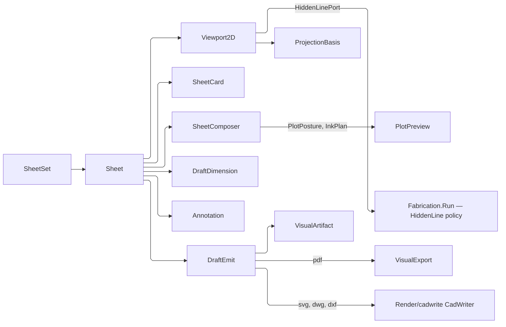

# [APPUI_DRAFTING_SHEETS]

The drafting pipeline produces 2D documentation from 3D geometry: `SheetSet` owns the emitted drawing set with its one paper size and its derived sheet numbering, `Viewport2D` frames a `ViewCamera` onto a sheet region by composing the single CAD-grade hidden-line owner `Rasm.Fabrication/Documentation/projection#PROJECTION` through its public `Fabrication.Run` entry and placing the returned projection-plane segments into sheet space, `DraftDimension` and `Annotation` carry the dimensioning and GD&T annotation vocabulary as typed records, and `DraftEmit` renders the composed sheet to PDF through the offscreen document path and to DWG, DXF, or SVG through the `Render/cadwrite#CAD_WRITE` writer rows. `SheetComposer` edits the placed frames and stat cards through one verb fold that re-runs the sheet's own compose gate and previews the plot under the elected `PlotPosture`. The page owns the sheet-set axis, the projection-to-sheet viewport frame with its in-plane roll, the dimension and GD&T annotation families with their UnitsNet-dimensioned measures under one per-sheet `DraftUnits` posture, the composition and plot-preview fold, and the multi-format emit dispatch.

`Rasm/Drawing/sheet` is the drawing-standards owner this page composes WHOLE and re-declares nothing of: `SheetSize` the extent, `SheetFrame`/`ZoneGrid`/`ZoneRef` the border and reference grid, `TitleBlock`/`TitleField`/`TitleBlockLayout`/`SheetOfGrammar` the title block and its numbering spelling, `DrawingScale`/`ScaleLadder` the ratio and its preferred rungs, `LineGroup`/`LineWidth`/`LineType` the ISO 128 linework ladder, `TextHeight`/`LetteringForm`/`DraftingMetrics`/`Terminator` the ISO 3098 lettering ladder and every annotation proportion derived from it, `LayerStandard`/`LayerName` the layer-name grammar, `PlotPolicy`/`PlotPosture` the issued-sheet policy, and `NorthPosture` the plan-rotation convention. SkiaSharp supplies 2D geometry behind the capture capsule and `SKDocument` PDF export, its every paint resolved once through the capture `PaintCatalog`; the locale culture supplies label formats; the shared `ViewCamera` supplies the projection basis; and the Compute geometry payload supplies projected edges. The Fabrication projection port owns CAD-grade visibility, so AppUi mints no second hidden-line kernel, paper roster, linework ladder, lettering ladder, or layer grammar.

## [01]-[INDEX]

- [02]-[SHEET_SET]: Sheet collection over the kernel frame and title-block owners, view-frame and stat-card placement, the accumulating compose gate.
- [03]-[PROJECTION]: 3D-to-2D hidden-line viewport frame, the drawing scale, the projection basis with its in-plane roll, the ISO 128 line-style roster.
- [04]-[DIMENSIONING]: Dimension and GD&T annotation vocabulary as typed records under the sheet's unit posture and the kernel lettering ladder.
- [05]-[DRAFT_EMIT]: PDF/SVG/DWG/DXF emit dispatch, the one sheet-to-entity projection, the paint mint, the raster fold.
- [06]-[SHEET_COMPOSER]: Frame editing, the plot ink election, paper-unit weights with a display scale, the plot preview.
- [07]-[HIDDEN_LINE_PORT]: The Fabrication package port and what it settles before AppUi places a single ordinate.

## [02]-[SHEET_SET]

- Owner: the sheet EXTENT is `Rasm/Drawing/sheet`'s `SheetSize` `[Union]` composed whole; the FRAME is that owner's `SheetFrame` with its extent bands, `ZoneGrid`, and `ZoneRef`; the TITLE BLOCK is its `TitleBlock` record, `TitleField` roster, `TitleBlockLayout` rectangle, and `SheetOfGrammar` count spelling; the NORTH convention is its `NorthPosture`; this page mints none of them. `DraftUnits` the sheet's readout posture; `SheetRegion` the placed view frame carrying its source view, crop rect, layer context, and north; `Sheet` the single sheet with its frames and cards; `SheetSet` the emitted drawing set carrying the one paper size and the derived sheet numbering.
- Cases: `SheetSize` is the kernel union's own case set — every `SheetSeries` seat inside its declared range (`a0`…`a10`, `b`/`c` likewise, `ansi-a`…`ansi-f`, `arch-a`…`arch-e1`, `jis-b0`…`jis-b10`) and the `Custom` caller extent — reached through `SheetSize.Of(series, index)` or the `[ObjectFactory<string>]` wire parse, so the sizes a drawing set admits are a kernel range and never an AppUi roster.
- Entry: `public static Fin<Sheet> Compose(string key, SheetSize size, DraftUnits units, TitleBlock title, Seq<SheetRegion> regions, Seq<SheetCard> cards, Seq<(string Region, DraftDimension Value)> dimensions, Seq<Annotation> annotations)` — three INDEPENDENT admissions accumulate through one `Validation`, so a sheet with two off-page frames and an orphaned dimension reports all three, and the dimension admission itself carries two sequenced rungs; `public static Fin<SheetSet> Of(string key, Seq<Sheet> sheets)` seals the emitted set — refusing an empty set and naming every divergent extent, then restamping the ordinal and count onto each block through the kernel's own `TitleBlock.Of` admission; `public static DraftUnits For(SheetStandard standard)` elects the readout posture off the standard the sheet is issued under.
- Auto: `SheetSize.Standard` selects the frame, the zone module, the title-block rectangle, the scale ladder, the line group, and the lettering floor through the kernel's own `For(standard)` reads, each resolving a family that publishes no convention of its own onto the family it `Defers` to, so the US architectural series draws the ASME block with zero AppUi identity tests; `DraftEmit.TitleLayout` is one templating fold over `SheetFrame` bands, `ZoneGrid` divisions, `ZoneRef` designators, and `TitleBlockLayout.Rows`, its cell pitch the layout row's own `Pitch`, so an added field re-spaces every standard; each `TitleField` row READS its value off the typed block, so a project rename, a revision bump, and an inserted sheet all re-render the whole set from facts they already moved.
- Law: a balloon anchor seats ONLY on the region whose basis projected it. `HiddenLinePort` raises each region's `ProjectionView` under that region's own key, so `BalloonAnchor.View` and the row's region name one identity; an anchor solved in a neighbouring view carries real ordinates in the wrong plane and places at a plausible seat no reader can tell from a correct one, which is why the divergence refuses at COMPOSITION as `DraftFault.AnchorForeignView` naming both keys rather than reaching a sheet. Dispatch is the closed seven-arm `Switch` over `DraftDimension`, so the next case declares its own anchor law or breaks the gate at compile time.
- Packages: Thinktecture.Runtime.Extensions, LanguageExt.Core (`Validation` applicative, `Fin`, `Seq.Traverse`), UnitsNet (`Length`, `LengthUnit`, `AngleUnit`, `IQuantity`), Rasm (project — `Rasm/Drawing/sheet`: `SheetSize`, `SheetSeries`, `SheetStandard`, `SheetFrame`, `SheetMargin`, `SheetOrientation`, `ZoneGrid`, `ZoneRef`, `TitleBlock`, `TitleField`, `TitleBlockLayout`, `SheetOfGrammar`, `DrawingUnits`, `NorthPosture`; `Rasm/Domain/context`: `UnitSystem`), Rasm.Fabrication (project — `ViewKey` off `Documentation/projection`, the identity a balloon anchor's own view names), Rasm.AppUi `Theme/locale` (`MeasureRole`, `MeasurePolicy`, `UnitPosture`, `ResolvedLocale`), BCL inbox
- Growth: a new sheet size, frame convention, title-block layout, data field, count spelling, or north convention is one row at `Rasm/Drawing/sheet` and costs this page nothing; a new placement roster is one column on `Sheet` and one claim in the compose gate; zero new surface.
- Boundary: sheet dimensions, frame margins, zone modules, and block rectangles are the kernel owner's — the fifteen-row millimetre twin, the three-row `TitleBlockStandard` with its own margin and zone literals, the eleven-row `TitleField` roster with free-string cells, and the `72/25.4` points constant are all the deleted form, and the millimetre-to-point scale is the kernel unit projection off the sheet's own extent; a title-block cell is a kernel ROW that reads a TYPED column, so an authored `string Scale` a projection can contradict, an authored `string DrawingNumber` no grammar admits, and an authored revision letter the ASME sequence skips are the three deleted forms; field labels and formats ride `ResolvedLocale` so a `CultureInfo.CurrentCulture` read is the rejected form, while the elected UNIT is the drawing's own standard rather than the reader's locale (`RULINGS.md:106`); sheet frames and cards are placement rectangles in Y-down sheet millimetre space sharing one bounds predicate, and a placement outside the sheet bounds faults at compose, never at render; the set is size-uniform by construction because one exported document opens at ONE page extent and one CAD model space lays its sheets on one pitch, so a mixed-size set refuses at `Of` naming every divergent extent rather than the first; the sheet composes as precomposed vector page folds on the capture vector-print arm (a flow REPORT rides `Document/export#FLOW_REPORT`) so the document-pagination concern stays the export owner and the drafting page mints no second pagination.

```csharp
// --- [TYPES] ---------------------------------------------------------------------------

public readonly record struct DraftUnits(UnitPosture Posture) {
    public static DraftUnits For(SheetStandard standard) =>
        new(standard.Unit == UnitSystem.Inches ? UnitPosture.Imperial : UnitPosture.Metric);

    public LengthUnit Linear => (LengthUnit)MeasureRole.Distance.Unit(Posture);

    public AngleUnit Angular => (AngleUnit)MeasureRole.Angle.Unit(Posture);

    public Length Span(double millimetres) => Length.FromMillimeters(millimetres).ToUnit(Linear);

    public Angle Arc(double degrees) => Angle.FromDegrees(degrees).ToUnit(Angular);

    public Fin<string> Text(ResolvedLocale locale, IQuantity value, MeasureRole role) =>
        (locale.Measures with { Posture = Posture }).Render(value, role, locale.Formats);
}

// --- [MODELS] --------------------------------------------------------------------------

public readonly record struct SheetRegion(
    string Key,
    string ModelKey,
    ProjectionBasis Basis,
    double X,
    double Y,
    double Width,
    double Height,
    Option<string> Source,
    Seq<VisibilityOverride> Overrides,
    NorthPosture North) {
    public (double X, double Y) Place((double X, double Y) projected) =>
        (X + (Width * 0.5d) + projected.X, Y + (Height * 0.5d) - projected.Y);

    public (double X, double Y) Map((double X, double Y, double Z) world) => Place(Basis.Map(world));

    public ProjectionBasis Oriented(VectorAngle declination) => Basis.Turned(North.Rotation(declination));
}

public sealed record Sheet(
    string Key,
    SheetSize Size,
    DraftUnits Units,
    TitleBlock Title,
    Seq<SheetRegion> Regions,
    Seq<SheetCard> Cards,
    Seq<(string Region, DraftDimension Value)> Dimensions,
    Seq<Annotation> Annotations) {
    public static Fin<Sheet> Compose(
        string key, SheetSize size, DraftUnits units, TitleBlock title,
        Seq<SheetRegion> regions, Seq<SheetCard> cards,
        Seq<(string Region, DraftDimension Value)> dimensions, Seq<Annotation> annotations) =>
        (Placed(size, regions.Map(region => ($"{key}/{region.Key}", region.X, region.Y, region.Width, region.Height))),
            Placed(size, cards.Map(card => ($"{key}/card:{card.Key}", card.X, card.Y, card.Width, card.Height))),
            Anchored(regions, dimensions))
        .Apply((_, _, _) => new Sheet(size, units, title, regions, cards, dimensions, annotations))
        .As().ToFin();

    private static readonly Validation<Error, Unit> Seated = Validation<Error, Unit>.Success(unit);

    private static Validation<Error, Unit> Placed(
        SheetSize size, Seq<(string Key, double X, double Y, double Width, double Height)> boxes) =>
        boxes.Traverse(box =>
                box.X >= 0d && box.Y >= 0d
                && box.X + box.Width <= size.Width.Millimeters && box.Y + box.Height <= size.Height.Millimeters
                    ? Seated
                    : Validation<Error, Unit>.Fail((Error)new DraftFault.RegionOutOfBounds(box.Key)))
            .As().Map(static _ => unit);

    private static Validation<Error, Unit> Anchored(
        string key, Seq<SheetRegion> regions, Seq<(string Region, DraftDimension Value)> dimensions) =>
        dimensions.Traverse(row =>
                regions.Exists(region => string.Equals(region.Key, row.Region, StringComparison.Ordinal))
                    ? row.Value.Switch(
                        state: row.Region,
                        linear:    static (_, _) => Seated,
                        aligned:   static (_, _) => Seated,
                        angular:   static (_, _) => Seated,
                        radial:    static (_, _) => Seated,
                        diametric: static (_, _) => Seated,
                        ordinate:  static (_, _) => Seated,
                        balloon:   static (region, callout) =>
                            string.Equals(callout.Anchor.View.Value, region, StringComparison.Ordinal)
                                ? Seated
                                : Validation<Error, Unit>.Fail(
                                    (Error)new DraftFault.AnchorForeignView(region, callout.Anchor.View.Value)))
                    : Validation<Error, Unit>.Fail((Error)new DraftFault.RegionOutOfBounds($"{key}/dimension:{row.Region}")))
            .As().Map(static _ => unit);
}

public sealed record SheetSet(string Key, SheetSize Size, Seq<Sheet> Sheets) {
    public static Fin<SheetSet> Of(string key, Seq<Sheet> sheets) {
        return (Peopled(sheets), Uniform(sheets))
            .Apply(static (lead, _) => lead).As().ToFin()
            .Bind(lead => toSeq(sheets.Zip(Range(1, sheets.Count)))
                .Traverse(pair => Restamped(pair.Item1, pair.Item2, sheets.Count, seat)).As()
                .Map(stamped => new SheetSet(lead.Size, stamped)));
    }

    private static Validation<Error, Sheet> Peopled(string key, Seq<Sheet> sheets) =>
        sheets.Head.Match(
            Some: static lead => Validation<Error, Sheet>.Success(lead),
            None: () => Validation<Error, Sheet>.Fail((Error)new DraftFault.EmptySet()));

    private static Validation<Error, Unit> Uniform(string key, Seq<Sheet> sheets) =>
        sheets.Map(static sheet => sheet.Size).Distinct() is { Count: > 1 } spread
            ? Validation<Error, Unit>.Fail((Error)new DraftFault.SheetSizeMismatch(
                $"{key}: {string.Join(", ", spread.Map(static size => size.Key))}"))
            : Validation<Error, Unit>.Success(unit);

    private static Fin<Sheet> Restamped(Sheet sheet, int ordinal, int count) =>
        TitleBlock.Of(
            owner: sheet.Title.Owner, project: sheet.Title.Project, client: sheet.Title.Client,
            title: sheet.Title.Title, supplement: sheet.Title.Supplement, number: sheet.Title.Number,
            discipline: sheet.Title.Discipline, scale: sheet.Title.Scale, units: sheet.Title.Units,
            date: sheet.Title.Date, revision: sheet.Title.Revision, drawn: sheet.Title.Drawn,
            checkedBy: sheet.Title.Checked, approvedBy: sheet.Title.Approved,
            sheet: ordinal, sheetCount: count)
            .Map(stamped => sheet with { Title = stamped });
}
```

## [03]-[PROJECTION]

- Owner: `ProjectionBasis` the view-direction-and-scale projection carrying the kernel `DrawingScale` ratio and its in-plane roll; `StrokeRank` the ISO 128-24 wide-or-narrow seat inside a line group; `EdgeStyle` the drawing-role roster carrying its rank, its ISO 128-2 line type, its tonal rung, and its kernel layer projection; `HiddenLineRun` the solved run beside its pattern fill; `Viewport2D` the model-view frame on a sheet region; `HiddenLinePort` the composition-bound delegate column carrying the `Rasm.Fabrication/Documentation/projection#PROJECTION` package entry `Fabrication.Run` as the one in-process producer.
- Entry: `public IO<Seq<SheetEntity>> Project(MeshSpace mesh)` — the `Viewport2D` record is the region with the solver port and reads its key and basis off that region, so `Project` folds the admitted mesh through the port-bound Fabrication run to the projection-plane run beside its `Option<HatchResult>`, groups the run by `EdgeStyle.For(segment)` in ONE pass, walks the style roster so the draw order is the roster's own, places each surviving sub-edge into a sheet-space `SheetEntity.Stroke` under the basis with its kernel `Part` ordinal, clips to the region, and folds the hatch's chained courses into ONE `SheetEntity.Fill`; the view projects directly into the drawn-primitive vocabulary, so no consumer re-maps an intermediate segment tuple; its carrier is `IO` because the owner's entry is `ValueTask<Fin<RunEvidence>>` — a synchronous boundary over an asynchronous package entry blocks the render thread on a kernel solve. `public Fin<LineWidth> Width(SheetSize size)` and `public Fin<LayerName> Layer(Option<int> part = default)` on `EdgeStyle` are the two kernel reads every paint mint and every CAD layer takes.
- Auto: `ProjectionBasis.From` derives the orthographic or perspective projection from a `ViewCamera` so a saved 3D view drafts to a 2D viewport with the same basis; standard views (top, front, right, iso) are basis presets; the projection scales model millimetres to sheet millimetres by the `DrawingScale` RATIO, so a 1:50 detail and a 1:1 detail are ladder rungs and never call-site arithmetic; visible-edge resolution composes the Fabrication package entry — the `HiddenLinePort` delegate runs `Fabrication.Run` under a `FabricationPolicy.HiddenLine` whose `ProjectionPolicy` carries THIS basis as its `Views` row and `Plot` policy, so the kernel projects with the basis the region already holds and the page never re-derives the same matrix twice, and the exact quantitative-invisibility solve over the kernel's exact silhouette locus and screen crossing graph returns through `RunEvidence.Result` as `FabricationResult.HiddenLineResult`, whose `ProjectionEvidence` run hands back a `DrawingProjection` whose `ProjectedSegment` rows already publish both discriminants the page reads — `Edge` for the silhouette locus and the Appel-derived `Visible` fact — so `EdgeStyle.For` is a column read and a concave self-occluding solid resolves by exact sign rather than by a depth-sorted painter approximation; the SAME run carries the `Option<HatchResult>` generated against that same `DrawingProjection`, so a section's pattern fill arrives exactly clipped against the view's own loops and chained through the result's own `Next` column, and AppUi places the courses and never re-derives a pattern.
- Packages: SkiaSharp (`SKPoint`), Thinktecture.Runtime.Extensions, LanguageExt.Core, UnitsNet, Rasm (project — `MeshSpace` the admitted mesh carrier, `HatchResult` and its `ToPolylines` chaining, `DrawingProjection`/`ProjectedSegment`/`EdgeKind` the solved projection-plane vocabulary — the port carries the kernel segments WHOLE, so the `Part` provenance column rides each model-edge stroke into the per-part CAD layer split while `SourceFace` stays the artifact's attribution column; `Rasm/Drawing/sheet`: `DrawingScale`, `ScaleLadder`, `LineGroup`, `LineWidth`, `LineType`, `LayerStandard`, `LayerName`, `LayerField`; `Rasm/Numerics/atoms`: `EpsilonPolicy`, `VectorAngle`, `Reduce`), System.Collections.Frozen (`FrozenDictionary`), BCL inbox (`CultureInfo`), Rasm.Compute (project), Rasm.Fabrication (project — `Fabrication.Run`, `FabricationInput.Admit`, `FabricationRuntime.Admit`, `FabricationPolicy.HiddenLine`, `ProjectionPolicy`, `RunEvidence.Result`, `FabricationResult.HiddenLineResult`, `ProjectionEvidence`/`ProjectionRun`)
- Law: `ProjectionBasis.Roll` is the figure's IN-PLANE rotation, applied after the camera projection and before the scale, so a north posture, a rotated detail, and a plan turned to fit its frame are one drawing rotation and none of them is a camera move; twisting the saved camera's `Up` to spell the same orientation mutates the registry view a frame merely NAMES. The frame's `Oriented` composition carries the posture into the kernel's own `ProjectionPolicy`, so the solve and the sheet stay one basis. `Roll` is a `VectorAngle` and every sum reduces onto the `[0, τ)` window the kernel band admits, so a turn past a full circle is the same drawing rather than a refusal.
- Growth: a new standard view is one `ProjectionBasis` preset; a new drawing role is one `EdgeStyle` row naming its rank, its ISO line type, and its tonal rung, which mints its layer, its width, and its paint by construction; a new hatch pattern is a kernel `HatchPattern` row that reaches the sheet as courses with no AppUi edit; the hidden-line and hatch algorithms deepen at their single owners; zero new surface.
- Boundary: line WEIGHT is the kernel's — `LineGroup.For(size)` picks the ISO 128-24 group by sheet extent per standard and `StrokeRank` names which half of that 2:1 pair a role draws, so the four float weights this page carried (`0.5`, `0.25`, `0.7`, `0.18`) are the deleted form and the wide-to-narrow ratio is the standard's rather than an author's; line RHYTHM is the kernel's `LineType` element table in multiples of d, so the one hand-authored 3 mm dash and 2 mm gap that hidden lines and centrelines SHARED is the deleted form and a hidden line and a long-dashed-dotted axis are distinguishable at every width; layer NAMES are the kernel `LayerStandard.House` grammar as FIELDS, so `draft-{style}` and `-part-{n}` parse back and one projection addresses the CAD layer table, the PDF optional-content group, and the paint catalog alike. `SheetRegion` is the ONE sheet correspondence every fold reads and it fixes the two conventions the whole page rides: the projection CENTRES on the region and sheet space is Y-DOWN. `ProjectionBasis` consumes the shared `ViewCamera`, and `MeshSpace` carries the admitted mesh whole so the view projects the canonical geometry without re-tessellation — its interior is the kernel's, so no AppUi fold reads a vertex off it and a page-local emptiness probe over a carrier whose buffers are internal is unspellable; admission defects surface as the owner's own typed refusal on the port's result, and `DraftFault.EmptyView` names the one verdict THIS page owns — a solve that produced no stroke and no fill, a blank viewport with a fault rather than a silent empty region. `Fabrication.Run` supplies the projection-plane run and its hatch through `HiddenLinePort`; AppUi PLACES that run on the sheet — projection, pattern generation, region clipping against the view's own loops, and course chaining all stay the kernel owners', so a second projection at the sheet fold, a page-local hatch generator, a per-segment fill fold that discards the chaining, and a fabricated pattern where the run carries none are the deleted forms. Geometric floors read `EpsilonPolicy` rather than `1e-9` and `double.Epsilon`, which were machine constants standing in for a modelling tolerance. The REGION clip stays here because neither the kernel `Drawing/view` owner nor the AppUi package roster publishes a rect clip — Clipper2 is a Compute and Fabrication reference and admitting it here for one open-segment window would open a manifest, registry, and catalogue touch-point for a fold the page already states exactly; the projection-window seat is listed for the kernel owner that should settle it inside the solve. The model-anchor projection reads its camera triad off the `Render/pathtrace#BSDF_SHADING` `OracleFrame.OfCamera` owner, so the page owns neither a second camera nor a hidden-line kernel.

```csharp
// --- [TYPES] ---------------------------------------------------------------------------

[SmartEnum<string>]
[KeyMemberEqualityComparer<ComparerAccessors.StringOrdinal, string>]
public sealed partial class StrokeRank {
    public static readonly StrokeRank Wide = new(key: "wide", of: static group => group.Wide);
    public static readonly StrokeRank Narrow = new(key: "narrow", of: static group => group.Narrow);

    [UseDelegateFromConstructor]
    public partial LineWidth Of(LineGroup group);
}

[SmartEnum<string>]
[KeyMemberEqualityComparer<ComparerAccessors.StringOrdinal, string>]
public sealed partial class EdgeStyle {
    public static readonly EdgeStyle Fill = new(key: "fill", rank: StrokeRank.Narrow, type: LineType.Continuous, tone: PaintRole.TextFaint.At(0));
    public static readonly EdgeStyle Hidden = new(key: "hidden", rank: StrokeRank.Narrow, type: LineType.Dashed, tone: PaintRole.TextMuted.At(1));
    public static readonly EdgeStyle Centerline = new(key: "centerline", rank: StrokeRank.Narrow, type: LineType.LongDashedDotted, tone: PaintRole.TextMuted.At(0));
    public static readonly EdgeStyle Marking = new(key: "marking", rank: StrokeRank.Narrow, type: LineType.Continuous, tone: PaintRole.TextMuted.At(0));
    public static readonly EdgeStyle Annotation = new(key: "annotation", rank: StrokeRank.Narrow, type: LineType.Continuous, tone: PaintRole.Text.At(0));
    public static readonly EdgeStyle Visible = new(key: "visible", rank: StrokeRank.Wide, type: LineType.Continuous, tone: PaintRole.Text.At(0));
    public static readonly EdgeStyle Silhouette = new(key: "silhouette", rank: StrokeRank.Wide, type: LineType.Continuous, tone: PaintRole.Text.At(0));

    public StrokeRank Rank { get; }

    public LineType Type { get; }

    public TokenKey Tone { get; }

    public Fin<LineWidth> Width(SheetSize size) =>
        LineGroup.For(size: size).Map(Rank.Of);

    public Fin<LayerName> Layer(Option<int> part = default) =>
        LayerName.Of(
            standard: LayerStandard.House,
            fields: Seq((LayerField.Prefix, Prefix), (LayerField.Style, Key))
                + part.Map(static ordinal => (LayerField.Part, ordinal.ToString(CultureInfo.InvariantCulture))).ToSeq());

    public string Address => Addresses.Value[this];

    private static readonly Lazy<FrozenDictionary<EdgeStyle, string>> Addresses =
        new(static () => Items.ToFrozenDictionary(
            static row => row,
            static row => HostLayerScheme.AutoCadFlat.Path(row.Layer().ThrowIfFail())));

    private const string Prefix = "draft";

    public static EdgeStyle For(ProjectedSegment segment) =>
        segment.Edge == EdgeKind.Silhouette ? Silhouette
        : !segment.Visible ? Hidden
        : Visible;
}

// --- [MODELS] --------------------------------------------------------------------------

public sealed record ProjectionBasis(ViewCamera Camera, DrawingScale Scale, VectorAngle Roll) {
    public static readonly ProjectionBasis Top = Orthographic(
        new System.Numerics.Vector3(0f, 0f, 1f), new System.Numerics.Vector3(0f, 0f, 0f), System.Numerics.Vector3.UnitY);
    public static readonly ProjectionBasis Front = Orthographic(
        new System.Numerics.Vector3(0f, -1f, 0f), new System.Numerics.Vector3(0f, 0f, 0f), System.Numerics.Vector3.UnitZ);
    public static readonly ProjectionBasis Right = Orthographic(
        new System.Numerics.Vector3(1f, 0f, 0f), new System.Numerics.Vector3(0f, 0f, 0f), System.Numerics.Vector3.UnitZ);
    public static readonly ProjectionBasis Iso = Orthographic(
        new System.Numerics.Vector3(1f, -1f, 1f), new System.Numerics.Vector3(0f, 0f, 0f), System.Numerics.Vector3.UnitZ);

    public static ProjectionBasis From(ViewCamera camera, DrawingScale scale) => new(camera, scale, Level);

    public ProjectionBasis Turned(VectorAngle by) =>
        this with { Roll = VectorAngle.Create(value: Reduce.Floored(value: Roll.Value + by.Value, period: Math.Tau)) };

    public (double X, double Y) Map((double X, double Y, double Z) point) {
        (double rx, double ry) = Screen(point);
        (double cos, double sin) = (Math.Cos(Roll.Value), Math.Sin(Roll.Value));
        return (((rx * cos) - (ry * sin)) * Scale.Ratio, ((rx * sin) + (ry * cos)) * Scale.Ratio);
    }

    private static readonly VectorAngle Level = VectorAngle.Create(value: 0d);

    private (double X, double Y) Screen((double X, double Y, double Z) point) {
        CameraFrame frame = Camera.Frame;
        ((double fx, double fy, double fz), (double rx, double ry, double rz), (double ux, double uy, double uz)) = OracleFrame.OfCamera(frame);
        (double px, double py, double pz) = (point.X - frame.Eye.X, point.Y - frame.Eye.Y, point.Z - frame.Eye.Z);
        (double x, double y, double z) = (
            (px * rx) + (py * ry) + (pz * rz),
            (px * ux) + (py * uy) + (pz * uz),
            (px * fx) + (py * fy) + (pz * fz));
        return Camera.Switch(
            state: (X: x, Y: y, Z: z),
            perspective: static (projected, lens) => (
                projected.X / Math.Max(projected.Z * Math.Tan(double.DegreesToRadians(lens.FieldOfViewDeg) / 2d), EpsilonPolicy.ZeroTolerance),
                projected.Y / Math.Max(projected.Z * Math.Tan(double.DegreesToRadians(lens.FieldOfViewDeg) / 2d), EpsilonPolicy.ZeroTolerance)),
            orthographic: static (projected, _) => (projected.X, projected.Y),
            asymmetric: static (projected, lens) => (
                ((projected.X / Math.Max(projected.Z, EpsilonPolicy.ZeroTolerance)) - ((Math.Tan(lens.AngleRight) + Math.Tan(lens.AngleLeft)) / 2d))
                    / Math.Max((Math.Tan(lens.AngleRight) - Math.Tan(lens.AngleLeft)) / 2d, EpsilonPolicy.ZeroTolerance),
                ((projected.Y / Math.Max(projected.Z, EpsilonPolicy.ZeroTolerance)) - ((Math.Tan(lens.AngleUp) + Math.Tan(lens.AngleDown)) / 2d))
                    / Math.Max((Math.Tan(lens.AngleUp) - Math.Tan(lens.AngleDown)) / 2d, EpsilonPolicy.ZeroTolerance)));
    }

    private static ProjectionBasis Orthographic(System.Numerics.Vector3 eye, System.Numerics.Vector3 target, System.Numerics.Vector3 up) =>
        new(new ViewCamera.Orthographic(new CameraFrame(eye, target, up), 1d), DrawingScale.Of(paper: 1, model: 1).ThrowIfFail(), Level);
}

public readonly record struct HiddenLineRun(Seq<ProjectedSegment> Segments, Option<HatchResult> Hatch);

// --- [SERVICES] ------------------------------------------------------------------------

public sealed record HiddenLinePort(Func<MeshSpace, ProjectionBasis, IO<HiddenLineRun>> Solve);

// --- [OPERATIONS] ----------------------------------------------------------------------

public sealed record Viewport2D(SheetRegion Region, HiddenLinePort Hlr, VectorAngle Declination) {
    public string Key => Region.Key;

    public ProjectionBasis Basis => Region.Oriented(Declination);

    public IO<Seq<SheetEntity>> Project(MeshSpace mesh) =>
        from run in Hlr.Solve(mesh, Basis)
        let grouped = run.Segments.Fold(
            HashMap<EdgeStyle, Seq<ProjectedSegment>>(),
            static (held, segment) => held.AddOrUpdate(
                EdgeStyle.For(segment), rows => rows.Add(segment), () => Seq(segment)))
        let drawn = Filled(run.Hatch)
            + toSeq(EdgeStyle.Items).Bind(style => Styled(grouped.Find(style).IfNone(Seq<ProjectedSegment>()), style))
        from entities in drawn.IsEmpty
            ? IO.fail<Seq<SheetEntity>>(new DraftFault.EmptyView($"{Key}: solve drew no edge and no fill"))
            : IO.pure(drawn)
        select entities;

    private Seq<SheetEntity> Styled(Seq<ProjectedSegment> edges, EdgeStyle style) =>
        edges.Choose(edge => Clip(Sheeted((edge.ScreenA.X, edge.ScreenA.Y)), Sheeted((edge.ScreenB.X, edge.ScreenB.Y)))
            .Map(segment => (SheetEntity)new SheetEntity.Stroke(style, (segment.A.X, segment.A.Y), (segment.B.X, segment.B.Y), Some(edge.Part))));

    private Seq<SheetEntity> Filled(Option<HatchResult> hatch) =>
        hatch.Map(result => toSeq(result.ToPolylines())
                .Map(course => toSeq(course).Map(point => Region.Place((point.X, point.Y))))
                .Filter(static course => course.Count >= 2))
            .Bind(static courses => courses.Head.Map(lead => new SheetEntity.Fill(EdgeStyle.Fill, lead, courses.Tail)))
            .Map(static fill => Seq<SheetEntity>(fill))
            .IfNone(Seq<SheetEntity>());

    private SKPoint Sheeted((double X, double Y) projected) =>
        Region.Place(projected) switch { var placed => new SKPoint((float)placed.X, (float)placed.Y) };

    private Option<(SKPoint A, SKPoint B)> Clip(SKPoint a, SKPoint b) {
        (float dx, float dy) = (b.X - a.X, b.Y - a.Y);
        (float minX, float minY) = ((float)Region.X, (float)Region.Y);
        (float maxX, float maxY) = ((float)(Region.X + Region.Width), (float)(Region.Y + Region.Height));
        return Seq(
                (Along: -dx, Offset: a.X - minX), (dx, maxX - a.X),
                (-dy, a.Y - minY), (dy, maxY - a.Y))
            .Fold(Some((Enter: 0f, Exit: 1f)), static (window, plane) => window.Bind(held =>
                Math.Abs(plane.Along) <= EpsilonPolicy.ZeroTolerance
                    ? plane.Offset < 0f ? Option<(float Enter, float Exit)>.None : Some(held)
                    : plane.Offset / plane.Along is var edge && plane.Along < 0f
                        ? Some((MathF.Max(held.Enter, edge), held.Exit))
                        : Some((held.Enter, MathF.Min(held.Exit, edge)))))
            .Filter(static held => held.Enter <= held.Exit)
            .Map(held => (
                new SKPoint(a.X + (held.Enter * dx), a.Y + (held.Enter * dy)),
                new SKPoint(a.X + (held.Exit * dx), a.Y + (held.Exit * dy))));
    }
}
```

## [04]-[DIMENSIONING]

- Owner: `DraftDimension` `[Union]` the dimension vocabulary; `ToleranceForm` `[Union]` the tolerance limbs as a closed family; `Annotation` `[Union]` the GD&T and text annotation vocabulary; `GdtFrame` the feature-control frame as the specification's own compartment rows; `MarkMetrics` the one lettering-and-annotation metrics value every mark builder reads.
- Cases: `DraftDimension` = Linear | Aligned | Angular | Radial | Diametric | Ordinate | Balloon under the locked kind literals; `ToleranceForm` = Absent | Symmetric | Asymmetric; `Annotation` = Text | Leader | Datum | FeatureControl | SurfaceFinish | Weld under the locked kind literals.
- Entry: `public IQuantity Measure(DraftUnits units)` — the one measure read, a `Length` on the six length cases and an `Angle` on the angular one, minted in the sheet's own unit; `public Fin<Seq<SheetEntity>> Entities(SheetRegion region, ResolvedLocale locale, DraftUnits units, MarkMetrics mark)` — the ONE dimension-to-entity projection: sheet-space extension lines, the offset dimension line, terminators, arcs, the parts-list callout circle, and the role-rendered quantity as a `TextRun`, consumed identically by every emit format; `Annotation.Entities(ResolvedLocale, DraftUnits, MarkMetrics)` is the sibling projection for the annotation family; `public static Fin<MarkMetrics> For(SheetSize size, LetteringForm form, Terminator terminator)` resolves the sheet's lettering height, its line group, and every proportion the standards derive from them.
- Auto: each dimension carries its anchor points alone and derives its measure from them, so the drawn geometry and the printed number resolve from one pair of points under the region's own projection and a stored scalar serving as both a model measure and a sheet length is the deleted form; `Entities` builds the extension lines, dimension line, terminators, and text from the dimension kind — a linear or aligned dimension spans its projected anchors under its offset, an angular dimension sweeps an arc at the vertex with both legs, a radial and a diametric draw the centre-to-rim ray in SHEET space with the `R`/`⌀` prefix beside the feature's own kernel-sized centre mark on the `EdgeStyle.Centerline` row, an ordinate draws the datum elbow, and a balloon stands its ISO 6433 circle off the anchor along one oblique bearing with the leader running back to the outline under a closed arrowhead; the region arrives WHOLE rather than as a projection lambda, because its correspondence carries two entries at two altitudes — `Map` for a world anchor no camera has touched, `Place` for the kernel's own projection-plane evidence — and a balloon anchored on a solved run driven back through the camera basis draws a plausible figure at the wrong scale with no fault to read; the GD&T feature-control frame folds the specification's compartment rows left to right into ISO 1101 boxes at the kernel's own `2h` frame height, each compartment boxed to its own symbol run; every measure and tolerance crosses the measurement edge as a UnitsNet quantity under the readout ROLE its case names, so the unit abbreviation is the quantity's own, the precision and grammar are the role's, the elected system is the SHEET's posture, and a label states no unit the value does not carry — the `±` symmetric and `+/-` asymmetric spellings deriving from the `ToleranceForm` case rather than from two predicates over a pair of stored limbs.
- Packages: Thinktecture.Runtime.Extensions, LanguageExt.Core, UnitsNet (`Length`, `Angle`, `LengthUnit`, `AngleUnit`, `IQuantity`), Rasm (project — `Rasm/Drawing/sheet`: `TextHeight`, `LetteringForm`, `DraftingMetrics`, `Terminator`, `DatumDesignator`, `LineGroup`, `LineWidth`, `SheetSize`; `Rasm/Numerics/atoms`: `EpsilonPolicy`), Rasm.Fabrication (project — `FrameSymbolRow`/`FrameCompartment` off `Spec/tolerance` `FeatureFrame.Annotation`, republished per view on the projection anchor; `BalloonAnchor` off `Documentation/projection` `ProjectionEvidence.Balloons`, the per-part parts-list anchor the same evidence publishes), Rasm.AppUi `Theme/locale` (`MeasureRole`, `MeasurePolicy`, `UnitPosture`), Rasm.AppUi `Theme/typography` (`TypographyRole`), BCL inbox (`CultureInfo`)
- Growth: a new dimension kind is one `DraftDimension` case — the parts-list callout was exactly that, one case over Fabrication's own anchor and the list's own ordinal with no builder roster, no page-local run search, and no second projection; a new annotation kind is one `Annotation` case; a new terminator is a kernel `Terminator` row that reaches every mark with zero edits here; a new GD&T characteristic is a `Rasm.Fabrication` `Spec/tolerance` `FeatureCharacteristic` row at that owner; zero new surface.
- Boundary: every lettering and annotation proportion is the kernel's — `TextHeight.For(size)` is the ISO 3098-1 §5.2 floor for the sheet's own extent and `DraftingMetrics` derives d, the `2h` feature-control frame, the h/2 clear inside it, the ISO 129-1 projection-line gap and overshoot, the ISO 128-22 centre-mark arm, and the ISO 1302 surface-texture legs, so the eleven bare millimetre literals this page carried (`3d` ×7, `2.5d`, `6d`, `1.5d`, `0.7d`) and the two centre-mark constants beside them are the deleted form and a 1:5 detail letters at the same figure a plan does only because the standard says so; the dimension TERMINATOR is a kernel `Terminator` row whose length ratio and half-angle size every arm, so the hardcoded 45° 1.2 mm architectural tick becomes `Terminator.ObliqueStroke` — a policy row beside four the standard also publishes — and one body draws an oblique tick, a closed arrowhead, an open arrowhead, and a dot from the row's own two columns; dimension geometry is built in sheet-space from the projected anchor points so a dimension follows its view, and each dimension names its owning region so emission resolves the projection basis its anchors ride; the GD&T frame's CONTENT is the specification's — `Rasm.Fabrication` `Spec/tolerance` `FeatureFrame.Annotation` publishes the ISO 1101 compartments as layout-free `FrameSymbolRow` values this plane places, sizes, and boxes without re-deciding one glyph, so a second characteristic vocabulary here is the deleted form; a parts-list callout's ANCHOR is the same evidence — `Documentation/projection` derives the arc-length midpoint of each part's longest visible run inside the solve, so a longest-run search on this plane is a second projection authority over one figure — and its circle DIAMETER is the kernel `DraftingMetrics.ItemReferenceDiameter` row under ISO 6433 §4.2 a), so the one diameter a drawing may carry is decided where every other drafting proportion is and never as a literal here; dimension and annotation text lands as `SheetEntity.TextRun`/`Glyph` cases carrying a kernel `TextHeight` and a typed `TypographyRole`, rendered through the `ShapedTextPort` shaping column, so a raw `DrawText` loop and a free-string role are both the rejected form; every measure and tolerance limb rides UnitsNet through `DraftUnits.Text`, which takes `IQuantity` and a `MeasureRole` and nothing else, so a bare double has no path to a label and a role whose family the quantity does not match is a typed refusal; two carve-outs are stated rather than inferred — surface roughness renders in its authored unit under the locale's number formats because Ra states micrometres on a millimetre drawing by convention, and a feature-control compartment renders the specification's own spelling because a tolerance zone re-elected into a display unit would no longer be the zone the inspection program measures; the SI-scalar wire law still binds outward, so no UnitsNet type reaches an emit payload and the CAD arms consume the projected `SheetEntity` run alone. REFUSED: one `MarkPlan` roster folding the five leader builders — a span carries two ends and an offset, a wedge a vertex and two legs, a ray a centre and a rim, an elbow a datum and a point, and a callout one already-projected anchor and an ordinal — so one row shape forces an anchor bag with dead slots per row where the closed `DraftDimension` case already carries exactly its own anchors under a total dispatch.

```csharp
// --- [MODELS] --------------------------------------------------------------------------

[Union(ConversionFromValue = ConversionOperatorsGeneration.None)]
public abstract partial record ToleranceForm {
    private ToleranceForm() { }
    public sealed record Absent : ToleranceForm;
    public sealed record Symmetric(Length Limit) : ToleranceForm;
    public sealed record Asymmetric(Length Plus, Length Minus) : ToleranceForm;

    public static readonly ToleranceForm None = new Absent();
}

public sealed record GdtFrame(Seq<FrameSymbolRow> Compartments);

public readonly record struct MarkMetrics(DraftingMetrics Metrics, Terminator Terminator, LineWidth Width) {
    public static Fin<MarkMetrics> For(SheetSize size, LetteringForm form, Terminator terminator) =>
        from height in TextHeight.For(size: size)
        from group in LineGroup.For(size: size)
        select new MarkMetrics(Metrics: form.Metrics(height), Terminator: terminator, Width: group.Narrow);

    public TextHeight Letter => Metrics.Height;

    public double Gap => Metrics.ExtensionGap.Millimeters;

    public double Overshoot => Metrics.ExtensionOvershoot.Millimeters;

    public double Reach => Terminator.Size(Width).Millimeters;

    public double Mark(double diameter) => Metrics.CentreMark(Length.FromMillimeters(diameter)).Millimeters;

    public Seq<SheetEntity> Terminate((double X, double Y) at, double ux, double uy) {
        (double cos, double sin) = (Math.Cos(Terminator.Angle.Value) * Reach, Math.Sin(Terminator.Angle.Value) * Reach);
        return Seq<SheetEntity>(
            new SheetEntity.Stroke(EdgeStyle.Marking, at, (at.X - ((ux * cos) - (uy * sin)), at.Y - ((uy * cos) + (ux * sin)))),
            new SheetEntity.Stroke(EdgeStyle.Marking, at, (at.X - ((ux * cos) + (uy * sin)), at.Y - ((uy * cos) - (ux * sin)))));
    }
}

// --- [OPERATIONS] ----------------------------------------------------------------------

[Union(ConversionFromValue = ConversionOperatorsGeneration.None)]
public abstract partial record DraftDimension {
    private DraftDimension() { }
    public sealed record Linear((double X, double Y, double Z) A, (double X, double Y, double Z) B, double Offset, ToleranceForm Tolerance) : DraftDimension;
    public sealed record Aligned((double X, double Y, double Z) A, (double X, double Y, double Z) B, double Offset, ToleranceForm Tolerance) : DraftDimension;
    public sealed record Angular((double X, double Y, double Z) Vertex, (double X, double Y, double Z) A, (double X, double Y, double Z) B) : DraftDimension;
    public sealed record Radial((double X, double Y, double Z) Center, (double X, double Y, double Z) Rim) : DraftDimension;
    public sealed record Diametric((double X, double Y, double Z) Center, (double X, double Y, double Z) Rim) : DraftDimension;
    public sealed record Ordinate((double X, double Y, double Z) Datum, (double X, double Y, double Z) Point) : DraftDimension;
    public sealed record Balloon(BalloonAnchor Anchor, int Item) : DraftDimension;

    public IQuantity Measure(DraftUnits units) => Switch<DraftUnits, IQuantity>(
        state: units,
        linear: static (u, l) => u.Span(Distance(l.A, l.B)),
        aligned: static (u, a) => u.Span(Distance(a.A, a.B)),
        angular: static (u, a) => u.Arc(Subtended(a.Vertex, a.A, a.B)),
        radial: static (u, r) => u.Span(Distance(r.Center, r.Rim)),
        diametric: static (u, d) => u.Span(Distance(d.Center, d.Rim) * 2d),
        ordinate: static (u, o) => u.Span(Distance(o.Datum, o.Point)),
        balloon: static (u, b) => u.Span(b.Anchor.RunLength));

    public Fin<Seq<SheetEntity>> Entities(
        SheetRegion region, ResolvedLocale locale, DraftUnits units, MarkMetrics mark) => Switch(
        state: (Region: region, Locale: locale, Units: units, Mark: mark),
        linear:    static (ctx, l) => Label(l.Measure(ctx.Units), l.Tolerance, ctx.Units, ctx.Locale)
            .Map(label => Span(ctx.Region.Map(l.A), ctx.Region.Map(l.B), l.Offset, label, ctx.Mark)),
        aligned:   static (ctx, a) => Label(a.Measure(ctx.Units), a.Tolerance, ctx.Units, ctx.Locale)
            .Map(label => Span(ctx.Region.Map(a.A), ctx.Region.Map(a.B), a.Offset, label, ctx.Mark)),
        angular:   static (ctx, a) => ctx.Units.Text(ctx.Locale, a.Measure(ctx.Units), MeasureRole.Angle)
            .Map(label => Wedge(ctx.Region.Map(a.Vertex), ctx.Region.Map(a.A), ctx.Region.Map(a.B), label, ctx.Mark)),
        radial:    static (ctx, r) => ctx.Units.Text(ctx.Locale, r.Measure(ctx.Units), MeasureRole.Distance)
            .Map(label => Ray(ctx.Region.Map(r.Center), ctx.Region.Map(r.Rim), $"R{label}", ctx.Mark)),
        diametric: static (ctx, d) => ctx.Units.Text(ctx.Locale, d.Measure(ctx.Units), MeasureRole.Distance)
            .Map(label => Ray(ctx.Region.Map(d.Center), ctx.Region.Map(d.Rim), $"⌀{label}", ctx.Mark)),
        ordinate:  static (ctx, o) => ctx.Units.Text(ctx.Locale, o.Measure(ctx.Units), MeasureRole.Distance)
            .Map(label => Elbow(ctx.Region.Map(o.Datum), ctx.Region.Map(o.Point), label, ctx.Mark)),
        balloon:   static (ctx, b) => Fin.Succ(Callout(
            ctx.Region.Place((b.Anchor.ScreenLocus.X, b.Anchor.ScreenLocus.Y)),
            b.Item.ToString(CultureInfo.InvariantCulture), ctx.Mark)));

    private static Fin<string> Label(IQuantity measure, ToleranceForm tolerance, DraftUnits units, ResolvedLocale locale) =>
        units.Text(locale, measure, MeasureRole.Distance).Bind(spelled => tolerance.Switch(
            state: (Spelled: spelled, Units: units, Locale: locale),
            absent: static (ctx, _) => Fin.Succ(ctx.Spelled),
            symmetric: static (ctx, row) => ctx.Units.Text(ctx.Locale, row.Limit, MeasureRole.Distance)
                .Map(limit => $"{ctx.Spelled} ±{limit}"),
            asymmetric: static (ctx, row) =>
                from plus in ctx.Units.Text(ctx.Locale, row.Plus, MeasureRole.Distance)
                from minus in ctx.Units.Text(ctx.Locale, row.Minus, MeasureRole.Distance)
                select $"{ctx.Spelled} +{plus}/-{minus}"));

    private static Seq<SheetEntity> Span(
        (double X, double Y) a, (double X, double Y) b, double offset, string label, MarkMetrics mark) {
        (double dx, double dy) = (b.X - a.X, b.Y - a.Y);
        double length = Math.Max(Math.Sqrt((dx * dx) + (dy * dy)), EpsilonPolicy.ZeroTolerance);
        (double nx, double ny) = (-dy / length, dx / length);
        ((double X, double Y) a2, (double X, double Y) b2) =
            ((a.X + (nx * offset), a.Y + (ny * offset)), (b.X + (nx * offset), b.Y + (ny * offset)));
        (double X, double Y) Reach((double X, double Y) at, double from) =>
            (at.X + (nx * from), at.Y + (ny * from));
        return Seq<SheetEntity>(
            new SheetEntity.Stroke(EdgeStyle.Marking, Reach(a, Math.CopySign(mark.Gap, offset)), Reach(a2, Math.CopySign(mark.Overshoot, offset))),
            new SheetEntity.Stroke(EdgeStyle.Marking, Reach(b, Math.CopySign(mark.Gap, offset)), Reach(b2, Math.CopySign(mark.Overshoot, offset))),
            new SheetEntity.Stroke(EdgeStyle.Marking, a2, b2))
            + mark.Terminate(a2, dx / length, dy / length)
            + mark.Terminate(b2, -dx / length, -dy / length)
            + Seq<SheetEntity>(new SheetEntity.TextRun(
                label, ((a2.X + b2.X) * 0.5d, (a2.Y + b2.Y) * 0.5d), mark.Letter, TypographyRole.Numeric));
    }

    private static Seq<SheetEntity> Wedge(
        (double X, double Y) vertex, (double X, double Y) a, (double X, double Y) b, string label, MarkMetrics mark) {
        double radius = Math.Min(Hypot(vertex, a), Hypot(vertex, b)) * 0.6d;
        (double startDeg, double endDeg) = (Deg(vertex, a), Deg(vertex, b));
        return Seq<SheetEntity>(
            new SheetEntity.Stroke(EdgeStyle.Marking, vertex, a),
            new SheetEntity.Stroke(EdgeStyle.Marking, vertex, b),
            new SheetEntity.Sweep(EdgeStyle.Marking, vertex, radius, startDeg, endDeg - startDeg),
            new SheetEntity.TextRun(label, (vertex.X + radius, vertex.Y - radius), mark.Letter, TypographyRole.Numeric));
    }

    private static Seq<SheetEntity> Ray(
        (double X, double Y) center, (double X, double Y) rim, string label, MarkMetrics mark) =>
        CenterMark(center, mark.Mark(Hypot(center, rim) * 2d)) + Seq<SheetEntity>(
            new SheetEntity.Stroke(EdgeStyle.Marking, center, rim),
            new SheetEntity.TextRun(
                label, ((center.X + rim.X) * 0.5d, ((center.Y + rim.Y) * 0.5d) - mark.Gap), mark.Letter, TypographyRole.Numeric));

    private static Seq<SheetEntity> CenterMark((double X, double Y) center, double arm) => Seq<SheetEntity>(
        new SheetEntity.Stroke(EdgeStyle.Centerline, (center.X - arm, center.Y), (center.X + arm, center.Y)),
        new SheetEntity.Stroke(EdgeStyle.Centerline, (center.X, center.Y - arm), (center.X, center.Y + arm)));

    private static Seq<SheetEntity> Elbow(
        (double X, double Y) datum, (double X, double Y) point, string label, MarkMetrics mark) => Seq<SheetEntity>(
        new SheetEntity.Stroke(EdgeStyle.Marking, datum, (point.X, datum.Y)),
        new SheetEntity.Stroke(EdgeStyle.Marking, (point.X, datum.Y), point),
        new SheetEntity.TextRun(label, point, mark.Letter, TypographyRole.Numeric));

    private const double LeaderBearing = Math.PI / 6d;

    private static Seq<SheetEntity> Callout((double X, double Y) at, string item, MarkMetrics mark) {
        double diameter = mark.Metrics.ItemReferenceDiameter.Millimeters;
        (double ux, double uy) = (Math.Cos(LeaderBearing), -Math.Sin(LeaderBearing));
        (double X, double Y) centre = (at.X + (ux * diameter * 2d), at.Y + (uy * diameter * 2d));
        return Seq<SheetEntity>(
            new SheetEntity.Stroke(EdgeStyle.Marking, at,
                (centre.X - (ux * diameter * 0.5d), centre.Y - (uy * diameter * 0.5d))),
            new SheetEntity.Sweep(EdgeStyle.Marking, centre, diameter * 0.5d, 0d, 360d),
            new SheetEntity.TextRun(item, centre, mark.Letter, TypographyRole.Numeric))
            + (mark with { Terminator = Terminator.ClosedArrow }).Terminate(at, -ux, -uy);
    }

    private static double Hypot((double X, double Y) a, (double X, double Y) b) =>
        Math.Sqrt(Math.Pow(b.X - a.X, 2) + Math.Pow(b.Y - a.Y, 2));

    private static double Deg((double X, double Y) origin, (double X, double Y) to) =>
        Math.Atan2(to.Y - origin.Y, to.X - origin.X) * 180d / Math.PI;

    private static double Distance((double X, double Y, double Z) a, (double X, double Y, double Z) b) =>
        Math.Sqrt(Math.Pow(a.X - b.X, 2) + Math.Pow(a.Y - b.Y, 2) + Math.Pow(a.Z - b.Z, 2));

    private static double Subtended((double X, double Y, double Z) v, (double X, double Y, double Z) a, (double X, double Y, double Z) b) =>
        Math.Acos(Math.Clamp(
            (((a.X - v.X) * (b.X - v.X)) + ((a.Y - v.Y) * (b.Y - v.Y)) + ((a.Z - v.Z) * (b.Z - v.Z)))
                / Math.Max(Distance(v, a) * Distance(v, b), EpsilonPolicy.ZeroTolerance), -1d, 1d)) * 180d / Math.PI;
}

[Union(ConversionFromValue = ConversionOperatorsGeneration.None)]
public abstract partial record Annotation {
    private Annotation() { }
    public sealed record Text(string Key, (double X, double Y) At, TypographyRole Role) : Annotation;
    public sealed record Leader((double X, double Y) Tail, (double X, double Y) Head, string Key) : Annotation;
    public sealed record Datum(DatumDesignator Label, (double X, double Y) At) : Annotation;
    public sealed record FeatureControl(GdtFrame Frame, (double X, double Y) At) : Annotation;
    public sealed record SurfaceFinish(Length Roughness, (double X, double Y) At) : Annotation;
    public sealed record Weld(string Symbol, (double X, double Y) At) : Annotation;

    public Fin<Seq<SheetEntity>> Entities(ResolvedLocale locale, DraftUnits units, MarkMetrics mark) => Switch(
        state: (Locale: locale, Units: units, Mark: mark),
        text:    static (ctx, t) => Fin.Succ(Seq<SheetEntity>(
            new SheetEntity.TextRun(ctx.Locale.Label(t.Key), t.At, ctx.Mark.Letter, t.Role))),
        leader:  static (ctx, a) => Fin.Succ(
            Seq<SheetEntity>(new SheetEntity.Stroke(EdgeStyle.Marking, a.Tail, a.Head))
            + ctx.Mark.Terminate(a.Head, (a.Head.X - a.Tail.X) / Math.Max(Reach(a.Tail, a.Head), EpsilonPolicy.ZeroTolerance),
                (a.Head.Y - a.Tail.Y) / Math.Max(Reach(a.Tail, a.Head), EpsilonPolicy.ZeroTolerance))
            + Seq<SheetEntity>(new SheetEntity.TextRun(
                ctx.Locale.Label(a.Key), a.Tail, ctx.Mark.Letter, TypographyRole.Body))),
        datum:   static (ctx, d) => Fin.Succ(Box(d.At, ctx.Mark.Metrics.FrameHeight.Millimeters, ctx.Mark.Metrics.FrameHeight.Millimeters)
            .Add(new SheetEntity.TextRun(
                d.Label.Text, (d.At.X + ctx.Mark.Metrics.FramePad.Millimeters, d.At.Y + ctx.Mark.Metrics.FramePad.Millimeters),
                ctx.Mark.Letter, TypographyRole.Body))),
        featureControl: static (ctx, f) => Fin.Succ(f.Frame.Compartments
            .Fold((Drawn: Seq<SheetEntity>(), Cursor: f.At), (state, row) => (
                state.Drawn
                    + Box(state.Cursor, Compartment(row.Symbol, ctx.Mark), ctx.Mark.Metrics.FrameHeight.Millimeters)
                    + Seq<SheetEntity>(new SheetEntity.Glyph(
                        row.Symbol,
                        (state.Cursor.X + ctx.Mark.Metrics.FramePad.Millimeters, state.Cursor.Y + ctx.Mark.Metrics.FramePad.Millimeters),
                        ctx.Mark.Letter)),
                (state.Cursor.X + Compartment(row.Symbol, ctx.Mark), state.Cursor.Y)))
            .Drawn),
        surfaceFinish: static (ctx, s) => Fin.Succ(Seq<SheetEntity>(
            new SheetEntity.Stroke(EdgeStyle.Marking, s.At,
                (s.At.X + (ctx.Mark.Metrics.SurfaceTextureLeg.Millimeters * 0.5d), s.At.Y + ctx.Mark.Metrics.SurfaceTextureLeg.Millimeters)),
            new SheetEntity.Stroke(EdgeStyle.Marking,
                (s.At.X + (ctx.Mark.Metrics.SurfaceTextureLeg.Millimeters * 0.5d), s.At.Y + ctx.Mark.Metrics.SurfaceTextureLeg.Millimeters),
                (s.At.X + ctx.Mark.Metrics.SurfaceTextureLongLeg.Millimeters, s.At.Y - ctx.Mark.Metrics.SurfaceTextureLongLeg.Millimeters)),
            new SheetEntity.TextRun(
                s.Roughness.ToString(ctx.Locale.Formats),
                (s.At.X + ctx.Mark.Metrics.SurfaceTextureLongLeg.Millimeters, s.At.Y - ctx.Mark.Gap),
                ctx.Mark.Letter, TypographyRole.Numeric))),
        weld:    static (ctx, w) => Fin.Succ(Seq<SheetEntity>(
            new SheetEntity.Stroke(EdgeStyle.Marking, w.At, (w.At.X + ctx.Mark.Metrics.SurfaceTextureLongLeg.Millimeters, w.At.Y)),
            new SheetEntity.Glyph(w.Symbol, (w.At.X + ctx.Mark.Gap, w.At.Y - ctx.Mark.Gap), ctx.Mark.Letter))));

    private const double GlyphAdvance = 0.7d;

    private static double Compartment(string symbol, MarkMetrics mark) =>
        double.Max(
            mark.Metrics.FrameHeight.Millimeters,
            (symbol.Length * mark.Letter.Height.Millimeters * GlyphAdvance) + (2d * mark.Metrics.FramePad.Millimeters));

    private static double Reach((double X, double Y) a, (double X, double Y) b) =>
        Math.Sqrt(Math.Pow(b.X - a.X, 2) + Math.Pow(b.Y - a.Y, 2));

    private static Seq<SheetEntity> Box((double X, double Y) at, double width, double height) => Seq<SheetEntity>(
        new SheetEntity.Stroke(EdgeStyle.Marking, at, (at.X + width, at.Y)),
        new SheetEntity.Stroke(EdgeStyle.Marking, (at.X + width, at.Y), (at.X + width, at.Y + height)),
        new SheetEntity.Stroke(EdgeStyle.Marking, (at.X + width, at.Y + height), (at.X, at.Y + height)),
        new SheetEntity.Stroke(EdgeStyle.Marking, (at.X, at.Y + height), at));
}
```

## [05]-[DRAFT_EMIT]

- Owner: `DraftFault` the direct generated `[Union]` with one `[FaultCase]` leaf per drafting failure; `DraftFormat` the emit-format axis; `SheetEntity` the drawn-primitive vocabulary; `ShapedTextPort` the composition-bound shaping column; `DraftPolicy` the plot/lettering/version/declination policy value; `DraftPorts` the composition-bound port bundle carrying the kernel timeline; `DraftEmit` the multi-format emit dispatch with its public `Page` projection, `Paints` mint, and `Raster` canvas fold.
- Cases: `SheetEntity` = Stroke | Sweep | TextRun | Glyph | Fill; `DraftFormat` = pdf · svg · dwg · dxf; `DraftFault` = RegionOutOfBounds | EmptyView | EmptySet | SheetSizeMismatch | AnchorForeignView.
- Entry: `public static IO<VisualArtifact> Emit(VisualRuntime runtime, SheetSet set, DraftFormat format, DraftPolicy policy, DraftPorts ports, VisualDestination destination)` — `IO` effect; each sheet projects ONCE through `Page` into its complete `SheetEntity` run — per-frame hidden-line strokes under the frame's own layer context and north, stat-card frames and figures, frame-projected dimensions, annotations, and the title-block layout — then every format arm renders the set's page runs into ONE artifact and delivers it; `public static Fin<Seq<PaintSpec>> Paints(SheetSize size, DraftPolicy policy, PlotCanvas canvas)` is the page's contribution to the one `PaintCatalog` resolve — its pigment elected by the plot posture's own ink plan, its width the sheet's kernel line group, and its dash the ISO 128-2 rhythm of that width; `public static Fin<Unit> Raster(SKCanvas canvas, Seq<SheetEntity> entities, DraftPorts ports)` is the canvas fold both the PDF arm and the plot preview consume.
- Auto: PDF folds the set's page runs through one `VisualExport` open, one `SKDocument` page per sheet; SVG, DWG, and DXF hand the identical page runs to the `Render/cadwrite#CAD_WRITE` writer row for their format, each write GAUGED on the kernel timeline so an over-budget artifact carries its own overrun rather than an unbounded wait. `Stroke`, `Sweep`, `TextRun`, `Glyph`, and `Fill` project once into the CAD entity graph; every `EdgeStyle` row owns a kernel `LayerName` and an ISO 128-2 line type under the SAME projection its frozen raster paint keys on — a model-edge stroke carrying its kernel `Part` splits onto that row's part field, so parts toggle independently in any CAD host and a fill layer toggles the whole pattern. Every emit seals one drawing `VisualArtifact` with format, elapsed duration, and delivered destination.
- Output: one `VisualArtifact` of kind drawing per emit, sealed through the visuals encode artifact sink; the fan projects it as the `Render` evidence case, so this page declares no instrument of its own and writes none.
- Packages: SkiaSharp, Thinktecture.Runtime.Extensions, LanguageExt.Core (`IO`, `Fin`, `TraverseM`), NodaTime (`Duration`), Rasm (project — `Rasm/Drawing/sheet`: `SheetSize`, `SheetFrame`, `ZoneGrid`, `ZoneRef`, `TitleBlockLayout`, `TitleField`, `LineGroup`, `LineType`, `LineWidth`, `TextHeight`, `PlotPolicy`, `PlotPosture`, `DrawingUnits`; `Rasm/Domain/results`: `FaultBand`, `[FaultCase]`, `Fault`; `Rasm/Domain/context`: `ModelUnit`, `UnitSystem`; `Rasm/Parametric/projections`: `MonotonicTimeline`, `IGaugeLane`, `GaugedSpan`; `Rasm/Numerics/atoms`: `VectorAngle`), Rasm.AppUi `Render/cadwrite` (`CadWriter`, `CadVersionPolicy`), Rasm.AppHost (project), BCL inbox (`CultureInfo`)
- Growth: a new emit format is one `DraftFormat` row plus one `Emit` dispatch arm; a new drawn primitive is one `SheetEntity` case that breaks the Skia render and the CAD fold at compile time so no format can silently drop it; a new fault case is one `[FaultCase]` leaf; zero new surface.
- Boundary: PDF consumes `PrintFormat.Pdf`, while SVG, DWG, and DXF write through the `Render/cadwrite` fold — the set is the emitted unit for every format, so a per-sheet emit entry beside this one is the deleted form: it would let a three-sheet drawing seal three artifacts one caller has to re-key and would leave the numbering the set derives unread. `DraftFault` keeps each drafting refusal distinct through its direct generated union case. The `Fin` a label render answers LIFTS onto the `IO` effect rather than re-raising as an exception through `IO.lift` — three `ThrowIfFail()` calls erased the typed fault the page had just built, one hop after building it. The run is millimetre-native and Y-DOWN, so each format applies exactly ONE reframing at its own boundary and never in the projection: PDF brackets the millimetre-to-point scale as the kernel unit owner's own projection of the sheet's own extent — `SheetSize.In(points)` against `UnitSystem.PrinterPoints`, never a `72/25.4` literal and never a page-owned constant — while the Y flip and the model-space placement stay the CAD fold's. Raster paints are CATALOG reads keyed by the style's own kernel `LayerName`; a per-entity `SKPaint` or `SKPathEffect` construction is the deleted form, and a composed role string used as both a paint key and a layer name violated `RULINGS.md:105` at three sites. Vector content remains vector in PDF, SVG, DWG, and DXF. The declination is a PROJECT fact read off the model's own `GeoReference`, so it sits on the policy and reaches every frame through the one `Viewport2D` construction rather than being authored per frame.

```csharp
// --- [TYPES] ---------------------------------------------------------------------------

public sealed partial class DraftFormat {
    public static readonly DraftFormat Pdf = new(key: "pdf");
    public static readonly DraftFormat Svg = new(key: "svg");
    public static readonly DraftFormat Dwg = new(key: "dwg");
    public static readonly DraftFormat Dxf = new(key: "dxf");
}

[SmartEnum<string>]
[KeyMemberEqualityComparer<ComparerAccessors.StringOrdinal, string>]
public sealed partial class DraftLane : IGaugeLane<DraftLane> {
    public static readonly DraftLane CadWrite = new(key: "cad-write", bound: TimeSpan.FromSeconds(10d));
    public static readonly DraftLane Page = new(key: "page", bound: TimeSpan.FromSeconds(5d));
    public TimeSpan Bound { get; }
}

// --- [ERRORS] --------------------------------------------------------------------------

[Union(ConversionFromValue = ConversionOperatorsGeneration.None)]
public abstract partial record DraftFault : Fault {
    private static readonly FaultBand FamilyBand = FaultBand.UiDraft;
    private DraftFault(string detail) { Detail = detail; }

    public string Detail { get; }

    public override string Message => Detail;

    [FaultCase(0)]
    public sealed partial record RegionOutOfBounds(string Detail) : DraftFault(Detail);
    [FaultCase(1)]
    public sealed partial record EmptyView(string Detail)         : DraftFault(Detail);
    [FaultCase(2)]
    public sealed partial record EmptySet(string Detail)          : DraftFault(Detail);
    [FaultCase(3)]
    public sealed partial record SheetSizeMismatch(string Detail) : DraftFault(Detail);
    [FaultCase(4)]
    public sealed partial record AnchorForeignView(string Region, string View)
        : DraftFault($"{Region}: balloon anchor solved in view {View}");
}

// --- [MODELS] --------------------------------------------------------------------------

[Union(ConversionFromValue = ConversionOperatorsGeneration.None)]
public abstract partial record SheetEntity {
    private SheetEntity() { }
    public sealed record Stroke(EdgeStyle Style, (double X, double Y) A, (double X, double Y) B, Option<int> Part = default) : SheetEntity;
    public sealed record Sweep(EdgeStyle Style, (double X, double Y) Center, double Radius, double StartDeg, double SweepDeg) : SheetEntity;
    public sealed record TextRun(string Value, (double X, double Y) At, TextHeight Height, TypographyRole Role) : SheetEntity;
    public sealed record Glyph(string Symbol, (double X, double Y) At, TextHeight Height) : SheetEntity;
    public sealed record Fill(EdgeStyle Style, Seq<(double X, double Y)> Lead, Seq<Seq<(double X, double Y)>> Rest) : SheetEntity {
        public Seq<Seq<(double X, double Y)>> Courses => Lead.Cons(Rest);
    }
}

public sealed record DraftPolicy(
    ResolvedLocale Locale,
    PlotPolicy Plot,
    LetteringForm Lettering,
    Terminator Terminator,
    TokenKey InkPigment,
    VectorAngle Declination,
    CadVersionPolicy CadVersion) {
    public static Fin<DraftPolicy> Of(ResolvedLocale locale, SheetSize size) =>
        from plot in PlotPolicy.Issue(size: size)
        select new DraftPolicy(
            Locale: locale, Plot: plot, Lettering: LetteringForm.TypeB, Terminator: Terminator.ObliqueStroke,
            InkPigment: PaintRole.Text.At(0), Declination: VectorAngle.Create(value: 0d),
            CadVersion: CadVersionPolicy.Default);

    public InkPlan Ink => InkPlan.For(Plot.Posture);
}

// --- [SERVICES] ------------------------------------------------------------------------

public sealed record ShapedTextPort(Func<SKCanvas, string, (double X, double Y), TextHeight, TypographyRole, Fin<Unit>> Draw);

public sealed record DraftPorts(
    Func<string, Seq<VisibilityOverride>, Option<MeshSpace>> MeshOf,
    HiddenLinePort Hlr,
    ShapedTextPort Text,
    PaintCatalog Paints,
    MonotonicTimeline Line,
    Func<SheetCard, ResolvedLocale, Fin<Seq<(string LabelKey, IQuantity Value, MeasureRole Role)>>> CardFacts);

// --- [OPERATIONS] ----------------------------------------------------------------------

public static class DraftEmit {
    public const string Kind = "drawing";


    public static Fin<Seq<PaintSpec>> Paints(SheetSize size, DraftPolicy policy, PlotCanvas canvas) =>
        toSeq(EdgeStyle.Items).Traverse(style =>
            from width in style.Width(size: size)
            select new PaintSpec(
                Role: style.Address,
                Pigment: policy.Ink.Ink(style, policy.InkPigment),
                StrokeWidth: canvas.Screen(width),
                Style: SKPaintStyle.Stroke,
                Effects: style.Type.IsContinuous ? Seq<FxRow>() : Seq(FxRow.Dashed))).As();

    public static IO<VisualArtifact> Emit(
        VisualRuntime runtime, SheetSet set, DraftFormat format,
        DraftPolicy policy, DraftPorts ports, VisualDestination destination) =>
        from pages in set.Sheets.TraverseM(sheet => Page(sheet, policy, ports)).As()
        from artifact in format.Switch(
            state: (Runtime: runtime, Set: set, Pages: pages, Ports: ports, Destination: destination, Policy: policy),
            pdf: static s => Paged(s.Runtime, s.Set, s.Pages, s.Ports, s.Destination),
            svg: static s => CadArm(s.Runtime, s.Set, s.Pages, s.Ports, s.Policy, s.Destination, DraftFormat.Svg, CadWriter.Svg),
            dwg: static s => CadArm(s.Runtime, s.Set, s.Pages, s.Ports, s.Policy, s.Destination, DraftFormat.Dwg, CadWriter.Dwg),
            dxf: static s => CadArm(s.Runtime, s.Set, s.Pages, s.Ports, s.Policy, s.Destination, DraftFormat.Dxf, CadWriter.Dxf))
        select artifact;

    private static IO<VisualArtifact> Paged(
        VisualRuntime runtime, SheetSet set, Seq<Seq<SheetEntity>> pages, DraftPorts ports, VisualDestination destination) =>
        from points in IO.lift(() => ModelUnit.Of(value: UnitSystem.PrinterPoints, key: Write))
        from extent in IO.lift(() => set.Size.In(unit: points, key: Write))
        let scale = (float)(extent.Width / set.Size.Width.Millimeters)
        from artifact in VisualExport.Export(runtime, new VisualExportSpec(
            PrintFormat.Pdf, (float)extent.Width, (float)extent.Height,
            pages.Map(page => (Func<SKCanvas, Fin<Unit>>)(canvas => {
                canvas.Scale(scale);
                return Raster(canvas, page, ports);
            })), destination))
        select artifact;

    private static IO<VisualArtifact> CadArm(
        VisualRuntime runtime, SheetSet set, Seq<Seq<SheetEntity>> pages, DraftPorts ports,
        DraftPolicy policy, VisualDestination destination, DraftFormat format, CadWriter writer) =>
        from gauged in IO.lift(() => ports.Line.Gauged<byte[], DraftLane>(
            lane: DraftLane.CadWrite, work: Write,
            body: () => writer.Emit(set.Size, pages, policy.CadVersion), key: Write))
        from bytes in IO.lift(gauged.Value)
        from artifact in ExportDelivery.Deliver(runtime, destination, bytes)
        let artifact = new VisualArtifact(
            Kind: Kind, Format: format.Key, FrameHash: ContentHash.Of(bytes),
            DrawHash: None, Pixels: None, Bytes: bytes.LongLength,
            Elapsed: Duration.FromTimeSpan(gauged.Span.Elapsed), Correlation: runtime.Correlation,
            Destination: Optional(artifact), ColorSpace: VisualCodec.ColorPolicy.Display.Key)
        from published in runtime.Publish(artifact)
        select published;

    public static IO<Seq<SheetEntity>> Page(Sheet sheet, DraftPolicy policy, DraftPorts ports) =>
        from mark in IO.lift(() => MarkMetrics.For(sheet.Size, policy.Lettering, policy.Terminator, Write))
        from strokes in sheet.Regions.TraverseM(region => ports.MeshOf(region.ModelKey, region.Overrides).Match(
            Some: mesh => new Viewport2D(region, ports.Hlr, policy.Declination).Project(mesh),
            None: () => IO.fail<Seq<SheetEntity>>(
                new DraftFault.EmptyView($"{region.Key}: model {region.ModelKey} unresolved")))).As()
        from carded in sheet.Cards.TraverseM(card =>
            IO.lift(() => card.Entities(ports, policy.Locale, sheet.Units, mark))).As()
        from dimensioned in sheet.Dimensions.TraverseM(row => sheet.Regions
            .Find(region => string.Equals(region.Key, row.Region, StringComparison.Ordinal))
            .Match(
                Some: region => IO.lift(() => row.Value.Entities(
                    region with { Basis = region.Oriented(policy.Declination) },
                    policy.Locale, sheet.Units, mark)),
                None: () => IO.fail<Seq<SheetEntity>>(
                    new DraftFault.EmptyView($"dimension region {row.Region} unresolved")))).As()
        from annotated in sheet.Annotations.TraverseM(annotation =>
            IO.lift(() => annotation.Entities(policy.Locale, sheet.Units, mark))).As()
        from titled in IO.lift(() => TitleLayout(sheet, policy, mark))
        select strokes.Bind(static run => run) + carded.Bind(static run => run)
            + dimensioned.Bind(static run => run) + annotated.Bind(static run => run) + titled;

    private static Fin<Seq<SheetEntity>> TitleLayout(Sheet sheet, DraftPolicy policy, MarkMetrics mark) {
        SheetFrame frame = SheetFrame.For(sheet.Size.Standard);
        TitleBlockLayout layout = TitleBlockLayout.For(sheet.Size.Standard);
        (double w, double h) = (sheet.Size.Width.Millimeters, sheet.Size.Height.Millimeters);
        return from margin in frame.Margin(size: sheet.Size, key: Write)
               from zones in frame.Zones(size: sheet.Size, orientation: policy.Plot.Orientation, key: Write)
               let inset = (Left: margin.Left.Millimeters, Top: margin.Top.Millimeters,
                   Right: margin.Right.Millimeters, Bottom: margin.Bottom.Millimeters)
               let block = (X: w - inset.Right - frame.Block.Width.Millimeters,
                   Y: h - inset.Bottom - frame.Block.Height.Millimeters)
               let tick = frame.Tick.Millimeters
               let border = Seq<SheetEntity>(
                   new SheetEntity.Stroke(EdgeStyle.Visible, (inset.Left, inset.Top), (w - inset.Right, inset.Top)),
                   new SheetEntity.Stroke(EdgeStyle.Visible, (w - inset.Right, inset.Top), (w - inset.Right, h - inset.Bottom)),
                   new SheetEntity.Stroke(EdgeStyle.Visible, (w - inset.Right, h - inset.Bottom), (inset.Left, h - inset.Bottom)),
                   new SheetEntity.Stroke(EdgeStyle.Visible, (inset.Left, h - inset.Bottom), (inset.Left, inset.Top)),
                   new SheetEntity.Stroke(EdgeStyle.Visible, (block.X, block.Y), (w - inset.Right, block.Y)),
                   new SheetEntity.Stroke(EdgeStyle.Visible, (block.X, block.Y), (block.X, h - inset.Bottom)))
               from grid in Zoned(zones, inset, (w, h), tick, mark)
               let cells = layout.Rows.Map((row, index) => (SheetEntity)new SheetEntity.TextRun(
                   $"{policy.Locale.Label(row.LabelKey)}: {row.Read(sheet.Title, sheet.Size.Standard)}",
                   (block.X + layout.Inset.Millimeters,
                       block.Y + layout.Header.Millimeters + (index * layout.Pitch.Millimeters)),
                   mark.Letter, TypographyRole.Body)).ToSeq()
               select border + grid + cells;
    }

    private static Fin<Seq<SheetEntity>> Zoned(
        ZoneGrid zones, (double Left, double Top, double Right, double Bottom) inset,
        (double Width, double Height) sheet, double tick, MarkMetrics mark) {
        double span = sheet.Width - inset.Left - inset.Right;
        double rise = sheet.Height - inset.Top - inset.Bottom;
        return from columns in toSeq(Range(1, zones.Columns))
                   .Traverse(column => zones.At(column: column, row: 1, key: Write).Map(seat => {
                       double x = inset.Left + ((column - 0.5d) * span / zones.Columns);
                       return Seq<SheetEntity>(
                           new SheetEntity.Stroke(EdgeStyle.Marking, (x, inset.Top), (x, inset.Top + tick)),
                           new SheetEntity.Stroke(EdgeStyle.Marking, (x, sheet.Height - inset.Bottom - tick), (x, sheet.Height - inset.Bottom)),
                           new SheetEntity.TextRun(
                               seat.Column.ToString(CultureInfo.InvariantCulture),
                               (x, inset.Top + (tick * 0.5d)), mark.Letter, TypographyRole.Numeric));
                   })).As()
               from rows in toSeq(Range(1, zones.Rows))
                   .Traverse(row => zones.At(column: 1, row: row, key: Write).Map(seat => {
                       double y = inset.Top + ((row - 0.5d) * rise / zones.Rows);
                       return Seq<SheetEntity>(
                           new SheetEntity.Stroke(EdgeStyle.Marking, (inset.Left, y), (inset.Left + tick, y)),
                           new SheetEntity.Stroke(EdgeStyle.Marking, (sheet.Width - inset.Right - tick, y), (sheet.Width - inset.Right, y)),
                           new SheetEntity.TextRun(
                               seat.Text[..1], (inset.Left + (tick * 0.5d), y), mark.Letter, TypographyRole.Numeric));
                   })).As()
               select columns.Bind(static run => run) + rows.Bind(static run => run);
    }

    public static Fin<Unit> Raster(SKCanvas canvas, Seq<SheetEntity> entities, DraftPorts ports) =>
        entities.Fold(Fin.Succ(unit), (acc, entity) => acc.Bind(_ => entity.Switch(
            state: (Canvas: canvas, Ports: ports),
            stroke: static (ctx, s) => Inked(ctx, s.Style, paint => Drawn(ctx.Canvas, s, paint)),
            sweep: static (ctx, s) => Inked(ctx, s.Style, paint => Swept(ctx.Canvas, s, paint)),
            textRun: static (ctx, t) => ctx.Ports.Text.Draw(ctx.Canvas, t.Value, t.At, t.Height, t.Role),
            glyph: static (ctx, g) => ctx.Ports.Text.Draw(ctx.Canvas, g.Symbol, g.At, g.Height, TypographyRole.Body),
            fill: static (ctx, f) => Inked(ctx, f.Style, paint => Poured(ctx.Canvas, f, paint)))));

    private static Fin<Unit> Inked(
        (SKCanvas Canvas, DraftPorts Ports) ctx, EdgeStyle style, Func<SKPaint, Unit> draw) =>
        ctx.Ports.Paints.Paint(style.Address).Map(draw);

    private static Unit Poured(SKCanvas canvas, SheetEntity.Fill fill, SKPaint paint) {
        using SKPath courses = new();
        fill.Courses.Iter(course => course.Head.Iter(lead => {
            courses.MoveTo((float)lead.X, (float)lead.Y);
            course.Tail.Iter(point => courses.LineTo((float)point.X, (float)point.Y));
        }));
        canvas.DrawPath(courses, paint);
        return unit;
    }

    private static Unit Drawn(SKCanvas canvas, SheetEntity.Stroke stroke, SKPaint paint) {
        canvas.DrawLine((float)stroke.A.X, (float)stroke.A.Y, (float)stroke.B.X, (float)stroke.B.Y, paint);
        return unit;
    }

    private static Unit Swept(SKCanvas canvas, SheetEntity.Sweep sweep, SKPaint paint) {
        using SKPath arc = new();
        arc.AddArc(new SKRect(
            (float)(sweep.Center.X - sweep.Radius), (float)(sweep.Center.Y - sweep.Radius),
            (float)(sweep.Center.X + sweep.Radius), (float)(sweep.Center.Y + sweep.Radius)),
            (float)sweep.StartDeg, (float)sweep.SweepDeg);
        canvas.DrawPath(arc, paint);
        return unit;
    }
}
```



## [06]-[SHEET_COMPOSER]

- Owner: `InkPlan` the plot-ink election over the kernel `PlotPosture` rows with its print-device target; `PlotCanvas` the per-canvas display scale that never reaches a printed weight; `SheetCard` the placeable, per-option re-bindable metric card; `FrameEdit` `[Union]` the frame-editing verb family folding onto the placement rows; `SheetComposer` the composition fold and the plot preview.
- Cases: `InkPlan` = colour | grayscale | monochrome, one row per kernel `PlotPosture`; `FrameEdit` = Move | Resize | Scale | Source | Crop | Layers | North | Basis under the locked verb literals.
- Entry: `public static Fin<Sheet> Apply(Sheet sheet, string frame, FrameEdit edit)` — the ONE frame-editing fold, every verb rewriting the named placement row and re-running the sheet's own compose gate so an edit that drives a frame off the page refuses exactly where an authored frame would; `public static Fin<Sheet> Rebind(Sheet sheet, string card, string option)` — the card's binding rewrite; `public static IO<SKImage> Preview(Sheet sheet, DraftPolicy policy, DraftPorts ports, PlotCanvas plot)` — the plot preview, which renders the sheet's OWN entity run under the plot posture's paints so preview and plot cannot disagree; `public static InkPlan For(PlotPosture posture)` — the ink election keyed on the kernel row.
- Auto: a view frame carries its source named-view key, its scale, its layer context, and its north posture as placement-row columns, so the frame editor is a projection over one row rather than a parallel frame model; `FrameEdit.Rewrite` folds each verb onto the row and `Apply` re-composes, so bounds, orphaned dimensions, and off-page cards all refuse through the one gate; stroke weights stay PAPER millimetres end to end — the sheet's own ISO 128-24 line width — and the canvas a paint set resolves for projects them, so an emit generation resolved at `PlotCanvas.Paper` carries the standard's weight and zooming a preview never re-authors a printed one; a stat card names its metric binding and its option, and re-binding it to another option is one column rewrite that re-reads through the same `DraftPorts.CardFacts` reader; the preview folds the entity run through `Offscreen.Snapshot` under a `PaintCatalog` resolved from the plot posture's own ink plan, and the plan's `ColorTarget` is what the `Document/export#PRINT_ARM` conversion consumes when the sheet plots to a press device.
- Packages: SkiaSharp, Thinktecture.Runtime.Extensions, LanguageExt.Core, UnitsNet (`Length`), System.Collections.Frozen (`FrozenDictionary`), Rasm (project — `Rasm/Drawing/sheet`: `SheetSize`, `PlotPosture`, `PlotPolicy`, `LineWidth`, `DrawingScale`, `ScaleLadder`, `ScaleNotation`, `TextHeight`, `DraftingMetrics`, `NorthPosture`)
- Growth: a new frame-editing verb is one `FrameEdit` case that breaks the fold at compile time; a new plot posture is one kernel `PlotPosture` row beside one `InkPlan` row naming it; a new card kind is one `SheetCard` binding value the fact reader resolves; zero new surface.
- Boundary: the composer edits the SETTLED placement rows and mints no second frame model — `SheetRegion` is the one view-frame owner, its rect IS the crop, its basis IS the projection, and its overrides ARE the layer context; a layer toggle narrows the MODEL the solve receives through `DraftPorts.MeshOf` and never filters solved edges, because hiding geometry after a visibility solve leaves the edges it occluded drawn as hidden edges of absent geometry; north is a kernel `NorthPosture` reaching `ProjectionBasis.Roll`, so the saved view the frame names is never mutated to spell a sheet's orientation; `FrameEdit.Scale` takes a `DrawingScale` and admits against the standard's own `ScaleLadder`, so `1:37` — which a bare `double` spelled freely and no title block could render back in its issued notation — refuses at the edit; the display scale is `PlotCanvas`'s and enters the ONE `DraftEmit.Paints` mint as the canvas that projects a kernel `LineWidth`, so the emit generation resolves at the paper canvas and a preview at its own, and folding a zoom into a weight would make every emitted format carry the zoom the author happened to be at; the plot INK is a `TokenKey` because pigments are addressed by token and never by a composed string (`RULINGS.md:105`), while the kernel `PlotPosture` decides the ELECTION — a greyscale ladder ranked off a private float weight column and borrowed from the SCREEN contrast roster is the deleted form, and each style's tonal rung is now the row's own declared fact; the preview's paint generation is minted for that render alone and releases at a bracket over its own acquisition, so a refused raster and a landed one tear down alike and no preview leaks a generation of natives; the plot preview consumes the one `DraftEmit.Page` entity run so a preview-only render path cannot exist and what the preview shows is byte-congruent with what the PDF arm pages (`RULINGS.md:102`); device-CMYK conversion, ink limiting, and soft proofing stay `Document/export#PRINT_ARM`'s charter and reach this page as the plan's `ColorTarget` row alone; a stat card's numbers come from the bound fact reader and are rendered through the sheet's own `DraftUnits.Text`, so a card figure and a dimension figure on one sheet read in one unit system by construction. `SheetComposer` is the drafting SCREEN's verb deck and this page publishes it as such — the screen binding is `Shell/screens`'s to seat.

```csharp
// --- [TYPES] ---------------------------------------------------------------------------

[SmartEnum<string>]
[KeyMemberEqualityComparer<ComparerAccessors.StringOrdinal, string>]
public sealed partial class InkPlan {
    public static readonly InkPlan Colour = new(key: "colour", posture: PlotPosture.Colour, target: ColorTarget.Press, ink: static (_, ink) => ink);
    public static readonly InkPlan Grayscale = new(key: "grayscale", posture: PlotPosture.Grayscale, target: ColorTarget.Screen, ink: static (style, _) => style.Tone);
    public static readonly InkPlan Monochrome = new(key: "monochrome", posture: PlotPosture.Monochrome, target: ColorTarget.Screen, ink: static (_, ink) => ink);

    public PlotPosture Posture { get; }

    public ColorTarget Target { get; }

    [UseDelegateFromConstructor]
    public partial TokenKey Ink(EdgeStyle style, TokenKey ink);

    public static InkPlan For(PlotPosture posture) => ByPosture.Value[posture];

    private static readonly Lazy<FrozenDictionary<PlotPosture, InkPlan>> ByPosture =
        new(static () => Items.ToFrozenDictionary(static row => row.Posture));
}

// --- [MODELS] --------------------------------------------------------------------------

public readonly record struct PlotCanvas(double DisplayScale, double DevicePixelRatio) {
    public static readonly PlotCanvas Paper = new(DisplayScale: 1d, DevicePixelRatio: 1d);

    public float Screen(LineWidth width) => (float)(width.Width.Millimeters * DisplayScale * DevicePixelRatio);

    public SKImageInfo Info(SheetSize size) =>
        new((int)Math.Round(size.Width.Millimeters * DisplayScale * DevicePixelRatio),
            (int)Math.Round(size.Height.Millimeters * DisplayScale * DevicePixelRatio));
}

public readonly record struct SheetCard(
    string Key,
    string MetricKey,
    string OptionKey,
    double X,
    double Y,
    double Width,
    double Height) {
    public Fin<Seq<SheetEntity>> Entities(
        DraftPorts ports, ResolvedLocale locale, DraftUnits units, MarkMetrics mark) =>
        ports.CardFacts(this, locale).Bind(facts => facts
            .Map((fact, index) => units.Text(locale, fact.Value, fact.Role)
                .Map(text => (SheetEntity)new SheetEntity.TextRun(
                    $"{locale.Label(fact.LabelKey)}: {text}",
                    (X + mark.Metrics.FramePad.Millimeters,
                        Y + mark.Metrics.FramePad.Millimeters + ((index + 1) * mark.Metrics.LinePitch.Millimeters)),
                    mark.Letter, TypographyRole.Numeric)))
            .Fold(Fin.Succ(Frame(mark)), static (fold, row) => fold.Bind(acc => row.Map(acc.Add))));

    private Seq<SheetEntity> Frame(MarkMetrics mark) => Seq<SheetEntity>(
        new SheetEntity.Stroke(EdgeStyle.Marking, (X, Y), (X + Width, Y)),
        new SheetEntity.Stroke(EdgeStyle.Marking, (X + Width, Y), (X + Width, Y + Height)),
        new SheetEntity.Stroke(EdgeStyle.Marking, (X + Width, Y + Height), (X, Y + Height)),
        new SheetEntity.Stroke(EdgeStyle.Marking, (X, Y + Height), (X, Y)),
        new SheetEntity.TextRun(
            Key, (X + mark.Metrics.FramePad.Millimeters, Y + mark.Metrics.FramePad.Millimeters),
            mark.Letter, TypographyRole.Body));
}

// --- [OPERATIONS] ----------------------------------------------------------------------

[Union(ConversionFromValue = ConversionOperatorsGeneration.None)]
public abstract partial record FrameEdit {
    private FrameEdit() { }
    public sealed record Move(double X, double Y) : FrameEdit;
    public sealed record Resize(double Width, double Height) : FrameEdit;
    public sealed record Scale(DrawingScale Ratio) : FrameEdit;
    public sealed record Source(string ViewKey, ProjectionBasis Basis) : FrameEdit;
    public sealed record Crop(double X, double Y, double Width, double Height) : FrameEdit;
    public sealed record Layers(Seq<VisibilityOverride> Overrides) : FrameEdit;
    public sealed record North(NorthPosture Posture) : FrameEdit;
    public sealed record Basis(ProjectionBasis Value) : FrameEdit;

    public SheetRegion Rewrite(SheetRegion region) => Switch(
        state: region,
        move: static (row, e) => row with { X = e.X, Y = e.Y },
        resize: static (row, e) => row with { Width = e.Width, Height = e.Height },
        scale: static (row, e) => row with { Basis = row.Basis with { Scale = e.Ratio } },
        source: static (row, e) => row with { Source = Some(e.ViewKey), Basis = e.Basis },
        crop: static (row, e) => row with { X = e.X, Y = e.Y, Width = e.Width, Height = e.Height },
        layers: static (row, e) => row with { Overrides = e.Overrides },
        north: static (row, e) => row with { North = e.Posture },
        basis: static (row, e) => row with { Basis = e.Value });
}

public static class SheetComposer {
    public static Fin<Sheet> Apply(Sheet sheet, string frame, FrameEdit edit) =>
        sheet.Regions.Find(region => string.Equals(region.Key, frame, StringComparison.Ordinal)).Match(
            None: () => Fin.Fail<Sheet>(new DraftFault.RegionOutOfBounds($"{sheet.Key}/frame:{frame}")),
            Some: region => Laddered(sheet, edit).Bind(_ => Sheet.Compose(
                sheet.Key, sheet.Size, sheet.Units, sheet.Title,
                sheet.Regions.Map(row => string.Equals(row.Key, frame, StringComparison.Ordinal) ? edit.Rewrite(region) : row),
                sheet.Cards, sheet.Dimensions, sheet.Annotations)));

    public static Fin<Sheet> Rebind(Sheet sheet, string card, string option) =>
        sheet.Cards.Exists(row => string.Equals(row.Key, card, StringComparison.Ordinal))
            ? Sheet.Compose(
                sheet.Key, sheet.Size, sheet.Units, sheet.Title, sheet.Regions,
                sheet.Cards.Map(row => string.Equals(row.Key, card, StringComparison.Ordinal) ? row with { OptionKey = option } : row),
                sheet.Dimensions, sheet.Annotations)
            : Fin.Fail<Sheet>(new DraftFault.RegionOutOfBounds($"{sheet.Key}/card:{card}"));

    private static Fin<Unit> Laddered(Sheet sheet, FrameEdit edit) =>
        edit is FrameEdit.Scale { Ratio: var ratio } && !ScaleLadder.For(sheet.Size.Standard).Admits(ratio)
            ? Fin.Fail<Unit>(new DraftFault.EmptyView($"{sheet.Key}/scale:{ScaleNotation.For(sheet.Size.Standard).Render(ratio)} is off the standard's ladder"))
            : Fin.Succ(unit);

    public static IO<SKImage> Preview(Sheet sheet, DraftPolicy policy, DraftPorts ports, PlotCanvas plot) =>
        from run in DraftEmit.Page(sheet, policy, ports)
        from specs in IO.lift(() => DraftEmit.Paints(sheet.Size, policy, plot))
        from image in IO.lift(() => PaintCatalog.Of(ports.Paints.Tokens, specs))
            .Bracket(
                paints => IO.lift(() => Offscreen.Snapshot(plot.Info(sheet.Size), canvas => {
                    canvas.Scale((float)(plot.DisplayScale * plot.DevicePixelRatio));
                    return DraftEmit.Raster(canvas, run, ports with { Paints = paints });
                })),
                static paints => IO.lift(() => paints.Release()))
        select image;
}
```

## [07]-[HIDDEN_LINE_PORT]

- [PACKAGE_ENTRY]: `Fabrication.Run` is the package's sole public entry and the port's one bound producer — the internal solver behind it is unreachable from AppUi, so binding it by name is unspellable, not merely discouraged. Visibility there is EXACT ANALYTIC and no depth-sorted or space-partitioning structure participates: `Predicate.Orient3D` signs the eye against each face for the silhouette locus, the Appel quantitative-invisibility count resolves over an exact crossing graph, and QuikGraph `ConnectedComponents` labels the candidate components the two-stage seeding culls.
- [SETTLED_BEFORE_PLACEMENT]: `HiddenLinePort` binds `MeshSpace` and `ProjectionBasis` into that entry — the basis becoming the run's own `ProjectionPolicy` `Views` row and `Plot` policy, so ONE basis governs both ends — reads `RunEvidence.Result` as `FabricationResult.HiddenLineResult`, and hands back the run's `DrawingProjection` segments beside its `Option<HatchResult>`. Each `ProjectedSegment` already publishes `Edge` for the silhouette locus and the Appel-derived `Visible` fact, so `EdgeStyle.For` is a column read and no AppUi fold re-partitions what the emission already decided; `Part` rides each styled stroke into the CAD layer field while `SourceFace` stays the artifact's attribution column. AppUi is left the PLACEMENT alone: the kernel emitted its ordinates already projected and already scaled, so a sheet-side re-projection would make the page a second view authority over the same figure. The carrier is `IO` end to end because the entry is asynchronous.
- [SETTLED_CALLOUT_ANCHORS]: `ProjectionEvidence.Balloons` settles the parts-list anchors inside that same solve — one `BalloonAnchor` per part per view at the arc-length midpoint of that part's longest visible chain, none at all for a part the view drew nothing of. AppUi PLACES that anchor and derives no run: no longest-run search, no second projection, no operator pre-pass; `RunLength`, `Segments`, and `Depth` feed a crowding or leader-shortening pass rather than a re-walk.
- [ANCHOR_MEETS_ORDINAL]: `DraftDimension.Balloon` carries an anchor onto the sheet the sheet composer raises it on, exactly as `FeatureFrame.Annotation`'s symbol rows reach a `GdtFrame`. Segments and hatch stay the port carrier's whole payload, because a balloon column there carries no item ordinal and the plane holding the parts list is the plane pairing anchor to item.
- [FOREIGN_VIEW_REFUSED]: `Sheet.Compose` gates that pairing — `Anchored` binds `BalloonAnchor.View` to the row's own region across the closed `DraftDimension` dispatch, so an anchor solved in another view refuses as `DraftFault.AnchorForeignView` naming both keys rather than drawing at a plausible seat.

## [08]-[RESEARCH]

(none)
