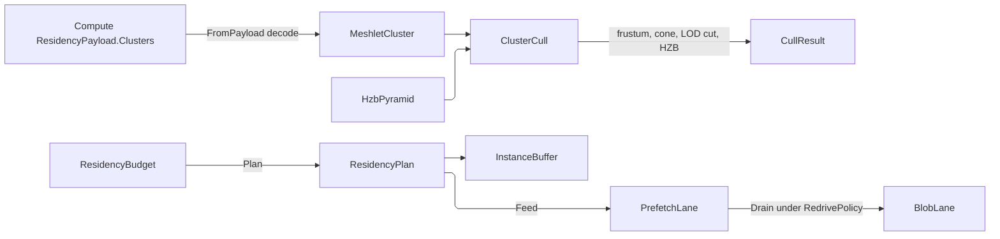

# [APPUI_RENDER_MESHLETS]

The geometry-virtualization and residency owners for the infinite viewport consume Compute's meshopt-built, cone-carrying `ResidencyMeshlet` descriptors with monotonic error columns. This page owns selection — hysteretic LOD, the cull ladder, bindless residency, budget-bounded prefetch, and massive instancing — while Compute owns clustering. `ResidencyBudget` constrains the out-of-core scene by VRAM, the render graph draws the selected clusters, and the path tracer builds its private BVH over their decoded bounds. Compute's `meshlet-cluster` payload, the Persistence blob lane, and the shared wgpu device supply the substrate.

## [01]-[INDEX]

- [02]-[CLUSTER_CONSUMPTION]: Payload-cluster decode; the LOD selection algebra; the raised cull ladder.
- [03]-[RESIDENCY_BUDGET]: VRAM-budget residency, the drained prefetch lane, out-of-core streaming.

## [02]-[CLUSTER_CONSUMPTION]

- Owner: `MeshletKey` the descriptor-derived cluster identity inside one payload; `MeshletCluster` the cluster scene over Compute's `ResidencyMeshlet` values and decoded `ResidencyRuns`; `ClusterHit` the per-hit interpolated attribute answer; `BindlessChannel` the declared vertex-stream vocabulary with `BindlessTable` its slot table; `ClusterCull` the cull-ladder fold and the two-phase draw schedule; `CullResult` the frame's cut carrying both HZB phases; `CutPhase` `[SmartEnum]` the phase selector one geometry row carries; `DrawCut` the phase-narrowed draw value; `HzbPyramid` the prior-frame depth pyramid the composition-bound cull arrow builds and fills.
- Entry: `MeshletCluster.FromPayload(GpuBackend backend, ResidencyPayload payload, LodPolicy lod)` — `Fin` admission proving the payload kind AND every span invariant the sampler later reads bare, all breaches accumulated on `Validation`; `Sample(int cluster, (double X, double Y, double Z) at)` resolves the nearest-triangle interpolated normal, UV, and UV-gradient tangent for a hit on one cluster — the `Render/pathtrace#BSDF_SHADING` `SurfaceAttribution` closure binds it at composition, and `None` (an unmapped source: empty UV run) is the typed absence the bounding-proxy parameterization fills; `Visible(Frustum frustum, ViewCamera camera, double lodScale, Option<HzbPyramid> hzb, double nearPlane)` executes the full ladder over admitted inputs and returns the advanced immutable cull owner with its cut, totally — the rail belongs to the composition-bound `RenderPass.Cull` delegate, whose HZB build can genuinely refuse; `ClusterCull.DrawRows(string key, Func<RenderTarget, FrameView, DrawCut, Fin<long>> submit)` — the ONE mint of the ladder's scheduled geometry rows, which the pass-roster composition binds when it assembles the graph (`Render/pipeline#RENDER_GRAPH` Law).
- Auto: the clusters arrive Compute-built — meshopt clustering, REAL per-cluster bounds, REAL cone apex/axis/cutoff, a measured per-cluster `Curvature` bound the `Render/pathtrace` ray-cone footprint consumes unchanged, `Option`-shaped `Parent`/`ParentError` a root simply lacks, the realized `Cut` boundary-vertex count, and error columns monotonic BY CONSTRUCTION (`ParentError >= Error` on the `payload.md` row), so cut well-formedness rides the producer guarantee and this page re-verifies nothing semantic; the LOD SELECTION ALGEBRA is AppUi's own: the per-cluster error bound projects to screen space under the camera row, the `LodPolicy` pixel threshold picks the cut (`Projected(Error) <= threshold < Projected(ParentError)` — exactly one cluster per subtree by monotonicity, an absent `ParentError` the subtree's own terminus), and the hysteresis band on the same policy row keeps a prior-cut cluster selected until its error crosses the threshold by the band so a dolly move never flickers the cut; the cull ladder is RAISED past cone parity: frustum → wire-cone backface (meshopt's EXACT apex-anchored test over the producer's own `ConeApex`; a cutoff of -1 is the encoder's own no-usable-cone row and never rejects, and an eye inside the bounding sphere never rejects) → LOD cut → prior-frame depth-pyramid two-phase occlusion; `CullResult` stores the two phases and derives the joined draw set, and `CutPhase` is how a `Render/pipeline` geometry row names the phase it draws while `DrawRows` folds every STEPPED phase into a row off one submit arrow; bindless resource indices resolve through the declared `BindlessChannel` vocabulary, so a draw names a resource by row, never a per-draw bind or a bare string.
- Packages: Thinktecture.Runtime.Extensions, Generator.Equals, LanguageExt.Core, Rasm.Compute (project), Silk.NET.WebGPU
- Growth: a new LOD policy is one `LodPolicy` value; a new vertex-stream channel is one `BindlessChannel` row; a new cull phase is one ladder row and one `CutPhase` row carrying its `Step` ordinal, which `DrawRows` folds with no schedule edit; a new producer evidence column lands once on Compute's `ResidencyMeshlet` and is immediately reachable here without a mirror edit; zero new surface.
- Boundary: cluster geometry arrives as Compute's `ResidencyPayload`, every per-cluster fact remains the producer's `ResidencyMeshlet`, and every per-vertex attribute read crosses through Compute's `Residency.Runs` projection — AppUi neither clusters, re-tessellates, decodes a stream itself, nor transcribes the producer descriptor. Direct consumption makes a producer field rename or type change break at the actual read; no synchronized descriptor copy stands between them. `MeshletKey.Of` derives only the three columns needed to remember a cut inside one payload, while the owning `MeshletCluster.ContentKey` carries payload identity. The HZB mip chain (farthest-depth reduction, one compute pass on the shared device) is BUILT INSIDE the composition-bound `RenderPass.Cull` arrow that owns the device encoder — `HzbPyramid` is the typed carrier that arrow fills, `Option.None` the capability fallback (`QueryType.Occlusion`), and a page-local build entry would be a device owner this page is forbidden to hold. GPU multi-draw consumes `RenderPassEncoderMultiDrawIndexedIndirectCount`, push constants, and the pipeline's `WgpuFrameEvidence` retirement and timestamp lanes, so no meshlet-local fence, timer, or evidence owner exists. TAA motion vectors occupy one `BindlessChannel` row.

```csharp
// --- [TYPES] ---------------------------------------------------------------------------
public readonly record struct BoundingSphere(double X, double Y, double Z, double Radius);

public readonly record struct MeshletKey(int Level, int VertexOffset, int TriangleOffset) {
    public static MeshletKey Of(ResidencyMeshlet cluster) =>
        new(cluster.Level, cluster.VertexOffset, cluster.TriangleOffset);
}

[SmartEnum<string>]
[KeyMemberEqualityComparer<ComparerAccessors.StringOrdinal, string>]
public sealed partial class BindlessChannel {
    public static readonly BindlessChannel Position = new("position");
    public static readonly BindlessChannel Normal = new("normal");
    public static readonly BindlessChannel Uv = new("uv");
    public static readonly BindlessChannel Color = new("color");
    public static readonly BindlessChannel MotionVector = new("motion-vector");
}

public static class BindlessTable {
    private static readonly FrozenDictionary<BindlessChannel, int> Slots =
        toSeq(BindlessChannel.Items).Map(static (index, row) => (Row: row, Index: index))
            .ToFrozenDictionary(static slot => slot.Row, static slot => slot.Index);

    public static int Slot(BindlessChannel channel) => Slots[channel];
}

public static class MeshletGeometry {
    extension(ResidencyMeshlet cluster) {
        public BoundingSphere Bounds =>
            new(cluster.Center.X, cluster.Center.Y, cluster.Center.Z, cluster.Radius);
    }
}

// --- [MODELS] --------------------------------------------------------------------------
public sealed record LodPolicy(double PixelThreshold, double HysteresisBand) {
    public static readonly LodPolicy Default = new(PixelThreshold: 1.0, HysteresisBand: 0.25);
}

public readonly record struct Frustum(Seq<(double A, double B, double C, double D)> Planes) {
    public bool Intersects(BoundingSphere sphere) =>
        Planes.ForAll(plane => (plane.A * sphere.X) + (plane.B * sphere.Y) + (plane.C * sphere.Z) + plane.D >= -sphere.Radius);
}

public sealed record HzbPyramid(int Width, int Height, int MipLevels, Func<int, double, double, double> SampleFarDepth) {
    public bool Occluded(ResidencyMeshlet cluster, ViewCamera camera, double nearPlane) =>
        ScreenExtent(cluster.Bounds, camera, nearPlane) switch {
            var extent when extent.Depth <= nearPlane => false,
            var extent => extent.Depth > SampleFarDepth(
                Math.Clamp((int)Math.Ceiling(Math.Log2(Math.Max(extent.RadiusPx * 2d, 1d))), 0, Math.Max(MipLevels - 1, 0)),
                extent.X, extent.Y),
        };

    (double X, double Y, double RadiusPx, double Depth) ScreenExtent(BoundingSphere bounds, ViewCamera camera, double nearPlane) {
        CameraFrame frame = camera.Frame;
        ((double fx, double fy, double fz), (double rx, double ry, double rz), (double ux, double uy, double uz)) = OracleFrame.OfCamera(frame);
        (double cx, double cy, double cz) = (bounds.X - frame.Eye.X, bounds.Y - frame.Eye.Y, bounds.Z - frame.Eye.Z);
        double z = (cx * fx) + (cy * fy) + (cz * fz);
        double x = (cx * rx) + (cy * ry) + (cz * rz);
        double y = (cx * ux) + (cy * uy) + (cz * uz);
        double depth = z - bounds.Radius;
        return camera.Switch(
            state: (Owner: this, X: x, Y: y, Z: z, Depth: depth, Radius: bounds.Radius, Near: nearPlane),
            perspective: static (state, lens) => {
                double half = Math.Tan(double.DegreesToRadians(lens.FieldOfViewDeg) / 2d);
                double safeZ = Math.Max(state.Z, state.Near);
                double aspect = state.Owner.Width / (double)state.Owner.Height;
                return (
                    (((state.X / (safeZ * half * aspect)) * 0.5) + 0.5) * state.Owner.Width,
                    (0.5 - ((state.Y / (safeZ * half)) * 0.5)) * state.Owner.Height,
                    (state.Radius / safeZ) * (state.Owner.Height / (2d * half)),
                    state.Depth);
            },
            orthographic: static (state, lens) => {
                double pxPerUnit = state.Owner.Height / Math.Max(lens.ViewHeight, OrthoHeightFloor);
                return (
                    (state.X * pxPerUnit) + (state.Owner.Width / 2d),
                    (state.Owner.Height / 2d) - (state.Y * pxPerUnit),
                    state.Radius * pxPerUnit,
                    state.Depth);
            },
            asymmetric: static (state, lens) => {
                (double tanL, double tanR, double tanU, double tanD) =
                    (Math.Tan(lens.AngleLeft), Math.Tan(lens.AngleRight), Math.Tan(lens.AngleUp), Math.Tan(lens.AngleDown));
                (double halfX, double centerX, double halfY, double centerY) =
                    ((tanR - tanL) / 2d, (tanR + tanL) / 2d, (tanU - tanD) / 2d, (tanU + tanD) / 2d);
                double safeZ = Math.Max(state.Z, state.Near);
                return (
                    ((((state.X / safeZ) - centerX) / (2d * halfX)) + 0.5) * state.Owner.Width,
                    (0.5 - (((state.Y / safeZ) - centerY) / (2d * halfY))) * state.Owner.Height,
                    (state.Radius / safeZ) * (state.Owner.Height / (2d * halfY)),
                    state.Depth);
            });
    }

    private const double OrthoHeightFloor = 1e-6;
}

public sealed record CullState(LanguageExt.HashSet<MeshletKey> PriorCut, LanguageExt.HashSet<MeshletKey> PriorVisible);

public sealed record CullResult(Seq<ResidencyMeshlet> PriorVisible, Seq<ResidencyMeshlet> OcclusionRetest, CullState Next) {
    public static readonly CullResult Empty =
        new(Seq<ResidencyMeshlet>(), Seq<ResidencyMeshlet>(), new CullState([], []));

    public Seq<ResidencyMeshlet> Draw => PriorVisible + OcclusionRetest;
}

[SmartEnum<string>]
public sealed partial class CutPhase {
    public static readonly CutPhase Prior = new("prior-visible", Some(0), static result => result.PriorVisible);
    public static readonly CutPhase Retest = new("occlusion-retest", Some(1), static result => result.OcclusionRetest);
    public static readonly CutPhase Whole = new("whole-cut", Option<int>.None, static result => result.Draw);

    public Option<int> Step { get; }

    [UseDelegateFromConstructor]
    public partial Seq<ResidencyMeshlet> Select(CullResult result);
}

public readonly record struct DrawCut(MeshletCluster Cluster, Seq<ResidencyMeshlet> Views) {
    public long Triangles => Views.Fold(0L, static (sum, view) => sum + view.TriangleCount);

    public Seq<InstanceBuffer> Instances => Cluster.Instances;
}

// --- [OPERATIONS] ----------------------------------------------------------------------
public static class ClusterCull {
    public static Seq<RenderPass> DrawRows(string key, Func<RenderTarget, FrameView, DrawCut, Fin<long>> submit) =>
        toSeq(CutPhase.Items)
            .Choose(phase => phase.Step.Map(step => (Step: step, Phase: phase)))
            .OrderBy(static row => row.Step).ToSeq()
            .Map(row => (RenderPass)new RenderPass.Geometry(
                $"{key}/{row.Phase.Key}", row.Phase, static cut => cut.Triangles, submit));

    public static CullResult Cull(
        Seq<ResidencyMeshlet> clusters,
        Frustum frustum,
        ViewCamera camera,
        double lodScale,
        LodPolicy lod,
        CullState prior,
        Option<HzbPyramid> hzb,
        double nearPlane) =>
        clusters
            .Filter(cluster => frustum.Intersects(cluster.Bounds))
            .Filter(cluster => !BackfaceReject(cluster, camera))
            .Filter(cluster => InCut(cluster, camera, lodScale, lod, prior.PriorCut)) switch {
            var cut => hzb.Match(
                    Some: pyramid => cut.Partition(cluster => prior.PriorVisible.Contains(MeshletKey.Of(cluster))) switch {
                        var (seen, fresh) => (Phase1: seen.ToSeq(),
                                              Retest: fresh.ToSeq().Filter(cluster => !pyramid.Occluded(cluster, camera, nearPlane))),
                    },
                    None: () => (Phase1: cut, Retest: Seq<ResidencyMeshlet>())) switch {
                var phases => new CullResult(
                    phases.Phase1,
                    phases.Retest,
                    new CullState(
                        toHashSet(cut.Map(MeshletKey.Of)),
                        toHashSet((phases.Phase1 + phases.Retest).Map(MeshletKey.Of)))),
            },
        };

    public static bool BackfaceReject(ResidencyMeshlet cluster, ViewCamera camera) =>
        cluster.ConeCutoff > -1f
        && camera.Frame switch {
            var frame => (
                Cx: cluster.Center.X - frame.Eye.X,
                Cy: cluster.Center.Y - frame.Eye.Y,
                Cz: cluster.Center.Z - frame.Eye.Z) switch {
                var c when Math.Sqrt((c.Cx * c.Cx) + (c.Cy * c.Cy) + (c.Cz * c.Cz)) <= cluster.Radius => false,
                _ => (
                    Ax: cluster.ConeApex.X - frame.Eye.X,
                    Ay: cluster.ConeApex.Y - frame.Eye.Y,
                    Az: cluster.ConeApex.Z - frame.Eye.Z) switch {
                    var a => Math.Max(Math.Sqrt((a.Ax * a.Ax) + (a.Ay * a.Ay) + (a.Az * a.Az)), ConeReachFloor) switch {
                        var reach => (((cluster.ConeAxis.X * a.Ax) + (cluster.ConeAxis.Y * a.Ay) + (cluster.ConeAxis.Z * a.Az)) / reach)
                            >= cluster.ConeCutoff,
                    },
                },
            },
        };

    private const double ConeReachFloor = 1e-9;

    public static bool InCut(ResidencyMeshlet cluster, ViewCamera camera, double lodScale, LodPolicy lod, LanguageExt.HashSet<MeshletKey> priorCut) =>
        (lod.PixelThreshold * (priorCut.Contains(MeshletKey.Of(cluster)) ? 1d + lod.HysteresisBand : 1d)) switch {
            var threshold =>
                Projected(cluster.Error, cluster.Bounds, camera) * lodScale <= threshold
                && cluster.ParentError.Match(
                    Some: parent => Projected(parent, cluster.Bounds, camera) * lodScale > threshold,
                    None: () => true),
        };

    public static double Projected(double error, BoundingSphere bounds, ViewCamera camera) {
        CameraFrame frame = camera.Frame;
        (double dx, double dy, double dz) = (bounds.X - frame.Eye.X, bounds.Y - frame.Eye.Y, bounds.Z - frame.Eye.Z);
        double distance = Math.Max(Math.Sqrt((dx * dx) + (dy * dy) + (dz * dz)) - bounds.Radius, ProjectionFloor);
        return error / distance;
    }

    private const double ProjectionFloor = 1e-6;
}

// --- [COMPOSITION] ---------------------------------------------------------------------
public readonly record struct ClusterHit(
    (double X, double Y, double Z) Normal,
    (double X, double Y, double Z) Tangent,
    (double U, double V) Uv,
    double Distance);

[Equatable]
public sealed partial record MeshletCluster(
    UInt128 ContentKey,
    GpuBackend Backend,
    Seq<ResidencyMeshlet> Clusters,
    [property: IgnoreEquality] ResidencyRuns Runs,
    LodPolicy Lod,
    long Triangles,
    [property: IgnoreEquality] CullState State,
    [property: IgnoreEquality] Seq<InstanceBuffer> Instances) {
    public static Fin<MeshletCluster> FromPayload(GpuBackend backend, ResidencyPayload payload, LodPolicy lod) =>
        payload.Kind == ResidencyKind.MeshletCluster
            ? Residency.Runs(payload)
                .Bind(runs => Proven(payload, runs).Map(_ => new MeshletCluster(
                    payload.ContentKey,
                    backend,
                    payload.Clusters,
                    runs,
                    lod,
                    payload.Clusters.Sum(static row => (long)row.TriangleCount),
                    new CullState([], []),
                    Seq<InstanceBuffer>())))
            : Fin.Fail<MeshletCluster>(new ViewportFault.ContextUnavailable($"meshlets/payload-kind: {payload.Kind} is not meshlet-cluster"));

    static Fin<Unit> Proven(ResidencyPayload payload, ResidencyRuns runs) {
        int positions = runs.Positions.Length / 3;
        long maxEntry = MaxEntry(runs.MeshletVertices.Span);
        Validation<Error, Unit> triangles = payload.Clusters.ForAll(row =>
                row.TriangleOffset >= 0 && (long)row.TriangleOffset + (3L * row.TriangleCount) <= runs.MeshletTriangles.Length)
            ? unit
            : (Error)new ViewportFault.ContextUnavailable("meshlets/spans: a cluster's triangle window exceeds the raw triangle bytes");
        Validation<Error, Unit> table = payload.Clusters.ForAll(row =>
                row.VertexOffset >= 0 && (long)row.VertexOffset + row.VertexCount <= runs.MeshletVertices.Length)
            ? unit
            : (Error)new ViewportFault.ContextUnavailable("meshlets/spans: a cluster's vertex window exceeds the vertex table");
        Validation<Error, Unit> entries = maxEntry < positions
            ? unit
            : (Error)new ViewportFault.ContextUnavailable($"meshlets/spans: vertex-table entry {maxEntry} exceeds {positions} positions");
        Validation<Error, Unit> parallel = (runs.Normals.IsEmpty || runs.Normals.Length == runs.Positions.Length)
            && (runs.Uvs.IsEmpty || runs.Uvs.Length / 2 == positions)
            ? unit
            : (Error)new ViewportFault.ContextUnavailable("meshlets/spans: normals or uvs run disagrees with the position run");
        return (triangles, table, entries, parallel)
            .Apply(static (_, _, _, _) => unit)
            .ToFin();
    }

    static long MaxEntry(ReadOnlySpan<uint> table) {
        long max = -1L;
        foreach (uint entry in table) { if (entry > max) { max = entry; } }
        return max;
    }

    public Option<ClusterHit> Sample(int cluster, (double X, double Y, double Z) at) {
        if (Runs.Uvs.IsEmpty || cluster < 0 || cluster >= Clusters.Count) { return None; }
        ResidencyMeshlet view = Clusters[cluster];
        ReadOnlySpan<float> positions = Runs.Positions.Span;
        ReadOnlySpan<uint> table = Runs.MeshletVertices.Span;
        ReadOnlySpan<byte> triangles = Runs.MeshletTriangles.Span;
        (double best, (int A, int B, int C) corner, (double U, double V, double W) bary) =
            (double.MaxValue, (0, 0, 0), (0d, 0d, 0d));
        for (int t = 0; t < view.TriangleCount; t++) {
            (int a, int b, int c) = (
                (int)table[view.VertexOffset + triangles[view.TriangleOffset + (t * 3)]],
                (int)table[view.VertexOffset + triangles[view.TriangleOffset + (t * 3) + 1]],
                (int)table[view.VertexOffset + triangles[view.TriangleOffset + (t * 3) + 2]]);
            (double u, double v, double w, double distance) = Closest(positions, a, b, c, at);
            if (distance < best) { (best, corner, bary) = (distance, (a, b, c), (u, v, w)); }
        }
        return best is double.MaxValue
            ? None
            : Some(Interpolated(positions, Runs.Normals.Span, Runs.Uvs.Span, corner, bary, best));
    }

    static ClusterHit Interpolated(
        ReadOnlySpan<float> positions,
        ReadOnlySpan<float> normals,
        ReadOnlySpan<float> uvs,
        (int A, int B, int C) corner,
        (double U, double V, double W) bary,
        double distance) {
        (int a, int b, int c) = corner;
        (double u, double v, double w) = bary;
        (double X, double Y, double Z) normal = OracleFrame.Normalize(normals.IsEmpty
            ? FaceNormal(positions, a, b, c)
            : (
                (u * normals[a * 3]) + (v * normals[b * 3]) + (w * normals[c * 3]),
                (u * normals[(a * 3) + 1]) + (v * normals[(b * 3) + 1]) + (w * normals[(c * 3) + 1]),
                (u * normals[(a * 3) + 2]) + (v * normals[(b * 3) + 2]) + (w * normals[(c * 3) + 2])));
        return new ClusterHit(
            normal,
            Unwrap(positions, uvs, a, b, c, normal),
            (
                (u * uvs[a * 2]) + (v * uvs[b * 2]) + (w * uvs[c * 2]),
                (u * uvs[(a * 2) + 1]) + (v * uvs[(b * 2) + 1]) + (w * uvs[(c * 2) + 1])),
            distance);
    }

    const double UvDeterminantFloor = 1e-12;

    static (double X, double Y, double Z) Unwrap(
        ReadOnlySpan<float> positions, ReadOnlySpan<float> uvs, int a, int b, int c, (double X, double Y, double Z) normal) {
        (double uab, double vab) = (uvs[b * 2] - uvs[a * 2], uvs[(b * 2) + 1] - uvs[(a * 2) + 1]);
        (double uac, double vac) = (uvs[c * 2] - uvs[a * 2], uvs[(c * 2) + 1] - uvs[(a * 2) + 1]);
        (double ex, double ey, double ez) =
            (positions[b * 3] - positions[a * 3], positions[(b * 3) + 1] - positions[(a * 3) + 1], positions[(b * 3) + 2] - positions[(a * 3) + 2]);
        (double fx, double fy, double fz) =
            (positions[c * 3] - positions[a * 3], positions[(c * 3) + 1] - positions[(a * 3) + 1], positions[(c * 3) + 2] - positions[(a * 3) + 2]);
        return OracleFrame.Of(normal, ((uab * vac) - (uac * vab)) switch {
            var det when Math.Abs(det) > UvDeterminantFloor =>
                (((ex * vac) - (fx * vab)) / det, ((ey * vac) - (fy * vab)) / det, ((ez * vac) - (fz * vab)) / det),
            _ => default,
        }).Tangent;
    }

    static (double U, double V, double W, double Distance) Closest(ReadOnlySpan<float> positions, int a, int b, int c, (double X, double Y, double Z) p) {
        (double ax, double ay, double az) = (positions[a * 3], positions[(a * 3) + 1], positions[(a * 3) + 2]);
        (double bx, double by, double bz) = (positions[b * 3] - ax, positions[(b * 3) + 1] - ay, positions[(b * 3) + 2] - az);
        (double cx, double cy, double cz) = (positions[c * 3] - ax, positions[(c * 3) + 1] - ay, positions[(c * 3) + 2] - az);
        (double px, double py, double pz) = (p.X - ax, p.Y - ay, p.Z - az);
        (double d00, double d01, double d11) = ((bx * bx) + (by * by) + (bz * bz), (bx * cx) + (by * cy) + (bz * cz), (cx * cx) + (cy * cy) + (cz * cz));
        (double d20, double d21) = ((px * bx) + (py * by) + (pz * bz), (px * cx) + (py * cy) + (pz * cz));
        double denom = Math.Max((d00 * d11) - (d01 * d01), 1e-24);
        double v = Math.Clamp(((d11 * d20) - (d01 * d21)) / denom, 0d, 1d);
        double w = Math.Clamp(((d00 * d21) - (d01 * d20)) / denom, 0d, 1d - v);
        (double qx, double qy, double qz) = ((v * bx) + (w * cx) - px, (v * by) + (w * cy) - py, (v * bz) + (w * cz) - pz);
        return (1d - v - w, v, w, Math.Sqrt((qx * qx) + (qy * qy) + (qz * qz)));
    }

    static (double X, double Y, double Z) FaceNormal(ReadOnlySpan<float> positions, int a, int b, int c) =>
        OracleFrame.Cross(
            positions[b * 3] - positions[a * 3], positions[(b * 3) + 1] - positions[(a * 3) + 1], positions[(b * 3) + 2] - positions[(a * 3) + 2],
            positions[c * 3] - positions[a * 3], positions[(c * 3) + 1] - positions[(a * 3) + 1], positions[(c * 3) + 2] - positions[(a * 3) + 2]);

    public (MeshletCluster Cluster, CullResult Result) Visible(Frustum frustum, ViewCamera camera, double lodScale, Option<HzbPyramid> hzb, double nearPlane) =>
        ClusterCull.Cull(Clusters, frustum, camera, lodScale, Lod, State, hzb, nearPlane) switch {
            CullResult result => (this with { State = result.Next }, result),
        };
}

```

## [03]-[RESIDENCY_BUDGET]

- Owner: `ResidencyTile` the streamable geometry page; `ResidencyBudget` the VRAM-budget residency manager; `PrefetchLane` the bounded drained prefetch channel; `ResidencyPool` the fanned byte-level vocabulary; `InstanceBuffer` the massive-instancing draw row.
- Entry: `Plan(Frustum frustum, (double X, double Y, double Z) camera, (double X, double Y, double Z) velocity, QualityVerdict quality, long frame, ResidencyPlan prior)` — one state transition per frame: the prior plan IS the resident-set state, and the next plan accounts for every resident, visible, evicted, instanced, and prefetched tile in ONE walk of the tile map. The byte bound is DERIVED here, never passed — `min(DeviceVramBytes, Watermark × quality.Tier.WatermarkFactor)` — because the device lease is a budget column and the factor is the governor's own tier lever; a non-positive derived bound refuses by name rather than sealing an empty resident set as a successful plan (`FORGED_ZERO`); `PrefetchLane.Feed(plan)` — the plan's prefetch set enters the bounded channel, a superseded request dropping oldest-first onto the counted `itemDropped` cell; `PrefetchLane.Drain(upload, policy, fault, token)` — the one consumer: each blob read re-drives under the kernel `RedrivePolicy` curve, hands its bytes to the composition-bound uploader, and routes an exhausted read to the composition fault sink; `Observe(InstrumentSet set, ResidencyPlan plan)` — the level writes, `Fin<Unit>` because its one binder discards the plan it already holds.
- Auto: residency keys each tile by the payload's own `ContentKey` and tracks its byte cost and last-touch frame; the transition classifies every tile in one fold — frustum-visible touched at `frame`, prior residents carried at their old touch, velocity-reachable non-residents as prefetch candidates — admits the resident union in touch-recency order under the byte budget, EVICTS every prior resident absent from the next set, and admits prefetch greedily into the remaining byte headroom only; the scene's `Placements` roster groups by payload key over the ADMITTED set alone into one `InstanceBuffer` per mesh, and the graph's frame-retire seat (`Render/pipeline#RENDER_GRAPH` `Observe`) writes that run onto the frame's `MeshletCluster` so the geometry draw reads repetitions off `DrawCut.Instances`; the byte totals are DERIVATIONS of the sets they describe, so no mirrored column can disagree with its own roster.
- Packages: Thinktecture.Runtime.Extensions, LanguageExt.Core, Rasm.Persistence (project), BCL inbox (`System.Threading.Channels`)
- Growth: a new residency policy is one watermark value; a new byte pool is one `ResidencyPool` row; a new instance channel is one `InstanceBuffer` column; zero new surface.
- Boundary: a plan that overruns the VRAM budget evicts before it admits, and a non-positive derived bound refuses as `ViewportFault.BudgetExceeded`; `Render/pipeline#RENDER_GRAPH` `RenderGraph.Observe` is the ONE binder of `ResidencyBudget.Observe` — it takes the frame's accepted plan beside its sealed `FrameReceipt`, so the evict, prefetch, and pool gauges read the plan THIS frame drew; tile bytes stream from the Persistence blob lane as opaque payloads through the `BlobLane` seam so the residency manager never opens files, and the lane's read is the canonical transient class — it re-drives under the kernel `RedrivePolicy` the composition elects, never a hand backoff; the prefetch CHANNEL replaces the undrained per-frame request seq: bounded, drop-oldest (a superseded prefetch is exactly the stale item the bound sheds), its drop count a measured cell and its depth the level the instrument family reads; the GPU upload of a resident tile to a bindless slot rides the `Render/pipeline` render-graph lease; the web leg's generated `GeometryResidency` mints at `Render/pipeline` directly off the resident set, so the residency owner mints no wire or manifest wrapper; the watermark scales by the governor tier's own `WatermarkFactor` — one quality authority; the tile-candidacy walk is LINEAR over the tile map by refusal — the kernel `SpatialIndex` seat is listed for the composition that owns the arrow, and until it lands one walk per frame is the honest cost stated here rather than two.

```csharp
// --- [MODELS] --------------------------------------------------------------------------
public readonly record struct ResidencyTile(
    UInt128 ContentKey,
    long Bytes,
    BoundingSphere Bounds,
    long LastTouch);

public readonly record struct InstanceTransform(
    double M11, double M12, double M13, double M14,
    double M21, double M22, double M23, double M24,
    double M31, double M32, double M33, double M34);

public readonly record struct InstancePlacement(UInt128 ContentKey, InstanceTransform Transform);

public sealed record InstanceBuffer(UInt128 ContentKey, Seq<InstanceTransform> Transforms);

public readonly record struct PrefetchRequest(UInt128 ContentKey, long Bytes);

public sealed record ResidencyPlan(
    Seq<ResidencyTile> Resident,
    Seq<UInt128> Evict,
    Seq<InstanceBuffer> Instances,
    Seq<PrefetchRequest> Prefetch,
    long Frame) {
    public static readonly ResidencyPlan Boot =
        new(Seq<ResidencyTile>(), Seq<UInt128>(), Seq<InstanceBuffer>(), Seq<PrefetchRequest>(), 0L);

    public long ResidentBytes => Resident.Fold(0L, static (sum, tile) => sum + tile.Bytes);

    public long PrefetchBytes => Prefetch.Fold(0L, static (sum, request) => sum + request.Bytes);
}

public sealed record BlobLane(Func<UInt128, IO<ReadOnlyMemory<byte>>> Read);

// --- [SERVICES] ------------------------------------------------------------------------
public sealed record ResidencyBudget(
    HashMap<UInt128, ResidencyTile> Tiles,
    Seq<InstancePlacement> Placements,
    BlobLane Blobs,
    long DeviceVramBytes,
    long Watermark,
    double PrefetchLeadSeconds,
    double PrefetchSlack) {
    public Fin<long> EffectiveBytes(QualityVerdict quality) =>
        Math.Min(DeviceVramBytes, (long)(Watermark * quality.Tier.WatermarkFactor)) switch {
            > 0L and var bytes => Fin.Succ(bytes),
            var bytes => Fin.Fail<long>(new ViewportFault.BudgetExceeded(
                $"residency/budget: min(device {DeviceVramBytes}b, watermark {Watermark}b x {quality.Tier.WatermarkFactor}) resolved to {bytes}b")),
        };

    public Fin<ResidencyPlan> Plan(Frustum frustum, (double X, double Y, double Z) camera, (double X, double Y, double Z) velocity, QualityVerdict quality, long frame, ResidencyPlan prior) =>
        from budget in EffectiveBytes(quality)
        let sorted = Classified(frustum, camera, velocity, frame, prior)
        let admitted = Admit(sorted.Candidates, budget)
        let kept = toHashSet(admitted.Kept.Map(static tile => tile.ContentKey))
        let prefetch = Prefetchable(sorted.Reachable, kept, budget - admitted.Bytes)
        select new ResidencyPlan(
            Resident: admitted.Kept,
            Evict: prior.Resident.Map(static tile => tile.ContentKey).Filter(key => !kept.Contains(key)),
            Instances: Instanced(kept),
            Prefetch: prefetch,
            Frame: frame);

    private (Seq<ResidencyTile> Candidates, Seq<ResidencyTile> Reachable) Classified(
        Frustum frustum, (double X, double Y, double Z) camera, (double X, double Y, double Z) velocity, long frame, ResidencyPlan prior) {
        (double X, double Y, double Z) ahead =
            (camera.X + (velocity.X * PrefetchLeadSeconds), camera.Y + (velocity.Y * PrefetchLeadSeconds), camera.Z + (velocity.Z * PrefetchLeadSeconds));
        (Seq<ResidencyTile> visible, Seq<ResidencyTile> reachable) = toSeq(Tiles.Values).Fold(
            (Visible: Seq<ResidencyTile>(), Reachable: Seq<ResidencyTile>()),
            (state, tile) =>
                frustum.Intersects(tile.Bounds) ? (state.Visible.Add(tile with { LastTouch = frame }), state.Reachable)
                : Reaches(ahead, tile.Bounds) ? (state.Visible, state.Reachable.Add(tile))
                : state);
        Seq<ResidencyTile> candidates = toSeq((visible + prior.Resident)
            .Fold(HashMap<UInt128, ResidencyTile>(), static (held, tile) => held.Find(tile.ContentKey).IsSome ? held : held.Add(tile.ContentKey, tile))
            .Values);
        return (candidates, reachable);
    }

    private bool Reaches((double X, double Y, double Z) ahead, BoundingSphere bounds) =>
        ((ahead.X - bounds.X) * (ahead.X - bounds.X)) + ((ahead.Y - bounds.Y) * (ahead.Y - bounds.Y)) + ((ahead.Z - bounds.Z) * (ahead.Z - bounds.Z))
            <= (bounds.Radius + PrefetchSlack) * (bounds.Radius + PrefetchSlack);

    private static (Seq<ResidencyTile> Kept, long Bytes) Admit(Seq<ResidencyTile> candidates, long vramBytes) =>
        toSeq(candidates.OrderByDescending(static tile => tile.LastTouch))
            .Fold(
                (Kept: Seq<ResidencyTile>(), Bytes: 0L),
                (state, tile) => state.Bytes + tile.Bytes <= vramBytes
                    ? (state.Kept.Add(tile), state.Bytes + tile.Bytes)
                    : state);

    private static Seq<PrefetchRequest> Prefetchable(Seq<ResidencyTile> reachable, LanguageExt.HashSet<UInt128> resident, long headroom) =>
        reachable
            .Filter(tile => !resident.Contains(tile.ContentKey))
            .Fold(
                (Requests: Seq<PrefetchRequest>(), Bytes: 0L),
                (state, tile) => state.Bytes + tile.Bytes <= headroom
                    ? (state.Requests.Add(new PrefetchRequest(tile.ContentKey, tile.Bytes)), state.Bytes + tile.Bytes)
                    : state)
            .Requests;

    private Seq<InstanceBuffer> Instanced(LanguageExt.HashSet<UInt128> resident) =>
        toSeq(Placements
            .Filter(row => resident.Contains(row.ContentKey))
            .Fold(HashMap<UInt128, Seq<InstanceTransform>>(), static (held, row) =>
                held.AddOrUpdate(row.ContentKey, run => run.Add(row.Transform), () => Seq(row.Transform))))
            .Map(static entry => new InstanceBuffer(entry.Key, entry.Value));

    public static readonly InstrumentSpec Evict = InstrumentSpec.Create(
        "rasm.appui.viewport.residency.evict", InstrumentKind.Level, MeasureForm.Whole, "{page}",
        "tiles the current plan marked for eviction", Seq<string>(), None, None, None);

    public static readonly InstrumentSpec Prefetch = InstrumentSpec.Create(
        "rasm.appui.viewport.residency.prefetch", InstrumentKind.Level, MeasureForm.Whole, "{page}",
        "tiles the current plan queued for prefetch", Seq<string>(), None, None, None);

    public static readonly InstrumentSpec Pool = InstrumentSpec.Create(
        "rasm.appui.viewport.residency.pool", InstrumentKind.Levels, MeasureForm.Whole, "By",
        "planned VRAM bytes by residency pool", Seq<string>(), None, Some(AppUiTelemetry.PoolSlot), None);

    public static TelemetryContributorPort TelemetryRow(string version) =>
        AppUiTelemetry.Contribute(version, Evict, Prefetch, Pool);

    public static Fin<Unit> Observe(InstrumentSet set, ResidencyPlan plan) =>
        toSeq(ResidencyPool.Items).TraverseM(row => set.Level(Pool, row.Read(plan), Some(row.Key))).As()
            .Bind(_ => set.Level(Evict, plan.Evict.Count))
            .Bind(_ => set.Level(Prefetch, plan.Prefetch.Count))
            .Map(static _ => unit);
}

[SmartEnum<string>]
public sealed partial class ResidencyPool {
    public static readonly ResidencyPool Resident = new("resident", static plan => plan.ResidentBytes);
    public static readonly ResidencyPool Prefetched = new("prefetch", static plan => plan.PrefetchBytes);

    [UseDelegateFromConstructor]
    public partial long Read(ResidencyPlan plan);
}

// --- [COMPOSITION] ---------------------------------------------------------------------
public sealed class PrefetchLane {
    private static readonly Op Fetch = Op.Of(name: "appui.meshlet.prefetch");
    private readonly Channel<PrefetchRequest> queue;
    private readonly Atom<long> shed = Atom(0L);

    private PrefetchLane(Channel<PrefetchRequest> queue) => this.queue = queue;

    public static Fin<PrefetchLane> Of(int capacity, Op key) =>
        capacity > 0
            ? Fin.Succ(new PrefetchLane(Channel.CreateBounded<PrefetchRequest>(
                new BoundedChannelOptions(capacity) { FullMode = BoundedChannelFullMode.DropOldest, SingleReader = true })))
            : Fin.Fail<PrefetchLane>(key.InvalidInput());

    public long Shed => shed.Value;

    public Unit Feed(ResidencyPlan plan) =>
        plan.Prefetch.Iter(request => ignore(queue.Writer.TryWrite(request) ? unit : ignore(shed.Swap(static held => held + 1L))));

    public IO<Unit> Drain(
        BlobLane blobs, Func<UInt128, ReadOnlyMemory<byte>, IO<Fin<Unit>>> upload,
        RedrivePolicy policy, Action<Error> fault, CancellationToken token) =>
        IO.liftAsync(async () => {
            await foreach (PrefetchRequest request in queue.Reader.ReadAllAsync(token)) {
                Fin<ReadOnlyMemory<byte>> bytes = await Fetch.Catch(async _ =>
                    Fin.Succ(await IO.retry(policy.Curve, blobs.Read(request.ContentKey)).RunAsync().ConfigureAwait(false)), token)
                    .ConfigureAwait(false);
                await bytes.Match(
                    Succ: async payload => {
                        Fin<Unit> landed = await Fetch.Catch(async _ =>
                            await upload(request.ContentKey, payload).RunAsync().ConfigureAwait(false), token)
                            .ConfigureAwait(false);
                        ignore(landed.IfFail(fun(fault)));
                        return unit;
                    },
                    Fail: error => { fault(error); return ValueTask.FromResult(unit); });
            }
            return unit;
        });

    public Unit Close() => ignore(queue.Writer.TryComplete());
}
```



## [04]-[GPU_BOUNDARY]

- [VIEWPORT_GPU]: the shared-device lease owns bindless upload, the HZB farthest-depth reduction, `RenderPassEncoderMultiDrawIndexedIndirectCount`, and `RenderPassEncoderSetPushConstants`. Submission and timing compose the pipeline `WgpuFrameEvidence` lane, so meshlet selection owns no fence, timer, query set, or device lifetime.
- [PAYLOAD_COLUMNS]: this page's consumer obligations against the frozen producer descriptor — the `Option`-shaped `Parent`/`ParentError` ARE the LOD chain's terminus facts (no consumer level cap re-derives them); `ConeApex` makes the backface test the exact apex-anchored one; `Shell` scopes any parent search so connectivity is never re-derived here; `Curvature` feeds the `Render/pathtrace` ray-cone spread unchanged; `Cut` crosses to the wire so a build-strategy comparison reads the producer's own figure; `Residency.Runs` is the one attribute decode `Sample` indexes, an empty `uvs` run the payload's own declaration that the source carried no unwrap.

## [05]-[RESEARCH]

(none)
