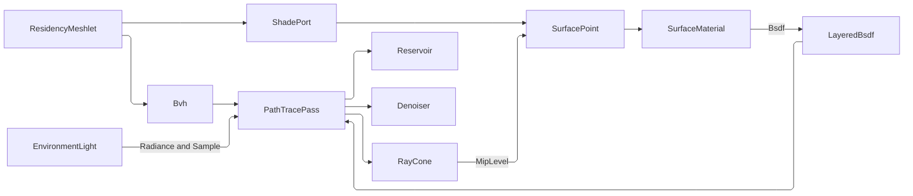

# [APPUI_RENDER_PATHTRACE]

`PathTracePass` integrates global illumination for the infinite viewport through BVH build-and-refit with ReSTIR reservoirs and progressive denoising, and shades every scene point from `LayeredBsdf`, the product of `SlabStack` lowering and the `MaterialGraph` sink. `PathTracePass` and its oracle kernels own the BVH build/refit, the ReSTIR reservoir, ray-cone texture footprint, progressive accumulation, edge-aware denoise, and exact `LayeredBsdf.Sample`/`Evaluate` consumption at the `PATH_TRACE` boundary; `ShadePort` owns the one composition-bound projection into the Materials `ShadingFrame`/`Direction` vocabulary. `Render/pathtrace.md` owns the light row family both integrators read; `Render/pipeline` schedules the pass, meshlet bounds feed the BVH, the CPU integrator is the correctness oracle, and GPU acceleration consumes the same contracts.

Every appearance value crosses as a Materials VALUE: `ShadePort` resolves a hit into a real parameterization and answers one composition-bound query per hit with the whole `SurfaceMaterial` — layered BSDF, tangent-space normal, opacity, emission — sampled by the Materials `SetBind`/`TextureUv` entries at the point's own UV and ray-cone mip level, so a bound `TextureSet` shades here exactly as it shades on the raster twin and this page mints no sampler, no channel name, and no transfer. Radiance is the scene-linear `RgbSpectrum` throughout — a display-referred host colour never enters the transport — and the world basis is the frozen `+Z`-up OpenPBR frame the environment owner's `WorldDirection` carrier spells structurally. The light rig and the statutory sun study seat here beside their one consumer — the trace that samples them.

## [01]-[INDEX]

- [02]-[PATH_TRACE]: Kernel-owned broad phase over the sanctioned wire, per-ray wire-walk oracle, ReSTIR reservoirs, ray-cone footprint, environment MIS, honest accumulation, denoise.
- [03]-[BSDF_SHADING]: `PathTracePass` shades from the Materials `LayeredBsdf`/`SlabStack`/`SetBind`, never re-deriving lobe math or texture reconstruction.
- [04]-[ACCELERATION_BOUNDARY]: The GPU acceleration boundary and the two Materials boundaries, spelled exactly.
- [05]-[LIGHT_ROWS]: The closed `LightSource` family, its typed `LightKey` identity, and the one unshadowed candidate projection.
- [06]-[SUN_STUDY]: The statutory design-day sweep over the kernel `SolarPosition` almanac.

## [02]-[PATH_TRACE]

- Owner: `Bvh` the trace-accelerator VIEW over the kernel broad phase — build, refit, and the degradation-triggered rebuild are `Rasm/.planning/Spatial/index.md#[02]-[SPATIAL_INDEX]`'s through `SpatialIndex.Build`/`Refit`, the node stream arrives through the one sanctioned `SpatialIndex.Wire` egress exactly as Compute decodes it, and page-local remains ONLY the per-ray wire walk (the measured oracle kernel) with the exact ray-sphere leaf narrow test; `NodeLink` the ONE wire node-link reader this compilation unit holds — `Render/reality.md`'s octree fold composes it, so the packing constants exist once; `Reservoir` the ReSTIR sample reservoir carried per pixel ON the accumulation target, its payload the `Render/pathtrace.md` `LightCandidate`; `SamplePolicy` the light-selection dispatch row; `RayCone` the propagated texture footprint; `TraceLimits` the transport policy row; `PathTracePass` the progressive accumulation pass; `GuidePolicy` the guide-accumulation row family; `Denoiser` the edge-aware denoise fold over the target's own guide plane.
- Law: `RayCone` derives every texture LOD and no caller chooses one — width grows by the spread over the traversed distance, its footprint at the hit divides the plane's texel span into the FRACTIONAL mip level the port samples at, and only the trilinear sampler row honours a fractional level. Spread advances by DISTANCE (`Advanced`) and by CURVATURE (`Scattered` — twice the hit's own measured curvature over the covered footprint, magnitude only, so a concave hit widens rather than focusing without bound). The curvature is Compute's `ResidencyMeshlet.Curvature` producer column carried on `SurfaceAttributes`; a straight-through cut-out transmission scatters no direction and takes no curvature leg. `RayCone` rides the SHADOW segment too, so a blocker's cut-out reads at the blocker's own distance and texel density.
- Law: environment transport is MULTIPLE-IMPORTANCE-SAMPLED, not double-counted — an NEE dome draw and the BSDF continuation escaping into the same dome split one estimate through the balance heuristic, and delta rows report zero density the weight reads as the pass-through case.
- Law: every `SamplePolicy` arm estimates the SAME integral at the SAME energy — RIS weights each streamed candidate by its target over its own source density (uniform streaming ⇒ N× the target), so the reservoir arm and the `Uniform` arm agree on brightness by construction.
- Law: shadow rays honour `geometry_opacity` — sampled opacity below one attenuates a blocker, the walk continuing to `TraceLimits.CutoutSteps` and multiplying transmittance; `TraceLimits` carries the step cap, the opacity floor, and the ray-origin epsilon as policy columns, and its epsilon doubles as the emitter-proximity floor.
- Law: the trace accelerator is built over the cluster owner WHOLE — `Bvh.Build`/`Refit` take `MeshletCluster` and read `Clusters` themselves, so `hit.Primitive` and the ordinal the port resolves are one index space by construction; built over a cut, every hit attributes to a different cluster than the ray struck without a fault, which is why the port closes at the TYPE.
- Exemption: `Integrate` (the scanline nest), `Bvh.Intersect` (the per-ray wire walk with its `[ThreadStatic]` traversal scratch), and `Denoiser.Resolve` (the 3×3 gather) are the page's measured oracle kernels — statement-bodied span work where a per-tap result cannot price (`EXPRESSION_SPINE` carve-out); the `OracleFrame` tuple folds are the declared sub-hit carve-out beneath the one kernel-frame admission per shaded hit.
- Entry: `public Fin<AccumulationTarget> Accumulate(AccumulationTarget target, ViewCamera camera, LightRig rig, int sampleBudget, long sampleSeed, CancelScope scope, Option<IProgress<double>> progress = default)` — accumulates one progressive sample set onto the running per-pixel mean and returns the ADVANCED target; convergence is the accumulated sample count against the film's own declared `Converge` target; the cancel latch polls per scanline and a cancelled batch RESETS the target before refusing; that same poll reports `AccumulationTarget.Fraction` onto the optional progress sink. `AccumulationTarget.Pinned` — the raw-mean content identity the render-hash lane compares, minted through kernel `ContentHash.Of`, so the pinning claim is a typed egress rather than prose.
- Auto: `Bvh.Build` admits cluster spheres as enclosing boxes into `SpatialIndex.Build` under the `BuildPolicy` `TraceLimits.Broadphase()` derives, and decodes the wire ONCE per build; `Refit` rides `SpatialIndex.Refit` (kernel `Rebound` owns re-bounding and the deterministic SAH rebuild trigger); NEE dispatches on the `SamplePolicy` row — `Restir` streams every rig row through the pixel's `Reservoir` with payload-carried temporal reuse (only the survivor pays a shadow ray), `Uniform` draws one row scaled by count, `Stratified` rotates by pixel-plus-ordinal; the primary hit writes the pixel's normal/depth guide through the pass's `GuidePolicy` row; `Present` mints the composite row whose raster folds the noisy mean with the guides through `Denoiser.Resolve` as scene-linear `RgbaF32`; the film's `Faults` counter reaches `FrameRender.FilmFaults` through the graph's pathTrace arm.
- Packages: SkiaSharp, CommunityToolkit.HighPerformance, Thinktecture.Runtime.Extensions, LanguageExt.Core, Rasm.Materials (project), Rasm (project — `Deterministic`, `SpatialIndex.Build`/`Refit`/`Wire`, `ContentHash.Of`, `EpsilonPolicy`, `Direction`/`UnitInterval`/`Dimension`)
- Growth: a new sampling strategy is one `SamplePolicy` row carrying its `SampleDecision` delegate; a new guide accumulation is one `GuidePolicy` row; a new guide plane extends `AccumulationTarget` and `Denoiser`; a new transport bound is one `TraceLimits` column plus its `Of` slot; zero new surface.
- Boundary: convergence is sample-count progressive and the progress sink is the kernel's own `IProgress<double>` governance shape — a fraction this page publishes means samples folded, never seconds spent; the BVH refits in place and rebuilds only through the kernel degradation trigger; the ray-trace dispatch is the GPU compute surface bound through the `Render/pipeline` render-graph lease, the CPU oracle the correctness reference, and the GPU acceleration the SPIKE; per-hit parameterization arrives through `ShadePort` over the `Render/meshlets` `MeshletCluster.Sample` projection — a fabricated `(0, 0)` UV is the deleted form, and the sphere-proxy fallback is a DECLARED degradation the attributes row types.

```csharp
using System.Runtime.InteropServices;
using CommunityToolkit.HighPerformance.Buffers;
using Rasm.Domain;
using Rasm.Numerics;
using Rasm.Spatial;
using Rasm.Materials.Appearance;
using Rasm.Materials.Appearance.Bsdf;

// --- [TYPES] ---------------------------------------------------------------------------
public readonly record struct RayCone(double Width, double Spread) {
    private const double CosineFloor = 1e-3;
    private const double FootprintFloor = 1e-9;

    public static RayCone Primary(double pixelSpread) => new(0.0, pixelSpread);

    public RayCone Advanced(double distance) => this with { Width = Width + (Spread * distance) };

    public RayCone Scattered(double curvature, double cosine) =>
        this with { Spread = Spread + (2.0 * Math.Abs(curvature) * Width / Math.Max(Math.Abs(cosine), CosineFloor)) };

    public double MipLevel(int texels, double uvScale, double cosine) =>
        Math.Max(0.0, Math.Log2(Math.Max(Width * uvScale * texels / Math.Max(Math.Abs(cosine), CosineFloor), FootprintFloor)));
}

// --- [CONSTANTS] -----------------------------------------------------------------------
internal static class NodeLink {
    private const int ChildShift = 21;
    private const long ChildMask = (1L << ChildShift) - 1L;

    internal static int Count(float[] bounds) => bounds.Length / 6;

    internal static (bool Leaf, int First, int Fan) Read(long packed, int nodeCount) =>
        packed < 0L
            ? (-(packed + 1L)) switch { var leaf => (true, nodeCount + (int)(leaf >> ChildShift), (int)(leaf & ChildMask)) }
            : (false, (int)(packed >> ChildShift), (int)(packed & ChildMask));
}

// --- [MODELS] --------------------------------------------------------------------------
public readonly record struct TraceLimits {
    private TraceLimits(int depth, int cutoutSteps, double opacityFloor, double surfaceOffset, double hitEpsilon, double refitDegradationLimit) =>
        (Depth, CutoutSteps, OpacityFloor, SurfaceOffset, HitEpsilon, RefitDegradationLimit) =
            (depth, cutoutSteps, opacityFloor, surfaceOffset, hitEpsilon, refitDegradationLimit);

    public int Depth { get; }
    public int CutoutSteps { get; }
    public double OpacityFloor { get; }
    public double SurfaceOffset { get; }
    public double HitEpsilon { get; }
    public double RefitDegradationLimit { get; }

    public static readonly TraceLimits Oracle = new(depth: 1, cutoutSteps: 4, opacityFloor: 1e-3, surfaceOffset: 1e-4, hitEpsilon: 1e-6, refitDegradationLimit: 1.6);
    public static readonly TraceLimits Study = new(depth: 4, cutoutSteps: 4, opacityFloor: 1e-3, surfaceOffset: 1e-4, hitEpsilon: 1e-6, refitDegradationLimit: 1.6);

    public static Fin<TraceLimits> Of(
        int depth, int cutoutSteps, double opacityFloor, double surfaceOffset, double hitEpsilon, double refitDegradationLimit) =>
        (Col(depth >= 1, "depth >= 1"),
         Col(cutoutSteps >= 0, "cutout-steps >= 0"),
         Col(double.IsFinite(opacityFloor) && opacityFloor is > 0d and < 1d, "opacity-floor in (0,1)"),
         Col(double.IsFinite(surfaceOffset) && surfaceOffset > 0d, "surface-offset positive finite"),
         Col(double.IsFinite(hitEpsilon) && hitEpsilon > 0d, "hit-epsilon positive finite"),
         Col(double.IsFinite(refitDegradationLimit) && refitDegradationLimit > 1.0, "refit-degradation-limit > 1.0"))
        .Apply((_, _, _, _, _, _) => new TraceLimits(depth, cutoutSteps, opacityFloor, surfaceOffset, hitEpsilon, refitDegradationLimit))
        .ToFin();

    private static Validation<Error, Unit> Col(bool holds, string requirement) =>
        holds ? Validation<Error, Unit>.Success(unit) : Validation<Error, Unit>.Fail((Error)new ViewportFault.ContextUnavailable($"trace-limits: {requirement}"));

    public Fin<BuildPolicy> Broadphase() =>
        BuildPolicy.Of(
            leafSize: BuildPolicy.Canonical.LeafSize.Value, maxDepth: BuildPolicy.Canonical.MaxDepth.Value,
            sahBuckets: BuildPolicy.Canonical.SahBuckets.Value, refitGrowth: RefitDegradationLimit - 1.0,
            parallelFloor: BuildPolicy.Canonical.ParallelFloor.Value);
}

public readonly record struct RayHit(int Primitive, double T);

public sealed record Bvh(float[] Bounds, long[] Nodes, ImmutableArray<BoundingSphere> PrimitiveBounds, Option<SpatialIndex> Index) {
    private int NodeCount => NodeLink.Count(Bounds);

    public static Fin<Bvh> Build(MeshletCluster scene, TraceLimits limits) {
        Seq<ResidencyMeshlet> meshlets = scene.Clusters;
        if (meshlets.IsEmpty) { return Fin.Succ(new Bvh([], [], [], None)); }
        return from policy in limits.Broadphase()
               from index in SpatialIndex.Build(SpatialKind.Bvh, [.. meshlets.Map(static m => Box(m.Bounds))], policy)
               from view in Wired(index, [.. meshlets.Map(static m => m.Bounds)])
               select view;
    }

    public Fin<Bvh> Refit(MeshletCluster scene, TraceLimits limits) {
        Seq<ResidencyMeshlet> moved = scene.Clusters;
        return Index.Match(
            None: () => Build(scene, limits),
            Some: held => moved.Count != held.Store.Order.Length
                ? Build(scene, limits)
                : from index in held.Refit([.. moved.Map(static m => Box(m.Bounds))])
                  from view in Wired(index, [.. moved.Map(static m => m.Bounds)])
                  select view);
    }

    private static Fin<Bvh> Wired(SpatialIndex index, ImmutableArray<BoundingSphere> spheres) =>
        index.Wire().Map(wire => new Bvh(wire.Bounds, wire.Nodes, spheres, Some(index)));

    private static BoundingBox Box(BoundingSphere sphere) => new(
        new Point3d(sphere.X - sphere.Radius, sphere.Y - sphere.Radius, sphere.Z - sphere.Radius),
        new Point3d(sphere.X + sphere.Radius, sphere.Y + sphere.Radius, sphere.Z + sphere.Radius));

    [ThreadStatic] private static Stack<int>? traversalScratch;

    public RayHit? Intersect((double X, double Y, double Z) origin, (double X, double Y, double Z) direction, double tMax, double epsilon) {
        if (Nodes.Length == 0) { return null; }
        RayHit best = new(Primitive: -1, T: tMax);
        Stack<int> walk = traversalScratch ??= new Stack<int>(64);
        walk.Clear();
        walk.Push(0);
        Span<(int Child, double Enter)> ordered = stackalloc (int, double)[8];
        while (walk.TryPop(out int at)) {
            if (RaySlab(origin, direction, at, best.T, epsilon) is not { } enter || enter > best.T) { continue; }
            (bool leaf, int first, int fan) = NodeLink.Read(Nodes[at], NodeCount);
            if (leaf) {
                for (int slot = first; slot < first + fan; slot++) {
                    int prim = (int)Nodes[slot];
                    if (RaySphere(origin, direction, PrimitiveBounds[prim], epsilon) is { } t && t < best.T) { best = new RayHit(prim, t); }
                }
            }
            else {
                int hits = 0;
                for (int child = first; child < first + fan; child++) {
                    if (RaySlab(origin, direction, child, best.T, epsilon) is not { } t) { continue; }
                    if (hits == ordered.Length) { walk.Push(child); continue; }
                    int seat = hits++;
                    while (seat > 0 && ordered[seat - 1].Enter < t) { ordered[seat] = ordered[seat - 1]; seat--; }
                    ordered[seat] = (child, t);
                }
                for (int rank = 0; rank < hits; rank++) { walk.Push(ordered[rank].Child); }
            }
        }
        return best.Primitive >= 0 ? best : null;
    }

    private double? RaySlab((double X, double Y, double Z) origin, (double X, double Y, double Z) direction, int node, double tMax, double epsilon) {
        int at = 6 * node;
        (double lo, double hi) = (epsilon, tMax);
        (double invX, double invY, double invZ) = (1.0 / direction.X, 1.0 / direction.Y, 1.0 / direction.Z);
        (double x0, double x1) = ((Bounds[at] - origin.X) * invX, (Bounds[at + 3] - origin.X) * invX);
        if (invX < 0.0) { (x0, x1) = (x1, x0); }
        (lo, hi) = (x0 > lo ? x0 : lo, x1 < hi ? x1 : hi);
        (double y0, double y1) = ((Bounds[at + 1] - origin.Y) * invY, (Bounds[at + 4] - origin.Y) * invY);
        if (invY < 0.0) { (y0, y1) = (y1, y0); }
        (lo, hi) = (y0 > lo ? y0 : lo, y1 < hi ? y1 : hi);
        (double z0, double z1) = ((Bounds[at + 2] - origin.Z) * invZ, (Bounds[at + 5] - origin.Z) * invZ);
        if (invZ < 0.0) { (z0, z1) = (z1, z0); }
        (lo, hi) = (z0 > lo ? z0 : lo, z1 < hi ? z1 : hi);
        return hi >= lo ? lo : null;
    }

    private static double? RaySphere((double X, double Y, double Z) origin, (double X, double Y, double Z) direction, BoundingSphere sphere, double epsilon) {
        (double ox, double oy, double oz) = (sphere.X - origin.X, sphere.Y - origin.Y, sphere.Z - origin.Z);
        double along = (ox * direction.X) + (oy * direction.Y) + (oz * direction.Z);
        double square = (ox * ox) + (oy * oy) + (oz * oz) - (along * along);
        double radius2 = sphere.Radius * sphere.Radius;
        if (square > radius2) { return null; }
        double offset = Math.Sqrt(radius2 - square);
        double near = along - offset;
        return near > epsilon ? near : along + offset > epsilon ? along + offset : null;
    }
}

public readonly record struct Reservoir(double WeightSum, int SampleCount, LightCandidate Chosen, double TargetPdf) {
    public Reservoir Update(LightCandidate candidate, double weight, double pdf, double random) =>
        (WeightSum + weight) switch {
            var sum => random < weight / Math.Max(sum, EpsilonPolicy.BandUlp)
                ? new Reservoir(sum, SampleCount + 1, candidate, pdf)
                : new Reservoir(sum, SampleCount + 1, Chosen, TargetPdf),
        };

    public Reservoir Decayed(int cap) =>
        SampleCount <= cap ? this : new Reservoir(WeightSum * ((double)cap / SampleCount), cap, Chosen, TargetPdf);

    public Reservoir Folded(Reservoir prior, double targetNow, double random) =>
        prior.SampleCount is 0 || targetNow <= 0d
            ? this
            : Update(prior.Chosen, targetNow * prior.Weight * prior.SampleCount, targetNow, random) switch {
                var merged => merged with { SampleCount = SampleCount + prior.SampleCount },
            };

    public double Weight => SampleCount == 0 || TargetPdf <= 0d ? 0d : WeightSum / (SampleCount * TargetPdf);
}

// --- [TABLES] --------------------------------------------------------------------------
[SmartEnum<string>]
public sealed partial class SamplePolicy {
    static readonly SampleDecision Reused = new SampleDecision.ReservoirReuse();
    public static readonly SamplePolicy Restir = new("restir", static (_, _, _, _) => Reused);
    public static readonly SamplePolicy Uniform = new("uniform", static (_, _, count, random) =>
        new SampleDecision.Direct(Math.Min((int)(random * count), count - 1), count));
    public static readonly SamplePolicy Stratified = new("stratified", static (pixel, ordinal, count, _) =>
        new SampleDecision.Direct((int)((pixel + ordinal) % count), count));

    public const int TemporalCap = 20;

    [UseDelegateFromConstructor]
    public partial SampleDecision Decide(int pixel, long ordinal, int count, double random);
}

[Union(ConversionFromValue = ConversionOperatorsGeneration.None)]
public abstract partial record SampleDecision {
    private SampleDecision() { }
    public sealed record ReservoirReuse : SampleDecision;
    public sealed record Direct(int Index, double Weight) : SampleDecision;
}

[SmartEnum<string>]
[KeyMemberEqualityComparer<ComparerAccessors.StringOrdinal, string>]
public sealed partial class GuidePolicy {
    public static readonly GuidePolicy LastSample = new("last-sample",
        static (guide, slot, nx, ny, nz, depth, weight) =>
            (guide[slot], guide[slot + 1], guide[slot + 2], guide[slot + 3]) = (nx, ny, nz, depth));

    public static readonly GuidePolicy BatchMean = new("batch-mean",
        static (guide, slot, nx, ny, nz, depth, weight) => {
            float next = weight + 1f;
            guide[slot] = ((guide[slot] * weight) + nx) / next;
            guide[slot + 1] = ((guide[slot + 1] * weight) + ny) / next;
            guide[slot + 2] = ((guide[slot + 2] * weight) + nz) / next;
            guide[slot + 3] = ((guide[slot + 3] * weight) + depth) / next;
        });

    public const float FarDepth = 1e30f;

    [UseDelegateFromConstructor]
    public partial void Fold(Span<float> guide, int slot, float nx, float ny, float nz, float depth, float weight);
}

// --- [SERVICES] ------------------------------------------------------------------------
public sealed record Denoiser(double NormalSigma, double DepthSigma, double ColorSigma) {
    public static readonly Denoiser EdgeAware = new(NormalSigma: 0.1, DepthSigma: 0.05, ColorSigma: 0.4);

    public MemoryOwner<float> Resolve(AccumulationTarget film) {
        MemoryOwner<float> owner = MemoryOwner<float>.Allocate(film.Rgba.Length);
        Span<float> output = owner.Span;
        Span<float> rgba = film.Rgba.Span;
        Span<float> guides = film.NormalDepth.Span;
        for (int py = 0; py < film.Height; py++) {
            for (int px = 0; px < film.Width; px++) {
                int at = (py * film.Width) + px;
                (double r, double g, double b, double w) = (0d, 0d, 0d, 0d);
                for (int dy = -1; dy <= 1; dy++) {
                    for (int dx = -1; dx <= 1; dx++) {
                        int near = (Math.Clamp(py + dy, 0, film.Height - 1) * film.Width) + Math.Clamp(px + dx, 0, film.Width - 1);
                        double weight = Math.Exp(
                            -(Gap(rgba, at * 4, near * 4, 3) / (ColorSigma * ColorSigma))
                            - (Gap(guides, at * 4, near * 4, 3) / (NormalSigma * NormalSigma))
                            - (Gap(guides, (at * 4) + 3, (near * 4) + 3, 1) / (DepthSigma * DepthSigma)));
                        (r, g, b, w) = (r + (rgba[near * 4] * weight), g + (rgba[(near * 4) + 1] * weight), b + (rgba[(near * 4) + 2] * weight), w + weight);
                    }
                }
                (output[at * 4], output[(at * 4) + 1], output[(at * 4) + 2], output[(at * 4) + 3]) =
                    ((float)(r / w), (float)(g / w), (float)(b / w), 1f);
            }
        }
        return owner;
    }

    private static double Gap(ReadOnlySpan<float> plane, int baseA, int baseB, int components) {
        double sum = 0d;
        for (int c = 0; c < components; c++) { double d = plane[baseA + c] - plane[baseB + c]; sum += d * d; }
        return sum;
    }
}

public sealed class AccumulationTarget {
    private AccumulationTarget(int width, int height, long converge) {
        (Width, Height, Converge) = (width, height, converge);
        (Rgba, Reservoirs, NormalDepth) = (new float[width * height * 4], new Reservoir[width * height], new float[width * height * 4]);
    }

    public int Width { get; }
    public int Height { get; }
    public long Converge { get; }
    public Memory<float> Rgba { get; }
    public Memory<Reservoir> Reservoirs { get; }
    public Memory<float> NormalDepth { get; }
    public long Ordinal { get; private set; }

    public long Faults { get; private set; }

    public static Fin<AccumulationTarget> Of(int width, int height, long converge) =>
        (Col(width > 0, $"width > 0, saw {width}"),
         Col(height > 0, $"height > 0, saw {height}"),
         Col(converge > 0L, $"convergence count > 0, saw {converge}"))
        .Apply((_, _, _) => new AccumulationTarget(width, height, converge))
        .ToFin();

    private static Validation<Error, Unit> Col(bool holds, string requirement) =>
        holds ? Validation<Error, Unit>.Success(unit) : Validation<Error, Unit>.Fail((Error)new ViewportFault.ContextUnavailable($"accumulation/extent: {requirement}"));

    public AccumulationTarget Advanced(int samples) {
        Ordinal += samples;
        return this;
    }

    public bool Converged => Ordinal >= Converge;

    public UInt128 Pinned => ContentHash.Of(MemoryMarshal.AsBytes(Rgba.Span));

    public double Fraction(int batch = 0, int rowsFolded = 0) =>
        Converge <= 0L
            ? 0d
            : Math.Clamp((Ordinal + (batch * (double)rowsFolded / Math.Max(Height, 1))) / Converge, 0d, 1d);

    public void Faulted() => Faults++;

    public AccumulationTarget Reset() {
        Rgba.Span.Clear();
        Reservoirs.Span.Clear();
        NormalDepth.Span.Clear();
        (Ordinal, Faults) = (0L, 0L);
        return this;
    }
}

public sealed record PathTracePass(
    Bvh Scene,
    SamplePolicy Sampling,
    Denoiser Denoise,
    GuidePolicy Guides,
    ShadePort Port,
    TraceLimits Limits) {

    public RenderPass Present(string key, Atom<AccumulationTarget> film) =>
        new RenderPass.Composite((canvas, request, _) => Painted(canvas, request, film.Value));

    private Fin<Unit> Painted(SKCanvas canvas, RenderTargetRequest request, AccumulationTarget target) {
        using MemoryOwner<float> resolved = Denoise.Resolve(target);
        SKImageInfo info = new(target.Width, target.Height, SKColorType.RgbaF32, SKAlphaType.Premul);
        using SKImage presented = SKImage.FromPixelCopy(info, MemoryMarshal.AsBytes(resolved.Span));
        canvas.DrawImage(presented, SKRect.Create(request.Info.Width, request.Info.Height));
        return Fin.Succ(unit);
    }

    public Fin<AccumulationTarget> Accumulate(
        AccumulationTarget target, ViewCamera camera, LightRig rig, int sampleBudget, long sampleSeed,
        CancelScope scope, Option<IProgress<double>> progress = default) =>
        sampleBudget <= 0
            ? Fin.Fail<AccumulationTarget>(new ViewportFault.ContextUnavailable($"path-trace/sample-budget: {sampleBudget} is not a positive batch"))
            : Scene.Nodes.Length == 0
                ? Fin.Fail<AccumulationTarget>(new ViewportFault.ContextUnavailable("path-trace/empty-scene: BVH has no nodes"))
                : rig.Rows.IsEmpty
                    ? Fin.Fail<AccumulationTarget>(new ViewportFault.ContextUnavailable("path-trace/no-light: the rig carries zero LightSource rows"))
                    : Integrate(target, camera, rig, sampleBudget, sampleSeed, scope, progress)
                        .Map(_ => target.Advanced(sampleBudget));

    private Fin<Unit> Integrate(
        AccumulationTarget target, ViewCamera camera, LightRig rig, int sampleBudget, long sampleSeed,
        CancelScope scope, Option<IProgress<double>> progress) =>
        Try.lift(() => Integrated(target, camera, rig, sampleBudget, sampleSeed, scope, progress)).Run().Bind(static inner => inner);

    private Fin<Unit> Integrated(
        AccumulationTarget target, ViewCamera camera, LightRig rig, int sampleBudget, long sampleSeed,
        CancelScope scope, Option<IProgress<double>> progress) {
        CameraFrame frame = camera.Frame;
        ((double fx, double fy, double fz), (double rx, double ry, double rz), (double ux, double uy, double uz)) = OracleFrame.OfCamera(frame);
        double aspect = target.Width / (double)target.Height;
        for (int py = 0; py < target.Height; py++) {
            if (scope.Source.Token.IsCancellationRequested) {
                target.Reset();
                scope.Source.Token.ThrowIfCancellationRequested();
            }
            progress.Iter(sink => sink.Report(target.Fraction(batch: sampleBudget, rowsFolded: py)));
            for (int px = 0; px < target.Width; px++) {
                (double r, double g, double b) batch = (0d, 0d, 0d);
                for (int s = 0; s < sampleBudget; s++) {
                    ulong state = Deterministic.Stream([(py * target.Width) + px, target.Ordinal + s], sampleSeed);
                    double screenX = ((px + Deterministic.NextUnit(ref state)) / target.Width * 2d) - 1d;
                    double screenY = 1d - ((py + Deterministic.NextUnit(ref state)) / target.Height * 2d);
                    ((double X, double Y, double Z) Origin, (double X, double Y, double Z) Direction, RayCone Cone) ray = camera.Switch(
                        state: (Frame: frame, Fx: fx, Fy: fy, Fz: fz, Rx: rx, Ry: ry, Rz: rz, Ux: ux, Uy: uy, Uz: uz, X: screenX, Y: screenY, Aspect: aspect, Height: (double)target.Height),
                        perspective: static (basis, lens) => {
                            double half = Math.Tan(double.DegreesToRadians(lens.FieldOfViewDeg) / 2d);
                            (double x, double y) = (basis.X * half * basis.Aspect, basis.Y * half);
                            return (
                                ((double)basis.Frame.Eye.X, basis.Frame.Eye.Y, basis.Frame.Eye.Z),
                                OracleFrame.Normalize(basis.Fx + (x * basis.Rx) + (y * basis.Ux), basis.Fy + (x * basis.Ry) + (y * basis.Uy), basis.Fz + (x * basis.Rz) + (y * basis.Uz)),
                                RayCone.Primary(2d * half / basis.Height));
                        },
                        orthographic: static (basis, lens) => {
                            (double x, double y) = (basis.X * lens.ViewHeight * basis.Aspect * 0.5d, basis.Y * lens.ViewHeight * 0.5d);
                            return (
                                (basis.Frame.Eye.X + (x * basis.Rx) + (y * basis.Ux), basis.Frame.Eye.Y + (x * basis.Ry) + (y * basis.Uy), basis.Frame.Eye.Z + (x * basis.Rz) + (y * basis.Uz)),
                                (basis.Fx, basis.Fy, basis.Fz),
                                new RayCone(lens.ViewHeight / basis.Height, 0d));
                        },
                        asymmetric: static (basis, lens) => {
                            (double tanL, double tanR, double tanU, double tanD) =
                                (Math.Tan(lens.AngleLeft), Math.Tan(lens.AngleRight), Math.Tan(lens.AngleUp), Math.Tan(lens.AngleDown));
                            (double x, double y) = (
                                ((tanR + tanL) / 2d) + (basis.X * ((tanR - tanL) / 2d)),
                                ((tanU + tanD) / 2d) + (basis.Y * ((tanU - tanD) / 2d)));
                            return (
                                ((double)basis.Frame.Eye.X, basis.Frame.Eye.Y, basis.Frame.Eye.Z),
                                OracleFrame.Normalize(basis.Fx + (x * basis.Rx) + (y * basis.Ux), basis.Fy + (x * basis.Ry) + (y * basis.Uy), basis.Fz + (x * basis.Rz) + (y * basis.Uz)),
                                RayCone.Primary((tanU - tanD) / basis.Height));
                        });
                    RgbSpectrum carried = Radiance(ray.Origin, ray.Direction, ray.Cone, rig, target, (py * target.Width) + px, depth: 0, target.Ordinal + s, ref state);
                    batch = (batch.r + carried.R, batch.g + carried.G, batch.b + carried.B);
                }
                long total = target.Ordinal + sampleBudget;
                int slot = ((py * target.Width) + px) * 4;
                target.Rgba.Span[slot + 0] = (float)(((target.Rgba.Span[slot + 0] * target.Ordinal) + batch.r) / total);
                target.Rgba.Span[slot + 1] = (float)(((target.Rgba.Span[slot + 1] * target.Ordinal) + batch.g) / total);
                target.Rgba.Span[slot + 2] = (float)(((target.Rgba.Span[slot + 2] * target.Ordinal) + batch.b) / total);
                target.Rgba.Span[slot + 3] = 1f;
            }
        }
        return Fin.Succ(unit);
    }

    private RgbSpectrum Radiance((double X, double Y, double Z) origin, (double X, double Y, double Z) direction, RayCone cone, LightRig rig, AccumulationTarget film, int pixel, int depth, long ordinal, ref ulong state) {
        if (Scene.Intersect(origin, direction, double.MaxValue, Limits.HitEpsilon) is { } hit) {
            return Lit(origin, direction, cone, hit, rig, film, pixel, depth, ordinal, ref state);
        }
        if (depth is 0) {
            Guides.Fold(film.NormalDepth.Span, pixel * 4, 0f, 0f, 0f, GuidePolicy.FarDepth, ordinal);
        }
        return Dome(rig, direction, bsdfPdf: 0d);
    }

    private RgbSpectrum Lit((double X, double Y, double Z) origin, (double X, double Y, double Z) direction, RayCone cone, RayHit hit, LightRig rig, AccumulationTarget film, int pixel, int depth, long ordinal, ref ulong state) {
        BoundingSphere sphere = Scene.PrimitiveBounds[hit.Primitive];
        (double hx, double hy, double hz) = (origin.X + (direction.X * hit.T), origin.Y + (direction.Y * hit.T), origin.Z + (direction.Z * hit.T));
        SurfaceAttributes surface = Port.At(hit.Primitive, (hx, hy, hz), sphere);
        (double X, double Y, double Z) wo = (-direction.X, -direction.Y, -direction.Z);
        RayCone atHit = cone.Advanced(hit.T);
        SurfacePoint point = surface.At((hx, hy, hz), atHit.MipLevel(surface.Texels, surface.UvScale, OracleFrame.Dot(surface.Frame.Normal, wo)));
        SurfaceMaterial material = Port.Materials.Resolve(point);
        OracleFrame shading = surface.Frame.Perturbed(material.TangentNormal);
        if (depth is 0) {
            Guides.Fold(film.NormalDepth.Span, pixel * 4,
                (float)shading.Normal.X, (float)shading.Normal.Y, (float)shading.Normal.Z,
                (float)Math.Min(hit.T, GuidePolicy.FarDepth), ordinal);
        }
        SurfacePoint shaded = point with { Frame = shading };
        RayCone bounced = atHit.Scattered(surface.Curvature, OracleFrame.Dot(shading.Normal, wo));
        RgbSpectrum sum = material.Emission.Add(Nee(shaded, material, wo, shading.Normal, atHit, rig, film, pixel, ref state));
        (RgbSpectrum Throughput, (double X, double Y, double Z) Wi, double Pdf) bounce = default;
        bool scattered = false;
        this.Shade(shaded, material.Bsdf, wo, Deterministic.NextUnit(ref state), Deterministic.NextUnit(ref state), Deterministic.NextUnit(ref state))
            .IfSucc(value => { bounce = value; scattered = true; });
        if (!scattered) {
            film.Faulted();
            return sum;
        }
        (double X, double Y, double Z) next = Offset(shaded.Position, bounce.Wi);
        if (Scene.Intersect(next, bounce.Wi, double.MaxValue, Limits.HitEpsilon) is { } continuation) {
            return depth + 1 < Limits.Depth
                ? sum.Add(bounce.Throughput.Mul(Lit(next, bounce.Wi, bounced, continuation, rig, film, pixel, depth + 1, ordinal, ref state)))
                : sum;
        }
        return sum.Add(bounce.Throughput.Mul(Dome(rig, bounce.Wi, bounce.Pdf)));
    }

    private Option<LightCandidate> Candidate(LightSource row, SurfacePoint point, double u0, double u1) =>
        row.Switch(
            state: (Self: this, Point: point, U0: u0, U1: u1),
            environment: static (s, sky) => Some(sky.Dome.Sample(UnitInterval.Create(s.U0), UnitInterval.Create(s.U1)) switch {
                var draw => new LightCandidate(
                    (draw.Direction.X, draw.Direction.Y, draw.Direction.Z), draw.Radiance, double.MaxValue, draw.Pdf),
            }),
            sun: static (_, sun) => sun.Direction.Map(wi => new LightCandidate(wi, sun.Radiance, double.MaxValue, 0d)),
            emissive: static (s, glow) => s.Self.Toward(s.Point.Position, (glow.X, glow.Y, glow.Z)).Map(reach =>
                new LightCandidate(reach.Wi, glow.Radiance.Scale(glow.Area / (reach.Distance * reach.Distance)), reach.Distance, 0d)),
            spot: static (s, spot) => s.Self.Toward(s.Point.Position, (spot.X, spot.Y, spot.Z)).Bind(reach =>
                Cone(spot, reach.Wi) switch {
                    <= 0d => Option<LightCandidate>.None,
                    var falloff => Some(new LightCandidate(
                        reach.Wi, spot.Radiance.Scale(falloff / (reach.Distance * reach.Distance)), reach.Distance, 0d)),
                }),
            area: static (s, panel) => s.Self.Toward(s.Point.Position, (panel.X, panel.Y, panel.Z)).Bind(reach =>
                Math.Max(OracleFrame.Dot(panel.Normal, (-reach.Wi.X, -reach.Wi.Y, -reach.Wi.Z)), 0d) switch {
                    <= 0d => Option<LightCandidate>.None,
                    var facing => Some(new LightCandidate(
                        reach.Wi,
                        panel.Radiance.Scale(facing * panel.Width * panel.Height / (reach.Distance * reach.Distance)),
                        reach.Distance, 0d)),
                }),
            ies: static (s, lum) => s.Self.Toward(s.Point.Position, (lum.X, lum.Y, lum.Z)).Bind(reach =>
                IesCandela(lum, reach.Wi) switch {
                    <= 0d => Option<LightCandidate>.None,
                    var candela => Some(new LightCandidate(
                        reach.Wi, lum.Tint.Scale(candela / (reach.Distance * reach.Distance)), reach.Distance, 0d)),
                }));

    private RgbSpectrum Nee(SurfacePoint point, SurfaceMaterial material, (double X, double Y, double Z) wo, (double X, double Y, double Z) normal, RayCone cone, LightRig rig, AccumulationTarget film, int pixel, ref ulong state) {
        if (rig.Rows.IsEmpty) { return RgbSpectrum.Black; }
        SampleDecision decision = Sampling.Decide(pixel, film.Ordinal, rig.Rows.Count, Deterministic.NextUnit(ref state));
        (RgbSpectrum Color, ulong State) resolved = decision.Switch(
            state: (Owner: this, Point: point, Material: material, Wo: wo, Normal: normal, Cone: cone, Rig: rig, Film: film, Pixel: pixel, Random: state),
            reservoirReuse: static (context, _) => context.Owner.NeeRestir(
                context.Point, context.Material, context.Wo, context.Normal, context.Cone, context.Rig, context.Film, context.Pixel, context.Random),
            direct: static (context, direct) => context.Owner.NeeDirect(
                context.Rig.Rows[direct.Index], context.Point, context.Material, context.Wo, context.Normal, context.Cone, direct.Weight, context.Film, context.Random));
        state = resolved.State;
        return resolved.Color;
    }

    private (RgbSpectrum Color, ulong State) NeeDirect(LightSource row, SurfacePoint point, SurfaceMaterial material, (double X, double Y, double Z) wo, (double X, double Y, double Z) normal, RayCone cone, double weight, AccumulationTarget film, ulong state) {
        (double u0, double u1) = (Deterministic.NextUnit(ref state), Deterministic.NextUnit(ref state));
        return (Candidate(row, point, u0, u1)
            .Map(candidate => Illuminated(candidate, point, material, wo, normal, cone, weight, film))
            .IfNone(RgbSpectrum.Black), state);
    }

    private (RgbSpectrum Color, ulong State) NeeRestir(
        SurfacePoint point,
        SurfaceMaterial material,
        (double X, double Y, double Z) wo,
        (double X, double Y, double Z) normal,
        RayCone cone,
        LightRig rig,
        AccumulationTarget film,
        int pixel,
        ulong state) {
        Reservoir prior = film.Reservoirs.Span[pixel].Decayed(SamplePolicy.TemporalCap);
        Reservoir reservoir = default;
        for (int row = 0; row < rig.Rows.Count; row++) {
            (double u0, double u1) = (Deterministic.NextUnit(ref state), Deterministic.NextUnit(ref state));
            Option<LightCandidate> candidate = Candidate(rig.Rows[row], point, u0, u1);
            double target = candidate
                .Map(drawn => drawn.Radiance.Luminance * Math.Max(OracleFrame.Dot(drawn.Wi, normal), 0d))
                .IfNone(0d);
            reservoir = reservoir.Update(candidate.IfNone(default(LightCandidate)), target * rig.Rows.Count, target, Deterministic.NextUnit(ref state));
        }
        double targetPrior = prior.Chosen.Radiance.Luminance * Math.Max(OracleFrame.Dot(prior.Chosen.Wi, normal), 0d);
        reservoir = reservoir.Folded(prior, targetPrior, Deterministic.NextUnit(ref state));
        film.Reservoirs.Span[pixel] = reservoir;
        return reservoir.TargetPdf <= 0d
            ? (RgbSpectrum.Black, state)
            : (Illuminated(reservoir.Chosen, point, material, wo, normal, cone, reservoir.Weight, film), state);
    }

    private RgbSpectrum Illuminated(LightCandidate candidate, SurfacePoint point, SurfaceMaterial material, (double X, double Y, double Z) wo, (double X, double Y, double Z) normal, RayCone cone, double weight, AccumulationTarget film) =>
        Transmittance(point, cone, candidate) switch {
            <= 0d => RgbSpectrum.Black,
            var visible => this.Evaluate(point, material.Bsdf, wo, candidate.Wi).Match(
                Succ: throughput => throughput.Mul(candidate.Radiance).Scale(
                    visible * Math.Max(OracleFrame.Dot(candidate.Wi, normal), 0d) * weight
                    * (candidate.Pdf <= 0d
                        ? 1d
                        : Balance(candidate.Pdf, this.Density(point, material.Bsdf, wo, candidate.Wi)) / candidate.Pdf)),
                Fail: _ => {
                    film.Faulted();
                    return RgbSpectrum.Black;
                }),
        };

    private double Transmittance(SurfacePoint from, RayCone cone, LightCandidate candidate) {
        (double X, double Y, double Z) at = Offset(from.Position, candidate.Wi);
        (double reach, double carried) = (candidate.TMax, 1d);
        RayCone walked = cone;
        for (int step = 0; step < Limits.CutoutSteps; step++) {
            if (Scene.Intersect(at, candidate.Wi, reach, Limits.HitEpsilon) is not { } blocker) { return carried; }
            (double bx, double by, double bz) =
                (at.X + (candidate.Wi.X * blocker.T), at.Y + (candidate.Wi.Y * blocker.T), at.Z + (candidate.Wi.Z * blocker.T));
            SurfaceAttributes surface = Port.At(blocker.Primitive, (bx, by, bz), Scene.PrimitiveBounds[blocker.Primitive]);
            walked = walked.Advanced(blocker.T);
            carried *= 1d - Port.Materials.Resolve(surface.At(
                (bx, by, bz),
                walked.MipLevel(surface.Texels, surface.UvScale, OracleFrame.Dot(surface.Frame.Normal, (-candidate.Wi.X, -candidate.Wi.Y, -candidate.Wi.Z))))).Opacity;
            if (carried <= Limits.OpacityFloor) { return 0d; }
            (at, reach) = (Offset((bx, by, bz), candidate.Wi), reach - blocker.T);
        }
        return carried;
    }

    private static RgbSpectrum Dome(LightRig rig, (double X, double Y, double Z) direction, double bsdfPdf) =>
        rig.Rows.Fold(RgbSpectrum.Black, (sum, row) => row.Switch(
            state: (Sum: sum, Direction: direction, BsdfPdf: bsdfPdf),
            environment: static (s, sky) => new WorldDirection(s.Direction.X, s.Direction.Y, s.Direction.Z) switch {
                var wi => s.Sum.Add(sky.Dome.Radiance(wi).Scale(Balance(s.BsdfPdf, sky.Dome.Pdf(wi)))),
            },
            sun: static (s, _) => s.Sum,
            emissive: static (s, _) => s.Sum,
            spot: static (s, _) => s.Sum,
            area: static (s, _) => s.Sum,
            ies: static (s, _) => s.Sum));

    private static double Balance(double primary, double other) =>
        primary <= 0d ? 1d : primary / Math.Max(primary + other, EpsilonPolicy.BandUlp);

    private Option<((double X, double Y, double Z) Wi, double Distance)> Toward((double X, double Y, double Z) from, (double X, double Y, double Z) to) {
        (double dx, double dy, double dz) = (to.X - from.X, to.Y - from.Y, to.Z - from.Z);
        double distance = Math.Sqrt((dx * dx) + (dy * dy) + (dz * dz));
        return distance > Limits.SurfaceOffset
            ? Some(((dx / distance, dy / distance, dz / distance), distance))
            : None;
    }

    private (double X, double Y, double Z) Offset((double X, double Y, double Z) at, (double X, double Y, double Z) along) =>
        (at.X + (along.X * Limits.SurfaceOffset), at.Y + (along.Y * Limits.SurfaceOffset), at.Z + (along.Z * Limits.SurfaceOffset));

    private static double Cone(LightSource.Spot spot, (double X, double Y, double Z) wi) {
        double cos = OracleFrame.Dot(OracleFrame.Normalize(spot.Aim), (-wi.X, -wi.Y, -wi.Z));
        double inner = Math.Cos(double.DegreesToRadians(spot.InnerDeg));
        double outer = Math.Cos(double.DegreesToRadians(spot.OuterDeg));
        return Math.Clamp((cos - outer) / Math.Max(inner - outer, 1e-6), 0d, 1d);
    }

    private static double IesCandela(LightSource.Ies lum, (double X, double Y, double Z) wi) {
        (double ax, double ay, double az) = OracleFrame.Normalize(lum.Aim);
        OracleFrame frame = OracleFrame.Of((ax, ay, az), lum.Reference);
        (double X, double Y, double Z) toward = (-wi.X, -wi.Y, -wi.Z);
        double polar = double.RadiansToDegrees(Math.Acos(Math.Clamp(OracleFrame.Dot(toward, (ax, ay, az)), -1d, 1d)));
        double azimuth = double.RadiansToDegrees(Math.Atan2(OracleFrame.Dot(toward, frame.Bitangent), OracleFrame.Dot(toward, frame.Tangent)));
        return lum.Web.Sample(azimuth, polar) * lum.LumenScale;
    }
}
```

## [03]-[BSDF_SHADING]

- Owner: `SurfacePoint` the per-bounce oracle point carrying its parameterization and derived mip level; `OracleFrame` the tangent basis — its UV-gradient admission (`Of`), its arbitrary-azimuth completion (`About`), and its normal-map perturbation; `SurfaceAttributes` the resolved per-hit parameterization; `ParameterizationSource` the declared-degradation axis; `SurfaceMaterial` the whole per-point appearance answer; `ShadePort` — the ONE composition-bound port record: the attribute resolver over the meshlet vertex streams, the Materials query, and the projection into the Materials `ShadingFrame`/`Direction` vocabulary, three closures the root binds as ONE value because all three serve one hit; `BsdfShading` the `LayeredBsdf` consumption fold.
- Law: ONE Materials query answers a hit — `ShadePort.Materials.Resolve` returns the layered BSDF, the tangent-space normal, the opacity, and the emission TOGETHER, because each is a channel of the same `TextureSet` sampled at the same UV and mip level.
- Law: the binding closure is TOTAL, not carried — `SetBind` binds a partial set against its fallback row and `TextureUv.Port` folds every fault to the channel neutral, so failure resolves at closure CONSTRUCTION on the Materials `Fin`; per-texel `Fin` at a quarter-billion samples prices a carrier that can no longer fail.
- Law: the shading frame's AZIMUTH is DERIVED, never invented — `MeshletCluster.Sample` solves it from the winning triangle's UV gradient and `OracleFrame.Of` orthonormalizes it; `About` is the arbitrary-azimuth completion, admissible only where azimuth carries no meaning, and `ParameterizationSource.ProxySphere` is the row that DECLARES that state, so a proxied hit's anisotropy is typed degradation rather than a silent lie.
- Law: attribution degradation is DECLARED and material identity is OPTIONAL — the proxy arm answers `Option.None` for the material key rather than fabricating one from a primitive ordinal, and the binding resolves an absent key against the fallback row `SetBind` already guarantees, so a stand-in surface shades as the declared fallback instead of dispatching on a string no set ever named.
- Entry: `public Fin<(RgbSpectrum Throughput, (double X, double Y, double Z) Wi, double Pdf)> Shade(SurfacePoint point, LayeredBsdf bsdf, (double X, double Y, double Z) wo, double uLobe, double u0, double u1)` — admits the oracle point and outgoing ray through the port, invokes the exact six-argument Materials `LayeredBsdf.Sample` entry, transforms through `ShadingFrame.ToWorld`, applies `|cos(theta)| / pdf` once; `Evaluate` the deterministic NEE counterpart; `Density` the balance-heuristic density both estimators weigh against.
- Auto: the integrator consumes the one `LayeredBsdf` the `SlabStack.ToLayered` produces and the `SurfaceShade` the `MaterialGraph.Evaluate` sink assembles, shading every material as a weighting of the closed seven-lobe set with zero per-material code; the composition root binds `SetBind.Bind(set, fallback, new BindTarget.Point(u, v, mip), SamplerState.Default with { Filter = FilterMode.Trilinear }, key)` — the trilinear row is what makes the fractional level this page computes the level the reconstruction reads.
- Packages: Thinktecture.Runtime.Extensions, LanguageExt.Core, Rasm.Materials (project)
- Growth: a new shading path is a `LayeredBsdf` policy the Materials owner carries, never a Render-side lobe; a new per-point appearance value is one `SurfaceMaterial` column filled from an existing `TextureChannel` row; zero new surface.
- Boundary: `PathTracePass` invokes `LayeredBsdf.Sample`/`Evaluate`/`Pdf` with the exact Materials `ShadingFrame`, `Direction`, `RgbSpectrum`, and `Op` types and never re-derives lobe math; `ShadePort` is the single composition-time boundary from oracle tuples to those domain values — a Render-side BSDF, host-color throughput, texture sampler, mip reconstruction, transfer decode, or channel roster is the rejected form; Materials delivers the tangent-space normal DECODED and signed, so the perturbation here is one basis rotation and never a `2v−1` decode a second surface double-applies.

```csharp
// --- [TYPES] ---------------------------------------------------------------------------
public readonly record struct OracleFrame(
    (double X, double Y, double Z) Normal,
    (double X, double Y, double Z) Tangent,
    (double X, double Y, double Z) Bitangent) {
    public static OracleFrame About(double nx, double ny, double nz) {
        (double hx, double hy, double hz) = Math.Abs(nx) <= Math.Abs(ny) && Math.Abs(nx) <= Math.Abs(nz)
            ? (1d, 0d, 0d)
            : Math.Abs(ny) <= Math.Abs(nz) ? (0d, 1d, 0d) : (0d, 0d, 1d);
        (double X, double Y, double Z) tangent = Normalize(Cross(hx, hy, hz, nx, ny, nz));
        return new OracleFrame((nx, ny, nz), tangent, Cross(nx, ny, nz, tangent.X, tangent.Y, tangent.Z));
    }

    public static OracleFrame Of((double X, double Y, double Z) n, (double X, double Y, double Z) t) {
        (double X, double Y, double Z) normal = Normalize(n);
        double along = Dot(t, normal);
        (double X, double Y, double Z) projected =
            (t.X - (normal.X * along), t.Y - (normal.Y * along), t.Z - (normal.Z * along));
        double length = Math.Sqrt((projected.X * projected.X) + (projected.Y * projected.Y) + (projected.Z * projected.Z));
        if (!double.IsFinite(length) || length <= TangentFloor) { return About(normal.X, normal.Y, normal.Z); }
        (double X, double Y, double Z) tangent = (projected.X / length, projected.Y / length, projected.Z / length);
        return new OracleFrame(normal, tangent, Cross(normal.X, normal.Y, normal.Z, tangent.X, tangent.Y, tangent.Z));
    }

    internal const double TangentFloor = 1e-9;

    public OracleFrame Perturbed((double X, double Y, double Z) local) =>
        local switch {
            (0d, 0d, 1d) => this,
            var n => Of(
                ((Tangent.X * n.X) + (Bitangent.X * n.Y) + (Normal.X * n.Z),
                 (Tangent.Y * n.X) + (Bitangent.Y * n.Y) + (Normal.Y * n.Z),
                 (Tangent.Z * n.X) + (Bitangent.Z * n.Y) + (Normal.Z * n.Z)),
                Tangent),
        };

    internal static (double X, double Y, double Z) Normalize(double x, double y, double z) {
        double length = Math.Max(Math.Sqrt((x * x) + (y * y) + (z * z)), EpsilonPolicy.BandUlp);
        return (x / length, y / length, z / length);
    }

    internal static (double X, double Y, double Z) Normalize((double X, double Y, double Z) v) => Normalize(v.X, v.Y, v.Z);

    internal static (double X, double Y, double Z) Cross(double ax, double ay, double az, double bx, double by, double bz) =>
        ((ay * bz) - (az * by), (az * bx) - (ax * bz), (ax * by) - (ay * bx));

    internal static double Dot((double X, double Y, double Z) a, (double X, double Y, double Z) b) =>
        (a.X * b.X) + (a.Y * b.Y) + (a.Z * b.Z);

    internal static ((double X, double Y, double Z) Forward, (double X, double Y, double Z) Right, (double X, double Y, double Z) Up) OfCamera(CameraFrame frame) {
        (double fx, double fy, double fz) = Normalize(frame.Target.X - frame.Eye.X, frame.Target.Y - frame.Eye.Y, frame.Target.Z - frame.Eye.Z);
        (double X, double Y, double Z) right = Normalize(Cross(fx, fy, fz, frame.Up.X, frame.Up.Y, frame.Up.Z));
        return ((fx, fy, fz), right, Cross(right.X, right.Y, right.Z, fx, fy, fz));
    }
}

// --- [TABLES] --------------------------------------------------------------------------
[SmartEnum<string>]
public sealed partial class ParameterizationSource {
    public static readonly ParameterizationSource Unwrapped = new("unwrapped");
    public static readonly ParameterizationSource ProxySphere = new("proxy-sphere");
}

// --- [MODELS] --------------------------------------------------------------------------
public readonly record struct SurfaceAttributes(
    OracleFrame Frame,
    (double U, double V) Uv,
    Option<string> Material,
    int Texels,
    double UvScale,
    double Curvature,
    ParameterizationSource Source) {
    public static SurfaceAttributes Proxy(BoundingSphere sphere, (double X, double Y, double Z) at, Dimension texels) {
        (double nx, double ny, double nz) = OracleFrame.Normalize(at.X - sphere.X, at.Y - sphere.Y, at.Z - sphere.Z);
        return new SurfaceAttributes(
            OracleFrame.About(nx, ny, nz),
            (0.5 + (Math.Atan2(ny, nx) / (2d * Math.PI)), Math.Acos(Math.Clamp(nz, -1d, 1d)) / Math.PI),
            None,
            texels.Value,
            UvScale: 1d / Math.Max(2d * Math.PI * sphere.Radius, EpsilonPolicy.ZeroTolerance),
            Curvature: 1d / Math.Max(sphere.Radius, EpsilonPolicy.ZeroTolerance),
            Source: ParameterizationSource.ProxySphere);
    }

    public SurfacePoint At((double X, double Y, double Z) position, double mipLevel) =>
        new(position, Frame, Uv, Material, mipLevel);
}

public readonly record struct SurfacePoint(
    (double X, double Y, double Z) Position,
    OracleFrame Frame,
    (double U, double V) Uv,
    Option<string> Material,
    double MipLevel);

public readonly record struct SurfaceMaterial(
    LayeredBsdf Bsdf,
    (double X, double Y, double Z) TangentNormal,
    double Opacity,
    RgbSpectrum Emission);

public sealed record MaterialBinding(Func<SurfacePoint, SurfaceMaterial> Resolve);

public sealed record ShadePort(
    Func<int, (double X, double Y, double Z), Option<SurfaceAttributes>> Resolve,
    Dimension ProxyTexels,
    MaterialBinding Materials,
    Func<SurfacePoint, (double X, double Y, double Z), Fin<(ShadingFrame Frame, Direction Outgoing)>> Admit,
    Func<(double X, double Y, double Z), Context, Fin<Direction>> DirectionOf) {
    public SurfaceAttributes At(int primitive, (double X, double Y, double Z) at, BoundingSphere proxy) =>
        Resolve(primitive, at).IfNone(() => SurfaceAttributes.Proxy(proxy, at, ProxyTexels));
}

// --- [OPERATIONS] ----------------------------------------------------------------------
public static class BsdfShading {
    extension(PathTracePass pass) {
        public Fin<(RgbSpectrum Throughput, (double X, double Y, double Z) Wi, double Pdf)> Shade(
            SurfacePoint point,
            LayeredBsdf bsdf,
            (double X, double Y, double Z) wo,
            double uLobe,
            double u0,
            double u1) =>
            from boundary in pass.Port.Admit(point, wo)
            from sample in bsdf.Sample(boundary.Frame, boundary.Outgoing, uLobe, u0, u1, boundary.Key)
            from wi in boundary.Frame.ToWorld(sample.Direction, boundary.Key)
            let throughput = sample.Value.Scale(Math.Abs(sample.Direction.CosTheta) / sample.Pdf)
            select (throughput, (wi.Value.X, wi.Value.Y, wi.Value.Z), sample.Pdf);

        public Fin<RgbSpectrum> Evaluate(
            SurfacePoint point,
            LayeredBsdf bsdf,
            (double X, double Y, double Z) wo,
            (double X, double Y, double Z) wi) =>
            from boundary in pass.Port.Admit(point, wo)
            from incoming in pass.Port.DirectionOf(wi, boundary.Frame.Context, boundary.Key)
            select bsdf.Evaluate(boundary.Frame, boundary.Outgoing, incoming);

        public double Density(
            SurfacePoint point,
            LayeredBsdf bsdf,
            (double X, double Y, double Z) wo,
            (double X, double Y, double Z) wi) =>
            (from boundary in pass.Port.Admit(point, wo)
             from incoming in pass.Port.DirectionOf(wi, boundary.Frame.Context, boundary.Key)
             select bsdf.Pdf(boundary.Frame, boundary.Outgoing, incoming)).IfFail(0d);
    }
}
```



## [04]-[ACCELERATION_BOUNDARY]

- [VIEWPORT_GPU]: `Bvh`, `Reservoir`, `AccumulationTarget`, `RayCone`, `GuidePolicy`, `Denoiser`, and `ShadePort` form the deterministic CPU oracle. `RenderPass.PathTrace` admits acceleration only under the existing `GpuBinding` lease and preserves the same raw accumulation hash (`AccumulationTarget.Pinned`), guide planes and their declared accumulation row, reset rule, and `FrameRender` facts.
- [BSDF_PORT]: `LayeredBsdf.Sample(ShadingFrame, Direction, double, double, double)` returns `Fin<LobeSample>`, `Evaluate(ShadingFrame, Direction, Direction)` returns `RgbSpectrum`, `Pdf(ShadingFrame, Direction, Direction)` the balance-heuristic density, and `ShadingFrame.ToWorld(LocalVector)` the world `Direction`. `ShadePort.Admit` binds oracle tuples into those exact types once; `SlabStack.ToLayered` and `MaterialGraph.Evaluate` remain the upstream producers.
- [APPEARANCE_PORT]: `ShadePort.Materials` closes over `SetBind.Bind(TextureSet, MaterialParameters, BindTarget.Point(...), SamplerState.Default with { Filter = FilterMode.Trilinear })` and `SlabStack.ToLayered()`; `EnvironmentLight.Radiance`/`.Sample`/`.Pdf` answer the dome AND its solar disc on the owner's +Z-up `WorldDirection` carrier. Every plane read, transfer decode, mip reconstruction, and equirect projection stays on the Materials side of both edges.

## [05]-[LIGHT_ROWS]

- Owner: `LightKey` the typed light identity — a composed string was the deleted form the pigment law names; `PhotometricWeb` the decoded IES/LDT candela table carrying kernel `ArtifactContent` for the bytes it decoded, so the Rhino `PhotometricWebRef` end and this decoded end JOIN on one SHA-256 coordinate; `LightCandidate` the one unshadowed projection; `LightSource` `[Union]` the ONE closed light row family (Environment | Sun | Emissive | Spot | Area | Ies); `LightRig` the scene light set BOTH integrators read.
- Cases: Environment (the RESOLVED Materials `EnvironmentLight` — diffuse dome plus its `Option<SolarDisc>` direct beam), Sun (site-anchored directional), Emissive (mesh-attached area emitter), Spot (inner/outer cone falloff), Area (rectangular panel with emitter-cosine), Ies (manufacturer luminaire shaped by its photometric web) — the AEC luminaire vocabulary; a manufacturer fixture is one `Ies` row over decoded web data, never a bespoke emitter kind.
- Law: radiance is the scene-linear `RgbSpectrum` on every row — an eight-bit host colour and a float dome in one accumulation buffer fork the transport's units.
- Law: `Environment` carries the resolved dome VALUE, never an asset handle — `EnvironmentLight` answers `Radiance`, `Irradiance`, `Sample` (the `EnvironmentSample` `[Union]` whose `Dome`/`Sun` arms share base `Direction`/`Radiance`/`Pdf`), `Pdf` (the ONE sun-selection/guided-dome combined balance density), and `Sun : Option<SolarDisc>` on the owner that prefiltered the map and resolved the disc; every consumer of an unresolved key column re-derives a decode Materials already owns.
- Law: the direct beam rides the Environment row's OWN sampling arm, so a rig never seats a `LightSource.Sun` row beside a dome whose `Sun` is present — the pair lights one beam twice and the doubled energy hides inside a single render — which is why `Studio` REFUSES it at construction; `SunAt` and the `SunStudy` sweep serve the dome-less study rig and the ingested HDRI whose disc is absent.
- Law: the world basis is `+Z`-up, matching the OpenPBR local frame and the frozen equirect correspondence; sun azimuth measures from `+X` geographic north increasing EASTWARD onto `−Y` — the environment owner's own solar frame — so the directional row lands in the SAME basis the dome speaks; `LightSource.Direction` reports ABSENCE on the rows that carry no orientation rather than a `+Z` stand-in no consumer can tell from a measured axis.
- Entry: `public static LightSource SunAt(SolarSite site, Instant at, RgbSpectrum radiance)` — the Sun row composing the kernel `Rasm/Numerics/calculus#SOLAR_EPHEMERIS` almanac `SolarPosition.At(SolarSite, Instant) -> SunPosition`, its identity `LightKey.OfInstant`; `PhotometricWeb.Of(polar, azimuth, candela, artifact)` — the one validated web constructor, `Sample(azimuthDeg, polarDeg)` the bilinear read honouring each axis's own topology (polar clamps its measured arc, azimuth wraps its circle).
- Auto: the raster shading path and the path-trace oracle read the SAME rig and the SAME resolved `EnvironmentLight`; the ReSTIR reservoir samples candidates from the rig rows; a reduced-quality tier caps rig evaluation through the governor pass mask, never a second light list.
- Packages: Thinktecture.Runtime.Extensions, LanguageExt.Core, NodaTime, Rasm.Materials (project), Rasm (project — `ArtifactContent`, `SolarPosition`/`SolarSite`/`SunPosition`, `ContentHash`), Rasm.Bim (boundary wire — `GeoReference` lowers into `SolarSite`)
- Growth: a new emitter kind is one `LightSource` case carrying its candidate projection arm on the integrator's total fold; a new sun site is a `SolarSite` value from the Bim `GeoReference` lowering; zero new surface.
- Boundary: the kernel `SolarPosition.At` supplies the solar ephemeris and Bim lowers `GeoReference` into `SolarSite` values; IES/LDT decode is an ASSET-BOUNDARY admission — the composition root's decoder lands a validated `PhotometricWeb` carrying the file bytes' SHA-256 artifact identity, so no light row parses a file and the decoded table joins the Rhino `PhotometricWebRef(Artifact, Dialect)` reference typed instead of by coincidence; `dotnet:Rasm.Materials/Appearance/environment#IBL_PREFILTER` supplies the resolved `EnvironmentLight` over the declared `[BOUNDARY]` port — this page never decodes an HDRI, projects an equirect, integrates an SH band, or builds a prefilter ladder, and `LightRig.Studio` therefore TAKES the resolved row; Render owns neither a second solar ephemeris nor a second light vocabulary.

```csharp
// --- [TYPES] ---------------------------------------------------------------------------
[ValueObject<string>]
public sealed partial class LightKey {
    public static LightKey OfInstant(Instant at) => Create($"sun@{InstantPattern.ExtendedIso.Format(at)}");

    static partial void ValidateFactoryArguments(ref ValidationError? validationError, ref string value) {
        if (string.IsNullOrWhiteSpace(value)) { validationError = new ValidationError("a light key names its row"); }
    }
}

// --- [MODELS] --------------------------------------------------------------------------
public sealed record PhotometricWeb(
    ImmutableArray<double> PolarDeg,
    ImmutableArray<double> AzimuthDeg,
    ImmutableArray<double> Candela,
    ArtifactContent Artifact) {
    public static Fin<PhotometricWeb> Of(
        ImmutableArray<double> polarDeg,
        ImmutableArray<double> azimuthDeg,
        ImmutableArray<double> candela,
        ArtifactContent artifact) =>
        artifact is not null
            && polarDeg.Length >= 2 && azimuthDeg.Length >= 1
            && candela.Length == polarDeg.Length * azimuthDeg.Length
            && polarDeg.Zip(polarDeg.Skip(1)).All(static pair => pair.First < pair.Second)
            && azimuthDeg.Zip(azimuthDeg.Skip(1)).All(static pair => pair.First < pair.Second)
            ? Fin.Succ(new PhotometricWeb(polarDeg, azimuthDeg, candela, artifact))
            : Fin.Fail<PhotometricWeb>(new ViewportFault.ContextUnavailable("light/ies-web: grids must be sorted and the table total"));

    public double Sample(double azimuthDeg, double polarDeg) {
        (int a0, int a1, double at) = Wrap(AzimuthDeg, ((azimuthDeg % 360d) + 360d) % 360d);
        (int p0, int p1, double pt) = Bracket(PolarDeg, Math.Clamp(polarDeg, PolarDeg[0], PolarDeg[^1]));
        double low = Mix(Candela[(a0 * PolarDeg.Length) + p0], Candela[(a0 * PolarDeg.Length) + p1], pt);
        double high = Mix(Candela[(a1 * PolarDeg.Length) + p0], Candela[(a1 * PolarDeg.Length) + p1], pt);
        return Mix(low, high, at);
    }

    private static (int Lo, int Hi, double T) Bracket(ImmutableArray<double> grid, double value) {
        int seat = grid.BinarySearch(value);
        if (seat >= 0) { return (seat, seat, 0d); }
        int hi = Math.Min(~seat, grid.Length - 1);
        int lo = Math.Max(hi - 1, 0);
        return (lo, hi, hi == lo ? 0d : (value - grid[lo]) / Math.Max(grid[hi] - grid[lo], EpsilonPolicy.ZeroTolerance));
    }

    private static (int Lo, int Hi, double T) Wrap(ImmutableArray<double> grid, double value) {
        if (grid.Length is 1) { return (0, 0, 0d); }
        if (value > grid[^1]) {
            return (grid.Length - 1, 0, (value - grid[^1]) / Math.Max((grid[0] + 360d) - grid[^1], EpsilonPolicy.ZeroTolerance));
        }
        return Bracket(grid, value);
    }

    private static double Mix(double a, double b, double t) => a + ((b - a) * t);
}

public readonly record struct LightCandidate(
    (double X, double Y, double Z) Wi,
    RgbSpectrum Radiance,
    double TMax,
    double Pdf);

[Union(ConversionFromValue = ConversionOperatorsGeneration.None)]
public abstract partial record LightSource {
    private LightSource() { }
    public sealed record Environment(EnvironmentLight Dome) : LightSource;
    public sealed record Sun(LightKey Key, double AzimuthDeg, double AltitudeDeg, RgbSpectrum Radiance) : LightSource;
    public sealed record Emissive(LightKey Key, string MeshKey, RgbSpectrum Radiance, double Area, double X, double Y, double Z) : LightSource;
    public sealed record Spot(LightKey Key, double X, double Y, double Z, (double X, double Y, double Z) Aim, double InnerDeg, double OuterDeg, RgbSpectrum Radiance) : LightSource;
    public sealed record Area(LightKey Key, double X, double Y, double Z, (double X, double Y, double Z) Normal, double Width, double Height, RgbSpectrum Radiance) : LightSource;
    public sealed record Ies(LightKey Key, double X, double Y, double Z, (double X, double Y, double Z) Aim, (double X, double Y, double Z) Reference, PhotometricWeb Web, RgbSpectrum Tint, double LumenScale) : LightSource;

    public static LightSource SunAt(SolarSite site, Instant at, RgbSpectrum radiance) =>
        SolarPosition.At(site, at) switch {
            var sun => new Sun(LightKey.OfInstant(at), sun.AzimuthDeg, sun.AltitudeDeg, radiance),
        };

    public Option<(double X, double Y, double Z)> Direction => Switch(
        environment: static _ => Option<(double X, double Y, double Z)>.None,
        sun: static sun => Some((
            Math.Cos(double.DegreesToRadians(sun.AltitudeDeg)) * Math.Cos(double.DegreesToRadians(sun.AzimuthDeg)),
            -(Math.Cos(double.DegreesToRadians(sun.AltitudeDeg)) * Math.Sin(double.DegreesToRadians(sun.AzimuthDeg))),
            Math.Sin(double.DegreesToRadians(sun.AltitudeDeg)))),
        emissive: static _ => Option<(double X, double Y, double Z)>.None,
        spot: static spot => Some(OracleFrame.Normalize(spot.Aim)),
        area: static panel => Some(OracleFrame.Normalize(panel.Normal)),
        ies: static lum => Some(OracleFrame.Normalize(lum.Aim)));
}

public sealed record LightRig(Seq<LightSource> Rows) {
    public static Fin<LightRig> Studio(EnvironmentLight dome, params ReadOnlySpan<LightSource> lamps) =>
        toSeq(lamps.ToArray()) switch {
            var rows => dome.Sun.IsSome && rows.Exists(static lamp => lamp is LightSource.Sun)
                ? Fin.Fail<LightRig>(new ViewportFault.ContextUnavailable("light/sun-doubled: the resolved dome already carries its solar disc"))
                : Fin.Succ(new LightRig(Seq<LightSource>(new LightSource.Environment(dome)) + rows)),
        };
}
```

## [06]-[SUN_STUDY]

- Owner: `DesignDay` — the statutory design-day roster, each row carrying its own civil date with its provenance; `SunStudy` — the day/date solar-sweep instrument composing the kernel `SunPath` almanac.
- Entry: `Sweep(midnight, step, samples)` composes `SolarPosition.SunPath(site, midnight, step, samples)` into the day's dated Sun rows; `SweepYear(year, zone, step, samples)` folds every `DesignDay` row through that same sweep; `Arc(swept, draw)` projects the swept positions into one `RenderPass.Overlay` — the sun-path arc and analemma — which is the sweep's one executable consumer today, scheduled like every overlay through the `Render/pipeline` pass roster.
- Auto: a rights-to-light or solar-envelope shadow study scrubs an instant across the day (or a date across the year) with the rig's Sun row re-derived per frame through an animation `Parameter` track on the one playhead; the run-queue/analysis plane binds that scrub — the binding is that plane's own, not a second timeline here.
- Packages: Thinktecture.Runtime.Extensions, LanguageExt.Core, NodaTime, Rasm (project — `SolarPosition`/`SolarSite`)
- Growth: a new statutory study day is one `DesignDay` row; zero new surface.
- Boundary: a Render-side ephemeris sweep or a second sun-study timeline is the deleted form — `Sweep` composes the ONE kernel path; the zone is the site's own civil zone because a statutory design day is a LOCAL date, and `InZoneLeniently` resolves a midnight a DST transition can skip or repeat, so a study never drops a design day over a clock change.

```csharp
// --- [TABLES] --------------------------------------------------------------------------
[SmartEnum<string>]
public sealed partial class DesignDay {
    public static readonly DesignDay MarchEquinox = new("march-equinox", 3, 20);
    public static readonly DesignDay JuneSolstice = new("june-solstice", 6, 21);
    public static readonly DesignDay SeptemberEquinox = new("september-equinox", 9, 22);
    public static readonly DesignDay DecemberSolstice = new("december-solstice", 12, 21);

    public int Month { get; }
    public int Day { get; }

    public LocalDate In(int year) => new(year, Month, Day);
}

// --- [OPERATIONS] ----------------------------------------------------------------------
public sealed record SunStudy(SolarSite Site, RgbSpectrum Radiance) {
    public Seq<(Instant At, LightSource Sun)> Sweep(Instant midnight, Duration step, int samples) =>
        SolarPosition.SunPath(Site, midnight, step, samples)
            .Map(row => (row.Instant, (LightSource)new LightSource.Sun(LightKey.OfInstant(row.Instant), row.Sun.AzimuthDeg, row.Sun.AltitudeDeg, Radiance)));

    public Seq<(Instant At, LightSource Sun)> SweepYear(int year, DateTimeZone zone, Duration step, int samples) =>
        toSeq(DesignDay.Items).Bind(day => Sweep(
            day.In(year).AtMidnight().InZoneLeniently(zone).ToInstant(), step, samples));

    public RenderPass Arc(Seq<(Instant At, LightSource Sun)> swept, Func<SKCanvas, Seq<(double AzimuthDeg, double AltitudeDeg)>, Fin<Unit>> draw) =>
        new RenderPass.Overlay(
            $"sun-path/{Site}",
            canvas => draw(canvas, swept.Choose(static row => row.Sun is LightSource.Sun sun ? Some((sun.AzimuthDeg, sun.AltitudeDeg)) : None)));
}
```

## [07]-[RESEARCH]

(none)
