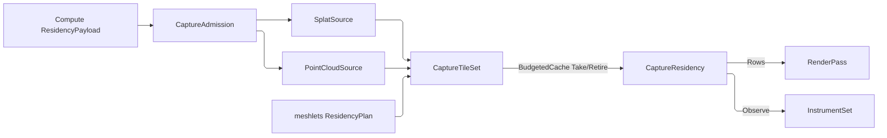

# [APPUI_REALITY_CAPTURE]

The reality-capture plane projects scanned existing-conditions geometry into the viewport beside BIM: `SplatSource` carries a Gaussian-splat ellipsoid set decoded from a Compute residency payload, `PointCloudSource` carries a massive point set decoded from the same carrier and keeps the kernel index it built, and `CapturePass` projects both onto the render graph's active `RenderTarget` through `CaptureTileSet`, the out-of-core continuation the pass roster mounts. The page owns the splat and point sources, their one admission ladder, the raster floor, the source-addressed snap, and the capture-epoch clip; the substrate is the pipeline target lease, the Compute residency payload, the `Render/meshlets` residency plan and byte-budgeted cache, and the animation playhead. AppUi consumes compressed payload streams through `CaptureDecode` and never admits a scan-file decoder.

## [01]-[INDEX]

- [02]-[SPLAT_SOURCE]: SOG/PLY ellipsoid set off the Compute splat payload; the shared admission ladder; the row-dispatched radix sort.
- [03]-[POINT_SOURCE]: LAZ-decoded point set off the Compute point payload; kernel-built and kernel-RETAINED octree; the source-addressed snap.
- [04]-[CAPTURE_PASS]: Splat and point `RenderPass` rows over the active target; the byte-ceilinged decode retention and its refusal park.
- [05]-[CAPTURE_CLIP]: Time-based capture-epoch playback on the animation playhead.

## [02]-[SPLAT_SOURCE]

- Owner: `SplatEllipsoid` the single anisotropic 3D-Gaussian; `SplatSource` the decoded ellipsoid set over the ONE Compute `ResidencyPayload` carrier; `SplatSort` the view-dependent key-packing row; `CaptureAdmission` the ONE payload ladder both source arms take; `CaptureFault` the direct generated `[Union]` with one `[FaultCase]` leaf per reality-capture failure.
- Cases: `CaptureFault` = PayloadMalformed | BackendUnsupported | DecodeDeferred | SnapAbsent; `DecodeDeferred` is the family's one `Retriability.Transient` case, so the tile set's refusal park re-admits a deferral and never a malformed payload.
- Exemption: `Sorted` is a measured kernel — an LSD radix over 32-bit keys, statement-bodied because the four byte passes write slot-addressed scratch and swap their buffers, which no expression fold expresses without allocating a sequence per pass on the frame's hottest loop. The scratch itself is NOT exempt: six per-call arrays became five pooled `SpanOwner<T>` spans, a `stackalloc` bucket histogram, and the one result array that escapes.
- Entry: `SplatSource.Decode(GpuBackend backend, ResidencyPayload payload, ResidencyBudget budget, CaptureDecode decode)` projects a gaussian-splat payload into the residency-keyed ellipsoid set; `SplatSource.Sorted(ViewCamera camera, Frustum frustum)` is the per-view cull-then-back-to-front fold BOTH composite paths consume, so the floor and the GPU path draw the same splats in the same order against the camera the frame is drawing; `SplatSort.For(int tiles)` derives the row from the resident set's own cardinality; `CaptureAdmission.Of(ResidencyKind kind, …)` is the shared ladder.
- Law: the ladder's three columns REFUSE TOGETHER on `Validation<Error, T>` — kind, census, and watermark each name themselves, so a payload breaching two reports both.
- Auto: each ellipsoid carries its mean, the three scale magnitudes, the rotation quaternion, the harmonic offset, and the sigmoid-activated opacity, so a `SplatSource` is the decoded SOG or PLY set the Compute payload streams; the cull rides the ORDERING owner rather than the composite, narrowing by each ellipsoid's OWN three-sigma ball — the extent past which the Gaussian's contribution falls under a quantization step — because placing, tinting, and sorting a sprite the additive composite then discards is work the frame pays for nothing; the sort key is the `SplatSort` row's own packing delegate over one `SplatKey` triple, so depth-major and tile-major are behavior on the row rather than a branch reading a label; the splat tile keys by the PAYLOAD'S own `ContentKey` per the single-mint law, so residency keys the splat tile identically to the meshlet tile.
- Packages: Thinktecture.Runtime.Extensions, Generator.Equals, LanguageExt.Core, CommunityToolkit.HighPerformance, Rasm (project), Rasm.Compute (project)
- Growth: a new splat attribute is one `SplatEllipsoid` field; a new sort policy is one `SplatSort` row carrying its packing delegate; a new fault is one `[FaultCase]` leaf; zero new surface.
- Boundary: the splat source consumes the one Compute `ResidencyPayload` boundary record that `Render/pipeline.md` already projects, and `CaptureDecode` is the composition-bound interpreter for its compressed `Blob` and typed `Layout` — the AppUi owner invents no flat payload member and assumes no native struct packing. `SplatEllipsoid.Opacity` fills from the producer's own `SplatScan.Alphas` column, so this end reads a decoded column and never re-derives opacity from the harmonic DC band. Structural equality keys on `(ContentKey, Sort)` alone: the retained pass sits inside a CAS-compared cache, and a `Seq<SplatEllipsoid>` compared elementwise per swap would pay the whole decode per frame while `ReadOnlyMemory<float>` compares by reference-and-range and would call two byte-identical decodes unequal. The radix sort's view basis is the `Render/pathtrace#BSDF_SHADING` `OracleFrame.OfCamera` triad — the compilation unit's one camera-basis owner, a page-local copy the deleted form.

```csharp

// --- [TYPES] ---------------------------------------------------------------------------
[Union(ConversionFromValue = ConversionOperatorsGeneration.None)]
public abstract partial record CaptureFault : Fault {
    private static readonly FaultBand FamilyBand = FaultBand.Capture;
    private CaptureFault(string detail) { Detail = detail; }

    public string Detail { get; }
    public override string Message => Detail;

    [FaultCase(0)]
    public sealed partial record PayloadMalformed(string Detail) : CaptureFault(Detail);
    [FaultCase(1)]
    public sealed partial record BackendUnsupported(string Detail) : CaptureFault(Detail);
    [FaultCase(2)]
    public sealed partial record DecodeDeferred(string Detail) : CaptureFault(Detail) {
        public override Retriability Retriability => Retriability.Transient;
    }
    [FaultCase(3)]
    public sealed partial record SnapAbsent(string Detail) : CaptureFault(Detail);
}

// --- [MODELS] --------------------------------------------------------------------------
public readonly record struct SplatEllipsoid(
    float MeanX, float MeanY, float MeanZ,
    float ScaleX, float ScaleY, float ScaleZ,
    float RotX, float RotY, float RotZ, float RotW,
    float Opacity,
    int HarmonicOffset) {
    public BoundingSphere Bounds =>
        new(MeanX, MeanY, MeanZ, MathF.Max(ScaleX, MathF.Max(ScaleY, ScaleZ)) * ThreeSigma);

    private const float ThreeSigma = 3f;
}

[Union(ConversionFromValue = ConversionOperatorsGeneration.None)]
public abstract partial record CaptureDecoded {
    private CaptureDecoded() { }
    public sealed record Splats(Seq<SplatEllipsoid> Ellipsoids, ReadOnlyMemory<float> Harmonics) : CaptureDecoded;
    public sealed record Points(Seq<PointSample> Samples, int OctreeDepth) : CaptureDecoded;
}

public sealed record CaptureDecode(Func<ResidencyPayload, Fin<CaptureDecoded>> Decode);

public readonly record struct SplatKey(uint Depth, uint TileX, uint TileY);

// --- [TABLES] --------------------------------------------------------------------------
[SmartEnum<string>]
[KeyMemberEqualityComparer<ComparerAccessors.StringOrdinal, string>]
public sealed partial class SplatSort {
    public static readonly SplatSort RadixDepth = new("radix-depth", static key => key.Depth);
    public static readonly SplatSort RadixTile = new("radix-tile", static key =>
        (((key.TileY << TileAxisBits) | key.TileX) << (RadixKeyBits - TileIdBits)) | (key.Depth >> TileIdBits));

    public static SplatSort For(int tiles) => tiles > 1 ? RadixTile : RadixDepth;

    [UseDelegateFromConstructor]
    public partial uint Pack(SplatKey key);

    public const int RadixKeyBits = 32;
    public const int TileAxisBits = 4;
    public const int TileIdBits = TileAxisBits * 2;
    public const uint TileSpan = 1u << TileAxisBits;
}

// --- [OPERATIONS] ----------------------------------------------------------------------
public static class CaptureAdmission {
    public static Fin<CaptureDecoded> Of(ResidencyKind kind, ResidencyPayload payload, ResidencyBudget budget, CaptureDecode decode) =>
        (Col(payload.Kind == kind, new CaptureFault.PayloadMalformed($"{kind.Key}/kind:{payload.Kind.Key}")),
         Col(payload.ResidentCount > 0, new CaptureFault.PayloadMalformed($"{kind.Key}/empty:{ResidencyMarshal.KeyHex(payload.ContentKey)}")),
         Col(payload.EncodedBytes <= budget.Watermark, new CaptureFault.DecodeDeferred(
             $"{kind.Key}/oversized:{payload.EncodedBytes}b > {budget.Watermark}b")))
        .Apply(static (_, _, _) => unit)
        .ToFin()
        .Bind(_ => decode.Decode(payload));

    private static Validation<Error, Unit> Col(bool holds, CaptureFault refusal) =>
        holds ? Validation<Error, Unit>.Success(unit) : Validation<Error, Unit>.Fail(refusal);
}

// --- [COMPOSITION] ---------------------------------------------------------------------
[Equatable]
public sealed partial record SplatSource(
    UInt128 ContentKey,
    SplatSort Sort,
    [property: IgnoreEquality] GpuBackend Backend,
    [property: IgnoreEquality] Seq<SplatEllipsoid> Ellipsoids,
    [property: IgnoreEquality] ReadOnlyMemory<float> Harmonics,
    [property: IgnoreEquality] int HarmonicDegree,
    [property: IgnoreEquality] BoundingSphere Bounds) {
    public static Fin<SplatSource> Decode(GpuBackend backend, ResidencyPayload payload, ResidencyBudget budget, CaptureDecode decode) =>
        CaptureAdmission.Of(ResidencyKind.GaussianSplat, payload, budget, decode)
            .Bind(decoded => decoded.Switch(
                splats: row => Fin.Succ(new SplatSource(
                    payload.ContentKey, SplatSort.RadixDepth, backend, row.Ellipsoids, row.Harmonics,
                    payload.HarmonicDegree, BoundsOf(payload))),
                points: _ => Fin.Fail<SplatSource>(new CaptureFault.PayloadMalformed(
                    $"{ResidencyKind.GaussianSplat.Key}/decode:{ResidencyMarshal.KeyHex(payload.ContentKey)}"))));

    public long DecodedBytes =>
        (Ellipsoids.Count * (long)Unsafe.SizeOf<SplatEllipsoid>()) + ((long)Harmonics.Length * sizeof(float));

    public Seq<SplatEllipsoid> Sorted(ViewCamera camera, Frustum frustum) {
        Seq<SplatEllipsoid> visible = Ellipsoids.Filter(splat => frustum.Intersects(splat.Bounds));
        int count = visible.Count;
        if (count <= 1) { return visible; }
        CameraFrame frame = camera.Frame;
        ((double fx, double fy, double fz), (double rx, double ry, double rz), (double ux, double uy, double uz)) =
            OracleFrame.OfCamera(frame);
        using SpanOwner<double> depthLease = SpanOwner<double>.Allocate(count);
        using SpanOwner<uint> keyLease = SpanOwner<uint>.Allocate(count);
        using SpanOwner<uint> keySpare = SpanOwner<uint>.Allocate(count);
        using SpanOwner<int> orderLease = SpanOwner<int>.Allocate(count);
        using SpanOwner<int> orderSpare = SpanOwner<int>.Allocate(count);
        Span<double> depths = depthLease.Span;
        (Span<uint> keys, Span<uint> scratchKeys) = (keyLease.Span, keySpare.Span);
        (Span<int> order, Span<int> scratchOrder) = (orderLease.Span, orderSpare.Span);
        Span<int> counts = stackalloc int[RadixBuckets];
        double maxDepth = DepthSpanFloor;
        for (int at = 0; at < count; at++) {
            SplatEllipsoid splat = visible[at];
            depths[at] = ((splat.MeanX - frame.Eye.X) * fx) + ((splat.MeanY - frame.Eye.Y) * fy) + ((splat.MeanZ - frame.Eye.Z) * fz);
            maxDepth = Math.Max(maxDepth, depths[at]);
        }
        double lateralSpan = Math.Max(Bounds.Radius * 2d, LateralSpanFloor);
        for (int at = 0; at < count; at++) {
            SplatEllipsoid splat = visible[at];
            (double cx, double cy, double cz) = (splat.MeanX - frame.Eye.X, splat.MeanY - frame.Eye.Y, splat.MeanZ - frame.Eye.Z);
            keys[at] = Sort.Pack(new SplatKey(
                BackToFront(depths[at] / maxDepth),
                Tile(((cx * rx) + (cy * ry) + (cz * rz)) / lateralSpan),
                Tile(((cx * ux) + (cy * uy) + (cz * uz)) / lateralSpan)));
            order[at] = at;
        }
        for (int shift = 0; shift < SplatSort.RadixKeyBits; shift += RadixBits) {
            counts.Clear();
            for (int at = 0; at < count; at++) { counts[(int)((keys[at] >> shift) & RadixMask)]++; }
            for (int bucket = 1; bucket < RadixBuckets; bucket++) { counts[bucket] += counts[bucket - 1]; }
            for (int at = count - 1; at >= 0; at--) {
                int slot = --counts[(int)((keys[at] >> shift) & RadixMask)];
                (scratchKeys[slot], scratchOrder[slot]) = (keys[at], order[at]);
            }
            (keys, scratchKeys) = (scratchKeys, keys);
            (order, scratchOrder) = (scratchOrder, order);
        }
        SplatEllipsoid[] sorted = new SplatEllipsoid[count];
        for (int at = 0; at < count; at++) { sorted[at] = visible[order[at]]; }
        return toSeq(sorted);
    }

    private static uint BackToFront(double normalized) =>
        uint.MaxValue - (uint)(Math.Clamp(normalized, 0d, 1d) * uint.MaxValue);

    private static uint Tile(double lateral) =>
        (uint)Math.Clamp((lateral + 0.5d) * SplatSort.TileSpan, 0d, SplatSort.TileSpan - 1d);

    private static BoundingSphere BoundsOf(ResidencyPayload payload) =>
        new(payload.Center.X, payload.Center.Y, payload.Center.Z, payload.Radius);

    private const int RadixBits = 8;
    private const int RadixBuckets = 1 << RadixBits;
    private const uint RadixMask = RadixBuckets - 1;

    private const double DepthSpanFloor = 1e-9;
    private const double LateralSpanFloor = 1e-9;
}
```



## [03]-[POINT_SOURCE]

- Owner: `PointSample` the single LiDAR return; `PointFamily` the nominal grouping each ASPRS code sits in; `PointClass` `[SmartEnum<byte>]` the classification vocabulary; `CapturePalette` the DERIVED classification ink; `PointOctreeNode` the render-domain LOD node; `PointCloudSource` the decoded point set holding the kernel index it built. The octree is `Rasm/.planning/Spatial/index.md#[02]-[SPATIAL_INDEX]`'s — the partition, the Morton ordering, the cell cut, AND the nearest-neighbour query are `SpatialKind.Octree`'s through `SpatialIndex.Build` and its `Query` arms; page-local remains the render-domain fold over the decoded nodes.
- Exemption: the wire decode is a measured kernel — two index sweeps over the node stream, statement-bodied because the depth sweep and the bottom-up sample fold both write per-node slots keyed by ordinal, exactly as `Sorted`'s LSD radix is. The three per-node scratch runs are pooled `SpanOwner<T>` spans, and the positional `Where((_, at) => at % stride == 0)` that allocated an enumerator per node inside that kernel is now the named `Strided` fold.
- Entry: `PointCloudSource.Decode(GpuBackend backend, ResidencyPayload payload, ResidencyBudget budget, CaptureDecode decode)` takes the SAME `CaptureAdmission` ladder, then the kernel broad phase; `Visible(Frustum frustum, ViewCamera camera, double lodScale, LodPolicy lod, long ceiling)` narrows to the LOD cut under the batch ceiling; `Snap((double X, double Y, double Z) requested, UnitsNet.Length tolerance)` resolves a world point to one resident return as a `ViewMeasurementPoint`; `CapturePalette.Of(Colormap map)` admits the classification ink once.
- Law: the RETAINED `SpatialIndex` is the query owner. `Materialized` keeps what the build produced, so `Snap` is the k-nearest `SpatialIndex.Query` arm in the same primitive space the build admitted — the leaf filter, the run gather, the `Distinct`, and the min-fold that stood in for it are all the kernel's, and building an index only to hand-scan past it is the deleted form the sibling `Render/pathtrace` `Bvh` already forecloses by retaining its own.
- Law: what a measurement IS belongs to `Render/measure#MEASURE_MODE` — kinds, folds, pinning, and the `ViewMeasurement` projection. This owner answers the one question that page declares outside itself: which resident return a requested coordinate resolves to. `Snap` therefore ANSWERS the settled `ViewMeasurementPoint` and mints no overlay, segment, angle, or viewpoint projection of its own.
- Auto: each point carries its position, the classification byte, the intensity, and the RGB colour; the LOD tree is BUILT by the kernel — every return admits as its own degenerate `BoundingBox`, the `BuildPolicy` DERIVES from the payload's declared octree depth and composes the kernel's `BuildPolicy.Of` admission, and `SpatialIndex.Wire` yields the frozen node stream the render fold decodes ONCE per build through the `Render/pathtrace` `NodeLink` reader; that fold lands the columns the draw reads — each node's `Level` from one forward sweep, its resident `Count` and strided sample run from one bottom-up sweep, its `SampleStride` from its depth below the deepest level, and its PARENT's bounds carried as a column so the half-open cut compares against a real extent without an O(n) index-back into the node seq; residency keys off the SOURCE's payload `ContentKey`, one per cloud, never a mirror on every node.
- Packages: Thinktecture.Runtime.Extensions, Generator.Equals, LanguageExt.Core, CommunityToolkit.HighPerformance, SkiaSharp, UnitsNet, Rasm (project — `SpatialIndex.Build`/`Query`/`Wire`/`BuildPolicy` the federation broad phase, `PerceptualColor` the ink admission), Rasm.Compute (project)
- Growth: a new point attribute is one `PointSample` field; a new classification code is one `PointClass` row naming its family, its ink deriving with no palette edit; a new grouping is one `PointFamily` row taking the next qualitative slot; a new build knob is one `BuildPolicy` column at the kernel owner; zero new surface.
- Boundary: offline LAZ/scan decode crosses as a Compute payload, so AppUi carries no LAZ decoder; a page-local Morton interleave, cell-index recovery, level-folding sweep, or nearest-neighbour scan is the DELETED form, and the kernel's own errors lower onto `CaptureFault` so a refused build reads as a capture payload fault rather than a geometry fault crossing the render pipeline untyped. Node bounds are the kernel's unioned primitive extents rather than the full cell, so a sparse cell's sphere is tight. NAMED LOSS on the node: the wire PARENT ORDINAL is gone — `ParentBounds` is the only thing the cut ever read it for, and carrying both made two authorities for one link. NAMED LOSS on the snap: the answer carries the source key and the sample index rather than the whole `PointSample`, because the index already resolves classification, intensity, and colour off `Points` and a copied sample is a mirror that can disagree. Tolerance is compared IN its `UnitsNet` quantity — the `.Meters` unwrap that used to reach the query boundary re-opened the display-unit law the ingress had already settled.

```csharp
// --- [MODELS] --------------------------------------------------------------------------
public readonly record struct PointSample(
    float X, float Y, float Z,
    byte Classification,
    ushort Intensity,
    byte R, byte G, byte B) {
    public (double X, double Y, double Z) Position => (X, Y, Z);
}

// --- [TABLES] --------------------------------------------------------------------------
[SmartEnum<string>]
[KeyMemberEqualityComparer<ComparerAccessors.StringOrdinal, string>]
public sealed partial class PointFamily {
    public static readonly PointFamily Unassigned = new("unassigned", slot: 0);
    public static readonly PointFamily Terrain = new("terrain", slot: 1);
    public static readonly PointFamily Vegetation = new("vegetation", slot: 2);
    public static readonly PointFamily Structure = new("structure", slot: 3);
    public static readonly PointFamily Water = new("water", slot: 4);
    public static readonly PointFamily Transport = new("transport", slot: 5);
    public static readonly PointFamily Utility = new("utility", slot: 6);
    public static readonly PointFamily Noise = new("noise", slot: 7);

    public int Slot { get; }
}

[SmartEnum<byte>]
public sealed partial class PointClass {
    public static readonly PointClass Created = new(0, PointFamily.Unassigned);
    public static readonly PointClass Unclassified = new(1, PointFamily.Unassigned);
    public static readonly PointClass Ground = new(2, PointFamily.Terrain);
    public static readonly PointClass LowVegetation = new(3, PointFamily.Vegetation);
    public static readonly PointClass MediumVegetation = new(4, PointFamily.Vegetation);
    public static readonly PointClass HighVegetation = new(5, PointFamily.Vegetation);
    public static readonly PointClass Building = new(6, PointFamily.Structure);
    public static readonly PointClass LowPoint = new(7, PointFamily.Noise);
    public static readonly PointClass Water = new(9, PointFamily.Water);
    public static readonly PointClass Rail = new(10, PointFamily.Transport);
    public static readonly PointClass RoadSurface = new(11, PointFamily.Transport);
    public static readonly PointClass WireGuard = new(13, PointFamily.Utility);
    public static readonly PointClass WireConductor = new(14, PointFamily.Utility);
    public static readonly PointClass TransmissionTower = new(15, PointFamily.Utility);
    public static readonly PointClass WireConnector = new(16, PointFamily.Utility);
    public static readonly PointClass BridgeDeck = new(17, PointFamily.Transport);
    public static readonly PointClass HighNoise = new(18, PointFamily.Noise);

    public PointFamily Family { get; }
}

public sealed record CapturePalette(FrozenDictionary<byte, SKColor> Ink) {
    public static Fin<CapturePalette> Of(Colormap map) =>
        !map.Class.Traits.Admits(ColormapTrait.Discrete)
            ? Fin.Fail<CapturePalette>(new CaptureFault.PayloadMalformed(
                $"palette/{map.Key}: a nominal vocabulary reads a qualitative colormap"))
            : map.Stops.Count >= PointFamily.Items.Count
                ? toSeq(PointFamily.Items).TraverseM(family => Rungs(map, family)).As()
                    .Map(static families => new CapturePalette(families
                        .Bind(static rows => rows)
                        .ToFrozenDictionary(static row => row.Code, static row => row.Ink)))
                : Fin.Fail<CapturePalette>(new CaptureFault.PayloadMalformed(
                    $"palette/{map.Key}: {map.Stops.Count} stops under {PointFamily.Items.Count} families"));

    public SKColor For(PointSample sample) =>
        Ink.TryGetValue(sample.Classification, out SKColor ink) ? ink : new SKColor(sample.R, sample.G, sample.B);

    private static Fin<Seq<(byte Code, SKColor Ink)>> Rungs(Colormap map, PointFamily family) =>
        toSeq(PointClass.Items).Filter(row => row.Family.Equals(family)).Strict() switch {
            var members when members.IsEmpty => Fin.Succ(Seq<(byte, SKColor)>()),
            var members =>
                from stop in map.Sample((family.Slot + 0.5d) / PointFamily.Items.Count)
                from anchor in PerceptualColor.OfRgb(stop.R, stop.G, stop.B, stop.A)
                from terminus in PerceptualColor.Achromatic(RungTerminus)
                let ladder = members.Count == 1 ? Seq(anchor) : anchor.Ramp(terminus, Dimension.Create(members.Count))
                select toSeq(members.Zip(ladder).Map(static pair => (pair.First.Key, Skia(pair.Second)))),
        };

    private static SKColor Skia(PerceptualColor rung) =>
        rung.ToRgb() switch { var (red, green, blue, alpha) => new SKColor(red, green, blue, alpha) };

    private const double RungTerminus = 0.86d;
}

public sealed record PointOctreeNode(
    int Node,
    int Level,
    int ChildCount,
    BoundingSphere Bounds,
    Option<BoundingSphere> ParentBounds,
    int SampleStride,
    long Count,
    Seq<int> Samples) {
    public bool Leaf => ChildCount == 0;

    public long DecodedBytes => Unsafe.SizeOf<PointOctreeNode>() + (Samples.Count * (long)sizeof(int));
}

// --- [COMPOSITION] ---------------------------------------------------------------------
[Equatable]
public sealed partial record PointCloudSource(
    UInt128 ContentKey,
    [property: IgnoreEquality] GpuBackend Backend,
    [property: IgnoreEquality] Seq<PointSample> Points,
    [property: IgnoreEquality] Seq<PointOctreeNode> Octree,
    [property: IgnoreEquality] Option<SpatialIndex> Index,
    [property: IgnoreEquality] BoundingSphere Bounds) {
    public static Fin<PointCloudSource> Decode(
        GpuBackend backend, ResidencyPayload payload, ResidencyBudget budget, CaptureDecode decode) =>
        CaptureAdmission.Of(ResidencyKind.PointSplat, payload, budget, decode)
            .Bind(decoded => decoded.Switch(
                points: row => Materialized(backend, payload, row),
                splats: _ => Fin.Fail<PointCloudSource>(new CaptureFault.PayloadMalformed(
                    $"{ResidencyKind.PointSplat.Key}/decode:{ResidencyMarshal.KeyHex(payload.ContentKey)}"))));

    public long DecodedBytes =>
        (Points.Count * (long)Unsafe.SizeOf<PointSample>())
        + Octree.Fold(0L, static (sum, node) => sum + node.DecodedBytes);

    public Seq<PointOctreeNode> Visible(Frustum frustum, ViewCamera camera, double lodScale, LodPolicy lod, long ceiling) =>
        toSeq(Octree
            .Filter(node => frustum.Intersects(node.Bounds) && InCut(node, camera, lodScale, lod))
            .OrderByDescending(static node => node.SampleStride))
            .Fold(
                (Kept: Seq<PointOctreeNode>(), Charge: 0L),
                (state, node) => state.Charge + node.Count <= ceiling
                    ? (state.Kept.Add(node), state.Charge + node.Count)
                    : state)
            .Kept;

    private static bool InCut(PointOctreeNode node, ViewCamera camera, double lodScale, LodPolicy lod) =>
        ClusterCull.Projected(node.Bounds.Radius, node.Bounds, camera) * lodScale <= lod.PixelThreshold
        && node.ParentBounds.Match(
            Some: parent => ClusterCull.Projected(parent.Radius, parent, camera) * lodScale > lod.PixelThreshold,
            None: static () => true);

    public Fin<ViewMeasurementPoint> Snap(
        (double X, double Y, double Z) requested, UnitsNet.Length tolerance) =>
        Index
            .ToFin(Fail: (Error)new CaptureFault.SnapAbsent($"snap/unindexed:{ResidencyMarshal.KeyHex(ContentKey)}"))
            .Bind(index => Nearest(index, requested))
            .Bind(ordinal => ordinal
                .Filter(at => Gap(requested, Points[at].Position) <= tolerance)
                .Map(at => new ViewMeasurementPoint(ContentKey, at, Placed(Points[at])))
                .ToFin(Fail: new CaptureFault.SnapAbsent(
                    $"snap/{ResidencyMarshal.KeyHex(ContentKey)}: no resident return within {tolerance}")));

    private static Fin<Option<int>> Nearest(SpatialIndex index, (double X, double Y, double Z) requested) =>
        index.Query(new Point3d(requested.X, requested.Y, requested.Z), 1).Map(static ordered => ordered.Head);

    private static UnitsNet.Length Gap((double X, double Y, double Z) a, (double X, double Y, double Z) b) =>
        UnitsNet.Length.FromMeters(Math.Sqrt(
            ((a.X - b.X) * (a.X - b.X)) + ((a.Y - b.Y) * (a.Y - b.Y)) + ((a.Z - b.Z) * (a.Z - b.Z))));

    private static System.Numerics.Vector3 Placed(PointSample sample) => new(sample.X, sample.Y, sample.Z);

    private static Fin<PointCloudSource> Materialized(
        GpuBackend backend, ResidencyPayload payload, CaptureDecoded.Points decoded) =>
        (from policy in Broadphase(decoded.OctreeDepth)
         from index in SpatialIndex.Build(SpatialKind.Octree, [.. decoded.Samples.Map(Box)], policy)
         from stream in index.Wire()
         select new PointCloudSource(
             payload.ContentKey, backend, decoded.Samples, Decoded(stream), Some(index),
             new BoundingSphere(payload.Center.X, payload.Center.Y, payload.Center.Z, payload.Radius)))
            ;

    private static Fin<BuildPolicy> Broadphase(int declaredDepth) =>
        BuildPolicy.Of(
                leafSize: BuildPolicy.Canonical.LeafSize.Value, maxDepth: declaredDepth,
                sahBuckets: BuildPolicy.Canonical.SahBuckets.Value, refitGrowth: BuildPolicy.Canonical.RefitGrowth.Value,
                parallelFloor: BuildPolicy.Canonical.ParallelFloor.Value)
            .MapFail(static refused => new CaptureFault.PayloadMalformed($"point/octree-depth: the kernel refused {declaredDepth}: {refused.Message}"));

    private static BoundingBox Box(PointSample sample) =>
        new(new Point3d(sample.X, sample.Y, sample.Z), new Point3d(sample.X, sample.Y, sample.Z));

    private static Seq<PointOctreeNode> Decoded((float[] Bounds, long[] Nodes) wire) {
        int count = NodeLink.Count(wire.Bounds);
        using SpanOwner<int> levelLease = SpanOwner<int>.Allocate(count, AllocationMode.Clear);
        using SpanOwner<int> parentLease = SpanOwner<int>.Allocate(count, AllocationMode.Clear);
        using SpanOwner<long> residentLease = SpanOwner<long>.Allocate(count, AllocationMode.Clear);
        Span<int> level = levelLease.Span;
        Span<int> parent = parentLease.Span;
        Span<long> resident = residentLease.Span;
        Seq<int>[] runs = new Seq<int>[count];
        parent[0] = -1;
        for (int node = 0; node < count; node++) {
            (bool leaf, int first, int fan) = NodeLink.Read(wire.Nodes[node], count);
            if (leaf) { continue; }
            for (int child = first; child < first + fan; child++) { (level[child], parent[child]) = (level[node] + 1, node); }
        }
        int deepest = 0;
        for (int node = 0; node < count; node++) { deepest = int.Max(deepest, level[node]); }
        for (int node = count - 1; node >= 0; node--) {
            (bool leaf, int first, int fan) = NodeLink.Read(wire.Nodes[node], count);
            Seq<int> gathered = Seq<int>();
            long charge = 0L;
            if (leaf) {
                for (int slot = first; slot < first + fan; slot++) { gathered = gathered.Add((int)wire.Nodes[slot]); }
                charge = fan;
            }
            else {
                for (int child = first; child < first + fan; child++) { gathered += runs[child]; charge += resident[child]; }
                gathered = Strided(gathered, 1 << (deepest - level[node]));
            }
            (runs[node], resident[node]) = (gathered, charge);
        }
        PointOctreeNode[] nodes = new PointOctreeNode[count];
        for (int node = 0; node < count; node++) {
            (bool leaf, int _, int fan) = NodeLink.Read(wire.Nodes[node], count);
            nodes[node] = new PointOctreeNode(
                node, level[node], leaf ? 0 : fan,
                Ball(wire.Bounds, node),
                parent[node] < 0 ? None : Some(Ball(wire.Bounds, parent[node])),
                1 << (deepest - level[node]), resident[node], runs[node]);
        }
        return toSeq(nodes);
    }

    private static Seq<int> Strided(Seq<int> run, int stride) {
        if (stride <= 1) { return run; }
        Seq<int> taken = Seq<int>();
        for (int at = 0; at < run.Count; at += stride) { taken = taken.Add(run[at]); }
        return taken;
    }

    private static BoundingSphere Ball(float[] bounds, int node) =>
        (Lo: 6 * node, Hi: (6 * node) + 3) switch {
            var at => (
                Dx: bounds[at.Hi] - bounds[at.Lo],
                Dy: bounds[at.Hi + 1] - bounds[at.Lo + 1],
                Dz: bounds[at.Hi + 2] - bounds[at.Lo + 2]) switch {
                var d => new BoundingSphere(
                    (bounds[at.Lo] + bounds[at.Hi]) * 0.5d,
                    (bounds[at.Lo + 1] + bounds[at.Hi + 1]) * 0.5d,
                    (bounds[at.Lo + 2] + bounds[at.Hi + 2]) * 0.5d,
                    0.5d * Math.Sqrt((d.Dx * d.Dx) + (d.Dy * d.Dy) + (d.Dz * d.Dz))),
            },
        };
}
```

## [04]-[CAPTURE_PASS]

- Owner: `CaptureComposite<TSource>` the ONE composite delegate shape both arms instantiate; `CapturePass` `[Union]` the reality-capture pass family; `CaptureComposites` the bound pair; `SplatPlacement` the projected-and-shaded splat value; `CaptureRaster` the Skia CPU floor; `CaptureTileSet` the out-of-core continuation over a `Theme/assets` `BudgetedCache`; `CaptureResidency` the frame's capture answer.
- Cases: `CapturePass` = Splat | Point, both discriminating on the source they hold. Neither stores a key: `Kind`, `Content`, and `Key` are DERIVATIONS off the case and its source, so the pass identity the census, the residency plan, the retained decode, and the raster label all read is one value with one spelling.
- Law: a massive scan arrives as MANY per-cell payloads, each under the watermark and each carrying its OWN `ContentKey`, and `Resident` folds the `Render/meshlets` `ResidencyPlan` into decoded passes. Only plan-named tiles decode; a held tile REUSES the decode it already paid for; every key the plan dropped RETIRES in the same transition; and the retained decode is charged in BYTES against its own ceiling — RULINGS `[02]:17` and `[02]:172` count what the record HOLDS, and a cache pinning the decode of a billion-point cloud while charging only the encoded payload is the exact shape those rows name. The `DecodeDeferred` fault narrows to a monolithic payload above the watermark or a single decode over the whole ceiling: the typed instruction that the producer must deliver the tiled census.
- Law: a refused decode PARKS. `Retriability` on the fault itself decides how long — a deferral re-enters on the redrive window, a malformed payload never does — so the implicit unbounded per-frame retry that used to follow a refusal costs one census lookup instead of one decode. The window counts FRAMES off the plan's own ordinal rather than composing the kernel `RedrivePolicy` curve, and the discriminant is that a curve re-drives an IO effect on a wall clock while this decode is pure over bytes the census already holds.
- Entry: `CaptureTileSet.Of(GpuBackend, HashMap<UInt128, ResidencyPayload> census, ResidencyBudget, long decodeCeiling, CaptureDecode, CaptureComposites)` — `Fin`, the cache mint refusing a non-positive ceiling; `Resident(ResidencyPlan plan)` — TOTAL, answering the frame's passes, its elected sort, the refusals it parked, and the cache sweep; `CaptureResidency.Rows` — the EXECUTABLE `RenderPass` projection the pass-roster composition mounts, the same seat `ClusterCull.DrawRows` takes for meshlet geometry; `CaptureTileSet.Observe(InstrumentSet set, CaptureResidency residency)` — the level and count writes.
- Auto: both cases emit one `Geometry`-family `RenderPass` over the active target at `CutPhase.Whole`, charging and reporting zero triangles because a splat composite and a point composite draw none; both take the frame's own `FrameView`, so the splat composite orders through `SplatSource.Sorted` and the point composite cuts through `PointCloudSource.Visible` against the camera the frame is drawing rather than one a closure bound a frame earlier; the sort the resident SET elects threads into the splat arm at the pass, so a set that grew past one tile switches to tile-major with NO decode repeated and no re-seat of the cache; `CaptureRaster` is the floor those delegates bind — the whole sorted ellipsoid set composites in a SINGLE `DrawAtlas` over `SKRotationScaleMatrix` transforms under `SKBlendMode.Plus`, and a resident point cell in a SINGLE `DrawVertices` batch.
- Packages: Thinktecture.Runtime.Extensions, LanguageExt.Core, SkiaSharp, Rasm (project — `Cell`/`Transition` the cell transitions, `Retriability` the park law, `InstrumentSpec` the declarations)
- Growth: a new capture path is one `CapturePass` case plus its `Mints` row, the retention, the park, and the sort election folding it with no further edit; a retuned point footprint is one `CaptureRaster.PointRadius` value; zero new surface.
- Boundary: the capture pass is a viewport `RenderPass` case, so reality-capture geometry and BIM geometry share one graph and one target lease; allocating through `GpuBinding.Target` inside a pass creates a nested native lease and is rejected. `CaptureRaster` draws only into `RenderTarget.Surface`, so a target leased from a GPU backend row refuses as `CaptureFault.BackendUnsupported` rather than drawing nowhere. The floor's back-to-front ordering IS `SplatSource.Sorted`, so a floor-local re-ordering over a projected-depth column is the deleted twin. `SKVertexMode` carries no point mode and `DrawPoints` admits one paint, so per-return classification colour rides the three-vertex expansion; a single-paint point draw silently erases classification and is the rejected form. `CaptureRaster.Volume` is KEPT and is not a reconstructible knob: `FrameView` carries a camera and no frustum, and no `Frustum.Of(ViewCamera)` owner exists — the plane derivation is the composition's, bound here as every other port is. The retention posture is `RetentionPosture.Holder` and that is an INVARIANT, not a preference: a decoded pass holds managed arrays and the GPU residency is the render graph's own lease, so a read below the live generation is still a correct decode; a decode that ever holds a native handle takes `RetentionPosture.Generation` and a kernel `Lease<T>` value.

```csharp
// --- [TYPES] ---------------------------------------------------------------------------
public delegate Fin<int> CaptureComposite<in TSource>(RenderTarget target, FrameView view, TSource source);

// --- [MODELS] --------------------------------------------------------------------------
[Union(ConversionFromValue = ConversionOperatorsGeneration.None)]
public abstract partial record CapturePass {
    private CapturePass() { }
    public sealed record Splat(SplatSource Source, CaptureComposite<SplatSource> Composite) : CapturePass;
    public sealed record Point(PointCloudSource Source, CaptureComposite<PointCloudSource> Composite) : CapturePass;

    public ResidencyKind Kind => Switch(
        splat: static _ => ResidencyKind.GaussianSplat,
        point: static _ => ResidencyKind.PointSplat);

    public UInt128 Content => Switch(
        splat: static row => row.Source.ContentKey,
        point: static row => row.Source.ContentKey);

    public long DecodedBytes => Switch(
        splat: static row => row.Source.DecodedBytes,
        point: static row => row.Source.DecodedBytes);

    public string Key => $"capture/{Kind.Key}/{ResidencyMarshal.KeyHex(Content)}";

    public RenderPass Pass(SplatSort sort) => Switch(
        state: sort,
        splat: static (elected, row) => (RenderPass)new RenderPass.Geometry(
            row.Key,
            CutPhase.Whole,
            static _ => 0L,
            (target, view, _) => row.Composite(target, view, row.Source with { Sort = elected }).Map(static _ => 0L)),
        point: static (_, row) => new RenderPass.Geometry(
            row.Key,
            CutPhase.Whole,
            static _ => 0L,
            (target, view, _) => row.Composite(target, view, row.Source).Map(static _ => 0L)));
}

public sealed record CaptureComposites(
    CaptureComposite<SplatSource> Splat,
    CaptureComposite<PointCloudSource> Point);

public readonly record struct SplatPlacement(float Scale, float Radians, float X, float Y, SKColor Tint);

public sealed record CaptureResidency(
    Seq<CapturePass> Passes,
    SplatSort Sort,
    Seq<Error> Refused,
    CacheSweep Sweep) {
    public Seq<RenderPass> Rows => Passes.Map(pass => pass.Pass(Sort));
}

// --- [SERVICES] ------------------------------------------------------------------------
public sealed record CaptureRaster(
    SKImage Kernel,
    SKSamplingOptions Sampling,
    SKRect Cull,
    CapturePalette Palette,
    float PointRadius,
    long PointCeiling,
    LodPolicy Lod,
    Func<FrameView, Frustum> Volume) {
    public Fin<int> Composite(RenderTarget target, FrameView view, SplatSource source, Func<SplatSource, SplatEllipsoid, SplatPlacement> place) =>
        Raster(target, $"splat/{ResidencyMarshal.KeyHex(source.ContentKey)}", canvas => {
            SplatPlacement[] ordered = [.. source.Sorted(view.Camera, Volume(view)).Map(ellipsoid => place(source, ellipsoid))];
            SKRect sprite = SKRect.Create(Kernel.Width, Kernel.Height);
            (float anchorX, float anchorY) = (Kernel.Width / 2f, Kernel.Height / 2f);
            SKRect[] sprites = [.. ordered.Select(_ => sprite)];
            SKRotationScaleMatrix[] transforms = [.. ordered.Select(placement =>
                SKRotationScaleMatrix.Create(placement.Scale, placement.Radians, placement.X, placement.Y, anchorX, anchorY))];
            SKColor[] tints = [.. ordered.Select(static placement => placement.Tint)];
            using SKPaint paint = new() { IsAntialias = true };
            canvas.DrawAtlas(Kernel, sprites, transforms, tints, SKBlendMode.Plus, Sampling, Cull, paint);
            return transforms.Length;
        });

    public Fin<int> Points(RenderTarget target, FrameView view, PointCloudSource source, Func<FrameView, PointSample, SKPoint> project) =>
        Raster(target, $"point/{ResidencyMarshal.KeyHex(source.ContentKey)}", canvas => {
            Seq<(SKPoint At, SKColor Tint)> placed = source
                .Visible(Volume(view), view.Camera, view.LodScale, Lod, PointCeiling)
                .Bind(static node => node.Samples)
                .Map(index => source.Points[index])
                .Map(sample => (At: project(view, sample), Tint: Palette.For(sample)));
            SKPoint[] positions = [.. placed.Bind(point => Seq(
                new SKPoint(point.At.X, point.At.Y - PointRadius),
                new SKPoint(point.At.X - PointRadius, point.At.Y + PointRadius),
                new SKPoint(point.At.X + PointRadius, point.At.Y + PointRadius)))];
            SKColor[] colors = [.. placed.Bind(point => Seq(point.Tint, point.Tint, point.Tint))];
            using SKVertices vertices = SKVertices.CreateCopy(SKVertexMode.Triangles, positions, colors);
            using SKPaint paint = new() { IsAntialias = true };
            canvas.DrawVertices(vertices, SKBlendMode.SrcOver, paint);
            return placed.Count;
        });

    private static Fin<int> Raster(RenderTarget target, string key, Func<SKCanvas, int> draw) =>
        target.Surface.Match(
            Some: surface => Fin.Succ(draw(surface.Canvas)),
            None: () => Fin.Fail<int>(new CaptureFault.BackendUnsupported($"raster/{key}: {target.Backend.Key} leases no raster surface")));
}

// --- [COMPOSITION] ---------------------------------------------------------------------
public sealed class CaptureTileSet {
    public const int RedriveFrames = 120;

    private readonly record struct ParkedTile(long Frame, Retriability Posture);

    private readonly Atom<HashMap<UInt128, ParkedTile>> parked = Atom(HashMap<UInt128, ParkedTile>());
    private readonly BudgetedCache<UInt128, CapturePass> decoded;
    private readonly HashMap<UInt128, ResidencyPayload> census;
    private readonly GpuBackend backend;
    private readonly ResidencyBudget budget;
    private readonly CaptureDecode decode;
    private readonly CaptureComposites composites;

    private CaptureTileSet(
        GpuBackend backend, HashMap<UInt128, ResidencyPayload> census, ResidencyBudget budget,
        BudgetedCache<UInt128, CapturePass> decoded, CaptureDecode decode, CaptureComposites composites) =>
        (this.backend, this.census, this.budget, this.decoded, this.decode, this.composites) =
            (backend, census, budget, decoded, decode, composites);

    public static Fin<CaptureTileSet> Of(
        GpuBackend backend,
        HashMap<UInt128, ResidencyPayload> census,
        ResidencyBudget budget,
        long decodeCeiling,
        CaptureDecode decode,
        CaptureComposites composites) =>
        BudgetedCache<UInt128, CapturePass>.Of(
            ceiling: decodeCeiling,
            posture: RetentionPosture.Holder,
            bytes: static pass => pass.DecodedBytes,
            release: static _ => { },
            refuse: (at, cost) => new CaptureFault.DecodeDeferred(
                $"capture/decode-ceiling:{ResidencyMarshal.KeyHex(at)} costs {cost}b over {decodeCeiling}b"))
            .Map(cache => new CaptureTileSet(backend, census, budget, cache, decode, composites));

    public CaptureResidency Resident(ResidencyPlan plan) {
        Seq<ResidencyPayload> payloads = plan.Resident.Choose(tile => census.Find(tile.ContentKey)).Strict();
        LanguageExt.HashSet<UInt128> named = toHashSet(payloads.Map(static payload => payload.ContentKey));
        (Seq<CapturePass> Passes, Seq<Error> Refused) frame = payloads
            .Filter(payload => Admits(payload.ContentKey, plan.Frame))
            .Fold(
                (Passes: Seq<CapturePass>(), Refused: Seq<Error>()),
                (state, payload) => decoded.Take(payload.ContentKey, () => Minted(payload)).Match(
                    Succ: pass => (state.Passes.Add(pass), state.Refused),
                    Fail: cause => (state.Passes, state.Refused.Add(Park(payload.ContentKey, plan.Frame, cause)))));
        return new CaptureResidency(
            frame.Passes,
            SplatSort.For(payloads.Count),
            frame.Refused,
            decoded.Retire(stale: (key, _) => !named.Contains(), advance: false));
    }

    private static readonly FrozenDictionary<ResidencyKind, Func<CaptureTileSet, ResidencyPayload, Fin<CapturePass>>> Mints =
        new (ResidencyKind Kind, Func<CaptureTileSet, ResidencyPayload, Fin<CapturePass>> Mint)[] {
            (ResidencyKind.GaussianSplat, static (set, payload) =>
                SplatSource.Decode(set.backend, payload, set.budget, set.decode)
                    .Map(source => (CapturePass)new CapturePass.Splat(source, set.composites.Splat))),
            (ResidencyKind.PointSplat, static (set, payload) =>
                PointCloudSource.Decode(set.backend, payload, set.budget, set.decode)
                    .Map(source => (CapturePass)new CapturePass.Point(source, set.composites.Point))),
        }.ToFrozenDictionary(static row => row.Kind, static row => row.Mint);

    private Fin<CapturePass> Minted(ResidencyPayload payload) =>
        Mints.TryGetValue(payload.Kind, out Func<CaptureTileSet, ResidencyPayload, Fin<CapturePass>>? mint)
            ? mint(this, payload)
            : Fin.Fail<CapturePass>(new CaptureFault.PayloadMalformed(
                $"capture/kind:{payload.Kind.Key} carries no capture arm"));

    private bool Admits(UInt128 key, long frame) =>
        parked.Value.Find(key).Match(
            Some: row => row.Posture.Switch(
                terminalCase: static _ => false,
                transientCase: _ => frame - row.Frame >= RedriveFrames,
                throttledCase: _ => frame - row.Frame >= RedriveFrames),
            None: static () => true);

    private Error Park(UInt128 key, long frame, Error cause) =>
        (ignore(Cell.Commit(parked, held => held.AddOrUpdate(key, new ParkedTile(frame, Posture(cause))))), cause).Item2;

    private static Retriability Posture(Error cause) =>
        cause is Fault expected ? expected.Retriability : Retriability.Terminal;

    public static readonly InstrumentSpec Decoded = InstrumentSpec.Create(
        "rasm.appui.viewport.capture.decoded", InstrumentKind.Level, MeasureForm.Whole, "{tile}",
        "capture tiles holding a decoded pass", Seq<string>(), None, None, None);

    public static readonly InstrumentSpec Retained = InstrumentSpec.Create(
        "rasm.appui.viewport.capture.retained", InstrumentKind.Level, MeasureForm.Whole, "By",
        "bytes the retained capture decode charges against its ceiling", Seq<string>(), None, None, None);

    public static readonly InstrumentSpec Deferred = InstrumentSpec.Create(
        "rasm.appui.viewport.capture.deferred", InstrumentKind.Count, MeasureForm.Whole, "{tile}",
        "capture tiles whose decode refused and parked", Seq(AppUiTelemetry.FaultSlot), None, None, None);

    public static TelemetryContributorPort TelemetryRow(string version) =>
        AppUiTelemetry.Contribute(version, Decoded, Retained, Deferred);

    public static Fin<Unit> Observe(InstrumentSet set, CaptureResidency residency) =>
        residency.Refused
            .TraverseM(cause => FaultObservation.Of(cause).Code.Match(
                Some: code => set.Write(Deferred, 1d, InstrumentSet.Tags((AppUiTelemetry.FaultSlot, code))),
                None: () => set.Write(Deferred, 1d))).As()
            .Bind(_ => set.Level(Decoded, residency.Sweep.Live))
            .Bind(_ => set.Level(Retained, residency.Sweep.Bytes))
            .Map(static _ => unit);
}
```

## [05]-[CAPTURE_CLIP]

- Owner: `CaptureEpoch` the time-stamped capture epoch; `CaptureClip` the epoch playback bound to the animation playhead. The name is `CaptureEpoch` and not `CaptureFrame`: the host planes own a `CaptureFrame` that is a frame GRAB (`Rasm.Grasshopper/Platform/capture.md`, `Rasm.Rhino/Exchange/publish.md`), and a scan epoch sharing that bare name across three folders is a collision no reader resolves from the call site.
- Entry: `OnTimeline(string key)` projects the epochs through the animation `Track.OfFieldIndex` admission entry so a multi-epoch scan scrubs on the one playhead under the sorted non-empty track invariant; `Active<TSource>(int index, HashMap<UInt128, TSource> resident)` performs the epoch swap over `At` — generic because a splat clip and a point clip scrub identically.
- Auto: each epoch carries its instant and its payload key, so a construction-progress scan series reads one epoch per capture; the clip projects them onto an animation `FieldIndex` track, so the capture scrub and the camera fly-through animate on the same deterministic playhead; `Active` is the swap itself — the frame index selects the epoch, the epoch's own key selects the decoded source among the resident set, and a key with no resident decode answers absence rather than leaving the previous epoch on screen.
- Packages: Thinktecture.Runtime.Extensions, LanguageExt.Core, NodaTime
- Growth: a new capture epoch is one `CaptureEpoch` row; zero new surface.
- Boundary: the epoch swap is `Active`'s and nothing else's — a scrub claim with the selection left to an unnamed caller is the deleted form; the scrub is an animation `FieldIndex` track on the same frame-indexed deterministic clock the transient field scrub uses, so a wall-clock capture playback and a second capture timeline are both rejected forms, and the animation `Scrub` drives this clip.

```csharp
public readonly record struct CaptureEpoch(int Index, Instant At, UInt128 PayloadKey);

public sealed record CaptureClip(string Key, Seq<CaptureEpoch> Epochs) {
    public Option<CaptureEpoch> Epoch(int index) => Epochs.Find(epoch => epoch.Index == index);

    public Option<TSource> Active<TSource>(int index, HashMap<UInt128, TSource> resident) =>
        Epoch(index).Bind(epoch => resident.Find(epoch.PayloadKey));

    public Fin<Track> OnTimeline(string key) =>
        Epochs.Head.Match(
            None: () => Fin.Fail<Track>(new CaptureFault.PayloadMalformed($"clip/empty:{Key}")),
            Some: head => Track.OfFieldIndex(key, Epochs.Map(epoch => new Keyframe<int>(
                epoch.At - head.At, epoch.Index, MotionToken.Standard))));
}
```

## [06]-[CAPTURE_BOUNDARY]

- [CAPTURE_PAYLOAD]: `CaptureDecode` projects the canonical Compute `ResidencyPayload.Blob`/`Layout` pair into `SplatEllipsoid` or `PointSample` runs while retaining `ContentKey`, `Center`, `Radius`, `ResidentCount`, and `HarmonicDegree` from the payload owner. No `SplatPayload`, `PointPayload`, native cast, or invented primitive accessor exists on the AppUi side, and the composition root supplies `CaptureDecode` against the payload's declared stream layout.
- [CAPTURE_SCHEDULE]: `CaptureResidency.Rows` is the ONE mint of capture geometry rows and the pass-roster composition binds it where it binds `ClusterCull.DrawRows` — a capture plane whose passes nothing schedules is unreachable from the frame, and `Render/pipeline#RENDER_GRAPH` names these composites in its pass law and spike-gates them on the live leased context.
- [CAPTURE_GPU]: the composition-bound splat and point delegates record against the active `RenderTarget` and take the frame's `FrameView` beside it; bindless tile upload resolves against the host-shared GPU context. Decode, radix sort, the octree LOD cut, the source-addressed snap, and epoch playback form the CPU path, while GPU rasterization remains a render-pass delegate under the same target lease.
- [CAPTURE_DECODE]: offline LAZ/E57/SOG decoding remains the geometry producer's responsibility and crosses to AppUi as the compressed canonical Compute `ResidencyPayload`; AppUi carries no scan-file decoder and admits no parallel payload carrier.

## [07]-[RESEARCH]

(none)
