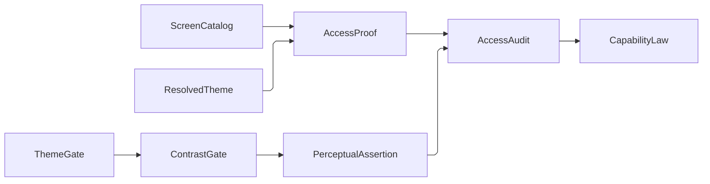

# [APPUI_ACCESSIBILITY]

Rasm.AppUi accessibility is columns on existing catalogs plus one gate fold: automation identity and live-region announcements source from `ScreenCatalogRow` columns, keyboard reachability rides the attached `KeyboardNavigation` surface, and the perceptual gate is the suite's single luminance and distinguishability implementation asserting one result family over theme-token candidate pairs. The page owns the announcement row family, the focus law, the assertion axis, and the per-row compliance audit the headless lanes execute, composing the screen catalog, theme tokens, dialog sessions, motion degrade state, and the Avalonia.Headless substrate as settled vocabulary.

Kernel vocabulary arrives whole and is never re-spelled: `PerceptualColor` with `Blend`/`Contrast`/`Simulate`/`Difference`, the `ContrastFloor` clause roster and `DeltaMetric` difference axis, `Scalar`/`PositiveMagnitude`/`UnitInterval`/`SignedUnit`, `Evidence<T>`, `CapabilitySet`/`CapabilityLaw`, `Ranked.Top`, `RedrivePolicy`/`Redrive`, `FaultCell`, and the `FaultBand`/`[FaultCase]`/`Fault` floor.

## [01]-[INDEX]

- [02]-[AUTOMATION_PEERS]: Catalog-sourced automation identity; live-region announcement rows; the admitted scene topology.
- [03]-[KEYBOARD_NAV]: Tab-order, region mode, and access-key law over attached navigation.
- [04]-[CONTRAST_GATE]: The suite's one perceptual assertion — WCAG luminance and CVD distinguishability on one result.
- [05]-[COMPLIANCE_PROOF]: Per-catalog-row audit law executed by the headless lanes.

## [02]-[AUTOMATION_PEERS]

- Owner: `AutomationIdentity` the one identity triple every attached write goes through; `AnnouncementSlot` the closed live-source vocabulary; `AnnouncementRow` the live-region record carrying its locale-owned `AnnouncementPhrase`, its host voice sink, its re-drive policy, and its optional cue sink; `AnnouncementHost` the closed stock-or-synthesized host discriminant; `SynthesizedRegion` the one peer-producing host for Skia-drawn regions; `SceneAccessTree` the admitted 3D-scene topology carrying its own QuikGraph container as proof; `SpatialCue` the spatial-audio cue; `AccessOps` the identity, announcement, and focus fold; `AccessFault` the direct generated `[Union]` with one `[FaultCase]` leaf per accessibility failure.
- Cases: toast, progress, validation over stock peers; chart-tile, preview, custom-visual, scene-element over Skia-drawn visuals carrying the `AnnouncementHost.Synthesized` case — the seven `AnnouncementSlot` rows.
- Entry: `public StyledElement Stamp(AutomationIdentity identity)` — the ONE attached identity write on the page, so a screen root, a live region, and a focused scene node state identity through one member; `public AutomationIdentity Of(ScreenCatalogRow row)` and `Of(SceneAccessNode node)` — the two admitted identity sources; `public (StyledElement Region, IDisposable Live) Materialize(IScheduler scheduler, FaultCell faults)` — the row host case mints either its admitted stock element or the one synthesized peer host and schedules each distinct text onto the UI scheduler; `SceneAccessTree.Admit` accumulates duplicate identity, missing-parent, and cycle refusals through the `Validation` applicative and retains the proved container; `public Fin<IO<Unit>> Focus(SceneAccessNode node, StyledElement peer, Vector3 listener, Vector3 right)` is the scene-element leg — one focus transition whose returned effect renames the peer and then emits the validated `SpatialCue` to the row's bound sink.
- Auto: the mount transaction applies `Stamp(AutomationIdentity.Of(row))` at every surface root; `Materialize` joins the returned subscription to the activation scope; `ScreenCatalogRow.Key` is the single automation identity source and `Title` the single announced name, so no surface spells either; the `AnnouncementHost` case makes peer synthesis a closed admission decision, so a stock row cannot call a synthesized-only mint and a synthesized row cannot omit its peer host.
- Packages: Avalonia, System.Reactive, QuikGraph, Rasm (project — `FactoryBridge.Accept`, `PositiveMagnitude`/`UnitInterval`/`SignedUnit`, `Ranked`/`ExtremumDirection`, `RedrivePolicy`/`Redrive`/`Retriability`, `FaultCell`/`HookId`, `FaultBand`/`[FaultCase]`/`Fault`), Thinktecture.Runtime.Extensions, LanguageExt.Core, BCL inbox (`System.Numerics.Vector3`)
- Law: an announcement row states no posture and no literal text of its own — both read off the locale-owned `AnnouncementPhrase`, so the announcement plane carries zero authored strings; its key is an `AnnouncementSlot` row, so it carries no authored identity either.
- Growth: one `AnnouncementSlot` row per live source; one `AnnouncementHost` case only for a genuinely distinct peer-admission regime; one scene-element kind per 3D node role; zero new surface.
- Boundary: stock Avalonia peers own every retained control — a per-control peer class is the deleted pattern; `AnnouncementHost.Synthesized` materializes through the one `SynthesizedRegion` host, a hit-test-transparent `Control` whose `OnCreateAutomationPeer` override returns a `ControlAutomationPeer`, mounted as the Skia visual's sibling by the row's `Materialize` fold. Scene space is `System.Numerics.Vector3` and never a host geometry struct or a bare ordinate tuple: the shell plane must resolve a scene node with no Rhino host loaded, which is the same carrier split `Render/animation#TRACK_INTERP` states for pose interpolation, and a `(double, double, double)` past a signature is the erased-type form the kernel scalar owners exist to close. `SceneAccessTree` retains the `BidirectionalGraph` its admission proved acyclic beside the frozen node map and the one canonically ordered `Seq`, so hierarchy, roots, and children are CONTAINER reads rather than six per-call re-sorts of the whole node set, and `Nearest`/`Step` select through kernel `Ranked.Top` with the canonical position as the tiebreak component — an ordinal `int` rather than a `string`, because `Comparer<string>.Default` is culture-sensitive and a culture-varying focus order is a non-deterministic proof. Degeneracy is a TYPED admission and never an epsilon compare: a direction, a listener offset, and a right axis each admit as `PositiveMagnitude` whose band floor is `EpsilonPolicy.ZeroTolerance`, so the 1e-300 vector that passed a `double.Epsilon` guard and then divided is unrepresentable, and no denominator carries an additive guard because both factors are positive by construction. `Focus` returns ONE effect: the peer rename is sequenced INSIDE the returned `IO` ahead of the cue emission, so the two outputs run in the stated order — the prior form evaluated the rename eagerly at projection time and discarded it through a tuple slot while the cue ran only on `Run`, which is the ordering the doc line claimed and the code refuted. The announced TEXT and its urgency are one locale fact: `AnnouncementPhrase.Say` resolves the spoken string through the same label walk the visible caption takes and `SpeechPosture` projects the platform live setting off that phrase's own posture, so `SpeechPosture.Silent` is the row that declares silence and subscribes to nothing rather than an absent setting. Identity and delivery are two planes and the row carries both: the attached pair (`.api/api-avalonia.md` `[AUTOMATION_TYPES]`/`[AUTOMATION_OPERATIONS]`) states identity and posture, while DELIVERY leaves through the row's `Voice` column alone, because an embedded root projects nothing into the host's accessibility tree — the platform's native view gates peer children, hit-test, and the live-region post on the owning window being the platform's own window class, so under a foreign host window the mounted view reads as a non-element with zero accessibility children however the managed tree is annotated, and an announcement design resting on the attached writes announces nothing. `Voice` is the composition-bound host announcement delegate posting against the view the reader actually walks, on ONE host element (window or application, never both, because both deliver and a double post doubles the utterance), the macOS spelling being `NSAccessibility.PostNotification(element, NSAccessibilityElement.AnnouncementRequestedNotification, userInfo)` with `NSAccessibilityNotificationUserInfoKeys.AnnouncementKey` carrying the text and `PriorityKey` the `NSAccessibilityPriorityLevel` the posture maps to; that wire's refusal is ORDINARY, so it rides the row's own `RedrivePolicy` through kernel `Redrive` and lands as `AccessFault.VoiceRefused` declaring `Retriability.Transient` — a swallowed `Try` was an utterance lost with no count, and an escaping throw terminates the Rx subscription and silences the surface for its whole lifetime. The delivery contract is machine-verifiable end to end: a post crosses the accessibility wire to an external observer with text and priority intact while no screen reader runs, because an accessibility client's attachment is itself what activates the target, so the sink's custody proves without any assistive service and the only human remainder is the spoken interpretation — intelligibility, reader interruption behaviour, and the rotor walk — which no automated run reaches and no design here waits on. A focus steal, a synthetic peer event, and a second announcement channel beside `Voice` are all unrepresentable; the 3D scene contract is SPIKE-gated on the viewport scene surface over the node tree the viewport and host emit.

```csharp
// --- [TYPES] ---------------------------------------------------------------------------

[SmartEnum<string>]
[KeyMemberEqualityComparer<ComparerAccessors.StringOrdinal, string>]
public sealed partial class AnnouncementSlot {
    public static readonly AnnouncementSlot Toast = new("toast");
    public static readonly AnnouncementSlot Progress = new("progress");
    public static readonly AnnouncementSlot Validation = new("validation");
    public static readonly AnnouncementSlot ChartTile = new("chart-tile");
    public static readonly AnnouncementSlot Preview = new("preview");
    public static readonly AnnouncementSlot CustomVisual = new("custom-visual");
    public static readonly AnnouncementSlot SceneElement = new("scene-element");
}

[Union]
public abstract partial record AnnouncementHost {
    private AnnouncementHost() { }

    public sealed record Stock(StyledElement Element) : AnnouncementHost;
    public sealed record Synthesized : AnnouncementHost;
}

// --- [CONSTANTS] -----------------------------------------------------------------------

public static class AccessAnchors {
    public static readonly HookId VoicePoint = HookId.Create("rasm.appui.accessibility.voice");
}

// --- [MODELS] --------------------------------------------------------------------------

public readonly record struct AutomationIdentity(string Id, string Name, Option<string> Help) {
    public static AutomationIdentity Of(ScreenCatalogRow row) => new(row.Key, row.Title, None);

    public static AutomationIdentity Of(SceneAccessNode node) => new(node.ElementId, node.Name, Some(node.Role));

    public static AutomationIdentity Of(AnnouncementSlot slot, string text) => new(slot.Key, text, None);
}

public sealed record AnnouncementRow(
    AnnouncementSlot Slot,
    AnnouncementPhrase Phrase,
    IObservable<string> Texts,
    AnnouncementHost Host,
    Func<AutomationLiveSetting, string, IO<Unit>> Voice,
    RedrivePolicy Redrive,
    Option<Func<SpatialCue, IO<Unit>>> Cue);

public sealed record SceneAccessNode(
    string ElementId,
    string Name,
    string Role,
    Vector3 Center,
    Option<string> ParentId,
    int Rank);

public readonly record struct SpatialCue(string ElementId, SignedUnit Pan, PositiveMagnitude Distance, UnitInterval Gain) {
    public static Fin<SpatialCue> For(SceneAccessNode node, Vector3 listener, Vector3 right) =>
        from axis in Admit(right.Length(), "zero-right-axis")
        let delta = node.Center - listener
        from distance in Admit(delta.Length(), "listener-coincident")
        from pan in FactoryBridge.Accept<SignedUnit>(candidate: Math.Clamp(Vector3.Dot(delta, right) / (distance.Value * axis.Value), -1d, 1d))
        from gain in FactoryBridge.Accept<UnitInterval>(candidate: 1d / (1d + distance.Value))
        select new SpatialCue(node.ElementId, pan, distance, gain);

    static Fin<PositiveMagnitude> Admit(float measure, string reason) =>
        FactoryBridge.Accept<PositiveMagnitude>(candidate: measure)
            .MapFail(_ => (Error)new AccessFault.GeometryRejected(reason));
}

public sealed record SceneAccessTree(
    FrozenDictionary<string, SceneAccessNode> Nodes,
    BidirectionalGraph<string, Edge<string>> Hierarchy,
    FrozenSet<string> RootIds,
    Seq<SceneAccessNode> Ordered) {
    public static Validation<Error, SceneAccessTree> Admit(Seq<SceneAccessNode> nodes) {
        Seq<Edge<string>> edges = nodes.Choose(node => node.ParentId.Map(parent => new Edge<string>(parent, node.ElementId)));
        return (Unique(nodes), Parented(nodes, edges), Closed(nodes, edges))
            .Apply(static (ordered, _, hierarchy) => new SceneAccessTree(
                ordered.ToFrozenDictionary(static node => node.ElementId, static node => node, StringComparer.Ordinal),
                hierarchy,
                ((IBidirectionalGraph<string, Edge<string>>)hierarchy).Roots().ToFrozenSet(StringComparer.Ordinal),
                ordered))
            .As();
    }

    public Option<SceneAccessNode> Resolve(string elementId) =>
        Nodes.TryGetValue(elementId, out SceneAccessNode? node) ? Some(node) : None;

    public Seq<SceneAccessNode> Roots => Ordered.Filter(node => RootIds.Contains(node.ElementId));

    public Seq<SceneAccessNode> ChildrenOf(string parentId) =>
        Hierarchy.TryGetOutEdges(parentId, out IEnumerable<Edge<string>>? edges)
            ? Children(toSeq(edges))
            : Seq<SceneAccessNode>();

    Seq<SceneAccessNode> Children(Seq<Edge<string>> edges) =>
        edges.Map(static edge => edge.Target).ToFrozenSet(StringComparer.Ordinal) switch {
            FrozenSet<string> targets => Ordered.Filter(node => targets.Contains(node.ElementId)),
        };

    public Option<SceneAccessNode> Nearest(Vector3 from) =>
        Ranked.Top(Positioned(),
            keep: 1,
            key: cell => ((double)Vector3.Distance(cell.Node.Center, from), cell.Index),
            ExtremumDirection.Minimum)
            .Map(static cell => cell.Node)
            .Head;

    public Fin<Option<SceneAccessNode>> Step(Vector3 from, Vector3 direction) =>
        FactoryBridge.Accept<PositiveMagnitude>(candidate: direction.Length())
            .MapFail(static _ => (Error)new AccessFault.GeometryRejected("zero-direction"))
            .Map(bearing => Ranked.Top(
                    Positioned().Choose(cell => Alignment(cell.Node.Center - from, direction, bearing)
                        .Filter(static cosine => cosine > 0d)
                        .Map(cosine => (cell.Node, cell.Index, Cosine: cosine, Reach: (double)Vector3.Distance(cell.Node.Center, from)))),
                    keep: 1,
                    key: static candidate => (1d - candidate.Cosine, candidate.Reach, candidate.Index),
                    ExtremumDirection.Minimum)
                .Map(static candidate => candidate.Node)
                .Head);

    Seq<(SceneAccessNode Node, int Index)> Positioned() =>
        Ordered.Map(static (node, index) => (Node: node, Index: index));

    static Option<double> Alignment(Vector3 delta, Vector3 direction, PositiveMagnitude bearing) =>
        FactoryBridge.Accept<PositiveMagnitude>(candidate: delta.Length()).ToOption()
            .Map(span => Vector3.Dot(delta, direction) / (span.Value * bearing.Value));

    static Validation<Error, Seq<SceneAccessNode>> Unique(Seq<SceneAccessNode> nodes) =>
        Lift(toSeq(nodes.Map(static node => node.ElementId)
                .CountBy(identity, StringComparer.Ordinal)
                .Where(static row => row.Value > 1)
                .Select(static row => (Error)new AccessFault.GeometryRejected($"duplicate-node:{row.Key}"))),
            () => toSeq(nodes.OrderBy(static node => node.Rank)
                .ThenBy(static node => node.ElementId, StringComparer.Ordinal)));

    static Validation<Error, Unit> Parented(Seq<SceneAccessNode> nodes, Seq<Edge<string>> edges) =>
        Lift(edges.Filter(edge => !nodes.Exists(node => string.Equals(node.ElementId, edge.Source, StringComparison.Ordinal)))
                .Map(static edge => (Error)new AccessFault.GeometryRejected($"missing-parent:{edge.Target}:{edge.Source}")),
            static () => unit);

    static Validation<Error, T> Lift<T>(Seq<Error> defects, Func<T> admitted) =>
        defects.IsEmpty ? Success<Error, T>(admitted()) : Fail<Error, T>(defects);

    static Validation<Error, BidirectionalGraph<string, Edge<string>>> Closed(Seq<SceneAccessNode> nodes, Seq<Edge<string>> edges) {
        BidirectionalGraph<string, Edge<string>> hierarchy =
            edges.AsEnumerable().ToBidirectionalGraph<string, Edge<string>>(allowParallelEdges: false);
        ignore(hierarchy.AddVertexRange(nodes.Map(static node => node.ElementId)));
        return hierarchy.IsDirectedAcyclicGraph()
            ? Success<Error, BidirectionalGraph<string, Edge<string>>>(hierarchy)
            : Fail<Error, BidirectionalGraph<string, Edge<string>>>(new AccessFault.GeometryRejected("cyclic-scene-tree"));
    }
}

// --- [ERRORS] --------------------------------------------------------------------------

[Union(ConversionFromValue = ConversionOperatorsGeneration.None)]
public abstract partial record AccessFault : Fault {
    private static readonly FaultBand FamilyBand = FaultBand.Accessibility;
    private AccessFault(string detail) { Detail = detail; }

    public string Detail { get; }
    public override string Message => Detail;

    [FaultCase(0)]
    public sealed partial record GeometryRejected(string Detail) : AccessFault(Detail);
    [FaultCase(1)]
    public sealed partial record PaintUnresolved(string Detail) : AccessFault(Detail);
    [FaultCase(2)]
    public sealed partial record VoiceRefused(string Detail) : AccessFault(Detail) {
        public override Retriability Retriability => Retriability.Transient;
    }
    [FaultCase(3)]
    public sealed partial record FloorMissed(string Detail) : AccessFault(Detail);
}

// --- [SERVICES] ------------------------------------------------------------------------

public sealed class SynthesizedRegion : Control {
    public SynthesizedRegion() => IsHitTestVisible = false;

    protected override AutomationPeer OnCreateAutomationPeer() => new ControlAutomationPeer(this);
}

// --- [OPERATIONS] ----------------------------------------------------------------------

public static class AccessOps {
    extension(AnnouncementRow row) {
        public (StyledElement Region, IDisposable Live) Materialize(IScheduler scheduler, FaultCell faults) =>
            row.Host.Switch(
                state: (Row: row, Scheduler: scheduler, Faults: faults),
                stock: static (state, host) => (host.Element, host.Element.Announce(state.Row, state.Scheduler, state.Faults)),
                synthesized: static (state, _) => Mint(state.Row, state.Scheduler, state.Faults));

        public Fin<IO<Unit>> Focus(SceneAccessNode node, StyledElement peer, Vector3 listener, Vector3 right) =>
            SpatialCue.For(node, listener, right).Map(cue =>
                from _ in IO.lift(() => peer.Stamp(AutomationIdentity.Of(node)))
                from voiced in row.Cue.Match(Some: sink => sink(cue), None: static () => IO.pure(unit))
                select voiced);
    }

    extension(StyledElement element) {
        public StyledElement Stamp(AutomationIdentity identity) {
            AutomationProperties.SetAutomationId(element, identity.Id);
            AutomationProperties.SetName(element, identity.Name);
            identity.Help.Iter(help => AutomationProperties.SetHelpText(element, help));
            return element;
        }

        public IDisposable Announce(AnnouncementRow row, IScheduler scheduler, FaultCell faults) {
            AutomationProperties.SetLiveSetting(element, row.Phrase.Setting);
            return row.Phrase.Posture == SpeechPosture.Silent
                ? Disposable.Empty
                : row.Texts
                    .DistinctUntilChanged(StringComparer.Ordinal)
                    .ObserveOn(scheduler)
                    .Subscribe(text => ignore(element.Stamp(AutomationIdentity.Of(row.Slot, text))
                        .Voiced(row, text, faults)));
        }

        StyledElement Voiced(AnnouncementRow row, string text, FaultCell faults) {
            ignore(Try.lift(() =>
                    Fin.Succ(Redrive.Run(row.Redrive, row.Voice(row.Phrase.Setting, text)).Run())).Run().Bind(static inner => inner)
                .IfFail(error => ignore(faults.Park(AccessAnchors.VoicePoint, error))));
            return element;
        }
    }

    static (StyledElement Region, IDisposable Live) Mint(AnnouncementRow row, IScheduler scheduler, FaultCell faults) {
        SynthesizedRegion region = new();
        return (region, region.Announce(row, scheduler, faults));
    }
}
```

| [INDEX] | [SLOT]         | [TEXT_SOURCE]                                            |
| :-----: | :------------- | :------------------------------------------------------- |
|  [01]   | `Toast`        | notification text at presentation                        |
|  [02]   | `Progress`     | phase-transition text from progress streams              |
|  [03]   | `Validation`   | `AdmissionState` fail text                               |
|  [04]   | `ChartTile`    | series summary at render from the spec fold              |
|  [05]   | `Preview`      | offscreen-preview caption at capture                     |
|  [06]   | `CustomVisual` | custom-visual summary at render from the kind fold       |
|  [07]   | `SceneElement` | scene-node name and role at focus, cue to the bound sink |

## [03]-[KEYBOARD_NAV]

- Owner: `NavRegion` the region vocabulary carrying its own `KeyboardNavigationMode` column; `AccessKeyCoverage` the access-key result; `FocusOps` the keyboard fold over the attached navigation surface.
- Cases: `NavRegion` = screen root | dialog overlay | grid body | embedded panel root — the four region rows.
- Entry: `public InputElement TabOrder(Seq<IInputElement> stops)` — rank assignment per region in one fold, the rank being the stop's own position; `public InputElement Mode(NavRegion row)` — the region admission every mode lands through, so a trap, a contained body, and a local root differ by one ROW rather than by one of the platform's six raw values; `public AccessKeyCoverage AccessKeys(NavRegion row, CommandDeck deck, HashMap<string, StyledElement> targets)` — the access-key fold over the deck's gesture column, stamping each row's platform chord onto the automation access-key slot of the target its key resolves and naming every gesture-bearing row this region could not seat.
- Auto: tab ranks derive from layout order at mount, which IS the sequence order the fold reads; dialog sessions apply `NavRegion.DialogOverlay` through `Mode` on open and return focus to the captured opener through `InputElement.Focus`, the trap-and-return machinery itself being `Shell/dialogs#SESSION_ALGEBRA` `DialogSurface.Opener`/`Restore` off the `TopLevel()`->`FocusManager` path and keyed on the crossing's own end by `Awaits`; access keys derive as one fold over the command table's gesture column through `AutomationProperties.SetAccessKey`.
- Result: `AccessKeyCoverage` carries the region, stamped intent keys, and gesture-bearing keys the region held no target for.
- Packages: Avalonia, LanguageExt.Core, Thinktecture.Runtime.Extensions, BCL inbox
- Growth: one `NavRegion` row per region kind; zero new surface.
- Boundary: tab order, region mode, and the access-key stamp are the three attached writes this fold owns (`.api/api-avalonia.md` `[AUTOMATION_OPERATIONS]`), and the region-to-mode correspondence IS the `NavRegion` roster rather than a prose table beside a raw platform parameter — `KeyboardNavigationMode` carries six values and only four name a region this shell mounts, so the roster is what makes `Once` and `None` unspellable at a call site; a package-local navigation enum BESIDE the platform one stays the deleted twin, because the row carries the platform value rather than mirroring it. The rank column deletes by the KNOB test: `TabIndex` is read for ORDER alone and a sequence position reconstructs every ordering a caller could author, so the pair-shaped stop list and its `params ReadOnlySpan` materialization both go. `AccessKeys` takes RESOLVED targets rather than a resolver delegate, because the delegate reconstructed nothing the caller did not already hold and its laziness is exactly what made an unresolved row invisible; `AccessKeyCoverage` makes coverage total. Focus visuals resolve from theme tokens at the focus pseudo-classes — local focus styling is the deleted pattern; arrow navigation inside grids and flattened trees rides the grid's own key surface, never a parallel handler; a second key table beside the command table is the rejected form, and the access-key fold reads the same `Option<KeyGesture>` column through the deck's own `Chord` transform, so the text a screen reader announces and the chord the binding fires are one value.

```csharp
// --- [TYPES] ---------------------------------------------------------------------------

[SmartEnum<string>]
[KeyMemberEqualityComparer<ComparerAccessors.StringOrdinal, string>]
public sealed partial class NavRegion {
    public static readonly NavRegion ScreenRoot = new("screen-root", KeyboardNavigationMode.Continue);
    public static readonly NavRegion DialogOverlay = new("dialog-overlay", KeyboardNavigationMode.Cycle);
    public static readonly NavRegion GridBody = new("grid-body", KeyboardNavigationMode.Contained);
    public static readonly NavRegion PanelRoot = new("panel-root", KeyboardNavigationMode.Local);

    public KeyboardNavigationMode Navigation { get; }
}

// --- [MODELS] --------------------------------------------------------------------------

public readonly record struct AccessKeyCoverage(NavRegion Region, Seq<string> Stamped, Seq<string> Unresolved);

// --- [OPERATIONS] ----------------------------------------------------------------------

public static class FocusOps {
    extension(InputElement region) {
        public InputElement TabOrder(Seq<IInputElement> stops) {
            stops.Map(static (stop, rank) => (Stop: stop, Rank: rank))
                .Iter(static ranked => KeyboardNavigation.SetTabIndex(ranked.Stop, ranked.Rank));
            return region;
        }

        public InputElement Mode(NavRegion row) {
            KeyboardNavigation.SetTabNavigation(region, row.Navigation);
            return region;
        }

        public AccessKeyCoverage AccessKeys(NavRegion row, CommandDeck deck, HashMap<string, StyledElement> targets) =>
            toSeq(deck.Rows.Values)
                .Choose(intent => intent.Gesture.Map(gesture => (intent.Key, Chord: deck.Composition.Chord(gesture))))
                .Fold(new AccessKeyCoverage(row, Seq<string>(), Seq<string>()), (coverage, bound) =>
                    targets.Find(bound.Key).Match(
                        Some: target => {
                            AutomationProperties.SetAccessKey(target, bound.Chord.ToString());
                            return coverage with { Stamped = coverage.Stamped.Add(bound.Key) };
                        },
                        None: () => coverage with { Unresolved = coverage.Unresolved.Add(bound.Key) }));
    }
}
```

## [04]-[CONTRAST_GATE]

- Owner: `AssertionFloor` the closed assertion axis carrying its own policy payload; `AssertionPair` the admitted candidate pair; `PerceptualAssertion` the result both perceptual assertions land on; `ContrastGate` the static surface carrying both assertions over the kernel colour owner.
- Cases: `AssertionFloor` = `Wcag(ContrastFloor)` | `Cvd(Cvd, DeltaMetric, PositiveMagnitude)` — the luminance-ratio axis and the distinguishability-distance axis; no third assertion source exists.
- Entry: `public static Fin<Scalar> Ratio(Color foreground, Color background, Color canvas)` — the suite's single WCAG luminance implementation; `public static Fin<PerceptualAssertion> Assert(AssertionPair pair, ThemeVariantRow variant, AssertionFloor floor)` — the ONE assertion entrypoint, discriminating on the floor case through its generated total `Switch`, so a new perceptual axis is one union case and every caller compiles unchanged or breaks loudly.
- Auto: token resolve and every variant swap emit candidate pairs through `Assert`, each pair carrying its `AssertionFloor` from `Theme/emission#STYLES_GATE` `ThemeGate.ContrastCandidates`; the high-contrast variant lifts every floor to `ContrastFloor.AaaText` at the projection rather than at this gate; status-paint and colormap-stop pairs sweep the `Cvd` arm across the deficiency grid the candidate roster carries; assertions join the compliance audit.
- Result: `PerceptualAssertion` carries the two `TokenKey` values, resolved variant, floor case, and measurement as `Evidence<Scalar>` — `Measured` a probe ran and cleared, `Refused` a probe ran and missed carrying the clause it missed, `Absent` no probe ran, so the compliance sweep distinguishes a violated declared floor from a policy nothing selected.
- Packages: Rasm (project — `PerceptualColor` with `Blend`/`Contrast`/`Simulate`/`Difference`, `ContrastFloor` with its `Ratio`/`Clause` columns, the `DeltaMetric` difference-axis rows, `Scalar`, `UnitInterval`, `PositiveMagnitude`, `Evidence<T>`), Wacton.Unicolour (the `Cvd` selector rows the kernel signatures name — no construction crosses here, and the raw `DeltaE` enum stays behind `DeltaMetric`), Avalonia, Thinktecture.Runtime.Extensions, LanguageExt.Core
- Growth: a new perceptual axis is one `AssertionFloor` case with its own policy payload and its own arm; a stricter difference scale is one `DeltaMetric` row on the case; an appearance metric carries its own viewing condition into that row with no column added here; zero new surface.
- Boundary: the floor vocabulary is the KERNEL `ContrastFloor` roster (`Rasm/Interaction/paint#[05]-[THEME]`) — each row names the WCAG success criterion it transcribes and carries the `PositiveMagnitude` the kernel tonal solve takes, so the derived text rung `Theme/tokens#PAINT_LADDER` solved for and the floor this gate audits it against are ONE published vocabulary; a package-local four-row roster over bare `double`s lost the clause column and the typed ratio, and the kernel's own law states the loss it deletes — a contrast floor no clause states is a number no review can settle. `PerceptualAssertion` holds the candidate pair directly, so a violation addresses the same mint the resolve emitted. The one WCAG implementation suite-wide rides the kernel `PerceptualColor` owner: the ratio composites over the candidate canvas through `Blend` before one `Contrast(other)` call, so translucent token pairs cannot pass against an imaginary opaque colour, and the flatten is that member's own default alpha compositing, so the gate carries no mode argument. A hand-folded relative-luminance pair is the deleted form because the kernel publishes the read — `PerceptualColor.Contrast(other)` is the ratio and `PerceptualColor.Colorimetry.RelativeLuminance` the component beneath it — and the Avalonia `ColorHelper.GetRelativeLuminance` call and a package-local `Wacton.Unicolour` construction are deleted with it. The CVD arm composites over the SAME canvas before simulating, because two translucent status inks measured against an imaginary opaque backdrop is the identical defect the WCAG blend exists to prevent; it then rides `Simulate(Cvd, UnitInterval)` plus `Difference(other, metric)`, never a hand-rolled deficiency matrix, and simulates at FULL severity because the candidate roster carries the lens alone — a severity column reading 1.0 on every row was a knob the value already reconstructed (`Theme/emission#STYLES_GATE`). The metric is a REQUIRED column on the `Cvd` case rather than a nullable parameter with a call-site coalesce: a bare ΔE is unattributable, CIEDE2000 and CAM16 disagree by a factor on the same pair, and the kernel's own `Difference` already defaults, so a local `?? DeltaMetric.Ciede2000` restated a default one stratum below and hid the selected policy. The WCAG ratio is DECLARED condition-free: relative luminance is fixed against a standard observer and reference white, so the kernel `Contrast` member takes no `CamConfiguration`; the appearance axis carries its condition on `DeltaMetric`. The measure is `Scalar` and not `PositiveMagnitude`, because a ΔE of exactly zero is the most-failing pair a distinguishability sweep can find and a positive-band refusal would report it as an admission defect rather than as the floor miss it is. `PerceptualAssertion` carries the resolved `ThemeVariantRow`, so an audit row and the `Diagnostics/proof#HEADLESS_DERIVATION` `ProofSpec` beside it name one variant vocabulary; the shared pair, producer, and consumer keep both assertion axes on this one result.

```csharp
// --- [TYPES] ---------------------------------------------------------------------------

[Union(ConversionFromValue = ConversionOperatorsGeneration.None)]
public abstract partial record AssertionFloor {
    private AssertionFloor() { }

    public sealed record Wcag(ContrastFloor Floor) : AssertionFloor;
    public sealed record Cvd(Cvd Lens, DeltaMetric Metric, PositiveMagnitude Floor) : AssertionFloor;

    public string Clause => Switch(
        wcag: static row => row.Floor.Clause,
        cvd: static row => $"{row.Lens}/{row.Metric}");

    public PositiveMagnitude Floor => Switch(
        wcag: static row => row.Floor.Ratio,
        cvd: static row => row.Floor);
}

// --- [CONSTANTS] -----------------------------------------------------------------------

public static class GateAnchors {
    public static readonly UnitInterval FullDeficiency = UnitInterval.Create(value: 1d);
}

// --- [MODELS] --------------------------------------------------------------------------

public readonly record struct AssertionPair(TokenKey Left, TokenKey Right, Color First, Color Second, Color Canvas);

public readonly record struct PerceptualAssertion(
    TokenKey Left, TokenKey Right, ThemeVariantRow Variant, AssertionFloor Floor, Evidence<Scalar> Measure);

// --- [OPERATIONS] ----------------------------------------------------------------------

public static class ContrastGate {
    public static Fin<Scalar> Ratio(Color foreground, Color background, Color canvas) =>
        from ink in Admit(foreground)
        from over in Admit(background)
        from under in Admit(canvas)
        let backdrop = over.Blend(under)
        from measure in FactoryBridge.Accept<Scalar>(candidate: ink.Blend(backdrop).Contrast(backdrop))
        select measure;

    public static Fin<PerceptualAssertion> Assert(AssertionPair pair, ThemeVariantRow variant, AssertionFloor floor) =>
        from measure in floor.Switch(
            state: pair,
            wcag: static (candidate, _) => Ratio(candidate.First, candidate.Second, candidate.Canvas),
            cvd: static (candidate, row) => Distance(candidate, row))
        select new PerceptualAssertion(pair.Left, pair.Right, variant, floor,
            measure.Value >= floor.Floor.Value
                ? new Evidence<Scalar>.Measured(measure)
                : new Evidence<Scalar>.Refused(new AccessFault.FloorMissed(
                    $"{pair.Left.Value}|{pair.Right.Value}|{floor.Clause}|{measure.Value}")));

    static Fin<Scalar> Distance(AssertionPair pair, AssertionFloor.Cvd row) =>
        from left in Admit(pair.First)
        from right in Admit(pair.Second)
        from under in Admit(pair.Canvas)
        let seen = left.Blend(under).Simulate(row.Lens, GateAnchors.FullDeficiency)
        let other = right.Blend(under).Simulate(row.Lens, GateAnchors.FullDeficiency)
        from measure in FactoryBridge.Accept<Scalar>(candidate: seen.Difference(other, Some(row.Metric)))
        select measure;

    static Fin<PerceptualColor> Admit(Color color) =>
        PerceptualColor.OfRgb(red: color.R, green: color.G, blue: color.B, alpha: color.A / 255d);
}
```

## [05]-[COMPLIANCE_PROOF]

- Owner: `AssertionSlice` the closed evidence-selector vocabulary each check row carries; `AccessCheck` the structural-check vocabulary realizing kernel `ICapability<AccessCheck>`; `CvdPolicy` the composition-supplied distinguishability policy; `AccessAudit` the audit row; `AccessProof` the sweep fold.
- Cases: focus walk, peer presence, name coverage, reduced-motion conformance, contrast sweep, CVD distinguishability sweep — the six `AccessCheck` rows, four probe-backed and two assertion-backed.
- Entry: `public static IO<Seq<AccessAudit>> Sweep(ScreenCatalog catalog, Seq<ResolvedTheme> grid, CvdPolicy policy, Func<ScreenCatalogRow, AccessCheck, ResolvedTheme, IO<bool>> probe)` — every headless catalog row crossed with every resolved cell, the sweep OWNING the audit assembly and handing the caller one structural check at a time; `public static Validation<Error, Seq<PerceptualAssertion>> Assertions(ResolvedTheme resolved, CvdPolicy policy)` — the one candidate fold over both rosters, accumulating every roster defect and every floor miss.
- Auto: `KeyPressQwerty` traversal proves the focus walk; name coverage asserts the applied `AutomationName` write; peer presence reads the actual automation-peer boundary — a `Synthesized` row proves through its mounted `SynthesizedRegion`, never the declaration flag; reduced-motion conformance reads the one motion degrade switch; the contrast and distinguishability rows derive from the assertion slice `AssertionSlice` selects, so neither is a probe the caller supplies; `Diagnostics/proof#HEADLESS_DERIVATION` binds this sweep as the `ProofCheck.ContrastAudit` and `ProofCheck.FocusWalk` derivation, which is the consumer that executes it and deletes hand-written per-screen accessibility smoke specs.
- Result: `AccessAudit` rows key on screen id and resolved cell; `Held` folds the probe set and assertion slices into one `CapabilitySet<AccessCheck>` and `Admit` refuses through `CapabilityLaw<AccessCheck>` against the whole roster, so a missing probe result, a missing required assertion, and an EMPTY assertion slice all fail structurally; `Defects` carries roster refusals apart from the assertions, so an unresolvable candidate paint accumulates `AccessFault.PaintUnresolved` under its own column.
- Packages: Avalonia.Headless, Avalonia.Headless.XUnit, Avalonia, Rasm (project — `CapabilitySet`/`CapabilityLaw`/`ICapability`, `Evidence<T>`, `Dimension`, `PositiveMagnitude`, `DeltaMetric`), Thinktecture.Runtime.Extensions, LanguageExt.Core
- Growth: a new audit row is one `ResolvedTheme` in the grid; a new candidate pair is one `ThemeGate` roster row; a seventh check is one `AccessCheck` row carrying its `AssertionSlice`, and no fold here edits.
- Boundary: the cluster declares the audit law only — spec execution and capture lanes stay with the evidence engine, and `AccessAudit` reaches the proof engine directly as a derivation. The grid cell is `ResolvedTheme` and not a `(variant, density)` tuple beside a paint resolver and a canvas colour, because the resolved theme reconstructs all four — the variant, the density, every `TokenKey` paint, and the surface the pair composites over — so three parameters deleted by the KNOB test rather than by preference. The probe delegate narrows to ONE structural check per row and cell: a delegate returning the whole audit handed the audit law back to its caller, which is the owner holding no law at all. The check verdict is a `CapabilitySet<AccessCheck>` over a named vocabulary and never a `HashMap` whose value re-stores its own key beside one bit — the kernel names that shape the deleted form (`Rasm/Interaction/control#[02]`) — and the per-row derivation rides `AssertionSlice`'s own delegate column, so the two hardcoded `check ==` comparisons that made a seventh row compile and silently read `false` have no site. The theme gate owns the candidate rosters and this sweep composes them whole, so a pair roster restated here would be the mirrored-roster rejected form; `Theme/emission#STYLES_GATE` derives both rosters from the generated ladder, so a new paint role reaches this sweep with no roster edit. `UseHeadlessDrawing` disabled selects the Skia backend on every capture lane; `ScreenCatalog.HeadlessLane` filters to `ProofLane.Headless` rows, so host-bound screens exit the sweep structurally.

```csharp
// --- [TYPES] ---------------------------------------------------------------------------

[SmartEnum<string>]
[KeyMemberEqualityComparer<ComparerAccessors.StringOrdinal, string>]
public sealed partial class AssertionSlice {
    public static readonly AssertionSlice None = new("none", static _ => new Evidence<Dimension>.Absent());
    public static readonly AssertionSlice Wcag = new("wcag", static rows => Cleared(rows, static floor => floor is AssertionFloor.Wcag));
    public static readonly AssertionSlice Cvd = new("cvd", static rows => Cleared(rows, static floor => floor is AssertionFloor.Cvd));

    [UseDelegateFromConstructor]
    public partial Evidence<Dimension> Fold(Seq<PerceptualAssertion> assertions);

    static Evidence<Dimension> Cleared(Seq<PerceptualAssertion> assertions, Func<AssertionFloor, bool> selects) =>
        assertions.Filter(row => selects(row.Floor)) switch {
            { IsEmpty: true } => new Evidence<Dimension>.Absent(),
            Seq<PerceptualAssertion> slice => slice.Find(static row => row.Measure is not Evidence<Scalar>.Measured).Match(
                Some: static missed => (Evidence<Dimension>)new Evidence<Dimension>.Refused(
                    missed.Measure is Evidence<Scalar>.Refused refused ? refused.Cause : new AccessFault.FloorMissed(missed.Floor.Clause)),
                None: () => new Evidence<Dimension>.Measured(Dimension.Create(value: slice.Count))),
        };
}

[SmartEnum<string>]
[KeyMemberEqualityComparer<ComparerAccessors.StringOrdinal, string>]
public sealed partial class AccessCheck : ICapability<AccessCheck> {
    public static readonly AccessCheck FocusWalk = new("focus-walk", AssertionSlice.None);
    public static readonly AccessCheck PeerPresence = new("peer-presence", AssertionSlice.None);
    public static readonly AccessCheck NameCoverage = new("name-coverage", AssertionSlice.None);
    public static readonly AccessCheck ReducedMotion = new("reduced-motion", AssertionSlice.None);
    public static readonly AccessCheck Contrast = new("contrast", AssertionSlice.Wcag);
    public static readonly AccessCheck CvdDistinct = new("cvd-distinct", AssertionSlice.Cvd);

    public AssertionSlice Slice { get; }
}

// --- [MODELS] --------------------------------------------------------------------------

public sealed record CvdPolicy(DeltaMetric Metric, PositiveMagnitude Floor);

public sealed record AccessAudit(
    string ScreenId,
    ThemeVariantRow Variant,
    DensityRow Density,
    CapabilitySet<AccessCheck> Probed,
    Seq<PerceptualAssertion> Assertions,
    Seq<Error> Defects) {
    static readonly CapabilityLaw<AccessCheck> Whole = new(Seq(CapabilitySet<AccessCheck>.All));

    public CapabilitySet<AccessCheck> Held =>
        CapabilitySet<AccessCheck>.Of([.. toSeq(AccessCheck.Items).Filter(check =>
            check.Slice.Fold(Assertions) switch {
                Evidence<Dimension>.Measured => true,
                Evidence<Dimension>.Refused => false,
                _ => Probed.Admits(check),
            })]);

    public Fin<AccessAudit> Admit() => Whole.Admit(Held).Map(_ => this);
}

// --- [OPERATIONS] ----------------------------------------------------------------------

public static class AccessProof {
    public static IO<Seq<AccessAudit>> Sweep(
        ScreenCatalog catalog,
        Seq<ResolvedTheme> grid,
        CvdPolicy policy,
        Func<ScreenCatalogRow, AccessCheck, ResolvedTheme, IO<bool>> probe) =>
        catalog.HeadlessLane
            .Bind(row => grid.Map(resolved => (Row: row, Resolved: resolved)))
            .Traverse(cell => Audit(cell.Row, cell.Resolved, policy, probe))
            .As();

    static IO<AccessAudit> Audit(
        ScreenCatalogRow row,
        ResolvedTheme resolved,
        CvdPolicy policy,
        Func<ScreenCatalogRow, AccessCheck, ResolvedTheme, IO<bool>> probe) =>
        toSeq(AccessCheck.Items)
            .Filter(static check => check.Slice == AssertionSlice.None)
            .Traverse(check => probe(row, check, resolved).Map(held => (Check: check, Held: held)))
            .As()
            .Map(probed => Assertions(resolved, policy).Match(
                Succ: rows => Seat(row, resolved, probed, rows, Seq<Error>()),
                Fail: errors => Seat(row, resolved, probed, Seq<PerceptualAssertion>(), errors.ToSeq())));

    static AccessAudit Seat(
        ScreenCatalogRow row,
        ResolvedTheme resolved,
        Seq<(AccessCheck Check, bool Held)> probed,
        Seq<PerceptualAssertion> assertions,
        Seq<Error> defects) =>
        new(row.Key, resolved.Variant, resolved.Density,
            CapabilitySet<AccessCheck>.Of([.. probed.Filter(static cell => cell.Held).Map(static cell => cell.Check)]),
            assertions, defects);

    public static Validation<Error, Seq<PerceptualAssertion>> Assertions(ResolvedTheme resolved, CvdPolicy policy) =>
        (Candidates(resolved, ThemeGate.ContrastCandidates.Map(static pair =>
            (pair.Foreground, pair.Background, (AssertionFloor)new AssertionFloor.Wcag(pair.Class)))),
         Candidates(resolved, ThemeGate.CvdCandidates.Map(pair =>
            (pair.A, pair.B, (AssertionFloor)new AssertionFloor.Cvd(pair.Lens, policy.Metric, policy.Floor)))))
        .Apply(static (wcag, cvd) => wcag + cvd)
        .As();

    static Validation<Error, Seq<PerceptualAssertion>> Candidates(
        ResolvedTheme resolved, Seq<(TokenKey Left, TokenKey Right, AssertionFloor Floor)> roster) =>
        roster.Traverse(candidate => Pair(resolved, candidate.Left, candidate.Right)
            .Bind(pair => ContrastGate.Assert(pair, resolved.Variant, candidate.Floor).ToValidation()))
            .As();

    static Validation<Error, AssertionPair> Pair(ResolvedTheme resolved, TokenKey left, TokenKey right) =>
        (Paint(resolved, left), Paint(resolved, right), Ground(resolved))
            .Apply((first, second, canvas) => new AssertionPair(left, right, first, second, canvas))
            .As();

    static Validation<Error, Color> Paint(ResolvedTheme resolved, TokenKey key) =>
        resolved.Paints.TryGetValue(out Color value)
            ? Success<Error, Color>(value)
            : Fail<Error, Color>(new AccessFault.PaintUnresolved(key.Value));

    static Validation<Error, Color> Ground(ResolvedTheme resolved) =>
        resolved.Paint(PaintRole.Surface).Match(
            Some: static color => Success<Error, Color>(color),
            None: static () => Fail<Error, Color>(new AccessFault.PaintUnresolved(PaintRole.Surface.Key)));
}
```



## [06]-[RESEARCH]

(none)
