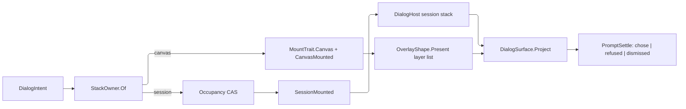
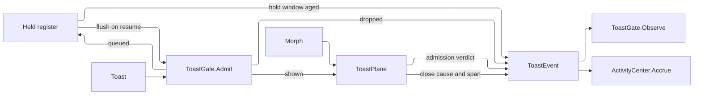

# [APPUI_DIALOGS_NOTIFICATIONS]

Rasm.AppUi presents every modal, transient, and persistent surface through one `DialogIntent` union resolved over a per-root ReactiveUI `Interaction` boundary onto TWO stack owners: seven intent cases return typed results on the kernel `PromptSettle` carrier with dismissal as a case, `StackOwner` binds each case to the DialogHost session stack or the Ursa overlay canvas by modality class, one `DialogTopology` derives from the host and mount axes so a new host is zero topology edits, `MountPolicy` carries the whole per-mount capability set and chrome inset every root resolves, five `ToastRow` rows carry the ranked severity, linger, and quiet-hours piercing through one suppression fold before presentation and publish their close cause and measured presentation span on the way out, an inline banner family materializes as a control arm for conditions a transient note cannot carry, an activity center projects the toast-event stream into a windowed inbox, and three `PickKind` rows route kernel `FilterPlan` filters through host-agnostic pick pipes. The page owns the intent vocabulary, the two-stack boundary law, the topology derivation, the chrome bind, the notification policy with its morph, ceiling, and quiet-hours rules, the activity plane, and the picker and host-modality law over DialogHost.Avalonia, Irihi.Ursa, ReactiveUI, Avalonia, Thinktecture-generated vocabulary, LanguageExt result types, kernel `Rasm.Interaction` prompt vocabulary, and NodaTime instants.

Both stacks are reached ONLY through a mount-bound presence fact, because both registries answer an absent host dishonestly: the DialogHost static surface resolves its instance by identifier and THROWS on no loaded host, no match, and multiple matches, while the Ursa overlay registry is internal and answers an unregistered id with a silent no-op on the void shapes and `DialogResult.None` on the awaited ones — a value indistinguishable from a user cancel. The presence fact is therefore the first admission of every stack crossing, exactly as the picker's window fact is the first admission of every pick.

## [01]-[INDEX]

- [02]-[DIALOG_INTENTS]: One modal vocabulary; the case-minted typed demand; the confirm friction ladder; the layer anchor; one direct generated fault union.
- [03]-[SESSION_ALGEBRA]: Two stack owners with the boundary law; the admitted root key; topology derived over the host and mount axes.
- [04]-[DIALOG_CHROME]: Scrim, corner, ring, and blur addresses over the depth and material tiers, bound inside the registration lease.
- [05]-[NOTIFICATIONS]: Toast rows, the pending morph, the one suppression fold, the presentation plane, and the banner family.
- [06]-[ACTIVITY_CENTER]: The windowed inbox over the toast-event stream, its accrual trait, and quiet hours.
- [07]-[PICKERS_HOST_MODALITY]: Pick rows, capability gate, kernel filter plans, host modality law.

## [02]-[DIALOG_INTENTS]

- Owner: `DialogIntent` `[Union]` — the one modal vocabulary across every admitted surface; `DialogAsk<TResult>` — the case-minted question value binding each intent to its one result shape; `ConfirmFriction` `[Union]` — the destructive-friction ladder; `LayerAnchor` `[Union]` — where a canvas layer seats; `TypedConfirmCell` — the verification-phrase content; `DialogFault` — the direct generated `[Union]` with one `[FaultCase]` leaf per dialog failure.
- Cases: Confirm → `Unit`, Form → template commit record, Pick → `Seq<FileLocation>`, Progress → `DeadlineOutcome`, Error → `Unit`, About → `Unit`, Layer → `Unit`; `ConfirmFriction` = Acknowledge | Typed | Inline; `LayerAnchor` = Bound | Edge | Route; `[FaultCase]` = ResultShape | PickerUnavailable | SessionOccupied | TemplateMissing | PolicyRejected | HostUnregistered | RetreatVetoed | SessionAbsent | CorrelationUnknown.
- Law: friction is a COLUMN on the confirm case, never three confirm names — an acknowledgement, a typed destructive gate, and an inline pop-confirm are one intent under three rows, so every caller raises one verb and the ladder decides how much the operator must do to clear it.
- Law: the four canvas modalities are ONE `Layer` case whose `OverlayShape` value IS the discriminant, because the shape row already recovers it and already owns the dispatch, the chrome tiers, and the choreography — four sibling case names re-stated the same fact a fourth time. NAMED LOSS: the compile break a fifth modality used to force on every dispatcher; it is bought back by the shape row's own generated total `Switch` and by `Admits`, which refuses an anchor the row does not seat.
- Auto: the screen fault fold raises the Error case with its correlation — never per-control failure handling; the boot crash-restore offer rides one Confirm row under `Acknowledge`; the conflict-resolution inspector registers as one Form content row; a destructive verb whose target carries an identifier raises Confirm under `Typed(target)`.
- Packages: Thinktecture.Runtime.Extensions, ReactiveUI, LanguageExt.Core, Irihi.Ursa, Avalonia, Rasm (project — kernel fault floor, `FilterPlan`, `FileLocation`), Rasm.AppHost (project)
- Growth: one `DialogIntent` case carrying its own `Ask` mint and its `StackOwner` arm, one `ConfirmFriction` row, one `LayerAnchor` case, one `OverlayShape` row, or one Form content row resolved through `IViewFor` registration; a new fault case is one `[FaultCase]` leaf; zero new surface.
- Boundary: Progress content binds the progress stream selected by `Correlation` and is PRODUCER-AGNOSTIC — a Compute lane and a synchronous kernel fold publish onto the same correlation-selected cell, the kernel through the `IProgress<double>` sink its own governance band carries (`ArrangementPolicy.Governed`), so a long boolean and a remote solve render through one intent with no second progress vocabulary and no case added here; a deadline miss renders the typed `DeadlineOutcome` — never a spinner timeout; the Form and Layer template keys resolve through the topology `ContentTemplate` resolver onto the host `DialogContentTemplate` at registration so a content session selects its template by key from one resolver and a per-case template literal in registration code is the deleted form; About renders the `ReleaseIdentity` record as given. `DialogFault.ResultShape` IS caller-reachable: the DialogHost close parameter is erased to `object?`, so a content template that closes its session with a parameter whose runtime type is neither `TResult` nor `DialogFault` re-types into this fault at `DialogSurface.Project` and travels out as `PromptSettle.Refused` — it names a session whose close contract disagrees with the case that minted the ask, which is a registration defect the caller is the only surface positioned to report. The `Typed` row compares ORDINAL and exact: no trim, no case folding, no culture — a destructive gate that normalizes accepts a phrase the operator never typed, and the whole point of the row is that the operator typed it. The `Inline` row drives an ALREADY-MOUNTED `PopConfirm` the verb's trigger wears in its own screen tree — the row carries the mounted anchor and nothing else, because trigger mode and placement are that control's own styled properties and a duplicate column beside them would let the two disagree; re-parenting a live trigger into a freshly constructed pop-confirm is the deleted form, since the wrapper is a content control and the surgery would detach the very element the gesture is in flight over. The pick result is the kernel `FileLocation` on both legs, so an unadmitted path refuses at the picker boundary rather than travelling as text into an export destination. The case-minted-typed-demand idiom is the kernel prompt owner's declared law (`Rasm/Interaction/chrome#PROMPT`); `DialogAsk` instantiates it over `DialogIntent` rather than `PickerSpec` because the intent family is Avalonia-stacked, and the law itself is not re-argued here.

```csharp
// --- [TYPES] ---------------------------------------------------------------------------

public readonly record struct DialogAsk<TResult>(DialogIntent Intent) where TResult : notnull;

[Union(ConversionFromValue = ConversionOperatorsGeneration.None)]
public abstract partial record ConfirmFriction {
    private ConfirmFriction() { }

    public sealed record Acknowledge : ConfirmFriction;
    public sealed record Typed(string Target) : ConfirmFriction;
    public sealed record Inline(PopConfirm Anchor) : ConfirmFriction;
}

[Union(ConversionFromValue = ConversionOperatorsGeneration.None)]
public abstract partial record LayerAnchor {
    private LayerAnchor() { }

    public sealed record Bound : LayerAnchor;
    public sealed record Edge(Position Side) : LayerAnchor;
    public sealed record Route(string RouteKey) : LayerAnchor;

    public Option<Position> Side => Switch(
        bound: static _ => Option<Position>.None,
        edge: static row => Some(row.Side),
        route: static _ => Option<Position>.None);

    public Option<string> RouteKey => Switch(
        bound: static _ => Option<string>.None,
        edge: static _ => Option<string>.None,
        route: static row => Some(row.RouteKey));
}

[Union(ConversionFromValue = ConversionOperatorsGeneration.None)]
public abstract partial record DialogIntent {
    private DialogIntent() { }

    public sealed record Confirm(string Title, string Body, string AffirmKey, string DismissKey, ConfirmFriction Friction) : DialogIntent {
        public DialogAsk<Unit> Ask => new(this);
    }

    public sealed record Form(string TemplateKey, IReactiveObject Content) : DialogIntent {
        public Option<DialogAsk<TCommit>> Ask<TCommit>() where TCommit : class, IReactiveObject =>
            Content is TCommit ? Some(new DialogAsk<TCommit>(this)) : None;
    }

    public sealed record Pick(PickKind Kind, PickCardinality Cardinality, Seq<FilterPlan> Filters, Option<string> SuggestedName = default) : DialogIntent {
        public DialogAsk<Seq<FileLocation>> Ask => new(this);
    }

    public sealed record Progress(string Title, CorrelationId Correlation, DeadlineClass Deadline) : DialogIntent {
        public DialogAsk<DeadlineOutcome> Ask => new(this);
    }

    public sealed record Error(LanguageExt.Common.Error Fault, CorrelationId Correlation) : DialogIntent {
        public DialogAsk<Unit> Ask => new(this);
    }

    public sealed record About(ReleaseIdentity Identity) : DialogIntent {
        public DialogAsk<Unit> Ask => new(this);
    }

    public sealed record Layer(OverlayShape Shape, string TemplateKey, IReactiveObject Content, LayerAnchor Anchor) : DialogIntent {
        public DialogAsk<Unit> Ask => new(this);
    }
}

[SmartEnum<string>]
[KeyMemberEqualityComparer<ComparerAccessors.StringOrdinal, string>]
[KeyMemberComparer<ComparerAccessors.StringOrdinal, string>]
public sealed partial class PickCardinality {
    public static readonly PickCardinality One = new("one", admits: static count => count <= 1);
    public static readonly PickCardinality Many = new("many", admits: static count => count >= 0);

    [UseDelegateFromConstructor]
    public partial bool Admits(int count);
}

// --- [ERRORS] --------------------------------------------------------------------------

[Union(ConversionFromValue = ConversionOperatorsGeneration.None)]
public abstract partial record DialogFault : Fault {
    private static readonly FaultBand FamilyBand = FaultBand.Dialog;
    private DialogFault(string detail) { Detail = detail; }

    public string Detail { get; }

    public override string Message => Detail;

    [FaultCase(0)]
    public sealed partial record ResultShape(string Expected, string Actual) : DialogFault($"{Expected}:{Actual}");
    [FaultCase(1)]
    public sealed partial record PickerUnavailable(string Detail) : DialogFault(Detail);
    [FaultCase(2)]
    public sealed partial record SessionOccupied(string Detail) : DialogFault(Detail);
    [FaultCase(3)]
    public sealed partial record TemplateMissing(string Detail) : DialogFault(Detail);
    [FaultCase(4)]
    public sealed partial record PolicyRejected(string Detail) : DialogFault(Detail);
    [FaultCase(5)]
    public sealed partial record HostUnregistered(string Detail) : DialogFault(Detail);
    [FaultCase(6)]
    public sealed partial record RetreatVetoed(string Detail) : DialogFault(Detail);
    [FaultCase(7)]
    public sealed partial record SessionAbsent(string Detail) : DialogFault(Detail);
    [FaultCase(8)]
    public sealed partial record CorrelationUnknown(string Detail) : DialogFault(Detail);
}

// --- [MODELS] --------------------------------------------------------------------------

public sealed class TypedConfirmCell : ReactiveObject {
    private string phrase = string.Empty;

    public TypedConfirmCell(DialogIntent.Confirm intent, string target, string identifier) {
        Intent = intent;
        Target = target;
        Affirm = ReactiveCommand.Create(
            () => DialogHost.Close(identifier, unit),
            this.WhenAnyValue(cell => cell.Armed));
        Dismiss = ReactiveCommand.Create(() => DialogHost.Close(identifier, null));
    }

    public DialogIntent.Confirm Intent { get; }

    public string Target { get; }

    public string Phrase {
        get => phrase;
        set => this.RaiseAndSetIfChanged(ref phrase, value);
    }

    public bool Armed => string.Equals(Phrase, Target, StringComparison.Ordinal);

    public ReactiveCommand<Unit, Unit> Affirm { get; }

    public ReactiveCommand<Unit, Unit> Dismiss { get; }
}
```

## [03]-[SESSION_ALGEBRA]

- Owner: `StackOwner` `[SmartEnum<string>]` — the modality-to-stack projection, total over the intent family; `LayerTrait` and `MountTrait` — the two capability vocabularies; `OverlayShape` — the canvas modality rows carrying their own dispatch; `MountPolicy` — the per-mount capability set, toast anchor, and chrome inset; `RootKey` — the admitted host-crossed-mount address every identifier derives from; `DialogTopology` — the derived per-surface root; `DialogPort` — the mount-bound delegate columns; `PickRequest` — the projected pick the storage route consumes; `SessionVerb` `[Union]` — the session stack's four verbs as values; `DialogSurface` — the fold over the row.
- Cases: `StackOwner` = session | canvas; `OverlayShape` = palette | peek | drawer | editor, each carrying its depth tier, material tier, motion plan, modality trait set, vertical anchor, admitted `LayerAnchor`, and its own host dispatch; `MountTrait` = stacked | click-away | blur | canvas; `LayerTrait` = modal | light-dismiss | full-surface; `SessionVerb` = Advance | Retreat | Raise | Dismiss.
- Entry: `public IO<PromptSettle<TResult>> Show<TResult>(DialogAsk<TResult> ask)` — the question arrives case-minted, so `TResult` is the intent's own result shape and the kernel prompt carrier answers chosen, refused, and dismissed as three cases; `public IO<Fin<Unit>> Apply(SessionVerb verb)` — the one session-stack fold; `public Fin<Lease<IDisposable>> Register(DialogHost session, Option<OverlayDialogHost> canvas)` — the request handler and the chrome bind under one custody; `public static Fin<DialogTopology> Derive(ConsumptionProfile profile, SurfaceMount mount, DialogPort port)` — the one topology projection over the host and mount axes.
- Law: the SESSION stack owns every DECIDING modality — Confirm, Form, Pick, Progress, Error, About — and the CANVAS stack owns every CO-RESIDENT one. The split is the result handle, not the visual: a deciding surface's answer is the awaited close parameter of ONE root, so two open decisions leave the root's answer ambiguous and the CAS reservation is what forecloses it. The canvas holds an ORDERED LAYER LIST instead of a cell — each layer carries its own mask, its own modal contribution, and its own awaited task — so two open layers have two distinct handles and neither is ambiguous. Single-occupancy therefore does not govern the canvas: imposing it would refuse exactly the co-residency the canvas exists to provide, which is a palette over a drawer over a peek.
- Law: the crossing carries ONE outcome shape. The kernel prompt owner rules a stacked `Fin<Option<T>>` over one crossing the deleted form, so `Project` mints `PromptSettle<TResult>` and every arm — an occupancy refusal, an unregistered host, a template miss, a shape disagreement, a dismissal, a chosen value — lands as a case a caller recovers from differently. `Eff` leaves the page with it: the typed failure channel it existed for is now a case of the value.
- Law: the mount's capability SET is the one presence vocabulary. Four booleans admitted sixteen corners against five real mounts and let a canvas-less mount claim a layer plane; `CapabilitySet<MountTrait>` states the held rows, and the canvas crossing DEMANDS `Canvas` through `Require`, so the refusal carries the missing rows as evidence rather than a bare label. `MountPolicy` rows stay five even where two hold identical columns, because the row key is the identifier segment and collapsing them would give a panel and a modal on one host ONE identifier — the multiple-match throw this derivation exists to foreclose.
- Law: the drawer's ONE owner is `OverlayDrawer`. The suite's `Drawer` type is obsolete and forwards every member to it verbatim, so the two candidate mechanisms are one mechanism and a forwarder, and binding the forwarder buys a deprecation with no capability in it.
- Auto: registration is the framework's, never a call — the derived `CanvasId` is stamped on the mounted `OverlayDialogHost.HostId` BEFORE attach, the host registers itself under `(HostId, TopLevel hash)` at `OnAttachedToVisualTree`, and `OnDetachedFromVisualTree` closes every open layer and unregisters under the CURRENT id; the session root binds its handler and its chrome through one `Register` lease the activation scope disposes; composition projects each derived row onto `Identifier`, `IsMultipleDialogsEnabled`, `CloseOnClickAway`, `OverlayBackground`, `BlurBackground`, `PopupPositioner`, and the `DialogHostStyle` chrome; the Form arm wraps its content through `Templated`, resolving the `TemplateKey` against the `ContentTemplate` resolver onto the host `DialogContentTemplate`; a dirty Form session arms `DialogClosingEventArgs.Cancel` through `DialogClosingCallback`; the keyboard trap-and-return law discharges across both stacks in two halves — the `Cycle` region mode lands on each overlay root at the chrome bind, and every crossing captures the element holding focus at the raise and returns it when that crossing ends.
- Packages: DialogHost.Avalonia, Irihi.Ursa, ReactiveUI, Avalonia, LanguageExt.Core, Thinktecture.Runtime.Extensions, Rasm (project — `CapabilitySet`, `CapabilityLaw`, `Cell`/`Transition`, `Lease`, `PromptSettle`, `FilterPlan`, `FileLocation`), Rasm.AppHost (project)
- Growth: a new host substrate is one `HostRows` descriptor row at the AppHost owner and costs zero rows here; a genuinely new mounting shape is one `MountPolicy` arm; a new canvas modality is one `OverlayShape` row carrying its own dispatch and admitted anchor; a new session verb is one `SessionVerb` case and one `Apply` arm; zero new surface.
- Boundary: overlay choreography is the shape row's own `MotionPlan` read against the layer's measured extent through `Poses`, so each modality enters and leaves on the plan that names it, the reduction collapse rides that one read, and a canvas-local transition is the deleted form; `DialogSurface` is the named boundary capsule — the registration handler and the pick route carry the erased close parameter the DialogHost boundary owns, and `Project` re-types it onto the prompt carrier. Every static crossing is GUARDED by the mount's own presence fact and never by a probe of the registry: the DialogHost static surface resolves its instance by scanning loaded hosts and throws on zero, on no identifier match, and on MULTIPLE matches, so `IsDialogOpen`, `GetDialogSession`, `Close`, and `Pop` are all throwing reads before mount and after unmount, and the identifier derivation is what forecloses the multiple-match throw by construction; the Ursa registry is internal and adds by try-add, so a duplicate key keeps the FIRST host and silently drops the second, and an unregistered id answers `DialogResult.None` — the same value a user cancel produces — which no fault result downstream can see. `DialogHost.Pop` is the package's RAISE verb and never a retreat: it matches a host by CONTENT REFERENCE, moves it to the top of the stack, and re-presents it, so the null-content call the name invites matches nothing and does nothing, and the retreat verb lives on `DialogSession.Close` where the closing veto is honoured. The canvas has the same verb under its own vocabulary — `DialogControlBase.UpdateLayer` raises a `DialogLayerChangeType` its host folds into list order — but the vm-first dispatchers hand back a task and never the shell, so the page declares that vocabulary and owns no canvas raise call; a canvas layer raises itself through its own chrome. `TopLevelResolver` is the single per-surface service-capsule delegate the pick pipe binds over, each row's binding one `TopLevel.GetTopLevel(Visual)` read whose `TopLevel?` return projects to `Option<TopLevel>` at that one boundary — an embedded mount answers its root like any other, reference-equal, and KEEPS answering it after the root disposes, so a resolved root proves ATTACHMENT and never liveness and every row needing a live surface reads the mount's own facts instead; the keyboard law is DISCHARGED here rather than declared elsewhere — `Shell/accessibility#KEYBOARD_NAV` states the dialog overlay root as the `Cycle` region and the opener return as a session obligation, so the region mode rides `FocusOps.Mode` at the chrome bind where both roots are in hand and the return keys on the crossing's own END: an awaiting crossing restores at `Request` and a co-resident layer restores at its own detach, because a fold that returned the moment it seated a palette would pull the keyboard back out of the surface the operator is still typing into, and the opener reads off the mount's own top level so no second port column exists to drift; exactly ONE canvas per modal-status scope sets `IsModalStatusReporter`, because the reporter writes the scope's attached flag unconditionally and a second reporter's close would clear the first's flag while its own layer is still open. The UI-thread crossing vocabulary stays Avalonia's `Dispatcher` here — the kernel `UiThread` marshal is Eto-bound and this package cannot compose the marshal, only the lane vocabulary — and the escalation to split `UiDispatch`/`DispatchLane` from that marshal is recorded rather than pre-empted.

```csharp
// --- [TYPES] ---------------------------------------------------------------------------

[SmartEnum<string>]
[KeyMemberEqualityComparer<ComparerAccessors.StringOrdinal, string>]
[KeyMemberComparer<ComparerAccessors.StringOrdinal, string>]
public sealed partial class StackOwner {
    public static readonly StackOwner Session = new("session");
    public static readonly StackOwner Canvas = new("canvas");

    public static StackOwner Of(DialogIntent intent) => intent.Switch(
        confirm: static c => c.Friction is ConfirmFriction.Inline ? Canvas : Session,
        form: static _ => Session,
        pick: static _ => Session,
        progress: static _ => Session,
        error: static _ => Session,
        about: static _ => Session,
        layer: static _ => Canvas);
}

[SmartEnum<string>]
[KeyMemberEqualityComparer<ComparerAccessors.StringOrdinal, string>]
public sealed partial class LayerTrait : ICapability<LayerTrait> {
    public static readonly LayerTrait Modal = new("modal");
    public static readonly LayerTrait LightDismiss = new("light-dismiss");
    public static readonly LayerTrait FullSurface = new("full-surface");
}

[SmartEnum<string>]
[KeyMemberEqualityComparer<ComparerAccessors.StringOrdinal, string>]
public sealed partial class MountTrait : ICapability<MountTrait> {
    public static readonly MountTrait Stacked = new("stacked");
    public static readonly MountTrait ClickAway = new("click-away");
    public static readonly MountTrait Blur = new("blur");
    public static readonly MountTrait Canvas = new("canvas");
}

[SmartEnum<string>]
[KeyMemberEqualityComparer<ComparerAccessors.StringOrdinal, string>]
[KeyMemberComparer<ComparerAccessors.StringOrdinal, string>]
public sealed partial class OverlayShape {
    public static readonly OverlayShape Palette = new("palette",
        depth: DepthTier.Flyout, material: MaterialTier.Overlay, plan: MotionPlan.Flyout,
        traits: CapabilitySet<LayerTrait>.Of(LayerTrait.LightDismiss),
        rise: VerticalPosition.Top,
        admits: static anchor => anchor is LayerAnchor.Bound,
        present: DialogSurface.Fired);
    public static readonly OverlayShape Peek = new("peek",
        depth: DepthTier.Floating, material: MaterialTier.Overlay, plan: MotionPlan.Flyout,
        traits: CapabilitySet<LayerTrait>.Of(LayerTrait.LightDismiss),
        rise: VerticalPosition.Center,
        admits: static anchor => anchor is LayerAnchor.Route or LayerAnchor.Bound,
        present: DialogSurface.Fired);
    public static readonly OverlayShape Drawer = new("drawer",
        depth: DepthTier.Dialog, material: MaterialTier.Sheet, plan: MotionPlan.Drawer,
        traits: CapabilitySet<LayerTrait>.Of(LayerTrait.Modal, LayerTrait.LightDismiss),
        rise: VerticalPosition.Center,
        admits: static anchor => anchor is LayerAnchor.Edge,
        present: DialogSurface.Drawn);
    public static readonly OverlayShape Editor = new("editor",
        depth: DepthTier.Dialog, material: MaterialTier.Sheet, plan: MotionPlan.Dialog,
        traits: CapabilitySet<LayerTrait>.Of(LayerTrait.Modal, LayerTrait.FullSurface),
        rise: VerticalPosition.Center,
        admits: static anchor => anchor is LayerAnchor.Bound,
        present: DialogSurface.Modaled);

    public DepthTier Depth { get; }

    public MaterialTier Material { get; }

    public MotionPlan Plan { get; }

    public CapabilitySet<LayerTrait> Traits { get; }

    public VerticalPosition Rise { get; }

    [UseDelegateFromConstructor]
    public partial bool Admits(LayerAnchor anchor);

    [UseDelegateFromConstructor]
    public partial Task<object?> Present(Control layer, DialogIntent.Layer request, string canvasId);

    public static Option<OverlayShape> Of(DialogIntent intent) => intent.Switch(
        layer: static row => Some(row.Shape),
        confirm: static _ => Option<OverlayShape>.None,
        form: static _ => Option<OverlayShape>.None,
        pick: static _ => Option<OverlayShape>.None,
        progress: static _ => Option<OverlayShape>.None,
        error: static _ => Option<OverlayShape>.None,
        about: static _ => Option<OverlayShape>.None);

    public OverlayDialogOptions Options() => new() {
        FullScreen = Traits.Admits(LayerTrait.FullSurface),
        VerticalAnchor = Rise,
        Mode = DialogMode.None,
        Buttons = DialogButton.None,
        CanLightDismiss = Traits.Admits(LayerTrait.LightDismiss),
        CanDragMove = false,
        CanResize = false,
        IsCloseButtonVisible = Traits.Admits(LayerTrait.LightDismiss),
        StyleClass = Key,
    };
}

[SmartEnum<string>]
[KeyMemberEqualityComparer<ComparerAccessors.StringOrdinal, string>]
[KeyMemberComparer<ComparerAccessors.StringOrdinal, string>]
public sealed partial class MountPolicy {
    public static readonly MountPolicy Panel = new("panel",
        traits: CapabilitySet<MountTrait>.Of(MountTrait.Canvas),
        anchor: Some(ToastAnchor.TopCenter), inset: new Thickness(EmbeddedInset));
    public static readonly MountPolicy Modal = new("modal",
        traits: CapabilitySet<MountTrait>.Of(MountTrait.Canvas),
        anchor: Some(ToastAnchor.TopCenter), inset: new Thickness(EmbeddedInset));
    public static readonly MountPolicy Companion = new("companion",
        traits: CapabilitySet<MountTrait>.Of(MountTrait.Stacked, MountTrait.ClickAway, MountTrait.Canvas),
        anchor: Some(ToastAnchor.BottomRight), inset: default);
    public static readonly MountPolicy Standalone = new("standalone",
        traits: CapabilitySet<MountTrait>.Of(MountTrait.Stacked, MountTrait.ClickAway, MountTrait.Blur, MountTrait.Canvas),
        anchor: Some(ToastAnchor.BottomRight), inset: default);
    public static readonly MountPolicy Offscreen = new("offscreen",
        traits: CapabilitySet<MountTrait>.Of(MountTrait.Stacked),
        anchor: None, inset: default);

    public const double EmbeddedInset = 8d;

    public CapabilitySet<MountTrait> Traits { get; }

    public Option<ToastAnchor> Anchor { get; }

    public Thickness Inset { get; }

    public bool Reserves => !Traits.Admits(MountTrait.Stacked);

    public static MountPolicy Of(SurfaceMount mount) => mount.Switch(
        panel: static _ => Panel,
        modal: static _ => Modal,
        companion: static _ => Companion,
        standalone: static _ => Standalone,
        offscreen: static _ => Offscreen);
}

// --- [MODELS] --------------------------------------------------------------------------

public sealed record RootKey {
    public const string SessionSuffix = "session";
    public const string CanvasSuffix = "canvas";

    private RootKey(string host, string mount) {
        Host = host;
        Mount = mount;
    }

    public static Validation<Error, RootKey> Of(string host, string mount) =>
        (Segment(nameof(host), host), Segment(nameof(mount), mount))
            .Apply(static (admitted, kind) => new RootKey(admitted, kind))
            .As();

    public string Host { get; }

    public string Mount { get; }

    public string Value => $"{Host}:{Mount}";

    public string Identifier => $"{Value}:{SessionSuffix}";

    public string CanvasId => $"{Value}:{CanvasSuffix}";

    public override string ToString() => Value;

    private static Validation<Error, string> Segment(string axis, string value) =>
        !string.IsNullOrWhiteSpace(value) && !value.Contains(':', StringComparison.Ordinal)
            ? Validation<Error, string>.Success(value)
            : Validation<Error, string>.Fail(new DialogFault.PolicyRejected($"root-key:{axis}:'{value}'"));
}

public readonly record struct PickRequest(
    PickKind Kind, PickCardinality Cardinality, Seq<FilePickerFileType> Types, Option<string> SuggestedName);

// --- [SERVICES] ------------------------------------------------------------------------

public sealed record DialogPort(
    Func<bool> SessionMounted,
    Func<bool> CanvasMounted,
    Func<Seq<DialogSession>> Sessions,
    Func<DialogSession, Option<string>> Blocks,
    Func<Option<TopLevel>> TopLevel,
    Func<bool> Windowed,
    Func<string, Option<IDataTemplate>> ContentTemplate,
    Func<DialogIntent.Form, DialogClosingEventHandler> Closing,
    ToastPipe Toasts,
    Option<Func<PickRequest, Task<Seq<FileLocation>>>> PickPipe);

public sealed class DialogTopology {
    private static readonly Op Reservation = Op.Of(name: "appui.dialog.reserve");

    private readonly Atom<Seq<QueuedToast>> held = Atom(Seq<QueuedToast>());
    private readonly Atom<bool> occupied = Atom(false);

    internal DialogTopology(RootKey key, MountPolicy policy, IDialogPopupPositioner positioner, DialogPort port) {
        Key = key;
        Policy = policy;
        Positioner = positioner;
        Port = port;
    }

    public RootKey Key { get; }

    public MountPolicy Policy { get; }

    public IDialogPopupPositioner Positioner { get; }

    public DialogPort Port { get; }

    public Interaction<DialogIntent, object?> Requests { get; } = new();

    public bool HasOpenSession => Port.SessionMounted() && DialogHost.IsDialogOpen(Key.Identifier);

    internal Unit Park(QueuedToast note) => ignore(held.Swap(rows => rows.Add(note)));

    internal Seq<QueuedToast> Drain() => Cell.Take(held).Current;

    internal Fin<Unit> Reserve() =>
        HasOpenSession
            ? Fin.Fail<Unit>(new DialogFault.SessionOccupied(Key.Value))
            : Cell.Step(occupied, static standing => standing ? None : Some(true),
                    new DialogFault.SessionOccupied(Key.Value)) switch {
                Transition<bool>.Committed => Fin.Succ(unit),
                Transition<bool> declined => Fin.Fail<Unit>(
                    declined is Transition<bool>.Refused refused ? refused.Cause : new DialogFault.SessionOccupied(Key.Value)),
            };

    internal Unit Release() => ignore(occupied.Swap(static _ => false));
}
```

```csharp
// --- [TYPES] ---------------------------------------------------------------------------

[Union(ConversionFromValue = ConversionOperatorsGeneration.None)]
public abstract partial record SessionVerb {
    private SessionVerb() { }

    public sealed record Advance(DialogIntent.Progress Snapshot) : SessionVerb;
    public sealed record Retreat : SessionVerb;
    public sealed record Raise(object Content) : SessionVerb;
    public sealed record Dismiss : SessionVerb;
}

// --- [OPERATIONS] ----------------------------------------------------------------------

public static class DialogSurface {
    private static readonly Op Registration = Op.Of(name: "appui.dialog.register");

    private static readonly CapabilitySet<MountTrait> CanvasReach = CapabilitySet<MountTrait>.Of(MountTrait.Canvas);

    public static Fin<DialogTopology> Derive(ConsumptionProfile profile, SurfaceMount mount, DialogPort port) =>
        MountPolicy.Of(mount) switch {
            var policy => RootKey.Of(profile.HostKey, policy.Key)
                .Map(key => new DialogTopology(key, policy, Positioner(policy), port))
                .ToFin(),
        };

    private static IDialogPopupPositioner Positioner(MountPolicy policy) =>
        policy.Traits.Admits(MountTrait.Stacked)
            ? CenteredDialogPopupPositioner.Instance
            : new AlignmentDialogPopupPositioner {
                HorizontalAlignment = HorizontalAlignment.Center,
                VerticalAlignment = VerticalAlignment.Top,
            };

    extension(DialogTopology root) {
        public IO<PromptSettle<TResult>> Show<TResult>(DialogAsk<TResult> ask) where TResult : notnull =>
            IO.liftAsync(async () => await Request(root, ask).ConfigureAwait(true));

        public IO<Fin<Unit>> Apply(SessionVerb verb) =>
            IO.lift<Fin<Unit>>(() => Guarded(root, RootKey.SessionSuffix, () => verb.Switch(
                state: root,
                advance: static (surface, step) =>
                    Optional(DialogHost.GetDialogSession(surface.Key.Identifier))
                        .ToFin(new DialogFault.SessionAbsent(surface.Key.Value))
                        .Bind(session => Ran(() => session.UpdateContent(step.Snapshot))),
                retreat: static (surface, _) => surface.Port.Sessions().Rev().Head.Match(
                    Some: session => session.IsEnded
                        ? Fin.Fail<Unit>(new DialogFault.SessionAbsent($"{surface.Key.Value}:ended"))
                        : surface.Port.Blocks(session).Match(
                            Some: reason => Fin.Fail<Unit>(new DialogFault.RetreatVetoed($"{surface.Key.Value}:{reason}")),
                            None: () => Ran(() => session.Close(null))),
                    None: () => Fin.Fail<Unit>(new DialogFault.SessionAbsent(surface.Key.Value))),
                raise: static (surface, lift) => Ran(() => DialogHost.Pop(surface.Key.Identifier, lift.Content)),
                dismiss: static (surface, _) => Ran(() => DialogHost.Close(surface.Key.Identifier)))));

        public Fin<Lease<IDisposable>> Register(DialogHost session, Option<OverlayDialogHost> canvas) =>
            Lease<IDisposable>.Acquire(
                () => new CompositeDisposable(
                    root.Requests.RegisterHandler(async context =>
                        context.SetOutput(await Route(root, context.Input).ConfigureAwait(true))),
                    DialogChrome.Bind(session, canvas, root.Policy)),
                Registration);
    }

    private static Task<object?> Route(DialogTopology root, DialogIntent intent) => intent.Switch(
        state: root,
        confirm: static (surface, request) => request.Friction.Switch(
            inline: inline => Anchored(inline.Anchor),
            typed: typed => Sessioned(surface, new TypedConfirmCell(request, typed.Target, surface.Key.Identifier)),
            acknowledge: _ => Sessioned(surface, request)),
        form: static (surface, request) => surface.Port.SessionMounted()
            ? Templated(surface, request.TemplateKey, request.Content, new DialogFault.TemplateMissing(request.TemplateKey)).Match(
                Succ: content => DialogHost.Show(content, surface.Key.Identifier, null, surface.Port.Closing(request)),
                Fail: fault => Task.FromResult<object?>(fault))
            : Task.FromResult<object?>(new DialogFault.HostUnregistered($"{surface.Key.Value}:{RootKey.SessionSuffix}")),
        pick: static (surface, request) => RoutePick(surface, request),
        progress: static (surface, request) => Sessioned(surface, request),
        error: static (surface, request) => Sessioned(surface, request),
        about: static (surface, request) => Sessioned(surface, request),
        layer: static (surface, request) => Layered(surface, request));

    private static async Task<object?> RoutePick(DialogTopology root, DialogIntent.Pick request) =>
        Routed(root, request) is { IsSome: true, Case: Func<PickRequest, Task<Seq<FileLocation>>> route }
            ? Cardinal(request, await route(Projected(request)).ConfigureAwait(true))
            : new DialogFault.PickerUnavailable(root.Key.Value);

    private static async Task<object?> Layered(DialogTopology root, DialogIntent.Layer request) =>
        !request.Shape.Admits(request.Anchor)
            ? new DialogFault.PolicyRejected($"layer-anchor:{request.Shape.Key}:{request.Anchor.GetType().Name}")
            : root.Policy.Traits
                .Require(CanvasReach, missing => (Error)new DialogFault.HostUnregistered($"{root.Key.Value}:{RootKey.CanvasSuffix}:{missing.Wire}"))
                .Bind(_ => root.Port.CanvasMounted()
                    ? Fin.Succ(unit)
                    : Fin.Fail<Unit>(new DialogFault.HostUnregistered($"{root.Key.Value}:{RootKey.CanvasSuffix}")))
                .Bind(_ => Templated(root, request.TemplateKey, request.Content, new DialogFault.TemplateMissing(request.TemplateKey)))
                .Match(
                    Succ: async layer => await request.Shape.Present((Control)layer, request, root.Key.CanvasId).ConfigureAwait(true),
                    Fail: fault => Task.FromResult<object?>(fault))
                .ConfigureAwait(true);

    // --- [OVERLAY_DISPATCH]

    internal static Task<object?> Fired(Control layer, DialogIntent.Layer request, string canvasId) {
        Option<InputElement> opener = Opener(layer);
        void Detached(object? sender, VisualTreeAttachmentEventArgs args) {
            layer.DetachedFromVisualTree -= Detached;
            ignore(Restore(opener));
        }

        layer.DetachedFromVisualTree += Detached;
        OverlayDialog.ShowCustom(layer, request.Content, canvasId, request.Shape.Options());
        return Task.FromResult<object?>(unit);
    }

    internal static async Task<object?> Drawn(Control layer, DialogIntent.Layer request, string canvasId) =>
        await request.Anchor.Side.Match(
            Some: async side => (object?)await OverlayDrawer.ShowCustomAsync<Unit>(layer, request.Content, canvasId, new DrawerOptions {
                Position = side,
                CanLightDismiss = request.Shape.Traits.Admits(LayerTrait.LightDismiss),
                IsCloseButtonVisible = request.Shape.Traits.Admits(LayerTrait.LightDismiss),
                Buttons = DialogButton.None,
                CanResize = false,
                StyleClass = request.Shape.Key,
            }).ConfigureAwait(true),
            None: () => Task.FromResult<object?>(new DialogFault.PolicyRejected($"drawer-edge:{request.TemplateKey}"))).ConfigureAwait(true);

    internal static async Task<object?> Modaled(Control layer, DialogIntent.Layer request, string canvasId) =>
        await OverlayDialog.ShowCustomAsync<Unit>(layer, request.Content, canvasId, request.Shape.Options()).ConfigureAwait(true);

    // --- [CROSSING]

    internal static bool Awaits(DialogIntent intent) =>
        StackOwner.Of(intent) == StackOwner.Session
        || OverlayShape.Of(intent).Map(static shape => shape.Traits.Admits(LayerTrait.Modal)).IfNone(true);

    internal static Option<InputElement> Opener(DialogTopology root) => Focused(root.Port.TopLevel());

    private static Option<InputElement> Opener(Visual layer) => Focused(Optional(Avalonia.Controls.TopLevel.GetTopLevel(layer)));

    private static Option<InputElement> Focused(Option<TopLevel> top) =>
        top.Bind(static host => Optional(host.FocusManager))
            .Bind(static manager => Optional(manager.GetFocusedElement()))
            .Bind(static held => Optional(held as InputElement));

    internal static Unit Restore(Option<InputElement> opener) =>
        opener.Iter(static held => ignore(held.Focus()));

    private static Task<object?> Sessioned(DialogTopology root, object content) =>
        root.Port.SessionMounted()
            ? DialogHost.Show(content, root.Key.Identifier)
            : Task.FromResult<object?>(new DialogFault.HostUnregistered($"{root.Key.Value}:{RootKey.SessionSuffix}"));

    private static Task<object?> Anchored(PopConfirm anchor) {
        TaskCompletionSource<object?> settled = new(TaskCreationOptions.RunContinuationsAsynchronously);
        anchor.HandleAsyncCommand = false;
        anchor.ConfirmCommand = ReactiveCommand.Create(() => ignore(settled.TrySetResult(unit)));
        anchor.CancelCommand = ReactiveCommand.Create(() => ignore(settled.TrySetResult(null)));
        anchor.IsDropdownOpen = true;
        return settled.Task;
    }

    private static Fin<object> Templated(DialogTopology root, string templateKey, object content, DialogFault missing) =>
        root.Port.ContentTemplate(templateKey)
            .Map<object>(template => new ContentControl { Content = content, ContentTemplate = template })
            .ToFin(missing);

    private static Fin<T> Guarded<T>(DialogTopology root, string half, Func<Fin<T>> body) =>
        root.Port.SessionMounted()
            ? body()
            : Fin.Fail<T>(new DialogFault.HostUnregistered($"{root.Key.Value}:{half}"));

    private static Fin<Unit> Ran(Action body) {
        body();
        return Fin.Succ(unit);
    }

    private static Option<Func<PickRequest, Task<Seq<FileLocation>>>> Routed(DialogTopology root, DialogIntent.Pick request) =>
        from route in root.Port.PickPipe
        from top in root.Port.TopLevel()
        where root.Port.Windowed() && request.Kind.Admits(top.StorageProvider)
        select route;

    private static PickRequest Projected(DialogIntent.Pick request) =>
        new(request.Kind, request.Cardinality,
            request.Filters.Map(static plan => new FilePickerFileType(plan.Label) {
                Patterns = plan.Extensions.Map(static extension => $"*.{extension}").ToArray(),
            }),
            request.SuggestedName);

    private static object? Cardinal(DialogIntent.Pick request, Seq<FileLocation> paths) =>
        paths switch {
            { IsEmpty: true } => null,
            _ when !request.Cardinality.Admits(paths.Length) =>
                new DialogFault.PolicyRejected($"pick-cardinality:{request.Cardinality.Key}:{paths.Length}"),
            _ => paths,
        };

    private static PromptSettle<TResult> Project<TResult>(object? closing) where TResult : notnull =>
        closing switch {
            null => new PromptSettle<TResult>.Dismissed(),
            TResult value => new PromptSettle<TResult>.Chose(value),
            DialogFault fault => new PromptSettle<TResult>.Refused(fault),
            var other => new PromptSettle<TResult>.Refused(new DialogFault.ResultShape(typeof(TResult).Name, other.GetType().Name)),
        };

    private static async Task<PromptSettle<TResult>> Request<TResult>(DialogTopology root, DialogAsk<TResult> ask) where TResult : notnull {
        bool reserving = StackOwner.Of(ask.Intent) == StackOwner.Session && root.Policy.Reserves;
        if (reserving && root.Reserve() is { IsFail: true } refusal) {
            return new PromptSettle<TResult>.Refused(refusal.Match(Succ: static _ => Errors.None, Fail: static cause => cause));
        }

        Option<InputElement> opener = Opener(root);
        try {
            return Project<TResult>(await root.Requests.Handle(ask.Intent).ConfigureAwait(true));
        } finally {
            if (Awaits(ask.Intent)) {
                ignore(Restore(opener));
            }

            if (reserving) {
                ignore(root.Release());
            }
        }
    }
}
```

Topology rows are DERIVED, so the table below is the projection source and never a roster: one row per mounting shape, and a new host substrate adds none.

| [INDEX] | [MOUNT]    | [MOUNT_TRAITS]                    | [TOAST_ANCHOR] | [INSET] | [POSITIONER] |
| :-----: | :--------- | :-------------------------------- | :------------- | :------ | :----------- |
|  [01]   | panel      | canvas                            | top-center     | 8       | top-aligned  |
|  [02]   | modal      | canvas                            | top-center     | 8       | top-aligned  |
|  [03]   | companion  | stacked, click-away, canvas       | bottom-right   | none    | centered     |
|  [04]   | standalone | stacked, click-away, blur, canvas | bottom-right   | none    | centered     |
|  [05]   | offscreen  | stacked                           | absent         | none    | centered     |

The canvas dispatch matrix is one cluster carried as the shape rows' own columns; a refused modality carries its reason so absence is closed rather than silent:

| [INDEX] | [SHAPE] | [DISPATCH]                          | [ANCHOR] | [LAYER_TRAITS]       | [RESULT]     |
| :-----: | :------ | :---------------------------------- | :------- | :------------------- | :----------- |
|  [01]   | palette | `Fired` (void fire)                 | bound    | light-dismiss        | seated       |
|  [02]   | peek    | `Fired` (void fire)                 | route    | light-dismiss        | seated       |
|  [03]   | drawer  | `Drawn` (`OverlayDrawer` awaited)   | edge     | modal, light-dismiss | `Task<T?>`   |
|  [04]   | editor  | `Modaled` (`OverlayDialog` awaited) | bound    | modal, full-surface  | `Task<T?>`   |
|  [05]   | message | refused                             | —        | —                    | Confirm dupe |



## [04]-[DIALOG_CHROME]

- Owner: `DialogChrome` — the scrim, corner, ring, blur, depth, and material addresses every root resolves and the one apply fold binding them onto the two hosts.
- Entry: `public static IDisposable Bind(DialogHost session, Option<OverlayDialogHost> canvas, MountPolicy policy)` — the one apply, returning the composite subscription the registration lease disposes.
- Law: every chrome value is a TOKEN KEY bound through the theme gate's resource observable, never a resolved brush, radius, or shadow written onto the host — a `SetValue` of a resolved paint seats a local value no dictionary edit can re-resolve, so a variant swap would repaint the screen and leave both overlay roots wearing the previous theme.
- Law: a chrome column that ignores its mount is not a mount column. Seven of nine columns on the retired `ChromeColumns` projection answered the same literal for every policy, so they are the FOLD's own anchors and the two that genuinely vary — the blur trait and the safe inset — are `MountPolicy` columns beside the traits they belong with. NAMED LOSS: a future per-mount scrim or depth is one new `MountPolicy` column rather than a second `ChromeColumns.Of` overload; there was never a second overload, so nothing that existed is gone.
- Auto: the session root binds `OverlayBackground` to the scrim rung, `BlurBackground` and `BlurBackgroundRadius` to the mount's blur trait, `DialogHostStyle.CornerRadius` to the radius step, `DialogHostStyle.BorderBrush` and `BorderThickness` to the ring pair, and `DialogHostStyle.BoxShadow` to the depth tier's resolved stack; the canvas root binds `OverlayMaskBrush` to the same scrim rung and `SafePadding` to the mount's inset so both stacks scrim identically and a layer never covers host chrome the mount reserved; both roots take the `Cycle` region mode through `FocusOps.Mode` on the way into the fold, because this is the one place holding both control references and a region admission composes no lifetime to dispose.
- Packages: DialogHost.Avalonia, Irihi.Ursa, Avalonia, System.Reactive, LanguageExt.Core
- Growth: one binding row per new chrome axis, resolved from the tier families; a genuinely mount-varying axis is one `MountPolicy` column; zero new surface.
- Boundary: the depth address is `DepthTier.Dialog` for the session stack and each canvas modality's own tier, so elevation is the token catalogue's ordered layer stack — ring layer first, dark alphas doubled, inset rim as a layer — and never an offset-and-blur pair authored here; the material address names the tier the layer surface takes and the effects plane executes it, so this page writes no acrylic value; a high-contrast projection empties the shadow stacks and widens the stroke family at the catalogue, so the ring carries the separation on that variant with no conditional here; the shipped `ToastCard` key family carries NO shadow key at all, so a toast reads its depth from the plane that hosts it and binding a card-scoped shadow would write a slot the shipped dictionary never defines; `DialogHostStyle.BorderBrush` and `BorderThickness` are SET-ONLY on the attached surface, so the ring binds through the property identity rather than a read-modify-write that has no read; `SafePadding` is the canvas's whole inset vocabulary and the session stack's counterpart is `DialogMargin`, so neither root re-spells the other's placement knob.

```csharp
// --- [COMPOSITION] ---------------------------------------------------------------------

public static class DialogChrome {
    public const int RadiusStep = 3;
    public const int RingStep = 0;
    public const double BlurRadius = 16d;
    private static readonly DepthTier Depth = DepthTier.Dialog;
    private static readonly MaterialTier Material = MaterialTier.Sheet;

    public static IDisposable Bind(DialogHost session, Option<OverlayDialogHost> canvas, MountPolicy policy) =>
        new CompositeDisposable(toSeq(Bindings(Cycled(session), canvas.Map(Cycled), policy)).ToArray());

    static T Cycled<T>(T root) where T : InputElement => (T)root.Mode(KeyboardNavigationMode.Cycle);

    static Seq<IDisposable> Bindings(DialogHost session, Option<OverlayDialogHost> canvas, MountPolicy policy) =>
        Seq(
            ThemeGate.Bind(session, DialogHost.OverlayBackgroundProperty, PaintRole.Scrim.At(0)),
            ThemeGate.Bind(session, DialogHostStyle.CornerRadiusProperty, MetricFamily.Radius.At(RadiusStep)),
            ThemeGate.Bind(session, DialogHostStyle.BorderBrushProperty, PaintRole.Border.At(0)),
            ThemeGate.Bind(session, DialogHostStyle.BorderThicknessProperty, MetricFamily.Stroke.At(RingStep)),
            ThemeGate.Bind(session, DialogHostStyle.BoxShadowProperty, Depth.Key),
            ThemeGate.Bind(session, DialogHost.DialogBackgroundProperty, Material.Key),
            session.Bind(DialogHost.BlurBackgroundProperty, Observable.Return(policy.Traits.Admits(MountTrait.Blur))),
            session.Bind(DialogHost.BlurBackgroundRadiusProperty, Observable.Return(BlurRadius)),
            session.Bind(DialogHost.DialogMarginProperty, Observable.Return(policy.Inset)))
        + canvas.Map(host => Seq(
            ThemeGate.Bind(host, OverlayDialogHost.OverlayMaskBrushProperty, PaintRole.Scrim.At(0)),
            host.Bind(OverlayDialogHost.SafePaddingProperty, Observable.Return(policy.Inset)))).IfNone(Seq<IDisposable>());
}
```

## [05]-[NOTIFICATIONS]

- Owner: `ToastTrait` the note capability vocabulary; `ToastRow` the ranked-severity, linger, and trait rows; `ToastVerdict` the admission verdicts; `ToastAnchor` the plane placement rows; `ToastClose` the terminal fact the manager reports; `ToastEvent` the chronological admission and close event; `QueuedToast` the presentable note; `NoticeGate` the admission context; `ToastPipe` the mount-bound presentation delegates; `ToastPlane` the interactive presenter; `ToastGate` the suppression fold and its instruments.
- Cases: Pending sticky | Info 4s | Success 4s | Warning 6s | Error sticky, where `Sticky` derives from zero linger and severity is the folder's ONE ranked `Severity` family; `ToastTrait` = pierce | accrue; admission verdicts shown | queued | dropped; close causes the `MessageCloseReason` vocabulary the manager reports — timeout, user action, displacement.
- Entry: `public IO<ToastVerdict> Toast(QueuedToast note, NoticeGate gate)` — the presentable note arrives WHOLE and the returned verdict is the gate's actual admission result; `public IO<Fin<Unit>> Morph(CorrelationId correlation, ToastRow row, string body)` — the pending row settles to its terminal severity IN PLACE and the linger clock starts at the morph; `public IO<Seq<ToastVerdict>> Flush(NoticeGate gate)` — the resume drain re-admits each held note through the same gate.
- Law: the LINGER CLOCK is the product's, not the manager's. The shipped manager copies severity and expiration onto a freshly built card at show time and then awaits a bare delay, so it cannot pause, cannot restart, and cannot re-tint — a hover-paused note, a morphing pending note, and a note whose severity settles later are all unexpressible against a copied timer. The plane therefore presents every note with a zero expiration, which is the manager's own never-auto-close posture, and owns the linger off the SAME injected scheduler the hover intent already rides, so one mechanism paces both and a headless proof lane advances them together.
- Law: temporal identity is the kernel timeline's. A bare `TimeProvider` timer beside the app's spans left a toast's presentation and dismissal unorderable against any kernel crossing; the plane captures a `MonotonicStamp` at seat and reads `Elapsed` at close, so `ToastClose` carries the span the note was actually readable for.
- Law: severity is the folder's ONE ranked family. A local notification-type column beside the chart and work ladders forked the ink three ways; the row carries `Severity` and the card's pseudo-class projects from it, so a re-ranked family moves the toast, the chart, and the alert board together.
- Law: the pending row morphs UNDER ONE CORRELATION and emits no second admission — the morph rewrites the live card's severity and body and restarts the clock, so a promise flow publishes exactly one admission event and one close event however many times its severity settles.
- Auto: composition binds `ToastPipe` per derived topology over one mounted `ToastPlane` on a mount carrying an anchor and over an event-only publisher on the anchorless offscreen row; a toast action raises its command intent by key through the deck's own entry, so an unknown key refuses where every other invocation modality refuses; a `Queued` verdict parks the whole presentable note in the topology's register, and the one `PhaseSubscription` observing the support-capture resume drives `Flush` — a still-queued phase leaves the register untouched and publishes no duplicate event, while a presentable phase atomically drains notes in arrival order through the same gate; entries past the plan's own hold window age out as `Dropped` unless their row is `Sticky`, which carries no expiry to have missed; the stack ceiling is the toast plan's `Cap` — the same column the stack projection reads as visible depth — and an overflowing plane closes EVERY card past the ceiling with the displacement cause, so a burst that seated two over the cap no longer leaves the second alive.
- Event: `ToastEvent` carries the original `QueuedToast`, surface, verdict, event instant, and optional `ToastClose`; `Observe` projects admissions and closes onto distinct instrument dimensions, and `ActivityCenter` accrues directly from the same event stream.
- Packages: Avalonia, Irihi.Ursa, Thinktecture.Runtime.Extensions, LanguageExt.Core, NodaTime, System.Reactive, Generator.Equals, Rasm (project — `Severity`, `CapabilitySet`, `Cell`/`Transition`, `Lease`, `MonotonicTimeline`, `InstrumentSpec`), Rasm.AppHost (project)
- Growth: one `ToastRow` row carrying its own severity, linger, and trait set, one `ToastTrait` row, one `ToastVerdict` row, one `ToastAnchor` row, or one `InstrumentSpec` row on `ToastGate.TelemetryRow`; zero new surface.
- Boundary: entry and exit choreography, the stack projection, the visible cap, the hover-intent linger, and the hold window all arrive from the toast motion plan — the row's own severity linger and the suppression fold are the only timing facts owned here, and a plane-local ceiling, dwell, or horizon literal is the deleted form, which is why `Flush` takes no horizon parameter and mints no refusal for one; the stack reflow is one `Stacked` read per live ordinal against the plane's OWN posture cell rather than the card's live pointer state, because a tree read inside the traverse samples a pointer the hover intent has not yet settled; the plane shows through the toast manager's own card and message contract, the card carrying the row's projected notification type and the row's body as its content, so severity re-tints through the shipped `:information`/`:success`/`:warning`/`:error` pseudo-classes and the page writes no paint; the Avalonia notification manager is the deleted form here because it reports no dismissal cause and carries no click action, so a presented note under it is fire-and-linger and its end is unmeasurable; the close callback stamps the DISMISSAL instant it observes; the click raise reaches the deck by key alone, so no toast body carries a command; the plane seats into the manager's own protected item list and closes through the card's verb rather than through `Show`/`Close`/`CloseAll`, so it takes the SAME `Dispatcher.UIThread` assertion those members carry at its own three entries and an off-thread raise is a thrown fact rather than a silently corrupted item list — the assertion stays Avalonia's because the kernel dispatch marshal is Eto-bound; native host toasts and status panes stay host-owned; a degradation level serving NO command access drops every note, read off the level's own access column so a future row inherits the rule; quiet hours park rather than drop, and the Error and Pending rows PIERCE because a failure and an in-flight promise are exactly the two facts a quiet window must not swallow.

```csharp
// --- [TYPES] ---------------------------------------------------------------------------

[SmartEnum<string>]
[KeyMemberEqualityComparer<ComparerAccessors.StringOrdinal, string>]
public sealed partial class ToastTrait : ICapability<ToastTrait> {
    public static readonly ToastTrait Pierce = new("pierce");
    public static readonly ToastTrait Accrue = new("accrue");
}

[SmartEnum<string>]
[KeyMemberEqualityComparer<ComparerAccessors.StringOrdinal, string>]
[KeyMemberComparer<ComparerAccessors.StringOrdinal, string>]
public sealed partial class ToastRow {
    public static readonly ToastRow Pending = new("pending", Severity.Info, Duration.Zero,
        traits: CapabilitySet<ToastTrait>.Of(ToastTrait.Pierce));
    public static readonly ToastRow Info = new("info", Severity.Info, Duration.FromSeconds(4),
        traits: CapabilitySet<ToastTrait>.None);
    public static readonly ToastRow Success = new("success", Severity.Nominal, Duration.FromSeconds(4),
        traits: CapabilitySet<ToastTrait>.None);
    public static readonly ToastRow Warning = new("warning", Severity.Warning, Duration.FromSeconds(6),
        traits: CapabilitySet<ToastTrait>.Of(ToastTrait.Accrue));
    public static readonly ToastRow Error = new("error", Severity.Critical, Duration.Zero,
        traits: CapabilitySet<ToastTrait>.Of(ToastTrait.Pierce, ToastTrait.Accrue));

    public Severity Rank { get; }

    public Duration Linger { get; }

    public CapabilitySet<ToastTrait> Traits { get; }

    public bool Sticky => Linger == Duration.Zero;

    public bool Provisional => this == Pending;

    public NotificationType Notification => Rank.Switch(
        nominal: static _ => NotificationType.Success,
        info: static _ => NotificationType.Information,
        warning: static _ => NotificationType.Warning,
        critical: static _ => NotificationType.Error);
}

[SmartEnum<string>]
[KeyMemberEqualityComparer<ComparerAccessors.StringOrdinal, string>]
[KeyMemberComparer<ComparerAccessors.StringOrdinal, string>]
public sealed partial class ToastVerdict {
    public static readonly ToastVerdict Shown = new("shown");
    public static readonly ToastVerdict Queued = new("queued");
    public static readonly ToastVerdict Dropped = new("dropped");
}

[SmartEnum<string>]
[KeyMemberEqualityComparer<ComparerAccessors.StringOrdinal, string>]
[KeyMemberComparer<ComparerAccessors.StringOrdinal, string>]
public sealed partial class ToastAnchor {
    public static readonly ToastAnchor TopCenter = new("top-center", HorizontalAlignment.Center, VerticalAlignment.Top);
    public static readonly ToastAnchor TopRight = new("top-right", HorizontalAlignment.Right, VerticalAlignment.Top);
    public static readonly ToastAnchor BottomRight = new("bottom-right", HorizontalAlignment.Right, VerticalAlignment.Bottom);
    public static readonly ToastAnchor BottomCenter = new("bottom-center", HorizontalAlignment.Center, VerticalAlignment.Bottom);

    public HorizontalAlignment Horizontal { get; }

    public VerticalAlignment Vertical { get; }
}

// --- [MODELS] --------------------------------------------------------------------------

public readonly record struct ToastClose(MessageCloseReason Cause, Instant At, Option<Duration> Presented);

public readonly record struct QueuedToast(ToastRow Row, string Title, string Body, Option<string> IntentKey, Instant At, CorrelationId Correlation);

public readonly record struct ToastEvent(QueuedToast Note, RootKey Surface, ToastVerdict Verdict, Instant At, Option<ToastClose> Close);

public sealed record NoticeGate(
    RuntimePhase Phase,
    DegradationState Degradation,
    bool Quiet,
    Instant At,
    Func<ToastEvent, Unit> Publish);

public sealed record ToastPipe(
    Func<QueuedToast, Func<ToastClose, Unit>, IO<Fin<Unit>>> Present,
    Func<CorrelationId, ToastRow, string, IO<Fin<Unit>>> Settle,
    Func<CorrelationId, IO<Unit>> Retire);
```

```csharp
// --- [COMPOSITION] ---------------------------------------------------------------------

public sealed class ToastPlane : WindowToastManager {
    private static readonly Op Span = Op.Of(name: "appui.toast.span");

    private readonly Atom<HashMap<CorrelationId, LiveToast>> live = Atom(HashMap<CorrelationId, LiveToast>());
    private readonly MonotonicTimeline line;
    private readonly IClock clock;
    private readonly IScheduler scheduler;
    private readonly Func<string, IO<Fin<Unit>>> raise;

    public ToastPlane(ToastAnchor anchor, MonotonicTimeline line, IClock clock, IScheduler scheduler, Func<string, IO<Fin<Unit>>> raise) {
        Anchor = anchor;
        this.line = line;
        this.clock = clock;
        this.scheduler = scheduler;
        this.raise = raise;
        HorizontalAlignment = anchor.Horizontal;
        VerticalAlignment = anchor.Vertical;
    }

    public ToastAnchor Anchor { get; }

    public MotionPlan Plan { get; } = MotionPlan.Toast;

    public IO<Fin<Unit>> Present(QueuedToast note, Func<ToastClose, Unit> seal) =>
        IO.lift<Fin<Unit>>(() => Owned(() => Mounted(note, seal)));

    public IO<Fin<Unit>> Settle(CorrelationId correlation, ToastRow row, string body) =>
        IO.lift<Fin<Unit>>(() => Owned(() => live.Value.Find(correlation).Match(
            Some: entry => Fin.Succ(Dressed(entry, row, body)),
            None: () => Fin.Fail<Unit>(new DialogFault.CorrelationUnknown(correlation.ToString())))));

    public IO<Unit> Retire(CorrelationId correlation) =>
        IO.lift(() => Owned(() => live.Value.Find(correlation).Match(
            Some: entry => ignore(entry.Card.Close(MessageCloseReason.UserAction)),
            None: static () => unit)));

    static T Owned<T>(Func<T> body) {
        Dispatcher.UIThread.VerifyAccess();
        return body();
    }

    Fin<Unit> Mounted(QueuedToast note, Func<ToastClose, Unit> seal) {
        ToastCard card = new() {
            Content = note.Body,
            NotificationType = note.Row.Notification,
            ShowIcon = true,
            ShowClose = true,
        };
        LiveToast entry = new(card, line.Capture(Span).ToOption(), note.Row);
        return entry.Bind(
            Observable.FromEventPattern<MessageClosedEventArgs>(card, nameof(ToastCard.MessageClosed))
                .Subscribe(args => ignore(Closed(entry, note, seal, args.EventArgs.Reason))),
            Observable.FromEventPattern<PointerPressedEventArgs>(card, nameof(InputElement.PointerPressed))
                .Subscribe(_ => note.IntentKey.Iter(key => ignore(raise(key).Run()))),
            Hovered(card, entry)).Bind(_ => {
                ignore(live.Swap(map => map.AddOrUpdate(note.Correlation, entry)));
                return Seated(card, entry);
            });
    }

    Fin<Unit> Closed(LiveToast entry, QueuedToast note, Func<ToastClose, Unit> seal, MessageCloseReason cause) {
        ignore(entry.Release());
        ignore(live.Swap(map => map.Remove(note.Correlation)));
        ignore(seal(new ToastClose(cause, clock.GetCurrentInstant(), Elapsed(entry))));
        return Reflow();
    }

    Option<Duration> Elapsed(LiveToast entry) =>
        from seated in entry.Shown
        from end in line.Capture(Span).ToOption()
        from span in line.Elapsed(seated, end, Span).ToOption()
        select Duration.FromTimeSpan(span);

    IDisposable Hovered(ToastCard card, LiveToast entry) =>
        Plan.Intent(
                Observable.FromEventPattern<PointerEventArgs>(card, nameof(InputElement.PointerEntered)).Select(static _ => true)
                    .Merge(Observable.FromEventPattern<PointerEventArgs>(card, nameof(InputElement.PointerExited)).Select(static _ => false)),
                scheduler)
            .Subscribe(inside => {
                ignore(entry.Rest(inside ? StackPosture.Expanded : StackPosture.Collapsed));
                ignore(inside ? Paused(entry) : Armed(entry));
                ignore(Reflow());
            });

    Fin<Unit> Seated(ToastCard card, LiveToast entry) {
        MaxItems = Plan.Cap;
        _items?.Add(card);
        Seq<ToastCard> standing = Standing();
        ignore(standing.Take(Math.Max(0, standing.Count - Plan.Cap))
            .Fold(unit, static (_, stale) => ignore(stale.Close(MessageCloseReason.Displaced))));
        ignore(Armed(entry));
        return Reflow();
    }

    Fin<Unit> Reflow() =>
        Standing()
            .Map(static (seated, ordinal) => (Card: seated, Ordinal: ordinal))
            .Traverse(cell => Plan
                .Stacked(cell.Ordinal, Posture(cell.Card), extent: cell.Card.Bounds.Height)
                .Map(pose => ignore(cell.Card.RenderTransform = pose.Operations())))
            .As()
            .Map(static _ => unit);

    Seq<ToastCard> Standing() => toSeq(_items?.OfType<ToastCard>() ?? []).Filter(static seated => !seated.IsClosing);

    StackPosture Posture(ToastCard card) =>
        toSeq(live.Value.Values).Find(entry => ReferenceEquals(entry.Card, card))
            .Map(static entry => entry.Posture)
            .IfNone(StackPosture.Collapsed);

    Unit Dressed(LiveToast entry, ToastRow row, string body) {
        entry.Card.NotificationType = row.Notification;
        entry.Card.Content = body;
        ignore(entry.Dress(row));
        return Armed(entry);
    }

    Unit Armed(LiveToast entry) {
        ignore(Paused(entry));
        return entry.Row.Sticky
            ? unit
            : entry.Wind(scheduler.Schedule(entry.Row.Linger.ToTimeSpan(),
                () => ignore(entry.Card.Close(MessageCloseReason.Timeout))));
    }

    Unit Paused(LiveToast entry) => entry.Unwind();

    sealed class LiveToast {
        private static readonly Op Custody = Op.Of(name: "appui.toast.custody");

        private readonly Atom<Option<IDisposable>> linger = Atom(Option<IDisposable>.None);
        private readonly Atom<Option<Lease<IDisposable>>> bindings = Atom(Option<Lease<IDisposable>>.None);
        private readonly Atom<ToastRow> row;
        private readonly Atom<StackPosture> posture = Atom(StackPosture.Collapsed);

        internal LiveToast(ToastCard card, Option<MonotonicStamp> shown, ToastRow seed) {
            Card = card;
            Shown = shown;
            row = Atom(seed);
        }

        internal ToastCard Card { get; }

        internal Option<MonotonicStamp> Shown { get; }

        internal ToastRow Row => row.Value;

        internal StackPosture Posture => posture.Value;

        internal Fin<Unit> Bind(params ReadOnlySpan<IDisposable> held) =>
            Lease<IDisposable>.Acquire(() => new CompositeDisposable(held.ToArray()), Custody)
                .Map(leased => ignore(bindings.Swap(_ => Some(leased))));

        internal Unit Release() => ignore(bindings.Swap(current => {
            current.Iter(static leased => ignore(leased.Dispose()));
            return None;
        }));

        internal Unit Dress(ToastRow settled) => ignore(row.Swap(_ => settled));

        internal Unit Wind(IDisposable timer) => ignore(linger.Swap(_ => Some(timer)));

        internal Unit Unwind() => ignore(linger.Swap(current => {
            current.Iter(static held => held.Dispose());
            return None;
        }));

        internal Unit Rest(StackPosture settled) => ignore(posture.Swap(_ => settled));
    }
}
```

```csharp
// --- [OPERATIONS] ----------------------------------------------------------------------

public static class ToastGate {
    public static readonly InstrumentSpec Presented = InstrumentSpec.Create(
        "rasm.appui.toast.presented", InstrumentKind.Count, MeasureForm.Whole, "{toast}",
        "toast admissions by verdict and surface",
        Seq(AppUiTelemetry.OutcomeSlot, AppUiTelemetry.SurfaceSlot), None, None, None);

    public static readonly InstrumentSpec Dismissed = InstrumentSpec.Create(
        "rasm.appui.toast.dismissed", InstrumentKind.Count, MeasureForm.Whole, "{dismissal}",
        "presented toasts by close cause and surface",
        Seq(AppUiTelemetry.CauseSlot, AppUiTelemetry.SurfaceSlot), None, None, None);

    public static readonly InstrumentSpec Unread = InstrumentSpec.Create(
        "rasm.appui.activity.unread", InstrumentKind.Levels, MeasureForm.Whole, "{entry}",
        "unread activity entries by source",
        Seq<string>(), None, Some(AppUiTelemetry.SourceSlot), None);

    static readonly FrozenSet<RuntimePhase> Terminals =
        new[] { RuntimePhase.Draining, RuntimePhase.Unloaded, RuntimePhase.Faulted }.ToFrozenSet();

    public static TelemetryContributorPort TelemetryRow(string version) =>
        AppUiTelemetry.Contribute(version, Presented, Dismissed, Unread);

    public static Fin<Unit> Observe(InstrumentSet set, ToastEvent @event, ActivityCenter center) =>
        from counted in @event.Close.Match(
            Some: close => set.Write(Dismissed, 1d, InstrumentSet.Tags(
                (AppUiTelemetry.CauseSlot, close.Cause.ToString()),
                (AppUiTelemetry.SurfaceSlot, @event.Surface.Value))),
            None: () => set.Write(Presented, 1d, InstrumentSet.Tags(
                (AppUiTelemetry.OutcomeSlot, @event.Verdict.Key),
                (AppUiTelemetry.SurfaceSlot, @event.Surface.Value))))
        from levelled in set.Level(Unread, center.Unread, Some(@event.Surface.Value))
        select levelled;

    public static ToastVerdict Admit(NoticeGate gate, ToastRow row) =>
        (Terminal: Terminals.Contains(gate.Phase) || gate.Degradation.Level.Access == CommandAccess.None,
         Paused: gate.Phase == RuntimePhase.SupportCapture || (gate.Quiet && !row.Traits.Admits(ToastTrait.Pierce))) switch {
            { Terminal: true } => ToastVerdict.Dropped,
            { Paused: true } => ToastVerdict.Queued,
            _ => ToastVerdict.Shown,
        };

    extension(DialogTopology root) {
        public IO<ToastVerdict> Toast(QueuedToast note, NoticeGate gate) =>
            Admit(gate, note.Row) switch {
                var verdict when verdict == ToastVerdict.Shown =>
                    root.Port.Toasts.Present(note, close => gate.Publish(new ToastEvent(note, root.Key, ToastVerdict.Shown, close.At, Some(close))))
                        .Map(settled => settled.IsSucc ? ToastVerdict.Shown : ToastVerdict.Dropped)
                        .Map(verdict => (gate.Publish(new ToastEvent(note, root.Key, verdict, gate.At, None)), verdict).Item2),
                var verdict when verdict == ToastVerdict.Queued =>
                    IO.lift(() => {
                        ignore(root.Park(note));
                        ignore(gate.Publish(new ToastEvent(note, root.Key, ToastVerdict.Queued, gate.At, None)));
                        return ToastVerdict.Queued;
                    }),
                var verdict => IO.lift(() => {
                    ignore(gate.Publish(new ToastEvent(note, root.Key, verdict, gate.At, None)));
                    return verdict;
                }),
            };

        public IO<Fin<Unit>> Morph(CorrelationId correlation, ToastRow row, string body) =>
            root.Port.Toasts.Settle(correlation, row, body);

        public IO<Seq<ToastVerdict>> Flush(NoticeGate gate) =>
            IO.lift(root.Drain)
                .Bind(taken => taken
                    .TraverseM(note => Admit(gate, note.Row) == ToastVerdict.Queued
                        ? IO.lift(() => {
                            ignore(root.Park(note));
                            return ToastVerdict.Queued;
                        })
                        : note.Row.Sticky || gate.At - note.At <= MotionPlan.Toast.Hold
                            ? root.Toast(note, gate)
                            : IO.lift(() => {
                                ignore(gate.Publish(new ToastEvent(note, root.Key, ToastVerdict.Dropped, gate.At, None)));
                                return ToastVerdict.Dropped;
                            }))
                    .As()
                    .Map(static verdicts => verdicts.Strict()));
    }
}
```

The banner family is PERSISTENT BY CONSTRUCTION and materializes as one `ControlIntent.Banner` arm of the control union, never a toast variant: a transient note ends on a timer while a condition ends when the condition does, so the two live in different owners and neither carries the other's lifetime. Severity lives in the banner's ink and glyph while its surface stays the neutral panel rung, so four severities read as one family; non-dismissible is the Error row's own posture rather than a boolean a caller sets, because a condition the operator cannot clear is exactly the condition a close button would lie about; the action verbs are child `Button` intents whose command keys resolve against the boot-frozen deck, so their enablement computes from live job state through the deck's own availability algebra and no banner-local verb state exists; the optional evidence attachment is a child intent too, so a correlation chip and a fault detail render through the same fold every other control takes.

| [INDEX] | [FACT]    | [TOAST]                                   | [BANNER]                                       |
| :-----: | :-------- | :---------------------------------------- | :--------------------------------------------- |
|  [01]   | lifetime  | linger clock, hover-paused                | the condition; dismissal only where admitted   |
|  [02]   | placement | plane anchor derived from the mount       | tree position plus the page/section chrome row |
|  [03]   | severity  | ranked family, projected onto the card    | ranked family, projected onto the strip        |
|  [04]   | verbs     | one intent key raised on the command deck | child button intents over the command deck     |
|  [05]   | evidence  | correlation and span on the event         | child intent beside the body                   |
|  [06]   | accrual   | terminal event into the inbox             | none — a visible condition cannot be missed    |



## [06]-[ACTIVITY_CENTER]

- Owner: `ReadState` `[Union]` — the inbox row's read fact; `ActivityEntry` — the inbox row; `QuietHours` — the global and per-source quiet policy; `ActivityCenter` — the projection over the toast-event stream with its accrual fold and command keys.
- Cases: `ReadState` = Unread | Read carrying the instant the operator read it.
- Entry: `public Option<ActivityEntry> Accrue(ToastEvent event)` — the one accrual, absent where the event names a note the operator demonstrably read; `public Fin<Unit> Dismiss(CorrelationId correlation)` — per-entry dismissal refused while its operation runs; `public Fin<Unit> Clear()` — the clear-all fold; `public IO<Fin<Unit>> Invoke(CorrelationId correlation)` — the deck raise; `public bool Quiet(RootKey source, Instant at)` — the quiet verdict composition folds onto the `NoticeGate`.
- Law: the center is a PROJECTION over the toast-event stream, never a second evidence log — every entry derives from events the notification path already publishes, so a missed note is recoverable without a parallel store and the two can never disagree.
- Law: accrual reads the row's own ACCRUE trait and the event's terminal facts. A note closed by user action was read and acted on, so it accrues nothing; a note closed by timeout or displacement may have been missed and accrues; a dropped note was never presented and accrues; and every row carrying the trait accrues whatever its cause, because a severe fact stays recoverable after the operator waves it away — which is one column read where a two-term row-identity ladder used to re-derive the severity family's own ranking.
- Law: this owner holds live cells, so it is a SEALED CLASS and its entry roster crosses as a value. A record copy would hand two readers one register while presenting itself as two inboxes, and a raw cell handed outward would let a caller swap the roster the window is realizing.
- Auto: the entry list is a change-set over the correlation key, so the inbox realizes through the one virtual window fabric and a thousand accrued entries realize a constant window; the unread count publishes as the one level instrument the chrome affordance binds and the notification `Observe` fold writes; quiet hours resolve globally with per-source exemptions and the verdict enters the `NoticeGate` at composition so a quiet window PARKS a note in the same register a support capture does and the same resume drain flushes it.
- Packages: LanguageExt.Core, NodaTime, DynamicData, System.Reactive, Thinktecture.Runtime.Extensions, Generator.Equals, Rasm (project — `UnitInterval`, `Cell`/`Transition`), BCL inbox
- Growth: one `QuietHours` source exemption, one `ReadState` case, or one command key on the entry; zero new surface.
- Boundary: a progress-bearing entry REFUSES dismissal while its fraction is short of complete, so an operator cannot clear the only handle onto a running job — the refusal is a typed policy fault, not a disabled button, because the same rule must hold for the clear-all fold and for a remote invocation that never sees a button; the refusal NAMES which rule refused, read off the transition's own post-state, because a running job and an unknown correlation are two different answers to one verb and one message for both is evidence a caller cannot act on; the clear-all fold therefore skips running entries rather than failing whole, so one running job never blocks a cleanup; the completion fraction is the kernel `UnitInterval`, so the "short of complete" reading is a bounded value's own comparison rather than a raw double gated at each site; entries carry command keys and never commands, exactly as a toast does, and the raise ANSWERS the deck's result so an unlifted key refuses where every other invocation modality refuses; ordering tiebreaks on the ARRIVAL ORDINAL the register minted, never a stringly compare of a correlation, because two entries minted inside one clock tick still hold a total order the window's ordinal snapshot depends on; quiet hours are wall-clock local, so the row carries its own zone and the fold projects the event instant through it rather than reading an ambient one; a quiet window that spans midnight is the wrapped comparison rather than a second row, because two rows for one window drift the moment one edge moves; the exemption roster is an ordinal frozen set, so an admission is a hash probe rather than a linear scan on every note, and its unordered equality is declared because the default structural comparison over a set compares by reference.

```csharp
// --- [TYPES] ---------------------------------------------------------------------------

[Union(ConversionFromValue = ConversionOperatorsGeneration.None)]
public abstract partial record ReadState {
    private ReadState() { }

    public sealed record Unread : ReadState;
    public sealed record Read(Instant At) : ReadState;
}

// --- [MODELS] --------------------------------------------------------------------------

public sealed record ActivityEntry(
    CorrelationId Correlation,
    long Ordinal,
    ToastRow Row,
    RootKey Source,
    string Body,
    Option<string> IntentKey,
    Option<UnitInterval> Fraction,
    Instant At,
    Option<MessageCloseReason> Cause,
    ReadState State) {
    public bool Running => Fraction.Exists(static value => value.Value < 1d);
}

[Equatable]
public sealed partial record QuietHours {
    private QuietHours(LocalTime from, LocalTime until, DateTimeZone zone, FrozenSet<string> exempt) {
        From = from;
        Until = until;
        Zone = zone;
        Exempt = exempt;
    }

    public static Validation<Error, QuietHours> Of(LocalTime from, LocalTime until, DateTimeZone zone, Seq<string> exempt) =>
        (Window(from, until), Exemptions(exempt))
            .Apply((span, rows) => new QuietHours(span.From, span.Until, zone, rows))
            .As();

    public LocalTime From { get; }

    public LocalTime Until { get; }

    public DateTimeZone Zone { get; }

    [UnorderedEquality]
    public FrozenSet<string> Exempt { get; }

    public bool Covers(RootKey source, Instant at) =>
        !Exempt.Contains(source.Value)
        && at.InZone(Zone).TimeOfDay switch {
            var local => From <= Until ? local >= From && local < Until : local >= From || local < Until,
        };

    private static Validation<Error, (LocalTime From, LocalTime Until)> Window(LocalTime from, LocalTime until) =>
        from != until
            ? Validation<Error, (LocalTime, LocalTime)>.Success((from, until))
            : Validation<Error, (LocalTime, LocalTime)>.Fail(new DialogFault.PolicyRejected($"quiet-window:{from}"));

    private static Validation<Error, FrozenSet<string>> Exemptions(Seq<string> rows) =>
        rows.Exists(string.IsNullOrWhiteSpace)
            ? Validation<Error, FrozenSet<string>>.Fail(new DialogFault.PolicyRejected("quiet-exempt:blank"))
            : Validation<Error, FrozenSet<string>>.Success(rows.ToFrozenSet(StringComparer.Ordinal));
}
```

```csharp
// --- [OPERATIONS] ----------------------------------------------------------------------

public sealed class ActivityCenter {
    public const string ClearKey = "activity.clear";
    public const string OpenKey = "activity.open";

    private readonly Atom<Seq<ActivityEntry>> entries = Atom(Seq<ActivityEntry>());
    private readonly Atom<long> arrivals = Atom(0L);
    private readonly Func<CorrelationId, Option<UnitInterval>> progress;
    private readonly Option<QuietHours> hours;
    private readonly Func<string, IO<Fin<Unit>>> raise;

    public ActivityCenter(
        Func<CorrelationId, Option<UnitInterval>> progress, Option<QuietHours> hours, Func<string, IO<Fin<Unit>>> raise) {
        this.progress = progress;
        this.hours = hours;
        this.raise = raise;
    }

    public Seq<ActivityEntry> Rows => entries.Value;

    public int Unread => entries.Value.Count(static row => row.State is ReadState.Unread);

    public Option<ActivityEntry> Accrue(ToastEvent @event) =>
        Accrues(@event) ? Some(Recorded(@event)) : None;

    static bool Accrues(ToastEvent @event) =>
        @event.Note.Row.Traits.Admits(ToastTrait.Accrue)
        || @event.Verdict == ToastVerdict.Dropped
        || @event.Close.Exists(static close => close.Cause != MessageCloseReason.UserAction);

    public Fin<Unit> Dismiss(CorrelationId correlation) =>
        Cell.Step(entries, rows => Removable(rows, correlation),
                new DialogFault.CorrelationUnknown(correlation.ToString())) switch {
            Transition<Seq<ActivityEntry>>.Committed => Fin.Succ(unit),
            Transition<Seq<ActivityEntry>> declined => Fin.Fail<Unit>(Reason(declined.Current, correlation)),
        };

    static Option<Seq<ActivityEntry>> Removable(Seq<ActivityEntry> rows, CorrelationId correlation) =>
        rows.Find(row => row.Correlation == correlation)
            .Filter(static row => !row.Running)
            .Map(_ => rows.Filter(row => row.Correlation != correlation));

    static Error Reason(Seq<ActivityEntry> rows, CorrelationId correlation) =>
        rows.Find(row => row.Correlation == correlation).Match(
            Some: _ => (Error)new DialogFault.PolicyRejected($"activity-running:{correlation}"),
            None: () => new DialogFault.CorrelationUnknown(correlation.ToString()));

    public Fin<Unit> Clear() =>
        Fin.Succ(ignore(entries.Swap(static rows => rows.Filter(static row => row.Running))));

    public IO<Fin<Unit>> Invoke(CorrelationId correlation) =>
        entries.Value.Find(entry => entry.Correlation == correlation).Bind(static entry => entry.IntentKey).Match(
            Some: raise,
            None: () => IO.pure(Fin.Fail<Unit>(new DialogFault.CorrelationUnknown(correlation.ToString()))));

    public Unit Read(CorrelationId correlation, Instant at) =>
        ignore(entries.Swap(rows => rows.Map(row =>
            row.Correlation == correlation ? row with { State = new ReadState.Read(at) } : row)));

    public bool Quiet(RootKey source, Instant at) => hours.Exists(row => row.Covers(source, at));

    public IObservable<IChangeSet<RealizedItem<ActivityEntry>, CorrelationId>> Window(
        VirtualWindow<ActivityEntry, CorrelationId> window,
        IObservable<IChangeSet<ActivityEntry, CorrelationId>> changes,
        IObservable<ViewportRange> viewport) =>
        window.Realize(new OrderedChangeSet<ActivityEntry, CorrelationId>(changes, Observable.Return(Newest)), viewport);

    static readonly IComparer<ActivityEntry> Newest =
        Comparer<ActivityEntry>.Create(static (left, right) => right.At.CompareTo(left.At) is var byTime && byTime != 0
            ? byTime
            : right.Ordinal.CompareTo(left.Ordinal));

    ActivityEntry Recorded(ToastEvent @event) {
        ActivityEntry entry = new(
            Correlation: @event.Note.Correlation,
            Ordinal: Cell.Step(arrivals, static held => held == long.MaxValue ? None : Some(held + 1L),
                new DialogFault.PolicyRejected("activity-ordinal:exhausted")).Current,
            Row: @event.Note.Row,
            Source: @event.Surface,
            Body: @event.Note.Row.Key,
            IntentKey: @event.Note.IntentKey,
            Fraction: progress(@event.Note.Correlation),
            At: @event.At,
            Cause: @event.Close.Map(static close => close.Cause),
            State: new ReadState.Unread());
        ignore(entries.Swap(rows => rows.Filter(row => row.Correlation != entry.Correlation).Add(entry)));
        return entry;
    }
}
```

## [07]-[PICKERS_HOST_MODALITY]

- Owner: `PickKind` rows carrying the storage capability each kind demands; the kernel `FilterPlan` rows every pick carries and the Avalonia projection at the pick boundary.
- Cases: open | save | folder.
- Entry: `public partial bool Admits(IStorageProvider provider)` — the per-kind capability read the pick route gates on beside the topology's own window read before any picker opens.
- Law: the filter vocabulary is the KERNEL's. `FilterPlan` carries a label beside its raw extension roster and is toolkit-free, so a page-local pair re-spelling it was a strata twin whose only difference was that it pre-globbed at construction and lost the extensions a host face still wants. The glob is minted at the ONE boundary that crosses into the storage provider, so the raw roster and the projected type can never disagree and the projection has a reader instead of being a promise.
- Packages: Thinktecture.Runtime.Extensions, LanguageExt.Core, Avalonia, Rasm (project — `FilterPlan`, `FileLocation`), BCL inbox
- Growth: one `PickKind` row carrying its own capability column; a new filter row is one kernel `FilterPlan` value at the caller; zero new surface.
- Boundary: the host `FileFormat` vocabulary crosses `HostAttachPort` as key-plus-extension tuples the caller lifts into `FilterPlan` rows — the type never enters this package; host-native modal flows (document file IO, command prompts, semi-modal panels) stay host-owned at the app root and AppUi raises only the intent through the abstract surface-host port; `PickPipe` rows bind the storage route resolved through the port's top-level delegate per surface, taking the already-projected `PickRequest` so a bound pipe carries a storage call and no vocabulary of its own, and the offscreen row holds no resolved root at all and folds to `DialogFault.PickerUnavailable`; the toolkit is the discriminant that keeps this row family HERE rather than on the kernel prompt owner — `PickerSpec` presents through Eto controls and this package is Avalonia, so the capability read and the storage projection are AppUi's while the settle carrier, the filter rows, and the admitted path value object are the kernel's and are composed rather than re-spelled; a pick admits on TWO independent facts and neither implies the other — the capability the kind demands and a shown, windowed root; the capability read runs through the row's own `Admits` column because `TopLevel.StorageProvider` is NEVER null on a resolved root — an unserved platform answers an internal no-op provider whose three capabilities all read false — so the arm reads a value, never a provider type test the assembly cannot spell and never a null probe the property cannot produce, and the per-kind read is strictly stronger than a whole-provider verdict since a platform serving files but no folder picker refuses exactly the folder pick and keeps the other two live; the window gate is the second and independent admission, because an embedded root serves the platform's own native storage provider with all three capabilities TRUE while a picker launched from a root whose view carries no host window returns a task that never activates — no exception, no sheet, no completion, the worst shape a modal call can take — so the window read refuses the launch before it happens and seals the same `DialogFault.PickerUnavailable` the unroutable and unresolved arms do, and a capability-only gate is the deleted form; the selected `PickCardinality` gates the picker result at the one `RoutePick` admission through the row's own `Admits` column, so every picker transport converges on the same cardinality law and no site compares a count against a literal; anchored picker and confirm popups ride the alignment positioner the derivation seats on non-stacking mounts, and the stacking surfaces ride the centered positioner.

```csharp
// --- [TYPES] ---------------------------------------------------------------------------

[SmartEnum<string>]
[KeyMemberEqualityComparer<ComparerAccessors.StringOrdinal, string>]
[KeyMemberComparer<ComparerAccessors.StringOrdinal, string>]
public sealed partial class PickKind {
    public static readonly PickKind Open = new("open", static provider => provider.CanOpen);
    public static readonly PickKind Save = new("save", static provider => provider.CanSave);
    public static readonly PickKind Folder = new("folder", static provider => provider.CanPickFolder);

    [UseDelegateFromConstructor]
    public partial bool Admits(IStorageProvider provider);
}
```

## [08]-[RESEARCH]

(none)
