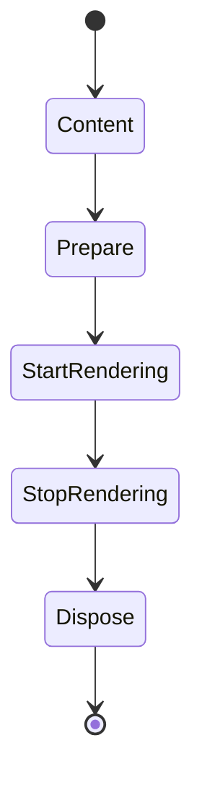

# [APPUI_SURFACE_HOSTS]

Rasm.AppUi mounts one shell into every admitted host substrate through two orthogonal values: the supplied `ConsumptionProfile` row states which host the composition root bound and what surface class that host admits, and a five-case `SurfaceMount` union states the mounting shape the caller asks for. One seam record carries every host-side delegate column, one mount transaction produces the surface receipt and teardown session, one embed capsule owns the foreign-view boundary, one scheduler boundary completes the UI marshal port, and per-RID native asset rows prove load identity.

Host identity reaches this page only as `HostDescriptor` columns — `Surface`, `Held` — so no dispatch arm names a product and a new host integration costs zero cases here. This page owns the mount axis, the surface admission, the owned-window chrome family, the embedding capsule, the scheduler boundary, the native asset table, and the host fact stream over Avalonia, ReactiveUI.Avalonia, the `Irihi.Ursa` window surface and its reactive bases, the SkiaSharp and HarfBuzzSharp native families, the kernel fault, capability, transition, custody, and timeline owners, LanguageExt rails, and the abstract `SurfaceSeam` mount-delegate columns an app root binds to a live host.

## [01]-[INDEX]

- [02]-[HOST_AXIS]: Five-case mount axis, host-surface admission, seam columns, one mount transaction.
- [03]-[EMBED_CAPSULE]: Foreign-view embedding capsule, lifecycle order, platform policy.
- [04]-[SCHEDULER_BOUNDARY]: One UI-thread boundary completing the scheduler port marshal.
- [05]-[NATIVE_ASSETS]: Per-RID Skia and HarfBuzz rows with load-identity receipts.
- [06]-[SCALE_FOCUS]: Closed host fact union for scale, visibility, focus, appearance.

## [02]-[HOST_AXIS]

- Owner: `SurfaceMount` — one `[Union]` mounting-shape axis; `SurfaceSeam` — the host-delegate column record; `SurfaceRuntime` — the composition-bound timeline, clock, gauge sink, and count columns; `SurfaceRow` — the resolved policy row; `Surfaces` — the total dispatch and mount surface; `SurfaceFault` — the direct generated `[Union]` with one `[FaultCase]` leaf per host-surface failure; `SurfaceAttach`, `SurfaceReceipt`, and `SurfaceSession` — the attach product, the mount evidence, and the leased mount; `MountLane` — the gauge vocabulary both measured legs are judged against; `CaptionCapability` and `WindowRow` — the owned-window caption vocabulary and its rows; `SurfaceMode` — the root policy row pairing chrome, seat leg, and clock admission; `ShellWindow` and `ShellSplash` the two window classes, `WindowTitle` the route-projected caption.
- Cases: Panel, Modal, Companion, Standalone, Offscreen; `HostSurface` admits Embedded → Panel/Modal/Companion, Windowed → Standalone, Offscreen → Offscreen, None → nothing; `[FaultCase]` = HostAbsent | MountRejected | HandleUnavailable | ThreadAffinity | AxisUnsupported.
- Entry: `Fin<SurfaceSession> Mount(ConsumptionProfile profile, SurfaceMount mount, SurfaceSeam seam, Control content, SurfaceRuntime runtime, CorrelationId correlation)` — `Fin` aborts on unadmitted mount, absent host, an undeclared runtime identifier, rejected mount, missing handle, and thread-affinity violation; `Fin<Unit> Boot(…, SurfaceRuntime runtime, Func<AppBuilder> entry)` — the claim-commit boot edge.
- Auto: one mount transaction replaces every per-host boot program — surface admission, boot-edge transition, builder shaping, native load identity, parent-handle capture, scale capture, disposal registration, and receipt emission land in one fold; raw mount keys serialize through the suite wire law as locked kind literals.
- Receipt: `SurfaceReceipt` — mount case, host key off the descriptor, native handle identity as descriptor beside an `Option<long>` value (interactive rows always `Some` because a missing handle aborts the mount, the offscreen row structurally `None`), scale, `Instant`, `CorrelationId`; `SurfaceSession.Assets` is the mount's `AssetCensus`, whose present half composition seals as `EvidenceReceipt.NativeAssetIdentity` — the fan arm already waiting on it — while the absent half counted at the probe, and `SurfaceSession.Reach` carries the mount's capability answer into the command deck the same mount freezes while `SurfaceSession.Displays` carries the live working-area set into the layout restore that clamps against it; every measured leg hands its `GaugedSpan<MountLane>` to `SurfaceRuntime.Gauged`, which composition seals as dispatcher-lag evidence; `TelemetryRow` contributes the mount-outcome, scale-flip, host-fact, and affinity instruments inward through the AppHost `TelemetryContributorPort`.
- Packages: Avalonia, Avalonia.Desktop, Avalonia.Headless, Avalonia.Skia, Irihi.Ursa, Irihi.Ursa.ReactiveUIExtension, ReactiveUI.Avalonia, System.Reactive, Thinktecture.Runtime.Extensions, LanguageExt.Core, NodaTime, Rasm (kernel rails, capability, transition, custody, timeline), Rasm.AppHost (project)
- Growth: a new host substrate is one `HostRows` descriptor row at the AppHost owner and costs zero cases here; a genuinely new mounting shape is one `SurfaceMount` case with one `Admits` arm; a new owned-window class is one `WindowRow` row; a new caption gate is one `CaptionCapability` row carrying its own host write, which `Apply` never edits; one host instrument is one `InstrumentSpec` row on `Surfaces.TelemetryRow`; a new fault is one `[FaultCase]` leaf.
- Boundary: `Surfaces` is the named boundary capsule for the statement carve-out on its boot-edge transition, its phase commit, and its census count. Host-agnostic sourcing law — every probe, marshal, mount, and fact delegate is a `SurfaceSeam` column, no dispatch arm names a host API, and no dispatch arm names a product: an `Embedded` host crosses only the panel, semi-modal, companion, and UI-thread `SurfaceSeam` delegate columns (the catching marshal that wraps the swallowing host invoke binds at the app root that composes a live host) while an unhosted shell crosses nothing; a `HostSurface` refusing the requested mount aborts as `SurfaceFault.AxisUnsupported` carrying `AxisEvidence` on the `host` axis, so a browser-resolved or service-resolved profile mints no surface and the package neither degrades silently nor narrows its public surface — and admission answers that refusal TYPED, so no caller re-derives the evidence a boolean discarded; boot is one `SetupWithoutStarting` admission behind a `Cell.Step` claim on one `Atom<BootPhase>` and a second `AppBuilder` or lifetime anywhere is the rejected form — a second setup call throws process-wide, and the one admitted platform serves every host the process carries: all mounts share one windowing platform, one graphics backend, and one dispatcher, so a per-host builder, per-host platform, or per-host UI thread is unrepresentable rather than merely discouraged; the transition VERDICT is what the edge answers, so a raw interlocked int whose winner and loser read the same post-state has no spelling here; production view materialization uses Avalonia's compiled-XAML path — each generated view constructor calls the core `AvaloniaXamlLoader.Load(this)` materializer, while `AvaloniaRuntimeXamlLoader` from `Avalonia.Markup.Xaml.Loader` remains Debug-only behind HotAvalonia and `RejectRuntimeInflation` structurally faults any Release attempt to parse or load source markup; desktop backend admission is exactly `UsePlatformDetect`, which already installs Skia, while the headless proof lane composes `UseSkia` explicitly because `UseHeadlessDrawing = false`; the shared `SkiaOptions` value carries `MaxGpuResourceSizeBytes` from the `GpuResourceBudget` anchor with `UseOpacitySaveLayer` true so the render-hash lanes share one deterministic GPU budget and a per-shell GPU knob is the rejected form; the mount plane is the SECOND capability gate and `SurfaceRow.Reach` is its whole answer — the mount shape NARROWS the profile's own `CapabilitySet<HostCapability>` and the faculty answer derives from the narrowed set at one seat, so an embedded row under a host holding `HostCapability.Document` reaches `Faculty.HostDocument` while the windowed and offscreen rows drop the host capability before the derivation runs — and the set rides `SurfaceSession.Reach` into the `Shell/commands` `CommandRow.Availability` fold, where `Admits` requires the level AND the reach: `DegradationLevel` is health-derived and its `Full` row retains `Faculty.HostDocument` on every healthy process, so a level-only gate admitted every host-targeting verb against a standalone shell that owns no document, and a mount-capability column no gate reads is the same defect wearing the opposite face; the offscreen row draws through Skia with the `FrameBufferFormat` pinned to `Rgba8888` so the capture pixel layout is one declared comparison layout for the render-hash lanes, attaches through the `Headless` mode row whose receipt handle is structurally `None`, and is the mount surface of the command-journal replay lane; every window this package OWNS is chromed by one `WindowRow` and never by a caption write at a mount site — the row carries the platform-frame suppression every owned window takes beside ONE `CapabilitySet<CaptionCapability>` column, so a standalone shell, a torn-out float, and an undecorated root differ by set VALUES and a per-host window subclass is unrepresentable; the title bar is DERIVED rather than declared, because on the Ursa caption surface a caption button lives inside the title bar and nowhere else, so "holds at least one caption button" IS the title-bar answer and the illegal corner a sixth boolean column admitted — a close box on a window with no caption strip to draw it in — has no spelling; the row applies at `Window` rather than at `UrsaWindow` because `Ursa.Controls.SplashWindow` and `Dock.Avalonia.Controls.HostWindow` each derive `Window` directly, so the narrower constraint left the two rows whose whole purpose is those two hosts unwritable at their own mount sites, and `Window.WindowDecorations` set to `None` (`.api/api-avalonia.md` `[WINDOW_CHROME_OPERATIONS]`) is what makes the splash undismissible and the float host's caption its own `HostWindowTitleBar` rather than the platform's; the class election is LAW rather than preference: `ShellWindow : ReactiveUrsaWindow<TViewModel>` and every shell view `: ReactiveUrsaView<TViewModel>`, because the non-reactive `UrsaWindow`/`UrsaView` pair carries no `IViewFor<T>` and the router's `RoutedViewHost` resolves views by that contract alone, so a bare `Window`, a bare `UserControl`, and the non-reactive Ursa bases are three spellings of the same defect — a view the router cannot resolve and a window the chrome row strips of the platform frame with no caption surface left to draw one in its place; caption and resizer geometry are the Ursa window surface's own properties (`IsTitleBarVisible`, `IsMinimizeButtonVisible`, `IsRestoreButtonVisible`, `IsFullScreenButtonVisible`, `IsCloseButtonVisible`, `IsManagedResizerVisible`, `TitleBarContent`/`LeftContent`/`RightContent`, `TitleBarMargin`, `.api/api-ursa.md` `[NAVIGATION_PROPERTIES]`), each bound to its own capability row as that row's write column, so a hand-drawn caption strip, a `WindowResizerThumb` placed by hand, and a local caption-button enum are the deleted forms — `ResizeDirection` is the package's own `[Flags]` axis with `Sides`, `Corners`, and `All` composites and a local resize vocabulary beside it is a rename shell; the per-window title is a PROJECTION of the active route through `WindowTitle`, subscribed once per window from the router's own stack rather than assigned at navigation sites, so a float showing one screen and the shell showing another each read the same composition and a manual `Title` write is the deleted form; cold boot runs through `ShellSplash : SplashWindow`, whose `CreateNextWindow` override returns the composed shell window and whose `CountDown` bounds the minimum display, so the splash owns the handoff and a boot-time timer beside it is unrepresentable — the splash wears the `Bare` row, which holds no caption capability at all, because a dismissible splash lets a user close the boot sequence out from under its own continuation, and the composition root that binds `SurfaceSeam.RunLoop` is the one site that mints it; a missing platform handle on an interactive root aborts as `SurfaceFault.HandleUnavailable` — a zero-handle success receipt is the deleted sentinel, and a platform handle answering no descriptor aborts on the same fault because an empty-string descriptor and an absent one read alike on a receipt; every count this page declares writes through the ONE composition-bound `SurfaceRuntime.Count` column threaded onto the resolved row and its scheduler, keyed on the instrument ROW rather than a name, so no dispatch arm and no scheduler body touches a meter and each instrument has exactly one producer — mount outcome on the evidence fan's surface arm, native-asset resolution on its native-asset arm, and scale flips, host facts, native absences, and affinity refusals direct where the delegate holds the typed fact in hand.

`isolation` reaches AppUi as one served value: the shell runs on the host's own UI thread, so the branch answers `in-proc` and `thread` through `SurfaceScheduler`, and `process`, `wasm`, and `remote` refuse on the `isolation` axis because a foreign address space owns no `Control` this page can mount.

```csharp
// --- [TYPES] ---------------------------------------------------------------------------
[Union]
public abstract partial record SurfaceMount {
    private SurfaceMount() { }
    public sealed record Panel(Guid PanelId) : SurfaceMount;
    public sealed record Modal : SurfaceMount;
    public sealed record Companion : SurfaceMount;
    public sealed record Standalone : SurfaceMount;
    public sealed record Offscreen : SurfaceMount;
}

[SmartEnum<string>]
[KeyMemberEqualityComparer<ComparerAccessors.StringOrdinal, string>]
public sealed partial class MountLane : IGaugeLane<MountLane> {
    public static readonly MountLane Boot = new("boot", TimeSpan.FromMilliseconds(1500d));
    public static readonly MountLane Mount = new("mount", TimeSpan.FromMilliseconds(250d));

    public TimeSpan Bound { get; }

    static IReadOnlyList<MountLane> IGaugeLane<MountLane>.Items => Items;
}

[SmartEnum<string>]
[KeyMemberEqualityComparer<ComparerAccessors.StringOrdinal, string>]
public sealed partial class BootPhase {
    public static readonly BootPhase Unstarted = new("unstarted", static () => Some(Starting));
    public static readonly BootPhase Starting = new("starting", static () => Option<BootPhase>.None);
    public static readonly BootPhase Booted = new("booted", static () => Option<BootPhase>.None);

    [UseDelegateFromConstructor]
    public partial Option<BootPhase> Claim();
}

// --- [ERRORS] --------------------------------------------------------------------------
[Union(ConversionFromValue = ConversionOperatorsGeneration.None)]
public abstract partial record SurfaceFault : Fault {
    private static readonly FaultBand FamilyBand = FaultBand.UiSurface;
    private SurfaceFault(string detail) { Detail = detail; }

    public string Detail { get; }
    public override string Message => Detail;


    [FaultCase(0)]
    public sealed partial record HostAbsent(string Detail)        : SurfaceFault(Detail);
    [FaultCase(1)]
    public sealed partial record MountRejected(string Detail)     : SurfaceFault(Detail);
    [FaultCase(2)]
    public sealed partial record HandleUnavailable(string Detail) : SurfaceFault(Detail);
    [FaultCase(3)]
    public sealed partial record ThreadAffinity(string Detail)    : SurfaceFault(Detail);

    [FaultCase(4)]
    public sealed partial record AxisUnsupported : SurfaceFault {
        public AxisUnsupported(AxisEvidence evidence) : base(evidence.Detail) =>
            Evidence = evidence;

        public AxisEvidence Evidence { get; }
    }
}

// --- [MODELS] --------------------------------------------------------------------------
public sealed record SurfaceSeam(
    Func<Guid, Func<EmbedCapsule, Fin<IDisposable>>> PanelMount,
    Func<EmbedCapsule, Fin<IDisposable>> ModalMount,
    Func<EmbedCapsule, Fin<IDisposable>> CompanionMount,
    Func<Action, IO<Unit>> HostMarshal,
    Func<bool> OnUiThread,
    Func<AppBuilder, Fin<Unit>> RunLoop,
    Func<double> Scale,
    Func<Seq<PixelRect>> Displays,
    Func<Action<SurfaceFact>, IDisposable> HostFacts,
    Func<long, IO<Unit>> ReleaseRetainedView);

public sealed record SurfaceRuntime(
    MonotonicTimeline Line,
    IClock Clock,
    Func<GaugedSpan<MountLane>, Unit> Gauged,
    Func<InstrumentSpec, Option<(string Slot, string Value)>, Unit> Count);

public sealed record SurfaceAttach(Option<long> Handle, string Descriptor, IDisposable Teardown) {
    public static Fin<string> Named(IPlatformHandle handle) =>
        Optional(handle.HandleDescriptor)
            .ToFin(new SurfaceFault.HandleUnavailable(nameof(IPlatformHandle.HandleDescriptor)));
}

public sealed record SurfaceRow(
    SurfaceSeam Seam,
    Func<AppBuilder, AppBuilder> Build,
    Func<AppBuilder, Fin<Unit>> Start,
    Func<Action, IO<Unit>> Marshal,
    Func<Control, Fin<SurfaceAttach>> Attach,
    CapabilitySet<Faculty> Reach,
    SurfaceMode Mode) {
    public Func<double> Scale => Seam.Scale;
    public Func<Seq<PixelRect>> Displays => Seam.Displays;
    public Func<bool> OnUiThread => Seam.OnUiThread;
    public Func<Action<SurfaceFact>, IDisposable> Facts => Seam.HostFacts;
}

public sealed record SurfaceReceipt(SurfaceMount Mount, string HostKey, string Descriptor, Option<long> Handle, double Scale, Instant At, CorrelationId Correlation);

public sealed record AssetCensus(Seq<NativeAssetFact> Present, Seq<string> Absent) {
    public static readonly AssetCensus Empty = new(Seq<NativeAssetFact>(), Seq<string>());
}

public sealed record SurfaceSession(
    SurfaceReceipt Receipt,
    AssetCensus Assets,
    CapabilitySet<Faculty> Reach,
    Func<Seq<PixelRect>> Displays,
    Func<Action<SurfaceFact>, IDisposable> Facts,
    IDisposable Teardown) : IDisposable {
    public void Dispose() => Teardown.Dispose();
}
```

```csharp
// --- [OPERATIONS] ----------------------------------------------------------------------
public static class Surfaces {
    private static readonly Atom<BootPhase> Phase = Atom(BootPhase.Unstarted);

    private static readonly Op BootOp = Op.Of(name: "appui.surface.boot");
    private static readonly Op MountOp = Op.Of(name: "appui.surface.mount");

    private static readonly Error InFlight = new SurfaceFault.MountRejected("<boot-in-flight>");

    public const long GpuResourceBudget = 268_435_456;

    private static readonly SkiaOptions SkiaBudget = new() { MaxGpuResourceSizeBytes = GpuResourceBudget, UseOpacitySaveLayer = true };

    private static Fin<Unit> Admits(ConsumptionProfile profile, SurfaceMount mount) =>
        profile.Surface.Switch(
            state: (Profile: profile, Mount: mount),
            embedded: static row => row.Mount is SurfaceMount.Panel or SurfaceMount.Modal or SurfaceMount.Companion
                ? Fin.Succ(unit) : Unsupported(row.Profile, row.Mount),
            windowed: static row => row.Mount is SurfaceMount.Standalone
                ? Fin.Succ(unit) : Unsupported(row.Profile, row.Mount),
            offscreen: static row => row.Mount is SurfaceMount.Offscreen
                ? Fin.Succ(unit) : Unsupported(row.Profile, row.Mount),
            none: static row => Unsupported(row.Profile, row.Mount));

    private static Fin<Unit> Unsupported(ConsumptionProfile profile, SurfaceMount mount) =>
        Fin.Fail<Unit>(new SurfaceFault.AxisUnsupported(
            new AxisEvidence(ProfileAxis.Host, profile.HostKey, $"{profile.Surface.Key} admits no {mount}")));

    public static Fin<SurfaceRow> Row(ConsumptionProfile profile, SurfaceMount mount, SurfaceSeam seam) =>
        from admitted in Admits(profile, mount)
        select mount.Switch(
            state: (Seam: seam, Held: profile.Held),
            panel: static (s, own) => Embedded(s.Seam, s.Seam.PanelMount(own.PanelId), s.Held),
            modal: static (s, own) => Embedded(s.Seam, s.Seam.ModalMount, s.Held),
            companion: static (s, own) => Embedded(s.Seam, s.Seam.CompanionMount, s.Held),
            standalone: static (s, own) => Rooted(s.Seam, s.Held,
                static b => b.UsePlatformDetect().With(SkiaBudget).UseReactiveUI(), s.Seam.RunLoop, SurfaceMode.Interactive),
            offscreen: static (s, own) => Rooted(s.Seam, s.Held,
                static b => b.UseSkia().With(SkiaBudget).UseHeadless(new AvaloniaHeadlessPlatformOptions { UseHeadlessDrawing = false, FrameBufferFormat = PixelFormat.Rgba8888 }).UseReactiveUI(),
                Setup, SurfaceMode.Headless));

    public static Fin<Unit> Boot(
        ConsumptionProfile profile, SurfaceMount mount, SurfaceSeam seam, SurfaceRuntime runtime, Func<AppBuilder> entry) =>
        from row in Row(profile, mount, seam)
        from started in Cell.Step(Phase, static held => held.Claim(), InFlight).Switch(
            state: (Row: row, Runtime: runtime, Entry: entry),
            committed: static (s, _) => Started(s.Row, s.Runtime, s.Entry),
            ceded: static (_, seat) => Fin.Fail<Unit>(InFlight),
            refused: static (_, seat) => seat.State.Equals(BootPhase.Booted) ? Fin.Succ(unit) : Fin.Fail<Unit>(seat.Cause),
            contended: static (_, seat) => Fin.Fail<Unit>(new SurfaceFault.MountRejected($"<boot-contended:{seat.Attempts}>")))
        select started;

    private static Fin<Unit> Started(SurfaceRow row, SurfaceRuntime runtime, Func<AppBuilder> entry) =>
        Gauged(runtime, MountLane.Boot, BootOp, () => row.Start(row.Build(entry())))
            .Map(static done => Phased(BootPhase.Booted, done))
            .MapFail(static fault => Phased(BootPhase.Unstarted, fault));

    public static Fin<SurfaceSession> Mount(
        ConsumptionProfile profile, SurfaceMount mount, SurfaceSeam seam, Control content, SurfaceRuntime runtime, CorrelationId correlation) =>
        from row in Row(profile, mount, seam)
        from gate in SurfaceScheduler.For(row, runtime).Affinity(nameof(Mount))
        from session in Gauged(runtime, MountLane.Mount, MountOp, () => Seated(row, profile, mount, content, runtime, correlation))
        select session;

    private static Fin<SurfaceSession> Seated(
        SurfaceRow row, ConsumptionProfile profile, SurfaceMount mount, Control content, SurfaceRuntime runtime, CorrelationId correlation) =>
        from assets in Identified(runtime)
        from attached in row.Attach(content)
        select new SurfaceSession(
            new SurfaceReceipt(mount, profile.HostKey, attached.Descriptor, attached.Handle, row.Scale(),
                runtime.Clock.GetCurrentInstant(), correlation),
            assets,
            row.Reach,
            row.Displays,
            Counted(row, runtime),
            attached.Teardown);

    private static CapabilitySet<Faculty> Reaches(CapabilitySet<HostCapability> held) =>
        held.Admits(HostCapability.Document)
            ? CapabilitySet<Faculty>.All
            : CapabilitySet<Faculty>.All.Without(Faculty.HostDocument);

    private static Fin<AssetCensus> Identified(SurfaceRuntime runtime) =>
        NativeAssets.Current
            .Map(NativeAssets.Identity)
            .ToFin(new SurfaceFault.HostAbsent(RuntimeInformation.RuntimeIdentifier))
            .Map(census => Absences(runtime, census));

    private static AssetCensus Absences(SurfaceRuntime runtime, AssetCensus census) {
        ignore(census.Absent.Fold(unit, (_, library) =>
            runtime.Count(NativeAssets.Absent, Some((AppUiTelemetry.LibrarySlot, library)))));
        return census;
    }

    private static Fin<T> Gauged<T>(SurfaceRuntime runtime, MountLane lane, Op work, Func<Fin<T>> body) =>
        runtime.Line.Gauged(lane, work, body).Bind(measured => Measured(runtime, measured));

    private static Fin<T> Measured<T>(SurfaceRuntime runtime, (Fin<T> Value, GaugedSpan<MountLane> Span) measured) {
        ignore(runtime.Gauged(measured.Span));
        return measured.Value;
    }

    private static T Phased<T>(BootPhase next, T carried) {
        ignore(Cell.Commit(Phase, _ => next));
        return carried;
    }

    private static Func<Action<SurfaceFact>, IDisposable> Counted(SurfaceRow row, SurfaceRuntime runtime) =>
        observer => row.Facts(fact => {
            ignore(Observed(runtime, fact));
            observer(fact);
        });

    private static Unit Observed(SurfaceRuntime runtime, SurfaceFact fact) =>
        Counts(fact).Fold(unit, (_, write) => runtime.Count(write.Row, write.Tag));

    private static Seq<(InstrumentSpec Row, Option<(string Slot, string Value)> Tag)> Counts(SurfaceFact fact) =>
        fact is SurfaceFact.ScaleChanged
            ? Seq(Kinded(fact), (Scale, Option<(string Slot, string Value)>.None))
            : Seq(Kinded(fact));

    private static (InstrumentSpec Row, Option<(string Slot, string Value)> Tag) Kinded(SurfaceFact fact) =>
        (Fact, Some((AppUiTelemetry.SourceSlot, fact.Kind)));

    private static SurfaceRow Embedded(SurfaceSeam seam, Func<EmbedCapsule, Fin<IDisposable>> mount, CapabilitySet<HostCapability> held) => new(
        Seam: seam,
        Build: static builder => EmbedOptions.Embedded.Admit(builder),
        Start: Setup,
        Marshal: seam.HostMarshal,
        Attach: content => new EmbedCapsule(content).Mounted(mount, seam.ReleaseRetainedView),
        Reach: Reaches(held),
        Mode: SurfaceMode.Interactive);

    private static SurfaceRow Rooted(
        SurfaceSeam seam, CapabilitySet<HostCapability> held,
        Func<AppBuilder, AppBuilder> build, Func<AppBuilder, Fin<Unit>> start, SurfaceMode mode) => new(
        Seam: seam,
        Build: build,
        Start: start,
        Marshal: SurfaceScheduler.Post,
        Attach: mode.Attach,
        Reach: Reaches(held.Without(HostCapability.Document)),
        Mode: mode);

    private static Fin<Unit> Setup(AppBuilder builder) => Fin.Succ(ignore(builder.SetupWithoutStarting()));

    public static Fin<TControl> RejectRuntimeInflation<TControl>(string view) where TControl : Control =>
        Fin.Fail<TControl>(new SurfaceFault.MountRejected($"<runtime-xaml-rejected:{view}; AvaloniaRuntimeXamlLoader is debug-only>"));

    // --- [COMPOSITION] -----------------------------------------------------------------
    public static readonly InstrumentSpec Mounted = InstrumentSpec.Create(
        "rasm.appui.surface.mounted", InstrumentKind.Count, MeasureForm.Whole, "{mount}",
        "surface mounts by host case", Seq(AppUiTelemetry.HostSlot), None, None, None);
    public static readonly InstrumentSpec Scale = InstrumentSpec.Create(
        "rasm.appui.surface.scaled", InstrumentKind.Count, MeasureForm.Whole, "{flip}",
        "backing-scale flips", Seq<string>(), None, None, None);
    public static readonly InstrumentSpec Fact = InstrumentSpec.Create(
        "rasm.appui.surface.fact", InstrumentKind.Count, MeasureForm.Whole, "{fact}",
        "host facts by fact case", Seq(AppUiTelemetry.SourceSlot), None, None, None);
    public static readonly InstrumentSpec Affinity = InstrumentSpec.Create(
        "rasm.appui.surface.affinity.violation", InstrumentKind.Count, MeasureForm.Whole, "{violation}",
        "off-thread access assertions by operation", Seq(AppUiTelemetry.SourceSlot), None, None, None);

    public static TelemetryContributorPort TelemetryRow(string version) =>
        AppUiTelemetry.Contribute(version, Mounted, Scale, Fact, Affinity);
}
```

```csharp
// --- [TYPES] ---------------------------------------------------------------------------
[SmartEnum<string>]
[KeyMemberEqualityComparer<ComparerAccessors.StringOrdinal, string>]
public sealed partial class CaptionCapability : ICapability<CaptionCapability> {
    public static readonly CaptionCapability Minimize = new("minimize", rank: 0,
        static (window, admitted) => window.IsMinimizeButtonVisible = admitted);
    public static readonly CaptionCapability Restore = new("restore", rank: 1,
        static (window, admitted) => window.IsRestoreButtonVisible = admitted);
    public static readonly CaptionCapability FullScreen = new("full-screen", rank: 2,
        static (window, admitted) => window.IsFullScreenButtonVisible = admitted);
    public static readonly CaptionCapability Close = new("close", rank: 3,
        static (window, admitted) => window.IsCloseButtonVisible = admitted);
    public static readonly CaptionCapability Resizer = new("resizer", rank: 4,
        static (window, admitted) => window.IsManagedResizerVisible = admitted);

    public int Rank { get; }

    [UseDelegateFromConstructor]
    public partial bool Write(UrsaWindow window, bool admitted);

    public static readonly CapabilitySet<CaptionCapability> Buttons =
        CapabilitySet<CaptionCapability>.All.Without(Resizer);

    static IReadOnlyList<CaptionCapability> ICapability<CaptionCapability>.Items => Items;
}

[SmartEnum<string>]
[KeyMemberEqualityComparer<ComparerAccessors.StringOrdinal, string>]
[KeyMemberComparer<ComparerAccessors.StringOrdinal, string>]
public sealed partial class WindowRow {
    public static readonly WindowRow Shell = new("shell", CapabilitySet<CaptionCapability>.All);
    public static readonly WindowRow TearOut = new("tear-out",
        CapabilitySet<CaptionCapability>.All.Without(CaptionCapability.FullScreen));
    public static readonly WindowRow Bare = new("bare", CapabilitySet<CaptionCapability>.None);

    public CapabilitySet<CaptionCapability> Caption { get; }

    public bool TitleBar => Caption.Held.Overlaps(CaptionCapability.Buttons.Held);

    public TWindow Apply<TWindow>(TWindow window) where TWindow : Window {
        window.WindowDecorations = WindowDecorations.None;
        if (window is UrsaWindow ursa) {
            ursa.IsTitleBarVisible = TitleBar;
            ignore(toSeq(CaptionCapability.Items).Fold(unit, (_, row) => ignore(row.Write(ursa, Caption.Admits(row)))));
        }
        return window;
    }

    public ShellWindow Build(Control content) => Apply(new ShellWindow { Content = content });
}

[SmartEnum<string>]
[KeyMemberEqualityComparer<ComparerAccessors.StringOrdinal, string>]
public sealed partial class SurfaceMode {
    public static readonly SurfaceMode Interactive =
        new("interactive", WindowRow.Shell, Handled, static _ => Option<TimeProvider>.None);
    public static readonly SurfaceMode Headless =
        new("headless", WindowRow.Bare, Detached, static supplied => supplied);

    public WindowRow Chrome { get; }

    [UseDelegateFromConstructor]
    public partial Fin<SurfaceAttach> Seat(ShellWindow window);

    [UseDelegateFromConstructor]
    public partial Option<TimeProvider> Clock(Option<TimeProvider> supplied);

    public Fin<SurfaceAttach> Attach(Control content) => Seat(Chrome.Build(content));

    private static Fin<SurfaceAttach> Handled(ShellWindow window) {
        IDisposable teardown = Shown(window);
        return Optional(window.TryGetPlatformHandle())
            .ToFin(new SurfaceFault.HandleUnavailable(nameof(Interactive)))
            .Bind(static handle => SurfaceAttach.Named(handle).Map(descriptor => (Handle: handle.Handle.ToInt64(), Descriptor: descriptor)))
            .Map(held => new SurfaceAttach(Some(held.Handle), held.Descriptor, teardown))
            .Rollback(teardown);
    }

    private static Fin<SurfaceAttach> Detached(ShellWindow window) =>
        Fin.Succ(new SurfaceAttach(Option<long>.None, nameof(SurfaceMount.Offscreen), Shown(window)));

    private static IDisposable Shown(Window window) {
        window.Show();
        return Disposable.Create(window.Close);
    }
}

// --- [COMPOSITION] ---------------------------------------------------------------------
public sealed class ShellWindow : ReactiveUrsaWindow<ShellRoot>;

public sealed class ShellSplash : SplashWindow {
    private readonly Func<Task<Window?>> next;

    public ShellSplash(Duration minimum, Func<Task<Window?>> next) {
        this.next = next;
        CountDown = minimum.ToTimeSpan();
        ignore(WindowRow.Bare.Apply(this));
    }

    protected override Task<Window?> CreateNextWindow() => next();
}

public static class WindowTitle {
    public static IDisposable Bind(Window window, string product, IObservable<Option<string>> active, IScheduler ui) =>
        active
            .Select(current => ShellChrome.Title(product, current))
            .DistinctUntilChanged(StringComparer.Ordinal)
            .ObserveOn(ui)
            .Subscribe(text => window.Title = text);
}
```

Every row suppresses the platform frame; a caption cell writes only where the `[BASE]` column carries the Ursa caption surface, and elsewhere states what that row's own package renders under the suppressed frame. `[TITLE_BAR]` is derived from the caption set rather than declared beside it.

| [INDEX] | [ROW]     | [BASE]                                     | [MOUNT]              | [CAPTION_SET]        | [TITLE_BAR] |
| :-----: | :-------- | :----------------------------------------- | :------------------- | :------------------- | :---------: |
|  [01]   | `Shell`   | `ReactiveUrsaWindow<T>`                    | Standalone           | all five             |     on      |
|  [02]   | `TearOut` | Dock `HostWindow`                          | float host window    | all but `FullScreen` |     on      |
|  [03]   | `Bare`    | Ursa `SplashWindow` / `ReactiveUrsaWindow` | cold boot, Offscreen | none                 |     off     |

## [03]-[EMBED_CAPSULE]

- Owner: `EmbedCapsule` — the foreign-view boundary capsule deriving the embeddable top-level; `EmbedTrait` and `EmbedOptions` — the embedded platform capability vocabulary and the policy row that lowers it onto the package's own negative spellings.
- Entry: `Fin<SurfaceAttach> Mounted(Func<EmbedCapsule, Fin<SurfaceAttach>> mount, Func<long, IO<Unit>> releaseRetained)` — `Fin` aborts on handle absence, descriptor absence, and seam rejection with the acquire chain rolled back; `releaseRetained` is the seam's AppKit release for the retained `NSView` and the whole release-exactly-once law rests on it, so it is a load-bearing parameter, never an ambient.
- Auto: construction runs the load-bearing order in one body — `Content`, `Prepare` — and `Mounted` appends retained-view capture, seam attach, and `StartRendering`; teardown composes seam detach, `StopRendering`, retained release, `Dispose` in declared order, so the foreign view leaves the host tree before the render loop stops and no frame targets a view the host already dropped.
- Packages: Avalonia, System.Reactive, LanguageExt.Core, Rasm (kernel custody, capability, op)
- Growth: one `EmbedTrait` row per new platform capability; zero new surface.
- Boundary: every successful `Mounted` and its composed teardown ride the `Surfaces.Mounted` count through the one `AppUiTelemetry.Contribute` spine, and a handle-absent or seam-rejected `Fin` failure folds its `SurfaceFault` into the same mount-outcome evidence, so the foreign-view boundary mints no second telemetry surface; `EmbedCapsule` is the named boundary capsule for the statement carve-out — the constructor carries the ordered statements over the `EmbeddableControlRoot` lifecycle triple (`.api/api-avalonia.md` `[EMBED_TYPES]`/`[EMBED_OPERATIONS]`); `GetNSViewRetained` hands a retained pointer whose one release-capable owner is the disposable `Mounted` mints beside the capture off the seam `ReleaseRetainedView` column (the host binds the AppKit release at composition) — teardown composes it after detach, every failed leg rolls it back through the kernel `Custody.Rollback` chain, and a non-retained handle carries `Disposable.Empty`, so the retained value releases exactly once on every path and the hand-written failure closures that spelled that release twice have no seat; the accessor carries Avalonia's unstable-API obsolete marker, so the capsule's `RetainedView` body is the single acknowledged suppression site; platform policy is ONE `CapabilitySet<EmbedTrait>` and every corner of it is legal — a plugin host that keeps its own menu bar and one that does not are both real hosts — so no law row exists and the polarity lands exactly once at `Admit`, where the package's four `Disable*` spellings are the complement of the held set and `ShowInDock` its one positive: the five loose booleans whose polarity disagreed made every reader carry a doubled negative; the retired `EnforceClientSize` column was admitted-inert on the embed path by its own boundary — the root's bounds and its child arrangement read identical in either state — so the seam's frame push on every host-resize fact is the WHOLE sizing authority: an admitted embedded host does not autoresize its subviews, so a host bounds change reaches neither the embedded view's frame nor the root's `ClientSize` until the seam writes the host bounds onto that view, which updates `ClientSize` in the same pass, and a sizing design keyed on that knob instead of on the pushed frame is the deleted form; `MacOSPlatformOptions` and `AvaloniaNativePlatformOptions` values enter only through `EmbedOptions.Admit` and a hardcoded platform knob in boot code is the rejected form — the `DockIcon` trait keeps embedded rows out of the macOS Dock when forfeited, `DefaultMenuItems` strips the default app menu under the host menu bar, `NativeMenus`/`ProcessName`/`AppDelegate` complete the plugin-host menu and process-identity policy, and `RenderingMode` is the `AvaloniaNativePlatformOptions.RenderingMode` `IReadOnlyList<AvaloniaNativeRenderingMode>` backend policy column whose three rows are `OpenGl = 1`, `Software = 2`, and `Metal = 3` — the enum declares into the `Avalonia` namespace despite shipping in `Avalonia.Native.dll`, so an `Avalonia.Native` import for it resolves nothing and is the deleted form — with Avalonia's own default ordering `[Metal, OpenGl, Software]` carried as the embedded ordering: it resolves `Avalonia.Native.MetalPlatformGraphics` beside the `Avalonia.Skia.PlatformRenderInterface` raster path on every admitted embedded host, so `EmbedOptions.Embedded` holds `RenderingMode: None` and a per-host ordering literal is the deleted form, with `AppSandboxEnabled` (default true, the sandbox-scoped storage-bookmark gate) and `OverlayPopups` the remaining platform knobs held as designed growth (`.api/api-avalonia-desktop.md` `[NATIVE_PLATFORM_TYPES]`); Avalonia owns GPU backend selection through `RenderingMode`, so a direct `GRContext.CreateMetal`/`CreateVulkan`/`CreateDirect3D`/`CreateGl` call inside a dispatch arm is the rejected form (PROHIBITION host-API-in-arm) — a shared-context requirement against the host pipeline rides one `SurfaceSeam` delegate column bound at composition, never a per-host GPU call site — and the sharing direction is outward only: the macOS platform admits no host-supplied context (`UsesSharedContext` false, `GetSharedContext` throws), the compositor paints every embedded frame on Avalonia's own background render-loop thread over its own Metal device and command queue while the host draws on the UI thread, so lease and host-draw intervals overlap freely in wall time yet contend nothing — command-queue isolation is the whole ordering authority, with only the synchronous-commit path (resize, explicit paint) running inline on the UI thread — and the seam's shared-context column binds the `IMetalDevice` device-plus-queue pair the lease's `ISkiaSharpPlatformGraphicsApiLease.Context` exposes (`.api/api-avalonia-skia.md`), never a host handle; the host-pumped run loop paces the embedded root's UI half — `StartRendering` beside a self-rescheduling `TopLevel.RequestAnimationFrame` callback delivers dispatcher frames while the host pumps, the compositor's paint rides the platform's own background render timer — so the capsule binds no display-link pacer and a capsule-owned frame timer is the deleted form; teardown never keys on root lifecycle, because disposing the embedded root raises no `Closed`, `DetachedFromVisualTree`, or `DetachedFromLogicalTree` edge and `TopLevel.GetTopLevel` keeps answering the disposed root — the composed ordered disposable IS the teardown authority, and the reads that would otherwise arbitrate it (a second `Dispose`, a post-dispose `StartRendering`) are inert rather than faulted, so a double-teardown path needs no guard.

[HOST_ADAPTER_FACTS]: the foreign-view properties the seam columns bind against, every one host-side and none of them reachable from a dispatch arm — an embedded host view autoresizes no subview, so the seam's resize column is the only sizing writer; the embedded root's platform handle is an `IMacOSTopLevelPlatformHandle` carrying the `NSView` descriptor over an `Avalonia.Native.EmbeddableTopLevelImpl` platform implementation, and the root's own `RenderScaling` stays `1` under a foreign view, so `SurfaceSeam.Scale` is the only backing-scale source and a root-read scale is the deleted form; a canvas-class host view accepts the foreign subview while it is itself unshown and unwindowed, mounting without arming any host redraw path, so a mount is legal before the host surface is shown; a host view with no window carries no responder chain, so input delivery, first-responder assignment, and every window-anchored surface require a SHOWN host window — the seam's visibility fact is what states that, and a mount receipt alone never does; pointer delivery is intrinsic to the embedded view — the native view handles the shown host window's mouse events itself and forwards them through the raw input chain, so a press reaches the root as the tunnel-plus-bubble pointer pair hit-tested to the embedded content with positions mapped into root coordinates and no host cooperation beyond window membership; IME composition holds three host-side preconditions past the shown window — active application, key host window, first-responder embedded view — and then rides the embedded view's own `NSTextInputClient` conformance: the dead-key press raises only the key pair while the pre-edit string lands on the focused text control, the commit arrives as ONE composed text-input event through tunnel and bubble, and an in-process synthetic key event never composes — window-server events are the only composition carrier, so a synthetic-key test asserts raw-commit behavior, never IME; host focus never bridges into the embedded root on its own — the host assigns first responder to the embedded view and the composition focuses the managed control, two writes the seam owns.

```csharp
// --- [TYPES] ---------------------------------------------------------------------------
[SmartEnum<string>]
[KeyMemberEqualityComparer<ComparerAccessors.StringOrdinal, string>]
public sealed partial class EmbedTrait : ICapability<EmbedTrait> {
    public static readonly EmbedTrait AppDelegate = new("app-delegate", rank: 0);
    public static readonly EmbedTrait ProcessName = new("process-name", rank: 1);
    public static readonly EmbedTrait NativeMenus = new("native-menus", rank: 2);
    public static readonly EmbedTrait DefaultMenuItems = new("default-menu-items", rank: 3);
    public static readonly EmbedTrait DockIcon = new("dock-icon", rank: 4);

    public int Rank { get; }

    static IReadOnlyList<EmbedTrait> ICapability<EmbedTrait>.Items => Items;
}

// --- [MODELS] --------------------------------------------------------------------------
public sealed record EmbedOptions(
    CapabilitySet<EmbedTrait> Traits,
    Option<Seq<AvaloniaNativeRenderingMode>> RenderingMode) {
    public static readonly EmbedOptions Embedded = new(CapabilitySet<EmbedTrait>.None, None);

    public AppBuilder Admit(AppBuilder builder) =>
        builder
            .With(RenderingMode.Match(
                Some: static modes => new AvaloniaNativePlatformOptions { RenderingMode = [.. modes] },
                None: static () => new AvaloniaNativePlatformOptions()))
            .UseSkia()
            .UseAvaloniaNative()
            .UseReactiveUI()
            .With(new MacOSPlatformOptions {
                DisableAvaloniaAppDelegate = !Traits.Admits(EmbedTrait.AppDelegate),
                DisableSetProcessName = !Traits.Admits(EmbedTrait.ProcessName),
                DisableNativeMenus = !Traits.Admits(EmbedTrait.NativeMenus),
                DisableDefaultApplicationMenuItems = !Traits.Admits(EmbedTrait.DefaultMenuItems),
                ShowInDock = Traits.Admits(EmbedTrait.DockIcon),
            });
}

public readonly record struct RetainedHandle(long Handle, string Descriptor, bool Retained);

// --- [COMPOSITION] ---------------------------------------------------------------------
public sealed class EmbedCapsule : EmbeddableControlRoot {
    private static readonly Op ReleaseOp = Op.Of(name: "appui.surface.embed.release");
    private static readonly Op StartOp = Op.Of(name: "appui.surface.embed.start");

    public EmbedCapsule(Control content) {
        Content = content;
        Prepare();
    }

    public Fin<SurfaceAttach> Mounted(
        Func<EmbedCapsule, Fin<IDisposable>> mount, Func<long, IO<Unit>> releaseRetained) =>
        (from view in RetainedView()
         let release = Release(view, releaseRetained)
         from detach in mount(this).Rollback(release)
         from live in Start().Rollback(detach, release)
         select new SurfaceAttach(Some(view.Handle), view.Descriptor,
             new CompositeDisposable(detach, Disposable.Create(StopRendering), release, Disposable.Create(Dispose))))
        .Rollback(this);

    public Fin<RetainedHandle> RetainedView() =>
        Optional(TryGetPlatformHandle())
            .ToFin(new SurfaceFault.HandleUnavailable(nameof(EmbedCapsule)))
            .Bind(static handle => handle is IMacOSTopLevelPlatformHandle mac
                ? Fin.Succ(new RetainedHandle(mac.GetNSViewRetained().ToInt64(), "NSView", Retained: true))
                : SurfaceAttach.Named(handle).Map(descriptor =>
                    new RetainedHandle(handle.Handle.ToInt64(), descriptor, Retained: false)));

    public Fin<Unit> Start() => StartOp.Catch(StartRendering);

    private static IDisposable Release(RetainedHandle view, Func<long, IO<Unit>> releaseRetained) =>
        view.Retained
            ? Disposable.Create(() => ignore(ReleaseOp.Catch(() => releaseRetained(view.Handle).Run())))
            : Disposable.Empty;
}
```



## [04]-[SCHEDULER_BOUNDARY]

- Owner: `SurfaceScheduler` — the one record where the UI dispatcher, the Avalonia reactive scheduler, and the host marshal meet.
- Entry: `SurfaceScheduler For(SurfaceRow row, SurfaceRuntime runtime, Option<TimeProvider> virtualTime = default)` — pure projection over the resolved row and the composition runtime; the UI-thread predicate reaches the row through its seam, the deterministic-time capability is the mode row's own admission, and the count column is sourced once from the runtime, so no parallel host discriminator, `onUiThread` parameter, or scheduler-local meter threads beside them.
- Auto: `Port` completes `UiSchedulerPort.Marshal` from this boundary at the composition root — `Phases` and `Degradation` arrive already bound; `UseReactiveUI` admission wires the reactive main-thread scheduler onto `AvaloniaScheduler`.
- Packages: ReactiveUI.Avalonia, Avalonia, System.Reactive, LanguageExt.Core, BCL inbox
- Growth: one marshal column per new host thread regime; a new deterministic-time posture is one `SurfaceMode` row; zero new surface.
- Boundary: `Affinity` is the single thread-affinity assertion and a per-call-site access check is the rejected form; the UI-thread predicate originates once at the seam's `OnUiThread` column and reaches the scheduler through `row.OnUiThread`, which is the seam's own column read through the row — one source, no parallel parameter — and that column answers true on exactly ONE thread per process, the host's own main thread, where `Dispatcher.UIThread.CheckAccess()` also answers true, while every other thread reads false and its `Post` lands back on that same thread, so the marshal column, the dispatcher, and the affinity assertion all read one boundary and a per-host thread regime is unrepresentable; so the access-assertion spelling stays a seam delegate and never a hardcoded dispatcher call inside a dispatch arm; a failed `Affinity` assertion folds its `SurfaceFault.ThreadAffinity` into the `Surfaces.Affinity` count through the one `AppUiTelemetry.Contribute` spine, so off-thread access is counted evidence on the timeline and a scheduler-local meter is the deleted form; embedded mounts marshal through the seam's host column, standalone and offscreen mounts post through the `AvaloniaScheduler` UI scheduler; the virtual `TimeProvider` a test composition supplies is admitted by the MODE row rather than by this projection, so an interactive mount handed one drops it and only the command-journal replay lane runs under deterministic time; `ObserveOn` rides `Ui` exactly once inside binding capsules, never at call sites.

```csharp
// --- [MODELS] --------------------------------------------------------------------------
public sealed record SurfaceScheduler(
    IScheduler Ui, Func<Action, IO<Unit>> Marshal, Func<bool> OnUiThread, Option<TimeProvider> VirtualTime,
    Func<InstrumentSpec, Option<(string Slot, string Value)>, Unit> Count) {
    public static SurfaceScheduler For(SurfaceRow row, SurfaceRuntime runtime, Option<TimeProvider> virtualTime = default) => new(
        AvaloniaScheduler.Instance,
        row.Marshal,
        row.OnUiThread,
        row.Mode.Clock(virtualTime),
        runtime.Count);

    public static IO<Unit> Post(Action action) =>
        IO.lift(() => ignore(AvaloniaScheduler.Instance.Schedule(action)));

    public static UiSchedulerPort Port(UiSchedulerPort spine, SurfaceScheduler boundary) => spine with { Marshal = boundary.Marshal };

    public Fin<Unit> Affinity(string operation) =>
        OnUiThread() ? Fin.Succ(unit) : Fin.Fail<Unit>(Refused(operation));

    private Error Refused(string operation) {
        ignore(Count(Surfaces.Affinity, Some((AppUiTelemetry.SourceSlot, operation))));
        return new SurfaceFault.ThreadAffinity(operation);
    }
}
```

## [05]-[NATIVE_ASSETS]

- Owner: `RuntimeId` — the RID value object whose admission is what keeps a blank row from claiming every host; `NativeAssetRow` — per-RID asset rows; `NativeAssets` — the frozen row table, the live-RID resolution, and the identity census. Load-identity evidence is the `Render/capture` `NativeAssetFact` the evidence union already carries; a second same-shaped receipt record beside it is the deleted twin.
- Entry: `AssetCensus Identity(NativeAssetRow row)` — the per-library presence fold answering both halves in one pass; `Option<NativeAssetRow> Current` — the row the live runtime identifier selects.
- Receipt: `NativeAssetFact` — library, optional file version, path, RID; the census rides `SurfaceSession.Assets`, composition seals every `Present` row as `EvidenceReceipt.NativeAssetIdentity` whose fan arm writes the asset-resolved instrument, and the mount transaction counts every `Absent` row on the asset-absent instrument, so a missing-architecture load is a counted absence on the spine, never a silent draw fault and never a rail abort that hides its siblings.
- Packages: SkiaSharp.NativeAssets.macOS, SkiaSharp.NativeAssets.Linux.NoDependencies, HarfBuzzSharp.NativeAssets.macOS, HarfBuzzSharp.NativeAssets.Linux, Thinktecture.Runtime.Extensions, LanguageExt.Core, BCL inbox
- Growth: one `NativeAssetRow` per new RID; one native-asset instrument is one `InstrumentSpec` row on `NativeAssets.TelemetryRow`; zero new surface.
- Boundary: one shaping family rides every admitted row — each Skia asset row pairs its HarfBuzz row across the macOS-plus-headless-Linux RID matrix (osx universal, linux-x64/arm64, linux-musl-x64) so cross-architecture load identity is one row per RID and a missing-architecture load surfaces as an absent census row; the three Linux rows share one library roster because they differ by RID alone, so a package swap lands once instead of drifting three ways; the NuGet package that SHIPS each module has one authority in the manifest and the `- Packages:` bullet above, so the three package-name columns this row used to carry were a mirror no probe read; the macOS backend resolves Metal from the default `[Metal, OpenGl, Software]` ordering `EmbedOptions.RenderingMode` carries, never a per-row GPU literal; the fontconfig-dependent Linux Skia variant stays pinned and excluded at the AppUi admission, so NoDependencies is the only Linux Skia asset and the glibc and musl rows share it; the Win32 desktop and WebAssembly native pins are dropped from the macOS-only build so no Win32 row exists and a browser host descriptor carries `HostSurface.None`, refusing every mount rather than resolving assets; identity runs INSIDE `Surfaces.Mount` before the content attach, so a wrong-RID load surfaces as a receipt on the mount rather than a draw fault later, and a probe declared but never called is the deleted form; the census answers BOTH halves as one typed value rather than a rail, because a rail aborts on the FIRST missing library and makes the very absence the asset-absent instrument exists to count unrepresentable — the present half seals as `EvidenceReceipt.NativeAssetIdentity` (the fan arm writes asset-resolved) and the absent half counts at the probe, so each instrument has exactly one producer and a per-row meter is the deleted form; the row itself resolves from the LIVE `RuntimeInformation.RuntimeIdentifier` by prefix, which is why the RID is a validated value rather than a bare string — a blank literal prefixes every identifier in existence and would answer for architectures the row was never built for — and an undeclared identifier is a typed `SurfaceFault.HostAbsent` at mount rather than a composition literal asserting what the probe exists to prove.

```csharp
// --- [TYPES] ---------------------------------------------------------------------------
[ValueObject<string>]
[ValidationError]
[KeyMemberEqualityComparer<ComparerAccessors.StringOrdinal, string>]
public sealed partial class RuntimeId {
    static partial void ValidateFactoryArguments(ref ValidationError? validationError, ref string value) =>
        validationError = string.IsNullOrWhiteSpace(value)
            || !string.Equals(value, value.ToLowerInvariant(), StringComparison.Ordinal)
                ? new ValidationError(string.Join(" | ", new object?[] { $"<runtime-identifier:{value}>" }))
                : null;
}

// --- [MODELS] --------------------------------------------------------------------------
public sealed record NativeAssetRow(RuntimeId Rid, Seq<string> Libraries);

// --- [OPERATIONS] ----------------------------------------------------------------------
public static class NativeAssets {
    private static readonly Seq<string> LinuxLibraries = Seq("libSkiaSharp", "libHarfBuzzSharp");

    public static readonly Seq<NativeAssetRow> Rows = Seq(
        new NativeAssetRow(RuntimeId.Create("osx"), Seq("libSkiaSharp", "libHarfBuzzSharp", "libAvaloniaNative")),
        new NativeAssetRow(RuntimeId.Create("linux-x64"), LinuxLibraries),
        new NativeAssetRow(RuntimeId.Create("linux-arm64"), LinuxLibraries),
        new NativeAssetRow(RuntimeId.Create("linux-musl-x64"), LinuxLibraries));

    public static Option<NativeAssetRow> Current =>
        Rows.Find(static row => RuntimeInformation.RuntimeIdentifier.StartsWith(row.Rid.Value, StringComparison.Ordinal));

    public static AssetCensus Identity(NativeAssetRow row) =>
        row.Libraries.Fold(AssetCensus.Empty, (held, library) => Probe(row, library).Match(
            Some: fact => held with { Present = held.Present.Add(fact) },
            None: () => held with { Absent = held.Absent.Add(library) }));

    private static Option<NativeAssetFact> Probe(NativeAssetRow row, string library) =>
        toSeq(Process.GetCurrentProcess().Modules.Cast<ProcessModule>()
                .Where(module => module.ModuleName.Contains(library, StringComparison.OrdinalIgnoreCase))
                .Select(module => new NativeAssetFact(
                    library,
                    string.IsNullOrWhiteSpace(module.FileVersionInfo.FileVersion)
                        ? Option<string>.None
                        : Some(module.FileVersionInfo.FileVersion),
                    module.FileName,
                    row.Rid.Value)))
            .Head;

    // --- [COMPOSITION] -----------------------------------------------------------------
    public static readonly InstrumentSpec Resolved = InstrumentSpec.Create(
        "rasm.appui.nativeasset.resolved", InstrumentKind.Count, MeasureForm.Whole, "{asset}",
        "native assets resolved by library and RID", Seq(AppUiTelemetry.LibrarySlot, AppUiTelemetry.RidSlot), None, None, None);
    public static readonly InstrumentSpec Absent = InstrumentSpec.Create(
        "rasm.appui.nativeasset.absent", InstrumentKind.Count, MeasureForm.Whole, "{asset}",
        "native assets absent at load probe by library", Seq(AppUiTelemetry.LibrarySlot), None, None, None);

    public static TelemetryContributorPort TelemetryRow(string version) =>
        AppUiTelemetry.Contribute(version, Resolved, Absent);
}
```

## [06]-[SCALE_FOCUS]

- Owner: `SurfaceFact` — one closed host fact union for scale, visibility, focus, appearance, and display topology; `HostVisibility`, `HostFocus`, and `HostAppearance` — the two-row postures each toggle fact carries.
- Cases: ScaleChanged, VisibilityChanged, FocusChanged, AppearanceChanged, DisplayChanged.
- Packages: Thinktecture.Runtime.Extensions, BCL inbox
- Growth: one fact case per new host signal extends the `SurfaceFact` family; a new pole on an existing axis is one posture row; every subscriber is a total fold over the closed family, zero new surface.
- Boundary: facts enter only through the seam's `HostFacts` column — macOS rows feed `NSScreen` `BackingScaleFactor` flips and appearance changes host-side, an embedded mount feeds visibility and focus from panel events through the `SurfaceSeam.HostFacts` delegate column an app root binds to the host; each toggle fact carries a two-row POSTURE rather than a boolean, so the negative pole is named at the declaration instead of inferred at each reader — `AppearanceChanged(false)` read as "light" at one consumer and "not dark" at another, and the two answers differ the moment a host publishes a third appearance; visibility facts feed the activation rail and live-data suspend-resume, appearance facts feed the host-matched variant re-probe, scale facts feed DPI-variant selection, display facts feed the dock placement clamp — `Shell/navigation#DOCK_LAYOUTS` `WindowPlacement.Clamp` is the one consumer, folding every saved float rectangle against the live screen set BEFORE `InitLayout` on restore and again on every topology flip, so a restore after a monitor detach never lands off-screen and the promise this fact makes has a named reader rather than a claim no fold discharges; every fact folds one observation into the `Surfaces.Fact` count keyed by its case kind through the one `AppUiTelemetry.Contribute` spine, so host-signal volume is attributable per case and a second host event channel or a per-fact meter beside this union is the rejected form.

```csharp
// --- [TYPES] ---------------------------------------------------------------------------
[SmartEnum<string>]
[KeyMemberEqualityComparer<ComparerAccessors.StringOrdinal, string>]
public sealed partial class HostVisibility {
    public static readonly HostVisibility Shown = new("shown");
    public static readonly HostVisibility Hidden = new("hidden");
}

[SmartEnum<string>]
[KeyMemberEqualityComparer<ComparerAccessors.StringOrdinal, string>]
public sealed partial class HostFocus {
    public static readonly HostFocus Focused = new("focused");
    public static readonly HostFocus Blurred = new("blurred");
}

[SmartEnum<string>]
[KeyMemberEqualityComparer<ComparerAccessors.StringOrdinal, string>]
public sealed partial class HostAppearance {
    public static readonly HostAppearance Light = new("light");
    public static readonly HostAppearance Dark = new("dark");
}

// --- [MODELS] --------------------------------------------------------------------------
[Union]
public abstract partial record SurfaceFact {
    private SurfaceFact() { }
    public sealed record ScaleChanged(double Scale) : SurfaceFact;
    public sealed record VisibilityChanged(HostVisibility State) : SurfaceFact;
    public sealed record FocusChanged(HostFocus State) : SurfaceFact;
    public sealed record AppearanceChanged(HostAppearance State) : SurfaceFact;

    public sealed record DisplayChanged(Seq<PixelRect> Working) : SurfaceFact;

    public string Kind => Switch(
        scaleChanged:      static _ => nameof(ScaleChanged),
        visibilityChanged: static _ => nameof(VisibilityChanged),
        focusChanged:      static _ => nameof(FocusChanged),
        appearanceChanged: static _ => nameof(AppearanceChanged),
        displayChanged:    static _ => nameof(DisplayChanged));
}
```

## [07]-[RESEARCH]

(none)
