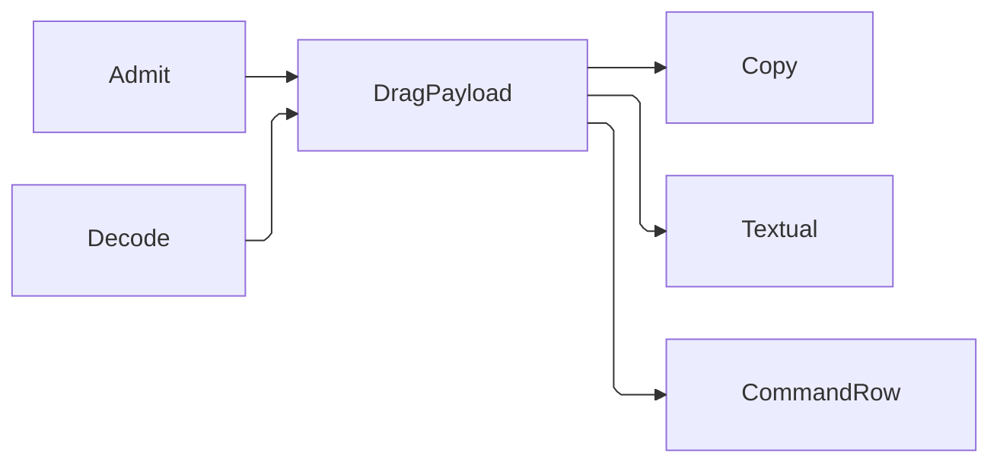

# [APPUI_INPUT_INTERACTION]

One interaction rail owns gesture mechanics for every admitted surface: keyboard chords derive from the one command table through a per-surface `GesturePolicy`, the behavior rail admits its trigger and action vocabulary as rows carrying their own timing election, pointer gestures resolve through the `GestureRow` roster and its kernel `InputVerdict` precedence fold over the frozen `PanZoomRow` canvas family, the `PenAxis` rows land every digitizer property on the one normalized axis grammar, `DragPayload` and `ClipboardRow` carry every transfer across the drag and clipboard boundaries on the validation rail under the kernel `Mime` format key, and the device fabric folds four SDK capsules onto the same command table through paired source and actuator legs. The page owns no key table, no conflict fold, no timer loop, and no second hotkey registry — the command deck, the AppHost schedule rows, the selection algebra, and the motion timing vocabulary arrive settled. The spine is Avalonia, Xaml.Behaviors.Avalonia, PanAndZoom, Thinktecture.Runtime.Extensions, the kernel `FaultBand`/`SignedUnit`/`Mime`/`InputVerdict`/`Retriability` owners, and LanguageExt.Core.

## [01]-[INDEX]

- [02]-[HOTKEY_DERIVATION]: Chord transform, scope split, gesture bindings over the frozen deck.
- [03]-[BEHAVIOR_RAIL]: Admitted trigger and action rows; one intent-binding entry.
- [04]-[POINTER_GESTURES]: The gesture roster and its precedence fold, the frozen pan-zoom canvas family, and the pen axis rows.
- [05]-[DRAG_CLIPBOARD]: Typed transfer payload union, clipboard codec rows, and the sealed vendor-format grain.
- [06]-[INPUT_FABRIC]: Alternative-input device union and device-output union over the intent table.
- [07]-[DEVICE_DRIVERS]: The four admitted SDK boundary capsules, their open and arm legs, and the driver receipts.

## [02]-[HOTKEY_DERIVATION]

- Owner: `GesturePolicy` — the per-surface chord, scope, and return-key policy record carrying the binding fold; `ReturnPosture` — the two-row seam value naming where the return key lands.
- Entry: `public FrozenDictionary<KeyGesture, CommandRow> Bindings(CommandDeck deck, CommandScope scope)` — pure fold over the frozen deck's gesture column through the DECK's chord delegate, narrowed to one scope; the first admitted row holds a contested chord and every later claimant drops deterministically.
- Auto: `For` builds the policy whose `Primary` modifier the selection modifier fold and the deck freeze both read; bindings derive once per frozen deck and scope, each table attaching at the owner its scope names — global at the surface root during the mount transaction, screen inside activation scopes, viewport on its canvas, dialog on the session root — and detaching with that owner.
- Packages: Avalonia, LanguageExt.Core, Thinktecture.Runtime.Extensions, BCL inbox, Rasm.AppHost (project)
- Growth: a new hotkey is one gesture value on its command-table row; a new surface posture is one policy value inside `For`; a new return seat is one `ReturnPosture` row; a new attach owner is one `CommandScope` row read by the same fold; zero new surface.
- Boundary: the command table owns the `Option<KeyGesture>` column as the only key table in the package and the deck's freeze-time conflict fold is the only conflict evidence — a second conflict fold or receipt shape here is the deleted pattern; that fold groups on scope plus chord, so cross-scope chord sharing is legal by law and the scope narrowing here is what keeps the binding table total instead of throwing on a Global-versus-Screen pair Freeze admitted; canonical gestures are authored with the control modifier and `CommandComposition.Chord` swaps it for the platform primary, so one authored chord serves every desktop and a policy-local chord transform beside it is the deleted form — the deck's own column is what `Claimants` and `Contests` already read, and a second transform would contest against a table the freeze never grouped. `Primary` survives as a PUBLISHED value rather than a private input: `Editing/forms#SELECTION_MODEL` reads it so shortcuts and modifier-clicks agree about the platform primary on every desktop. A `HostSurface.None` profile and the `SurfaceMount.Offscreen` mount pin the control modifier for deterministic specs and serialized parity; the panel mount holds the return key inside the shell instead of the host command line, and the host binds no return-key knob for it: a key event carried up a shown host window's responder chain reaches the embedded root as the tunnel-plus-bubble `KeyDown` pair and never reaches the host command prompt, so the shell's own binding table IS the panel row's return policy and `ApplyReturnPolicy` is the seam column that states the posture host-side rather than a key interceptor. The posture crosses as a ROW, never a bit — a bool on that column left each side to re-derive which of the two seats the raised flag meant, and the mount value already reconstructs the posture, so a stored `WantReturnInPanel` column was a knob the mount answered. Delivery itself needs a shown host window, because an unwindowed host view has no responder chain to carry the event at all, which is a mount-visibility fact the `SurfaceSeam.HostFacts` column already publishes, never a condition this rail probes; `KeyGesture` is value-equal with the `(Key, KeyModifiers)` constructor and `Parse`, and bindings attach as `KeyBinding` rows (`Gesture`, `Command`) in the surface root's `KeyBindings` collection.

```csharp
// --- [TYPES] ---------------------------------------------------------------------------
[SmartEnum<string>]
[KeyMemberEqualityComparer<ComparerAccessors.StringOrdinal, string>]
public sealed partial class ReturnPosture {
    public static readonly ReturnPosture Shell = new("shell");
    public static readonly ReturnPosture Host = new("host");
}

// --- [MODELS] --------------------------------------------------------------------------
public sealed record GesturePolicy(
    KeyModifiers Primary,
    ReturnPosture Return,
    Func<ReturnPosture, Unit> ApplyReturnPolicy) {
    public static GesturePolicy For(ConsumptionProfile profile, SurfaceMount mount, Func<ReturnPosture, Unit> applyReturnPolicy) =>
        new(
            Primary: profile.Surface == HostSurface.None || mount is SurfaceMount.Offscreen || !OperatingSystem.IsMacOS()
                ? KeyModifiers.Control
                : KeyModifiers.Meta,
            Return: mount is SurfaceMount.Panel ? ReturnPosture.Shell : ReturnPosture.Host,
            ApplyReturnPolicy: applyReturnPolicy);

    public FrozenDictionary<KeyGesture, CommandRow> Bindings(CommandDeck deck, CommandScope scope) =>
        toSeq(deck.Rows.Values)
            .Filter(row => row.Scope == scope)
            .Bind(row => row.Gesture.Map(gesture => (Gesture: deck.Composition.Chord(gesture), Row: row)).ToSeq())
            .Distinct(static pair => pair.Gesture)
            .ToFrozenDictionary(static pair => pair.Gesture, static pair => pair.Row);

    public Unit Mount() => ApplyReturnPolicy(Return);
}
```

## [03]-[BEHAVIOR_RAIL]

- Owner: `BehaviorRow` — the admitted trigger and action roster carrying each row's catalogued type, its bound knob, and the motion token its interval resolves from; `BehaviorRail` — the static intent-binding surface over those rows.
- Cases: `BehaviorRow` = routed-event | data | multi-data | timer | task-completed | stream-bridge | intent-action | property | async-group | throttle | debounce.
- Entry: `public static InvokeCommandAction Intent(ICommand command)` — the only action-to-command bridge; the argument is the table-generated ReactiveCommand row resolved by intent key. `public static Option<Duration> Interval(BehaviorRow row)` — the one interval resolve, reading the row's own `MotionToken` so a throttle window and a debounce delay trace to the package timing vocabulary rather than to a XAML literal.
- Packages: Xaml.Behaviors.Avalonia, ReactiveUI, Thinktecture.Runtime.Extensions, LanguageExt.Core, NodaTime, BCL inbox
- Growth: a new interaction trigger or action is one `BehaviorRow` naming its catalogued type, its knob, and its timing row; zero new surface.
- Boundary: the roster IS the admission table — a markdown mirror of it beside the rows was a second authority for the knob and timing columns nothing could read, and `Interval` is the arm that makes the timing column load-bearing rather than declared. The roster excludes `FileSystemWatcherTrigger`, `NetworkInformationTrigger`, `HttpRequestAction`, and `WriteTextToFileAction`; asset reload, connectivity, outbound requests, and export enter through their owning rails. `TimerTrigger` carries surface-local micro-cadence only, while throttle and debounce intervals resolve from `Theme/motion#MOTION_AXIS` through the row's own token at composition. `EventTriggerBehavior` and the catalogued routed-event trigger family own event admission, and `RoutedEventTriggerBehavior` (`Avalonia.Xaml.Interactions.Custom`) carries the `RoutedEvent`, `RoutingStrategies`, and `SourceInteractive` overrides a named-event trigger cannot express. The rail binds the COMMAND alone — `Intent` seats `Command` and pins `PassEventArgsToCommand` false, and the package's own `CommandParameter` and `InputConverter` columns stay unbound, so a per-row or per-field verb resolves its OWN materialized `ReactiveCommand` rather than sharing one command through a parameter an untyped `object` would carry; a rail-supplied parameter column is therefore unspellable by construction and every consumer that needed one — the form chrome's per-field operations first among them — resolves a command per subject instead. Compiled XAML binding and `BehaviorRail.Intent` are the complete view-binding surface; no ceremonial method names rejected ReactiveUI property binders.

```csharp
// --- [TYPES] ---------------------------------------------------------------------------
[SmartEnum<string>]
[KeyMemberEqualityComparer<ComparerAccessors.StringOrdinal, string>]
public sealed partial class BehaviorRow {
    public static readonly BehaviorRow RoutedEvent = new("routed-event", "RoutedEventTriggerBehavior", Some("RoutedEvent"), None);
    public static readonly BehaviorRow Data = new("data", "DataTriggerBehavior", Some("Binding"), None);
    public static readonly BehaviorRow MultiData = new("multi-data", "MultiDataTriggerBehavior", Some("Conditions"), None);
    public static readonly BehaviorRow Timer = new("timer", "TimerTrigger", Some("Interval"), Some(MotionToken.Standard));
    public static readonly BehaviorRow TaskCompleted = new("task-completed", "TaskCompletedTrigger", None, None);
    public static readonly BehaviorRow StreamBridge = new("stream-bridge", "ObservableStreamBehavior", Some("Source"), None);
    public static readonly BehaviorRow IntentAction = new("intent-action", "InvokeCommandAction", Some("Command"), None);
    public static readonly BehaviorRow Property = new("property", "ChangePropertyAction", None, None);
    public static readonly BehaviorRow AsyncGroup = new("async-group", "AsyncActionGroup", Some("Actions"), None);
    public static readonly BehaviorRow Throttle = new("throttle", "ThrottleAction", Some("Interval"), Some(MotionToken.Fast));
    public static readonly BehaviorRow Debounce = new("debounce", "DebounceAction", Some("Delay"), Some(MotionToken.Standard));

    public string Surface { get; }
    public Option<string> Knob { get; }
    public Option<MotionToken> Timing { get; }
}

// --- [OPERATIONS] ----------------------------------------------------------------------
public static class BehaviorRail {
    public static InvokeCommandAction Intent(ICommand command) =>
        new() { Command = command, PassEventArgsToCommand = false };

    public static Option<Duration> Interval(BehaviorRow row) =>
        row.Timing.Map(static token => token.Duration);
}
```

## [04]-[POINTER_GESTURES]

- Owner: `GestureRow` — the pointer-gesture roster carrying each row's trigger type, routing strategy, and kernel `InputVerdict` rank, with the precedence fold two claimants over one point compose through; `PanZoomRow` — the frozen canvas row family over `ZoomBorder`; `AxisForm` — the continuous-versus-discrete reading form; `PenAxis` — the digitizer-property row family; `PenSample` — the per-point pen reading; `PointerTrack` — the pointer-to-axis fold.
- Cases: `PanZoomRow` = `Dashboard` | `Graph` | `Preview`; `PenAxis` = pressure | tilt-x | tilt-y | twist | barrel | eraser under the locked channel literals; `AxisForm` = continuous | discrete.
- Entry: `public static Seq<PenSample> Pen(PointerEventArgs args, Visual? relativeTo, Instant at)` — the pen fold; a non-pen pointer answers the empty sequence and a pen answers one sample per intermediate point, each carrying the whole axis row set on the `AxisChannel` grammar `[07]` owns. `public static InputVerdict Resolve(Seq<GestureRow> claimants)` — the precedence fold every contested point takes.
- Packages: PanAndZoom, Xaml.Behaviors.Avalonia, Avalonia, Thinktecture.Runtime.Extensions, LanguageExt.Core, NodaTime, Rasm (project — `SignedUnit`, `InputVerdict`), BCL inbox
- Growth: a new zoomable surface is one `PanZoomRow` row; a new pointer gesture is one `GestureRow` naming its trigger, routing, and rank; a new digitizer property is one `PenAxis` row naming its form and projection; a rotation or saved-view posture is one policy value on the canvas row; zero new surface.
- Boundary: the gesture roster is the ONE gesture ingress for every owner downstream of it, and it carries the precedence algebra the package previously had no owner for: two rows reaching one point compose by RANK through the kernel `InputVerdict` fold, so a marquee sweep and a panel dismissal stop being decided by XAML attach order, and `MarkAsHandled` is the verdict's PROJECTION onto the behavior knob rather than a second bool the roster would have to keep in agreement with it. The drag rows thread each delivered position through `Theme/motion#MOTION_HANDOFF` `MotionTrack.Sample` and the capture-loss row is the release edge `HandoffSpec.Release` folds, so the inertial owner subscribes to nothing and a second pointer subscription beside these rows is the deleted form; the marquee rows deliver the same positions to `Editing/forms#SELECTION_MODEL` `SelectionBand`, whose `BandMode` derives from the drag direction, so a drag that dismisses a panel and a drag that sweeps a selection differ in the fold they feed, never in how they are heard. Every row is a `RoutedEventTriggerBase<TArgs>` over its own `InputElement` event (`.api/api-behaviors.md` `[CUSTOM_GESTURE_TYPES]`), so a hand-wired `GestureEventArgs` listener is the deleted form. One zoom owner per canvas — a chart tile mounted inside a `PanZoomRow` canvas gates its internal zoom off; the row's `MinZoom` and `MaxZoom` land on the control's per-axis `MinZoomX`/`MinZoomY`/`MaxZoomX`/`MaxZoomY` at composition; `Dashboard` animation duration binds `AnimationDuration` from the motion standard row at composition and `Preview` stays animation-free for capture determinism; rotation rides the `EnableRotation` row gate onto the control `Rotate`/`RotateAt` operations with `SnapRotation` quantizing to `Snap` and `ResetRotation` clearing on view reset, so a hand-built rotation matrix on the canvas is the deleted form. `Snap` is the derived authority: a row whose rotation gate is closed has no step to quantize to, so the step reaches every call site as an ABSENT value rather than as a zero each site would have to know was structural, while `RotationStep` stays the raw column the seated canvas writes. The family is a keyed ROSTER rather than a record beside a hand index — `Document/board.md` resolves `PanZoomRow.Dashboard` column by column and the frozen dictionary that stood beside the rows answered no reader at all, so the roster's own lookup is now the one reader-side admission. View state round-trips through the `ZoomBorderState` value — `ExportState()` at capture and `ImportState` at restore, landing in the seat its own canvas persists through: the `Charts/tiles#TILE_SPINE` `DashboardLayout.CanvasState` column for a board and the `Shell/screens#SCREEN_STATE` `ScreenState.Canvas` column for a screen-hosted canvas, the graph viewport being the second seat's own consumer — so the value shape is one and the partition is the canvas's own; named viewports persist through `SaveView`/`RestoreView` with `DeleteSavedView` and `ClearSavedViews` owning the named-view registry as command-table intents, traversal rides `NavigateBack`/`NavigateForward` with `ClearViewHistory` resetting the stack at screen teardown; focus follows pointer press through `Focus` on `IInputElement`, and pointer-capture acquisition on press rides `PointerPressedEventTrigger` while capture-loss rides `PointerCaptureLostEventTrigger`/`PointerCaptureLostEventBehavior` (`Avalonia.Xaml.Interactions.Events`); the dashboard tile canvas and the offscreen-visuals preview canvas consume these rows as settled values. PEN properties are gated on `IPointer.Type` — a mouse reports a constant `Pressure` of 0.5 and zero tilt on every backend, so an ungated read fabricates a pressure curve out of a device that carries none; the whole coalesced burst decodes through `GetIntermediatePoints`, because the platform batches every sample it took between two frames and reading `GetCurrentPoint` alone discards the pressure and tilt of all but the last, which is precisely the detail a stroke is drawn from; the six rows land as `DeviceAxis` values on the same `AxisChannel` grammar the device capsules mint, so `Collab/issues#REDLINE_TOOLS` and `Editing/graph#PALETTE_INGRESS` bind ONE axis resolver whether the level came from a nib or from a MIDI fader, and `IsEraser` and `IsInverted` fold to one eraser channel because a barrel-inverted stylus and an eraser-tipped one report the same intent under different flags. Each row states its own `AxisForm`, so a consumer thresholding `Level(PenAxis.Barrel)` reads a DISCRETE assertion rather than guessing that a bipolar band happens to be binary here. A digitizer overshooting its own declared range CLAMPS rather than dropping the field, since the capsule law of refusing a sample would put a hole in a stroke a user is drawing — but a NON-FINITE reading yields no axis at all, because a NaN and a genuine zero are not one reading and the zero this rail used to substitute made them one. The pen tool writes its own `Theme/assets#POINTER_ROWS` `CursorRow` onto the interaction root through the inherited `InputElement.Cursor`, so no pointer glyph is minted here.

```csharp
// --- [TYPES] ---------------------------------------------------------------------------
[SmartEnum<string>]
[KeyMemberEqualityComparer<ComparerAccessors.StringOrdinal, string>]
public sealed partial class AxisForm {
    public static readonly AxisForm Continuous = new("continuous");
    public static readonly AxisForm Discrete = new("discrete");
}

[SmartEnum<string>]
[KeyMemberEqualityComparer<ComparerAccessors.StringOrdinal, string>]
public sealed partial class GestureRow {
    public static readonly GestureRow Tap = new("tap", "TappedEventTrigger", RoutingStrategies.Bubble, InputVerdict.Handled);
    public static readonly GestureRow DoubleTap = new("double-tap", "DoubleTappedEventTrigger", RoutingStrategies.Bubble, InputVerdict.Handled);
    public static readonly GestureRow PressHold = new("press-hold", "HoldingGestureTrigger", RoutingStrategies.Bubble, InputVerdict.Handled);
    public static readonly GestureRow ContextRequest = new("context-request", "RightTappedEventTrigger", RoutingStrategies.Bubble, InputVerdict.Handled);
    public static readonly GestureRow WheelZoom = new("wheel-zoom", "PointerWheelChangedEventTrigger", RoutingStrategies.Bubble, InputVerdict.Handled);
    public static readonly GestureRow PinchZoom = new("pinch-zoom", "PinchGestureTrigger", RoutingStrategies.Bubble, InputVerdict.Capture);
    public static readonly GestureRow PinchEnded = new("pinch-ended", "PinchEndedGestureTrigger", RoutingStrategies.Bubble, InputVerdict.Release);
    public static readonly GestureRow CanvasDrag = new("canvas-drag", "CanvasDragBehavior", RoutingStrategies.Bubble, InputVerdict.Capture);
    public static readonly GestureRow ItemDrag = new("item-drag", "ItemDragBehavior", RoutingStrategies.Bubble, InputVerdict.Capture);
    public static readonly GestureRow Rotate = new("rotate", "PointerTouchPadGestureRotateGestureTrigger", RoutingStrategies.Bubble, InputVerdict.Capture);
    public static readonly GestureRow Magnify = new("magnify", "PointerTouchPadGestureMagnifyGestureTrigger", RoutingStrategies.Bubble, InputVerdict.Capture);
    public static readonly GestureRow CaptureLost = new("capture-lost", "PointerCaptureLostEventTrigger", RoutingStrategies.Bubble, InputVerdict.Release);
    public static readonly GestureRow MarqueeBegin = new("marquee-begin", "PointerPressedEventTrigger", RoutingStrategies.Tunnel, InputVerdict.Capture);
    public static readonly GestureRow MarqueeExtend = new("marquee-extend", "PointerMovedEventTrigger", RoutingStrategies.Bubble, InputVerdict.Capture);
    public static readonly GestureRow MarqueeCommit = new("marquee-commit", "PointerReleasedEventTrigger", RoutingStrategies.Bubble, InputVerdict.Release);
    public static readonly GestureRow PenStroke = new("pen-stroke", "PointerMovedEventTrigger", RoutingStrategies.Bubble, InputVerdict.Capture);
    public static readonly GestureRow PenEraser = new("pen-eraser", "PointerPressedEventTrigger", RoutingStrategies.Tunnel, InputVerdict.Capture);

    public string Trigger { get; }
    public RoutingStrategies Routing { get; }
    public InputVerdict Verdict { get; }

    public bool Handled => Verdict.Equals(InputVerdict.Handled) || Verdict.Equals(InputVerdict.Capture);

    public static InputVerdict Resolve(Seq<GestureRow> claimants) =>
        claimants.Fold(InputVerdict.Ignored, static (rank, row) => rank.Fold(row.Verdict));
}

[SmartEnum<string>]
[KeyMemberEqualityComparer<ComparerAccessors.StringOrdinal, string>]
[KeyMemberComparer<ComparerAccessors.StringOrdinal, string>]
public sealed partial class PenAxis {
    private const double TiltCeiling = 90d;
    private const double TwistCeiling = 360d;

    public static readonly PenAxis Pressure = new(AxisControl.Pressure, AxisForm.Continuous, static properties => properties.Pressure);
    public static readonly PenAxis TiltX = new(AxisControl.TiltX, AxisForm.Continuous, static properties => properties.XTilt / TiltCeiling);
    public static readonly PenAxis TiltY = new(AxisControl.TiltY, AxisForm.Continuous, static properties => properties.YTilt / TiltCeiling);
    public static readonly PenAxis Twist = new(AxisControl.Twist, AxisForm.Continuous, static properties => properties.Twist / TwistCeiling);
    public static readonly PenAxis Barrel = new(AxisControl.Barrel, AxisForm.Discrete, static properties => properties.IsBarrelButtonPressed ? 1d : 0d);

    public static readonly PenAxis Eraser = new(AxisControl.Eraser, AxisForm.Discrete,
        static properties => properties.IsEraser || properties.IsInverted ? 1d : 0d);

    public AxisForm Form { get; }

    [UseDelegateFromConstructor]
    public partial double Read(PointerPointProperties properties);
}

// --- [MODELS] --------------------------------------------------------------------------
[SmartEnum<string>]
[KeyMemberEqualityComparer<ComparerAccessors.StringOrdinal, string>]
public sealed partial class PanZoomRow {
    public static readonly PanZoomRow Dashboard = new("dashboard", StretchMode.None, ButtonName.Middle,
        zoomSpeed: 1.2, minZoom: 0.1, maxZoom: 8.0, enableConstrains: true, enableGestures: true,
        enableAnimations: true, showZoomIndicator: true, enableRotation: true, rotationStep: 15.0);

    public static readonly PanZoomRow Graph = new("graph", StretchMode.None, ButtonName.Middle,
        zoomSpeed: 1.2, minZoom: 0.05, maxZoom: 32.0, enableConstrains: true, enableGestures: true,
        enableAnimations: true, showZoomIndicator: true, enableRotation: false, rotationStep: 0.0);

    public static readonly PanZoomRow Preview = new("preview", StretchMode.Uniform, ButtonName.Middle,
        zoomSpeed: 1.2, minZoom: 0.05, maxZoom: 64.0, enableConstrains: true, enableGestures: true,
        enableAnimations: false, showZoomIndicator: false, enableRotation: false, rotationStep: 0.0);

    public StretchMode Stretch { get; }
    public ButtonName PanButton { get; }
    public double ZoomSpeed { get; }
    public double MinZoom { get; }
    public double MaxZoom { get; }
    public bool EnableConstrains { get; }
    public bool EnableGestures { get; }
    public bool EnableAnimations { get; }
    public bool ShowZoomIndicator { get; }
    public bool EnableRotation { get; }
    public double RotationStep { get; }

    public Option<double> Snap => EnableRotation ? Some(RotationStep) : None;
}

public readonly record struct PenSample(Point Position, Seq<DeviceAxis> Axes, Instant At) {
    public Option<SignedUnit> Level(PenAxis axis) =>
        Axes.Find(sample => sample.Channel == PointerTrack.Channel(axis))
            .Map(static sample => sample.Level);
}

// --- [OPERATIONS] ----------------------------------------------------------------------
public static class PointerTrack {
    public static AxisChannel Channel(PenAxis axis) => new(DeviceClass.Pen, axis.Key, 0);

    public static Seq<PenSample> Pen(PointerEventArgs args, Visual? relativeTo, Instant at) =>
        args.Pointer.Type is PointerType.Pen
            ? toSeq(args.GetIntermediatePoints(relativeTo))
                .Map(point => new PenSample(point.Position, Axes(point.Properties), at))
            : Seq<PenSample>();

    public static Seq<DeviceAxis> Axes(PointerPointProperties properties) =>
        toSeq(PenAxis.Items).Choose(axis => Bounded(axis.Read(properties)).Map(level => new DeviceAxis(Channel(axis), level)));

    private static Option<SignedUnit> Bounded(double raw) =>
        double.IsFinite(raw) ? Some(SignedUnit.Create(double.Clamp(raw, -1d, 1d))) : None;
}
```

## [05]-[DRAG_CLIPBOARD]

- Owner: `DragPayload` transfer union; `ClipboardRow` codec row family over the kernel `Mime` format key; `DragPayload.TableRows.Seal` — the one vendor-format grain declaration.
- Cases: `TableRows(Seq<string> Keys, string Tsv)` | `AssetKey(string Key)` | `HostObjects(Seq<Guid> Ids)` | `Files(Seq<string> Paths)` | `Image(ReadOnlyMemory<byte> Png)`
- Entry: `public static Validation<Error, DragPayload> Admit(Seq<string> paths, Func<string, bool> admitted)` — external drop admission; `Validation<Error,T>` accumulates one refusal per unadmitted path; `public static Option<Validation<Error, DragPayload>> Decode(Seq<string> formats, Func<Mime, Option<ReadOnlyMemory<byte>>> read)` — the format gate: the host's reported identifiers admit through `Mime` once, the present rows select the first round-trip leg, and `None` is the no-op an unroutable clipboard folds to.
- Auto: every external drop runs `Admit` and every paste enters through `Decode` before any intent fires; refusals fold into the screen fault state with zero partial payloads; a drop reaches `Admit` from the attached behavior's own handler, so no surface carries a routed drop handler of its own.
- Receipt: admitted payloads raise their command intents and ride the command receipt family — the rail mints no second receipt vocabulary.
- Packages: Thinktecture.Runtime.Extensions, LanguageExt.Core, Xaml.Behaviors.Avalonia, Avalonia, Rasm (project — `Mime`), BCL inbox
- Growth: a new transfer shape is one union case plus one `ClipboardRow`; a new drop surface is one attached behavior row; a payload column added to a vendor format is one case field under one `Generation` bump on that case's seal; zero new surface.
- Boundary: the format column is the kernel `Mime` value, so a host identifier canonicalizes and admits ONCE at the gate and the interior compares admitted keys — a bare-string roster compared the host's own casing against the page's and missed on a board that reported `TEXT/PLAIN`, and the six literals here admitted by accident rather than by grammar. The rows mint through `Mime.Create` because they are the page's own frozen literals: a defect there is a boot refusal on a value no runtime input can influence. The vendor formats cross a PROCESS boundary, so `application/x-rasm-table-rows+json` rides the case's own `Diagnostics/evidence#DURABLE_PARCEL` seal rather than serializing the union case bare: a column added to `DragPayload.TableRows` broke every previously copied clipboard payload silently, and the generation now rides inside the copied bytes so a payload from another build refuses on content and the paste answers absence. Parallel wire records carrying their own stamped ordinal are the deleted form — they made the case's column roster a fact two declarations had to agree about, and the mapper carving that ordinal was the seam where they disagreed. NAMED LOSS: attribute-rename carry across a generation, which a clipboard payload never needed. Codec rows carry format, copy, and paste alone: the seal reaches `EvidenceOps.Wire` itself, so no row threads a `JsonSerializerOptions` column and none reads one. Transfer attachment is declarative behavior rows, never code-behind: the typed payload rides `TypedDragBehavior` whose `Handler` column carries a `DropHandlerBase`-derived `IDropHandler` routing the admitted payload into the intent's `ReactiveCommand`, data-context transfer rides `ContextDragBehavior`/`ContextDropBehavior`, list reorder rides `ListReorderDragBehavior` with its `PlaceholderTemplate`, external file drop rides `FilesDropBehavior` (or `ContentControlFilesDropBehavior` on a content host) beside `FilesPreviewBehavior` for the drag-hover preview, and `DragDrop.SetAllowDrop(control, true)` with routed `DragDrop.DragOverEvent`/`DropEvent` handlers is the deleted form — `DragEventArgs.DataTransfer` reads and the `DragEventArgs.DragEffects` write live inside the handler alone, never `DragEventArgs.Data`; the behavior owns delivery and the payload rail owns admission, so `Admit` stays the one typed refusal producer and a path the surface accepted but the payload vocabulary refuses still accumulates its own `DropRejected`, with the `admitted` predicate column arriving from the dialogs file-filter vocabulary. The empty drop is its OWN guard rather than an arm nested inside the refusal switch, and every unadmitted path names itself on the applicative — `Error.Many` re-wrapped a sequence `Traverse` already carries, which is the same accumulation the uri-list leg beside it always used. A paste gates through `GetClipboardFormatsAction` into `Decode` so the present data-format identifiers select the matching `ClipboardRow` before any `Paste` runs and an absent format folds to no-op rather than a failed decode; plain-text paste routes to the focused control and never the payload rail, so the text row is copy-only structurally — it carries no paste leg at all, the gate skips it, and `PasteRejected` stays reserved for a genuine malformed decode instead of firing on every ordinary external text paste; every structured `DragPayload` case owns a `ClipboardRow` round-trip — `Files` rides the standard `text/uri-list` grammar and `HostObjects` the `application/x-rasm-host-objects` GUID row, both fail-closed with one accumulated refusal per malformed entry, so a copy-paste cycle preserves the structured case and no generic textual coercion can bypass its row; `TableRows.Tsv` alone supplies the explicit `text/plain` interoperability projection beside its full-fidelity JSON row; the host-objects clipboard leg and the cross-boundary drag leg are both live — the embedded root's native view accepts host drag-type registration additively and `DragDrop.SetAllowDrop(target, true)` reads back true on every admitted embedded host, so the payload rail crosses the foreign-view boundary on the same admission every in-process drop uses; asset keys ride the icons asset-key vocabulary and table-row keys ride the grid row-model identity; structured copy crosses through one clipboard write keyed by the row `Format` identifiers, riding `Avalonia.Input.Platform.IClipboard.SetDataAsync(IAsyncDataTransfer)` with a `DataTransfer` carrying one `DataTransferItem` per `ClipboardRow` keyed by `DataFormat.CreateBytesApplicationFormat`/`CreateStringApplicationFormat`, each item built through `DataTransferItem.Create<T>(DataFormat<T>, T?)`/`CreateText` or `DataTransferItem.Set<T>(DataFormat<T>, T?)`, the read riding `IClipboard.TryGetDataAsync()` with `ClipboardExtensions.GetDataFormatsAsync` as the present-format gate and `ClipboardExtensions.TryGetTextAsync`/`ClipboardExtensions.TryGetValueAsync<T>(DataFormat<T>)` plus `DataTransferItem.TryGetRaw` as the typed extract, the `IAsyncDataTransfer` handed to `SetDataAsync` left undisposed because Avalonia takes ownership and disposes it once off the clipboard (a caller `using`/`Dispose` on the set transfer is the deleted form), and the legacy `DataObject`/`DataFormats`/`IDataObject` surface obsolete in Avalonia 12; the headless drop harness sequences `DragDrop` calls `DragEnter` → `DragOver` → `Drop` (mirroring `DragLeave` on the abort path) because a `DragOver` without a prior `DragEnter` seeds no drop context and fires no routed handler the attached behavior can observe, and headless input modifiers cross as `RawInputModifiers`, never `KeyModifiers`; the cross-boundary host-object drag binds `ManagedDragDropService` with `ManagedContextDropArgs` as its admitted managed transfer surface, registering its drag types onto the embedded root's own native view at mount and unregistering with the capsule teardown; the physical drag gesture across that boundary is the one perceptual remainder on this rail — registration, admission, and the routed drop all read as values, while a pointer actually carrying a payload from a host viewport onto a mounted row is confirmable by a human alone, so no design here waits on it.

```csharp
// --- [MODELS] --------------------------------------------------------------------------
[Union(ConversionFromValue = ConversionOperatorsGeneration.None)]
public abstract partial record DragPayload {
    private DragPayload() { }

    public sealed record TableRows(Seq<string> Keys, string Tsv) : DragPayload {
        public static readonly StateSeal Seal = StateSeal.Of("input", "table-rows", generation: 1, StateResidue.Discard);
    }

    public sealed record AssetKey(string Key) : DragPayload;

    public sealed record HostObjects(Seq<Guid> Ids) : DragPayload;

    public sealed record Files(Seq<string> Paths) : DragPayload;

    public sealed record Image(ReadOnlyMemory<byte> Png) : DragPayload;

    public static Option<string> Textual(DragPayload payload) =>
        payload.Switch(
            tableRows: static rows => Some(rows.Tsv),
            assetKey: static _ => None,
            hostObjects: static _ => None,
            files: static _ => None,
            image: static _ => None);

    public static Validation<Error, DragPayload> Admit(Seq<string> paths, Func<string, bool> admitted) =>
        paths.IsEmpty
            ? (Validation<Error, DragPayload>)new InputDriverFault.DropRejected("empty drop")
            : paths.Traverse(path => admitted(path)
                    ? Success<Error, string>(path)
                    : (Validation<Error, string>)new InputDriverFault.DropRejected($"unadmitted drop: {path}"))
                .As()
                .Map(static accepted => (DragPayload)new Files(accepted));
}

// --- [OPERATIONS] ----------------------------------------------------------------------
public sealed record ClipboardRow(
    Mime Format,
    Func<DragPayload, Option<ReadOnlyMemory<byte>>> Copy,
    Option<Func<ReadOnlyMemory<byte>, Validation<Error, DragPayload>>> Paste) {
    public const int MaxImageBytes = 33_554_432;

    private static ClipboardRow RoundTrip(
        string format,
        Func<DragPayload, Option<ReadOnlyMemory<byte>>> copy,
        Func<ReadOnlyMemory<byte>, Validation<Error, DragPayload>> paste) =>
        new(Mime.Create(format), copy, Some(paste));

    private static ClipboardRow CopyOnly(
        string format, Func<DragPayload, Option<ReadOnlyMemory<byte>>> copy) =>
        new(Mime.Create(format), copy, None);

    public static readonly ClipboardRow Text = CopyOnly(
        "text/plain",
        static payload => DragPayload.Textual(payload).Map(text => (ReadOnlyMemory<byte>)Encoding.UTF8.GetBytes(text)));

    public static readonly ClipboardRow Table = RoundTrip(
        "application/x-rasm-table-rows+json",
        copy: static payload => payload is DragPayload.TableRows rows
            ? DragPayload.TableRows.Seal.Write(rows).ToOption().Map(static text => (ReadOnlyMemory<byte>)Encoding.UTF8.GetBytes(text))
            : None,
        paste: static bytes => DragPayload.TableRows.Seal
            .Read<DragPayload.TableRows>(Encoding.UTF8.GetString(bytes.Span), static rows => rows.Keys.IsEmpty
                ? Fin.Fail<DragPayload.TableRows>(new InputDriverFault.PasteRejected("table rows carry no column roster"))
                : Fin.Succ(rows))
            .Value
            .Match(
                Some: static rows => Success<Error, DragPayload>(rows),
                None: static () => (Validation<Error, DragPayload>)new InputDriverFault.PasteRejected("table rows refuse this build's seal")));

    public static readonly ClipboardRow Png = RoundTrip(
        "image/png",
        copy: static payload => payload is DragPayload.Image image && image.Png.Length <= MaxImageBytes ? Optional(image.Png) : None,
        paste: static bytes => bytes.Length <= MaxImageBytes
            && bytes.Span is [0x89, 0x50, 0x4E, 0x47, 0x0D, 0x0A, 0x1A, 0x0A, ..]
            ? (Validation<Error, DragPayload>)new DragPayload.Image(bytes)
            : (Validation<Error, DragPayload>)new InputDriverFault.PasteRejected("png signature mismatch"));

    public static readonly ClipboardRow Asset = RoundTrip(
        "application/x-rasm-asset-key",
        copy: static payload => payload is DragPayload.AssetKey { Key.Length: > 0 } key ? Optional<ReadOnlyMemory<byte>>(Encoding.UTF8.GetBytes(key.Key)) : None,
        paste: static bytes => Encoding.UTF8.GetString(bytes.Span) is { Length: > 0 } key
            ? (Validation<Error, DragPayload>)new DragPayload.AssetKey(key)
            : (Validation<Error, DragPayload>)new InputDriverFault.PasteRejected("empty asset key"));

    public static readonly ClipboardRow Uris = RoundTrip(
        "text/uri-list",
        copy: static payload => payload is DragPayload.Files files
            ? files.Paths.Traverse(static path => Uri.TryCreate(path, UriKind.Absolute, out Uri? uri) && uri.IsFile
                    ? Some(uri.AbsoluteUri)
                    : Option<string>.None)
                .As()
                .Map(uris => (ReadOnlyMemory<byte>)Encoding.UTF8.GetBytes(string.Join("\r\n", uris)))
            : None,
        paste: static bytes => toSeq(Encoding.UTF8.GetString(bytes.Span).Split(["\r\n", "\n"], StringSplitOptions.RemoveEmptyEntries))
            .Filter(static line => !line.StartsWith('#'))
            .Traverse(static line => Uri.TryCreate(line, UriKind.Absolute, out Uri? uri) && uri.IsFile
                ? Success<Error, string>(uri.LocalPath)
                : (Validation<Error, string>)new InputDriverFault.PasteRejected($"non-file uri: {line}"))
            .As()
            .Map(static paths => (DragPayload)new DragPayload.Files(paths)));

    public static readonly ClipboardRow Host = RoundTrip(
        "application/x-rasm-host-objects",
        copy: static payload => payload is DragPayload.HostObjects host ? Optional<ReadOnlyMemory<byte>>(Encoding.UTF8.GetBytes(string.Join(",", host.Ids))) : None,
        paste: static bytes => toSeq(Encoding.UTF8.GetString(bytes.Span).Split(',', StringSplitOptions.RemoveEmptyEntries))
            .Traverse(static token => Guid.TryParse(token, out Guid id)
                ? Success<Error, Guid>(id)
                : (Validation<Error, Guid>)new InputDriverFault.PasteRejected($"malformed host id: {token}"))
            .As()
            .Map(static ids => (DragPayload)new DragPayload.HostObjects(ids)));

    public static readonly FrozenDictionary<Mime, ClipboardRow> Rows =
        new[] { Text, Table, Png, Asset, Uris, Host }.ToFrozenDictionary(static row => row.Format, static row => row);

    public static Option<Validation<Error, DragPayload>> Decode(
        Seq<string> formats, Func<Mime, Option<ReadOnlyMemory<byte>>> read) =>
        formats
            .Choose(static format => Mime.Validate(format, null, out Mime admitted) is null ? Some(admitted) : None)
            .Choose(static format => Rows.TryGetValue(format, out ClipboardRow? row) ? Some(row) : None)
            .Choose(static row => row.Paste.Map(paste => (row.Format, Paste: paste)))
            .Head
            .Bind(found => read(found.Format).Map(bytes => found.Paste(bytes)));
}
```

| [INDEX] | [TRANSFER]     | [BEHAVIOR]                                          | [COLUMN]                  |
| :-----: | :------------- | :-------------------------------------------------- | :------------------------ |
|  [01]   | typed payload  | `TypedDragBehavior`                                 | `Handler`                 |
|  [02]   | drop admission | `IDropHandler` / `DropHandlerBase`                  | intent `ReactiveCommand`  |
|  [03]   | data context   | `ContextDragBehavior` / `ContextDropBehavior`       | `Handler`                 |
|  [04]   | list reorder   | `ListReorderDragBehavior`                           | `PlaceholderTemplate`     |
|  [05]   | external files | `FilesDropBehavior`                                 | `DragPayload.Admit`       |
|  [06]   | content host   | `ContentControlFilesDropBehavior`                   | `DragPayload.Admit`       |
|  [07]   | hover preview  | `FilesPreviewBehavior`                              | —                         |
|  [08]   | cross-host     | `ManagedDragDropService` / `ManagedContextDropArgs` | `DragPayload.HostObjects` |



## [06]-[INPUT_FABRIC]

- Owner: `DeviceClass` — the axis-source roster both the device capsules and the pointer producer mint on; `InputDevice` `[Union]` the alternative-input source family over the four admitted net10 SDKs; `DeviceAxis` the normalized continuous-axis sample; `DeviceOutput` `[Union]` the device-output sink family; `IntentRoute` the per-invocation verdict; `InputFabric` the device-to-intent and intent-to-device fold.
- Cases: `DeviceClass` = hid | gamepad | haptic | midi | pen; `InputDevice` = Verbed | MidiSurface; `DeviceOutput` = ControllerRumble | HapticRumble | MidiFeedback; `IntentRoute` = Raised | Denied | Unmapped — eye-gaze, switch-access, voice, CNC, and robot stay out of the fabric because no cross-platform net10 SDK covers them, so each would mint a per-platform driver capsule with no shared decode.
- Entry: `public static DeviceIntentReport Map(InputDevice device, Seq<DeviceAxis> sample, CommandDeck deck, CommandRow.Availability availability)` — folds a device sample into a three-way partition over the one table; `public static IO<Unit> Drive(DeviceOutput output, Seq<DeviceAxis> command)` — folds a command into the device-output samples it emits.
- Auto: every alternative-input device folds onto the one `CommandRow` table — a SpaceMouse six-degree-of-freedom translation/rotation sample maps to the viewport orbit/pan/zoom intents, its button block to the discrete verbs those buttons name, a game-controller stick to the same navigation intents, a haptic-surface trigger to a feedback intent, and a MIDI control surface to parameter intents — so a new input modality raises existing verbs and never a parallel command path; device output is the symmetric fold — a controller rumble, a haptic-device pulse, or a MIDI echo back to a motorized fader consumes the normalized command axes, so the same axis vocabulary an input device produces a device output consumes and the input-output charter closes on every backend that carries an actuator; the continuous-axis sample is normalized to [-1, 1] so a device-specific range never leaks into the intent fold; each device's continuous axes fold through the pan-zoom canvas algebra (`[04]-[POINTER_GESTURES]`, whose `PenAxis` rows mint on the identical channel grammar under the `DeviceClass.Pen` row) and discrete events map onto the `CommandRow` vocabulary.
- Packages: Thinktecture.Runtime.Extensions, LanguageExt.Core, NodaTime, Rasm (project — `SignedUnit`), Rasm.AppHost (project), BCL inbox
- Growth: a new verb-raising backend is one `DeviceClass` row the shared source case carries; a new output device is one `DeviceOutput` case; a new continuous control is one `AxisControl` row; zero new surface — a parallel input framework beside this fabric is the rejected form.
- Boundary: alternative input folds onto the one command table so a per-device handler is the deleted form — a SpaceMouse, controller, haptic, or MIDI sample raises a `CommandRow` exactly as a hotkey does, and the raised key goes through `CommandRow.Admits` so the ONE two-plane availability algebra gates every modality (folder `RULINGS` `[02]` capability admission): a device that reached `deck.Rows` directly raised a host-document verb against a standalone shell the reach plane explicitly denies, and both the degradation plane and the mount reach plane were bypassed by a lookup that only asked whether the key existed. The partition is therefore THREE-way, not two: a key the deck does not carry is UNMAPPED — a driver typo, a renamed command key, an unsupported mapping — while a key it carries whose gate refuses is DENIED, a verb the process was right to withhold; folding the two together left a board unable to tell a defect from correct behaviour. `Raised` rows ride the command receipt family unchanged while both refusal columns fold into the screen fault state and device telemetry. Samples carry the kernel `SignedUnit` atom rather than a raw normalized double, so the `[-1,1]` bound is admitted once at the capsule edge and every fabric signature holds it structurally, and the channel is the typed `AxisChannel` VALUE rather than its rendered key, so an ordinal string compare between a capsule's mint and a projection's lookup is unspellable. Three source cases spelled ONE shape and were read by three byte-identical `Switch` arms, so they collapse to one verb-raising case carrying the class the value itself recovers — NAMED LOSS: per-source compile exhaustiveness on the intent fold, bought back because `DeviceClass` is a closed roster and a new verb-raising backend adds a row there rather than an arm nobody would have written differently; MIDI survives as its own case because a control surface raises PARAMETERS carrying a level, a genuinely different projection. Each `DeviceOutput` case carries its composition-bound channel keys and its delegate closes over the timing policy, so no case column re-states a duration the driver row already declared and no sink column re-states an identity its own receipt carries; the drive fold contains no positional channel or duration literal. Absence is a VALUE on the drive leg: a channel the command never named is not a channel commanded to zero, and the zero that used to stand in drove a motor to rest on every frame the fold happened not to carry it — a paired motor needs BOTH its channels and answers nothing without them, while a fan echo sends what it was given. Controller-rumble, haptic, and MIDI-feedback sinks consume normalized command axes through device delegates, so the fabric's output leg names no SDK type and no wire scalar, and SDK capsules live in `[07]-[DEVICE_DRIVERS]`; mouse, touch, and keyboard stay with the pointer-gesture and hotkey owners, and pen stays there too — its properties ride the pointer contract, not a device enumeration — while its axes mint on this fabric's own channel grammar so both producers reach one consumer shape.

```csharp
// --- [TYPES] ---------------------------------------------------------------------------
[SmartEnum<string>]
[KeyMemberEqualityComparer<ComparerAccessors.StringOrdinal, string>]
public sealed partial class DeviceClass {
    public static readonly DeviceClass Hid = new("hid");
    public static readonly DeviceClass Gamepad = new("gamepad");
    public static readonly DeviceClass Haptic = new("haptic");
    public static readonly DeviceClass Midi = new("midi");
    public static readonly DeviceClass Pen = new("pen");
}

// --- [MODELS] --------------------------------------------------------------------------
public readonly record struct DeviceAxis(AxisChannel Channel, SignedUnit Level);

[Union(ConversionFromValue = ConversionOperatorsGeneration.None)]
public abstract partial record InputDevice(string Id) {
    public sealed record Verbed(string Id, DeviceClass Class, Func<Seq<DeviceAxis>, Seq<string>> ToIntents) : InputDevice(Id);
    public sealed record MidiSurface(string Id, Func<Seq<DeviceAxis>, Seq<(string Key, double Value)>> ToParameters) : InputDevice(Id);
}

[Union(ConversionFromValue = ConversionOperatorsGeneration.None)]
public abstract partial record DeviceOutput {
    private DeviceOutput() { }

    public sealed record ControllerRumble(
        AxisChannel LowChannel,
        AxisChannel HighChannel,
        Func<double, double, IO<Unit>> Rumble) : DeviceOutput;

    public sealed record HapticRumble(AxisChannel StrengthChannel, Func<double, IO<Unit>> Pulse) : DeviceOutput;

    public sealed record MidiFeedback(
        Seq<AxisChannel> Channels,
        Func<Seq<(AxisChannel Channel, double Level)>, IO<Unit>> Echo) : DeviceOutput;
}

public readonly record struct DeviceInvocation(CommandRow Intent, CommandPayload Payload);

public readonly record struct DeviceIntentReport(
    Seq<DeviceInvocation> Raised,
    Seq<InputDriverFault> Denied,
    Seq<InputDriverFault> Unmapped) {
    public static readonly DeviceIntentReport Empty =
        new(Seq<DeviceInvocation>(), Seq<InputDriverFault>(), Seq<InputDriverFault>());
}

// --- [ERRORS] --------------------------------------------------------------------------
[Union(ConversionFromValue = ConversionOperatorsGeneration.None)]
public abstract partial record IntentRoute {
    private IntentRoute() { }
    public sealed record Raised(DeviceInvocation Invocation) : IntentRoute;
    public sealed record Denied(InputDriverFault Fault) : IntentRoute;
    public sealed record Unmapped(InputDriverFault Fault) : IntentRoute;
}

// --- [OPERATIONS] ----------------------------------------------------------------------
public static class InputFabric {
    public static DeviceIntentReport Map(
        InputDevice device, Seq<DeviceAxis> sample, CommandDeck deck, CommandRow.Availability availability) =>
        Invocations(device, sample)
            .Map(invocation => Routed(device, invocation, deck, availability))
            .Fold(DeviceIntentReport.Empty, static (report, route) => route.Switch(
                state: report,
                raised: static (carried, row) => carried with { Raised = carried.Raised.Add(row.Invocation) },
                denied: static (carried, row) => carried with { Denied = carried.Denied.Add(row.Fault) },
                unmapped: static (carried, row) => carried with { Unmapped = carried.Unmapped.Add(row.Fault) }));

    private static IntentRoute Routed(
        InputDevice device,
        (string Key, CommandPayload Payload) invocation,
        CommandDeck deck,
        CommandRow.Availability availability) =>
        deck.Row(invocation.Key).Match(
            Some: row => row.Admits(availability)
                ? (IntentRoute)new IntentRoute.Raised(new DeviceInvocation(row, invocation.Payload))
                : new IntentRoute.Denied(new InputDriverFault.IntentDenied($"{device.Id}:{invocation.Key}")),
            None: () => new IntentRoute.Unmapped(new InputDriverFault.IntentUnmapped($"{device.Id}:{invocation.Key}")));

    private static Seq<(string Key, CommandPayload Payload)> Invocations(InputDevice device, Seq<DeviceAxis> sample) =>
        device.Switch(
            state: sample,
            verbed: static (current, source) => source.ToIntents(current).Map(static key => (key, (CommandPayload)new CommandPayload.None())),
            midiSurface: static (current, source) => source.ToParameters(current).Map(static parameter => (
                parameter.Key,
                (CommandPayload)new CommandPayload.Text(parameter.Value.ToString("R", CultureInfo.InvariantCulture)))));

    public static IO<Unit> Drive(DeviceOutput output, Seq<DeviceAxis> command) =>
        output.Switch(
            state: command,
            controllerRumble: static (cmd, controller) =>
                (Level(cmd, controller.LowChannel), Level(cmd, controller.HighChannel))
                    .Apply(controller.Rumble)
                    .IfNone(IO.pure(unit)),
            hapticRumble: static (cmd, haptic) =>
                Level(cmd, haptic.StrengthChannel).Match(Some: haptic.Pulse, None: static () => IO.pure(unit)),
            midiFeedback: static (cmd, midi) =>
                midi.Channels.Choose(channel => Level(cmd, channel).Map(level => (Channel: channel, Level: level))) switch {
                    { IsEmpty: true } => IO.pure(unit),
                    var levels => midi.Echo(levels),
                });

    private static Option<double> Level(Seq<DeviceAxis> command, AxisChannel channel) =>
        command.Find(axis => axis.Channel == channel).Map(static axis => axis.Level.Value);
}
```

## [07]-[DEVICE_DRIVERS]

- Owner: `DeviceDriver` `[Union]` the four SDK boundary capsules carrying each backend's enumeration coordinates, decode policy, and fabric projection; `DeviceSession` the scoped source handle and its bounded intent lane; `DeviceSink` the scoped actuator handle and its drive subscription; `DeviceReceipt` the driver-resolved evidence row; `DriverRuntime` the composition-bound count, evidence, sampler, and re-drive columns; `AxisChannel` the one channel-key grammar with both its mint and its admission; `AxisControl` the control names both producers spell; `HidUsage` the packed-usage table covering the axis block and the button block alike; `InputDriverFault` the direct generated `[Union]` with one `[FaultCase]` leaf per driver failure.
- Cases: `DeviceDriver` = Hid | Gamepad | Haptic | Midi under the `DeviceClass` rows the `Kind` projection owns; `InputDriverFault` = DeviceAbsent | OpenRejected | DecodeFailed | BindingRejected | DropRejected | PasteRejected | IntentUnmapped | IntentDenied.
- Entry: `public static Fin<DeviceSession> Open(DeviceDriver driver, DriverRuntime runtime)` — the source leg: one arm per SDK folding enumerate → open → decode → teardown, returning the mint-once receipt, the fabric projection the `InputDevice` arm reads, and the normalized sample stream; `public static Fin<DeviceSink> Arm(DeviceDriver driver, DriverRuntime runtime)` — the actuator leg over the same four cases, returning its own mint-once receipt, the `DeviceOutput` sink the drive fold consumes, and the scoped teardown, and sealing `BindingRejected` for a backend that carries no actuator; `public static IO<DeviceSession> Reopen(DeviceDriver driver, DriverRuntime runtime)` and `public static IO<DeviceSink> Rearm(DeviceDriver driver, DriverRuntime runtime)` — the same two legs on the re-drive rail, admitting the family's transient cases alone.
- Auto: the `Hid` capsule enumerates a 3Dconnexion SpaceMouse through the composition-bound `DeviceList.Local` and `GetHidDevices(vendorID:, productID:)`, opens a scoped `HidStream` through `TryOpen`, pumps reports through `HidDeviceInputReceiver.Start`, and decodes the changed fields through `DeviceItemInputParser.GetNextChangedIndex`/`GetValue`, resolving each `DataValue` against its own `DataItem` usage set through `DataValue.Usages` and projecting a continuous field through `DataValue.GetScaledValue(-1d, 1d)` and a `DataItem.IsBoolean` button field through `DataValue.GetLogicalValue()` so canonical [-1,1] axes leave the capsule, not raw HID bytes, re-enumerating a whole generation on `DeviceList.Changed` (`.api/api-hidsharp.md`); the `Gamepad` capsule mints one `IInputContext` per view through `IView.CreateInput()`, polls `IGamepad.Thumbsticks`/`Triggers`/`Buttons` on the composition-bound cadence with `Deadzone.Apply` recentering, and drives rumble through `IMotor.Speed` (`.api/api-silk-input.md`); the `Haptic` capsule arms both SDL subsystems through `InitSubSystem(Sdl.InitJoystick)` and `InitSubSystem(Sdl.InitHaptic)`, opens one `Joystick*` through `JoystickOpen`, reads its own axes through `JoystickNumAxes`/`JoystickGetAxis` on the composition-bound cadence, bridges to force feedback through `JoystickIsHaptic`/`HapticOpenFromJoystick`, initialises the simple-rumble path through `HapticRumbleInit`, plays through `HapticRumblePlay`, and releases through `JoystickClose` (`.api/api-silk-sdl.md`); the `Midi` capsule resolves through `InputDevice.GetByName`, listens through `StartEventsListening`, narrows each `MidiEventReceivedEventArgs.Event` by case, projects `ControlChangeEvent.ControlValue`/`NoteOnEvent.Velocity` (bounded `SevenBitNumber`) through the 127 divisor into normalized parameter axes, re-enumerates a whole generation on the `DevicesWatcher.Instance` `DeviceAdded`/`DeviceRemoved` edges exactly as the `Hid` capsule does on `DeviceList.Changed`, and drives its actuator leg through `OutputDevice.GetByName` warmed by `PrepareForEventsSending`, echoing each level as one `ControlChangeEvent` and releasing through `TurnAllNotesOff` ahead of dispose (`.api/api-drywetmidi.md`); every handle is lifecycle-scoped and disposed at teardown, on both legs.
- Receipt: `DeviceReceipt` — driver class, device identity, channel count — mints once per resolving leg and rides the `DriverRuntime.Evidence` column, and it is the sink's and the session's ONE identity, so no output case re-states an id its own receipt already carries; the source leg's `Admit` and the actuator leg's `Bound` are the two evidence folds and each owns its own resolved/absent instrument pair, so a resolved sensor and a resolved actuator count on DISTINCT series under the one source slot rather than sharing one slot whose single value cannot carry two facts.
- Packages: HidSharp, Silk.NET.Input, Silk.NET.SDL, Melanchall.DryWetMidi, Thinktecture.Runtime.Extensions, LanguageExt.Core, NodaTime, Rasm (project — `SignedUnit`, `FaultBand`, `Retriability`/`RedrivePolicy`/`Redrive`), Rasm.AppHost (project — `InstrumentSpec`), System.Reactive, BCL inbox (`System.Threading.Channels`)
- Growth: a new device backend is one `DeviceDriver` case plus its open and arm bodies; one device instrument is one `InstrumentSpec` row on `InputDrivers.TelemetryRow`; a new axis vocabulary is `AxisControl` rows a capsule spells; a device growing its button block is one count argument on `HidUsage.Channels`; a bus whose enumeration settles slower is one `Settle` value on its own row; zero new surface.
- Boundary: each capsule is the named boundary admission for its SDK — `Open` and `Arm` pair the SDK's enumerate-and-open with the teardown in one scoped fold and the raw report crosses the boundary exactly once, so a normalized `DeviceAxis` leaves the capsule and a raw HID byte array, a raw `MidiEvent`, or a raw SDL status never propagates into the fabric (the per-SDK `LOCAL_ADMISSION` of each `.api`). Absence and a refused open are the family's TWO transient cases and they carry that transience on the fault itself, so `Reopen` and `Rearm` re-drive on the composition's own `RedrivePolicy` curve while every other refusal exits terminal on the first attempt — without it a device absent at mount stayed absent for the session, because the two polled capsules never re-enumerate at all and the two edge-driven ones only re-open on a bus edge nobody guarantees will arrive. A second stream entry beside `DeviceSession.Samples` is the deleted form because the session column IS the stream, and the actuator leg is SYMMETRIC for the same reason — `DeviceSink` carries receipt, sink, and teardown exactly as the session carries receipt, device, stream, and teardown, so an armed actuator releases with its scope instead of outliving the mount that armed it (folder `RULINGS` `[02]`). Both handles are CLASSES rather than records: nothing in the package compares two sessions or two sinks, and a generated member algebra over an `IObservable` and an `IDisposable` compares by reference — equality no consumer wants and none would read correctly. The session owns its own consumers: `Intents` folds the sample stream onto the deck and `Driven` subscribes the drive leg, so the fabric's two entries have callers scoped to the handle that produced their operand rather than to whichever caller remembered to release them. The sample crossing is where Rx STOPS: the capsule side is Rx by declared spine — the hot-plug `Switch` and the poll interval are both Rx operators with no pulling equivalent — while the consuming side pulls, so the two meet at ONE bounded channel that DROPS THE OLDEST rather than growing an unbounded queue, because a control surface at a kilohertz and a command fold at frame cadence share no clock and a superseded deflection is exactly what a live device would have overwritten anyway. The release is where each SDK's asymmetry shows and each teardown states it: a disposed input context leaves a motor spinning at the last speed set because the release path carries no motor stop, an SDL haptic wants `HapticRumbleStop` and `HapticClose` before the joystick handle it was bridged from closes, and a MIDI surface holds its last echoed value on every fader and pad until `TurnAllNotesOff` runs, so each teardown quiets the device and then releases it — and the QUIET leg alone rides `Try`, because a device departing IS the common reason a teardown runs and a stop, a panic, or a motor write over a departed handle throws, so an untrapped quiet aborted the release beside it and stranded the very handle the teardown exists to close; that pairing is ONE shared fold, not four copies of one three-line body. The `Hid` capsule re-enumerates a whole generation on `DeviceList.Changed` and `Switch` disposes the prior `HidStream` before the next open runs, so a stale handle is unreachable rather than merely unused; the `Midi` capsule takes the identical generation shape over the `DevicesWatcher.Instance` `DeviceAdded`/`DeviceRemoved` pair, whose `DeviceAddedRemovedEventArgs.Device` reaches both input and output devices, so a control surface unplugged and returned mid-session rejoins on one edge rather than staying dead until the shell restarts; both hot-plug rails THROTTLE their edge stream on the row's own `Settle` window before switching generations, because a bus reports one physical plug as a burst and one reconnection reports as a removal beside an addition — every raw edge tore down a live generation the next edge rebuilt, and the edge landing while the OS was still enumerating resolved absent, published an inert generation, and left the device dead until some unrelated later edge arrived — while the initial generation seeds after the throttle so a cold start pays no settle delay; the six-operator chain and its generation body are ONE fold both buses compose, because written twice they drifted on the seed. The `Gamepad` capsule holds exactly one `IInputContext` per view (the SDL2 backend reflection-loaded through `TryAdd("Silk.NET.Input.Sdl")`), the `Haptic` capsule shares the single `Sdl.GetApi()` instance with the `Gamepad` SDL2 backend so no second native bundle loads and opens ONE `Joystick*` its two legs share — the input poll and the `HapticOpenFromJoystick` actuator bridge address one physical device where a joystick ordinal and a haptic ordinal index independent SDL device spaces — and the `Midi` capsule disposes every `InputDevice` and `OutputDevice` it opens. Every SDL entrypoint the capsule reaches returns `int` with `0` success and a negative failure whose text reads off `GetErrorS()`, so the status lifts into a typed refusal at the capsule and never crosses as a number; `JoystickIsHaptic` answers PRESENCE in that same integer, so the capability probe is its own reader — the fused `<= 0` test it replaces read "this stick carries no actuator" and "the driver failed" as one answer and lifted neither, which is why the bridge, the rumble init, and the probe are now three named steps each sealing its own case. The bounded byte discipline holds at the edge — the MIDI control and note rosters ARE `SevenBitNumber` sets so an out-of-range roster entry is unauthorable, data crosses as `SevenBitNumber` on both legs with the two casts the wire arithmetic needs seated at one intake reader and one egress mint, HID axes cross as `GetScaledValue` projections, SDL joystick axes divide by the protocol's own `short` ceiling, and every sample admits through the kernel `SignedUnit.TryCreate` so a refused field counts one rejection instead of entering the fabric. The refusal count is TWO series, not one: a refused FIELD and a refused REPORT are different facts on different grains, and folding both onto one instrument under one driver tag left a board unable to tell one bad axis from one unparseable report (folder `RULINGS` `[02]`, two facts on one dimension) — the field grain lives in the shared `Field` mint that every capsule reaches, the report grain at the HID traverse beside the typed `DecodeFailed` a malformed descriptor earns. Both MIDI rosters GATE: a control and a note the surface row never declared drop with a count, because the note leg passing ungated while the control leg gated was an asymmetry no reader could see and no instrument recorded. The millisecond scalar every haptic SDK speaks exists only inside these bodies, so the driver rows carry `Duration`; the capsule binds the `InputDevice`/`DeviceOutput` union arm's projection delegate at composition so the fabric body of `[06]` names no SDK member; the BUTTON block is the same usage-addressed table its axes are — the HID button page numbers usage n as button n, one-based, so a block is a COUNT rather than a roster and a device growing from two buttons to thirty-one moves one argument, while the descriptor's own `IsBoolean` discriminant picks the projection because a boolean field's 0..1 logical range through the shared bipolar scaling reports a RELEASED button as full negative deflection and makes every discrete threshold a per-device guess; a released button therefore rests at zero, a pressed one at one, and the composition-bound `ToIntents` projection raises the view-preset and mode verbs those buttons name onto the same `CommandRow` table the translation axes reach, so a discrete device verb is a table row and never a second dispatch; the four native SDKs (SDL2 shared between Silk.NET.Input and Silk.NET.SDL, libmpv-independent) provision at the app-host distribution layer, never bundled by the managed packages; the changed-field drain, the receiver-start pairing, the SDL pointer marshalling, and the subscription-scoped open are the named platform-forced statement seams inside these capsules and nowhere else.

```csharp
// --- [TYPES] ---------------------------------------------------------------------------
public static class AxisControl {
    public const string X = "x";
    public const string Y = "y";
    public const string Z = "z";
    public const string RotateX = "rx";
    public const string RotateY = "ry";
    public const string RotateZ = "rz";
    public const string Button = "button";
    public const string StickX = "stick-x";
    public const string StickY = "stick-y";
    public const string Trigger = "trigger";
    public const string Axis = "axis";
    public const string Control = "control";
    public const string Note = "note";
    public const string Motor = "motor";
    public const string Pressure = "pressure";
    public const string TiltX = "tilt-x";
    public const string TiltY = "tilt-y";
    public const string Twist = "twist";
    public const string Barrel = "barrel";
    public const string Eraser = "eraser";
}

// --- [MODELS] --------------------------------------------------------------------------
public readonly record struct AxisChannel(DeviceClass Driver, string Control, int Ordinal) {
    public const char Separator = '.';

    public string Key => string.Create(CultureInfo.InvariantCulture, $"{Driver.Key}{Separator}{Control}{Separator}{Ordinal}");

    public static Validation<Error, AxisChannel> Of(string key) =>
        key.Split(Separator) is [{ Length: > 0 } driver, { Length: > 0 } control, var tail]
        && DeviceClass.TryGet(driver, out DeviceClass? source) && source is not null
        && int.TryParse(tail, NumberStyles.None, CultureInfo.InvariantCulture, out int ordinal)
            ? Success<Error, AxisChannel>(new AxisChannel(source, control, ordinal))
            : (Validation<Error, AxisChannel>)new InputDriverFault.DecodeFailed($"axis channel: {key}");
}

public sealed record DeviceReceipt(DeviceClass Driver, string Id, int Axes);

public static class HidUsage {
    public const uint GenericDesktop = 0x0001u;
    public const uint Button = 0x0009u;

    private static uint Packed(uint page, uint usage) => (page << 16) | usage;

    public static readonly FrozenDictionary<uint, string> SixDegree =
        new Dictionary<uint, string> {
            [Packed(GenericDesktop, 0x0030u)] = AxisControl.X,  [Packed(GenericDesktop, 0x0031u)] = AxisControl.Y,
            [Packed(GenericDesktop, 0x0032u)] = AxisControl.Z,  [Packed(GenericDesktop, 0x0033u)] = AxisControl.RotateX,
            [Packed(GenericDesktop, 0x0034u)] = AxisControl.RotateY, [Packed(GenericDesktop, 0x0035u)] = AxisControl.RotateZ,
        }.ToFrozenDictionary();

    public static FrozenDictionary<uint, AxisChannel> Channels(DeviceClass driver, int buttons) =>
        (toSeq(SixDegree).Map(row => (Usage: row.Key, Channel: new AxisChannel(driver, row.Value, 0)))
            + toSeq(Range(1, buttons)).Map(ordinal =>
                (Usage: Packed(Button, (uint)ordinal), Channel: new AxisChannel(driver, AxisControl.Button, ordinal))))
        .ToFrozenDictionary(static row => row.Usage, static row => row.Channel);
}

public sealed class DeviceSession(
    DeviceReceipt receipt,
    InputDevice device,
    IObservable<Seq<DeviceAxis>> samples,
    IDisposable teardown) : IDisposable {
    private readonly CompositeDisposable held = new(teardown);

    public DeviceReceipt Receipt { get; } = receipt;
    public InputDevice Device { get; } = device;
    public IObservable<Seq<DeviceAxis>> Samples { get; } = samples;

    public IAsyncEnumerable<DeviceIntentReport> Intents(CommandDeck deck, int depth, CancellationToken cancel) =>
        Lane(depth)
            .ReadAllAsync(cancel)
            .Select(sample => InputFabric.Map(Device, sample, deck, deck.Composition.Snapshot()));

    private ChannelReader<Seq<DeviceAxis>> Lane(int depth) {
        Channel<Seq<DeviceAxis>> lane = Channel.CreateBounded<Seq<DeviceAxis>>(
            new BoundedChannelOptions(depth) {
                FullMode = BoundedChannelFullMode.DropOldest, SingleReader = true, SingleWriter = true,
            });
        held.Add(Samples.Subscribe(
            sample => ignore(lane.Writer.TryWrite(sample)),
            error => ignore(lane.Writer.TryComplete(error)),
            () => ignore(lane.Writer.TryComplete())));
        return lane.Reader;
    }

    public void Dispose() => held.Dispose();
}

public sealed class DeviceSink(DeviceReceipt receipt, DeviceOutput output, IDisposable teardown) : IDisposable {
    private readonly CompositeDisposable held = new(teardown);

    public DeviceReceipt Receipt { get; } = receipt;
    public DeviceOutput Output { get; } = output;

    public DeviceSink Driven(IObservable<Seq<DeviceAxis>> command) {
        held.Add(command.Subscribe(sample => ignore(InputFabric.Drive(Output, sample).Run())));
        return this;
    }

    public void Dispose() => held.Dispose();
}

[Union(ConversionFromValue = ConversionOperatorsGeneration.None)]
public abstract partial record DeviceDriver {
    private DeviceDriver() { }

    public sealed record Hid(
        DeviceList Devices,
        int VendorId,
        int ProductId,
        Duration Settle,
        FrozenDictionary<uint, AxisChannel> Channels,
        Func<Seq<DeviceAxis>, Seq<string>> ToIntents) : DeviceDriver;

    public sealed record Gamepad(
        Func<IInputContext> Context,
        int Index,
        Deadzone Deadzone,
        Duration Cadence,
        Duration Pulse,
        Func<Seq<DeviceAxis>, Seq<string>> ToIntents) : DeviceDriver;

    public sealed record Haptic(
        Sdl Api,
        int Index,
        AxisChannel Strength,
        Duration Pulse,
        Duration Cadence,
        Func<Seq<DeviceAxis>, Seq<string>> ToIntents) : DeviceDriver;

    public sealed record Midi(
        string DeviceName,
        FrozenSet<SevenBitNumber> Controls,
        FrozenSet<SevenBitNumber> Notes,
        string FeedbackName,
        FrozenSet<SevenBitNumber> Feedback,
        Duration Settle,
        Func<Seq<DeviceAxis>, Seq<(string Key, double Value)>> ToParameters) : DeviceDriver;

    public DeviceClass Kind => Switch(
        hid: static _ => DeviceClass.Hid,
        gamepad: static _ => DeviceClass.Gamepad,
        haptic: static _ => DeviceClass.Haptic,
        midi: static _ => DeviceClass.Midi);
}

// --- [ERRORS] --------------------------------------------------------------------------
[Union(ConversionFromValue = ConversionOperatorsGeneration.None)]
public abstract partial record InputDriverFault : Fault {
    private static readonly FaultBand FamilyBand = FaultBand.InputDriver;
    private InputDriverFault(string detail) { Detail = detail; }

    public string Detail { get; }
    public override string Message => Detail;


    [FaultCase(0)]
    public sealed partial record DeviceAbsent(string Detail) : InputDriverFault(Detail) {
        public override Retriability Retriability => Retriability.Transient;
    }

    [FaultCase(1)]
    public sealed partial record OpenRejected(string Detail) : InputDriverFault(Detail) {
        public override Retriability Retriability => Retriability.Transient;
    }

    [FaultCase(2)]
    public sealed partial record DecodeFailed(string Detail) : InputDriverFault(Detail);
    [FaultCase(3)]
    public sealed partial record BindingRejected(string Detail) : InputDriverFault(Detail);
    [FaultCase(4)]
    public sealed partial record DropRejected(string Detail) : InputDriverFault(Detail);
    [FaultCase(5)]
    public sealed partial record PasteRejected(string Detail) : InputDriverFault(Detail);
    [FaultCase(6)]
    public sealed partial record IntentUnmapped(string Detail) : InputDriverFault(Detail);
    [FaultCase(7)]
    public sealed partial record IntentDenied(string Detail) : InputDriverFault(Detail);
}

// --- [SERVICES] ------------------------------------------------------------------------
public sealed record DriverRuntime(
    Func<InstrumentSpec, Option<(string Slot, string Value)>, Unit> Count,
    Func<DeviceReceipt, Unit> Evidence,
    Action<Error> Fault,
    IScheduler Sampler,
    RedrivePolicy Reopen);

// --- [OPERATIONS] ----------------------------------------------------------------------
public static class InputDrivers {
    private const double SevenBitCeiling = 127d;
    private const double ShortDeflectionCeiling = 32767d;

    // --- [INSTRUMENTS]

    public static readonly InstrumentSpec Resolved = InstrumentSpec.Create(
        "rasm.appui.input.device.resolved", InstrumentKind.Count, MeasureForm.Whole, "{device}",
        "input devices resolved by driver case", Seq(AppUiTelemetry.SourceSlot), None, None, None);

    public static readonly InstrumentSpec Absent = InstrumentSpec.Create(
        "rasm.appui.input.device.absent", InstrumentKind.Count, MeasureForm.Whole, "{device}",
        "input devices absent at open", Seq(AppUiTelemetry.SourceSlot), None, None, None);

    public static readonly InstrumentSpec Rejected = InstrumentSpec.Create(
        "rasm.appui.input.sample.rejected", InstrumentKind.Count, MeasureForm.Whole, "{sample}",
        "device fields refused at axis admission", Seq(AppUiTelemetry.SourceSlot), None, None, None);

    public static readonly InstrumentSpec ReportRejected = InstrumentSpec.Create(
        "rasm.appui.input.report.rejected", InstrumentKind.Count, MeasureForm.Whole, "{report}",
        "device reports refused at decode", Seq(AppUiTelemetry.SourceSlot), None, None, None);

    public static readonly InstrumentSpec Armed = InstrumentSpec.Create(
        "rasm.appui.input.actuator.armed", InstrumentKind.Count, MeasureForm.Whole, "{device}",
        "device actuators armed by driver case", Seq(AppUiTelemetry.SourceSlot), None, None, None);

    public static readonly InstrumentSpec Unarmed = InstrumentSpec.Create(
        "rasm.appui.input.actuator.absent", InstrumentKind.Count, MeasureForm.Whole, "{device}",
        "device actuators absent at arm", Seq(AppUiTelemetry.SourceSlot), None, None, None);

    public static TelemetryContributorPort TelemetryRow(string version) =>
        AppUiTelemetry.Contribute(version, Resolved, Absent, Rejected, ReportRejected, Armed, Unarmed);

    // --- [ENTRY]

    public static Fin<DeviceSession> Open(DeviceDriver driver, DriverRuntime runtime) => driver.Switch(
        state: (Runtime: runtime, Kind: driver.Kind),
        hid: static (state, source) => HidOpen(source, state.Runtime, state.Kind),
        gamepad: static (state, source) => GamepadOpen(source, state.Runtime, state.Kind),
        haptic: static (state, source) => HapticOpen(source, state.Runtime, state.Kind),
        midi: static (state, source) => MidiOpen(source, state.Runtime, state.Kind));

    public static Fin<DeviceSink> Arm(DeviceDriver driver, DriverRuntime runtime) => driver.Switch(
        state: (Runtime: runtime, Kind: driver.Kind),
        hid: static (state, _) => Fin.Fail<DeviceSink>(new InputDriverFault.BindingRejected($"{state.Kind.Key}:no-actuator")),
        gamepad: static (state, source) => GamepadArm(source, state.Runtime, state.Kind),
        haptic: static (state, source) => HapticArm(source, state.Runtime, state.Kind),
        midi: static (state, source) => MidiArm(source, state.Runtime, state.Kind));

    public static IO<DeviceSession> Reopen(DeviceDriver driver, DriverRuntime runtime) =>
        Redrive.Run(runtime.Reopen, Lifted(() => Open(driver, runtime)));

    public static IO<DeviceSink> Rearm(DeviceDriver driver, DriverRuntime runtime) =>
        Redrive.Run(runtime.Reopen, Lifted(() => Arm(driver, runtime)));

    private static IO<T> Lifted<T>(Func<Fin<T>> leg) =>
        IO.lift(leg).Bind(static answered => answered.Match(Succ: IO.pure, Fail: IO.fail<T>));

    // --- [ADMISSION]

    private static Fin<DeviceSession> Admit<TSource>(
        DriverRuntime runtime,
        DeviceClass kind,
        string detail,
        Option<TSource> found,
        Func<TSource, DeviceReceipt> coordinates,
        Func<TSource, DeviceReceipt, DeviceSession> session) =>
        found.Match(
            Some: source => coordinates(source) switch {
                var receipt => Fin.Succ(Minted(runtime, Resolved, kind, receipt, session(source, receipt))),
            },
            None: () => Fin.Fail<DeviceSession>(
                Counted(runtime, Absent, kind, (Error)new InputDriverFault.DeviceAbsent(detail))));

    private static Fin<DeviceSink> Bound<TSource>(
        DriverRuntime runtime,
        DeviceClass kind,
        string detail,
        Option<TSource> found,
        Func<TSource, Fin<DeviceSink>> bind) =>
        found.Match(
            Some: source => bind(source).Map(armed => Minted(runtime, Armed, kind, armed.Receipt, armed)),
            None: () => Fin.Fail<DeviceSink>(
                Counted(runtime, Unarmed, kind, (Error)new InputDriverFault.DeviceAbsent(detail))));

    private static T Counted<T>(DriverRuntime runtime, InstrumentSpec row, DeviceClass kind, T answer) {
        ignore(runtime.Count(row, Some((AppUiTelemetry.SourceSlot, kind.Key))));
        return answer;
    }

    private static T Minted<T>(DriverRuntime runtime, InstrumentSpec row, DeviceClass kind, DeviceReceipt receipt, T answer) {
        ignore(runtime.Evidence(receipt));
        return Counted(runtime, row, kind, answer);
    }

    private static Option<DeviceAxis> Field(DriverRuntime runtime, DeviceClass driver, string control, int ordinal, double raw) =>
        SignedUnit.TryCreate(raw, out SignedUnit level)
            ? Some(new DeviceAxis(new AxisChannel(driver, control, ordinal), level))
            : Counted(runtime, Rejected, driver, Option<DeviceAxis>.None);

    private static Option<DeviceAxis> Field(
        DriverRuntime runtime, DeviceClass driver, string control, SevenBitNumber ordinal, SevenBitNumber value) =>
        Field(runtime, driver, control, (byte)ordinal, (byte)value / SevenBitCeiling);

    // --- [CAPSULE_FOLDS]

    private static IObservable<Seq<DeviceAxis>> Generations(
        IObservable<Unit> edges, Duration settle, IScheduler sampler, Func<IObservable<Seq<DeviceAxis>>> generation) =>
        edges.Throttle(settle.ToTimeSpan(), sampler).StartWith(unit).Select(_ => generation()).Switch();

    private static IObservable<Seq<DeviceAxis>> Generation<THandle>(
        DriverRuntime runtime,
        DeviceClass kind,
        Func<Fin<THandle>> open,
        Func<THandle, IObservable<Seq<DeviceAxis>>> stream,
        Func<THandle, IDisposable> release) =>
        Observable.Create<Seq<DeviceAxis>>(observer =>
            open().Match(
                Succ: handle => (IDisposable)new CompositeDisposable(
                    stream(handle).Where(static axes => !axes.IsEmpty).Subscribe(observer),
                    release(handle)),
                Fail: error => Counted(runtime, Absent, kind,
                    (runtime.Fault(error), Disposable.Empty).Item2)));

    private static IObservable<Seq<DeviceAxis>> Polled(Duration cadence, IScheduler sampler, Func<Seq<DeviceAxis>> read) =>
        Observable.Interval(cadence.ToTimeSpan(), sampler).Select(_ => read()).Where(static axes => !axes.IsEmpty);

    private static IDisposable Quieted<THandle>(
        THandle handle, Action<THandle> quiet, Action<THandle> release, Action<Error> fault) =>
        Disposable.Create((Handle: handle, Quiet: quiet, Release: release, Fault: fault), static held => {
            ignore(Op.Of(name: "appui.input.quiet")
                .Catch(() => { fun(held.Quiet)(held.Handle); return Fin.Succ(unit); })
                .IfFail(fun(held.Fault)));
            held.Release(held.Handle);
        });

    private static Fin<Option<TDevice>> Named<TDevice>(Func<TDevice> resolve) =>
        Op.Of(name: "appui.input.resolve").Catch(() => Fin.Succ(Optional(resolve())));

    private static Fin<T> Trapped<T>(Func<T> reach, DeviceClass kind) =>
        Op.Of(name: $"appui.input.{kind.Key}").Catch(() => Fin.Succ(reach()));

    private static Fin<T> Present<T>(Option<T> found, InputDriverFault absent) =>
        found.Match(Some: Fin.Succ, None: () => Fin.Fail<T>(absent));

    private static T Released<T>(IDisposable held, T answer) {
        held.Dispose();
        return answer;
    }

    private static TDevice Warmed<TDevice>(TDevice device, Action<TDevice> start) {
        start(device);
        return device;
    }

    // --- [HID_CAPSULE]

    private static Fin<DeviceSession> HidOpen(DeviceDriver.Hid source, DriverRuntime runtime, DeviceClass kind) =>
        Admit(runtime, kind, $"{kind.Key}:{source.VendorId:x4}:{source.ProductId:x4}",
            toSeq(source.Devices.GetHidDevices(vendorID: source.VendorId, productID: source.ProductId)).Head,
            _ => new DeviceReceipt(kind, $"{source.VendorId:x4}:{source.ProductId:x4}", source.Channels.Count),
            (_, receipt) => new DeviceSession(
                receipt,
                new InputDevice.Verbed(receipt.Id, kind, source.ToIntents),
                Generations(
                    Edges<DeviceListChangedEventArgs>(
                        handler => source.Devices.Changed += handler,
                        handler => source.Devices.Changed -= handler),
                    source.Settle,
                    runtime.Sampler,
                    () => Generation(runtime, kind,
                        () => Pumped(source, kind),
                        pump => Observable
                            .FromEventPattern(
                                handler => pump.Receiver.Received += handler,
                                handler => pump.Receiver.Received -= handler)
                            .Select(_ => Decoded(pump, source.Channels, runtime, kind)),
                        static pump => pump.Stream)),
                Disposable.Empty));

    private static IObservable<Unit> Edges<TArgs>(Action<EventHandler<TArgs>> attach, Action<EventHandler<TArgs>> detach) =>
        Observable.FromEventPattern<TArgs>(attach, detach).Select(static _ => unit);

    private readonly record struct HidPump(HidStream Stream, HidDeviceInputReceiver Receiver, DeviceItemInputParser Parser, byte[] Buffer);

    private static Fin<HidPump> Pumped(DeviceDriver.Hid source, DeviceClass kind) =>
        from device in Present(
            toSeq(source.Devices.GetHidDevices(vendorID: source.VendorId, productID: source.ProductId)).Head,
            new InputDriverFault.DeviceAbsent($"{kind.Key}:{source.VendorId:x4}:{source.ProductId:x4}"))
        from descriptor in Trapped(device.GetReportDescriptor, kind)
        from item in Present(
            toSeq(descriptor.DeviceItems).Head,
            new InputDriverFault.DecodeFailed($"{kind.Key}:no-collection:{source.VendorId:x4}"))
        from stream in Present(
            Trapped(() => device.TryOpen(out HidStream opened) ? Optional(opened) : None, kind).ToOption().Flatten(),
            new InputDriverFault.OpenRejected($"{kind.Key}:{source.VendorId:x4}:{source.ProductId:x4}"))
        select Started(stream, descriptor, item);

    private static HidPump Started(HidStream stream, ReportDescriptor descriptor, DeviceItem item) {
        HidDeviceInputReceiver receiver = descriptor.CreateHidDeviceInputReceiver();
        receiver.Start(stream);
        return new HidPump(stream, receiver, item.CreateDeviceItemInputParser(), new byte[descriptor.MaxInputReportLength]);
    }

    private static Seq<DeviceAxis> Decoded(HidPump pump, FrozenDictionary<uint, AxisChannel> channels, DriverRuntime runtime, DeviceClass kind) =>
        pump.Receiver.TryRead(pump.Buffer, 0, out Report report) && pump.Parser.TryParseReport(pump.Buffer, 0, report)
            ? Changed(pump.Parser)
                .Choose(value => Channel(value, channels).Map(channel => (Channel: channel, Scaled: Projected(value))))
                .Traverse(field => SignedUnit.TryCreate(field.Scaled, out SignedUnit level)
                    ? Success<Error, DeviceAxis>(new DeviceAxis(field.Channel, level))
                    : (Validation<Error, DeviceAxis>)new InputDriverFault.DecodeFailed($"{kind.Key}:{field.Channel.Key}:{field.Scaled:R}"))
                .As()
                .Match(
                    Succ: static axes => axes,
                    Fail: _ => Counted(runtime, ReportRejected, kind, Seq<DeviceAxis>()))
            : Seq<DeviceAxis>();

    private static Seq<DataValue> Changed(DeviceItemInputParser parser) {
        List<DataValue> fields = [];
        for (int index = parser.GetNextChangedIndex(); index >= 0; index = parser.GetNextChangedIndex()) {
            fields.Add(parser.GetValue(index));
        }
        return toSeq(fields);
    }

    private static Option<AxisChannel> Channel(DataValue value, FrozenDictionary<uint, AxisChannel> channels) =>
        toSeq(value.Usages).Choose(usage => channels.TryGetValue(usage, out AxisChannel channel) ? Some(channel) : None).Head;

    private static double Projected(DataValue value) =>
        value.DataItem.IsBoolean ? value.GetLogicalValue() : value.GetScaledValue(-1d, 1d);

    // --- [GAMEPAD_CAPSULE]

    private static Fin<DeviceSession> GamepadOpen(DeviceDriver.Gamepad source, DriverRuntime runtime, DeviceClass kind) =>
        Trapped(source.Context, kind)
            .Bind(context => Admit(runtime, kind, $"{kind.Key}:{source.Index}",
                    Indexed(context, source.Index),
                    pad => new DeviceReceipt(kind, $"{kind.Key}:{pad.Index}", (pad.Thumbsticks.Count * 2) + pad.Triggers.Count + pad.Buttons.Count),
                    (pad, receipt) => new DeviceSession(
                        receipt,
                        new InputDevice.Verbed(receipt.Id, kind, source.ToIntents),
                        Polled(source.Cadence, runtime.Sampler, () => Sampled(pad, source.Deadzone, runtime, kind)),
                        context))
                .MapFail(fault => Released(context, fault)));

    private static Option<IGamepad> Indexed(IInputContext context, int index) =>
        index >= 0 && index < context.Gamepads.Count ? Some(context.Gamepads[index]) : None;

    private static Seq<DeviceAxis> Sampled(IGamepad pad, Deadzone deadzone, DriverRuntime runtime, DeviceClass kind) =>
        (toSeq(pad.Thumbsticks).Bind(stick => Seq(
                Field(runtime, kind, AxisControl.StickX, stick.Index, deadzone.Apply(stick.X)),
                Field(runtime, kind, AxisControl.StickY, stick.Index, deadzone.Apply(stick.Y))))
            + toSeq(pad.Triggers).Map(trigger => Field(runtime, kind, AxisControl.Trigger, trigger.Index, deadzone.Apply(trigger.Position)))
            + toSeq(pad.Buttons).Map(button => Field(runtime, kind, AxisControl.Button, button.Index, button.Pressed ? 1d : 0d)))
        .Somes();

    private static Fin<DeviceSink> GamepadArm(DeviceDriver.Gamepad source, DriverRuntime runtime, DeviceClass kind) =>
        Trapped(source.Context, kind)
            .Bind(context => Bound(runtime, kind, $"{kind.Key}:{source.Index}",
                Indexed(context, source.Index) switch {
                    { IsNone: true } => Released(context, Option<IGamepad>.None),
                    var found => found,
                },
                pad => Fin.Succ(Motorised(pad, source, runtime, kind, context))));

    private static DeviceSink Motorised(
        IGamepad pad, DeviceDriver.Gamepad source, DriverRuntime runtime, DeviceClass kind, IInputContext context) =>
        new(new DeviceReceipt(kind, $"{kind.Key}:{pad.Index}", pad.VibrationMotors.Count),
            new DeviceOutput.ControllerRumble(
                new AxisChannel(kind, AxisControl.Motor, 0),
                new AxisChannel(kind, AxisControl.Motor, 1),
                (low, high) => IO.lift(() => Pulsed(pad, low, high, source.Pulse, runtime.Sampler))),
            Quieted((Pad: pad, Context: context),
                static held => ignore(Speeds(held.Pad, 0d, 0d)),
                static held => held.Context.Dispose(),
                runtime.Fault));

    private static Unit Pulsed(IGamepad pad, double low, double high, Duration pulse, IScheduler sampler) {
        ignore(Speeds(pad, low, high));
        ignore(sampler.Schedule(pulse.ToTimeSpan(), () => ignore(Speeds(pad, 0d, 0d))));
        return unit;
    }

    private static Unit Speeds(IGamepad pad, double low, double high) =>
        toSeq(pad.VibrationMotors)
            .Map((motor, index) => (Motor: motor, Level: (float)(index == 0 ? low : high)))
            .Iter(static pair => pair.Motor.Speed = pair.Level);

    // --- [HAPTIC_CAPSULE]

    private static unsafe Fin<Option<nint>> Stick(DeviceDriver.Haptic source) =>
        Named(() => {
            ignore(source.Api.InitSubSystem(Sdl.InitJoystick | Sdl.InitHaptic));
            return source.Index >= 0 && source.Index < source.Api.NumJoysticks()
                ? (nint)source.Api.JoystickOpen(source.Index)
                : nint.Zero;
        })
        .Map(static found => found.Filter(static stick => stick != nint.Zero));

    private static unsafe Fin<DeviceSession> HapticOpen(DeviceDriver.Haptic source, DriverRuntime runtime, DeviceClass kind) =>
        Stick(source).Bind(found => Admit(runtime, kind, $"{kind.Key}:{source.Index}",
            found,
            held => new DeviceReceipt(kind, $"{kind.Key}:{source.Index}", source.Api.JoystickNumAxes((Joystick*)held)),
            (held, receipt) => new DeviceSession(
                receipt,
                new InputDevice.Verbed(receipt.Id, kind, source.ToIntents),
                Polled(source.Cadence, runtime.Sampler, () => Deflections(source, held, receipt.Axes, runtime, kind)),
                Disposable.Create(held, stick => source.Api.JoystickClose((Joystick*)stick)))));

    private static unsafe Seq<DeviceAxis> Deflections(DeviceDriver.Haptic source, nint stick, int axes, DriverRuntime runtime, DeviceClass kind) =>
        toSeq(Range(0, axes))
            .Map(ordinal => Field(runtime, kind, AxisControl.Axis, ordinal,
                double.Clamp(source.Api.JoystickGetAxis((Joystick*)stick, ordinal) / ShortDeflectionCeiling, -1d, 1d)))
            .Somes();

    private static unsafe Fin<DeviceSink> HapticArm(DeviceDriver.Haptic source, DriverRuntime runtime, DeviceClass kind) =>
        Stick(source).Bind(found =>
            Bound(runtime, kind, $"{kind.Key}:{source.Index}", found, stick => Actuator(source, stick, kind, runtime)));

    private static unsafe Fin<DeviceSink> Actuator(
        DeviceDriver.Haptic source, nint stick, DeviceClass kind, DriverRuntime runtime) =>
        from capable in Probed(source.Api, source.Api.JoystickIsHaptic((Joystick*)stick), $"{kind.Key}:{source.Index}")
        from bridged in capable
            ? Handled(source.Api, (nint)source.Api.HapticOpenFromJoystick((Joystick*)stick), $"{kind.Key}:{source.Index}")
            : Fin.Fail<nint>(new InputDriverFault.BindingRejected($"{kind.Key}:{source.Index}:no-actuator"))
        from ready in Status(source.Api, source.Api.HapticRumbleInit((Haptic*)bridged), unit, $"{kind.Key}:{source.Index}")
        select Rumbling(source, stick, bridged, kind, runtime);

    private static Fin<T> Status<T>(Sdl api, int status, T value, string detail) =>
        status < 0 ? Fin.Fail<T>(new InputDriverFault.OpenRejected($"{detail}:{api.GetErrorS()}")) : Fin.Succ(value);

    private static Fin<bool> Probed(Sdl api, int status, string detail) => Status(api, status, status > 0, detail);

    private static Fin<nint> Handled(Sdl api, nint handle, string detail) =>
        handle == nint.Zero
            ? Fin.Fail<nint>(new InputDriverFault.OpenRejected($"{detail}:{api.GetErrorS()}"))
            : Fin.Succ(handle);

    private static unsafe DeviceSink Rumbling(
        DeviceDriver.Haptic source, nint stick, nint handle, DeviceClass kind, DriverRuntime runtime) =>
        new(new DeviceReceipt(kind, $"{kind.Key}:{source.Index}", 1),
            new DeviceOutput.HapticRumble(
                source.Strength,
                strength => IO.lift(() => ignore(source.Api.HapticRumblePlay(
                    (Haptic*)handle, (float)strength, (uint)source.Pulse.TotalMilliseconds)))),
            Quieted((Api: source.Api, Haptic: handle, Stick: stick),
                static held => ignore(held.Api.HapticRumbleStop((Haptic*)held.Haptic)),
                static held => {
                    held.Api.HapticClose((Haptic*)held.Haptic);
                    held.Api.JoystickClose((Joystick*)held.Stick);
                },
                runtime.Fault));

    // --- [MIDI_CAPSULE]

    private static Fin<DeviceSession> MidiOpen(DeviceDriver.Midi source, DriverRuntime runtime, DeviceClass kind) =>
        Named(() => Melanchall.DryWetMidi.Multimedia.InputDevice.GetByName(source.DeviceName)).Bind(found =>
            Admit(runtime, kind, $"{kind.Key}:{source.DeviceName}",
                found,
                _ => new DeviceReceipt(kind, source.DeviceName, source.Controls.Count + source.Notes.Count),
                (_, receipt) => new DeviceSession(
                    receipt,
                    new InputDevice.MidiSurface(receipt.Id, source.ToParameters),
                    Generations(
                    Observable.Merge(
                        Edges<DeviceAddedRemovedEventArgs>(
                            handler => DevicesWatcher.Instance.DeviceAdded += handler,
                            handler => DevicesWatcher.Instance.DeviceAdded -= handler),
                        Edges<DeviceAddedRemovedEventArgs>(
                            handler => DevicesWatcher.Instance.DeviceRemoved += handler,
                            handler => DevicesWatcher.Instance.DeviceRemoved -= handler)),
                    source.Settle,
                    runtime.Sampler,
                    () => Generation(runtime, kind,
                        () => Listening(source, kind),
                        device => Observable
                            .FromEventPattern<MidiEventReceivedEventArgs>(
                                handler => device.EventReceived += handler,
                                handler => device.EventReceived -= handler)
                            .Select(received => MidiAxes(received.EventArgs.Event, source, runtime, kind)),
                        device => Quieted(device,
                            static held => ignore(fun(held.StopEventsListening)()),
                            static held => held.Dispose(),
                            runtime.Fault)),
                    Disposable.Empty)));

    private static Fin<Melanchall.DryWetMidi.Multimedia.InputDevice> Listening(DeviceDriver.Midi source, DeviceClass kind) =>
        Named(() => Melanchall.DryWetMidi.Multimedia.InputDevice.GetByName(source.DeviceName))
            .Bind(found => Present(found, new InputDriverFault.DeviceAbsent($"{kind.Key}:{source.DeviceName}")))
            .Map(static device => Warmed(device, static held => held.StartEventsListening()));

    private static Seq<DeviceAxis> MidiAxes(MidiEvent received, DeviceDriver.Midi source, DriverRuntime runtime, DeviceClass kind) =>
        received switch {
            ControlChangeEvent control when source.Controls.Contains(control.ControlNumber) =>
                Field(runtime, kind, AxisControl.Control, control.ControlNumber, control.ControlValue).ToSeq(),
            NoteOnEvent note when source.Notes.Contains(note.NoteNumber) =>
                Field(runtime, kind, AxisControl.Note, note.NoteNumber, note.Velocity).ToSeq(),
            _ => Counted(runtime, Rejected, kind, Seq<DeviceAxis>()),
        };

    private static Fin<DeviceSink> MidiArm(DeviceDriver.Midi source, DriverRuntime runtime, DeviceClass kind) =>
        Named(() => Melanchall.DryWetMidi.Multimedia.OutputDevice.GetByName(source.FeedbackName)).Bind(found =>
            Bound(runtime, kind, $"{kind.Key}:{source.FeedbackName}", found,
                device => Fin.Succ(Echoing(
                    Warmed(device, static held => held.PrepareForEventsSending()), source, kind, runtime))));

    private static DeviceSink Echoing(
        Melanchall.DryWetMidi.Multimedia.OutputDevice device, DeviceDriver.Midi source, DeviceClass kind, DriverRuntime runtime) =>
        source.Feedback.ToFrozenDictionary(
            control => new AxisChannel(kind, AxisControl.Control, (byte)control), static control => control) switch {
            var echo => new DeviceSink(
                new DeviceReceipt(kind, source.FeedbackName, echo.Count),
                new DeviceOutput.MidiFeedback(toSeq(echo.Keys), levels => IO.lift(() => Echoed(device, echo, levels))),
                Quieted(device,
                    static held => ignore(fun(held.TurnAllNotesOff)()),
                    static held => held.Dispose(),
                    runtime.Fault)),
        };

    private static Unit Echoed(
        Melanchall.DryWetMidi.Multimedia.OutputDevice device,
        FrozenDictionary<AxisChannel, SevenBitNumber> echo,
        Seq<(AxisChannel Channel, double Level)> levels) =>
        levels
            .Choose(entry => echo.TryGetValue(entry.Channel, out SevenBitNumber control)
                ? Some((Control: control, entry.Level))
                : Option<(SevenBitNumber Control, double Level)>.None)
            .Iter(entry => device.SendEvent(new ControlChangeEvent(entry.Control, SevenBit(entry.Level))));

    private static SevenBitNumber SevenBit(double level) =>
        (SevenBitNumber)(byte)Math.Round(double.Clamp(level, 0d, 1d) * SevenBitCeiling);
}
```

Each capsule binds one SDK enumeration entry, the sample source its open leg normalizes to `[-1, 1]`, and the actuator its arm leg drives; a dash marks the leg the backend does not carry. The Haptic row reaches its actuator through `JoystickIsHaptic` and `HapticOpenFromJoystick` over the same handle its axes poll, so one ordinal addresses one physical device across both legs, while the MIDI row addresses two independently named ports.

| [INDEX] | [DRIVER]   | [SDK]                   | [ENUMERATE]                            | [HOT_PLUG]                | [ACTUATOR]               |
| :-----: | :--------- | :---------------------- | :------------------------------------- | :------------------------ | :----------------------- |
|  [01]   | SpaceMouse | `HidSharp`              | `DeviceList.Local.GetHidDevices`       | `DeviceList.Changed`      | —                        |
|  [02]   | Controller | `Silk.NET.Input`        | `IView.CreateInput().Gamepads`         | polled roster             | `IMotor.Speed`           |
|  [03]   | Haptic     | `Silk.NET.SDL`          | `Sdl.NumJoysticks` + `JoystickOpen`    | polled roster             | `HapticRumblePlay`       |
|  [04]   | MIDI       | `Melanchall.DryWetMidi` | `InputDevice`/`OutputDevice.GetByName` | `DevicesWatcher.Instance` | `OutputDevice.SendEvent` |

## [08]-[RESEARCH]

(none)
