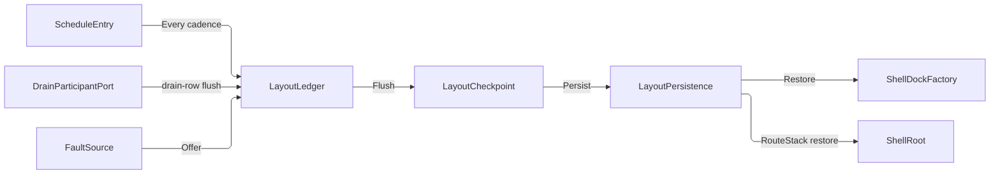

# [APPUI_SHELL_NAVIGATION]

Rasm.AppUi composes one shell: a three-case `NavRequest` union over a `RouteVerb` roster dispatches on the `ShellRoot` router capsule with two view-resolution hosts, one `ShellDockFactory` folds route-keyed `DockableRow` rows through a `RegionProgram` into the Dock model graph so dockables are screens and the topology is data, `WorkspaceRow` rows name the arrangements a mode carries, `LayoutLedger` flows layout checkpoints as content-keyed blobs through `LayoutPersistence` delegates with cadence, drain, support, telemetry, and crash-restore registrations on the AppHost ports, `ShellChrome` derives menu, toolbar, nav, status, HUD, context, and tray rows from intent keys per supplied `ConsumptionProfile`, and `AdaptiveLayout` owns the breakpoint table whose tiers select the chrome programs. The page owns the routing spine, the dock fabric with its region program, workspace, tear-out, checkpoint-cadence, external-dock-surface, and crash-restore values, chrome derivation, and adaptive layout over ReactiveUI, Dock.Avalonia, Dock.Model.ReactiveUI, Irihi.Ursa, Thinktecture vocabulary, kernel identity and capability owners, and LanguageExt result types.

## [01]-[INDEX]

- [02]-[ROUTING_SPINE]: One route union over the shell root; the verb roster carries the landing.
- [03]-[DOCK_LAYOUTS]: Region-program topology, locator rehydration, drop policy, workspaces, tear-out, checkpoint.
- [04]-[SHELL_CHROME]: Seven chrome slots over three admission rows; content resolves to control intents.
- [05]-[ADAPTIVE_LAYOUT]: One breakpoint table; the tier selects the chrome program.

## [02]-[ROUTING_SPINE]

- Owner: `NavFault` the direct generated `[Union]` with one `[FaultCase]` leaf per navigation failure; `RouteVerb` the five-row verb roster whose columns are the deep-link literal AND the landing; `NavRequest` `[Union]` the three-case navigation vocabulary with the deep-link grammar; `ShellRoot` the shell-root capsule owning `IScreen`, the router cell, and the ordinal-frozen route index.
- Cases: `NavRequest` = Route(verb) | Pop | View(viewKey); `RouteVerb` = push | replace | reset | modal | peek — the LANDING is each row's own delegate column, so the five stack-and-presenter semantics are rows and a sixth verb is one row with its landing beside it, never a new case plus two switch arms.
- Entry: `public IO<Unit> Navigate(NavRequest request)` — `IO` carries the navigation effect; an unknown route key aborts on the `Error` channel.
- Auto: `RoutedViewHost` re-resolves the view on every router transition; deep links and remote verbs enter through `Parse` with no second admission path; the transition direction is `NavRequest.Direction` — a projection of the case, so a back transition cannot play forward because a call site forgot a flag — and `ShellRoot.Direction` hands it to the `Theme/motion` `RouteCarrier.Bind` row before the stack write the transition plays.
- Packages: ReactiveUI, ReactiveUI.Avalonia, Thinktecture.Runtime.Extensions, LanguageExt.Core, Rasm (kernel), BCL inbox
- Growth: a new navigation verb is one `RouteVerb` row carrying its literal and landing; a new screen is one `ScreenCatalog` row whose route the index projects through `Freeze`; a new navigation instrument is one `InstrumentSpec` row on `ShellRoot.TelemetryRow`; a new fault is one `[FaultCase]` leaf.
- Law: the miss instrument keys on the VERB that asked, never the key it asked for — an unknown key is unbounded by construction and would mint one series per typo, while the verb answers which entry path sends traffic at routes the catalog does not carry.
- Boundary: `Freeze` projects the route index off the frozen `ScreenCatalog` roster — keys are `row.RouteKey` by construction, so an independently authored route pair is unrepresentable; `ShellRoot` is the named boundary capsule — ReactiveUI command execution awaits inside its private kernels and nowhere else; `RoutedViewHost` and `ViewModelViewHost` are the only view-resolution surfaces, and view lookup beside them is the deleted pattern; the `ViewContract` value carries `profile.HostKey` so one screen resolves a host-specific template; modal and peek land through TWO presenter columns rather than one presenter under a mode flag, because the session stack admits one modal and the canvas stack admits many peeks — a peek touches the navigation stack not at all, so it mints no back entry, while the ROUTE it names is the same key a push enters; a viewpoint recall is the third landing — `View` binds `Render/viewpoint#VIEW_REGISTRY` `ViewRegistry.Recall`, its segment IS that owner's `NamedView.LinkPrefix`, and the recall refuses on the registry's own unknown-key case because a view key is not a route key; every route resolution threads a `SurfaceKey` because `ScreenCatalogRow.Model` requires one and the state partition keys on `(ScreenId, SurfaceKey)`; viewport-scoped navigation rides the same verb grammar over `ZoomBorder.NavigateBack`/`NavigateForward`/`ClearViewHistory`, so a per-canvas back-stack is the deleted pattern; a second router beside the router cell and a region framework are the rejected forms.

```csharp
// --- [TYPES] ---------------------------------------------------------------------------

[Union(ConversionFromValue = ConversionOperatorsGeneration.None)]
public abstract partial record NavFault : Fault {
    private static readonly FaultBand FamilyBand = FaultBand.Nav;
    private NavFault(string detail) { Detail = detail; }
    public string Detail { get; }
    public override string Message => Detail;

    [FaultCase(0)]
    public sealed partial record InvalidDeepLink(string Link)        : NavFault(Link);
    [FaultCase(1)]
    public sealed partial record SchemeMismatch(string Link)         : NavFault(Link);
    [FaultCase(2)]
    public sealed partial record UnknownVerb(string Verb)            : NavFault(Verb);
    [FaultCase(3)]
    public sealed partial record UnknownRoute(string Key)            : NavFault(Key);
    [FaultCase(4)]
    public sealed partial record CheckpointRejected(string Detail)   : NavFault(Detail);
    [FaultCase(5)]
    public sealed partial record RegionProgramRejected(string Detail): NavFault(Detail);
    [FaultCase(6)]
    public sealed partial record UnknownWorkspace(string Key)        : NavFault(Key);
    [FaultCase(7)]
    public sealed partial record InstanceRejected(string Detail)     : NavFault(Detail);
}

// --- [TABLES] --------------------------------------------------------------------------

[SmartEnum<string>]
[KeyMemberEqualityComparer<ComparerAccessors.StringOrdinal, string>]
[KeyMemberComparer<ComparerAccessors.StringOrdinal, string>]
public sealed partial class RouteVerb {
    public static readonly RouteVerb Push = new("push",
        static (root, key) => root.Forward(root.Router.Navigate, "push"));
    public static readonly RouteVerb Replace = new("replace",
        static (root, key) => root.Swap("replace"));
    public static readonly RouteVerb Reset = new("reset",
        static (root, key) => root.Forward(root.Router.NavigateAndReset, "reset"));
    public static readonly RouteVerb Modal = new("modal",
        static (root, key) => root.Resolved("modal").Bind(root.PresentModal));
    public static readonly RouteVerb Peek = new("peek",
        static (root, key) => root.Resolved("peek").Bind(root.PresentPeek));

    [UseDelegateFromConstructor]
    public partial IO<Unit> Land(ShellRoot root, string routeKey);
}

[Union(ConversionFromValue = ConversionOperatorsGeneration.None)]
public abstract partial record NavRequest {
    private const string Scheme = "rasm";
    public const string PopVerb = "pop";
    public const string ViewVerb = NamedView.LinkPrefix;

    private NavRequest() { }

    public sealed record Route(RouteVerb Verb, string RouteKey) : NavRequest;

    public sealed record Pop() : NavRequest;

    public sealed record View(string ViewKey) : NavRequest;

    public string Verb => Switch(
        route: static c => c.Verb.Key,
        pop: static _ => PopVerb,
        view: static _ => ViewVerb);

    public RouteDirection Direction => Switch(
        route: static _ => RouteDirection.Forward,
        pop: static _ => RouteDirection.Back,
        view: static _ => RouteDirection.Forward);

    public static Fin<NavRequest> Parse(string deepLink) =>
        Uri.TryCreate(deepLink, UriKind.Absolute, out Uri? uri)
            ? !string.Equals(uri.Scheme, Scheme, StringComparison.OrdinalIgnoreCase)
                ? Fin.Fail<NavRequest>(new NavFault.SchemeMismatch(deepLink))
                : Segments(uri) switch {
                    [PopVerb] => Fin.Succ<NavRequest>(new Pop()),
                    [ViewVerb, var key] => Fin.Succ<NavRequest>(new View()),
                    [var verb, var key] when RouteVerb.TryGet(verb, out RouteVerb? row) => Fin.Succ<NavRequest>(new Route(row)),
                    [var verb, ..] => Fin.Fail<NavRequest>(new NavFault.UnknownVerb(verb)),
                    _ => Fin.Fail<NavRequest>(new NavFault.InvalidDeepLink(deepLink)),
                }
            : Fin.Fail<NavRequest>(new NavFault.InvalidDeepLink(deepLink));

    private static string[] Segments(Uri uri) =>
        (uri.IsAbsoluteUri && uri.Host.Length > 0
            ? new[] { uri.Host }.Concat(uri.AbsolutePath.Split('/', StringSplitOptions.RemoveEmptyEntries))
            : (uri.IsAbsoluteUri ? uri.AbsolutePath : uri.OriginalString)
                .Split('/', StringSplitOptions.RemoveEmptyEntries).AsEnumerable())
        .Select(Uri.UnescapeDataString)
        .ToArray();
}

// --- [MODELS] --------------------------------------------------------------------------

[Union(ConversionFromValue = ConversionOperatorsGeneration.None)]
public abstract partial record RouteRestoreFact {
    private RouteRestoreFact() { }
    public sealed record Resolved(string Key) : RouteRestoreFact;
    public sealed record Fell(string Key, string Fallback, NavFault Cause) : RouteRestoreFact;

    public string RouteKey => Switch(resolved: static r => r.Key, fell: static f => f.Key);
}

// --- [SERVICES] ------------------------------------------------------------------------

public sealed class ShellRoot(
    FrozenDictionary<string, Func<IScreen, SurfaceKey, IRoutableViewModel>> routes,
    Func<string, SurfaceKey> surface,
    Func<IRoutableViewModel, IO<Unit>> presentModal,
    Func<IRoutableViewModel, IO<Unit>> presentPeek,
    Func<string, IO<Unit>> recallView,
    Func<RouteDirection, Unit> direction,
    Func<InstrumentSpec, string, IO<Unit>> count) : ReactiveObject, IScreen {
    public RoutingState Router { get; } = new();

    public FrozenDictionary<string, Func<IScreen, SurfaceKey, IRoutableViewModel>> Routes { get; } = routes;

    public Func<string, SurfaceKey> Surface { get; } = surface;

    public Func<IRoutableViewModel, IO<Unit>> PresentModal { get; } = presentModal;

    public Func<IRoutableViewModel, IO<Unit>> PresentPeek { get; } = presentPeek;

    public Func<string, IO<Unit>> RecallView { get; } = recallView;

    public Func<RouteDirection, Unit> Direction { get; } = direction;

    public Func<InstrumentSpec, string, IO<Unit>> Count { get; } = count;

    public static readonly InstrumentSpec Navigated = InstrumentSpec.Create(
        "rasm.appui.nav.navigated", InstrumentKind.Count, MeasureForm.Whole, "{navigation}",
        "navigation dispatches by verb", Seq(AppUiTelemetry.VerbSlot), None, None, None);
    public static readonly InstrumentSpec RouteMiss = InstrumentSpec.Create(
        "rasm.appui.nav.route.miss", InstrumentKind.Count, MeasureForm.Whole, "{navigation}",
        "unknown-route aborts by verb", Seq(AppUiTelemetry.VerbSlot), None, None, None);

    public static TelemetryContributorPort TelemetryRow(string version) =>
        AppUiTelemetry.Contribute(version, Navigated, RouteMiss);

    public static FrozenDictionary<string, Func<IScreen, SurfaceKey, IRoutableViewModel>> Freeze(
        ScreenCatalog catalog, Func<ScreenCatalogRow, Func<IScreen, SurfaceKey, IRoutableViewModel>> make) =>
        toSeq(catalog.Rows.Values).ToFrozenDictionary(static row => row.RouteKey, make, StringComparer.Ordinal);

    public IO<Unit> Navigate(NavRequest request) =>
        Count(Navigated, request.Verb).Map(_ => Direction(request.Direction)).Bind(_ => request.Switch(
            state: this,
            route: static (root, c) => c.Verb.Land(root, c.RouteKey),
            pop: static (root, _) => root.Back(),
            view: static (root, c) => root.RecallView(c.ViewKey)));

    internal IO<Unit> Swap(string key, string verb) =>
        Resolved(verb).Map(vm => ignore(Router.NavigationStack = [.. Router.NavigationStack.SkipLast(1), vm]));

    public Fin<IRoutableViewModel> Resolve(string key, SurfaceKey surface) =>
        Routes.TryGetValue(out Func<IScreen, SurfaceKey, IRoutableViewModel>? make)
            ? Fin.Succ(make(this, surface))
            : Fin.Fail<IRoutableViewModel>(new NavFault.UnknownRoute());

    public Fin<IRoutableViewModel> Resolve(string key) => Resolve(Surface());

    public Fin<Seq<RouteRestoreFact>> Restore(Seq<string> saved, string fallback) =>
        Resolve(fallback).Bind(fallbackScreen => {
            Seq<string> requested = saved.IsEmpty ? Seq(fallback) : saved;
            Seq<(RouteRestoreFact Fact, IRoutableViewModel Screen)> resolved = requested
                .Map(key => Resolve().Match<(RouteRestoreFact, IRoutableViewModel)>(
                    Succ: screen => (new RouteRestoreFact.Resolved(), screen),
                    Fail: error => (
                        new RouteRestoreFact.Fell(fallback, error as NavFault ?? new NavFault.UnknownRoute()),
                        fallbackScreen)))
                .Strict();
            Router.NavigationStack = [.. resolved.Map(static row => row.Screen)];
            return Fin.Succ(resolved.Map(static row => row.Fact));
        });

    internal IO<IRoutableViewModel> Resolved(string key, string verb) =>
        Resolve().Match(
            Succ: IO.pure,
            Fail: error => Count(RouteMiss, verb).Bind(_ => IO.fail<IRoutableViewModel>(error)));

    internal IO<Unit> Forward(ReactiveCommand<IRoutableViewModel, IRoutableViewModel> command, string key, string verb) =>
        Resolved(verb).Bind(vm => IO.lift(async _ => { await command.Execute(vm).ConfigureAwait(true); return unit; }));

    internal IO<Unit> Back() =>
        IO.lift(async _ => { await Router.NavigateBack.Execute().ConfigureAwait(true); return unit; });
}
```

## [03]-[DOCK_LAYOUTS]

- Owner: `DockZone` the region address; `DockableRow` registration row; `RegionRow` and `RegionProgram` the layout topology as data; `PinnedPosture` the auto-hide row; `ShellDockFactory` boundary capsule over the Dock model graph; `DropVerdict` the drag-preview caption fold; `ShellPolicy` policy anchor; `WorkspaceRow` and `Workspaces` the named-workspace family; `SurfaceKey` the per-instance mint; `DocumentInstances` the template-spawn fold; `TearOut` and `WindowPlacement` the float and display-clamp surface; `LayoutCheckpoint` content-keyed blob record; `LayoutPersistence` port-delegate record; `LayoutLedger` checkpoint, restore, telemetry, and registration fold surface.
- Entry: `public static IO<Option<LayoutCheckpoint>> Flush(IClock clock, LayoutPersistence port, Atom<Option<UInt128>> last)` — `IO` carries the capture-hash-persist effect over BOTH workspace legs, the dock payload and the router route-stack; the unchanged-key skip is a `Cell.Step` transition so two racing flushes commit one persist; `public Fin<IRootDock> Build()` folds the roster through the region program; `public IO<Fin<Seq<RouteRestoreFact>>> Enter(WorkspaceRow workspace)` switches a named workspace, `public IO<Unit> Save(WorkspaceRow row)` pins the live arrangement into that workspace's own cell without leaving it, and `public IO<Fin<Seq<RouteRestoreFact>>> Reset(WorkspaceRow row)` discards the cell and re-enters from the region program.
- Auto: the cadence, drain, support, and telemetry rows register once at composition — flush fires on the `Every` cadence and again on the drain row inside `DrainBand.Interaction` at `ShellPolicy.DrainRank`, the support capture reads the latest blob, and boot restore runs once from the fault-spine probe consequence, re-materializing the dock graph and setting the router stack through `ShellRoot.Restore` in one pass; the deserialized graph rehydrates each dockable's context through the factory's own `ContextLocator`/`DockableLocator`, an unresolvable saved route key folds to the fallback row with its typed `RouteRestoreFact.Fell` cause, and every saved float rectangle clamps against the live working-area set BEFORE `InitLayout`; zero UI timers.
- Outcome: `Flush` yields `Option<LayoutCheckpoint>` — Some on a persisted blob, None on the unchanged-key skip and on a refused encode, which leaves the key cell untouched so the next tick re-attempts the same content; the checkpoint record is the restore evidence and the support artifact body; `RouteRestoreFact` rows are the per-key restore evidence; the flush and restore instruments write off those two outcomes, so a skipped flush and a declined crash offer count nothing.
- Packages: Dock.Avalonia, Dock.Model.ReactiveUI, Dock.Serializer.SystemTextJson, NodaTime, LanguageExt.Core, Rasm (kernel), Rasm.AppHost (project), BCL inbox
- Law: the four persisted carriers restore in ONE stated order and never concurrently — `LayoutCheckpoint` first, then `WindowState` (float rectangles clamp against live displays before `InitLayout` seats them), then `ScreenState` per mounted screen, then `CanvasState` per viewport. The order is causal: screen state keys on `(ScreenId, SurfaceKey)` and the surface keys do not exist until the dock graph and its float windows are seated. Collisions resolve LAST-WRITER-BY-RANK inside one carrier and NEVER across carriers; an absent partition is a first-run fact, not a fault.
- Law: SHAPE and INTEGRITY are two independent admissions on one checkpoint — the seal answers whether this build authored the parcel and `LayoutCheckpoint.Admit` whether the payload and its content key still agree, so a stored arrangement HOLDS its bytes on either refusal and the shell opens on its declared layout. Shape ordinals on the record beside a gate reading them are the deleted form: the generation belongs inside the stored bytes, where a reader cannot skip it, and the content key stays the integrity question it always was. NAMED LOSS: attribute-rename carry across a generation — a torn-out float rectangle or route key renamed under one generation reaches no reader under the next, and the residue is where that arrangement survives.
- Law: the capability ladder resolves dockable base value → `IRootDock.RootDockCapabilityPolicy` → `IDock.DockCapabilityPolicy` → `IDockable.DockCapabilityOverrides`, each present value winning — so a `DockableRow` writes the dockable's own base flags (the WEAKEST rung), a zone writes its policy, the program writes the root policy, and `DockCapabilityOverrides` stays reserved for a per-dockable exception; writing a row's answer into the overrides makes every policy above it dead code that still type-checks.
- Law: the serializer is the package's own `DockSerializer` with the source-generated `DockSystemTextJsonContext` resolver — its options carry `ReferenceHandler.Preserve` and the `$type` polymorphic resolver over `IDockable`/`IDock`/`IRootDock`/`IDockWindow`/`IDocumentTemplate`/`IToolTemplate`, so a hand-rolled `IDockSerializer` or replacement options set is the rejected form; the payload crosses the Persistence port as an opaque blob pruned to `RetainedCheckpoints` entries, wrapped in the checkpoint's own `Diagnostics/evidence#DURABLE_PARCEL` seal so both port legs move bytes under a partition key and the generation rides inside them; the dashboard-board snapshot does NOT ride this serializer — its `Instant` and LanguageExt members need the composition-bound suite wire, while the dock GRAPH blob needs `$type` polymorphism only this payload has: two blobs, two serializers, each the one its own members demand.
- Growth: a new dockable is one `DockableRow` row registered from the screen catalog; a new region address is one `DockZone` row; a new baseline layout is one `RegionProgram` value; a new workspace is one `WorkspaceRow`; a new checkpoint column is one `LayoutCheckpoint` field under one `Generation` bump on its seal; a new cadence, rank, retention, or drop-selector bound is one policy value on `ShellPolicy`; a new layout instrument is one `InstrumentSpec` row on `LayoutLedger.TelemetryRow`.
- Boundary: `ShellDockFactory` is the named boundary capsule for the statement carve-out — the Dock model graph is mutable host-owned state assembled only through `Factory` create entrypoints; `DockControl` binds `Build`'s root through `Layout` with `InitializeLayout`/`InitializeFactory` false so the factory owns initialization; the dock chrome variant resolves through the `IDockThemeManager` bound at composition off the theme-token variant subscription, `DockSurfaceWorkbenchBrush` and `DockSeparatorBrush` minting from the token emission as ordinary role slots; the dock skin carries ZERO keys of its own and inherits every light/dark decision from the base Semi dictionaries, so variant coherence is a standing obligation no structural check inside this page can see; floating hosts ride `HostWindowFactory` with `EnableManagedWindowLayer` under the `FloatingWindows` gate; rows where `ShellPolicy.ExternalSurface` holds register an AppUi-supplied `IExternalDockSurface` ADAPTER through `DockControl.RegisterExternalDockSurface` — Dock holds registered surfaces as `WeakReference` and keeps enumeration internal, so the adapter's lifetime is composition-owned (the activation scope holds it for the mount's life) and the registration rows here are the readable roster; the drop overlay rides `GlobalDockTarget` and `DockControl.ShowSelector(DockSelectorMode)`/`HideSelector()` under the `ShellPolicy.DropSelector` gate over the three-member `Documents | Tools | All` domain; dockable `Context` resolves through the same `ShellRoot.Resolve` admission as navigation, so a stale `DockableRow.RouteKey` yields the identical `NavFault.UnknownRoute` evidence — a dockable IS a screen and a second viewmodel system is the deleted pattern; RESTORE reaches that same admission through the package's own locators (`GetContext(id)`, `RestoreDockable(id)`), an off-roster id sealing the same fault and answering null so the package drops the dockable — the alternative is a structurally perfect layout of dead shells; drop legality is POLICY ROWS the package's own resolver reads (`DockGroup` + `DockGroupValidator` gate cross-group drops); pinned auto-hide rides `PinnedPosture` columns through `PreviewPinnedDockable`/`TogglePreviewPinnedDockable` so a hover peek never unpins — `PinDockable` itself TOGGLES; the drag ghost is `DragPreviewControl` bound through `ControlRecycling`, and its caption is the MANAGER's own verdict (`DockCapabilityResolver.Evaluate` beside `IDockManager.LastCapabilityEvaluation`) so a refused drop names the policy rung that refused it; the dock's own overlay stack (`OverlayHost`…`BusyOverlayControl`) stays unmounted — modal presentation has exactly two admitted owners (`Shell/dialogs#SESSION_ALGEBRA`) and the drop SELECTOR is a different mechanism that renders drag targets rather than presenting content; `IDockState.Save`/`Restore`/`Reset` is the IN-PROCESS snapshot pair a workspace switch takes while the serialized checkpoint stays the CROSS-PROCESS carrier — the same fact at two lifetimes; the checkpoint row shares the health-probe deadline bound, so a flush past it is the dispatcher-starvation signal; the drain row ranks after the screens teardown row, so the flushed layout captures post-suspension state; the support artifact reports the REDACTOR's own count through the AppHost `SupportArtifact.Produce` pair bound to the same `Redactor` every bundle column masks through, because the payload carries route keys and catalog-resolved titles; a TEAR-OUT is `FloatDockable(dockable, DockWindowOptions)` with the float host chromed by the owned window row (`Shell/hosts` `WindowRow.TearOut`) so a torn-out panel wears Dock's own `HostWindowTitleBar` and `ToolChromeRole` decides what fills the vacated band; float geometry restores CLAMPED against `SurfaceSession.Displays` and re-clamps on every `SurfaceFact.DisplayChanged`.

```csharp
// --- [TYPES] ---------------------------------------------------------------------------

[SmartEnum<string>]
[KeyMemberEqualityComparer<ComparerAccessors.StringOrdinal, string>]
public sealed partial class DockRole {
    public static readonly DockRole Document = new("document");
    public static readonly DockRole Tool = new("tool");
}

[SmartEnum<string>]
[KeyMemberEqualityComparer<ComparerAccessors.StringOrdinal, string>]
[KeyMemberComparer<ComparerAccessors.StringOrdinal, string>]
public sealed partial class DockZone {
    public static readonly DockZone Primary = new("primary", DockMode.Center, DockRole.Document, policy: null);
    public static readonly DockZone Left = new("left", DockMode.Left, DockRole.Tool, policy: null);
    public static readonly DockZone Right = new("right", DockMode.Right, DockRole.Tool, policy: null);
    public static readonly DockZone Top = new("top", DockMode.Top, DockRole.Tool, policy: null);
    public static readonly DockZone Bottom = new("bottom", DockMode.Bottom, DockRole.Tool, policy: new DockCapabilityPolicy { CanDrop = false });

    public DockMode Mode { get; }

    public DockRole Role { get; }

    public DockCapabilityPolicy? Policy { get; }

    public DockMode Sided(LocaleRow locale) =>
        MirrorSubject.DockSide.Mirrors(locale)
            ? Mode switch { DockMode.Left => DockMode.Right, DockMode.Right => DockMode.Left, var held => held }
            : Mode;
}

// --- [MODELS] --------------------------------------------------------------------------

public sealed record PinnedPosture(Alignment Alignment, PinnedDockDisplayMode Display, bool KeepVisible);

public sealed record DockableRow(
    string RouteKey,
    DockRole Role,
    DockZone Zone,
    int Rank,
    double Proportion,
    FrozenSet<DockCapability> Capabilities,
    Option<string> Group,
    Option<PinnedPosture> Pinned);

public sealed record RegionRow(DockZone Zone, Orientation Orientation, double Proportion, int Rank);

public sealed record RegionProgram(string Key, Seq<RegionRow> Rows, DockCapabilityPolicy? Policy, PinnedDockDisplayMode PinnedDisplay) {
    public static readonly RegionProgram Workbench = new(
        Key: "workbench",
        Rows: Seq(
            new RegionRow(DockZone.Left, Orientation.Horizontal, 0.20d, 0),
            new RegionRow(DockZone.Top, Orientation.Vertical, 0.18d, 1),
            new RegionRow(DockZone.Primary, Orientation.Vertical, 0.62d, 2),
            new RegionRow(DockZone.Bottom, Orientation.Vertical, 0.20d, 3),
            new RegionRow(DockZone.Right, Orientation.Horizontal, 0.20d, 4)),
        Policy: null,
        PinnedDisplay: PinnedDockDisplayMode.Overlay);

    public Fin<Seq<RegionRow>> Admit() {
        Seq<RegionRow> ordered = toSeq(Rows.OrderBy(static row => row.Rank));
        int runs = Runs(ordered);
        return (Gate(!ordered.IsEmpty, $"{Key}: empty"),
                Gate(runs <= 1, $"{Key}: vertical block split across {runs} runs"),
                Gate(ordered.Map(static row => row.Zone).Distinct().Count() == ordered.Count, $"{Key}: duplicate zone"))
            .Apply((_, _, _) => ordered).As().ToFin();
    }

    private static Validation<Error, Unit> Gate(bool holds, string detail) =>
        holds ? Validation<Error, Unit>.Success(unit) : Validation<Error, Unit>.Fail(new NavFault.RegionProgramRejected(detail));

    private static int Runs(Seq<RegionRow> ordered) =>
        ordered.Fold(
            (Count: 0, Inside: false),
            static (state, row) => row.Orientation == Orientation.Vertical
                ? (state.Inside ? state.Count : state.Count + 1, true)
                : (state.Count, false))
        .Count;
}

// --- [SERVICES] ------------------------------------------------------------------------

public sealed class ShellDockFactory(
    ShellRoot shell,
    Seq<DockableRow> rows,
    RegionProgram program,
    Func<string, string> title,
    Func<IDockThemeManager> themeManager,
    Func<LocaleRow> locale,
    Func<Error, Unit> stale) : Factory {
    private readonly Dictionary<string, Func<object?>> contexts =
        rows.Map(row => KeyValuePair.Create(row.RouteKey, Context(shell, stale, row.RouteKey))).ToDictionary(StringComparer.Ordinal);
    private readonly Dictionary<string, Func<IDockable?>> restored =
        rows.Map(row => KeyValuePair.Create<string, Func<IDockable?>>(row.RouteKey, () => null)).ToDictionary(StringComparer.Ordinal);

    public IDockThemeManager ThemeManager() => themeManager();

    public override void InitLayout(IDockable layout) {
        foreach (DockableRow row in rows) {
            restored[row.RouteKey] = () => Dockable(row).Match<IDockable?>(
                Succ: static dockable => dockable,
                Fail: error => { ignore(stale(error)); return null; });
        }

        ContextLocator = contexts;
        DockableLocator = restored;
        DefaultContextLocator = static () => null;
        base.InitLayout(layout);
    }

    private static Func<object?> Context(ShellRoot shell, Func<Error, Unit> stale, string key) => () =>
        shell.Resolve().Match<object?>(
            Succ: static vm => vm,
            Fail: error => { ignore(stale(error)); return null; });

    public Fin<IRootDock> Build() =>
        from ordered in program.Admit()
        from mounted in ordered.Traverse(region => Region(region).Map(dock => (Region: region, Dock: dock))).As()
        select Assemble(mounted.Choose(static pair => pair.Dock.Map(dock => (pair.Region, Dock: dock))));

    private Fin<Option<IDock>> Region(RegionRow region) =>
        toSeq(rows.Filter(row => row.Zone == region.Zone).OrderBy(static row => row.Rank))
            .TraverseM(Dockable).As()
            .Map(dockables => dockables.IsEmpty ? Option<IDock>.None : Some(Seat(region, dockables)));

    private Fin<IDockable> Dockable(DockableRow row) =>
        shell.Resolve(row.RouteKey).Map(context => {
            DockableBase dockable = row.Role == DockRole.Tool ? (DockableBase)CreateTool() : (DockableBase)CreateDocument();
            dockable.Id = row.RouteKey;
            dockable.Title = title(row.RouteKey);
            dockable.Context = context;
            dockable.Proportion = row.Proportion;
            dockable.Dock = row.Zone.Sided(locale());
            return (IDockable)Governed(dockable, row);
        });

    private static IDockable Governed(IDockable dockable, DockableRow row) {
        dockable.CanClose = row.Capabilities.Contains(DockCapability.Close);
        dockable.CanPin = row.Capabilities.Contains(DockCapability.Pin);
        dockable.CanFloat = row.Capabilities.Contains(DockCapability.Float);
        dockable.CanDrag = row.Capabilities.Contains(DockCapability.Drag);
        dockable.CanDrop = row.Capabilities.Contains(DockCapability.Drop);
        dockable.CanDockAsDocument = row.Capabilities.Contains(DockCapability.DockAsDocument);
        dockable.DockGroup = (string?)row.Group.Case;
        row.Pinned.Iter(posture => {
            dockable.KeepPinnedDockableVisible = posture.KeepVisible;
            dockable.PinnedDockDisplayModeOverride = posture.Display;
        });
        return dockable;
    }

    private IDock Seat(RegionRow region, Seq<IDockable> dockables) {
        IDock dock = region.Zone.Role == DockRole.Document ? CreateDocumentDock() : CreateToolDock();
        dock.Id = region.Zone.Key;
        dock.Dock = region.Zone.Sided(locale());
        dock.Proportion = region.Proportion;
        dock.DockCapabilityPolicy = region.Zone.Policy;
        dock.VisibleDockables = CreateList<IDockable>([.. dockables]);
        dock.ActiveDockable = dockables[0];
        return dock is IDocumentDock documents ? DocumentInstances.Spawnable(documents, this) : dock;
    }

    private IRootDock Assemble(Seq<(RegionRow Region, IDock Dock)> live) {
        (Seq<(RegionRow Region, IDock Dock)> vertical, Seq<(RegionRow Region, IDock Dock)> horizontal) =
            live.Partition(static pair => pair.Region.Orientation == Orientation.Vertical);
        Seq<IDockable> column = vertical.Map(static pair => (IDockable)pair.Dock);
        Option<(int Rank, IDockable Dockable)> inner = column.IsEmpty
            ? None
            : Some((vertical[0].Region.Rank, column.Count == 1 ? column[0] : (IDockable)Split(Orientation.Vertical, column)));
        Seq<(int Rank, IDockable Dockable)> band =
            horizontal.Map(static pair => (pair.Region.Rank, Dockable: (IDockable)pair.Dock)) + inner.ToSeq();
        Seq<IDockable> ordered = toSeq(band.OrderBy(static entry => entry.Rank)).Map(static entry => entry.Dockable);
        IDockable body = ordered.Count == 1 ? ordered[0] : Split(Orientation.Horizontal, ordered);
        IRootDock root = CreateRootDock();
        root.Id = program.Key;
        root.RootDockCapabilityPolicy = program.Policy;
        root.PinnedDockDisplayMode = program.PinnedDisplay;
        root.VisibleDockables = CreateList(body);
        root.ActiveDockable = body;
        return root;
    }

    private IProportionalDock Split(Orientation orientation, Seq<IDockable> parts) {
        IProportionalDock split = CreateProportionalDock();
        split.Orientation = orientation;
        split.VisibleDockables = CreateList<IDockable>(
            [.. parts.Head.ToSeq() + parts.Tail.Bind(part => Seq((IDockable)CreateProportionalDockSplitter(), part))]);
        return split;
    }
}

public static class DropVerdict {
    public const string AdmittedKey = "dock.drop.admitted";
    public const string PendingKey = "dock.drop.pending";

    public static Unit Caption(DragPreviewControl preview, IDockManager manager, Func<string, string> label) {
        preview.Status = Optional(manager.LastCapabilityEvaluation).Match(
            Some: evaluation => evaluation.EffectiveValue ? label(AdmittedKey) : evaluation.DiagnosticMessage,
            None: () => label(PendingKey));
        return unit;
    }
}
```

```csharp
// --- [CONSTANTS] -----------------------------------------------------------------------

public static class ShellPolicy {
    public const int DrainRank = 20;
    public const int RetainedCheckpoints = 4;
    public const long LayoutArtifactBytes = 262_144;
    public const double StatusDropdownExtent = 240d;
    public static readonly Duration CheckpointCadence = Duration.FromSeconds(120);

    public static bool FloatingWindows(ConsumptionProfile profile, SurfaceMount mount) =>
        mount is not SurfaceMount.Panel && profile.Surface != HostSurface.None;

    public static bool DropSelector(ConsumptionProfile profile) =>
        profile.Surface != HostSurface.None;

    public static bool ExternalSurface(ConsumptionProfile profile) =>
        profile.Surface == HostSurface.Embedded;
}

// --- [MODELS] --------------------------------------------------------------------------

public sealed record LayoutContent(string Payload, Seq<string> RouteStack);

public sealed record LayoutCheckpoint(UInt128 ContentKey, LayoutContent Content, Instant At) {
    public static readonly StateSeal Seal = StateSeal.Of("shell", "layout", generation: 2, StateResidue.Hold);

    public static Fin<LayoutCheckpoint> Admit(LayoutCheckpoint candidate) =>
        LayoutLedger.Key(candidate.Content) == candidate.ContentKey
            ? Fin.Succ(candidate)
            : Fin.Fail<LayoutCheckpoint>(new NavFault.CheckpointRejected("content-key"));
}

public sealed record LayoutPersistence(
    Func<string> Serialize,
    Func<Seq<string>> RouteStack,
    Func<LayoutCheckpoint, Fin<Seq<RouteRestoreFact>>> Restore,
    Func<LayoutCheckpoint, ArtifactPayload> Support,
    Func<string, IO<Unit>> Persist,
    Func<InstrumentSpec, Unit> Count,
    IO<Option<string>> Latest) {
    public static LayoutPersistence Bind(
        DockControl control, ShellDockFactory factory, ShellRoot shell, string fallbackRoute,
        Func<Seq<PixelRect>> displays,
        Func<LayoutCheckpoint, (ReadOnlyMemory<byte> Bytes, int Redactions)> support,
        Func<string, IO<Unit>> persist, Func<InstrumentSpec, Unit> count, IO<Option<string>> latest) {
        DockSerializer serializer = new(new DockSystemTextJsonContext());
        return new(
            Serialize: () => serializer.Serialize(control.Layout),
            RouteStack: () => toSeq(shell.Router.NavigationStack).Choose(static vm => Optional(vm.UrlPathSegment).Filter(static key => key.Length > 0)),
            Restore: checkpoint =>
                Optional(serializer.Deserialize<RootDock>(checkpoint.Content.Payload))
                    .ToFin(new NavFault.CheckpointRejected("dock-payload"))
                    .Bind(root => shell.Restore(checkpoint.Content.RouteStack, fallbackRoute).Map(facts => {
                        ignore(WindowPlacement.Clamp(root, displays()));
                        factory.InitLayout(root);
                        control.Layout = root;
                        return facts;
                    })),
            Support: support,
            Persist: persist,
            Count: count,
            Latest: latest);
    }
}

[Union(ConversionFromValue = ConversionOperatorsGeneration.None)]
public abstract partial record RestoreVerdict {
    private RestoreVerdict() { }
    public sealed record Accepted : RestoreVerdict;
    public sealed record Declined : RestoreVerdict;
}

// --- [OPERATIONS] ----------------------------------------------------------------------

public static class LayoutLedger {
    public static readonly InstrumentSpec Flushed = InstrumentSpec.Create(
        "rasm.appui.layout.flushed", InstrumentKind.Count, MeasureForm.Whole, "{flush}",
        "layout ledger flushes", Seq<string>(), None, None, None);
    public static readonly InstrumentSpec Restored = InstrumentSpec.Create(
        "rasm.appui.layout.restored", InstrumentKind.Count, MeasureForm.Whole, "{restore}",
        "layout ledger restores", Seq<string>(), None, None, None);

    public static UInt128 Key(LayoutContent content) =>
        ContentHash.Of(content, static (held, writer) => {
            ignore(writer.String(held.Payload));
            ignore(writer.Ordinal(held.RouteStack.Count));
            held.RouteStack.Iter(key => ignore(writer.String()));
        });

    public static IO<Option<LayoutCheckpoint>> Flush(IClock clock, LayoutPersistence port, Atom<Option<UInt128>> last) =>
        IO.lift(() => (Payload: port.Serialize(), Stack: port.RouteStack()))
            .Map(captured => new LayoutContent(captured.Payload, captured.Stack))
            .Map(content => new LayoutCheckpoint(Key(content), content, clock.GetCurrentInstant()))
            .Bind(next => LayoutCheckpoint.Seal.Write(next).Match(
                Succ: blob => Cell.Step(
                        last,
                        prior => prior == Some(next.ContentKey) ? Option<Option<UInt128>>.None : Some(Some(next.ContentKey)),
                        new NavFault.CheckpointRejected("layout-flush-declined")) is Transition<Option<UInt128>>.Committed
                    ? port.Persist(blob).Map(_ => (port.Count(Flushed), Some(next)).Item2)
                    : IO.pure(Option<LayoutCheckpoint>.None),
                Fail: _ => IO.pure(Option<LayoutCheckpoint>.None)));

    public static Option<LayoutCheckpoint> Offer(Seq<FaultSource> crashes, Option<LayoutCheckpoint> latest) =>
        crashes.Exists(static fault => fault is FaultSource.HostCrashMarker) ? latest : None;

    public static IO<Fin<Seq<RouteRestoreFact>>> Restore(
        LayoutPersistence port, Seq<FaultSource> crashes, Func<LayoutCheckpoint, IO<RestoreVerdict>> confirm) =>
        port.Latest.Map(Opened).Bind(latest =>
            Offer(crashes, latest) is { IsSome: true, Case: LayoutCheckpoint offered }
                ? confirm(offered).Bind(verdict => verdict is RestoreVerdict.Accepted
                    ? IO.lift(fun(() => Counted(port, port.Restore(offered))))
                    : IO.pure(Fin.Succ(Seq<RouteRestoreFact>())))
                : latest is { IsSome: true, Case: LayoutCheckpoint warm }
                    ? IO.lift(fun(() => Counted(port, port.Restore(warm))))
                    : IO.pure(Fin.Succ(Seq<RouteRestoreFact>())));

    private static Fin<Seq<RouteRestoreFact>> Counted(LayoutPersistence port, Fin<Seq<RouteRestoreFact>> outcome) =>
        outcome.Map(facts => (port.Count(Restored), facts).Item2);

    private static Option<LayoutCheckpoint> Opened(Option<string> blob) =>
        blob.Bind(static held => LayoutCheckpoint.Seal.Read<LayoutCheckpoint>(held, LayoutCheckpoint.Admit).Value);

    public static ScheduleEntry CheckpointRow(IClock clock, LayoutPersistence port, Atom<Option<UInt128>> last) =>
        new(
            Key: "shell-layout-checkpoint",
            Spec: new OccurrenceSpec.Every(ShellPolicy.CheckpointCadence),
            Deadline: DeadlineClass.HealthProbe,
            Lease: None,
            Redrive: RedrivePolicy.None,
            Work: () => Flush(clock, port, last).Map(static saved => unit));

    public static DrainParticipantPort DrainRow(IClock clock, LayoutPersistence port, Atom<Option<UInt128>> last) =>
        new(
            Name: "shell-layout-flush",
            Band: DrainBand.Interaction,
            Rank: ShellPolicy.DrainRank,
            Drain: cancel => Flush(clock, port, last).Map(static saved => unit));

    public static SupportContributorPort SupportRow(LayoutPersistence port) =>
        new(
            Package: "Rasm.AppUi",
            Rows: Seq(new SupportArtifact(
                Name: "dock-layout",
                Classification: DataClassification.Operational,
                EstimatedBytes: ShellPolicy.LayoutArtifactBytes,
                Produce: capture => port.Latest.Map(latest =>
                    Opened(latest).Map(port.Support).IfNone(ArtifactPayload.Empty)))));

    public static TelemetryContributorPort TelemetryRow(string version) =>
        AppUiTelemetry.Contribute(version, Flushed, Restored);
}
```

```csharp
// --- [MODELS] --------------------------------------------------------------------------

public sealed record WorkspaceRow(
    string Key,
    string LabelKey,
    RegionProgram Program,
    CapabilitySet<ChromeSlot> Suppressed,
    string DefaultRoute);

public static class Workspaces {
    public const string EnterVerb = "workspace.enter";
    public const string SaveVerb = "workspace.save";
    public const string ResetVerb = "workspace.reset";

    public static readonly Seq<WorkspaceRow> Rows = Seq(
        new WorkspaceRow("model", "workspace.model", RegionProgram.Workbench, CapabilitySet<ChromeSlot>.None, "model"),
        new WorkspaceRow("analysis", "workspace.analysis", RegionProgram.Workbench, CapabilitySet<ChromeSlot>.None, "analysis"),
        new WorkspaceRow("document", "workspace.document", RegionProgram.Workbench, CapabilitySet<ChromeSlot>.Of(ChromeSlot.Hud), "document"),
        new WorkspaceRow("review", "workspace.review", RegionProgram.Workbench, CapabilitySet<ChromeSlot>.Of(ChromeSlot.Nav), "review"),
        new WorkspaceRow("present", "workspace.present", RegionProgram.Workbench,
            CapabilitySet<ChromeSlot>.Of(ChromeSlot.Nav, ChromeSlot.Menu, ChromeSlot.Status, ChromeSlot.Toolbar), "present"));

    public static Fin<WorkspaceRow> Find(string key) =>
        Rows.Find(row => string.Equals(StringComparison.Ordinal))
            .ToFin(new NavFault.UnknownWorkspace());
}

public sealed record WorkspaceCell(
    Func<RegionProgram, Fin<IRootDock>> Build,
    Func<IDock> Live,
    Func<IRootDock, Unit> Seat,
    Func<string, IDockState> StateOf,
    Func<NavRequest, IO<Unit>> Navigate,
    Atom<Option<WorkspaceRow>> Current) {
    public IO<Fin<Seq<RouteRestoreFact>>> Enter(WorkspaceRow next) =>
        IO.lift(() => Current.Value.Iter(prior => StateOf(prior.Key).Save(Live())))
            .Map(_ => Build(next.Program))
            .Bind(built => built.Match(
                Succ: root => IO
                    .lift(() => { StateOf(next.Key).Restore(root); return Seat(root); })
                    .Bind(_ => Navigate(new NavRequest.Route(RouteVerb.Reset, next.DefaultRoute)))
                    .Map(_ => (
                        Current.Swap(_ => Some(next)),
                        Fin.Succ(Seq<RouteRestoreFact>(new RouteRestoreFact.Resolved(next.DefaultRoute)))).Item2),
                Fail: error => IO.pure(Fin.Fail<Seq<RouteRestoreFact>>(error))));

    public IO<Unit> Save(WorkspaceRow row) => IO.lift(() => StateOf(row.Key).Save(Live()));

    public IO<Fin<Seq<RouteRestoreFact>>> Reset(WorkspaceRow row) =>
        IO.lift(() => { StateOf(row.Key).Reset(); return unit; }).Bind(_ => Enter(row));
}

public readonly record struct SurfaceKey(string Workspace, string Route, int Instance) {
    public string Value => Instance is 0 ? $"{Workspace}/{Route}" : $"{Workspace}/{Route}#{Instance}";

    public static SurfaceKey Mint(string workspace, string route, Seq<SurfaceKey> live) =>
        new(workspace, route,
            live.Filter(key => string.Equals(key.Workspace, workspace, StringComparison.Ordinal)
                            && string.Equals(key.Route, route, StringComparison.Ordinal))
                .Fold(-1, static (best, key) => Math.Max(best, key.Instance)) + 1);
}

// --- [OPERATIONS] ----------------------------------------------------------------------

public static class DocumentInstances {
    public static IDocumentDock Spawnable(IDocumentDock dock, IDocumentDockFactory spawn) {
        dock.CanCreateDocument = true;
        dock.CreateDocument = ReactiveCommand.Create(() =>
            Optional(spawn.DocumentFactory).Iter(make => dock.AddDocument(make())));
        return dock;
    }

    public static Func<IDockable> Factory(
        ShellDockFactory factory, ShellRoot shell, IDocumentTemplate template, string workspace, string route,
        Func<string, string> title, Func<Seq<SurfaceKey>> live, Func<SurfaceKey, Unit> minted) =>
        () => {
            SurfaceKey key = SurfaceKey.Mint(workspace, route, live());
            IDocument document = factory.CreateDocument();
            document.Id = key.Value;
            document.Title = title(route);
            document.Context = shell.Resolve(route).Match<object?>(Succ: static vm => vm, Fail: _ => template.Content);
            ignore(minted());
            return document;
        };
}

[SmartEnum<string>]
[KeyMemberEqualityComparer<ComparerAccessors.StringOrdinal, string>]
public sealed partial class ToolChromeRole {
    public static readonly ToolChromeRole Frame = new("frame", owns: true);
    public static readonly ToolChromeRole Content = new("content", owns: false);

    public bool Owns { get; }
}

public static class TearOut {
    public static Func<IHostWindow?> HostFactory(ToolChromeRole chrome) => () => {
        HostWindow host = WindowRow.TearOut.Apply(new HostWindow());
        host.IsToolWindow = chrome.Owns;
        host.ToolChromeControlsWholeWindow = chrome.Owns;
        return host;
    };

    public static Unit Float(IFactory factory, IDockable dockable) {
        factory.FloatDockable(dockable, new DockWindowOptions { OwnerMode = DockWindowOwnerMode.Root, ShowInTaskbar = true });
        return unit;
    }
}

public static class WindowPlacement {
    public static Unit Clamp(IRootDock root, Seq<PixelRect> working) =>
        working.IsEmpty
            ? unit
            : toSeq(root.Windows ?? []).Fold(unit, (_, window) => Seat(window, working));

    private static Unit Seat(IDockWindow window, Seq<PixelRect> working) {
        PixelRect saved = new(
            (int)Math.Round(window.X), (int)Math.Round(window.Y),
            (int)Math.Round(Math.Max(1d, window.Width)), (int)Math.Round(Math.Max(1d, window.Height)));
        if (working.Exists(area => area.Intersects(saved))) {
            return unit;
        }
        PixelRect home = working[0];
        (window.Width, window.Height) = (Math.Min(window.Width, home.Width), Math.Min(window.Height, home.Height));
        (window.X, window.Y) = (
            home.X + Math.Max(0d, (home.Width - window.Width) / 2d),
            home.Y + Math.Max(0d, (home.Height - window.Height) / 2d));
        return unit;
    }
}
```



## [04]-[SHELL_CHROME]

- Owner: `SlotAdmission` the three-row per-surface admission vocabulary the visibility matrix realizes; `ChromeSlot` `[SmartEnum<string>]` the seven-slot chrome vocabulary realizing the kernel capability floor; `ChromeContent` `[Union]` the per-slot payload family; `BadgeMark`, `StatusZone`, `PaneKind`, `WorkPosture`, and `ProgressLocation` the slot policy vocabularies; `ChromeRow` derivation row; `ShellChrome` projection and materialization fold.
- Cases: `ChromeSlot` = menu | toolbar | nav | status | hud | context | tray; `SlotAdmission` = windowed-standalone | surfaced | standing-surface; `ChromeContent` = Entry | Pane | Chip | Items; `StatusZone` = lead | center | trail; `PaneKind` = readout | toggle | dropdown | progress; `BadgeMark` = Dot | Counted; `WorkPosture` = blocking | background; `ProgressLocation` = status-bar | toast | inline.
- Entry: `public static Seq<ChromeRow> Project(ConsumptionProfile profile, SurfaceMount mount, ChromeSlot slot, Seq<ChromeRow> rows, LocaleRow locale)` — pure projection; rows filter on slot admission and the row's own narrowing predicate, order by status zone then rank, and reverse under the mirroring law; `public static Fin<ControlIntent> Materialize(ChromeRow row, CommandDeck deck, Func<string, string> label)` — the one projection from a chrome row onto the control vocabulary.
- Packages: Avalonia, Irihi.Ursa, Thinktecture.Runtime.Extensions, LanguageExt.Core, NodaTime, UnitsNet, Rasm (kernel), BCL inbox
- Growth: a new chrome surface is one `ChromeSlot` case naming an existing or new admission row; a new entry is one `ChromeRow` naming an existing intent key; a new status readout is one `Pane` row naming an existing fact key.
- Law: the per-mount visibility matrix is THREE admission rows the seven slots reference, so the matrix is stated once and six of seven cells stop re-spelling it — a row's own `Visible` predicate narrows WITHIN an admitted slot and can never widen past it.
- Boundary: rows carry intent keys only — command mechanics, gestures, and availability live on the intent table and arrive as settled vocabulary, so menu item classes and per-surface registries are the deleted patterns; every slot's content resolves to `ControlIntent` rows through `Materialize`, so the chrome fold mints no control of its own; geometry is `Shell/solver` `ChromeProgram` rows, so no chrome surface names a panel type; the NAV is the Ursa nav-menu surface whose collapse POSTURE arrives through `BreakpointRow.Nav` on the tier-selects-program boundary, so the nav never measures a width; a nav entry's badge is the package's `Badge` with its dot, corner, and overflow columns so a count past its cap renders the package's own overflow form; a nav group's flyout re-seats the `Theme/motion` Flyout plan's origin from LIVE placement at open — one plan, every side; overflow promotion is the toolbar's own `OverflowMode` attached per child; the STATUS footer materializes only on status-admitting mounts, three zones distributing through the `SpaceBetween` flow program; where a running operation REPORTS is `ProgressLocation.Select` over expected duration and `WorkPosture` — long blocking work stays inline, long background work takes the persistent strip, brief background work announces once as a toast — and the run-queue card is the owing consumer of that policy row; the HUD is corner chips through the package's own `ProportionalCanvas` quartet, camera facts reaching chips through injected observables; readout chips bind `TypographyRole.Numeric` so a coordinate readout does not jitter on digit change; the notification inbox reaches chrome as an ORDINARY row (`ShellChrome.Activity`) badged on the center's unread projection, seated on the status trail because an inbox that disappears at the compact tier is one a user stops trusting; the CONTEXT menu derives its items from the command deck by TARGET KIND — a row's `Accepts` set is the admitted payload-kind domain; the Menu slot projects to the macOS global menu through `NativeMenu.MenuProperty` with `GetIsNativeMenuExported` as the probe, and to the managed `NativeMenuBar` elsewhere; the Tray slot materializes through the `TrayIcon.IconsProperty` attached collection; embedded mounts suppress menu, status, and nav chrome because the host owns its own chrome; window titles compose through `Title`, which `Shell/hosts` `WindowTitle` subscribes per owned window.

```csharp
// --- [TYPES] ---------------------------------------------------------------------------

[SmartEnum<string>]
[KeyMemberEqualityComparer<ComparerAccessors.StringOrdinal, string>]
public sealed partial class SlotAdmission {
    public static readonly SlotAdmission WindowedStandalone = new("windowed-standalone",
        static (p, m) => p.Surface == HostSurface.Windowed && m is SurfaceMount.Standalone);
    public static readonly SlotAdmission Surfaced = new("surfaced",
        static (p, m) => p.Surface != HostSurface.None && m is not SurfaceMount.Offscreen);
    public static readonly SlotAdmission StandingSurface = new("standing-surface",
        static (p, m) => p.Surface != HostSurface.None && m is SurfaceMount.Standalone or SurfaceMount.Companion);

    [UseDelegateFromConstructor]
    public partial bool Admits(ConsumptionProfile profile, SurfaceMount mount);
}

[SmartEnum<string>]
[KeyMemberEqualityComparer<ComparerAccessors.StringOrdinal, string>]
[KeyMemberComparer<ComparerAccessors.StringOrdinal, string>]
public sealed partial class ChromeSlot : ICapability<ChromeSlot> {
    public static readonly ChromeSlot Menu = new("menu", ChromeProgram.MenuBar, SlotAdmission.WindowedStandalone);
    public static readonly ChromeSlot Toolbar = new("toolbar", ChromeProgram.Toolbar, SlotAdmission.Surfaced);
    public static readonly ChromeSlot Nav = new("nav", ChromeProgram.NavExpanded, SlotAdmission.WindowedStandalone);
    public static readonly ChromeSlot Status = new("status", ChromeProgram.StatusBar, SlotAdmission.StandingSurface);
    public static readonly ChromeSlot Hud = new("hud", ChromeProgram.HudStack, SlotAdmission.Surfaced);
    public static readonly ChromeSlot Context = new("context", ChromeProgram.ContextItems, SlotAdmission.Surfaced);
    public static readonly ChromeSlot Tray = new("tray", ChromeProgram.Toolbar, SlotAdmission.WindowedStandalone);

    public ChromeProgram Program { get; }

    public SlotAdmission Admission { get; }

    public bool Admits(ConsumptionProfile profile, SurfaceMount mount) => Admission.Admits(profile, mount);
}

[SmartEnum<string>]
[KeyMemberEqualityComparer<ComparerAccessors.StringOrdinal, string>]
[KeyMemberComparer<ComparerAccessors.StringOrdinal, string>]
public sealed partial class StatusZone {
    public static readonly StatusZone Lead = new("lead", 0);
    public static readonly StatusZone Center = new("center", 1);
    public static readonly StatusZone Trail = new("trail", 2);

    public int Order { get; }
}

[SmartEnum<string>]
[KeyMemberEqualityComparer<ComparerAccessors.StringOrdinal, string>]
[KeyMemberComparer<ComparerAccessors.StringOrdinal, string>]
public sealed partial class PaneKind {
    public static readonly PaneKind Readout = new("readout");
    public static readonly PaneKind Toggle = new("toggle");
    public static readonly PaneKind Dropdown = new("dropdown");
    public static readonly PaneKind Progress = new("progress");
}

[SmartEnum<string>]
[KeyMemberEqualityComparer<ComparerAccessors.StringOrdinal, string>]
public sealed partial class WorkPosture {
    public static readonly WorkPosture Blocking = new("blocking");
    public static readonly WorkPosture Background = new("background");
}

[SmartEnum<string>]
[KeyMemberEqualityComparer<ComparerAccessors.StringOrdinal, string>]
[KeyMemberComparer<ComparerAccessors.StringOrdinal, string>]
public sealed partial class ProgressLocation {
    public static readonly ProgressLocation StatusBar = new("status-bar");
    public static readonly ProgressLocation Toast = new("toast");
    public static readonly ProgressLocation Inline = new("inline");

    public static readonly Duration StatusFloor = Duration.FromSeconds(2);

    public static ProgressLocation Select(Duration expected, WorkPosture posture) =>
        posture == WorkPosture.Blocking ? Inline
        : expected >= StatusFloor ? StatusBar
        : Toast;
}

// --- [MODELS] --------------------------------------------------------------------------

[Union(ConversionFromValue = ConversionOperatorsGeneration.None)]
public abstract partial record BadgeMark {
    private BadgeMark() { }
    public sealed record Dot(CornerPosition Corner) : BadgeMark;
    public sealed record Counted(CornerPosition Corner, int Overflow, string CountKey) : BadgeMark;
}

[Union(ConversionFromValue = ConversionOperatorsGeneration.None)]
public abstract partial record ChromeContent {
    private ChromeContent() { }

    public sealed record Entry(Option<IconSlot> Icon, Option<BadgeMark> Badge, Option<string> Group, OverflowMode Overflow) : ChromeContent;
    public sealed record Pane(PaneKind Kind, StatusZone Zone, string FactKey, Option<BadgeMark> Badge, Option<MeasureRole> Measure) : ChromeContent;
    public sealed record Chip(CornerPosition Corner, string FactKey) : ChromeContent;
    public sealed record Items(string TargetKind) : ChromeContent;
}

public sealed record ChromeRow(
    string IntentKey,
    ChromeSlot Slot,
    int Rank,
    Func<ConsumptionProfile, bool> Visible,
    ChromeContent Content);

// --- [OPERATIONS] ----------------------------------------------------------------------

public static class ShellChrome {
    public static Seq<ChromeRow> Project(ConsumptionProfile profile, SurfaceMount mount, ChromeSlot slot, Seq<ChromeRow> rows, LocaleRow locale) =>
        slot.Admits(profile, mount)
            ? MirrorSubject.ChromeZone.Order(
                toSeq(rows.Filter(row => row.Slot == slot && row.Visible(profile))
                    .OrderBy(static row => row.Content is ChromeContent.Pane pane ? pane.Zone.Order : 0)
                    .ThenBy(static row => row.Rank)),
                locale)
            : Seq<ChromeRow>();

    public static Fin<ControlIntent> Materialize(ChromeRow row, CommandDeck deck, Func<string, string> label) =>
        deck.Rows.TryGetValue(row.IntentKey, out CommandRow? intent)
            ? Fin.Succ(row.Content.Switch(
                state: (Row: row, Intent: intent, Deck: deck, Label: label),
                entry: static (s, content) => (ControlIntent)new ControlIntent.Button(
                    s.Row.IntentKey, s.Row.IntentKey,
                    IntentBinding.Of(PaintRole.Text) with {
                        Command = Some(s.Row.IntentKey),
                        Icon = content.Icon,
                        Hint = s.Intent.Gesture.Map(gesture => new HintRow(s.Label(s.Row.IntentKey), Some(s.Deck.Chord(gesture)))),
                    }),
                pane: static (s, content) => PaneIntent(s.Row, content),
                chip: static (s, content) => (ControlIntent)new ControlIntent.Label(
                    s.Row.IntentKey, content.FactKey, TypographyRole.Numeric, IntentBinding.Of(PaintRole.TextMuted)),
                items: static (s, content) => (ControlIntent)new ControlIntent.Menu(
                    s.Row.IntentKey, ContextRows(s.Deck, content.TargetKind, s.Label), IntentBinding.Of(PaintRole.Text))))
            : Fin.Fail<ControlIntent>(new NavFault.UnknownRoute(row.IntentKey));

    static ControlIntent PaneIntent(ChromeRow row, ChromeContent.Pane content) =>
        content.Kind.Switch(
            state: (Row: row, Content: content),
            readout: static s => (ControlIntent)new ControlIntent.Label(
                s.Row.IntentKey, s.Content.FactKey, TypographyRole.Numeric,
                IntentBinding.Of(PaintRole.TextMuted) with { ValueKey = Some(s.Content.FactKey) }),
            toggle: static s => (ControlIntent)new ControlIntent.Toggle(
                s.Row.IntentKey, s.Content.FactKey, IntentBinding.Of(PaintRole.Text) with { Command = Some(s.Row.IntentKey) }),
            dropdown: static s => (ControlIntent)new ControlIntent.Select(
                s.Row.IntentKey, SelectPosture.Closed, new OptionSource.Bound(s.Content.FactKey),
                VirtualWindowSpec.FixedRow(ShellPolicy.StatusDropdownExtent),
                IntentBinding.Of(PaintRole.Text) with { Command = Some(s.Row.IntentKey) }),
            progress: static s => (ControlIntent)new ControlIntent.Progress(
                s.Row.IntentKey, ProgressForm.Bar, None, IntentBinding.Of(PaintRole.Accent) with { ValueKey = Some(s.Content.FactKey) }));

    static Seq<MenuRow> ContextRows(CommandDeck deck, string targetKind, Func<string, string> label) =>
        toSeq(toSeq(deck.Rows.Values)
                .Filter(intent => intent.Accepts.Contains(targetKind))
                .OrderBy(intent => label(intent.Key), StringComparer.Ordinal))
            .Map(intent => new MenuRow(
                Key: intent.Key,
                LabelKey: intent.Key,
                Posture: MenuPosture.Command,
                Icon: None,
                Gesture: intent.Gesture.Map(deck.Chord),
                Command: Some(intent.Key),
                CheckedKey: None,
                Rows: Seq<MenuRow>()));

    public static Control Adorn(ChromeRow row, Control control, Func<string, Control, AvaloniaProperty, Fin<IDisposable>> bind) =>
        Adorned(row) is { Badge: var badged, Overflow: var overflow }
            ? badged.Match(
                Some: badge => badge.Switch<Control>(
                    state: (Control: control, Overflow: overflow, Bind: bind),
                    dot: static (s, mark) => {
                        ToolBar.SetOverflowMode(s.Control, s.Overflow);
                        return new Badge { Dot = true, CornerPosition = mark.Corner, Content = s.Control };
                    },
                    counted: static (s, mark) => {
                        ToolBar.SetOverflowMode(s.Control, s.Overflow);
                        Badge host = new() { Dot = false, CornerPosition = mark.Corner, OverflowCount = mark.Overflow, Content = s.Control };
                        ignore(s.Bind(mark.CountKey, host, HeaderedContentControl.HeaderProperty));
                        return host;
                    }),
                None: () => {
                    ToolBar.SetOverflowMode(control, overflow);
                    return control;
                })
            : control;

    static (Option<BadgeMark> Badge, OverflowMode Overflow)? Adorned(ChromeRow row) =>
        row.Content.Switch<(Option<BadgeMark>, OverflowMode)?>(
            entry: entry => (entry.Badge, entry.Overflow),
            pane: pane => (pane.Badge, OverflowMode.Never),
            chip: _ => null,
            items: _ => null);

    public static Func<object, Fin<string>> Readout(ChromeRow row, ResolvedLocale locale) =>
        row.Content is ChromeContent.Pane { Measure.Case: MeasureRole role }
            ? value => value is IQuantity quantity
                ? locale.Quantity(quantity, role)
                : Fin.Fail<string>(new NavFault.UnknownRoute($"{row.IntentKey}: readout is not a quantity"))
            : value => Fin.Succ(value?.ToString() ?? string.Empty);

    public static MotionOrigin Origin(PlacementMode placement) => placement switch {
        PlacementMode.Right or PlacementMode.RightEdgeAlignedTop or PlacementMode.RightEdgeAlignedBottom => MotionOrigin.Leading,
        PlacementMode.Left or PlacementMode.LeftEdgeAlignedTop or PlacementMode.LeftEdgeAlignedBottom => MotionOrigin.Trailing,
        PlacementMode.Top or PlacementMode.TopEdgeAlignedLeft or PlacementMode.TopEdgeAlignedRight => MotionOrigin.Bottom,
        PlacementMode.Center or PlacementMode.Pointer => MotionOrigin.Center,
        _ => MotionOrigin.Top,
    };

    public static readonly ChromeRow Activity =
        new(IntentKey: ActivityCenter.OpenKey,
            Slot: ChromeSlot.Status,
            Rank: 900,
            Visible: static _ => true,
            Content: new ChromeContent.Pane(
                Kind: PaneKind.Toggle,
                Zone: StatusZone.Trail,
                FactKey: nameof(ActivityCenter.Unread),
                Badge: Some<BadgeMark>(new BadgeMark.Counted(CornerPosition.TopRight, 99, nameof(ActivityCenter.Unread))),
                Measure: None));

    public static readonly ChromeRow Selection =
        new(IntentKey: SelectionSet.ListIntent,
            Slot: ChromeSlot.Status,
            Rank: 880,
            Visible: static _ => true,
            Content: new ChromeContent.Pane(
                Kind: PaneKind.Readout,
                Zone: StatusZone.Trail,
                FactKey: SelectionChannel.CountFact,
                Badge: None,
                Measure: None));

    public static string Title(string product, Option<string> active) =>
        active is { IsSome: true, Case: string current } ? $"{current} — {product}" : product;
}
```

Visibility matrix — the value source the three `SlotAdmission` rows realize; the tray's topology narrowing rides its row's `Visible` predicate:

| [INDEX] | [MOUNT]    | [TOPOLOGY] | [MENU] | [TOOLBAR] | [NAV] | [STATUS] | [HUD] | [CONTEXT] | [TRAY] | [FLOATING] |
| :-----: | :--------- | :--------- | :----: | :-------: | :---: | :------: | :---: | :-------: | :----: | :--------: |
|  [01]   | Standalone | sidecar    |   on   |    on     |  on   |    on    |  on   |    on     |   on   |    open    |
|  [02]   | Standalone | in-host    |   on   |    on     |  on   |    on    |  on   |    on     |  off   |    open    |
|  [03]   | Panel      | in-host    |  off   |    on     |  off  |   off    |  on   |    on     |  off   | suppressed |
|  [04]   | Modal      | in-host    |  off   |    on     |  off  |   off    |  on   |    on     |  off   |    open    |
|  [05]   | Companion  | in-host    |  off   |    on     |  off  |    on    |  on   |    on     |  off   |    open    |
|  [06]   | Offscreen  | any        |  off   |    off    |  off  |   off    |  off  |    off    |  off   |    open    |

## [05]-[ADAPTIVE_LAYOUT]

- Owner: `NavPosture` the nav's per-tier program election; `BreakpointRow` responsive tier row; `AdaptiveLayout` resolve fold over the ascending table and its one attachment.
- Entry: `public static BreakpointRow Resolve(BreakpointRow prior, double width, Func<InstrumentSpec, string, Unit> count)` — the widest admitted row wins, and the prior row makes the fold a transition so only a flip counts; `public static IDisposable Attach(Visual root, Atom<BreakpointRow> tier, SurfaceRuntime runtime, IScheduler ui, Func<BreakpointRow, Unit> apply)` — the one binding from a surface root's own bounds into that fold.
- Packages: Avalonia, System.Reactive, Thinktecture.Runtime.Extensions, LanguageExt.Core, Rasm (kernel), BCL inbox
- Growth: a new responsive tier is one `BreakpointRow` row carrying its nav posture; a new adaptive instrument is one `InstrumentSpec` row on `AdaptiveLayout.TelemetryRow`.
- Boundary: `AdaptiveLayout.Resolve` is the ONE responsive owner and `Attach` its only ingress, so a per-view width literal is the deleted pattern; the `Xaml.Behaviors` responsive pair is the REJECTED form structurally — each class setter carries its own min/max pair, a second breakpoint table authored in XAML beside this one, and a class setter is a LOOKUP where this fold is a TRANSITION, so it cannot express "only a flip counts"; the tier SELECTS the layout program rather than adjusting one — `BreakpointRow.Nav` names the `ChromeProgram` the nav expands into and a hidden posture names none, the counterpart law standing at `Shell/solver#LAYOUT_PRESETS` where a preset carries no width column; density-aware spacing arrives from the theme token resolve and composes orthogonally; the row keys are serializable strings, so the designed-only WebBrowser growth case consumes the same vocabulary with zero live surface.

```csharp
// --- [TABLES] --------------------------------------------------------------------------

[SmartEnum<string>]
[KeyMemberEqualityComparer<ComparerAccessors.StringOrdinal, string>]
[KeyMemberComparer<ComparerAccessors.StringOrdinal, string>]
public sealed partial class NavPosture {
    public static readonly NavPosture Hidden = new("hidden", Option<ChromeProgram>.None);
    public static readonly NavPosture Collapsed = new("collapsed", Some(ChromeProgram.NavCollapsed));
    public static readonly NavPosture Expanded = new("expanded", Some(ChromeProgram.NavExpanded));

    public Option<ChromeProgram> Program { get; }
}

[SmartEnum<string>]
[KeyMemberEqualityComparer<ComparerAccessors.StringOrdinal, string>]
[KeyMemberComparer<ComparerAccessors.StringOrdinal, string>]
public sealed partial class BreakpointRow {
    public static readonly BreakpointRow Compact = new("compact", 0d, NavPosture.Hidden);
    public static readonly BreakpointRow Medium = new("medium", 720d, NavPosture.Collapsed);
    public static readonly BreakpointRow Expanded = new("expanded", 1280d, NavPosture.Expanded);
    public static readonly BreakpointRow Ultrawide = new("ultrawide", 2560d, NavPosture.Expanded);

    public double MinWidth { get; }

    public NavPosture Nav { get; }
}

// --- [OPERATIONS] ----------------------------------------------------------------------

public static class AdaptiveLayout {
    public static readonly InstrumentSpec Breakpoint = InstrumentSpec.Create(
        "rasm.appui.layout.breakpoint", InstrumentKind.Count, MeasureForm.Whole, "{transition}",
        "responsive-tier transitions by row key", Seq(AppUiTelemetry.TierSlot), None, None, None);

    public static readonly Seq<BreakpointRow> Rows = toSeq(BreakpointRow.Items.OrderBy(static row => row.MinWidth));

    public static BreakpointRow Resolve(BreakpointRow prior, double width, Func<InstrumentSpec, string, Unit> count) =>
        Rows.Fold(Rows[0], (best, row) => row.MinWidth <= width ? row : best) switch {
            var next when next == prior => next,
            var next => (count(Breakpoint, next.Key), next).Item2,
        };

    public static IDisposable Attach(
        Visual root, Atom<BreakpointRow> tier, SurfaceRuntime runtime, IScheduler ui, Func<BreakpointRow, Unit> apply) =>
        root.GetObservable(Visual.BoundsProperty)
            .Select(static bounds => bounds.Width)
            .DistinctUntilChanged()
            .ObserveOn(ui)
            .Subscribe(width => {
                BreakpointRow next = Resolve(tier.Value, width,
                    (instrument, value) => runtime.Count(instrument, Some((AppUiTelemetry.TierSlot, value))));
                if (Cell.Step(tier, prior => prior == next ? Option<BreakpointRow>.None : Some(next),
                        new NavFault.RegionProgramRejected("breakpoint-held")) is Transition<BreakpointRow>.Committed) {
                    ignore(apply(next));
                }
            });

    public static TelemetryContributorPort TelemetryRow(string version) =>
        AppUiTelemetry.Contribute(version, Breakpoint);
}
```

## [06]-[RESEARCH]

(none)
