# [APPUI_PALETTE_BINDINGS]

The command palette and the shortcut editor are presentation over the frozen deck `Shell/commands.md` owns. This page holds the federated palette — the closed provider vocabulary, the streaming provider rows, the one merged rank fold, and the frame-stack surface — and the binding editor that lists, captures, conflict-checks, swaps, and cheat-sheets every binding off the same deck. It ranks nothing the merge does not rank, scopes nothing the query parse does not scope, and invokes nothing outside `CommandExecution.Raise`.

## [01]-[INDEX]

- [02]-[PALETTE_FEDERATION]: Scoped query, streaming provider rows, one merged rank fold, one activation.
- [03]-[PALETTE_SURFACE]: The top-anchored overlay, its frames, its action sub-panel, its argument forms.
- [04]-[BINDING_EDITOR]: Every binding listed, captured, conflict-checked, swapped, and cheat-sheeted.
- [05]-[RESEARCH]

## [02]-[PALETTE_FEDERATION]

- Owner: `PaletteKind` — the closed provider vocabulary carrying each kind's label key, activation verb, scope prefix, and scope label; `PaletteScope` — the parsed narrowing over that vocabulary; `PaletteQuery` — the parsed request both the narrowing and every provider read; `PaletteHit` — the presentation-complete ranked row; `PaletteStatus` and `PaletteSlice` — the per-provider progress carrier; `PaletteProvider` — the streaming row family; `PaletteFeed` — the merged change-set and the per-kind status map; `PaletteFederation` — the federation fold, the deck-derived command provider, the contextual-action filter, and the one activation.
- Cases: `PaletteKind` = command · document · element · route · issue; `PaletteScope` = All | Only(PaletteKind); `PaletteStatus` = Pending | Streaming | Settled | Refused.
- Law: scope narrows the federation BEFORE any provider opens, so a scoped query costs exactly the legs it names; rank ascends and the merge keeps the LOWEST-ranked row per key, so a hit two providers found collapses to its better answer rather than to whichever leg emitted last.
- Entry: `public static PaletteFeed Federate(Seq<PaletteProvider> providers, IObservable<PaletteQuery> queries, IScheduler scheduler)` — one live merged rank fold over every admitted provider row, the command provider deriving from the frozen deck through `Provider`; `public IO<DeckOutcome> Activate(PaletteHit hit, CommandDeck deck, CancellationToken cancel = default)` — the one activation every kind takes, ending at `CommandExecution.Raise`.
- Auto: each provider leg re-opens on every admitted query through `Switch`, so a superseded query's subscription tears down rather than racing its successor; a leg's slice sequence lowers through `EditDiff` into a keyed change-set, so a narrower answer REMOVES the rows it dropped; the legs merge through `MergeChangeSets` under the rank comparer, so cross-provider key collisions resolve on rank rather than on arrival; host-mutating rows bind `Execute` through the abstract `DocumentEdit.Commit` surface-host port the app root binds, so `DocumentTransaction` undo scope and redraw batching stay host-owned.
- Outcome: remote, palette, replay, and interactive invocations return the same `DeckOutcome` family.
- Packages: DynamicData, System.Reactive, Thinktecture.Runtime.Extensions, LanguageExt.Core, BCL inbox
- Growth: a new searchable domain is one `PaletteKind` row (its prefix, label, and activation verb ride the row) plus one `PaletteProvider` bound at composition — `Document/search#RANKED_WINDOW`'s `SearchPlane.Provider` is the landed exemplar; zero new surface.
- Boundary: the palette is the one federated query surface — every provider contributes typed `PaletteHit` rows into one merged rank fold, an element provider consumes element-selection outcomes under the scope-qualified split, and a provider-local result vocabulary beside `PaletteHit` is the rejected form; a provider that must run a query DRIVES it inside its own `Open`, so a leg cannot answer a window its query never filled; PROGRESS is a column of the slice rather than a second stream, because two streams would let a settled status arrive beside a stale row set; `ToObservableChangeSet` is the rejected lowering — it upserts every emitted item and removes NONE; activation is ONE fold over the kind row — a command hit invokes its own key and every other kind invokes its kind's reveal verb with the hit key as a `Single` payload, so a hit whose kind names an unbound reveal verb refuses on the same `UnknownIntent` case a bad deep link does; label normalization is the frozen index owner's (`CommandExecution.Search` folds the query once), so equivalent queries differing only by case return identical keys and rank order; the merge comparer stays a hand `IComparer<PaletteHit>` with its refusal named — `MergeChangeSets` and the realized window demand an `IComparer`, a contract the kernel `Ranked.Top` bounded-K fold does not serve.

```csharp
// --- [TYPES] ---------------------------------------------------------------------------

[SmartEnum<string>]
[KeyMemberEqualityComparer<ComparerAccessors.StringOrdinal, string>]
[KeyMemberComparer<ComparerAccessors.StringOrdinal, string>]
public sealed partial class PaletteKind {
    public const string DocumentRevealIntent = "document.reveal";
    public const string ElementRevealIntent = "element.reveal";
    public const string RouteRevealIntent = "nav.open";

    public static readonly PaletteKind Command = new("command", "palette.kind.command", None, ">", "palette.scope.commands");
    public static readonly PaletteKind Document = new("document", "palette.kind.document", Some(DocumentRevealIntent), "#", "palette.scope.documents");
    public static readonly PaletteKind Element = new("element", "palette.kind.element", Some(ElementRevealIntent), "@", "palette.scope.elements");
    public static readonly PaletteKind Route = new("route", "palette.kind.route", Some(RouteRevealIntent), "/", "palette.scope.routes");
    public static readonly PaletteKind Issue = new("issue", "palette.kind.issue", Some(BoardSurface.JumpIntent), "!", "palette.scope.issues");

    public string LabelKey { get; }

    public Option<string> Reveal { get; }

    public string Prefix { get; }

    public string ScopeLabel { get; }

    public string Intent(PaletteHit hit) => Reveal.IfNone(hit.Key);

    public CommandPayload Payload(PaletteHit hit) =>
        Reveal.IsNone ? new CommandPayload.None() : new CommandPayload.Single(hit.Key);

    public static Seq<PaletteKind> Prefixed =>
        toSeq(Items.OrderByDescending(static row => row.Prefix.Length).ThenBy(static row => row.Key, StringComparer.Ordinal));
}

[Union(ConversionFromValue = ConversionOperatorsGeneration.None)]
public abstract partial record PaletteScope {
    private PaletteScope() { }
    public sealed record All : PaletteScope;
    public sealed record Only(PaletteKind Kind) : PaletteScope;

    public bool Admits(PaletteKind kind) => Switch(
        state: kind,
        all: static (_, _) => true,
        only: static (asked, narrowed) => narrowed.Kind == asked);

    public string LabelKey => Switch(
        all: static _ => "palette.scope.all",
        only: static narrowed => narrowed.Kind.ScopeLabel);
}

// --- [MODELS] --------------------------------------------------------------------------

public readonly record struct PaletteQuery(PaletteScope Scope, string Terms) {
    public static readonly PaletteQuery Open = new(new PaletteScope.All(), string.Empty);

    public static PaletteQuery Parse(string raw) =>
        PaletteKind.Prefixed.Filter(static kind => kind.Prefix.Length > 0)
            .Find(kind => raw.StartsWith(kind.Prefix, StringComparison.Ordinal))
            .Match(
                Some: kind => new PaletteQuery(new PaletteScope.Only(kind), raw[kind.Prefix.Length..].TrimStart()),
                None: () => new PaletteQuery(new PaletteScope.All(), raw));

    public bool Admits(PaletteKind kind) => Scope.Admits(kind);
}

public sealed record PaletteHit(
    PaletteKind Kind,
    string Key,
    string Label,
    int Rank,
    Option<string> Secondary,
    Option<string> Badge,
    Option<AssetKey> Icon,
    Seq<KeyGesture> Gestures) {
    public AssetKey Glyph => Icon.IfNone(AssetDeclaration.IconPlaceholder.Asset);

    public string Group => Badge.IfNone(Kind.Key);

    public static readonly IComparer<PaletteHit> ByRank =
        Comparer<PaletteHit>.Create(static (left, right) => left.Rank != right.Rank
            ? left.Rank.CompareTo(right.Rank)
            : string.CompareOrdinal(left.Key, right.Key));
}

[Union(ConversionFromValue = ConversionOperatorsGeneration.None)]
public abstract partial record PaletteStatus {
    private PaletteStatus() { }
    public sealed record Pending : PaletteStatus;
    public sealed record Streaming : PaletteStatus;
    public sealed record Settled : PaletteStatus;
    public sealed record Refused(Error Fault) : PaletteStatus;

    public bool Working => this is Pending or Streaming;
}

public sealed record PaletteSlice(PaletteKind Kind, PaletteStatus Status, Seq<PaletteHit> Hits) {
    public static PaletteSlice Idle(PaletteKind kind) => new(kind, new PaletteStatus.Settled(), Seq<PaletteHit>());
}

public sealed record PaletteProvider(PaletteKind Kind, Func<PaletteQuery, IObservable<PaletteSlice>> Open);

public sealed record PaletteFeed(
    IObservable<IChangeSet<PaletteHit, string>> Hits,
    IObservable<HashMap<PaletteKind, PaletteStatus>> Statuses);
```

```csharp
// --- [OPERATIONS] ----------------------------------------------------------------------

public static class PaletteFederation {
    public static PaletteFeed Federate(
        Seq<PaletteProvider> providers, IObservable<PaletteQuery> queries, IScheduler scheduler) {
        Seq<IObservable<PaletteSlice>> legs = providers.Map(provider => queries
            .Select(query => query.Admits(provider.Kind) ? provider.Open(query) : Observable.Return(PaletteSlice.Idle(provider.Kind)))
            .Switch()
            .Catch<PaletteSlice, Exception>(error => Observable.Return(new PaletteSlice(
                provider.Kind,
                new PaletteStatus.Refused(Error.New(error.Message, error)),
                Seq<PaletteHit>())))
            .Replay(1)
            .RefCount());

        return new PaletteFeed(
            legs.Map(static leg => leg.Select(static slice => (IEnumerable<PaletteHit>)slice.Hits).EditDiff(static hit => hit.Key))
                .ToArray()
                .MergeChangeSets(PaletteHit.ByRank, scheduler, completable: false),
            Observable.CombineLatest(legs.Map(static leg => leg.Select(static slice => (slice.Kind, slice.Status))))
                .Select(static pairs => toHashMap(pairs.Select(static pair => (pair.Kind, pair.Status))))
                .Replay(1)
                .RefCount());
    }

    extension(PaletteHit hit) {
        public IO<DeckOutcome> Activate(CommandDeck deck, CancellationToken cancel = default) =>
            deck.Raise(hit.Kind.Intent(hit), hit.Kind.Payload(hit), cancel);
    }

    extension(CommandDeck deck) {
        public PaletteProvider Provider() =>
            new(PaletteKind.Command, query => Observable.Return(new PaletteSlice(
                PaletteKind.Command,
                new PaletteStatus.Settled(),
                deck.Search(query.Terms).Choose(found => deck.Row(found.Key).Map(row => new PaletteHit(
                    Kind: PaletteKind.Command,
                    Key: found.Key,
                    Label: deck.Composition.Label(found.Key),
                    Rank: found.Rank,
                    Secondary: deck.Composition.Overlay.Texts(row, deck.Composition.Label).Tail.Head,
                    Badge: Some(row.Scope.Key),
                    Icon: Some(AssetKey.Create(found.Key)),
                    Gestures: row.Gesture.Map(deck.Composition.Chord).ToSeq()))))));

        public Seq<CommandRow> Actions(PaletteHit hit) =>
            toSeq(deck.Rows.Values
                .Where(row => row.Acts(hit.Kind.Key) && row.Admits(deck.Composition.Snapshot()))
                .OrderBy(row => deck.Composition.Label(row.Key), StringComparer.Ordinal));
    }
}
```

## [03]-[PALETTE_SURFACE]

- Owner: `PaletteFrame` `[Union]` — the surface's frame vocabulary; `PaletteStep` `[Union]` — the one advance result; `PaletteSession` — the frame stack, the query subject, and the realized result window; `PaletteGroup` — the grouped projection a result list binds; `PaletteVerdict` — the total loading, empty, broken, and populated read over the feed; `PaletteAdvance` — the choose, drill, edit, and submit folds.
- Cases: `PaletteFrame` = Results | Actions | Arguments — a search frame, a per-hit action panel, and an inline argument form, each carrying exactly the state its own render needs.
- Law: the surface is a STACK of frames, so drilling into a hit's actions and again into a nested panel are one push each and retreat is one pop — a panel replacing the results frame would make the escape key ambiguous between "leave the panel" and "close the palette".
- Entry: `public static PaletteSession Open(CommandDeck deck, Seq<PaletteProvider> providers, VirtualWindow<PaletteHit, string> window)` — the session over one federated feed and the one shared cache it materializes; `public IO<Fin<PaletteStep>> Choose(PaletteHit hit)` and `public IO<Fin<PaletteStep>> Choose(CommandRow action, PaletteHit subject)` — one two-arm advance whose arms decide between raising a verb and pushing the frame that collects what the verb still needs; `public bool Retreat()` — pops one frame through the kernel transition and answers whether the surface stands at its root, so the caller closes the layer there alone.
- Auto: the query subject debounces on the settled interaction cadence before it reaches `Federate`, so a keystroke burst opens one leg per provider rather than one per character; the realized result set rides `Shell/virtualization`'s window over the merged change-set under the same comparer the merge resolves collisions with, so section order and row order derive from one comparison; the empty and loading states are READS of the feed's status map beside the realized count; the layer's entry and departure choreograph through `OverlayShape.Palette`'s own motion row.
- Packages: DynamicData, System.Reactive, LanguageExt.Core, Rasm (kernel `Cell`/`Transition`), Avalonia, BCL inbox
- Growth: one `PaletteFrame` case absorbs a new drill-in shape and breaks the render dispatch at compile time; a new hit column is one `PaletteHit` member every provider already fills; zero new surface.
- Boundary: the palette seats on the CANVAS stack as `Shell/dialogs#SESSION_ALGEBRA`'s `OverlayShape.Palette` row through the `DialogIntent.Layer` case, and the dialog raise site is the ONE naming of that seat; the surface owns NO ranking, NO scoping, and NO invocation — `Federate` ranks, `PaletteQuery.Parse` scopes, and `CommandExecution.Raise` invokes, so a surface-local score, filter, or command construction are the three deleted forms; a frame carries exactly what its render needs and nothing derivable — the arguments frame carries the schema it was opened with, so the frame and the submit admit against one value even if the deck re-freezes underneath a long-lived surface; a hit's action panel offers only verbs the deck's own availability admits at the moment it opens; the argument frame commits through `CommandRow.Compose`, so a partially-filled form cannot reach `Execute`; a verb with no argument schema never opens an argument frame, because `Choose` raises it in one step; shortcut assignment reaches the palette as an ordinary contextual verb (`ShortcutEditor.CaptureIntent` carries `command` in its targets), so the palette and the editor share one assignment path; the search field is the `Shell/controls#CONTROL_INTENT` `TextInput` row and every keycap, badge, and group header takes its appearance from `Theme/tokens#CONTROL_THEMES` rows, so the surface writes no paint; the session's cache and query subject dispose with the dialog teardown that raised it — the layer plane owns the bracket, so a session-local `IO.Bracket` would be a second custody over one lifetime.

```csharp
// --- [TYPES] ---------------------------------------------------------------------------

[Union(ConversionFromValue = ConversionOperatorsGeneration.None)]
public abstract partial record PaletteFrame {
    private PaletteFrame() { }

    public sealed record Results(PaletteQuery Query) : PaletteFrame;

    public sealed record Actions(PaletteHit Subject) : PaletteFrame;

    public sealed record Arguments(PaletteHit Subject, string IntentKey, FormSchema Schema, FormState State) : PaletteFrame;
}

[Union(ConversionFromValue = ConversionOperatorsGeneration.None)]
public abstract partial record PaletteStep {
    private PaletteStep() { }
    public sealed record Pushed(PaletteFrame Frame) : PaletteStep;
    public sealed record Ran(DeckOutcome Outcome) : PaletteStep;
}

public sealed record PaletteGroup(string Key, Seq<PaletteHit> Rows) {
    public int Rank => Rows.Head.Match(Some: static hit => hit.Rank, None: static () => int.MaxValue);
}

[Union(ConversionFromValue = ConversionOperatorsGeneration.None)]
public abstract partial record PaletteVerdict {
    private PaletteVerdict() { }
    public sealed record Loading : PaletteVerdict;
    public sealed record Empty : PaletteVerdict;
    public sealed record Broken(Seq<PaletteKind> Kinds) : PaletteVerdict;
    public sealed record Populated(int Count) : PaletteVerdict;
}

// --- [SERVICES] ------------------------------------------------------------------------

public sealed record PaletteSession(
    CommandDeck Deck,
    PaletteFeed Feed,
    IObservableCache<PaletteHit, string> Cache,
    BehaviorSubject<string> Raw,
    Atom<Seq<PaletteFrame>> Frames,
    VirtualWindow<PaletteHit, string> Window) : IDisposable {
    static readonly Error AtRoot = new DeckFault.PayloadRejected("palette: retreat at root");

    public static PaletteSession Open(
        CommandDeck deck, Seq<PaletteProvider> providers, VirtualWindow<PaletteHit, string> window) {
        BehaviorSubject<string> raw = new(string.Empty);
        PaletteFeed feed = PaletteFederation.Federate(
            providers,
            raw.Throttle(MotionApplication.Debounce.ToTimeSpan(), deck.Composition.Scheduler)
                .Select(PaletteQuery.Parse)
                .DistinctUntilChanged()
                .Replay(1)
                .RefCount(),
            deck.Composition.Scheduler);
        return new PaletteSession(
            deck,
            feed,
            feed.Hits.AsObservableCache(),
            raw,
            Atom(Seq<PaletteFrame>(new PaletteFrame.Results(PaletteQuery.Open))),
            window);
    }

    public PaletteFrame Top =>
        Frames.Value.Last.IfNone(() => new PaletteFrame.Results(PaletteQuery.Parse(Raw.Value)));

    public IObservable<IChangeSet<RealizedItem<PaletteHit>, string>> Realize(IObservable<ViewportRange> viewport) =>
        Window.Realize(new OrderedChangeSet<PaletteHit, string>(Cache.Connect(), Observable.Return(PaletteHit.ByRank)), viewport);

    public IObservable<Seq<PaletteGroup>> Groups =>
        Cache.Connect().ToCollection().Select(static hits => toSeq(
            toSeq(hits.Order(PaletteHit.ByRank).GroupBy(static hit => hit.Group, StringComparer.Ordinal))
                .Map(static group => new PaletteGroup(group.Key, toSeq(group)))
                .OrderBy(static section => section.Rank)
                .ThenBy(static section => section.Key, StringComparer.Ordinal)));

    public IObservable<PaletteVerdict> Verdict =>
        Feed.Statuses.CombineLatest(Cache.CountChanged.StartWith(0), static (statuses, count) => Read(statuses, count));

    public Unit Query(string raw) => ignore(fun(() => Raw.OnNext(raw))());

    public bool Retreat() =>
        Cell.Step(Frames, static stack => stack.Length > 1 ? Some(stack.Init) : None, declined: AtRoot)
            .Current.Length == 1;

    internal Fin<PaletteStep> Push(PaletteFrame frame) =>
        Cell.Step(Frames, stack => Some(stack.Add(frame)), declined: AtRoot) switch {
            Transition<Seq<PaletteFrame>>.Refused refused => Fin.Fail<PaletteStep>(refused.Cause),
            _ => Fin.Succ((PaletteStep)new PaletteStep.Pushed(frame)),
        };

    public void Dispose() {
        Cache.Dispose();
        Raw.Dispose();
    }

    static PaletteVerdict Read(HashMap<PaletteKind, PaletteStatus> statuses, int count) =>
        count > 0 ? new PaletteVerdict.Populated(count)
        : toSeq(statuses.Values).Exists(static status => status.Working) ? new PaletteVerdict.Loading()
        : toSeq(statuses).Filter(static entry => entry.Value is PaletteStatus.Refused).Map(static entry => entry.Key) switch {
            { IsEmpty: false } broken => new PaletteVerdict.Broken(broken),
            _ => new PaletteVerdict.Empty(),
        };
}

// --- [OPERATIONS] ----------------------------------------------------------------------

public static class PaletteAdvance {
    extension(PaletteSession session) {
        public IO<Fin<PaletteStep>> Choose(PaletteHit hit) =>
            session.Deck.Row(hit.Kind.Intent(hit)).Match(
                Some: row => session.Advance(row, hit, hit.Kind.Payload(hit)),
                None: () => IO.pure(Fin.Fail<PaletteStep>(new DeckFault.UnknownIntent(hit.Kind.Intent(hit)))));

        public IO<Fin<PaletteStep>> Choose(CommandRow action, PaletteHit subject) =>
            session.Advance(action, subject,
                action.Accepts.Contains("single") ? new CommandPayload.Single(subject.Key) : new CommandPayload.None());

        internal IO<Fin<PaletteStep>> Advance(CommandRow row, PaletteHit subject, CommandPayload payload) =>
            row.Arguments.Match(
                Some: schema => IO.pure(session.Push(new PaletteFrame.Arguments(subject, row.Key, schema, FormState.Empty))),
                None: () => session.Deck.Raise(row.Key, payload).Map(static outcome => Fin.Succ((PaletteStep)new PaletteStep.Ran(outcome))));

        public IO<Fin<PaletteStep>> Drill(PaletteHit hit) =>
            IO.pure(session.Push(new PaletteFrame.Actions(hit)));

        public Fin<PaletteFrame.Arguments> Edit(PaletteFrame.Arguments frame, string field, JsonElement value) =>
            frame.Schema.With(frame.State, field, value).ToFin()
                .Map(next => frame with { State = next.Next });

        public IO<Fin<PaletteStep>> Submit(PaletteFrame.Arguments frame) =>
            session.Deck.Row(frame.IntentKey)
                .ToFin(Fail: new DeckFault.UnknownIntent(frame.IntentKey))
                .Bind(row => row.Compose(frame.State))
                .Match(
                    Succ: payload => session.Deck.Raise(frame.IntentKey, payload)
                        .Map(static outcome => Fin.Succ((PaletteStep)new PaletteStep.Ran(outcome))),
                    Fail: fault => IO.pure(Fin.Fail<PaletteStep>(fault)));

        public ControlIntent Fields(PaletteFrame.Arguments frame) =>
            frame.Schema.Layout($"palette-args:{frame.IntentKey}", frame.State);
    }
}
```

The presentation columns are a projection of the hit shape, so a result row renders without reaching past the fold that produced it:

| [INDEX] | [ROW_ZONE]  | [SOURCE_COLUMN]        | [THEME_ROW]     | [ABSENT_MEANS]                                     |
| :-----: | :---------- | :--------------------- | :-------------- | :------------------------------------------------- |
|  [01]   | glyph       | `PaletteHit.Glyph`     | palette row     | the catalogue placeholder; never a blank slot      |
|  [02]   | label       | `PaletteHit.Label`     | palette row     | unreachable — the fold refuses an unlabelled row   |
|  [03]   | secondary   | `PaletteHit.Secondary` | palette row     | the row renders one line and claims no context     |
|  [04]   | badge       | `PaletteHit.Badge`     | palette badge   | the kind badge alone; attribution never disappears |
|  [05]   | keycaps     | `PaletteHit.Gestures`  | keycap          | the verb carries no chord on this surface          |
|  [06]   | group head  | `PaletteHit.Group`     | palette row     | unreachable — the projection is total              |
|  [07]   | footer hint | `PaletteVerdict`       | palette overlay | unreachable — the verdict is total over the feed   |

## [04]-[BINDING_EDITOR]

- Owner: `ShortcutRow` — the per-command editor row carrying its binding, its source, and its live claimants; `BindingSource` — the user-versus-default column; `ShortcutProbe` `[Union]` — the one search request over text or a captured chord; `ShortcutEditor` — the projection, assignment, and set-swap fold over the frozen deck and the active overlay; `KeycapCell` — the capture boundary capsule over the shipped chord-capture control.
- Cases: `ShortcutProbe` = Text | Chord; `BindingSource` = default | user | unbound.
- Law: a user binding is an OVERLAY row folded ahead of the freeze, never an edit of the authored table — the authored gesture stays data a reset restores, a whole keymap swaps by naming one set, and the conflict oracle, the binding table, the palette index, and the cheat sheet all read one deck.
- Entry: `public Seq<ShortcutRow> Rows()` — every command the deck admits, bound and unbound alike; `public Seq<ShortcutRow> Find(ShortcutProbe probe)` — one polymorphic search over command text or a captured keystroke; `public Fin<BindingOverlay> Assign(string key, KeyGesture gesture)` — conflict-checked against the row's own scope through `CommandDeck.Claimants`; `public Fin<BindingOverlay> Unbind(string key)` and `public BindingOverlay Reset(string key)`; `public Fin<ShortcutPolicy> Swap(string setKey)`; `public Seq<(CommandScope Scope, Seq<ShortcutRow> Rows)> Sheet()`; `public CommandRow Verb(Func<ShortcutPolicy, IO<Unit>> commit)` — the `shortcuts.capture` table row the shortcut screen's chord chips and a command hit's action panel both raise.
- Auto: the editor holds no key table — `Rows` projects the frozen deck, `Claimants` answers every conflict question, and the composition's chord transform is the deck's own, so an assignment is checked against exactly the chord the surface will bind; an assignment that would contest an existing claim refuses BEFORE the overlay changes; a captured chord searches by exact `KeyGesture` value equality, so "what owns this keystroke" and "what will fire" are one question; the chord grammar has ONE admission — `Chord(text)` — the capture fold and the live field rule both read, so a spelling one admits and the other refuses is unspellable.
- Packages: Irihi.Ursa, Avalonia, Thinktecture.Runtime.Extensions, LanguageExt.Core, BCL inbox
- Growth: a new keymap is one `BindingOverlay` row on the persisted policy; a new editor column is one `ShortcutRow` member derived from the deck; zero new surface.
- Boundary: the editor seats on the CANVAS stack as `Shell/dialogs#SESSION_ALGEBRA`'s `OverlayShape.Editor` row through the `DialogIntent.Layer` case; `Ursa.Controls.KeyGestureInput` is the ONE capture surface and a page-local boundary capsule, because a recording affordance whose value is a chord is not a screen field the control fold materializes; assignment reaches the table as ONE row — `CaptureIntent` carries `command` in its targets and a two-field argument schema, so the screen's chord chip, the palette's action panel, and a remote caller collect the same `intent` and `gesture` fields and end at the same `Capture` fold, which accumulates BOTH field refusals through `Validation` before the claimant read runs; the chord crosses that schema as its parse-round-trip text because the capture cell RECORDS a value the palette's field TYPES and only one spelling can serve both; conflict evidence is `CommandDeck.Claimants`, so this surface mints no second conflict fold; the cheat sheet groups by `CommandScope` because the scope IS the attach owner the binding table narrows to; the persisted section is `ShortcutPolicy` on the options monitor, so a rejected write keeps prior bindings live as `ReloadOutcome.Rejected` and cross-process propagation rides the same op-log cursor; `KeycapCell.Mount` and `Find` are this page's producers for the shortcut screen's chord chips and search box (`Shell/screens#SETTINGS_SURFACE`) — the screen binds them or they have no consumer.

```csharp
// --- [TYPES] ---------------------------------------------------------------------------

[SmartEnum<string>]
[KeyMemberEqualityComparer<ComparerAccessors.StringOrdinal, string>]
[KeyMemberComparer<ComparerAccessors.StringOrdinal, string>]
public sealed partial class BindingSource {
    public static readonly BindingSource Default = new("default");
    public static readonly BindingSource User = new("user");
    public static readonly BindingSource Unbound = new("unbound");
}

[Union(ConversionFromValue = ConversionOperatorsGeneration.None)]
public abstract partial record ShortcutProbe {
    private ShortcutProbe() { }
    public sealed record Text(string Terms) : ShortcutProbe;
    public sealed record Chord(KeyGesture Gesture) : ShortcutProbe;
}

// --- [MODELS] --------------------------------------------------------------------------

public sealed record ShortcutRow(
    string Key,
    string Label,
    CommandScope Scope,
    Option<KeyGesture> Gesture,
    BindingSource Source,
    Seq<string> Contested) {
    public bool Conflicted => !Contested.IsEmpty;
}

// --- [SERVICES] ------------------------------------------------------------------------

public sealed record ShortcutEditor(CommandDeck Deck, ShortcutPolicy Policy) {
    public const string CaptureIntent = "shortcuts.capture";
    public const string SubjectField = "intent";
    public const string GestureField = "gesture";

    public BindingOverlay Overlay => Policy.Active;

    public static Option<FormSchema> Schema =>
        FormSchema.Create(
            CaptureIntent, CaptureIntent, CaptureIntent, FormGeometry.Inline,
            Seq(FormField.Of(SubjectField, "shortcuts.field.intent",
                    new ControlIntent.TextInput(SubjectField, "shortcuts.watermark.intent", Multiline: false,
                        IntentBinding.Of(PaintRole.Text)),
                    FieldEntry.Words, static _ => Validation<Error, Unit>.Success(unit)),
                FormField.Of(GestureField, "shortcuts.field.gesture",
                    new ControlIntent.TextInput(GestureField, "shortcuts.watermark.gesture", Multiline: false,
                        IntentBinding.Of(PaintRole.Text)),
                    FieldEntry.Words, Parses)),
            Seq(FormSection.Of(CaptureIntent, "shortcuts.section.capture", Seq(SubjectField, GestureField))))
            .ToOption();

    public CommandRow Verb(Func<ShortcutPolicy, IO<Unit>> commit) =>
        new FamilyRow(CaptureIntent, CommandScope.Global, RowShape.Fielded, Arguments: Schema).Mint(
            (payload, _) => payload is CommandPayload.Fields collected
                ? Capture(collected).Match(
                    Succ: next => commit(next),
                    Fail: static error => IO.fail<Unit>(error))
                : IO.fail<Unit>(new DeckFault.PayloadRejected($"{CaptureIntent}: field payload absent"))) with {
            Targets = new[] { PaletteKind.Command.Key }.ToFrozenSet(StringComparer.Ordinal),
        };

    public Fin<ShortcutPolicy> Capture(CommandPayload.Fields collected) =>
        (Field(collected, SubjectField), Field(collected, GestureField).Bind(Chord))
            .Apply(static (key, chord) => (Key: key, Chord: chord)).As().ToFin()
            .Bind(pair => Assign(pair.Key, pair.Chord))
            .Map(Commit);

    static Validation<Error, string> Field(CommandPayload.Fields collected, string field) =>
        collected.Values.Find(field)
            .Bind(static value => Optional(value.GetString()))
            .Filter(static value => value.Length > 0)
            .Match(
                Some: Validation<Error, string>.Success,
                None: () => Validation<Error, string>.Fail(new DeckFault.PayloadRejected($"shortcut/capture: {field} absent")));

    static Validation<Error, KeyGesture> Chord(string text) =>
        KeyGesture.TryParse(text, out KeyGesture? chord) && chord is not null
            ? Validation<Error, KeyGesture>.Success(chord)
            : Validation<Error, KeyGesture>.Fail(new DeckFault.PayloadRejected($"shortcut/capture: {text} is not a chord"));

    static Validation<Error, Unit> Parses(FormState state) =>
        state.Values.Find(GestureField).Bind(static value => value.Uniform).Bind(static value => Optional(value.GetString())).Match(
            Some: text => Chord(text).Map(static _ => unit),
            None: static () => Validation<Error, Unit>.Success(unit));

    public Seq<ShortcutRow> Rows() =>
        toSeq(Deck.Rows.Values
            .Select(Row)
            .OrderBy(static row => row.Scope.Key, StringComparer.Ordinal)
            .ThenBy(static row => row.Label, StringComparer.Ordinal));

    public Seq<ShortcutRow> Find(ShortcutProbe probe) => probe.Switch(
        text: found => Deck.Search(found.Terms).Choose(hit => Deck.Row(hit.Key)).Map(Row),
        chord: found => toSeq(Deck.Rows.Values)
            .Filter(row => row.Gesture.Map(Deck.Composition.Chord).Filter(bound => bound.Equals(found.Gesture)).IsSome)
            .Map(Row));

    public Fin<BindingOverlay> Assign(string key, KeyGesture gesture) =>
        Deck.Row(key)
            .ToFin(Fail: new DeckFault.UnknownIntent(key))
            .Bind(row => Deck.Claimants(row.Scope, Deck.Composition.Chord(gesture)).Filter(claimant => claimant != key) switch {
                { IsEmpty: true } => Fin.Succ(Overlay.With(key, Some(gesture))),
                var held => Fin.Fail<BindingOverlay>(new DeckFault.GestureConflict(
                    new GestureContest(row.Scope, Deck.Composition.Chord(gesture).ToString(), held))),
            });

    public Fin<BindingOverlay> Unbind(string key) =>
        Deck.Rows.ContainsKey(key)
            ? Fin.Succ(Overlay.With(key, None))
            : Fin.Fail<BindingOverlay>(new DeckFault.UnknownIntent(key));

    public BindingOverlay Reset(string key) => Overlay.Without();

    public ShortcutPolicy Commit(BindingOverlay overlay) =>
        Policy with { Sets = Policy.Sets.Map(row => row.SetKey == overlay.SetKey ? overlay : row) };

    public Validation<Error, SettingsRow> Settings(
        Func<HashMap<string, SettingScope>> scopes,
        Func<ShortcutPolicy, IO<ReloadOutcome>> commit,
        double pickerExtent) =>
        SetSchema(Policy.Sets.Map(static row => row.SetKey), pickerExtent).Map(schema => new SettingsRow(
            Section: ShortcutPolicy.Section,
            LabelKey: $"{ShortcutPolicy.Section}.title",
            Schema: schema,
            Read: () => State(Policy.ActiveSet),
            Scopes: scopes,
            Defaults: State(ShortcutPolicy.Default.ActiveSet),
            Apply: state => Swap(Read(state).IfNone(Policy.ActiveSet)).Match(
                Succ: commit,
                Fail: error => IO.pure<ReloadOutcome>(
                    new ReloadOutcome.Rejected(ShortcutPolicy.Section,
                        new ConfigError.BindRejected(ShortcutPolicy.Section, error))))));

    static Validation<Error, FormSchema> SetSchema(Seq<string> sets, double pickerExtent) =>
        FormSchema.Create(
            ShortcutPolicy.Section, ShortcutPolicy.Section, ShortcutPolicy.Section, FormGeometry.Inline,
            Seq(FormField.Of(nameof(ShortcutPolicy.ActiveSet), $"{ShortcutPolicy.Section}.set",
                new ControlIntent.Select(nameof(ShortcutPolicy.ActiveSet), SelectPosture.Closed,
                    new OptionSource.Inline(sets.Map(static set => new OptionRow(set, $"shortcuts.set.{set}", None, None))),
                    VirtualWindowSpec.FixedRow(pickerExtent), IntentBinding.Of(PaintRole.Text)),
                FieldEntry.Choice, static _ => Validation<Error, Unit>.Success(unit))),
            Seq(FormSection.Of(ShortcutPolicy.Section, $"{ShortcutPolicy.Section}.title",
                Seq(nameof(ShortcutPolicy.ActiveSet)))));

    static FormState State(string activeSet) =>
        FormState.Empty.Seat(nameof(ShortcutPolicy.ActiveSet),
            FieldValue.Of(JsonSerializer.SerializeToElement(activeSet), ValueOrigin.Declared));

    static Option<string> Read(FormState state) =>
        state.Values.Find(nameof(ShortcutPolicy.ActiveSet))
            .Bind(static value => value.Uniform)
            .Bind(static value => Optional(value.GetString()))
            .Filter(static value => value.Length > 0);

    public Fin<ShortcutPolicy> Swap(string setKey) =>
        Policy.Sets.Exists(row => string.Equals(row.SetKey, setKey, StringComparison.Ordinal))
            ? Fin.Succ(Policy with { ActiveSet = setKey })
            : Fin.Fail<ShortcutPolicy>(new DeckFault.UnknownSet(setKey));

    public Seq<(CommandScope Scope, Seq<ShortcutRow> Rows)> Sheet() =>
        toSeq(toSeq(Rows().Filter(static row => row.Gesture.IsSome).GroupBy(static row => row.Scope))
            .Map(static group => (group.Key, toSeq(group)))
            .OrderBy(static section => section.Key.Key, StringComparer.Ordinal));

    ShortcutRow Row(CommandRow row) =>
        new(row.Key,
            Deck.Composition.Label(row.Key),
            row.Scope,
            row.Gesture.Map(Deck.Composition.Chord),
            row.Gesture.IsNone ? BindingSource.Unbound : Overlay.Rebound(row.Key) ? BindingSource.User : BindingSource.Default,
            row.Gesture.Map(Deck.Composition.Chord).Match(
                Some: gesture => Deck.Claimants(row.Scope, gesture).Filter(claimant => claimant != row.Key),
                None: static () => Seq<string>()));
}
```

```csharp
// --- [BOUNDARIES] ----------------------------------------------------------------------

public static class KeycapCell {
    static readonly FrozenSet<Key> Modifiers = new[] {
        Key.LeftShift, Key.RightShift, Key.LeftCtrl, Key.RightCtrl,
        Key.LeftAlt, Key.RightAlt, Key.LWin, Key.RWin,
    }.ToFrozenSet();

    public static KeyGestureInput Mount(Action<Fin<KeyGesture>> captured) {
        KeyGestureInput cell = new() { ConsiderKeyModifiers = true };
        ignore(cell.GetObservable(KeyGestureInput.GestureProperty)
            .Subscribe(gesture => captured(Admit(Optional(gesture)))));
        return cell;
    }

    public static Fin<KeyGesture> Admit(Option<KeyGesture> captured) =>
        captured.ToFin(Fail: new DeckFault.PayloadRejected("shortcut/capture: no chord recorded"))
            .Bind(static gesture => Modifiers.Contains(gesture.Key)
                ? Fin.Fail<KeyGesture>(new DeckFault.PayloadRejected($"shortcut/capture: {gesture.Key} is a modifier, not a chord"))
                : Fin.Succ(gesture));

    public static Unit Clear(KeyGestureInput cell) => ignore(fun(cell.Clear)());
}
```



```mermaid
---
config:
  layout: elk
  flowchart:
    curve: linear
    padding: 25
---
flowchart LR
    accTitle: Query scoping, provider federation, and the one invocation spine
    accDescr: A raw palette query parsed into a scope and terms, the scope narrowing which provider legs open, each leg lowering its slices into a keyed change-set merged under the rank comparer, the surface frames drilling from results into actions into an argument form, and every path ending on the one deck raise that returns a command outcome.
    RawQuery --> PaletteQuery
    PaletteQuery -->|scope narrows| PaletteProvider
    PaletteProvider --> PaletteSlice
    PaletteSlice -->|EditDiff| ProviderChangeSet["keyed change-set"]
    ProviderChangeSet -->|MergeChangeSets ByRank| PaletteFeed
    PaletteFeed --> PaletteSession
    PaletteSession --> PaletteFrame
    PaletteFrame -->|Results| PaletteHit
    PaletteFrame -->|Actions| CommandRow
    PaletteFrame -->|Arguments| FormSchema
    FormSchema -->|Compose| CommandPayload
    PaletteHit -->|Activate| DeckRaise["CommandExecution.Raise"]
    CommandRow --> DeckRaise
    CommandPayload --> DeckRaise
    CommandInvocationWire --> DeckRaise
    DeckRaise --> DeckOutcome
    DeckOutcome --> AppUiFactCommand["AppUiFact.Command"]
    AppUiFactCommand --> HookSet
    ShortcutEditor -->|Assign| Claimants["CommandDeck.Claimants"]
    Claimants --> BindingOverlay
    BindingOverlay -->|folded ahead of freeze| CommandDeck
```

## [05]-[RESEARCH]

(none)
