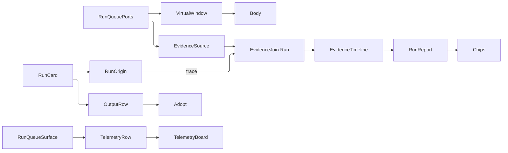

# [APPUI_SHELL_QUEUE]

Rasm.AppUi's run queue is the job/run/step surface over the settled screen kernel: cards realize through the one `VirtualWindow` fabric, every status is a row on one vocabulary whose verb, severity, and terminality travel together, retry consults the kernel `Retriability` the fault itself published, the per-run evidence report is a projection of `Diagnostics/evidence`'s correlation join, and sealed outputs hand off by raising the analysis plane's own adoption verb. The page composes `ScreenProgram`/`ProductScreen`/`SlotKey<T>` from `Shell/screens.md` and the `Severity` family from `Theme/tokens.md`.

## [01]-[INDEX]

- [02]-[WORK_AXES]: Status, verb, direction, and redrive vocabularies — one row per fact, derived columns deleted.
- [03]-[QUEUE_MODELS]: Cards, steps, outputs, origins, and the bound port arrows.
- [04]-[QUEUE_REPORT]: The severity-first evidence report and its count chips.
- [05]-[QUEUE_SURFACE]: The body fold, the seated program with its bounded drill-down, and the queue instruments.

## [02]-[WORK_AXES]

- Owner: `QueueVerb` the per-status action column; `WorkStatus` the status vocabulary; `TransferLeg` with `RunDirection` the transfer capability axis; `RedriveMark` the attempt-of-bound fact a retrying card renders.
- Cases: `WorkStatus` = queued | running | retrying | blocked | succeeded | cancelled | failed; `QueueVerb` = none | cancel | retry; `RunDirection` = inbound | outbound | duplex over the `TransferLeg` set {sent, received}.
- Packages: LanguageExt.Core, Thinktecture.Runtime.Extensions, Rasm (kernel `CapabilitySet`, `Severity` via `Theme/tokens`)
- Growth: a new status is one `WorkStatus` row carrying its severity and verb — terminality DERIVES; a new transfer shape is one `RunDirection` row over the existing leg set; zero new surface.
- Boundary: THREE PLANES and no roll-up fold — a job is the verb an operator raised, a run one attempt at it, a step one unit inside that attempt — held structurally by the three separate status columns (`RunCard.Job`, `RunCard.Run`, `StepRow.Status`), so a transiently failing step under an eventually succeeding run never wears the run's failure; a maximum-severity roll-up would produce both errors at once. The card's ONE action button carries whichever verb the status row names, so cancel and retry are the same affordance at two moments and a card can never offer both; a status with no verb renders no button rather than a disabled one. `Terminal` is `Verb != Cancel` BY DERIVATION — every non-terminal row offers cancel and no terminal row does — so a stored terminality column was a second spelling of the verb and is deleted. Severity is the folder's ONE ranked family (`Theme/tokens` `Severity`); a queue-local ladder was the local fork RULINGS `[02]:73` names. A bidirectional transfer is ONE card discriminating on the direction row's LEG SET, not two cards: the legs decide which counters read and which captions the strip spells, and the closed three-row roster is what keeps the empty leg set unrepresentable.

```csharp
// --- [TYPES] ---------------------------------------------------------------------------

[SmartEnum<string>]
[KeyMemberEqualityComparer<ComparerAccessors.StringOrdinal, string>]
[KeyMemberComparer<ComparerAccessors.StringOrdinal, string>]
public sealed partial class QueueVerb {
    public static readonly QueueVerb None = new("none", Option<string>.None, ControlEmphasis.Quiet);
    public static readonly QueueVerb Cancel = new("cancel", Some(RunQueueSurface.CancelIntent), ControlEmphasis.Danger);
    public static readonly QueueVerb Retry = new("retry", Some(RunQueueSurface.RetryIntent), ControlEmphasis.Secondary);

    public Option<string> Intent { get; }

    public ControlEmphasis Emphasis { get; }
}

[SmartEnum<string>]
[KeyMemberEqualityComparer<ComparerAccessors.StringOrdinal, string>]
[KeyMemberComparer<ComparerAccessors.StringOrdinal, string>]
public sealed partial class WorkStatus {
    public static readonly WorkStatus Queued = new("queued", Severity.Info, QueueVerb.Cancel);
    public static readonly WorkStatus Running = new("running", Severity.Info, QueueVerb.Cancel);
    public static readonly WorkStatus Retrying = new("retrying", Severity.Warning, QueueVerb.Cancel);
    public static readonly WorkStatus Blocked = new("blocked", Severity.Warning, QueueVerb.Cancel);
    public static readonly WorkStatus Succeeded = new("succeeded", Severity.Info, QueueVerb.None);
    public static readonly WorkStatus Cancelled = new("cancelled", Severity.Warning, QueueVerb.Retry);
    public static readonly WorkStatus Failed = new("failed", Severity.Critical, QueueVerb.Retry);

    public Severity Severity { get; }

    public QueueVerb Verb { get; }

    public bool Terminal => !QueueVerb.Cancel.Equals(Verb);

    public string Badge => LocaleStrings.Key(nameof(WorkStatus), Key);
}

[SmartEnum<string>]
public sealed partial class TransferLeg {
    public static readonly TransferLeg Sent = new("sent");
    public static readonly TransferLeg Received = new("received");
}

[SmartEnum<string>]
[KeyMemberEqualityComparer<ComparerAccessors.StringOrdinal, string>]
[KeyMemberComparer<ComparerAccessors.StringOrdinal, string>]
public sealed partial class RunDirection {
    public static readonly RunDirection Inbound = new("inbound", CapabilitySet<TransferLeg>.Of(TransferLeg.Received));
    public static readonly RunDirection Outbound = new("outbound", CapabilitySet<TransferLeg>.Of(TransferLeg.Sent));
    public static readonly RunDirection Duplex = new("duplex", CapabilitySet<TransferLeg>.Of(TransferLeg.Sent, TransferLeg.Received));

    public CapabilitySet<TransferLeg> Legs { get; }
}

public readonly record struct RedriveMark(int Attempt, int Bound);
```

## [03]-[QUEUE_MODELS]

- Owner: `FanOut` the counter triple; `StateStrip` the appended fact strip; `OutputState` with `OutputRow` the sealed-artifact row; `StepRow` and `RunCard` the two row shapes; `RunOrigin` the join-key union; `RunQueuePorts` the bound arrows; `QueueKey` and `QueueEntry` the windowed ordinal space; `RunReportRow` and `ReportChip` the report rows.
- Entry: `public IO<Fin<Option<EvidenceTimeline>>> Timeline(EvidenceSource source)` on `RunOrigin` — the one drill-down read both arms answer.
- Packages: LanguageExt.Core, NodaTime, Thinktecture.Runtime.Extensions, DynamicData, System.Reactive, Rasm (kernel `Retriability`, `Expected`), BCL inbox
- Growth: a new queueing route is one `RunOrigin` arm answering the drill-down read; a new card fact is one `StateStrip`; a new artifact disposition is one `OutputState` case; zero new surface.
- Boundary: state arrives as APPENDED strips so a card never changes size class mid-run — a card that grows on its first warning re-flows every card beneath it and moves the button the operator was reaching for. `OutputState` makes the illegal artifact composite unspellable: a draft carries no adoption verb slot at all, so "unsealed but adoptable" cannot be constructed and the old `(bool Sealed, Option Adopt)` pair's refused corner is gone. `RunCard.Fault` carries the run's own typed refusal so the retry gate reads the `Retriability` the fault PUBLISHED, and `Redrive` carries the producer's attempt-of-bound. The report READS the correlation join and mints no evidence — both origin arms carry the run-creation `ActivityTraceId` and pass it directly to `EvidenceJoin.Run`, while `CorrelationId` remains the queue's DynamicData identity. The live `RunQueuePorts.Evidence` binding is `SurfaceRuntime.Evidence`; a resident binding keeps the same `EvidenceSource` fold and changes only the app-root arrow. The tile union carries NO list case and this screen is the owner — a board tile renders one aggregate; the queue's aggregates go the other way, as stat tiles the board folds from this surface's own instruments.

```csharp
// --- [MODELS] --------------------------------------------------------------------------

public readonly record struct FanOut(int Total, int Completed, int Failed) {
    public int Pending => Math.Max(0, Total - Completed - Failed);

    public Option<double> Fraction => Total > 0 ? Some((Completed + Failed) / (double)Total) : None;
}

public readonly record struct StateStrip(string LabelKey, string ValueKey, Severity Severity);

[Union(ConversionFromValue = ConversionOperatorsGeneration.None)]
public abstract partial record OutputState {
    private OutputState() { }
    public sealed record DraftCase : OutputState;
    public sealed record SealedCase(Option<string> Adopt) : OutputState;
    public static readonly OutputState Draft = new DraftCase();
    public static OutputState Sealed(Option<string> adopt) => new SealedCase(adopt);
}

public sealed record OutputRow(string Key, string LabelKey, string Kind, OutputState State);

public sealed record StepRow(
    string Key,
    string LabelKey,
    WorkStatus Status,
    Option<double> Fraction,
    Seq<string> Log,
    Seq<OutputRow> Outputs);

[Union(ConversionFromValue = ConversionOperatorsGeneration.None)]
public abstract partial record RunOrigin {
    private RunOrigin() { }

    public sealed record Study(StudySubmission Submission) : RunOrigin;
    public sealed record Verb(CorrelationId Correlation, ActivityTraceId Trace) : RunOrigin;

    public CorrelationId Correlation => Switch(
        study: static c => c.Submission.Correlation,
        verb: static c => c.Correlation);

    public IO<Fin<Option<EvidenceTimeline>>> Timeline(EvidenceSource source) => Switch(
        study: c => EvidenceJoin.Run(source, c.Submission.Trace),
        verb: c => EvidenceJoin.Run(source, c.Trace));
}

public sealed record RunCard(
    RunOrigin Origin,
    string JobIntent,
    string LabelKey,
    WorkStatus Job,
    WorkStatus Run,
    RunDirection Direction,
    FanOut Fan,
    Option<Fault> Fault,
    Option<RedriveMark> Redrive,
    Seq<StateStrip> Strips,
    Seq<StepRow> Steps,
    Instant At) {
    public CorrelationId Correlation => Origin.Correlation;
}

public sealed record RunQueuePorts(
    Func<IObservable<IChangeSet<RunCard, CorrelationId>>> Cards,
    Func<CorrelationId, IObservable<double>> Progress,
    Func<EvidenceSource> Evidence,
    Func<string, CommandPayload, Unit> Raise,
    VirtualWindow<FlatNode<QueueEntry>, QueueKey> Window);

public readonly record struct QueueKey(CorrelationId Run, Option<string> Step);

public sealed record QueueEntry(QueueKey Key, RunCard Card, Option<StepRow> Step);

public sealed record RunReportRow(StepRow Step, Severity Severity, Seq<EvidenceRow> Evidence);

public readonly record struct ReportChip(Severity Severity, int Count);
```

## [04]-[QUEUE_REPORT]

- Owner: `RunReport` — the severity-first projection with its count chips and the chip-set narrowing.
- Entry: `public static Seq<RunReportRow> Rows(RunCard card, EvidenceTimeline timeline)`; `public static Seq<ReportChip> Chips(Seq<RunReportRow> rows)`; `public static Seq<RunReportRow> Narrowed(Seq<RunReportRow> rows, Set<Severity> picked)`.
- Packages: LanguageExt.Core, BCL inbox
- Growth: one projection member per new report read; zero new surface.
- Boundary: severity first, then EXECUTION ORDER — two rows of one severity keep the order the run executed them in, because a second sort on time would scatter a retried step away from the failure that caused it. Evidence attaches by the envelope's own kind coordinates through ONE index built per timeline — the producers sealed these envelopes without knowing a queue would read them — and a step with no matching envelope carries none rather than an empty placeholder row. The chip filter is a SET, and an empty set is the whole report rather than nothing — a filter nobody set removes nothing.

```csharp
// --- [OPERATIONS] ----------------------------------------------------------------------

public static class RunReport {
    public static Seq<RunReportRow> Rows(RunCard card, EvidenceTimeline timeline) {
        HashMap<string, Seq<EvidenceRow>> byKind = timeline.Rows.Fold(
            HashMap<string, Seq<EvidenceRow>>(),
            static (held, row) => held.AddOrUpdate(row.Envelope.Kind, live => live.Add(row), () => Seq(row)));
        return toSeq(card.Steps
            .Map(static (step, ordinal) => (Ordinal: ordinal, Step: step))
            .Map(row => (row.Ordinal, Row: new RunReportRow(
                row.Step,
                row.Step.Status.Severity,
                row.Step.Log.Bind(entry => byKind.Find(entry).IfNone(Seq<EvidenceRow>())))))
            .OrderByDescending(static row => row.Row.Severity.Rank)
            .ThenBy(static row => row.Ordinal)
            .Select(static row => row.Row));
    }

    public static Seq<ReportChip> Chips(Seq<RunReportRow> rows) =>
        toSeq(rows.GroupBy(static row => row.Severity)
            .AsIterable()
            .Map(static group => new ReportChip(group.Key, group.Count()))
            .OrderByDescending(static chip => chip.Severity.Rank));

    public static Seq<RunReportRow> Narrowed(Seq<RunReportRow> rows, Set<Severity> picked) =>
        picked.IsEmpty ? rows : rows.Filter(row => picked.Contains(row.Severity));
}
```

## [05]-[QUEUE_SURFACE]

- Owner: `RunQueueSurface` — the queue instruments, the retriability-gated action fold, the adoption handoff, the body fold, the seated program with its bounded drill-down cache, and the card template.
- Entry: `public static Fin<string> Action(RunCard card)` — the one verb key the card's single action button carries, retry gated on the fault's own `Retriability`; `public static Fin<Unit> Adopt(OutputRow output, Func<string, CommandPayload, Unit> raise)` — the sealed-output handoff; `public static ControlIntent Body(Seq<ReportChip> chips, Set<string> live, VirtualWindowSpec window)`; `public static ScreenProgram Program(ScreenComposition composition)`.
- Auto: cards realize through the one `VirtualWindow` fabric as a tree whose children are the run's own steps, so a run and its steps ride one item template; progress binds the correlation-selected cell every progress consumer reads; retry and cancel raise command keys through the deck, so a queue affordance, a palette invocation, and a remote call are one verb; the per-run evidence report joins through `EvidenceJoin`, so a live queue and a post-mortem reconstruction render the identical report.
- Telemetry: queue depth, completion, failure, and retry facts fold onto the one AppUi meter through `TelemetryRow`, and the telemetry board's queue stat tiles read exactly those instrument rows (`Charts/telemetry#BOARD_ROWS`).
- Packages: LanguageExt.Core, NodaTime, DynamicData, System.Reactive, Rasm, BCL inbox
- Growth: one queue instrument is one `InstrumentSpec` row on `TelemetryRow`; zero new surface.
- Boundary: the retry affordance consults the FAULT — a run whose typed refusal reads `Retriability.Terminal` renders no retry however its status row leans, because offering a retry the fault already refused teaches the operator that retry is decorative; an absent fault (a cancellation) admits. Adoption RAISES the layer plane's own verb with the output as its `Single` payload — the analysis plane owns what a sealed study becomes, and the affordance seats in the card's own fixed head because a fold reachable only from composition is a handoff no operator can start. The drill-down is BOUNDED: one roster subscription seats the live set, and expanded cards re-read their timeline only when the card itself moved (`At`) — the per-card cache is what keeps a change-set emission from re-reading every expanded run's whole timeline. A failed timeline read seals `ScreenFault.QueueRejected` on the screen's own fault cell while an absent timeline contributes nothing — the two are different facts and the fold keeps them apart.

```csharp
// --- [OPERATIONS] ----------------------------------------------------------------------

public static class RunQueueSurface {
    static readonly Op QueueOp = Op.Of(name: "appui.screen.queue");
    public const string Key = "run.queue";
    public const string RowsKey = "run.queue.rows";
    public const string ExpandIntent = "run.queue.expand";
    public const string CancelIntent = "run.queue.cancel";
    public const string RetryIntent = "run.queue.retry";
    public const string AdoptIntent = "analysis.layer.adopt";

    public static readonly SlotKey<Seq<RunReportRow>> Report = new("run.queue.report");
    public static readonly SlotKey<Set<string>> Expansion = new("run.queue.expansion");
    public static readonly SlotKey<Set<string>> Live = new("run.queue.live");
    public static readonly SlotKey<HashMap<string, (Instant At, Seq<RunReportRow> Rows)>> Cache = new("run.queue.cache");

    public static readonly InstrumentSpec Depth = InstrumentSpec.Create(
        "rasm.appui.queue.depth", InstrumentKind.Level, MeasureForm.Whole, "{run}",
        "runs awaiting or in flight", Seq<string>(), None, None, None);
    public static readonly InstrumentSpec Completed = InstrumentSpec.Create(
        "rasm.appui.queue.completed", InstrumentKind.Count, MeasureForm.Whole, "{run}",
        "runs completed by job intent", Seq(AppUiTelemetry.IntentSlot), None, None, None);
    public static readonly InstrumentSpec Failed = InstrumentSpec.Create(
        "rasm.appui.queue.failed", InstrumentKind.Count, MeasureForm.Whole, "{run}",
        "runs failed by job intent", Seq(AppUiTelemetry.IntentSlot), None, None, None);
    public static readonly InstrumentSpec Retried = InstrumentSpec.Create(
        "rasm.appui.queue.retried", InstrumentKind.Count, MeasureForm.Whole, "{run}",
        "runs retried by job intent", Seq(AppUiTelemetry.IntentSlot), None, None, None);

    public static TelemetryContributorPort TelemetryRow(string version) =>
        AppUiTelemetry.Contribute(version, Depth, Completed, Failed, Retried);

    public static Fin<string> Action(RunCard card) =>
        card.Run.Verb.Intent
            .Filter(_ => !QueueVerb.Retry.Equals(card.Run.Verb)
                || card.Fault.ForAll(static fault => fault.Retriability != Retriability.Terminal))
            .ToFin(new ScreenFault.QueueRejected($"{card.Correlation}:{card.Run.Key}"));

    public static Fin<Unit> Adopt(OutputRow output, Func<string, CommandPayload, Unit> raise) =>
        output.State.Switch(
            draftCase: _ => Fin<Unit>.Fail(new ScreenFault.QueueRejected($"{output.Key}:unsealed")),
            sealedCase: sealedRow => sealedRow.Adopt
                .Map(key => raise(key, new CommandPayload.Single(output.Key)))
                .ToFin(new ScreenFault.QueueRejected($"{output.Key}:no adoption verb")));

    public static ControlIntent Body(Seq<ReportChip> chips, Set<string> live, VirtualWindowSpec window) =>
        !live.IsEmpty
            ? new ControlIntent.Panel(
                Key,
                Chips(chips).Add(new ControlIntent.Tree(RowsKey, Card(), ExpandIntent, window, IntentBinding.Of(PaintRole.Panel))),
                ConstraintProgram: "run-queue",
                IntentBinding.Of(PaintRole.Surface))
            : new ControlIntent.EmptyState(
                Key,
                $"{Key}.empty.headline",
                $"{Key}.empty.body",
                Action: None,
                IntentBinding.Of(PaintRole.Surface));

    static Seq<ControlIntent> Chips(Seq<ReportChip> chips) =>
        chips.Map(static chip => (ControlIntent)new ControlIntent.Chip(
            $"{Key}.chip.{chip.Severity.Key}",
            $"{Key}.chip.{chip.Severity.Key}.label",
            ChipPosture.Toggle,
            IntentBinding.Of(chip.Severity.Role) with { ValueKey = Some($"{Key}.chip.{chip.Severity.Key}") }));

    public static ScreenProgram Program(ScreenComposition composition) =>
        ScreenProgram.Of(Key, screen => Body(
                RunReport.Chips(screen.Read(Report, Seq<RunReportRow>())),
                screen.Read(Live, Set<string>()),
                composition.Window))
            with {
                Wire = screen => Seq<IDisposable>(
                    composition.Queue.Cards().ToCollection().Subscribe(cards => ignore(Seat(screen, composition, toSeq(cards))))),
                State = new StateLens(
                    static screen => screen.Blank() with { Expansion = screen.Read(Expansion, Set<string>()) },
                    static (screen, merged) => screen.Write(Expansion, merged.Expansion)),
                Alive = screen => key => screen.Read(Live, Set<string>()).Contains(key),
            };

    static Unit Seat(ProductScreen screen, ScreenComposition composition, Seq<RunCard> cards) {
        ignore(screen.Write(Live, toSet(cards.Map(static card => card.Correlation.ToString()))));
        Set<string> expanded = screen.Read(Expansion, Set<string>());
        HashMap<string, (Instant At, Seq<RunReportRow> Rows)> cache =
            screen.Read(Cache, HashMap<string, (Instant, Seq<RunReportRow>)>());
        EvidenceSource source = composition.Queue.Evidence();
        Seq<(RunCard Card, Fin<Seq<RunReportRow>> Read)> reads = cards
            .Filter(card => expanded.Contains(card.Correlation.ToString()))
            .Map(card => (Card: card, Read: cache.Find(card.Correlation.ToString())
                .Filter(held => held.At == card.At)
                .Match(
                    Some: held => Fin.Succ(held.Rows),
                    None: () => QueueOp.Catch(() => card.Origin.Timeline(source).Run())
                        .Bind(static read => read)
                        .Map(found => found.Map(timeline => RunReport.Rows(card, timeline)).IfNone(Seq<RunReportRow>())))))
            .Strict();
        reads.Iter(read => read.Read.IfFail(cause => ignore(screen.Commit(new ScreenIncident(
            screen.Row.Key,
            cause,
            screen.Runtime.Clock.GetCurrentInstant(),
            "queue")))));
        ignore(screen.Write(Cache, reads.Fold(
            HashMap<string, (Instant, Seq<RunReportRow>)>(),
            static (held, read) => read.Read.Match(
                Succ: rows => held.AddOrUpdate(read.Card.Correlation.ToString(), (read.Card.At, rows)),
                Fail: _ => held))));
        return screen.Write(Report, reads.Bind(static read => read.Read.IfFail(Seq<RunReportRow>())));
    }

    static ControlIntent Card() =>
        new ControlIntent.Panel(
            $"{Key}.card",
            Seq<ControlIntent>(
                new ControlIntent.Label($"{Key}.card.label", $"{Key}.card.label", TypographyRole.Body,
                    IntentBinding.Of(PaintRole.Text) with { ValueKey = Some($"{Key}.card.label") }),
                new ControlIntent.Chip($"{Key}.card.status", $"{Key}.card.status", ChipPosture.Static,
                    IntentBinding.Of(PaintRole.TextMuted) with { ValueKey = Some($"{Key}.card.status") }),
                new ControlIntent.Progress($"{Key}.card.progress", ProgressForm.Bar, None,
                    IntentBinding.Of(PaintRole.Accent) with { ValueKey = Some($"{Key}.card.progress") }),
                new ControlIntent.Label($"{Key}.card.fan", $"{Key}.card.fan", TypographyRole.Caption,
                    IntentBinding.Of(PaintRole.TextMuted) with { ValueKey = Some($"{Key}.card.fan") }),
                new ControlIntent.Button($"{Key}.card.verb", $"{Key}.card.verb",
                    IntentBinding.Of(PaintRole.Accent) with { ValueKey = Some($"{Key}.card.verb"), Command = Some(CancelIntent) }),
                new ControlIntent.Button($"{Key}.card.adopt", $"{Key}.card.adopt",
                    IntentBinding.Of(PaintRole.Accent, ControlEmphasis.Secondary) with {
                        ValueKey = Some($"{Key}.card.adopt"), Command = Some(AdoptIntent),
                    }),
                new ControlIntent.Label($"{Key}.card.strips", $"{Key}.card.strips", TypographyRole.Caption,
                    IntentBinding.Of(PaintRole.TextMuted) with { ValueKey = Some($"{Key}.card.strips") })),
            ConstraintProgram: $"{Key}.card",
            IntentBinding.Of(PaintRole.Raised));
}
```



## [06]-[RESEARCH]

(none)
