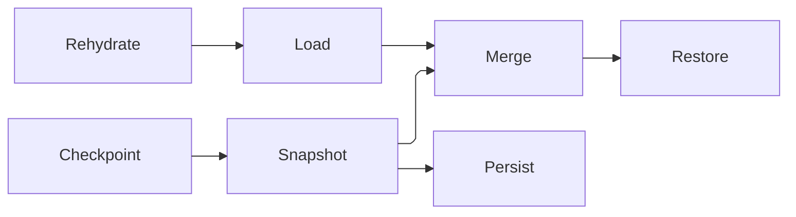

# [APPUI_SCREENS_ACTIVATION]

Rasm.AppUi screens are catalog rows over one program-driven model: a frozen `ScreenCatalog` table is the single derivation source for dockables, window titles, automation names, route keys, and headless proof lanes, while `ProductScreen` owns activation scopes, suspend/resume, the one screen fault fold, paced derived state, the owned admission rail lifting `Validation<Error,T>` onto slot rows behind the inbox error-info bridge, and per-surface state snapshots. The page owns the catalog axis and its product roster, the activation capsule, the derived-state and admission rails, the snapshot law, the materialize-context seam, and the product surfaces the roster seats — settings over the persisted-policy registry and the first-run/landing/coach/report family — composing the kernel `MonotonicTimeline` and fault floor, AppHost `RuntimePhase`, `UiSchedulerPort`, `DrainParticipantPort`, `TelemetryContributorPort`, and `DrainBand` over ReactiveUI, System.Reactive, LanguageExt rails, and NodaTime instants. The run-queue surface is the sibling owner (`Shell/queue.md`).

## [01]-[INDEX]

- [02]-[SCREEN_CATALOG]: One frozen row table with its product roster; every screen derivation folds over it.
- [03]-[ACTIVATION_SCOPES]: One activatable model; scoped disposal, suspend/resume, drain row.
- [04]-[DERIVED_STATE]: The screen fault family on the kernel `Fault` floor; OAPH derivations; one fault fold.
- [05]-[VALIDATION_UX]: The owned admission rail — slot rows over the typed rail behind one error-info bridge.
- [06]-[SCREEN_STATE]: Per-surface snapshots; restore-on-activate merge; checkpoint law.
- [07]-[CONTROL_STREAM]: A screen body is a control-intent stream materialized through `ControlFactory`, not a XAML literal.
- [08]-[SETTINGS_SURFACE]: Every persisted policy projected from one registry through the form-schema engine.
- [09]-[PRODUCT_SCREENS]: First run, recents landing, coach marks, and the consent-bearing fault report.
- [10]-[TS_PROJECTION]: One generated surface program binds partition identity, root control tree, and layout closure.

## [02]-[SCREEN_CATALOG]

- Owner: `ScreenCatalogRow` row record; `ScreenCatalog` frozen table with total projections; `ScreenComposition` the bound-dependency carrier every row constructs through; `StateLens` the snapshot/restore correspondence as ONE column; `ScreenProgram` the per-surface behaviour row; `SlotKey<T>` the phantom-typed cell token; `ProductScreen` the one program-driven model; `ScreenRoster` the product row table.
- Entry: `public static Fin<ScreenCatalog> Freeze(ConsumptionProfile profile, params ReadOnlySpan<ScreenCatalogRow> rows)` — the admission accumulates: every duplicate key and every unreachable headless-lane row name themselves in one refusal; `public static Fin<ScreenCatalog> Product(ConsumptionProfile profile, ScreenComposition composition)` on `ScreenRoster` — the whole product roster in one fold.
- Auto: dock factories, window titles, palette listings, automation names, and headless proof specs derive as folds over `Rows` — zero per-derivation registries; `IViewFor<TViewModel>` views register through `RegisterViews(m => m.Map<TViewModel, TView>())` on the ReactiveUI builder at the composition root (the catalog-verified spelling — `RegisterView<...>` does not exist), one registration per catalog row.
- Packages: ReactiveUI, LanguageExt.Core, Thinktecture.Runtime.Extensions, BCL inbox
- Growth: one catalog row carries screen, dockable, title, automation name, and headless proof, and one product surface is one `ScreenProgram` row plus its `ScreenRoster` seating; a new named cell is one `SlotKey<T>` const on its program owner; zero new surface.
- Boundary: `Key` is the ONE identity cell — deep links, remote invocation, dock identity, automation, palette listings, and proof names all spell it, so a derived alias member beside it was a second spelling consumers forked on and is deleted; the shell route index is a roster projection (`Shell/navigation.md` `ShellRoot.Freeze` folds `Rows` onto `Key`). Screen title typography is the `Theme/typography` `TypographyRole.Title` row and screen iconography the `Theme/assets` key vocabulary, so neither is a row column here. `Surface` gates over the supplied `ConsumptionProfile` and the resolved `SurfaceMount`, and `Proof` is COUPLED to it at the freeze: `Diagnostics/proof` crosses every headless-lane row with the variant-density grid, so a row claiming that lane while refusing `SurfaceMount.Offscreen` declares a proof nothing can run and `Freeze` refuses it. `Model` takes the row beside the minted `SurfaceKey` (`Shell/navigation` `SurfaceKey.Mint`), so a screen composing its own partition text is unspellable. The body is the model's own projection, never a row column; the generated `AppUiSurfaceProgram` binds its control tree to that surface identity and the exact layout closure the tree names.

```csharp
public sealed record ScreenCatalogRow(
    string Key,
    Func<string, string> Label,
    ProofLane Proof,
    Func<ConsumptionProfile, SurfaceMount, bool> Surface,
    Func<ScreenCatalogRow, SurfaceKey, ProductScreen> Model) {
    public string Title => Label($"{Key}.title");
}

[SmartEnum<string>]
public sealed partial class ProofLane {
    public static readonly ProofLane Interactive = new("interactive");
    public static readonly ProofLane Headless = new("headless");
}

public sealed record ScreenCatalog(FrozenDictionary<string, ScreenCatalogRow> Rows) {
    public Seq<ScreenCatalogRow> HeadlessLane => toSeq(Rows.Values).Filter(static row => row.Proof == ProofLane.Headless);

    public static Fin<ScreenCatalog> Freeze(ConsumptionProfile profile, params ReadOnlySpan<ScreenCatalogRow> rows) =>
        Build(profile, toSeq(rows.ToArray()));

    public Option<ScreenCatalogRow> Resolve(string key) =>
        Rows.TryGetValue(key, out ScreenCatalogRow? row) ? Some(row) : None;

    public Seq<ScreenCatalogRow> For(ConsumptionProfile profile, SurfaceMount mount) =>
        toSeq(Rows.Values).Filter(row => row.Surface(profile, mount));

    private static Fin<ScreenCatalog> Build(ConsumptionProfile profile, Seq<ScreenCatalogRow> rows) {
        Seq<string> duplicated = toSeq(rows.Map(static row => row.Key).AsEnumerable()
            .CountBy(identity, StringComparer.Ordinal)
            .Where(static entry => entry.Value > 1)
            .Select(static entry => entry.Key));
        Seq<string> unreachable = rows
            .Filter(row => row.Proof == ProofLane.Headless && !row.Surface(profile, SurfaceMount.Offscreen))
            .Map(static row => row.Key);
        Validation<Error, Unit> keys = duplicated.IsEmpty
            ? Validation<Error, Unit>.Success(unit)
            : Validation<Error, Unit>.Fail(Seq<Error>(new ScreenFault.DuplicateId(string.Join(", ", duplicated))));
        Validation<Error, Unit> lanes = unreachable.IsEmpty
            ? Validation<Error, Unit>.Success(unit)
            : Validation<Error, Unit>.Fail(Seq<Error>(new ScreenFault.LaneUnreachable(string.Join(", ", unreachable))));
        return (keys, lanes)
            .Apply((_, _) => new ScreenCatalog(rows.ToFrozenDictionary(static row => row.Key, static row => row, StringComparer.Ordinal)))
            .ToFin();
    }
}
```

```csharp
// --- [COMPOSITION] ---------------------------------------------------------------------

public sealed record ScreenComposition(
    Func<string, string> Label,
    ScreenRuntime Runtime,
    ResolvedLocale Locale,
    VirtualWindowSpec Window,
    SettingsRegistry Settings,
    ShortcutEditor Shortcuts,
    Func<SurfaceKey, TimelineSurface> Timeline,
    Func<SurfaceKey, PresenterStrip> Tour,
    Func<SurfaceKey, LayerStack> Layers,
    Func<SurfaceKey, ProbeReading> Probe,
    Func<SurfaceKey, (CompareLattice Lattice, CompareSync Sync)> Compare,
    Func<SurfaceKey, DiffSurface> Diff,
    ProductSeams Product,
    RunQueueSeams Queue);

public sealed record StateLens(
    Func<ProductScreen, ScreenState> Snapshot,
    Func<ProductScreen, ScreenState, Unit> Restore) {
    public static readonly StateLens Stateless = new(static screen => screen.Blank(), static (_, _) => unit);
}

public sealed record ScreenProgram(
    string Key,
    Func<ProductScreen, Seq<IDisposable>> Wire,
    Func<ProductScreen, ControlIntent> Body,
    StateLens State,
    Func<ProductScreen, Func<string, bool>> Alive) {
    public static ScreenProgram Of(string key, Func<ProductScreen, ControlIntent> body) =>
        new(key, static _ => Seq<IDisposable>(), body, StateLens.Stateless, static _ => static _ => true);
}

public readonly record struct SlotKey<T>(string Name) {
    public static implicit operator string(SlotKey<T> key) => key.Name;
}

public sealed partial class ProductScreen : ReactiveObject, IActivatableViewModel, INotifyDataErrorInfo {
    private static readonly Op ScreenOp = Op.Of(name: "appui.screen");
    private readonly Subject<string> edits = new();
    private readonly Atom<HashMap<string, object?>> cells = Atom(HashMap<string, object?>());
    private Option<MonotonicStamp> mark = None;
    private Option<ScreenIncident> fault = None;

    public ProductScreen(ScreenCatalogRow row, SurfaceKey surface, ScreenComposition composition, ScreenProgram program) {
        Row = row;
        Surface = surface;
        Composition = composition;
        Program = program;
        Runtime = composition.Runtime;
        this.WhenActivated(Scope);
    }

    public ScreenCatalogRow Row { get; }
    public SurfaceKey Surface { get; }
    public ScreenComposition Composition { get; }
    public ScreenProgram Program { get; }
    public ScreenRuntime Runtime { get; }
    public ViewModelActivator Activator { get; } = new();
    public ScreenLifetimes Lifetimes { get; } = new();
    public Option<ScreenIncident> Fault { get => fault; private set => this.RaiseAndSetIfChanged(ref fault, value); }

    public ControlIntent Body() => Program.Body(this);
    public ScreenState Snapshot() => Program.State.Snapshot(this);
    public Unit Restore(ScreenState merged) => Program.State.Restore(this, merged);
    public Func<string, bool> Alive => Program.Alive(this);

    public HashMap<string, ValueSlot> Values =>
        cells.Value.Map((key, _) => new ValueSlot(() => ReadRaw(key), value => WriteRaw(key, value), Edited(key)));

    public Option<T> Read<T>(SlotKey<T> key) =>
        cells.Value.Find(key.Name).Bind(static held => held is T typed ? Some(typed) : Option<T>.None);

    public T Read<T>(SlotKey<T> key, T fallback) => Read(key).IfNone(fallback);

    public Unit Write<T>(SlotKey<T> key, T value) => WriteRaw(key.Name, value);

    internal Option<object?> ReadRaw(string key) => cells.Value.Find(key);

    internal Unit WriteRaw(string key, object? value) {
        Option<object?> retired = None;
        ignore(cells.Swap(held => {
            retired = held.Find(key);
            return held.AddOrUpdate(key, value);
        }));
        if (retired.Map(prior => Equals(prior, value)).IfNone(false)) { return unit; }
        this.RaisePropertyChanged(key);
        edits.OnNext(key);
        return unit;
    }

    public IObservable<Unit> Edited(string key) =>
        edits.Where(edited => StringComparer.Ordinal.Equals(edited, key)).Select(static _ => unit);

    public ScreenState Blank() =>
        new(Row.Key, Surface, Seq<string>(), 0d, None, Set<string>(), None, Runtime.Clock.GetCurrentInstant());
}

public static class ScreenRoster {
    public const string Settings = "settings";
    public const string Shortcuts = "shortcuts";
    public const string History = TimelineSurface.BodyKey;
    public const string FirstRun = "first-run";
    public const string Landing = "landing";
    public const string Report = "fault-report";
    public const string Queue = RunQueueSurface.Key;
    public const string LayerStack = AnalysisLayers.StackKey;
    public const string CompareGrid = CompareBoard.Key;
    public const string CompareSession = DiffSurface.SessionKey;

    public static Fin<ScreenCatalog> Product(ConsumptionProfile profile, ScreenComposition composition) =>
        ScreenCatalog.Freeze(profile,
            Seat(Settings, ProofLane.Headless, Anywhere, composition, SettingsSurface.Program(composition)),
            Seat(Shortcuts, ProofLane.Headless, Anywhere, composition, ShortcutProgram(composition)),
            Seat(History, ProofLane.Headless, Anywhere, composition,
                ScreenProgram.Of(History, screen => screen.Composition.Timeline(screen.Surface).Body(screen.Composition.Window))),
            Seat(FirstRun, ProofLane.Headless, Anywhere, composition, ProductPrograms.FirstRun(composition)),
            Seat(Landing, ProofLane.Headless, Anywhere, composition, ProductPrograms.Landing(composition)),
            Seat(Report, ProofLane.Interactive, Windowed, composition, ProductPrograms.Report(composition)),
            Seat(PresenterStrip.SessionKey, ProofLane.Interactive, Windowed, composition, PresenterStrip.Program(composition)),
            Seat(Queue, ProofLane.Headless, Anywhere, composition, RunQueueSurface.Program(composition)),
            Seat(LayerStack, ProofLane.Headless, Anywhere, composition, AnalysisLayers.Program(composition)),
            Seat(CompareGrid, ProofLane.Headless, Anywhere, composition, CompareBoard.Program(composition)),
            Seat(CompareSession, ProofLane.Interactive, Windowed, composition, DiffSurface.Program(composition)));

    static ScreenCatalogRow Seat(
        string key,
        ProofLane proof,
        Func<ConsumptionProfile, SurfaceMount, bool> surface,
        ScreenComposition composition,
        ScreenProgram program) =>
        new(key, composition.Label, proof, surface,
            (row, mounted) => new ProductScreen(row, mounted, composition, program));

    static bool Anywhere(ConsumptionProfile profile, SurfaceMount mount) =>
        mount is SurfaceMount.Offscreen || profile.Surface != HostSurface.None;

    static bool Windowed(ConsumptionProfile profile, SurfaceMount mount) =>
        profile.Surface == HostSurface.Windowed && mount is SurfaceMount.Standalone or SurfaceMount.Companion;

    static ScreenProgram ShortcutProgram(ScreenComposition composition) =>
        ScreenProgram.Of(Shortcuts, screen => new ControlIntent.Panel(
            Shortcuts,
            composition.Shortcuts.Sheet().Map(group => (ControlIntent)new ControlIntent.Panel(
                $"{Shortcuts}.{group.Scope.Key}",
                group.Rows.Map(row => (ControlIntent)new ControlIntent.Chip(
                    $"{Shortcuts}.{row.Key}",
                    row.Gesture.Map(static gesture => gesture.ToString()).IfNone($"{Shortcuts}.unbound"),
                    ChipPosture.Static,
                    IntentBinding.Of(row.Conflicted ? PaintRole.Error : PaintRole.Text) with {
                        Command = Some(ShortcutEditor.CaptureIntent),
                        Hint = Some(new HintRow(screen.Composition.Label(row.Label), row.Gesture)),
                    })),
                ConstraintProgram: $"{Shortcuts}.scope",
                IntentBinding.Of(PaintRole.Panel))),
            ConstraintProgram: Shortcuts,
            IntentBinding.Of(PaintRole.Surface)));
}
```

## [03]-[ACTIVATION_SCOPES]

- Owner: `ScreenRuntime` policy record over the kernel `MonotonicTimeline`; `ProductScreen`'s activation members; `ScreenLifetimes` the per-control lifetime table the materialize context's ownership columns read.
- Entry: `public IDisposable BindActivation(IObservable<bool> visible, UiSchedulerPort scheduler)` — visibility edges and phase transitions fold into one activate/suspend rail; `public IO<Unit> Suspend(string trigger)` — the one suspension verb, its trigger naming the source on both the fault fold and the suspension count.
- Auto: `WhenActivated` composes rehydration, the program `Wire` pipelines, and a closing disposal that checkpoints state and emits the disposal evidence; `DrainRow` registers the screens teardown as one `DrainParticipantPort` row; the draining transition suspends every bound screen through the same `Suspend` path.
- Evidence: `ScreenRuntime.Disposed` carries the row key, measured active span, and disposable count into the composition-bound evidence stream; an unmeasurable span faults the runner and emits nothing.
- Packages: ReactiveUI, System.Reactive, LanguageExt.Core, NodaTime, Rasm (kernel timeline), Rasm.AppHost (project)
- Growth: one screen instrument is one `InstrumentSpec` row on `ProductScreen.TelemetryRow`; zero new surface.
- Boundary: `ProductScreen` is the named boundary capsule for the statement carve-out — activation wiring, visibility subscription, disposal registration, and the error-info edge raise carry language-owned statement forms — and `ScreenLifetimes` is the second named capsule because a per-control lifetime table is retained mutable host state keyed weakly on the control (the pool's `Release` must drop exactly the parked control's bindings before `Rebind` re-attaches while the whole table still dies with the screen; a flat composite answers only the second half, which is what let a recycled cell carry its predecessor's value binding). `ViewModelActivator` ref-counts through `Interlocked`, so activation fires only on the zero-to-one edge; AutoSuspendHelper and RxApp.SuspensionHost are the deleted patterns. The drain row registers rank 10 — the one rank literal here — ordering screen teardown first inside `DrainBand.Interaction`. `Throttle` arrives on `ScreenRuntime` from the motion timing rows, so the fences carry zero duration literals. The activation count fires inside the `WhenActivated` scope body and the suspension count on the one `Suspend(trigger)` verb every driver routes through, so each instrument has exactly one producer; each write spells the slot its own `InstrumentSpec` declared, so the declared `Dimensions` and the spelled tag key are one vocabulary.

```csharp
public sealed record ScreenRuntime(
    MonotonicTimeline Line,
    IClock Clock,
    ScreenStatePolicy State,
    Func<string, Duration, int, IO<Unit>> Disposed,
    Func<InstrumentSpec, Option<(string Slot, string Value)>, Unit> Count,
    Duration Throttle);

public sealed partial class ProductScreen {
    public static readonly InstrumentSpec Activated = InstrumentSpec.Create(
        "rasm.appui.screen.activated", InstrumentKind.Count, MeasureForm.Whole, "{activation}",
        "screen activations by screen id", Seq(AppUiTelemetry.ScreenSlot), None, None, None);
    public static readonly InstrumentSpec Suspended = InstrumentSpec.Create(
        "rasm.appui.screen.suspended", InstrumentKind.Count, MeasureForm.Whole, "{suspension}",
        "screen suspensions by trigger", Seq(AppUiTelemetry.SourceSlot), None, None, None);
    public static readonly InstrumentSpec Disposables = InstrumentSpec.Create(
        "rasm.appui.screen.disposables", InstrumentKind.Levels, MeasureForm.Whole, "{disposable}",
        "live disposables by screen id", Seq<string>(), None, Some(AppUiTelemetry.ScreenSlot), None);

    public static TelemetryContributorPort TelemetryRow(string version) =>
        AppUiTelemetry.Contribute(version, Activated, Suspended, Disposables);

    public IDisposable BindActivation(IObservable<bool> visible, UiSchedulerPort scheduler) {
        IDisposable phased = scheduler.Phases(phase => ignore(phase.To == RuntimePhase.Draining ? Run("drain", Suspend("drain")) : unit));
        IDisposable sighted = visible.DistinctUntilChanged()
            .Subscribe(open => ignore(open ? ignore(Activator.Activate()) : Run("visibility", Suspend("visibility"))));
        return new CompositeDisposable(phased, sighted);
    }

    public IO<Unit> Suspend(string trigger) =>
        this.Checkpoint()
            .Bind(_ => IO.lift(fun(() => Activator.Deactivate())))
            .Map(_ => Runtime.Count(Suspended, Some((AppUiTelemetry.SourceSlot, trigger))));

    public static DrainParticipantPort DrainRow(Func<Seq<ProductScreen>> active) =>
        new("screens", DrainBand.Interaction, 10, token => active().TraverseM(static screen => screen.Suspend("drain")).As().Map(static _ => unit));

    internal Unit Commit(ScreenIncident failure) => ignore(Fault = Some(failure));

    private IEnumerable<IDisposable> Scope() {
        Runtime.Line.Capture(ScreenOp).Match(
            Succ: stamp => ignore(mark = Some(stamp)),
            Fail: cause => Commit(new ScreenIncident(Row.Key, cause, Runtime.Clock.GetCurrentInstant(), "activate")));
        ignore(Runtime.Count(Activated, Some((AppUiTelemetry.ScreenSlot, Row.Key))));
        ignore(Run("rehydrate", this.Rehydrate()));
        Seq<IDisposable> wired = Program.Wire(this);
        return wired.Add(Disposable.Create(() =>
            ignore(Run("checkpoint", this.Checkpoint().Bind(_ => DisposedEvidence(wired.Count + 1))))));
    }

    private IO<Unit> DisposedEvidence(int disposables) =>
        IO.lift(() =>
                from start in mark.ToFin(Fail: (Error)new ScreenFault.Rejected("dispose", "activation was never marked"))
                from end in Runtime.Line.Capture(ScreenOp)
                from span in Runtime.Line.Elapsed(start, end, ScreenOp)
                select Duration.FromTimeSpan(span))
            .Bind(active => active.Match(
                Succ: span => Runtime.Disposed(Row.Key, span, disposables),
                Fail: IO.fail<Unit>));

    internal Unit Run(string source, IO<Unit> effect) =>
        ScreenOp.Catch(() => effect.Run()).Match(
            Succ: static _ => unit,
            Fail: failure => Commit(new ScreenIncident(Row.Key, failure, Runtime.Clock.GetCurrentInstant(), source)));
}

public sealed class ScreenLifetimes : IDisposable {
    private readonly ConditionalWeakTable<Control, CompositeDisposable> owned = new();

    public Unit Own(Control control, IDisposable lifetime) {
        owned.GetOrCreateValue(control).Add(lifetime);
        return unit;
    }

    public Unit Release(Control control) {
        if (owned.TryGetValue(control, out CompositeDisposable? held)) {
            held.Dispose();
            ignore(owned.Remove(control));
        }
        return unit;
    }

    public void Dispose() {
        foreach (KeyValuePair<Control, CompositeDisposable> entry in owned) {
            entry.Value.Dispose();
        }
        owned.Clear();
    }
}
```

## [04]-[DERIVED_STATE]

- Owner: `ScreenFault` — the direct generated `[Union]` with one `[FaultCase]` leaf per screen failure, each leaf earning its seat from a live raise; `ScreenIncident` — the fault-cell state record; `ScreenOps` derived-state extensions.
- Entry: `public ObservableAsPropertyHelper<T> Derive<T>(IObservable<T> source, Expression<Func<ProductScreen,T>> property, IScheduler scheduler, T initial)` — one paced OAPH row per derived property with the target member carried as a checked expression rather than a reflection string.
- Auto: `WhenAnyValue` and `SubscribeToExpressionChain` streams feed `Derive`; `FoldFaults` captures command and pipeline exceptions as exact exceptional errors in the `Fault` cell; `RaiseAndSetIfChanged` publishes the fault transition to bound views — the cell is the view-model's own notify surface, so the ReactiveObject property IS the transition publication and a kernel fault cell beside it would be a second holder no view binds.
- Packages: ReactiveUI, System.Reactive, LanguageExt.Core, NodaTime, Thinktecture.Runtime.Extensions, Rasm (kernel floor)
- Growth: a new semantic refusal is one `[FaultCase]` leaf; thrown exceptions stay exceptional `Error` values and never expand this family.
- Boundary: semantic screen refusals derive their sealed code from `[FaultCase]`; command and pipeline exceptions retain their original exception as `Error` cause. Per-control exception handling is the deleted pattern — `Fault` is the single screen failure surface, and the error dialog row and evidence stream consume it through composition-bound delegates. The `IScheduler` parameter arrives from the surface scheduler boundary and applies once per pipeline; `Calm` pins the operator order — distinct before throttle — so burst sources collapse before pacing.

```csharp
// --- [ERRORS] --------------------------------------------------------------------------


[Union(ConversionFromValue = ConversionOperatorsGeneration.None)]
public abstract partial record ScreenFault : Fault {
    private static readonly FaultBand FamilyBand = FaultBand.Screen;
    private ScreenFault() { }
    [FaultCase(0)]
    public sealed partial record DuplicateId(string Keys) : ScreenFault() {
        public override string Message => $"screen/duplicate: {Keys}";
    }
    [FaultCase(1)]
    public sealed partial record LaneUnreachable(string Keys) : ScreenFault() {
        public override string Message => $"screen/lane: {Keys} claims the headless lane and refuses the offscreen mount";
    }
    [FaultCase(2)]
    public sealed partial record Rejected(string Target, string Reason) : ScreenFault() {
        public override string Message => $"screen/rejected: {Target}: {Reason}";
    }
    [FaultCase(3)]
    public sealed partial record SlotClaimed(string Slot) : ScreenFault() {
        public override string Message => $"screen/slot: {Slot} already carries a rule";
    }
    [FaultCase(4)]
    public sealed partial record PolicyRejected(string Section, string Reason) : ScreenFault() {
        public override string Message => $"screen/policy: {Section}: {Reason}";
    }
    [FaultCase(5)]
    public sealed partial record QueueRejected(string Detail) : ScreenFault() {
        public override string Message => $"screen/queue: {Detail}";
    }
}

public readonly record struct ScreenIncident(string ScreenId, Error Evidence, Instant At, string Source);

// --- [OPERATIONS] ----------------------------------------------------------------------

public static partial class ScreenOps {
    extension(ProductScreen screen) {
        public IObservable<T> Calm<T>(IObservable<T> source, IScheduler scheduler) =>
            source.DistinctUntilChanged().Throttle(screen.Runtime.Throttle.ToTimeSpan(), scheduler);

        public ObservableAsPropertyHelper<T> Derive<T>(IObservable<T> source, Expression<Func<ProductScreen, T>> property, IScheduler scheduler, T initial) =>
            screen.Calm(source, scheduler).ToProperty(screen, property, initial);

        public IDisposable FoldFaults(string source, params ReadOnlySpan<IObservable<Exception>> streams) =>
            Observable.Merge(streams.ToArray()).Subscribe(failure =>
                screen.Commit(new ScreenIncident(screen.Row.Key, Error.New(failure.Message, failure), screen.Runtime.Clock.GetCurrentInstant(), source)));
    }
}
```

## [05]-[VALIDATION_UX]

- Owner: `AdmissionSlot` the rule target; `AdmissionRow` the per-slot verdict and its text; `ProductScreen`'s own admission cell with its `INotifyDataErrorInfo` bridge; `ScreenOps` admission extensions.
- Entry: `public Fin<IDisposable> Admit<TValue>(Expression<Func<ProductScreen, TValue>> property, IObservable<Validation<Error, TValue>> admissions)` — the one admission seam from the typed rail onto a slot row, its `Fin` sealing a non-member expression or a slot another rule already holds; `AdmitCross<TValue>` lands the same rail on the cross slot for invariants spanning properties; both return the rule's LIFETIME, so retirement is disposal.
- Auto: `Gate` projects all-rows-valid into the availability delegate column the command table consumes; `FieldErrors` projects one slot's text into the field-adorner stream; `GetErrors`/`ErrorsChanged` answer the platform's own error-info contract, so `DataValidationErrors` paints every bound control with no per-control wiring.
- Packages: ReactiveUI, System.Reactive, LanguageExt.Core, BCL inbox
- Growth: one rule row per validated property and one cross row per invariant; zero new surface.
- Boundary: the lift is the single validation vocabulary — a second rule rail beside `Validation<Error,T>` is the rejected form, and domain factories keep emitting the typed rail untouched (the external view-model aggregator type-loads against nothing — RULINGS `[01]` — so the inbox `INotifyDataErrorInfo` contract is the one adorner channel). A slot is claimed exactly once through a GUARDED transition — a second claim answers `Refused` and seals `SlotClaimed` rather than shadowing the first — and a rule's registration is a subscription with a lifetime, so a mode shift disposes and re-registers. Text crosses as the WHOLE accumulated failure sequence, because rendering the head alone costs the operator a round trip per rule. The cross slot carries the empty property name the error-info contract reserves for entity-level errors, so a cross-field invariant reaches the platform's own entity adorner and `Gate` reads every row including it. `FieldErrors` and `GetErrors` are ONE read at two altitudes — the observable for a screen-composed adorner stream and the synchronous contract for the framework's binding plugin.

```csharp
// --- [TYPES] ---------------------------------------------------------------------------

public readonly record struct AdmissionSlot(string Property) {
    public static readonly AdmissionSlot Cross = new(string.Empty);

    public bool IsCross => Property.Length is 0;

    public static Fin<AdmissionSlot> Of<TValue>(Expression<Func<ProductScreen, TValue>> property) =>
        property.Body is MemberExpression { Member.Name: var name }
            ? Fin.Succ(new AdmissionSlot(name))
            : Fin<AdmissionSlot>.Fail(new ScreenFault.Rejected(property.ToString(), "admission target is not a property member"));
}

// --- [MODELS] --------------------------------------------------------------------------

public readonly record struct AdmissionRow(AdmissionSlot Slot, Seq<string> Text) {
    public bool Valid => Text.IsEmpty;
}
```

```csharp
// --- [OPERATIONS] ----------------------------------------------------------------------

public sealed partial class ProductScreen {
    private readonly Atom<HashMap<AdmissionSlot, AdmissionRow>> admitted = Atom(HashMap<AdmissionSlot, AdmissionRow>());
    private readonly Subject<HashMap<AdmissionSlot, AdmissionRow>> admissions = new();

    public IObservable<HashMap<AdmissionSlot, AdmissionRow>> Admissions =>
        admissions.StartWith(admitted.Value);

    public bool HasErrors => admitted.Value.Values.Exists(static row => !row.Valid);

    public event EventHandler<DataErrorsChangedEventArgs>? ErrorsChanged;

    public IEnumerable GetErrors(string? propertyName) =>
        admitted.Value.Find(new AdmissionSlot(propertyName ?? string.Empty))
            .Map(static row => (IEnumerable)row.Text)
            .IfNone(Seq<string>());

    internal Fin<IDisposable> Claim(AdmissionSlot slot, IObservable<Seq<string>> text) =>
        Cell.Step(
            cell: admitted,
            step: held => held.ContainsKey(slot) ? Option<HashMap<AdmissionSlot, AdmissionRow>>.None : Some(held.Add(slot, new AdmissionRow(slot, Seq<string>()))),
            declined: new ScreenFault.SlotClaimed(slot.Property)) switch {
            Transition<HashMap<AdmissionSlot, AdmissionRow>>.Committed => Fin.Succ((IDisposable)new CompositeDisposable(
                text.Subscribe(found => Publish(held => held.AddOrUpdate(slot, new AdmissionRow(slot, found)), slot)),
                Disposable.Create(() => Publish(held => held.Remove(slot), slot)))),
            Transition<HashMap<AdmissionSlot, AdmissionRow>>.Refused refused => Fin<IDisposable>.Fail(refused.Cause),
            _ => Fin<IDisposable>.Fail(new ScreenFault.SlotClaimed(slot.Property)),
        };

    private Unit Publish(Func<HashMap<AdmissionSlot, AdmissionRow>, HashMap<AdmissionSlot, AdmissionRow>> step, AdmissionSlot slot) {
        admissions.OnNext(admitted.Swap(step));
        ErrorsChanged?.Invoke(this, new DataErrorsChangedEventArgs(slot.Property));
        return unit;
    }
}

public static partial class ScreenOps {
    public static IObservable<Seq<string>> Text<TValue>(IObservable<Validation<Error, TValue>> admissions) =>
        admissions.Select(static outcome => outcome.Match(
            Succ: static _ => Seq<string>(),
            Fail: static errors => errors.Map(static error => error.Message).ToSeq()));

    extension(ProductScreen screen) {
        public Fin<IDisposable> Admit<TValue>(Expression<Func<ProductScreen, TValue>> property, IObservable<Validation<Error, TValue>> admissions) =>
            AdmissionSlot.Of(property).Bind(slot => screen.Claim(slot, Text(admissions)));

        public Fin<IDisposable> AdmitCross<TValue>(IObservable<Validation<Error, TValue>> admissions) =>
            screen.Claim(AdmissionSlot.Cross, Text(admissions));

        public IObservable<bool> Gate() =>
            screen.Admissions.Select(static rows => rows.Values.ForAll(static row => row.Valid)).DistinctUntilChanged();

        public IObservable<Seq<string>> FieldErrors(string property) =>
            screen.Admissions
                .Select(rows => rows.Find(new AdmissionSlot(property)).Map(static row => row.Text).IfNone(Seq<string>()))
                .DistinctUntilChanged();
    }
}
```

## [06]-[SCREEN_STATE]

- Owner: `ScreenState` snapshot record with its `Diagnostics/evidence#DURABLE_PARCEL` seal; `ScreenStatePolicy` port delegates; `ScreenOps` state extensions.
- Entry: `public IO<Unit> Rehydrate()` — restore-on-activate; the sealed blob opens through `ScreenState.Seal` and merges with the live snapshot through `Merge`.
- Auto: `Checkpoint` fires on deactivation, visibility suspension, and the drain row through the same `Persist` delegate; the partition key is row key plus the minted `SurfaceKey`, so panel, window, and headless sessions never collide.
- State: the `ScreenState` snapshot carries its `Instant` and supplies the support-bundle screen-state contribution.
- Packages: LanguageExt.Core, NodaTime, BCL inbox
- Growth: one `ScreenState` field row per new state axis under one `Generation` bump on the seal; zero new surface.
- Boundary: persistence crosses only through `ScreenStatePolicy` delegates bound at composition to the Persistence snapshot vocabulary — no store type enters the fences, and both legs carry the SEALED BLOB so the port moves bytes under a partition key while the shape question stays whole at the seal. Rehydrate raises NO refusal: an oversize, unreadable, foreign-generation, or unadmitted parcel seeds the live snapshot and the screen opens on what it already is, which is the first-run answer reached without a second arm — so a screen-state refusal case has no producer and no spelling. Composition binds `Admit` as the seal's admission arrow, accumulating inside the delegate and landing as one `Error.Many` the seal reads as a refusal. Encoding is the half that answers a rail, and its refusal lands on the incident cell every other screen failure reaches. Surface identity is the `Shell/navigation` `SurfaceKey` VALUE and never text a screen composed; the restore ORDER is the navigation page's law and this carrier is third in it, after the dock graph materializes the surfaces and after float rectangles clamp; `Merge` keeps live rows authoritative for existence while persisted filter, scroll, expansion, and selection survive the `alive` prune; a second suspension driver beside the checkpoint law is the rejected form. Structural equality nothing compares is not declared: no consumer compares two snapshots, so a `[Equatable]` member algebra here would be decorative and is refused by name.

```csharp
public sealed record ScreenStatePolicy(
    Func<string, SurfaceKey, IO<Option<string>>> Load,
    Func<ScreenState, Fin<ScreenState>> Admit,
    Func<string, SurfaceKey, string, IO<Unit>> Persist);

public sealed record ScreenState(
    string ScreenId,
    SurfaceKey Surface,
    Seq<string> Selection,
    double Scroll,
    Option<string> Filter,
    Set<string> Expansion,
    Option<string> Canvas,
    Instant At) {
    public static readonly StateSeal Seal = StateSeal.Of("shell", "screen", generation: 2, StateResidue.Discard);

    public static ScreenState Merge(ScreenState persisted, ScreenState live, Func<string, bool> alive) =>
        live with {
            Selection = persisted.Selection.Filter(alive),
            Scroll = persisted.Scroll,
            Filter = persisted.Filter,
            Expansion = persisted.Expansion.Filter(alive),
            Canvas = persisted.Canvas,
        };
}

public static partial class ScreenOps {
    extension(ProductScreen screen) {
        public IO<Unit> Rehydrate() =>
            screen.Runtime.State.Load(screen.Row.Key, screen.Surface)
                .Map(found => found
                    .Map(blob => screen.Snapshot() switch {
                        var live => screen.Restore(ScreenState.Merge(
                            ScreenState.Seal.Read<ScreenState>(blob, screen.Runtime.State.Admit).Or(live),
                            live,
                            screen.Alive)),
                    })
                    .IfNone(unit));

        public IO<Unit> Checkpoint() =>
            ScreenState.Seal.Write(screen.Snapshot()).Match(
                Succ: blob => screen.Runtime.State.Persist(screen.Row.Key, screen.Surface, blob),
                Fail: cause => IO.lift(() => screen.Commit(new ScreenIncident(
                    screen.Row.Key, cause, screen.Runtime.Clock.GetCurrentInstant(), "checkpoint"))));
    }
}
```



## [07]-[CONTROL_STREAM]

- Owner: `ValueSlot` the named two-way cell; `ScreenBody` the materialized root the activation scope mounts; `ScreenSeams` the sibling-owner arrow set the materialize context takes; `ScreenOps` wire extensions.
- Entry: `public IObservable<ControlIntent> Wire(IScheduler scheduler)` — the mount emission fires at subscription and every screen property edge re-projects the body, paced through the runtime throttle; `public MaterializeContext Context(ScreenSeams seams)` — the fold assembling the materialize context from the bound sibling arrows plus the four columns the screen alone can answer; `public Fin<ScreenBody> Compose(ControlIntent intent, MaterializeContext context, RecycleScope recycle)` — materializes the current intent tree through `ControlFactory` into the mounted root paired with the pool that owns its recycled children. `Shell/navigation`'s dock factory is the mount composer: it resolves the model, wires, contexts, and composes through these three members when it materializes a dockable (`ARCHITECTURE.md [04]` mount spine).
- Auto: `ProductScreen.Body` projects the screen's model onto one `ControlIntent` tree (`Shell/controls`); the intent stream re-emits on `ReactiveObject.Changed` property edges, throttled so a burst of edges collapses to one re-materialize; the materialized root mounts at the surface root where `AccessOps.Identify` applies the catalog automation identity.
- Packages: ReactiveUI, System.Reactive, Avalonia, LanguageExt.Core
- Growth: a screen is one `ScreenProgram` row whose `Body` names its control-intent tree; a new control on a screen is one intent in that tree, never a XAML edit; a new value channel is one slot the program writes; zero new surface.
- Boundary: the screen body is the one `ControlIntent` tree materialized through `ControlFactory` — the per-screen compiled-XAML view class is the deleted body form, so `ControlFactory` is the only materialization path; `ScreenSeams` carries EXACTLY the columns the `Shell/controls` context table marks as deferred to a sibling owner or the host, and the screen supplies the value channel over its own named slots plus the two ownership columns off `ScreenLifetimes`; the value bridge resolves the intent's `ValueKey` against a NAMED slot and refuses an unregistered key on the `Fin` rail, while the control-to-screen leg distincts before writing because the seat leg has just written the same value; the intent stream paces through the runtime throttle alone — `Calm`'s distinct gate is wrong over unit-shaped edges; control recycling rides the `RecycleScope` pool, and `Compose` hands root and pool back as ONE `ScreenBody` so the activation scope releases them together; binding stays `BehaviorRail.Intent`-only through the materialize fold, so a screen body names no `ICommand` call site.

```csharp
// --- [MODELS] --------------------------------------------------------------------------

public sealed record ValueSlot(Func<object?> Read, Func<object?, Unit> Write, IObservable<Unit> Changed);

public sealed record ScreenBody(Control Root, RecycleScope Recycle);

// --- [SERVICES] ------------------------------------------------------------------------

public sealed record ScreenSeams(
    Func<string, Option<ICommand>> Command,
    Func<ControlSkin, Option<ControlTheme>> Skin,
    Func<string, string> Label,
    Func<AssetKey, int, Fin<IImage>> Icon,
    Func<OptionSource, VirtualWindowSpec, Fin<WindowLease<OptionRow>>> Options,
    Func<VirtualWindowSpec, Fin<WindowLease<RealizedItem<object>>>> Window,
    Func<string, Fin<IObservable<OverviewFrame>>> Overview,
    Func<string, Fin<Control>> Layout,
    Func<string, Fin<ICommand>> Gesture,
    Func<ControlTrigger, Control, ICommand, Fin<IDisposable>> Activate);
```

```csharp
// --- [OPERATIONS] ----------------------------------------------------------------------

public static partial class ScreenOps {
    extension(ProductScreen screen) {
        public IObservable<ControlIntent> Wire(IScheduler scheduler) =>
            screen.Changed.Select(static _ => unit)
                .Throttle(screen.Runtime.Throttle.ToTimeSpan(), scheduler)
                .StartWith(unit)
                .Select(_ => screen.Body());

        public MaterializeContext Context(ScreenSeams seams) =>
            new(seams.Command, seams.Skin, seams.Label, seams.Icon, seams.Options, seams.Window,
                seams.Overview, seams.Layout, seams.Gesture,
                Value: screen.Channel,
                Activate: seams.Activate,
                Own: screen.Lifetimes.Own,
                Release: screen.Lifetimes.Release);

        public Fin<IDisposable> Channel(string key, Control control, AvaloniaProperty slot) =>
            screen.Values.Find(key)
                .ToFin(new ScreenFault.Rejected(key, "no value slot"))
                .Map(cell => (IDisposable)new CompositeDisposable(
                    cell.Changed.StartWith(unit).Subscribe(_ => ignore(control.SetValue(slot, cell.Read()))),
                    control.GetObservable(slot).DistinctUntilChanged().Subscribe(value => ignore(cell.Write(value)))));

        public Fin<ScreenBody> Compose(ControlIntent intent, MaterializeContext context, RecycleScope recycle) =>
            MaterializePool.Realize(intent, context, recycle).Map(root => new ScreenBody(root, recycle));
    }
}
```

## [08]-[SETTINGS_SURFACE]

- Owner: `SettingScope` the provenance axis; `SettingsRow` the per-policy registration; `SettingsRegistry` the frozen registration table; `SettingsQuery` the scoped search grammar; `SettingsPlan` the per-section projection; `SettingsSurface` the plan, reset, apply, and body folds with the seated program.
- Cases: `SettingScope` = default | user | workspace | machine.
- Entry: `public static Fin<SettingsRegistry> Freeze(params ReadOnlySpan<SettingsRow> rows)` — the refusal names EVERY duplicated section in one fault; `public static SettingsQuery Parse(string raw)` — one parse for typed queries and chip clicks alike; `public static Seq<SettingsPlan> Plan(SettingsRegistry registry, SettingsQuery query, ResolvedLocale locale)` — the narrowed per-section projection; `public static Validation<Error, FormState> Reset(SettingsRow row, Seq<string> fields, ResolvedLocale locale)` — one accumulating fold serving the per-row and per-section verbs; `public static IO<ReloadOutcome> Commit(SettingsRow row, Validation<Error, FormState> candidate)` — the owner-capsule handoff; `public static ScreenProgram Program(ScreenComposition composition)` — the seated program.
- Auto: every persisted policy owner registers ONE row carrying its section key, its field schema, a read of the live policy, a per-field scope map, its defaults, and its own swap capsule — a policy added anywhere in the corpus appears in settings with zero edit here; search paces on the runtime throttle and parses into one value whose form filter, section term, and scope term each cut a different axis; reset re-seats a field's default through the schema's own admission and hands the result to the same swap capsule an edit takes.
- Registration: each persisted-policy owner supplies its own `Settings` member — `ThemeCell.Settings`, `LocaleRuntime.Settings`, `ShortcutEditor.Settings` — each returning its row on the `Validation` rail because a malformed section is a boot fact, and composition traverses the three into one `Freeze`.
- Packages: LanguageExt.Core, Thinktecture.Runtime.Extensions, Irihi.Ursa, Avalonia, BCL inbox
- Growth: a new settings section is one `SettingsRow` at its own policy owner; a new provenance scope is one `SettingScope` row; a new query axis is one `SettingsQuery` column with its term const; zero new surface.
- Boundary: this surface RENDERS and never writes — every mutation goes back through the registering owner's own swap capsule, so the outcome is the owners' own `ReloadOutcome` and a rejected write keeps prior values live. The registry is a projection of the schema engine and mints NO form machinery: sections are `FormSection` rows, fields `FormField` rows, planning `FormSurface.Plan`, bodies `FormSurface.Panel` — a settings-only control path or validation rail is unspellable here. The rail is DESKTOP CHROME rather than a body member: `Body` emits the sections alone, and the desktop capsule seats `FormChrome.Rail` beside them over the same scroll region. PROVENANCE is a scope, never an origin: the form's own `ValueOrigin` answers whether a value was authored; the scope answers WHICH writer set it — the fact a reset verb needs — and rides the row's own live read because a field's scope moves when an administrator lands a policy. SEARCH narrows on three axes because a substring can express none of the other two: the section term cuts before the field projection, the scope term after it (scope is a live read), and the modified term is the form filter's own facet. RESET routes through `FormSchema.Seat`, so a default the policy's own admission now refuses — a variant key the theme stopped shipping — refuses at reset exactly as at edit; a field whose defaults carry no value accumulates its own refusal rather than silently succeeding at nothing.

```csharp
// --- [TYPES] ---------------------------------------------------------------------------

[SmartEnum<string>]
[KeyMemberEqualityComparer<ComparerAccessors.StringOrdinal, string>]
[KeyMemberComparer<ComparerAccessors.StringOrdinal, string>]
public sealed partial class SettingScope {
    public static readonly SettingScope Default = new("default", rank: 0, resettable: false, PaintRole.TextFaint);
    public static readonly SettingScope User = new("user", rank: 1, resettable: true, PaintRole.Accent);
    public static readonly SettingScope Workspace = new("workspace", rank: 2, resettable: true, PaintRole.Info);
    public static readonly SettingScope Machine = new("machine", rank: 3, resettable: false, PaintRole.Warning);

    public int Rank { get; }

    public bool Resettable { get; }

    public PaintRole Ink { get; }

    public string Badge => LocaleStrings.Key(nameof(SettingScope), Key);
}

public readonly record struct SettingsQuery(string Terms, Option<string> Section, Option<SettingScope> Scope, FilterFacet Facet) {
    public const string SectionTerm = "section";
    public const string SourceTerm = "source";
    public const string ModifiedTerm = "modified";

    public static readonly SettingsQuery Open = new(string.Empty, None, None, FilterFacet.All);

    public FormFilter Filter => new(Terms, Facet);

    public static SettingsQuery Parse(string raw) =>
        toSeq(raw.Split(' ', StringSplitOptions.RemoveEmptyEntries | StringSplitOptions.TrimEntries))
            .Fold(Open, static (query, token) => token.Split(':', 2) switch {
                [SectionTerm, var value] => query with { Section = Some(value) },
                [SourceTerm, var value] => query with { Scope = SettingScope.TryGet(value, out SettingScope? row) ? Some(row) : None },
                [ModifiedTerm] => query with { Facet = FilterFacet.Modified },
                _ => query with { Terms = query.Terms.Length is 0 ? token : $"{query.Terms} {token}" },
            });
}

// --- [MODELS] --------------------------------------------------------------------------

public sealed record SettingsRow(
    string Section,
    string LabelKey,
    FormSchema Schema,
    Func<FormState> Read,
    Func<HashMap<string, SettingScope>> Scopes,
    FormState Defaults,
    Func<FormState, IO<ReloadOutcome>> Apply);

public sealed record SettingsRegistry(Seq<SettingsRow> Rows) {
    public static Fin<SettingsRegistry> Freeze(params ReadOnlySpan<SettingsRow> rows) {
        Seq<SettingsRow> seated = toSeq(rows.ToArray());
        Seq<string> duplicated = toSeq(seated.Map(static row => row.Section).AsEnumerable()
            .CountBy(identity, StringComparer.Ordinal)
            .Where(static entry => entry.Value > 1)
            .Select(static entry => entry.Key));
        return duplicated.IsEmpty
            ? Fin.Succ(new SettingsRegistry(seated))
            : Fin<SettingsRegistry>.Fail(new ScreenFault.PolicyRejected(string.Join(", ", duplicated), "duplicate section"));
    }

    public Option<SettingsRow> Row(string section) =>
        Rows.Find(row => StringComparer.Ordinal.Equals(row.Section, section));
}

public sealed record SettingsPlan(SettingsRow Row, Seq<SectionPlan> Sections, HashMap<string, SettingScope> Scopes);
```

```csharp
// --- [OPERATIONS] ----------------------------------------------------------------------

public static class SettingsSurface {
    public static readonly SlotKey<string> Search = new("settings.search");
    public const string RailKey = "settings.rail";
    public const string ResetRowVerb = "settings.reset.row";
    public const string ResetSectionVerb = "settings.reset.section";

    public static IObservable<SettingsQuery> Queries(IObservable<string> typed, ScreenRuntime runtime, IScheduler scheduler) =>
        typed.DistinctUntilChanged()
            .Throttle(runtime.Throttle.ToTimeSpan(), scheduler)
            .Select(SettingsQuery.Parse)
            .StartWith(SettingsQuery.Open);

    public static Seq<SettingsPlan> Plan(SettingsRegistry registry, SettingsQuery query, ResolvedLocale locale) =>
        registry.Rows
            .Filter(row => query.Section.Map(term => StringComparer.OrdinalIgnoreCase.Equals(row.Section, term)).IfNone(true))
            .Map(row => new SettingsPlan(row, row.Schema.Plan(row.Read(), HashMap<string, FieldValue>(), query.Filter, locale), row.Scopes()))
            .Map(plan => plan with { Sections = Scoped(plan, query.Scope) })
            .Filter(static plan => !plan.Sections.IsEmpty)
            .Strict();

    static Seq<SectionPlan> Scoped(SettingsPlan plan, Option<SettingScope> wanted) =>
        wanted.Match(
            Some: scope => plan.Sections
                .Map(section => section with {
                    Fields = section.Fields.Filter(field => plan.Scopes.Find(field.Field.Key) == Some(scope)),
                })
                .Filter(static section => !section.Fields.IsEmpty),
            None: () => plan.Sections);

    public static Validation<Error, FormState> Reset(SettingsRow row, Seq<string> fields, ResolvedLocale locale) {
        (FormState State, Seq<Error> Errors) folded = fields.Fold(
            (State: row.Read(), Errors: Seq<Error>()),
            (held, key) => row.Defaults.Values.Find(key).Bind(static value => value.Uniform).Match(
                Some: value => row.Schema.Seat(held.State, key, value, locale).Match(
                    Succ: seated => (seated, held.Errors),
                    Fail: errors => (held.State, held.Errors + errors)),
                None: () => (held.State, held.Errors.Add(new ScreenFault.PolicyRejected(row.Section, $"no default for {key}")))));
        return folded.Errors.IsEmpty
            ? Validation<Error, FormState>.Success(folded.State)
            : Validation<Error, FormState>.Fail(folded.Errors);
    }

    public static IO<ReloadOutcome> Commit(SettingsRow row, Validation<Error, FormState> candidate) =>
        candidate.Match(
            Succ: row.Apply,
            Fail: errors => IO.pure<ReloadOutcome>(new ReloadOutcome.Rejected(
                row.Section, new ConfigError.BindRejected(row.Section, errors))));

    public static ControlIntent Body(Seq<SettingsPlan> plan, ResolvedLocale locale) =>
        new ControlIntent.Panel(
            ScreenRoster.Settings,
            SearchField(locale).Cons(plan.Map(static seated => seated.Row.Schema.Panel(seated.Row.Section, seated.Sections))),
            ConstraintProgram: "settings-shell",
            IntentBinding.Of(PaintRole.Surface));

    static ControlIntent SearchField(ResolvedLocale locale) =>
        new ControlIntent.TextInput(
            Search.Name,
            locale.Label($"{Search.Name}.watermark"),
            Multiline: false,
            IntentBinding.Of(PaintRole.Panel) with { ValueKey = Some(Search.Name), Trigger = Some(ControlTrigger.Change) });

    public static ScreenProgram Program(ScreenComposition composition) =>
        ScreenProgram.Of(ScreenRoster.Settings,
                screen => Body(Plan(composition.Settings, SettingsQuery.Parse(screen.Read(Search, string.Empty)), composition.Locale), composition.Locale))
            with {
                State = new StateLens(
                    static screen => screen.Blank() with { Filter = Some(screen.Read(Search, string.Empty)) },
                    static (screen, merged) => screen.Write(Search, merged.Filter.IfNone(string.Empty))),
            };

    public static Control Rail(Seq<SettingsPlan> plan, ScrollViewer region, ResolvedLocale locale) =>
        FormChrome.Rail(plan.Bind(static seated => seated.Sections), region, locale);
}
```

## [09]-[PRODUCT_SCREENS]

- Owner: `ProductSeams` the bound product fact arrows; `SaveState` the recents honesty union; `RecentRow` the MRU row; `CoachRow` the anchored discovery row with the `CoachMarks` roster and projection; `ReportMember` the consent row over one support artifact; `FaultReport` the consent and offer folds; `ProductPrograms` the three seated programs.
- Cases: `SaveState` = Clean | Dirty | Autosaved(Instant) | Recoverable(blob).
- Entry: `public ControlIntent Body()` on each screen; `public static Seq<CoachRow> Due(Seq<CoachRow> rows, CoachFacts facts, Set<string> dismissed, Func<string, bool> mounted)` — the predicate-completed projection the landing body renders; `public static Seq<ReportMember> Members(Seq<SupportContributorPort> contributors)` — the consent roster over the declared artifacts; `public static IO<Fin<ReadOnlyMemory<byte>>> Submit(Seq<ReportMember> members, Func<Seq<SupportArtifact>, IO<Fin<ReadOnlyMemory<byte>>>> capture)` — the consented capture.
- Auto: first run is the EMPTY-RESTORE fact off the layout ledger rather than a flag; the recents roster is persisted MRU rows on the Persistence snapshot vocabulary, each row's save state minted ONCE at the boundary from the dirty flag, the autosave stamp, and the recovery blob; coach rows anchor to catalog keys the shell already derives and retire on their own completion predicate; the report pairs the crash-recovery offer with the support roster and submits only the members the operator consented to.
- Packages: LanguageExt.Core, NodaTime, Thinktecture.Runtime.Extensions, BCL inbox
- Growth: a new sample-content entry is one `SampleRow`; a new recents column is one `RecentRow` field; a new coach mark is one `CoachMarks.Rows` entry with its anchor and completion predicate; a new bundle member is one `SupportArtifact` at its own contributor; zero new surface.
- Boundary: first run is a FACT, never a preference — `LayoutLedger.Restore` answering an empty restore-fact sequence is the whole condition; the crash OFFER is the layout ledger's own verdict, so this surface reads a decision and never re-derives one from a marker file. Save-state honesty is a UNION minted once at the boundary: a recovery blob rides its own arm, so "recoverable without a blob" is unspellable and a recovered document reaches the operator as a verb on the row, never an automatic restore that would replace a saved document. Coach marks are PREDICATE-completed rather than counted — an operator who discovered the feature unaided never sees the mark — and the dismiss-forever verb writes a key into the dismissal set rather than deleting the row, so a profile reset restores the teaching sequence; anchors name catalog keys, and an unresolvable anchor drops the row rather than floating a bubble over nothing. The report is CONSENT-BEARING per member: an unconsented member never reaches the capture, and the capture is AppHost's `SupportCapture` fold — this surface assembles no archive, spells no manifest, and never reads a produced payload back.

```csharp
// --- [TYPES] ---------------------------------------------------------------------------

[Union(ConversionFromValue = ConversionOperatorsGeneration.None)]
public abstract partial record SaveState {
    private SaveState() { }

    public sealed record CleanCase : SaveState;
    public sealed record DirtyCase : SaveState;
    public sealed record AutosavedCase(Instant At) : SaveState;
    public sealed record RecoverableCase(string Blob) : SaveState;

    public static readonly SaveState Clean = new CleanCase();
    public static readonly SaveState Dirty = new DirtyCase();
    public static SaveState Autosaved(Instant at) => new AutosavedCase(at);
    public static SaveState Recoverable(string blob) => new RecoverableCase(blob);

    public static SaveState Of(bool dirty, Option<Instant> autosaved, Option<string> recovery) =>
        recovery.Match(
            Some: Recoverable,
            None: () => dirty ? autosaved.Match(Some: Autosaved, None: () => Dirty) : Clean);

    public string Kind => Switch(
        cleanCase: static _ => "clean",
        dirtyCase: static _ => "dirty",
        autosavedCase: static _ => "autosaved",
        recoverableCase: static _ => "recoverable");

    public PaintRole Ink => Switch(
        cleanCase: static _ => PaintRole.TextMuted,
        dirtyCase: static _ => PaintRole.Warning,
        autosavedCase: static _ => PaintRole.Info,
        recoverableCase: static _ => PaintRole.Error);

    public Option<string> Verb => Switch(
        cleanCase: static _ => Option<string>.None,
        dirtyCase: static _ => Some(ProductPrograms.SaveVerb),
        autosavedCase: static _ => Some(ProductPrograms.SaveVerb),
        recoverableCase: static _ => Some(ProductPrograms.RecoverVerb));

    public string Badge => LocaleStrings.Key(nameof(SaveState), Kind);
}

// --- [MODELS] --------------------------------------------------------------------------

public sealed record ProductSeams(
    Func<Seq<RouteRestoreFact>> Restored,
    Func<Seq<SampleRow>> Samples,
    Func<Seq<RecentRow>> Recents,
    Func<CoachFacts> Coaching,
    Func<Set<string>> Dismissed,
    Func<string, bool> Mounted,
    Func<Option<LayoutCheckpoint>> CrashOffer,
    Seq<SupportContributorPort> Contributors,
    Func<Seq<SupportArtifact>, IO<Fin<ReadOnlyMemory<byte>>>> Capture);

public sealed record SampleRow(string Key, string LabelKey, string BodyKey, string OpenIntent);

public sealed record RecentRow(string DocKey, string LabelKey, Instant Opened, SaveState State);

public readonly record struct CoachFacts(Set<string> UsedIntents, Set<string> VisitedRoutes, int DocumentsOpened);

public sealed record CoachRow(string Key, string Anchor, string BodyKey, Func<CoachFacts, bool> Completed, int Rank);

public sealed record ReportMember(string Package, SupportArtifact Artifact, bool Consented) {
    public DataClassification Classification => Artifact.Classification;

    public long EstimatedBytes => Artifact.EstimatedBytes;
}
```

```csharp
// --- [OPERATIONS] ----------------------------------------------------------------------

public static class CoachMarks {
    public const string DismissVerb = "coach.dismiss";

    public static readonly Seq<CoachRow> Rows = Seq(
        new CoachRow("coach.shortcuts", ScreenRoster.Shortcuts, "coach.shortcuts.body",
            static facts => facts.VisitedRoutes.Contains(ScreenRoster.Shortcuts), 0),
        new CoachRow("coach.queue", ScreenRoster.Queue, "coach.queue.body",
            static facts => facts.VisitedRoutes.Contains(ScreenRoster.Queue), 1),
        new CoachRow("coach.open", ScreenRoster.Landing, "coach.open.body",
            static facts => facts.DocumentsOpened > 0, 2));

    public static Seq<CoachRow> Due(Seq<CoachRow> rows, CoachFacts facts, Set<string> dismissed, Func<string, bool> mounted) =>
        toSeq(rows.Filter(row => !dismissed.Contains(row.Key) && !row.Completed(facts) && mounted(row.Anchor))
            .OrderBy(static row => row.Rank));

    public static ControlIntent Mark(CoachRow row, ResolvedLocale locale) =>
        new ControlIntent.Tooltip(
            row.Key,
            new HintRow(locale.Label(row.BodyKey), None),
            IntentBinding.Of(PaintRole.Overlay) with { Command = Some(DismissVerb) });
}

public static class FaultReport {
    public const string SubmitVerb = "report.submit";
    public const string RestoreVerb = "report.restore";
    public const string DiscardVerb = "report.discard";

    public static Seq<ReportMember> Members(Seq<SupportContributorPort> contributors) =>
        contributors.Bind(port => port.Rows.Map(artifact =>
            new ReportMember(port.Package, artifact, artifact.Classification == DataClassification.Operational)));

    public static IO<Fin<ReadOnlyMemory<byte>>> Submit(
        Seq<ReportMember> members, Func<Seq<SupportArtifact>, IO<Fin<ReadOnlyMemory<byte>>>> capture) =>
        members.Filter(static member => member.Consented) switch {
            { IsEmpty: true } => IO.pure(Fin<ReadOnlyMemory<byte>>.Fail(
                new ScreenFault.Rejected(ScreenRoster.Report, "no consented bundle member"))),
            var consented => capture(consented.Map(static member => member.Artifact)),
        };

    public static Option<ControlIntent> Offer(Option<LayoutCheckpoint> offered, ResolvedLocale locale) =>
        offered.Map(checkpoint => (ControlIntent)new ControlIntent.Banner(
            $"{ScreenRoster.Report}.offer",
            $"{ScreenRoster.Report}.offer.headline",
            $"{ScreenRoster.Report}.offer.body",
            BannerSeverity.Warning,
            BannerPlacement.Page,
            Seq<ControlIntent>(
                new ControlIntent.Button($"{ScreenRoster.Report}.restore", $"{ScreenRoster.Report}.restore.label",
                    IntentBinding.Of(PaintRole.Accent, ControlEmphasis.Primary) with { Command = Some(RestoreVerb) }),
                new ControlIntent.Button($"{ScreenRoster.Report}.discard", $"{ScreenRoster.Report}.discard.label",
                    IntentBinding.Of(PaintRole.Text, ControlEmphasis.Quiet) with { Command = Some(DiscardVerb) })),
            Evidence: None,
            IntentBinding.Of(PaintRole.Surface)));
}

public static class ProductPrograms {
    public const string OpenVerb = "product.open";
    public const string SaveVerb = "product.save";
    public const string RecoverVerb = "product.recover";

    public static readonly SlotKey<Seq<string>> Selection = new("landing.selection");

    public static ScreenProgram FirstRun(ScreenComposition composition) =>
        ScreenProgram.Of(ScreenRoster.FirstRun, screen => composition.Product.Restored().IsEmpty
            ? new ControlIntent.Panel(
                ScreenRoster.FirstRun,
                Seq<ControlIntent>(new ControlIntent.Label($"{ScreenRoster.FirstRun}.headline", $"{ScreenRoster.FirstRun}.headline",
                        TypographyRole.Headline, IntentBinding.Of(PaintRole.Text)))
                    + composition.Product.Samples().Map(static sample => (ControlIntent)new ControlIntent.Button(
                        $"{ScreenRoster.FirstRun}.{sample.Key}", sample.LabelKey,
                        IntentBinding.Of(PaintRole.Accent, ControlEmphasis.Primary) with { Command = Some(sample.OpenIntent) })),
                ConstraintProgram: ScreenRoster.FirstRun,
                IntentBinding.Of(PaintRole.Surface))
            : new ControlIntent.EmptyState(ScreenRoster.FirstRun,
                $"{ScreenRoster.FirstRun}.restored.headline", $"{ScreenRoster.FirstRun}.restored.body",
                Action: None, IntentBinding.Of(PaintRole.Surface)));

    public static ScreenProgram Landing(ScreenComposition composition) =>
        ScreenProgram.Of(ScreenRoster.Landing, screen => new ControlIntent.Panel(
                ScreenRoster.Landing,
                Roster(composition)
                    .Cons(CoachMarks.Due(CoachMarks.Rows, composition.Product.Coaching(), composition.Product.Dismissed(), composition.Product.Mounted)
                        .Map(row => CoachMarks.Mark(row, composition.Locale))),
                ConstraintProgram: ScreenRoster.Landing,
                IntentBinding.Of(PaintRole.Surface)))
            with {
                State = new StateLens(
                    static screen => screen.Blank() with { Selection = screen.Read(Selection, Seq<string>()) },
                    static (screen, merged) => screen.Write(Selection, merged.Selection)),
                Alive = screen => key => screen.Composition.Product.Recents().Exists(row => StringComparer.Ordinal.Equals(row.DocKey, key)),
            };

    static ControlIntent Roster(ScreenComposition composition) =>
        composition.Product.Recents() switch {
            { IsEmpty: true } => new ControlIntent.EmptyState(ScreenRoster.Landing,
                $"{ScreenRoster.Landing}.empty.headline", $"{ScreenRoster.Landing}.empty.body",
                Action: None, IntentBinding.Of(PaintRole.Surface)),
            _ => new ControlIntent.Grid(ScreenRoster.Landing, Columns(), composition.Window, IntentBinding.Of(PaintRole.Panel)),
        };

    static Seq<ColumnRow> Columns() => Seq(
        new ColumnRow($"{ScreenRoster.Landing}.column.name",
            new ControlIntent.Label($"{ScreenRoster.Landing}.cell.name", $"{ScreenRoster.Landing}.cell.name",
                TypographyRole.Body, IntentBinding.Of(PaintRole.Text) with { ValueKey = Some($"{ScreenRoster.Landing}.cell.name") }),
            Editor: None, new DataGridLength(2d, DataGridLengthUnitType.Star),
            SortKey: Some(nameof(RecentRow.LabelKey)), HorizontalAlignment.Stretch),
        new ColumnRow($"{ScreenRoster.Landing}.column.opened",
            new ControlIntent.Label($"{ScreenRoster.Landing}.cell.opened", $"{ScreenRoster.Landing}.cell.opened",
                TypographyRole.Numeric, IntentBinding.Of(PaintRole.TextMuted) with { ValueKey = Some($"{ScreenRoster.Landing}.cell.opened") }),
            Editor: None, new DataGridLength(1d, DataGridLengthUnitType.Star),
            SortKey: Some(nameof(RecentRow.Opened)), HorizontalAlignment.Right),
        new ColumnRow($"{ScreenRoster.Landing}.column.state",
            new ControlIntent.Chip($"{ScreenRoster.Landing}.cell.state", $"{ScreenRoster.Landing}.cell.state",
                ChipPosture.Static, IntentBinding.Of(PaintRole.TextMuted) with { ValueKey = Some($"{ScreenRoster.Landing}.cell.state") }),
            Editor: None, new DataGridLength(1d, DataGridLengthUnitType.Auto),
            SortKey: None, HorizontalAlignment.Left));

    public static ScreenProgram Report(ScreenComposition composition) =>
        ScreenProgram.Of(ScreenRoster.Report, screen => new ControlIntent.Panel(
            ScreenRoster.Report,
            FaultReport.Offer(composition.Product.CrashOffer(), composition.Locale).ToSeq()
                + FaultReport.Members(composition.Product.Contributors).Map(static member => (ControlIntent)new ControlIntent.Toggle(
                    $"{ScreenRoster.Report}.{member.Package}.{member.Artifact.Name}",
                    $"{ScreenRoster.Report}.member.{member.Classification.Key}",
                    IntentBinding.Of(PaintRole.Text) with {
                        ValueKey = Some($"{ScreenRoster.Report}.{member.Package}.{member.Artifact.Name}"),
                        Hint = Some(new HintRow(composition.Locale.Label($"{ScreenRoster.Report}.member.hint"), None)),
                    }))
                + Seq<ControlIntent>(new ControlIntent.Button($"{ScreenRoster.Report}.submit", $"{ScreenRoster.Report}.submit.label",
                    IntentBinding.Of(PaintRole.Accent, ControlEmphasis.Primary) with { Command = Some(FaultReport.SubmitVerb) })),
            ConstraintProgram: ScreenRoster.Report,
            IntentBinding.Of(PaintRole.Surface)));
}
```

## [10]-[TS_PROJECTION]

- Owner: generated `Rasm.Contracts.Ui.AppUiSurfaceProgram` — one reusable application-surface root carrying the stable `SurfaceKey` partition, one generated control tree, and its exact generated layout-program closure; `ScreenMap` — the sole root correspondence and layout resolver.
- Entry: `ScreenMap.Emit` maps the supplied root once, walks the generated tree once to prove unique control identity and collect referenced layout keys, resolves each distinct key, builds the generated surface program, and admits it through the shared descriptor-backed validator. The realized fence carries the exact `Op`, resolver, and measurement signatures.
- Packages: Rasm.Contracts (project, generated `Ui` root), Rasm.AppHost (project, shared `WireJson`), Rasm (project, `Op`), Google.Protobuf, LanguageExt.Core
- Growth: a new control arm breaks the one generated-tree graph fold; a new root member has one C# projection and one TypeScript admission site; zero sibling app payload or hand schema.
- Law: the manifest seats `AppUiSurfaceProgram` as the `DESIGN-PIN` application payload. `ControlIntentWire` and `LayoutProgram` remain independently reusable generated support types, but neither is a separately seated app input a caller can detach from its surface identity or peer.
- Boundary: `SurfaceKey` crosses on its three authoritative columns, never as the rendered `Value` string whose slash and instance suffix would need parsing. The wire retains the producer's signed 32-bit representation and validates the ordinal nonnegative, so no wider peer-only identity can arrive. The one generated-tree walk refuses duplicate control keys before collecting container layout references, so value binding, automation, and solved positions never address two controls through one identity. `ScreenMap` resolves layout programs from the container keys already present in the mapped root, so it cannot emit an unused program; every resolved `ConstraintProgram.Panel` must equal the key that requested it, so it cannot emit a mis-keyed program; repeated references collapse before resolution, so one layout surface crosses once. `WireAdmission.Admit` applies the generated nonblank-identity, nonnegative-instance, required-root, unique-layout, structured-variable, and numeric rules at the producer, and TypeScript applies the same descriptor rules before `Panel.surface` proves unique control identity plus reverse layout inclusion — every supplied layout is referenced and every reference supplied — before any solve. The current C# shell carries no runtime transport; a future ProtoJSON egress formats this admitted root through `WireJson.Formatter`. `@rasm\/contracts/rasm/contracts/ui/surface_pb` is the peer binding, with no merged-module alias or leaf wrapper.

```csharp
// --- [COMPOSITION] ---------------------------------------------------------------------
public static class ScreenMap {
    public static Fin<AppUiSurfaceProgram> Emit(
        Op op,
        SurfaceKey surface,
        ControlIntent root,
        Func<string, Fin<ConstraintProgram>> resolve,
        Func<ConstraintProgram, Seq<ValueRow>> measured) {
        ControlIntentWire wireRoot = ControlMap.Emit(root);
        (Seq<ControlIntentWire> Controls, Seq<string> Layouts) census = Census(wireRoot);
        Seq<string> identities = census.Controls.Map(static control => control.Key);
        Seq<string> duplicated = identities
            .GroupBy(static identity => identity)
            .AsIterable()
            .Filter(static group => group.Count() > 1)
            .Map(static group => group.Key)
            .ToSeq();
        if (!duplicated.IsEmpty) {
            return Fin<AppUiSurfaceProgram>.Fail(
                new ScreenFault.Rejected("surface-program", $"duplicate control keys: {string.Join(", ", duplicated)}"));
        }

        Seq<string> references = census.Layouts.Distinct();
        return references
            .Traverse(key =>
                resolve(key).Bind(program =>
                    string.Equals(program.Panel, key, StringComparison.Ordinal)
                        ? Fin<LayoutProgram>.Succ(LayoutMap.Emit(program, measured(program)))
                        : Fin<LayoutProgram>.Fail(
                            new ScreenFault.Rejected(key, $"layout resolved as {program.Panel}"))))
            .As()
            .Map(layouts => new AppUiSurfaceProgram {
                Workspace = surface.Workspace,
                Route = surface.Route,
                Instance = surface.Instance,
                Root = wireRoot,
                Layouts = { layouts },
            })
            .Bind(wire => WireAdmission.Admit(wire, WireBoundary.OutboundPayload, op));
    }

    private static (Seq<ControlIntentWire> Controls, Seq<string> Layouts) Census(ControlIntentWire node) {
        (Seq<ControlIntentWire> Children, Option<string> Layout) graph = Graph(node);
        Seq<(Seq<ControlIntentWire> Controls, Seq<string> Layouts)> below = graph.Children.Map(Census);
        return (
            Seq(node) + below.Bind(static row => row.Controls),
            graph.Layout.ToSeq() + below.Bind(static row => row.Layouts));
    }

    private static (Seq<ControlIntentWire> Children, Option<string> Layout) Graph(ControlIntentWire node) =>
        node.ArmCase switch {
            ControlIntentWire.ArmOneofCase.Banner =>
                (toSeq(node.Banner.Actions) + Optional(node.Banner.Evidence).ToSeq(), None),
            ControlIntentWire.ArmOneofCase.EmptyState =>
                (Optional(node.EmptyState.Action).ToSeq(), None),
            ControlIntentWire.ArmOneofCase.Grid =>
                (toSeq(node.Grid.Columns).Bind(column =>
                    Optional(column.Cell).ToSeq() + Optional(column.Editor).ToSeq()), None),
            ControlIntentWire.ArmOneofCase.Tree =>
                (Optional(node.Tree.Item).ToSeq(), None),
            ControlIntentWire.ArmOneofCase.Toolbar =>
                (toSeq(node.Toolbar.Rows).Bind(row => Optional(row.Item).ToSeq()), None),
            ControlIntentWire.ArmOneofCase.Tab =>
                (toSeq(node.Tab.Pages).Bind(page => Optional(page.Body).ToSeq()), None),
            ControlIntentWire.ArmOneofCase.Accordion =>
                (toSeq(node.Accordion.Sections).Bind(section => Optional(section.Body).ToSeq()), None),
            ControlIntentWire.ArmOneofCase.Panel =>
                (toSeq(node.Panel.Children), Some(node.Panel.ConstraintProgram)),
            ControlIntentWire.ArmOneofCase.Dock =>
                (toSeq(node.Dock.Regions), Some(node.Dock.ConstraintProgram)),
            ControlIntentWire.ArmOneofCase.Splitter =>
                (Optional(node.Splitter.First).ToSeq() + Optional(node.Splitter.Second).ToSeq(), None),
            ControlIntentWire.ArmOneofCase.None
            or ControlIntentWire.ArmOneofCase.Button
            or ControlIntentWire.ArmOneofCase.Label
            or ControlIntentWire.ArmOneofCase.TextInput
            or ControlIntentWire.ArmOneofCase.NumberInput
            or ControlIntentWire.ArmOneofCase.DateInput
            or ControlIntentWire.ArmOneofCase.PathInput
            or ControlIntentWire.ArmOneofCase.ColorInput
            or ControlIntentWire.ArmOneofCase.Select
            or ControlIntentWire.ArmOneofCase.MultiSelect
            or ControlIntentWire.ArmOneofCase.Slider
            or ControlIntentWire.ArmOneofCase.Range
            or ControlIntentWire.ArmOneofCase.Toggle
            or ControlIntentWire.ArmOneofCase.Radio
            or ControlIntentWire.ArmOneofCase.Segmented
            or ControlIntentWire.ArmOneofCase.Chip
            or ControlIntentWire.ArmOneofCase.Progress
            or ControlIntentWire.ArmOneofCase.Avatar
            or ControlIntentWire.ArmOneofCase.Breadcrumb
            or ControlIntentWire.ArmOneofCase.Tooltip
            or ControlIntentWire.ArmOneofCase.Overview
            or ControlIntentWire.ArmOneofCase.Menu => (Seq<ControlIntentWire>(), None),
        };
}
```

## [11]-[RESEARCH]

(none)
