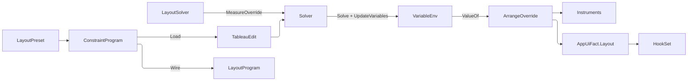

# [APPUI_LAYOUT_SOLVER]

## [01]-[INDEX]

- [02]-[CONSTRAINT_ALGEBRA]: Edge/size/anchor variables; equality/inequality/priority rows; the typed relation vocabulary.
- [03]-[LAYOUT_PRESETS]: Flex, grid-track, and auto-layout as constraint-row presets, never parallel panels.
- [04]-[SOLVER_PANEL]: The one `LayoutSolver` panel folding the Kiwi solve into measure/arrange.
- [05]-[TS_PROJECTION]: Generated `LayoutProgram` ordered constraint program the `@lume/kiwi` head re-solves.

## [02]-[CONSTRAINT_ALGEBRA]

- Owner: `LayoutVar` the named layout variable (edge, size, anchor); `LayoutTerm` the variable-times-coefficient; `LayoutExpr` the linear form; `LayoutEdge` the eight-item edge vocabulary; `LayoutRelation` the relation axis; `LayoutStrength` the priority axis; `LayoutConstraint` the typed equality/inequality binding; `VariableEnv` the `Variable`-handle owner carrying the observation-store column; `LayoutFault` the direct generated `[Union]` with one `[FaultCase]` leaf per layout failure.
- Cases: `LayoutEdge` = left | top | right | bottom | width | height | center-x | center-y; `LayoutRelation` = eq | le | ge; `LayoutStrength` = required | strong | medium | weak under the `Kiwi` lexicographic packing; `LayoutFault` = Unsatisfiable | NonLinear | UnknownVariable.
- Entry: `public Constraint Compile(VariableEnv env)` — compiles a typed `LayoutConstraint` into a `Kiwi` `Constraint` over the resolved `Variable` handles at the row's `Strength`; the algebra composes through `Kiwi` operator overloads (`Variable * double` → `Term`, `Term + Term` → `Expression`), never hand-built tableau rows.
- Auto: `LayoutVar` names a child's `Left`/`Top`/`Right`/`Bottom`/`Width`/`Height`/`CenterX`/`CenterY` plus the panel's own bounds, so a layout rule reads geometry by variable; `LayoutConstraint` binds a `LayoutExpr` to a `LayoutRelation` at a `LayoutStrength` mapping onto `Constraint.Equal`/`LessEqual`/`GreaterEqual` at `Strength.Required`/`Strong`/`Medium`/`Weak`; `Theme/tokens` `MetricFamily` rows supply spacing constants so a gap is a generated `TokenKey` resolved into the constraint, never a call-site literal; fixed structural rules use `required` and competing preferences use `strong`/`medium`/`weak` so the dual-simplex relaxes the lower-priority constraint instead of throwing.
- Growth: a new layout variable is one `LayoutVar` kind; a new relation is structurally fixed at three; a new priority is structurally fixed at four; a new fault case is one `[FaultCase]` leaf; zero new surface — the algebra is the absorbing vocabulary.
- Boundary: `LayoutStrength` closing at four rows is a CHOICE against `Strength.Create(a, b, c, w)`, whose lexicographic packing offers a continuum — a strength minted at a call site is a bare `double` no reader can rank against another panel's, and the ordered wire program would have to carry an opaque scalar where it now carries a locked literal the `@lume/kiwi` head re-packs identically; a fifth preference tier is one row added HERE; the constraint algebra is the one layout vocabulary — a parallel layout panel beside this is the `[04]-[BOUNDARIES]` parallel-control-framework rejected form; `LayoutEdge`'s key is the wire edge literal AND the `LayoutVar.Name` suffix, so the interior axis and the wire projection read one symbol source; `Constraint` identity is `Kiwi`-handle-based, so the solver alone owns equality INSIDE the tableau, while the AUTHORED `LayoutConstraint` row is the program-diff key `LayoutSolver.Load` retains beside each minted handle — two equalities on two types; boundary intake of constraint edits uses the `Kiwi` `Try*` family whole so `UnsatisfiableConstraintException` and the duplicate/unknown faults never cross the layout-update boundary as exceptions — they lift onto `Fin` as `LayoutFault`; `VariableEnv` mints every handle through a composition-bound `Func<LayoutVar, Option<IVariableStore>>` column, so the `IVariableStore` observation port is one composition value, the unbound arm taking `Kiwi`'s own in-memory store that `ValueOf` reads; the variable-introduction order derives from first appearance across the ordered constraint rows, so the program itself is the parity artifact and a stale environment snapshot can never desync the wire.

```csharp
// --- [TYPES] ---------------------------------------------------------------------------
[SmartEnum<string>]
[KeyMemberEqualityComparer<ComparerAccessors.StringOrdinal, string>]
public sealed partial class LayoutRelation {
    public static readonly LayoutRelation Eq = new(
        "eq", Rasm.Contracts.Ui.LayoutRelation.Eq, RelationalOperator.Equal);
    public static readonly LayoutRelation Le = new(
        "le", Rasm.Contracts.Ui.LayoutRelation.Le, RelationalOperator.LessThanOrEqual);
    public static readonly LayoutRelation Ge = new(
        "ge", Rasm.Contracts.Ui.LayoutRelation.Ge, RelationalOperator.GreaterThanOrEqual);

    public Rasm.Contracts.Ui.LayoutRelation Wire { get; }

    public RelationalOperator Operator { get; }
}

[SmartEnum<string>]
[KeyMemberEqualityComparer<ComparerAccessors.StringOrdinal, string>]
public sealed partial class LayoutStrength {
    public static readonly LayoutStrength Required = new(
        "required", Rasm.Contracts.Ui.LayoutStrength.Required, Strength.Required);
    public static readonly LayoutStrength Strong = new(
        "strong", Rasm.Contracts.Ui.LayoutStrength.Strong, Strength.Strong);
    public static readonly LayoutStrength Medium = new(
        "medium", Rasm.Contracts.Ui.LayoutStrength.Medium, Strength.Medium);
    public static readonly LayoutStrength Weak = new(
        "weak", Rasm.Contracts.Ui.LayoutStrength.Weak, Strength.Weak);

    public Rasm.Contracts.Ui.LayoutStrength Wire { get; }

    public double Value { get; }
}

[SmartEnum<string>]
[KeyMemberEqualityComparer<ComparerAccessors.StringOrdinal, string>]
[KeyMemberComparer<ComparerAccessors.StringOrdinal, string>]
public sealed partial class LayoutEdge {
    public static readonly LayoutEdge Left = new("left");
    public static readonly LayoutEdge Top = new("top");
    public static readonly LayoutEdge Right = new("right");
    public static readonly LayoutEdge Bottom = new("bottom");
    public static readonly LayoutEdge Width = new("width");
    public static readonly LayoutEdge Height = new("height");
    public static readonly LayoutEdge CenterX = new("center-x");
    public static readonly LayoutEdge CenterY = new("center-y");
}

public readonly record struct LayoutVar(string Owner, LayoutEdge Edge) {
    public string Name => $"{Owner}.{Edge.Key}";
}

public readonly record struct LayoutTerm(LayoutVar Variable, double Coefficient);

public readonly record struct LayoutExpr(Seq<LayoutTerm> Terms, double Constant) {
    public static LayoutExpr Of(LayoutVar variable, double coefficient = 1d) => new(Seq(new LayoutTerm(variable, coefficient)), 0d);
    public static LayoutExpr Fixed(double constant) => new(Seq<LayoutTerm>(), constant);
    public LayoutExpr Plus(double metric) => this with { Constant = Constant + metric };
    public LayoutExpr Plus(LayoutVar other, double coefficient = 1d) => this with { Terms = Terms.Add(new LayoutTerm(other, coefficient)) };
}

// --- [ERRORS] --------------------------------------------------------------------------
[Union(ConversionFromValue = ConversionOperatorsGeneration.None)]
public abstract partial record LayoutFault : Fault {
    private static readonly FaultBand FamilyBand = FaultBand.Layout;
    private LayoutFault(string detail) { Detail = detail; }
    public string Detail { get; }
    public override string Message => Detail;

    [FaultCase(0)]
    public sealed partial record Unsatisfiable(string Detail)   : LayoutFault(Detail);
    [FaultCase(1)]
    public sealed partial record NonLinear(string Detail)       : LayoutFault(Detail);
    [FaultCase(2)]
    public sealed partial record UnknownVariable(string Detail) : LayoutFault(Detail);
}

// --- [MODELS] --------------------------------------------------------------------------
public sealed record LayoutConstraint(LayoutExpr Left, LayoutRelation Relation, LayoutExpr Right, LayoutStrength Strength) {
    public string Detail =>
        $"{string.Join("+", Left.Terms.Map(static term => term.Variable.Name))} {Relation.Key} {string.Join("+", Right.Terms.Map(static term => term.Variable.Name))}";

    public Constraint Compile(VariableEnv env) =>
        Constraint.Make(env.Build(Left), Relation.Operator, env.Build(Right), Strength.Value);
}

// --- [SERVICES] ------------------------------------------------------------------------
public sealed class VariableEnv(Func<LayoutVar, Option<IVariableStore>> stores) {
    private readonly Dictionary<string, Variable> handles = new(StringComparer.Ordinal);

    public Variable Resolve(LayoutVar variable) {
        if (!handles.TryGetValue(variable.Name, out Variable? handle)) {
            handle = stores(variable).Match(
                Some: store => new Variable(store, variable.Name),
                None: () => new Variable(variable.Name));
            handles[variable.Name] = handle;
        }
        return handle;
    }

    public Expression Build(LayoutExpr expr) =>
        new(expr.Terms.Map(term => new Term(Resolve(term.Variable), term.Coefficient)).ToArray(), expr.Constant);

    public Fin<double> ValueOf(LayoutVar variable) =>
        handles.TryGetValue(variable.Name, out Variable? handle)
            ? Fin.Succ(handle.Value)
            : Fin.Fail<double>(new LayoutFault.UnknownVariable(variable.Name));

    public Unit Retain(Seq<LayoutVar> live) {
        FrozenSet<string> kept = live.Map(static variable => variable.Name).ToFrozenSet(StringComparer.Ordinal);
        toSeq(handles.Keys).Filter(name => !kept.Contains(name)).Iter(name => ignore(handles.Remove(name)));
        return unit;
    }
}
```

## [03]-[LAYOUT_PRESETS]

- Owner: `LayoutPreset` the `[Union]` of flex/grid-track/auto-layout preset rows; `MainAnchor` and `CrossPin` the capability vocabularies whose rows carry their own rule derivations; `FlexDirection`, `FlexJustify`, and `FlexAlign` the policy rosters over those vocabularies; `WrapPolicy` the two-row partition axis carrying the line split as its own delegate; `GridAxis` the two-row axis vocabulary the grid fold runs once per row; `ChromeProgram` the shell-chrome preset catalogue; `LayoutPrograms` the one flow-and-grid generator; `ConstraintProgram` the ordered constraint sequence a preset expands into, carrying its panel key as a declared field.
- Cases: `LayoutPreset` = Flow(FlexDirection, WrapPolicy, FlexJustify, FlexAlign, TokenKey Gap) | Grid(Seq<TrackSize> Columns, Seq<TrackSize> Rows, TokenKey Gap) | Anchor(Seq<LayoutConstraint> Rules) under the locked kind literals — `Gap` is a `Theme/tokens` `MetricFamily.At` key resolved at expansion.
- Entry: `public ConstraintProgram Expand(string panel, Seq<string> children, Func<string, double> extentOf, double available, Func<TokenKey, double> metric)` — folds a preset over its children into the ordered `ConstraintProgram`; `extentOf` supplies measured main extents and `available` the wrap width, both read only by the wrap partition; `metric` resolves the preset's `Gap` key against the resolved theme, bound at composition.
- Law: a preset is SELECTED by the resolved responsive tier and never authored against a width — `BreakpointRow.Program` (`Shell/navigation#ADAPTIVE_LAYOUT`) carries the preset each tier expands, so a width literal inside a preset row, a per-preset breakpoint column, and a second responsive table beside the tier ladder are all unspellable.
- Auto: `Stack` IS the degenerate auto-layout — one `LayoutPrograms.Flow` generator derives both, wrap `None` and `FlexJustify.Start` fixed, so a layout idiom is a parameter row over the generator, never a sibling program builder; `FlexJustify` rows distribute one shared per-line spread variable — `Anchors` names which ends pin, and a `Some` spread IS the distributed posture, its `LeadShare`/`TrailShare` scaling the edge gaps (`SpaceAround` = half-gap edges, `SpaceEvenly` = full-gap edges), so six justify modes are one derivation over policy columns and a `distributed` flag the spread's presence already spells is unspellable; `FlexAlign` rows pin the cross axis through their `CapabilitySet<CrossPin>` column, `Stretch` being `{Lead, Trail}` and `Center` the exclusive pin the closed roster alone can mint; `Grid` expands fractional/fixed/auto track sizes into `Kiwi` proportional constraints (`fr` tracks share one unit variable via weighted `strong` rows, fixed tracks pin at `required`, auto tracks register `medium` edit rows the measure pass suggests content sizes onto), the column and row halves ONE fold over the two `GridAxis` rows; wrap partitions measured extents greedily into synthetic line owners whose extents bound their children — every rule linear, so the dual-simplex owns the whole layout; `Anchor` is the raw constraint preset for bespoke layouts, produced today only by the canonical wire case.
- Packages: Kiwi, Rasm (kernel `CapabilitySet`/`ICapability`), Thinktecture.Runtime.Extensions, LanguageExt.Core, BCL inbox
- Growth: a new layout idiom is one `LayoutPreset` case parameterizing the generator; a new distribution mode is one `FlexJustify` row; a new cross pinning is one `CrossPin` row carrying its rule; a new track-size kind is one `TrackSize` case; a new chrome-slot geometry is one `ChromeProgram` row; zero new surface.
- Boundary: presets are constraint-row generators over the one algebra — a flex panel, a grid panel, and a uniform-grid panel beside this are the rejected forms; a wrap flow re-expands only when the width suggestion crosses a line-break boundary of the greedy partition, and the re-expansion lands through `LayoutSolver.Load`, whose delta touches exactly the line-owner rows the new partition moved — a whole-tableau rebuild would recompile every child's geometry rows at pointer rate to change a handful; an empty `Grid` track roster CANONICALIZES at expansion to one `Auto` track — admission canonicalizes at intake so the fold reads one regime and the per-use `Math.Max` guards the empty roster forced are gone; track sizes map onto `Kiwi` coefficient and strength patterns so a `1fr 2fr` split is two `strong` proportional rows against one unit variable, never per-track arithmetic; the gap is a `Theme/tokens` `TokenKey` minted by `MetricFamily.At`, so a preset names a GENERATED metric rung and a composed lookup string is unspellable; the `ChromeProgram` rows this owner publishes are the shell chrome's whole layout vocabulary — `Shell/navigation#SHELL_CHROME` names a program key per slot and hands its resolved children to the one panel, so a nav, a three-zone footer, and a HUD are three `Flow` rows differing in direction, justify, and gap alone, and a chrome-local `StackPanel`, `DockPanel`, or `Grid` is the parallel-panel rejected form; the `ConstraintProgram` is ordered (derived introduction order plus edit-variable set plus suggested-value sequence) so the desktop tableau and the `@lume/kiwi` web tableau converge to identical positions.

```csharp
// --- [TYPES] ---------------------------------------------------------------------------
[SmartEnum<string>]
[KeyMemberEqualityComparer<ComparerAccessors.StringOrdinal, string>]
public sealed partial class MainAnchor : ICapability<MainAnchor> {
    public static readonly MainAnchor Lead = new("lead",
        static (owner, first, last, axis, spread, share) => LayoutPrograms.Rule(
            LayoutExpr.Of(new(first, axis.MainLead)), LayoutRelation.Eq,
            LayoutExpr.Of(new(owner, axis.MainLead)).Plus(spread, share), LayoutStrength.Required));
    public static readonly MainAnchor Trail = new("trail",
        static (owner, first, last, axis, spread, share) => LayoutPrograms.Rule(
            LayoutExpr.Of(new(last, axis.MainTrail)), LayoutRelation.Eq,
            LayoutExpr.Of(new(owner, axis.MainTrail)).Plus(spread, -share), LayoutStrength.Required));

    [UseDelegateFromConstructor]
    public partial LayoutConstraint Pin(string owner, string first, string last, FlexDirection axis, LayoutVar spread, double share);
}

[SmartEnum<string>]
[KeyMemberEqualityComparer<ComparerAccessors.StringOrdinal, string>]
public sealed partial class CrossPin : ICapability<CrossPin> {
    public static readonly CrossPin Lead = new("lead", static axis => axis.CrossLead);
    public static readonly CrossPin Trail = new("trail", static axis => axis.CrossTrail);
    public static readonly CrossPin Center = new("center", static axis => axis.CrossCenter);

    [UseDelegateFromConstructor]
    public partial LayoutEdge EdgeOf(FlexDirection axis);
}

[SmartEnum<string>]
[KeyMemberEqualityComparer<ComparerAccessors.StringOrdinal, string>]
[KeyMemberComparer<ComparerAccessors.StringOrdinal, string>]
public sealed partial class FlexDirection {
    public static readonly FlexDirection Row = new("row", LayoutEdge.Left, LayoutEdge.Right, LayoutEdge.Width, LayoutEdge.CenterX, LayoutEdge.Top, LayoutEdge.Bottom, LayoutEdge.Height, LayoutEdge.CenterY, reversed: false);
    public static readonly FlexDirection Column = new("column", LayoutEdge.Top, LayoutEdge.Bottom, LayoutEdge.Height, LayoutEdge.CenterY, LayoutEdge.Left, LayoutEdge.Right, LayoutEdge.Width, LayoutEdge.CenterX, reversed: false);
    public static readonly FlexDirection RowReverse = new("row-reverse", LayoutEdge.Left, LayoutEdge.Right, LayoutEdge.Width, LayoutEdge.CenterX, LayoutEdge.Top, LayoutEdge.Bottom, LayoutEdge.Height, LayoutEdge.CenterY, reversed: true);
    public static readonly FlexDirection ColumnReverse = new("column-reverse", LayoutEdge.Top, LayoutEdge.Bottom, LayoutEdge.Height, LayoutEdge.CenterY, LayoutEdge.Left, LayoutEdge.Right, LayoutEdge.Width, LayoutEdge.CenterX, reversed: true);

    public LayoutEdge MainLead { get; }
    public LayoutEdge MainTrail { get; }
    public LayoutEdge MainExtent { get; }
    public LayoutEdge MainCenter { get; }
    public LayoutEdge CrossLead { get; }
    public LayoutEdge CrossTrail { get; }
    public LayoutEdge CrossExtent { get; }
    public LayoutEdge CrossCenter { get; }
    public bool Reversed { get; }
}

public readonly record struct MainSpread(double LeadShare, double TrailShare);

[SmartEnum<string>]
[KeyMemberEqualityComparer<ComparerAccessors.StringOrdinal, string>]
[KeyMemberComparer<ComparerAccessors.StringOrdinal, string>]
public sealed partial class FlexJustify {
    public static readonly FlexJustify Start = new("start", CapabilitySet<MainAnchor>.Of(MainAnchor.Lead), Option<MainSpread>.None);
    public static readonly FlexJustify Center = new("center", CapabilitySet<MainAnchor>.None, Option<MainSpread>.None);
    public static readonly FlexJustify End = new("end", CapabilitySet<MainAnchor>.Of(MainAnchor.Trail), Option<MainSpread>.None);
    public static readonly FlexJustify SpaceBetween = new("space-between", CapabilitySet<MainAnchor>.All, Some(new MainSpread(0d, 0d)));
    public static readonly FlexJustify SpaceAround = new("space-around", CapabilitySet<MainAnchor>.All, Some(new MainSpread(0.5d, 0.5d)));
    public static readonly FlexJustify SpaceEvenly = new("space-evenly", CapabilitySet<MainAnchor>.All, Some(new MainSpread(1d, 1d)));

    public CapabilitySet<MainAnchor> Anchors { get; }
    public Option<MainSpread> Spread { get; }
}

[SmartEnum<string>]
[KeyMemberEqualityComparer<ComparerAccessors.StringOrdinal, string>]
[KeyMemberComparer<ComparerAccessors.StringOrdinal, string>]
public sealed partial class FlexAlign {
    public static readonly FlexAlign Start = new("start", CapabilitySet<CrossPin>.Of(CrossPin.Lead));
    public static readonly FlexAlign Center = new("center", CapabilitySet<CrossPin>.Of(CrossPin.Center));
    public static readonly FlexAlign End = new("end", CapabilitySet<CrossPin>.Of(CrossPin.Trail));
    public static readonly FlexAlign Stretch = new("stretch", CapabilitySet<CrossPin>.Of(CrossPin.Lead, CrossPin.Trail));

    public CapabilitySet<CrossPin> Pins { get; }
}

[Union(ConversionFromValue = ConversionOperatorsGeneration.None)]
public abstract partial record TrackSize {
    private TrackSize() { }
    public sealed record Fr(double Weight) : TrackSize;
    public sealed record Fixed(double Pixels) : TrackSize;
    public sealed record Auto : TrackSize;
}

[SmartEnum<string>]
[KeyMemberEqualityComparer<ComparerAccessors.StringOrdinal, string>]
public sealed partial class WrapPolicy {
    public static readonly WrapPolicy None = new("none", static (_, _, _, _) => Option<Seq<Seq<string>>>.None);
    public static readonly WrapPolicy Lines = new("lines", static (ordered, extentOf, available, gap) => Some(LayoutPrograms.Lines(ordered, extentOf, available, gap)));

    [UseDelegateFromConstructor]
    public partial Option<Seq<Seq<string>>> Split(Seq<string> ordered, Func<string, double> extentOf, double available, double gap);
}

[SmartEnum<string>]
[KeyMemberEqualityComparer<ComparerAccessors.StringOrdinal, string>]
public sealed partial class GridAxis {
    public static readonly GridAxis Columns = new("col", LayoutEdge.Left, LayoutEdge.Width, static (index, columns) => index % columns);
    public static readonly GridAxis Rows = new("row", LayoutEdge.Top, LayoutEdge.Height, static (index, columns) => index / columns);

    public LayoutEdge Lead { get; }
    public LayoutEdge Extent { get; }

    [UseDelegateFromConstructor]
    public partial int Slot(int index, int columns);
}

// --- [MODELS] --------------------------------------------------------------------------
public sealed record EditRow(LayoutVar Var, LayoutStrength Strength);

public sealed record ValueRow(LayoutVar Var, double Value);

public sealed record ExtentProbe(LayoutVar Target, Seq<LayoutVar> Sources);

public sealed record ConstraintProgram(
    string Panel,
    Seq<LayoutConstraint> Constraints,
    Seq<EditRow> Edits,
    Seq<ValueRow> Suggestions,
    Seq<ExtentProbe> Measures) {
    public Seq<LayoutVar> Introduction =>
        (Constraints.Bind(static row => row.Left.Terms + row.Right.Terms).Map(static term => term.Variable)
         + Edits.Map(static edit => edit.Var)
         + Suggestions.Map(static suggestion => suggestion.Var)
         + Measures.Bind(static probe => probe.Sources.Add(probe.Target)))
        .Distinct();

    public ConstraintProgram ForPanel(string panel) => this with {
        Panel = panel,
        Edits = (Seq(
            new EditRow(new LayoutVar(panel, LayoutEdge.Width), LayoutStrength.Strong),
            new EditRow(new LayoutVar(panel, LayoutEdge.Height), LayoutStrength.Strong)) + Edits)
            .Distinct(static edit => edit.Var),
    };
}

[Union(ConversionFromValue = ConversionOperatorsGeneration.None)]
public abstract partial record LayoutPreset {
    private LayoutPreset() { }

    public sealed record Flow(FlexDirection Direction, WrapPolicy Wrap, FlexJustify Justify, FlexAlign Align, TokenKey Gap) : LayoutPreset;
    public sealed record Grid(Seq<TrackSize> Columns, Seq<TrackSize> Rows, TokenKey Gap) : LayoutPreset;
    public sealed record Anchor(Seq<LayoutConstraint> Rules) : LayoutPreset;

    public ConstraintProgram Expand(string panel, Seq<string> children, Func<string, double> extentOf, double available, Func<TokenKey, double> metric) =>
        Switch(
            state: (Panel: panel, Children: children, ExtentOf: extentOf, Available: available, Metric: metric),
            flow: static (ctx, f) => LayoutPrograms.Flow(ctx.Panel, ctx.Children, f.Direction, f.Wrap, f.Justify, f.Align, ctx.Metric(f.Gap), ctx.ExtentOf, ctx.Available),
            grid: static (ctx, g) => LayoutPrograms.Cells(ctx.Panel, ctx.Children, g.Columns, g.Rows, ctx.Metric(g.Gap)),
            anchor: static (ctx, a) => new ConstraintProgram(ctx.Panel, a.Rules, Seq<EditRow>(), Seq<ValueRow>(), Seq<ExtentProbe>()))
        .ForPanel(panel);
}

// --- [TABLES] --------------------------------------------------------------------------
[SmartEnum<string>]
[KeyMemberEqualityComparer<ComparerAccessors.StringOrdinal, string>]
[KeyMemberComparer<ComparerAccessors.StringOrdinal, string>]
public sealed partial class ChromeProgram {
    public static readonly ChromeProgram MenuBar = new("menu-bar",
        new LayoutPreset.Flow(FlexDirection.Row, WrapPolicy.None, FlexJustify.Start, FlexAlign.Center, MetricFamily.Space.At(1)));
    public static readonly ChromeProgram Toolbar = new("toolbar",
        new LayoutPreset.Flow(FlexDirection.Row, WrapPolicy.None, FlexJustify.Start, FlexAlign.Center, MetricFamily.Space.At(2)));
    public static readonly ChromeProgram NavExpanded = new("nav-expanded",
        new LayoutPreset.Flow(FlexDirection.Column, WrapPolicy.None, FlexJustify.Start, FlexAlign.Stretch, MetricFamily.Space.At(2)));
    public static readonly ChromeProgram NavCollapsed = new("nav-collapsed",
        new LayoutPreset.Flow(FlexDirection.Column, WrapPolicy.None, FlexJustify.Start, FlexAlign.Center, MetricFamily.Space.At(1)));
    public static readonly ChromeProgram StatusBar = new("status-bar",
        new LayoutPreset.Flow(FlexDirection.Row, WrapPolicy.None, FlexJustify.SpaceBetween, FlexAlign.Center, MetricFamily.Space.At(2)));
    public static readonly ChromeProgram HudStack = new("hud-stack",
        new LayoutPreset.Flow(FlexDirection.Column, WrapPolicy.None, FlexJustify.Start, FlexAlign.End, MetricFamily.Space.At(1)));
    public static readonly ChromeProgram ContextItems = new("context-items",
        new LayoutPreset.Flow(FlexDirection.Column, WrapPolicy.None, FlexJustify.Start, FlexAlign.Stretch, MetricFamily.Space.At(0)));

    public LayoutPreset.Flow Preset { get; }
}

// --- [OPERATIONS] ----------------------------------------------------------------------
public static class LayoutPrograms {
    public static Seq<LayoutConstraint> Geometry(string owner) => Seq(
        Rule(LayoutExpr.Of(new(owner, LayoutEdge.Right)), LayoutRelation.Eq, LayoutExpr.Of(new(owner, LayoutEdge.Left)).Plus(new LayoutVar(owner, LayoutEdge.Width)), LayoutStrength.Required),
        Rule(LayoutExpr.Of(new(owner, LayoutEdge.Bottom)), LayoutRelation.Eq, LayoutExpr.Of(new(owner, LayoutEdge.Top)).Plus(new LayoutVar(owner, LayoutEdge.Height)), LayoutStrength.Required),
        Rule(LayoutExpr.Of(new(owner, LayoutEdge.CenterX)), LayoutRelation.Eq, LayoutExpr.Of(new(owner, LayoutEdge.Left)).Plus(new LayoutVar(owner, LayoutEdge.Width), 0.5d), LayoutStrength.Required),
        Rule(LayoutExpr.Of(new(owner, LayoutEdge.CenterY)), LayoutRelation.Eq, LayoutExpr.Of(new(owner, LayoutEdge.Top)).Plus(new LayoutVar(owner, LayoutEdge.Height), 0.5d), LayoutStrength.Required),
        Rule(LayoutExpr.Of(new(owner, LayoutEdge.Width)), LayoutRelation.Ge, LayoutExpr.Fixed(0d), LayoutStrength.Required),
        Rule(LayoutExpr.Of(new(owner, LayoutEdge.Height)), LayoutRelation.Ge, LayoutExpr.Fixed(0d), LayoutStrength.Required));

    public static ConstraintProgram Flow(
        string panel, Seq<string> children, FlexDirection direction, WrapPolicy wrap, FlexJustify justify, FlexAlign align,
        double gap, Func<string, double> extentOf, double available) {
        Seq<string> ordered = direction.Reversed ? children.Rev() : children;
        Option<Seq<Seq<string>>> split = wrap.Split(ordered, extentOf, available, gap);
        Seq<Seq<string>> lines = split.IfNone(Seq(ordered));
        Seq<string> owners = split.Match(
            Some: partitioned => partitioned.Map((line, index) => $"{panel}.line{index}").Strict(),
            None: () => Seq(panel));
        Seq<LayoutConstraint> rows =
            Geometry(panel)
            + children.Bind(Geometry)
            + split.Match(
                Some: _ => owners.Bind(Geometry) + Band(panel, owners, direction, gap),
                None: () => Seq<LayoutConstraint>())
            + lines.Zip(owners).Bind(pair => Main(pair.Second, pair.First, direction, justify, align, gap));
        Seq<EditRow> edits = children.Bind(child => Seq(
            new EditRow(new LayoutVar(child, direction.MainExtent), LayoutStrength.Medium),
            new EditRow(new LayoutVar(child, direction.CrossExtent), LayoutStrength.Medium)));
        Seq<ExtentProbe> measures = children.Bind(child => Seq(
            new ExtentProbe(new LayoutVar(child, direction.MainExtent), Seq(new LayoutVar(child, direction.MainExtent))),
            new ExtentProbe(new LayoutVar(child, direction.CrossExtent), Seq(new LayoutVar(child, direction.CrossExtent)))));
        return new ConstraintProgram(panel, rows, edits, Seq<ValueRow>(), measures);
    }

    internal static Seq<Seq<string>> Lines(Seq<string> ordered, Func<string, double> extentOf, double available, double gap) {
        var folded = ordered.Fold(
            (Lines: Seq<Seq<string>>(), Line: Seq<string>(), Used: 0d),
            (state, child) => state.Line.IsEmpty || state.Used + gap + extentOf(child) <= available
                ? (state.Lines, state.Line.Add(child), state.Used + (state.Line.IsEmpty ? 0d : gap) + extentOf(child))
                : (state.Lines.Add(state.Line), Seq(child), extentOf(child)));
        return folded.Lines.Add(folded.Line).Filter(static line => !line.IsEmpty);
    }

    private static Seq<LayoutConstraint> Main(string owner, Seq<string> line, FlexDirection axis, FlexJustify justify, FlexAlign align, double gap) {
        LayoutVar spread = new($"{owner}.flow", axis.MainExtent);
        LayoutExpr After(string prior) => justify.Spread.Match(
            Some: _ => LayoutExpr.Of(new(prior, axis.MainTrail)).Plus(spread),
            None: () => LayoutExpr.Of(new(prior, axis.MainTrail)).Plus(gap));
        return line.Zip(line.Skip(1)).Map(pair =>
                Rule(LayoutExpr.Of(new(pair.Second, axis.MainLead)), LayoutRelation.Eq, After(pair.First), LayoutStrength.Required))
            + justify.Spread.Match(
                Some: _ => Seq(
                    Rule(LayoutExpr.Of(spread), LayoutRelation.Ge, LayoutExpr.Fixed(gap), LayoutStrength.Strong),
                    Rule(LayoutExpr.Of(spread), LayoutRelation.Ge, LayoutExpr.Fixed(0d), LayoutStrength.Required)),
                None: () => Seq<LayoutConstraint>())
            + line.Head.ToSeq().Bind(first => line.Last.ToSeq().Bind(last =>
                toSeq(MainAnchor.Items).Filter(justify.Anchors.Admits)
                    .Map(anchor => anchor.Pin(owner, first, last, axis, spread, justify.Spread.Match(
                        Some: shares => anchor == MainAnchor.Lead ? shares.LeadShare : shares.TrailShare,
                        None: () => 0d)))
                + (justify.Anchors.Admits(MainAnchor.Trail)
                    ? Seq<LayoutConstraint>()
                    : Seq(Rule(LayoutExpr.Of(new(owner, axis.MainTrail)), LayoutRelation.Ge, LayoutExpr.Of(new(last, axis.MainTrail)), LayoutStrength.Medium)))
                + (justify.Anchors == CapabilitySet<MainAnchor>.None
                    ? Seq(
                        Rule(LayoutExpr.Of(new(first, axis.MainLead)).Plus(new LayoutVar(last, axis.MainTrail)), LayoutRelation.Eq,
                            LayoutExpr.Of(new(owner, axis.MainLead)).Plus(new LayoutVar(owner, axis.MainTrail)), LayoutStrength.Strong),
                        Rule(LayoutExpr.Of(new(first, axis.MainLead)), LayoutRelation.Ge, LayoutExpr.Of(new(owner, axis.MainLead)), LayoutStrength.Required))
                    : Seq<LayoutConstraint>())))
            + line.Bind(child =>
                toSeq(CrossPin.Items).Filter(align.Pins.Admits)
                    .Map(pin => Rule(LayoutExpr.Of(new(child, pin.EdgeOf(axis))), LayoutRelation.Eq, LayoutExpr.Of(new(owner, pin.EdgeOf(axis))), LayoutStrength.Strong))
                + Seq(Rule(LayoutExpr.Of(new(owner, axis.CrossTrail)), LayoutRelation.Ge, LayoutExpr.Of(new(child, axis.CrossTrail)), LayoutStrength.Medium)));
    }

    private static Seq<LayoutConstraint> Band(string panel, Seq<string> lines, FlexDirection direction, double gap) =>
        lines.Head.ToSeq().Map(head =>
            Rule(LayoutExpr.Of(new(head, direction.CrossLead)), LayoutRelation.Eq, LayoutExpr.Of(new(panel, direction.CrossLead)), LayoutStrength.Required))
        + lines.Zip(lines.Skip(1)).Map(pair =>
            Rule(LayoutExpr.Of(new(pair.Second, direction.CrossLead)), LayoutRelation.Eq, LayoutExpr.Of(new(pair.First, direction.CrossTrail)).Plus(gap), LayoutStrength.Required))
        + lines.Bind(line => Seq(
            Rule(LayoutExpr.Of(new(line, direction.MainLead)), LayoutRelation.Eq, LayoutExpr.Of(new(panel, direction.MainLead)), LayoutStrength.Required),
            Rule(LayoutExpr.Of(new(line, direction.MainTrail)), LayoutRelation.Eq, LayoutExpr.Of(new(panel, direction.MainTrail)), LayoutStrength.Required)))
        + lines.Last.ToSeq().Map(last =>
            Rule(LayoutExpr.Of(new(panel, direction.CrossTrail)), LayoutRelation.Ge, LayoutExpr.Of(new(last, direction.CrossTrail)), LayoutStrength.Medium));

    public static ConstraintProgram Cells(string panel, Seq<string> children, Seq<TrackSize> columns, Seq<TrackSize> rows, double gap) {
        Seq<TrackSize> admittedColumns = columns.IsEmpty ? Seq<TrackSize>(new TrackSize.Auto()) : columns;
        int neededRows = children.IsEmpty ? 1 : (int)Math.Ceiling((double)children.Length / admittedColumns.Length);
        Seq<TrackSize> admittedRows = rows.IsEmpty ? Seq<TrackSize>(new TrackSize.Auto()) : rows;
        Seq<TrackSize> completedRows = admittedRows
            + Seq.generate(Math.Max(0, neededRows - admittedRows.Length), static _ => (TrackSize)new TrackSize.Auto());
        Seq<(GridAxis Axis, Seq<(string Owner, TrackSize Track)> Tracks)> axes = Seq(
            (GridAxis.Columns, admittedColumns.Map((track, i) => (Owner: $"{panel}.col{i}", Track: track)).Strict()),
            (GridAxis.Rows, completedRows.Map((track, j) => (Owner: $"{panel}.row{j}", Track: track)).Strict()));
        int columnCount = admittedColumns.Length;
        Seq<LayoutConstraint> mainRows =
            Geometry(panel) + children.Bind(Geometry)
            + axes.Bind(axis => Tracks(panel, axis.Tracks, axis.Axis, new LayoutVar($"{panel}.fr-{axis.Axis.Key}", axis.Axis.Extent), gap))
            + children.Bind((child, index) => axes.Bind(axis =>
                Pinned(child, axis.Tracks[axis.Axis.Slot(index, columnCount)].Owner, axis.Axis)));
        Seq<EditRow> edits = axes.Bind(axis => axis.Tracks.Bind(track => track.Track.Switch(
            fr: static _ => Seq<EditRow>(),
            @fixed: static _ => Seq<EditRow>(),
            auto: _ => Seq(new EditRow(new LayoutVar(track.Owner, axis.Axis.Extent), LayoutStrength.Medium)))));
        Seq<ExtentProbe> measures = axes.Bind(axis => axis.Tracks.Bind((track, slot) => track.Track.Switch(
            fr: static _ => Seq<ExtentProbe>(),
            @fixed: static _ => Seq<ExtentProbe>(),
            auto: _ => Seq(new ExtentProbe(
                new LayoutVar(track.Owner, axis.Axis.Extent),
                children.Bind((child, index) => axis.Axis.Slot(index, columnCount) == slot
                    ? Seq(new LayoutVar(child, axis.Axis.Extent))
                    : Seq<LayoutVar>()))))));
        return new ConstraintProgram(panel, mainRows, edits, Seq<ValueRow>(), measures);
    }

    private static Seq<LayoutConstraint> Tracks(string panel, Seq<(string Owner, TrackSize Track)> tracks, GridAxis axis, LayoutVar unit, double gap) =>
        tracks.Head.ToSeq().Map(head =>
            Rule(LayoutExpr.Of(new(head.Owner, axis.Lead)), LayoutRelation.Eq, LayoutExpr.Of(new(panel, axis.Lead)), LayoutStrength.Required))
        + tracks.Zip(tracks.Skip(1)).Map(pair =>
            Rule(LayoutExpr.Of(new(pair.Second.Owner, axis.Lead)), LayoutRelation.Eq, LayoutExpr.Of(new(pair.First.Owner, axis.Lead)).Plus(new LayoutVar(pair.First.Owner, axis.Extent)).Plus(gap), LayoutStrength.Required))
        + tracks.Last.ToSeq().Map(last =>
            Rule(LayoutExpr.Of(new(panel, axis.Lead.Equals(LayoutEdge.Left) ? LayoutEdge.Right : LayoutEdge.Bottom)), LayoutRelation.Eq,
                LayoutExpr.Of(new(last.Owner, axis.Lead)).Plus(new LayoutVar(last.Owner, axis.Extent)), LayoutStrength.Required))
        + tracks.Bind(track => track.Track.Switch(
            fr: f => Seq(Rule(LayoutExpr.Of(new(track.Owner, axis.Extent)), LayoutRelation.Eq, LayoutExpr.Of(unit, f.Weight), LayoutStrength.Strong)),
            @fixed: f => Seq(Rule(LayoutExpr.Of(new(track.Owner, axis.Extent)), LayoutRelation.Eq, LayoutExpr.Fixed(f.Pixels), LayoutStrength.Required)),
            auto: _ => Seq(Rule(LayoutExpr.Of(new(track.Owner, axis.Extent)), LayoutRelation.Ge, LayoutExpr.Fixed(0d), LayoutStrength.Required))));

    private static Seq<LayoutConstraint> Pinned(string child, string track, GridAxis axis) => Seq(
        Rule(LayoutExpr.Of(new(child, axis.Lead)), LayoutRelation.Eq, LayoutExpr.Of(new(track, axis.Lead)), LayoutStrength.Required),
        Rule(LayoutExpr.Of(new(child, axis.Extent)), LayoutRelation.Eq, LayoutExpr.Of(new(track, axis.Extent)), LayoutStrength.Required));

    internal static LayoutConstraint Rule(LayoutExpr left, LayoutRelation relation, LayoutExpr right, LayoutStrength strength) => new(left, relation, right, strength);
}
```

## [04]-[SOLVER_PANEL]

- Owner: `LayoutSolver` the one custom Avalonia `Panel` folding the `Kiwi` solve into measure/arrange; `TableauEdit` the closed four-verb delta vocabulary carrying its own inverse.
- Entry: `public Fin<Unit> Load(ConstraintProgram next)` — the transactional delta over the live tableau; `protected override Size MeasureOverride(Size availableSize)` and `protected override Size ArrangeOverride(Size finalSize)` — the named boundary capsule where the panel's own bounds drive as edit variables suggested to `availableSize`/`finalSize`, `Solver.Solve` runs the dual-simplex (`Solve` itself calls `UpdateVariables`, flushing each solved row constant into its `Variable.Value`), and `VariableEnv.ValueOf` reads the solved positions into each child's arrange rectangle.
- Auto: `Load` diffs the incoming `ConstraintProgram` against the live one and stages exactly the departed and arrived rows and edit variables as `TableauEdit` values, so the tableau is edited where Cassowary is incremental and rebuilt nowhere; `MeasureOverride` opens the pass (clearing the fault cell and capturing the `MonotonicTimeline` stamp), measures each child, suggests the available size to the panel's edit variables, then suggests every measured child extent onto its `Medium` edit row through `Measured` — retaining the folded probe values for the design-pinned projection — and reads the desired size from the solved panel extent; `ArrangeOverride` suggests the final size, runs `Solve`, arranges each child at its solved `(Left, Top, Width, Height)`, records the measured pass directly, and fires `AppUiFact.Layout` on the package hook dispatch; runtime drag, resize, and content-size changes flow through `AddEditVariable` plus `SuggestValue` so the layout re-solves without touching constraint rows at all.
- Evidence: `AppUiFact.Layout` carries the panel key, constraint count, measured elapsed span, and exact pass fault at `AppUiPoint.Layout`; the local violated-row count writes the `Relaxed` instrument directly, while `TelemetryRow` contributes the solve-duration, relaxed-constraint, and layout-fault rows inward through the AppHost `TelemetryContributorPort`.
- Packages: Kiwi, Avalonia, Rasm (kernel `MonotonicTimeline`/`Custody`/`Op`), Thinktecture.Runtime.Extensions, LanguageExt.Core, NodaTime, Rasm.AppHost (project)
- Growth: a new layout pass concern is one `LayoutSolver` policy value; a new tableau verb is one `TableauEdit` case whose `Inverse` and `Apply` arms break at compile time; one layout instrument is one `InstrumentSpec` row on `LayoutSolver.TelemetryRow`; zero new surface.
- Boundary: `LayoutSolver` is the named boundary capsule for the measure/arrange statement carve-out — the `Solver` mutation, the `SuggestValue` edits, and the child-arrange loop carry the only statement bodies, folding into Avalonia's native `Layoutable` pass rather than a parallel layout engine; `Load` is transactional through kernel `Custody.Rollback` over the `TableauEdit` inverse — the applied stack replays backwards on the first refusal, so a rejected program leaves the live system exactly as it stood, while a superseded program's handles retire through `VariableEnv.Retain`; the pass degrades to the LAST SOLVED STATE and never to zero — `Read` stays on `Fin` and `MeasureOverride` falls back to the panel's own prior `DesiredSize`; the fault cell ACCUMULATES first-wins and clears once at `MeasureOverride`, so a successful arrange can never erase a measure-pass fault; relaxation is measured, never inferred — `Kiwi` raises nothing when the dual-simplex leaves a soft row unmet, so the only honest reading is the post-solve scan of each live handle's own `Violated`, taken once after the arrange solve; solved positions read back through `VariableEnv.ValueOf` after `Solve` flushes the row constants, so the panel reads positions by direct value lookup and a per-frame poll is the rejected form; the `ControlFactory` `Panel`/`Dock` intents name their `ConstraintProgram`, hand it to this one panel through `MaterializeContext.Layout`, and stamp `ChildKeyProperty` from each child intent's `Key` in their `Mounted` fold before any child enters `Children` — the one admitted source of the solver's child identity, and the property is nullable so absence is `Option.None`, never an empty-string sentinel; child re-measurement reaches this panel through Avalonia's own desired-size edge — `Layoutable.Measure` notifies the visual parent exactly when the child's `DesiredSize` moved (`.api/api-avalonia.md` `[LAYOUT_PASS_OPERATIONS]`), so an out-of-band content-size change re-solves for free and a child-invalidation subscription beside it is the deleted form, while a solver-visible fact carrying no child-extent delta rides `Load` as a program delta; the panel's own measure stays Avalonia-native so a `LayoutSolver` nests inside ordinary Avalonia layout and an ordinary panel nests inside it.

```csharp
// --- [TYPES] ---------------------------------------------------------------------------
[Union(ConversionFromValue = ConversionOperatorsGeneration.None)]
public abstract partial record TableauEdit {
    private TableauEdit() { }
    public sealed record AddRow(LayoutConstraint Row, Constraint Handle) : TableauEdit;
    public sealed record DropRow(LayoutConstraint Row, Constraint Handle) : TableauEdit;
    public sealed record AddEdit(LayoutVar Var, LayoutStrength Strength) : TableauEdit;
    public sealed record DropEdit(LayoutVar Var, LayoutStrength Strength) : TableauEdit;

    public TableauEdit Inverse => Switch<TableauEdit>(
        addRow: static a => new DropRow(a.Row, a.Handle),
        dropRow: static d => new AddRow(d.Row, d.Handle),
        addEdit: static a => new DropEdit(a.Var, a.Strength),
        dropEdit: static d => new AddEdit(d.Var, d.Strength));

    public Fin<Unit> Apply(Solver solver, VariableEnv env) => Switch(
        state: (Solver: solver, Env: env),
        addRow: static (s, a) => s.Solver.TryAddConstraint(a.Handle)
            ? Fin.Succ(unit)
            : Fin.Fail<Unit>(new LayoutFault.Unsatisfiable(a.Row.Detail)),
        dropRow: static (s, d) => s.Solver.TryRemoveConstraint(d.Handle)
            ? Fin.Succ(unit)
            : Fin.Fail<Unit>(new LayoutFault.UnknownVariable(d.Row.Detail)),
        addEdit: static (s, a) => s.Solver.TryAddEditVariable(s.Env.Resolve(a.Var), a.Strength.Value)
            ? Fin.Succ(unit)
            : Fin.Fail<Unit>(new LayoutFault.UnknownVariable(a.Var.Name)),
        dropEdit: static (s, d) => s.Solver.TryRemoveEditVariable(s.Env.Resolve(d.Var))
            ? Fin.Succ(unit)
            : Fin.Fail<Unit>(new LayoutFault.UnknownVariable(d.Var.Name)));
}

// --- [SERVICES] ------------------------------------------------------------------------
public sealed class LayoutSolver(
    MonotonicTimeline line,
    InstrumentSet signals,
    HookSet<AppUiPoint, AppUiFact, TelemetrySource> hooks,
    Func<LayoutVar, Option<IVariableStore>> stores) : Panel {
    private static readonly Op Pass = Op.Of(name: "appui.layout.pass");

    private readonly VariableEnv env = new(stores);
    private readonly Solver solver = new();
    private HashMap<LayoutConstraint, Constraint> rows = HashMap<LayoutConstraint, Constraint>();
    private HashMap<LayoutVar, LayoutStrength> edits = HashMap<LayoutVar, LayoutStrength>();
    private ConstraintProgram program = new(Key, Seq<LayoutConstraint>(), Seq<EditRow>(), Seq<ValueRow>(), Seq<ExtentProbe>());
    private Seq<ValueRow> measured = Seq<ValueRow>();
    private Fin<MonotonicStamp> mark = Fin.Fail<MonotonicStamp>(Errors.None);

    public const string Key = "layout-solver";

    public Fin<Unit> Load(ConstraintProgram next) {
        HashMap<LayoutConstraint, Constraint> incoming = next.Constraints.Fold(
            HashMap<LayoutConstraint, Constraint>(),
            (held, row) => held.ContainsKey(row) ? held : held.Add(row, rows.Find(row).IfNone(() => row.Compile(env))));
        HashMap<LayoutVar, LayoutStrength> wanted = EditRows(next).Fold(
            HashMap<LayoutVar, LayoutStrength>(), static (held, edit) => held.AddOrUpdate(edit.Var, edit.Strength));
        Seq<TableauEdit> plan =
            Delta(rows, incoming, static (row, handle) => new TableauEdit.DropRow(row, handle))
            + Delta(edits, wanted, static (variable, strength) => new TableauEdit.DropEdit(variable, strength))
            + Delta(wanted, edits, static (variable, strength) => new TableauEdit.AddEdit(variable, strength))
            + Delta(incoming, rows, static (row, handle) => new TableauEdit.AddRow(row, handle));
        return Stage(plan).Map(_ => {
            (rows, edits, program) = (incoming, wanted, next);
            ignore(env.Retain(next.Introduction));
            InvalidateMeasure();
            return unit;
        });
    }

    private static Seq<TableauEdit> Delta<TKey, TValue>(
        HashMap<TKey, TValue> held, HashMap<TKey, TValue> other, Func<TKey, TValue, TableauEdit> edit) where TKey : notnull =>
        toSeq(held.AsIterable())
            .Filter(pair => other.Find(pair.Key).Map(value => EqualityComparer<TValue>.Default.Equals(value, pair.Value)).IfNone(false) is false)
            .Map(pair => edit(pair.Key, pair.Value));

    private Fin<Unit> Stage(Seq<TableauEdit> plan) {
        var staged = plan.FoldWhile(
            (Applied: Seq<TableauEdit>(), Result: Fin.Succ(unit)),
            (state, edit) => edit.Apply(solver, env).Match(
                Succ: _ => (state.Applied.Add(edit), state.Result),
                Fail: error => (state.Applied, Fin.Fail<Unit>(error))),
            static step => step.Item1.Result.Match(Succ: static _ => true, Fail: static _ => false));
        return staged.Result.Rollback(() =>
            staged.Applied.Rev().TraverseM(edit => edit.Inverse.Apply(solver, env)).As().Map(static _ => unit));
    }

    private static Seq<EditRow> EditRows(ConstraintProgram next) =>
        next.Edits
        + next.Suggestions
            .Map(static suggestion => new EditRow(suggestion.Var, LayoutStrength.Medium))
            .Filter(row => !next.Edits.Exists(edit => edit.Var == row.Var));

    private Option<Error> fault = None;

    protected override Size MeasureOverride(Size availableSize) {
        (fault, mark) = (None, line.Capture(Pass));
        toSeq(Children).Iter(child => child.Measure(availableSize));
        ignore(Park(Suggest(availableSize.Width, availableSize.Height)
            .Bind(_ => Measured())
            .Bind(_ => Op.Side(solver.Solve))));
        return new Size(
            Read(new LayoutVar(program.Panel, LayoutEdge.Width)).IfFail(_ => DesiredSize.Width),
            Read(new LayoutVar(program.Panel, LayoutEdge.Height)).IfFail(_ => DesiredSize.Height));
    }

    protected override Size ArrangeOverride(Size finalSize) {
        ignore(Park(Suggest(finalSize.Width, finalSize.Height).Bind(_ => Op.Side(solver.Solve))));
        toSeq(Children).Iter(child => ignore(SolvedRect(child).Match(
            Succ: rect => Op.Side(() => child.Arrange(rect)),
            Fail: error => Fin.Fail<Unit>(Park(error)))));
        Option<Duration> elapsed = mark
            .Bind(start => line.Capture(Pass).Bind(end => line.Elapsed(start, end, Pass)))
            .Match(
                Succ: span => Some(Duration.FromTimeSpan(span)),
                Fail: error => (Park(error), Option<Duration>.None).Item2);
        elapsed.Iter(span => {
            int violated = Slack();
            TagList tags = InstrumentSet.Tags((AppUiTelemetry.PanelSlot, program.Panel));
            ignore(signals.Write(Solve, span.TotalSeconds, tags)
                .Bind(_ => violated > 0 ? signals.Write(Relaxed, violated, tags) : Fin.Succ(unit))
                .Bind(_ => fault.Match(
                    Some: error => FaultObservation.Of(error).Code.Match(
                        Some: code => signals.Write(Fault, 1d, InstrumentSet.Tags(
                            (AppUiTelemetry.PanelSlot, program.Panel), (AppUiTelemetry.FaultSlot, code))),
                        None: () => signals.Write(Fault, 1d, tags)),
                    None: static () => Fin.Succ(unit)))
                .Bind(_ => hooks.Fire(
                    AppUiPoint.Layout,
                    new AppUiFact.Layout(
                        program.Panel,
                        checked((uint)program.Constraints.Count),
                        span,
                        fault.Map(FaultWire.Observe)),
                    Pass)));
        });
        return finalSize;
    }

    private int Slack() => toSeq(rows.Values).Filter(static handle => handle.Violated).Length;

    private Fin<Unit> Measured() {
        HashMap<LayoutVar, double> observed = toSeq(Children)
            .Bind(child => Optional(child.GetValue(ChildKeyProperty)).Map(owner => Seq(
                new ValueRow(new LayoutVar(owner, LayoutEdge.Width), child.DesiredSize.Width),
                new ValueRow(new LayoutVar(owner, LayoutEdge.Height), child.DesiredSize.Height))).IfNone(Seq<ValueRow>()))
            .ToHashMap(static row => (row.Var, row.Value));
        measured = program.Measures
            .Map(probe => new ValueRow(probe.Target, probe.Sources.Choose(observed.Find).Max(0d)))
            .Strict();
        return Suggested(measured.Filter(row => solver.HasEditVariable(env.Resolve(row.Var))));
    }

    private Error Park(Error error) {
        fault = fault.IsSome ? fault : Some(error);
        return error;
    }

    private Unit Park(Fin<Unit> outcome) => ignore(outcome.MapFail(Park));

    private Fin<Unit> Suggested(Seq<ValueRow> rows) =>
        rows.Traverse(row => solver.TrySuggestValue(env.Resolve(row.Var), row.Value)
                ? Validation<Error, Unit>.Success(unit)
                : Validation<Error, Unit>.Fail(Seq<Error>(new LayoutFault.UnknownVariable(row.Var.Name))))
            .As().Map(static _ => unit).ToFin();

    private Fin<Unit> Suggest(double width, double height) =>
        Suggested(Seq(
            new ValueRow(new LayoutVar(program.Panel, LayoutEdge.Width), width),
            new ValueRow(new LayoutVar(program.Panel, LayoutEdge.Height), height))
            + program.Suggestions);

    private Fin<double> Read(LayoutVar variable) => env.ValueOf(variable).MapFail(Park);

    public static readonly AttachedProperty<string?> ChildKeyProperty =
        AvaloniaProperty.RegisterAttached<LayoutSolver, Control, string?>("ChildKey");

    private Fin<Rect> SolvedRect(Control child) =>
        Optional(child.GetValue(ChildKeyProperty)).Match(
            Some: owner =>
                from left in env.ValueOf(new LayoutVar(owner, LayoutEdge.Left))
                from top in env.ValueOf(new LayoutVar(owner, LayoutEdge.Top))
                from width in env.ValueOf(new LayoutVar(owner, LayoutEdge.Width))
                from height in env.ValueOf(new LayoutVar(owner, LayoutEdge.Height))
                select new Rect(left, top, width, height),
            None: () => Fin.Fail<Rect>(new LayoutFault.UnknownVariable($"{child.GetType().Name} mounted without a program child key")));

    public static readonly InstrumentSpec Solve = InstrumentSpec.Create(
        "rasm.appui.layout.solve.elapsed", InstrumentKind.Distribution, MeasureForm.Real, "s",
        "constraint solve wall duration per panel", Seq(AppUiTelemetry.PanelSlot), Some(Buckets.InteractionSeconds), None, None);
    public static readonly InstrumentSpec Relaxed = InstrumentSpec.Create(
        "rasm.appui.layout.relaxed", InstrumentKind.Count, MeasureForm.Whole, "{constraint}",
        "soft constraints left unmet by the solve, per panel", Seq(AppUiTelemetry.PanelSlot), None, None, None);
    public static readonly InstrumentSpec Fault = InstrumentSpec.Create(
        "rasm.appui.layout.fault", InstrumentKind.Count, MeasureForm.Whole, "{fault}",
        "layout passes refused, by panel and fault code", Seq(AppUiTelemetry.PanelSlot, AppUiTelemetry.FaultSlot), None, None, None);

    public static TelemetryContributorPort TelemetryRow(string version) =>
        AppUiTelemetry.Contribute(version, Solve, Relaxed, Fault);

}
```



## [05]-[TS_PROJECTION]

- Entry: `LayoutMap.Emit(ConstraintProgram program, Seq<ValueRow> measured)` projects the live program once into `LayoutProgram`; `LayoutWireCases.ProtoJson` renders the deterministic canonical sequence through `WireJson.Formatter`.
- Growth: a new required contract member regenerates the binding and breaks the one projection or its completeness proof until supplied; one canonical case row per preset shape the generator admits; zero hand message or peer-schema surface.
- Boundary: Positional parity is a producer contract because an under-constrained Cassowary system admits many valid assignments. The projection emits the required nonempty surface identity, structured variable-introduction order, edit variables with generated `LayoutStrength`, authored suggestions, and resolved measurement suggestions in the order the desktop tableau consumed them; solved positions never cross. Interior `LayoutVar`/`LayoutTerm`/`LayoutExpr`/`LayoutConstraint` remain behavioral solver values, while generated messages are the one peer-facing shape. `LayoutRelation` and `LayoutStrength` carry their generated enum coordinate on the same behavioral row, so no string roster, STJ record, TypeScript interface mirror, or second JSON options surface survives. The AppUI contract test compares every such row set to the generated nonzero enum roster. `@rasm\/contracts/rasm/contracts/ui/layout_pb` supplies the peer schema, and `WireJson.Formatter` supplies the only JSON spelling. Canonical order holds as a FIXED POINT — one program emits byte-equal twice and a parse of that emission re-emits those same bytes.

```csharp
// --- [COMPOSITION] ---------------------------------------------------------------------
public static class LayoutMap {
    public static LayoutProgram Emit(ConstraintProgram program, Seq<ValueRow> measured) => new() {
        Surface = program.Panel,
        Constraints = { program.Constraints.Map(Constraint) },
        Introduction = { program.Introduction.Map(Variable) },
        Edits = { program.Edits.Map(Edit) },
        Suggestions = { program.Suggestions.Map(Value) },
        Measurements = { measured.Map(Value) },
    };

    public static LayoutVarWire Variable(LayoutVar variable) => new() {
        Owner = variable.Owner,
        Edge = variable.Edge.Key,
    };

    public static LayoutTermWire Term(LayoutTerm term) => new() {
        Variable = Variable(term.Variable),
        Coefficient = term.Coefficient,
    };

    public static LayoutExprWire Expr(LayoutExpr expression) => new() {
        Terms = { expression.Terms.Map(Term) },
        Constant = expression.Constant,
    };

    public static LayoutConstraintWire Constraint(LayoutConstraint row) => new() {
        Left = Expr(row.Left),
        Relation = row.Relation.Wire,
        Right = Expr(row.Right),
        Strength = row.Strength.Wire,
    };

    public static LayoutEdit Edit(EditRow row) => new() {
        Variable = Variable(row.Var),
        Strength = row.Strength.Wire,
    };

    public static LayoutValue Value(ValueRow row) => new() {
        Variable = Variable(row.Var),
        Value = row.Value,
    };

}

public static class LayoutWireCases {
    public static readonly Seq<string> Children = Seq("a", "b", "c");

    public const double Extent = 96d;
    public const double Available = 240d;
    public const double Gap = 8d;

    public static readonly Seq<(string Case, LayoutPreset Preset)> Canonical = Seq<(string, LayoutPreset)>(
        ("flow-row-start", new LayoutPreset.Flow(FlexDirection.Row, WrapPolicy.None, FlexJustify.Start, FlexAlign.Center, MetricFamily.Space.At(2))),
        ("flow-column-stretch", new LayoutPreset.Flow(FlexDirection.Column, WrapPolicy.None, FlexJustify.Start, FlexAlign.Stretch, MetricFamily.Space.At(2))),
        ("flow-row-between", new LayoutPreset.Flow(FlexDirection.Row, WrapPolicy.None, FlexJustify.SpaceBetween, FlexAlign.Center, MetricFamily.Space.At(2))),
        ("flow-row-evenly-wrapped", new LayoutPreset.Flow(FlexDirection.Row, WrapPolicy.Lines, FlexJustify.SpaceEvenly, FlexAlign.Start, MetricFamily.Space.At(1))),
        ("flow-row-reverse-end", new LayoutPreset.Flow(FlexDirection.RowReverse, WrapPolicy.None, FlexJustify.End, FlexAlign.End, MetricFamily.Space.At(1))),
        ("grid-fr-fixed-auto", new LayoutPreset.Grid(
            Seq<TrackSize>(new TrackSize.Fr(1d), new TrackSize.Fixed(120d), new TrackSize.Auto()),
            Seq<TrackSize>(new TrackSize.Auto()),
            MetricFamily.Space.At(1))),
        ("anchor-pinned", new LayoutPreset.Anchor(LayoutPrograms.Geometry("a"))));

    public static Seq<LayoutProgram> Wires =>
        Canonical
            .Map(static row => row.Preset.Expand($"proof.{row.Case}", Children, static _ => Extent, Available, static _ => Gap))
            .Map(static program => LayoutMap.Emit(program, program.Measures.Map(static probe => new ValueRow(probe.Target, Extent))))
            .Strict();

    public static string ProtoJson =>
        string.Join(Environment.NewLine, Wires.Map(WireJson.Formatter.Format));
}
```

## [06]-[RESEARCH]

(none)
