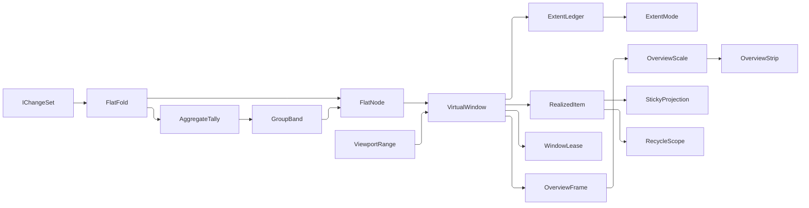

# [APPUI_VIRTUALIZATION_FABRIC]

One surface-agnostic virtualization fabric materializes only the visible window of arbitrary lists, trees, grids, and canvases: a million-row table, a deep model tree, and an infinite drafting canvas all render at constant cost from one owner. `VirtualWindow` maps a viewport range to a realized-item set with control recycling, sticky headers, variable-extent measurement, and one flatten producing item rows and synthetic group bands alike, folding over `DynamicData` `IChangeSet` so windowing is incremental rather than re-windowed per scroll tick. The page owns the window spec, the range-to-realized-item fold, the bound-collection lease, the variable-extent measurement model, the sticky-header projection, the hierarchical-and-grouped flatten, and the overview downsample every minimap reads together with the strip control that renders it; every windowed surface — tables, notebook cells, dashboard tiles, the drafting canvas, and the `ControlFactory` grid/tree/panel/overview intents — consumes this one fabric, never a per-surface virtualizer (the `[04]-[BOUNDARIES]` per-surface-virtualizer clause forecloses it). The spine is `DynamicData` `Sort`/`Virtualise`/`Page`/`TransformToTree`/`Group`/`TransformOnObservable`/`ForAggregation`/`Bind`, Avalonia `ItemsControl`/`Layoutable`, Thinktecture.Runtime.Extensions, and the kernel rails.

Rx is the DECLARED spine here rather than `Channel<T>`: every stage of this fabric is a live merge of change-sets against a viewport cell, and `Virtualise`, `Sort`, `Group`, `TransformToTree`, and `EditDiff` are the package's own operators over `IObservable<IChangeSet<,>>` — a producer/consumer queue between two of them would break the incremental change-set contract those operators derive from, so the scroll feed damps through `DistinctUntilChanged` over the package's own `VirtualRequest.StartIndexSizeComparer` and never through a channel's backpressure.

## [01]-[INDEX]

- [02]-[WINDOW_OWNER]: The window spec, the viewport-range-to-realized-item fold over `IChangeSet`, and the one bound-collection lease.
- [03]-[EXTENT_MEASURE]: Variable-extent measurement; fixed and measured row-height modes; scroll-offset math.
- [04]-[STICKY_HEADERS]: Group-band and pinned-row projection over the windowed stream.
- [05]-[HIERARCHY_FLATTEN]: The one flatten bridge every hierarchical and grouped surface routes through.
- [06]-[OVERVIEW_PROJECTION]: The downsample fold, the decoration lanes, and the strip control every minimap, ruler, and timeline reads.

## [02]-[WINDOW_OWNER]

- Owner: `VirtualWindowSpec` the window request shape; `ExtentMode` the fixed/measured axis carrying its readings as delegate columns; `OrderedChangeSet<TItem, TKey>` the source paired with the ONE comparer that orders it; `VirtualWindow<TItem, TKey>` the range-to-realized-item owner carrying the composition-bound fault cell; `RealizedItem<TItem>` the windowed item with its extent and offset; `WindowLease<TView>` the bound-collection carrier every windowed control consumes; `VirtualFault` the direct generated `[Union]` with one `[FaultCase]` leaf per virtualization failure.
- Cases: `VirtualFault` = RangeInverted | ExtentUnmeasured | KeyAbsent; `ExtentMode` = fixed | measured.
- Law: the comparer is the ONE ordering authority and it is a STREAM — `Sort` over a comparer observable produces the `ISortedChangeSet` `Virtualise` requires and re-sorts in place on every comparer the stream carries, so a column-sort flip is a delta on the live pipeline rather than a re-subscription that discards the cache, the recycle pool, and every measured extent; that same sorted value carries `SortedItems`, so the ledger's ordinal projection reads the order off the very change-set the window realizes and a second order snapshot beside it cannot disagree.
- Law: the extent mode DISPATCHES rather than being re-tested — each `ExtentMode` row carries the seat, total, and window readings as `[UseDelegateFromConstructor]` columns over the ledger's own `ExtentProbe`, so a third mode is one row and no ledger member re-asks which mode it is.
- Entry: `public IObservable<IChangeSet<RealizedItem<TItem>, TKey>> Realize(OrderedChangeSet<TItem, TKey> source, IObservable<ViewportRange> viewport)` — folds the source change-set against the live viewport range into exactly the realized items the window shows; the change-set carries its own key and `OrderedChangeSet` its comparer stream, so no key projection rides beside a value that already answers it; the realized set re-emits incrementally as the viewport scrolls, the comparer flips, or the source changes, never a full re-window. `public WindowLease<TView> Lease<TView>(…)` — the one bound-collection mint over that same fold. `public IObservable<OverviewFrame> Overview(…)` — the strip feed, paced by the ledger's own extent stream so a source delta outside the viewport re-frames the strip. `public IObservable<ViewportRange> Ranges(IObservable<double> offsets)` — the scroll-offset seam, lifting the host scroll position through the spec the ledger already holds. `public IDisposable Track(IObservable<RowArranged<TKey>> arranged)` — measured mode's ONE producer seam.
- Auto: `VirtualWindowSpec` carries the viewport extent (pixels), the overscan margin, the extent mode, and the optional nominal per-item extent — the live scroll offset arrives at `Range` — so a window request is one shape every windowed surface authors and the ledger reads its mode and its seed off that one value; the two policy rows are `FixedRow`/`Measured` FACTORIES over the mount's measured viewport extent, so the one slot no policy can know is a required argument rather than a preset default a caller silently inherits; the range fold composes `DynamicData` `Sort` into `Virtualise(IObservable<IVirtualRequest>)` so windowing is the settled `LiveData` operator, never a hand-sliced list — the request bounds and the placement each realized row carries derive from the same ledger, so both answer from one model; control recycling rides the `ControlFactory` `RecycleScope` pool (`Shell/controls`) so a scrolled-out control parks and a scrolled-in control reuses it; the realized count is the viewport extent over the item extent with overscan, so a million-row source realizes a constant window.
- Packages: Rasm.Contracts (project), DynamicData, System.Reactive, Avalonia, Rasm (kernel `FaultBand`/`[FaultCase]`/`Fault`/`FaultCell`/`HookId`), Thinktecture.Runtime.Extensions, LanguageExt.Core
- Growth: a new windowed surface is one `VirtualWindowSpec`; a new extent mode is one `ExtentMode` row carrying its three readings; a new bound view shape is one projection argument on `Lease`; a new fault case is one `[FaultCase]` leaf; zero new surface.
- Boundary: `VirtualWindow` is the one windowing owner every list/tree/grid/canvas consumes — a tables-local, notebook-local, dashboard-local, or canvas-local virtualizer is the `[04]-[BOUNDARIES]` per-surface-virtualizer rejected form, so `Editing/tables` tree-flatten, the notebook cell list, the dashboard tile grid, and the drafting canvas all route here; windowing is incremental over `IChangeSet` so a source insert or remove re-emits one change-set delta, never a full re-realize; `Virtualise` takes a SORTED change-set and a request stream typed to `IVirtualRequest`, so the fold sorts by the source's own comparer stream first and de-duplicates requests through the package's own `VirtualRequest.StartIndexSizeComparer` — a plain keyed change-set handed to `Virtualise` does not typecheck, and a second ordering snapshot supplied beside the comparer is the deleted form because the sorted change-set already carries `SortedItems` in the ledger's order; a frozen `IComparer<TItem>` column was the same defect the expansion axis already names rejected — a sort flip could only be spelled as a fresh `OrderedChangeSet` on a re-subscribed pipeline, discarding the source cache, the recycle pool, and every measured extent to change an ordering the package re-sorts in place, so a surface whose order never moves publishes one comparer and pays nothing for the shape; the window bounds a surface persists (`Editing/tables#VIEW_STATE` `ProjectionWindow`) read `ExtentLedger.Window` and `Live` for the current range, so restore re-requests the exact viewport with zero re-query and no consumer has to re-type its stream to reach a response object; `WindowLease<TView>` is the ONE bound-collection carrier — the realized change-set binds once into a `ReadOnlyObservableCollection` a control's `ItemsSource` takes and the lease carries the subscription, so a freed control frees its window binding and a per-consumer lease record beside this one is the deleted form (`Shell/controls` reads `WindowLease<RealizedItem<object>>` for the grid and tree kinds and `WindowLease<OptionRow>` for the option-bearing kinds, one type at both seats); `WindowLease`, `OrderedChangeSet`, and `VirtualWindow` are sealed CLASSES rather than records because each holds a live subscription, a live cell, or a cold stream — RULINGS `[02]` rules that a record copy shares such a cell by reference, and the synthesized value equality would additionally compare a `ReadOnlyObservableCollection` and an `IDisposable` by reference under the name of structural equality; the scroll offset crosses through the `Avalonia` `ScrollViewer.Offset` at the surface edge and `Ranges` lifts it as a pure value, so the window owner never owns the scroll control; `Virtualise` serves the continuous-scroll mode through this owner's `RealizedItem` fold, while the discrete-page mode rides the `Page` operator directly at the `Editing/tables` projection fold — a page is a source-side window with no extent to measure, so it never enters the ledger and a paged arm on this owner would be a second windowing owner over a concern `DynamicData` already closes; an unmeasured extent in measured mode faults so a window can never realize against an unknown extent, and that fault rides the stream AS A VALUE onto the composition-bound kernel `FaultCell` — `Observable.Throw` is the rejected form because `OnError` is terminal, so one transient bad range (a `NaN` offset mid-resize, a zero extent before the first measure) would dead-end the window for the surface's whole lifetime with no re-subscribe path; a bad range drops one window update instead, and the `FaultCell` bounds the storm as a shed count rather than as process memory.

```csharp
// --- [RUNTIME_PRELUDE] -----------------------------------------------------------------
using System.Collections.ObjectModel;
using System.Globalization;
using System.Numerics;
using System.Reactive.Disposables;
using System.Reactive.Linq;
using System.Windows.Input;
using Avalonia;
using Avalonia.Automation.Peers;
using Avalonia.Controls;
using Avalonia.Input;
using DynamicData;
using DynamicData.Aggregation;
using DynamicData.Binding;
using LanguageExt;
using LanguageExt.Common;
using Rasm.AppUi.Theme;
using Rasm.Domain;
using Thinktecture;
using static LanguageExt.Prelude;

namespace Rasm.AppUi.Shell;

// --- [ERRORS] --------------------------------------------------------------------------

[Union(ConversionFromValue = ConversionOperatorsGeneration.None)]
public abstract partial record VirtualFault : Fault {
    private static readonly FaultBand FamilyBand = FaultBand.Virtual;
    private VirtualFault(string detail) { Detail = detail; }
    public string Detail { get; }
    public override string Message => Detail;

    [FaultCase(0)]
    public sealed partial record RangeInverted(string Detail)    : VirtualFault(Detail);
    [FaultCase(1)]
    public sealed partial record ExtentUnmeasured(string Detail) : VirtualFault(Detail);
    [FaultCase(2)]
    public sealed partial record KeyAbsent(string Detail)        : VirtualFault(Detail);
}

// --- [TYPES] ---------------------------------------------------------------------------

public readonly record struct ViewportRange(double Offset, double Extent, double Overscan) {
    public Validation<Error, ViewportRange> Admit() =>
        (Finite(nameof(Offset), Offset), Finite(nameof(Extent), Extent), Finite(nameof(Overscan), Overscan))
            .Apply(static (offset, extent, overscan) => new ViewportRange(offset, extent, overscan))
            .As();

    private static Validation<Error, double> Finite(string column, double value) =>
        double.IsFinite(value) && value >= 0d
            ? Validation<Error, double>.Success(value)
            : Validation<Error, double>.Fail(
                (Error)new VirtualFault.RangeInverted($"{column}={value.ToString(CultureInfo.InvariantCulture)}"));

    public Fin<(int Start, int Size)> Indices(double itemExtent, int total) =>
        Admit().ToFin().Bind(range => double.IsFinite(itemExtent) && itemExtent > 0d
            ? Fin.Succ(range.Span(itemExtent, total))
            : Fin.Fail<(int, int)>(
                new VirtualFault.ExtentUnmeasured(itemExtent.ToString(CultureInfo.InvariantCulture))));

    private (int Start, int Size) Span(double itemExtent, int total) {
        int start = Math.Min(total, Math.Max(0, (int)((Offset - Overscan) / itemExtent)));
        return (start, Math.Min(total - start, (int)Math.Ceiling((Extent + (2d * Overscan)) / itemExtent) + 1));
    }
}

public readonly record struct ExtentProbe(
    Func<int> LiveOf,
    Func<int> RawOf,
    Func<double> SeedOf,
    Func<int, int> Ordinal,
    Func<int, double> Prefix,
    Func<int, double> Extent,
    Func<ViewportRange, Fin<(int Start, int Size)>> Sought) {
    public int Live => LiveOf();
    public int Raw => RawOf();
    public double Seed => SeedOf();
}

[SmartEnum<string>]
[KeyMemberEqualityComparer<ComparerAccessors.StringOrdinal, string>]
[KeyMemberComparer<ComparerAccessors.StringOrdinal, string>]
public sealed partial class ExtentMode {
    public static readonly ExtentMode Fixed = new("fixed", Rasm.Contracts.Ui.ExtentMode.Fixed,
        tracks: false,
        seatOf: static (probe, raw) => new RowSeat(probe.Ordinal(raw), probe.Ordinal(raw) * probe.Seed, probe.Seed),
        totalOf: static probe => probe.Live * probe.Seed,
        windowOf: static (probe, range) => range.Indices(probe.Seed, probe.Live));

    public static readonly ExtentMode Measured = new("measured", Rasm.Contracts.Ui.ExtentMode.Measured,
        tracks: true,
        seatOf: static (probe, raw) => new RowSeat(probe.Ordinal(raw), probe.Prefix(raw), probe.Extent(raw)),
        totalOf: static probe => probe.Prefix(probe.Raw),
        windowOf: static (probe, range) => probe.Sought(range));

    public Rasm.Contracts.Ui.ExtentMode Wire { get; }

    public bool Tracks { get; }

    [UseDelegateFromConstructor]
    public partial RowSeat SeatOf(ExtentProbe probe, int raw);

    [UseDelegateFromConstructor]
    public partial double TotalOf(ExtentProbe probe);

    [UseDelegateFromConstructor]
    public partial Fin<(int Start, int Size)> WindowOf(ExtentProbe probe, ViewportRange range);
}

// --- [CONSTANTS] -----------------------------------------------------------------------

public readonly record struct VirtualWindowSpec(
    double Extent,
    double Overscan,
    ExtentMode Mode,
    Option<double> NominalExtent) {
    public const double RowExtent = 28d;
    public const double OverscanBand = 256d;

    public static VirtualWindowSpec FixedRow(double viewportExtent, Option<double> rowExtent = default) =>
        new(viewportExtent, OverscanBand, ExtentMode.Fixed, rowExtent);

    public static VirtualWindowSpec Measured(double viewportExtent, Option<double> nominalExtent = default) =>
        new(viewportExtent, OverscanBand, ExtentMode.Measured, nominalExtent);

    public double Seed => NominalExtent.IfNone(RowExtent);

    public ViewportRange Range(double offset) => new(offset, Extent, Overscan);
}

// --- [MODELS] --------------------------------------------------------------------------

public readonly record struct RealizedItem<TItem>(TItem Item, int Index, double Offset, double Extent);

public readonly record struct RowArranged<TKey>(TKey Key, double Extent) where TKey : notnull;

public sealed class OrderedChangeSet<TItem, TKey>(
    IObservable<IChangeSet<TItem, TKey>> changes,
    IObservable<IComparer<TItem>> comparer) where TItem : notnull where TKey : notnull {
    public IObservable<IChangeSet<TItem, TKey>> Changes => changes;
    public IObservable<IComparer<TItem>> Comparer => comparer;
}

public sealed class WindowLease<TView>(ReadOnlyObservableCollection<TView> view, IDisposable lifetime) : IDisposable {
    public ReadOnlyObservableCollection<TView> View => view;
    public IDisposable Lifetime => lifetime;
    public void Dispose() => lifetime.Dispose();
}

// --- [OPERATIONS] ----------------------------------------------------------------------

public sealed class VirtualWindow<TItem, TKey>(ExtentLedger<TKey> ledger, FaultCell faults)
    where TItem : notnull where TKey : notnull {
    public static readonly HookId Point = HookId.Create("rasm.appui.shell.virtual-window");

    public ExtentLedger<TKey> Ledger => ledger;

    public IObservable<IChangeSet<RealizedItem<TItem>, TKey>> Realize(
        OrderedChangeSet<TItem, TKey> source,
        IObservable<ViewportRange> viewport) =>
        source.Changes
            .Sort(source.Comparer)
            .Do(Admitted)
            .Virtualise(viewport.SelectMany(Requested).DistinctUntilChanged(VirtualRequest.StartIndexSizeComparer))
            .Transform(Realized);

    public WindowLease<TView> Lease<TView>(
        OrderedChangeSet<TItem, TKey> source,
        IObservable<ViewportRange> viewport,
        Func<RealizedItem<TItem>, TView> view) where TView : notnull {
        IObservable<IChangeSet<TView, TKey>> bound = Realize(source, viewport).Transform(view);
        IDisposable lifetime = bound.Bind(out ReadOnlyObservableCollection<TView> collection).Subscribe();
        return new WindowLease<TView>(collection, lifetime);
    }

    public IObservable<ViewportRange> Ranges(IObservable<double> offsets) =>
        offsets.Select(ledger.Spec.Range).DistinctUntilChanged();

    public IDisposable Track(IObservable<RowArranged<TKey>> arranged) =>
        ledger.Spec.Mode.Tracks
            ? arranged.Subscribe(row => Parked(ledger.Measure(row.Key, row.Extent)))
            : Disposable.Empty;

    public IObservable<OverviewFrame> Overview(
        IObservable<ViewportRange> viewport,
        IObservable<Seq<OverviewBand>> bands) =>
        Observable.CombineLatest(
            ledger.Totals,
            viewport.DistinctUntilChanged(),
            bands.StartWith(Seq<OverviewBand>()),
            static (total, range, lanes) => new OverviewFrame(
                new Rect(0d, 0d, 1d, total),
                new Rect(0d, range.Offset, 1d, range.Extent),
                lanes));

    private void Admitted(ISortedChangeSet<TItem, TKey> sorted) =>
        ledger.Admit(sorted).Breaches.Iter(fault => ignore(Park(fault)));

    private IObservable<IVirtualRequest> Requested(ViewportRange range) =>
        ledger.Window(range).Match(
            Succ: static window => Observable.Return<IVirtualRequest>(new VirtualRequest(window.Start, window.Size)),
            Fail: Refused);

    private IObservable<IVirtualRequest> Refused(Error error) {
        ignore(faults.Park(point: Point, cause: error));
        return Observable.Empty<IVirtualRequest>();
    }

    private RealizedItem<TItem> Realized(TItem item, TKey key) {
        (RowSeat seat, Option<VirtualFault> breach) = ledger.SeatOf(key);
        breach.Iter(fault => ignore(Park(fault)));
        return new RealizedItem<TItem>(item, seat.Index, seat.Offset, seat.Extent);
    }

    private Transition<Seq<IsolatedFault>> Park(VirtualFault fault) =>
        faults.Park(point: Point, cause: fault);

}
```

## [03]-[EXTENT_MEASURE]

- Owner: `ExtentLedger<TKey>` the per-key extent and cumulative-offset model, carrying its `VirtualWindowSpec` as a construction column so the extent mode and the pre-measure seed resolve from one value; `RowSeat` the live index, offset, and extent a realized row carries; `AdmitReport` the admission's own answer.
- Entry: `public AdmitReport Admit<TItem>(ISortedChangeSet<TItem, TKey> sorted)` — ONE argument carrying both the keyed deltas and the ordering snapshot, applying the changes and then rebuilding the ordinal projection from that same value's `SortedItems` while retaining measured extents, and ANSWERING the seated mass, the released mass, the total transition, and every breach; `public (RowSeat Seat, Option<VirtualFault> Breach) SeatOf(TKey key)` — the one keyed read the realize fold takes, total by repair and carrying its own breach; `public Option<TKey> KeyAt(int liveIndex)` — the INVERSE read, resolving a live row address back to the key seated there, non-appending because an address is a query about what the ledger holds; `public Fin<Unit> Measure(TKey key, double extent)` — a validated point delta update over an already-registered ordinal; `public Fin<(int Start, int Size)> Window(ViewportRange range)` — the request bounds in one answer; `public double Total`, `public IObservable<double> Totals`, and `public int Live` — the content extent as a snapshot and as a stream, and the live count every scrollbar, strip, and persisted window bound reads.
- Law: every mutating primitive ANSWERS what it retired (RULINGS `[02]`) — `Adjust` hands back the extent it displaced, `Retire` the extent it tombstoned, `Publish` the kernel `Transition<double>` its swap produced — so a caller that must fold the retired mass reads it rather than re-deriving it from a total that already moved.
- Auto: in fixed mode the extent is the spec's seed and the offset is the live ordinal times that seed, so the scroll math is exact and O(1); in measured mode each realized row reports its measured extent through `Measure`, the ledger keeps a Fenwick prefix-sum tree of cumulative extents so `SeatOf` and `Total` are O(log n), and a not-yet-measured row uses the running average extent as its estimate so the scrollbar is stable before every row measures; the scroll-to-index seek resolves the target offset from the ledger so a programmatic scroll lands exactly; the mode elects which of those two readings answers, so no member re-tests it.
- Packages: DynamicData, System.Reactive, Rasm (kernel `Atom`/`Cell`/`Transition`), Thinktecture.Runtime.Extensions, LanguageExt.Core, BCL inbox
- Growth: a new extent estimator is one `VirtualWindowSpec` column read at the ledger's construction; a new extent mode is one `ExtentMode` row carrying its three readings; zero new surface.
- Boundary: `VirtualWindowSpec` is the ONE extent-mode owner and the ledger takes it whole at construction — a parallel `MeasurePolicy` record pairing a second `Mode` with a second estimate is the deleted twin, because the ledger has always branched on this spec's `Mode`, so the twin's mode was structurally unreadable and its estimate duplicated the density row height under a name no caller could vary; the seed derives (`Seed` = the caller's nominal extent, the density row height otherwise), so a measured window with a known row height stabilizes its scrollbar before the first measure without a second policy value; the ordering snapshot arrives ON the sorted change-set rather than through a caller delegate, so the sequence the ledger projects and the sequence the window realizes are one value; extent measurement is the one ledger — a per-surface row-height table is the rejected form, so fixed-height grids and variable-height tree rows share one extent model; a group band is an ordinary registered node, so a collapsed group retires its members' ordinals exactly as a removal does and the scrollbar shrinks by their measured extent with no grouping-aware branch anywhere in this owner; a band whose header is taller than a row elects `Measured` — the mode that exists for heterogeneous extents and costs O(log n) — rather than a band-extent column every fixed window would carry as a duplicate of its row height, and `VirtualWindow.Track` is that mode's declared producer so the arm is fed rather than merely reachable; the three Fenwick walks are the page's NAMED kernel exemption (`EXPRESSION_SPINE`) — a lowbit ascent, a lowbit prefix descent, and an order-statistic binary descent have no corpus operator, kernel `Ranked<T,TKey>` (`Rasm/Domain/stats.md`) being a k-capacity priority queue rather than a prefix tree — and each is stated ONCE, generic over `INumber<T>`, so the extent tree and the tombstone tree share one body per direction instead of six verbatim loops; prefix sums equal the sum of registered extents across every capacity boundary — the online append initializes each new Fenwick cell to its covered-range sum, so backing-store growth never zeroes an ancestor aggregate and the seek selects the same ordinal as a reference cumulative model after growth, a full-list offset rescan being the rejected repair; the tombstone ordinal space never reaches the window — a sibling retired-count Fenwick rides beside the extent tree and the live projection maps every raw ordinal onto the live ordinal space `DynamicData.Virtualise` actually windows, so the request bounds and the `RowSeat.Index` `SeatOf` answers are live positions after any removal and a removal before the viewport can never shift the requested window off its intended rows; the not-yet-measured estimate uses the running average so the scrollbar never jumps when a row first measures; the fixed-mode path keeps the scroll math integer-exact (`Editing/tables#GRID_SUBSTRATE` fixed density-token row height), so a fixed grid pays no measurement cost; a measured offset query before any measurement returns the average-estimate offset rather than faulting, so the window realizes before the first measure pass; `SeatOf` is the ONE keyed read and it is total by REPAIR — an unregistered key appends at the running estimate exactly as `Measure` already admits an unseen key, so the row carries a real live ordinal and the `KeyAbsent` breach rides its `Option` to the window's fault cell as counted evidence, while three independent lookups each substituting their own sentinel (`-1`, `0d`, the average) is the deleted form that let an unregistered row enter the realized set at offset zero and be pinned as a header; `KeyAt` is that read's INVERSE and it is total by ABSENCE rather than by repair — a key-to-address question is a claim that the row exists and repairs itself into the ledger, while an address-to-key question is a query about what the ledger already holds, so an out-of-range or tombstoned address answers `None` and a scrub, a jump, and a row-address conversion refuse instead of appending a phantom row at the running estimate; both inversions ride the SAME parameterized descent over their own tree, so a live address resolves in O(log n) and no consumer scans the order list to invert the projection, and `Editing/history#TIMELINE_SURFACE` `OrdinalAt` is its reader — a content-space offset seeks a row address through `Window` and reads the key at that address for the revert ordinal it carries; the rebuild is ONE body with two triggers, because the divergence re-seat and the tombstone-majority compaction cleared the same five structures, reallocated the same two trees, zeroed the same three counters, and re-appended, differing only in the key source they folded; compaction fires at the END of an admission rather than inside `Retire`, so no rebuild runs mid-fold and no interior primitive publishes one total per re-appended row; the content extent is ONE kernel `Atom<double>` and `Totals` is that cell's own `Change` event lifted — `Swap` IS the single-publish law the hand-written publish discipline used to assert, so the snapshot and the stream cannot disagree and a strip paces off the ledger's own change rather than off a viewport that a source delta never moves; the ledger is UI-thread-confined and its swap body is a pure read of its own state, so the CAS re-run law that forbids effects inside a swap is satisfied by construction.

```csharp
// --- [MODELS] --------------------------------------------------------------------------

public readonly record struct RowSeat(int Index, double Offset, double Extent);

public readonly record struct AdmitReport(
    double Seated,
    double Released,
    Transition<double> Total,
    Seq<VirtualFault> Breaches);

// --- [OPERATIONS] ----------------------------------------------------------------------

public sealed class ExtentLedger<TKey> where TKey : notnull {
    private readonly Dictionary<TKey, int> ordinals = new();
    private readonly List<TKey> order = [];
    private readonly List<double> extents = [];
    private double[] fenwick = new double[16];
    private int[] tombstones = new int[16];
    private readonly Atom<double> content = Atom(0d);
    private readonly ExtentProbe probe;
    private double extentSum;
    private int live;
    private int retired;

    public ExtentLedger(VirtualWindowSpec spec) {
        Spec = spec;
        probe = new ExtentProbe(
            LiveOf: () => live,
            RawOf: () => order.Count,
            SeedOf: () => Spec.Mode == ExtentMode.Fixed ? Spec.Seed : AverageExtent,
            Ordinal: LiveIndex,
            Prefix: index => Prefix(fenwick, index),
            Extent: index => index < extents.Count ? extents[index] : AverageExtent,
            Sought: Sought);
    }

    public VirtualWindowSpec Spec { get; }

    public int Live => live;

    public double Total => content.Value;

    public IObservable<double> Totals =>
        Observable
            .FromEvent<AtomChangedEvent<double>, double>(
                handler => content.Change += handler,
                handler => content.Change -= handler)
            .StartWith(content.Value)
            .DistinctUntilChanged();

    private double AverageExtent => live > 0 ? extentSum / live : Spec.Seed;

    public AdmitReport Admit<TItem>(ISortedChangeSet<TItem, TKey> sorted) where TItem : notnull {
        (double Seated, double Released, Seq<VirtualFault> Breaches) fold = toSeq(sorted).Fold(
            (Seated: 0d, Released: 0d, Breaches: Seq<VirtualFault>()),
            (state, change) => change.Reason switch {
                ChangeReason.Add when !ordinals.ContainsKey(change.Key) =>
                    (state.Seated + Append(change.Key, AverageExtent), state.Released, state.Breaches),
                ChangeReason.Remove => Retire(change.Key).Match(
                    Some: released => (state.Seated, state.Released + released, state.Breaches),
                    None: () => (
                        state.Seated,
                        state.Released,
                        state.Breaches.Add(new VirtualFault.KeyAbsent(Named(change.Key))))),
                _ => state,
            });

        if (retired * 2 > order.Count) { Rebuild(Kept()); }
        else if (Diverged(sorted.SortedItems)) { Rebuild(Sequenced(sorted.SortedItems)); }
        return new AdmitReport(fold.Seated, fold.Released, Publish(), fold.Breaches);
    }

    public Fin<Unit> Measure(TKey key, double extent) {
        if (!double.IsFinite(extent) || extent < 0d) {
            return Fin.Fail<Unit>(
                new VirtualFault.ExtentUnmeasured(extent.ToString(CultureInfo.InvariantCulture)));
        }
        _ = ordinals.ContainsKey(key) ? Adjust(key, extent) : Append(key, extent);
        _ = Publish();
        return Fin.Succ(unit);
    }

    public (RowSeat Seat, Option<VirtualFault> Breach) SeatOf(TKey key) {
        if (ordinals.TryGetValue(key, out int index)) { return (Spec.Mode.SeatOf(probe, index), None); }
        _ = Append(key, AverageExtent);
        _ = Publish();
        return (Spec.Mode.SeatOf(probe, ordinals[key]), Some<VirtualFault>(new VirtualFault.KeyAbsent(Named(key))));
    }

    public Option<TKey> KeyAt(int liveIndex) {
        if (liveIndex < 0 || liveIndex >= live) { return None; }
        int index = Descend(liveIndex, static (tree, next, bit) => bit - tree[next], tombstones).Index;
        return index < order.Count && ordinals.ContainsKey(order[index]) ? Some(order[index]) : None;
    }

    public Fin<(int Start, int Size)> Window(ViewportRange range) => Spec.Mode.WindowOf(probe, range);

    // --- [FENWICK] ---------------------------------------------------------------------

    private static void Ascend<T>(T[] tree, int index, int bound, T delta) where T : INumber<T> {
        for (int at = index + 1; at <= bound; at += at & -at) { tree[at] += delta; }
    }

    private static T Prefix<T>(T[] tree, int index) where T : INumber<T> {
        T sum = T.Zero;
        for (int at = index; at > 0; at -= at & -at) { sum += tree[at]; }
        return sum;
    }

    private (int Index, T Residue) Descend<T>(T target, Func<T[], int, T, T> cost, T[] tree)
        where T : INumber<T> {
        int index = 0;
        T residue = target;
        for (int bit = 1 << BitOperations.Log2((uint)Math.Max(1, order.Count)); bit > 0; bit >>= 1) {
            int next = index + bit;
            if (next > order.Count) { continue; }
            T step = cost(tree, next, T.CreateChecked(bit));
            if (step <= residue) { residue -= step; index = next; }
        }
        return (index, residue);
    }

    // --- [LEDGER_STATE] ----------------------------------------------------------------

    private double Append(TKey key, double extent) {
        int index = order.Count;
        ordinals[key] = index;
        order.Add(key);
        extents.Add(extent);
        extentSum += extent;
        live++;
        int position = index + 1;
        EnsureCapacity(position);
        fenwick[position] = extent + Prefix(fenwick, index) - Prefix(fenwick, position - (position & -position));
        tombstones[position] = Prefix(tombstones, index) - Prefix(tombstones, position - (position & -position));
        return extent;
    }

    private double Adjust(TKey key, double extent) {
        int index = ordinals[key];
        double prior = extents[index];
        extents[index] = extent;
        extentSum += extent - prior;
        Ascend(fenwick, index, order.Count, extent - prior);
        return prior;
    }

    private Option<double> Retire(TKey key) {
        if (!ordinals.TryGetValue(key, out int index)) { return None; }
        double released = Adjust(key, 0d);
        Ascend(tombstones, index, order.Count, 1);
        _ = ordinals.Remove(key);
        live--;
        retired++;
        return Some(released);
    }

    private void Rebuild(Seq<(TKey Key, double Extent)> kept) {
        ordinals.Clear();
        order.Clear();
        extents.Clear();
        fenwick = new double[Math.Max(16, kept.Count + 1)];
        tombstones = new int[fenwick.Length];
        (extentSum, live, retired) = (0d, 0, 0);
        kept.Iter(row => _ = Append(row.Key, row.Extent));
    }

    private Seq<(TKey Key, double Extent)> Kept() =>
        toSeq(order).Filter(ordinals.ContainsKey).Map(key => (Key: key, Extent: extents[ordinals[key]])).Strict();

    private Seq<(TKey Key, double Extent)> Sequenced<TItem>(IKeyValueCollection<TItem, TKey> sorted)
        where TItem : notnull =>
        toSeq(sorted)
            .Map(pair => (
                Key: pair.Key,
                Extent: ordinals.TryGetValue(pair.Key, out int index) ? extents[index] : AverageExtent))
            .Strict();

    private bool Diverged<TItem>(IKeyValueCollection<TItem, TKey> sorted) where TItem : notnull {
        Seq<TKey> alive = toSeq(order).Filter(ordinals.ContainsKey).Strict();
        return alive.Count != sorted.Count
            || !alive
                .Zip(toSeq(sorted).Map(static pair => pair.Key))
                .ForAll(static pair => EqualityComparer<TKey>.Default.Equals(pair.Item1, pair.Item2));
    }

    private Fin<(int Start, int Size)> Sought(ViewportRange range) =>
        range.Admit().ToFin().Map(admitted => live == 0
            ? (Start: 0, Size: 0)
            : (Start: LiveIndex(Seek(admitted.Offset - admitted.Overscan)),
               Size: Math.Max(
                   1,
                   LiveIndex(Seek(admitted.Offset + admitted.Extent + admitted.Overscan))
                   - LiveIndex(Seek(admitted.Offset - admitted.Overscan)) + 1)));

    private int Seek(double offset) =>
        Math.Clamp(
            Descend(Math.Max(0d, offset), static (tree, next, _) => tree[next], fenwick).Index,
            0,
            Math.Max(0, order.Count - 1));

    private int LiveIndex(int raw) => raw - Prefix(tombstones, raw);

    private static string Named(TKey key) => key.ToString() ?? nameof(TKey);

    private Transition<double> Publish() => Cell.Commit(content, _ => Spec.Mode.TotalOf(probe));

    private void EnsureCapacity(int position) {
        if (position < fenwick.Length) { return; }
        double[] grown = new double[Math.Max(fenwick.Length * 2, position + 1)];
        int[] grownTombstones = new int[grown.Length];
        fenwick.CopyTo(grown, 0);
        tombstones.CopyTo(grownTombstones, 0);
        (fenwick, tombstones) = (grown, grownTombstones);
    }
}
```

## [04]-[STICKY_HEADERS]

- Owner: `PinRole` the overlay-origin vocabulary; `PinnedRow<TItem>` the sticky node with its role, offset, and extent; `StickyProjection` the pinned overlay seated ON the window owner.
- Cases: `PinRole` = group-header | pinned-summary | tree-ancestor.
- Entry: `public IObservable<Seq<PinnedRow<TItem>>> Pinned(OrderedChangeSet<FlatNode<TItem>, TKey> source, IObservable<ViewportRange> viewport, Func<TItem, TKey> keyOf, Func<TItem, Option<TKey>> parentOf, Func<TItem, bool> pinnedOf)` — one overlay fold over the window's OWN realized stream, constructing every `PinRole`: the nearest group band above the viewport top, the exact parent-key ancestor chain, and every explicitly pinned row that scrolled above the viewport top.
- Auto: a grouped window pins the nearest realized `FlatNode.Band` above the viewport top so the header stays visible while its members scroll, carrying that band's own label and aggregate cells; a tree window follows `parentOf` from the top visible key through exact realized ancestors retained by overscan, so a shallower sibling or cousin cannot enter the chain by depth alone; explicitly pinned summaries survive the scroll as `PinRole.PinnedSummary` entries once their offset leaves the viewport; the pinned set re-projects on every window or viewport edge, and each pinned row carries the realized extent the overlay host stacks it by.
- Packages: DynamicData, System.Reactive, Thinktecture.Runtime.Extensions, LanguageExt.Core
- Growth: a new pin role is one `PinRole` row plus its arm on the one overlay fold; zero new surface.
- Boundary: sticky headers are a projection over the windowed stream and the projection is seated ON `VirtualWindow`, so the overlay COMPOSES `Realize` rather than taking a realized stream a caller could have built from a different source — a second header materialization beside the window is the rejected form, and the group band, the pinned summary row, and the tree-ancestor chain all ride one `PinnedRow` overlay; the group header is a REALIZED NODE the window already holds, so pinning reads the node's own band value and the deleted form is the `groupOf` delegate that asked the top visible ITEM for a group name — a name can neither collapse nor count, it re-derived a heading the flatten never emitted, and a group whose header had scrolled past the overscan produced a heading from a row rather than from the group; depth reads off the node rather than a `depthOf` delegate, because the flatten already stamped it and a second depth source is a second answer; the projection windows `FlatNode` because that is the one row vocabulary the flatten emits, so a flat list pins through depth-zero `FlatNode.Row` values rather than a parallel non-flattened overlay; the split at the viewport top is ONE traverse through the LanguageExt `Partition`, because the two filters it replaced walked the realized sequence twice to answer one question; the ancestor fold's skip arm names the `FlatNode.Band` case explicitly rather than falling through a catch-all, so a third node case breaks the fold at compile time instead of being silently skipped past the chain; the overlay is a SNAPSHOT sequence rather than a change-set because its cardinality is bounded by tree depth plus one band plus the surface's explicit pins — a set that never exceeds a screen's depth — so diffing it into a bound collection would cost more than re-publishing it; the pinned overlay renders through the `ControlFactory` materialize fold like any other control, so a sticky header mints no second control.

```csharp
// --- [TYPES] ---------------------------------------------------------------------------

[SmartEnum<string>]
[KeyMemberEqualityComparer<ComparerAccessors.StringOrdinal, string>]
[KeyMemberComparer<ComparerAccessors.StringOrdinal, string>]
public sealed partial class PinRole {
    public static readonly PinRole GroupHeader = new("group-header");
    public static readonly PinRole PinnedSummary = new("pinned-summary");
    public static readonly PinRole TreeAncestor = new("tree-ancestor");
}

// --- [MODELS] --------------------------------------------------------------------------

public readonly record struct PinnedRow<TItem>(FlatNode<TItem> Node, PinRole Role, double Offset, double Extent);

// --- [OPERATIONS] ----------------------------------------------------------------------

public static class StickyProjection {
    extension<TItem, TKey>(VirtualWindow<FlatNode<TItem>, TKey> window)
        where TItem : notnull where TKey : notnull {
        public IObservable<Seq<PinnedRow<TItem>>> Pinned(
            OrderedChangeSet<FlatNode<TItem>, TKey> source,
            IObservable<ViewportRange> viewport,
            Func<TItem, TKey> keyOf,
            Func<TItem, Option<TKey>> parentOf,
            Func<TItem, bool> pinnedOf) =>
            Observable.CombineLatest(
                window.Realize(source, viewport)
                    .ToCollection()
                    .Select(static realized => toSeq(realized.OrderBy(static row => row.Offset)).Strict()),
                viewport.DistinctUntilChanged(),
                (rows, range) => Overlay(rows, range, keyOf, parentOf, pinnedOf));

        private static Seq<PinnedRow<TItem>> Overlay(
            Seq<RealizedItem<FlatNode<TItem>>> rows,
            ViewportRange range,
            Func<TItem, TKey> keyOf,
            Func<TItem, Option<TKey>> parentOf,
            Func<TItem, bool> pinnedOf) {
            (Seq<RealizedItem<FlatNode<TItem>>> above, Seq<RealizedItem<FlatNode<TItem>>> visible) =
                rows.Partition(row => row.Offset < range.Offset);
            return visible.Head.Match(
                Some: top =>
                    Ancestors(above, top.Item, keyOf, parentOf)
                    + Banner(above, top)
                    + above
                        .Filter(row => row.Item.Switch(row: node => pinnedOf(node.Item), band: static _ => false))
                        .Map(static row => Seated(row, PinRole.PinnedSummary)),
                None: static () => Seq<PinnedRow<TItem>>());
        }

        private static Seq<PinnedRow<TItem>> Banner(
            Seq<RealizedItem<FlatNode<TItem>>> above,
            RealizedItem<FlatNode<TItem>> top) =>
            top.Item.IsBand
                ? Seq<PinnedRow<TItem>>()
                : above.Rev()
                    .Find(static row => row.Item.IsBand)
                    .Map(static row => Seated(row, PinRole.GroupHeader))
                    .ToSeq();

        private static Seq<PinnedRow<TItem>> Ancestors(
            Seq<RealizedItem<FlatNode<TItem>>> above,
            FlatNode<TItem> top,
            Func<TItem, TKey> keyOf,
            Func<TItem, Option<TKey>> parentOf) =>
            above.Rev().Fold(
                (Wanted: top.Switch(row: node => parentOf(node.Item), band: static _ => Option<TKey>.None),
                 Chain: Seq<PinnedRow<TItem>>()),
                (state, row) => (state.Wanted, row.Item) switch {
                    ({ IsSome: true, Case: TKey wanted }, FlatNode<TItem>.Row node)
                        when EqualityComparer<TKey>.Default.Equals(wanted, keyOf(node.Item)) =>
                        (parentOf(node.Item), state.Chain.Add(Seated(row, PinRole.TreeAncestor))),
                    (_, FlatNode<TItem>.Row) => state,
                    (_, FlatNode<TItem>.Band) => state,
                })
            .Chain.Rev();

        private static PinnedRow<TItem> Seated(RealizedItem<FlatNode<TItem>> row, PinRole role) =>
            new(row.Item, role, row.Offset, row.Extent);
    }
}
```

## [05]-[HIERARCHY_FLATTEN]

- Owner: `FlatNode<TItem>` the `[Union]` flattened row — an item row or a synthetic group band; `AggregateColumn` the `[ValueObject<string>]` column key both altitudes address; `AggregateMeasure` the measure vocabulary carrying its reading as a delegate column; `AggregateTally` the one-scan accumulator; `AggregateSpec<TItem>` the closed two-case per-column request and `AggregateCell` its answer; `GroupBand` the band's label and aggregate cells; `GroupPlan<TItem, TKey, TGroup>` the grouping request; `GroupSlice<TItem, TGroup>` one group's slice; `FlatFold` the ONE flatten owner carrying the parent-keyed tree bridge and the grouped bridge over one skeleton.
- Cases: `FlatNode` = Row | Band; `AggregateSpec` = Tally | Selective; `AggregateMeasure` = count | sum | avg | min | max.
- Law: a group heading is a NODE, not a decoration — it lands in the flatten with its own key, so it collapses through the same expansion set an ancestor does, registers in the extent ledger like any row, and pins through the sticky projection with its aggregates already computed.
- Law: a spec's selector totality is a CASE, not a column — `Tally` carries no selector to be dead and `Selective` carries one that is always read, so the "a count spec carrying a dead selector is unspellable" claim the prior `Selective` bool asserted and the prior `Tally` constant violated is now structural.
- Entry: `public IObservable<IChangeSet<FlatNode<TItem>, TKey>> Flatten(Func<TItem, TKey> parentKey, IObservable<Set<TKey>> expansion, Func<TItem, TKey> key, Option<IComparer<TItem>> order = default)` — the parent-keyed hierarchy fold via one `DynamicData.TransformToTree` subscription, re-walking on every expansion toggle without re-subscribing the tree; `order` is the ONE sibling comparer, applied at every depth including the roots. `public IObservable<IChangeSet<FlatNode<TItem>, TKey>> Grouped<TGroup>(GroupPlan<TItem, TKey, TGroup> plan, IObservable<Set<TKey>> expansion, Func<TItem, TKey> key)` — the grouping fold over `DynamicData.Group`, emitting one band per group with its live aggregate cells followed by its members when the band is expanded. `public static IObservable<Seq<AggregateCell>> Cells<TItem, TKey>(IObservable<IChangeSet<TItem, TKey>> changes, Seq<AggregateSpec<TItem>> specs)` — the one-scan cell fold both a band and the `Editing/tables` footer compose.
- Auto: the hierarchy folds through ONE `TransformToTree(parentKey)` subscription whose `Node<TItem,TKey>` root collection the flatten walks into `FlatNode.Row` indent rows carrying their depth and expansion state; the grouping folds through ONE `Group(plan.Of)` subscription whose `IGroup` cache feeds `TransformOnObservable` a per-group slice — the group's own item collection combined with its aggregate scan — so a member edit re-emits that group's cells alone and no other group re-computes; both bridges ride ONE skeleton that combines the live projection with the expansion set, diffs successive flat snapshots through `EditDiff(keySelector)`, and projects the node off the emitted pair, so an expand re-realizes only the newly visible descendants and a collapse REMOVES the rows it dropped, which the upsert-only lowering cannot express — the transform is never re-subscribed per toggle (the O(n)-per-toggle `expansion.Select(rebuild).Switch()` is the rejected form, `.api/api-dynamicdata.md` `[HIERARCHY_LAW]`); lazy children materialize on first expansion through the source's keyed cache, never a side collection.
- Packages: DynamicData, DynamicData.Aggregation, System.Reactive, Thinktecture.Runtime.Extensions, LanguageExt.Core
- Growth: a new sibling-ordering policy is one comparer value on the flatten call; a new aggregate is one `AggregateSpec` case value on the plan; a new measure is one `AggregateMeasure` row carrying its read of the shared tally; zero new surface.
- Boundary: the flatten is the one bridge — `Editing/tables` `TreeFlattened`, the notebook outline, the scene-access tree, the `Editing/history` composite disclosure, and the `ControlFactory` `Tree` intent all route here, so a tables-local tree-flatten beside this fabric is the `[04]-[BOUNDARIES]` per-surface-virtualizer rejected form (`Editing/tables#TREE_FLATTEN` deepens onto this owner); the two bridges are ONE owner because their folds were byte-identical past the projection argument — combine-with-expansion, diff on the key, project the node — so the skeleton is stated once and the tree walk and the group slice are the two arguments it takes, and the sibling-ordering helper both used is one generic body over a sort projection rather than two four-line twins differing only in element type; `TransformToTree` emits root nodes only (its default predicate is `IsRoot`) so the flatten walk owns child materialization and never double-counts; the flattened stream feeds the `VirtualWindow.Realize` fold so a deep tree and a grouped list window like flat lists, one realized vocabulary; grouping is the change-set `Group` operator producing synthetic band NODES — the deleted form projected a grouping delegate over already-realized rows, which could neither collapse (a delegate answer is not a node, so no expansion key addresses it) nor count (a name carries no cardinality, so a subtotal had nowhere to come from) nor participate in the ledger (an un-emitted heading occupies no ordinal, so every offset below it was short by the header's height); a band's key is minted by `GroupPlan.Key` off the band itself rather than off the group value, so one key space serves rows and bands and the flatten needs no second key type parameter; the grouping depth law is stated ONCE at the union's own mints — a band seats at depth zero and a banded member at depth one with no children — because those three columns were per-instance literals repeated at every construction site; every aggregate column of a group reduces inside ONE `ForAggregation` scan, because a second subscription over the same published connection publishes each accumulator against a different revision, which is the settled folder ruling (`Charts/tiles#SOURCE_AXIS`) the prior per-spec `CombineLatest` fan contradicted — and the shared `AggregateTally` carries the ordered multiset the extremes read, so a removal that retires the standing minimum yields the true next one where a running scalar cannot; `AggregateColumn` is a minted key rather than a bare string because the column space is SHARED with the `Editing/tables` footer, and two bare strings let the two altitudes disagree about the same column silently; the aggregate cell vocabulary is column-addressed so the footer reads a grand total exactly as a band reads a subtotal, one shape at both altitudes, and `GroupBand.Cardinality` is always present because a group without a cardinality cannot label itself; sibling order is the flatten call's comparer applied at every depth, roots included — the roots ARE the depth-0 sibling set, so an ordering that reaches only `Children` leaves the top level in cache-emission order and produces the tree-order law for descendants alone — while sorting flat indent rows through the collection-view sort descriptors is the deleted form (`Editing/tables#TREE_FLATTEN` tree-order rule); the expansion set threads from the screen-state snapshot `Expansion` field so expansion survives restore, and a band's collapse state rides that same field so a grouped list restores its collapsed groups with no grouping-specific persistence column.

```csharp
// --- [TYPES] ---------------------------------------------------------------------------

[ValueObject<string>(SkipKeyMember = false)]
[KeyMemberEqualityComparer<ComparerAccessors.StringOrdinal, string>]
[KeyMemberComparer<ComparerAccessors.StringOrdinal, string>]
public sealed partial class AggregateColumn {
    public static readonly AggregateColumn Cardinality = Create("*");

    static partial void ValidateFactoryArguments(ref ValidationError? validationError, ref string value) =>
        validationError = string.IsNullOrWhiteSpace(value)
            ? new ValidationError("AggregateColumn requires a non-empty column key.")
            : null;
}

[SmartEnum<string>]
[KeyMemberEqualityComparer<ComparerAccessors.StringOrdinal, string>]
[KeyMemberComparer<ComparerAccessors.StringOrdinal, string>]
public sealed partial class AggregateMeasure {
    public static readonly AggregateMeasure Count = new("count", static fold => fold.Mass);
    public static readonly AggregateMeasure Sum = new("sum", static fold => fold.Total);
    public static readonly AggregateMeasure Avg = new("avg", static fold => fold.Mass <= 0d ? 0d : fold.Total / fold.Mass);
    public static readonly AggregateMeasure Min = new("min", static fold => fold.Least.IfNone(0d));
    public static readonly AggregateMeasure Max = new("max", static fold => fold.Most.IfNone(0d));

    [UseDelegateFromConstructor]
    public partial double Read(AggregateTally fold);
}

// --- [MODELS] --------------------------------------------------------------------------

public readonly record struct AggregateTally(double Mass, double Total, Map<double, int> Spread) {
    public static readonly AggregateTally Zero = new(0d, 0d, Map<double, int>());

    public Option<double> Least => toSeq(Spread.Keys).Head;

    public Option<double> Most => toSeq(Spread.Keys).Rev().Head;

    public AggregateTally Counted(AggregateType type) =>
        this with { Mass = Mass + (type == AggregateType.Add ? 1d : -1d) };

    public AggregateTally Measured(AggregateType type, double value) =>
        type == AggregateType.Add
            ? new(Mass + 1d, Total + value, Spread.AddOrUpdate(value, static held => held + 1, 1))
            : new(Mass - 1d, Total - value, Shed(Spread, value));

    private static Map<double, int> Shed(Map<double, int> spread, double value) =>
        spread.Find(value).Match(
            Some: held => held > 1 ? spread.SetItem(value, held - 1) : spread.Remove(value),
            None: () => spread);
}

public readonly record struct AggregateCell(AggregateColumn Column, AggregateMeasure Measure, double Value);

[Union(ConversionFromValue = ConversionOperatorsGeneration.None)]
public abstract partial record AggregateSpec<TItem>(AggregateColumn Column) where TItem : notnull {
    public static AggregateSpec<TItem> Cardinality => new Tally(AggregateColumn.Cardinality);

    public sealed record Tally(AggregateColumn Column) : AggregateSpec<TItem>(Column);

    public sealed record Selective(AggregateColumn Column, AggregateMeasure Measure, Func<TItem, double> Select)
        : AggregateSpec<TItem>(Column);

    public AggregateTally Step(AggregateTally fold, AggregateType type, TItem item) => Switch(
        tally: _ => fold.Counted(type),
        selective: row => fold.Measured(type, row.Select(item)));

    public AggregateCell Cell(AggregateTally fold) => Switch(
        tally: row => new AggregateCell(row.Column, AggregateMeasure.Count, AggregateMeasure.Count.Read(fold)),
        selective: row => new AggregateCell(row.Column, row.Measure, row.Measure.Read(fold)));
}

public sealed record GroupBand(string LabelKey, Seq<AggregateCell> Cells) {
    public int Cardinality => (int)Read(AggregateColumn.Cardinality, AggregateMeasure.Count).IfNone(0d);

    public Option<double> Read(AggregateColumn column, AggregateMeasure measure) =>
        Cells.Find(cell => cell.Measure == measure && cell.Column == column).Map(static cell => cell.Value);
}

[Union(ConversionFromValue = ConversionOperatorsGeneration.None)]
public abstract partial record FlatNode<TItem>(int Depth, bool HasChildren, bool Expanded) where TItem : notnull {
    public sealed record Row(TItem Item, int Depth, bool HasChildren, bool Expanded) : FlatNode<TItem>(Depth, HasChildren, Expanded);
    public sealed record Band(GroupBand Group, int Depth, bool HasChildren, bool Expanded) : FlatNode<TItem>(Depth, HasChildren, Expanded);

    public static FlatNode<TItem> Banded(GroupBand group, bool populated, bool expanded) =>
        new Band(group, Depth: 0, HasChildren: populated, Expanded: expanded);

    public static FlatNode<TItem> Member(TItem item) =>
        new Row(item, Depth: 1, HasChildren: false, Expanded: false);

    public static FlatNode<TItem> Leaf(TItem item) =>
        new Row(item, Depth: 0, HasChildren: false, Expanded: false);

    public bool IsBand => Switch(row: static _ => false, band: static _ => true);
}

public sealed record GroupPlan<TItem, TKey, TGroup>(
    Func<TItem, TGroup> Of,
    Func<TGroup, string> Label,
    Func<GroupBand, TKey> Key,
    Seq<AggregateSpec<TItem>> Aggregates,
    Option<IComparer<TGroup>> Order)
    where TItem : notnull where TKey : notnull where TGroup : notnull {
    public Seq<AggregateSpec<TItem>> Specs => AggregateSpec<TItem>.Cardinality.Cons(Aggregates);
}

public sealed record GroupSlice<TItem, TGroup>(TGroup Key, GroupBand Band, Seq<TItem> Items)
    where TItem : notnull where TGroup : notnull;

// --- [OPERATIONS] ----------------------------------------------------------------------

public static class FlatFold {
    extension<TItem, TKey>(IObservable<IChangeSet<TItem, TKey>> source) where TItem : notnull where TKey : notnull {
        public IObservable<IChangeSet<FlatNode<TItem>, TKey>> Flatten(
            Func<TItem, TKey> parentKey,
            IObservable<Set<TKey>> expansion,
            Func<TItem, TKey> key,
            Option<IComparer<TItem>> order = default) =>
            Walked(
                source.TransformToTree(parentKey).ToCollection(),
                expansion,
                (roots, expanded) => Ordered(roots, order, static node => node.Item)
                    .Bind(root => Branch(root, expanded, key, order)));

        public IObservable<IChangeSet<FlatNode<TItem>, TKey>> Grouped<TGroup>(
            GroupPlan<TItem, TKey, TGroup> plan,
            IObservable<Set<TKey>> expansion,
            Func<TItem, TKey> key) where TGroup : notnull =>
            Walked(
                source.Group(plan.Of).TransformOnObservable(group => Slice(group, plan)).ToCollection(),
                expansion,
                (slices, expanded) => Ordered(slices, plan.Order, static slice => slice.Key)
                    .Bind(slice => Banded(slice, expanded, plan, key)));

        private static Seq<(TKey Key, FlatNode<TItem> Node)> Branch(
            Node<TItem, TKey> node, Set<TKey> expanded, Func<TItem, TKey> key, Option<IComparer<TItem>> order) =>
            (key(node.Item), (FlatNode<TItem>)new FlatNode<TItem>.Row(
                    node.Item, node.Depth, node.Children.Count > 0, expanded.Contains(key(node.Item))))
                .Cons(expanded.Contains(key(node.Item))
                    ? Ordered(node.Children.Items, order, static child => child.Item)
                        .Bind(child => Branch(child, expanded, key, order))
                    : Seq<(TKey, FlatNode<TItem>)>());

        private static IObservable<GroupSlice<TItem, TGroup>> Slice<TGroup>(
            IGroup<TItem, TKey, TGroup> group, GroupPlan<TItem, TKey, TGroup> plan) where TGroup : notnull {
            IObservable<IChangeSet<TItem, TKey>> changes = group.Cache.Connect().Publish().RefCount();
            return Observable.CombineLatest(
                changes.ToCollection(),
                Cells(changes, plan.Specs),
                (items, cells) => new GroupSlice<TItem, TGroup>(
                    group.Key, new GroupBand(plan.Label(group.Key), cells), toSeq(items).Strict()));
        }

        private static Seq<(TKey Key, FlatNode<TItem> Node)> Banded<TGroup>(
            GroupSlice<TItem, TGroup> slice, Set<TKey> expanded, GroupPlan<TItem, TKey, TGroup> plan, Func<TItem, TKey> key)
            where TGroup : notnull {
            TKey band = plan.Key(slice.Band);
            return (band, FlatNode<TItem>.Banded(slice.Band, !slice.Items.IsEmpty, expanded.Contains(band)))
                .Cons(expanded.Contains(band)
                    ? slice.Items.Map(item => (key(item), FlatNode<TItem>.Member(item)))
                    : Seq<(TKey, FlatNode<TItem>)>());
        }
    }

    private static IObservable<IChangeSet<FlatNode<TItem>, TKey>> Walked<TShape, TItem, TKey>(
        IObservable<IReadOnlyCollection<TShape>> shapes,
        IObservable<Set<TKey>> expansion,
        Func<IReadOnlyCollection<TShape>, Set<TKey>, Seq<(TKey Key, FlatNode<TItem> Node)>> emit)
        where TItem : notnull where TKey : notnull =>
        Observable.CombineLatest(shapes, expansion.DistinctUntilChanged(), emit)
            .EditDiff(static pair => pair.Key)
            .Transform(static pair => pair.Node);

    private static Seq<TShape> Ordered<TShape, TSort>(
        IEnumerable<TShape> rows, Option<IComparer<TSort>> order, Func<TShape, TSort> sort) =>
        order.Match(
            Some: comparer => toSeq(rows.OrderBy(sort, comparer)),
            None: () => toSeq(rows));

    public static IObservable<Seq<AggregateCell>> Cells<TItem, TKey>(
        IObservable<IChangeSet<TItem, TKey>> changes, Seq<AggregateSpec<TItem>> specs)
        where TItem : notnull where TKey : notnull =>
        changes.ForAggregation()
            .Scan(
                specs.Map(static spec => (Spec: spec, Fold: AggregateTally.Zero)).Strict(),
                (state, deltas) => deltas.Aggregate(
                    state,
                    (folded, delta) => folded.Map(column => (
                        column.Spec,
                        Fold: column.Spec.Step(column.Fold, delta.Type, delta.Item)))))
            .Select(static state => state.Map(static column => column.Spec.Cell(column.Fold)));
}
```

## [06]-[OVERVIEW_PROJECTION]

- Owner: `OverviewFrame` the content-and-viewport model a strip renders; `OverviewBand` a decoration lane with its content-space marks; `OverviewLane` the lane vocabulary; `DragAxis` the drag capability vocabulary; `OverviewAxis` the fit-and-drag row; `OverviewScale` the one downsample transform; `StripCell` the strip's own mounted-or-not state; `OverviewStrip` the authored control that renders the frame.
- Cases: `OverviewLane` = change | search | error | selection; `OverviewAxis` = vertical | horizontal | plane; `DragAxis` = x | y; `StripCell` = Unmounted | Framed | Refused.
- Law: the strip reads CONTENT SPACE and scales at render — a producer publishes real offsets and real bounds, never pre-scaled pixels, so a resize re-scales one transform instead of re-deriving every mark at every producer.
- Entry: `public static OverviewScale Of(Rect content, Size strip, OverviewAxis axis)` — the fit; `public Rect Project(Rect span)` — content span to strip rectangle; `public Point Locate(Point at)` — a strip point back to content space, the one click-to-jump and drag conversion; `OverviewStrip.FrameProperty`/`AxisProperty`/`JumpProperty` — the control's three bound columns; `protected override Size ArrangeOverride(Size finalSize)` — the arrange-time re-projection.
- Auto: the axis row decides the fit and the drag freedom in one value — the two single-axis rows scale each axis independently so a unit-wide list content rect fills the strip width, and the plane row fits uniformly on the smaller ratio and centres the remainder so a minimap never distorts its graph; a degenerate content extent yields a unit scale so an unmeasured surface renders an empty strip rather than dividing by zero; `VirtualWindow.Overview` is the virtualized-list producer, reading the content extent off `ExtentLedger.Totals` and the viewport rectangle off the live range, so a long list's strip and its scrollbar can never disagree about where the viewport is; the control fits ONE scale per arrange and draws both the marks and the viewport thumb through it.
- Packages: Rasm.Contracts (project), Avalonia, System.Reactive, Rasm (kernel `Atom`/`Cell`/`Transition`), Thinktecture.Runtime.Extensions, LanguageExt.Core
- Growth: a new decoration lane is one `OverviewLane` row carrying its paint role; a new consumer is one `OverviewFrame` producer; a new drag freedom is one `DragAxis` row on an axis row's capability set; zero new surface.
- Boundary: the overview model is the one downsample every strip reads — the code pane's ruler, the graph minimap, the long-list strip, and the history timeline all publish an `OverviewFrame` and the `Shell/controls` `Overview` intent materializes THIS control to render it, so four hand-rolled minimaps collapse to one owner and a per-surface scale is unrepresentable; the transform and the control that consumes it live together because the projection's only collaborators are the frame, the band, the lane, the axis, and the scale on this page — a strip control seated beside the `ControlIntent` roster would compose five owners it does not hold and would leave `OverviewScale` with no fence caller at all, which is exactly the state the split produced; ONE `OverviewScale` drives BOTH readings — the marks and the viewport rectangle project through the same fit, so a mark drawn at a strip position and the thumb drawn over it cannot disagree about where a content offset sits, and two independent fits is the form that put the thumb a row off its own change mark; marks are CONTENT-SPACE rectangles so a strip resize re-projects at ARRANGE time without any producer re-emitting, and a producer that published pixels would have to know the strip's measured size it can never see; the lane carries its `PaintRole` and the control writes the lane key and the role key as STYLE CLASSES, so a mark paints through the control theme's own selector and this owner writes no brush, holding the `Theme/tokens` resolved-token law; UNMOUNTED is a declared union case rather than a null frame, so the `:unmounted` pseudo-class the `overview-strip` skin row already declares is written off a real state and an unfed strip renders its own empty affordance instead of a template guarding field by field, while a REFUSED template part lands its typed `ThemeFault` on that same cell where a consumer reads it rather than throwing at the first part read; the authoring capsule is the settled `Theme/emission` `AuthoredControl<TSelf>`/`AuthoredSpec` pair — parts, pseudo-class roster, token seats, and automation identity are ONE declared shape and the `SkinRow.OverviewStrip` capsule row is its theme half, so this control declares no template-part protocol of its own; the viewport rectangle is the CONSUMER's authority — a strip drag publishes a content-space point back through the intent's jump command and the surface moves its own scroll, so the strip never owns a scroll position and a drag that the surface refuses simply leaves the rectangle where it was; the drag freedom is a `CapabilitySet<DragAxis>` on the axis row rather than two bools, so an untracked component is held at its prior value BY THE ROW and `Editing/history`'s vertical timeline needs no caller-side discard of the horizontal component; a producer with no ledger (the graph plane, the history timeline) supplies its own content bounds, so the fabric's ledger is a convenience for windowed lists rather than a requirement the model imposes.

```csharp
// --- [TYPES] ---------------------------------------------------------------------------

[SmartEnum<string>]
[KeyMemberEqualityComparer<ComparerAccessors.StringOrdinal, string>]
[KeyMemberComparer<ComparerAccessors.StringOrdinal, string>]
public sealed partial class OverviewLane {
    public static readonly OverviewLane Change = new("change", PaintRole.Accent);
    public static readonly OverviewLane Search = new("search", PaintRole.Highlight);
    public static readonly OverviewLane Error = new("error", PaintRole.Error);
    public static readonly OverviewLane Selection = new("selection", PaintRole.Selection);

    public PaintRole Role { get; }
}

[NoReorder]
[SmartEnum<string>]
[KeyMemberEqualityComparer<ComparerAccessors.StringOrdinal, string>]
public sealed partial class DragAxis : ICapability<DragAxis> {
    public static readonly DragAxis X = new(key: "x");
    public static readonly DragAxis Y = new(key: "y");
}

[SmartEnum<string>]
[KeyMemberEqualityComparer<ComparerAccessors.StringOrdinal, string>]
[KeyMemberComparer<ComparerAccessors.StringOrdinal, string>]
public sealed partial class OverviewAxis {
    public static readonly OverviewAxis Vertical = new(
        "vertical", Rasm.Contracts.Ui.OverviewAxis.Vertical,
        uniform: false, tracks: CapabilitySet<DragAxis>.Of(DragAxis.Y));
    public static readonly OverviewAxis Horizontal = new(
        "horizontal", Rasm.Contracts.Ui.OverviewAxis.Horizontal,
        uniform: false, tracks: CapabilitySet<DragAxis>.Of(DragAxis.X));
    public static readonly OverviewAxis Plane = new(
        "plane", Rasm.Contracts.Ui.OverviewAxis.Plane,
        uniform: true, tracks: CapabilitySet<DragAxis>.All);

    public Rasm.Contracts.Ui.OverviewAxis Wire { get; }

    public bool Uniform { get; }

    public CapabilitySet<DragAxis> Tracks { get; }

    public Point Tracked(Point at, Point held) => new(
        Tracks.Admits(DragAxis.X) ? at.X : held.X,
        Tracks.Admits(DragAxis.Y) ? at.Y : held.Y);
}

// --- [MODELS] --------------------------------------------------------------------------

public sealed record OverviewBand(OverviewLane Lane, Seq<Rect> Marks);

public sealed record OverviewFrame(Rect Content, Rect Viewport, Seq<OverviewBand> Bands);

[Union(ConversionFromValue = ConversionOperatorsGeneration.None)]
public abstract partial record StripCell {
    private StripCell() { }
    public sealed record Unmounted : StripCell;
    public sealed record Framed(OverviewFrame Frame, OverviewScale Scale) : StripCell;
    public sealed record Refused(ThemeFault Fault) : StripCell;
}

// --- [OPERATIONS] ----------------------------------------------------------------------

public readonly record struct OverviewScale(double X, double Y, double PadX, double PadY, Rect Content) {
    public const double MinimumMark = 2d;

    public static OverviewScale Of(Rect content, Size strip, OverviewAxis axis) {
        (double x, double y) = (Ratio(strip.Width, content.Width), Ratio(strip.Height, content.Height));
        if (!axis.Uniform) { return new(x, y, 0d, 0d, content); }
        double scale = Math.Min(x, y);
        return new(
            scale,
            scale,
            (strip.Width - (content.Width * scale)) / 2d,
            (strip.Height - (content.Height * scale)) / 2d,
            content);
    }

    private static double Ratio(double strip, double content) =>
        double.IsFinite(content) && content > 0d && double.IsFinite(strip) && strip > 0d ? strip / content : 1d;

    public Rect Project(Rect span) => new(
        ((span.X - Content.X) * X) + PadX,
        ((span.Y - Content.Y) * Y) + PadY,
        Math.Max(span.Width * X, MinimumMark),
        Math.Max(span.Height * Y, MinimumMark));

    public Point Locate(Point at) => new(
        ((at.X - PadX) / X) + Content.X,
        ((at.Y - PadY) / Y) + Content.Y);
}

// --- [COMPOSITION] ---------------------------------------------------------------------

public sealed class OverviewStrip : AuthoredControl<OverviewStrip> {
    public static readonly StyledProperty<Option<OverviewFrame>> FrameProperty =
        AvaloniaProperty.Register<OverviewStrip, Option<OverviewFrame>>(nameof(Frame), Option<OverviewFrame>.None);

    public static readonly StyledProperty<OverviewAxis> AxisProperty =
        AvaloniaProperty.Register<OverviewStrip, OverviewAxis>(nameof(Axis), OverviewAxis.Vertical);

    public static readonly StyledProperty<Option<ICommand>> JumpProperty =
        AvaloniaProperty.Register<OverviewStrip, Option<ICommand>>(nameof(Jump), Option<ICommand>.None);

    private static readonly AuthoredSpec Declared = new(
        Key: "overview-strip",
        Parts: Seq(
            new AuthoredPart("track", typeof(Panel), PartCustody.Required),
            new AuthoredPart("marks", typeof(Canvas), PartCustody.Required),
            new AuthoredPart("thumb", typeof(Control), PartCustody.Required)),
        States: Seq("dragging", "unmounted"),
        Automation: AutomationControlType.ScrollBar,
        Surface: PaintRole.Well.At(0),
        Radius: MetricFamily.Radius.At(0));

    private readonly Atom<StripCell> seat = Atom<StripCell>(new StripCell.Unmounted());

    public Option<OverviewFrame> Frame {
        get => GetValue(FrameProperty);
        set => SetValue(FrameProperty, value);
    }

    public OverviewAxis Axis {
        get => GetValue(AxisProperty);
        set => SetValue(AxisProperty, value);
    }

    public Option<ICommand> Jump {
        get => GetValue(JumpProperty);
        set => SetValue(JumpProperty, value);
    }

    public StripCell Held => seat.Value;

    public Option<ThemeFault> Refusal => Held.Switch(
        unmounted: static _ => Option<ThemeFault>.None,
        framed: static _ => Option<ThemeFault>.None,
        refused: static row => Some(row.Fault));

    protected override AuthoredSpec Spec => Declared;

    protected override Size ArrangeOverride(Size finalSize) {
        Size arranged = base.ArrangeOverride(finalSize);
        _ = Reproject(arranged);
        return arranged;
    }

    protected override void OnPropertyChanged(AvaloniaPropertyChangedEventArgs change) {
        base.OnPropertyChanged(change);
        if (change.Property == FrameProperty || change.Property == AxisProperty) { _ = Reproject(Bounds.Size); }
    }

    protected override void OnPointerPressed(PointerPressedEventArgs e) {
        base.OnPointerPressed(e);
        State("dragging", on: true);
        _ = Publish(e.GetPosition(this));
    }

    protected override void OnPointerMoved(PointerEventArgs e) {
        base.OnPointerMoved(e);
        if (PseudoClasses.Contains(":dragging")) { _ = Publish(e.GetPosition(this)); }
    }

    protected override void OnPointerReleased(PointerReleasedEventArgs e) {
        base.OnPointerReleased(e);
        State("dragging", on: false);
    }

    protected override void Missing(ThemeFault fault) {
        ignore(Cell.Commit(seat, _ => new StripCell.Refused(fault)));
        State("unmounted", on: true);
    }

    private Transition<StripCell> Reproject(Size strip) {
        Transition<StripCell> moved = Cell.Commit(
            seat,
            held => Frame.Match(
                Some: frame => new StripCell.Framed(frame, OverviewScale.Of(frame.Content, strip, Axis)),
                None: () => held is StripCell.Refused ? held : new StripCell.Unmounted()));
        State("unmounted", on: moved.Current is not StripCell.Framed);
        ignore(moved.Current.Switch(
            unmounted: static _ => unit,
            refused: static _ => unit,
            framed: Painted));
        return moved;
    }

    private Unit Painted(StripCell.Framed framed) {
        Option<Canvas> canvas = Part<Canvas>("marks");
        canvas.Iter(surface => {
            surface.Children.Clear();
            framed.Frame.Bands
                .Bind(band => band.Marks.Map(mark => Marked(band.Lane, framed.Scale.Project(mark))))
                .Iter(surface.Children.Add);
        });
        Part<Control>("thumb").Iter(thumb => Placed(thumb, framed.Scale.Project(framed.Frame.Viewport)));
        return unit;
    }

    private static Control Marked(OverviewLane lane, Rect at) {
        Border mark = new();
        mark.Classes.Add(lane.Key);
        mark.Classes.Add(lane.Role.Key);
        Placed(mark, at);
        return mark;
    }

    private static void Placed(Control control, Rect at) {
        (control.Width, control.Height) = (at.Width, at.Height);
        Canvas.SetLeft(control, at.X);
        Canvas.SetTop(control, at.Y);
    }

    private Option<Unit> Publish(Point at) =>
        Held is StripCell.Framed framed ? Jump.Map(verb => Raised(verb, framed, at)) : None;

    private Unit Raised(ICommand verb, StripCell.Framed framed, Point at) {
        Point located = Axis.Tracked(framed.Scale.Locate(at), framed.Frame.Viewport.TopLeft);
        if (verb.CanExecute(located)) { verb.Execute(located); }
        return unit;
    }
}
```



## [07]-[RESEARCH]

(none)
