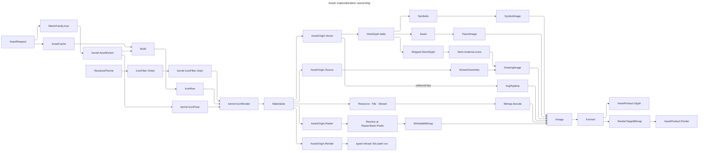

# [APPUI_ICONS_ASSETS]

Rasm.AppUi composes the kernel asset vocabulary through Avalonia. `AssetDeclaration` owns avares sources, preload partitions, host glyph bindings, and ordered icon alternatives; `IconSurface` materializes the first successful row at the `MetricFamily.Icon` scale through `AssetExtent`. This page owns the host binding table, pointers, one `BudgetedCache`, SVG leases, raster loading, and partitioned asset-fact publication.

## [01]-[INDEX]

- [02]-[ICON_AXIS]: Kernel origin family, host glyph bindings, metric-derived extent, one materialize dispatch.
- [03]-[POINTER_ROWS]: Pointer vocabulary over the platform cursor roster and the drawn rows it lacks.
- [04]-[ASSET_CACHE]: The folder's budgeted cache owner, its retention postures, and the asset plane's instance.
- [05]-[SVG_PIPELINE]: Retained SVG documents, scene graph, dirty-region mutation, animation leases, hit testing.
- [06]-[RASTER_ASSETS]: Async raster loaders, cache scope, fallbacks, DPI-variant selection.
- [07]-[ASSET_CATALOG]: One asset declaration roster, partitioned preload admission, and asset-fact publication.

## [02]-[ICON_AXIS]

- Owner: the origin family is the KERNEL's `AssetOrigin`; `HostGlyph` is the boundary resolver row a kernel `Vector` key binds and `SemiGlyph` the shipped-geometry vocabulary whose key IS the resource string; `IconSurface` owns the walk, the filter fold, and the one materialize dispatch; `IconRow` pairs a key's alternative origin with its tint role and mirror axis; `GlyphPaint` is the folded chain every arm draws through; `AssetRuntime` is the composition-bound capability set; `AssetProduct` is the boundary product carrier for image and pointer alike; `AssetFault` is the direct generated `[Union]` with one `[FaultCase]` leaf per asset failure.
- Cases: kernel `AssetOrigin` = Resource | File | Stream | Raster | Vector | Source | Render, every arm answered or refused BY NAME; `HostGlyph` = Symbolic | Sized | Shipped; `GlyphForm` = Image | Pointer; `AssetProduct` = Glyph | Pointer; mirror is the kernel `Option<MirrorAxis>`; rendering state is the kernel `Seq<IconFilter>`.
- Law: the icon size axis IS the `MetricFamily.Icon` scale and its EXTENT is the kernel `AssetExtent` — a request carries a STEP, the resolve reads `ResolvedTheme.Metric(MetricFamily.Icon, step)`, and `AssetExtent.Of` admits that logical edge beside the backing scale, deriving the device extent and refusing past the kernel ceiling. NAMED LOSS: a fractional resolved dip rounds to the kernel's integral logical edge at admission.
- Law: mirroring carries its AXIS and derives its MECHANISM — a font binding selects its mirrored codepoint plane through `FlowDirection`, every geometry, vector, and byte-backed arm reflects under one matrix — and the pose's ROTATION and both EXTENT edges reach every arm: `Turned` composes rotation about the box centre with the reflection, `Framed` viewboxes width by height, so a caller-composed `IconRender` renders the pose it states.
- Entry: `IconSurface.Resolve(AssetRuntime runtime, AssetRequest request, ResolvedTheme resolved)` — `Fin`; admission is `Validation` over the independent metric-step and scale gates, then the dependent extent. Kernel refusals cross WHOLE as the `UiFault` the kernel minted.
- Auto: declaration order inside a key's `AssetDeclaration.Icons` IS fallback order; `Elected` derives the Fluent size from the package's own `IconSizeValues.Enumerable`; the filter chain folds ONCE per row before any arm draws, so `IconRender.Wire` round-trips what was drawn; every product admits through the asset plane's `BudgetedCache` instance.
- Packages: Rasm (`AssetKey`, `AssetOrigin`, `AssetAnchor`, `AssetExtent`, `AssetRaster`, `RasterStack`, `AlphaLayout`, `IconPose`, `MirrorAxis`, `IconFilter`, `IconRender`, `PerceptualColor`, `BlendPath`, `Dimension`, `PositiveMagnitude`, `UnitInterval`, `VectorAngle`, `FaultBand`, `[FaultCase]`, `Fault`), FluentIcons.Common, FluentIcons.Avalonia, Semi.Avalonia, Avalonia, Wacton.Unicolour (`Cvd` alone), Thinktecture.Runtime.Extensions, LanguageExt.Core
- Growth: one `AssetDeclaration` row absorbs a new asset with its icon alternatives; a new host-typed payload is one `HostGlyph` case, never an origin case; a new byte source, product shape, rendering state, or reflection axis lands at the KERNEL and breaks the matching arm here loudly.
- Boundary: ONE walk for both forms — the table fold produces the image, the request's `GlyphForm` projects it, so a pointer is the image rasterized through one `RenderTargetBitmap`. HOST-TYPED PAYLOADS ARE ROWS: a FluentIcons `Symbol`, a sized `Icon`, and a `SemiGlyph` ride `AssetRuntime.Bindings` under their own keys, their icon rows carrying `AssetOrigin.Vector()` alone — `Vector` reads the binding table first and falls to the avares SVG lane, two disjoint key sets walked as one lookup. Tint reads `ResolvedTheme.Paint(role, rung)` into `IconFilter.Tinted`; `Selected` REFUSES because selection is a token-ROLE election at `Theme/tokens`; `Disabled` folds to a coverage factor the one quantization crossing multiplies into alpha, rounded, never truncated. `AssetOrigin.Render` refuses: the kernel draw replays a `PaintProgram` onto an Eto target. `Raster` asks `RasterStack.Pixels` at the pose extent and uploads under the frame's own `AlphaLayout` straight from the kernel rows' span. `Stream` opens its factory EXACTLY ONCE per resolve. `Shipped` geometry builds once inside `Semi.Avalonia.Icons`, an unguarded replacement, so `AssetRuntime.Glyphs` is read on the UI thread alone. `Resolve` walks alternatives through `BindFail` — `operator |` evaluates both operands and decodes every lower row after the winner exists. Every known absence refuses on the result by name; throwing native calls cross `Try.lift` with exact exception evidence.

```csharp
// --- [IMPORTS] -------------------------------------------------------------------------
using System.Collections.Frozen;
using System.Collections.Immutable;
using Avalonia;
using Avalonia.Input;
using Avalonia.Media;
using Avalonia.Media.Imaging;
using Avalonia.Platform;
using FluentIcons.Avalonia;
using FluentIcons.Common;
using LanguageExt;
using LanguageExt.Common;
using Rasm.AppUi.Diagnostics;
using Rasm.Domain;
using Rasm.Interaction;
using Rasm.Numerics;
using Thinktecture;
using Wacton.Unicolour;
using static LanguageExt.Prelude;

namespace Rasm.AppUi.Theme;

// --- [TYPES] ---------------------------------------------------------------------------
[Union]
public abstract partial record HostGlyph {
    private HostGlyph() { }
    public sealed record Symbolic(Symbol Glyph, IconVariant Variant) : HostGlyph;
    public sealed record Sized(Icon Glyph, IconVariant Variant) : HostGlyph;
    public sealed record Shipped(SemiGlyph Glyph) : HostGlyph;
}

[SmartEnum<string>]
[KeyMemberEqualityComparer<ComparerAccessors.StringOrdinal, string>]
public sealed partial class SemiGlyph {
    public static readonly SemiGlyph ArrowLeft = new("SemiIconArrowLeft");
    public static readonly SemiGlyph ArrowRight = new("SemiIconArrowRight");
    public static readonly SemiGlyph Image = new("SemiIconImage");
    public static readonly SemiGlyph Alert = new("SemiIconAlertTriangle");
    public static readonly SemiGlyph Scissors = new("SemiIconScissors");
    public static readonly SemiGlyph Copy = new("SemiIconCopy");
    public static readonly SemiGlyph CopyAdd = new("SemiIconCopyAdd");
    public static readonly SemiGlyph Delete = new("SemiIconDelete");
}

[Union]
public abstract partial record GlyphForm {
    private GlyphForm() { }
    public sealed record Image : GlyphForm;
    public sealed record Pointer(UnitInterval HotX, UnitInterval HotY) : GlyphForm;
}

// --- [MODELS] --------------------------------------------------------------------------
public sealed record IconRow(AssetOrigin Source, PaintRole Tint, Option<MirrorAxis> Mirror);

[Equatable]
public sealed partial record AssetRequest(
    AssetKey Key, int Step, double Scale, FlowDirection Flow, GlyphForm Form, [property: OrderedEquality] Seq<IconFilter> Filters = default);

public readonly record struct GlyphPaint(PerceptualColor Colour, UnitInterval Coverage);

[Union]
public abstract partial record AssetProduct {
    private AssetProduct(PixelSize extent, Option<IDisposable> native) => (Extent, Native) = (extent, native);

    public PixelSize Extent { get; }
    public Option<IDisposable> Native { get; }

    public long Bytes => AlphaLayout.Straight.Channels * (long)Extent.Width * Extent.Height;

    public Fin<IImage> Image => Switch(
        glyph: static product => Fin.Succ(product.Picture),
        pointer: static _ => Fin.Fail<IImage>(new AssetFault.MaterializeRejected("pointer requested as image")));

    public Fin<Cursor> Cursor => Switch(
        glyph: static _ => Fin.Fail<Cursor>(new AssetFault.MaterializeRejected("image requested as pointer")),
        pointer: static product => Fin.Succ(product.Handle));

    public Unit Release() => Native.Iter(static native => native.Dispose());

    public sealed record Glyph(IImage Picture, PixelSize Extent, Option<IDisposable> Native) : AssetProduct(Extent, Native);
    public sealed record Pointer(Cursor Handle, PixelSize Extent) : AssetProduct(Extent, Some<IDisposable>(Handle));
}

// --- [ERRORS] --------------------------------------------------------------------------
[Union(ConversionFromValue = ConversionOperatorsGeneration.None)]
public abstract partial record AssetFault : Fault {
    private static readonly FaultBand FamilyBand = FaultBand.Asset;
    private AssetFault(string detail) { Detail = detail; }
    public string Detail { get; }
    public override string Message => Detail;

    [FaultCase(0)]
    public sealed partial record UnknownKey(string Detail)          : AssetFault(Detail);
    [FaultCase(1)]
    public sealed partial record SizeOffAxis(string Detail)         : AssetFault(Detail);
    [FaultCase(2)]
    public sealed partial record MaterializeRejected(string Detail) : AssetFault(Detail);
    [FaultCase(3)]
    public sealed partial record ScaleOffAxis(string Detail)        : AssetFault(Detail);
    [FaultCase(4)]
    public sealed partial record TintUnresolved(string Detail)      : AssetFault(Detail);
    [FaultCase(5)]
    public sealed partial record GlyphUnavailable(string Detail)    : AssetFault(Detail);
    [FaultCase(6)]
    public sealed partial record BudgetRejected(string Detail)      : AssetFault(Detail);
}

// --- [SERVICES] ------------------------------------------------------------------------
public sealed record AssetRuntime(
    FrozenDictionary<AssetKey, ImmutableArray<IconRow>> Rows,
    FrozenDictionary<AssetKey, HostGlyph> Bindings,
    Semi.Avalonia.Icons Glyphs,
    SvgPipeline Svg,
    AssetCache Cache);
```

```csharp
// --- [OPERATIONS] ----------------------------------------------------------------------
public static class IconSurface {
    public static readonly UnitInterval DisabledCover = UnitInterval.Create(0.38d);

    public static Fin<AssetProduct> Resolve(AssetRuntime runtime, AssetRequest request, ResolvedTheme resolved) =>
        runtime.Cache.Take(request, () => Build(runtime, request, resolved));

    static Fin<AssetProduct> Build(AssetRuntime runtime, AssetRequest request, ResolvedTheme resolved) =>
        from admitted in (
                resolved.Metric(MetricFamily.Icon, request.Step).ToValidation<Error>(new AssetFault.SizeOffAxis($"{MetricFamily.Icon.Key}/{request.Step}")),
                FactoryBridge.Accept<PositiveMagnitude>(request.Scale).MapFail(static _ => (Error)new AssetFault.ScaleOffAxis($"{request.Scale}")).ToValidation())
            .Apply(static (dip, scale) => (Dip: dip, Scale: scale)).ToFin()
        from edge in FactoryBridge.Accept<Dimension>((int)double.Round(admitted.Dip))
        from extent in AssetExtent.Of(width: edge, height: edge, scale: admitted.Scale)
        let flipping = request.Flow is FlowDirection.RightToLeft
        from ranked in Rows(runtime.Rows, request.Key)
        from picture in ranked.AsIterable().Fold(
            Fin.Fail<IImage>(new AssetFault.MaterializeRejected(request.Key.ToString())),
            (acc, row) => acc.BindFail(_ => Painted(row, resolved).Bind(tint => Materialize(
                runtime: runtime,
                render: new IconRender(
                    Origin: row.Source,
                    Pose: IconPose.Upright(extent) with { Mirror = row.Mirror.Filter(_ => flipping) },
                    Filters: new IconFilter.Tinted(tint).Cons(request.Filters))))))
        from product in Formed(request.Form, picture, extent)
        select product;

    public static Fin<IImage> Materialize(AssetRuntime runtime, IconRender render, AssetKey key) =>
        Folded(render.Filters).Bind(paint => render.Origin.Switch(
            state: (Runtime: runtime, Pose: render.Pose, Paint: paint),
            resource: static (s, c) => Decoded(() => Optional(c.Anchor.Owner.GetManifestResourceStream(c.Anchor.ResourcePath)), s.Key).Map(image => Posed(image, s.Pose)),
            file: static (s, c) => Decoded(() => Some<System.IO.Stream>(System.IO.File.OpenRead((string)c.Location)), s.Key).Map(image => Posed(image, s.Pose)),
            stream: static (s, c) => Decoded(() => Optional(c.Open()), s.Key).Map(image => Posed(image, s.Pose)),
            raster: static (s, c) => c.Resolve(extent: s.Pose.Extent, stack: RasterStack.Pixels)
                .Bind(frame => frame is AssetRaster.Pixels rows
                    ? Uploaded(rows)
                    : Fin.Fail<IImage>(new AssetFault.MaterializeRejected($"{s.Key}/{frame.Stack.Key}")))
                .Map(image => Posed(image, s.Pose)),
            vector: static (s, c) => s.Runtime.Bindings.TryGetValue(c.Key, out HostGlyph? bound)
                ? Glyphed(s.Runtime, bound, s.Pose, s.Paint)
                : Quantized(s.Paint).Bind(colour => s.Runtime.Svg.Image(c.Key, colour)).Map(image => Posed(image, s.Pose)),
            source: static (s, c) => Try.lift(() => Fin.Succ((Geometry)StreamGeometry.Parse(c.Text))).Run().Bind(static inner => inner).Bind(geometry => Drawn(geometry, s.Paint, s.Pose)),
            render: static (s, _) => Fin.Fail<IImage>(new AssetFault.MaterializeRejected($"{s.Key}/{nameof(AssetOrigin.Render)}"))));

    static Fin<IImage> Glyphed(AssetRuntime runtime, HostGlyph bound, IconPose pose, GlyphPaint paint) =>
        Quantized(paint).Bind(colour => bound.Switch(
            state: (Runtime: runtime, Pose: pose, Paint: paint, Brush: new SolidColorBrush(colour)),
            symbolic: static (s, c) => c.Glyph.IsAvailable(c.Variant)
                ? Try.lift(() => Fin.Succ((IImage)new SymbolImage {
                    Symbol = c.Glyph, IconVariant = c.Variant, FontSize = Dip(s.Pose), FlowDirection = Planed(s.Pose), Foreground = s.Brush,
                })).Run().Bind(static inner => inner).Map(image => Rotated(image, s.Pose))
                : Fin.Fail<IImage>(new AssetFault.GlyphUnavailable($"{c.Glyph}/{c.Variant}")),
            sized: static (s, c) => Elected(c.Glyph, c.Variant, Dip(s.Pose))
                .Bind(size => Try.lift(() => Fin.Succ((IImage)new FluentImage {
                    Icon = c.Glyph, IconVariant = c.Variant, IconSize = size, FontSize = Dip(s.Pose), FlowDirection = Planed(s.Pose), Foreground = s.Brush,
                })).Run().Bind(static inner => inner))
                .Map(image => Rotated(image, s.Pose)),
            shipped: static (s, c) => Shipped(s.Runtime.Glyphs, c.Glyph).Bind(geometry => Drawn(geometry, s.Paint, s.Pose))));

    static Fin<GlyphPaint> Folded(Seq<IconFilter> chain) =>
        chain.Fold(
            PerceptualColor.Achromatic(lightness: 0d).Map(seed => new GlyphPaint(seed, UnitInterval.Create(1d))),
            (acc, filter) => acc.Bind(paint => filter.Switch(
                state: paint,
                disabled: static (s, _) => Fin.Succ(s with { Coverage = DisabledCover }),
                selected: static (_, _) => Fin.Fail<GlyphPaint>(new AssetFault.MaterializeRejected(nameof(IconFilter.Selected))),
                greyscale: static (s, _) => Fin.Succ(s with { Colour = s.Colour.Simulate(Cvd.Achromatopsia, UnitInterval.Create(1d)) }),
                tinted: static (s, c) => Fin.Succ(s with { Colour = c.Tint }),
                fading: static (s, c) => Fin.Succ(s with { Colour = s.Colour.Mix(c.Tint, c.Strength, BlendPath.Oklab) }),
                custom: static (s, c) => Fin.Succ(s with { Colour = c.Map(s.Colour) }))));

    public static Fin<IconSize> Elected(Icon glyph, IconVariant variant, double dip) =>
        toSeq(toSeq(IconSizeValues.Enumerable)
                .Filter(size => size is not IconSize.Resizable && (int)size <= dip && glyph.IsAvailable(size, variant))
                .OrderBy(static size => (int)size))
            .Last
            .Match(
                Some: Fin.Succ,
                None: () => glyph.IsAvailable(IconSize.Resizable, variant)
                    ? Fin.Succ(IconSize.Resizable)
                    : Fin.Fail<IconSize>(new AssetFault.GlyphUnavailable($"{glyph}/{variant}@{dip:F1}")));

    static Fin<AssetProduct> Formed(GlyphForm form, IImage picture, AssetExtent extent) =>
        form.Switch(
            state: (Picture: picture, Extent: extent),
            image: static (s, _) => Fin.Succ<AssetProduct>(new AssetProduct.Glyph(s.Picture, Boxed(s.Extent), Optional(s.Picture as IDisposable))),
            pointer: static (s, c) => Try.lift(() => {
                using RenderTargetBitmap target = new(Boxed(s.Extent));
                using (DrawingContext context = target.CreateDrawingContext()) {
                    s.Picture.Draw(context, new Rect(s.Picture.Size), new Rect(0d, 0d, s.Extent.PixelWidth, s.Extent.PixelHeight));
                }
                PixelPoint hot = new((int)(c.HotX.Value * s.Extent.PixelWidth), (int)(c.HotY.Value * s.Extent.PixelHeight));
                return Fin.Succ<AssetProduct>(new AssetProduct.Pointer(new Cursor(target, hot), Boxed(s.Extent)));
            }).Run().Bind(static inner => inner));

    static Fin<IImage> Drawn(Geometry geometry, GlyphPaint paint, IconPose pose) =>
        geometry.Bounds is { Width: > 0d, Height: > 0d } bounds
            ? Quantized(paint).Map(colour => Framed(
                new GeometryDrawing { Geometry = geometry, Brush = new SolidColorBrush(colour) },
                Place(bounds, pose) * Turned(pose),
                pose))
            : Fin.Fail<IImage>(new AssetFault.MaterializeRejected("geometry has no drawable bounds"));

    static IImage Posed(IImage picture, IconPose pose) =>
        pose.Mirror.IsSome || pose.Rotation.Value != 0d
            ? Framed(new ImageDrawing { ImageSource = picture, Rect = new Rect(0d, 0d, Width(pose), Height(pose)) }, Turned(pose), pose)
            : picture;

    static IImage Rotated(IImage picture, IconPose pose) =>
        pose.Rotation.Value != 0d
            ? Framed(new ImageDrawing { ImageSource = picture, Rect = new Rect(0d, 0d, Width(pose), Height(pose)) }, Spun(pose), pose)
            : picture;

    static Matrix Turned(IconPose pose) =>
        pose.Mirror.Match(
            Some: axis => axis.Switch(
                horizontal: () => Matrix.CreateScale(1d, -1d) * Matrix.CreateTranslation(0d, Height(pose)),
                vertical: () => Matrix.CreateScale(-1d, 1d) * Matrix.CreateTranslation(Width(pose), 0d),
                both: () => Matrix.CreateScale(-1d, -1d) * Matrix.CreateTranslation(Width(pose), Height(pose))),
            None: static () => Matrix.Identity) * Spun(pose);

    static Matrix Spun(IconPose pose) =>
        Matrix.CreateTranslation(-Width(pose) / 2d, -Height(pose) / 2d)
            * Matrix.CreateRotation(pose.Rotation.Value)
            * Matrix.CreateTranslation(Width(pose) / 2d, Height(pose) / 2d);

    static FlowDirection Planed(IconPose pose) => pose.Mirror.IsSome ? FlowDirection.RightToLeft : FlowDirection.LeftToRight;

    static IImage Framed(Drawing content, Matrix transform, IconPose pose) =>
        new DrawingImage {
            Drawing = new DrawingGroup { Children = { content }, Transform = new MatrixTransform(transform) },
            Viewbox = new Rect(0d, 0d, Width(pose), Height(pose)),
        };

    static Matrix Place(Rect bounds, IconPose pose) =>
        Math.Min(Width(pose) / bounds.Width, Height(pose) / bounds.Height) switch {
            var fit => Matrix.CreateTranslation(-bounds.X, -bounds.Y)
                * Matrix.CreateScale(fit, fit)
                * Matrix.CreateTranslation((Width(pose) - (bounds.Width * fit)) / 2d, (Height(pose) - (bounds.Height * fit)) / 2d),
        };

    const int BaseRung = 0;

    static Fin<PerceptualColor> Painted(IconRow row, ResolvedTheme resolved) =>
        resolved.Paint(row.Tint, BaseRung).ToFin(Fail: new AssetFault.TintUnresolved(row.Tint.Key))
            .Bind(static colour => PerceptualColor.OfArgb((int)colour.ToUInt32()));

    static Fin<Color> Quantized(GlyphPaint paint) =>
        paint.Colour.ToArgb().Map(packed => Color.FromUInt32((uint)packed) switch {
            var host => new Color((byte)double.Round(host.A * paint.Coverage.Value), host.R, host.G, host.B),
        });

    static Fin<Geometry> Shipped(Semi.Avalonia.Icons glyphs, SemiGlyph glyph) =>
        glyphs.TryGetValue(glyph.Key, out object? value) && value is Geometry geometry
            ? Fin.Succ(geometry)
            : Fin.Fail<Geometry>(new AssetFault.UnknownKey($"semi/{glyph.Key}"));

    static Fin<ImmutableArray<IconRow>> Rows(FrozenDictionary<AssetKey, ImmutableArray<IconRow>> table, AssetKey key) =>
        table.TryGetValue(out ImmutableArray<IconRow> rows) ? Fin.Succ(rows) : Fin.Fail<ImmutableArray<IconRow>>(new AssetFault.UnknownKey(key.ToString()));

    static Fin<IImage> Decoded(Func<Option<System.IO.Stream>> open, AssetKey key) =>
        open().ToFin(Fail: new AssetFault.MaterializeRejected($"{key}: origin opened no stream"))
            .Bind(scoped => Custody.Bracket(() => Try.lift(() => Fin.Succ((IImage)new Bitmap(scoped))).Run().Bind(static inner => inner), scoped));

    static Fin<IImage> Uploaded(AssetRaster.Pixels frame) =>
        Try.lift(() => {
            (PixelFormat pixels, AlphaFormat alpha) = frame.Layout.Switch(
                straight: static () => (PixelFormat.Bgra8888, AlphaFormat.Unpremul),
                premultiplied: static () => (PixelFormat.Bgra8888, AlphaFormat.Premul),
                opaque: static () => (PixelFormat.Rgb24, AlphaFormat.Opaque));
            WriteableBitmap surface = new(new PixelSize(frame.Extent.PixelWidth, frame.Extent.PixelHeight), new Vector(96d, 96d), pixels, alpha);
            using (ILockedFramebuffer locked = surface.Lock()) {
                unsafe { frame.Rows.AsSpan().CopyTo(new Span<byte>((void*)locked.Address, frame.Rows.Count)); }
            }
            return Fin.Succ<IImage>(surface);
        }).Run().Bind(static inner => inner);

    static double Dip(IconPose pose) => Width(pose);
    static double Width(IconPose pose) => pose.Extent.Width.Value;
    static double Height(IconPose pose) => pose.Extent.Height.Value;
    static PixelSize Boxed(AssetExtent extent) => new(extent.PixelWidth, extent.PixelHeight);
}
```



## [03]-[POINTER_ROWS]

- Owner: `PointerRow` — the `[SmartEnum<string>]` pointer vocabulary every canvas tool, resize affordance, and drag posture reads; `PointerOrigin` `[Union]` is the per-row source axis; `PointerCatalog` resolves a row against the runtime-held platform handles.
- Cases: `PointerOrigin` = Platform | Drawn — a row names the platform cursor the host ships or the product asset supplying what the platform roster lacks.
- Entry: `PointerCatalog.Resolve(AssetRuntime runtime, PointerRow row, double scale, ResolvedTheme resolved)` — `Fin`; platform handles mint once into the runtime's `BudgetedCache` under the row key (a `Cursor` is a platform handle the capability owns, never a process-static), drawn rows ride `IconSurface.Resolve` under `GlyphForm.Pointer`.
- Packages: Rasm (`AssetKey`, `UnitInterval`), Avalonia, Thinktecture.Runtime.Extensions, LanguageExt.Core
- Growth: one `PointerRow` row carrying its origin absorbs a new pointer affordance; a platform roster gaining a member turns one Drawn row into a Platform row with zero consumer change.
- Boundary: DISCRIMINANT AT THE SITE — the kernel `Rasm/Interaction/input.md` `CursorRow` is the SAME semantic vocabulary bound to Eto `Cursors` through a kernel-internal `Resolve`; Avalonia cannot reach that delegate, so this page keeps a semantic row bound to `StandardCursorType` under its own name and the kernel widening (semantic row + per-boundary binding table, the `HostGlyph` idiom) is a SEAT escalation, not a local re-spell. The Avalonia roster ships no grab pair; its corner rows ARE the diagonal resize affordance. Every consumer names a ROW — a `StandardCursorType` literal at a call site is the deleted form.

```csharp
// --- [TYPES] ---------------------------------------------------------------------------
[Union]
public abstract partial record PointerOrigin {
    private PointerOrigin() { }
    public sealed record Platform(StandardCursorType Type) : PointerOrigin;
    public sealed record Drawn(AssetKey Key, UnitInterval HotX, UnitInterval HotY) : PointerOrigin;
}

[SmartEnum<string>]
[KeyMemberEqualityComparer<ComparerAccessors.StringOrdinal, string>]
[KeyMemberComparer<ComparerAccessors.StringOrdinal, string>]
public sealed partial class PointerRow {
    public static readonly PointerRow Pointer = new("pointer", new PointerOrigin.Platform(StandardCursorType.Arrow));
    public static readonly PointerRow Text = new("text", new PointerOrigin.Platform(StandardCursorType.Ibeam));
    public static readonly PointerRow Crosshair = new("crosshair", new PointerOrigin.Platform(StandardCursorType.Cross));
    public static readonly PointerRow Move = new("move", new PointerOrigin.Platform(StandardCursorType.SizeAll));
    public static readonly PointerRow ResizeEastWest = new("resize-east-west", new PointerOrigin.Platform(StandardCursorType.SizeWestEast));
    public static readonly PointerRow ResizeNorthSouth = new("resize-north-south", new PointerOrigin.Platform(StandardCursorType.SizeNorthSouth));
    public static readonly PointerRow ResizeFall = new("resize-fall", new PointerOrigin.Platform(StandardCursorType.TopLeftCorner));
    public static readonly PointerRow ResizeRise = new("resize-rise", new PointerOrigin.Platform(StandardCursorType.TopRightCorner));
    public static readonly PointerRow Link = new("link", new PointerOrigin.Platform(StandardCursorType.Hand));
    public static readonly PointerRow Forbidden = new("forbidden", new PointerOrigin.Platform(StandardCursorType.No));
    public static readonly PointerRow Busy = new("busy", new PointerOrigin.Platform(StandardCursorType.Wait));
    public static readonly PointerRow Working = new("working", new PointerOrigin.Platform(StandardCursorType.AppStarting));
    public static readonly PointerRow Guidance = new("guidance", new PointerOrigin.Platform(StandardCursorType.Help));
    public static readonly PointerRow Hidden = new("hidden", new PointerOrigin.Platform(StandardCursorType.None));
    public static readonly PointerRow Grab = new("grab", new PointerOrigin.Drawn(AssetDeclaration.CursorGrab.Asset, UnitInterval.Create(0.5d), UnitInterval.Create(0.5d)));
    public static readonly PointerRow Grabbing = new("grabbing", new PointerOrigin.Drawn(AssetDeclaration.CursorGrabbing.Asset, UnitInterval.Create(0.5d), UnitInterval.Create(0.5d)));

    public PointerOrigin Origin { get; }
}

// --- [OPERATIONS] ----------------------------------------------------------------------
public static class PointerCatalog {
    public const int PointerStep = 2;

    public static Fin<Cursor> Resolve(AssetRuntime runtime, PointerRow row, double scale, ResolvedTheme resolved) =>
        row.Origin.Switch(
            state: (Runtime: runtime, Row: row, Scale: scale, Resolved: resolved),
            platform: static (s, c) => s.Runtime.Cache.Platform(s.Row, () => Try.lift(() => Fin.Succ(new Cursor(c.Type))).Run().Bind(static inner => inner)),
            drawn: static (s, c) => IconSurface
                .Resolve(s.Runtime, new AssetRequest(c.Key, PointerStep, s.Scale, FlowDirection.LeftToRight, new GlyphForm.Pointer(c.HotX, c.HotY)), s.Resolved)
                .Bind(static product => product.Cursor));
}
```

## [04]-[ASSET_CACHE]

- Owner: `BudgetedCache<TKey,TValue>` — the folder's ONE byte-budgeted, generation-stamped, least-touched-release cache every product plane composes (`Theme/typography` shaped runs, `Render/shading` shader and texture planes, `Render/meshlets` residency callers); `RetentionPosture` — the `[SmartEnum]` carrying the two retention laws as ROW DATA; `CacheSweep` — the lifecycle counts a cohort edge or a seal answers; `AssetCache` — the asset plane's instance over `AssetProduct`, owning the theme-swap and display-scale edges and the platform pointer handles.
- Cases: `RetentionPosture.Generation` — a read below the live generation MISSES, because the cell backs a device handle a current draw dereferences; `RetentionPosture.Holder` — reads ignore generation and a retired cohort survives ONE grace rotation on its own lane, because retention is a consumer holding the value; the pressure lane is every instance's and rotates on every fill.
- Entry: `BudgetedCache.Of(ceiling, posture, bytes, release, refuse)` — `Fin`; `Take(build)` — the one admission path and the pressure-lane edge; a CAS loser releases its OWN mint and returns the winner; `Retire(stale, advance)` — the cohort edge, raising the generation when `advance`; `Seal()` — drains the pressure counts (count instruments report what happened since the previous seal); `Dispose()` releases every lane and every live cell. `AssetCache.Cycle(rows)` and `Rescale(scale)` are the asset plane's two cohort edges and return the intrinsic `CacheSweep`; `Platform(row, mint)` seats a platform pointer handle under the row.
- Auto: `Cycle` binds `ThemeCell.Rebuild` at composition and acts on the `Rematerialize.TintedAsset` row alone; `Rescale` binds the `Shell/hosts` `SurfaceFact.ScaleChanged` fact; every transition is one `Cell.Commit` over a single immutable state record, so the byte total, the touch order, the lanes, and the generation move as one value and a contended commit past the swap budget REFUSES rather than corrupting the ledger.
- Packages: Rasm (`Cell`, `Transition`, `Dimension`), Avalonia, Thinktecture.Runtime.Extensions, LanguageExt.Core, BCL inbox
- Growth: a new product plane is one `BudgetedCache.Of` call naming its posture, cost, and release; a new retention law is one `RetentionPosture` row; a new cohort cause on the asset plane is one `Retire` projection.
- Boundary: this cache is the BOUNDARY's own custody per the kernel asset law — a kernel-side cache over a host handle outlives the surface that asked for it. `AssetCache` is the ONLY owner that disposes an `AssetProduct`; a caller holding a resolved image never releases it. Byte cost derives from the product's own extent, and a single product larger than the whole ceiling refuses as `BudgetRejected` rather than retiring the table to admit one cell. Release runs OUTSIDE the commit: the transition answers what it displaced and the caller releases that, so a re-run CAS body never disposes twice. Every edge that FILLS a lane also advances it; the two lanes stay apart because a staleness cohort's grace must span the swap's re-materialization roster while a pressure retiree's grace is the next eviction.

```csharp
// --- [TYPES] ---------------------------------------------------------------------------
[SmartEnum<string>]
[KeyMemberEqualityComparer<ComparerAccessors.StringOrdinal, string>]
public sealed partial class RetentionPosture {
    public static readonly RetentionPosture Generation = new("generation", reachable: static (cell, live) => cell >= live, releasable: static (_, _) => true);
    public static readonly RetentionPosture Holder = new("holder", reachable: static (_, _) => true, releasable: static (_, _) => true);
    public static readonly RetentionPosture Bound = new("bound", reachable: static (_, _) => true, releasable: static (cell, live) => cell < live);

    [UseDelegateFromConstructor]
    public partial bool Reachable(long cell, long live);

    [UseDelegateFromConstructor]
    public partial bool Releasable(long cell, long live);
}

// --- [MODELS] --------------------------------------------------------------------------
public readonly record struct CacheSweep(long Generation, int Live, long Bytes, int Retired, int Released);

// --- [SERVICES] ------------------------------------------------------------------------
public sealed class BudgetedCache<TKey, TValue> : IDisposable where TKey : notnull {
    readonly record struct Slot(TValue Value, long Bytes, long Touch, long Generation);
    readonly record struct Ledger(
        HashMap<TKey, Slot> Live, long Bytes, long Touch, long Generation,
        Seq<TValue> StaleLane, Seq<TValue> PressedLane, int Carried, int Drained);

    readonly Atom<Ledger> ledger = Atom(new Ledger(HashMap<TKey, Slot>(), 0L, 0L, 0L, Seq<TValue>(), Seq<TValue>(), 0, 0));
    readonly long ceiling;
    readonly RetentionPosture posture;
    readonly Func<TValue, long> bytes;
    readonly Action<TValue> release;
    readonly Func<TKey, long, Error> refuse;

    BudgetedCache(long ceiling, RetentionPosture posture, Func<TValue, long> bytes, Action<TValue> release, Func<TKey, long, Error> refuse) =>
        (this.ceiling, this.posture, this.bytes, this.release, this.refuse, this.key) = (ceiling, posture, bytes, release, refuse);

    public static Fin<BudgetedCache<TKey, TValue>> Of(
        long ceiling, RetentionPosture posture, Func<TValue, long> bytes, Action<TValue> release, Func<TKey, long, Error> refuse) =>
        ceiling > 0L
            ? Fin.Succ(new BudgetedCache<TKey, TValue>(ceiling, posture, bytes, release, refuse))
            : Fin.Fail<BudgetedCache<TKey, TValue>>(key.OrDefault().InvalidInput());

    public long Generation => ledger.Value.Generation;
    public long Bytes => ledger.Value.Bytes;
    public int Count => ledger.Value.Live.Count;

    public Fin<TValue> Take(TKey at, Func<Fin<TValue>> build) =>
        Hit(at).Match(Some: Fin.Succ, None: () => build().Bind(minted => Admit(at, minted)));

    Option<TValue> Hit(TKey at) {
        Option<TValue> found = None;
        Transition<Ledger> moved = Cell.Commit(ledger, held => held.Live.Find(at)
            .Filter(slot => posture.Reachable(slot.Generation, held.Generation))
            .Match(
                Some: slot => {
                    found = Some(slot.Value);
                    long touched = held.Touch + 1L;
                    return held with { Touch = touched, Live = held.Live.SetItem(at, slot with { Touch = touched, Generation = held.Generation }) };
                },
                None: () => { found = None; return held; }), Cell.SwapBudget);
        return moved is Transition<Ledger>.Committed ? found : None;
    }

    Fin<TValue> Admit(TKey at, TValue minted) {
        long cost = bytes(minted);
        if (cost > ceiling) { release(minted); return Fin.Fail<TValue>(refuse(at, cost)); }
        Seq<TValue> due = Seq<TValue>();
        Option<TValue> winner = None;
        Transition<Ledger> moved = Cell.Commit(ledger, held => {
            winner = held.Live.Find(at).Filter(slot => posture.Reachable(slot.Generation, held.Generation)).Map(static slot => slot.Value);
            if (winner.IsSome) { due = Seq<TValue>(); return held; }
            (Ledger unlinked, Seq<TValue> freed) = Unlink(held, at);
            (Ledger pressed, Seq<TValue> evicted) = Pressed(unlinked, cost);
            Seq<TValue> displaced = freed + evicted;
            due = displaced.IsEmpty ? Seq<TValue>() : pressed.PressedLane;
            long touched = pressed.Touch + 1L;
            return pressed with {
                Live = pressed.Live.Add(at, new Slot(minted, cost, touched, pressed.Generation)),
                Bytes = pressed.Bytes + cost,
                Touch = touched,
                PressedLane = displaced.IsEmpty ? pressed.PressedLane : displaced,
                Carried = pressed.Carried + displaced.Count,
                Drained = pressed.Drained + due.Count,
            };
        }, Cell.SwapBudget);
        return moved switch {
            Transition<Ledger>.Committed when winner.IsSome =>
                (release(minted), winner.ToFin(Fail: new KernelFault.InvalidResult())).Item2,
            Transition<Ledger>.Committed => (due.Iter(release), Fin.Succ(minted)).Item2,
            _ => (release(minted), Fin.Fail<TValue>(new KernelFault.InvalidResult())).Item2,
        };
    }

    public CacheSweep Retire(Func<TKey, TValue, bool> stale, bool advance) {
        Seq<TValue> due = Seq<TValue>();
        int cohortCount = 0, carried = 0, drained = 0;
        Transition<Ledger> moved = Cell.Commit(ledger, held => {
            Ledger bumped = advance ? held with { Generation = held.Generation + 1L } : held;
            Seq<TKey> keys = toSeq(bumped.Live.AsIterable()).Filter(pair => stale(pair.Key, pair.Value.Value)).Map(static pair => pair.Key).Strict();
            (Ledger unlinked, Seq<TValue> cohort) = keys.Fold((bumped, Seq<TValue>()), (acc, k) =>
                Unlink(acc.Item1, k) switch { var (l, f) => (l, acc.Item2 + f) });
            (due, cohortCount, carried, drained) = (unlinked.StaleLane, cohort.Count, unlinked.Carried, unlinked.Drained);
            return unlinked with { StaleLane = cohort, Carried = 0, Drained = 0 };
        }, Cell.SwapBudget);
        if (moved is Transition<Ledger>.Committed committed) {
            due.Iter(release);
            return new CacheSweep(committed.State.Generation, committed.State.Live.Count, committed.State.Bytes, cohortCount + carried, due.Count + drained);
        }
        return new CacheSweep(Generation, Count, Bytes, 0, 0);
    }

    public CacheSweep Seal() {
        int carried = 0, drained = 0;
        Transition<Ledger> moved = Cell.Commit(ledger, held => {
            (carried, drained) = (held.Carried, held.Drained);
            return held with { Carried = 0, Drained = 0 };
        }, Cell.SwapBudget);
        return moved is Transition<Ledger>.Committed committed
            ? new CacheSweep(committed.State.Generation, committed.State.Live.Count, committed.State.Bytes, carried, drained)
            : new CacheSweep(Generation, Count, Bytes, 0, 0);
    }

    static (Ledger, Seq<TValue>) Unlink(Ledger held, TKey at) =>
        held.Live.Find(at).Match(
            Some: slot => (held with { Live = held.Live.Remove(at), Bytes = held.Bytes - slot.Bytes }, Seq(slot.Value)),
            None: () => (held, Seq<TValue>()));

    (Ledger, Seq<TValue>) Pressed(Ledger held, long incoming) =>
        toSeq(held.Live.AsIterable()
                .Where(pair => posture.Releasable(pair.Value.Generation, held.Generation))
                .OrderBy(static pair => pair.Value.Touch))
            .Fold((held, Seq<TValue>()), (acc, pair) => acc.Item1.Bytes + incoming <= ceiling
                ? acc
                : Unlink(acc.Item1, pair.Key) switch { var (l, f) => (l, acc.Item2 + f) });

    public void Dispose() {
        Seq<TValue> all = Seq<TValue>();
        Transition<Ledger> moved = Cell.Commit(ledger, held => {
            all = held.StaleLane + held.PressedLane + toSeq(held.Live.Values).Map(static slot => slot.Value);
            return new Ledger(HashMap<TKey, Slot>(), 0L, held.Touch, held.Generation, Seq<TValue>(), Seq<TValue>(), 0, 0);
        }, Cell.SwapBudget);
        if (moved is Transition<Ledger>.Committed) { all.Iter(release); }
    }
}

public sealed class AssetCache : IDisposable {
    readonly BudgetedCache<AssetRequest, AssetProduct> products;
    readonly BudgetedCache<PointerRow, Cursor> pointers;

    AssetCache(BudgetedCache<AssetRequest, AssetProduct> products, BudgetedCache<PointerRow, Cursor> pointers) =>
        (this.products, this.pointers) = (products, pointers);

    public static Fin<AssetCache> Of(long ceiling) =>
        from products in BudgetedCache<AssetRequest, AssetProduct>.Of(ceiling, RetentionPosture.Holder,
            static product => product.Bytes, static product => ignore(product.Release()),
            static (request, cost) => new AssetFault.BudgetRejected($"{request.Key} {cost}b"), Caching)
        from pointers in BudgetedCache<PointerRow, Cursor>.Of(ceiling, RetentionPosture.Holder,
            static _ => 0L, static cursor => cursor.Dispose(),
            static (row, _) => new AssetFault.BudgetRejected(row.Key), Caching)
        select new AssetCache(products, pointers);

    public Fin<AssetProduct> Take(AssetRequest request, Func<Fin<AssetProduct>> build) => products.Take(request, build);

    public Fin<Cursor> Platform(PointerRow row, Func<Fin<Cursor>> mint) => pointers.Take(row, mint);

    public CacheSweep Cycle(Seq<Rematerialize> rows) =>
        rows.Exists(static row => row == Rematerialize.TintedAsset)
            ? products.Retire(static (_, _) => true, advance: true)
            : products.Seal();

    public CacheSweep Rescale(double scale) =>
        products.Retire((request, _) => request.Scale != scale, advance: false);

    public void Dispose() { pointers.Dispose(); products.Dispose(); }
}
```

## [05]-[SVG_PIPELINE]

- Owner: `SvgPipeline` — retained SVG document admission, capability-monotone cache, and tinted image projection; `SvgLease` the capability capsule every load returns; `SvgPosture` the retained-document posture rows; `SvgTrait` the capability vocabulary those rows hold.
- Cases: `SvgTrait` = Scene | Animate | Cache | Filters | Wireframe; `SvgPosture` rows `PictureOnly` {Cache, Filters}, `RetainedScene` {Scene, Cache, Filters}, `Animated` {Scene, Animate, Filters}, `Inspected` {Scene, Wireframe} — a combination the rows do not name is unspellable, and a member refuses by the TRAIT the row lacks.
- Entry: `SvgPipeline.Load(AssetKey key, SvgPosture posture, Option<EventHandler<SvgAnimationFrameChangedEventArgs>> onAnimation)` — `Fin`; the lease is the handler's lifetime owner.
- Auto: one composition-owned retained table deletes per-control re-parse, one `(AssetKey, Color)` image table deletes per-call source reconstruction; `SvgPosture.Mount` writes the render-posture traits onto a hosted `Svg` control in one call.
- Packages: Rasm (`AssetKey`, `CapabilitySet`, `Custody`, `Lease`), Svg.Controls.Skia.Avalonia, SkiaSharp, Avalonia, LanguageExt.Core, BCL inbox
- Growth: one retained row per asset key; a new posture is one `SvgPosture` row; a new mutation address form is one `Mutate` overload.
- Boundary: the kernel `Rasm/Interaction/paint.md` `ScenePolicy` is the draw-quality tier; this posture renamed away from that name because three pages compose both planes. `SvgPipeline` is a disposable capability constructed with the resolved `SKFontManager`; admission runs under `Custody.Bracket` over the payload stream, a losing duplicate parse disposes its own document, and an absent source document is a KNOWN absence refusing on the result — only the parse traps. The shipped control names its filter column NEGATIVELY as `DisableFilters`; the trait states `Filters` and the mount inverts it once. `SvgLease` never exports `SKSvg`, every document operation locks `document.Sync`, and lease disposal detaches only its handler. Both scene-presence properties BUILD the graph on read, so scene-class capability is the ROW's trait, never a property probe. Hit testing is `Topmost`/`Hits` on the lease ALONE.

```csharp
// --- [TYPES] ---------------------------------------------------------------------------
[SmartEnum<string>]
[KeyMemberEqualityComparer<ComparerAccessors.StringOrdinal, string>]
public sealed partial class SvgTrait : ICapability<SvgTrait> {
    public static readonly SvgTrait Scene = new("scene");
    public static readonly SvgTrait Animate = new("animate");
    public static readonly SvgTrait Cache = new("cache");
    public static readonly SvgTrait Filters = new("filters");
    public static readonly SvgTrait Wireframe = new("wireframe");
}

[SmartEnum<string>]
[KeyMemberEqualityComparer<ComparerAccessors.StringOrdinal, string>]
[KeyMemberComparer<ComparerAccessors.StringOrdinal, string>]
public sealed partial class SvgPosture {
    public static readonly SvgPosture PictureOnly = new("picture-only", CapabilitySet<SvgTrait>.Of(SvgTrait.Cache, SvgTrait.Filters));
    public static readonly SvgPosture RetainedScene = new("retained-scene", CapabilitySet<SvgTrait>.Of(SvgTrait.Scene, SvgTrait.Cache, SvgTrait.Filters));
    public static readonly SvgPosture Animated = new("animated", CapabilitySet<SvgTrait>.Of(SvgTrait.Scene, SvgTrait.Animate, SvgTrait.Filters));
    public static readonly SvgPosture Inspected = new("inspected", CapabilitySet<SvgTrait>.Of(SvgTrait.Scene, SvgTrait.Wireframe));

    public CapabilitySet<SvgTrait> Traits { get; }

    public Unit Mount(Svg view) =>
        (view.EnableCache = Traits.Admits(SvgTrait.Cache), view.DisableFilters = !Traits.Admits(SvgTrait.Filters), view.Wireframe = Traits.Admits(SvgTrait.Wireframe), unit).Item4;
}

// --- [SERVICES] ------------------------------------------------------------------------
public sealed class SvgLease(AssetKey key, SKSvg document, SvgPosture posture, Action detach) : IDisposable {
    public AssetKey Key { get; } = key;
    public SvgPosture Posture { get; } = posture;

    public Fin<SvgSceneMutationResult> Mutate(string id, params ReadOnlySpan<string> changedAttributes) =>
        changedAttributes.ToArray() switch {
            var attributes => Scened(() => document.TryApplyRetainedSceneMutationByIdAndRender(id, attributes, out SvgSceneMutationResult? dirty)
                    ? Optional(dirty).ToFin(Fail: new AssetFault.MaterializeRejected(id))
                    : Fin.Fail<SvgSceneMutationResult>(new AssetFault.MaterializeRejected(id)))
                .Bind(identity),
        };

    public Fin<Option<SvgSceneDocument>> Scene() => Scened(() => Optional(document.RetainedSceneGraph));

    public Fin<Unit> Animate(Action<SvgAnimationController> operation) =>
        Held(SvgTrait.Animate, () => Optional(document.AnimationController)
            .ToFin(Fail: new AssetFault.MaterializeRejected($"{Key}/animation"))
            .Map(controller => fun(() => operation(controller))()))
        .Bind(identity);

    public Fin<Unit> Begin(string id, TimeSpan offset) => Held(SvgTrait.Animate, () => fun(() => document.BeginAnimationElement(id, offset))());
    public Fin<Unit> End(string id, TimeSpan offset) => Held(SvgTrait.Animate, () => fun(() => document.EndAnimationElement(id, offset))());
    public Fin<Option<SvgSceneNode>> Topmost(SKPoint at) => Scened(() => Optional(document.HitTestTopmostSceneNode(at)));
    public Fin<Seq<SvgSceneNode>> Hits(SKPoint at) => Scened(() => toSeq(document.HitTestSceneNodes(at)));

    Fin<T> Scened<T>(Func<T> operation) => Held(SvgTrait.Scene, operation);

    Fin<T> Held<T>(SvgTrait trait, Func<T> operation) =>
        Posture.Traits.Admits(trait)
            ? Locked(operation)
            : Fin.Fail<T>(new AssetFault.MaterializeRejected($"{Key}/{Posture.Key}: row carries no {trait.Key}"));

    Fin<T> Locked<T>(Func<T> operation) =>
        Try.lift(() => { lock (document.Sync) { return Fin.Succ(operation()); } }).Run().Bind(static inner => inner);

    public void Dispose() => detach();
}

public sealed class SvgPipeline(SKFontManager fonts) : IDisposable {
    readonly Atom<HashMap<AssetKey, SKSvg>> retained = Atom(HashMap<AssetKey, SKSvg>());
    readonly Atom<HashMap<(AssetKey Key, Color Tint), SvgImage>> images = Atom(HashMap<(AssetKey, Color), SvgImage>());
    readonly ITypefaceProvider typefaces = new FontManagerTypefaceProvider { FontManager = fonts };

    public Fin<SvgLease> Load(AssetKey key, SvgPosture posture, Option<EventHandler<SvgAnimationFrameChangedEventArgs>> onAnimation) =>
        retained.Value.Find().Match(Some: Fin.Succ, None: () => AssetCatalog.Open(1d).Bind(payload => Admit(payload)))
            .Bind(document => Ensure(document, posture))
            .Bind(document => Leased(document, posture, onAnimation));

    public Fin<IImage> Image(AssetKey asset, Color tint) =>
        Load(asset, SvgPosture.PictureOnly, None).Bind(_ => AdmitImage(asset, tint)).Map(static image => (IImage)image);

    Fin<SKSvg> Admit(AssetKey key, System.IO.Stream payload) =>
        Custody.Bracket(() => Try.lift(() => {
            SKSvg document = new();
            document.Settings.TypefaceProviders?.Add(typefaces);
            return Fin.Succ((Document: document, Loaded: Optional(document.Load(payload))));
        }).Run().Bind(static inner => inner), payload)
        .Bind(parsed => parsed.Loaded.IsSome
            ? Fin.Succ(parsed.Document)
            : (parsed.Document.Dispose(), Fin.Fail<SKSvg>(new AssetFault.MaterializeRejected($"svg {key}"))).Item2)
        .Map(document => Cell.Claim(retained, () => document) switch {
            Transition<HashMap<AssetKey, SKSvg>>.Committed => document,
            var ceded => (document.Dispose(), ceded.Current[key]).Item2,
        });

    Fin<SvgImage> AdmitImage(AssetKey key, Color tint) =>
        images.Value.Find((tint)).Match(
            Some: Fin.Succ,
            None: () => retained.Value.Find().ToFin(Fail: new AssetFault.UnknownKey(key.ToString()))
                .Bind(document => Try.lift(() => { lock (document.Sync) { return Fin.Succ(Optional(document.SourceDocument)); } }).Run().Bind(static inner => inner)
                    .Bind(source => source.ToFin(Fail: new AssetFault.MaterializeRejected($"svg document {key}")))
                    .Bind(source => Try.lift(() => Fin.Succ(new SvgImage { Source = SvgSource.LoadFromSvgDocument(source), CurrentColor = tint })).Run().Bind(static inner => inner)))
                .Map(candidate => Cell.Claim(images, (tint), () => candidate) switch {
                    Transition<HashMap<(AssetKey, Color), SvgImage>>.Committed => candidate,
                    var ceded => (candidate.Source?.Dispose(), ceded.Current[(tint)]).Item2,
                }));

    static Fin<SKSvg> Ensure(SKSvg document, SvgPosture posture) =>
        !posture.Traits.Admits(SvgTrait.Scene)
            ? Fin.Succ(document)
            : Try.lift(() => { lock (document.Sync) { return Fin.Succ(document.TryEnsureRetainedSceneGraph(out SvgSceneDocument? scene) && scene is not null); } }).Run().Bind(static inner => inner)
                .Bind(built => built ? Fin.Succ(document) : Fin.Fail<SKSvg>(new AssetFault.MaterializeRejected("retained SVG scene unavailable")));

    static Fin<SvgLease> Leased(AssetKey key, SKSvg document, SvgPosture posture, Option<EventHandler<SvgAnimationFrameChangedEventArgs>> onAnimation) =>
        Try.lift(() => { lock (document.Sync) {
            return Fin.Succ((posture.Traits.Admits(SvgTrait.Animate) ? onAnimation : None).Match(
                Some: handler => {
                    document.AnimationInvalidated += handler;
                    return new SvgLease(document, posture, () => { lock (document.Sync) { document.AnimationInvalidated -= handler; } });
                },
                None: () => new SvgLease(document, posture, static () => { })));
        }}).Run().Bind(static inner => inner);

    public void Dispose() {
        HashMap<(AssetKey, Color), SvgImage> tints = default;
        ignore(images.Swap(held => { tints = held; return HashMap<(AssetKey, Color), SvgImage>(); }));
        toSeq(tints.Values).Iter(static image => image.Source?.Dispose());
        HashMap<AssetKey, SKSvg> documents = default;
        ignore(retained.Swap(held => { documents = held; return HashMap<AssetKey, SKSvg>(); }));
        toSeq(documents.Values).Iter(static document => document.Dispose());
    }
}
```

## [06]-[RASTER_ASSETS]

- Owner: `RasterAssets` — the async raster loader capability and DPI-variant election; `RasterRow` the policy record carrying placeholder and error fallback keys, cache folder, and HiDPI threshold.
- Entry: `RasterAssets.Open(ProfileRoots roots, Option<HttpClient> client)` — one disposable capability owns the disk-cached loader and publishes it as the global `ImageLoader.AsyncImageLoader` at construction, so every `AdvancedImage` in the product resolves through it and a second publish site has no spelling; `Pick(row, scale)` — the PURE variant election returning the source and declared scale that served.
- Packages: AsyncImageLoader.Avalonia, Avalonia, Rasm (`AssetKey`), Rasm.AppHost (`ProfileRoots`), LanguageExt.Core, BCL inbox
- Growth: one policy value per cache or variant fact; a storage-scoped source composes the loader's own `IAdvancedAsyncImageLoader.ProvideImageAsync(url, storage)` at its consuming surface.
- Boundary: a present `HttpClient` stays borrowed (`disposeHttpClient: false`) and its retry policy is the AppHost outbound owner's — this page runs no `Schedule` over a client it does not own; cache content lives under `ProfileRoots`; `AssetRow.Variants` carries an extensible scale table; variant election is pure over the row and one scale, so the `AssetCache` scale edge is the only re-election trigger — the loader hierarchy's own RAM cache holds decoded bytes and knows nothing of backing scale. The companion RAM loader, the storage lane, and the fallback-key bindings the earlier page claimed had no consumer on disk and are gone; a fallback binding lands with the `AdvancedImage` row that reads it.

```csharp
// --- [MODELS] --------------------------------------------------------------------------
public sealed record RasterRow(AssetKey Placeholder, AssetKey Error, string CacheFolder, double HiDpiThreshold);

// --- [SERVICES] ------------------------------------------------------------------------
public sealed class RasterAssets : IDisposable {
    public static readonly RasterRow Policy = new(AssetDeclaration.IconPlaceholder.Asset, AssetDeclaration.IconError.Asset, "asset-cache", 1.5d);

    readonly IAsyncImageLoader durable;

    RasterAssets(IAsyncImageLoader durable) => (this.durable, ImageLoader.AsyncImageLoader) = (durable, durable);

    public static RasterAssets Open(ProfileRoots roots, Option<HttpClient> client) =>
        new(client.Match(
            Some: IAsyncImageLoader (http) => new DiskCachedWebImageLoader(http, disposeHttpClient: false, System.IO.Path.Join(roots.AppRoot, Policy.CacheFolder)),
            None: () => new DiskCachedWebImageLoader(System.IO.Path.Join(roots.AppRoot, Policy.CacheFolder))));

    public static (Uri Source, double Scale) Pick(AssetRow row, double scale) =>
        scale < Policy.HiDpiThreshold
            ? (row.Source, 1d)
            : toSeq(row.Variants.Filter(variant => variant.Scale <= scale).OrderBy(static variant => variant.Scale))
                .Last
                .Map(static variant => (variant.Source, variant.Scale))
                .IfNone((row.Source, 1d));

    public void Dispose() => durable.Dispose();
}
```

## [07]-[ASSET_CATALOG]

- Owner: `AssetDeclaration` — the ONE `[SmartEnum<string>]` roster declaring every asset the product ships: kernel `AssetKey`, `AssetKind`, avares source, scale variants, preload partitions, the optional host glyph binding, and the ordered icon alternatives; `AssetCatalog` projects the runtime tables and owns avares admission and partitioned preload publication; `PreloadPartition` is the per-surface preload axis ranked by depth.
- Cases: `AssetKind` = vector | raster | geo | glyph — the glyph kind names a row that binds a host-typed payload and ships no avares bytes, so the two disjoint key sets the `Vector` arm walks are one column value; `PreloadPartition` = chrome | canvas | document | export with a `Depth` rank the mount's projection reads.
- Entry: `AssetCatalog.Open(AssetKey key, double scale)` — `Fin`, `Validation` over the independent scale and key admissions; `AssetCatalog.Preload(SurfaceMount mount, double scale, HookSet hooks)` — `Validation` over every elected row and `Fin<Unit>` after direct publication, so a boot reports EVERY refused asset rather than the first; `AssetCatalog.Runtime(svg, cache)` — the one `AssetRuntime` mint projecting `Rows`, `Bindings`, and the shipped dictionary off the roster.
- Auto: `AppUiFact.Asset` carries key, kind, elected origin, elected scale, and the asset-byte `ContentHash` minted through `ContentHash.Of(Stream)`; `HookSet` publishes it at `AppUiPoint.Asset` from the successful preload admission.
- Packages: Rasm (`AssetKey`, `AssetOrigin`, `MirrorAxis`, `ContentHash`, `Custody`, `AcceptValidated`), Avalonia, FluentIcons.Common, Semi.Avalonia, Thinktecture.Runtime.Extensions, LanguageExt.Core, BCL inbox
- Growth: one `AssetDeclaration` row admits a new asset with its kind, source, variants, partitions, binding, and icon alternatives at once; a sixth `RevertKind` lands its glyph as one `History(...)` row whose key the mint derives.
- Boundary: avares content is the only Release-time asset origin; the key vocabulary crosses pages as `AssetDeclaration.X.Key` values. Declaration order inside `Icons` IS fallback order — font face first, shipped geometry second, bundled vector last. The mirror AXIS is decided once per glyph here; the MECHANISM nowhere here. `AssetKind.Glyph` rows carry no avares source and `Open` refuses them by name; every other kind carries one, so a binding key with no bytes and a byte key with no binding are two row shapes, never an accidental miss. The five history glyph keys carry the `history-` stem through one `History` mint and `Editing/history.md` `RevertKind` reads them — the derivation runs DOWNWARD because `Theme` is S0 vocabulary and may not import the S2 history owner.

```csharp
// --- [TYPES] ---------------------------------------------------------------------------
[SmartEnum<string>]
[KeyMemberEqualityComparer<ComparerAccessors.StringOrdinal, string>]
[KeyMemberComparer<ComparerAccessors.StringOrdinal, string>]
public sealed partial class AssetKind {
    public static readonly AssetKind Vector = new("vector");
    public static readonly AssetKind Raster = new("raster");
    public static readonly AssetKind Geo = new("geo");
    public static readonly AssetKind Glyph = new("glyph");
}

[SmartEnum<string>]
[KeyMemberEqualityComparer<ComparerAccessors.StringOrdinal, string>]
[KeyMemberComparer<ComparerAccessors.StringOrdinal, string>]
public sealed partial class PreloadPartition {
    public static readonly PreloadPartition Chrome = new("chrome", depth: 0);
    public static readonly PreloadPartition Canvas = new("canvas", depth: 1);
    public static readonly PreloadPartition Document = new("document", depth: 2);
    public static readonly PreloadPartition Export = new("export", depth: int.MaxValue);

    public int Depth { get; }

    public static Seq<PreloadPartition> Elect(SurfaceMount mount) =>
        mount.Switch(
            panel: static _ => Ranked(Chrome.Depth),
            modal: static _ => Ranked(Chrome.Depth),
            companion: static _ => Ranked(Canvas.Depth),
            standalone: static _ => Ranked(Document.Depth),
            offscreen: static _ => Seq(Export));

    static Seq<PreloadPartition> Ranked(int depth) => toSeq(Items).Filter(row => row.Depth <= depth).Strict();
}

// --- [MODELS] --------------------------------------------------------------------------
public sealed record AssetRow(AssetKey Key, AssetKind Kind, Uri Source, Seq<(double Scale, Uri Source)> Variants, Seq<PreloadPartition> Partitions);

// --- [TABLES] --------------------------------------------------------------------------
[SmartEnum<string>]
[KeyMemberEqualityComparer<ComparerAccessors.StringOrdinal, string>]
[KeyMemberComparer<ComparerAccessors.StringOrdinal, string>]
public sealed partial class AssetDeclaration {
    static readonly Uri None = new("avares://Rasm.AppUi/Assets/");
    static Uri Avares(string path) => new("avares://Rasm.AppUi/Assets/" + path);
    static (double, Uri) At2x(string path) => (2d, Avares(path));
    static IconRow Own(AssetDeclaration row, PaintRole tint, Option<MirrorAxis> mirror) => new(new AssetOrigin.Vector(row.Asset), tint, mirror);
    static IconRow Via(AssetDeclaration glyph, PaintRole tint, Option<MirrorAxis> mirror) => new(new AssetOrigin.Vector(glyph.Asset), tint, mirror);

    // --- [GLYPH_BINDINGS]
    public static readonly AssetDeclaration FluentArrowLeft = new(nameof(FluentArrowLeft), AssetKind.Glyph, None, [], [], Some<HostGlyph>(new HostGlyph.Symbolic(Symbol.ArrowLeft, IconVariant.Regular)), static _ => []);
    public static readonly AssetDeclaration FluentArrowRight = new(nameof(FluentArrowRight), AssetKind.Glyph, None, [], [], Some<HostGlyph>(new HostGlyph.Symbolic(Symbol.ArrowRight, IconVariant.Regular)), static _ => []);
    public static readonly AssetDeclaration SemiArrowLeft = new(nameof(SemiArrowLeft), AssetKind.Glyph, None, [], [], Some<HostGlyph>(new HostGlyph.Shipped(SemiGlyph.ArrowLeft)), static _ => []);
    public static readonly AssetDeclaration SemiArrowRight = new(nameof(SemiArrowRight), AssetKind.Glyph, None, [], [], Some<HostGlyph>(new HostGlyph.Shipped(SemiGlyph.ArrowRight)), static _ => []);
    public static readonly AssetDeclaration SemiImage = new(nameof(SemiImage), AssetKind.Glyph, None, [], [], Some<HostGlyph>(new HostGlyph.Shipped(SemiGlyph.Image)), static _ => []);
    public static readonly AssetDeclaration SemiAlert = new(nameof(SemiAlert), AssetKind.Glyph, None, [], [], Some<HostGlyph>(new HostGlyph.Shipped(SemiGlyph.Alert)), static _ => []);
    public static readonly AssetDeclaration SemiScissors = new(nameof(SemiScissors), AssetKind.Glyph, None, [], [], Some<HostGlyph>(new HostGlyph.Shipped(SemiGlyph.Scissors)), static _ => []);
    public static readonly AssetDeclaration SemiCopy = new(nameof(SemiCopy), AssetKind.Glyph, None, [], [], Some<HostGlyph>(new HostGlyph.Shipped(SemiGlyph.Copy)), static _ => []);
    public static readonly AssetDeclaration SemiCopyAdd = new(nameof(SemiCopyAdd), AssetKind.Glyph, None, [], [], Some<HostGlyph>(new HostGlyph.Shipped(SemiGlyph.CopyAdd)), static _ => []);
    public static readonly AssetDeclaration SemiDelete = new(nameof(SemiDelete), AssetKind.Glyph, None, [], [], Some<HostGlyph>(new HostGlyph.Shipped(SemiGlyph.Delete)), static _ => []);

    // --- [SHIPPED_ASSETS]
    public static readonly AssetDeclaration GeoWorld = new(nameof(GeoWorld), AssetKind.Geo, Avares("geo/world.geojson"), [], [PreloadPartition.Document], Option<HostGlyph>.None, static _ => []);
    public static readonly AssetDeclaration IconPlaceholder = new(nameof(IconPlaceholder), AssetKind.Raster, Avares("raster/placeholder.png"), [At2x("raster/placeholder@2x.png")], [PreloadPartition.Chrome], Option<HostGlyph>.None, static _ => [Via(SemiImage, PaintRole.TextFaint, Option<MirrorAxis>.None)]);
    public static readonly AssetDeclaration IconError = new(nameof(IconError), AssetKind.Raster, Avares("raster/error.png"), [At2x("raster/error@2x.png")], [PreloadPartition.Chrome], Option<HostGlyph>.None, static _ => [Via(SemiAlert, PaintRole.Error, Option<MirrorAxis>.None)]);
    public static readonly AssetDeclaration NavBack = new(nameof(NavBack), AssetKind.Vector, Avares("vector/nav-back.svg"), [], [PreloadPartition.Chrome], Option<HostGlyph>.None,
        row => [Via(FluentArrowLeft, PaintRole.Text, Some(MirrorAxis.Vertical)), Via(SemiArrowLeft, PaintRole.Text, Some(MirrorAxis.Vertical)), Own(row, PaintRole.Text, Some(MirrorAxis.Vertical))]);
    public static readonly AssetDeclaration NavForward = new(nameof(NavForward), AssetKind.Vector, Avares("vector/nav-forward.svg"), [], [PreloadPartition.Chrome], Option<HostGlyph>.None,
        row => [Via(FluentArrowRight, PaintRole.Text, Some(MirrorAxis.Vertical)), Via(SemiArrowRight, PaintRole.Text, Some(MirrorAxis.Vertical)), Own(row, PaintRole.Text, Some(MirrorAxis.Vertical))]);
    public static readonly AssetDeclaration CursorGrab = new(nameof(CursorGrab), AssetKind.Vector, Avares("vector/cursor-grab.svg"), [], [PreloadPartition.Canvas], Option<HostGlyph>.None, row => [Own(row, PaintRole.Text, Option<MirrorAxis>.None)]);
    public static readonly AssetDeclaration CursorGrabbing = new(nameof(CursorGrabbing), AssetKind.Vector, Avares("vector/cursor-grabbing.svg"), [], [PreloadPartition.Canvas], Option<HostGlyph>.None, row => [Own(row, PaintRole.Text, Option<MirrorAxis>.None)]);
    public static readonly AssetDeclaration EditorCut = new(nameof(EditorCut), AssetKind.Vector, Avares("vector/editor-cut.svg"), [], [PreloadPartition.Canvas], Option<HostGlyph>.None, row => [Via(SemiScissors, PaintRole.Text, Option<MirrorAxis>.None), Own(row, PaintRole.Text, Option<MirrorAxis>.None)]);
    public static readonly AssetDeclaration EditorCopy = new(nameof(EditorCopy), AssetKind.Vector, Avares("vector/editor-copy.svg"), [], [PreloadPartition.Canvas], Option<HostGlyph>.None, row => [Via(SemiCopy, PaintRole.Text, Option<MirrorAxis>.None), Own(row, PaintRole.Text, Option<MirrorAxis>.None)]);
    public static readonly AssetDeclaration EditorPaste = new(nameof(EditorPaste), AssetKind.Vector, Avares("vector/editor-paste.svg"), [], [PreloadPartition.Canvas], Option<HostGlyph>.None, row => [Via(SemiCopyAdd, PaintRole.Text, Option<MirrorAxis>.None), Own(row, PaintRole.Text, Option<MirrorAxis>.None)]);
    public static readonly AssetDeclaration EditorDelete = new(nameof(EditorDelete), AssetKind.Vector, Avares("vector/editor-delete.svg"), [], [PreloadPartition.Canvas], Option<HostGlyph>.None, row => [Via(SemiDelete, PaintRole.Error, Option<MirrorAxis>.None), Own(row, PaintRole.Error, Option<MirrorAxis>.None)]);
    public static readonly AssetDeclaration HistorySet = History("set", PaintRole.Text, Option<MirrorAxis>.None);
    public static readonly AssetDeclaration HistoryInsert = History("insert", PaintRole.Success, Option<MirrorAxis>.None);
    public static readonly AssetDeclaration HistoryRemove = History("remove", PaintRole.Error, Option<MirrorAxis>.None);
    public static readonly AssetDeclaration HistoryMove = History("move", PaintRole.Text, Some(MirrorAxis.Vertical));
    public static readonly AssetDeclaration HistoryComposite = History("composite", PaintRole.Text, Some(MirrorAxis.Vertical));

    static AssetDeclaration History(string kind, PaintRole tint, Option<MirrorAxis> mirror) =>
        new($"history-{kind}", AssetKind.Vector, Avares($"vector/history-{kind}.svg"), [], [PreloadPartition.Chrome], Option<HostGlyph>.None, row => [Own(row, tint, mirror)]);

    private AssetDeclaration(string key, AssetKind kind, Uri source, ImmutableArray<(double, Uri)> variants, ImmutableArray<PreloadPartition> partitions, Option<HostGlyph> binding, Func<AssetDeclaration, ImmutableArray<IconRow>> icons) {
        Asset = AssetKey.Create();
        Kind = kind; Source = source; Variants = variants; Partitions = partitions; Binding = binding; Icons = icons(this);
    }

    public AssetKey Asset { get; }
    public AssetKind Kind { get; }
    public Uri Source { get; }
    public ImmutableArray<(double Scale, Uri Source)> Variants { get; }
    public ImmutableArray<PreloadPartition> Partitions { get; }
    public Option<HostGlyph> Binding { get; }
    public ImmutableArray<IconRow> Icons { get; }

    public AssetRow Row => new(Asset, Kind, Source, toSeq(Variants), toSeq(Partitions));
}

// --- [OPERATIONS] ----------------------------------------------------------------------
public static class AssetCatalog {

    static readonly FrozenDictionary<AssetKey, AssetDeclaration> Table = toSeq(AssetDeclaration.Items).ToFrozenDictionary(static row => row.Asset);

    public static AssetRuntime Runtime(SvgPipeline svg, AssetCache cache) =>
        new(
            Rows: toSeq(AssetDeclaration.Items).Filter(static row => !row.Icons.IsEmpty).ToFrozenDictionary(static row => row.Asset, static row => row.Icons),
            Bindings: toSeq(AssetDeclaration.Items).Choose(static row => row.Binding.Map(glyph => (row.Asset, glyph))).ToFrozenDictionary(static pair => pair.Asset, static pair => pair.glyph),
            Glyphs: new Semi.Avalonia.Icons(),
            Svg: svg,
            Cache: cache);

    public static Fin<AssetDeclaration> Declared(AssetKey key) =>
        Table.TryGetValue(out AssetDeclaration? row) ? Fin.Succ(row) : Fin.Fail<AssetDeclaration>(new AssetFault.UnknownKey(key.ToString()));

    public static Fin<System.IO.Stream> Open(AssetKey key, double scale) =>
        from admitted in (
                FactoryBridge.Accept<PositiveMagnitude>(scale).MapFail(static _ => (Error)new AssetFault.ScaleOffAxis($"{scale}")).ToValidation(),
                Declared().ToValidation())
            .Apply(static (s, row) => (Scale: s, Declared: row)).ToFin()
        from bytes in admitted.Declared.Kind == AssetKind.Glyph
            ? Fin.Fail<Unit>(new AssetFault.MaterializeRejected($"{key}: glyph row ships no bytes"))
            : Fin.Succ(unit)
        from stream in Try.lift(() => Fin.Succ(AssetLoader.Open(RasterAssets.Pick(admitted.Declared.Row, admitted.Scale.Value).Source))).Run().Bind(static inner => inner)
        select stream;

    public static Fin<Unit> Preload(
        SurfaceMount mount,
        double scale,
        HookSet<AppUiPoint, AppUiFact, TelemetrySource> hooks) =>
        PreloadPartition.Elect(mount) switch {
            var elected => toSeq(AssetDeclaration.Items)
                .Filter(row => row.Partitions.Any(elected.Contains))
                .Traverse(row => Open(row.Asset, scale)
                    .Bind(payload => Custody.Bracket(
                        () => Try.lift(() => Fin.Succ(ContentHash.Of(payload))).Run().Bind(static inner => inner), payload))
                    .Bind(digest => RasterAssets.Pick(row.Row, scale) switch {
                        var source => hooks.Fire(
                            at: AppUiPoint.Asset,
                            fact: new AppUiFact.Asset(row.Asset.Value, row.Kind.Key, source.Source.ToString(), source.Scale, digest),
                            key: Opening),
                    })
                    .ToValidation())
                .As().ToFin()
                .Map(static _ => unit),
        };
}
```

## [08]-[RESEARCH]

(none)
