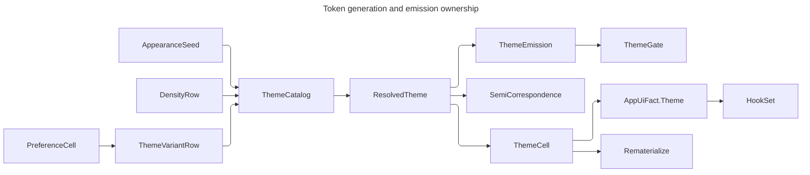

# [APPUI_THEME_EMISSION]

Rasm.AppUi turns the resolved token generation into the live application surface here: one dictionary producer partitions the resolve by `ThemeVariant`, one apply-then-publish swap capsule orders resolve → apply → commit → rebuild → observe, one `Application.Styles` chain admits the Semi skin stack, and one skin table declares every product control theme as executable rows over the generated token keys. `Theme/tokens.md` owns the generation, `Theme/semi.md` the shipped-key correspondence this emission folds, `Theme/typography.md` the type table it re-emits.

## [01]-[INDEX]

- [02]-[SWAP_VOCABULARY]: Swap request, trigger, persisted policy section, and re-materialization roster.
- [03]-[EMISSION]: The one dictionary producer and its guarded merge fold.
- [04]-[SWAP_CAPSULE]: The apply-then-publish capsule, its settings registration, and the one synchronous crossing.
- [05]-[STYLES_GATE]: The Styles admission boundary, derived accessibility candidates, and the code-side dynamic read.
- [06]-[SKIN_TABLE]: Control themes as `SkinRow` data and the authoring capsule.

## [02]-[SWAP_VOCABULARY]

- Owner: `ThemeTrigger` the swap-cause vocabulary the request carries; `ThemeRequest` the one swap request value; `ThemePolicy` the persisted per-profile settings section; `Rematerialize` the re-materialization roster.
- Cases: `ThemeTrigger` = boot | user-switch | host-probe | policy-reload; `Rematerialize` rows name every object a dictionary edit CANNOT reach, each beside its reason — the roster is the complete carve-out, and a surface not on it that holds a resolved value is a defect rather than an accepted exception.
- Evidence: the committed variant, density, trigger, and changed-key count fire as `AppUiFact.Theme` at `AppUiPoint.Theme` on the composition `HookSet`; the CloudEvent envelope's HLC is the sole evidence time authority, and ordering among swaps is the commit order of the one atom. `ThemePolicy` reloads land their `ReloadOutcome` on the options-monitor reload stream, the same class the locale section rides.
- Packages: Thinktecture.Runtime.Extensions, LanguageExt.Core
- Growth: one trigger constant, one policy value, or one `Rematerialize` row with its reason; zero new surface.
- Boundary: `Rematerialize` rows are DISPATCHED, never merely listed — the swap capsule takes one bound rebuild action PER ROW and `Of` refuses a roster row nothing rebuilds BEFORE the cell exists, so a row that rebuilds nothing cannot sit indistinguishable beside one that does and no caller can skip the proof by reaching the constructor.

```csharp
// --- [TYPES] ---------------------------------------------------------------------------

[SmartEnum<string>]
[KeyMemberEqualityComparer<ComparerAccessors.StringOrdinal, string>]
[KeyMemberComparer<ComparerAccessors.StringOrdinal, string>]
public sealed partial class ThemeTrigger {
    public static readonly ThemeTrigger Boot = new("boot");
    public static readonly ThemeTrigger User = new("user-switch");
    public static readonly ThemeTrigger Probe = new("host-probe");
    public static readonly ThemeTrigger Policy = new("policy-reload");
}

// --- [MODELS] --------------------------------------------------------------------------

public sealed record ThemeRequest(ThemeVariantRow Variant, DensityRow Density, Option<Color> Accent, ThemeTrigger Trigger);

public sealed record ThemePolicy(string Variant, string Density, Option<string> Accent) {
    public const string Section = nameof(ThemePolicy);

    public static readonly ThemePolicy Default = new(Variant: ThemeVariantRow.HostMatched.Key, Density: DensityRow.Default.Key, Accent: None);
}

[SmartEnum<string>]
[KeyMemberEqualityComparer<ComparerAccessors.StringOrdinal, string>]
[KeyMemberComparer<ComparerAccessors.StringOrdinal, string>]
public sealed partial class Rematerialize {
    public static readonly Rematerialize FluentPalette = new("fluent-palette", "the FluentTheme.Palettes value is read at theme-apply and never re-resolved");
    public static readonly Rematerialize VisualRecord = new("visual-record", "sealed Skia op lists carry resolved pigments inside the record");
    public static readonly Rematerialize SwatchSource = new("swatch-source", "an IColorPalette hands back fixed colors to the color picker");
    public static readonly Rematerialize TintedAsset = new("tinted-asset", "an SVG or raster asset tinted at load holds the pigment in its bitmap");
    public static readonly Rematerialize CaptureProfile = new("capture-profile", "an export color policy snapshots the resolve for a deterministic encode");
    public static readonly Rematerialize GrammarTheme = new("grammar-theme", "a projected syntax colour block takes resolved values, so a swap re-projects it rather than re-binding");
    public static readonly Rematerialize ChartPaint = new("chart-paint", "a chart paint holds resolved pigments inside a live draw task, so a swap retints the ink and re-applies the composition");

    public string Reason { get; }
}
```

## [03]-[EMISSION]

- Owner: `ThemeEmission` — the one dictionary producer.
- Law: EMISSION is the whole re-tint mechanism — every token key lands in `Application.Resources.MergedDictionaries[0]`, partitioned by `ThemeVariant` under `ResourceDictionary.ThemeDictionaries`, and every consumer binds `{DynamicResource}` in XAML or `GetResourceObservable` in code; a `SetValue` write of a resolved paint onto a control is the deleted form, because it seats a LocalValue no dictionary edit can ever re-resolve. Every partition folds on ONE guarded merge fold: `ResourceDictionary.Add` throws on a duplicate key and the emission merges INDEPENDENTLY authored slot rosters, so a key two rosters claim — which neither roster's own conformance can see — surfaces as a typed `ThemeFault.PaletteRejected` instead of a throw escaping the boot mount, and the posture partition rides the same fold rather than a second unguarded fold beside it.
- Entry: `Emit(AppearanceSeed seed, DensityRow density, FontChain chain, PreferenceCell preferences) : Fin<ResourceDictionary>` — the one producer over every emitted variant and posture partition.
- Auto: a paint emits TWICE — the brush under the bare key and the `Color` under the `Color`-suffixed twin, exactly as the shipped palette does, because a template binding a Color to a brush slot fails at parse and a converter per binding is the deleted form; the Semi closure and the node-editor `GraphSkin` closure fold into ONE emission, so a second dictionary merged at mount cannot give the canvas a variant the shell already swapped away from.
- Packages: Avalonia, Thinktecture.Runtime.Extensions, LanguageExt.Core
- Growth: a new emission family is one `Entries` projection row in the one merge; zero new fold.
- Boundary: a posture partition re-emits the SURFACE family alone — every other key inherits from the parent variant, so a posture scope is one small override rather than a copied palette that drifts on the next re-seed.

```csharp
// --- [OPERATIONS] ----------------------------------------------------------------------

public static class ThemeEmission {
    public static Fin<ResourceDictionary> Emit(AppearanceSeed seed, DensityRow density, FontChain chain, PreferenceCell preferences) =>
        ThemeVariantRow.Emitted
            .Traverse(row => ThemeCatalog.Resolve(row, density, seed, chain, preferences).Map(resolved => (Row: row, Resolved: resolved)))
            .As()
            .Bind(cells => cells
                .Traverse(cell => Postures(cell.Row, density, seed, chain, preferences).Map(postures => (cell.Row, cell.Resolved, Postures: postures)))
                .As())
            .Bind(cells => cells
                .Traverse(cell => Partition(cell.Resolved).Map(partition => (cell.Row, Partition: partition, cell.Postures)))
                .As())
            .Map(cells => cells.Fold(new ResourceDictionary(), static (dictionary, cell) => {
                dictionary.ThemeDictionaries[cell.Row.Variant] = cell.Partition;
                cell.Postures.Iter(posture => dictionary.ThemeDictionaries[posture.Variant] = posture.Provider);
                return dictionary;
            }));

    static Fin<Seq<(ThemeVariant Variant, IThemeVariantProvider Provider)>> Postures(
        ThemeVariantRow row, DensityRow density, AppearanceSeed seed, FontChain chain, PreferenceCell preferences) =>
        toSeq(PostureSlot.Items)
            .Traverse(slot => ThemeCatalog
                .Resolve(row, density, Reposed(seed, slot), chain, preferences)
                .Bind(resolved => Surfaces(resolved).Map(surfaces => (PostureVariant.Of(row, slot), (IThemeVariantProvider)surfaces))))
            .As();

    static AppearanceSeed Reposed(AppearanceSeed seed, PostureSlot slot) =>
        seed.Postures.Find(entry => entry.Slot == slot).Match(
            Some: entry => seed with { Postures = seed.Postures.Map(row => row with { Posture = row.Posture with { ToneShift = SignedUnit.Create(Math.Clamp(row.Posture.ToneShift.Value - entry.Posture.ToneShift.Value, -1d, 1d)) } }) },
            None: () => seed);

    static Fin<ResourceDictionary> Partition(ResolvedTheme resolved) =>
        Merged(Entries(resolved.Paints, static color => (object)new SolidColorBrush(color), suffix: "")
            + Entries(resolved.Paints, static color => (object)color, suffix: "Color")
            + Entries(resolved.Metrics, static value => (object)value, suffix: "")
            + TypeScale.Emission(resolved.Types).Map(static entry => (Key: (object)entry.Key.Value, entry.Value))
            + Entries(resolved.Depths, static shadows => (object)shadows, suffix: "")
            + Entries(resolved.Materials, static material => (object)material, suffix: "")
            + Entries(resolved.Spans, static duration => (object)duration.ToTimeSpan(), suffix: "")
            + Entries(resolved.Ranks, static rank => (object)rank, suffix: "")
            + (SemiCorrespondence.Slots + GraphSkin.Slots)
                .Choose(slot => slot.Mint(resolved).Map(value => (Key: (object)slot.Slot, Value: value))));

    static Fin<ResourceDictionary> Surfaces(ResolvedTheme resolved) =>
        Merged(toSeq(resolved.Paints)
            .Filter(entry => SurfaceRoles.Exists(role => entry.Key.Value.StartsWith(role.Key, StringComparison.Ordinal)))
            .Map(static entry => ((object)entry.Key.Value, (object)new SolidColorBrush(entry.Value))));

    static readonly Seq<PaintRole> SurfaceRoles = Seq(PaintRole.Surface, PaintRole.Panel, PaintRole.Raised, PaintRole.Well, PaintRole.Overlay);

    static Fin<ResourceDictionary> Merged(Seq<(object Key, object Value)> entries) =>
        entries.Fold(Fin.Succ(new ResourceDictionary()), static (state, entry) => state.Bind(dictionary =>
            dictionary.TryGetValue(entry.Key, out object? _)
                ? Fin.Fail<ResourceDictionary>(new ThemeFault.PaletteRejected($"duplicate emission key {entry.Key}"))
                : Added(dictionary, entry)));

    static Fin<ResourceDictionary> Added(ResourceDictionary dictionary, (object Key, object Value) entry) {
        dictionary.Add(entry.Key, entry.Value);
        return Fin.Succ(dictionary);
    }

    static Seq<(object Key, object Value)> Entries<T>(FrozenDictionary<TokenKey, T> bucket, Func<T, object> project, string suffix) =>
        toSeq(bucket).Map(entry => ((object)(entry.Key.Value + suffix), project(entry.Value)));
}
```

## [04]-[SWAP_CAPSULE]

- Owner: `ThemeCell` — the apply-then-publish swap capsule with its one `Ran` synchronous crossing and its settings registration.
- Law: `Swap` orders resolve → apply → commit → rebuild → observe: the CANDIDATE seed feeds the resolve and neither atom commits until the retained application succeeded, so a refused generation or a failed apply leaves `Current` AND `Seed` at the committed predecessor — the prior spelling swapped the seed ahead of resolution, leaving a rejected accent live for the next unrelated swap.
- Entry: `Swap(ThemeRequest, PreferenceCell) : IO<Fin<ResolvedTheme>>`; `Rebuilt() ` — the per-row dispatch over the bound re-materialization actions; `Of(current, seed, chain, surfaceOverride, apply, rebuild, hooks) : Fin<ThemeCell>` — the ONE construction, folding the private `Covered` proof that every `Rematerialize` roster row carries a rebuild, so an uncovered roster is unrepresentable rather than provable-on-request; `Settings(scopes, preferences)` — the settings-registry row whose picker extent DERIVES from the resolved extent scale; `For(profile, mount, preferences)` — the per-surface resolve over the election and the override column; `Preview(simulate)` — the operator CVD lens over `ThemeCatalog.Simulated`; `Track(preferences, observe)` — the host preference-change terminal edge; `Republish(policy, preferences)` — the options-monitor bridge.
- Auto: every successful swap returns the committed `ResolvedTheme` and fires its transition facts through the composition-bound `HookSet`; `Diff` gates the no-op on the record's generated equality — an identical regeneration answers `previous.Equals(next)` and reports zero changed keys — while `Changed` counts the exact keys that moved.
- Packages: Avalonia, Rasm.AppHost (project — `ReloadOutcome`, `ConfigError`, `SettingsRow`, `SettingScope`), Thinktecture.Runtime.Extensions, LanguageExt.Core
- Growth: one bound rebuild action per new `Rematerialize` row — `Of` breaks the composition that forgot it; one settings field per new policy value.
- Boundary: `ThemePolicy` is the persisted per-profile theme section — `Republish` admits the variant and density keys through the generated `TryGet` lookups and the accent hex through `Color.TryParse`, a rejected write keeps prior values live as `ReloadOutcome.Rejected` on the reload stream, and cross-process propagation rides the op-log cursor exactly as the locale section does; variant and density are CLOSED rosters, so both settings fields pick from their own generated rows and a hand roster naming a retired variant is unspellable; the accent surface projection reads the LIVE seed accent — a persisted explicit accent equal to the default re-admits identically, so the projection carries no override bookkeeping.

```csharp
public sealed class ThemeCell {
    readonly HashMap<Rematerialize, IO<Unit>> rebuild;

    ThemeCell(
        Atom<ResolvedTheme> current,
        Atom<AppearanceSeed> seed,
        FontChain chain,
        Func<ConsumptionProfile, SurfaceMount, Option<ThemeVariantRow>> surfaceOverride,
        Func<ResolvedTheme, IO<Fin<Unit>>> apply,
        HashMap<Rematerialize, IO<Unit>> rebuild,
        HookSet<AppUiPoint, AppUiFact, TelemetrySource> hooks) =>
        (Current, Seed, Chain, SurfaceOverride, Apply, this.rebuild, Hooks) =
            (current, seed, chain, surfaceOverride, apply, rebuild, hooks);

    public static Fin<ThemeCell> Of(
        Atom<ResolvedTheme> current,
        Atom<AppearanceSeed> seed,
        FontChain chain,
        Func<ConsumptionProfile, SurfaceMount, Option<ThemeVariantRow>> surfaceOverride,
        Func<ResolvedTheme, IO<Fin<Unit>>> apply,
        HashMap<Rematerialize, IO<Unit>> rebuild,
        HookSet<AppUiPoint, AppUiFact, TelemetrySource> hooks) =>
        Covered(rebuild).Map(_ => new ThemeCell(current, seed, chain, surfaceOverride, apply, rebuild, hooks));

    public Atom<ResolvedTheme> Current { get; }

    public Atom<AppearanceSeed> Seed { get; }

    public FontChain Chain { get; }

    public Func<ConsumptionProfile, SurfaceMount, Option<ThemeVariantRow>> SurfaceOverride { get; }

    public Func<ResolvedTheme, IO<Fin<Unit>>> Apply { get; }

    public HookSet<AppUiPoint, AppUiFact, TelemetrySource> Hooks { get; }

    private static Fin<Unit> Covered(HashMap<Rematerialize, IO<Unit>> bound) =>
        toSeq(Rematerialize.Items).Filter(row => bound.Find(row).IsNone) switch {
            { IsEmpty: true } => Fin.Succ(unit),
            var unbound => Fin.Fail<Unit>(new ThemeFault.MountRejected(
                $"unrebuilt rows: {string.Join(", ", unbound.Map(static row => row.Key))}")),
        };

    IO<Unit> Rebuilt() =>
        toSeq(Rematerialize.Items).Fold(IO.pure(unit), (io, row) => io.Bind(_ => rebuild.Find(row).IfNone(IO.pure(unit))));

    public IO<Fin<ResolvedTheme>> Swap(ThemeRequest request, PreferenceCell preferences) =>
        IO.lift(() => {
            AppearanceSeed candidate = request.Accent.Match(
                Some: accent => Seed.Value with { Accent = accent },
                None: () => Seed.Value);
            return (Previous: Current.Value, Candidate: candidate,
                    Next: ThemeCatalog.Resolve(request.Variant, request.Density, candidate, Chain, preferences));
        })
        .Bind(step => step.Next.Match(
            Succ: next => Apply(next).Bind(applied => applied.Match(
                Succ: _ => IO.lift(() => {
                        ignore(Seed.Swap(_ => step.Candidate));
                        return Current.Swap(_ => next);
                    })
                    .Bind(committed => Rebuilt().Bind(_ => IO.lift<Fin<ResolvedTheme>>(() => Hooks.Fire(
                        AppUiPoint.Theme,
                        new AppUiFact.Theme(committed.Variant.Key, committed.Density.Key, request.Trigger.Key, Diff(step.Previous, committed)),
                        body: _ => Fin.Succ(committed))))),
                Fail: error => IO.pure(Fin.Fail<ResolvedTheme>(error)))),
            Fail: error => IO.pure(Fin.Fail<ResolvedTheme>(error))));

    public Validation<Error, SettingsRow> Settings(
        Func<HashMap<string, SettingScope>> scopes,
        PreferenceCell preferences) =>
        Extent().Bind(extent => Schema(extent)).Map(schema => new SettingsRow(
            Section: ThemePolicy.Section,
            LabelKey: $"{ThemePolicy.Section}.title",
            Schema: schema,
            Read: () => State(Held()),
            Scopes: scopes,
            Defaults: State(ThemePolicy.Default),
            Apply: state => IO.lift(() => Republish(Decode(state), preferences))));

    Validation<Error, double> Extent() =>
        Current.Value.Metric(MetricFamily.Extent, 1).Match(
            Some: Validation<Error, double>.Success,
            None: static () => Validation<Error, double>.Fail((Error)new ThemeFault.PolicyRejected("extent scale unresolved")));

    static Validation<Error, FormSchema> Schema(double pickerExtent) =>
        FormSchema.Create(
            ThemePolicy.Section, ThemePolicy.Section, ThemePolicy.Section, FormGeometry.Inline,
            Seq(Picker(nameof(ThemePolicy.Variant), toSeq(ThemeVariantRow.Items).Map(static row => row.Key), pickerExtent),
                Picker(nameof(ThemePolicy.Density), toSeq(DensityRow.Items).Map(static row => row.Key), pickerExtent),
                FormField.Of(nameof(ThemePolicy.Accent), $"{ThemePolicy.Section}.accent",
                    new ControlIntent.TextInput(nameof(ThemePolicy.Accent), $"{ThemePolicy.Section}.accent.hint",
                        Multiline: false, IntentBinding.Of(PaintRole.Text)),
                    FieldEntry.Colour, static _ => Validation<Error, Unit>.Success(unit))),
            Seq(FormSection.Of(ThemePolicy.Section, $"{ThemePolicy.Section}.title",
                Seq(nameof(ThemePolicy.Variant), nameof(ThemePolicy.Density), nameof(ThemePolicy.Accent)))));

    static FormField Picker(string key, Seq<string> keys, double pickerExtent) =>
        FormField.Of($"{ThemePolicy.Section}.{key}",
            new ControlIntent.Select(key, SelectPosture.Closed,
                new OptionSource.Inline(keys.Map(row => new OptionRow(row, $"{ThemePolicy.Section}.{key}.{row}", None, None))),
                VirtualWindowSpec.FixedRow(pickerExtent), IntentBinding.Of(PaintRole.Text)),
            FieldEntry.Choice, static _ => Validation<Error, Unit>.Success(unit));

    ThemePolicy Held() => new(Current.Value.Variant.Key, Current.Value.Density.Key, Some($"#{Seed.Value.Accent.ToUInt32():X8}"));

    static FormState State(ThemePolicy policy) =>
        FormState.Empty
            .Seat(nameof(ThemePolicy.Variant), FieldValue.Of(JsonSerializer.SerializeToElement(policy.Variant), ValueOrigin.Declared))
            .Seat(nameof(ThemePolicy.Density), FieldValue.Of(JsonSerializer.SerializeToElement(policy.Density), ValueOrigin.Declared))
            .Seat(nameof(ThemePolicy.Accent), FieldValue.Of(JsonSerializer.SerializeToElement(policy.Accent.IfNone(string.Empty)), ValueOrigin.Declared));

    static ThemePolicy Decode(FormState state) =>
        new(Read(state, nameof(ThemePolicy.Variant)).IfNone(ThemePolicy.Default.Variant),
            Read(state, nameof(ThemePolicy.Density)).IfNone(ThemePolicy.Default.Density),
            Read(state, nameof(ThemePolicy.Accent)).Filter(static value => value.Length > 0));

    static Option<string> Read(FormState state, string field) =>
        state.Values.Find(field).Bind(static value => value.Uniform).Bind(static value => Optional(value.GetString()));

    public ReloadOutcome Republish(ThemePolicy policy, PreferenceCell preferences) =>
        Admitted(policy).Bind(request => Ran(request, preferences)) is { IsFail: true, Case: Error error }
            ? new ReloadOutcome.Rejected(ThemePolicy.Section, new ConfigError.BindRejected(ThemePolicy.Section, error))
            : new ReloadOutcome.Applied(ThemePolicy.Section);

    public ResolvedTheme For(ConsumptionProfile profile, SurfaceMount mount, PreferenceCell preferences) =>
        SurfaceOverride(profile, mount)
            .Bind(row => ThemeCatalog.Resolve(row, SurfaceElection.Density(profile), Seed.Value, Chain, preferences).ToOption())
            .IfNone(() => Current.Value);

    public ResolvedTheme Preview(Func<Color, Color> simulate) => ThemeCatalog.Simulated(Current.Value, simulate);

    public IDisposable Track(PreferenceCell preferences, Action<Fin<ResolvedTheme>> observe) =>
        preferences.Track(_ => observe(Ran(
            new ThemeRequest(ThemeVariantRow.HostMatched, Current.Value.Density, None, ThemeTrigger.Probe), preferences)));

    Fin<ResolvedTheme> Ran(ThemeRequest request, PreferenceCell preferences) =>
        Try.lift(() => Swap(request, preferences).Run()).Run().Bind(static inner => inner);

    static Fin<ThemeRequest> Admitted(ThemePolicy policy) =>
        (Variant(policy.Variant), Density(policy.Density)) switch {
            ({ IsSome: true, Case: ThemeVariantRow variant }, { IsSome: true, Case: DensityRow density }) => policy.Accent.Match(
                Some: hex => Color.TryParse(hex, out Color accent)
                    ? Fin.Succ(new ThemeRequest(variant, density, Some(accent), ThemeTrigger.Policy))
                    : Fin.Fail<ThemeRequest>(new ThemeFault.PolicyRejected($"accent {hex}")),
                None: () => Fin.Succ(new ThemeRequest(variant, density, None, ThemeTrigger.Policy))),
            ({ IsSome: false }, _) => Fin.Fail<ThemeRequest>(new ThemeFault.PolicyRejected($"variant {policy.Variant}")),
            _ => Fin.Fail<ThemeRequest>(new ThemeFault.PolicyRejected($"density {policy.Density}")),
        };

    static Option<ThemeVariantRow> Variant(string key) =>
        ThemeVariantRow.TryGet(key, out ThemeVariantRow? row) ? Optional(row) : None;

    static Option<DensityRow> Density(string key) =>
        DensityRow.TryGet(key, out DensityRow? row) ? Optional(row) : None;

    static uint Changed<T>(FrozenDictionary<TokenKey, T> previous, FrozenDictionary<TokenKey, T> next) =>
        (uint)previous.Keys.Concat(next.Keys).Distinct()
            .Count(key => !previous.TryGetValue(out T? before) || !next.TryGetValue(out T? after) || !EqualityComparer<T>.Default.Equals(before, after));

    static uint Diff(ResolvedTheme previous, ResolvedTheme next) =>
        previous.Equals(next)
            ? 0u
            : Changed(previous.Paints, next.Paints) + Changed(previous.Metrics, next.Metrics)
                + Changed(previous.Types, next.Types) + Changed(previous.Depths, next.Depths)
                + Changed(previous.Materials, next.Materials) + Changed(previous.Spans, next.Spans)
                + Changed(previous.Ranks, next.Ranks);
}
```

## [05]-[STYLES_GATE]

- Owner: `ThemeGate` — the one `Application.Styles` admission boundary, the derived accessibility candidate rosters, the `SkinChain` order roster, and the code-side dynamic read.
- Law: the one `Application.Styles` chain is ordered `FluentTheme` floor → `SemiTheme` → the per-control `Semi.Avalonia.*` skins → `UrsaSemiTheme`, every skin strictly below `SemiTheme` so its tokens resolve — the order is a RANKED roster the admission folds, never a prose sentence beside a hand list; `SemiTheme`, `DockSemiTheme`, and `UrsaSemiTheme` each resolve `zh-CN` for an unset locale, so all three take the composed culture at construction.
- Entry: `Admit(FluentTheme floor, CultureInfo locale)` — the chain built off the `SkinChain` roster; `Mount(application, chain, floor, emitted, resolved) : IO<Fin<Unit>>` — the boot collapse, its `SemiMints` proof ordered BEFORE the first retained write so a refused generation leaves no partial Styles chain; `ApplyTo(application, floor, emit) : Func<ResolvedTheme, IO<Fin<Unit>>>` — the typed apply column the swap capsule binds, its emit ordered before its writes for the same reason; `Bind<T>(target, property)` — the one code-side dynamic read.
- Auto: `ContrastCandidates` and `CvdCandidates` are DERIVED from the generated ladder beside the emission rather than hand-listed, so a new role reaches the accessibility sweep with no roster edit; the pair class is the kernel `ContrastFloor` ROW the rung was solved for; a CVD candidate carries its `Cvd` lens alone — the gate simulates the full deficiency, and a severity column that read 1.0 on every row was a knob the value already reconstructed.
- Packages: Avalonia, Avalonia.Themes.Fluent, Semi.Avalonia, Semi.Avalonia.{DataGrid,ColorPicker,Dock,AvaloniaEdit}, Irihi.Ursa.Themes.Semi, Rasm (project — `ContrastFloor`, `Cvd`, `PerceptualColor`), LanguageExt.Core
- Growth: a new skin is one `SkinChain` row carrying its rank and its locale posture; a new candidate family is one derivation fold.
- Boundary: resolved `Spans` reach no Semi slot — `SemiPopupAnimations` carries its durations as inline literals and publishes no named duration resource, so popup and flyout motion rides the `motion#MOTION_APPLICATION` plan rows and mounting `SemiPopupAnimations` is the deleted form; the Fluent-templated `bodong.PropertyGrid`/`DialogHost` keep the Fluent base and are never displaced by the Semi skins; selector styles and `ControlTheme` rows enter only through this gate and pseudo-class states bind token keys, never literal paints; the `Apply` delegate re-themes every retained surface tree including the docked panels from the one resolve.

```csharp
public static class ThemeGate {
    public static Seq<(TokenKey Foreground, TokenKey Background, ContrastFloor Class)> ContrastCandidates =>
        Seq(PaintRole.Text, PaintRole.TextMuted, PaintRole.TextFaint)
            .Bind(ink => Seq(PaintRole.Surface, PaintRole.Panel, PaintRole.Raised, PaintRole.Well, PaintRole.Overlay)
                .Map(ground => (ink.At(0), ground.At(0), Floor(ink))))
            + Seq((PaintRole.AccentText.At(0), PaintRole.Accent.At(0), ContrastFloor.AaText),
                  (PaintRole.SelectionText.At(0), PaintRole.Selection.At(0), ContrastFloor.AaText),
                  (PaintRole.Accent.At(0), PaintRole.Surface.At(0), ContrastFloor.NonText),
                  (PaintRole.Focus.At(0), PaintRole.Surface.At(0), ContrastFloor.NonText),
                  (PaintRole.Border.At(0), PaintRole.Surface.At(0), ContrastFloor.NonText))
            + Seq(PaintRole.ErrorText, PaintRole.Warning, PaintRole.Success, PaintRole.Info)
                .Map(static ink => (ink.At(0), PaintRole.Surface.At(0), ContrastFloor.AaText));

    public static Seq<(TokenKey A, TokenKey B, Cvd Lens)> CvdCandidates =>
        Seq(Cvd.Protanopia, Cvd.Deuteranopia, Cvd.Tritanopia).Bind(lens =>
            Pairs(Seq(PaintRole.Error, PaintRole.Warning, PaintRole.Success, PaintRole.Info, PaintRole.Accent))
                .Map(pair => (pair.Left.At(0), pair.Right.At(0), lens)));

    static ContrastFloor Floor(PaintRole ink) =>
        ink.Derivation is PaintDerivation.Readable readable ? readable.Floor : ContrastFloor.AaText;

    static Seq<(PaintRole Left, PaintRole Right)> Pairs(Seq<PaintRole> roles) =>
        roles.Map(static (left, index) => (Left: left, Index: index))
            .Bind(cell => roles.Skip(cell.Index + 1).Map(right => (cell.Left, right)));

    public static FluentTheme Floor(ResolvedTheme light, ResolvedTheme dark) => new() {
        Palettes = { [ThemeVariant.Light] = light.Palette, [ThemeVariant.Dark] = dark.Palette },
    };

    static readonly Seq<Func<CultureInfo, IStyle>> SkinChain = Seq<Func<CultureInfo, IStyle>>(
        static locale => new SemiTheme { Locale = locale },
        static _ => new Semi.Avalonia.DataGrid.DataGridSemiTheme(),
        static _ => new Semi.Avalonia.ColorPicker.ColorPickerSemiTheme(),
        static locale => new Semi.Avalonia.Dock.DockSemiTheme { Locale = locale },
        static _ => new Semi.Avalonia.AvaloniaEdit.AvaloniaEditSemiTheme(),
        static locale => new Ursa.Themes.Semi.UrsaSemiTheme { Locale = locale });

    public static Seq<IStyle> Admit(FluentTheme floor, CultureInfo locale) =>
        ((IStyle)floor).Cons(SkinChain.Map(mint => mint(locale)));

    public static IO<Fin<Unit>> Mount(Application application, Seq<IStyle> chain, FluentTheme floor, ResourceDictionary emitted, ResolvedTheme resolved) =>
        IO.lift<Fin<Unit>>(() => SemiCorrespondence.SemiMints(resolved).Map(_ => {
            chain.Iter(application.Styles.Add);
            application.Resources.MergedDictionaries.Insert(0, emitted);
            application.RequestedThemeVariant = resolved.Variant.Variant;
            floor.DensityStyle = resolved.Density.Style;
            return unit;
        }));

    public static Func<ResolvedTheme, IO<Fin<Unit>>> ApplyTo(Application application, FluentTheme floor, Func<ResolvedTheme, Fin<ResourceDictionary>> emit) =>
        resolved => IO.lift<Fin<Unit>>(() => emit(resolved).Map(dictionary => {
            floor.DensityStyle = resolved.Density.Style;
            application.RequestedThemeVariant = resolved.Variant.Variant;
            application.Resources.MergedDictionaries[0] = dictionary;
            return unit;
        }));

    public static IDisposable Bind<T>(Control target, StyledProperty<T> property, TokenKey key) =>
        target.Bind(property, target.GetResourceObservable(key.Value).Select(static value => value is T typed ? typed : default!));
}
```

## [06]-[SKIN_TABLE]

- Owner: `SkinBasis` `[Union]` the five ways a product control theme comes to exist; `ArmBinding` and `AuthoredArm` the authored interaction arms with their token-slot bindings; `SkinRow` `[SmartEnum<string>]` — every product control theme as ONE executable row carrying its basis, its pseudo-class roster, its token keys, and its authored arms; `PartCustody`, `AuthoredPart`, `AuthoredSpec`, and `AuthoredControl<TSelf>` the templated-control authoring capsule.
- Law: a product control theme derives through `ControlTheme.BasedOn` against a SHIPPED theme only where that theme carries the interaction arm it needs — deriving from an arm the shipped theme never defines silently produces a control with no state feedback — so a row's `Arms` column names each gap WITH the token slots that fill it, and a row inheriting every arm from its base carries none; every `Keys` entry is a MINTED `TokenKey` off a generated rung, so a skin naming a key the generation never emits is unspellable, which is the provenance proof the two markdown tables this roster replaces could never run.
- Cases: `SkinBasis` = Shipped — `BasedOn` a shipped theme; Overridden — re-tinted through the semi slot-override families with no template of its own; Capsule — an `AuthoredControl` spec plus template; Replaced — a full template replacement where the shipped surface pins local values a style setter never wins against (the inspector category expander); Generated — a brush grid generated from the role ladder (the `ButtonGroup` variant × intent × state × slot product), never authored as a hundred rows.
- Entry: `SkinRow.Items` — the roster the registration fold walks; `AuthoredControl<TSelf>.OnApplyTemplate` — the one template-part resolution.
- Packages: Avalonia, Semi.Avalonia, Irihi.Ursa, Thinktecture.Runtime.Extensions, LanguageExt.Core
- Growth: a new product control theme is one `SkinRow` row; a new authored arm is one `AuthoredArm` on its row; a new template part is one `AuthoredPart` with its custody row.
- Boundary: the banner's PLACEMENT is a pair of style classes the control fold stamps and never a pseudo-class, because the framework sets pseudo-classes and a placement the product chose cannot be one — the banner row's state roster therefore carries the four shipped severities alone; `BorderlessButton` carries `:disabled` alone, `SolidButton` drops the size arms, `OutlineButton` carries the five intent arms alone, and `HyperlinkButton` owns its own trailing link glyph — each fact is the `Shipped` basis payload of its row; the pseudo-class roster is DECLARED on the spec and mirrored by the metadata attribute the theme tooling reads, so a state a template styles against but the control never sets is a spec omission rather than a selector that silently never matches.

```csharp
// --- [TYPES] ---------------------------------------------------------------------------

[Union(ConversionFromValue = ConversionOperatorsGeneration.None)]
public abstract partial record SkinBasis {
    private SkinBasis() { }

    public sealed record Shipped(string Theme) : SkinBasis;
    public sealed record Overridden(string Family) : SkinBasis;
    public sealed record Capsule : SkinBasis;
    public sealed record Replaced(string Template) : SkinBasis;
    public sealed record Generated(string Grid) : SkinBasis;
}

public sealed record ArmBinding(string Slot, TokenKey Key);

public sealed record AuthoredArm(string Name, Seq<ArmBinding> Bindings);

// --- [TABLES] --------------------------------------------------------------------------

[SmartEnum<string>]
[KeyMemberEqualityComparer<ComparerAccessors.StringOrdinal, string>]
[KeyMemberComparer<ComparerAccessors.StringOrdinal, string>]
public sealed partial class SkinRow {
    public static readonly SkinRow CommandButton = new("command-button", new SkinBasis.Shipped("SolidButton"),
        Seq(":pointerover", ":pressed", ":disabled"), Seq(PaintRole.Accent.At(0), PaintRole.Accent.At(1), PaintRole.AccentText.At(0)), []);
    public static readonly SkinRow SecondaryButton = new("secondary-button", new SkinBasis.Shipped("OutlineButton"),
        Seq(":pointerover", ":pressed", ":disabled"), Seq(PaintRole.Panel.At(0), PaintRole.Accent.At(0), PaintRole.Border.At(1)),
        Seq(new AuthoredArm("pointerover", Seq(new ArmBinding("fill", PaintRole.Raised.At(1)), new ArmBinding("rim", PaintRole.Border.At(1)))),
            new AuthoredArm("press", Seq(new ArmBinding("fill", PaintRole.Raised.At(1))))));
    public static readonly SkinRow QuietButton = new("quiet-button", new SkinBasis.Shipped("BorderlessButton"),
        Seq(":pointerover", ":pressed", ":disabled"), Seq(PaintRole.Raised.At(1), PaintRole.TextMuted.At(0), MetricFamily.Stroke.At(0)), []);
    public static readonly SkinRow DangerButton = new("danger-button", new SkinBasis.Shipped("SolidButton"),
        Seq(":pointerover", ":pressed", ":disabled"), Seq(PaintRole.Error.At(0), PaintRole.Error.At(1), PaintRole.AccentText.At(0)), []);
    public static readonly SkinRow InvertedButton = new("inverted-button", new SkinBasis.Shipped("BorderlessButton"),
        Seq(":pointerover", ":pressed", ":disabled"), Seq(PaintRole.Overlay.At(2), PaintRole.AccentText.At(0), MetricFamily.Stroke.At(0)),
        Seq(new AuthoredArm("pointerover", Seq(new ArmBinding("fill", PaintRole.Overlay.At(1)), new ArmBinding("ink", PaintRole.AccentText.At(0)))),
            new AuthoredArm("press", Seq(new ArmBinding("fill", PaintRole.Overlay.At(1))))));
    public static readonly SkinRow LinkButton = new("link-button", new SkinBasis.Shipped("HyperlinkButton"),
        Seq(":pointerover", ":pressed", ":disabled"), Seq(PaintRole.Link.At(0), PaintRole.Link.At(1), PaintRole.Focus.At(0)),
        Seq(new AuthoredArm("pointerover", Seq(new ArmBinding("ink", PaintRole.Link.At(1)), new ArmBinding("rule", MetricFamily.Stroke.At(0)))),
            new AuthoredArm("press", Seq(new ArmBinding("ring", PaintRole.Focus.At(0))))));
    public static readonly SkinRow NavButton = new("nav-button", new SkinBasis.Shipped("IconButton"),
        Seq(":selected", ":pointerover", ":collapsed"), Seq(PaintRole.Panel.At(0), PaintRole.Raised.At(1), PaintRole.Accent.At(0), MetricFamily.Icon.At(2)), []);
    public static readonly SkinRow SegmentedItem = new("segmented-item", new SkinBasis.Capsule(),
        Seq(":selected", ":first", ":last"), Seq(PaintRole.Well.At(0), PaintRole.Raised.At(1), PaintRole.Accent.At(0), MetricFamily.Space.At(2)), []);
    public static readonly SkinRow SegmentedIndicator = new("segmented-indicator", new SkinBasis.Capsule(),
        Seq(":moving"), Seq(PaintRole.Raised.At(2), DepthTier.Raised.ShadowKey), []);
    public static readonly SkinRow TextEntry = new("text-entry", new SkinBasis.Shipped("NonErrorTextBox"),
        Seq(":focus", ":error", ":mixed", ":disabled"), Seq(PaintRole.Well.At(0), PaintRole.Text.At(0), PaintRole.Error.At(0), PaintRole.Focus.At(0), MetricFamily.Stroke.At(1)), []);
    public static readonly SkinRow FormRow = new("form-row", new SkinBasis.Shipped("FormItem"),
        Seq(":horizontal", ":no-label"), Seq(PaintRole.TextMuted.At(0), MetricFamily.Space.At(3)), []);
    public static readonly SkinRow FieldMarks = new("field-marks", new SkinBasis.Capsule(),
        Seq(":declared", ":overridden", ":pending"), Seq(PaintRole.Text.At(0), PaintRole.Warning.At(0), PaintRole.Accent.At(0), PaintRole.Error.At(0)), []);
    public static readonly SkinRow FieldRefused = new("field-refused", new SkinBasis.Capsule(),
        Seq(":mixed", ":invalid"), Seq(PaintRole.TextFaint.At(0), PaintRole.Error.At(0), PaintRole.ErrorText.At(0)), []);
    public static readonly SkinRow GridRow = new("grid-row", new SkinBasis.Shipped("DataGridSemiTheme"),
        Seq(":selected", ":pointerover", ":current"), Seq(PaintRole.Surface.At(1), PaintRole.Selection.At(0), PaintRole.SelectionText.At(0)), []);
    public static readonly SkinRow TabStripItem = new("tab-strip-item", new SkinBasis.Shipped("LineTabStripItem"),
        Seq(":selected", ":pointerover"), Seq(PaintRole.Accent.At(0), PaintRole.TextMuted.At(0), MetricFamily.Space.At(2), MetricFamily.Stroke.At(1)), []);
    public static readonly SkinRow FlyoutHost = new("flyout-host", new SkinBasis.Shipped("FlyoutPresenter"),
        Seq(":open"), Seq(PaintRole.Overlay.At(0), MetricFamily.Radius.At(2), DepthTier.Flyout.ShadowKey), []);
    public static readonly SkinRow DialogHost = new("dialog-host", new SkinBasis.Shipped("StandardDialogControl"),
        Seq(":open", ":modal"), Seq(PaintRole.Overlay.At(0), PaintRole.Scrim.At(0), DepthTier.Dialog.ShadowKey), []);
    public static readonly SkinRow ToastCard = new("toast-card", new SkinBasis.Overridden("ToastCard"),
        Seq(":open", ":closing", ":hovered", ":capped"), Seq(PaintRole.Overlay.At(0), MetricFamily.Radius.At(2), DepthTier.Floating.RankKey), []);
    public static readonly SkinRow Banner = new("banner", new SkinBasis.Overridden("Banner"),
        Seq(":information", ":success", ":warning", ":error"), Seq(PaintRole.Info.At(0), PaintRole.Success.At(0), PaintRole.Warning.At(0), PaintRole.Error.At(0)), []);
    public static readonly SkinRow StatusChip = new("status-chip", new SkinBasis.Capsule(),
        Seq(":info", ":success", ":warning", ":error"), Seq(PaintRole.Info.At(3), PaintRole.Success.At(3), PaintRole.Warning.At(3)), []);
    public static readonly SkinRow PaletteRow = new("palette-row", new SkinBasis.Shipped("ListBoxItem"),
        Seq(":selected", ":pointerover", ":group-head"), Seq(PaintRole.Overlay.At(1), PaintRole.Highlight.At(0), PaintRole.TextMuted.At(0)), []);
    public static readonly SkinRow EmptyState = new("empty-state", new SkinBasis.Capsule(),
        Seq(":actionable"), Seq(PaintRole.Panel.At(0), PaintRole.TextFaint.At(0), MetricFamily.Space.At(5), MetricFamily.Icon.At(4)), []);
    public static readonly SkinRow AvatarCluster = new("avatar-cluster", new SkinBasis.Capsule(),
        Seq(":overflow"), Seq(PaintRole.Raised.At(1), PaintRole.Border.At(0), MetricFamily.Space.At(1)),
        Seq(new AuthoredArm("overflow", Seq(new ArmBinding("ring", PaintRole.Border.At(0)), new ArmBinding("overlap", MetricFamily.Space.At(1)), new ArmBinding("face", PaintRole.Raised.At(1))))));
    public static readonly SkinRow Tooltip = new("tooltip", new SkinBasis.Shipped("ToolTip"),
        Seq(":open"), Seq(PaintRole.Overlay.At(2), PaintRole.Text.At(0), TokenKey.Named("z", "tooltip"), MetricFamily.Radius.At(1)), []);
    public static readonly SkinRow DockChrome = new("dock-chrome", new SkinBasis.Overridden("DockSemiTheme"),
        Seq(":active", ":floating", ":pinned"), Seq(PaintRole.Workbench.At(0), PaintRole.Separator.At(0), PaintRole.Panel.At(1)), []);
    public static readonly SkinRow ButtonGroupItem = new("button-group-item", new SkinBasis.Generated("variant-intent-state-slot"),
        Seq(":pointerover", ":pressed", ":disabled"), [], []);
    public static readonly SkinRow InspectorCategory = new("inspector-category", new SkinBasis.Replaced("Expander"),
        Seq(":expanded", ":nested", ":filtered"), Seq(PaintRole.Panel.At(0), PaintRole.Separator.At(0), PaintRole.TextMuted.At(0), MetricFamily.Space.At(2)), []);
    public static readonly SkinRow PaletteOverlay = new("palette-overlay", new SkinBasis.Capsule(),
        Seq(":loading", ":empty", ":broken", ":scoped"), Seq(PaintRole.Overlay.At(0), MetricFamily.Radius.At(3), DepthTier.Flyout.ShadowKey),
        Seq(new AuthoredArm("loading", Seq(new ArmBinding("ground", PaintRole.Overlay.At(0)))),
            new AuthoredArm("empty", Seq(new ArmBinding("hint", PaintRole.TextFaint.At(0)), new ArmBinding("rim", PaintRole.Border.At(0))))));
    public static readonly SkinRow Keycap = new("keycap", new SkinBasis.Capsule(),
        Seq(":chord", ":capturing", ":empty", ":conflicted"), Seq(PaintRole.Well.At(0), PaintRole.TextMuted.At(0), PaintRole.Border.At(0), MetricFamily.Radius.At(1)),
        Seq(new AuthoredArm("capturing", Seq(new ArmBinding("face", PaintRole.Well.At(0)), new ArmBinding("ink", PaintRole.TextMuted.At(0)))),
            new AuthoredArm("empty", Seq(new ArmBinding("rim", PaintRole.Border.At(0)))),
            new AuthoredArm("conflicted", Seq(new ArmBinding("rim", PaintRole.Error.At(0))))));
    public static readonly SkinRow PaletteBadge = new("palette-badge", new SkinBasis.Capsule(),
        Seq(":kind", ":source"), Seq(PaintRole.Raised.At(1), PaintRole.TextFaint.At(0), MetricFamily.Radius.At(1)),
        Seq(new AuthoredArm("kind", Seq(new ArmBinding("face", PaintRole.Raised.At(1)), new ArmBinding("ink", PaintRole.TextFaint.At(0))))));
    public static readonly SkinRow OverviewStrip = new("overview-strip", new SkinBasis.Capsule(),
        Seq(":dragging", ":unmounted"), Seq(PaintRole.Well.At(0), MetricFamily.Radius.At(0)),
        Seq(new AuthoredArm("dragging", Seq(new ArmBinding("track", PaintRole.Well.At(0)), new ArmBinding("thumb", PaintRole.Raised.At(1)))),
            new AuthoredArm("unmounted", Seq(new ArmBinding("mark", PaintRole.TextFaint.At(0))))));
    public static readonly SkinRow RadioItem = new("radio-item", new SkinBasis.Shipped("ListBoxItem"),
        Seq(":selected", ":pointerover", ":disabled"), Seq(PaintRole.Well.At(0), PaintRole.Accent.At(0), PaintRole.Border.At(0), PaintRole.Focus.At(0)), []);

    public SkinBasis Basis { get; }

    public Seq<string> States { get; }

    public Seq<TokenKey> Keys { get; }

    public Seq<AuthoredArm> Arms { get; }
}

// --- [COMPOSITION] ---------------------------------------------------------------------

[SmartEnum<string>]
[KeyMemberEqualityComparer<ComparerAccessors.StringOrdinal, string>]
public sealed partial class PartCustody {
    public static readonly PartCustody Required = new("required");
    public static readonly PartCustody Optional = new("optional");
}

public sealed record AuthoredPart(string Name, Type Kind, PartCustody Custody);

public sealed record AuthoredSpec(
    string Key,
    Seq<AuthoredPart> Parts,
    Seq<string> States,
    AutomationControlType Automation,
    TokenKey Surface,
    TokenKey Radius);

public abstract class AuthoredControl<TSelf> : TemplatedControl where TSelf : AuthoredControl<TSelf> {
    protected abstract AuthoredSpec Spec { get; }

    protected Atom<HashMap<string, Control>> Parts { get; } = Atom(HashMap<string, Control>());

    protected override void OnApplyTemplate(TemplateAppliedEventArgs e) {
        base.OnApplyTemplate(e);
        Parts.Swap(_ => Spec.Parts
            .Choose(part => Optional(e.NameScope.Find<Control>(part.Name)).Map(control => (part.Name, control)))
            .ToHashMap());
        Spec.Parts
            .Filter(part => part.Custody == PartCustody.Required && !Parts.Value.ContainsKey(part.Name))
            .Iter(part => Missing(new ThemeFault.MountRejected($"{Spec.Key} part {part.Name}")));
    }

    protected Option<T> Part<T>(string name) where T : Control =>
        Parts.Value.Find(name).Bind(control => control is T typed ? Some(typed) : None);

    protected void State(string name, bool on) => PseudoClasses.Set($":{name}", on);

    protected override AutomationPeer OnCreateAutomationPeer() => new AuthoredPeer(this, Spec);

    protected abstract void Missing(ThemeFault fault);

    sealed class AuthoredPeer(Control owner, AuthoredSpec spec) : ControlAutomationPeer(owner) {
        protected override AutomationControlType GetAutomationControlTypeCore() => spec.Automation;

        protected override string GetClassNameCore() => spec.Key;

        protected override string? GetAutomationIdCore() => spec.Key;
    }
}
```



## [07]-[RESEARCH]

(none)
