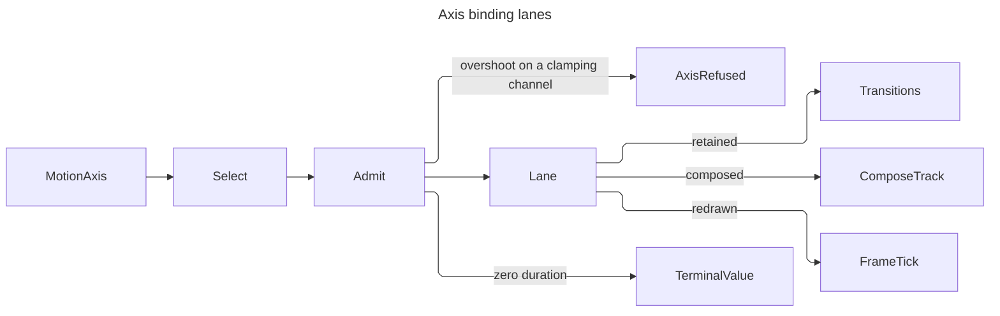
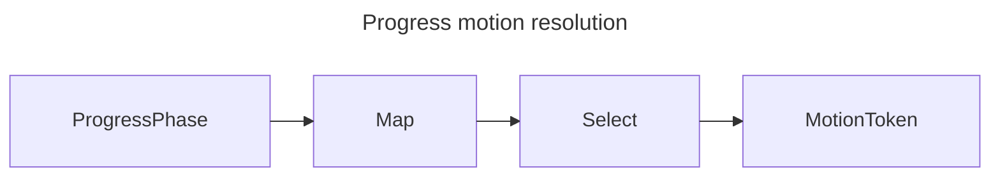

# [APPUI_MOTION_TOKENS]

Rasm.AppUi motion is one `MotionToken` vocabulary: each row carries one `MotionTiming` modality and one reduced-motion delegate, and every duration, easing, or spring literal in the package traces to that owner. `MotionTiming.Tween` carries duration with easing while `MotionTiming.Spring` derives its response curve from the admitted spring, so an impossible duration/curve/spring combination is unrepresentable. This page owns the token axis, the axis-to-transition binding table with its spatial/effects damping split, the plan family carrying enter, exit, stagger, dwell, hold, and choreography as DATA, the latency tiers selecting feedback form from expected operation duration, the interactive handoff physics over the kernel closed forms, the closed `ProgressPhase` mapping, and the reduced-motion degrade switch publishing the kernel `MotionPosture`. `Vfx/compose` owns where this timing EXECUTES on the render thread; a duration, a curve, or a stagger authored anywhere else is a second timing source the reduction switch never reaches.

## [01]-[INDEX]

- [02]-[MOTION_AXIS]: Token rows; tween and spring modalities; the fault floor; the one easing adapter; host parity.
- [03]-[MOTION_BINDING]: The animated-axis table over the retained transitions; damping split; travel ladder; latency tiers; route carrier.
- [04]-[MOTION_APPLICATION]: Plan rows with choreography, stagger, dwell, hold, and stack reflow; pacing folds; measured disclosure.
- [05]-[MOTION_HANDOFF]: Velocity tracking, projected release through one threshold, snap inertia, gesture pickup, and interruption retargeting.
- [06]-[PHASE_MAPPING]: Frozen `ProgressPhase`-to-token map; one resolve entrypoint.
- [07]-[REDUCED_MOTION]: The one degrade switch over the host preference row; the kernel posture producer; conformance.

## [02]-[MOTION_AXIS]

- Owner: `MotionFault` — the direct generated `[Union]` with one `[FaultCase]` leaf per motion failure; `SpringValue` — the (response, damping-fraction) authoring projection over the kernel `SpringShape` mint, carrying the two declared `SettleBand` values; `MotionTiming` — the closed tween-or-spring modality; `MotionToken` — the grade vocabulary; `MotionEasing` — the one Avalonia easing adapter.
- Cases: `MotionToken` = instant | fast | standard | emphasized | ambient | spring-snappy | spring-gentle | spring-tracking; `MotionFault` = SpringOutOfDomain | PhaseUnmapped | OrdinalOutOfDomain | AxisRefused | TravelOutOfDomain | HandoffRefused.
- Law: a timing knows whether it OVERSHOOTS and whether it RETARGETS, because both facts gate admission elsewhere — the effects axes refuse an overshooting token and only a retargetable modality carries velocity across an interruption. Overshoot is PAYLOAD-derived, never a modality constant: the spring arm answers analytically from its damping fraction and the tween arm from a lattice read of its own curve, so an imported easing family classifies itself; retargetability alone is the modality fact the generated total `Switch` answers.
- Entry: `MotionToken.Reduced()` — the `[UseDelegateFromConstructor]` reduced-pair column, total by construction; `SpringValue.Advance(SpringState origin, double target, Duration elapsed)` and `SpringValue.Settling(SpringState origin, double target, SettleBand band)` — the interactive spring reads every gesture handoff composes, each one kernel `Evaluate`/`Settle` call at the landed arity.
- Auto: timing rows double as throttle, debounce, and dwell pacing values consumed by live-data streams, behavior intervals, and screen runtime rows; `SpringValue` admission DELEGATES to the kernel `SpringShape.OfResponse` gate — one admission rule, package-typed onto `MotionFault.SpringOutOfDomain` — so the spring algebra has exactly one owner and a package-local stiffness, damping, decay, or settling derivation is the deleted form.
- Packages: Rasm (project — `SpringShape`/`SpringState`/`SettleBand` the spring algebra, `FaultBand`/`[FaultCase]`/`Fault` the fault floor, `Easing` the easing vocabulary, `UnitInterval` the progress admission, `Op` the operation key every kernel read carries), Thinktecture.Runtime.Extensions, NodaTime, LanguageExt.Core, BCL inbox
- Growth: a new motion grade is one `MotionToken` row carrying its reduced delegate; a new fault case is one `[FaultCase]` leaf; a new spring invariant is one kernel-gate predicate the delegated admission inherits.
- Boundary: `MotionTiming.Tween` carries one NodaTime duration and one kernel `Easing` row, while `MotionTiming.Spring` carries one admitted `SpringValue` and derives its duration from `Response` and its curve from the kernel three-regime closed form. `MotionToken.Duration`, `Curve`, `Spring`, `Overshoots`, and `Retargets` are projections of the timing case, never independent constructor columns. Reduced targets are deferred row delegates, and every row whose motion LOOPS reduces to `Instant` so the reduction halts it outright rather than shortening its period. `MotionEasing` is the ONE Avalonia adapter at the animation binding boundary — the kernel `Interaction` plane is Eto-bound, so this adapter is the named Avalonia counterpart, and `Easing.Parse` is unreachable because no motion value crosses this page as a string. `SpringValue.UnitProgress` and `SpringValue.Pixel` are the two declared settle bands — a unit-normalized progress settles below perception at a fraction of its own travel, a pixel-valued travel at half a device pixel — and an epsilon chosen per call site is what makes two surfaces of one product truncate their tails differently; both ride the kernel `SettleBand` carrier and the kernel `Settle` inversion reads the position column as the absolute tolerance. Spring parity has one source: a host-side preset and a shell token evaluate the SAME kernel closed forms over the same admitted pair — the parity map below names each member beside the host surface class that mirrors it; the host preset table seats at the composition root, never here.

```csharp signature
// --- [TYPES] ---------------------------------------------------------------------------

using KernelEase = Rasm.Parametric.Easing;

[Union(ConversionFromValue = ConversionOperatorsGeneration.None)]
public abstract partial record MotionTiming(Duration Duration, Func<double, double> Curve, bool Overshoots) {
    public sealed record Tween(Duration Duration, KernelEase Ease)
        : MotionTiming(Duration, Eased(Ease), Leaves(Ease));
    public sealed record Spring(SpringValue Value)
        : MotionTiming(
            Duration.FromMilliseconds(Value.Response * NodaConstants.MillisecondsPerSecond),
            SpringProgress(admitted: Value.Shape, response: Value.Response),
            Value.DampingFraction < 1f);

    public Option<SpringValue> Sprung => Switch(
        tween: static _ => None,
        spring: static value => Some(value.Value));

    public bool Retargets => Switch(
        tween: static _ => false,
        spring: static _ => true);

    static Func<double, double> Eased(KernelEase ease) =>
        t => ease.Evaluate(t: UnitInterval.Create(Math.Clamp(t, 0d, 1d)));

    static bool Leaves(KernelEase ease) {
        Func<double, double> curve = Eased(ease);
        return toSeq(Enumerable.Range(0, LatticeSamples)).Exists(step =>
            curve((double)step / (LatticeSamples - 1)) switch { var value => value < 0d || value > 1d });
    }

    const int LatticeSamples = 33;

    static Func<double, double> SpringProgress(Fin<SpringShape> admitted, float response) =>
        admitted.Match<Func<double, double>>(
            Succ: shape => t => shape.Evaluate(
                    origin: new SpringState(Position: 0d, Velocity: 0d), target: 1d,
                    elapsed: Duration.FromSeconds(Math.Clamp(t, 0d, 1d) * response), key: Op.Of(name: nameof(SpringProgress)))
                .Match(Succ: static state => state.Position, Fail: static _ => 1d),
            Fail: static _ => static t => 1d);
}

// --- [MODELS] --------------------------------------------------------------------------

[ComplexValueObject]
[ValidationError]
public readonly partial struct SpringValue {
    public static readonly SettleBand UnitProgress = new(Position: 1d / 512d, Velocity: 1d / 512d);

    public static readonly SettleBand Pixel = new(Position: 0.5d, Velocity: 0.5d);

    public float Response { get; }

    public float DampingFraction { get; }

    public Fin<SpringShape> Shape =>
        SpringShape.OfResponse(response: Response, dampingFraction: DampingFraction);

    public Fin<SpringState> Advance(SpringState origin, double target, Duration elapsed) =>
        Shape.Bind(shape => shape.Evaluate(
            origin: origin, target: target, elapsed: elapsed, key: Op.Of(name: nameof(Advance))));

    public Fin<Duration> Settling(SpringState origin, double target, SettleBand band) =>
        Shape.Bind(shape => shape.Settle(
            origin: origin, target: target, band: band, key: Op.Of(name: nameof(Settling))));

    static partial void ValidateFactoryArguments(ref ValidationError? validationError, ref float response, ref float dampingFraction) {
        (float r, float d) = (response, dampingFraction);
        validationError = SpringShape.OfResponse(response: r, dampingFraction: d).Match(
            Succ: static _ => (MotionFault?)null,
            Fail: _ => new ValidationError(string.Join(" | ", new object?[] { $"response {r} damping-fraction {d}" })));
    }
}

// --- [ERRORS] --------------------------------------------------------------------------

[Union(ConversionFromValue = ConversionOperatorsGeneration.None)]
public abstract partial record MotionFault : Fault {
    private static readonly FaultBand FamilyBand = FaultBand.Motion;
    private MotionFault(string detail) { Detail = detail; }
    public string Detail { get; }
    public override string Message => Detail;
    [FaultCase(0)]
    public sealed partial record SpringOutOfDomain(string Detail)  : MotionFault(Detail);
    [FaultCase(1)]
    public sealed partial record PhaseUnmapped(string Detail)      : MotionFault(Detail);
    [FaultCase(2)]
    public sealed partial record OrdinalOutOfDomain(string Detail) : MotionFault(Detail);
    [FaultCase(3)]
    public sealed partial record AxisRefused(string Detail)        : MotionFault(Detail);
    [FaultCase(4)]
    public sealed partial record TravelOutOfDomain(string Detail)  : MotionFault(Detail);
    [FaultCase(5)]
    public sealed partial record HandoffRefused(string Detail)     : MotionFault(Detail);
}

// --- [SERVICES] ------------------------------------------------------------------------

public sealed class MotionEasing(Func<double, double> curve) : Avalonia.Animation.Easings.Easing {
    public override double Ease(double progress) => curve(progress);
}

[SmartEnum<string>]
[KeyMemberEqualityComparer<ComparerAccessors.StringOrdinal, string>]
[KeyMemberComparer<ComparerAccessors.StringOrdinal, string>]
public sealed partial class MotionToken {
    public static readonly MotionToken Instant = new("instant", new MotionTiming.Tween(Duration.Zero, KernelEase.Linear), reduced: static () => Instant);
    public static readonly MotionToken Fast = new("fast", new MotionTiming.Tween(Duration.FromMilliseconds(100), KernelEase.QuadOut), reduced: static () => Instant);
    public static readonly MotionToken Standard = new("standard", new MotionTiming.Tween(Duration.FromMilliseconds(250), KernelEase.CubicInOut), reduced: static () => Fast);
    public static readonly MotionToken Emphasized = new("emphasized", new MotionTiming.Tween(Duration.FromMilliseconds(400), KernelEase.QuintOut), reduced: static () => Fast);
    public static readonly MotionToken Ambient = new("ambient", new MotionTiming.Tween(Duration.FromMilliseconds(1200), KernelEase.Linear), reduced: static () => Instant);
    public static readonly MotionToken SpringSnappy = new("spring-snappy", new MotionTiming.Spring(SpringValue.Create(response: 0.30f, dampingFraction: 0.85f)), reduced: static () => Fast);
    public static readonly MotionToken SpringGentle = new("spring-gentle", new MotionTiming.Spring(SpringValue.Create(response: 0.65f, dampingFraction: 1.00f)), reduced: static () => Standard);
    public static readonly MotionToken SpringTracking = new("spring-tracking", new MotionTiming.Spring(SpringValue.Create(response: 0.15f, dampingFraction: 1.00f)), reduced: static () => Instant);

    public MotionTiming Timing { get; }

    public Duration Duration => Timing.Duration;

    public Func<double, double> Curve => Timing.Curve;

    public Option<SpringValue> Spring => Timing.Sprung;

    public bool Overshoots => Timing.Overshoots;

    public bool Retargets => Timing.Retargets;

    [UseDelegateFromConstructor]
    public partial MotionToken Reduced();
}
```

| [INDEX] | [MEMBER]                | [HOST_SURFACE]          | [PARITY_LAW]                                                      |
| :-----: | :---------------------- | :---------------------- | :---------------------------------------------------------------- |
|  [01]   | `Response`              | host canvas motion      | seconds-to-target the preset row copies as a value                |
|  [02]   | `DampingFraction`       | host canvas motion      | damping ratio; the kernel selects the regime, never a host branch |
|  [03]   | `Shape`                 | viewport overlay motion | the admitted closed form both sides evaluate, minted at one gate  |
|  [04]   | `MotionDecay.Retention` | host inertial pan       | velocity retention per millisecond; the rate is the kernel's      |

## [03]-[MOTION_BINDING]

- Owner: `MotionKind` the spatial-or-effects discriminant; `MotionLane` the execution-lane vocabulary; `MotionAxis` `[SmartEnum<string>]` the animated-axis table over the retained transition family; `MotionTravel` the distance-and-size duration ladder; `LatencyTier` the feedback-form family; `RouteDirection` the navigation-direction row; `RouteCarrier` the page-transition binding.
- Cases: `MotionKind` = spatial | effects; `MotionLane` = retained | composed | redrawn; `MotionAxis` = opacity | colour | brush | shadow | corner | effect | transform | extent | inset; `LatencyTier` = instant | feedback | skeleton | deliberate | handoff; `RouteDirection` = forward | back.
- Law: the SPATIAL/EFFECTS split governs damping. Position, size, and transform may ride an under-damped spring because overshooting a coordinate reads as weight; colour, opacity, brush, shadow, and corner are always critically damped because those channels CLAMP at their domain edges and a clamped overshoot renders as a rendering fault. The admission is structural: an effects axis refuses an overshooting token at the bind.
- Law: the duration ladder is a token ladder. Travel distance and element extent select a ROW, never a computed millisecond value, so two surfaces whose travels differ slightly cannot differ in duration at all.
- Entry: `MotionAxis.Bind(AvaloniaProperty property, MotionToken token)` — one transition mint with reduction folded in; `MotionAxis.Seat(Animatable target, Seq<(MotionAxis, AvaloniaProperty, MotionToken)> rows)` — the one `Transitions` write, on the `IO` rail because it mutates retained host state; `MotionTravel.Of(double travel, double extent)` — the ladder, accumulating both admission defects; `LatencyTier.Select(Duration expected)` — the feedback-form fold; `RouteCarrier.Bind(TransitioningContentControl host, MotionPlan plan, RouteDirection direction)` — the route carrier, deriving the slide axis from the plan's own origin.
- Auto: an axis row carries its own transition constructor, so a surface names the axis and the styled property and never the transition type; the seat rebuilds the whole `Transitions` list from the row set, so a re-seat under a new density or a new plan cannot leave a stale entry behind; a resolved `Instant` token mounts NO transition at all — the value assignment IS the motion.
- Packages: Avalonia, Thinktecture.Runtime.Extensions, LanguageExt.Core, NodaTime
- Growth: a new animated axis is one `MotionAxis` row carrying its transition constructor, its kind, and its lane; a new feedback form is one `LatencyTier` row carrying its ceiling and its plan; zero new surface.
- Boundary: `Transitions` validates on admission and THROWS for a `DirectProperty` target, so the bind refuses a direct property onto `MotionFault.AxisRefused` before the list sees it; that validation also verifies UI-thread access, so a seat crosses the UI scheduler port at its caller. `BrushTransition` and `EffectTransition` swap DISCRETELY at half progress whenever their two ends carry incompatible shapes — a continuously varying effect parameter is not a transition and rides the redraw lane, which is why the effect row's lane is `Redrawn` while its transition still exists for the compatible case. `TransformOperations` interpolates OPERATION-WISE while every other `ITransform` interpolates through its collapsed matrix, so the transform axis binds `TransformOperations` and a matrix-assembled `RenderTransform` is the deleted form. Floating chrome animates on the transform and opacity axes ALONE (folder RULINGS `[02]:63` — extent motion is confined to in-flow disclosure). The lane row names WHERE an axis executes; the composed lane's slot correspondence is `Vfx/compose`'s own table, because a `ComposeSlot` column here would point the Theme vocabulary UP at its executor. `TransitioningContentControl.PageTransition` defaults to an immutable cross-fade carrying its own inline duration literal, so the route carrier ASSIGNS the property at mount — leaving the default is a second untokened timing source exactly as the shipped popup-animation style would be.

```csharp signature
// --- [TYPES] ---------------------------------------------------------------------------

[SmartEnum<string>]
[KeyMemberEqualityComparer<ComparerAccessors.StringOrdinal, string>]
[KeyMemberComparer<ComparerAccessors.StringOrdinal, string>]
public sealed partial class MotionKind {
    public static readonly MotionKind Spatial = new("spatial", admitsOvershoot: true);
    public static readonly MotionKind Effects = new("effects", admitsOvershoot: false);

    public bool AdmitsOvershoot { get; }
}

[SmartEnum<string>]
[KeyMemberEqualityComparer<ComparerAccessors.StringOrdinal, string>]
[KeyMemberComparer<ComparerAccessors.StringOrdinal, string>]
public sealed partial class MotionLane {
    public static readonly MotionLane Retained = new("retained");
    public static readonly MotionLane Composed = new("composed");
    public static readonly MotionLane Redrawn = new("redrawn");
}

[SmartEnum<string>]
[KeyMemberEqualityComparer<ComparerAccessors.StringOrdinal, string>]
[KeyMemberComparer<ComparerAccessors.StringOrdinal, string>]
public sealed partial class MotionAxis {
    public static readonly MotionAxis Opacity = new("opacity", MotionKind.Effects, MotionLane.Composed,
        static (property, duration, easing) => new DoubleTransition { Property = property, Duration = duration, Easing = easing });
    public static readonly MotionAxis Colour = new("colour", MotionKind.Effects, MotionLane.Composed,
        static (property, duration, easing) => new ColorTransition { Property = property, Duration = duration, Easing = easing });
    public static readonly MotionAxis Brush = new("brush", MotionKind.Effects, MotionLane.Retained,
        static (property, duration, easing) => new BrushTransition { Property = property, Duration = duration, Easing = easing });
    public static readonly MotionAxis Shadow = new("shadow", MotionKind.Effects, MotionLane.Retained,
        static (property, duration, easing) => new BoxShadowsTransition { Property = property, Duration = duration, Easing = easing });
    public static readonly MotionAxis Corner = new("corner", MotionKind.Effects, MotionLane.Retained,
        static (property, duration, easing) => new CornerRadiusTransition { Property = property, Duration = duration, Easing = easing });
    public static readonly MotionAxis Effect = new("effect", MotionKind.Effects, MotionLane.Redrawn,
        static (property, duration, easing) => new EffectTransition { Property = property, Duration = duration, Easing = easing });
    public static readonly MotionAxis Transform = new("transform", MotionKind.Spatial, MotionLane.Composed,
        static (property, duration, easing) => new TransformOperationsTransition { Property = property, Duration = duration, Easing = easing });
    public static readonly MotionAxis Extent = new("extent", MotionKind.Spatial, MotionLane.Composed,
        static (property, duration, easing) => new DoubleTransition { Property = property, Duration = duration, Easing = easing });
    public static readonly MotionAxis Inset = new("inset", MotionKind.Spatial, MotionLane.Retained,
        static (property, duration, easing) => new ThicknessTransition { Property = property, Duration = duration, Easing = easing });

    public MotionKind Kind { get; }

    public MotionLane Lane { get; }

    public Func<AvaloniaProperty, TimeSpan, Avalonia.Animation.Easings.Easing, ITransition> Factory { get; }

    public Fin<Option<ITransition>> Bind(AvaloniaProperty property, MotionToken token) =>
        ReducedMotion.Select(token) switch {
            _ when property.IsDirect => Fin.Fail<Option<ITransition>>(
                new MotionFault.AxisRefused($"{Key}: {property.Name} is a direct property")),
            var resolved when !Kind.AdmitsOvershoot && resolved.Overshoots => Fin.Fail<Option<ITransition>>(
                new MotionFault.AxisRefused($"{Key}: {resolved.Key} overshoots a clamping channel")),
            var resolved when resolved.Duration == Duration.Zero => Fin.Succ(Option<ITransition>.None),
            var resolved => Fin.Succ(Some(Factory(
                property, resolved.Duration.ToTimeSpan(), new MotionEasing(resolved.Curve)))),
        };

    public static IO<Fin<Unit>> Seat(Animatable target, Seq<(MotionAxis Axis, AvaloniaProperty Property, MotionToken Token)> rows) =>
        IO.lift(() => rows.Traverse(row => row.Axis.Bind(row.Property, row.Token)).As()
            .Map(bound => Mounted(target, bound.Somes())));

    static Unit Mounted(Animatable target, Seq<ITransition> bound) {
        Transitions seated = [];
        seated.AddRange(bound);
        target.Transitions = seated;
        return unit;
    }
}

// --- [OPERATIONS] ----------------------------------------------------------------------

public static class MotionTravel {
    public static readonly double Reference = 320d;

    static readonly Seq<(double Ceiling, MotionToken Token)> Ladder = Seq(
        (12d, MotionToken.Instant),
        (48d, MotionToken.Fast),
        (240d, MotionToken.Standard),
        (double.PositiveInfinity, MotionToken.Emphasized));

    public static Fin<MotionToken> Of(double travel, double extent) =>
        (Admitted(travel, static value => double.IsFinite(value) && value >= 0d, "travel").ToValidation(),
         Admitted(extent, static value => double.IsFinite(value) && value > 0d, "extent").ToValidation())
            .Apply(static (distance, size) => distance * Math.Sqrt(size / Reference))
            .As().ToFin()
            .Bind(inflated => Ladder.Find(rung => inflated <= rung.Ceiling)
                .Map(static rung => rung.Token)
                .ToFin(Fail: new MotionFault.TravelOutOfDomain($"travel {travel} extent {extent}")));

    static Fin<double> Admitted(double value, Func<double, bool> holds, string axis) =>
        holds(value) ? Fin.Succ(value) : Fin.Fail<double>(new MotionFault.TravelOutOfDomain($"{axis} {value}"));
}

[SmartEnum<string>]
[KeyMemberEqualityComparer<ComparerAccessors.StringOrdinal, string>]
[KeyMemberComparer<ComparerAccessors.StringOrdinal, string>]
public sealed partial class LatencyTier {
    public static readonly LatencyTier Instant = new("instant", Duration.FromMilliseconds(100), MotionToken.Instant, None);
    public static readonly LatencyTier Feedback = new("feedback", Duration.FromSeconds(1), MotionToken.Fast, None);
    public static readonly LatencyTier Skeleton = new("skeleton", Duration.FromSeconds(3), MotionToken.Ambient, Some(MotionPlan.Skeleton));
    public static readonly LatencyTier Deliberate = new("deliberate", Duration.FromSeconds(10), MotionToken.Standard, Some(MotionPlan.Dialog));
    public static readonly LatencyTier Handoff = new("handoff", Duration.MaxValue, MotionToken.SpringSnappy, Some(MotionPlan.Toast));

    public Duration Ceiling { get; }

    public MotionToken Token { get; }

    public Option<MotionPlan> Plan { get; }

    public static LatencyTier Select(Duration expected) =>
        toSeq(Items).Find(row => expected <= row.Ceiling).IfNone(Handoff);
}

// --- [COMPOSITION] ---------------------------------------------------------------------

[SmartEnum<string>]
[KeyMemberEqualityComparer<ComparerAccessors.StringOrdinal, string>]
[KeyMemberComparer<ComparerAccessors.StringOrdinal, string>]
public sealed partial class RouteDirection {
    public static readonly RouteDirection Forward = new("forward", reversed: false);
    public static readonly RouteDirection Back = new("back", reversed: true);

    public bool Reversed { get; }
}

public static class RouteCarrier {
    public static IO<Unit> Bind(TransitioningContentControl host, MotionPlan plan, RouteDirection direction) =>
        IO.lift(() => {
            (MotionToken enter, MotionToken exit) = (plan.EnterToken, plan.ExitToken);
            Vector outward = plan.Choreography.Origin.Outward;
            PageSlide.SlideAxis axis = Math.Abs(outward.X) >= Math.Abs(outward.Y)
                ? PageSlide.SlideAxis.Horizontal
                : PageSlide.SlideAxis.Vertical;
            CrossFade fade = new(enter.Duration.ToTimeSpan()) {
                FadeInEasing = new MotionEasing(enter.Curve),
                FadeOutEasing = new MotionEasing(exit.Curve),
            };
            host.PageTransition = ReducedMotion.Active
                ? fade
                : new CompositePageTransition {
                    PageTransitions = {
                        fade,
                        new PageSlide(enter.Duration.ToTimeSpan(), axis) {
                            SlideInEasing = new MotionEasing(enter.Curve),
                            SlideOutEasing = new MotionEasing(exit.Curve),
                        },
                    },
                };
            host.IsTransitionReversed = direction.Reversed;
            return unit;
        });
}
```



## [04]-[MOTION_APPLICATION]

- Owner: `MotionOrigin` the anchor vocabulary; `MotionPose` the composed-property payload; `PlanPhase` the enter-or-exit row; `StackPosture` the stack-reading row; `Choreography` the per-plan entry and exit posture; `MotionPlan` `[SmartEnum<string>]` the plan family; `MotionPacing` the stream-cadence discriminant; `Disclosure` the measured-extent owner; `MotionApplication` the projection fold.
- Cases: `MotionOrigin` = center | top | bottom | leading | trailing; `MotionPlan` = dialog | drawer | flyout | toast | page | cascade | hover | press | indicator | disclosure | notice | skeleton; `MotionPacing` = trailing | pulse | serial; `PlanPhase` = enter | exit; `StackPosture` = collapsed | expanded.
- Law: choreography is DATA. A plan row names which axes compose, where the surface grows from, and the two poses it travels between; a surface that cannot express its motion as a row is the signal the family is incomplete, never licence for a local animation.
- Law: an entrance stagger is CAPPED with decreasing offsets — each successive item adds a geometrically smaller delay bounded by the row's cap, so a fifty-row list finishes its entrance inside a bounded window while the first few rows still read as a cascade.
- Entry: `token.ChartSpeed`/`ChartCurve`/`ZoomMilliseconds` — the chart and pan-zoom projections; `token.Gate(pacing, source, scheduler)` — the stream-cadence fold; `plan.Delay(int ordinal)` — the capped stagger; `plan.Intent(IObservable<bool> pointer, IScheduler)` — hover intent from the dwell and linger columns; `plan.Stacked(int ordinal, StackPosture posture, double extent)` — the toast stack projection; `Disclosure.Span(Layoutable content, double width, PlanPhase phase)` — the measured disclosure extent.
- Auto: pan-zoom canvases bind `EnableAnimations` and `AnimationDuration` from `ZoomMilliseconds`; dialog, drawer, and toast sessions read their plan rows for phase pairs and poses; page transitions read the Page row through `RouteCarrier`; popups, flyouts, and tooltips read the Flyout row so the shipped theme's own popup animation style stays unmounted; list entrances derive per-item delay from `Delay(ordinal)`; headless motion specs advance frames through `ForceRenderTimerTick` against a fake `TimeProvider`/`IClock` pair, so every animation assertion runs deterministically.
- Packages: Avalonia, LiveChartsCore.SkiaSharpView.Avalonia, PanAndZoom, System.Reactive, Rasm (project — `UnitInterval`), Thinktecture.Runtime.Extensions, LanguageExt.Core, NodaTime, BCL inbox
- Growth: a new animated surface is one `MotionPlan` row carrying its choreography; a new cadence is one `MotionPacing` case with one `Gate` arm; zero operation proliferation.
- Boundary: the projection surface IS the selection boundary — `ChartSpeed`, `ChartCurve`, `ZoomMilliseconds`, and `Gate` fold `ReducedMotion.Select` at the read, so a raw row token structurally cannot leak unreduced timing; feeding an already-selected token (`EnterToken`, `ExitToken`, a `PhaseMotion.Resolve` result) back through a projection is the deleted double-degrade form. Dwell and linger are INTENT, not motion: they survive reduction untouched, because a hover that opens instantly under reduced motion is a different interaction, not an accessible one. `Gate` discriminates trailing throttle, sampled pulse, and lossless serial dwell through one scheduler-parameterized entrypoint; the pacing rows stay column-less BY REFUSAL — the operator is generic in the element type and a `[UseDelegateFromConstructor]` column cannot carry an open-generic delegate, so the generated total `Switch` is the dispatch. An auto-sized height reads as `NaN` and no transition interpolates it, so a disclosure animates the MEASURED desired extent and releases the pin back to auto at completion — the one place the extent axis animates on floating-free flow. The toast stack reflows as a PROJECTION: a dismissal re-reads `Stacked` at the new ordinals; a card past the cap is present and transparent (the fold derives it from the ordinal — no third posture row), which keeps its measure stable. `MotionPlan.Toast.Hold` is the one motion-owned hold window the `Shell/dialogs.md` `ToastGate.Flush` drain consumes at composition (folder RULINGS `[02]:80` — the product owns toast timers); a dialog-local horizon literal is the deleted form.

```csharp signature
// --- [TYPES] ---------------------------------------------------------------------------

[SmartEnum<string>]
[KeyMemberEqualityComparer<ComparerAccessors.StringOrdinal, string>]
[KeyMemberComparer<ComparerAccessors.StringOrdinal, string>]
public sealed partial class MotionOrigin {
    public static readonly MotionOrigin Center = new("center", RelativePoint.Center, new Vector(0d, 0d));
    public static readonly MotionOrigin Top = new("top", new RelativePoint(0.5d, 0d, RelativeUnit.Relative), new Vector(0d, -1d));
    public static readonly MotionOrigin Bottom = new("bottom", new RelativePoint(0.5d, 1d, RelativeUnit.Relative), new Vector(0d, 1d));
    public static readonly MotionOrigin Leading = new("leading", new RelativePoint(0d, 0.5d, RelativeUnit.Relative), new Vector(-1d, 0d));
    public static readonly MotionOrigin Trailing = new("trailing", new RelativePoint(1d, 0.5d, RelativeUnit.Relative), new Vector(1d, 0d));

    public RelativePoint Pivot { get; }

    public Vector Outward { get; }
}

[SmartEnum<string>]
[KeyMemberEqualityComparer<ComparerAccessors.StringOrdinal, string>]
[KeyMemberComparer<ComparerAccessors.StringOrdinal, string>]
public sealed partial class PlanPhase {
    public static readonly PlanPhase Enter = new("enter", opening: true);
    public static readonly PlanPhase Exit = new("exit", opening: false);

    public bool Opening { get; }
}

[SmartEnum<string>]
[KeyMemberEqualityComparer<ComparerAccessors.StringOrdinal, string>]
[KeyMemberComparer<ComparerAccessors.StringOrdinal, string>]
public sealed partial class StackPosture {
    public static readonly StackPosture Collapsed = new("collapsed", expanded: false);
    public static readonly StackPosture Expanded = new("expanded", expanded: true);

    public bool Expanded { get; }
}

// --- [MODELS] --------------------------------------------------------------------------

public readonly record struct MotionPose(double Opacity, double Scale, double OffsetX, double OffsetY, double Travel) {
    public static readonly MotionPose Seated = new(Opacity: 1d, Scale: 1d, OffsetX: 0d, OffsetY: 0d, Travel: 0d);

    public static readonly MotionPose Faded = new(Opacity: 0d, Scale: 1d, OffsetX: 0d, OffsetY: 0d, Travel: 0d);

    public MotionPose Resolve(MotionOrigin origin, Size extent) => this with {
        OffsetX = OffsetX + (Travel * origin.Outward.X * extent.Width),
        OffsetY = OffsetY + (Travel * origin.Outward.Y * extent.Height),
        Travel = 0d,
    };

    public TransformOperations Operations() {
        TransformOperations.Builder builder = TransformOperations.CreateBuilder(2);
        builder.AppendTranslate(OffsetX, OffsetY);
        builder.AppendScale(Scale, Scale);
        return builder.Build();
    }
}

public sealed record Choreography(Seq<MotionAxis> Axes, MotionOrigin Origin, MotionPose Entry, MotionPose Departure);

[SmartEnum<string>]
[KeyMemberEqualityComparer<ComparerAccessors.StringOrdinal, string>]
[KeyMemberComparer<ComparerAccessors.StringOrdinal, string>]
public sealed partial class MotionPlan {
    public static readonly MotionPlan Dialog = new("dialog",
        enter: MotionToken.Emphasized, exit: MotionToken.Fast, stagger: Duration.Zero, cap: 1,
        dwell: Duration.Zero, linger: Duration.Zero, hold: Duration.Zero,
        choreography: new Choreography(
            Axes: Seq(MotionAxis.Opacity, MotionAxis.Transform),
            Origin: MotionOrigin.Center,
            Entry: new MotionPose(Opacity: 0d, Scale: 0.96d, OffsetX: 0d, OffsetY: 12d, Travel: 0d),
            Departure: new MotionPose(Opacity: 0d, Scale: 0.99d, OffsetX: 0d, OffsetY: 4d, Travel: 0d)));
    public static readonly MotionPlan Drawer = new("drawer",
        enter: MotionToken.Emphasized, exit: MotionToken.Fast, stagger: Duration.Zero, cap: 1,
        dwell: Duration.Zero, linger: Duration.Zero, hold: Duration.Zero,
        choreography: new Choreography(
            Axes: Seq(MotionAxis.Transform),
            Origin: MotionOrigin.Leading,
            Entry: new MotionPose(Opacity: 1d, Scale: 1d, OffsetX: 0d, OffsetY: 0d, Travel: 1d),
            Departure: new MotionPose(Opacity: 1d, Scale: 1d, OffsetX: 0d, OffsetY: 0d, Travel: 1d)));
    public static readonly MotionPlan Flyout = new("flyout",
        enter: MotionToken.Fast, exit: MotionToken.Fast, stagger: Duration.Zero, cap: 1,
        dwell: Duration.FromMilliseconds(150), linger: Duration.FromMilliseconds(100), hold: Duration.Zero,
        choreography: new Choreography(
            Axes: Seq(MotionAxis.Opacity, MotionAxis.Transform),
            Origin: MotionOrigin.Top,
            Entry: new MotionPose(Opacity: 0d, Scale: 0.96d, OffsetX: 0d, OffsetY: 0d, Travel: 0.06d),
            Departure: new MotionPose(Opacity: 0d, Scale: 0.98d, OffsetX: 0d, OffsetY: 0d, Travel: 0.03d)));
    public static readonly MotionPlan Toast = new("toast",
        enter: MotionToken.SpringSnappy, exit: MotionToken.Fast, stagger: Duration.Zero, cap: 3,
        dwell: Duration.Zero, linger: Duration.FromMilliseconds(400), hold: Duration.FromSeconds(30),
        choreography: new Choreography(
            Axes: Seq(MotionAxis.Opacity, MotionAxis.Transform, MotionAxis.Extent),
            Origin: MotionOrigin.Bottom,
            Entry: new MotionPose(Opacity: 0d, Scale: 0.98d, OffsetX: 0d, OffsetY: 0d, Travel: 0.35d),
            Departure: new MotionPose(Opacity: 0d, Scale: 1d, OffsetX: 0d, OffsetY: 0d, Travel: 0.15d)));
    public static readonly MotionPlan Page = new("page",
        enter: MotionToken.Standard, exit: MotionToken.Fast, stagger: Duration.Zero, cap: 1,
        dwell: Duration.Zero, linger: Duration.Zero, hold: Duration.Zero,
        choreography: new Choreography(
            Axes: Seq(MotionAxis.Opacity, MotionAxis.Transform),
            Origin: MotionOrigin.Trailing,
            Entry: new MotionPose(Opacity: 0d, Scale: 1d, OffsetX: 0d, OffsetY: 0d, Travel: 0.08d),
            Departure: new MotionPose(Opacity: 0d, Scale: 1d, OffsetX: 0d, OffsetY: 0d, Travel: 0.04d)));
    public static readonly MotionPlan Cascade = new("cascade",
        enter: MotionToken.Standard, exit: MotionToken.Fast, stagger: MotionToken.Fast.Duration / 2, cap: 8,
        dwell: Duration.Zero, linger: Duration.Zero, hold: Duration.Zero,
        choreography: new Choreography(
            Axes: Seq(MotionAxis.Opacity, MotionAxis.Transform),
            Origin: MotionOrigin.Bottom,
            Entry: new MotionPose(Opacity: 0d, Scale: 1d, OffsetX: 0d, OffsetY: 8d, Travel: 0d),
            Departure: new MotionPose(Opacity: 0d, Scale: 1d, OffsetX: 0d, OffsetY: 4d, Travel: 0d)));
    public static readonly MotionPlan Hover = new("hover",
        enter: MotionToken.Fast, exit: MotionToken.Standard, stagger: Duration.Zero, cap: 1,
        dwell: Duration.FromMilliseconds(150), linger: Duration.FromMilliseconds(250), hold: Duration.Zero,
        choreography: new Choreography(
            Axes: Seq(MotionAxis.Brush, MotionAxis.Opacity),
            Origin: MotionOrigin.Center,
            Entry: MotionPose.Seated,
            Departure: MotionPose.Seated));
    public static readonly MotionPlan Press = new("press",
        enter: MotionToken.Instant, exit: MotionToken.Standard, stagger: Duration.Zero, cap: 1,
        dwell: Duration.Zero, linger: Duration.Zero, hold: Duration.Zero,
        choreography: new Choreography(
            Axes: Seq(MotionAxis.Transform, MotionAxis.Brush),
            Origin: MotionOrigin.Center,
            Entry: new MotionPose(Opacity: 1d, Scale: 0.98d, OffsetX: 0d, OffsetY: 0d, Travel: 0d),
            Departure: MotionPose.Seated));
    public static readonly MotionPlan Indicator = new("indicator",
        enter: MotionToken.SpringSnappy, exit: MotionToken.Instant, stagger: Duration.Zero, cap: 1,
        dwell: Duration.Zero, linger: Duration.Zero, hold: Duration.Zero,
        choreography: new Choreography(
            Axes: Seq(MotionAxis.Transform, MotionAxis.Extent),
            Origin: MotionOrigin.Leading,
            Entry: MotionPose.Seated,
            Departure: MotionPose.Seated));
    public static readonly MotionPlan Disclosure = new("disclosure",
        enter: MotionToken.Standard, exit: MotionToken.Fast, stagger: Duration.Zero, cap: 1,
        dwell: Duration.Zero, linger: Duration.Zero, hold: Duration.Zero,
        choreography: new Choreography(
            Axes: Seq(MotionAxis.Extent, MotionAxis.Opacity),
            Origin: MotionOrigin.Top,
            Entry: MotionPose.Faded,
            Departure: MotionPose.Faded));
    public static readonly MotionPlan Notice = new("notice",
        enter: MotionToken.SpringSnappy, exit: MotionToken.Instant, stagger: Duration.Zero, cap: 4,
        dwell: Duration.Zero, linger: Duration.Zero, hold: Duration.Zero,
        choreography: new Choreography(
            Axes: Seq(MotionAxis.Extent, MotionAxis.Opacity),
            Origin: MotionOrigin.Leading,
            Entry: MotionPose.Faded,
            Departure: MotionPose.Faded));
    public static readonly MotionPlan Skeleton = new("skeleton",
        enter: MotionToken.Ambient, exit: MotionToken.Fast, stagger: MotionToken.Fast.Duration / 2, cap: 8,
        dwell: Duration.Zero, linger: Duration.Zero, hold: Duration.Zero,
        choreography: new Choreography(
            Axes: Seq(MotionAxis.Effect, MotionAxis.Opacity),
            Origin: MotionOrigin.Leading,
            Entry: MotionPose.Faded,
            Departure: MotionPose.Faded));

    public MotionToken Enter { get; }

    public MotionToken Exit { get; }

    public Duration Stagger { get; }

    public int Cap { get; }

    public Duration Dwell { get; }

    public Duration Linger { get; }

    public Duration Hold { get; }

    public Choreography Choreography { get; }

    public MotionToken EnterToken => ReducedMotion.Select(Enter);

    public MotionToken ExitToken => ReducedMotion.Select(Exit);

    public (MotionPose From, MotionPose To) Poses(Size extent, PlanPhase phase) =>
        (ReducedMotion.Active
            ? (phase.Opening ? MotionPose.Faded : MotionPose.Seated)
            : (phase.Opening ? Choreography.Entry : MotionPose.Seated).Resolve(Choreography.Origin, extent),
         ReducedMotion.Active
            ? (phase.Opening ? MotionPose.Seated : MotionPose.Faded)
            : (phase.Opening ? MotionPose.Seated : Choreography.Departure).Resolve(Choreography.Origin, extent));
}

[SmartEnum]
public sealed partial class MotionPacing {
    public static readonly MotionPacing Trailing = new();
    public static readonly MotionPacing Pulse = new();
    public static readonly MotionPacing Serial = new();
}

// --- [OPERATIONS] ----------------------------------------------------------------------

public static class Disclosure {
    public static Fin<(double From, double To)> Span(Layoutable content, double width, PlanPhase phase) =>
        double.IsFinite(width) && width > 0d
            ? Measured(content, width) switch {
                var height => Fin.Succ(phase.Opening ? (0d, height) : (height, 0d)),
            }
            : Fin.Fail<(double From, double To)>(new MotionFault.TravelOutOfDomain($"disclosure width {width}"));

    public static Unit Release(Layoutable content) {
        content.Height = double.NaN;
        return unit;
    }

    static double Measured(Layoutable content, double width) {
        content.Measure(new Size(width, double.PositiveInfinity));
        return content.DesiredSize.Height;
    }
}

public static class MotionApplication {
    public static readonly Duration Throttle = MotionToken.Fast.Duration;
    public static readonly Duration Debounce = MotionToken.Standard.Duration;

    static readonly UnitInterval StaggerFalloff = UnitInterval.Create(0.72d);

    static readonly UnitInterval StackDepthScale = UnitInterval.Create(0.04d);

    static readonly double StackPeek = 8d;

    extension(MotionToken token) {
        public TimeSpan ChartSpeed => ReducedMotion.Select(token).Duration.ToTimeSpan();

        public Func<float, float> ChartCurve => t => (float)ReducedMotion.Select(token).Curve(t);

        public double ZoomMilliseconds => ReducedMotion.Select(token).Duration.TotalMilliseconds;

        public IObservable<T> Gate<T>(MotionPacing pacing, IObservable<T> source, IScheduler scheduler) =>
            ReducedMotion.Select(token) switch {
                var selected when selected.Duration == Duration.Zero => source,
                var selected => pacing.Switch(
                    state: (Source: source, Window: selected.Duration.ToTimeSpan(), Scheduler: scheduler),
                    trailing: static state => state.Source.Throttle(state.Window, state.Scheduler),
                    pulse: static state => state.Source.Sample(state.Window, state.Scheduler),
                    serial: static state => state.Source
                        .Select(item => Observable.Return(item).Delay(state.Window, state.Scheduler))
                        .Concat()),
            };
    }

    extension(MotionPlan plan) {
        public Fin<Duration> Delay(int ordinal) => ordinal >= 0
            ? Fin.Succ(plan.Stagger * Damped(Math.Min(ordinal, plan.Cap)))
            : Fin.Fail<Duration>(new MotionFault.OrdinalOutOfDomain($"{plan.Key}/{ordinal}"));

        public IObservable<bool> Intent(IObservable<bool> pointer, IScheduler scheduler) =>
            pointer
                .Select(inside => Observable.Return(inside).Delay(
                    (inside ? plan.Dwell : plan.Linger).ToTimeSpan(), scheduler))
                .Switch()
                .DistinctUntilChanged();

        public Fin<MotionPose> Stacked(int ordinal, StackPosture posture, double extent) =>
            ordinal >= 0 && double.IsFinite(extent) && extent > 0d
                ? Fin.Succ(new MotionPose(
                    Opacity: ordinal < plan.Cap ? 1d : 0d,
                    Scale: posture.Expanded ? 1d : Math.Max(0d, 1d - (ordinal * StackDepthScale.Value)),
                    OffsetX: 0d,
                    OffsetY: plan.Choreography.Origin.Outward.Y
                        * ordinal
                        * (posture.Expanded ? extent + StackPeek : StackPeek),
                    Travel: 0d))
                : Fin.Fail<MotionPose>(new MotionFault.OrdinalOutOfDomain($"{plan.Key}/{ordinal}@{extent}"));
    }

    static double Damped(int ordinal) => ordinal <= 0
        ? 0d
        : (1d - Math.Pow(StaggerFalloff.Value, ordinal)) / (1d - StaggerFalloff.Value);
}
```

## [05]-[MOTION_HANDOFF]

- Owner: `MotionDecay` `[SmartEnum<string>]` the inertial retention rows over the kernel `DecayShape`; `MotionTrack` the velocity-tracking fold; `MotionRelease` `[Union]` the release outcome; `HandoffSpec` the per-surface release policy; `GestureBlend` the pickup and interruption folds — every physical read on this section is one kernel `Evaluate`, `Settle`, or `Project` closed-form call.
- Cases: `MotionDecay` = normal | fast; `MotionRelease` = Dismiss | Restore — identical payload, the case IS the verdict.
- Law: a release resolves through ONE threshold test. The live velocity projects through the decay constant into a resting displacement, and the single question asked of that projection is whether the surface comes to rest past its dismissal fraction — a distance test and a velocity test asked separately disagree precisely on the two gestures that matter, the slow drag that should carry and the fast flick that should stop short.
- Law: velocity crosses in units per SECOND everywhere on this page, because the kernel spring's angular frequency is radians per second; the decay rows alone hold their retention per millisecond, and the conversion happens once inside the decay projection where the archetype constants are authored.
- Entry: `MotionTrack.Sample(double position, Instant at)` — the smoothing fold every pointer sample threads; `HandoffSpec.Release(MotionTrack track)` — projection, snap, threshold, and settling in one fold, its two independent admissions accumulating; `GestureBlend.Blend(double running, double pointer, Duration elapsed)` — the grab pickup; `GestureBlend.Retarget(MotionToken token, SpringState live, double target, Duration elapsed)` — the interruption read; `MotionResolve.OnSpring` — the ONE resolved-modality fold both handoff reads share.
- Auto: gesture ingress is the settled pointer-gesture routing table at `Shell/input#POINTER_GESTURES` — the drag rows deliver positions and the capture-lost row delivers the release edge, so this owner subscribes to nothing and every member here is a fold over values.
- Receipt: none — a release is a value the calling surface seals through its own receipt; a per-gesture receipt would seal one row per pointer sample.
- Packages: Rasm (project — `SpringShape`/`SpringState`/`DecayShape`/`SettleBand` the physics owners, `UnitInterval`, `Op`), Thinktecture.Runtime.Extensions, NodaTime, LanguageExt.Core
- Growth: a new inertial feel is one `MotionDecay` row carrying its retention; a new dismissible surface is one `HandoffSpec` value over existing rows; zero new surface.
- Boundary: the tracker is a FIRST-ORDER smoother over the last samples, not a sample buffer — a two-sample difference reports whatever jitter the final pointer event carried, and a buffered average lags the release by its own window; the smoothing constant is the one declared window and a per-surface constant is the deleted form. Retargetability is a modality fact the token already carries: a spring re-enters the kernel closed form at its live `SpringState`, a tween restarts from the current value at rest. This owner holds the gesture state and hands VALUES to the apply lanes DELIBERATELY: the kernel's own motion boundary rules delegated interpolation out of the drive algebra, the composed lane publishes no velocity read at all, and no Avalonia gesture surface threads a `MonotonicBeat` chain — so the beat-sampled `MotionDrive.Step`/`Retarget` arms stay the host-pacer composition (Rhino/GH) while this page composes the same `SpringShape`/`DecayShape` closed forms value-wise, and no physics is derived here. A bound run takes its length from `SpringValue.Settling` at the pixel band rather than from the token duration, so a gently-damped completion is not cut off at its response window. Snap-to-grid quantizes the PROJECTED rest before the threshold test, never the live position, so inertia and snapping compose in one fold and a flick that would cross a cell lands on the cell it aimed at.

```csharp signature
// --- [TYPES] ---------------------------------------------------------------------------

[SmartEnum<string>]
[KeyMemberEqualityComparer<ComparerAccessors.StringOrdinal, string>]
[KeyMemberComparer<ComparerAccessors.StringOrdinal, string>]
public sealed partial class MotionDecay {
    public static readonly MotionDecay Normal = new("normal", retention: 0.998d);
    public static readonly MotionDecay Fast = new("fast", retention: 0.990d);

    public double Retention { get; }

    public Fin<DecayShape> Shape => DecayShape.Of(retention: Retention);

    public Fin<double> Project(double velocity) =>
        Shape.Bind(shape => shape.Project(
            velocity: velocity / NodaConstants.MillisecondsPerSecond, key: Op.Of(name: nameof(Project))));
}

[Union(ConversionFromValue = ConversionOperatorsGeneration.None)]
public abstract partial record MotionRelease(double Target, SpringState Origin, Duration Settling) {
    public sealed record Dismiss(double Target, SpringState Origin, Duration Settling) : MotionRelease(Target, Origin, Settling);
    public sealed record Restore(double Target, SpringState Origin, Duration Settling) : MotionRelease(Target, Origin, Settling);
}

// --- [MODELS] --------------------------------------------------------------------------

public sealed record MotionTrack(double Position, double Velocity, Option<Instant> At) {
    public static readonly Duration Window = Duration.FromMilliseconds(30);

    public static MotionTrack Seed(double position, Instant at) => new(position, 0d, Some(at));

    public MotionTrack Sample(double position, Instant at) =>
        At.Match(
            Some: last => (at - last).TotalSeconds switch {
                var span when span <= 0d => this with { Position = position, At = Some(at) },
                var span => new MotionTrack(
                    Position: position,
                    Velocity: Velocity + ((((position - Position) / span) - Velocity)
                        * (1d - Math.Exp(-span / Window.TotalSeconds))),
                    At: Some(at)),
            },
            None: () => Seed(position, at));
}

public sealed record HandoffSpec(
    MotionAxis Axis,
    MotionToken Token,
    MotionDecay Decay,
    UnitInterval Fraction,
    Option<double> Grid,
    double Extent) {
    public Fin<MotionRelease> Release(MotionTrack track) =>
        (Bounded().ToValidation(), Decay.Project(track.Velocity).ToValidation())
            .Apply(static (bounded, rest) => (Bounded: bounded, Rest: rest)).As().ToFin()
            .Bind(fan => {
                double projected = Snapped(track.Position + fan.Rest);
                bool dismissed = Math.Abs(projected) >= fan.Bounded * Fraction.Value;
                double target = dismissed ? Math.CopySign(fan.Bounded, projected) : 0d;
                SpringState origin = new(Position: track.Position, Velocity: track.Velocity);
                return Completion(origin, target).Map(settling => dismissed
                    ? (MotionRelease)new MotionRelease.Dismiss(target, origin, settling)
                    : new MotionRelease.Restore(target, origin, settling));
            });

    Fin<double> Bounded() =>
        double.IsFinite(Extent) && Extent > 0d
            ? Fin.Succ(Extent)
            : Fin.Fail<double>(new MotionFault.HandoffRefused($"{Axis.Key}: extent {Extent}"));

    double Snapped(double rest) =>
        Grid.Match(
            Some: cell => cell > 0d ? Math.Round(rest / cell, MidpointRounding.AwayFromZero) * cell : rest,
            None: () => rest);

    Fin<Duration> Completion(SpringState origin, double target) =>
        MotionResolve.OnSpring(Token,
            spring: spring => spring.Settling(origin, target, SpringValue.Pixel),
            tween: static resolved => Fin.Succ(resolved.Duration));
}

// --- [OPERATIONS] ----------------------------------------------------------------------

public static class MotionResolve {
    public static Fin<T> OnSpring<T>(MotionToken token, Func<SpringValue, Fin<T>> spring, Func<MotionToken, Fin<T>> tween) =>
        ReducedMotion.Select(token) switch {
            var resolved => resolved.Spring.Match(Some: spring, None: () => tween(resolved)),
        };
}

public static class GestureBlend {
    public static Fin<double> Blend(double running, double pointer, Duration elapsed) =>
        elapsed >= Duration.Zero && MotionToken.SpringTracking.Duration > Duration.Zero
            ? Fin.Succ(running + ((pointer - running)
                * Math.Clamp(elapsed.TotalSeconds / MotionToken.SpringTracking.Duration.TotalSeconds, 0d, 1d)))
            : Fin.Fail<double>(new MotionFault.HandoffRefused($"blend elapsed {elapsed}"));

    public static Fin<SpringState> Retarget(MotionToken token, SpringState live, double target, Duration elapsed) =>
        ReducedMotion.Select(token).Duration == Duration.Zero
            ? Fin.Succ(new SpringState(Position: target, Velocity: 0d))
            : MotionResolve.OnSpring(token,
                spring: spring => spring.Advance(live, target, elapsed),
                tween: _ => Fin.Succ(new SpringState(Position: live.Position, Velocity: 0d)));
}
```

## [06]-[PHASE_MAPPING]

- Owner: `PhaseMotion` frozen mapping table and its `Covered` totality assertion.
- Entry: `PhaseMotion.Resolve(ProgressPhase phase)` — typed totality over the map, with degrade applied inside and an unmapped future case returned as `MotionFault.PhaseUnmapped`; `PhaseMotion.Covered()` — the same rail over the whole vocabulary.
- Auto: this owner is the ONE phase-motion authority; the progress surfaces owing its binding — the dialog progress ladder, run-queue cards, stat tiles, and chart progress series — compose `Resolve` at their own pages, and the headless conformance sweep reads `Covered`.
- Packages: Rasm.Compute (project), LanguageExt.Core, BCL inbox
- Growth: a new phase lands as one map row beside its Compute case; zero new surface.
- Boundary: the map freezes at composition and covers every `ProgressPhase` row — `Covered` is that assertion AS A VALUE, folding the Compute vocabulary against the map keys and naming every absent row on `MotionFault.PhaseUnmapped`, so a Compute case added without a map row fails the proof lane instead of rendering unanimated; terminal emphasis is law — Completed lands the snappy spring, Faulted lands emphasized — and re-keying phase motion per surface is the deleted pattern. Phase motion answers how a progress READOUT moves; `LatencyTier` answers which feedback surface the operation earns in the first place, so the two compose on a long operation and neither selects for the other.

```csharp signature
public static class PhaseMotion {
    public static readonly FrozenDictionary<ProgressPhase, MotionToken> Map = new (ProgressPhase Phase, MotionToken Token)[] {
        (ProgressPhase.Queued, MotionToken.Fast),
        (ProgressPhase.Selected, MotionToken.Fast),
        (ProgressPhase.Staged, MotionToken.Standard),
        (ProgressPhase.Running, MotionToken.Standard),
        (ProgressPhase.Streaming, MotionToken.Standard),
        (ProgressPhase.Finalizing, MotionToken.Standard),
        (ProgressPhase.Completed, MotionToken.SpringSnappy),
        (ProgressPhase.Faulted, MotionToken.Emphasized),
        (ProgressPhase.Cancelled, MotionToken.Fast),
    }.ToFrozenDictionary(static row => row.Phase, static row => row.Token);

    public static Fin<MotionToken> Resolve(ProgressPhase phase) =>
        Map.TryGetValue(phase, out MotionToken token)
            ? Fin.Succ(ReducedMotion.Select(token))
            : Fin.Fail<MotionToken>(new MotionFault.PhaseUnmapped(phase.Key));

    public static Fin<Unit> Covered() =>
        toSeq(ProgressPhase.Items).Filter(static phase => !Map.ContainsKey(phase)) switch {
            { IsEmpty: true } => Fin.Succ(unit),
            var absent => Fin.Fail<Unit>(new MotionFault.PhaseUnmapped(
                string.Join(", ", absent.Map(static phase => phase.Key)))),
        };
}
```



## [07]-[REDUCED_MOTION]

- Owner: `MotionReceipt` conformance receipt; `ReducedMotion` — the one degrade switch AND the Avalonia producer of the kernel `MotionPosture`.
- Law: reduced motion is a HOST PREFERENCE, not a motion-local fact. The switch reads `PreferenceRow.ReducedMotion` through the one `PreferenceCell` every preference consumer binds, so a host flip re-derives motion, variant, translucency, and text scale in one resolve and a second probe path for motion alone cannot exist to disagree with it.
- Entry: `ReducedMotion.Select(MotionToken token)` — the one reduction point every consumer shares; `ReducedMotion.Bind(PreferenceCell cell)` — the composition-root binding, disposing back to the unreduced default; `ReducedMotion.Posture(PaceBand pace)` — the kernel `MotionPosture` producer for any consumer stepping kernel drives, filling `CapabilitySet<MotionConcession>` from the bound preference rows exactly as the Rhino `ConcessionProbe` fills it from the workspace.
- Auto: the cell's own `Track` subscription carries a host reduced-motion flip to the same swap that re-resolves the token catalogue, so every subsequent `Select` resolves the reduced pair globally with no per-animation re-check; a proof lane fixes the state through `PreferenceCell.Pin(PreferenceRow.ReducedMotion, new PreferenceValue.Flag(true))`, whose disposal restores the host read.
- Receipt: `MotionReceipt` rows from `Conformance` — token key, resolved key, switch state, `Instant` — feed the headless proof lane and sink through `ReceiptSinkPort` under the evidence union's `Motion` case via the generated `EvidenceMap.ToEvidence(MotionReceipt)` seam; `Reduced` is the MEASURED switch state the conformance run observed, and the row's `Instant` stays off the case because the message-envelope HLC owns time.
- Packages: Rasm (project — `MotionPosture`/`MotionConcession`/`PaceBand`/`CapabilitySet`), LanguageExt.Core, NodaTime, BCL inbox
- Growth: a new host reduced-motion source is one column on the preference family at `tokens#VARIANT_AXIS`; a new concession correspondence is one row in the `Concessions` table below; this page grows nothing else.
- Boundary: per-animation accessibility conditionals are the deleted pattern — reduction lives in this one switch, and the host probe rows live with the preference family that owns every other host read, so an unbound switch answers the unreduced default rather than fabricating a reading. Reduced selection lands on spring-free rows, positional transforms drop with the spring, and looping grades reduce to `Instant`; the collapse table below states what each execution lane does under reduction, because the lanes fail differently — a retained transition that merely shortens still animates, and a render-thread tick that merely slows still costs a recomposite per frame. The posture producer maps the three concession-shaped preference rows onto their kernel `MotionConcession` rows; `Appearance` and `TextScale` stay preference-only BY DISCRIMINANT — they carry values, not display concessions, so no kernel row exists for them and none is owed.

```csharp signature
public readonly record struct MotionReceipt(string Token, string Resolved, bool Reduced, Instant At);

public static class ReducedMotion {
    static readonly Atom<Option<PreferenceCell>> bound = Atom(Option<PreferenceCell>.None);

    static readonly Seq<(PreferenceRow Row, MotionConcession Concession)> Concessions = Seq(
        (PreferenceRow.ReducedMotion, MotionConcession.ReduceMotion),
        (PreferenceRow.IncreasedContrast, MotionConcession.IncreaseContrast),
        (PreferenceRow.ReducedTransparency, MotionConcession.ReduceTransparency));

    public static bool Active => bound.Value.Match(
        Some: static cell => cell.Read(PreferenceRow.ReducedMotion) is PreferenceValue.Flag { On: true },
        None: static () => false);

    public static MotionToken Select(MotionToken token) => Active ? token.Reduced() : token;

    public static MotionPosture Posture(PaceBand pace) => new(
        Concessions: bound.Value.Match(
            Some: cell => CapabilitySet<MotionConcession>.Of(Concessions
                .Filter(pair => cell.Read(pair.Row) is PreferenceValue.Flag { On: true })
                .Map(static pair => pair.Concession).ToArray()),
            None: static () => CapabilitySet<MotionConcession>.None),
        Pace: pace);

    public static IDisposable Bind(PreferenceCell cell) {
        bound.Swap(_ => Some(cell));
        return Disposable.Create(() => bound.Swap(_ => Option<PreferenceCell>.None));
    }

    public static Seq<MotionReceipt> Conformance(IClock clock) =>
        clock.GetCurrentInstant() switch {
            var stamp => toSeq(MotionToken.Items).Map(token => new MotionReceipt(token.Key, Select(token).Key, Active, stamp)),
        };
}
```

| [INDEX] | [LANE_OR_SURFACE]   | [REDUCED_COLLAPSE]                                                            |
| :-----: | :------------------ | :---------------------------------------------------------------------------- |
|  [01]   | retained transition | the reduced pair resolves; a zero duration mounts no transition at all        |
|  [02]   | composition slot    | the terminal value is assigned; no run is minted                              |
|  [03]   | render-thread tick  | a reduced token at zero duration mints a halt; any other bounds a shorter run |
|  [04]   | route carrier       | the slide drops and the cross-dissolve alone carries the swap                 |
|  [05]   | plan poses          | both poses collapse to opacity; positional travel drops with the spring       |
|  [06]   | stagger and stack   | the reduced tokens carry zero duration, so ordinals resolve simultaneously    |
|  [07]   | dwell and linger    | unchanged — intent timing is interaction, never motion                        |

## [08]-[RESEARCH]

(none)
