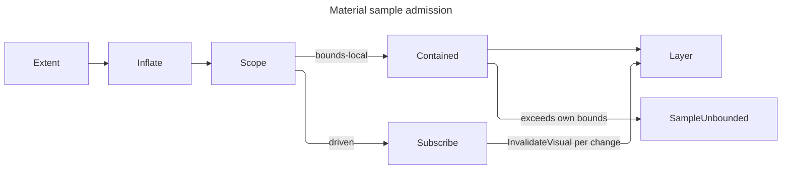

# [APPUI_VFX_MATERIAL]

Rasm.AppUi materials are the effects plane's surface-treatment owner: one layer capsule brackets a draw with a ground the compositor already painted, one filter-row family carries every per-draw filter term the frozen paint catalogue structurally cannot hold, and one sample contract fixes when a backdrop-reading operation is allowed to trust its own last sample. The page EXECUTES what `Theme/tokens#TOKEN_CATALOG` declares — `MaterialTier` rows resolved into `MaterialValue`, the `Glazing` translucency election, the module `WashRow` family, the `PaintRole` ladder every pigment reads — so the token catalogue stays the data owner and this plane stays the executor; a material constant authored here would be a second token source.

`DrawSource`, `PaintCatalog`, `PaintSpec`, `DrawRole`, `EffectTokens`, `FxRow`, `FxEffect`, `LayerGround`, `GlyphCoverage`, and `LayerSpec` arrive settled from `Render/capture#DRAW_CAPSULE`, which owns the one `SKSurface` and the one `SaveLayer(in SKCanvasSaveLayerRec)` site in the package; this page mints the `LayerSpec` values that site consumes and never opens a layer itself. Procedural sources — the film field, the glass displacement, the gradient wash — resolve by `EffectRow` and `UniformFrame` against the `shader#EFFECT_PROGRAM` `EffectCatalog`. Translucency admission is the `Glazing` row `MaterialTier.Resolve` already folded, contrast lift is the `VariantProjection.FloorLift` the same generation carries, `WorkspaceRow` arrives from `Shell/navigation#WORKSPACE_ROWS`, and `LayerFault` carries each failure through a direct generated union case.

## [01]-[INDEX]

- [02]-[LAYER_ALGEBRA]: The fault floor, the ground-and-coverage election, and the per-tier composite role this page contributes to the one paint catalog.
- [03]-[SAMPLE_CONTRACT]: The bounds-local-or-driven invalidation law and the in-tree host that discharges it.
- [04]-[FILTER_ROWS]: Lighting, refraction, tint, crossfade, luma, curve, and contrast rows as per-draw natives.
- [05]-[MATERIAL_EXECUTION]: Tier execution, the opaque floor, the module wash, and grain.

## [02]-[LAYER_ALGEBRA]

- Owner: `LayerFault` — the direct generated `[Union]` with one `[FaultCase]` leaf per material failure; `TreatmentSurfaces` — the per-tier composite `DrawRole` and the `PaintSpec` rows this page contributes to the one catalog resolve.
- Cases: `LayerFault` = LayerRefused | SampleUnbounded | TintUndeclared | FilterRejected | SourceMissing | WashUnmapped | ContrastUnsupported | LeaseUnavailable.
- Law: the ground arm is a CHOICE the `Render/capture#DRAW_CAPSULE` `LayerGround` union closes — `Filtered` puts the catalogue's frozen `SKImageFilter` in the `Backdrop` slot so the layer opens on filtered ground, `Previous` leaves `Backdrop` null and sets `InitializeWithPrevious` so the layer opens on an unfiltered copy — and this plane SELECTS an arm per material rather than opening a layer, because the one `SaveLayer` site in the package belongs to that capsule.
- Law: the composite role a layer restores through is a `DrawRole` DERIVED from the tier roster and backed by a `PaintSpec` in the same catalog every other role mints through, so the address the layer names and the paint the catalog holds cannot disagree.
- Entry: `TreatmentSurfaces.Roles[tier]` — the composite address; `TreatmentSurfaces.Paints` — the catalog contribution the app root folds into one `PaintCatalog.Of` per generation.
- Packages: SkiaSharp, Thinktecture.Runtime.Extensions, Rasm (kernel `FaultBand`/`[FaultCase]`/`Fault`), LanguageExt.Core
- Growth: a new ground treatment is one `FxRow.Ground` value at its capture-side owner; a new layer posture is one `LayerGround` case; a new tier grows its composite role and its paint row by derivation; a new fault case is one `[FaultCase]` leaf.
- Boundary: subpixel text over a material layer is the one coverage election this plane makes and the one it must not make blindly — `GlyphCoverage.Lcd` keeps LCD glyph coverage through the layer, and `LayerSpec.Of` already REFUSES it over a `Filtered` ground because a blurred backdrop is never opaque. The residual that admission names is a translucent composite over an unfiltered COPY, and this plane is the mount that closes it: the coverage a mount requests narrows to `Grayscale` under a translucent `Glazing`, so a sheet that hosts glyphs cannot fringe them against content the layer never composited. The glyph side of that same law is the `Theme/typography` layer posture, which drops LCD coverage to grayscale edging for a layer-hosted run: the two ends state one fact — subpixel coverage is invalid against pixels the layer never composited — and a surface that elected LCD while shaping under a non-layer posture would fringe exactly the runs the posture protected. The `Previous` arm is the honest floor on an embedded host: it copies what the compositor already painted and applies this plane's own tint, where `AcrylicBackgroundSource.Digger` would erase those pixels and dig through to nothing. Layer bounds are the material's OWN extent and never the surface — a layer bounded to the surface pays a full-surface offscreen for a panel-sized treatment — and the bound is what `[03]-[SAMPLE_CONTRACT]` clamps against, so the two are one value read twice and never two authored rects.

```csharp
// --- [ERRORS] --------------------------------------------------------------------------

[Union(ConversionFromValue = ConversionOperatorsGeneration.None)]
public abstract partial record LayerFault : Fault {
    private static readonly FaultBand FamilyBand = FaultBand.Material;
    private LayerFault(string detail) { Detail = detail; }
    public string Detail { get; }
    public override string Message => Detail;

    [FaultCase(0)]
    public sealed partial record LayerRefused(string Detail)
        : LayerFault($"material/layer: {Detail}");
    [FaultCase(1)]
    public sealed partial record SampleUnbounded(SKRect Region, SKRect Own)
        : LayerFault($"material/sample: {Region} exceeds {Own} with no change source driving invalidation");
    [FaultCase(2)]
    public sealed partial record TintUndeclared(TokenKey Pigment, Error Cause)
        : LayerFault($"material/tint: {Pigment}: {Cause.Message}"), ICausedFault;
    [FaultCase(3)]
    public sealed partial record FilterRejected(string Slot, string Demand)
        : LayerFault($"material/filter: a {Slot} row is not {Demand}");
    [FaultCase(4)]
    public sealed partial record SourceMissing(EffectRow Row, Error Cause)
        : LayerFault($"material/source: {Row.Key}: {Cause.Message}"), ICausedFault;
    [FaultCase(5)]
    public sealed partial record WashUnmapped(string Workspace)
        : LayerFault($"material/wash: workspace {Workspace} declares no wash row");
    [FaultCase(6)]
    public sealed partial record ContrastUnsupported(ContrastMode Mode, SignedUnit Amount)
        : LayerFault($"material/contrast: {Mode.Key} at {Amount.Value}");
    [FaultCase(7)]
    public sealed partial record LeaseUnavailable(MaterialTier Tier)
        : LayerFault($"material/lease: {Tier.Key} drew on a backend publishing no Skia lease");
}
```

```csharp
// --- [COMPOSITION] ---------------------------------------------------------------------

public static class TreatmentSurfaces {
    public static readonly HashMap<MaterialTier, DrawRole> Roles =
        toHashMap(toSeq(MaterialTier.Items).Map(static tier => (tier, DrawRole.Create($"material-{tier.Key}"))));

    public static readonly Seq<PaintSpec> Paints =
        toSeq(MaterialTier.Items).Map(static tier =>
            new PaintSpec(Roles[tier], tier.Tint.At(0), 0f, SKPaintStyle.Fill, Seq<FxRow>()));
}
```

## [03]-[SAMPLE_CONTRACT]

- Owner: `SampleScope` `[Union]` the two-case admission axis, the driven case carrying the change source it owes; `TreatmentHost` the in-tree control discharging it; `TreatmentOperation` the custom draw operation.
- Cases: `SampleScope` = BoundsLocal | Driven.
- Law: a backdrop-sampling operation re-samples ONLY when the invalidated region intersects its own visual's bounds. The compositor never widens a dirty region to cover a visual that merely SAMPLES it, so a material whose sample region exceeds its own bounds — blur bleed past the edge, a whole-surface wash, a global tint — holds a stale sample across every change outside those bounds. The two admitted resolutions are total: hold the sample region inside the owner's own bounds, or CARRY the change source the region covers and issue `InvalidateVisual()` per change. There is no third resolution, and an over-reaching undriven material is `LayerFault.SampleUnbounded` at admission rather than a stale panel at run time.
- Entry: `public Fin<SKRect> Admit(SKRect own, LayerGround ground)` — the admission every material extent passes, folding the ground's own bleed in before it tests; `public static SKRect Inflate(SKRect bounds, LayerGround ground)` — the same bleed the render-bound projection at `compose#CUSTOM_VISUAL_TICK` reads.
- Auto: the driven case's subscription RE-SEATS at control attach and releases at detach through one `SerialDisposable`, so a detached-and-reattached host resumes rather than living on permanently dead; a bounds-local material seats nothing at all, because its own dirty rect already covers everything it reads.
- Packages: Avalonia, Avalonia.Skia, System.Reactive, Generator.Equals, Rasm (kernel `FaultCell` through `Diagnostics/devloop` `HostSink`), LanguageExt.Core
- Growth: a new material surface picks one `SampleScope` case and the driven case demands its change source at construction; zero new surface.
- Boundary: the change source is the stream of the region the material SAMPLES, never the material's own property stream — an own-property change already dirties own bounds and re-runs the operation, which is exactly the case the contract does not cover. The carrier is `IObservable` because `InvalidateVisual` is a UI-thread push the Avalonia host already publishes that way and a channel here would need a pump nothing drains. `InvalidateVisual` is issued per change and never per frame: a per-frame invalidation defeats the compositor's dirty-rect economy for every surface in the tree, which is the cost this contract exists to bound. A blur ground bleeds by its own sigma, so a `Filtered` material's requested region is its bounds inflated by that sigma and the clamp is what forces the inflation onto the driven case rather than letting it silently sample stale ground. Both vehicles' host signatures return `void`, so each collapses its typed refusal through the ONE `Diagnostics/devloop#HOST_COLLAPSE` `HostSink` and parks it on the composition-minted kernel `FaultCell`; the prior `ignore(...)` meant a backend with no Skia lease rendered nothing and reported nothing.

```csharp
// --- [TYPES] ---------------------------------------------------------------------------

[Union(ConversionFromValue = ConversionOperatorsGeneration.None)]
public abstract partial record SampleScope {
    private SampleScope() { }
    public sealed record BoundsLocal() : SampleScope;
    public sealed record Driven(IObservable<Unit> Changes) : SampleScope;

    public static SKRect Inflate(SKRect bounds, LayerGround ground) => ground.Switch(
        state: bounds,
        filtered: static (rect, row) => SKRect.Inflate(rect, row.Row.Sigma, row.Row.Sigma),
        previous: static (rect, _) => rect);

    public Fin<SKRect> Admit(SKRect own, LayerGround ground) => Switch(
        state: (Own: own, Region: Inflate(own, ground)),
        boundsLocal: static (s, _) => s.Own.Contains(s.Region)
            ? Fin.Succ(s.Region)
            : Fin.Fail<SKRect>(new LayerFault.SampleUnbounded(s.Region, s.Own)),
        driven: static (s, _) => Fin.Succ(s.Region));
}
```

```csharp
// --- [SERVICES] ------------------------------------------------------------------------

public sealed class TreatmentHost : Control {
    readonly SerialDisposable seat = new();
    readonly SurfaceTreatment treatment;
    readonly PaintCatalog paints;
    readonly HookSet<AppUiPoint, AppUiFact, TelemetrySource> hooks;
    readonly HostSink faults;
    readonly Op key;

    public TreatmentHost(
        SurfaceTreatment treatment,
        PaintCatalog paints,
        HookSet<AppUiPoint, AppUiFact, TelemetrySource> hooks,
        HostSink faults,
        Op key) =>
        (this.treatment, this.paints, this.hooks, this.faults, this.key) = (treatment, paints, hooks, faults, key);

    protected override void OnAttachedToVisualTree(VisualTreeAttachmentEventArgs e) {
        base.OnAttachedToVisualTree(e);
        seat.Disposable = treatment.Scope.Switch(
            state: this,
            boundsLocal: static (_, _) => Disposable.Empty,
            driven: static (host, row) => row.Changes.Subscribe(_ => host.InvalidateVisual()));
    }

    protected override void OnDetachedFromVisualTree(VisualTreeAttachmentEventArgs e) {
        seat.Disposable = null;
        base.OnDetachedFromVisualTree(e);
    }

    public override void Render(DrawingContext context) =>
        context.Custom(new TreatmentOperation(
            treatment, paints, new Rect(Bounds.Size), SurfaceTreatment.Settled, hooks, faults, key));
}

[Equatable(Explicit = true)]
public sealed partial record TreatmentOperation(
    [property: DefaultEquality] SurfaceTreatment Treatment,
    PaintCatalog Paints,
    [property: DefaultEquality] Rect Bounds,
    [property: DefaultEquality] UnitInterval Phase,
    HookSet<AppUiPoint, AppUiFact, TelemetrySource> Hooks,
    HostSink Faults,
    Op Key) : ICustomDrawOperation {

    public bool Equals(ICustomDrawOperation? other) => Equals(other as TreatmentOperation);

    public bool HitTest(Point point) => Bounds.Contains(point);

    public void Render(ImmediateDrawingContext context) =>
        ignore(Faults.Collapse(
            IO.lift(() => context.TryGetFeature<ISkiaSharpApiLeaseFeature>() is { } feature
                    ? Draw(feature)
                    : Fin.Fail<Unit>(new LayerFault.LeaseUnavailable(Treatment.Tier)))));

    Fin<Unit> Draw(ISkiaSharpApiLeaseFeature feature) {
        using ISkiaSharpApiLease lease = feature.Lease();
        return Treatment.Draw(new DrawSource.Borrowed(lease), Paints, Bounds.ToSKRect(), Phase)
            .Bind(_ => Hooks.Fire(
                at: AppUiPoint.Effect,
                fact: new AppUiFact.Effect(
                    Plane: "material",
                    Key: Treatment.Tier.Key,
                    Outcome: Treatment.Glaze.Key,
                    Flag: Treatment.Glaze == Glazing.Translucent,
                    Count: (uint)Treatment.Stack.Count,
                    Measure: new EffectMeasure.Coordinate(Treatment.Scope.Switch(
                        boundsLocal: static _ => "bounds_local",
                        driven: static _ => "driven"))),
                key: Key)
            .Map(static _ => unit));
    }

    public void Dispose() { }
}
```



## [04]-[FILTER_ROWS]

- Owner: `FilterRow` `[Union]` the per-draw filter algebra; `LightFace` and `CurveKind` `[SmartEnum<string>]` two generated sub-axes; `ContrastMode` the shipped high-contrast posture row; `ToneTable` the materialized transfer.
- Cases: `FilterRow` = Lighting | Refraction | Tint | Crossfade | Luma | Curve | Contrast; `LightFace` = rim | inset; `CurveKind` = gamma | lift | gain | contrast; `ContrastMode` = colour | grayscale | inverted.
- Law: a row lands here only when its parameters VARY per draw or per frame — a crossfade phase, a light direction tracking a pointer, a refraction scale on a resize, a curve amount on a preference flip. A row whose parameters are fixed for a whole theme generation belongs to the frozen `FxRow` catalogue at its capture-side owner, where it mints once and every draw reads it; minting a fixed row here would rebuild a native per frame for a value that never moved.
- Law: phase is an ARGUMENT and never spec state. The crossfade is the only term on the plane that moves per frame, so `Build` takes the tick's own normalized run value and no row carries a stored weight — which retires a seven-arm advance whose six identity arms copied a record per row per frame.
- Entry: `public Fin<FxEffect> Build(EffectTokens tokens, EffectCatalog effects, UnitInterval phase)` — the one native mint, taking the compiled program roster `shader#EFFECT_PROGRAM` owns; `public Fin<SKImageFilter> Ground(EffectTokens tokens, EffectCatalog effects, UnitInterval phase)` — the same rows projected into a save-layer backdrop, lifting every colour row through `SKImageFilter.CreateColorFilter`.
- Auto: `Tint` and `Crossfade` generate their matrices from the resolved pigment rather than carrying authored coefficients; `Curve` materializes its 256-entry table at the ROW's own mint, so a per-spec allocation never lands on the per-frame path; `Contrast` reads the `VariantProjection.FloorLift` amount its admission derived, so the high-contrast projection reaches the effects plane through the same generation every token rung took.
- Packages: SkiaSharp, Rasm (project — `PerceptualColor`, `UnitInterval`, `SignedUnit`, `PositiveMagnitude`, `Custody`), Thinktecture.Runtime.Extensions, Generator.Equals, LanguageExt.Core
- Growth: a new filter term is one `FilterRow` case with its `Build` arm; a new tone shape is one `CurveKind` row; a new lighting face is one `LightFace` row; a new high-contrast posture is one `ContrastMode` row; zero new surface.
- Boundary: the lit filters derive their height field from the input's ALPHA, so a rim highlight and an inset highlight differ in the light direction ALONE — the inset row negates the incident vector and nothing else, and a second filter family for insets would carry one sign as a whole owner. Refraction is the glass floor and its displacement source is a `shader#EFFECT_PROGRAM` ROW carrying its own uniform frame, never an inline shader and never a composed key: displacement takes ONE channel per axis and offsets by that channel's distance from mid-grey, so the source must publish two decorrelated channels over the same seeded field the grain draw samples — an achromatic source hands both axes one value and shears every pixel along one diagonal — and the frame rides the row because a row alone cannot state the field's own separation. Every row's native is minted PER DRAW and `SKPaint.Dispose` releases none of the four slots it binds, so a fold that refuses mid-stack releases the prefix it already minted through the kernel custody owner rather than through a hand rollback lambda. Skia natives are reference-counted and the catalogue carries that custody: a composed filter holds its OWN reference to every arm, so the handles a composition consumed release on both paths. The crossfade is the one arm that cannot release unconditionally — `SKColorFilter.CreateLerp` short-circuits at the CLOSED endpoints `UnitInterval` admits and hands back an input as the result, so that arm releases only what the result does not alias. `Tint` is a lerp toward the pigment expressed as one 4x5 matrix whose fifth column carries the additive term in normalized units, so an 8-bit byte constant in that column is the deleted form; `Crossfade` is `SKColorFilter.CreateLerp` over two built rows, which is why the phase cannot be frozen and why the module wash reaches its crossfade here rather than through a second animation path. The 256-entry curve tables are GENERATED from their kind's transfer — an authored table is unverifiable against the shape it claims — and its buffers stay private to `ToneTable` because the native takes `byte[]` and a shared writable array a consumer can reach is a table the next draw reads differently. `Contrast` binds the shipped high-contrast config and keeps its `IsValid` read: the amount is a `SignedUnit` this plane owns, but `SKHighContrastConfigInvertStyle`'s valid range belongs to SkiaSharp, so the native's own gate stays the admission and `ContrastUnsupported` stays raised.

```csharp
// --- [TYPES] ---------------------------------------------------------------------------

[SmartEnum<string>]
[KeyMemberEqualityComparer<ComparerAccessors.StringOrdinal, string>]
public sealed partial class LightFace {
    public static readonly LightFace Rim = new("rim", flip: 1f);
    public static readonly LightFace Inset = new("inset", flip: -1f);

    public float Flip { get; }

    public SKPoint3 Incident(SKPoint3 direction) =>
        new(direction.X, direction.Y * Flip, direction.Z * Flip);
}

[SmartEnum<string>]
[KeyMemberEqualityComparer<ComparerAccessors.StringOrdinal, string>]
public sealed partial class CurveKind {
    public static readonly CurveKind Gamma = new("gamma", static (v, a) => Math.Pow(v, 1d + a));
    public static readonly CurveKind Lift = new("lift", static (v, a) => a + ((1d - a) * v));
    public static readonly CurveKind Gain = new("gain", static (v, a) => v * (1d + a));
    public static readonly CurveKind Contrast = new("contrast", static (v, a) => 0.5d + ((v - 0.5d) * (1d + a)));

    public Func<double, double, double> Transfer { get; }
}

[Equatable(Explicit = true)]
public sealed partial class ToneTable {
    static readonly byte[] Identity = [.. Enumerable.Range(0, 256).Select(static step => (byte)step)];

    readonly byte[] channel;

    ToneTable(CurveKind kind, UnitInterval amount, byte[] channel) =>
        (Kind, Amount, this.channel) = (kind, amount, channel);

    [DefaultEquality] public CurveKind Kind { get; }
    [DefaultEquality] public UnitInterval Amount { get; }

    public static ToneTable Of(CurveKind kind, UnitInterval amount) =>
        new(kind, amount, [.. Enumerable.Range(0, 256).Select(step =>
            (byte)Math.Clamp(Math.Round(kind.Transfer(step / 255d, amount.Value) * 255d), 0d, 255d))]);

    public SKColorFilter Native() => SKColorFilter.CreateTable(a: Identity, r: channel, g: channel, b: channel);
}

[SmartEnum<string>]
[KeyMemberEqualityComparer<ComparerAccessors.StringOrdinal, string>]
public sealed partial class ContrastMode {
    public static readonly ContrastMode Colour =
        new("colour", grayscale: false, invert: SKHighContrastConfigInvertStyle.NoInvert);
    public static readonly ContrastMode Grayscale =
        new("grayscale", grayscale: true, invert: SKHighContrastConfigInvertStyle.NoInvert);
    public static readonly ContrastMode Inverted =
        new("inverted", grayscale: false, invert: SKHighContrastConfigInvertStyle.InvertLightness);

    public bool Grayscale { get; }
    public SKHighContrastConfigInvertStyle Invert { get; }

    public SKHighContrastConfig Config(SignedUnit amount) => new(Grayscale, Invert, (float)amount.Value);
}
```

```csharp
// --- [MODELS] --------------------------------------------------------------------------

[Union(ConversionFromValue = ConversionOperatorsGeneration.None)]
public abstract partial record FilterRow {
    private FilterRow() { }
    public sealed record Lighting(
        LightFace Face, SKPoint3 Direction, TokenKey Light,
        PositiveMagnitude SurfaceScale, UnitInterval Ks, PositiveMagnitude Shininess) : FilterRow;
    public sealed record Refraction(
        EffectRow Source, UniformFrame Frame, float Scale, SKColorChannel X, SKColorChannel Y) : FilterRow;
    public sealed record Tint(TokenKey Pigment, UnitInterval Strength) : FilterRow;
    public sealed record Crossfade(FilterRow From, FilterRow To) : FilterRow;
    public sealed record Luma() : FilterRow;
    public sealed record Curve(ToneTable Table) : FilterRow;
    public sealed record Contrast(ContrastMode Mode, SignedUnit Amount) : FilterRow;

    public Fin<FxEffect> Build(EffectTokens tokens, EffectCatalog effects, UnitInterval phase) => Switch(
        state: (Tokens: tokens, Effects: effects, Phase: phase),
        lighting: static (s, row) =>
            from light in Pigment(s.Tokens, row.Light)
            select (FxEffect)new FxEffect.Imaging(SKImageFilter.CreateDistantLitSpecular(
                direction: row.Face.Incident(row.Direction),
                lightColor: (SKColor)light,
                surfaceScale: (float)row.SurfaceScale.Value,
                ks: (float)row.Ks.Value,
                shininess: (float)row.Shininess.Value)),
        refraction: static (s, row) =>
            from shader in s.Effects.Source(row.Source, row.Frame)
                .MapFail(error => (Error)new LayerFault.SourceMissing(row.Source, error))
            select (FxEffect)new FxEffect.Imaging(SKImageFilter.CreateDisplacementMapEffect(
                xChannelSelector: row.X,
                yChannelSelector: row.Y,
                scale: row.Scale,
                displacement: SKImageFilter.CreateShader(shader))),
        tint: static (s, row) =>
            from pigment in Pigment(s.Tokens, row.Pigment)
            select (FxEffect)new FxEffect.Coloring(SKColorFilter.CreateColorMatrix(Lerp(pigment, row.Strength))),
        crossfade: static (s, row) =>
            from origin in row.From.Colour(s.Tokens, s.Effects, s.Phase)
            from target in row.To.Colour(s.Tokens, s.Effects, s.Phase).Rollback(origin)
            from lerped in Crossfade(s.Phase, origin, target)
            select lerped,
        luma: static (_, _) => Fin.Succ<FxEffect>(new FxEffect.Coloring(SKColorFilter.CreateLumaColor())),
        curve: static (_, row) => Fin.Succ<FxEffect>(new FxEffect.Coloring(row.Table.Native())),
        contrast: static (_, row) => row.Mode.Config(row.Amount) switch {
            { IsValid: true } config =>
                Fin.Succ<FxEffect>(new FxEffect.Coloring(SKColorFilter.CreateHighContrast(config))),
            _ => Fin.Fail<FxEffect>(new LayerFault.ContrastUnsupported(row.Mode, row.Amount)),
        });

    static Fin<FxEffect> Crossfade(UnitInterval phase, SKColorFilter origin, SKColorFilter target) {
        SKColorFilter lerped = SKColorFilter.CreateLerp((float)phase.Value, origin, target);
        return Custody.Bracket(
            () => Fin.Succ<FxEffect>(new FxEffect.Coloring(lerped)),
            ReferenceEquals(lerped, origin) ? null : origin,
            ReferenceEquals(lerped, target) ? null : target);
    }

    public Fin<SKImageFilter> Ground(EffectTokens tokens, EffectCatalog effects, UnitInterval phase) =>
        Build(tokens, effects, phase).Bind(static effect => effect.Switch(
                shading: static _ => Fin.Fail<SKImageFilter>(new LayerFault.FilterRejected("shader", "a layer ground")),
                imaging: static row => Fin.Succ(row.Native),
                coloring: static row => Custody.Bracket(
                    () => Fin.Succ(SKImageFilter.CreateColorFilter(row.Native)), row.Native),
                pathing: static _ => Fin.Fail<SKImageFilter>(new LayerFault.FilterRejected("path", "a layer ground")))
            .Rollback(() => Fin.Succ(effect.Release())));

    Fin<SKColorFilter> Colour(EffectTokens tokens, EffectCatalog effects, UnitInterval phase) =>
        Build(tokens, effects, phase).Bind(static effect => effect.Switch(
                shading: static _ => Fin.Fail<SKColorFilter>(new LayerFault.FilterRejected("shader", "a colour row")),
                imaging: static _ => Fin.Fail<SKColorFilter>(new LayerFault.FilterRejected("image", "a colour row")),
                pathing: static _ => Fin.Fail<SKColorFilter>(new LayerFault.FilterRejected("path", "a colour row")),
                coloring: static row => Fin.Succ(row.Native))
            .Rollback(() => Fin.Succ(effect.Release())));

    static Fin<SKColorF> Pigment(EffectTokens tokens, TokenKey pigment) =>
        tokens.Pigment(pigment).MapFail(error => (Error)new LayerFault.TintUndeclared(pigment, error));

    static float[] Lerp(SKColorF pigment, UnitInterval strength) {
        float s = (float)strength.Value;
        return [
            1f - s, 0f,     0f,     0f, s * pigment.Red,
            0f,     1f - s, 0f,     0f, s * pigment.Green,
            0f,     0f,     1f - s, 0f, s * pigment.Blue,
            0f,     0f,     0f,     1f, 0f,
        ];
    }
}
```

## [05]-[MATERIAL_EXECUTION]

- Owner: `SurfaceTreatment` the executable material; `GrainLay` `[Union]` the resolved grain posture; `WashPlane` the module ambient-wash executor.
- Cases: `GrainLay` = Bare | Weighted.
- Law: `Theme/tokens` decides and this plane executes — a `MaterialTier` resolves to a `MaterialValue` at theme resolve and reaches here as a value, and a `WashRow` reaches here as a value; an opacity, a grain weight, a hue, or a coverage authored on this page would be a second token source the swap capsule never re-seeds.
- Law: the translucency verdict is derived ONCE, at admission, as the `Glazing` row the token generation already speaks, and every consumer reads that column — the ground arm, the coverage narrowing, and the published effect outcome. Three separate `MaterialOpacity >= 1` comparisons scattered across the admission, the ground rule, and the fill could disagree with each other and with the generation.
- Entry: `public static Fin<SurfaceTreatment> Of(MaterialTier tier, ResolvedTheme theme, LayerGround ground, GlyphCoverage coverage, SampleScope scope, Seq<FilterRow> stack, Option<WashPlane> wash, EffectCatalog effects)` — the admission; `public Fin<Unit> Draw(DrawSource source, PaintCatalog paints, SKRect extent, UnitInterval phase)` — the capsule: plan the layer, lay the wash, fill the tint, lay the grain, release every per-draw native, and let the one layer site restore; `public static Validation<Error, WashPlane> Of(WorkspaceRow from, WorkspaceRow to, UnitInterval aim)` — the wash admission.
- Auto: the opaque floor arrives already resolved — `MaterialTier.Resolve` collapses tint opacity, material opacity, and grain to their opaque values when the `Glazing` election refuses translucency — so this plane reads `MaterialValue` and never re-derives the preference; the high-contrast projection appends its `FilterRow.Contrast` row through the same admission with its amount DERIVED from the lifted floor's own ratio, so a variant flip re-stacks every mounted material without a second code path and without a literal that can disagree with the floor; the grain resolves to a case at admission, so the draw body tests no float and rounds no byte.
- Packages: SkiaSharp, Avalonia.Skia, Rasm (project — `UnitInterval`, `SignedUnit`, `Custody`), Generator.Equals, Thinktecture.Runtime.Extensions, LanguageExt.Core
- Growth: a new material surface is one `SurfaceTreatment` value over an existing tier; a new TIER costs this plane one derived composite role and one derived paint row, because the ground a material composites on is the mount's own declaration rather than a per-tier arm; a new module wash is one `WashRow` at its token owner; zero new surface.
- Boundary: which translucent ground a surface asks for is the MOUNT's fact and never the tier's (`RULINGS.md:127`) — a sheet over a live viewport and a sheet on an embedded host beneath which no pixels exist take different arms under one tier, and the opaque floor is the single ground rule this plane owns because an opaque material overpaints every pixel a filtered ground would read. Every native this capsule mints lives for ONE draw: a filter row rebuilds its filter per frame, the grain source is a fresh `SKShader` off the retained builder, and `SKPaint.Dispose` releases none of them (`RULINGS.md:125`), so the capsule releases what it built on the drawn and the refused path alike — through one body, because `FxEffect.Release` is the union's own ordered teardown rather than an `IDisposable` a `Custody.Bracket` span could carry. Every paint is minted, configured, used, and dropped inside one bracket, so no fill retains a paint the next frame reads differently. The grain is a DRAW, not a token knob — `MaterialValue.Grain` is a declared weight and the noise it weights is the compiled `grain` program at `shader#EFFECT_PROGRAM`, because the shipped acrylic material composes a fixed noise bitmap under a fixed alpha and neither is addressable, so a material that wanted its grain to follow density or variant had no hook at all. The module wash crossfades two `EffectRow.Wash` sources through ONE arithmetic blender rather than drawing both and hoping alpha compounds: two alpha-over draws at coverage `c` composite to `1-(1-c)²` and brighten the mid-transition frame, which is precisely the luminance the `WashRow.LuminanceCeiling` gate exists to hold. The wash resolves its rows from `WorkspaceRow` values and never from caller text (`RULINGS.md:115`), and the join between the wash roster's module column and the workspace roster's key lives at ONE site — `present` is the workspace that declares no wash today, so the refusal is live rather than defensive. `TreatmentOperation` is the only in-tree vehicle, so a control that wants a material mounts one rather than overriding its own render, and the capsule brackets the treatment alone: an earlier content fold no consumer ever supplied is gone, so a host's own content composites over the treatment through the scene graph rather than inside its layer.

```csharp
// --- [MODELS] --------------------------------------------------------------------------

[Union(ConversionFromValue = ConversionOperatorsGeneration.None)]
public abstract partial record GrainLay {
    private GrainLay() { }
    public sealed record Bare() : GrainLay;
    public sealed record Weighted(UnitInterval Weight, byte Alpha) : GrainLay;

    public static GrainLay Of(UnitInterval weight) =>
        weight.Value <= 0d
            ? new Bare()
            : new Weighted(weight, (byte)Math.Round(weight.Value * byte.MaxValue));
}

[Equatable]
public sealed partial record SurfaceTreatment(
    MaterialTier Tier,
    MaterialValue Value,
    Glazing Glaze,
    LayerGround Ground,
    GlyphCoverage Coverage,
    SampleScope Scope,
    [property: OrderedEquality] Seq<FilterRow> Stack,
    GrainLay Grain,
    Option<WashPlane> Wash,
    [property: ReferenceEquality] EffectCatalog Effects) {

    static readonly UnitInterval Full = UnitInterval.Create(1d);
    static readonly Op ReleaseOp = Op.Of(name: "appui.material.release");

    public static readonly UnitInterval Settled = Full;

    public static Fin<SurfaceTreatment> Of(
        MaterialTier tier, ResolvedTheme theme, LayerGround ground, GlyphCoverage coverage, SampleScope scope,
        Seq<FilterRow> stack, Option<WashPlane> wash, EffectCatalog effects) =>
        from value in Resolved(theme, tier)
        let glaze = Glazed(value)
        select new SurfaceTreatment(
            Tier: tier,
            Value: value,
            Glaze: glaze,
            Ground: glaze == Glazing.Opaque ? LayerGround.Copy : ground,
            Coverage: glaze == Glazing.Opaque ? coverage : GlyphCoverage.Grayscale,
            Scope: scope,
            Stack: theme.Variant.Projection.FloorLift.Match(
                Some: floor => stack.Add(Lifted(floor)),
                None: () => stack),
            Grain: GrainLay.Of(value.Grain),
            Wash: wash,
            Effects: effects);

    public Fin<Unit> Draw(DrawSource source, PaintCatalog paints, SKRect extent, UnitInterval phase) =>
        from bounds in Scope.Admit(extent, Ground)
        from plan in LayerSpec.Of(bounds, Ground, Some(TreatmentSurfaces.Roles[Tier]), Coverage)
        from natives in Built(Stack, paints.Tokens, Effects, phase)
        from drawn in Released(natives,
            source.Layered(paints, plan, canvas => Compose(canvas, paints, extent, natives, phase)))
        select unit;

    Fin<Unit> Compose(SKCanvas canvas, PaintCatalog paints, SKRect extent, Seq<FxEffect> natives, UnitInterval phase) =>
        from washed in Wash.Match(
            Some: plane => plane.Lay(canvas, paints, Effects, extent, phase),
            None: () => Fin.Succ(unit))
        from pigment in paints.Tokens.Policy.Resolve(Value.Tint)
            .MapFail(error => (Error)new LayerFault.TintUndeclared(Tier.MaterialKey, error))
        from tinted in Filled(canvas, extent, paint => {
            natives.Iter(effect => ignore(effect.BindTo(paint)));
            paint.SetColor(pigment.WithAlpha((float)Value.TintOpacity.Value), paints.Tokens.Working);
        })
        from grained in Grain.Switch(
            state: (Canvas: canvas, Extent: extent, Treatment: this),
            bare: static (_, _) => Fin.Succ(unit),
            weighted: static (s, row) => s.Treatment.Film(s.Canvas, s.Extent, row))
        select grained;

    Fin<Unit> Film(SKCanvas canvas, SKRect extent, GrainLay.Weighted grain) =>
        Effects.Source(EffectRow.Grain, UniformFrame.Of(
                new SKSize(extent.Width, extent.Height),
                ("weight", new UniformValue.Scalar((float)grain.Weight.Value))))
            .MapFail(error => (Error)new LayerFault.SourceMissing(EffectRow.Grain, error))
            .Bind(shader => Custody.Bracket(() => Filled(canvas, extent, paint => {
                paint.Shader = shader;
                paint.BlendMode = SKBlendMode.Overlay;
                paint.Color = SKColors.White.WithAlpha(grain.Alpha);
            }), shader));

    internal static Fin<Unit> Filled(SKCanvas canvas, SKRect extent, Action<SKPaint> configure) {
        SKPaint paint = new() { IsAntialias = true };
        return Custody.Bracket(() => {
            configure(paint);
            canvas.DrawRect(extent, paint);
            return Fin.Succ(unit);
        }, paint);
    }

    static Fin<Seq<FxEffect>> Built(
        Seq<FilterRow> stack, EffectTokens tokens, EffectCatalog effects, UnitInterval phase) =>
        stack.Fold(Fin.Succ(Seq<FxEffect>()), (state, row) => state.Bind(built =>
            row.Build(tokens, effects, phase)
                .Rollback(
                    held: built,
                    release: static effect => Fin.Succ(effect.Release()),
                    key: ReleaseOp)
                .Map(built.Add)));

    static Fin<T> Released<T>(Seq<FxEffect> natives, Fin<T> fold) =>
        fold.Settled(
            held: natives,
            release: static effect => Fin.Succ(effect.Release()),
            key: ReleaseOp);

    static Fin<MaterialValue> Resolved(ResolvedTheme theme, MaterialTier tier) =>
        (theme.Materials.TryGetValue(tier.MaterialKey, out MaterialValue value) ? Some(value) : None)
            .ToFin(new LayerFault.LayerRefused($"tier {tier.Key} carries no resolved material"));

    static Glazing Glazed(MaterialValue value) =>
        value.MaterialOpacity == Full && value.TintOpacity == Full ? Glazing.Opaque : Glazing.Translucent;

    static FilterRow Lifted(ContrastFloor floor) =>
        new FilterRow.Contrast(ContrastMode.Colour, SignedUnit.Create(
            Math.Clamp(1d - (ContrastFloor.AaText.Ratio.Value / floor.Ratio.Value), -1d, 1d)));
}

public sealed record WashPlane(WashRow From, WashRow To, UnitInterval Aim) {
    public static Validation<Error, WashPlane> Of(WorkspaceRow from, WorkspaceRow to, UnitInterval aim) =>
        (Row(from), Row(to)).Apply((origin, target) => new WashPlane(origin, target, aim)).As();

    static Validation<Error, WashRow> Row(WorkspaceRow workspace) =>
        ThemeCatalog.Washes.Find(row => row.Module == workspace.Key)
            .ToValidation<Error>(new LayerFault.WashUnmapped(workspace.Key));

    public Fin<Unit> Lay(
        SKCanvas canvas, PaintCatalog paints, EffectCatalog effects, SKRect extent, UnitInterval phase) =>
        from origin in Source(paints, effects, From, extent, Aim)
        from target in Source(paints, effects, To, extent, Aim).Rollback(origin)
        from laid in Custody.Bracket(() => Blended(canvas, extent, origin, target, phase), origin, target)
        select laid;

    static Fin<SKShader> Source(
        PaintCatalog paints, EffectCatalog effects, WashRow row, SKRect extent, UnitInterval aim) =>
        from hue in paints.Tokens.Pigment(row.Hue.At(0))
            .MapFail(error => (Error)new LayerFault.TintUndeclared(row.Hue.At(0), error))
        from shader in effects.Source(EffectRow.Wash, UniformFrame.Of(
                new SKSize(extent.Width, extent.Height),
                ("hue", new UniformValue.Pigment(hue)),
                ("coverage", new UniformValue.Scalar((float)row.Coverage.Value)),
                ("angle", new UniformValue.Scalar((float)(aim.Value * Math.Tau)))))
            .MapFail(error => (Error)new LayerFault.SourceMissing(EffectRow.Wash, error))
        select shader;

    Fin<Unit> Blended(SKCanvas canvas, SKRect extent, SKShader origin, SKShader target, UnitInterval phase) {
        using SKBlender lerp = SKBlender.CreateArithmetic(
            k1: 0f, k2: (float)phase.Value, k3: 1f - (float)phase.Value, k4: 0f, enforcePMColor: true);
        using SKShader blend = SKShader.CreateBlend(lerp, origin, target);
        return SurfaceTreatment.Filled(canvas, extent, paint => paint.Shader = blend);
    }
}
```

## [06]-[RESEARCH]

(none)
