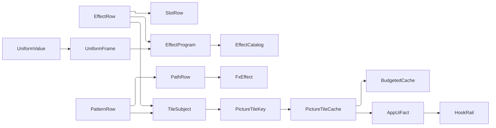

# [APPUI_VFX_SHADER]

Rasm.AppUi shader effects are the effects plane's procedural-source owner: one closed roster of SkSL programs compiled once and re-bound per frame, one uniform frame carrying every value that moves, one path-effect family for stroked geometry patterns beside the closed pattern roster that seeds it, and one recorded-tile cache admitting through the folder's single budgeted cache owner. The plane exists for exactly the terms a frozen native cannot carry — a glow whose radius follows a focus transition, noise seeded per surface, a wash gradient whose angle tracks a layout, a hatch whose phase advances — and both rosters are CLOSED because an SkSL program and an estate pattern are source the estate compiles, not data a consumer supplies.

`SKRuntimeEffect`, `SKRuntimeShaderBuilder`, `SKPathEffect`, `SKPicture`, and `SKPictureRecorder` are the composed natives; `EffectTokens`, `FxEffect`, and `PaintCatalog` arrive settled from `Render/capture#DRAW_CAPSULE` and this plane produces values that bind into the same one paint. Compilation here is the 2D chrome partition — `Render/shading#SHADER_ASSET` owns the per-`GpuBackend` appearance-shader cache with its plane residency and VRAM budget, while a chrome program carries no backend variant, no resident plane, and a CPU-side op-list budget instead, so the two are disjoint INSTANCES of one owner rather than two mechanisms. Programs resolve by ROW and uniform frame for the `material#FILTER_ROWS` refraction field and the `material#MATERIAL_EXECUTION` grain draw, and `EffectFault` carries each failure through a direct generated union case.

## [01]-[INDEX]

- [02]-[EFFECT_PROGRAM]: The closed SkSL roster over one slot vocabulary, the compile gate on the typed rail, and the retained builder cell.
- [03]-[UNIFORM_FRAME]: Per-frame uniform and child binding under one case-to-shape correspondence with accumulating coverage.
- [04]-[PATH_ROWS]: Dash, trim, stamped, and tiled geometry patterns beside the estate pattern roster that seeds them.
- [05]-[TILE_CACHE]: Recorded-tile admission over the folder's `BudgetedCache` under a generation floor.

## [02]-[EFFECT_PROGRAM]

- Owner: `EffectRow` `[SmartEnum<string>]` the closed program roster carrying its SkSL source beside one slot roster; `SlotRow` with `SlotKind` the declared-slot vocabulary; `UniformShape` the block-shape axis; `EffectProgram` the compiled cell; `EffectCatalog` the process roster; `EffectFault` the direct generated `[Union]` with one `[FaultCase]` leaf per effect failure.
- Cases: `EffectRow` = glow | grain | refract | wash | sheen; `SlotKind` = Uniform | Content | Seed; `UniformShape` = float | float2 | float4; `SlotDefect` = diverged | undeclared | unbound | misplaced | refused; `EffectFault` = SkslRejected | UniformUndeclared | ChildUndeclared | ProgramMissing | PatternDegenerate | TileOversize | BudgetExhausted.
- Law: compilation takes the REFUSAL channel, never the throwing one — `SKRuntimeEffect.CreateShader(sksl, out string errors)` returns a null effect with the diagnostic in `errors` on a rejected program, while `BuildShader(sksl)` validates the same pair and throws; a compile that throws inside a static roster initializer takes the whole vocabulary down at type load, so the typed gate is the only admissible arm.
- Law: `EffectCatalog.Source` is the projection `material#FILTER_ROWS` and `material#MATERIAL_EXECUTION` bind as their `Sources` column — the catalog is the composition-held owner and the delegate is its bound member, never a caller-assembled arrow.
- Entry: `EffectCatalog.Of()` — the one process mint; `Source(EffectRow row, UniformFrame frame)` — the one by-ROW projection every consumer names; `EffectProgram.Compile(row)` — the compile gate the catalog folds.
- Auto: the roster compiles once per process and the cell retains its `SKRuntimeShaderBuilder` beside every seeded child, so a frame re-binds uniforms and mints a shader without touching the SkSL compiler and without re-minting a noise source per draw; declared-name conformance folds at compile against `SKRuntimeEffect.Uniforms` and `Children` as one accumulating admission, so a source edit that renamed a uniform AND dropped a child reports both; every refusal past the compile releases what it refused through `Custody`, so neither a diverged row nor a rejected sibling leaves a live native behind.
- Packages: SkiaSharp, Thinktecture.Runtime.Extensions, LanguageExt.Core, Rasm (`FaultBand`, `[FaultCase]`, `Fault`, `Custody`, `Band`, `Op`)
- Growth: a new procedural term is one `EffectRow` row carrying its source and its slot roster; a new declared-slot class is one `SlotKind` case; zero new surface.
- Boundary: `SKRuntimeEffectBuilder.Dispose` disposes the EFFECT it wraps, so a cached effect handed to a per-frame builder is freed the moment that frame's builder falls out of scope and every later frame binds a dead handle — the cell therefore retains the BUILDER and constructs no second one, and `SKRuntimeEffect.BuildShader` is unreachable here because its throwing validation is the arm this rail replaced. A program is SOURCE the estate ships, so the roster is closed and no consumer supplies SkSL.
- Boundary: slots split by who owns the pixels, and the split is a CASE rather than three parallel columns. A `Seed` slot is the estate's own source and its native mints once at compile — the film field is `SKShader.CreatePerlinNoiseFractalNoise`, a shipped Skia generator rather than a hand-rolled SkSL lattice, and the grain and the glass cite ONE mint so the two sample the same field at the pixel — while a `Content` slot is the caller's already-painted draw entering through `SKRuntimeEffectChild`. That split is what makes the coverage gate total: a seeded slot a frame never binds would otherwise refuse every draw of a program whose own source it is.
- Boundary: both `SKRuntimeEffectUniforms.Add` and `SKRuntimeEffectChildren.Add` THROW on a name the compiled program never declared, and the uniform overload validates the value's own data type against that declaration and throws on a mismatch — so a `Uniform` slot declares its block SHAPE and the frame resolves both axes against the slot before it writes, which is what leaves the throwing arms unreachable rather than trapped. A `Uniform` slot also carries the numeric `Band` its value must land inside, so the `max(x, 1e-3)` floors inside the shader sources are a GPU-side belt over a refusal the C# edge already owns rather than the only guard a zero meets.

```csharp
// --- [ERRORS] --------------------------------------------------------------------------

[SmartEnum<string>]
[KeyMemberEqualityComparer<ComparerAccessors.StringOrdinal, string>]
public sealed partial class SlotDefect {
    public static readonly SlotDefect Diverged = new("diverged", "declared by the row and by the compiled source alike");
    public static readonly SlotDefect Undeclared = new("undeclared", "a slot this row declares");
    public static readonly SlotDefect Unbound = new("unbound", "written on every bind");
    public static readonly SlotDefect Misplaced = new("misplaced", "a value of the slot's declared block shape");
    public static readonly SlotDefect Refused = new("refused", "a value inside the slot's declared band");
    public string Requirement { get; }
}


[Union(ConversionFromValue = ConversionOperatorsGeneration.None)]
public abstract partial record EffectFault : Fault {
    private static readonly FaultBand FamilyBand = FaultBand.Effect;
    private EffectFault() { }

    [FaultCase(0)]
    public sealed partial record SkslRejected(string Program, string Diagnostic) : EffectFault() {
        public override string Message => $"{Program}: the runtime effect compiler rejected the source — {Diagnostic}";
    }
    [FaultCase(1)]
    public sealed partial record UniformUndeclared(string Program, SlotDefect Defect, Seq<string> Names) : EffectFault() {
        public override string Message => $"{Program}: uniform {Names} must be {Defect.Requirement}";
    }
    [FaultCase(2)]
    public sealed partial record ChildUndeclared(string Program, SlotDefect Defect, Seq<string> Names) : EffectFault() {
        public override string Message => $"{Program}: child {Names} must be {Defect.Requirement}";
    }
    [FaultCase(3)]
    public sealed partial record ProgramMissing(string Program) : EffectFault() {
        public override string Message => $"{Program}: the catalog holds no compiled program for this row";
    }
    [FaultCase(4)]
    public sealed partial record PatternDegenerate(string Detail) : EffectFault() {
        public override string Message => Detail;
    }
    [FaultCase(5)]
    public sealed partial record TileOversize(PictureTileKey Key, long Generation, long Bytes, long Ceiling) : EffectFault() {
        public override string Message => $"{Key.Key}@{Generation}: {Bytes} recorded bytes over a {Ceiling} ceiling";
    }
    [FaultCase(6)]
    public sealed partial record BudgetExhausted(long Ceiling) : EffectFault() {
        public override string Message => $"a tile ceiling of {Ceiling} bytes admits no record at all";
    }
}
```

```csharp
// --- [TYPES] ---------------------------------------------------------------------------

[SmartEnum<string>]
[KeyMemberEqualityComparer<ComparerAccessors.StringOrdinal, string>]
[KeyMemberComparer<ComparerAccessors.StringOrdinal, string>]
public sealed partial class UniformShape {
    public static readonly UniformShape Scalar = new("float");
    public static readonly UniformShape Extent = new("float2");
    public static readonly UniformShape Pigment = new("float4");
}

[Union(ConversionFromValue = ConversionOperatorsGeneration.None)]
public abstract partial record SlotKind {
    private SlotKind() { }
    public sealed record Uniform(UniformShape Shape, Option<Band> Admits) : SlotKind;
    public sealed record Content : SlotKind;
    public sealed record Seed(Func<SKShader> Mint) : SlotKind;

    public Option<UniformShape> Shape => Switch(
        uniform: static row => Some(row.Shape),
        content: static _ => Option<UniformShape>.None,
        seed: static _ => Option<UniformShape>.None);

    public bool Admits(double value) => Switch(
        state: value,
        uniform: static (probe, row) => row.Admits.Match(Some: band => band.Admits(probe), None: static () => true),
        content: static (_, _) => true,
        seed: static (_, _) => true);
}

public readonly record struct SlotRow(string Name, SlotKind Kind) {
    public static SlotRow Uniform(string name, UniformShape shape) => new(name, new SlotKind.Uniform(shape, None));
    public static SlotRow Bounded(string name, UniformShape shape, Band admits) => new(name, new SlotKind.Uniform(shape, Some(admits)));
    public static SlotRow Content(string name) => new(name, new SlotKind.Content());
    public static SlotRow Seed(string name, Func<SKShader> mint) => new(name, new SlotKind.Seed(mint));
    public static SlotRow Extent() => new(EffectRow.ExtentName, new SlotKind.Uniform(UniformShape.Extent, None));
}

[SmartEnum<string>]
[KeyMemberEqualityComparer<ComparerAccessors.StringOrdinal, string>]
[KeyMemberComparer<ComparerAccessors.StringOrdinal, string>]
public sealed partial class EffectRow {
    public const string ExtentName = "extent";

    static SKShader Field() => SKShader.CreatePerlinNoiseFractalNoise(0.8f, 0.8f, numOctaves: 3, seed: 0f);

    public static readonly EffectRow Glow = new("glow",
        """
        uniform shader content;
        uniform float2 extent;
        uniform float4 tint;
        uniform float radius;
        uniform float intensity;
        half4 main(float2 coord) {
            half4 src = content.eval(coord);
            float2 d = abs((coord / extent) - 0.5) * 2.0;
            float reach = max(radius, 1e-3);
            float edge = clamp((max(d.x, d.y) - (1.0 - reach)) / reach, 0.0, 1.0);
            half halo = half(edge * intensity);
            return src + (half4(half3(tint.rgb) * halo, halo) * (1.0h - src.a));
        }
        """,
        slots: [SlotRow.Extent(), SlotRow.Uniform("tint", UniformShape.Pigment),
            SlotRow.Bounded("radius", UniformShape.Scalar, Band.Positive),
            SlotRow.Uniform("intensity", UniformShape.Scalar), SlotRow.Content("content")]);

    public static readonly EffectRow Grain = new("grain",
        """
        uniform shader noise;
        uniform float weight;
        half4 main(float2 coord) {
            half n = noise.eval(coord).r;
            half g = clamp(0.5h + ((n - 0.5h) * half(weight)), 0.0h, 1.0h);
            return half4(g, g, g, 1.0h);
        }
        """,
        slots: [SlotRow.Uniform("weight", UniformShape.Scalar), SlotRow.Seed("noise", Field)]);

    public static readonly EffectRow Refract = new("refract",
        """
        uniform shader field;
        uniform float2 extent;
        uniform float coarse;
        half4 main(float2 coord) {
            float2 span = extent * max(coarse, 1e-3);
            half x = field.eval(coord).r;
            half y = field.eval(coord + span).r;
            return half4(x, y, 0.0h, 1.0h);
        }
        """,
        slots: [SlotRow.Extent(), SlotRow.Bounded("coarse", UniformShape.Scalar, Band.Positive),
            SlotRow.Seed("field", Field)]);

    public static readonly EffectRow Wash = new("wash",
        """
        uniform float2 extent;
        uniform float4 hue;
        uniform float coverage;
        uniform float angle;
        half4 main(float2 coord) {
            float2 dir = float2(cos(angle), sin(angle));
            float t = clamp(dot((coord / extent) - 0.5, dir) + 0.5, 0.0, 1.0);
            half a = half(coverage * (1.0 - t));
            return half4(half3(hue.rgb) * a, a);
        }
        """,
        slots: [SlotRow.Extent(), SlotRow.Uniform("hue", UniformShape.Pigment),
            SlotRow.Bounded("coverage", UniformShape.Scalar, Band.Unit),
            SlotRow.Uniform("angle", UniformShape.Scalar)]);

    public static readonly EffectRow Sheen = new("sheen",
        """
        uniform shader content;
        uniform float2 extent;
        uniform float phase;
        uniform float width;
        half4 main(float2 coord) {
            float u = coord.x / extent.x;
            float band = 1.0 - clamp(abs(u - phase) / max(width, 1e-3), 0.0, 1.0);
            half4 src = content.eval(coord);
            return src + (half4(band * band) * (1.0h - src.a) * 0.5h);
        }
        """,
        slots: [SlotRow.Extent(), SlotRow.Bounded("phase", UniformShape.Scalar, Band.Unit),
            SlotRow.Bounded("width", UniformShape.Scalar, Band.Positive), SlotRow.Content("content")]);

    public string Sksl { get; }

    public Seq<SlotRow> Slots { get; }

    public Seq<string> UniformNames => Slots.Filter(static slot => slot.Kind is SlotKind.Uniform).Map(static slot => slot.Name);

    public Seq<string> ChildNames => Slots.Filter(static slot => slot.Kind is not SlotKind.Uniform).Map(static slot => slot.Name);

    public Seq<SlotRow> Seeds => Slots.Filter(static slot => slot.Kind is SlotKind.Seed);

    public Fin<SlotRow> Slot(string name) =>
        Slots.Find(row => row.Name == name)
            .ToFin(new EffectFault.UniformUndeclared(Key, SlotDefect.Undeclared, Seq(name)));
}
```

```csharp
// --- [MODELS] --------------------------------------------------------------------------

[Equatable]
public sealed partial record EffectProgram(
    EffectRow Row,
    [property: IgnoreEquality] SKRuntimeShaderBuilder Builder,
    [property: IgnoreEquality] HashMap<string, SKShader> Seeded) : IDisposable {
    public static Fin<EffectProgram> Compile(EffectRow row) =>
        SKRuntimeEffect.CreateShader(row.Sksl, out string? errors) switch {
            null => Fin.Fail<EffectProgram>(new EffectFault.SkslRejected(row.Key, errors ?? "no diagnostic")),
            var effect => Declared(row, effect).Map(builder => new EffectProgram(
                row, builder, toHashMap(row.Seeds.Map(static slot =>
                    (slot.Name, ((SlotKind.Seed)slot.Kind).Mint()))))),
        };

    static Fin<SKRuntimeShaderBuilder> Declared(EffectRow row, SKRuntimeEffect effect) =>
        (Agrees(row.UniformNames, toSeq(effect.Uniforms),
             names => new EffectFault.UniformUndeclared(row.Key, SlotDefect.Diverged, names)),
         Agrees(row.ChildNames, toSeq(effect.Children),
             names => new EffectFault.ChildUndeclared(row.Key, SlotDefect.Diverged, names)))
            .Apply((_, _) => new SKRuntimeShaderBuilder(effect))
            .ToFin()
            .Rollback(effect);

    static Validation<Error, Unit> Agrees(Seq<string> declared, Seq<string> source, Func<Seq<string>, EffectFault> refuse) =>
        (declared.Except(source).ToSeq() + source.Except(declared).ToSeq()).Strict() switch {
            { IsEmpty: true } => Validation<Error, Unit>.Success(unit),
            var diverged => Validation<Error, Unit>.Fail((Error)refuse(diverged)),
        };

    public void Dispose() {
        Builder.Dispose();
        Seeded.Iter(static shader => shader.Dispose());
    }
}

// --- [COMPOSITION] ---------------------------------------------------------------------
public sealed record EffectCatalog(HashMap<EffectRow, EffectProgram> Programs) : IDisposable {
    public static Fin<EffectCatalog> Of() =>
        toSeq(EffectRow.Items)
            .Fold(Fin.Succ(Seq<EffectProgram>()), static (state, row) => state.Bind(built =>
                EffectProgram.Compile(row).Map(built.Add).Rollback([.. built])))
            .Map(static programs => new EffectCatalog(toHashMap(programs.Map(static p => (p.Row, p)))));

    public Fin<SKShader> Source(EffectRow row, UniformFrame frame) =>
        Programs.Find(row)
            .ToFin(new EffectFault.ProgramMissing(row.Key))
            .Bind(frame.Bind)
            .Map(static builder => builder.Build());

    public void Dispose() => Programs.Iter(static program => program.Dispose());
}
```

## [03]-[UNIFORM_FRAME]

- Owner: `UniformFrame` the per-frame binding value; `UniformValue` `[Union]` its typed cell.
- Cases: `UniformValue` = Scalar | Extent | Pigment | Child.
- Law: the case-to-shape correspondence is declared ONCE, on `UniformValue.Shape`; the bind compares that answer against the slot's own declared shape and every other reading derives. A fifth value kind cannot compile without electing its block shape or declaring itself child-shaped, where the three hand-written pairings this replaced let a new kind bind and silently fail the shape test.
- Law: a frame binds by NAME against the compiled program's declaration and COVERAGE is what the fold proves — every declared uniform and every declared child is written on every bind, so a value the previous frame set can never survive into this one and no slot reaches the shader unwritten; partial re-binding is the defect that makes a glow keep a radius from the frame before it.
- Entry: `public Fin<SKRuntimeShaderBuilder> Bind(EffectProgram program)` — the one binding fold; `public static UniformFrame Of(SKSize extent, params (string Name, UniformValue Value)[] cells)` — the mint every consumer takes.
- Auto: the extent cell seats itself on every program declaring one, because a resolution-independent falloff divides by it and a program that declares none refuses the name outright; the row's seeded children re-enter the block from the compiled cell, so a caller binds the values that MOVE and never the sources the estate ships; pigment cells project through the same `ColorPolicy.Resolve` the material tint takes, so a shader colour and a painted colour agree in the generation's one working space.
- Packages: SkiaSharp, LanguageExt.Core, Rasm (`Op`, `Band`)
- Growth: a new uniform kind is one `UniformValue` case with its `Shape` row, its write arm, and one `UniformShape` row; zero new surface.
- Boundary: `Contains` on either block answers the compiled program's own DECLARED name roster and never whether a value landed at that name, so a coverage probe against the block reads every declared name as present on a block a `Reset` just zeroed — coverage is therefore the fold's own record of what it wrote, read through a hash set rather than a quadratic `Seq.Contains` rescan. Neither block is reset: `SKRuntimeEffectUniforms.Reset` re-creates the uniform `SKData` and abandons the previous one undisposed, so a per-frame reset trades one native allocation per program per frame for a staleness total coverage already forecloses.
- Boundary: the write is lifted through `Op.Catch`, not through a bare invoke — both `Add` members THROW on an unknown name and on a data type the declaration cannot take, and the shape gate ahead of the write makes those arms unreachable rather than trapped, so the lift is the belt that keeps a native throw a value on the fold instead of an escape past the rail. A frame carries no time: motion advances the values a frame BINDS, and the clock that advances them belongs to `compose#CUSTOM_VISUAL_TICK`, so a shader cannot read a wall clock and drift from the animation driving it.

```csharp
// --- [MODELS] --------------------------------------------------------------------------

[Union(ConversionFromValue = ConversionOperatorsGeneration.None)]
public abstract partial record UniformValue {
    static readonly Op Binding = Op.Of(name: "appui.effect.bind");

    private UniformValue() { }
    public sealed record Scalar(float Value) : UniformValue;
    public sealed record Extent(SKSize Value) : UniformValue;
    public sealed record Pigment(SKColorF Value) : UniformValue;
    public sealed record Child(SKShader Value) : UniformValue;

    public Option<UniformShape> Shape => Switch(
        scalar: static _ => Some(UniformShape.Scalar),
        extent: static _ => Some(UniformShape.Extent),
        pigment: static _ => Some(UniformShape.Pigment),
        child: static _ => Option<UniformShape>.None);

    public Fin<Unit> Bind(SKRuntimeShaderBuilder builder, string program, SlotRow slot) =>
        Shape == slot.Kind.Shape
            ? Admitted(program, slot).Bind(_ => Written(builder, slot.Name))
            : Fin.Fail<Unit>(new EffectFault.UniformUndeclared(program, SlotDefect.Misplaced, Seq(slot.Name)));

    Fin<Unit> Admitted(string program, SlotRow slot) => Switch(
        state: (Program: program, Slot: slot),
        scalar: static (s, cell) => s.Slot.Kind.Admits(cell.Value)
            ? Fin.Succ(unit)
            : Fin.Fail<Unit>(new EffectFault.UniformUndeclared(s.Program, SlotDefect.Refused, Seq(s.Slot.Name))),
        extent: static (_, _) => Fin.Succ(unit),
        pigment: static (_, _) => Fin.Succ(unit),
        child: static (_, _) => Fin.Succ(unit));

    Fin<Unit> Written(SKRuntimeShaderBuilder builder, string name) => Binding.Catch(() => Switch(
        state: (Builder: builder, Name: name),
        scalar: static (s, cell) => { s.Builder.Uniforms.Add(s.Name, cell.Value); return Fin.Succ(unit); },
        extent: static (s, cell) => { s.Builder.Uniforms.Add(s.Name, cell.Value); return Fin.Succ(unit); },
        pigment: static (s, cell) => { s.Builder.Uniforms.Add(s.Name, cell.Value); return Fin.Succ(unit); },
        child: static (s, cell) => { s.Builder.Children.Add(s.Name, cell.Value); return Fin.Succ(unit); }));
}

public sealed record UniformFrame(SKSize Extent, Seq<(string Name, UniformValue Value)> Cells) {
    public static UniformFrame Of(SKSize extent, params (string Name, UniformValue Value)[] cells) =>
        new(extent, toSeq(cells));

    public Fin<SKRuntimeShaderBuilder> Bind(EffectProgram program) =>
        Seated(program)
            .Fold(Fin.Succ(Seq<string>()), (state, cell) => state.Bind(bound =>
                program.Row.Slot(cell.Name)
                    .Bind(slot => cell.Value.Bind(program.Builder, program.Row.Key, slot))
                    .Map(_ => bound.Add(cell.Name))))
            .Bind(bound => Covered(program, bound));

    Seq<(string Name, UniformValue Value)> Seated(EffectProgram program) =>
        (program.Row.Slot(EffectRow.ExtentName).IsSucc
            ? Cells.Add((EffectRow.ExtentName, (UniformValue)new UniformValue.Extent(Extent)))
            : Cells)
        + toSeq(program.Seeded).Map(static seed =>
            (Name: seed.Key, Value: (UniformValue)new UniformValue.Child(seed.Value)));

    static Fin<SKRuntimeShaderBuilder> Covered(EffectProgram program, Seq<string> bound) {
        LanguageExt.HashSet<string> written = toHashSet(bound);
        Seq<SlotRow> absent = program.Row.Slots.Filter(slot => !written.Contains(slot.Name)).Strict();
        return (Whole(absent.Filter(static slot => slot.Kind is SlotKind.Uniform),
                    names => new EffectFault.UniformUndeclared(program.Row.Key, SlotDefect.Unbound, names)),
                Whole(absent.Filter(static slot => slot.Kind is not SlotKind.Uniform),
                    names => new EffectFault.ChildUndeclared(program.Row.Key, SlotDefect.Unbound, names)))
            .Apply((_, _) => program.Builder)
            .ToFin();
    }

    static Validation<Error, Unit> Whole(Seq<SlotRow> absent, Func<Seq<string>, EffectFault> refuse) =>
        absent.IsEmpty
            ? Validation<Error, Unit>.Success(unit)
            : Validation<Error, Unit>.Fail((Error)refuse(absent.Map(static slot => slot.Name)));
}
```

| [INDEX] | [PROGRAM] | [MOVING_UNIFORM] | [CONSUMER]                                  |
| :-----: | :-------- | :--------------- | :------------------------------------------ |
|  [01]   | `glow`    | `intensity`      | focus and call-to-action emphasis           |
|  [02]   | `grain`   | `weight`         | the `material#MATERIAL_EXECUTION` grain lay |
|  [03]   | `refract` | `coarse`         | the `material#FILTER_ROWS` refraction row   |
|  [04]   | `wash`    | `angle`          | the `material#MATERIAL_EXECUTION` wash lane |
|  [05]   | `sheen`   | `phase`          | indeterminate progress and skeleton states  |

## [04]-[PATH_ROWS]

- Owner: `PathRow` `[Union]` the per-draw stroked-geometry pattern family; `TileMark` `[Union]` the tiled operand; `DashRun` the admitted alternation carrier; `PatternRow` `[SmartEnum<string>]` the estate's closed pattern roster.
- Cases: `PathRow` = Dash | Trim | Stamp | Tiled; `TileMark` = Cell | Rule; `PatternRow` = marching | leader | hatch.
- Law: a row lands here only when its geometry MOVES per draw or per frame — a marching selection phase, a leader trim drawing on, a stamped run advancing along its contour. A pattern whose intervals hold for a whole theme generation belongs to the frozen `FxRow.Dashes` catalogue at its capture-side owner, and a pattern whose intervals derive from a resolved stroke width belongs to the mark geometry at `Charts/custom#SKIA_KINDS`.
- Law: admission is at CONSTRUCTION, not at the native mint. Every span is a `PositiveMagnitude`, every advance and rule width likewise, and a dash run refuses below two spans at `DashRun.Of`; the only refusal left inside `Build` is the native's own null answer, which is a boundary fact and not a re-run of a guard the value already carries.
- Entry: `public Fin<FxEffect> Build()` — the one native mint, producing the capture-side pathing case every consumer already binds; `public PathRow AtPhase(UnitInterval progress)` — the one per-frame advance the render-thread tick reads; `PatternRow.Seed()` — the estate row's own admitted seed value.
- Auto: `PatternRow` seats the three estate patterns whose seeds hold no caller geometry, so `compose#CUSTOM_VISUAL_TICK` addresses a marching outline, a leader trim, and a hatch by ROW exactly as a shader draw addresses a program by row; the phase advance stays NORMALIZED on the row and each cycle multiply happens once at the native mint, so a re-timed token changes the speed without re-authoring the pattern and no arm re-folds an interval period per frame.
- Packages: SkiaSharp, Rasm (`UnitInterval`, `PositiveMagnitude`, `Op`), Thinktecture.Runtime.Extensions, LanguageExt.Core
- Growth: a new moving pattern is one `PathRow` case with its native arm and its phase arm; a new estate pattern is one `PatternRow` row; a new tiled operand is one `TileMark` case; zero new surface.
- Boundary: a pattern is GEOMETRY applied to a stroke, so every row binds the `SKPaint.PathEffect` slot and none of them reaches the shader or colour slots — a pattern spelled as a shader tiles the FILL and leaves the stroke smooth, which reads as a solid line over a patterned interior. `Trim` carries a START and a normalized PROGRESS rather than a start and a stop: the stop derives as `start + progress·(1 − start)`, so a range whose stop precedes its start is unrepresentable and the degenerate-trim refusal it used to need has no arm. NAMED LOSS: a caller wanting an explicit stop states the progress that reaches it.
- Boundary: the tiled row takes its tiling from an `SKMatrix`, so spacing and rotation are one transform rather than a spacing knob beside an angle knob — the pair drifts the moment either moves — and it carries no phase because a tiling advance is the matrix's own translation. A `Cell` operand and a `Rule` operand differ only in which native factory takes that matrix, which is why they are ONE case over a two-armed operand rather than two rows. The stamped row's advance is contour-space, not device-space, so a stamp on a scaled canvas keeps its spacing relative to the geometry it decorates rather than to the pixels beneath it; the estate roster seats no stamped or celled row because both carry a caller's `SKPath` and the roster ships source, never a native a row would have to own.

```csharp
// --- [MODELS] --------------------------------------------------------------------------

public readonly record struct DashRun {
    static readonly Op Runs = Op.Of(name: "appui.effect.dash");

    DashRun(Seq<PositiveMagnitude> intervals) => Intervals = intervals;

    public Seq<PositiveMagnitude> Intervals { get; }

    public float Period => (float)Intervals.Fold(0d, static (acc, span) => acc + span.Value);

    public static Fin<DashRun> Of(params ReadOnlySpan<double> spans) =>
        spans.Length >= 2
            ? toSeq(spans.ToArray())
                .Traverse(span => Runs.AcceptValidated<PositiveMagnitude>(span)).As()
                .Map(static intervals => new DashRun(intervals))
            : Fin.Fail<DashRun>(new EffectFault.PatternDegenerate(
                "a dash run alternates at least one on span and one off span"));
}

[Union(ConversionFromValue = ConversionOperatorsGeneration.None)]
public abstract partial record TileMark {
    private TileMark() { }
    public sealed record Cell(SKPath Path) : TileMark;
    public sealed record Rule(PositiveMagnitude Width) : TileMark;
}

[Union(ConversionFromValue = ConversionOperatorsGeneration.None)]
public abstract partial record PathRow {
    private PathRow() { }
    public sealed record Dash(DashRun Run, UnitInterval Phase) : PathRow;
    public sealed record Trim(UnitInterval Start, UnitInterval Progress, SKTrimPathEffectMode Mode) : PathRow;
    public sealed record Stamp(SKPath Glyph, PositiveMagnitude Advance, UnitInterval Phase, SKPath1DPathEffectStyle Style) : PathRow;
    public sealed record Tiled(SKMatrix Tiling, TileMark Mark) : PathRow;

    public PathRow AtPhase(UnitInterval progress) => Switch(
        state: progress,
        dash: static (p, row) => (PathRow)(row with { Phase = p }),
        trim: static (p, row) => row with { Progress = p },
        stamp: static (p, row) => row with { Phase = p },
        tiled: static (_, row) => row);

    public Fin<FxEffect> Build() => Switch(
        dash: static row => Minted(SKPathEffect.CreateDash(
            [.. row.Run.Intervals.Map(static span => (float)span.Value)], (float)row.Phase.Value * row.Run.Period),
            $"dash {row.Run.Intervals}"),
        trim: static row => Minted(SKPathEffect.CreateTrim(
            (float)row.Start.Value,
            (float)(row.Start.Value + (row.Progress.Value * (1d - row.Start.Value))), row.Mode),
            $"trim {row.Start.Value}+{row.Progress.Value}"),
        stamp: static row => Minted(SKPathEffect.Create1DPath(
            row.Glyph, (float)row.Advance.Value, (float)row.Phase.Value * (float)row.Advance.Value, row.Style),
            $"stamp advance {row.Advance.Value}"),
        tiled: static row => Minted(row.Mark switch {
            TileMark.Cell cell => SKPathEffect.Create2DPath(row.Tiling, cell.Path),
            var mark => SKPathEffect.Create2DLine((float)((TileMark.Rule)mark).Width.Value, row.Tiling),
        }, $"tiled {row.Tiling}"));

    static Fin<FxEffect> Minted(SKPathEffect? native, string detail) =>
        native is { } effect
            ? Fin.Succ<FxEffect>(new FxEffect.Pathing(effect))
            : Fin.Fail<FxEffect>(new EffectFault.PatternDegenerate(detail));
}

// --- [TABLES] --------------------------------------------------------------------------
[SmartEnum<string>]
[KeyMemberEqualityComparer<ComparerAccessors.StringOrdinal, string>]
public sealed partial class PatternRow {
    public static readonly PatternRow Marching = new("marching", static () =>
        DashRun.Of(6d, 4d).Map(static run => (PathRow)new PathRow.Dash(run, UnitInterval.Create(0d))));
    public static readonly PatternRow Leader = new("leader", static () =>
        Fin.Succ<PathRow>(new PathRow.Trim(UnitInterval.Create(0d), UnitInterval.Create(0d), SKTrimPathEffectMode.Normal)));
    public static readonly PatternRow Hatch = new("hatch", static () =>
        Fin.Succ<PathRow>(new PathRow.Tiled(
            SKMatrix.CreateScale(8f, 8f), new TileMark.Rule(PositiveMagnitude.Create(1d)))));

    [UseDelegateFromConstructor]
    public partial Fin<PathRow> Seed();
}
```

## [05]-[TILE_CACHE]

- Owner: `PictureTileKey` the cache coordinate; `TileSubject` its typed addressing half; `TileCell` the recorded tile beside its cost; `TileOutcome` the admission verdict; `PictureTileCache` the plane's instance over the folder's one budgeted cache.
- Cases: `TileSubject` = Pattern | Program; `TileOutcome` = reuse | admit | refuse.
- Law: retention is the folder's ONE `Theme/assets#ASSET_CACHE` `BudgetedCache` under `RetentionPosture.Bound`, and the generation rides the KEY. A tile recorded under an earlier theme generation is addressed by a key no live caller mints, so a stale cell can never be replayed; the posture's floor then makes it the FIRST thing pressure releases and makes a cell at the live generation unreleasable, which is the RULINGS device-cache law read straight off the owner's row data.
- Law: every path publishes through the AppUi effect point before returning its shader or refusal, so a refused admission is as visible as a reuse or admit.
- Entry: `public static Fin<PictureTileCache> Of(long ceilingBytes)` — the mint composition binds; `public Fin<SKShader> Tile(PictureTileKey key, SKRect cull, Func<SKCanvas, Fin<Unit>> record, HookRail<AppUiPoint, AppUiFact, TelemetrySource> rail, Op key)` — the one admission-and-read; `public long Cycle()` — the theme-generation edge composition binds beside `AssetCache.Cycle`.
- Auto: a hatch pattern, a checker backplate, and a recorded wash all replay from one sealed op list instead of re-running their layout per frame; a tile projects to a shader through `SKPicture.ToShader`, so the same record serves a fill without a second raster; the owner's own admission path carries the probe, the build-on-miss, the least-touched pressure release, and the CAS loser releasing its own mint, so this plane spells none of them.
- Packages: SkiaSharp, NodaTime, LanguageExt.Core, Rasm (`Custody`, `Dimension`, `Op`), Thinktecture.Runtime.Extensions
- Growth: a new tiled surface is one `TileSubject` case or one row on a roster it already names; zero new surface.
- Boundary: a tile is a device-INDEPENDENT op list, not pixels, so one record serves every scale and a scale change re-plays rather than re-records — which is exactly why the cost measure is the op-list byte count and not a pixel area. A record exceeding the whole ceiling refuses at admission as `TileOversize` rather than retiring the table to seat one cell, and a ceiling admitting no record at all refuses at the mint as `BudgetExhausted`. The cache is the ONLY owner that disposes a `TileCell`; a caller holding a tile shader never releases it and never holds it past its own draw.
- Boundary: NAMED LOSS — under the owner's generation floor the ceiling DEGRADES rather than refusing. When every live cell belongs to the current generation, pressure frees nothing and the incoming record seats over the bound, where the retired hand cache refused the admission instead. That is the owner's declared law and this plane consumes it rather than re-deciding it: the overshoot lasts one generation, drains at the next `Cycle`, and the effect fact's strain flag publishes it so a board reads the breach the refusal used to name. `SKPicture.ToShader` retains the picture, so the pair is one cell releasing in ownership order, and the recorder rides `Custody.Bracket` so a record fold that never reaches `EndRecording` still releases its own scope.

```csharp
// --- [TYPES] ---------------------------------------------------------------------------

[Union(ConversionFromValue = ConversionOperatorsGeneration.None)]
public abstract partial record TileSubject {
    private TileSubject() { }
    public sealed record Pattern(PatternRow Row) : TileSubject;
    public sealed record Program(EffectRow Row) : TileSubject;

    public string Key => Switch(pattern: static c => c.Row.Key, program: static c => c.Row.Key);
}

[SmartEnum<string>]
[KeyMemberEqualityComparer<ComparerAccessors.StringOrdinal, string>]
public sealed partial class TileOutcome {
    public static readonly TileOutcome Reuse = new("reuse");
    public static readonly TileOutcome Admit = new("admit");
    public static readonly TileOutcome Refuse = new("refuse");
}

public readonly record struct PictureTileKey(TileSubject Subject, Dimension CellPx, ThemeVariantRow Variant) {
    public string Key => $"{Subject.Key}/{CellPx.Value}/{Variant.Key}";
}

// --- [MODELS] --------------------------------------------------------------------------

public sealed record TileCell(SKPicture Picture, SKShader Shader, long Bytes) : IDisposable {
    public void Dispose() {
        Shader.Dispose();
        Picture.Dispose();
    }
}

// --- [SERVICES] ------------------------------------------------------------------------
public sealed class PictureTileCache : IDisposable {
    static readonly Op Tiling = Op.Of(name: "appui.tile.cache");

    readonly record struct Stamped(PictureTileKey At, long Generation);

    readonly BudgetedCache<Stamped, TileCell> cells;
    readonly long ceiling;

    PictureTileCache(BudgetedCache<Stamped, TileCell> cells, long ceiling) =>
        (this.cells, this.ceiling) = (cells, ceiling);

    public static Fin<PictureTileCache> Of(long ceilingBytes) =>
        BudgetedCache<Stamped, TileCell>.Of(
                ceilingBytes, RetentionPosture.Bound,
                static cell => cell.Bytes, static cell => cell.Dispose(),
                (at, cost) => new EffectFault.TileOversize(at.At, at.Generation, cost, ceilingBytes), Tiling)
            .MapFail(_ => (Error)new EffectFault.BudgetExhausted(ceilingBytes))
            .Map(lane => new PictureTileCache(lane, ceilingBytes));

    public long Generation => cells.Generation;

    public long Resident => cells.Bytes;

    public long Cycle() => cells.Retire(static (_, _) => false, advance: true).Generation;

    public Fin<SKShader> Tile(
        PictureTileKey key,
        SKRect cull,
        Func<SKCanvas, Fin<Unit>> record,
        HookRail<AppUiPoint, AppUiFact, TelemetrySource> rail,
        Op op) {
        TileCell? minted = null;
        Fin<TileCell> held = cells.Take(
            new Stamped(key, cells.Generation),
            () => Record(cull, record).Map(cell => minted = cell));
        CacheSweep sweep = cells.Seal();
        TileOutcome outcome = held.Match(
            Succ: cell => ReferenceEquals(cell, minted) ? TileOutcome.Admit : TileOutcome.Reuse,
            Fail: static _ => TileOutcome.Refuse);
        return rail.Fire(
            at: AppUiPoint.Effect,
            fact: new AppUiFact.Effect(
                Plane: "tile",
                Key: key.Key,
                Outcome: outcome.Key,
                Flag: sweep.Bytes > ceiling,
                Count: (uint)sweep.Released,
                Measure: new EffectMeasure.Whole(sweep.Bytes)),
            key: op,
            body: _ => held.Map(static cell => cell.Shader));
    }

    // --- [OPERATIONS] ------------------------------------------------------------------
    static Fin<TileCell> Record(SKRect cull, Func<SKCanvas, Fin<Unit>> record) =>
        Custody.Bracket(
            static () => new SKPictureRecorder(),
            recorder => record(recorder.BeginRecording(cull))
                .Map(_ => recorder.EndRecording())
                .Map(static picture => new TileCell(
                    picture,
                    picture.ToShader(SKShaderTileMode.Repeat, SKShaderTileMode.Repeat),
                    picture.ApproximateBytesUsed)),
            Tiling);

    public void Dispose() => cells.Dispose();
}
```



## [06]-[RESEARCH]

(none)
